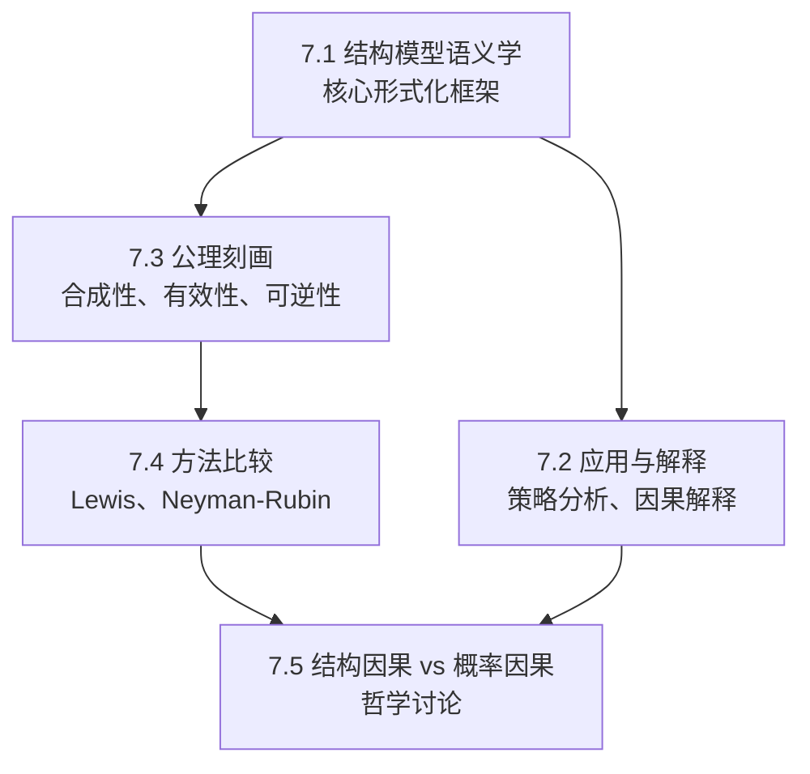
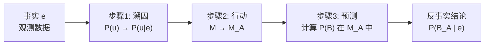
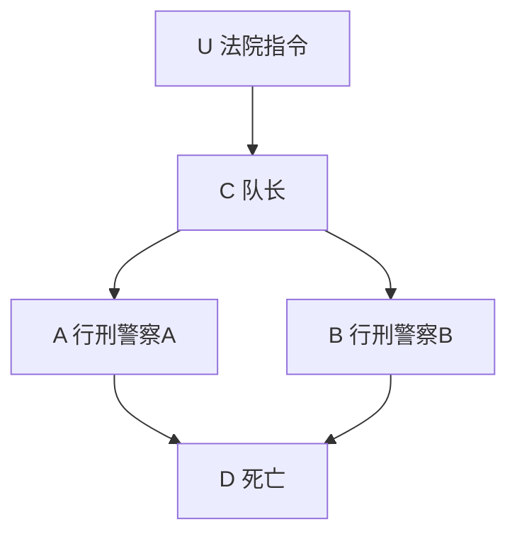
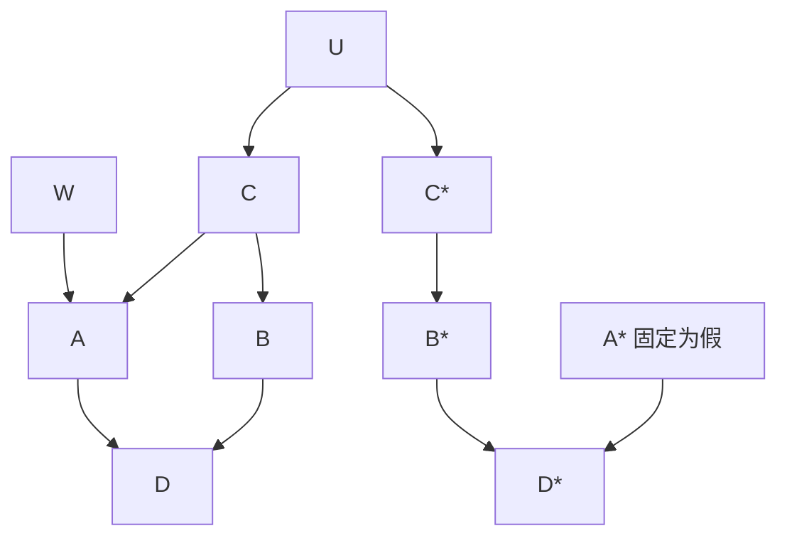
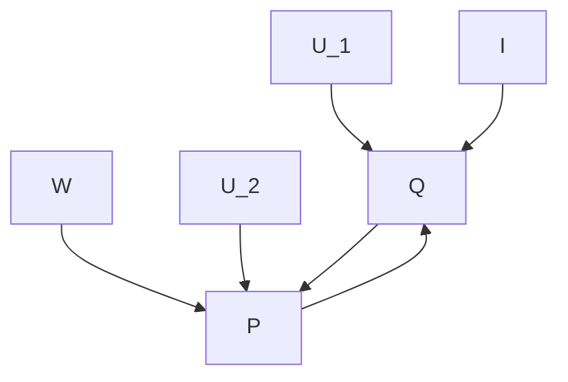
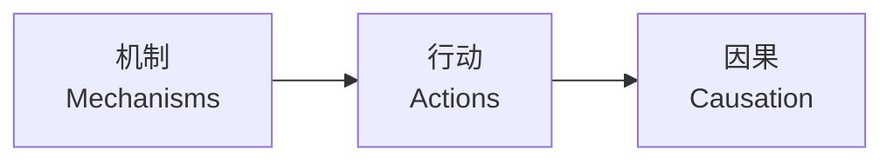
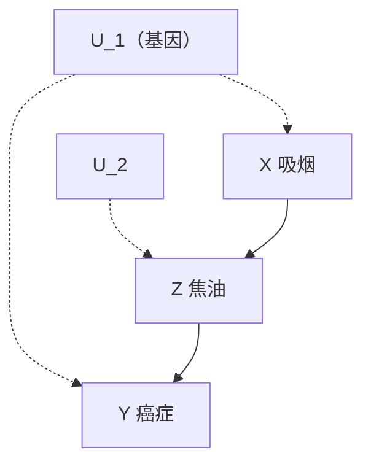
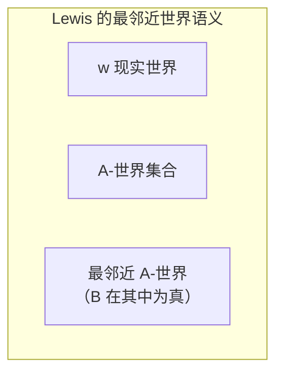

# 第 7 章 结构化反事实的逻辑 —— 系统学习与参考材料

---

## 一、本章概览与核心主题

本章对 **结构化反事实** （structure-based counterfactuals）进行了全面、深入的形式化分析，为前几章中引入的因果模型、行动、因果效应、因果关联、误差项和外生性等概念赋予严谨的数学定义。本章的核心思想是： **反事实推断虽为科学思想的基石，但无法用标准代数（方程代数、布尔代数、概率演算）来形式化，必须借助结构模型语义来区分"恒常关系"（世界的规律）与"短暂关系"（信念的变化）。**

---

## 二、7.1 结构模型语义学

### 2.1 基本定义体系

#### 定义 7.1.1（因果模型 Causal Model）

因果模型是一个三元组：

$$ M = \langle U, V, F \rangle $$

其中：

| 成分                            | 含义                   | 说明                                                         |
| ------------------------------- | ---------------------- | ------------------------------------------------------------ |
| $U$                             | 背景变量集（外生变量） | 由模型外部因素决定，通常不可观测                             |
| $V = \{V_1, V_2, \ldots, V_n\}$ | 内生变量集             | 由模型内部变量 $(U \cup V)$ 决定                             |
| $F = \{f_1, f_2, \ldots, f_n\}$ | 函数集合               | 每个 $f_i: U_i \cup PA_i \to V_i$ ，形成从 $U$ 到 $V$ 的映射 |

每个内生变量由如下 **结构方程** 决定：

$$ v_i = f_i(pa_i, u_i), \quad i = 1, \dots, n $$

其中 $PA_i \subseteq V \setminus V_i$ ， $U_i \subseteq U$ ，全集 $F$ 具有唯一解 $V(u)$ 。

> **关键洞察** ：每个方程 $f_i$ 代表一种 **自治机制** （autonomous mechanism）——一个独立于其他机制的物理过程。因果关系和反事实关系都依据这些机制对 **局部修改** 的反应来定义。

每个因果模型 $M$ 关联一个有向图 $G(M)$ ，节点对应变量，有向边从 $PA_i$ 和 $U_i$ 指向 $V_i$ 。 $G(M)$ 仅识别直接影响关系，不指定 $f_i$ 的函数形式。

---

#### 定义 7.1.2（子模型 Submodel）

$$ M_x = \langle U, V, F_x \rangle $$

其中：

$$ F_x = \{f_i : V_i \notin X\} \cup \{X = x\} \tag{7.1} $$

**解释** ：子模型通过 **删除** $F$ 中与 $X$ 中变量对应的函数 $f_i$ ，并用常数函数 $X = x$ 替代，来模拟外部干预 $do(X = x)$ 。这是对原始模型 $M$ 的 **最小修改** 。

> **核心思想** ： $M_x$ 与 $M$ 的区别 **仅在于** 直接确定了指向 $X$ 的那些机制。这种构造被称为"可修改的结构方程"（modifiable structural equations）。

---

#### 定义 7.1.3（行动效应 Effect of Action）

子模型 $M_x$ 定义了行动 $do(X = x)$ 对 $M$ 的效应。行动被形式化地理解为：从原始模型 $M$ 到干预后的子模型 $M_x$ 的 **转换** 。

---

#### 定义 7.1.4（潜在响应 Potential Response）

$Y$ 对行动 $do(X = x)$ 的潜在响应 $Y_x(u)$ 是方程组 $F_x$ 中 $Y$ 的解：

$$ Y*x(u) = Y*{M_x}(u) $$

> **说明** ：如果 $Y = (Y_1, Y_2, \ldots)$ 是一组变量，则 $Y_x(u)$ 代表一组函数向量 $(Y_{1x}(u), Y_{2x}(u), \ldots)$ 。

---

#### 定义 7.1.5（反事实 Counterfactual）

反事实语句"在条件 $u$ 下，如若 $X$ 为 $x$ ，则 $Y$ 为 $y$ "记为：

$$ Y_x(u) = y $$

> **本质** ：这一定义将反事实解释为对模型中方程的 **假设性修改** ——模拟一种外部行动（或自发变化），以最小的机制变化强制执行条件" $X = x$ "。这是结构反事实语义学的 **关键创新** ——它允许 $x$ 与 $X(u)$ 的实际值不同而不产生逻辑矛盾，同时避免了从反事实前提进行的回溯推断。

---

#### 定义 7.1.6（概率因果模型 Probabilistic Causal Model）

$$ \langle M, P(u) \rangle $$

其中 $M$ 是因果模型， $P(u)$ 是定义在 $U$ 上的概率函数。

内生变量的概率分布：

$$ P(y) \triangleq P(Y = y) = \sum\_{\{u | Y(u) = y\}} P(u) \tag{7.2} $$

反事实概率：

$$ P(Y*x = y) = \sum*{\{u | Y_x(u) = y\}} P(u) \tag{7.3} $$

**联合反事实分布** ：

$$ P(Y*x = y, X = x') = \sum*{\{u | Y_x(u) = y \,\&\, X(u) = x'\}} P(u) \tag{7.4} $$

$$ P(Y*x = y, Y*{x'} = y') = \sum*{\{u | Y_x(u) = y \,\&\, Y*{x'}(u) = y'\}} P(u) \tag{7.5} $$

> **重要说明** ：即使 $x$ 和 $x'$ 不相容（无法同时成立）， $Y_x$ 和 $Y_{x'}$ 仍在 $U$ 的概率空间上被定义为正常的联合事件。这克服了 Dawid (2000) 的反对意见。

条件反事实概率：

$$ P(Y*{x'} = y' | X = x, Y = y) = \frac{P(Y*{x'} = y', X = x, Y = y)}{P(X = x, Y = y)} = \sum*u P(Y*{x'}(u) = y') P(u | x, y) \tag{7.6} $$

---

### 2.2 定理 7.1.7（反事实评估的三步法）

已知模型 $\langle M, P(u) \rangle$ 和事实 $e$ ，评估反事实 $P(B_A | e)$ 的三个步骤：

1.  **溯因（Abduction）** ：利用事实 $e$ 更新 $P(u)$ 得到 $P(u|e)$
2.  **行动（Action）** ：通过 $do(A)$ 修改 $M$ ，获得子模型 $M_A$
3.  **预测（Prediction）** ：在修改后的模型 $\langle M_A, P(u|e) \rangle$ 中计算 $B$ 的概率

---

#### 定义 7.1.8（因果世界和因果理论）

- **因果世界** $w = \langle M, u \rangle$ ：因果模型 $M$ + 背景变量 $U$ 的具体赋值 $u$
- **因果理论** ：一组因果世界的集合

**解释** ：因果世界可视为 $P(u) = 1$ 的退化概率模型。因果理论用于描述因果模型的 **部分规范** （如同一因果图下的一组模型）。

---

### 2.3 确定性分析实例：两人行刑组

模型 $M$ 如下（参见图 7.1）：

方程：

$$ C = U, \quad A = C, \quad B = C, \quad D = A \vee B $$

五种语句类型的评估：

| 类型      | 语句                                     | 评估方式                                                |
| --------- | ---------------------------------------- | ------------------------------------------------------- |
| S1 预测   | $\neg A \Rightarrow \neg D$              | 标准逻辑推理                                            |
| S2 溯因   | $\neg D \Rightarrow \neg C$              | 标准逻辑推理                                            |
| S3 延导   | $A \Rightarrow B$                        | 标准逻辑推理                                            |
| S4 行动   | $\neg C \Rightarrow D_A \,\&\, \neg B_A$ | 形成子模型 $M_A$ ，替换方程 $A = C$ 为 $A$              |
| S5 反事实 | $D \Rightarrow D_{\neg A}$               | 三步法：溯因确定 $U$ ，行动形成 $M_{\neg A}$ ，预测 $D$ |

> **关键区别（S4 vs S5）** ：S4 的已知事实（ $\neg C$ ）不受前提（ $A$ ）影响，可直接添加到修改后的模型；S5 的已知事实（ $D$ ）可能受前提（ $\neg A$ ）影响，需先通过 $U$ 传递事实影响再评估。 **反事实需要通过背景变量 $U$ 来传递已知事实的影响，这使它本质上不同于行动语句。**

---

### 2.4 概率分析实例：行刑组（扩展）

引入随机因素： $U$ （法院命令）以概率 $p$ 成立， $W$ （警察 A 紧张）以概率 $q$ 成立，且 $U \perp W$ 。

模型 $\langle M, P(u, w) \rangle$ ：

$$ C = U, \quad A = C \vee W, \quad B = C, \quad D = A \vee B $$

计算 $P(\neg D_{\neg A} | D)$ ：

1.  **溯因** ： $P(u, w | D)$ —— 更新背景分布
2.  **行动** ：形成 $M_{\neg A}$
3.  **预测** ： $P(\neg D_{\neg A} | D) = \frac{q(1-p)}{1 - (1-q)(1-p)}$

---

### 2.5 孪生网络法（Twin Network Method）

**核心思想** （Balke & Pearl, 1994b）：用两个结构相同的网络表示反事实推理，一个代表 **现实世界** ，一个代表 **假设世界** ，两者共享背景变量 $U$ 。

**优势** ：

- 不需要显式说明 $P(u|z)$ 的完整分布
- 可利用条件独立性和局部计算方法
- 将反事实概率简化为增强贝叶斯网络中的条件概率 $P(y^* | z)$
- 可用于检验反事实变量间的独立性（通过 $d$ -分离准则）

  **重要发现** ：形式为 $Z_{pa_Z}$ 的反事实变量可用误差项 $U_Z$ 作为 **单向代理变量** ，因为 $Z$ 在给定其父节点后仅随 $U_Z$ 变化。

---

## 三、7.2 结构模型的应用与解释

### 3.1 线性经济计量模型策略分析（7.2.1）

供需均衡模型（图 7.4）：

方程：

$$ q = b_1 p + d_1 i + u_1 \tag{7.9} $$
$$ p = b_2 q + d_2 w + u_2 \tag{7.10} $$

三个层次的问题：

| 问题                                                 | 类型       | 数学表达                                                                |
| ---------------------------------------------------- | ---------- | ----------------------------------------------------------------------- |
| 问题一：价格被 **控制** 在 $p_0$ ，需求期望？        | **行动**   | $E[Q \mid do(P = p_0), i] = E(Q) + b_1(p_0 - E(P)) + d_1(i - E(I))$     |
| 问题二：价格被 **报告** 为 $p_0$ ，需求期望？        | **预测**   | $E(Q \mid p_0, i, w)$ （标准协方差计算）                                |
| 问题三：已知当前 $P = p_0$ ，如若控制为 $P = p_1$ ？ | **反事实** | $E(Q_{p=p_1} \mid p_0, i, w) = b_1 p_1 + d_1 i + E(U_1 \mid p_0, i, w)$ |

> **核心区别** ：问题二的 $E(U_1 \mid p_0, i, w)$ 涉及两个方程；问题一的 $E(U_1 \mid i)$ 仅涉及需求方程；问题三需要以观测数据为条件的溯因步骤。

---

### 3.2 反事实的实证性内容（7.2.2）

以欧姆定律 $V = IR$ 为例说明反事实的两种形式：

- **预测形式** ：若在 $t_0$ 测得 $(I_0, V_0)$ ，则在 $t > t_0$ 若 $I(t)$ 已知， $V(t) = \frac{V_0}{I_0} I(t)$
- **反事实形式** ：若在 $t_0$ 测得 $(I_0, V_0)$ ，则如若电流为 $I'$ ，电压将为 $V' = \frac{V_0 I'}{I_0}$

**关键论点** ：反事实语句是 **在一系列明确定义条件下做出的预测** 。其有效性依赖于两种不变性：

1.  **定律（机制）的不变性** ：方程 $\{f_i\}$ 保持稳定
2.  **边界条件的不变性** ：背景变量 $U$ 的状态不变

> **反事实的内在不确定性** ：当 $U$ 无法被充分精确测量以消除所有不确定性时（如量子级现象），需保留可被认可为（1）保持不变的或（2）潜在可观测的 $U$ 变量。

---

### 3.3 因果解释、表达及其理解（7.2.3）

**核心观点** ：解释的概念不能脱离因果的概念。结构模型方法为机器自动生成解释提供了新的可能性。

在可修改结构模型中定义的因果语句类型：

| 语句                                    | 定义                                                                          |
| --------------------------------------- | ----------------------------------------------------------------------------- |
| " $X$ 是 $Y$ 的原因"                    | $\exists x, x', u: Y_x(u) \neq Y_{x'}(u)$                                     |
| " $X$ 是 $Y$ 的 **直接** 原因"          | $\exists x, x', u: Y_{xr}(u) \neq Y_{x'r}(u)$ （ $r$ 为其他所有变量的赋值）   |
| " $X = x$ **总会** 导致 $Y = y$ "       | (i) $\forall u: Y_x(u) = y$ ；(ii) $\exists u', x' \neq x: Y_{x'}(u') \neq y$ |
| " $X = x$ **可能** 导致 $Y = y$ "       | (i) $X = x, Y = y$ 为真；(ii) $\exists u, x' \neq x: Y_{x'}(u) \neq y$        |
| "尽管 $X = x$ ， $Y = y$ **仍会发生** " | (i) $X = x, Y = y$ 为真；(ii) $P(Y_x = y)$ 较低                               |

> **一般因果 vs 特例因果** ： $P(y | do(x))$ 属于一般因果； $P(Y_{x'} = y' | x, y)$ 属于特例因果。二者的区别涉及证据 $e$ 的特异性程度。

---

### 3.4 从机制到行动再到因果（7.2.4）

**三个层次的递进关系** ：

1.  **机制 → 行动** ：结构模型假设行动表述为 **局部手术** （local surgery）——世界由大量自治、不变的机制组成，每个机制约束少数变量。行动只需重新指定那些被干扰的机制，其余保持不变。

2.  **定律与事实的区分** ：描述机制的语句（定律/方程）应区别于描述其他事实的语句（观测/假设），前者稳定不变，后者暂时可变。这种区别是从逻辑方法过渡到因果分析的最关键一步。

3.  **行动 → 因果** ：如果实现事件 $A$ 所需的扰动导致事件 $B$ 的实现，则" $A$ 导致 $B$ "。因果缩略语使领域知识的描述极其高效，无须显式说明全部机制。

---

### 3.5 Simon 因果顺序（7.2.5）

**Simon (1953) 的核心问题** ：何时可以仅从一组对称方程中确定因果方向性？

**操作化定义** ：如果独立修改每个机制（方程 $G_k$ ）所产生的所有变化都可归因于某个变量 $X_k$ 的变化，则 $X_k$ 可被指定为该机制的"因变量"。这一定义将行动 $do(X_k = x_k)$ 的概念建立在形式化基础上。

**因果方向性的两个来源** ：

1. 变量划分为背景变量 $U$ 和内生变量 $V$
2. 模型中机制的整体配置

> **重要结论** ：因果关系的发现与常见物理定律的发现没有本质不同。 **因果归纳** 这一哲学难题可约简为更熟悉的 **科学归纳问题** 。

**反馈回路的处理** ：当方程组需要同时求解时（如供需模型），因果方向性需要借助外部信息（如"家庭收入直接影响需求而非价格"的理解）或干预概念来确定。

---

## 四、7.3 公理刻画

### 4.1 结构反事实的三大公理（7.3.1）

#### 性质 1：合成性（Composition）

$$ W*x(u) = w \Rightarrow Y*{xw}(u) = Y_x(u) \tag{7.19} $$

**解释** ：如果强制将 $W$ 设置为 $w$ 与不干预时的值相同，则该干预不会对系统产生额外影响。这允许删除冗余的下标。

#### 推论 7.3.2：一致性（Consistency）

$$ X(u) = x \Rightarrow Y(u) = Y_x(u) \tag{7.20} $$

**证明** ：在式（7.19）中用 $X$ 代替 $W$ ，用 $\varnothing$ 代替 $X$ ，由空行动定义即得。

#### 性质 2：有效性（Effectiveness）

$$ X\_{xw}(u) = x $$

**解释** ：干预本身必须有效——如果强制将 $X$ 设为 $x$ ，则 $X$ 的值必然为 $x$ 。

#### 性质 3：可逆性（Reversibility）

$$ (Y*{xw}(u) = y) \,\&\, (W*{xy}(u) = w) \Rightarrow Y_x(u) = y \tag{7.21} $$

**解释** ：防止反馈回路产生的多重结果，反映系统的"无记忆"行为——系统状态仅取决于 $U$ 的当前状态，而非其历史。

> **注意** ：在递归系统中，可逆性可直接从合成性推出（成为平凡的）。

---

#### 定理 7.3.3（可靠性 Soundness）

合成性、有效性和可逆性在 **所有因果模型** 中均成立。

#### 定理 7.3.5（递归完备性 Recursive Completeness）

在递归系统中，合成性和有效性是完备的——任何反事实语句的所有真命题都可以仅从这两个公理推导。

#### 定理 7.3.6（一般完备性）

对于所有因果模型（包括非递归的），合成性、有效性和可逆性是完备的（Halpern, 1998）。

> **可靠性与完备性的重要性** ：可靠性保证——若用三个公理将反事实量 $Q$ 简化为普通概率表达式，则 $Q$ 可识别；完备性保证——若不能如此简化，则 $Q$ 不可识别。

---

**补充性质** ：

| 性质                 | 公式                                               |
| -------------------- | -------------------------------------------------- |
| 存在性（Existence）  | $\exists x \in X: X_y(u) = x$                      |
| 唯一性（Uniqueness） | $X_y(u) = x \,\&\, X_y(u) = x' \Rightarrow x = x'$ |

#### 定义 7.3.4（递归性 Recursiveness）

$X \to Y$ 表示 $\exists x, w, u: Y_{xw}(u) \neq Y_w(u)$ 。模型 $M$ 是递归的当且仅当其对应的因果图 $G(M)$ 是无环图（DAG）。

---

### 4.2 公理化推导因果效应：吸烟-癌症示例（7.3.2）

模型假设：

- $X = f_1(u_1)$
- $Z = f_2(x, u_2)$
- $Y = f_3(z, u_1)$
- $U_1 \perp U_2$

**图模型 → 反事实转换规则** ：

> **规则 1（排斥性约束）** ： $Y_{pa_Y}(u)=Y_{pa_Y,z}(u)$ —— 一旦直接原因固定， $Y$ 对其他操作不敏感
>
> **规则 2（独立性约束）** ：若 $Z_i$ 不能仅通过 $U$ 变量与 $Y$ 连通，则 $Y_{pa_Y} \perp \{Z_{1pa_{Z_1}}, \ldots, Z_{kpa_{Z_k}}\}$

由此得到四个关键假设：

$$ Z*x(u) = Z*{yx}(u) \tag{7.27} $$
$$ X*y(u) = X*{zy}(u) = X*z(u) = X(u) \tag{7.28} $$
$$ Y_z(u) = Y*{zx}(u) \tag{7.29} $$
$$ Z_x \perp \{Y_z, X\} \tag{7.30} $$

**推导过程** （仅使用合成性和有效性）：

- **任务 1** ： $P(Z_x = z) = P(z | x)$
- **任务 2** ： $P(Y_z = y) = \sum_x P(y | x, z) P(x)$
- **任务 3** （前门公式）：

$$ P(Y*x = y) = \sum_z P(z | x) \sum*{x'} P(y | z, x') P(x') \tag{7.37} $$

---

### 4.3 因果相关性公理（7.3.3）

#### 定义 7.3.7（因果无关性 Causal Irrelevance）

在 $Z$ 条件下 $X$ 与 $Y$ 因果无关，记为 $X \nrightarrow Y | Z$ ，当且仅当：

$$ \forall (u, z, x, x', w), \quad Y*{xzw}(u) = Y*{x'zw}(u) \tag{7.38} $$

即：在任何背景 $u$ 下、任何额外干预 $W = w$ 下，改变 $X$ 都不会影响 $Y$ 。

#### 定理 7.3.8（因果相关性公理集合）

| 公理         | 公式                                                                                                  |
| ------------ | ----------------------------------------------------------------------------------------------------- |
| **弱右分解** | $(X \nrightarrow YW \mid Z) \,\&\, (X \nrightarrow Y \mid ZW) \Rightarrow (X \nrightarrow Y \mid Z)$  |
| **左分解**   | $(XW \nrightarrow Y \mid Z) \Rightarrow (X \nrightarrow Y \mid Z) \,\&\, (W \nrightarrow Y \mid Z)$   |
| **强联合**   | $(X \nrightarrow Y \mid Z) \Rightarrow (X \nrightarrow Y \mid ZW), \forall W$                         |
| **右相交**   | $(X \nrightarrow Y \mid ZW) \,\&\, (X \nrightarrow W \mid ZY) \Rightarrow (X \nrightarrow YW \mid Z)$ |
| **左相交**   | $(X \nrightarrow Y \mid ZW) \,\&\, (W \nrightarrow Y \mid ZX) \Rightarrow (XW \nrightarrow Y \mid Z)$ |

> **与图胚（graphoid）公理的对比** ：因果相关性公理与信息相关性公理类似，但 **缺少传递性** 。因果相关确实不可传递——即使 $X$ 能改变 $W$ 、 $W$ 能改变 $Y$ ， $X$ 也可能无法改变 $Y$ （如图 7.6 所示）。

**因果传递性的条件** ：当 $X$ 对 $Z$ 无直接效应时（ $Z_{y'x'} = Z_{y'}$ ），二元因果传递性 $x \to y \,\&\, y \to z \Rightarrow x \to z$ 成立。

---

## 五、7.4 基于结构化和相似性的反事实

### 5.1 与 Lewis 反事实的关系（7.4.1）

**Lewis 的最邻近世界语义** ：反事实 $A \square\to B$ 在 $w$ 中为真，当且仅当在所有最邻近 $w$ 的 $A$ -世界中 $B$ 都为真。

**结构化方法 vs Lewis 方法** ：

| 维度       | Lewis 方法                         | 结构化方法                        |
| ---------- | ---------------------------------- | --------------------------------- |
| 基础       | 世界间抽象相似性                   | 机制及其不变属性                  |
| "奇迹"     | 需要复杂的权重和优先级系统         | 被 $do(X = x)$ 的最小手术方法替代 |
| 相似性度量 | 不能随心所欲，必须遵循因果法则     | 因果法则内置于机制修改中          |
| 循环性     | 将原因归结为反事实，有循环论证之嫌 | 直接基于机制和干预                |

---

### 5.2 公理系统的比较（7.4.2）

Lewis 的六个公理：

| 公理 | 内容                                                                                    | 结构对应                   |
| ---- | --------------------------------------------------------------------------------------- | -------------------------- |
| (1)  | 所有重言式                                                                              | 总是成立                   |
| (2)  | $A \square\to A$                                                                        | **有效性** ： $X_x(u) = x$ |
| (3)  | $(A\square\to B) \& (B\square\to A) \Rightarrow (A\square\to C) \equiv (B\square\to C)$ | 可逆性的较弱形式           |
| (4)  | 析取公理                                                                                | 不相关（结构模型限于合取） |
| (5)  | $A\square\to B \Rightarrow A \Rightarrow B$                                             | 来自 **合成性**            |
| (6)  | $A \& B \Rightarrow A\square\to B$                                                      | 来自 **合成性**            |

**翻译映射** ：

$$ A \square\to B \equiv Y*{1*{x*1,\ldots,x_n}}(u) = y_1 \,\&\, \cdots \,\&\, Y*{m\_{x_1,\ldots,x_n}}(u) = y_m \tag{7.41} $$

**核心结论** ：对于 **递归模型** ，结构因果模型框架除了 Lewis 框架的限制外，不对反事实语句施加额外约束。即，递归性假设已经包含了结构语义所施加的所有其他限制。但在 **非递归系统** 中，Lewis 框架未强制可逆性。

---

### 5.3 成像与条件（7.4.3）

**成像（Imaging）vs 贝叶斯条件化** ：

- **条件化** $P(s | e)$ ：将排除状态的质量按比例转移到剩余状态
- **成像** ：每个排除状态 $s$ 分别将其质量转移到一组"最邻近"状态 $S^*(s)$

**Gärdenfors 表示定理** ：概率更新 $P(s) \to P_A(s)$ 是成像算子，当且仅当满足 **幺组合可交换性** （同态）：

$$ [\alpha P(s) + (1-\alpha) P'(s)]\_A = \alpha P_A(s) + (1-\alpha) P'\_A(s) \tag{7.43} $$

这意味着：

$$ P*A(s) = \sum*{s'} P_A(s | s') P(s') \tag{7.44} $$

> **局限性** ：尽管成像允许用转换概率描述行动，但它过于宽泛，忽略了行动是 **局部手术** 这一关键信息。

---

### 5.4 与 Neyman-Rubin 框架的关系（7.4.4）

**形式化等价性** ：结构方程模型为潜在结果框架提供了其所缺乏的 **形式化语义** 。每个结构方程模型为反事实变量 $Y_x(u)$ 指定了一致的真值，但 $Y_x(u)$ 在结构方法中不是基本变量，而是从方程 $F$ 数学推导出的。

**关键差异** ：

| 维度            | 潜在结果框架               | 结构方程框架           |
| --------------- | -------------------------- | ---------------------- |
| $Y_x(u)$ 的性质 | 原始（不可推导的）变量     | 从方程推导的变量       |
| 模型语义        | 无                         | 有（公理化）           |
| 假设表达        | 需用反事实变量表示条件独立 | 用图模型和方程直接表达 |
| 完备性          | 无保证                     | 定理 7.3.6 保证        |

**图分析的优势** ：结构方程及其图模型直接反映机制间的相互关系，作为表达因果假设的 **语言** ，其假设在数据采集前就已确定，对模型参数值不敏感（具有稳定性）。

---

### 5.5 外生性和工具变量的三重定义（7.4.5）

#### 三级层次结构：

$$ \text{图模型准则} \rightarrow \text{基于误差项的准则} \rightarrow \text{反事实准则} $$

（图分离 ⇒ 独立性，但反向不成立； $U_X \perp U_Y \Rightarrow X_{pa_X} \perp Y_{pa_Y}$ ，但反向不成立）

#### 外生性（Exogeneity）的三种定义：

| 层级           | 定义                                                      |
| -------------- | --------------------------------------------------------- |
| **反事实准则** | $P(Y_x = y) = P(y \mid x)$ ，即"弱可忽略性" $Y_x \perp X$ |
| **误差项准则** | $X$ 独立于所有不经 $X$ 而影响 $Y$ 的误差项                |
| **图准则**     | $X$ 和 $Y$ 在 $G(M)$ 中无共同祖代（后门路径被阻断）       |

#### 定义 7.4.1（工具变量 Instrumental Variable）

变量 $Z$ 是相对于 $X$ 对 $Y$ 总效应的工具变量，若存在一组不受 $X$ 影响的测量值 $S = s$ ，满足：

- **反事实准则** ：(i) $Z \perp Y_x \mid S = s$ ；(ii) $Z \not\perp X \mid S = s$
- **图准则** ：(i) $(Z \perp Y \mid S)_{G_{\bar{X}}}$ ；(ii) $(Z \not\perp X \mid S)_G$

---

## 六、7.5 结构因果与概率因果

### 6.1 概率因果的初衷与困境

概率因果试图仅用概率关系定义因果关系，源于三个期望：

1. 从纯经验观察中发现因果关系（Hume 传统）
2. 提供宏观层面的认知结构（无需详述物理状态）
3. 处理量子理论中的不确定性

**然而现状令人失望** （Salmon 最终完全放弃）。

---

### 6.2 对时序的依赖性（7.5.1）

概率因果必须依赖时间顺序来打破对称性。但代价是：

- 无法处理时间重叠或瞬时因果关系
- 无法区分"旗杆高导致阴影长"与"阴影长导致旗杆高"
- 需要额外的稳定性/极小性假设

> 结构方法通过不变性和自治性假设（而非时间顺序）来确定因果方向。

---

### 6.3 死循环风险（7.5.2）

#### 定义 7.5.1（概率因果相关）

若存在背景变量 $K$ 中的条件 $F$ 使得 $P(E | C, F) > P(E | \neg C, F)$ ，则 $C$ 对 $E$ 因果相关。

**死循环** ：为确定 $C$ 对 $E$ 的因果作用，必须首先确定每个背景变量 $F$ 对 $C$ 和 $E$ 的因果作用——这正是我们要确定的！

**时间顺序也不够** ：即使在 $C$ 之前的所有因素，也需要判断哪些是合理的背景变量。这导致概率因果的目标从"发现因果"蜕变为"一致性检验"。

---

### 6.4 封闭世界假定与儿童学习（7.5.3）

概率因果依赖的封闭世界假定（所有相关变量已知）与儿童实际学习因果知识的方式形成对比：

- 儿童拥有两个统计学家无法获得的信息来源： **操控实验** 和 **语言指导**
- 操控通过使对象服从自己的意志来确保独立性
- 语言指导（定性因果语句）记录了前人的操控经验
- 结构因果方法直接建立在通过语言获得和传播的定性知识之上

---

### 6.5 特例因果与一般因果（7.5.4）

**概率因果的根本困境** ：通常当 $P(y | x) < P(y | x')$ 时，我们仍将 $x$ 判定为 $y$ 的原因（如疫苗导致特定个体患病）。

概率论者的应对：寻找子群 $z$ 使得 $P(y | x, z) > P(y | x', z)$ 。

**问题** ：

1. 子群定义（如"易感性"）本质上是反事实的
2. 细分子群的过程偷偷将决定论和反事实信息带回分析
3. 条件化排除了 $x$ 和 $y$ （因语法不得已），造成逻辑矛盾

**结构方法的解决** ：通过 $P(Y_{x'} = y' | x, y)$ 的三个步骤（溯因、行动、预测），可直接评估特例因果而不需显式找出子群。

---

### 6.6 总结（7.5.5）

结构方法在以下方面全面超越了概率方法：

- 因果效应 $P(y | do(x))$ 有完整的操作性定义（后门准则等）
- 特例因果关系通过 $P(Y_x \neq y | x, y)$ 有形式化语义和有效评估方法
- "可检验的事件"的梦想已在结构化反事实框架中实现

  **最终论断** ：模拟拉普拉斯和爱因斯坦"准确定性宏观近似"的机器人，性能将远胜于模拟 Born、Heisenberg 和 Bohr"正确但有违直觉理论"的机器人。

---

## 七、关键定义与定理汇总表

| 编号       | 名称         | 核心内容                                                |
| ---------- | ------------ | ------------------------------------------------------- |
| 定义 7.1.1 | 因果模型     | $M = \langle U, V, F \rangle$ ， $v_i = f_i(pa_i, u_i)$ |
| 定义 7.1.2 | 子模型       | $M_x$ ：删除 $X$ 对应的 $f_i$ 并替换为 $X = x$          |
| 定义 7.1.4 | 潜在响应     | $Y_x(u) = Y_{M_x}(u)$                                   |
| 定义 7.1.5 | 反事实       | $Y_x(u) = y$                                            |
| 定义 7.1.6 | 概率因果模型 | $\langle M, P(u) \rangle$                               |
| 定理 7.1.7 | 三步评估法   | 溯因 → 行动 → 预测                                      |
| 定义 7.1.8 | 因果世界     | $w = \langle M, u \rangle$                              |
| 性质 1     | 合成性       | $W_x(u) = w \Rightarrow Y_{xw}(u) = Y_x(u)$             |
| 性质 2     | 有效性       | $X_{xw}(u) = x$                                         |
| 性质 3     | 可逆性       | $(Y_{xw}=y) \& (W_{xy}=w) \Rightarrow Y_x=y$            |
| 定理 7.3.3 | 可靠性       | 三性质在所有因果模型中成立                              |
| 定理 7.3.5 | 递归完备性   | 合成性 + 有效性 + 递归性 → 完备                         |
| 定理 7.3.6 | 一般完备性   | 合成性 + 有效性 + 可逆性 → 完备                         |
| 定义 7.3.7 | 因果无关性   | $\forall u, x, x', w: Y_{xzw}(u) = Y_{x'zw}(u)$         |
| 定义 7.4.1 | 工具变量     | 图准则/反事实准则的双重定义                             |

---

## 八、核心思想总结

1.  **结构模型的本质优势** ：通过显式表示机制（方程）来区分恒常关系和短暂关系，使反事实推断可形式化。

2.  **干预 = 最小手术** ： $do(X = x)$ 操作是对因果模型的最小修改——仅删除指向 $X$ 的方程，其余机制保持不变。

3.  **背景变量 $U$ 的核心角色** ： $U$ 是现实世界到假设世界的主要信息载体，充当"不变性的守护者"。

4.  **公理化方法的威力** ：仅需合成性、有效性和可逆性三个公理即可完全刻画所有因果模型中的反事实推理。

5.  **结构方法 vs 概率方法** ：结构方法直接基于自然不变性定义因果关系，避免了概率方法中的死循环、时间依赖、封闭世界假定等困境。

6.  **图模型作为因果语言** ：因果图不仅能表达假设，还能通过 $d$ -分离和孪生网络等方法辅助推导，这是纯代数方法难以企及的。
