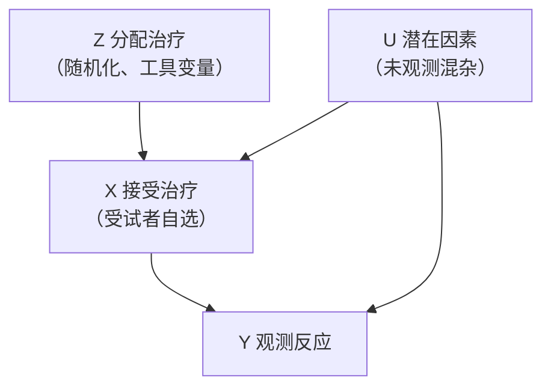
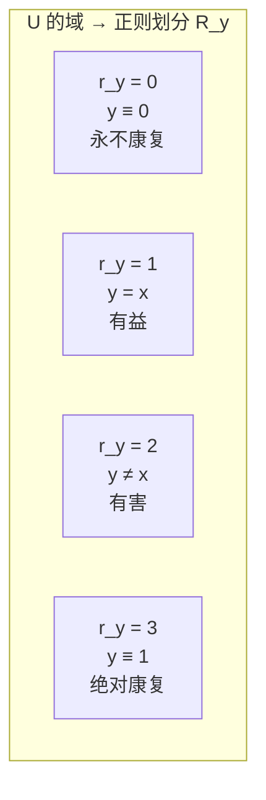
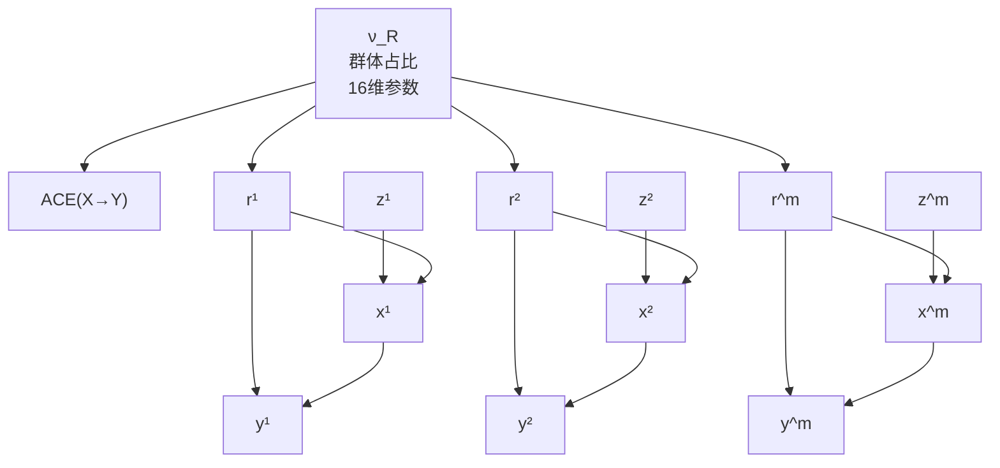
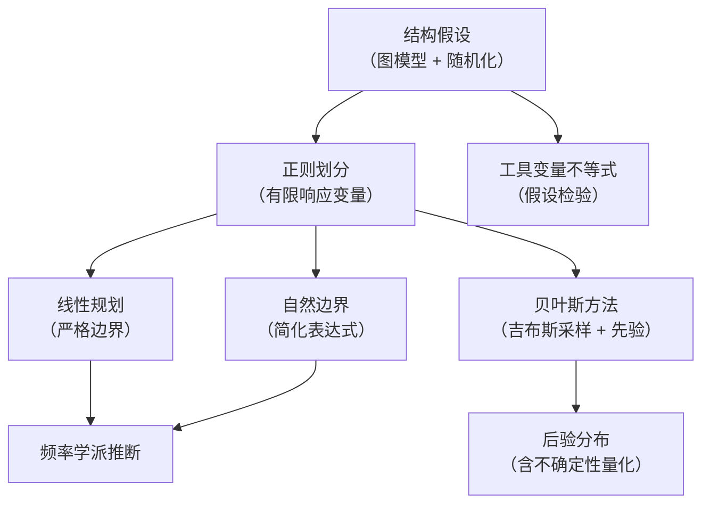

# 第8章 不完美实验：边界效应和反事实 —— 系统学习与参考材料

---

## 一、章节概览

本章研究当随机实验 **偏离理想条件** （尤其是不完全依从性）时，如何借助 **图模型** 与 **反事实模型** ，从数据中提取因果信息。核心思想是：当因果效应无法精确识别时，可以通过 **边界分析** 给出目标量的可能范围，且该范围不随样本量增大而收缩。本章建立了从 **线性规划** 到 **贝叶斯方法** 的完整分析框架。

**核心问题：** 在受试者对治疗方案有自主选择权（不完全依从）的间接实验中，如何推断治疗的因果效应？

> **图 8.1** 不完全依从试验的因果图。Z 是工具变量，U 影响 X 和 Y。

---

## 二、8.1 引言

### 2.1 不完美与间接实验

在理想随机对照试验（RCT）中，受试者被随机分配到治疗组或对照组，组间平均差异即为治疗效果。但现实中存在三类问题：

| 问题                 | 描述                                             |
| -------------------- | ------------------------------------------------ |
| **不完全依从性**     | 受试者可能自行减少剂量、从其他渠道获取治疗药物等 |
| **伦理困境**         | 拒绝给对照组分配可能挽救生命的治疗有违道德       |
| **随机化本身的影响** | 随机化可能改变受试者的参与方式和行为模式         |

在 **间接实验** 中，随机化仅作为 **鼓励或劝阻** 的工具（例如：随机发放奖学金资格通知、医生建议的剂量水平），受试者最终自行选择是否接受治疗。

### 2.2 不依从性与治疗意愿（Intention-to-Treat, ITT）

**定义（治疗意愿分析）：** 按原始随机分组进行比较， **不考虑受试者是否真的接受了治疗** 。即比较 $P(y_1 \mid z_1)$ 与 $P(y_1 \mid z_0)$ 。

**局限性：**

- ITT 度量的是 **分配方案** 对结果的影响，而非 **治疗本身** 的因果效应。
- 若实验中拒绝治疗的受试者恰好是会产生不良反应的群体，ITT 会错误地将"避免治疗而康复"归因于药物效果。

  **工具变量修正公式（Angrist et al., 1996）：**

$$ \text{修正效果} = \frac{P(y_1 \mid z_1) - P(y_1 \mid z_0)}{P(x_1 \mid z_1) - P(x_1 \mid z_0)} $$

但此修正仅对"依从者"亚群体有效，且该亚群体不可识别并依赖于具体的工具变量。

---

## 三、8.2 利用工具变量界定因果效应的范围

### 3.1 问题的形式化表述

设 $Z, X, Y$ 均为二值变量：

| 变量 | 取值       | 含义                                      |
| ---- | ---------- | ----------------------------------------- |
| $Z$  | $z_0, z_1$ | $z_1=$ 分配治疗， $z_0=$ 未分配           |
| $X$  | $x_0, x_1$ | $x_1=$ 实际接受治疗， $x_0=$ 未接受       |
| $Y$  | $y_0, y_1$ | $y_1=$ 阳性反应（好转）， $y_0=$ 阴性反应 |

**两个关键假设：**

1.  **无直接效应：** $Z$ 不直接影响 $Y$ （可通过安慰剂校正），即 $Z \perp\!\!\!\perp Y \mid X, U$ 。
2.  **随机化：** $Z \perp\!\!\!\perp U$ （由随机分配保证）。

联合分布分解：

$$ P(y, x, z, u) = P(y \mid x, u) \, P(x \mid z, u) \, P(z) \, P(u) \tag{8.1} $$

可观测量为边缘分布：

$$ P(y, x \mid z) = \sum_u P(y \mid x, u) \, P(x \mid z, u) \, P(u) \tag{8.2} $$

**核心待求量 —— 平均因果效应（ACE）：**

$$ ACE(X \rightarrow Y) = P(y_1 \mid do(x_1)) - P(y_1 \mid do(x_0)) $$

通过截断因子分解：

$$ P(y \mid do(x)) = \sum_u P(y \mid x, u) \, P(u) \tag{8.3} $$

因此：

$$ ACE(X \rightarrow Y) = \sum_u \left[P(y_1 \mid x_1, u) - P(y_1 \mid x_0, u)\right] P(u) \tag{8.4} $$

**任务：** 在仅知 $P(y, x \mid z)$ 的条件下，求 $ACE(X \rightarrow Y)$ 的最大值和最小值（即边界）。

---

### 3.2 正则划分：有限响应变量

**关键洞察：** 由于 $X$ 和 $Y$ 均为二值变量，函数 $y = f(x, u)$ 对任意给定的 $u$ 只能是以下四种函数之一：

| 响应类型 $r_y$ |  函数形式  | 含义                          | 反事实解释                 |
| :------------: | :--------: | ----------------------------- | -------------------------- |
|      $0$       |  $y = 0$   | **永不康复** (Never-recover)  | $Y_{x_0}=y_0, Y_{x_1}=y_0$ |
|      $1$       |  $y = x$   | **有益** (Helped)             | $Y_{x_0}=y_0, Y_{x_1}=y_1$ |
|      $2$       | $y \neq x$ | **有害** (Hurt)               | $Y_{x_0}=y_1, Y_{x_1}=y_0$ |
|      $3$       |  $y = 1$   | **绝对康复** (Always-recover) | $Y_{x_0}=y_1, Y_{x_1}=y_1$ |

> **图 8.2** 正则划分将 $U$ 划分为四个等价类。

类似地，依从性 $x = f_X(z, r_x)$ 也可分为四类（Imbens & Rubin, 1997）：

| $r_x$ | 类型                          | 行为描述                                  |
| :---: | ----------------------------- | ----------------------------------------- |
|  $0$  | **绝不接受者** (Never-taker)  | $x \equiv x_0$ ，无论分配如何都不接受治疗 |
|  $1$  | **依从者** (Complier)         | $x = z$ ，遵循分配方案                    |
|  $2$  | **抵触者** (Defier)           | $x \neq z$ ，刻意选择与分配相反的方案     |
|  $3$  | **绝对接受者** (Always-taker) | $x \equiv x_1$ ，无论分配如何都接受治疗   |

**ACE 用响应变量表示：**

$$ ACE(X \rightarrow Y) = P(r_y = 1) - P(r_y = 2) \tag{8.10} $$

**含义说明：** ACE 等于"有益者"占比减去"有害者"占比。"永不康复"和"绝对康复"者对 ACE 无贡献。

> **举例：** 若人群中 30% 为有益者（服药好转、不服药不好转），10% 为有害者（服药反而恶化），则 $ACE = 0.30 - 0.10 = 0.20$ ，即平均而言治疗使康复概率提高 20 个百分点。

---

### 3.3 线性规划公式

**观测参数（8个）：**

$$ p\_{yx.z} = P(y, x \mid z) $$

例如 $p_{00.0} = P(y_0, x_0 \mid z_0)$ 表示在对照组中观察到未接受治疗且反应为阴性的概率。

**未知参数（16个）：**

$$ q\_{jk} = P(r_x = j, r_y = k), \quad j, k \in \{0,1,2,3\} $$

将这些参数联系起来的线性方程组为：

$$ p*{00.0} = q*{00} + q*{01} + q*{10} + q*{11}, \quad p*{00.1} = q*{00} + q*{01} + q*{20} + q*{21} $$
$$ p*{01.0} = q*{20} + q*{22} + q*{30} + q*{32}, \quad p*{01.1} = q*{10} + q*{12} + q*{30} + q*{32} $$
$$ p*{10.0} = q*{02} + q*{03} + q*{12} + q*{13}, \quad p*{10.1} = q*{02} + q*{03} + q*{22} + q*{23} $$
$$ p*{11.0} = q*{21} + q*{23} + q*{31} + q*{33}, \quad p*{11.1} = q*{11} + q*{13} + q*{31} + q*{33} $$

写成矩阵形式： $\vec{p} = \mathbf{R} \vec{q}$ 。

**线性规划问题：**

> **最小化 / 最大化** $ACE = \sum_{j}(q_{j1} - q_{j2})$
> **满足约束：** $\sum q_{jk} = 1, \quad \mathbf{R}\vec{q} = \vec{p}_{\text{obs}}, \quad q_{jk} \geq 0$

通过求解此线性规划，得到 **ACE 的严格边界** （式 8.14a 和 8.14b）。这是在不做任何额外假设（除随机化和无直接效应外）下的 **最紧致边界** 。

---

### 3.4 自然边界

严格边界较为复杂。 **自然边界** （Robins, 1989; Manski, 1990）仅取严格边界的前两项，形式简洁：

$$ \boxed{ACE \geq \underbrace{[P(y_1 \mid z_1) - P(y_1 \mid z_0)]}_{\text{ITT效应}} - \underbrace{P(y_1, x_0 \mid z_1) - P(y_0, x_1 \mid z_0)}_{\text{不依从惩罚项}}} \tag{8.17} $$

$$ \boxed{ACE \leq [P(y_1 \mid z_1) - P(y_1 \mid z_0)] + P(y_0, x_0 \mid z_1) + P(y_1, x_1 \mid z_0)} $$

**解释：**

- 自然边界以 **ITT 效应** （激励的因果效应）为基准
- **下界** ：ITT 效应减去不依从惩罚
- **上界** ：ITT 效应加上不依从调整
- 自然边界的 **宽度** = $P(x_1 \mid z_0) + P(x_0 \mid z_1)$ ，即总不依从率

> **举例：** 若 ITT 效应 = 0.30（即分配到治疗组使康复率提高 30%），未分配却接受治疗的比例为 0.05，分配却拒绝的比例为 0.10，则下界为 $0.30 - 0.05 - 0.10 = 0.15$ ，上界为 $0.30 + 0.05 + 0.10 = 0.45$ 。即使 15% 的受试者不依从，仍可保证 ACE 至少为 15%。

---

### 3.5 严格边界可退化为点估计

**重要结论：** 在某些条件下，即使存在不依从，ACE 也可 **精确识别** （即上下界重合）。

**条件（表 8.1 的情形）：**

$$
\begin{aligned}
P(y, x \mid z_0) &\text{中仅有} (y_0, x_0) \text{和} (y_0, x_1) \text{非零} \\
P(y, x \mid z_1) &\text{中仅有} (y_0, x_0) \text{和} (y_1, x_1) \text{非零}
\end{aligned}
$$

此时 $ACE = 0.55$ 可精确确定。Balke (1995) 证明，即使不依从率高达 50%，边界也可能压缩至一个点。

---

### 3.6 被治疗者的处理效应（ETT）

**定义：** 处理组的处理效应（Effect of Treatment on the Treated）衡量的是 **实际接受治疗者** 的治疗效果：

$$ ETT(X \rightarrow Y) = P(Y*{x_1} = y_1 \mid x_1) - P(Y*{x_0} = y_1 \mid x_1) $$

$$ = \sum_u [P(y_1 \mid x_1, u) - P(y_1 \mid x_0, u)] \, P(u \mid x_1) \tag{8.18} $$

**与 ACE 的关键区别：** ACE 是对 $P(u)$ 求期望（全人群），ETT 是对 $P(u \mid x_1)$ 求期望（仅实际治疗者）。

**特殊情形 —— 单边不依从（ $P(x_1 \mid z_0) = 0$ ）：**

$$ ETT = \frac{P(y_1 \mid z_1) - P(y_1 \mid z_0)}{P(x_1 \mid z_1)} \tag{8.20} $$

此时 ETT **可精确识别** （Bloom, 1984）。

> **举例：** 在药物实验中，对照组受试者不可能获得药物（ $P(x_1|z_0)=0$ ），则 ETT 直接等于 ITT 效应除以治疗组的依从率。若治疗组 60% 的人实际服药，ITT 效应为 0.30，则 ETT = 0.30/0.60 = 0.50，即实际服药者的效果为 50%。

---

### 3.7 示例：消胆胺的作用

**数据背景：** 脂质医学研究所冠状动脉一级预防试验（337 名受试者），考察消胆胺对降低胆固醇的效果。

**观测分布（阈值处理后）：**

|  $z$  |  $x$  |  $y$  | $P(y, x \mid z)$ |
| :---: | :---: | :---: | :--------------: |
| $z_0$ | $x_0$ | $y_0$ |      0.919       |
| $z_0$ | $x_0$ | $y_1$ |      0.081       |
| $z_0$ | $x_1$ | $y_0$ |      0.000       |
| $z_0$ | $x_1$ | $y_1$ |      0.000       |
| $z_1$ | $x_0$ | $y_0$ |      0.315       |
| $z_1$ | $x_0$ | $y_1$ |      0.073       |
| $z_1$ | $x_1$ | $y_0$ |      0.139       |
| $z_1$ | $x_1$ | $y_1$ |      0.473       |

**计算：**

- 依从率： $P(x_1 \mid z_1) = 0.139 + 0.473 = 0.612$
- ITT 效应： $P(y_1 \mid z_1) - P(y_1 \mid z_0) = (0.073 + 0.473) - 0.081 = 0.465$
- 自然边界下界： $0.465 - 0.073 - 0.000 = 0.392$
- 自然边界上界： $0.465 + 0.315 + 0.000 = 0.780$
- ETT： $0.465 / 0.612 = 0.762$

  **结论：** 尽管有 38.8% 的不依从率，实验仍能 **保证** ：若在全人群推广，消胆胺至少能将降低胆固醇（28 单位以上）的概率提高 **39.2%** 。实际服药者的效果高达 **76.2%** 。

---

## 四、8.3 反事实和法律责任

### 4.1 问题设定

**案例：** 胃肽（PeptAid）销售商随机向 10% 家庭邮寄样品。后续调查显示：

| 观测事实                             | 概率 |
| ------------------------------------ | :--: |
| $P(y_1 \mid x_1)$ — 服药者患病率     | 0.50 |
| $P(y_1 \mid x_0)$ — 未服药者患病率   | 0.26 |
| $P(y_1 \mid z_1)$ — 收到样品者患病率 | 0.81 |
| $P(y_1 \mid z_0)$ — 未收到者患病率   | 0.36 |

**朴素分析：** 服药与患病高度相关，ITT 显示收到样品使患病风险增加 45%。

**ACE 边界分析（式 8.14a 和 8.14b）：**

$$ -0.23 \leq ACE(X \rightarrow Y) \leq -0.15 $$

**关键反转：** 尽管观察数据中服药与患病正相关，但平均因果效应为负——胃肽实际上是 **有益的** （降低患病概率至少 15%）！

### 4.2 个性化反事实概率

原告律师转而关注 **亚群体** ——像原告一样收到并服用胃肽后仍患病的人。计算两个关键反事实概率：

**对销售商的反事实（若不邮寄样品）：**

$$ P(Y\_{z_0} = y_1 \mid z_1, x_1, y_1) \in [0.07, 0.07] $$

即：若原告未收到样品，最多只有 7% 的概率患病。

**对生产商的反事实（若不服用胃肽）：**

$$ P(Y\_{x_0} = y_1 \mid z_1, x_1, y_1) \in [0.07, 0.07] $$

即：若原告未服用胃肽，最多只有 7% 的概率患病。

**转换为有利于原告的表述：**

$$ P(Y\_{z_0} = y_0 \mid z_1, x_1, y_1) \geq 0.93 $$

即：若原告未被分发胃肽（或不服用），他 **至少有 93% 的概率不会患病** 。

**深刻启示：** 总体有益的治疗仍可能对特定个体造成伤害。ACE 度量的是 **总体平均** 效果，而法律归因需要 **个体层面** 的反事实概率。

---

## 五、8.4 工具变量测试

### 5.1 工具变量不等式

外生性（ $Z \perp\!\!\!\perp U$ ）通常被认为不可检验。但通过边界分析，可推导出 **可检验的观测约束** 。

**二值变量的工具变量不等式（式 8.21）：**

$$
\begin{aligned}
P(y_0, x_0 \mid z_0) + P(y_1, x_0 \mid z_1) &\leq 1 \\
P(y_0, x_1 \mid z_0) + P(y_1, x_1 \mid z_1) &\leq 1 \\
P(y_1, x_0 \mid z_0) + P(y_0, x_0 \mid z_1) &\leq 1 \\
P(y_1, x_1 \mid z_0) + P(y_0, x_1 \mid z_1) &\leq 1
\end{aligned}
$$

**多值推广（式 8.22）：**

$$ \max_x \sum_y [\max_z P(y, x \mid z)] \leq 1 $$

**连续 Y 的推广（式 8.23）：**

$$ \int_y \max_z [f(y \mid x, z) \, P(x \mid z)] \, dy \leq 1 \quad \forall x $$

> **物理类比：** 工具变量不等式与量子力学中的 **贝尔不等式** 在数学结构上同源——两者都刻画了"无法用潜在共同原因解释"的相关性界限。

### 5.2 单调性假设下的收紧

假设 **无抵触者** （monotonicity），即对所有 $u$ ：

$$ P(x_1 \mid z_1, u) \geq P(x_1 \mid z_0, u) $$

可得更紧的不等式：

$$ P(y, x_1 \mid z_1) \geq P(y, x_1 \mid z_0) $$
$$ P(y, x_0 \mid z_0) \geq P(y, x_0 \mid z_1) $$

违反这些不等式意味着：要么存在选择偏差，要么 $Z$ 对 $Y$ 有直接影响，要么确实存在抵触者。

---

## 六、8.5 解决不依从性的一种贝叶斯方法

### 6.1 贝叶斯框架与吉布斯采样

**核心思路（Chickering & Pearl, 1997）：**

将未知的群体占比 $\nu_R = (\nu_{r_1}, \ldots, \nu_{r_{16}})$ 作为随机变量，赋予 **狄利克雷先验分布** ，然后利用观测数据通过 **吉布斯采样** 计算 ACE 的 **后验分布** 。

> **图 8.4** 贝叶斯网络模型。 $m$ 个受试者共享未知占比 $\nu_R$ ，ACE 是 $\nu_R$ 的确定性函数。

**吉布斯采样** ：在无法直接计算后验分布时，通过迭代地从条件分布中抽样，近似目标后验。在因果推断中，它允许我们在考虑样本变异性的同时，结合先验知识进行推断。

### 6.2 先验选择与样本量效应

**两种先验：**

- **均匀先验** ：对 16 维 $\nu_R$ 的平坦 Dirichlet 分布——表示完全无知
- **偏态先验** ：偏向依从性和反应性之间的强相关性

**关键发现：**

| 情形         | 结果                                            |
| ------------ | ----------------------------------------------- |
| 小样本       | 先验选择对后验有显著影响，应进行 **敏感性分析** |
| 大样本       | 后验分布收敛于真实值，先验影响消失              |
| 边界可退化时 | 后验分布在边界范围内高度集中                    |

### 6.3 案例研究

**案例1：消胆胺数据（337 例）**

- 后验高度集中在边界 $[0.39, 0.78]$ 内
- 即使样本量不大，两种先验给出相似结论

  **案例2：维生素 A 补充试验（Sommer et al., 1986）**

- 450 个村庄，考察维生素 A 对儿童死亡率的影响
- ACE 边界： $[-0.19, 0.01]$
- 先验选择对后验有显著影响——此时边界比贝叶斯估计更可靠

### 6.4 个体反事实的贝叶斯估计

**问题（8.5.4 节）：** 已知乔在对照组、服用了安慰剂且胆固醇未改善，问他若服用消胆胺会改善的概率？

通过将 ACE 函数替换为特定条件概率的表达式：

$$ f(\nu*R) = \frac{\nu*{01} + \nu*{11}}{\nu*{01} + \nu*{02} + \nu*{11} + \nu\_{12}} $$

结果：后验分布在 $[0.51, 0.86]$ 内，且两种先验均支持乔服药会更好的结论。

---

## 七、核心概念总结

### 7.1 重要定义

| 概念                     | 定义                                                                       |
| ------------------------ | -------------------------------------------------------------------------- |
| **ACE** （平均因果效应） | $P(y_1 \mid do(x_1)) - P(y_1 \mid do(x_0))$ ，全人群推广治疗的平均效果     |
| **ETT** （被治疗者效应） | $P(Y_{x_1}=y_1 \mid x_1) - P(Y_{x_0}=y_1 \mid x_1)$ ，实际接受治疗者的效果 |
| **ITT** （治疗意愿效应） | $P(y_1 \mid z_1) - P(y_1 \mid z_0)$ ，分配效果而非治疗效果                 |
| **正则划分**             | 将 $U$ 的域划分为有限个等价类，每个类对应 $X \to Y$ 的一种函数映射         |
| **绝不接受者**           | $r_x=0$ ，无论分配如何均不接受治疗                                         |
| **依从者**               | $r_x=1$ ，完全遵循分配方案                                                 |
| **抵触者**               | $r_x=2$ ，刻意选择与分配相反的方案                                         |
| **绝对接受者**           | $r_x=3$ ，无论分配如何均接受治疗                                           |
| **自然边界**             | ACE 的最简边界，以 ITT 效应为中心，宽度等于不依从率                        |
| **工具变量不等式**       | 外生性假设下可检验的观测约束                                               |

### 7.2 核心定理与结论

1.  **识别性定理：** 在仅有随机化和无直接效应的假设下，ACE 一般不可识别，但可通过线性规划获得严格边界。

2.  **边界退化定理：** 当依从 $z_0$ 和依从 $z_1$ 的比例相同且 $Y$ 与 $Z$ 在至少一个 $x$ 水平上完全相关时，边界压缩至一个点，ACE 可精确识别。

3.  **单调性下的最优性：** 若无抵触者，自然边界即为最优（最紧）。

4.  **工具变量可检验性：** 外生性并非完全不可检验——工具变量不等式提供了可操作的检验方法。

5.  **ACE 与 ETT 的关系：** 一般而言， $ETT \neq ACE$ 。仅在治疗效果同质时二者相等。单边不依从时 ETT 可精确识别。

---

## 八、方法论总结

本章建立的分析框架包含三个层次：

**实践流程：**

1. 绘制因果图（确定 $Z \to X \to Y$ 及 $U$ 的指向）
2. 验证假设（随机化 + 无直接效应 + 工具变量不等式检验）
3. 将 $U$ 正则化为 16 个等价类（ $R_x \times R_y$ ）
4. 建立线性方程组 $\vec{p} = \mathbf{R}\vec{q}$
5. 求解线性规划获取严格边界
6. 必要时使用贝叶斯方法结合先验信息
7. 根据边界或后验分布做出决策

---

## 九、关键公式速查表

| 公式                                  |       编号       | 用途               |
| ------------------------------------- | :--------------: | ------------------ | ------------------ | -------- |
| $ACE = P(r_y=1) - P(r_y=2)$           |      (8.10)      | ACE 的正则划分表示 |
| $ACE \geq \max\{\ldots, 8\text{项}\}$ |     (8.14a)      | ACE 严格下界       |
| $ACE \leq \min\{\ldots, 8\text{项}\}$ |     (8.14b)      | ACE 严格上界       |
| $ACE \geq ITT - P(y_1,x_0             | z_1) - P(y_0,x_1 | z_0)$              | (8.17)             | 自然下界 |
| $ACE \leq ITT + P(y_0,x_0             | z_1) + P(y_1,x_1 | z_0)$              | (8.17)             | 自然上界 |
| $ETT = ITT / P(x_1                    |      z_1)$       | (8.20)             | 单边不依从时的 ETT |
| $\max_x \sum_y \max_z P(y,x           |    z) \leq 1$    | (8.22)             | 工具变量不等式     |

---

本章的核心贡献在于证明：即使在不完美的实验条件下，只要合理运用结构假设和数学优化，仍能对因果效应做出有意义的定量推断——以边界的形式而非点估计。这为医学、社会科学和法律等领域中处理不依从问题提供了坚实的理论基础。
