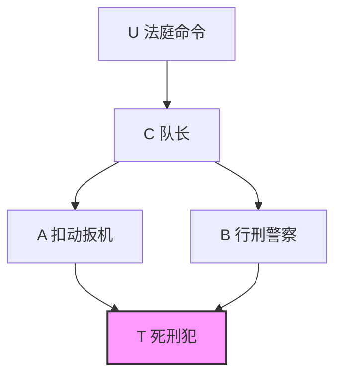

---
# 第 9 章 因果关系概率：解释和识别 —— 系统学习材料
---

## 一、章节概览

本章围绕因果关系的两个核心维度—— **必要性（Necessity）** 与 **充分性（Sufficiency）** ，利用结构因果模型（SCM）的反事实语义，给出了三个核心概率概念的精确定义、相互关系、可识别性条件以及实际应用方法。

**核心问题** ：给定已发生的事件 $x$ （原因）和 $y$ （结果），如何量化 $x$ 是 $y$ 的 **必要原因** 、 **充分原因** 或 **充分必要原因** 的概率？

**应用领域** ：流行病学（归因风险）、法律推理（法律责任认定）、人工智能（因果解释生成）、心理学。

---

## 二、核心概念与定义

### 2.1 必要性概率（PN — Probability of Necessity）

> **定义 9.2.1**

设 $x$ 和 $y$ 为因果模型 $M$ 中的两个二值变量， $x$ 表示 $X = \text{true}$ ， $x'$ 表示 $X = \text{false}$ （对 $y, y'$ 同理）。定义：

$$
PN \triangleq P(Y_{x'} = \text{false} \mid X = \text{true}, Y = \text{true}) \triangleq P(y'_{x'} \mid x, y) \tag{9.1}
$$

**含义解读** ：在已知 $x$ 和 $y$ **确实已经发生** 的前提下，若（反事实地） $x$ 没有发生（即 $x'$ ），则 $y$ **也不会发生** （即 $y'_{x'}$ ）的概率。这刻画了 $x$ 对 $y$ 发生的 **必要性** 。

> **直观理解** ：“如若不是因为 $x$ ， $y$ 就不会发生”这一反事实陈述成立的概率。

**符号说明** ：

- $y_x$ 表示 $Y_x = \text{true}$ （干预 $X = x$ 后 $Y$ 为真）
- $y'_x$ 表示 $Y_x = \text{false}$ （干预 $X = x$ 后 $Y$ 为假）
- 在反事实逻辑记号中， $PN \triangleq P(x' > y' \mid x, y)$

---

### 2.2 充分性概率（PS — Probability of Sufficiency）

> **定义 9.2.2**

$$
PS \triangleq P(y_x \mid y', x') \tag{9.2}
$$

**含义解读** ：在 $x$ 和 $y$ **都未发生** 的前提下，若（反事实地）使 $x$ 发生，则 $y$ **也会发生** 的概率。这刻画了 $x$ **产生** $y$ 的能力——将 $x$ 和 $y$ 从"不存在"变为"存在"。

> **直观理解** ：“如果原来没有 $x$ 也没有 $y$ ，那么施加 $x$ 就能导致 $y$ ”这一陈述成立的概率。

---

### 2.3 充分必要性概率（PNS — Probability of Necessary and Sufficiency）

> **定义 9.2.3**

$$
PNS \triangleq P(y_x, y'_{x'}) \tag{9.3}
$$

**含义解读** ：个体同时满足以下两个反事实条件的概率：

- 若暴露于 $x$ ，则 $y$ 发生（ $y_x$ ）—— **充分性**
- 若不暴露于 $x$ ，则 $y$ 不发生（ $y'_{x'}$ ）—— **必要性**

即 $y$ 在两种情况下都对 $x$ 做出 **响应** 的概率。

---

### 2.4 辅助概念

> **定义 9.2.4（禁阻概率 PD）**

$$
PD \triangleq P(y'_x \mid y) \tag{9.4}
$$

度量在 $y$ 已发生的情况下，移除 $x$ （即 $x'$ ）能够 **禁阻** $y$ 的概率。在评估预防方案时有用。

> **定义 9.2.5（启开概率 PE）**

$$
PE \triangleq P(y_x \mid y')
$$

与 PS 类似，但不以 $x'$ 为条件。用于评估全体健康人群（含已暴露者）暴露于 $x$ 的危险。

---

## 三、基本关系（引理）

### 3.1 PNS、PN、PS 之间的基本等式

> **引理 9.2.6**

$$
PNS = P(x, y) \cdot PN + P(x', y') \cdot PS \tag{9.5}
$$

**解释** ：PNS 可以分解为两部分加权和：

- 已发生 $(x, y)$ 的个体中 $x$ 是必要原因的概率（用 PN 衡量），权重为 $P(x, y)$
- 未发生 $(x', y')$ 的个体中 $x$ 是充分原因的概率（用 PS 衡量），权重为 $P(x', y')$

  **证明思路** ：利用一致性条件 $x \Rightarrow (y_x = y)$ 和 $x' \Rightarrow (y_{x'} = y)$ ，将 $y_x \wedge y'_{x'}$ 按 $x$ 和 $x'$ 拆分：

$$
y_x \wedge y'_{x'} = (y \wedge x \wedge y'_{x'}) \vee (y_x \wedge y' \wedge x')
$$

两边取概率即得结论。

---

### 3.2 PN 对抑制性原因的稳健性

> **引理 9.2.7**

设 $z = y \wedge q$ 是 $y$ 的"与"型结果（可能被 $q'$ 抑制）。若 $q \perp \{X, Y, Y_{x'}\}$ ，则：

$$
PN(x, z) \triangleq P(z'_{x'} \mid x, z) = P(y'_{x'} \mid x, y) = PN(x, y)
$$

**直观解释** ：在 $x$ 和 $z$ 都已发生的前提下，引入的抑制链接 $q$ 一定未被激活（否则 $z$ 为假），因此 PN 不变。意味着 PN 对"下游"随机抑制因子不敏感。

---

### 3.3 PS 对促进性原因的稳健性

> **引理 9.2.8**

设 $z = y \vee r$ 是 $y$ 的"或"型结果（可能被 $r$ 触发）。若 $r \perp \{X, Y, Y_x\}$ ，则：

$$
PS(x, z) \triangleq P(z_x \mid x', z') = P(y_x \mid x', y') = PS(x, y)
$$

**直观解释** ：在 $x'$ 和 $y'$ （从而 $z'$ ）的条件下，引入的触发因子 $r$ 未被激活，因此 PS 不变。

---

## 四、外生性假设下的可识别性

### 4.1 外生性定义

> **定义 9.2.9（外生性 Exogeneity）**

$X$ 相对于 $Y$ 是外生的，当且仅当：

$$
\{Y_x, Y_{x'}\} \perp X \tag{9.7}
$$

即 $Y$ 在两种反事实干预下的潜在响应，与 $X$ 的 **实际取值** 独立。

**重要性** ：外生性允许我们从观测条件概率识别因果效应：

$$
P(y_x) = P(y_x \mid x) = P(y \mid x) \tag{9.8}
$$

同理 $P(y_{x'}) = P(y \mid x')$ 。这在随机化实验中自然成立（无混杂）。

---

### 4.2 PNS 的界限

> **定理 9.2.10**

在外生性下，PNS 满足：

$$
\max[0, P(y \mid x) - P(y \mid x')] \leqslant PNS \leqslant \min[P(y \mid x), P(y' \mid x')] \tag{9.9}
$$

这些界限是 **紧致** 的（tight）：对任意联合分布 $P(x, y)$ ，存在满足界限内任意 PNS 值的模型。

**证明思路** ：利用联合概率的一般界限 $\max[0, P(A) + P(B) - 1] \leqslant P(A, B) \leqslant \min[P(A), P(B)]$ ，取 $A = y_x$ 、 $B = y'_{x'}$ ，并在外生性下代入 $P(y_x) = P(y|x)$ 、 $P(y'_{x'}) = P(y'|x')$ 。

---

### 4.3 PN、PS 与 PNS 的关系

> **定理 9.2.11**

在外生性下：

$$
PN = \frac{PNS}{P(y \mid x)} \tag{9.11}
$$

$$
PS = \frac{PNS}{P(y' \mid x')} \tag{9.12}
$$

**推论** （PN 的界限）：

$$
\frac{\max[0, P(y \mid x) - P(y \mid x')]}{P(y \mid x)} \leqslant PN \leqslant \frac{\min[P(y \mid x), P(y' \mid x')]}{P(y \mid x)} \tag{9.13}
$$

> **推论 9.2.12** ：即使有实验数据（已知 $P(y_x)$ 和 $P(y_{x'})$ ），PN 也仅能被限制在一个 **区间** 内，无法精确识别——除非有额外假设（如单调性）。

---

### 4.4 附加关系

外生性下，PD、PE 与 PNS 的关系：

$$
PD = \frac{P(x) \cdot PNS}{P(y)}, \quad PE = \frac{P(x') \cdot PNS}{P(y')} \tag{9.19}
$$

---

## 五、单调性假设下的可识别性

### 5.1 单调性定义

> **定义 9.2.13（单调性 Monotonicity）**

$Y$ 相对于 $X$ 是 **单调** 的，当且仅当：

$$
y'_x \wedge y_{x'} = \text{false} \tag{9.20}
$$

**含义** ：在任何个体 $u$ 上， $X = \text{false} \to X = \text{true}$ 的变化 **不能** 使 $Y$ 从 $\text{true}$ 变为 $\text{false}$ 。

**流行病学术语** ："无预防"假设（no prevention）——任何个体都不能通过暴露而 **避免** 疾病。

---

### 5.2 外生性 + 单调性下的可识别性

> **定理 9.2.14**

若 $X$ 外生且 $Y$ 相对 $X$ 单调，则 PN、PS、PNS 均可识别：

$$
PNS = P(y \mid x) - P(y \mid x') \tag{9.21}
$$

$$
PN = \frac{P(y \mid x) - P(y \mid x')}{P(y \mid x)} \tag{9.22}
$$

$$
PS = \frac{P(y \mid x) - P(y \mid x')}{1 - P(y \mid x')} \tag{9.23}
$$

> **重要说明** ：
>
> - 式 (9.21) 右侧即流行病学中的 **风险差（Risk Difference）** ，常被误称为"归因风险"
> - 式 (9.22) 即 **超额风险率（Excess Risk Ratio, ERR）** ，常被误称为"归因分数"——但实际上它们都是纯统计量， **仅在外生性+单调性假设下** 才等同于因果量 PN
> - 式 (9.23) 即流行病学中的"相对差"（Shep, 1958），衡量易感性

**证明思路** ：单调性 $y'_x \wedge y_{x'} = \text{false}$ 保证 $y_x = y_{x'} \vee (y_x \wedge y'_{x'})$ ，取概率得 $P(y_x) = P(y_{x'}) + P(y_x, y'_{x'})$ ，结合外生性代入即得式 (9.21)。

---

### 5.3 仅单调性（无外生性）下的可识别性

> **定理 9.2.15**

若 $Y$ 相对 $X$ 单调且因果效应 $P(y_x)$ 、 $P(y_{x'})$ 可识别（例如来自实验或经协变量校正），则：

$$
PNS = P(y_x) - P(y_{x'}) \tag{9.28}
$$

$$
PN = \frac{P(y) - P(y_{x'})}{P(x, y)} \tag{9.29}
$$

$$
PS = \frac{P(y_x) - P(y)}{P(x', y')} \tag{9.30}
$$

> **与式 (9.22) 的关键区别** ：将式 (9.29) 展开可得：

$$
PN = \underbrace{\frac{P(y \mid x) - P(y \mid x')}{P(y \mid x)}}_{\text{传统 ERR}} + \underbrace{\frac{P(y \mid x') - P(y_{x'})}{P(x, y)}}_{\text{混杂校正项}} \tag{9.31}
$$

第二项纠正了 $P(y \mid x') \neq P(y_{x'})$ 带来的混杂偏差。 **当混杂偏差为正时，真正的 PN 比未校正的 ERR 更高。**

---

### 5.4 单调性的可检验推论

由 PN、PS 非负性可得单调性的必要条件：

$$
P(y_x) \geqslant P(y) \geqslant P(y_{x'}) \tag{9.32}
$$

这收紧了标准不等式（由 $x' \wedge y \Rightarrow y_{x'}$ 和 $x \wedge y' \Rightarrow y'_x$ 导出）：

$$
P(y_{x'}) \geqslant P(x', y), \quad P(y'_x) \geqslant P(x, y') \tag{9.33}
$$

式 (9.32) 可用于 **检验** 实验数据与非实验数据的一致性，即临床试验被试是否代表目标人群。

---

### 5.5 结合混杂校正的推广

> **推论 9.2.16** ：对任意正马尔可夫模型，若 $Y_x(u)$ 单调，PNS、PS、PN 均可识别，其中 $P(y_x)$ 由后门调整公式给出：

$$
P(y_x) = \sum_{pa_X} P(y \mid pa_X, x) P(pa_X) \tag{9.35}
$$

代入式 (9.28)～(9.30) 即可。

> **推论 9.2.17** ：该结果可推广到满足 Tian-Pearl 算法识别条件的半马尔可夫模型类 $GP$ 。

---

## 六、实例详解

### 6.1 实例 1：公平硬币下注

**设定** ：猜硬币正面（ $x$ ），猜对赢 1 美元（ $y$ ）， $u$ 为硬币实际正面。函数关系：

$$
y = (x \wedge u) \vee (x' \wedge u') \tag{9.36}
$$

即猜中硬币朝向则赢。 $P(u) = 0.5$ 。

**计算** ：

- $PN = P(y'_{x'} \mid x, y) = P(y'_{x'} \mid u) = 1$ （赢了则必猜中，换猜必输）
- $PS = P(y_x \mid x', y') = P(y_x \mid u) = 1$ （输了则必猜反，换猜必赢）
- $PNS = 1 \cdot 0.5 + 0 \cdot 0.5 = 0.5$

**启示** ：虽然 PN = PS = 1，但 PNS = 0.5，因为仅在硬币正面（ $u$ ）时才同时满足必要和充分条件。此外， $P(y|x) = P(y|x') = P(y_x) = P(y_{x'}) = 0.5$ 等概率在随机庄家策略下也成立（此时 PN = PS = PNS = 0），说明仅从统计数据 **完全无法识别** 因果概率——必须知晓函数机制。

---

### 6.2 实例 2：刑法执行（行刑队）

**设定** ： $P(u) = 0.5$ ，A 和 B 枪法准确且遵纪守法。

**计算因果效应** ：

- $P(y_x) = 1$ （A 开枪则 T 必死，不论 B）
- $P(y_{x'}) = 0.5$ （A 不开枪，仅当有命令时 B 开枪致 T 死）

**计算各概率** ：

- $PN = 0$ （若 T 已死，A 是否开枪无关——B 也会执行）
- $PS = 1$ （若 T 未死且 A 未开枪，则 A 若开枪 T 必死）
- $PNS = 0.5$

使用式 (9.29)～(9.30) 验证（利用 $P(x,y) = P(x',y') = 0.5$ ）：

- $PN = \frac{0.5 - 0.5}{0.5} = 0$ ✓
- $PS = \frac{1 - 0.5}{0.5} = 1$ ✓

**启示** ： $X$ 不是外生的（ $x$ 和 $y$ 有共同原因 $U$ ），定理 9.2.14 不适用，但单调性允许用定理 9.2.15 计算。

---

### 6.3 实例 3：辐射与白血病

**数据** （改编自 Finkelstein and Levin, 1990）：

|                | 高辐射（ $x$ ） | 低辐射（ $x'$ ） |
| -------------- | :-------------: | :--------------: |
| 死亡（ $y$ ）  |       30        |        16        |
| 存活（ $y'$ ） |     69,130      |      59,010      |

**模型** （析取型，单调）： $y = (x \wedge q) \vee u$

假设 $X$ 外生（随机化或校正后），应用定理 9.2.14：

$$
PNS = \frac{30}{69160} - \frac{16}{59026} \approx 0.0001627
$$

$$
PN = \frac{0.0001627}{30/69160} \approx 0.37514
$$

$$
PS = \frac{0.0001627}{1 - 16/59026} \approx 0.0001627
$$

**现实含义** ：

- 随机一个儿童有约 0.016% 的概率处于"暴露则死、不暴露则活"的状态
- **暴露并死亡的儿童中** ，若不暴露则存活的概率约 37.5%
- 未暴露且存活的儿童中，暴露后死亡的概率约 0.016%

---

### 6.4 实例 4：实验 + 非实验数据的结合（法律责任）

**情境** ：药物 $x$ 是否导致 A 先生死亡 $(y)$ ？

**数据** ：

|             | 实验组 |      | 非实验组 |      |
| :---------- | :----: | :--: | :------: | :--: |
|             |  $x$   | $x'$ |   $x$    | $x'$ |
| 死亡 $(y)$  |   16   |  14  |    2     |  28  |
| 存活 $(y')$ |  984   | 986  |   998    | 972  |

**估算** ：

- $P(y_x) = 16/1000 = 0.016$
- $P(y_{x'}) = 14/1000 = 0.014$
- $P(y) = 30/2000 = 0.015$
- $P(x, y) = 2/2000 = 0.001$

代入式 (9.29)：

$$
PN \geqslant \frac{P(y) - P(y_{x'})}{P(x, y)} = \frac{0.015 - 0.014}{0.001} = 1.00
$$

若仅用实验数据（传统 ERR）：

$$
\frac{P(y_x) - P(y_{x'})}{P(y_x)} = \frac{0.002}{0.016} = 0.125
$$

**启示** ：

- 实验研究未能揭示：有选择的晚期患者会 **主动避开** 药物 $x$
- 组合实验与非实验数据可揭示仅靠实验无法发现的信息
- 不等式 (9.32) 和 (9.33) 可用于检验两组数据的兼容性

---

## 七、结果总结表

> **表 9.3：PN 作为假设和可用数据的函数**

| 外生性 | 单调性 |  附加条件  | 实验数据 | 观测数据 | 组合数据 |
| :----: | :----: | :--------: | :------: | :------: | :------: |
|   ✓    |   ✓    |     —      |   ERR    |   ERR    |   ERR    |
|   ✓    |   ✗    |     —      |   边界   |   边界   |   边界   |
|   ✗    |   ✓    | 控制协变量 |    —     | 修正ERR  | 修正ERR  |
|   ✗    |   ✓    |     —      |    —     |    —     | 修正ERR  |
|   ✗    |   ✗    |     —      |    —     |    —     |   边界   |

**要点** ：

- 仅在外生性 **且** 单调性同时成立时，ERR 才是 PN 的有效度量
- 单调性不成立时，ERR 仅为 PN 的 **下界**
- 存在混杂时需用 $[P(y|x') - P(y_{x'})] / P(x, y)$ 进行校正
- 组合数据（实验+观测）即使无单调性也可提供非平凡边界

---

## 八、非单调模型的可识别性

当单调性不成立时，需要直接识别函数的分布。

### 8.1 基本思路

在因果模型 $M$ 中，对每个变量 $Y$ 的函数 $y = f(pa_Y, u_Y)$ ，将 $U_Y$ 的域划分为等价类 $S$ ，其中每个 $s \in S$ 对应 $PA_Y \to Y$ 的一个函数 $f^{(s)}$ 。则：

$$
P(y \mid pa_Y) = \sum_{s: f^{(s)}(pa_Y) = \text{true}} P(s) \tag{9.56}
$$

写成矩阵形式：

$$
\vec{p} = \boldsymbol{R} \vec{q} \tag{9.57}
$$

### 8.2 局部可逆性

> **定义 9.4.1**

若对每个变量 $V_i \in V$ ，方程组 (9.60) 关于 $q_i(s)$ 有唯一解，则模型 $M$ 称为 **局部可逆** 的。

> **定理 9.4.2**

若马尔可夫模型 $M$ 局部可逆，则每个反事实语句的概率均可从 $P(v)$ 识别。

**特殊情况举例** ：

1.  **含噪或门（Noisy OR）** ： $Y = U_0 \vee \bigvee_{i=1}^{k} (X_i \wedge U_i)$ ，矩阵 $\boldsymbol{R}$ 总是可逆的，因此可识别。

2.  **异或门链（XOR chain）** ：虽然非单调，但仅产生两个等价类，条件概率即可唯一确定参数。

---

## 九、结论与哲学讨论

### 9.1 必要性与充分性的平衡

| 维度     | 必要性（PN）               | 充分性（PS）               |
| :------- | :------------------------- | :------------------------- |
| 关注点   | 特定事件的反事实依赖性     | 某类事件产生结果的一般能力 |
| 法律含义 | "若非 $x$ ， $y$ 不会发生" | " $x$ 能够导致 $y$ "       |
| 应用场景 | 法律责任认定               | 政策分析与风险评估         |

**关键论证** ：完备的因果解释必须同时考虑必要性和充分性。

- **纯 PN 视角的缺陷** ：氧气对火灾是必要的（PN 很高），但我们不认为氧气是"实际原因"——因为氧气在一般情境下不具有充分性（PS 很低）
- **纯 PS 视角的缺陷** ：远距离射击命中概率极低（PS 很低），但若确实命中，射击者仍是罪魁祸首——因为在此特定事件中 PN 很高

用 PN/PS 语言分析"火柴 vs 氧气"问题：

- $PN(\text{火柴}) \approx PN(\text{氧气})$ （对于火灾，两者都必要）
- $PS(\text{火柴}) \approx p_o$ （火柴产生火灾的概率 ≈ 有氧的概率）
- $PS(\text{氧气}) \approx p_m$ （氧气产生火灾的概率 ≈ 划火柴的概率）
- 当 $p_o \gg p_m$ ，显然 $PS(\text{火柴}) \gg PS(\text{氧气})$ ，火柴更具解释力

### 9.2 方法论贡献

1.  **概念澄清** ：用反事实语义精确定义了 PN、PS、PNS，消除了传统概率/逻辑解释的歧义
2.  **可识别性理论** ：系统给出了不同假设组合下的可识别性条件与计算公式
3.  **数据融合** ：展示了实验数据与非实验数据的组合可产生两者单独无法提供的信息
4.  **假设检验** ：提供了 Eq.(9.32) 作为单调性假设的可检验推论

### 9.3 实践意义

- 流行病学家在计算"归因分数"时 **隐含假设了外生性和单调性** ，本章明确揭示了这些假设
- 法律推理中 PN 和 PS **都应** 被纳入考量（Good, 1993）
- 第 10 章将在此基础上发展"实际原因"（actual cause）概念

---

## 十、关键公式速查表

| 公式编号 | 条件      | 表达式                                                                       |
| :------: | :-------- | :--------------------------------------------------------------------------- |
|  (9.1)   | 定义      | $PN = P(y'_{x'} \mid x, y)$                                                  |
|  (9.2)   | 定义      | $PS = P(y_x \mid x', y')$                                                    |
|  (9.3)   | 定义      | $PNS = P(y_x, y'_{x'})$                                                      |
|  (9.5)   | 一般      | $PNS = P(x,y)PN + P(x',y')PS$                                                |
|  (9.9)   | 外生性    | $\max[0, P(y\|x)-P(y\|x')] \leqslant PNS \leqslant \min[P(y\|x), P(y'\|x')]$ |
|  (9.21)  | 外生+单调 | $PNS = P(y\|x) - P(y\|x')$                                                   |
|  (9.22)  | 外生+单调 | $PN = \frac{P(y\|x) - P(y\|x')}{P(y\|x)}$                                    |
|  (9.23)  | 外生+单调 | $PS = \frac{P(y\|x) - P(y\|x')}{1-P(y\|x')}$                                 |
|  (9.28)  | 单调      | $PNS = P(y_x) - P(y_{x'})$                                                   |
|  (9.29)  | 单调      | $PN = \frac{P(y) - P(y_{x'})}{P(x,y)}$                                       |
|  (9.30)  | 单调      | $PS = \frac{P(y_x) - P(y)}{P(x',y')}$                                        |
|  (9.32)  | 单调推论  | $P(y_x) \geqslant P(y) \geqslant P(y_{x'})$                                  |

---

> **延伸阅读方向** ：第 10 章将必要性和充分性结合，阐述"实际原因"（actual cause）的更精细概念；第 11 章（11.9.2 节）讨论非单调情况下 PNS 的下界。
