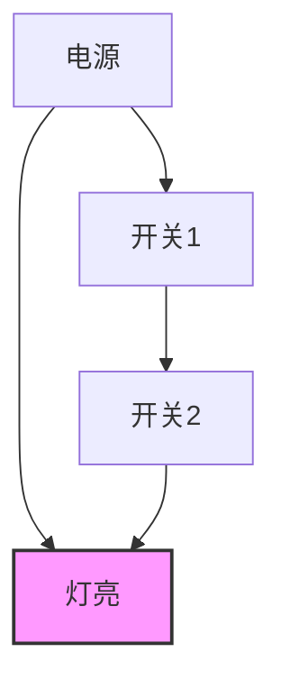
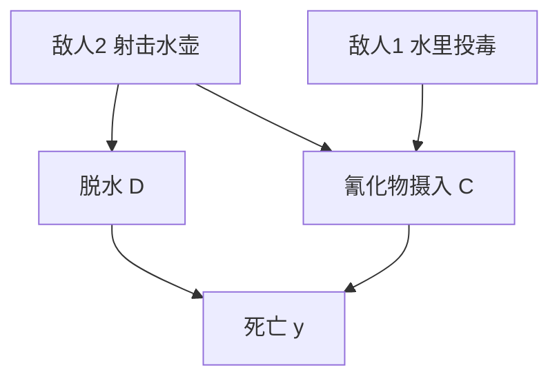
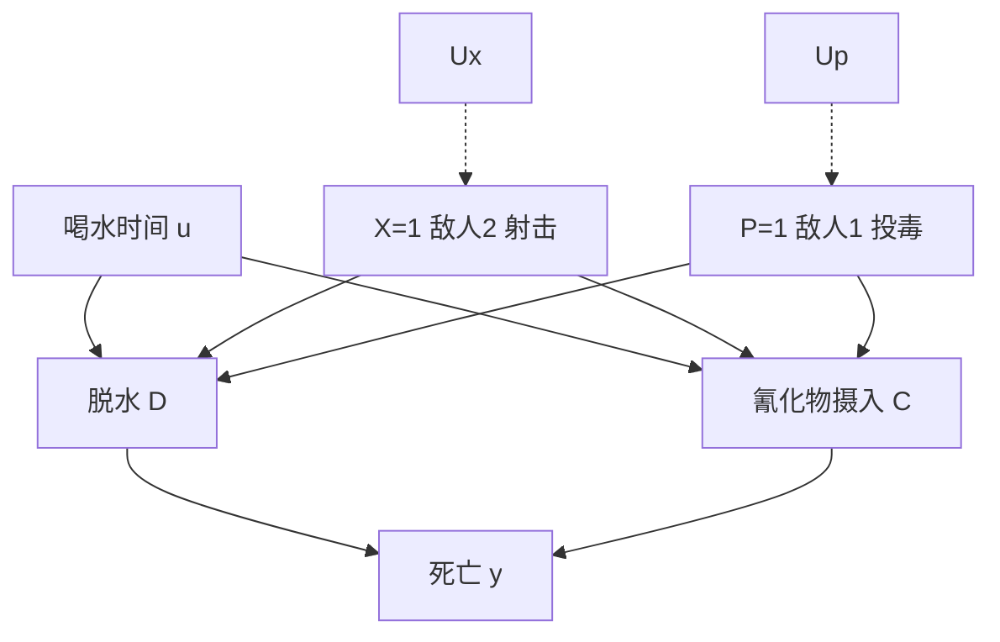
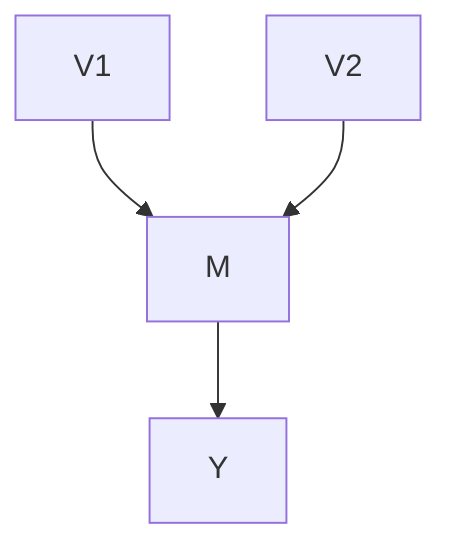

现在我已阅读完全章内容，下面为你系统性地梳理总结。

---

# 第 10 章 实际原因（Actual Causes）——系统梳理与学习材料

---

## 一、本章概览

本章的核心问题是： **在一个具体场景中，如何形式化地确定"哪个事件是导致某个已知结果的*实际原因*"？**

例子："苏格拉底喝了毒药是他死亡的*实际原因*"——这是一个 **特例层级** （token-level）的因果陈述。它不同于"喝毒药会导致死亡"这类 **普遍层级** （type-level）的因果论断。本章通过结构因果模型（SCM）的语义，提出了以 **维持** （sustenance）概念为核心的形式化理论，并用 **因果束** （causal beam）工具来处理抢占（preemption）、过度确定（overdetermination）等经典难题。

---

## 二、10.1 引言：必要因果关系的不充分性

### 2.1 特例原因 vs. 一般原因（10.1.1）

| 层级                       | 别称                | 示例                             | 形式化手段                      |
| -------------------------- | ------------------- | -------------------------------- | ------------------------------- |
| **普遍层级** (type-level)  | 一般原因            | "车祸导致死亡"                   | $P(Y_x = y) = p$ （因果效应）   |
| **特例层级** (token-level) | 特殊原因 / 实际原因 | "*这次*车祸是乔死亡的*实际原因*" | $P(\text{caused}(x, y \mid e))$ |

> **核心观点** ：在结构因果模型中，普遍论断和特殊论断 **并非两种不同类别** 的因果关系，而是 **同一类因果关系在不同信息粒度下的表现** 。区别在于：
>
> - 当我们知道所有背景变量 $U = u$ （即知道一个完整的"世界"），我们做出的是 **特例因果论断** ；
> - 当我们只用 $P(u)$ 概括不确定性时，我们做出的是 **普遍因果论断** ；
> - 当掌握部分证据 $e$ ，将 $P(u)$ 更新为 $P(u \mid e)$ ，我们做出的论断介于两者之间——如第9章的 **PS** （充分性概率）和 **PN** （必要性概率）。

### 2.2 抢占与结构信息的作用（10.1.2）

**关键洞察** ：PN 和 PS 只依赖因果模型的 **全局输入-输出** 关系 $Y_x(u)$ ，而 **不依赖因果过程中间的结构信息** 。这导致它们无法处理抢占问题。

#### 例：灯泡与两个开关（图10.1）

- 开关1接通 → 灯亮， **同时** 断开开关2与电路的连接
- 当两个开关都接通时： **开关1是实际原因，开关2不是**
- 但 PN 和 PS 会认为两者对称（因为任何一个都足以开灯）

#### 例 10.1.1：沙漠旅行者（Suppes 提供）

结构方程：
$$ c = p \cdot x' $$
$$ d = x $$
$$ y = c \vee d $$

代入得：
$$ y = x \vee p x' \equiv x \vee p $$

**关键** ：虽然逻辑上 $x \vee p x' \equiv x \vee p$ ，但 **结构上** 二者不等价：

- $x \vee p x'$ 告诉我们：当 $x = \text{true}$ 时， $p$ 对 $y$ **没有影响** （其因果路径被抢占）
- $x \vee p$ 则暗示 $x$ 和 $p$ 完全对称

> **Lewis 的链式标准** ： $x$ 到 $y$ 之间存在 **反事实相关链** （ $x \to d \to y$ ，链中每个元素都反事实依赖于其前因），而 $p$ 到 $y$ 的链（ $p \to c \to y$ ）在 $x = \text{true}$ 时被 **抢占** （ $c$ 恒为假）。

### 2.3 过度确定与准依赖性（10.1.3）

#### 例：行刑队（图9.1）

两个行刑警察 $A$ 和 $B$ 同时射击，死刑犯死亡。

- 直觉： **每个警察的射击都是实际原因**
- 但：两者都不满足反事实检验（"若非 A 射击，则犯人不会死"——不成立，因为 B 也会射击）
- 两者也不满足 Lewis 的链式标准（对方的子弹破坏了反事实相关性）

> **Lewis 的"准依赖"** ：若一个过程的内在特征与不存在外在干扰时的反事实相关过程 **完全相同** ，则该过程应被视为准依赖的因果过程。

Hall（2004）指出的困难：

1. "过程"到底是什么？
2. "内在特征恰好像"意味着什么？
3. 如何"准确测量周围环境的变化"？

→ 本章用 **因果束** 来回答这些问题。

### 2.4 Mackie 的 INUS 条件（10.1.4）

> **INUS 条件** ： $C$ 是事件 $E$ 的原因，当且仅当 $C$ 是一个 **I** nsufficient but **N** ecessary part of an **U** nnecessary but **S** ufficient condition for $E$ 。
> 即： $C$ 是"对于结果的不必要但充分条件中的不充分但必要部分"。

**示例** ：若 $E = AB \vee CD$ （极小析取范式），则 $C$ 是 INUS 条件，因为 $C$ 是充分条件 $CD$ 中的必要合取项。

**INUS 的根本缺陷** ：逻辑必要性和充分性的语言 **无法区分机制（倾向关系）和环境条件** ：

- **换质位法问题** ：" $A \Rightarrow B$ " 逻辑等价于 " $\neg B \Rightarrow \neg A$ "，但"疾病导致症状"≠"消除症状导致疾病消失"
- **语法敏感性问题** ：同一模型的不同等价表达可导致不同结论
- **非极小表达问题** ： $y = x \vee x'p$ 可化为 $y = x \vee p$ （失去不对等性），也可化为 $y = xp' \vee p$ （荒谬地得出 $p'$ 是原因）

> **结构模型的优势** ：通过机制函数 $v_i = f_i(pa_i, u)$ 表达的结构信息，明确区分了倾向性知识与环境知识，排除了任意逻辑等价替换。

---

## 三、10.2 产生、依赖和维持

### 3.1 Hall 的双概念理论

| 概念     | 英文       | 对应         | 含义                              |
| -------- | ---------- | ------------ | --------------------------------- |
| **依赖** | Dependence | 必要性（PN） | $x$ 对于 $y$ 在给定场景下是否必要 |
| **产生** | Production | 充分性（PS） | $x$ 产生 $y$ 的能力               |

在行刑队例子中：

- **依赖检验失败** ：死刑犯的状态不"依赖"于任何一个单独的射击（PN=0）
- **产生检验成功** ：每次射击都是对等的死亡"产生者"（PS=1）

### 3.2 产生的局限性

产生的检验需要走出 **现实世界** $u$ ：

- 条件： $X(u') = x', Y(u') = y', Y_x(u') = y$ （在 $x$ 和 $y$ 都*未*出现的世界 $u'$ 中，施加 $x$ 后 $y$ 成立）
- 问题：
  - (a) 无法解释现实世界中实际发生了什么
  - (b) 收集到的关于现实世界的证据 $u$ 无法用于定义产生的假设世界 $u'$

### 3.3 维持的定义（定义 10.2.1）

> **定义 10.2.1（维持，Sustenance）** ： $x$ 相对于 $W$ 中的偶然性在 $u$ 上 **因果维持** $y$ ，当且仅当：
>
> - (i) $X(u) = x$
> - (ii) $Y(u) = y$
> - (iii) 对于所有 $w$ ， $Y_{xw}(u) = y$
> - (iv) 存在 $x' \neq x$ 和 $w'$ ，使得 $Y_{x'w'}(u) = y' \neq y$

**解读** ：

- 条件 (iii)： $x$ **自身可以充分地维持** $y$ ——即使 $W$ 被设置为任意值，只要保持 $X = x$ ， $Y$ 始终为 $y$
- 条件 (iv)：存在某种反事实设置 $(x', w')$ 使 $y$ 不再成立—— $x$ 对维持 $y$ 负有" **责任** "
- (iii)+(iv) 联合表明：存在一种设置 $W = w'$ ，其中 $x$ 是 $y$ 的 **充要条件**

  **维持 vs. 依赖** ：

- 依赖考虑的是 **间接偶然性** （从 $U = u$ 演变而来的反事实）
- 维持考虑的是 **结构化偶然性** （模型自身机制可能出现的故障/干预）

> **核心思想** ：因果模型中的每个 do-操作代表一种可能的模型修正，每个因果模型隐含地代表了一整套模型集——即包含所有可能干预下的子模型。因此，将结构化偶然性纳入实际因果定义是合理的。

---

## 四、10.3 因果束与基于维持的因果关系

### 4.1 因果束：定义与含义（10.3.1）

#### 动机

在特定状态 $U = u$ 下，某些父代变量可能变得 **冗余** （其变化不影响子代变量的值）。例如 $f_i = a x_1 + b u x_2$ ，当 $u = 0$ 时 $x_2$ 被"冻结"为不相关。

**因果束** 是对原始模型在特定 $u$ 上的 **投影** ——修剪掉所有在 $u$ 下冗余的父代变量。

#### 定义 10.3.1（因果束，Causal Beam）

已知模型 $M = \langle U, V, \{f_i\} \rangle$ 和状态 $U = u$ ，因果束是新模型 $M_u = \langle u, V, \{f_i^u\} \rangle$ ，构造如下：

1. 对每个 $V_i$ ，将 $PA_i$ 分为 $S$ （维持集）和 $\overline{S}$ ，使得对所有 $\overline{s}, \overline{s}'$ ：
   $$ f_i(S(u), \overline{s}, u) = f_i(S(u), \overline{s}', u) $$
   即：只要 $S$ 取实际值， $\overline{S}$ 如何变化都不影响 $V_i(u)$ 。

2. 存在 $\overline{S}$ 的子集 $W$ 及其赋值 $w$ ，使得 $f_i(s, \overline{S}_w(u), u)$ 关于 $s$ **非平凡** （即存在 $s'$ 使函数值不同于 $V_i(u)$ ）。

3. 将 $f_i$ 替换为其投影：
   $$ f_i^u(s) = f_i(s, \overline{S}\_w(u), u) $$
   新父代集为 $PA_i^u = S$ 。

#### 定义 10.3.2（自然束，Natural Beam）

若定义 10.3.1 的条件 2 对所有 $V_i$ 满足 $W = \emptyset$ ，则称 $M_u$ 为 **自然束** 。

> 自然束就是 **冻结** 所有冗余变量 $\overline{S}$ 为实际值，不另行修改任何其他变量。

#### 定义 10.3.3（实际原因，Actual Cause）

事件 $X = x$ 是在状态 $u$ 下 $Y = y$ 的 **实际原因** ，当且仅当存在 **自然束** $M_u$ 使得：
$$ \text{在} M*u \text{中}, \quad Y_x = y \tag{10.8} $$
以及
$$ \text{在} M_u \text{中}, \quad \text{对于某个} x' \neq x \text{有} Y*{x'} \neq y \tag{10.9} $$

**解读** ：

- (10.8)：在当前自然束中，设置 $X = x$ 时 $Y = y$ （这等价于 $Y_x(u) = y$ ，通常自动成立）
- (10.9)：在当前自然束中，若 $X$ 取其他值， $Y$ 不再等于 $y$ ——即 $x$ 对于 $y$ 是 **必要** 的（在冻结了无关大局的环境 $\overline{S}$ 后）

#### 定义 10.3.4（主要原因，Principal Cause）

$x$ 是 $y$ 的 **主要原因** ，当且仅当存在满足 (10.8) 和 (10.9) 的因果束，但 **不存在** 满足条件的自然束（即必须设置 $W \neq \emptyset$ ）。

#### 关于多变量事件

- 若 $Y$ 是多个变量的布尔函数，则 (10.8) 应应用于每个成员 $Y_i$ ，(10.9) 修改为 $Y_{x'} \Rightarrow \neg E$
- 若 $X$ 由多个变量组成，要求 $X$ 是 **极小** 的（删除不相关细节，如 "喝毒药+打喷嚏" 中 "打喷嚏" 应被移除）

#### 定义 10.3.5（实际因果概率）

$$ P(\text{caused}(x, y \mid e)) = \frac{P(U\_{xy} \cap U_e)}{P(U_e)} \tag{10.11} $$

其中 $U_{xy}$ 是 " $x$ 是 $y$ 的实际原因" 为真的状态集， $U_e$ 是与证据 $e$ 兼容的状态集。

---

### 4.2 实例分析（10.3.2）

#### 过度确定与主要原因

**模型** ： $E = A_1 \vee A_2$ ，两者均为 true。

- **不存在自然束** 使 $A_1$ 或 $A_2$ 成为实际原因（因为冻结任何一个为 true，另一个对 $E$ 的影响变为平凡）
- 但若设置 $W = \{A_2\}, w = \text{false}$ ，则得到投影 $f^u(A_1) = A_1$ ， $A_1$ 通过反事实检验—— $A_1$ 是 $E$ 的 **主要原因**
- 这形式化了 Lewis 的"准依赖性"概念

#### 析取范式示例

$$ y = f(x, z, r, h, t, u) = xz \vee rh \vee t $$

所有变量为 true 时：

- 维持集 $S = \{X, Z\}$ ，但自然束中 $f^u$ 恒为真（平凡），故 $x$ **不是实际原因**
- 设置 $w = \{r', t'\}$ 或 $w = \{h', t'\}$ ，得到 $f^u(x, z) = xz$ → $x$ 是 $y$ 的 **主要原因**
- 若状态 $u'$ 中 $R = T = \text{false}$ （ $rh$ 和 $t$ 被自然冻结），则自然束存在 → $x$ 是 $y$ 的 **实际原因**

#### 一般布尔函数

$$ y = f(x, z, h, u) = xz' \vee x'z \vee xh' $$

（等价于 $y = xz' \vee x'z \vee zh'$ ）

状态 $u$ ： $X = Z = H = \text{true}$ ， $Y = \text{false}$ 。

唯一的维持集 $S = \{X, Z, H\}$ （任意两个变量不足以保证 $Y = \text{false}$ ）。 $\overline{S} = \emptyset$ ，故自然束等于原始模型。 $Y_{x'} = \text{true} \neq Y(u)$ → $x$ 是 $y$ 的实际原因。

**关键优势** ：结论对逻辑等价的不同表达式保持一致，因为定义基于语义（机制）而非句法。

---

### 4.3 沙漠旅行者的概率版本（10.3.3）

引入不确定性：旅行者是否在水壶漏空前喝了水？

结构方程：
$$ c = p(u' \vee x') $$
$$ d = x(u \vee p') $$
$$ y = c \vee d $$

**状态 $u = 1$ （没喝水）** ：自然束见图 10.4。

- 投影函数： $c = x', d = x, y = d$
- $Y_x = 1, Y_{x'} = 0$ → ** $x$ 是 $y$ 的实际原因**
- $Y_p = 1, Y_{p'} = 1$ → $p$ 不是 $y$ 的实际原因

**状态 $u = 0$ （喝了水）** ：自然束见图 10.5。

- $Y_p = 1, Y_{p'} = 0$ → ** $p$ 是 $y$ 的实际原因**
- $Y_x = 1, Y_{x'} = 1$ → $x$ 不是 $y$ 的实际原因

**概率化** ：
$$ P(\text{caused}(x, y \mid e)) = P(u = 1 \mid e) $$
$$ P(\text{caused}(p, y \mid e)) = P(u = 0 \mid e) $$

例如法医报告"体内没有氰化物" → $P(u = 1 \mid e) = 1$ → 敌人2 的射击是实际原因的概率为 100%。

---

### 4.4 路径切换因果关系（10.3.4）

**例 10.3.6** ：双位开关

- $x = 1$ ：灯亮（ $z = 1$ ），手电筒灭（ $w = 0$ ）
- $x = 0$ ：手电筒亮（ $w = 1$ ），灯灭（ $z = 0$ ）
- $Y = 1$ ："房间被照亮了"

两个状态下均有 $Y_x = 1, Y_{x'} = 0$ 。

→ **两种开关位置都被认为是"房间被照亮"的实际原因** ，尽管两者都不是必要的！

这体现了"实际原因"概念的微妙性——开关位置改变了因果路径，但来源和结果相同。

---

### 4.5 时序抢占（10.3.5）

**两团火的例子** ：火团 A 在火团 B 之前烧毁房屋 → A 是实际原因，B 不是。

若简单建模为 $H = A \vee B$ ，束方法会将两者视为同等贡献——与直觉矛盾。

**解决方案** ：使用 **动态因果模型** （时间标记变量 $V(x, t)$ ）：

$$
V(x, t) =
\begin{cases}
f & V(x, t - 1) = g \text{且} V(x - 1, t - 1) = f \\
f & V(x, t - 1) = g \text{且} V(x + 1, t - 1) = f \\
b & V(x, t - 1) = b \text{或} V(x, t - 1) = f \\
g & \text{其他}
\end{cases}
$$

通过构造自然束，两个关键步骤产生直观结果：

1.  **排除南面父节点** （从束中），保持 $V(x^*, t)$ 对火团 A 的依赖
2.  **要求包含中间父节点** （在任何束中），防止 $V(x^*, t)$ 对火团 B 的依赖

这对应 Lewis 的"选择内在过程、抑制非内在影响、防止过程超出内在边界"。

---

## 五、10.4 结论

### 核心论点

**(a)** 传递因果论断真实意义的是 **结构化偶然事件** （模型机制的可能故障），而非间接偶发事件；

**(b)** 这些结构化偶然事件应作为 **因果关系解释的基础** 。

束检验所体现的 **维持性质** 是阐明实际因果关系的关键。它能够处理：

- 抢占（preemption）
- 过度确定（overdetermination）
- 时序抢占（temporal preemption）
- 路径切换（switching causation）

### 维持 vs. 产生

维持 **不能完全代替产生** 。

**火柴-氧气例子** ：氧气和点燃的火柴都满足维持检验（ $\overline{S} = \emptyset$ ），但氧气被称为"原因"显得尴尬——因为在最常见的没有划火柴的世界里，氧气无法产生火灾。

→ 这涉及 **语用学** 考量：

- 若目标是"如何*防止*火灾？"→ 需要 **产生** 准则（前往假设世界）
- 若目标是"如何*保持*房间明亮？"→ 需要 **维持** 准则（留在现实世界）

---

## 六、第2版附言：Halpern & Pearl 的改进定义

### 因果束的不足（例 10.4.1：投票机）

$M = V_1 + V_2$ ， $Y = 1 \iff M \geq 1$ 。

两人都投赞成票时，束准则不能将 $V_1 = 1$ 判定为主要原因——因为不能将 $V_2$ 标记为"无效"而不改变 $M$ 的值。

### 定义 10.4.2（实际因果关系，Halpern & Pearl 2005a,b）

$X = x$ 是在条件 $U = u$ 中 $Y = y$ 的 **实际原因** ，当且仅当：

**AC1.** $X(u) = x$ ， $Y(u) = y$ （现实世界中两者均成立）

**AC2.** 将 $V$ 分为两个子集 $Z$ 和 $W$ （ $X \subseteq Z$ ），分别将 $X$ 和 $W$ 设置为 $x'$ 和 $w$ ，使得：

- **(a)** $Y_{x', w} \neq y$ （反事实检验：改变 $X$ 后 $Y$ 改变）
- **(b)** 对于所有 $W' \subseteq W$ 和 $Z' \subseteq Z$ ，有 $Y_{x, w, z^*} = y$

**AC3.** $W$ 是极小的（没有 $X$ 的子集满足 AC1 和 AC2）。

**AC2(b) 的解读** ：即使发生了偶然事件 $W = w$ ，且 $Z$ 中某些变量被赋予原始值 $z^*$ ，只要将 $X$ 恢复为原始值 $x$ ， $Y = y$ 就能保持不变。这限制了偶然事件的选择范围——确保偶然事件不能"过分"。

**投票机例子中的检验** ：设 $W = w$ 为 $V_2 = 0$ ， $Z = z^*$ 为 $V_1 = 1$ 。此时不需要 $M$ 保持不变，只要 $Y = 1$ 不变即可 → $V_1 = 1$ 被 AC2 判定为原因。

### 后续发展

- Halpern（2008）引入"常态化"（normality）概念，仅考虑与真实世界处于相同"正常"水平的结构化偶然事件
- Halpern & Hitchcock（2010）总结了实际因果关系的结构方法研究现状

---

## 七、核心概念对照总结表

| 概念           | 英文             | 定义                                      | 检验内容                       |
| -------------- | ---------------- | ----------------------------------------- | ------------------------------ |
| **必要性概率** | PN               | $P(Y_{x'} = y' \mid x, y)$                | 若非 $x$ ，结果是否不同？      |
| **充分性概率** | PS               | $P(Y_x = y \mid x', y')$                  | $x$ 是否足以产生 $y$ ？        |
| **依赖**       | Dependence       | $Y_{x'}(u) = y'$                          | 结果是否反事实依赖于原因？     |
| **产生**       | Production       | $Y_x(u') = y$ （ $u'$ 中 $x, y$ 均为假）  | 原因在非现实世界中的产生能力   |
| **维持**       | Sustenance       | $Y_{xw}(u) = y$ （对所有 $w$ ）           | 在面对结构化偶然事件时保持结果 |
| **因果束**     | Causal Beam      | 模型在特定 $u$ 上的投影                   | 修剪冗余父代变量后的简化模型   |
| **自然束**     | Natural Beam     | $W = \emptyset$ 的因果束                  | 仅冻结冗余变量为实际值         |
| **实际原因**   | Actual Cause     | 存在自然束使 $Y_x = y$ 且 $Y_{x'} \neq y$ | 在自然束中 $x$ 对 $y$ 必要     |
| **主要原因**   | Principal Cause  | 存在因果束（非自然束）满足条件            | 需要额外冻结变量才能通过检验   |
| **INUS 条件**  | INUS             | 不必要但充分条件中的不充分但必要部分      | 逻辑层级的原因判定             |
| **准依赖性**   | Quasi-dependence | 内在过程与反事实相关过程相同              | Lewis 对过度确定的回应         |

---

## 八、关键公式汇总

1.  **沙漠旅行者结构方程** ：
    $$ c = p x', \quad d = x, \quad y = c \vee d, \quad \text{即} y = x \vee x'p $$

2.  **维持条件** （定义 10.2.1）：
    $$ \forall w: Y*{xw}(u) = y \quad \land \quad \exists x', w': Y*{x'w'}(u) = y' \neq y $$

3.  **因果束投影** （定义 10.3.1）：
    $$ f_i^u(s) = f_i(s, \overline{S}\_w(u), u), \quad PA_i^u = S $$

4.  **实际原因判定** （定义 10.3.3）：
    $$ Y*x = y \text{在} M_u \text{中} \quad \land \quad \exists x' \neq x: Y*{x'} \neq y \text{在} M_u \text{中} $$

5.  **实际因果概率** （定义 10.3.5）：
    $$ P(\text{caused}(x, y \mid e)) = \frac{P(U\_{xy} \cap U_e)}{P(U_e)} $$

6.  **Halpern-Pearl 改进定义** （定义 10.4.2）：

- AC1: $X(u) = x, Y(u) = y$
- AC2(a): $Y_{x', w} \neq y$
- AC2(b): $Y_{x, w, z^*} = y$ （对所有 $W' \subseteq W, Z' \subseteq Z$ ）
- AC3: $W$ 极小

---

## 九、总结评述

第10章是 Pearl 因果理论中对 **特例因果关系** （token-level / actual causation）的形式化处理。其核心贡献在于：

1.  **超越了纯粹的反事实分析** ：PN/PS 只提供全局输入-输出视角，而维持/因果束利用了结构方程中的机制信息；
2.  **统一了 Lewis 和 Mackie 的直觉** ：因果束形式化了 Lewis 的"准依赖性"概念，同时为 Mackie 的 INUS 条件提供了语义基础；
3.  **处理了经典难例** ：抢占、过度确定、时序抢占、路径切换等都能在束框架中得到合理判定；
4.  **连接了概率推理** ：在实际原因框架下，可以利用证据 $e$ 计算某一事件是另一事件实际原因的概率——这在法律、医学诊断等领域具有重要应用价值。
