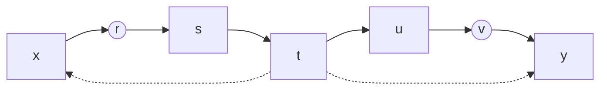
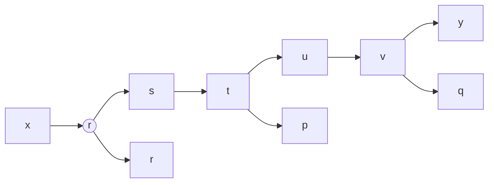
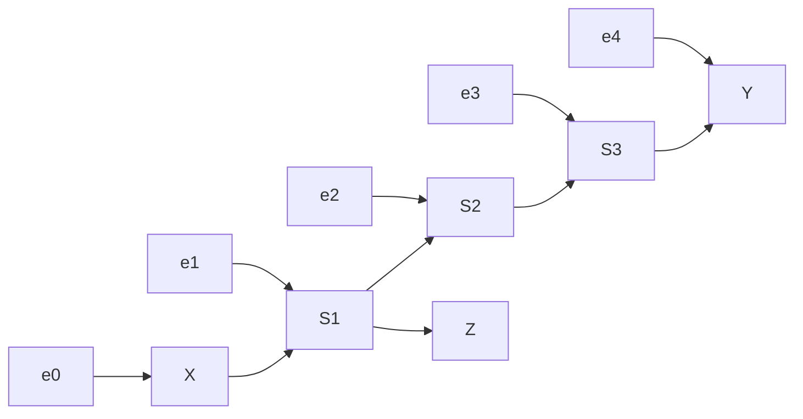

# 第 11 章 对读者的回应、阐述和讨论 —— 系统梳理与学习参考

---

## 一、章节概述

本章是 Judea Pearl《因果论》第 2 版新增的回应性章节，以问答形式回顾并深化第 1～10 章的核心内容。Pearl 在此回答读者提出的普遍性问题，澄清易混淆概念，介绍八年来的新进展，并与 Cartwright、Heckman 等学者展开学术对话。全章按照原书各章的对应主题组织，核心主旨是：

> **统计概念与因果概念有本质区别，混淆二者会导致半个世纪的科学徒劳。**

---

## 二、11.1 因果、统计和图的术语

### 2.1 区分因果和统计是必要的吗？

#### 核心论点

Pearl 斩钉截铁地断言： **必须区分因果概念与统计概念。** 这是全书最根本的哲学立场。

#### 为什么必须区分？

| 维度         | 统计分析                | 因果分析                           |
| ------------ | ----------------------- | ---------------------------------- |
| **目标**     | 评估静态分布参数        | 推断条件变化下事件的 **动态** 变化 |
| **处理对象** | 联合概率分布 $P(X,Y)$   | 干预后的分布 $P(Y \mid do(X=x))$   |
| **核心操作** | 条件化 （conditioning） | 干预（intervention）               |
| **可检验性** | 原则上可检验            | 原则上无法仅从数据检验             |

**黄金法则（书中反复强调）：**

> **每个因果结论的背后必须具备一些在分布函数中无法识别的因果假定。** 即：「关联关系不能推出因果关系」。

#### 随机化是因果概念而非统计概念

这是最精妙的论证：

- 给定二元密度函数 $f(x,y)$ ， **仅凭分布无法判断** 哪个变量是随机的
- 随机化涉及 **外部干预** ——受试者被「强迫」接受某种实验方案
- 因此随机化是 **因果概念** ，不是统计概念

#### 科学史上的沉痛教训

Pearl 列举了多个学科因混淆因果与统计而浪费半世纪的实例：

1.  **哲学** ：试图将因果性归结为概率论（「证据决策理论」等陷阱）
2.  **流行病学** ：试图用关联语言定义「混杂」（至今仍有人坚持）
3.  **社会学** ：试图仅靠回归分析评估公共政策，最终失望承认「回归分析除了产生条件均值和条件方差，什么也没有做」
4.  **经济学** ：试图用分布定义「外生性」

#### 如何在统计学文献中识别因果符号？

三种等价的因果符号系统：

| 符号系统     | 示例                                | 来源              |
| ------------ | ----------------------------------- | ----------------- |
| **潜在结果** | $Y_x(u)$ 或 $Y(x,u)$                | Neyman-Rubin 传统 |
| **do-算子**  | $P(Y=y \mid do(X=x))$ 或 $P(Y_x=y)$ | Pearl             |
| **图模型**   | 因果图中的有向箭头                  | Pearl             |

> **重要规则** ：任何实证研究如果不用正确的图、反事实标记或 $do(\cdot)$ 表达式开头，其研究结果便是不充分的。

---

### 2.2 无须担心的 $d$ -分离

Pearl 在此为读者提供一个通俗版的 $d$ -分离教程。

#### $d$ -分离的核心思想

将「相关性」与「连通性」、将「独立性」与「分离性」联系起来。

#### 三条规则

**规则 1（无条件 $d$ -连通）** ：

- 若 $x$ 和 $y$ 之间存在一条 **无对撞路径** （即无「头对头」箭头），则 $d$ -连通
- 对撞点（collider）：路径上有两个箭头「头对头」相遇的节点，会 **阻断** 信息流通



在例 11.1.1 的图中， $t$ 是对撞点。路径 $x-r-s-t$ 是非阻断的（ $x$ 和 $t$ 是 $d$ -连通的），但 $x$ 到 $y$ 没有绕过对撞点 $t$ 的路径，因此 $x$ 和 $y$ 是 $d$ -分离的。

**规则 2（条件阻断）** ：

- 若 $x$ 和 $y$ 之间有一条不经过 $Z$ 中节点的无对撞路径，则在 $Z$ 条件下是 $d$ -连通的
- 否则被 $Z$ 阻断

  **规则 3（对撞条件——伯克森悖论）** ：

- 若对撞节点 **或其某个后代** 在条件集 $Z$ 中，则该节点不再阻断任何通过它的路径
- 即：以共同效果（或其后代）为条件，会使原本独立的两个原因变得相关



在例 11.1.3 中，若 $Z = \{r, p\}$ ，由于 $t$ 的后代 $p \in Z$ ，路径 $s-t-u-v-y$ 被打开， $s$ 和 $y$ 变成 $d$ -连通。但 $x$ 和 $u$ 仍被 $Z$ 阻断（因为 $r \in Z$ ）。

#### 应用：预测回归方程中的零系数

若 $y = c_1 p + c_2 r + c_3 x + \epsilon$ ，给定 $p$ 和 $r$ 时 $y$ 与 $x$ 是 $d$ -分离的，故 $c_3 = 0$ 。但 $c_1$ 和 $c_2$ 一般不为零。

---

## 三、11.2 逆转统计时间（第 2 章）

### 问题

能否通过坐标变换使统计时间与物理时间运行方向相反？

### 回答

设有时间序列模型：

$$ X(t) = \alpha X(t-1) + \beta Y(t-1) + \epsilon(t) $$
$$ Y(t) = \gamma X(t-1) + \delta Y(t-1) + \eta(t) $$

其中 $\epsilon(t)$ 和 $\eta(t)$ 不相关。

在原始坐标下，统计时间与物理时间重合（当前状态在过去状态条件下不相关，在未来状态条件下相关）。

通过旋转变换：
$$ X'(t) = a X(t) + b Y(t) $$
$$ Y'(t) = c X(t) + d Y(t) $$

可适当选择 $a, b, c, d$ ，使新坐标下的统计时间与物理时间相反。

> **一般原则** ：沿相反方向对角化噪声相关矩阵。

**时间偏移猜想** （Pearl 提出）：

> 在大多数自然现象中，物理时间至少与一个统计时间吻合。

---

## 四、11.3 估计因果效应

### 4.1 后门准则背后的直观理解

#### 为什么需排除 $X$ 的后代？

后门准则的三个基本原则：

1.  **阻断** 所有从 $X$ 到 $Y$ 的伪路径（后门路径）
2.  **保留** 所有未经改变的直接路径
3.  **不产生新伪路径**

排除 $X$ 的后代正是为了满足原则 3。以 $X$ 的后代为条件会在 $X$ 与噪声因子间产生新路径。



当以 $S_1$ 的后代 $Z$ 为条件时， $Z$ 是虚拟对撞点，产生 $X \leftrightarrow e_1 \to S_1 \to S_2 \to S_3 \to Y$ 的新后门路径。

**关键警示** ：在随机试验中，对 **实验后** 的变量进行校正可能引入偏差（如图所示的机制），但对实验前的协变量校正则是安全的。

---

### 4.2 揭开神秘的「强可忽略性」

**强可忽略性** （Strong Ignorability）用潜在结果语言写作：

$$ \{Y(0), Y(1)\} \perp X \mid Z $$

Pearl 指出，这正是 **后门准则的翻版** ：

$$ P(y \mid do(x)) = \sum_z P(y \mid z, x) P(z) $$

#### 潜在结果的图表示

$\{Y(0), Y(1)\}$ 表示所有通过不经过 $X$ 的路径影响 $Y$ 的外生变量作用之和。用图语言：它们由 $X$ 到 $Y$ 路径上所有节点的父节点表示（无论观测与否）。

> **核心结论** ：协变量集 $Z$ 能 $d$ -分离 $X$ 和 $\{Y(0), Y(1)\}$ ，当且仅当 $Z$ 满足后门准则。

**应用——处理组的治疗效应 （ETT）** ：

若存在满足后门准则的协变量集 $Z$ ，则：

$$ ETT = P(Y\_{x'} = y \mid x) = \sum_z P(y \mid x', z) P(z \mid x) $$

---

### 4.3 后门准则的另一种证明

新证明直接利用 $d$ -分离性质，比原证明（引入辅助干预节点 $F$ ）更直观。

从马尔可夫模型出发， $X$ 的父节点集 $T$ 满足：

$$ P(y \mid \hat{x}) = \sum\_{t \in T} P(y \mid x, t) P(t) $$

$Z$ 可替代 $T$ 的充分必要条件是：

- (i) $(Y \perp T \mid X, Z)$
- (ii) $(X \perp Z \mid T)$

后门准则可推出这两个条件。 $Z$ 由 $X$ 的非后代组成即推出 (ii)，所有后门路径被 $Z$ 阻断即推出 (i)。

#### c-等价

若两个协变量集 $S_1$ 和 $S_2$ 满足：

$$ \sum*{s_1} P(y \mid x, s_1) P(s_1) = \sum*{s_2} P(y \mid x, s_2) P(s_2) $$

则称它们是 **c-等价** 的（产生相同的偏差）。

$C_1$ 或 $C_2$ 中任一个是 $S_1$ 和 $S_2$ 为 c-等价的充分条件：

$$ C_1: X \perp S_2 \mid S_1 \text{且} Y \perp S_1 \mid S_2, X $$
$$ C_2: X \perp S_1 \mid S_2 \text{且} Y \perp S_2 \mid S_1, X $$

---

### 4.4 协变量选择中的数据与知识

当缺乏因果图时，策略如下：

1. 基于领域知识假设合理图模型
2. 用数据检验图的统计含义（条件独立性约束）
3. 搜索所有等价模型类
4. 通过比较不同模型的可容许集和 c-等价性来区分竞争模型

**图的力量** 在于：提供推理的清晰语言，使研究人员能讨论假定的合理性，并在无法达成共识时明确分歧所在。

---

### 4.5 理解倾向得分

#### 定义

倾向得分 $L(s) = P(X=1 \mid S=s)$ 是具有特征 $S=s$ 的个体选择处理 $X=1$ 的概率。

**关键性质** ：给定 $L(s)$ ， $X$ 与 $S$ 独立——即 $X \perp S \mid L(s)$ 。

由此推出 $S$ 与 $L$ 是 **c-等价** 的：

$$ \sum_s P(y \mid s, x) P(s) = \sum_l P(y \mid l, x) P(l) $$

#### 倾向得分方法的真正定位

- 仅当 $S$ 是可容许时， $L$ 也是可容许的
- 若 $S$ 不可容许， $L$ 产生 **完全相同的偏差**
- PSM 本身 **不减少混杂偏差** ，只是降维技巧

> **关键警告** ：因果论断不可能建立在纯粹统计方法上（倾向得分、回归、分层或其他基于分布的设计皆然）。

**减偏是非单调算子** ：消除一个混杂因子带来的偏差可能唤醒另一个蛰伏的未测量混杂因子的偏差。

---

### 4.6 do-算子背后的直观性

$G_{\bar{X}}$ 表示移除所有指向 $X$ 的箭头后的子图。在该图中，若存在 $d$ -分离 $X$ 和 $Y$ 的节点集 $Z$ ，则 $Z$ 在图 $G_{\bar{X}}$ 中阻断所有后门路径。以 $Z$ 为条件后， $X$ 与 $Y$ 的任何剩余相关性都归因于因果效应。

---

### 4.7 $G$ -估计的有效性

一般条件（式 (3.62\*)）的推广：

> 若所有从 $X_k$ 到 $Y$ 的行动回避后门路径都被某个 $X_k,\cdots,X_n$ 的非后代子集 $L_k$ 阻断，则 $P(y|g=x)$ 可识别并由 $g$ -公式（3.63）给出。

对条件（3.62）的三个改进例子（图 11.10～11.12），说明图条件比 Robins 的条件更一般和直观，且图方法正迅速进入流行病学实践。

---

## 五 11.4 策略评估与 do-操作

### 5.1 识别附条件计划

附条件计划（多个行动按观察值依次选择）可约简为条件干预分布的识别问题。

设有 $K$ 个行动变量 $X^i$ ，策略 $g = \{g_i\}$ 使 $X_g^i = g_i(Z^i_{X_g^{<i}}, X_g^{<i})$ ，则：

$$ P(Y\_{X_g} = y) = \sum_z P(y \mid do(x_z), z) P(z \mid do(x_z)) $$

Shpitser 和 Pearl（2006a,b）给出了从联合分布中识别这些量的完整图条件。

---

### 5.2 间接效应的意义

#### 经典困惑

在模型 $X \xrightarrow{a} Z \xrightarrow{b} Y$ 且 $X \xrightarrow{c} Y$ 中，传统 SEM 将间接效应定义为 $ab$ 。但学生的质疑是：计算 $b$ 需固定 $X$ ，而 $ab$ 的解释却要求 $X$ 变化——这如何自洽？

#### Pearl 的回答

> $X$ 对 $Y$ 的 **间接效应** 是：固定 $X$ 为常数，然后对 $Z$ 增加一个量值，这个量值等于 $X$ 增加一个单位时 $Z$ 增加的量值，在此条件下所见 $Y$ 的增加量值。

**中介公式** （式 (4.18)）将此定义推广到非线性模型：

这一回答将路径分析从线性 SEM 扩展到非线性和非参数情形。

---

### 5.3 $do(x)$ 能够表示实际实验吗？

**问题** ：维生素 E 注射的随机实验得出误导性结论，因为真正起效的是「打开保温箱盖子」这个附带操作。

**回答** ： $do(x)$ 操作表示 **理想实验** 中仅直接操纵 $X$ 。若同时操纵了 $Z$ ，则实际条件是 $do(x,z)$ 而非 $do(x)$ 。使用安慰剂（即 $do(x)$ 操作的近似）可避免此类偏差。

**三假设前提** （忠实执行实验、有效因果模型、指定条件下的其他实验数据）共同保证 $do$ -算子可预报正确结果。

---

### 5.4 $do(x)$ 操作是通用的吗？

**Bill Shipley 提议** ：引入 $add(x=n)$ 操作，表示「从外部对 $x$ 增加一个量 $n$ 」，即 $x = f(pa_X) + n$ 。

**Pearl 回应** ：

- 添加操作可在 $do()$ 框架中通过 **工具变量** $I$ 表示（ $do(I)$ 而非 $do(X)$ ）
- 工具效应与 $X$ 的效应不同：前者不稳定，后者稳定
- 许多情况下科学家想估计的是 $X$ 本身的效应，而非工具的效应
- **科学因标准而发展** ： $do$ -操作作为标准服务于 **交流** 和 **理论统一** 两个目的

---

### 5.5 没有操纵的因果关系

**问题** ：性别不可操纵，如何将其置于 $do()$ 之后？

**回答** ：Holland 的格言「没有操作就没有因果关系」抹杀了 90% 的性别差异知识。自然本身就是一个由规律和机制组成的社会，它感知某些变量的值并确定其他变量的值——不需要人类操作。

反事实的发明正是为了允许谈论前提条件的变化，而无须具体说明实现这些条件的物理手段。

> **"没有操作的因果关系？必须有！"**

---

### 5.6 与 Cartwright 一起追猎原因

Cartwright 的三个反对意见及回应：

**反对意见 1** ：大多数研究需要预测非原子干预的效应。

→ **回应** ：许多研究的真正目标是评估理想的原子策略（如「吸烟对癌症的影响」），原子效应代表稳定的生物特征，可用于评估各种实际策略。

**反对意见 2** ：实际策略可能影响系统内其他变量的一系列变化，有些是预期的，有些则不是。

→ **回应** ：在盲目状态下任何模型都无法预测； $do$ -操作恰能在任意背景下检测这种盲目状态是否只能导致无意义答案。

**反对意见 3** ：非原子策略无法通过原子语义评估。

→ **回应** ：已被证明是错误的。复杂附条件计划正是非原子策略的典型，完全可以由 $do$ -操作分析和预测。

---

### 5.7 非模块化的错觉

Cartwright 和 Heckman 认为共享参数的系统是非模块化的，无法独立修改。

**Pearl 的反驳** ：

> **符号模块化并不假设物理模块化。**

「外科手术式」的定义是一种 **符号操作** 。用自由落体例子说明：

$$ a_1 = g, \quad a_2 = g $$

将物体 1 抓住使其 $a_1 = 0$ ，并非改变物理世界中的 $g$ ，而是施加新力 $f$ ：

$$ a_1 = g + f/m_1, \text{其中} f = -g \cdot m_1 $$

同样适用于化油器（安装流量调节器）和经济系统（通过信息修正而非修改物理参数）。

---

## 六、11.5 线性结构模型中的因果分析

### 6.1 参数识别的一般准则

**引理 11.5.1（直接效应的图形化识别）** ：

令 $c$ 表示箭头 $X \to Y$ 的路径系数。若存在 $(W, Z)$ 使：

1.  $Z$ 由 $Y$ 的非后代节点组成
2.  在图 $G_c$ （移走 $X \to Y$ ）中， $Z$ d-分离 $W$ 和 $Y$
3.  在 $G_c$ 中给定 $Z$ ， $W$ 和 $X$ 是 d-连通的

则 $c$ 可识别，且：

$$ c = \frac{\operatorname{cov}(Y, W \mid Z)}{\operatorname{cov}(X, W \mid Z)} $$

（直观上， $W$ 起到 $X \to Y$ 的工具变量作用。）

---

### 6.2 结构系数的因果解释

#### 传统 SEM 的问题

传统课本将结构系数解释为「 $x$ 变化一个单位，其他变量保留原值， $y$ 的变化量」。Pearl 指出这混淆了：

| 传统解释                      | 正确解释                          |
| ----------------------------- | --------------------------------- |
| 「保留原值」                  | 「固定不变」                      |
| 被动观察变化                  | 主动干预变化                      |
| $E(X_0 \mid x_1+1, x_2, x_3)$ | $E(X_0 \mid do(x_1+1, x_2, x_3))$ |

**修正后的解释** ：

$$ b_1 = E(X_0 \mid do(x_1+1, x_2, x_3)) - E(X_0 \mid do(x_1, x_2, x_3)) $$

只有当单门准则（定理 5.3.1）的条件满足时，回归系数才等于因果系数。

---

### 6.3 SEM 救生包——与怀疑考官的对话

Pearl 通过一场假设的博士论文答辩对话，展示如何为 SEM 的因果解释辩护。

**对话核心要点** ：

1.  **结构方程与回归方程的本质区别** ：结构方程传达对假设性随机实验结果的定性假定
2.  **因果假设是另一种类型** ，不能写成密度函数或协方差矩阵的形式
3.  **模型假定是定性的、宽泛的** ，而结论（如 $c=0.78$ ）是定量的
4.  **饱和模型不是缺陷** ——它意味着研究人员拒绝做出难以置信的因果假定，这是一种应受赞扬的保守态度
5.  **存在竞争模型时** ，可报告每个候选模型的结论及其依据的假定集合

---

### 6.4 今天的经济学模型在哪里——与 Heckman 一起追求原因

#### Heckman 的立场

Heckman 拒绝「外科手术式」语义，提出基于「 **外部变化** 」的因果效应新定义：

1. 选择一个出现在 $f_j$ 中的外部变量 $X_t$
2. 从其他方程中移走 $X_t$
3. 求解简化形式
4. 因果效应 = 偏导数之比： $\mathrm{d}Y_k/\mathrm{d}Y_j = (\mathrm{d}g_k/\mathrm{d}X_t) / (\mathrm{d}g_j/\mathrm{d}X_t)$

#### Pearl 的批评

1. 「排除」即修改参数，同样是「外科手术」
2. 依赖外部变量来定义因果效应在逻辑上无根据；因果效应指 **新的外部操作** 的量化效应
3. 若目标方程不含可观测外部变量，方法失效；且难以推广到离散变量
4. 非因果方程组（对称等式）中，排除哪个外部变量产生歧义

**总结** ：

> 「外科手术式」定义具有通用性、语义清晰性和计算简单性，而「外部变化」方法在模型定义层面缺乏逻辑基础。结构方程的因果语义可以将计量经济学中两个对立阵营（潜在结果派与结构方程派）统一起来。

---

## 七、11.6 决策与混杂

### 7.1 辛普森悖论与决策树

**Megiddo 的挑战** ：决策树已能解决辛普森悖论，不需要「因果性」。

```
图 11.16a: 性别的决策树（F=性别在C=治疗之前）
 → 无论男性还是女性，¬C 均优于 C
 → 结论：不应服药

图 11.16b: 血压的决策树（F=血压在C=治疗之后）
 → C 优于 ¬C（0.5 > 0.4，总体效果）
 → 结论：应服药
```

**Pearl 的回应** ：

> 为相同频率表构造不同决策树意味着：决策树的关键不在于数据本身，而在于从数据背后的 **因果故事** 中获得的信息。

**时间信息不充分** ：图 11.17c 的时间顺序与图 11.17a 相同，但表示不同的因果结构，导致不同的正确决策树。仅凭时间顺序和相关关系无法区分二者。

**建议** ：给机器人二元组 $(T, G)$ ，其中 $T$ 是频率表， $G$ 是因果图，机器人便能自动构造正确决策树。

---

### 7.2 Lindley 关于因果性、决策树和贝叶斯主义的理解

**Pearl 向贝叶斯学派传达的两个论点** ：

**论点 1：简约性** 。因果图是构造各种决策树所需概率评估的简约表示。给定 $(G, P)$ ，机器人可以按需构造决策树。

**论点 2：相合性** 。概率 $P(y \mid do(x))$ 和 $P(y \mid x)$ 不能完全随意，必须遵守相合性约束（如 $P(y \mid do(x)) \geqslant P(y, x)$ ）。当从因果网络推导时，这些约束自动满足。

> 「从好处中获得理解」——贝叶斯学派最终会接受因果词汇。

---

### 7.3 为什么混杂不是一个统计学概念

#### 审稿人的质疑

> 「当 $U$ 与 $X$ 和 $Y$ 都不独立时， $U$ 是混杂因子，因此混杂是统计学概念。」

#### Pearl 的反驳（三枚反例）

**反例 1** ： $U$ 同时受 $X$ 和 $Y$ 影响。满足「与 $X$ 和 $Y$ 都不独立」的条件，但 $U$ **不是** 混杂因子，可安全忽略。

**反例 2** ： $U$ 位于从 $X$ 到 $Y$ 的因果路径上。满足条件，但 $U$ 是 **中介变量** 而非混杂因子——不应校正！（一代代统计学家被教导不要校正此类变量。）

**反例 3** （图 6.5）： $U$ 是混杂因子，但 $U$ 与 $X$ 或 $Y$ 都 **不相关** ——与审稿人的「定义」矛盾。

> **「统计与因果的分界线」的有用性正体现于此** ：使用随机化、混杂、工具变量等概念时，必须谨慎剥离和说明背后的因果假设。

---

## 八、11.7 反事实的演算

### 8.1 线性系统中的反事实

**申明 A** ：在线性因果模型中，任何 $E(Y_x \mid e)$ 形式的反事实都是实证可识别的。

**申明 B** ：只要 $T = E(Y \mid do(x+1)) - E(Y \mid do(x))$ 可识别， $E(Y_x \mid e)$ 便也可识别。

**申明 C——核心公式** ：

$$ E(Y_x \mid e) = E(Y \mid e) + T\left[x - E(X \mid e)\right] $$

或用 $do()$ 符号：

$$ E(Y_x \mid e) = E(Y \mid e) + E(Y \mid do(x)) - E[Y \mid do(X = E(X \mid e))] $$

**直观解释** ：给定证据 $e$ ， $Y$ 在假设 $X=x$ 下的期望等于当前 $Y$ 的最佳估计，加上 $X$ 从当前期望值变到 $x$ 所引起的预期变化（ $T$ 乘以 $X$ 的改变量）。

#### 三个特例

| 情况                     | $E(Y_x \mid e)$            |
| ------------------------ | -------------------------- |
| $e: X=x', Y=y'$          | $y' + T(x - x')$           |
| $e: X=x'$ （处理组效应） | $E(Y \mid x') + T(x - x')$ |
| $e: Y=y'$                | $y' + T[x - E(X \mid y')]$ |

---

### 8.2 反事实的意义

针对「为什么需要反事实」的质疑，Pearl 从三方面回答：

**1. 法律责任** ：需要判断「如若没有服用药物，病人是否会存活」——这是反事实问题。

**2. 决策中的背景问题** ：在固定模型里， $P(y \mid do(x), z)$ 表示「先做 $X=x$ 再观察 $Z=z$ 」；而决策中需要「先观察 $Z=z$ 再做 $X=x$ 」的概率，这正是反事实 $P(y_x \mid z)$ 。

**3. 概念定义** ：反事实是表达科学（因果）关系的最精确语言工具，是记录人类经验的「速记法」，以便在广泛应用中分享。

---

### 8.3 反事实的 $d$ -分离

推广孪生网络到多个可能世界时，需考虑因果公理要求的反事实变量间的隐含等式约束。

例如：在多世界网络中， $W_{x^*} = W$ （因 $W$ 不是 $X$ 的后代）这种约束在应用 $d$ -分离到反事实网络时需额外考虑。Shpitser 和 Pearl（2007）给出了描述和处理这些等同性的系统方法（「反事实图」）。

---

## 九、11.8 工具变量与不依从性

### 严格界限的改进

Balke 和 Pearl（1994a, 1995a）利用 $U$ 的 **正则划分** 和线性规划方法导出了不依从性试验中治疗效果的严格界限。

**与 Manski 方法的区别** ：

- 使用相同信息和假定
- 但通过将 $U$ 划分为等价类（如「永远服用者」「从不服用者」「依从者」「反向者」）收紧界限
- Manski 的界限仅在无反向作用时是严格的

  **影响** ：正则划分 + 线性规划成为强大分析工具，被推广至因果关系概率估计、直接效应界限估计等。

---

## 十、11.9 更多关于因果关系的概率

### 10.1 「有罪的概率为 1」有可能吗？

式（9.53）： $PN \geqslant 1$ ——即「若 A 先生没有服药，他今天肯定还活着」的因果概率为 1。

**三点困惑与解答** ：

1.  **假设量何以确定？** ：形式语义本质上定义了量与数据的关系，在某些数据下收缩到一点并非不可想见。
2.  **频率表何以蕴含敏感性？** ： $P(y_{x'}) = P(y, x')$ 即意味着干预不增加结果，参见直观解释。
3.  **个体何以被赋值概率 1？** ：司法采用「高度盖然性」标准，允许忽略无法获得数据的属性，仅根据最具体的可获得属性建立裁定。

### 10.2 收紧因果关系的概率界限

Tian 和 Pearl（2000）的改进：

- 弱外生性可替代强外生性
- 无单调性假定时下界可进一步降低
- 推导出的界限是紧的

当实验和非实验数据均可用时的界限（式 (11.41)～(11.43)）。在药品诉讼中，结合两类数据可使 PN 的下界较传统超额风险率 **显著改善** 。

---

## 十一、核心概念速查表

| 概念           | 定义/公式                                                                   | 统计还是因果？                 |
| -------------- | --------------------------------------------------------------------------- | ------------------------------ |
| ** $d$ -分离** | 给定 $Z$ ， $X$ 与 $Y$ 间无 $d$ -连通路径                                   | 图论工具（服务于因果）         |
| **后门准则**   | $Z$ 阻断所有 $X$ 到 $Y$ 的后门路径且不含 $X$ 后代                           | 因果                           |
| **前门准则**   | $Z$ 截断所有 $X$ 到 $Y$ 的因果路径                                          | 因果                           |
| **do-算子**    | $P(y \mid do(x))$ ：干预后的分布                                            | 因果                           |
| **强可忽略性** | $\{Y(0), Y(1)\} \perp X \mid Z$                                             | 因果（后门的反事实表述）       |
| **倾向得分**   | $L(s) = P(X=1 \mid S=s)$                                                    | 统计（但有效性取决于因果条件） |
| **c-等价**     | $\sum_{s_1}P(y\mid x,s_1)P(s_1) = \sum_{s_2}P(y\mid x,s_2)P(s_2)$           | 统计                           |
| **混杂**       | 引起 $P(y \mid x) \neq P(y \mid do(x))$ 的因素                              | 因果                           |
| **中介公式**   | $IE = \sum_z P(z \mid x)\sum_{x'} [P(y \mid x, z) - P(y \mid x', z)] P(x')$ | 因果                           |
| **ETT**        | $P(Y_{x'} \mid x)$ ：已处理者如未处理的概率                                 | 因果（反事实）                 |
| **PN**         | 若未暴露则不会发生的概率                                                    | 因果（反事实）                 |

---

## 十二、金句摘录

1. 「 **关联关系不能推出因果关系** 」——黄金法则
2. 「 **每个因果结论的背后必须具备一些在分布函数中无法识别的因果假定** 」
3. 「 **符号模块化并不假设物理模块化** 」
4. 「 **没有操作的因果关系？必须有！** 」
5. 「 **科学的发展在于区别概念和事物，特别是对那些不能混为一谈的概念** 」
6. 「 **图之于因果关系，就如同 X 射线之于外科医生** 」
7. 「 **科学因标准而发展，因为标准服务于交流和理论统一** 」

---

## 十三、学习建议

1.  **先理解统计与因果的区分** ——这是全章的立论基础，也是理解后续所有讨论的钥匙
2.  **掌握 $d$ -分离的三条规则** ——这是图模型推理的操作核心
3.  **后门准则 = 图形式的强可忽略性** ——连接潜在结果传统与图模型的关键桥梁
4.  **倾向得分只是降维技巧，不是减偏工具** ——避免实践中最常见的误解
5.  **结构系数 ≠ 回归系数** ——仅在单门准则条件下等价的本质区别
6.  **反事实不是「错误的问题」** ——它是科学表达因果关系的精确语言
