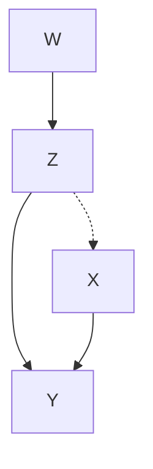
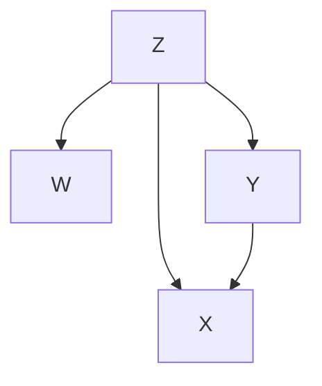
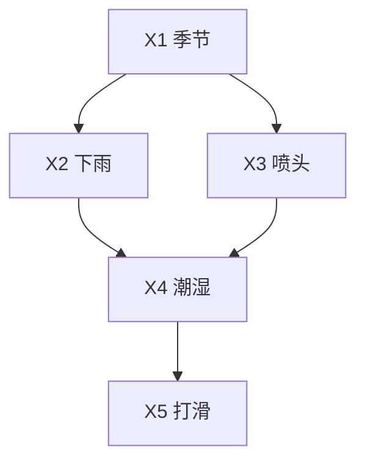
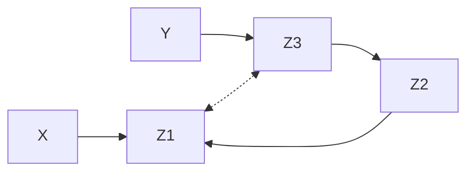
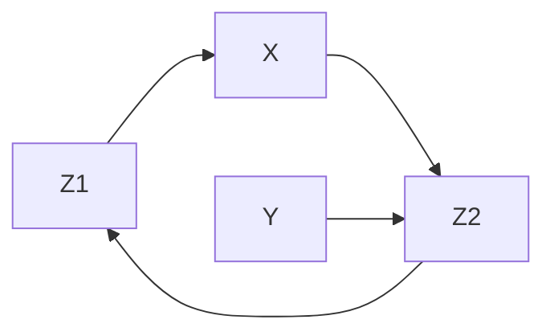
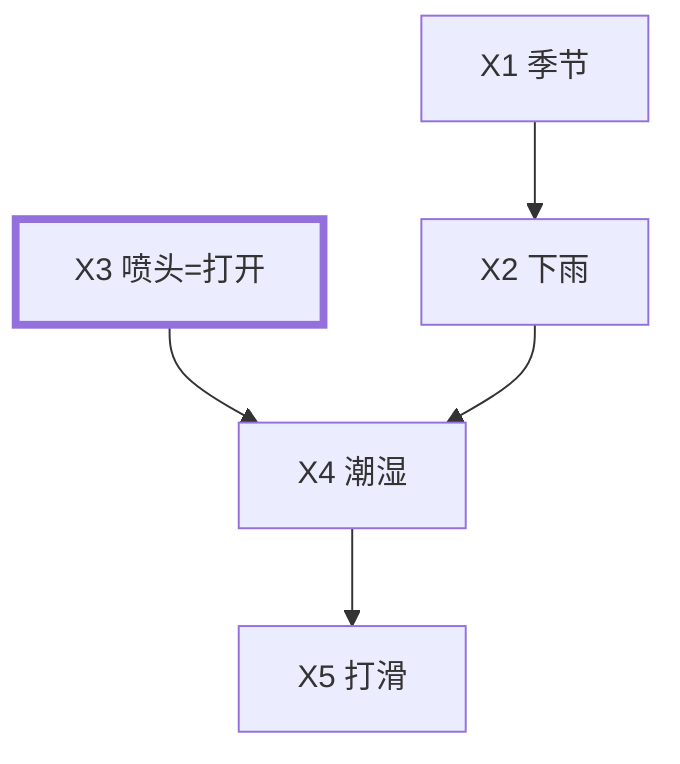
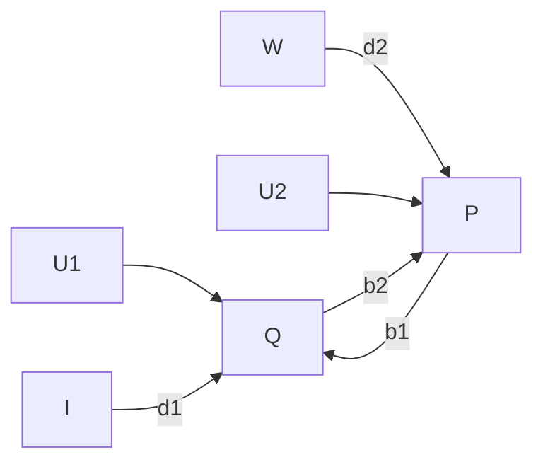
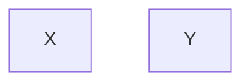
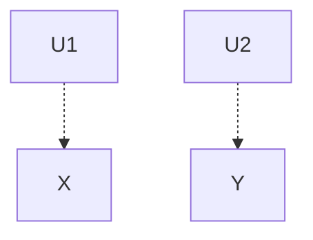
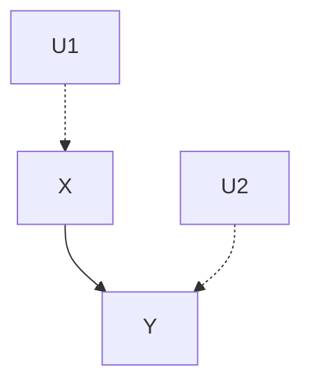

# 第 1 章 概率、图及因果模型

思想应时而生，顺时而变。

—Pascal（1670）

## 1.1 概率论概述

### 1.1.1 为什么学习概率

因果意味着定理般的必然性，而概率则意味着例外、疑问、缺乏规律性。尽管如此，本书仍然从因果关系（causation）的概率分析入手并强调概率，这有两个令人信服的理由：一个理由非常简单，而另一个则比较微妙。

简单的理由在于观察到人们经常在充满不确定性的场景中使用因果陈述。例如，我们会说“鲁莽驾驶会导致事故”或者“你会因为懒惰而挂科”（Suppes，1970）。我们确信前置因素只会使结果更可能发生而不是绝对肯定发生。因此，任何旨在容纳这种陈述的因果理论都必须用一种能够表述各种可能性差别的语言，即概率语言。

基于这种认识，我们意识到，在目前使用因果建模的大多数学科（如经济学、流行病学、社会学和心理学）中，概率论是公认的数学语言。在这些学科中，研究人员不仅关注是否存在因果关系，还关注这些关系的相对强度，以及从充满噪声的观察数据中推断这些关系的方法。在统计分析方法的帮助下，概率论提供了处理这些观察数据并从中获取推断的原理与方法。

比较微妙的理由在于，即使自然语言中最肯定的因果陈述也存在例外，如果按照确定性逻辑的标准规则进行处理，那么这些例外可能会引发严重问题。例如，考虑如下两个看似可信的前提：

- 1. 无论何时我的屋顶变湿，我邻居家的屋顶都会变湿。
- 2. 如果我给我的屋顶喷水，那么我的屋顶会变湿。

从字面上看，这两个前提蕴含着一个难以置信的结论：无论何时我给我的屋顶喷水，我邻居家的屋顶都会变湿。

这种矛盾的结论通常是由语言有限的细化程度所造成的，这可由前提 1 隐含的许多例外情况证明。事实上，一旦我们详尽解释这些例外并写出来，这个悖论就消失了，例如：

> 1\*. 无论何时我的屋顶变湿，我邻居家的屋顶都会变湿，除非邻居的屋顶由塑料覆盖，或者我的屋顶被喷水，等等。

概率论特别能够容忍无法解释的例外情况，因此它使我们能够专注于因果关系的主要问题，而不必处理这类矛盾。

在后续的章节中，我们会看到容忍例外只解决了与因果关系相关的部分问题。剩下的问题，包括推断（inference）、干预（intervention）、识别（identification）、分歧（ramification）、混杂（confounding）、反事实（counterfactual）以及解释（explanation），将是本书的主要内容。通过用概率的语言描述这些问题，我们强调了它们在不同语言中的一般性。第 7 章将用确定性逻辑语言重新描述这些问题，并引入概率，但仅将其作为一种表达未观察到的事实引起的不确定性（nondeterminism）的方法。

### 1.1.2 概率论的基本概念

本书的大部分讨论将集中于具有有限个离散变量的系统，因此仅需要概率论中的基本符号和概念。本书也会概述对于连续变量的扩展，但不进行全面阐述。

想要了解更多数学工具的读者可以阅读关于这个主题的其他优秀教科书，例如 Feller（1950）、Hoel 等人（1971），或者 Suppes（1970）的附录。基于 Pearl（1988b），本节简单总结了概率论的基本概念，并重点阐述了贝叶斯推断与不确定条件下人类推理心理之间的联系。标准教科书中通常没有这部分阐述。

我们将坚持概率的 **贝叶斯解释** （Bayes interpretation），即根据概率描述对事件的信念程度，并使用数据来增强、更新或削弱这些信念程度。在这种形式化中，信念程度被赋予某种语言的命题（能判断真或假的句子）。根据概率演算规则，这些信念程度可进行组合和操作。

我们将不区分句子命题与这些命题所代表的实际事件。例如，如果 $A$ 代表陈述“爱德华·肯尼迪将谋求 2012 年的总统提名”，那么 $P(A|K)$ 代表一个人在给定知识体系 $K$ 的条件下对 $A$ 所描述事件的主观信念。 $K$ 可能包含了这个人对美国政治与肯尼迪所做的具体声明的设想，以及对肯尼迪的年龄与性格的评估。在定义概率表达式时，我们通常简单写成 $P(A)$ ，忽略符号 $K$ 。然而，当背景信息发生变化时，我们需要明确地识别解释信念的假定，并明确地表示 $K$ （或 $K$ 的部分元素）。

在贝叶斯形式化中，信念测度服从概率演算的三个基本公理：

$$
0 \leqslant P (A) \leqslant 1 \tag {1.1}
$$

$$
P (\text {确定命题}) = 1 \tag {1.2}
$$

如果 A 与 B 互斥，则 $P(A \text{或} B) = P(A) + P(B)$ \tag{1.3}

第 3 条公理表明，任何一组事件的信念是其非相交成分的信念的总和。由于任何事件 A 都可以写成联合事件 $(A \land B)$ 与 $(A \land \neg B)$ 的并，因此它们对应的概率可写为：

> 符号 $\wedge$ 、 $\vee$ 、 $\neg$ 、 $\Rightarrow$ 分别表示逻辑连接符与、或、非、蕴含。

$$
P (A) = P (A, B) + P (A, \neg B) \tag {1.4}
$$

其中， $P(A,B)$ 是 $P(A\wedge B)$ 的简写。更一般地，如果 $B_{i}$ （ $i=1,2,\cdots,n$ ）是一组完备的互斥命题（称为划分或变量），那么 $P(A)$ 可通过对 $P(A,B_{i})$ （ $i=1,2,\cdots,n$ ）求和得到：

$$
P (A) = \sum_ {i} P (A, B_{i}) \tag {1.5}
$$

该式称为“全概率公式”。在所有 $B_{i}$ 上的概率求和操作也称为“边缘化于 B”，获得的概率 $P(A)$ 称为 A 的 **边缘概率** 。例如，事件 A“两个骰子的结果相等”的概率可通过对所有的联合事件 $(A\land B_{i})$ （ $i=1,2,\cdots,6$ ）求和得到，其中 $B_{i}$ 代表命题“第 1 个骰子的结果是 i”。那么可以得到：

$$
P (A) = \sum_ {i} P (A, B_{i}) = 6 \times \frac {1}{36} = \frac {1}{6} \tag {1.6}
$$

式（1.2）和式（1.4）的一个直接推论是一个命题与其否定必然构成一个个体的全信念，即

$$
P (A) + P (\neg A) = 1 \tag {1.7}
$$

因为这两个陈述之一必为真。

贝叶斯形式化的基本表达式是关于条件概率的陈述，例如， $P(A|B)$ 刻画了在 $B$ 完全已知的条件下对于 $A$ 的信念。如果 $P(A|B)=P(A)$ ，那么我们认为 $A$ 与 $B$ **独立** 。因为在获悉 $B$ 的事实后，我们对于 $A$ 的信念并没有改变。如果 $P(A|B,C)=P(A|C)$ ，那么我们认为 $A$ 与 $B$ 在给定 $C$ 时 **条件独立** ，即一旦我们了解 $C$ ，那么获悉 $B$ 将不能改变我们对于 $A$ 的信念。

传统做法利用联合事件定义条件概率，见式（1.8）。

$$
P (A \mid B) = \frac {P (A , B)}{P (B)} \tag {1.8}
$$

与之相反，贝叶斯派学者认为条件关系比联合事件的关系更基本，即更符合人类知识结构的组织。在这种观点中， $B$ 作为指向知识背景或框架的指针， $A \mid B$ 表示由 $B$ 确定的背景中的事件 $A$ （例如，在疾病 $B$ 背景下的症状 $A$ ）。因此，经验知识将必然被描述到条件概率陈述中，而对联合事件的信念（如果需要的话）可通过式（1.9）的乘积计算得到：

$$
P (A, B) = P (A \mid B) P (B) \tag {1.9}
$$

该式等价于式（1.8）。例如，在式（1.6）中直接估计 $P(A, B_i) = \frac{1}{36}$ 不是太自然。这种估计背后隐含心理上的推测：两个骰子结果相互独立，因此为了明确这个假定，须知联合事件（相等， $B_i$ ）的概率可通过如下乘积从条件事件（相等 $\vert B_i$ ）估计得到：

$$
P (\text {相等} \mid B_{i}) P (B_{i}) = P (\text {第 2 个骰子的结果是} i \mid B_{i}) P (B_{i}) = \frac {1}{6} \times \frac {1}{6} = \frac {1}{36}
$$

式（1.5）中，任何事件 $A$ 的概率都可通过对任意一组完备的互斥事件 $B_{i}$ （ $i = 1, 2, \dots, n$ ）取条件，然后求和计算得到：

$$
P(A) = \sum_{i} P(A \mid B_{i}) P(B_{i}) \tag{1.10}
$$

这种分解为假设推理或“基于假定”的推理提供了基础。它表明任何事件 $A$ 的信念是对所有可能实现 $A$ 的不同方法的信念的加权和。

例如，如果想要计算第 1 个骰子的结果 $X$ 大于第 2 个骰子的结果 $Y$ 的概率，我们可以在 $X$ 的所有可能值上对事件 $A: X > Y$ 取条件获得：

$$
P(A) = \sum_{i = 1}^{6} P(Y < X \mid X = i) P(X = i)
     = \sum_{i = 1}^{6} P(Y < i) \frac{1}{6}
     = \sum_{i = 1}^{6} \sum_{j = 1}^{i - 1} P(Y = j) \frac{1}{6}
     = \frac{1}{6} \sum_{i = 2}^{6} \frac{i - 1}{6}
     = \frac{5}{12}
$$

有必要再次强调的是，类似（1.10）的公式总是可以理解为适用于更大的背景 $K$ ，其定义了作为常识的假定（例如，掷骰子的公平性）。式（1.10）实际上是如下表述的简写：

$$
P(A \mid K) = \sum_{i} P(A \mid B_{i}, K) P(B_{i} \mid K) \tag{1.11}
$$

这个公式遵从事实：任何条件概率 $P(A|K)$ 本身也是一个真实的概率函数，因此满足式（1.10）。

乘积法则（式（1.9））的另一个有用推广是 **链式法则公式** 。该公式表明如果我们有 $n$ 个事件 $E_{1}, E_{2}, \cdots, E_{n}$ ，那么联合事件 $(E_{1}, E_{2}, \cdots, E_{n})$ 的概率可以写为 $n$ 个条件概率的乘积：

$$
P(E_{1}, E_{2}, \dots, E_{n}) = P(E_{n} \mid E_{n - 1}, \dots, E_{2}, E_{1}) \dots P(E_{2} \mid E_{1}) P(E_{1}) \tag{1.12}
$$

该乘积可按合适的顺序反复应用式（1.9）推导得到。

贝叶斯推断的核心在于著名的 **反演公式** ：

$$
P(H \mid e) = \frac{P(e \mid H) P(H)}{P(e)} \tag{1.13}
$$

该公式表明，在获悉证据 $e$ 的条件下假设 $H$ 的信念可通过将我们之前的信念 $P(H)$ 与似然性 $P(e|H)$ 相乘得到，后者表示如果 $H$ 为真则 $e$ 为真的可能性。 $P(H|e)$ 称为 **后验概率** ， $P(H)$ 称为 **先验概率** 。式（1.13）的分母 $P(e)$ 几乎不用考虑，可通过令 $P(H|e)$ 与 $P(\neg H|e)$ 相加为 1，得到 $P(e) = P(e|H)P(H) + P(e|\neg H)P(\neg H)$ ，它仅仅是一个归一化常数。

然而形式上，式（1.13）可能会被误认为是条件概率定义的重复表述：

$$
P (A \mid B) = \frac {P (A , B)}{P (B)} \quad \text {以及} \quad P (B \mid A) = \frac {P (A , B)}{P (A)} \tag {1.14}
$$

贝叶斯主观主义者将式（1.13）看作依据证据更新信念的标准规则。换句话说，尽管条件概率可以被看作纯粹的数学概念（如式（1.14）），但贝叶斯派拥护者将其看作语言的基本形式、语言表达“假定我知道 $A$ ，……”的忠实翻译。相应地，式（1.14）不是一个定义，而是语言表述之间的一种经验可验证关系。式（1.14）断言，获悉 $A$ 后人们对于 $B$ 的信念不会低于获悉 $A$ 之前人们对于 $A \wedge B$ 的信念。此外，这两个信念的比率会依据 $[P(A)]^{-1}$ 的程度成比例增加，而 $[P(A)]^{-1}$ 与 $A$ 的获悉程度相关 $^{①}$ 。

> ① 原文此处为脚注标记，表示对正文内容的补充说明。

式（1.13）的重要性在于，它利用直接由经验知识获得的数值表示度量 $P(H|e)$ ，这是一个通常很难估计的度量。例如，如果某个赌桌的人喊了“12”，我们想知道他是在掷骰子还是在转轮盘，那么根据赌博设备的模型很容易得出结论： $P(12|\text{骰子})$ 为 $1/36$ ， $P(12|\text{轮盘})$ 为 $1/38$ 。同样，我们可以通过估计赌场里轮盘和骰子赌桌的数量来判断 $P(\text{骰子})$ 和 $P(\text{轮盘})$ 的先验概率。直接判断 $P(\text{骰子}|12)$ 非常困难，只有在这家赌场受过训练的专家才能可靠地做出判断。

为了完善这个简短的概述，我们必须讨论概率模型（也称为概率空间）的概念。概率模型是一种信息编码，它允许我们计算遵从公理（1.1）～（1.3）的标准语句 $S$ 的概率。从一组原子命题 $A, B, C, \cdots$ 开始，标准语句集由涉及这些命题的所有布尔公式组成，例如， $S = (A \wedge B) \vee \neg C$ 。

刻画概率模型的传统方法是应用联合分布函数，该函数为语言中的每个基本事件赋予非负权重并使权重之和为 1（一个基本事件是一个合取，每个原子命题或其否定只出现一次）。例如，如果我们有 3 个原子命题 $A$ 、 $B$ 、 $C$ ，那么联合分布函数会为所有的 8 个组合（ $(A \wedge B \wedge C)$ 、 $(A \wedge B \wedge \neg C)$ 、…、 $(\neg A \wedge \neg B \wedge \neg C)$ ）赋予非负权重，使这 8 个权重之和为 1。

读者可以将基本事件集看作概率论教科书中的样本空间。例如，如果 $A$ 、 $B$ 、 $C$ 分别代表硬币 1、2、3 正面朝上的命题，那么样本空间表示为集合 $\{HHH, HHT, HTH, \cdots, TTT\}$ 。实际上，将基本事件的合取式看作点（或者世界，或者格局），并将其他公式看作由这些点组成的集合，这样会比较方便。由于每一个布尔公式都可以表示为基本事件的析取，并且这些基本事件是互斥的，因此我们总是可以利用可加性公理（式（1.3））来计算 $P(S)$ 。条件概率可以通过同样的方法使用式（1.14）计算。因此，任何联合概率函数都代表一个完整的概率模型。

联合分布函数是一种非常重要的数学构造。它允许我们快速确定是否有足够的信息来刻画一个完整的概率模型，我们得到的信息是否一致，以及在什么情况下我们需要额外的信息。方法是简单地检查可用信息是否足以唯一地确定域中每个基本事件的概率，以及这些概率之和是否为 1。

然而，实际上，联合分布函数很少可以明确刻画。在连续随机变量的分析中，分布函数由代数表达式给出，例如描述正态分布或指数分布的表达式。对于离散变量，已经发展了间接表示方法，即从部分变量之间的局部关系中推断总体分布。作为这些表示中最流行的一种， **图模型** 为贯穿本书的讨论提供了基础。接下来的几节中将会讨论图模型的使用与形式化描述。

### 1.1.3 预测支持与诊断支持结合

贝叶斯规则（式（1.13））的本质是使用概率和似然比这样的参数来方便地描述问题。将式（1.13）除以其互补式 $P(\neg H|e)$ ，可以得到

$$
\frac{P(H \mid e)}{P(\neg H \mid e)} = \frac{P(e \mid H)}{P(e \mid \neg H)} \frac{P(H)}{P(\neg H)} \tag{1.15}
$$

定义 $H$ 的先验概率为

$$
O(H) = \frac{P(H)}{P(\neg H)} = \frac{P(H)}{1 - P(H)} \tag{1.16}
$$

$H$ 的似然比为

$$
L(e \mid H) = \frac{P(e \mid H)}{P(e \mid \neg H)} \tag{1.17}
$$

后验概率

$$
O(H \mid e) = \frac{P(H \mid e)}{P(\neg H \mid e)} \tag{1.18}
$$

由如下乘积得到

$$
O(H \mid e) = L(e \mid H) O(H) \tag{1.19}
$$

因此，贝叶斯规则说明，基于先验知识 $K$ 和观察到的证据 $e$ ，我们对于假设 $H$ 的总体信念强度应该是两个因素的乘积：先验概率 $O(H)$ 和似然比 $L(e|H)$ 。第一个因子衡量的是仅通过背景知识获得的对 $H$ 的 **预测性支持** 或 **预期性支持** ，而第二个因子表示实际观察到的证据对 $H$ 的 **诊断性支持** 或 **回顾性支持** 。

严格来说，似然比 $L(e \mid H)$ 可能依赖于隐性知识库 $K$ 的内容。然而，贝叶斯方法的影响主要来自事实：在因果推理中，关系 $P(e \mid H)$ 是非常局部的关系——由于 $e$ 通常不依赖于知识库中的其他命题，因此假定 $H$ 为真，那么 $e$ 的概率就可以很自然地被估计出来。

例如，一旦我们确定病人患有给定的疾病 $H$ ，那么可以很自然地估计他将出现某种症状 $e$ 的可能性。医学知识的组织在于这样一种范式：症状是疾病的一种稳定特征，因此应该与其他因素相互独立，例如流行状况、疾病史和有缺陷的诊断设备。出于这个原因，条件概率 $P(e \mid H)$ 而非 $P(H \mid e)$ 是贝叶斯分析中的原子关系。前者具有类似逻辑规则的模块化特征，传达了类似“如果 $H$ 则 $e$ ”的具有逻辑化的信念强度，这是一种不管知识库中存在什么其他规则或事实都能成立的信念。

> **例 1.1.1** 想象一下，有一天晚上你被防盗警报器的尖锐声音吵醒。你对于发生盗窃的信念强度是多少？为了便于说明，我们做出以下判断：
>
> - （a）企图盗窃触发警报系统的可能性为 $95\%$ ，即 $P(\text{警报} \mid \text{盗窃}) = 0.95$ ；
> - （b）基于已知的错误警报次数，由企图盗窃之外的因素触发警报系统的可能性为 $1\%$ ，即 $P(\text{警报} \mid \text{非盗窃}) = 0.01$ ；
> - （c）以往的犯罪模式表明，某所房子在某天晚上被盗的可能性为万分之一，即 $P(\text{盗窃}) = 10^{-4}$ 。

应用式（1.19）整合这些假定，我们得到

$$
O(\mathrm{盗窃} \mid \mathrm{警报}) = L(\mathrm{警报} \mid \mathrm{盗窃}) O(\mathrm{盗窃}) = \frac{0.95}{0.01} \times \frac{10^{-4}}{1 - 10^{-4}} = 0.0095
$$

因此，依据

$$
P(A) = \frac{O(A)}{1 + O(A)} \tag{1.20}
$$

我们得到

$$
P(\text{盗窃} \mid \text{警报}) = \frac{0.0095}{1 + 0.0095} = 0.00941
$$

因此，由警报证据获得的对盗窃假设的回顾性支持将盗窃可能的信念强度几乎提高了一百倍，从 $\frac{1}{10000}$ 提升到 $\frac{94.1}{10000}$ 。考虑到系统几乎每三个月就会触发一次误报，盗窃的信念仍低于 $1\%$ ，这一事实便不足为奇。注意，没有必要估计概率 $P(\text{警报}|\text{盗窃})$ 和 $P(\text{警报}|\text{非盗窃})$ 的值。只有它们的比值才会被用于计算 $\left(\text{即} \frac{0.95}{0.01}\right)$ ，所以我们可以直接估计这个比值。

### 1.1.4 随机变量与期望

本书的变量指的是属性、度量或问题，从特定域取得一些可能的结果或值。如果我们对变量的可能取值赋予某种信念（即概率），那么我们称这个变量为随机变量①。

> ① 例如，我明天要穿的鞋子的颜色是一个名为“颜色”的变量，它的可能取值来自域{黄色，绿色，红色，…}。

本书大部分的分析集中于随机变量（也称为划分）的有限集 $V$ ，其中每个变量 $X \in V$ 从有限域 $D_X$ 中取值。我们将使用大写字母（例如 $X, Y, Z$ ）表示变量名，使用小写字母（ $x, y, z$ ）表示对应变量所取的具体值。例如，如果 $X$ 表示一个对象的颜色，那么 $x$ 表示集合 {黄色，绿色，红色，…} 中任何可能的具体选择。显然，命题“ $X =$ 黄色”描述了一个事件，即满足命题“对象的颜色是黄色”的事件状态集的一个元素。同样，由于陈述 $X = x$ 定义了一个完备且互斥的状态集，每个状态对应 $x$ 的一个值，因此每个变量 $X$ 可以看作所有状态的一个划分。

在大多数讨论中，我们不区分变量和变量集合之间的符号，因为变量集合本质上定义了一个复合变量，它的定义域是集合中各个组成部分的定义域的笛卡儿积。因此，如果 $Z$ 代表集合 $\{X, Y\}$ ，那么 $z$ 代表值对 $(x, y)$ ，其中 $x \in D_X$ 且 $y \in D_Y$ 。当需要特别强调变量和变量集合之间的区别时，我们使用下标符号（例如， $X_1, X_2, \cdots, X_n$ 或 $V_1, V_2, \cdots, V_n$ ）来表示单个变量。

我们继续使用缩写 $P(x)$ 表示概率 $P(X = x)$ ， $x \in D_X$ 。同样，如果 $Z$ 代表集合 $\{X, Y\}$ ，那么 $P(z)$ 定义为：

$$
P(z) \triangleq P(Z = z) = P(X = x, Y = y), \quad x \in D_X, y \in D_Y
$$

当随机变量 $X$ 的值是实数时， $X$ 称为实随机变量， $X$ 的均值或期望值定义为：

$$
E(X) \triangleq \sum_{x} x P(x) \tag{1.21}
$$

给定事件 $Y = y$ ， $X$ 的条件均值定义为：

$$
E(X \mid y) \triangleq \sum_{x} x P(x \mid y) \tag{1.22}
$$

关于 $X$ 的函数 $g$ 的期望定义为：

$$
E[g(X)] \triangleq \sum_{x} g(x) P(x) \tag{1.23}
$$

函数 $g(X) = (X - E(X))^2$ 尤其受到关注，它的期望称为 $X$ 的方差，表示为 $\sigma_X^2$ ：

$$
\sigma_X^2 \triangleq E[(X - E(X))^2]
$$

从最小化期望平方误差 $\sum_{x}(x - x')^2 P(x \mid y)$ （对于所有可能的 $x'$ ）的角度来说，条件均值 $E(X \mid Y = y)$ 是在已知观察 $Y = y$ 条件下 $X$ 的 **最佳估计** 。

变量 $X$ 和 $Y$ 的函数 $g(X, Y)$ 的期望需要用到联合概率 $P(x, y)$ ，定义如下（参考式 (1.23)）：

$$
E[g(X, Y)] \triangleq \sum_{x, y} g(x, y) P(x, y)
$$

特别重要的是乘积 $(g(X, Y) = (X - E(X))(Y - E(Y)))$ 的期望，即 $X$ 和 $Y$ 的 **协方差** ：

$$
\sigma_{XY} \triangleq E[(X - E(X))(Y - E(Y))]
$$

经常将其标准化为 **相关系数** ：

$$
\rho_{XY} = \frac{\sigma_{XY}}{\sigma_X \sigma_Y}
$$

以及（ $X$ 关于 $Y$ 的） **回归系数** ：

$$
r_{XY} \triangleq \rho_{XY} \frac{\sigma_X}{\sigma_Y} = \frac{\sigma_{XY}}{\sigma_Y^2}
$$

给定 $Z = z$ ，条件方差、条件协方差以及条件相关系数可用条件分布 $P(x, y \mid z)$ 的期望进行形式化定义。特别地，给定 $Z = z$ ，条件相关系数定义为：

$$
\rho_{XY \mid z} = \frac{\sigma_{XY \mid z}}{\sigma_{X \mid z} \sigma_{Y \mid z}} \tag{1.24}
$$

其他性质（特别是关于正态分布的）将在第 5 章（5.2.1 节）回顾。

上述定义适用于离散随机变量，即变量具有有限或可数的实数值。期望及相关性的处理更多应用于连续随机变量，由密度函数 $f(x)$ 刻画，定义如下：

$$
P(a \leqslant X \leqslant b) = \int_a^b f(x) \, \mathrm{d}x
$$

$a, b$ 为任意两个实数，且 $a < b$ 。如果 $X$ 是离散的，那么当我们通过如下解释积分时， $f(x)$ 则与概率函数 $P(x)$ 一致：

$$
\int_{-\infty}^{\infty} f(x) \, \mathrm{d}x \Leftrightarrow \sum_{x} P(x) \tag{1.25}
$$

习惯连续变量分析的读者在本书中遇到求和时要牢记这个转换。例如，连续随机变量 $X$ 的期望值可由式（1.21）得到，即：

$$
E(X) = \int_{-\infty}^{\infty} x f(x) \, \mathrm{d}x
$$

方差、相关性等也进行类似转换。

现在，我们可以定义变量之间的条件独立关系，这是因果模型的核心概念。

### 1.1.5 条件独立与图

#### 定义 1.1.2（条件独立）

令 $V = \{V_{1}, V_{2}, \cdots\}$ 是包含有限个变量的集合。令 $P(\cdot)$ 是 $V$ 中变量的联合概率函数，令 $X, Y, Z$ 表示 $V$ 中变量的任意三个子集。如果

$$
P(x \mid y, z) = P(x \mid z), \quad \text{只要} P(y, z) > 0 \tag{1.26}
$$

那么在已知 $Z$ 下的 $X$ 和 $Y$ **条件独立** 。换句话说，一旦我们知道 $Z$ ，那么获悉 $Y$ 的值不能帮助获得 $X$ 的任何额外信息（类似于 $Z$ 将 $X$ “屏蔽” 于 $Y$ ）。式（1.26）表明：对于集合 $X$ 中变量的任何赋值 $x$ ，以及对于 $Y$ 和 $Z$ 的任何赋值 $y$ 和 $z$ ，都满足 $P(Y = y, Z = z) > 0$ 的集合 $Y$ 和 $Z$ ，我们有

$$
P(X = x \mid Y = y, Z = z) = P(X = x \mid Z = z) \tag{1.27}
$$

我们将使用 Dawid（1979）定义的符号 $(X \perp Y \mid Z)_P$ 或者简写 $(X \perp Y \mid Z)$ 来表示给定 $Z$ 的 $X$ 与 $Y$ 的条件独立。因此

$$
(X \perp Y \mid Z)_P \quad \text{当且仅当} \quad P(x \mid y, z) = P(x \mid z) \tag{1.28}
$$

对于所有满足 $P(y, z) > 0$ 的值 $x, y, z$ 。无条件独立（也称为边缘独立）表示为 $(X \perp Y \mid \varnothing)$ 。即

$$
(X \perp Y \mid \emptyset) \quad \text{当且仅当} \quad P(x \mid y) = P(x) \quad \text{只要} P(y) > 0 \tag{1.29}
$$

注意， $(X \perp Y \mid Z)$ 意味着任何变量对 $V_i \in X$ 与 $V_j \in Y$ 的条件独立，但反之未必为真。

下面列出了条件独立关系 $(X \perp Y \mid Z)$ 满足的部分性质：

- **对称性** ： $(X \perp Y \mid Z) \Rightarrow (Y \perp X \mid Z)$
- **分解性** ： $(X \perp YW \mid Z) \Rightarrow (X \perp Y \mid Z)$
- **弱联合性** ： $(X \perp YW \mid Z) \Rightarrow (X \perp Y \mid ZW)$
- **收缩性** ： $(X \perp Y \mid Z) \ \& \ (X \perp W \mid ZY) \Rightarrow (X \perp YW \mid Z)$
- **相交性** ： $(X \perp W \mid ZY) \ \& \ (X \perp Y \mid ZW) \Rightarrow (X \perp YW \mid Z)$

（相交性在严格的正概率分布条件下成立。）¹¹ 这些性质的证明可以由式（1.28）和概率论的基本公理推导出来 ¹。Pearl 和 Paz（1987）以及 Geiger 等人（1990）将这些性质称为 **图胚公理** ，众多不同类型的解释方法表明它们在信息相关性的概念中占主导地位（Pearl，1988b）。例如，在图中，如果我们将 $(X \perp Y \mid Z)$ 解释为“从节点子集 $X$ 到节点子集 $Y$ 的任何路径均被节点子集 $Z$ 阻断”，那么所有这些性质均成立。

> - ¹ Dawid（1979）与 Spohn（1980）首次以稍微不同的形式介绍了这些性质，Pearl 和 Paz（1987）独立地提出了这些性质以刻画图与信息相关性之间的关系。Geiger 和 Pearl（1993）进行了深入分析。

图胚公理的直观解释如下（Pearl，1988b，p.85）：

- **对称性公理** ：无论以何种形式获悉 $Z$ 后，如果 $Y$ 不能告诉我们关于 $X$ 的任何新信息，那么 $X$ 也不能告诉我们关于 $Y$ 的任何新信息。
- **分解性公理** ：如果判定两个合并的信息项与 $X$ 不相关，那么每一个分项也与 $X$ 不相关。
- **弱联合性公理** ：获悉 $W$ 与 $X$ 不相关的信息不能使原来与 $X$ 不相关的 $Y$ 变得与 $X$ 相关。
- **收缩性公理** ：如果获悉 $Y$ 与 $X$ 不相关的信息后判定 $W$ 与 $X$ 无关，那么在获悉 $Y$ 之前 $W$ 一定与 $X$ 无关。
- **弱联合性与收缩性** ：均意味着不相关信息不会改变系统中其他命题的相关状态，相关的命题仍然相关，不相关的命题仍然不相关。
- **相交性公理** ：如果获悉 $W$ 后 $Y$ 与 $X$ 不相关，且获悉 $Y$ 后 $W$ 与 $X$ 不相关，那么 $W$ 与 $Y$ （或者它们的组合）都与 $X$ 不相关。

## 1.2 图与概率

### 1.2.1 图的符号与术语

图由顶点集（或节点集） $V$ 和连接顶点对的边集（或链接集） $E$ 组成。图中的顶点对应于变量（因此使用相同的符号 $V$ ），边表示变量对之间的某种关系，具体何种关系因应用的不同而变化。由边连接的两个变量称为 **相邻变量** 。

图中的每条边可以是有向的（由边上的单个箭头表示），也可以是无向的（无箭头链接）。在某些应用中，我们也会使用“双向”边来表示未观察到的共同原因（有时称为混杂因子）。这些边被标记为带有两个箭头的弧形虚线（见图 1.1a）。如果所有的边是有向的（见图 1.1b），那么我们将得到 **有向图** 。如果去掉图 $G$ 中所有边的箭头，那么得到的无向图被称为 $G$ 的 **骨架** 。

图中的 **路径** 是（不同的）边的序列（例如图 1.1a 中的 $((W,Z),(Z,Y),(Y,X),(X,Z))$ ），每条边都起始于前一条边的后一个顶点，它可以与箭头同向，也可以与箭头反向。换句话说，路径是沿着图的边描绘出的任何完整的、不相交的路线。如果路径上每条边的箭头都是从该边的第一个顶点指向第二个顶点，那么我们得到一个 **有向路径** 。例如，图 1.1a 中，路径 $(W,Z),(Z,Y)$ 是有向路径，但是路径 $((W,Z),(Z,Y),(Y,X))$ 与 $((W,Z),(Z,X))$ 不是有向路径。如果图中的两个顶点之间存在一条路径，则称这两个顶点是 **连通** 的，否则它们是 **分离** 的。

> a)

> b) 图 1.1 a) 包含有向边和双向边的图；b) 具有与 a 相同骨架的有向无环图（DAG）

有向图可以包含 **有向环** （例如， $X \to Y$ ， $Y \to X$ ），表示相互因果关系或反馈过程，但不包含自循环（例如， $X \to X$ ）。不包含有向环的图（如图 1.1 中的两个图）称为 **无环图** 。既是有向的又是无环的图（见图 1.1b）称为 **有向无环图（DAG）** ，本书因果关系讨论的大部分图都属于这类图。

我们可以自由地使用亲属关系术语（例如，父代、子代、后代、祖代、兄弟）来表示图中的各种关系，这些亲属关系可以沿着图中的全部箭头来定义，包括形成有向环的箭头，但忽略双向边和无向边。例如，图 1.1a 中， $Y$ 有两个父（代）节点（ $X$ 和 $Z$ ），三个祖代节点（ $X$ 、 $Z$ 和 $W$ ），没有子（代）节点。而 $X$ 没有父节点（因此，没有祖代节点），一个兄弟（ $Z$ ）和一个子节点（ $Y$ ）。图中的 **家族** 是包含某个节点及其所有父节点的节点集。例如， $\{W\}$ ， $\{Z, W\}$ ， $\{X\}$ 和 $\{Y, Z, X\}$ 是图 1.1a 中图的家族。

如果有向图中的节点没有父节点，则称其为 **根节点** ，若没有子节点，则称其为 **汇聚节点** 。每个 DAG 至少有一个根节点和一个汇聚节点。每个节点最多有一个父节点的连通的 DAG 称为 **树** ，每个节点最多有一个子节点的树称为 **链** 。每对节点均有边相连的图称为 **完全图** 。例如，图 1.1a 中的图连通但不完全，因为节点对 $(W, X)$ 和 $(W, Y)$ 不相邻。

### 1.2.2 贝叶斯网络

图在概率与统计建模中的作用有三个方面：

1. 提供便捷的方法来表示众多的假定。
2. 便于联合概率函数的简约表示。
3. 便于从观察中进行有效推断。

我们从第 2 个方面开始讨论。

考虑 $n$ 个二值变量的联合分布 $P(x_{1},\cdots,x_{n})$ ，那么需要一个具有 $2^{n}$ 个单元的表格来存储 $P(x_{1},\cdots,x_{n})$ ，这是一个以任何标准衡量都难以想象的巨大数字。但是，当每个变量只依赖于其他小部分变量时，就可以实现可观的化简。这种相关性信息允许我们将取值数量巨大的分布函数分解成几个取值数量较小的分布函数（每个仅涉及小部分变量），然后把它们组合在一起来回答总体性的问题。图在这种分解中起到关键的作用，因为图可以清晰地刻画出在所求问题中相互关联的一些变量。

有向图和无向图都用来实现这种分解。无向图有时称为 **马尔可夫网络（Markov networks）** （Pearl，1988b），主要用于表示对称的空间关系（Isham，1981；Cox and Wermuth，1996；Lauritzen，1996）。有向图，尤其是 DAG，用于表示因果关系或时间关系（Lauritzen，1982；Wermuth and Lauritzen，1983；Kiiveri et al.，1984）。这种图称为 **贝叶斯网络（Bayesian networks）** ，这是 Pearl（1985）提出的一个术语，强调三个方面：（1）输入信息的主观属性；（2）依赖贝叶斯条件作为信息更新的基础；（3）区分推理的因果模式和证据模式，Thomas Bayes 在 1763 年写的论文强调了这一区别。有些研究者提出将混合图（包含有向边和无向边）用于统计建模（Wermuth and Lauritzen，1990），但本书的主要兴趣集中在有向无环图，偶尔使用有向有环图来表示反馈回路。

有向无环图给出的基本分解方案如下。假设我们有一个定义在 $n$ 个离散变量上的分布 $P$ ，我们可以将变量任意排序为 $X_{1}, X_{2}, \cdots, X_{n}$ 。概率演算的链式法则（式（1.12））允许我们将 $P$ 分解为 $n$ 个条件分布的乘积：

$$
P(x_{1}, \dots, x_{n}) = \prod_{j} P(x_{j} \mid x_{1}, \dots, x_{j - 1}) \tag{1.30}
$$

现在假设某些变量 $X_{j}$ 的条件概率不是对 $X_{j}$ 的所有前驱变量敏感，而仅对其中的小部分敏感。也就是说， $X_{j}$ 独立于其他前驱变量。我们将这部分敏感的前驱变量记为 $PA_{j}$ ，那么我们可以将式（1.30）的乘积写为：

$$
P(x_{j} \mid x_{1}, \dots, x_{j - 1}) = P(x_{j} \mid pa_{j}) \tag{1.31}
$$

这会极大简化所需的输入信息。我们仅需要关注集合 $PA_{j}$ 的可能情况，而不需将 $X_{j}$ 的所有前驱变量 $X_{1},\cdots,X_{j-1}$ 的可能情况作为条件来确定 $X_{j}$ 的概率。集合 $PA_{j}$ 称为 $X_{j}$ 的 **马尔可夫父代变量集合** ，或简称为 **父代** 。当我们围绕这个概念来构建图时，这个名字的由来会变得更为清晰。

#### 定义 1.2.1（马尔可夫父代变量集合）

令 $V = \{X_{1}, \cdots, X_{n}\}$ 是有序的变量集合，令 $P(v)$ 表示这些变量的联合概率分布。如果 $PA_{j}$ 是使 $X_{j}$ 独立于其他所有前驱变量的极小前驱变量集合，那么变量集 $PA_{j}$ 称为 $X_{j}$ 的 **马尔可夫父代（变量）集合** 。换句话说， $PA_{j}$ 是满足式（1.32）的 $\{X_{1}, \cdots, X_{j-1}\}$ 的子集，且 $PA_{j}$ 的任何子集均不满足式（1.32） $^{\ominus}$ 。

$$
P(x_{j} \mid pa_{j}) = P(x_{j} \mid x_{1}, \dots, x_{j-1}) \tag{1.32}
$$

> $^{\ominus}$ 小写符号（例如 $x_{j}$ 、 $pa_{j}$ ）表示对应变量（例如 $X_{j}$ 、 $PA_{j}$ ）的特定取值。

定义 1.2.1 为每个变量 $X_{j}$ 分配一个足以确定 $X_{j}$ 概率的前驱变量集 $PA_{j}$ ，一旦我们获知父代集合 $PA_{j}$ 的取值后，获悉其他先驱变量的值就变得冗余。这种分配可以用 DAG 的形式表示，其中变量由节点表示，并从父节点集 $PA_{j}$ 的节点到节点 $X_{j}$ 引入箭头。

定义 1.2.1 还给出了一种构造 DAG 的简单递归方法：从节点对 $(X_{1}, X_{2})$ 开始，当且仅当这两个变量相关时，我们画一个从 $X_{1}$ 到 $X_{2}$ 的箭头。继续处理 $X_{3}$ ，若 $X_{3}$ 独立于 $\{X_{1}, X_{2}\}$ ，则不画箭头。否则，检测 $X_{2}$ 是否使 $X_{3}$ 条件独立于 $X_{1}^{\ominus}$ ，或者 $X_{1}$ 是否使 $X_{3}$ 条件独立于 $X_{2}$ 。第一种情形，我们画一个从 $X_{2}$ 到 $X_{3}$ 的箭头；第二种情形，我们画一个从 $X_{1}$ 到 $X_{3}$ 的箭头。如果没有发现条件独立，那我们从 $X_{1}$ 和 $X_{2}$ 都画一个箭头到 $X_{3}$ 。

一般而言，在构造的第 $j$ 阶段，我们选择 $X_{j}$ 的前驱变量的任意极小子集，使得它们能让 $X_{j}$ 独立于其他先驱变量（如式（1.32））。我们称这个子集为 $PA_{j}$ ，并从 $PA_{j}$ 的每一个成员画一个箭头指向 $X_{j}$ 。最终得到一个有向无环图，称为 **贝叶斯网络** ，其中 $X_{i}$ 到 $X_{j}$ 的箭头将 $X_{i}$ 指向 $X_{j}$ 的马尔可夫父代 $^{\ominus}$ ，与定义 1.2.1 一致。

> $^{\ominus}$ 小写符号（例如 $x_{j}$ 、 $pa_{j}$ ）表示对应变量（例如 $X_{j}$ 、 $PA_{j}$ ）的特定取值。

可以证明（Pearl，1988b），当分布 $P(v)$ 严格为正时 $^{\circledR}$ （即不涉及逻辑或定义约束），集合 $PA_{j}$ 是唯一的，因此变量的每一个赋值 $v$ 都有一定的发生概率（无论多么小）。在这样的条件下，给定变量的排序，与 $P(v)$ 关联的贝叶斯网络是唯一的。

> $^{\circledR}$ 即不涉及逻辑或定义约束。

图 1.2 展示了一个简单但典型的贝叶斯网络。它描述了每年的季节（ $X_{1}$ ）、是否下雨（ $X_{2}$ ）、喷头是否打开（ $X_{3}$ ）、路面是否变湿（ $X_{4}$ ）、路面是否打滑（ $X_{5}$ ）之间的关系。除了根节点，图中所有变量都是二值的（取值为真或假），根节点 $X_{1}$ 可以取 4 个值：春季、夏季、秋季、冬季。

该网络是依据定义 1.2.1 构造的，以因果直觉作为指导。例如， $X_{1}$ 与 $X_{5}$ 之间无有向箭头，这体现了我们的认知：季节变化对路面打滑的影响是以其他条件为中介的（例如，路面变湿）。这种认知与式（1.32）的条件独立一致，因为获悉 $X_{4}$ 使 $X_{5}$ 独立于 $\{X_{1}, X_{2}, X_{3}\}$ 。

定义 1.2.1 蕴含的构造方法将贝叶斯网络看作一个载体，反映了沿着构造次序的（变量之间的）条件独立关系。显然，每个满足式（1.32）的分布必然可以（使用式（1.30）的链式法则）分解为乘积：

> **图 1.2** 表示五个变量间依赖关系的贝叶斯网络

$$
P(x_{1}, \dots, x_{n}) = \prod_{i} P(x_{i} \mid pa_{i}) \tag{1.33}
$$

例如，图 1.2 的 DAG 蕴含分解：

$$
P(x_{1}, x_{2}, x_{3}, x_{4}, x_{5}) = P(x_{1}) P(x_{2} \mid x_{1}) P(x_{3} \mid x_{1}) P(x_{4} \mid x_{2}, x_{3}) P(x_{5} \mid x_{4}) \tag{1.34}
$$

给定 $P$ 和 $G$ 后，式（1.33）的乘积分解不再要求变量是顺序的，因为我们可以（通过 $G$ ）测试 $P$ 能否分解为式（1.33）的乘积，而不需要参考变量顺序。因此，我们得到结论：概率分布 $P$ 的贝叶斯网络是有向无环图 $G$ 的一个 **必要条件** 是 $P$ 容许图 $G$ 所确定的乘积分解，如式（1.33）所示。

#### 定义 1.2.2（马尔可夫相容性）

如果概率函数 $P$ 容许有向无环图 $G$ 有形如式（1.33）的分解，那么我们认为 $G$ 表示 $P$ 、 $G$ 与 $P$ 相容， $P$ 与 $G$ 马尔可夫相关。

在统计建模中，确定 DAG 和概率之间的相容性非常重要，主要是因为相容性是有向无环图 $G$ 解释 $P$ 表示的经验数据（即描述一个产生 $P$ 的随机过程）的充分必要条件（例如，Pearl，1988b）。如果每个变量 $X_{i}$ 的值仅依据之前确定的 $PA_{i}$ 的值 $pa_{i}$ ，并以概率 $P_{i}(x_{i} \mid pa_{i})$ 随机获得，那么生成的实例 $x_{1}, x_{2}, \cdots, x_{n}$ 的整体分布 $P$ 与 $G$ 马尔可夫相关。

反之，如果 $P$ 与 $G$ 马尔可夫相关，那么存在一组概率 $P_{i}(x_{i} \mid pa_{i})$ ，基于这些概率，我们可选择每个变量 $X_{i}$ 的值，使生成的实例 $x_{1}, x_{2}, \cdots, x_{n}$ 的分布合起来就是 $P$ 。（实际上， $P_{i}(x_{i} \mid pa_{i})$ 的正确选择是 $P(x_{i} \mid pa_{i})$ 。）

一种描述与有向无环图 $G$ 相容的分布集合的简便方法是列出每个分布必须满足的（条件）独立集。可以使用称为 ** $d$ -分离** 的图准则从图中获得这些独立集（Pearl，1988b； $d$ 表示有向），该准则在本书的许多讨论中起重要作用。

### 1.2.3 $d$ -分离准则

考虑 3 个不相交的变量集 $X$ 、 $Y$ 和 $Z$ ，它们表示有向无环图 $G$ 中的节点。为了检验在任何与 $G$ 相容的分布中在 $Z$ 条件下 $X$ 是否独立于 $Y$ ，我们需要检验变量集 $Z$ 所对应的节点是否“阻断”了从节点 $X$ 到节点 $Y$ 的所有路径。这里的路径是指图中一系列连续的（任意方向的）边，阻断可以解释为阻止这些路径连接的变量之间的信息流（或关联流），正如下面所定义的。

#### 定义 1.2.3 (d-分离)

路径 $p$ 被节点集 $Z$ ** $d$ -分离** （或阻断），当且仅当：

1.  $p$ 包含了一个链 $i \to m \to j$ 或一个分叉 $i \gets m \to j$ ，而中间节点 $m$ 在 $Z$ 中；或者
2.  $p$ 包含一个反向分叉（或对撞） $i \to m \leftarrow j$ ，而中间节点 $m$ 以及 $m$ 的任何后代节点都不在 $Z$ 中。

集合 $Z$ 将 $X$ 与 $Y$ ** $d$ -分离** 当且仅当 $Z$ 阻断了从 $X$ 中每个节点到 $Y$ 中每个节点的所有路径。

如果我们将因果意义赋予图中的箭头，那么很容易看出 $d$ -分离背后简单的直观想法。在因果链结构 $i \to m \to j$ 与因果分叉结构 $i \leftarrow m \rightarrow j$ 中，两端变量边缘相关，但如果以中间变量为条件（即已知其值），那么这两个变量变得相互独立（即阻断）。比如，以 $m$ 为条件似乎“阻断”路径上的信息流，因为给定 $m$ 时，获悉 $i$ 对 $j$ 的概率没有影响。反向分叉 $i \to m \leftarrow j$ 表示两个原因具有共同的效应，与分叉结构相反。如果两端变量是（边缘）独立的，那么一旦我们以中间变量（即共同效应）或者它的任何后代为条件，这两个变量会变得相关（即变量间的路径变为未阻断）。图 1.2 可以证实这些讨论。一旦我们获悉季节，那么 $X_{3}$ 和 $X_{2}$ 变得独立（假定喷头已依据季节提前设置）；而获悉路面变湿或者打滑使得 $X_{2}$ 和 $X_{3}$ 相关，因为驳倒其中一种解释会增加另一种的可能性。

在图 1.2 中， $X = \{X_{2}\}$ 与 $Y = \{X_{3}\}$ 被 $Z = \{X_{1}\}$ $d$ -分离，因为连接 $X_{2}$ 和 $X_{3}$ 的两条路径都被 $Z$ 阻断。因为路径 $X_{2} \leftarrow X_{1} \rightarrow X_{3}$ 是一个分叉结构而中间节点在 $Z$ 中，所以它被阻断，而路径 $X_{2} \rightarrow X_{4} \leftarrow X_{3}$ 是反向分叉结构且中间节点 $X_{4}$ 和它的所有后代节点都不在 $Z$ 中，所以它被阻断。然而， $X$ 与 $Y$ 不被 $Z' = \{X_{1}, X_{5}\}$ $d$ -分离，因为中间节点 $X_{4}$ 的后代节点 $X_{5}$ 在 $Z'$ 中，所以路径 $X_{2} \rightarrow X_{4} \leftarrow X_{3}$ （反向分叉结构）不被 $Z'$ 阻断。比如，获悉结果 $X_{5}$ 的值会使它的两个原因 $X_{2}$ 和 $X_{3}$ 相关，这就好像为汇聚在 $X_{4}$ 的箭头打开了一条通路。

乍一看，读者可能会奇怪，以不位于阻断路径上的节点为条件可能会解除该路径的阻断。然而，这符合因果关系的一般模式：对两个独立原因的共同结果的观察会使这两个原因相关，因为如果结果已经发生，其中一个原因的信息会使另一个原因的可能性变大或变小。这种模式在统计文献中称为 **选择偏差** 或 **Berkson 悖论** （Berkson，1946），在人工智能中称为 **解释移除效应** （Kim and Pearl，1983）。例如，如果某个研究生院的录取标准要求很高的本科绩点或特殊的音乐天分，那么在这个研究生院的学生群体中，这两个属性会呈现（负）相关，即使这两个属性在更大的人群中是不相关的。实际上，绩点低的学生很可能在音乐方面有非凡的天赋，这也是他们被研究生院录取的原因。

图 1.3 展示了更详细的 $d$ -分离实例。图 1.3a 表示包含一个双向箭头 $Z_{1} \leftarrow - - \rightarrow Z_{3}$ 的实例，图 1.3b 表示包含一个有向环 $X \rightarrow Z_{2} \rightarrow Z_{1} \rightarrow X$ 的实例。在图 1.3a 中，当 $\{Z_{1}, Z_{2}, Z_{3}\}$ 均未被观测时， $X$ 和 $Y$ 的两条路径都被阻断。然而，当 $Z_{1}$ 被观测时，路径 $X \rightarrow Z_{1} \leftarrow - - \rightarrow Z_{3} \leftarrow Y$ 变为连通。这是因为 $Z_{1}$ 解除了 $Z_{1}$ 和 $Z_{3}$ 两处对撞结构的阻断。前一处是因为 $Z_{1}$ 是对撞结构的对撞节点，后一处是因为 $Z_{1}$ 通过路径 $Z_{1} \leftarrow Z_{2} \leftarrow Z_{3}$ 成为对撞节点 $Z_{3}$ 的后代。在图 1.3b 中， $X$ 和 $Y$ 不能被任何节点集 $d$ -分离，包括空集。如果以 $Z_{2}$ 为条件，我们阻断了路径 $X \leftarrow Z_{1} \leftarrow Z_{2} \leftarrow Y$ ，但是解除了路径 $X \rightarrow Z_{2} \leftarrow Y$ 的阻断。如果以 $Z_{1}$ 为条件，我们再次阻断了路径 $X \leftarrow Z_{1} \leftarrow Z_{2} \leftarrow Y$ 并解除了路径 $X \rightarrow Z_{2} \leftarrow Y$ 的阻断，因为 $Z_{1}$ 是对撞节点 $Z_{2}$ 的后代。

> **图 1.3** $d$ -分离示意图。a）给定 $Z_{2}$ ， $X$ 和 $Y$ $d$ -分离；给定 $Z_{1}$ ， $X$ 和 $Y$ $d$ -连通。b） $X$ 和 $Y$ 不能被任何节点集合 $d$ -分离。

$d$ -分离与条件独立之间的联系可由 Verma 和 Pearl（1988；也可参考文献（Geiger et al., 1990））提出的定理进行确立，如下所示。

#### 定理 1.2.4（d-分离的概率含义）

如果 $X$ 和 $Y$ 在有向无环图 $G$ 中被 $Z$ **d-分离** ，那么在每一个与 $G$ 相容的分布中，以 $Z$ 为条件时， $X$ 独立于 $Y$ 。反之，如果 $X$ 和 $Y$ 在有向无环图 $G$ 中未被 $Z$ **d-分离** ，那么至少存在一个与 $G$ 相容的分布，以 $Z$ 为条件时， $X$ 与 $Y$ 相关。

实际上，定理 1.2.4 “反之” 部分的结果应该更强：未被 d-分离意味着对于几乎所有与 $G$ 相容的分布， $X$ 与 $Y$ 都是相关的。原因是在这种情况下，需要精准的参数调整才能沿着该未阻断的路径生成独立性，而这种参数在实际中几乎不可能发生¹。

> ¹ 参考文献（Spirtes et al., 1993）以及 2.4 节与 2.9 节。
>
> _——只有在该路径上的变量的某些很特殊的取值情况下， $X$ 与 $Y$ 才可能独立。——译者注_

为了与条件独立的概率符号 $(X \perp Y \mid Z)_P$ 进行区分，我们使用符号 $(X \perp Y \mid Z)_G$ 表示图模型中的 **d-分离** 。这样，我们可以更简洁地将定理 1.2.4 表述如下：

---

#### 定理 1.2.5

对于有向无环图 $G$ 中的任意三个不相交的节点集 $(X, Y, Z)$ 及任意的概率函数 $P$ ，我们有：

- (i) 只要 $G$ 与 $P$ 相容，则 $(X \perp Y \mid Z)_{G} \Rightarrow (X \perp Y \mid Z)_{P}$ 。
- (ii) 如果 $(X \perp Y \mid Z)_P$ 对所有与 $G$ 相容的分布都成立，那么有 $(X \perp Y \mid Z)_G$ 。

Lauritzen 等人（1990）基于祖代图的概念设计了另一种 **d-分离** 的检测方法。为了测试 $(X \perp Y \mid Z)_G$ ，删除 $G$ 中除了 $\{X, Y, Z\}$ 及它们的祖代节点外的其余节点，在任何有共同子节点的节点对之间连一条边，然后除掉所有边上的箭头。在得到的无向图中，当且仅当 $Z$ 阻断所有 $X$ 与 $Y$ 之间的路径时， $(X \perp Y \mid Z)_G$ 成立。

注意，图的构建顺序与 **d-分离** 准则无关，只是图的拓扑结构决定了概率 $P$ 必须满足的独立集。实际上，可以证明如下定理（Pearl，1988b，p.120）：

---

#### 定理 1.2.6（有序马尔可夫条件）

概率分布 $P$ 与有向无环图 $G$ **马尔可夫相关** 的充分必要条件是：以 $G$ 中每个变量的父代变量为条件时，在与 $G$ 中箭头方向一致的变量排序中²，该变量与其所有前驱节点独立。

> ² 即若图中有边从变量 $X_i$ 指向 $X_j$ ，则 $X_j$ 排在 $X_i$ 的后面。——译者注

该定理提供了一个检测给定的 $P$ 与给定的有向无环图 $G$ 是否马尔可夫相关的有序独立准则。

#### 定理 1.2.7（马尔可夫父代条件）

概率分布 $P$ 与有向无环图 $G$ 马尔可夫相关的一个充分必要条件是：以每个节点的父节点为条件时，该节点独立于（ $G$ 中）所有非后代节点。（当提到 $X_{i}$ 的非后代节点时，排除 $X_{i}$ 本身。）该条件有时用作贝叶斯网络的定义（Howard and Matheson，1981），Kiiveri 等人（1984）与 Lauritzen（1996）将其称为“局部”马尔可夫条件。然而，实际应用中，有序马尔可夫条件更易应用。

d-分离的另一个重要性质是确定两个给定的 DAG 在观察上是否等价，即与其中一个 DAG 相容的概率分布是否也与另一个 DAG 相容。

#### 定理 1.2.8（观察等价）

两个 DAG 观察等价，当且仅当它们有相同的骨架及相同的 v-结构，即两个尾部没有箭头相连的汇聚箭头（Verma and Pearl，1990） $^{①}$ 。

> - Frydenberg（1990）在链式结构图中独立推导出了相同的准则，推导中假定了严格正性。

观察等价性限制了我们仅从概率关系推断箭头方向的能力。如果不借助操纵性实验或时间信息，就无法区分两个观察上等价的网络。例如，将图 1.2 中 $X_{1}$ 和 $X_{2}$ 之间的箭头反向，既不会引入也不会破坏 $\nu$ -结构。因此，这个箭头反向得到了一个观察上等价的网络，且 $X_{1} \rightarrow X_{2}$ 无法从概率关系上确定。然而，箭头 $X_{2} \rightarrow X_{4}$ 和箭头 $X_{4} \rightarrow X_{5}$ 与其有本质区别，我们无法在不生成一个新的 $\nu$ -结构的情况下，反转它们的方向。因此，我们发现，当没有伴随的时间信息时，一些概率函数 $P$ （例如用于构造图 1.2 中贝叶斯网络的函数）可以约束图中某些箭头的方向。第 2 章将形式化说明这种方向性约束的确切意义以及使用这些约束从数据中推断因果关系的可能性。

### 1.2.4 贝叶斯网络推断

贝叶斯网络在 20 世纪 80 年代初发展起来，用来辅助人工智能（AI）系统中的预测和“溯因”任务。在这些任务中，有必要找到一种对于输入的观察数据自洽的解释：既与观测结果一致，又与现有的先验信息一致。从数学上讲，这项任务可以归结为计算 $P(y|x)$ ，其中， $X$ 是观察（观测）变量集， $Y$ 是对于预测或诊断具有重要价值的变量集。

已知联合分布 $P$ ， $P(y \mid x)$ 的计算从概念上看很简单，直接应用贝叶斯法则可以得到：

$$
P(y \mid x) = \frac{\sum_{s} P(y, x, s)}{\sum_{y, s} P(y, x, s)} \tag{1.35}
$$

其中， $S$ 表示除去 $X$ 和 $Y$ 后的所有变量集合。因为每个贝叶斯网络定义了一个联合概率 $P$ （由式（1.33）的乘积给定），所以 $P(y|x)$ 显然可以依据有向无环图 $G$ 和由 $G$ 中节点家族关系确定的条件概率 $P(x_{i}|pa_{i})$ 计算。

然而，挑战在于如何使这些计算既高效又能在网络拓扑确定的表示层面进行，后者在解释自身推理过程的系统中很重要。虽然这种推断技术不是因果讨论所必需的，我们仍然会简单介绍一下，因为它们展示了以图的形式组织概率知识的有效性，以及在这种组织形式上执行一致的概率计算（及其近似）的可行性。

> **详情请参见参考文献。**

最早提出的贝叶斯网络概率计算算法使用了消息传递架构，并且仅限于树（Pearl, 1982；Kim and Pearl, 1983）。在这个算法中，每个变量分配给一个简单处理器，并允许异步地向它的邻居传递消息直到（在有限步数内）达到平衡。此后，研究者提出了一些方法来将这种树传播（及其一些变体）扩展到一般化网络。

其中，最流行的方法是 **Lauritzen 和 Spiegelhalter（1988）的连接－树传播方法** 和 **割集取条件方法** （Pearl, 1988b, pp. 204-10；Jensen, 1996）。在连接－树方法中，我们将网络分解为形成树结构的聚类（例如，团），然后将每个聚类的变量集合看作一个能向其邻居（也是复合变量）传递消息的复合变量。例如，图 1.2 的网络可以结构化为一个由 3 个聚类组成的马尔可夫相容链：

$$
\{X_{1}, X_{2}, X_{3}\} \rightarrow \{X_{2}, X_{3}, X_{4}\} \rightarrow \{X_{4}, X_{5}\}
$$

在割集取条件方法中，实例化一组变量（给定特定的值）使剩余的网络形成树。然后，在该树上执行传播，并选择一个新的实例化，直到穷尽所有实例化，最终对结果取平均值。例如，在图 1.2 中，如果我们将 $X_{1}$ 实例化为任意一个确定值（例如， $X_{1}=$ 夏季），那么这将破坏 $X_{2}$ 和 $X_{3}$ 之间的通路，剩下的网络就变成树结构。

割集取条件方法的最大优点是 **存储空间需求最小** （与网络规模呈线性关系），而连接－树方法的存储空间需求可能是指数的。一些研究者（Shachter et al., 1994；Dechter, 1996）提出了这两种基本方法的混合组合方法来灵活地平衡空间与时间（Darwiche, 2009）。

虽然一般网络中的推断是“NP-hard”（Cooper，1990），但这里介绍的每种方法的计算复杂度都可以在实际处理之前进行估计。当估计值超出合理界限时，可以使用诸如随机模拟（Pearl，1988b）的近似方法作为替换，利用网络的拓扑结构在局部变量子集上连续并发地执行吉布斯采样。

> **参考文献：** Pearl（1988b）、Lauritzen 和 Spiegelhalter（1988）、Pearl（1993a）、Spiegelhalter 等人（1993）、Heckerman 等人（1995）以及 Darwiche（2009）讨论了 DAG 的其他性质及其在专家系统中证据推理的应用。

## 1.3 因果贝叶斯网络

虽然有向无环图可用来解释独立假设，但并不代表其蕴含因果关系。事实上，任何与变量顺序一致的递归独立性都是成立的，不一定是因果关系或时间顺序。然而，DAG 模型在统计和人工智能中普遍应用，主要是（通常无意地）源于它们的因果解释。也就是说，作为一个过程系统，每个家族节点集合代表一个这样的过程，可以解释观测数据的产生。正是这种因果解释说明了为什么 DAG 模型很少用于变量排序，除了那些关心时间方向和因果方向的变量排序①。

> ① 即 DAG 关注的主要是家族节点变量集所表示的数据产生过程，而非某种变量排序。——译者注

围绕因果信息而不是关联信息构建 DAG 模型有几个优点。

首先，模型构建所需要的判断更有意义、更容易理解，因此更可靠。如果读者按照 $\{X_{5}, X_{1}, X_{3}, X_{2}, X_{4}\}$ 的顺序为图 1.2 中的关联关系构建 DAG，就可以理解到这一点。这样的方式不仅说明了相比其他关系，人们更容易理解某些独立关系，而且也说明了只有当条件独立判断的根源是我们知识中更基本的模块（例如因果关系）时，才能被理解（因此是可靠的）。在图 1.2 的实例中，我们想要判定在给定 $X_{4}$ （即获知路面是否湿润）的条件下 $X_{5}$ 独立于 $X_{2}$ 和 $X_{3}$ 是可行的，因为我们可以很容易地将其转化为涉及因果关系的断言： **下雨和喷头对路面湿滑性的影响是通过路面的湿润程度来中介的** 。人们认为没有因果关系支持的依赖关系有些奇怪或者虚假，甚至将其标记为“似非而是”（见 1.2.3 节 Berkson 悖论的讨论）。

在本书中，我们将有几个机会来说明因果关系比关联关系更重要。在极端情况下，我们会看到人们倾向于完全忽略概率信息，而只关注因果信息（见 6.1.4 节）②。这对统计学中图模型的主流范式提出质疑（Wermuth and Lauritzen，1990；Cox and Wermuth, 1996），在这种范式中，条件独立性假设是表达实质性知识的主要工具。如果条件独立性判断是因果关系的副产品，那么直接挖掘和表示这些关系似乎是一种更自然、更可靠的方式来表达我们对世界的认知或信念。这实际上就是 **因果贝叶斯网络** 背后的哲学。

> ② Tversky 与 Kahneman（1980）在概率判断中的因果偏差实验构成了支持这一观察的另一个证据。例如，大多数人认为，如果一个女孩的母亲是蓝眼睛，那么这个女孩更有可能拥有蓝眼睛，而不是其他颜色。实际上，这两种概率是相等的。

基于因果关系构建贝叶斯网络（这是理解因果结构的基础）的第二个优点是能够对外部或自发的变化进行表示与反应。环境运行机制的任何局部重构都可以通过对网络结构稍加修改从而转化成网络拓扑的重构③。例如，为了表示图 1.2 中不起作用的喷头，我们只需从网络中删除所有与喷头关联的链接。为表示下雨时关闭喷头的策略，我们只需在下雨和喷头之间添加一个链接并修改 $P(x_{3}|x_{1},x_{2})$ 。如果网络不是沿着因果关系的顺序构建的，而是（比如说）依照 $\{X_{5},X_{1},X_{3},X_{2},X_{4}\}$ 的顺序构建，那这样的修改则需要更多代价。这种重构的灵活性很可能被用作区别应变式行为体和反应式行为体之间的要素，前者能够快速处理新的情况，不需要训练或适应④。

> ③ 作者对于曾经追随统计学同事倡导条件独立性的中心地位而感到内疚，参见 Pearl（1988b，p.79）。
> ④ 这里的机制指原理、法则、规则等。——译者注

### 1.3.1 用于干预谕言的因果网络

上面提到的灵活性源于这样一种假设：网络中的每对节点之间的父子关系都代表一种稳定的、自主的物理机制。换句话说，可以只改变该机制中的某个关系，而不需要改变其他关系。将知识组织在这样的模块化配置中，可以用最少的额外信息来预测外部干预的效应。

事实上，因果模型（假定它们是有效的）比概率模型提供的信息多得多。联合分布告诉我们事件的可能性有多大，以及相应的概率如何随着后续的观察而变化。但因果模型还告诉我们这些概率如何因外部干预而改变，如政策分析、医疗管理或日常活动规划中遇到的干预。这种干预即使完全确定，也不能从联合分布推断出相应的变化。

模块化和干预之间的联系如下：我们不需要为每一种可能的干预指定一个新的概率函数，而是仅仅确定干预所带来的直接变化。并且由于自治性，我们假定变化是局部的，不会扩散到其他部分的运行机制。一旦我们确定了干预所改变的机制以及改变的性质，就可以通过修改式（1.33）中的相应因子，并使用修改后的因子乘积计算新的概率函数来预测干预的总体效应。

例如，为了表示图 1.2 中网络的干预“打开喷头”，我们删掉链接 $X_{1} \rightarrow X_{3}$ 并将 $X_{3}$ 赋值为“打开”。执行这种操作后的图如图 1.4 所示。剩余变量上的联合分布为：

$$
P_{X_{3} = \text{打开}} \left(x_{1}, x_{2}, x_{4}, x_{5}\right) = P \left(x_{1}\right) P \left(x_{2} \mid x_{1}\right) P \left(x_{4} \mid x_{2}, X_{3} = \text{打开}\right) P \left(x_{5} \mid x_{4}\right) \tag{1.36}
$$

其中由于自治性，右侧的所有因子与式（1.34）一致。

> 图 1.4 干预“打开喷头”的网络

删除因子 $P(x_{3} \mid x_{1})$ 表示：无论干预之前季节和喷头之间的关系如何，一旦我们执行干预，这个关系将不再有效。一旦我们真的打开喷头并保持它打开，一个新的机制（其中没有季节因素）将决定喷头的状态。

需要注意行动 $do(X_{3} =$ 打开）和观察 $X_{3} =$ 打开之间的区别。后者的效应是通过普通的贝叶斯取条件获得，即 $P(x_{1}, x_{2}, x_{4}, x_{5} \mid X_{3} =$ 打开）。而前者的效应是通过移除链接 $\mathrm{X}_1 \to \mathrm{X}_3$ 后的修改图取条件获得。这实际上反映了“看”与“做”之间的区别：观察到喷头打开后，我们能够推断出这个季节是干燥的，可能没有下雨，等等；而在评估一个预期行动“打开喷头”的效应时，不会得到这些推断。

当然，因果网络预测干预的能力需要在网络构建时具有一组更强的假设，即关于因果知识（不仅仅是关联知识）的假设，以及确保系统依据自治原则应对干预的假设。这些假设包含在以下因果贝叶斯网络的定义中。

#### 定义 1.3.1（因果贝叶斯网络）

令 $P(v)$ 表示变量集 V 上的概率分布，令 $P_{x}(v)$ 表示设置变量子集 X 为常数 x 的干预 $do(X=x)$ 后的分布 $^{\ominus}$ 。 $P_{*}$ 表示所有干预分布 $P_{x}(v)$ （ $X \subseteq V$ ）的集合，包括 $P(v)$ 。

$P(v)$ 表示没有干预（即 $X=\varnothing$ ）。有向无环图 G 是与 $P_{*}$ 相容的因果贝叶斯网络，当且仅当如下三个条件对任意 $P_{x}(v) \in P_{*}$ 都成立。

（i） $P_{x}(v)$ 与 G 马尔可夫相关。

（ii）对于所有的 $V_{i} \in X$ ，当 $v_{i}$ 与 X = x 一致时， $P_{x}(v_{i}) = 1$ 。

（iii）对于所有的 $V_{i} \notin X$ ，当 $pa_{i}$ 与 $X = x$ 一致时， $P_{x}(v_{i} \mid pa_{i}) = P(v_{i} \mid pa_{i})$ ，即对于那些干预不涉及的 $V_{i}$ ， $P(v_{i} \mid pa_{i})$ 保持不变。

定义 1.3.1 对干预空间 $P_{*}$ 施加限制，从而允许我们以单个贝叶斯网络 G 的形式来有效地描述这个巨大的空间。这些限制使我们可以用截断因子分解（factorization truncated）来计算任何干预 $do(X = x)$ 的结果分布 $P_{x}(v)$ 。

$$
\text{对于所有与} x \text{一致的} v, P_{x}(v) = \prod_{\{i \mid V_{i} \notin X\}} P(v_{i} \mid pa_{i}) \tag{1.37}
$$

该公式遵从（蕴含）条件（i）～（iii），因此说明了 G 中家族删除操作的合理性，如式（1.36）所示。不难证明，当 G 是一个关于 $P_{*}$ 的因果贝叶斯网络时，以下两个性质必然成立。

#### 性质 1

对于所有的 $i$ ，

$$
P(v_i \mid pa_i) = P_{pa_i}(v_i) \tag{1.38}
$$

#### 性质 2

对于所有的 $i$ 和与 $\{V_i, PA_i\}$ 不相交的变量子集 $S$ ，我们有：

$$
P_{pa_i, s}(v_i) = P_{pa_i}(v_i) \tag{1.39}
$$

性质 1 表明，每个父代节点集 $PA_i$ 与它们的后代 $V_i$ **外生** 相关 $^{①}$ ，确保条件概率 $P(v_i \mid pa_i)$ 与通过外部控制将 $PA_i$ 设置为 $pa_i$ 时（对 $V_i$ ）的效应一致。性质 2 表明不变性的概念，一旦我们控制了 $V_i$ 的直接原因 $PA_i$ ，其他任何干预就都不会影响 $V_i$ 。

> $^{①}$ 参见 5.4.3 节。——译者注

### 1.3.2 因果关系及其稳定性

这种基于机制的干预概念为诸如“因果效应”或“因果影响”等概念提供了语义基础，这些概念将在第 3 章和第 4 章进行形式化定义与分析。例如，为了测试变量 $X_i$ 是否对变量 $X_j$ 有因果影响，我们可以（使用截断因子分解式（1.37））计算干预 $do(X_i = x_i)$ 下 $X_j$ 的（边缘）分布，即对于 $X_i$ 的所有值 $x_i$ 计算 $P_{x_i}(x_j)$ ，并检验这个分布是否对 $x_i$ 敏感。

从前面的例子可以很容易地发现，只有当变量是因果图中 $X_i$ 的后代时，才能被 $X_i$ 影响。从联合分布中删除因子 $P(x_i \mid pa_i)$ ，对应于将 $X_i$ 变为干预图中的根节点，而根节点（正如 $d$ -分离准则所表示的）与除了自身后代节点外的其他所有节点独立。

这种对因果影响的理解允许我们精确地看到因果关系为什么，以及以何种方式比概率关系更“稳定”。我们愿意看到这种稳定性上的差异，因为因果关系属于 **本体论** ，描述了世界中的客观物理约束，而概率关系属于 **认识论** ，反映了我们对世界的认知或信念。因此，只要环境没有发生变化，即使我们对环境的认识发生了变化，因果关系也应该保持不变。

为了说明这点，考虑因果关系 $S_1$ ：“打开喷头不会导致下雨”，并将其与对应的概率形式 $S_2$ ：“喷头的状态独立于（或者无关于）下雨的状态”进行对比。图 1.2 展示了两种显而易见的方式来说明 $S_2$ 会改变而 $S_1$ 保持不变。第一种是当我们获悉季节 $(X_1)$ 的值时， $S_2$ 从假变为真 $^{①}$ 。第二种是我们知道季节的条件下，一旦观察到路面变湿 $(X_4 = \text{真})$ ， $S_2$ 从真变为假 $^{②}$ 。另一方面，无论我们对季节或者路面的情况了解多少， $S_1$ 始终为真。

> $^{①}$ 图 1.2 中，以 $X_1$ 为条件， $X_3$ 独立于 $X_2$ ，故 $S_2$ 为真。——译者注
>
> $^{②}$ 图 1.2 中，以 $X_4$ 为条件， $X_3$ 不独立于 $X_2$ ，故 $S_2$ 为假。——译者注

这个例子揭示了一种更强的认识，即因果关系比相应的概率关系更稳定，这种认识超过了它们基本的本体论－认识论之间的差异。对于调控季节影响喷头的机制的变化，关系 $S_1$ 保持不变。事实上，对于因果图中展示的所有机制的变化，这个关系都保持不变。因此，我们看到因果关系对本体论的变化也表现出更强的鲁棒性，它们仅对较少的一组机制敏感。更具体地说，与概率关系截然不同的是，因果关系对支配因果变量的机制的变化也保持不变（我们的实例中是 $X_3$ ）。

鉴于这种稳定性，人们更喜欢将知识描述为因果结构而不是概率结构也就不足为奇了。概率关系，如边缘独立性和条件独立性，可能有助于从不受控的观察中假设最初的因果结构。然而，一旦知识赋予到因果结构中，这些概率关系便往往会淡化。人们在给定领域中表述的任何条件独立性判断，都是从所获得的因果结构中派生出来的。这就解释了为什么人们可以自信地断言某些条件独立性（例如，中国的大豆价格独立于洛杉矶的交通运输），而对所涉及的数字一无所知（例如，大豆的价格是否会超过每蒲式耳 10 美元 $^{①}$ ）。

> $^{①}$ 1 蒲式耳等于 8 加仑（约 36.37 升）。——译者注

（机制的）稳定性属性也是因果关系解释性说明的核心。根据这个属性，因果模型不需要专门描述干预条件下的行为，其主要目的是为“数据是如何产生的”提供“解释”或“认知”。无论我们对事物的认知最终会有什么用处，我们肯定更喜欢具有持久关系、随情形变化可迁移的认知，而不是那些建立在短暂关系上的认知。

伴随充分说明而来的可解释性是（因此也是我们熟悉的）因果关系的可迁移性的自然副产品。出于稳定性的原因，我们认为气压计是预测下雨而不是解释下雨，这种预测不能迁移到用人工方式控制气压计周围气压这一情况。对于事物的真正理解可以在新情况下进行预测，在这种新情况下，一些机制会发生变化，另一些机制会被添加进来。因此，似乎有理由认为，在最后的分析中，因果关系的解释性说明仅仅是操纵（干预）性说明的变体，尽管其中不涉及干预。因此，我们也可以把我们对于理解“数据如何产生”或者“事物如何工作”的这种执着追求看作寻求在更大范围做出预测能力的提升，包括因素被分解、重新配置或经历自发变化等各种环境。

## 1.4 函数因果模型

我们介绍的贝叶斯网络的因果解释，与早期引入遗传学（Wright，1921）、计量经济学（Haavelmo，1943）、社会科学（Duncan，1975）以及经常在物理和工程领域使用的因果模型（及因果图）有本质的区别。在这些模型中，因果关系以确定性函数方程的形式表示，并且通过假定方程中的某些变量未被观察到来引入概率。这反映了拉普拉斯（1814）关于自然现象的观念，在这个观念中，自然规律是确定性的，而随机性只是因为我们对于潜在边界条件的无知。

与此相反，所有因果贝叶斯网络定义中的关系都被假定为内在随机的，因此反映了现代物理（即量子力学）的概念。在这个概念中，所有自然界的规律本质上都是概率性的，确定性只是一种方便的近似。

在本书中，我们倾向于因果关系的拉普拉斯准确定论概念。相比于随机论概念，我们将使用这个概念来定义和分析我们所研究的大多数因果实体。这种偏好基于三个考虑。

第一点是拉普拉斯的观念更一般化。每个随机模型都可以通过许多（具有随机输入的）函数关系来模拟，随机论则不行，函数关系只能作为随机模型的有限近似。

> ① 函数关系是确定的。——译者注

第二点是拉普拉斯的观念更符合人类的直觉。一些深奥的量子力学实验与拉普拉斯观念的预测冲突，令人惊讶和怀疑，这些实验要求物理学家们放弃关于局部性和因果关系的根深蒂固的直觉（Maudlin，1994）。我们的目标是保护、解释、求证，而不是破坏这些直觉。

> ② 经常听到人类直觉属于心理学而不是科学或者哲学的论点。在因果直觉方面，这个论点并不适用，即当概念的意义受到质疑时，因果思想的本源不能被忽视。实际上，在每个因果关系的哲学研究中，遵从人类直觉一直是充分性的最终标准，而将背景信息恰当地纳入统计研究同样依赖于对因果判断的准确解释。

最后一点是人类话语中普遍存在的某些观念只能在拉普拉斯框架中定义。例如，我们会看到，诸如“事件 $B$ 因事件 $A$ 而发生的概率”以及“如果没有事件 $A$ ，事件 $B$ 会有不一样的概率”的简单概念不能用单纯的随机模型来定义。这些被称为 **反事实** 的概念需要对拉普拉斯模型中包含的确定性和概率性成分进行综合。

### 1.4.1 结构方程

在一般化形式中，一个函数因果模型由以下形式的一组方程构成：

$$
x_i = f_i(pa_i, u_i), \quad i = 1, \dots, n \tag{1.40}
$$

其中， $pa_i$ （即父代变量）表示直接确定 $X_i$ 值的一组变量，而 $U_i$ 表示由遗漏因子所产生的误差（或“扰动”）。式（1.40）是以下线性结构方程模型（SEM）的非线性、非参数化扩展：

$$
x_i = \sum_{k \neq i} \alpha_{ik} x_k + u_i, \quad i = 1, \dots, n \tag{1.41}
$$

结构方程模型已经成为经济学和社会科学的标准工具（见第 5 章的详细说明）。在线性模型中， $pa_i$ 对应式（1.41）右侧所有因子中具有非零系数的变量。式（1.40）中函数关系使用的是物理和自然科学中函数的标准解释。这种关系是一种配方、一种策略或者一种法则，具体说明了对于 $(PA_i, U_i)$ 的每一种可能的组合，大自然会赋予 $X_i$ 什么样的值。

形如式（1.40）的一组方程，其中每个方程代表一个自治的机制，称为 **结构模型** 。如果每个变量都有一个唯一的方程，其中该变量出现在方程的左边（称为因变量），那么这个模型称为 **结构因果模型** （Structural Equation Modeling）或简称 **因果模型** $^{②}$ 。数学上，结构方程和代数方程之间的区别在于，前者在维持解的代数运算下（例如，将项从方程的一边移到另一边）会改变含义。

> **注** ：第 5 章（5.4.1 节）和第 7 章（7.1 节和 7.2.5 节）给出了因果模型、结构方程和误差项的形式化表述。

为了说明这点，图 1.5 描述了关联价格和需求的典型计量经济学模型方程：

$$
q = b_1 p + d_1 i + u_1 \tag{1.42}
$$

$$
p = b_2 q + d_2 w + u_2 \tag{1.43}
$$

其中， $Q$ 是家庭对产品 $A$ 的需求量， $P$ 是产品 $A$ 的单价， $I$ 是家庭收入， $W$ 是生产产品 $A$ 的工资率， $U_1$ 和 $U_2$ 表示误差项，即分别影响需求量和价格的未知因素（Goldberger，1992）。与该模型对应的图是有环的，与变量 $U_1$ 、 $U_2$ 、 $I$ 、 $W$ 关联的顶点为根节点，表示相互独立的假定。

在这个实例中，自治的概念（Aldrich，1989）意味着这两个方程代表了经济中两个松耦合的部分：消费者和生产者。式（1.42）描述了消费者如何决定购买数量 $Q$ ，式（1.43）描述了制造商如何决定价格 $P$ 。类似于所有的反馈系统，这个模型也代表了隐含的动力学。今天的价格是基于昨天的需求决定的，而这些价格将决定下一阶段交易的需求。在背景变量 $U_1$ 和 $U_2$ 保持不变的情况下，这些方程的解表示着一种长期的平衡。

> **图 1.5** 价格（ $P$ ）、需求（ $Q$ ）、收入（ $I$ ）和工资（ $W$ ）之间关系的因果图

相对于变化的动力学，这两个方程被认为是自治的，因为影响一个方程的外部变化并不意味影响另一个方程。例如，如果政府决定价格管控，将价格 $P$ 定为 $p_0$ ，那么式（1.43）将修改为使用 $p = p_0$ ，而式（1.42）的关系保持不变，得到 $q = b_{1}p_{0} + d_{1}i + u_{1}$ 。由此可见，“需求弹性” $b_{1}$ 应解释为受控条件下 $P$ 的单位变化所带来的 $Q$ 的变化率。当然，这与 $P$ 的（不受控条件下的）观察单位变化带来的 $Q$ 的变化率不同，这种情形下，除了 $b_{1}$ ，变化率还受式（1.43）参数的影响（见 7.2.1 节的式（7.14））。

受控变化和观察变化之间的区别对于正确解释社会科学和经济学中的结构方程建模至关重要，这将在第 5 章进行详细讨论。如果我们有理由相信消费者的行为也会受价格控制政策影响而发生变化，那么这种修正后的行为就需要明确地建模，例如，将系数 $b_{1}$ 和 $d_{1}$ 作为包含 $P$ 的附加方程的因变量 ①。7.2.1 节将使用这个模型来分析政策相关问题。

> ① 事实上，消费者对限价的通常反应是囤积商品，因为预期会出现短缺（Lucas，1976）。不过，这种现象对结构模型来说并不陌生，只需要使用更复杂的方程来刻画消费者的期望。

为了说明非线性函数模型的作用，再次考虑图 1.2 描述的因果关系。与这些关系对应的因果模型由 5 个函数组成，每个函数代表控制一个变量的自治机制。

$$
x_{1} = u_{1}
$$

$$
x_{2} = f_{2} \left( x_{1}, u_{2} \right)
$$

$$
x_{3} = f_{3} ( x_{1}, u_{3} ) \tag{1.44}
$$

$$
x_{4} = f_{4} \left( x_{3}, x_{2}, u_{4} \right)
$$

$$
x_{5} = f_{5} \left( x_{4}, u_{5} \right)
$$

图中没有显式地给出误差变量 $U_{1}, U_{2}, \cdots, U_{5}$ ，按照惯例，这意味着假定它们相互独立。当判定一些扰动（误差）相关时，习惯上用双向箭头扩充图来描述这种相关，如图 1.1a 所示。

布尔模型是函数 $\{f_{1}, \cdots, f_{5} \}$ 及其误差项的一个典型实例化，如下所示：

$$
x_{2} = [ ( X_{1} = \text{冬季} ) \vee ( X_{1} = \text{秋季} ) \vee u_{2} ] \wedge \neg u_{2}^{\prime}
$$

$$
x_{3} = \left[ \left( X_{1} = \text{夏季} \right) \vee \left( X_{1} = \text{春季} \right) \vee u_{3} \right] \wedge \neg u_{3}^{\prime} \tag{1.45}
$$

$$
x_{4} = \left( x_{2} \vee x_{3} \vee u_{4} \right) \wedge \neg u_{4}^{\prime}
$$

$$
x_{5} = \left( x_{4} \vee u_{5} \right) \wedge - u_{5}^{\prime}
$$

其中， $x_{i}$ 表示 $X_{i}=true$ ，而 $u_{i}$ 和 $u_{i}^{\prime}$ 分别表示触发异常和抑制异常。例如， $u_{4}$ 表示当喷头关闭 $(\neg x_{3})$ 且不下雨 $(\neg x_{2})$ 时可能导致路面变湿 $(X_{4})$ 的（未知）事件（例如，水管破裂），而 $u_{4}^{\prime}$ 表示尽管下雨 $(x_{2})$ 、喷头打开 $(x_{3})$ 和 $u_{4}$ 时仍保持路面干燥的（未知）事件（例如，路面覆盖塑料薄膜）。

需要强调的是，在刚才描述的两个模型中，等号左边的变量（因变量或输出变量）的作用与方程中的其他变量的作用明显不同。当我们讨论干预时，这种区别的作用会变得清晰，因为只有区分这种不同，才能确定在类似于“固定价格为 $p_{0}$ ”（ $do(P=p_{0})$ ）或者“打开喷头”（ $do(X_{3}=true)$ ）这种类型的局部干预下应该修正哪个方程 ②。

> ② 消费者对限价的通常反应是囤积商品，因为预期会出现短缺（Lucas，1976）。不过，这种现象对结构模型来说并不陌生，只需要使用更复杂的方程来刻画消费者的期望。

我们现在比较式（1.40）定义的函数模型与 1.3 节中定义的因果贝叶斯网络之间的特点。为此，我们考虑以下三种类型问题的处理：

- **预测** （例如，如果我们发现喷头关闭了，那么路面会打滑吗？）
- **干预** （例如，如果我们确保喷头关闭了，那么路面会打滑吗？）
- **反事实** （例如，已知喷头打开时路面实际上不打滑，如果喷头是关闭的，那么路面会打滑吗？）

我们将看到，这三种类型的问题代表了三种层次中完全不同类型的问题的层次结构，解决这些问题要求越来越详细的知识。

### 1.4.2 因果模型中的概率预测

已知一个因果模型（式（1.40）），如果我们从 $PA_{i}$ 的每个成员画一个指向 $X_{i}$ 的箭头，那么得到的图 $G$ 称为 **因果图** 。如果因果图是无环的，那么对应的模型称为 **半马尔可夫模型** ，变量 $X$ 的值将由变量 $U$ 的值唯一决定。

在这样的条件下，联合分布 $P(x_{1},\cdots,x_{n})$ 由误差变量的分布 $P(u)$ 唯一决定。如果除了无环以外，误差项是联合独立的，那么该模型称为 **马尔可夫模型** 。

通过定理 1.2.7 的马尔可夫父代条件，马尔可夫模型的一个基本定理建立了因果关系和概率之间的联系。

#### 定理 1.4.1（因果马尔可夫条件）

每个马尔可夫因果模型 **M** 都可以推导出一个分布 $P(x_{1},\ldots,x_{n})$ ，该分布满足与 **M** 对应的因果图 **G** 的马尔可夫父代条件。也就是说，已知 **G** 中变量 $X_{i}$ 的父代变量 $PA_{i}$ ，变量 $X_{i}$ 独立于它的所有非后代变量（Pearl and Verma，1991） $^{\ominus}$ 。

证明过程很简单。考虑集合 $\{PA_{i}, U_{i}\}$ 确定了 $X_{i}$ 的唯一值，分布 $P(x_{1}, \ldots, x_{n}, u_{1}, \ldots, u_{n})$ 自然与增广的有向无环图 $G(X, U)$ 马尔可夫相关，其中变量 **U** 明确表示。因此边缘分布 $P(x_{1}, \ldots, x_{n})$ 所需的马尔可夫条件可以通过 $G(X, U)$ 中的 d-分离原则获取。

定理 1.4.1 表明，定理 1.2.7 的马尔可夫父代条件遵循两个因果假设：

1. 我们承认将两个或更多已有变量添加到模型中（而非背景因素 **U** ）的每个新变量；
2. Reichenbach（1956）的共同原因假定（也称为“没有因果关系就没有相关关系”）指出，如果两个变量相关，那么其中一个是另一个的原因，或者有第三个变量同时导致这两个变量。

这两个假设意味着 **U** 中的背景因素是相互独立的，因此因果模型是马尔可夫模型。定理 1.4.1 解释了为什么在因果分析中经常假定马尔可夫模型，以及为什么马尔可夫父代条件（定理 1.2.7）经常被视为因果模型的固有特征（例如，参见 Kiiveri et al., 1984; Spirtes et al., 1993） $^{①}$ 。

> - 考虑到这个定理的一般性和透明性，如果它的某些版本出现在更早的文献中，我不会感到惊讶，但我没有发现任何非参数化版本。

因果马尔可夫条件意味着将每对变量之间的父子关系刻画为确定性的函数，而不是通常的条件概率 $P(x_{i} \mid pa_{i})$ ，在结果分布上施加了等价的（条件）独立性限制，将导致相同的贝叶斯网络的递归分解（见式（1.33））。更重要的是，无论函数 $\{f_{i}\}$ 的形式是什么，无论误差分布 $P(u_{i})$ 是什么，这一点都成立。

因此，我们不需要提前确定 $\{f_{i}\}$ 的函数形式以及分布 $P(u_{i})$ 。一旦我们测量（或者估计） $P(x_{i} \mid pa_{i})$ ，无论实际生成这些条件概率的机制是什么，模型的所有概率属性均是确定的。Druzdzel 和 Simon（1993）证明了对于每个由分布 $P$ 刻画的贝叶斯网络 $G$ （如式（1.33）），都存在一个函数模型（如式（1.40）），该模型可以产生一个与 $P$ 相同的分布 $^{②}$ 。

由此可见，在贝叶斯网络的所有概率应用（包括统计估计、预测、诊断）中，我们都可以使用由式（1.40）确定的等价函数模型，并将函数模型看作描述联合分布函数的另一种方式。

> - Kiiveri 等人（1984）的名为 “Recursive Causal Models” 的论文提供了定理 1.2.7 的马尔可夫父代条件遵从式（1.33）因子分解的首次（对于严格正分布的）证明。然而，这个含义纯粹是概率性的，并没有揭示任何方面的因果关系。为了在因果关系和概率之间建立联系，我们必须首先为因果关系设计模型，要么以操作（如定义 1.3.1）的形式，要么以结构方程中的函数关系形式（如定理 1.4.1）。

尽管如此，因果函数表示与概率表示相比仍有几个优势，即使是单纯的预测（即非操纵）任务。

**第一点也是最重要的一点** 是因果图 $G$ 表示的所有条件独立性都确保是稳定的，也就是说，不受由函数 $f_{i}$ 和分布 $P(u_{i})$ 中参数变化的影响。这意味着，使用马尔可夫因果模型组织知识的个体可以对条件独立关系做出可靠的断言，而不需要评估数值概率——这是类人生物的一种常见能力 $^{②}$ ，也是一种有用的推断特性。

**第二点** 是函数表示通常更有意义、更自然，并且仅需少量的参数。典型的例子是在社会科学和经济学中使用的线性结构方程（见第 5 章），以及在多重二分类原因的效应建模时非常流行的“含噪或门（noise OR gate）”模型（Pearl，1988b，p.184）。

**第三点** （或许是经验主义者最难接受的）是函数模型简化了可观测变量之间条件独立性的判断性假定，使之更加可靠。因为这些假定直接用于判断未观察到的共同原因是否存在（例如，为什么中国的大豆价格被判断为独立于洛杉矶的交通状况？）。例如，在构造贝叶斯网络时，我们不用判断（给定父代条件下）某个变量 $X$ 是否独立于其所有非后代节点，而是判断 $X$ 的父代节点集是否包含了 $X$ 的所有直接原因——特别地，这相当于判断父代节点集遗漏的变量是否都不是 $X$ 的直接原因。这样的判断更自然，因为它们可以直接从一个定性的因果结构中分辨出来，而这个结构正是我们的大脑用来储存可靠经验的结构。

> - ② 在第 9 章中，我们将展示，除了某些病理实例外，实际上存在无穷多个具有这种性质的函数模型。

最后，将预测模型建立在源于稳定性考量的因果机制上还有一个额外的优点（1.3.2 节）。当环境中的某些条件发生变化时，通常只有少数的因果机制受到变化的影响，其余机制仍然没有改变。在知道相应的变化是局部的情况下，与从头开始重新估计整个模型相比，判断上的重新评价或统计上的参数重新估计要简单得多，因为这只涉及不多的参数 $^{①②}$ 。

> - 就作者所知，目前还没有关于因果模型的这个方面的正式研究，建议具有自主学习能力的学生将其选为研究课题。
> - 即不需要对于模型重新构建，而是对其中的部分结构或者参数进行调整就可以。

### 1.4.3 函数模型中的干预与因果效应

像对应的随机表示法一样，函数表示法 $x_{i} = f_{i}(pa_{i}, u_{i})$ 提供了一种方便的语言来刻画结果分布如何随外部干预而改变。这是通过将干预描述为对一组选定函数的修改，而不是对一组选定的条件概率的修改来实现的。然后，通过修改模型中相应的方程，并使用修改后的模型计算新的概率函数，可以预测干预的总体效应。因此，因果贝叶斯网络的所有特性（1.3 节）都可以用马尔可夫函数模型来模拟。

例如，为了表示式（1.44）模型的干预“打开喷头”，我们需要删除 $x_{3} = f_{3}(pa_{3}, u_{3})$ ，然后用 $x_{3} =$ 打开替换。修正后的模型包含了计算干预对其他变量的效应所需的所有信息。例如，由修正后的模型推导出的概率函数等于式（1.36）给出的概率函数，修正后的图与图 1.4 一致。

更一般地，当一个干预将固定值 $x$ 强制赋予一个变量子集 $X$ 时，一个方程子集将从式（1.40）的模型中删除，其中一个方程对应 $X$ 的一个成员，这样就定义了一个在剩余变量上的新分布，这个分布刻画了干预的效应，与从因果贝叶斯网络中修剪家庭得到的截断因子分解一致（式（1.37））②。

> ③ Strotz 和 Wold（1960）首次提出了从模型中“排除”方程的干预的明确表示方法，Fisher（1970）和 Sobel（1990）随后使用了这一方法。第 4 章将给出更详细的干预类型，包括条件行动和随机策略。

与随机模型相比，函数模型的干预表示更灵活、更具有一般性。首先，可以将干预 32 的分析扩展到有环模型，如图 1.5 所示，从而回答政策相关的问题（例如，如果价格控制在 $p_{0}$ ，需求量会是多少？）。其次，涉及修改等式参数（如式（1.42）中的 $b_{1}$ 和 $d_{1}$ ）的干预比那些描述为条件概率的修正更容易理解，这可能是因为稳定的物理机制通常与方程相关，而不是与条件概率相关。条件概率是由联合分布推导出来的，而不是产生联合分布的。再次，使用函数模型可大大简化非马尔可夫模型的因果效应分析。原因在于：对于离散变量 $X_{i}$ 和 $PA_{i}$ ，有无限多种条件概率 $P(x_{i} \mid pa_{i})$ ，但只有有限数量的函数 $x_{i} = f_{i}(pa_{i}, u_{i})$ 。基于这一事实，在第 8 章的涉及不服从行为的研究中（8.2.2 节），我们能够使用线性规划技术获得因果效应的精确界限。

最后，函数模型允许特定情境下的干预和政策。迄今为止所定义的因果效应概念在实际政策制定中用处不大。原因在于因果效应告诉我们干预带给响应的一般趋势（如药物对于整个人群的康复趋势），但不是在给定情境下的特定干预带来的趋势，这个特定情境由自身可能受干预影响的一组特别观察所刻画。医生通常关心的是治疗对那些已经检查并发现有某些症状的病人的效果，其中有些症状本身也会受到治疗的影响。

同样，经济学家关注的是税收政策在由各种经济指标刻画的特定经济环境中的作用，如果实施该政策，这些指标将会（再次）受到税收的影响。模拟静态贝叶斯网络的干预无法计算这种特定情境的因果效应，因为情境本身会随着干预而变化，导致条件概率 $P(x_{i} \mid pa_{i})$ 在这个过程中发生改变。然而，函数关系 $x_{i} = f_{i}(pa_{i}, u_{i})$ 不变，这使我们能够计算下一节中所描述的 **特定情境的因果效应** （详见 7.2.1 节、8.3 节、9.3.4 节）。

### 1.4.4 函数模型中的反事实

现在我们来看函数模型最显著的特点——反事实分析。如前所述，某些反事实语句不能在随机因果网络的框架下定义。为了了解其中的难点，让我们考虑一个最简单的因果贝叶斯网络，它由一对独立的（因此是不连通的）二元变量 $X$ 和 $Y$ 组成。

例如，在一个受控的（即随机化的）临床实验中，当我们发现治疗 $X$ 对受试者的反应 $Y$ （可能代表康复（ $Y = 1$ ）或死亡（ $Y = 0$ ））的分布没有影响时，对应的便是这个最简单的网络。假定已知受试者乔接受了治疗并死亡。我们提出疑问，乔的死亡是治疗造成的，还是与治疗无关。换句话说，我们想要知道如若乔没有接受治疗，他依然死亡的概率 $Q$ 。

为了突出回答这些反事实问题的难度，让我们举一个极端的例子，在治疗组和对照组中，均有 $50\%$ 的患者康复以及 $50\%$ 的患者死亡。进一步假定样本量趋近于无穷，那么得到：

$$
\text{对于所有的} x \text{和} y, \; P(y \mid x) = 1/2 \tag{1.46}
$$

熟悉统计检验的读者会立即意识到，从现有数据中回答反事实的问题是不可能的。他们会注意到，接受治疗并死亡的乔从未在不治疗条件下接受过检验。此外，困难并不是由解决特定个体（乔）的问题造成的，虽然我们只有乔这一条数据。从总体频率的角度来重新表述这个问题（即对于治疗后死亡的病人，如果他们当初没有接受治疗，那么康复的人的百分比 $Q$ 会是多少）会遇到同样的困难，因为这些病人也没有在不治疗的条件下接受检验。这些困难促使一些统计学家将反事实的问题视为玄奥的问题，并提倡将统计分析限制在能直接检验回答的问题上（Dawid，2000）。

但是，我们在科学、法律和日常语言中都充满了反事实的表达，这清楚地表明，反事实远非玄奥的问题，它们必须具有明确的可检验的含义，并且必须包含有价值的实质性信息。因此，对于任何认同本书目标的读者来说，反事实分析提供了一个机会：将大量的知识与统计数据结合起来，从而完善知识，解释数据。在本书框架内，反事实需要回答一些棘手但可操作的技术问题：什么是反事实问题的实证性内容？回答这些问题需要什么知识？这些知识如何用数学表示？在这种表示下，需要什么数学机制来推导答案？

第 7 章（7.2.2 节）给出了反事实的实证解释，该解释要求某些机制具有一定的时间不变性。在我们的实例中，假定每个（康复的）患者对治疗的反应在一段时间是不变的 $^{①}$ 。如果结果变量 $Y$ 被设定为反向的条件，即患者并未死亡，那么反事实的要求便是患者对未来治疗反应不变的预设。但即使结果是死亡的情况下，反事实的估计值 $Q$ 不仅是对死者假想行为 $^{②}$ 的推测，还是对未经治疗的病人在随后治疗中生存量的一种可检验的预判。依据式（1.46）并排除取样差异，可以证明治疗后死亡的患者如果当初不接受治疗会康复的百分比 $Q$ ，精确等于未治疗患者如果接受治疗将死亡的百分比 $Q'$ ，我们将此作为习题留给读者 $^{①}$ 。鉴于 $Q$ 是假设的， $Q'$ 毫无疑问是可检验的。

> - $^{①}$ 即要求在解决反事实问题的时间里，那些导致现有事实发生的机制仍然不变，否则谈论反事实没有意义。——译者注
> - $^{②}$ 即如果不治疗。——译者注

在概述了反事实的实证解释之后，本章下一步要讨论的是表示问题：回答反事实的问题需要什么知识？如何形式化这些知识以便能够快速并可靠地回答反事实问题？人们能够迅速且不谋而合地区分合理与不合理的反事实陈述，这就证明了这种表示的存在。大多数人认为，如若克林顿总统当初没有遇见莫妮卡·莱温斯基，那么他在历史上的地位会不同，但很少有人相信，如若他昨天没有吃早餐，那么他在历史上的地位会改变。在认知科学中，这种观点的一致性几乎可以证明人类大脑中存在着一种有效的机器，可以表示和处理反事实。那么，这台机器的组成模块是什么呢？

一个直接的表示方法需要以反事实前提的形式存储反事实知识，并使用一些逻辑推断规则使人们能够从前提推导出反事实问题的答案。哲学家 Robert Stalnaker（1968）与 David Lewis（1973a，1973b）实际上已经采用了这种方法，他们用邻近世界语义构建了反事实逻辑（即“如若当初是 A，则 B 就会为真”，这正是在 A 为真的最邻近世界的情况下，B 是真的）。

然而，邻近世界语义仍然有两个问题没有回答：

1. 使用怎样的距离度量才能使反事实推理与一般的因果效应概念相容？
2. 什么样的世界距离表示可以使反事实的计算变得（对人类和机器均）易于控制且实用？

这两个问题将在第 7 章扩展的结构模型方法中得到回答。

统计学家在潜在结果框架中采用了类似 Lewis 的方法（虽然有些不太正式）（Rubin, 1974；Robins, 1986；Holland, 1988）。这里，实证性知识以反事实变量之间的概率关系（例如，独立性）来表示，然后用于估计因果效应。表示的问题由邻近世界方法转向了潜在结果方法：反事实之间的概率关系是如何在研究者的头脑中储存或推断的？

在第 7 章（也参见 3.6.3 节），我们提供了邻近世界方法和潜在结果方法的分析，并将它们与下面要概述的结构模型方法进行了比较。在结构模型方法中，反事实是由函数因果模型（式（1.40））推导出来的（事实上是由它定义的）。

为了厘清反事实和结构方程之间的联系，我们应该首先了解为什么贝叶斯网络中描述的信息不足以回答反事实的问题，即使这些信息反映在贝叶斯网络的因果解释中。再次考虑随机实验（式（1.46））的例子，它对应一个无边的贝叶斯网络（图 1.6a），有两个独立的二元变量和一个联合概率：

对于所有的 $x$ 和 $y$ ， $P(y, x) = 0.25$ （1.47）

> 图 1.6 a）式（1.47）分布的因果贝叶斯网络；b）基于模型 1 生成 a 中分布过程的因果图；c）基于模型 2 生成 a 中分布过程的图（ $U_{1}$ 和 $U_{2}$ 都是未观测的变量）

现在给出两个函数模型，每个模型均可以生成符合式（1.47）的联合概率分布，然而两个模型得到的值 $Q$ （即治疗后死亡（ $x = 1, y = 1$ ）的患者如若不接受治疗（ $x = 0$ ）而会康复（ $y = 0$ ）的概率）则不同。

**模型 1** （图 1.6b）令：

$$
x = u_{1}
$$

$$
y = u_{2}
$$

其中 $U_{1}$ 和 $U_{2}$ 是两个独立的二元变量， $P(u_{1} = 1) = P(u_{2} = 1) = \frac{1}{2}$ （例如，随机抛硬币）。

35 模型 2（图 1.6c）令

$$
x = u_1 \tag{1.48}
$$

$$
y = x u_2 + (1 - x)(1 - u_2)
$$

其中 $U_1$ 和 $U_2$ 是两个独立的二元变量。

模型 1 对应于治疗（ $X$ ）对任何受试者均无效，在模型 2 中，每个受试者都受到治疗的影响。这两个模型产生相同分布的原因是模型 2 描述了两个子群的混合。在第一个子群（ $u_2 = 1$ ）中，每个受试者当且仅当接受治疗后死亡（ $y = 1$ ）；在第二个子群（ $u_2 = 0$ ）中，每个受试者当且仅当接受治疗后康复（ $y = 0$ ）。图 1.7 中的表给出了这两个模型对应的分布 $P(x, y, u_2)$ 和 $P(x, y)$ 。

**图 1.7 文中讨论的两个模型的分布 $P(x, y, u_2)$ 和 $P(x, y)$ **

| 模型             | $u_2 = 0$ | $u_2 = 0$ | $u_2 = 1$ | $u_2 = 1$ | 边缘的  | 边缘的  |
| ---------------- | --------- | --------- | --------- | --------- | ------- | ------- |
|                  | $x = 1$   | $x = 0$   | $x = 1$   | $x = 0$   | $x = 1$ | $x = 0$ |
| 模型 1           |           |           |           |           |         |         |
| $y = 1$ （死亡） | 0         | 0         | 0.25      | 0.25      | 0.25    | 0.25    |
| $y = 0$ （康复） | 0.25      | 0.25      | 0         | 0         | 0.25    | 0.25    |
| 模型 2           |           |           |           |           |         |         |
| $y = 1$ （死亡） | 0         | 0.25      | 0.25      | 0         | 0.25    | 0.25    |
| $y = 0$ （康复） | 0.25      | 0         | 0         | 0.25      | 0.25    | 0.25    |

两个模型的 $Q$ 值不同。在模型 1 中， $Q$ 值为 0，因为死亡的受试者对应 $u_2 = 1$ ，并且由于治疗对 $y$ 无影响，因此 $X$ 从 1 变为 0 仍然会得到 $y = 1$ 。然而，在模型 2 中， $Q$ 值为 1，因为治疗后死亡的受试者必然对应 $u_2 = 1$ （即那些如果接受治疗就死亡的受试者），这意味着当且仅当他们不接受治疗就会康复。

这个例子给我们的第一个经验是，随机因果模型不足以计算反事实的概率，计算还需要了解 $P(y \mid x)$ 背后的实际过程。第二个经验是，函数因果模型构成的数学对象足以计算（和定义）这样的概率。

例如，考虑式（1.48）的模型 2。我们得出的结论是，接受治疗而死亡（ $y = 1$ ， $x = 1$ ）的患者如若当初不接受治疗就会康复，这其中涉及三个步骤。首先，我们将现有证据 $e: \{y = 1, x = 1\}$ 应用到模型中，得到结论 $e$ 只与 $U_1$ 和 $U_2$ 的一种实现相容，即 $\{u_1 = 1, u_2 = 1\}$ 。然后，为了模拟假设条件“如若该患者当初不接受治疗”，我们将 $x = 0$ 带入式（1.48）并忽略第一个方程 $x = u_1$ 。最后，我们求解式（1.48），计算 $y$ （假定 $x = 0$ ， $u_2 = 1$ ），得到 $y = 0$ ，据此，得到在假设条件下康复（ $y = 0$ ）的概率为 1。

这三个步骤可以推广到任意因果模型 $M$ ，如下所示。已知证据 $e$ ，要计算假设条件 $X = x$ （其中 $X$ 是变量子集）下 $Y = y$ 的概率，对 $M$ 应用以下三个步骤。

- **步骤 1（溯因）** ：更新概率 $P(u)$ 获得 $P(u \mid e)$ 。
- **步骤 2（干预）** ：修改模型 $M$ ，将 $X$ 的值固定为 $x$ ，得到修正模型 $M_x$ 。
- **步骤 3（预测）** ：在修正模型 $M_x$ 中，利用更新后的概率 $P(u \mid e)$ 计算 $Y = y$ 的概率。

步骤 2（干预）：用方程 $X = x$ 替换集合 $X$ 中变量对应的方程。

步骤 3（预测）：使用修改后的模型计算 $Y = y$ 的概率。

以时间为例，这三个步骤可以解释如下。步骤 1 根据现有证据 $e$ 解释过去（ $U$ ），步骤 2（最低限度地）修改历史进程以符合假设条件 $X = x$ ，最后，步骤 3 基于对过去的新理解和新建立的条件 $X = x$ 预测未来（ $Y$ ）。

回想一下，对于 $U$ 的每个值 $u$ ， $Y$ 都有唯一解，显然步骤 3 总能给出所需概率的唯一解，我们可以简单地将所有产生 $Y = y$ 的 $u$ 的概率 $P(u|e)$ 相加来得到答案。第 7 章给出了计算反事实概率的有效方法，这些方法基于“孪生”网络中的概率传播（Balke and Pearl, 1995a），其中一个网络代表了现实世界，另一个网络代表了反事实世界。

注意，假设条件 $X = x$ 总是与模型中 $U$ 的现实值 $u$ 矛盾（否则 $X = x$ 是实际发生的，因此不会被认为是假设的）。正是由于这个原因，我们（在步骤 2 中）调用外部干预（或“理论修改”或“奇迹”：Lewis, 1973b），从而通过已修改的模型消除矛盾。在第 7 章中，我们扩展了这个结构干预模型，从而给出反事实和反事实概率的完整语义和公理化解释。对比 Lewis 的理论，这个解释不是基于假设世界之间邻近性这种抽象概念，相反，它依赖于产生假设世界的实际机制。同样地，对比于潜在结果框架，不将结构解释中的反事实视为未定义的基本概念，而是看作从因果机制及其结构的更基本的概念中衍生出来的量化概念。

反事实推理的三步法模型也揭示了为什么随机因果模型不足以计算反事实概率的真正原因。由于变量 $U$ 没有明确地出现在随机模型中，因此我们不能使用步骤 1 来利用现有证据 $e$ 更新 $P(U)$ 。这意味着一些基于反事实的普遍存在的概念——包括 **原因的概率** （在已知结果的条件下）、 **解释的概率** 和 **环境或背景相关的因果效应** ——均不能在这样的模型中定义。为此，我们必须对函数 $f_{i}$ 的形式和误差项的概率做一些假定。例如，线性、正态性和误差独立性假定足以用于计算图 1.5 模型中的所有反事实问题（参见 7.2.1 节）。在第 9 章中，我们将给出一些条件，在这些条件下，当 $f_{i}$ 和 $P(u)$ 未知时，只需假定实际函数的一般特性（例如单调性），就可以从数据中推断出有关因果概率的反事实问题。同样，第 8 章（8.3 节）将介绍当只有随机模型可用时求解反事实概率界限的方法。

综上所述，本节开始列出的三个任务（预测、干预和反事实）形成了因果推理任务的自然层次，随着任务细化程度的提高，完成这些任务所需的知识也在增加。预测是三个任务中最简单的，只需要一个明确的联合分布函数。除了联合分布外，干预的分析还需要一个因果结构。最后，反事实的处理是最难的任务，因为它需要函数关系以及（或者）遗漏因子（即 $U$ ）的分布的信息。

这个层次结构也给出了本书各章节的自然划分。第 2 章主要介绍因果贝叶斯网络概率（尽管使用潜在的因果结构作为概念指导）。第 3 ～ 6 章将专门讨论因果模型的干预问题，包括因果效应的识别、结构方程模型的解释以及混杂和可压缩性之间的关系。第 7 ～ 10 章将介绍反事实分析，包括公理基础、策略分析的应用、反事实问题的边界、原因概率的识别，以及个例事件因果的解释。

我希望读者能顺利并富有收获地读完这些章节。但首先，需要进行术语区分。

## 1.5 因果与统计术语

本节定义了贯穿全书的基本术语和概念。这些定义可能与标准教材的定义不一致。如果对这些术语的解释有疑问，请参考本节。

**概率参数** ：以联合概率函数形式定义的量值 ① 。例如 1.1 节和 1.2 节中定义的量值。

> - 如果 $Q$ 可以依据集合 $C$ 的任何对象的描述唯一地计算出来（即，如果 $Q$ 定义为从 $C$ 到 $Q$ 的域的函数映射），那么可以说 $Q$ 是由集合 $C$ 的对象定义的。

**统计参数** ：以可观测变量的联合概率分布形式定义的量值，对未观测变量不做存在与否的假定。

_实例_：条件期望 $E(Y|x)$ ；回归系数 $r_{YX}$ ；密度函数在 $y=0$ ， $x=1$ 处的值。

**因果参数** （causal parameters）：以因果模型（如式（1.40））形式定义的量值，不是统计参数。

_实例_：式（1.41）中的系数 $a_{ik}$ ；对于某些 $u$ ， $X_{9}$ 是否对 $X_{3}$ 有影响；干预 $do(X = 0)$ 条件下的 $Y$ 的期望值；变量 $X_{7}$ 的双亲数目。

**注解** ：统计参数定义排除未观测变量是为了防止潜在变量隐含的因果假定。如果允许的话，这种结构将使任何量值都具有统计性，从而模糊了“可以仅从统计数据估计的量值”和“需要数据之外的额外假定才能估计的量值”这两者之间的重要区别。

**统计假定** ：可观测变量的联合分布的某些约束。例如， $f$ 是多元正态的，或者 $P$ 与给定的有向无环图 $D$ 马尔可夫相关。

**因果假定** ：对因果模型的某些约束，这些约束不能通过统计假定来实现。例如， $f_{i}$ 是线性的，（未观测的） $U_{i}$ 和 $U_{j}$ 是不相关的，或者 $x_{3}$ 没有出现在 $f_{4}(pa_{4}, x_{4})$ 中。因果假定可能有也可能没有统计含义。在前一种情况下，我们说假定是“可检验的”或“可证伪的”。因果假定虽然不能总是，但通常可以从实验研究中证伪，在这种情况下，我们说它们是“实验可检验的”。例如，图 1.6 的模型 2 中 $X$ 对 $E(Y)$ 没有影响的假定是实验可检验的，但 $X$ 可能治愈了人群中的某个特定个体的假定是实验不可检验的。

**注解** ：因果参数和统计参数之间的区别是清晰且基本的，两者不能混合。除非涉及因果假定，否则无法辨别因果参数与统计参数。本书的一个主要内容是形式化和简化这些假定。

**注解** ：变量之间的时间优先性可以提供一些（缺失的）因果关系信息，即后来的事件不能成为之前事件的原因。因此，诸如经济分析中常用的时间序列分布 $P(y_t \mid y_{t-1}, x_t)$ （ $t=1, \cdots$ ）可能被视为区分统计模型和因果模型的案例。然而，我们应该把这些模型归为统计模型，因为我们承诺不对未观测变量的存在与否进行任何假定，所以我们无法从这些分布中解决绝大多数与策略有关的问题。因此，计量经济学概念如“Granger 因果”（Granger，1969）和强外生性（Engle et al.，1983）被归类为统计假定，而非因果假定 ① 。

> - 在将概率序列 $P(y_{t} \mid y_{t-1}, x_{t})$ （ $t = 1, \cdots$ ）标记为“数据生成模型”时也必须谨慎（例如，Davidson and MacKinnon，1993，p.53；Hendry，1995）。这样的序列本质上是统计的，除非使用了第 2 章中介绍的因果假定类型（见定义 2.4.1 和定义 2.7.4），否则它们不能应用于政策评估任务。

**注解** ：“理论”和“结构”这两个术语经常交替地与“因果”结合使用。我们使用结构和因果结合，需要记住结构模型不一定是因果模型（参见 7.2.5 节）。

### 因果概念与统计概念

因果参数和统计参数之间的区分也扩展到了其他概念，可从术语差别上进行区分。统计概念的例子有：相关、回归、条件独立、关联、似然、可压缩性、风险比、优势比、倾向得分、Granger 因果等。因果概念的例子有：随机化、影响、效应、混杂、外生性、可忽略性、扰动（例如式（1.40））、伪相关、路径系数、工具变量、干预、解释等。这种区分的目的不是将因果概念从统计分析领域中排除，而是鼓励研究者使用适当的工具来处理非统计概念。

一些读者可能会惊讶于诸如随机化、混杂、伪相关性和效应等教科书中的概念是非统计概念。另一些读者可能会震惊于诸如外生性、混杂和反事实等有争议的概念可以用因果模型的形式来定义。本书是为了这些读者而写的，接下来的内容将证明，因果概念和统计概念之间的区别对于区分两者是至关重要的。

### 因果分析的两个心理障碍

统计概念和因果概念之间的显著区别可以转化为一个有用的原则： **每一个因果断言的背后必定存在一些因果假定，这些假定无法从联合分布中识别，因此无法在观察性研究中检验** 。这些假定通常是通过人类基于专家知识进行判断来提供的。因此，人类组织和交流经验知识的方式成为研究的一个组成部分，因为这要求专家提供的判断必须是准确的。

这种因果与统计之间区别的另一个影响是： **任何因果分析的数学方法必须使用新符号** 。概率演算的数学词汇（包括强大的期望、条件化和边缘化操作符）是以分布函数的形式进行严格定义的，因此不足以表达因果假定或因果断言。举例来说，概率演算的语法无法表达最简单的事实“症状不会引起疾病”，更不用说从这些事实中得出数学结论了。我们所能说的只有两个事件相关，即如果我们发现其中一个事件，那么可以期望会遇到另一个事件，但无法区分由条件概率 $P(\text{疾病} \mid \text{症状})$ 量化的统计相关与因果相关。对于因果相关，我们没有标准的概率演算的表达式。

前述的两个要求：

1. 从未经检验的判断性假定开始因果分析；
2. 扩展概率演算的语法。

是受过传统统计学训练的专业人员接受因果分析的两个主要障碍（Pearl, 2003c；参见 11.1.1 节、11.6.4 节）。本书通过一个基于图和代数协同的、有效且友好的符号系统来帮助克服这两个障碍。
