## 第 2 章 因果关系推断理论

我宁愿发现一条因果法则，也不愿当波斯国王。

—Democritus（公元前 460 年～公元前 370 年）

### 前言

自休谟时代（1711—1776）以来，从原始数据中学习因果关系一直是哲学家的梦想。直到 20 世纪 80 年代中期，图与概率之间依赖性的数学关系被揭示，因果关系的形式化表示与有效计算才成为可能。

本书介绍的方法最初由 Rebane 和 Pearl（1987）、Pearl（1988b）提出，描述了如何在对数据生成过程做出某些假定的条件下（例如，具有树形结构），从非时间性的统计数据中推断出因果关系。从较弱的结构假定（例如，一般的有向无环图）中推断出因果关系的可行性促使了包括加州大学洛杉矶分校、卡内基·梅隆大学和斯坦福大学在内的三所大学同时开展研究。

加州大学洛杉矶分校团队和卡内基·梅隆大学团队寻求的方法是，从数据中发现潜在结构部分的条件独立性模式，然后将这些部分拼接在一起，形成一个完整的因果模型（或一组这样的模型）。斯坦福大学团队采用贝叶斯方法，将数据用于更新候选因果结构的先验概率（Cooper and Herskovits, 1991）。加州大学洛杉矶分校团队和卡内基·梅隆大学团队得到了类似的理论和几乎相同的算法，这些算法在 TETRAD II 程序中得到了实现（Spirtes et al., 1993）。也有许多研究团队致力于贝叶斯方法（Singh and Valtorta, 1995；Heckerman et al., 1994），该方法现在已经成为几种基于图的学习方法的基础（Jordan, 1998）。

本章描述了作者和 Tom Verma 在 1988～1992 年间提出的方法，并简要总结了卡内基·梅隆大学团队和其他一些团队提出的相关扩展、细化和改进。这种方法背后的一些哲学原理（主要是最小假定）也隐含在了贝叶斯方法中（2.9 节）。

自动因果发现的基本思想（以及这一思想的计算机程序具体实现）在许多论坛上引起了激烈的争论（Cartwright，1995a；Humphreys and Freedman，1996；Cartwright，1999；Korb and Wallace，1997；McKim and Turner，1997；Robins and Wasserman，1999）。本章末尾的讨论部分介绍了这些争论的部分内容（2.9 节）。

承认统计上的关联并不意味着逻辑上的因果关系，本章探讨两者之间是否存在较弱的关系。特别地，我们要弄清楚：

- 1. 什么线索促使人们在非受控的观察中感知因果关系？
- 2. 什么样的假定能使我们从这些线索中推导出因果模型？
- 3. 推导出的模型能告诉我们关于观察背后的因果机制的有用信息吗？

  2.2 节首先定义了因果模型和因果结构的概念，然后将因果发现的任务描述为科学家与大自然之间的归纳博弈。2.3 节通过引入“极小模型”语义（即奥卡姆剃刀的语义版本）来形式化归纳博弈，并举例说明与一般常识相比，如何区分因果关系与遵循此归纳推理标准范式的虚假相关。2.4 节明确了一种称为稳定性（或忠实性）的条件，在这种条件下，存在一种有效算法来发现本章定义的因果结构。2.5 节介绍了其中一个算法（名为 IC），在假定所有变量都能被观察到的条件下，该算法可发现与数据一致的全部因果模型。2.6 节描述的另一个算法（ $\mathrm{IC}^*$ ），在一些变量不可观察的情况下，可发现许多（虽然不是全部）有效的因果关系。在 2.7 节，我们从 $\mathrm{IC}^*$ 算法中抽取了推断因果效应的必要条件，并将这些条件作为真实影响与虚假相关的独立定义，无论是否有时间信息。2.8 节解释了因果关系在时间方面与统计方面令人费解但却通用的问题。最后，2.9 节总结了本章的结论，重新解释了导致这些结论的假定，并根据正在进行的争论为这些假定提供了新的辩解。

### 2.1 简介：基本直觉

一个自主智能系统如果想要建立其所处环境的可行模型，就不能完全依赖预先编程的因果知识。相反，它必须能够将观察直接转化为因果关系。然而，考虑到统计分析是由各种因素相互变化而非因果关系驱动的，并且假定人类大部分的知识来自被动观察，我们必须确定促使人们感知数据中因果关系的线索，以及找到模拟这种感知的计算模型。

时序关系通常被认为是定义因果关系的必要条件，它无疑是人们用来区分因果关系和其他类型关联的最重要的线索之一。因此，大多数因果理论都援引一个明确的要求，即原因需在时间上先于结果（Reichenbach，1956；Good，1961；Suppes，1970；Shoham，1988）。然而，仅凭时间信息无法区分真实的因果关系以及由未知因素引起的虚假相关。气压计的读数在下雨前会下降，然而这并不是下雨的原因。事实上，统计学与哲学文献已经严肃警告过：除非人们事先知道所有因果相关的因素，或者人们能够小心地操纵一些变量，否则就不可能得到真实的因果推论 $^{①}$ （Fisher，1935；Skyrms，1980；Cliff，1983；Eells and Sober，1983；Holland，1986；Gardenfors，1988；Cartwright，1989）。这两种情况在正常的学习环境中都不可能实现，因此问题仍然是如何从经验中获得因果知识。

> ① 一些流行的名言有：“没有操纵就没有因果”（Holland，1986）、“没有原因存在，就找不到原因”（Cartwright，1989）、“没有一种计算机程序可以考虑不在分析中的变量”（Cliff，1983）。作者最爱的是“因果第一，操纵第二”。

在本章中，我们探索的线索来自统计相关的特定模式。事实上，只有在因果的方向性方面，才能赋予这些模式有意义的解释，而统计关联是因果组织的特性。例如，考虑以下三个事件之间依赖关系的非传递模式： $A$ 和 $B$ 是相关的， $B$ 和 $C$ 是相关的，但 $A$ 和 $C$ 是独立的。如果你让一个人举出这三个事件的例子，那么这个例子总是可以描述为： $A$ 和 $C$ 是两个独立的原因，而 $B$ 是它们共同的结果，即 $A \rightarrow B \leftarrow C$ 。（我最喜欢的例子是， $A$ 和 $C$ 是两枚均匀硬币的抛掷结果， $B$ 代表一个铃铛，每当其中一枚硬币正面朝上时铃铛就会响）。将这种依赖模式换成“ $B$ 是原因，而 $A$ 和 $C$ 是结果”的情况，在数学上是可行的，但非常不自然（鼓励读者尝试这个练习）。

这种思想实验告诉我们，没有时间信息的依赖模式是某些因果方向性概念上的特性，而不是其他的特性。Reichenbach（1956）首次对这些模式的起源进行了探索，他认为它们是自然界的特性，反映了热力学第二定律。Rebane 和 Pearl（1987）提出了相反的问题，并质疑与三个基本的因果结构（ $X \to Y \to Z$ 、 $X \leftarrow Y \to Z$ 、 $X \to Y \leftarrow Z$ ）相关的区别是否可以用来揭示潜在数据生成过程中真实的因果影响。他们很快意识到，确定 $X$ 和 $Y$ 之间因果关系方向的关键在于“存在第三个变量 $Z$ ，与 $Y$ 相关，与 $X$ 无关”，正如对撞结构 $X \rightarrow Y \leftarrow Z$ 一样，并且开发了一个在他们所设计的因果图类（即超树）中发现边及方向性的算法。

本章将这些直觉进行形式化，并将 Rebane 和 Pearl 发现的算法扩展到一般图，包括具有未观测变量的图。

### 2.2 因果发现框架

我们把因果发现（Causal Discovery）的任务看作科学家与大自然的归纳游戏。 **大自然拥有稳定的因果机制，在详细的描述层面上，这些机制是变量之间确定的函数关系，其中某些变量是不可观测的。这些机制以无环结构的形式组织起来，而科学家试图从现有的观测中识别出这些结构。**

#### 定义 2.2.1（因果结构）

一组变量 $V$ 的因果结构是一个有向无环图（DAG），其中每个节点对应 $V$ 中的一个变量，每个链接表示对应变量之间的直接函数关系。

因果结构可作为构造“因果模型”的蓝图，精确地描述了 DAG 中每个变量如何受到其父代变量的影响，如同式（1.40）的结构方程模型。在这里，我们假定大自然可以自由地在每个结果及其原因之间强加任意的函数关系，然后通过引入任意（但相互独立）的干扰来扰乱这些关系。这些干扰反映了大自然通过某些未知的概率函数所支配的“隐藏的”或不可测量的条件。

#### 定义 2.2.2（因果模型）

因果模型是由因果结构 $D$ 及与 $D$ 相容的参数集 $\Theta_{D}$ 组成的 $M = \langle D, \Theta_{D} \rangle$ 。参数集 $\Theta_{D}$ 为每个变量 $X_{i} \in V$ 赋予函数 $x_{i} = f_{i}(pa_{i}, u_{i})$ ，并为每个 $u_{i}$ 赋予概率值 $P(u_{i})$ ，其中 $PA_{i}$ 是 $D$ 中 $X_{i}$ 的父代变量， $U_{i}$ 是依据 $P(u_{i})$ 分布的随机扰动，所有的 $U_{i}$ 相互独立。

正如我们在第 1 章（定理 1.4.1）所看到的，“独立扰动”这一假定使得模型具有马尔可夫性，即以 $D$ 中的父代变量为条件时，每个变量都独立于它的所有非后代变量。马尔可夫假定（Markov assumption）在人类话语中的普遍存在可能反映了我们所认为的对理解大自然有用的模型粒度。从确定性的极端情况开始，所有变量都可用微观细节加以解释，在这种情况下，马尔可夫条件（Markov condition）自然成立。

当我们进行宏观抽象，通过合并一些变量并引入概率来表示遗漏变量时，我们需要确定过度抽象到何种程度，会导致某些有用的因果关系性质丢失。显然，我们的前辈（因果思想的提出者）认为马尔可夫条件是抽象过程中应该保留的属性，那些无法被常见原因解释的相关性是虚假的，包含这种相关性的模型是不完整的。马尔可夫条件告诉我们什么时候一组父代变量 $PA_{i}$ 是完整的，即它包括变量 $X_{i}$ 的所有直接原因。它允许我们将某些原因排除在 $PA_{i}$ 之外（由概率来概括），但如果这些原因也影响系统中的其他变量，则不能这样被排除。

如果模型中的集合 $PA_{i}$ 过小，则会出现同时影响多个变量的扰动项，导致丧失马尔可夫性。这种干扰被明确地视为“潜”变量（见定义 2.3.2）。如果我们承认潜变量的存在，并在图中用节点明确地表示出它们的存在，那么马尔可夫性就仍然成立 $^{①}$ 。

一旦构造了因果模型 $M$ ，便定义了系统中变量的联合概率分布 $P(M)$ 。这种分布反映了因果结构的一些性质（例如，以父代变量为条件，每个变量必须独立于它的祖代）。然后，允许科学家检测“观察”变量的子集 $O \subseteq V$ ，并提出关于观测变量的概率分布 $P_{[O]}$ 的问题，这些问题隐藏了潜在的因果模型和因果结构。我们研究了从概率分布 $P_{[O]}$ 的特性中发现 DAG 的拓扑结构 $D$ 的可行性 $^{\ominus}$ 。

### 2.3 模型偏好（奥卡姆剃刀原则）

原则上，由于 $V$ 是未知的，因此存在无穷多的模型可以符合给定的分布，每个模型调用了一组不同的“隐藏”变量，每个模型通过不同的因果关系将观测变量联系起来。因此，在不限制模型类型的情况下，科学家无法对现象背后的结构做出任何有意义的断言。例如，每个概率分布 $P_{[O]}$ 都可以由这样一种结构产生，即每个观测变量均不是其他观测变量的原因，但所有变量都是一个潜在共同原因 $U$ 的结果 $^{\ominus}$ 。

同样地，假定 $V = O$ 但缺乏时间信息，科学家永远不能排除潜在结构是一个完全、无环、任意排序的图的可能性，这个结构（通过正确的参数选择）可以模拟任何模型的行为，无论变量如何排序。然而，按照科学归纳法的标准范式，如果我们发现一种跟现有理论一样，可以与数据一致但更简单且不那么复杂的理论，那么我们有理由排除现有理论（参见定义 2.3.5）。通过这个过程选择的理论称为极小理论。有了这个概念，我们可以对因果推断给出如下（初步）定义。

#### 定义 2.3.1（因果推断（初步））

如果在与数据一致的每个极小结构中存在从 $X$ 到 $Y$ 的有向路径，那么变量 $X$ 对变量 $Y$ 具有因果影响。

这里，我们将一个因果结构等同于一个科学理论，因为两者都包含了一组可以调整以对数据进行拟合的自由参数。我们认为定义 2.3.1 只是初步定义，因为它假定所有变量都可观测。接下来的几个定义将极小化的概念推广到带有未观测变量的结构。

#### 定义 2.3.2（潜在结构）

潜在结构定义为 $L = \langle D, O \rangle$ ，其中 $D$ 是 $V$ 上的因果结构，而 $O \subseteq V$ 是一个观测变量集。

#### 定义 2.3.3（结构偏好）

潜在结构 $L = \langle D, O \rangle$ 优于潜在结构 $L' = \langle D', O \rangle$ （记为 $L \preceq L'$ ）当且仅当 $D'$ 可在 $O$ 上模拟 $D$ ，即当且仅当对于每个 $\Theta_D$ ，存在 $\Theta_{D'}'$ 使得 $P_{[O]}(\langle D', \Theta_{D'}' \rangle) = P_{[O]}(\langle D, \Theta_D \rangle)$ 。两个潜在结构是等价的，记为 $L' \equiv L$ ，当且仅当 $L \preceq L'$ 且 $L' \preceq L^{\ominus}$ 。

注意，定义 2.3.3 对简单性的偏好是由结构的表达能力来衡量的，而不是由其语法描述来衡量。例如，潜在结构 $L_{1}$ 比 $L_{2}$ 调用更多的参数，并且如果 $L_{2}$ 可在观测变量上容纳更丰富的概率分布集， $L_{1}$ 仍优于 $L_{2}$ 。科学家更喜欢简单理论的一个原因是，这些理论更具有约束性，因此更容易证伪，它们为科学家提供了较少的机会去“马后炮”式地过度拟合数据，因此，如果能够找到一个与数据相拟合的理论，就会获得更高的可信度（Popper，1959；Pearl，1978；Blumer et al.，1987）。

我们还注意到，因果结构所包含的独立集限制了它的表达能力，即同时模拟其他结构的能力。事实上，如果 $L_{1}$ 允许了某个可观察的相关性，而 $L_{2}$ 不满足这种相关性，则 $L_{1}$ 不会优于 $L_{2}$ 。因此，对偏好和等价性的检验有时可以简化为对归纳相关性的检验，而这可以直接从 DAG 的拓扑中确定，甚至不需要考虑参数集。这适用于没有隐藏变量的情况（参见定理 1.2.8），但并不适用于所有的潜在结构。Verma 和 Pearl（1990）指出，某些潜在结构对观测分布施加了数值约束，而非独立约束（例如，见 8.4 节的公式（8.21）～（8.23））。这使得验证模型偏好的任务变得复杂，尽管如此，我们仍然可以将因果推断的语义定义（定义 2.3.1）扩展到潜在结构。

#### 定义 2.3.4（极小性）

潜在结构 $L$ 相对于潜在结构类 $\mathcal{L}$ 是极小的，当且仅当 $\mathcal{L}$ 中没有结构严格优于 $L$ ，即当且仅当对于每个 $L' \in \mathcal{L}$ ，只要 $L' \preceq L$ ，则有 $L \equiv L'$ 。

#### 定义 2.3.5（一致性）

潜在结构 $L = \vert D, O \vert$ 在 $O$ 上的分布与 $\hat{P}$ 一致，如果 $D$ 可以容纳生成 $\hat{P}$ 的模型，即存在参数化 $\Theta_{D}$ 使得 $P_{[O]}(\langle D, \Theta_{D} \rangle) = \hat{P}$ 。

显然， $L$ 与 $\hat{P}$ 一致的一个必要条件（有时是充分条件）是， $L$ 可以解释 $\hat{P}$ 中包含的所有相关关系。

#### 定义 2.3.6（因果推断）

给定 $\hat{P}$ ，当且仅当在每个与 $\hat{P}$ 一致的极小潜在结构中存在从 $C$ 到 $E$ 的有向路径，则变量 $C$ 对变量 $E$ 有因果影响。

我们认为这个定义是规范的，因为它基于科学研究中一个最不具争议的范式：语义表述的奥卡姆剃刀原则。然而，与任何科学研究一样，我们不能要求这个定义总能揭示自然界中稳定的物理机制。它揭示了从非实验数据中进行看似合理的推断机制。此外，它还保证了这个推断的机制比任何其他可选的机制更加可信，因为其他可选机制需要更多人为的、事后的参数校正（即函数）来拟合数据。

作为由定义 2.3.6 确定的因果关系的例子，假定 4 个变量 $\{a, b, c, d\}$ 的观察数据揭示了两个相关关系：“ $a$ 独立于 $b$ ”和“在 $c$ 条件下， $d$ 独立于 $\{a, b\}$ ”。进一步假定，除了逻辑上遵从这两个关系的独立性外，这些数据没有其他独立性。

例如，在以下变量中，这是典型的相关模式： $a$ = 感冒， $b$ = 发烧， $c$ = 打喷嚏， $d$ = 擦鼻子。不难看出，图 2.1a 和图 2.1b 所示的结构是极小的，因为它们只包含观察到的独立性，而不包含其他独立性 $^{①}$ 。

此外，任何由 $d$ 到 $c$ 的箭头二者公共隐藏原因（\*）解释 $d$ 与 $c$ 之间相关关系的结构都不是极小的，因为任何此类结构都能够“完全模拟”图 2.1a（或图 2.1b）的结构，而图 2.1a 和图 2.1b 反映了所有观察到的独立性。

例如，不同于图 2.1a，图 2.1c 的结构容纳了 $a$ 和 $b$ 之间任意关系的分布。同样，图 2.1d 不是极小的，因为它未能强制在 $c$ 条件下 $d$ 与 $\{a, b\}$ 独立，所以会容纳 $c$ 条件下 $d$ 与 $\{a, b\}$ 相关的分布。

相比之下，图 2.1e 与数据不一致，因为它强加了 $\{a, b\}$ 与 $d$ 之间未观察到的边缘独立。

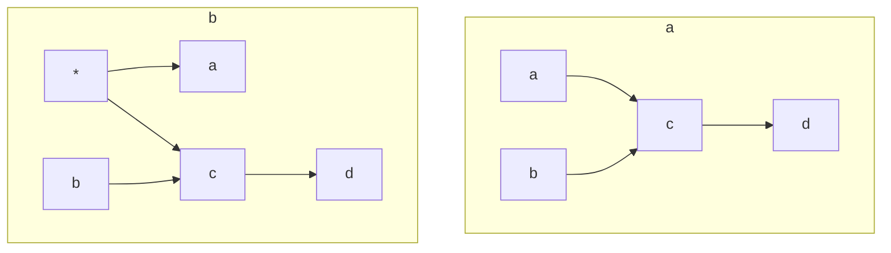

> 图 2.1 说明（a）和（b）的极小性以及推断关系 $c \rightarrow d$ 的合理性的因果结构。节点（\*）表示一个具有任意数量状态的隐藏变量

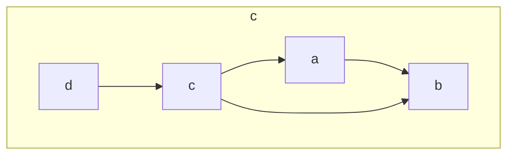

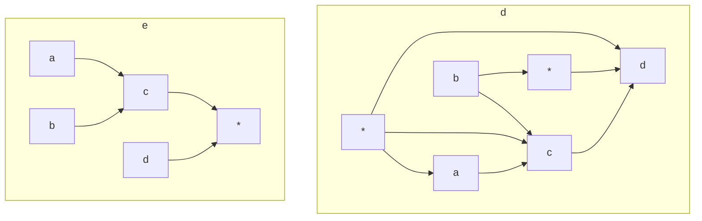

这个例子（取自文献（Pearl and Verma, 1991））表明了因果关系和概率之间的显著联系：某些概率相关模式（在我们例子中，除了 $(a \perp b)$ 与 $(d \perp \{a, b\} \vert c)$ 之外的所有相关关系）蕴含了明确的因果相关性（在我们的例子中， $c \rightarrow d$ ），而不需对潜在变量的存在与否做任何假定 $^{②}$ 。在此因果蕴含中引用的唯一假定是极小性，即排除过度拟合数据的模型。

> - 要验证图 2.1a 与图 2.1b 等价，我们注意到如果令链接 $a \leftarrow *$ 强制这两个变量相等，则图 2.1b 可以模拟图 2.1a。反之，因为图 2.1a 能够生成具有图 2.1b 所要求的独立性的每一种分布，因此图 2.1a 可以模拟图 2.1b。（从图中“读出”条件独立性的理论和方法见 1.2.3 节和 Pearl（1988b）。）

### 2.4 稳定分布

**虽然极小性原则足以形成因果推断的规范理论，但它不能保证实际数据生成模型的结构是极小的，并且无法保证从极小结构的海量空间中进行搜索在计算上是可行的。有些结构可能允许特殊的参数化，这将使它们无法区分于其他许多具有完全不同结构的极小模型。**

例如，考虑一个二值变量 $C$ ，当两枚公平硬币（ $A$ 和 $B$ ）的抛掷结果相同时， $C$ 取值为 1，其他情况取值为 0。在这个参数化生成的三元分布中，任意一对变量都是边缘独立的，但在第三个变量的条件下却是相关的。这种依赖模式实际上可能由三个最小因果结构产生，每一个结构都把其中一个变量描述为因果上依赖于另外两个变量，但是没有办法从这三个结构中做出选择。

为了排除这种“病态”参数化，我们对分布施加了一个名为 **稳定性** 的限制，也称为 **DAG-同构** 或 **完全映射** （Pearl, 1988b, p. 128）以及 **忠实性** （Spirtes et al., 1993）。这个限制反映了 $P$ 中包含的所有独立性都是稳定的假定，即它们由模型 $D$ 的结构所限定，因此对参数 $\Theta_D$ 的任何变化都保持不变。在我们的实例中，在面对参数改变时（即当硬币出现轻微偏差时），只有正确的结构（即 $A \to C \leftarrow B$ ）会保持独立模式。

#### 定义 2.4.1（稳定性）

令 $I(P)$ 表示 $P$ 中蕴含的所有条件独立关系的集合。

当且仅当 $P(\langle D, \Theta_D \rangle)$ 不包含额外的独立性，即当且仅当对于任意的参数 $\Theta_D'$ ， $I(P(\langle D, \Theta_D \rangle)) \subseteq I(P(\langle D, \Theta_D' \rangle))$ ，因果模型 $M = \langle D, \Theta_D \rangle$ 生成 **稳定的分布** 。

稳定性条件表明，当我们将参数从 $\Theta_D$ 变化到 $\Theta_D'$ 时， $P$ 中的独立性均不会被破坏，因此称为“稳定性”。简单地说，如果 $P$ “匹配” $M$ 的结构 $D$ ，那么 $P$ 是 $M$ 的稳定分布，即对于任意的三个变量集 $X$ 、 $Y$ 、 $Z$ ，有 $(X \perp Y|Z)_P \Leftrightarrow (X \perp Y|Z)_D$ （参见定理 1.2.5）。

极小性和稳定性之间的关系可以用下面的类比来说明。假设我们看到一张椅子的图片，我们需要在以下两种理论中做出选择。

- $T_{1}$ ：图片中的对象是椅子。
- $T_{2}$ ：图片中的对象要么是一把椅子，要么是两把椅子，其中一把藏在另一把之后。

相比于 $T_{2}$ ，我们更偏好 $T_{1}$ ，这可以用两个原则来说明，一个是极小性原则，另一个是稳定性原则。

> **极小原则** 认为， $T_{1}$ 优于 $T_{2}$ ，因为由单个对象构成的场景是由两个或更多对象构成的场景的子集，除非我们有相反的证据，否则我们应该偏好更简单的场景。
>
> **稳定性原则** 先验地排除了 $T_{2}$ ，因为它认为两个对象不太可能对齐，使一个完全隐藏另一个。相对于环境条件或观察角度的微小变化，这样的对齐是不稳定的。

**独立性** 的类比很清晰。有些独立性是结构性的，即对于图的每一个函数分布的参数化，独立性都维持不变。另一些则对函数和分布的数值敏感。例如，代表如下关系的结构 $Z \leftarrow X \rightarrow Y$ ：

$$
z = f_{1} (x, u_{1}), \quad y = f_{2} (x, u_{2}) \tag{2.1}
$$

对于所有的函数 $f_{1}$ 和 $f_{2}$ ，在 $X$ 条件下，变量 $Z$ 和 $Y$ 是独立的。与之相反，如果我们在结构中添加箭头 $Z \rightarrow Y$ ，并使用线性模型：

$$
z = \gamma x + u_{1}, \quad y = \alpha x + \beta z + u_{2} \tag{2.2}
$$

其中 $\alpha = -\beta \gamma$ ，那么 $Y$ 和 $X$ 相互独立。然而， $Y$ 和 $X$ 之间的独立性不稳定，因为当等式 $\alpha = -\beta \gamma$ 不成立时，这个独立性立即消失。 **稳定性假定** 认为这种独立性不太可能出现在数据中，所有的独立性都是结构性的。

为了进一步说明稳定性和极小性之间的关系，考虑图 2.1c 所描述的因果结构。

- 极小性原则拒绝这种结构，因为它比如图 2.1a 所示的结构所适合的分布范围更广。
- 稳定性原则拒绝这种结构，因为为了拟合数据（具体地说，独立性 $(a \perp b)$ ），箭头 $a \to b$ 产生的关系必须恰好抵消由路径 $a \leftarrow c \rightarrow b$ 产生的关系。这种精确的抵消不可能稳定，因此不能适用于连接变量 $a$ 、 $b$ 、 $c$ 的所有函数。

相比之下，在如图 2.1a 所示的结构中，独立性 $(a \perp b)$ 是稳定的。

### 2.5 获取 DAG 结构

加上稳定性假定后，只要没有隐藏变量， **每个分布都有唯一的极小因果结构** （取决于 $d$ -分离等价）。这个唯一性遵从了定理 1.2.8，该定理表明： **当且仅当两个因果结构传递相同的相关信息时，即它们具有相同的骨架和相同的 $\nu$ -结构集，这两个因果结构等价（即它们能彼此模拟）** 。

在没有未观测变量的情况下， **对极小模型的搜索可以归结为通过检验条件独立性来重构有向无环图 $D$ 的结构，并假定这些独立性反映了某些未知的、潜在的有向无环图 $D_{0}$ 中的 $d$ -分离条件** 。当然，由于 $D_{0}$ 可能具有等价结构，因此重构的有向无环图不唯一，我们所能做的就是找到 $D_{0}$ 等价类的图模型表示。

Verma 和 Pearl（1990）引入这种图模型表示，并将其命名为 **模式** 。模式是部分有向的有向无环图，具体来说，模式是一些边有向、一些边无向的图。有向边表示 $D_{0}$ 等价类中的每个结构所共有的箭头，而无向边代表其中可能的矛盾：在某些等价结构中，它们指向一种方向，而在另一些结构中，它们指向另一种方向。

> **行间批注** ：Verma 和 Pearl（1990）提出了下面的算法：以某些潜在的有向无环图 $D_{0}$ 生成的稳定概率分布 $\hat{P}$ 作为输入，输出一个属于 $D_{0}$ 等价类的模式 $^{\ominus}$ 。

#### IC 算法（Inductive Causation）

**输入** ：变量集 $V$ 上的稳定分布 $\hat{P}$ **输出** ：与 $\hat{P}$ 相容的模式 $H(\hat{P})$

- **步骤 1** ：对于 $V$ 中的每对变量 $a$ 和 $b$ ，寻找集合 $S_{ab}$ 使得 $(a \perp b \mid S_{ab})$ 在 $\hat{P}$ 中成立，即在 $S_{ab}$ 条件下， $a$ 和 $b$ 在 $\hat{P}$ 中独立。构建无向图 $G$ ，使得当且仅当集合 $S_{ab}$ 不存在时，连接节点 $a$ 和 $b$ 。
- **步骤 2** ：对于每对具有公共邻居 $c$ 的非邻接变量 $a$ 和 $b$ ，检查 $c \in S_{ab}$ 是否成立：
- 如果成立，则继续。
- 如果不成立，则添加指向 $c$ 的有向边（即 $a \rightarrow c \leftarrow b$ ）。
- **步骤 3** ：在得到的部分有向图中，根据以下两个条件，为尽可能多的无向边定向：
- （i）任何可选的方向会产生一个新的 $v$ -结构；
- （ii）任何可选的方向会产生一个有向环。

IC 算法没有详细说明步骤 1 和步骤 3，一些研究者提出了改进以优化这两个步骤。

Verma 和 Pearl（1990）注意到，在稀疏图中，如果从 $\hat{P}$ 的马尔可夫网络开始，即仅连接那些在某些变量条件下相互独立的变量对所形成的无向图，那么可以大幅减少搜索空间。在线性高斯模型中，通过对矩阵求逆，然后为逆协方差矩阵的非零项对应的变量对赋予边的方法，可在多项式时间内找到马尔可夫网络。

Spirtes 和 Glymour（1991）提出了一个一般性的系统搜索方法来寻找步骤 1 中的 $S_{ab}$ 集。以变量个数为 0 的 $S_{ab}$ 集（即空集）开始，然后是变量个数为 1 的 $S_{ab}$ 集，依此类推。一旦发现分离，则从完全图中递归地删除相应的边。这个改进称为 **PC 算法** （以其作者 Peter 和 Clark 的名字命名），该算法在节点度有限的图中是多项式时间复杂度，因为在每个阶段，对分离集 $S_{ab}$ 的搜索可以限制在 $a$ 和 $b$ 的邻接节点上。

IC 算法的步骤 3 可以通过几种方式进行系统化。Verma 和 Pearl（1992）指出，从任何模式开始，要获得极大有向的模式都需要以下四个规则：

- ** $R_{1}$ ** ：如果存在箭头 $a \rightarrow b$ 使得 $a$ 和 $c$ 不邻接，则将 $b$ - $c$ 定向为 $b \rightarrow c$ 。
- ** $R_{2}$ ** ：如果存在链 $a \rightarrow c \rightarrow b$ ，则将 $a$ - $b$ 定向为 $a \rightarrow b$ 。
- ** $R_{3}$ ** ：如果存在两个链 $a - c \rightarrow b$ 和 $a - d \rightarrow b$ 使得 $c$ 和 $d$ 不邻接，则将 $a$ - $b$ 定向为 $a \rightarrow b$ 。
- ** $R_{4}$ ** ：如果存在两个链 $a - c \rightarrow d$ 和 $c \rightarrow d \rightarrow b$ 使得 $c$ 和 $b$ 不邻接而 $a$ 和 $d$ 邻接，则将 $a$ - $b$ 定向为 $a \rightarrow b$ 。

Meek（1995）指出，如果反复应用这四个条件，足以将 $D_{0}$ 等价类共有的所有箭头定向。此外，如果起始定向仅限于 $v$ -结构，则不需要 $R_{4}$ 。

Dor 和 Tarsi（1992）提出了另一种系统化的算法，该算法（在多项式时间内）检验是否可以在不生成新的 $v$ -结构或有向环的情况下，将已知的部分定向的无环图变成完全定向的无环图。这个检验方法递归地移除任何具有以下两个属性的节点 $v$ ：

1. 没有从 $v$ 出来的有向边。
2. 通过无向边与 $v$ 相连的邻居节点也与 $v$ 的其他所有邻居节点相邻。

对于一个部分定向的无环图，当且仅当它的所有顶点都能以这种方式被移除时，该图才可能扩展为 DAG。因此，为了找到极大定向模式，我们可以对于每条无向边 $a$ - $b$ ，分别尝试两种定向 $a \rightarrow b$ 和 $a \leftarrow b$ ，还可以检验这两种定向是否都能扩展，或者仅有一种可以扩展。其中唯一定向的箭头集构成了所需的极大定向模式。Chickering（1995）、Andersson 等人（1997）以及 Moole（1997）给出了其他的改进方法。

然而，潜在结构需要特殊处理，因为潜在结构对分布的约束不能由任何一组条件独立陈述完全刻画。幸运的是，这些独立约束的某些集合是可以识别的（Verma and Pearl, 1990），这允许我们获取潜在结构的可靠片段。

### 2.6 重建潜在结构

当大自然“隐藏”了一些变量时， **观察分布 $\hat{P}$ 相对于观察集合 $O$ 不再稳定，即我们不再保证与 $\hat{P}$ 相容的极小潜在结构中存在一个具有 DAG 的结构** 。幸运的是，这时不必搜索无限大的潜在结构空间，而是将搜索局限于有限且结构定义良好的图中。 **对于每一个潜在结构 $L$ ，在 $O$ 上都存在一个与 $L$ 相关等价的潜在结构（投影），其中每一个未观察到的节点都是一个根节点，并且恰好有两个观察到的子节点。我们将这个概念明确地描述如下。**

#### 定义 2.6.1（投影）

潜在结构 $L_{[O]} = \langle D_{[O]}, O \rangle$ 是另一个潜在结构 $L$ 的投影，当且仅当

- 1.  $D_{[O]}$ 中的每个未观测变量都恰好是两个非邻近的可观测变量的共同原因，且该变量无父代变量。
- 2. 对于 $L$ 生成的每个稳定分布 $P$ ，都存在一个 $L_{[O]}$ 生成的稳定分布 $P'$ ，使得 $I(P_{[O]}) = I(P_{[O]}')$ 。

#### 定理 2.6.2 (Verma 1993)

任何潜在结构都至少有一个投影。

可以很方便地用一个双向图来表示投影，图中仅将可观测变量作为节点（即不显示隐藏变量）。图中的每个双向链接代表了对应于该链接两端变量的共同隐藏原因。

定理 2.6.2 使我们的因果推断定义（定义 2.3.6）具有可操作性。Verma（1993）指出，如果 $\hat{P}$ 的任何极小模型的一个可识别投影中存在一个链接，则在 $\hat{P}$ 的每个极小模型中必然存在一条因果路径。因此，搜索简化为寻找 $\hat{P}$ 的任何极小模型的可识别投影，并识别出合适的链接。

值得注意的是，这些链接可以通过 **IC 算法的一个简单变形** 来识别，这里称之为 \*\*IC\*\* \*，该算法以稳定分布 $\hat{P}$ 为输入，输出一个标记的模式，该模式的边具有以下四种类型，并且是一个部分有向无环图。

- **有标记箭头** $a \xrightarrow{*} b$ ：表示潜在模型中从 $a$ 到 $b$ 的有向路径。
- **无标记箭头** $a \to b$ ：表示潜在模型中从 $a$ 到 $b$ 的有向路径或者一个潜在的公共原因 $a \leftarrow L \rightarrow b$ 。
- **双向边** $a \leftrightarrow b$ ：表示潜在模型中的一个潜在的公共原因 $a \leftarrow L \rightarrow b$ 。
- **无向边** $a - b$ ：表示潜在模型中 $a \leftarrow b$ ，或者 $a \rightarrow b$ ，或者 $a \leftarrow L \rightarrow b^{\ominus}$ 。

---

##### IC\* 算法（Inductive Causation with Latent Variables）

**输入** ：稳定分布 $\hat{P}$ （对应某种潜在结构） **输出** ：一个被标记过的模式 $\text{core}(\hat{P})$

1. 对于每对变量 $a$ 和 $b$ ，寻找集合 $S_{ab}$ ，使得在 $S_{ab}$ 条件下， $a$ 和 $b$ 在 $\hat{P}$ 中独立。如果没有这样的集合 $S_{ab}$ ，则在两个变量之间放置无向边，即 $a - b$ 。
2. 对于每对具有公共邻居 $c$ 的非相邻变量 $a$ 和 $b$ ，检查 $c \in S_{ab}$ 是否成立：
   - 如果成立，则继续。
   - 如果不成立，则添加指向 $c$ 的箭头（即 $a \rightarrow c \leftarrow b$ ）。
3. 在得到的部分有向图中，按照以下两条规则，（递归地）添加尽可能多的箭头，并标记尽可能多的边：
   - ** $R_{1}$ ** ：对于每对具有公共邻居 $c$ 的非相邻变量 $a$ 和 $b$ ，如果 $a$ 和 $c$ 之间的链接有箭头指向 $c$ ，而 $c$ 和 $b$ 之间的链接没有箭头指向 $c$ ，则在 $c$ 和 $b$ 之间的链接上添加箭头指向 $b$ ，并标记这条链接，得到 $c \stackrel{*}{\rightarrow} b$ 。
   - ** $R_{2}$ ** ：如果 $a$ 和 $b$ 相邻，并且有一条从 $a$ 到 $b$ 的（严格由标记的链接组成的）有向路径（如图 2.2 所示），则在 $a$ 和 $b$ 之间的链接上添加一个指向 $b$ 的箭头。

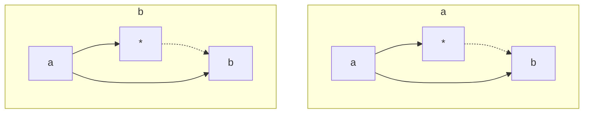

> **图 2.2** IC\* 算法的步骤 3 的 $R_{2}$ 规则

IC\* 的步骤 1、步骤 2 与 IC 相同，但步骤 3 的规则有所区别。IC\* 不对边定向，而是对边的端点添加箭头，从而容许双向边。

图 2.3 展示了 IC\* 算法在图 1.2 的实例上的应用情况（如图 2.3a 所示）。

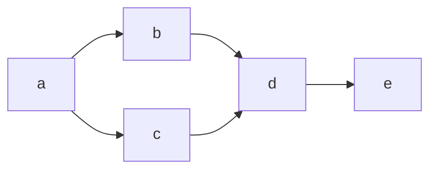

> a)

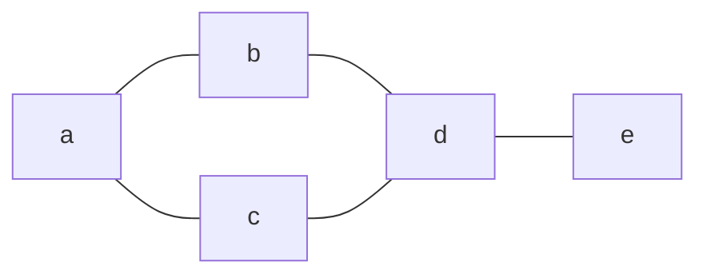

> b)

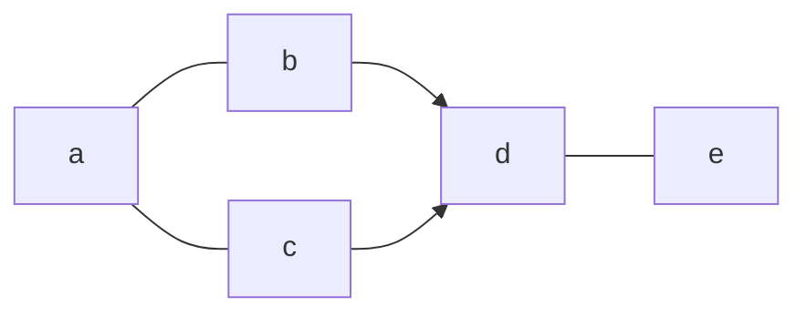

> c)

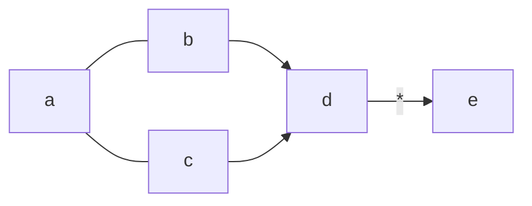

> d)

**图 2.3** 由 IC\* 算法构造的图：a）潜在结构；b）步骤 1 后得到的图；c）步骤 2 后得到的图；d）IC\* 的输出

- 该结构所要求的条件独立性可以由 $d$ -分离准则（定义 1.2.3）得到。与这些独立性对应的极小条件集为： $S_{ad} = \{b, c\}$ 、 $S_{ae} = \{d\}$ 、 $S_{bc} = \{a\}$ 、 $S_{be} = \{d\}$ 、 $S_{ce} = \{d\}$ 。因此，IC\* 算法的步骤 1 得到了如图 2.3b 所示的无向图。
- 三元组 $(a, b, c)$ 唯一满足步骤 2 条件，因为 $d$ 不在 $S_{bc}$ 中。据此，我们得到如图 2.3c 所示的部分有向图。
- 步骤 3 的规则 $R_{1}$ 适用于三元组 $(b, d, e)$ （以及 $(c, d, e)$ ），因为 $b$ 和 $e$ 不相邻且有一个从 $b$ 到 $d$ 而不是从 $e$ 到 $d$ 的箭头。因此，添加一个指向 $e$ 的箭头，并标记这个链接，得到图 2.3d。这也是 IC\* 的最终输出，因为 $R_{1}$ 和 $R_{2}$ 不再适用。

$a-b$ 和 $a-c$ 没有箭头， $b \rightarrow d$ 和 $c \rightarrow d$ 没有标记，这些恰当地表示了 $\hat{P}$ 呈现的歧义性。图 2.4 所示的每一个潜在结构在观察上确实都与图 2.3a 所示的结构等价。在图 2.3d 中标记链接 $d \rightarrow e$ 意味着在每个与图 2.3a 中的结构独立等价的潜在结构中都存在一个有向链接 $d \rightarrow e$ 。

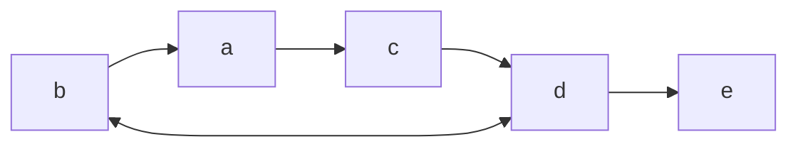

> a)

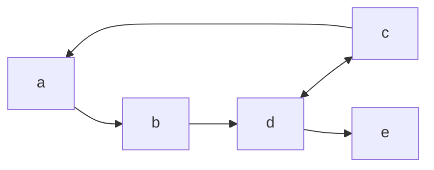

> b)

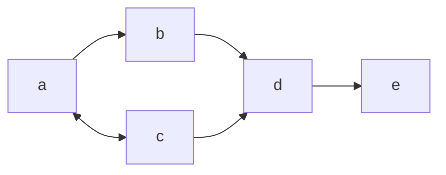

> c)

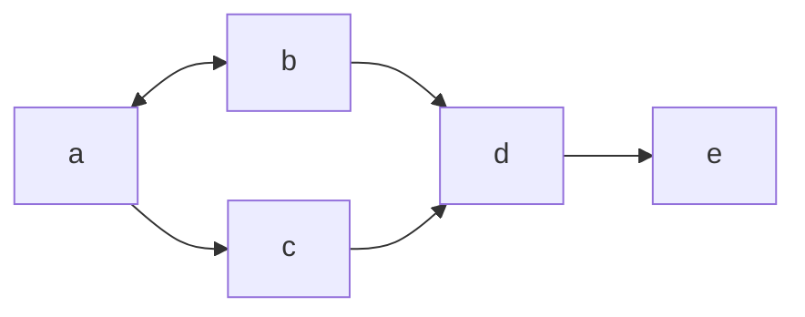

> d) **图 2.4** 与图 2.3a 等价的潜在结构

---

### 2.7 因果关系推断的局部准则

IC\* 算法以分布 $\hat{P}$ 为输入，输出一个部分有向图。有些链接是有标记单向的（表示真实的原因），有些是无标记单向的（表示潜在的原因），有些是双向的（表示虚假的关联），还有一些是无向的（表示未确定的关系）。产生这些标签的条件可以用作各种因果关系的定义。

本节给出了 **潜在因果关系** 和 **真实因果关系** 的明确定义，正如它们在 IC\* 算法中出现的。注意，在所有这些定义中，两个变量（ $X$ 和 $Y$ ）之间因果关系的判断准则都需要由第三个变量 $Z$ 来确定。这并不奇怪，因为因果断言的本质是规定 $X$ 和 $Y$ 在第三个变量影响下的行为，这个第三变量对应 $X$ （或 $Y$ ）的外部控制，正如“没有操纵，就没有因果”（Holland，1986）的名言所说。区别在于，作为假想控制的变量 $Z$ 本身必须在数据中是可识别的，就像大自然已经进行了关于该变量的实验一样。可以将 IC\* 算法看作： **在给定稳定分布的条件下，提供了一种系统的方法来寻找符合假想控制的变量 $Z$ ** 。

#### 定义 2.7.1（潜在原因）

如果下列条件成立，则变量 $X$ 对变量 $Y$ 有潜在的（可从 $\hat{P}$ 中推断的）因果影响：

1.  $X$ 和 $Y$ 在每个情形下均相关。
2.  存在变量 $Z$ 和情形 $S$ ，使得：
    - (i) 给定 $S$ 条件下， $X$ 和 $Z$ 独立（即 $X \perp Z \mid S$ ）。
    - (ii) 给定 $S$ 条件下， $Z$ 和 $Y$ 相关（即 $Z \not\perp Y \mid S$ ）。

这里的情形是指为变量集赋予特定的值。例如，在图 2.3a 中，由于变量 $Z = c$ 在情形 $S = a$ 中与 $d$ 相关，而与 $b$ 独立，因此变量 $b$ 是 $d$ 的潜在原因。同样地， $c$ 是 $d$ 的潜在原因（ $Z = b$ 且 $S = a$ ）。 $b$ 和 $c$ 均不是 $d$ 的真实原因，因为这种相关模式也可能容许一个潜在的共同原因，如图 2.4a～图 2.4b 中的双向弧线所示。

然而，定义 2.7.1 决定了 $d$ 不能作为 $b$ （或 $c$ ）的原因，这使得 $d$ 被归类为 $e$ 的真实原因，如定义 2.7.2 所述。注意，定义 2.7.1 排除了变量 $X$ 是其自身或在任何其他函数里决定 $X$ 的那些变量的潜在原因。

#### 定义 2.7.2（真实原因）

如果存在一个变量 $Z$ 满足以下二者之一，则变量 $X$ 对变量 $Y$ 有真实的因果影响：

1.  $X$ 和 $Y$ 在任何情形中均相关，且存在情形 $S$ 满足：

- (i) $Z$ 是 $X$ 的潜在原因（依据定义 2.7.1）；
- (ii) 给定 $S$ 时， $Z$ 和 $Y$ 相关（即 $Z \not\perp Y \mid S$ ）；
- (iii) 给定 $S \cup X$ 时， $Z$ 和 $Y$ 独立（即 $Z \perp Y \mid S \cup X$ ）。

2.  $X$ 和 $Y$ 在准则 1 中定义的关系传递闭包中。

图 2.3a 展示了条件 (i)～(iii)，其中 $X = d$ ， $Y = e$ ， $Z = b$ ， $S = \emptyset$ 。以 $d$ 为条件破坏了 $b$ 和 $e$ 之间的相关性，这不能归因于 $d$ 和 $e$ 之间的虚假关联（见定义 2.7.3），唯一的解释是二者之间存在真实的因果影响，如图 2.4 的结构所示。

#### 定义 2.7.3（虚假关联）

两个变量 $X$ 和 $Y$ 是虚假关联的，如果它们在某些情形下相关，且存在另外两个变量 $(Z_{1}$ 和 $Z_{2})$ 和两个情形 $(S_{1}$ 和 $S_{2})$ 使得：

- 1. 给定 $S_{1}$ ， $Z_{1}$ 和 $X$ 相关（即 $Z_{1} \not\perp X \mid S_{1}$ ）。
- 2. 给定 $S_{1}$ ， $Z_{1}$ 和 $Y$ 独立（即 $Z_{1} \perp Y \mid S_{1}$ ）。
- 3. 给定 $S_{2}$ ， $Z_{2}$ 和 $Y$ 相关（即 $Z_{2} \not\perp Y \mid S_{2}$ ）。
- 4. 给定 $S_{2}$ ， $Z_{2}$ 和 $X$ 独立（即 $Z_{2} \perp X \mid S_{2}$ ）。

条件 1 和 2 使用 $Z_{1}$ 和 $S_{1}$ 排除 $Y$ 作为 $X$ 的原因，对应定义 2.7.1 的条件（i）～（iii）。条件 3 和 4 使用 $Z_{2}$ 和 $S_{2}$ 排除 $X$ 作为 $Y$ 的原因。剩下的唯一解释是存在潜在的共同原因导致了 $X$ 和 $Y$ 之间观察到的关联性，如结构 $Z_{1} \rightarrow X \rightarrow Y \leftarrow Z_{2}$ 所示。

当时间信息可用时（正如大多数因果论的概率理论中所假定的（Suppes，1970；Spohn，1983；Granger，1988）），定义 2.7.2 和定义 2.7.3 可大大简化，因为与 $X$ 相邻且在 $X$ 之前的每个变量都可以作为 $X$ 的“潜在原因”。此外，只要情形 $S$ 被限制在 $X$ 之前，则不再要求邻接（即定义 2.7.1 的条件 1）。这就产生了区分真实原因与虚假原因的更简单的条件，如下所示。

#### 定义 2.7.4（具有时间信息的真实因果）

变量 $X$ 对 $Y$ 有因果影响，如果存在第三个变量 $Z$ 和情形 $S$ ，二者都在 $X$ 之前出现，且满足：

- 1.  $(Z \not\perp Y \mid S)$
- 2.  $(Z \perp Y \mid S \cup X)$

定义 2.7.4 背后的直觉与定义 2.7.2 一致，除了在构建 $Z$ 作为 $X$ 的潜在原因时要求时间优先。如图 2.5a 所示：如果以 $X$ 为条件可以将 $Z$ 和 $Y$ 从相关变为独立（情形 $S$ 中），则 $Z$ 和 $Y$ 之间的相关必定是由 $X$ 中介的；假设 $Z$ 先于 $X$ ，则这种中介意味着 $X$ 对 $Y$ 有因果影响。

#### 定义 2.7.5（具有时间信息的虚假关联）

两个变量 $X$ 和 $Y$ 是 **虚假关联** 的，如果它们在某些情形 $S$ 中相关， $X$ 先于 $Y$ ，且存在变量 $Z$ 满足：

1.  $(Z \perp Y \mid S)$
2.  $(Z \not\perp X \mid S)$

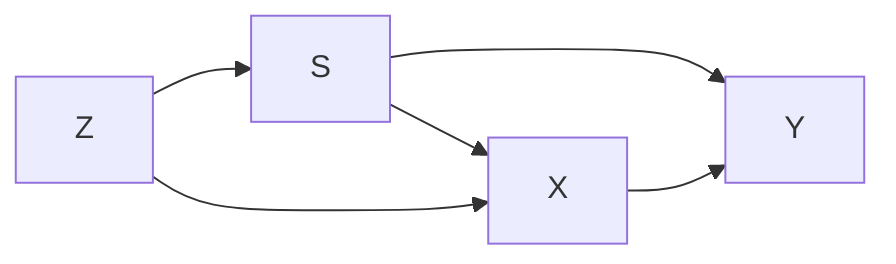

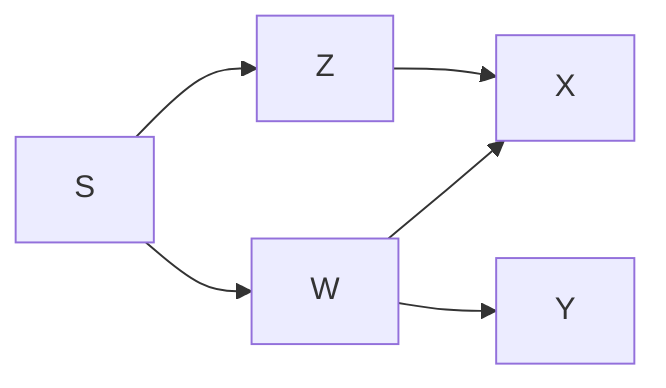

> **图 2.5** 说明如何依据时间信息从（a）和（b）中展示的条件独立性中分别推断（ $X$ 和 $Y$ 之间的）真实因果关系和虚假关联。

图 2.5b 展示了定义 2.7.5 背后的直觉。这里 $X$ 和 $Y$ 之间的相关不能归因于两者之间的因果关系，因为这样的因果关系意味着 $Z$ 和 $Y$ 之间的相关，而这是被条件 1 所排除的 $^{①}$ 。

> - $\ominus$ 回想一下，因果相关的传递性隐含在稳定性中。虽然可以构造 $Z$ 和 $Y$ 独立的因果链 $Z \to X \to Y$ ，但这种独立并不会对链的所有参数都保持。

检查刚才的定义，发现所有的因果关系都是从至少三个变量中推断出来的。具体地说，使我们能够得出一个变量不是另一个变量的因果结论的信息是以“非传递三元组”的形式出现的，例如，图 2.1a 的变量 $a$ 、 $b$ 、 $c$ 满足 $(a \perp b \mid \emptyset)$ 、 $(a \perp c \mid \emptyset)$ 、 $(b \perp c \mid \emptyset)$ 。理由如下：

如果我们找到条件 $(S_{ab})$ ，使得变量 $a$ 和 $b$ 均与第三变量 $c$ 相关，但二者彼此对立，那么这个第三变量不可能作为 $a$ 或 $b$ 的原因（回想一下，在稳定分布中，存在共同原因意味着其结果之间相关）， $c$ 必然要么是它们的共同效应 $(a \to c \leftarrow b)$ ，要么通过共同原因与 $a$ 和 $b$ 相关，形成诸如 $a \leftrightarrow c \leftrightarrow b$ 的模式。确实，正是这个条件允许 IC\*算法定向图中的边（步骤 2），并赋予箭头指向 $c$ 。也正是这种非传递模式确保了 $X$ 不是定义 2.7.1 中 $Y$ 的结果， $Z$ 也不是定义 2.7.2 中 $X$ 的结果。

在定义 2.7.3 中，我们有两个非传递三元组 $(Z_1, X, Y)$ 和 $(X, Y, Z_2)$ ，因此排除了 $X$ 和 $Y$ 之间的直接因果影响，这意味着 **虚假关联** 是它们相关的唯一解释。

这种非传递三元组的解释涉及对结果变量的假想控制，而不是对假设原因的控制，这类似于在因果关系的操纵观点中检验空假设（1.3 节）。例如，人们坚持认为是雨水让草变湿而不是反过来，原因之一是人们可以很容易地找到其他完全不受雨水影响的方法让草变湿。回到链 $a - c - b$ ，如果我们找到另一种方法（ $b$ ）在不影响 $a$ 的情况下潜在地控制 $c$ ，那么我们可以排除 $c$ 是 $a$ 的原因（Pearl，1988a，p.396）。当然，这种类比仅仅是一种启发，因为在观察研究中，我们必须等待大自然发生适当的控制，并且避免这种控制被（与 $a$ 的）虚假关联污染。

### 2.8 非时间因果与统计时间

从非时间数据中确定因果影响方向的问题引发了一些关于时间与因果解释之间有趣的哲学问题。例如，定义 2.7.2 中对于箭头 $X \rightarrow Y$ 的定向可能与时间信息（比如，事后发现 $Y$ 在 $X$ 之前）冲突吗？由于定义 2.7.4 源于对因果关系在统计方面的强烈直觉（例如，没有因果关系就没有相关性），因此有理由认为，如果这种冲突发生也是相当罕见的。于是问题就出现了：为什么仅由统计相关性决定的方向会与时间的流动有关系呢？

在人类话语中，因果解释满足两个期望： **时间** 和 **统计** 。时间方面用“原因应先于结果”这一认知来表示。统计方面则期望有一个完全的因果解释来涵盖它的各种效应 $^{①}$ （即，使效应有条件的独立）；不能涵盖其效应的解释被认为是“不完整的”，剩余的相关性部分被认为是“虚假的”或“无法解释的”。在几个世纪的科学观察中，这两种期望并存且无冲突，这意味着对自然现象的统计必然展示了一些基本的时序偏好。

事实上，我们经常遇到这样的现象：对当前状态的认知使未来状态的变量有条件地独立（例如，式(2.3)中的多元经济时间序列）。然而，我们很少发现相反的现象，即当前状态的认知会使过去状态的变量条件独立。有什么令人信服的理由来解释这种时序偏好吗？

> - 这种期望称为 Reichenbach 的“连接叉”或“共因”准则（Reichenbach，1956；Suppes and Zaniotti，1981；Sober and Barrett，1992），Salmon 批判了这一准则，证实有些事件虽不符合 Reichenbach 准则，但仍可作为因果解释。然而，Salmon 的例子包含了不完整的解释，因为忽略了原因和它的各种效应之间的中介变量（参见 2.9 节）。

形式化这种偏好的一个便捷方法是使用 **统计时间** 的概念。

#### 定义 2.8.1（统计时间）

给定一个经验分布 $P$ ， $P$ 的统计时间是满足以下条件的变量的任意排序，即与至少一个与 $P$ 相容的极小因果结构一致。

例如，时间标量马尔可夫链过程有很多统计时间：一个与物理时间一致，一个与物理时间相反，其他则对应于变量排序，这种排序与从其中一个节点出发（任意选择作为根节点）的马尔可夫链的方向一致。另一方面，由两个耦合的马尔可夫链控制的进程，仅有一个统计时间，即与物理时间一致的时间 $^{①}$ ，例如：

$$
X_{t} = \alpha X_{t - 1} + \beta Y_{t - 1} + \xi_ {t}
$$

$$
Y_{t} = \gamma X_{t - 1} + \delta Y_{t - 1} + \eta_ {t} \tag {2.3}
$$

事实上，对这个过程所产生的样本数据运行 IC 算法，同时不考虑所有时间信息，会快速识别出 $X_{t - 1}$ 和 $Y_{t - 1}$ 是 $X_{t}$ 和 $Y_{t}$ 的真实原因。这可以从定义 2.7.1（使用 $Z = Y_{t - 2}$ 和 $S = \{X_{t - 3}, Y_{t - 3}\}$ ，可得到 $X_{t - 2}$ 满足 $X_{t - 1}$ 的潜在原因）和定义 2.7.2（使用 $Z = X_{t - 2}$ 和 $S = \{Y_{t - 1}\}$ 可得到 $X_{t - 1}$ 满足 $X_{t}$ 的真实原因）中得到。

前面假设的时序偏好表示如下：

#### 猜想 2.8.2（时序偏好）

在大多数自然现象中，物理时间与至少一个统计时间一致。

Reichenbach（1956）将与联合分叉相关的不对称性归因于热力学第二定律。但第二定律能否对刚才所描述的时序偏好提供一个完整的解释是值得怀疑的，因为外部噪声 $\xi_{t}$ 和 $\eta_{t}$ 的影响使式（2.3）的过程呈现非守恒性 $^{②}$ 。

此外，时序偏好与语言有关。例如，在一个不同的坐标系中表示式（2.3），可以使 $(X', Y')$ 表示中的统计时间与物理时间相反，比如，使用如下线性变换：

> - $\ominus$ 假定 $\xi_{i}$ 和 $\eta_{i}$ 是两个独立的白噪声时间序列。同时，假定 $\alpha \neq \delta$ 和 $\gamma \neq \beta$ 。

$$
X_{t}^{\prime} = a X_{t} + b Y_{t}
$$

$$
Y_{t}^{\prime} = c X_{t} + d Y_{t}
$$

也就是说， $X_{t}^{\prime}$ 和 $Y_{t}^{\prime}$ 以它们未来的值（ $X_{t+1}^{\prime}$ 和 $Y_{t+1}^{\prime}$ ）而非过去的值为条件时相互独立。这表明，物理时间和统计时间的一致性是人类选择语言的副产品，而不是物理现实的特性。

例如，如果 $X_{t}$ 和 $Y_{t}$ 代表两个相互作用的粒子在时间 $t$ 的位置， $X_{t}^{\prime}$ 是重心的位置， $Y_{t}^{\prime}$ 是它们的相对距离，那么是在 $(X, Y)$ 还是在 $(X', Y')$ 的坐标系统中描述粒子运动（在原则上）是一个选择问题。然而，这种选择显然并非完全异想天开，它反映了对正向扰动（式（2.3）中的 $\xi_{t}$ 和 $\eta_{t}$ ）相互正交的坐标系的偏好，而不是反向扰动（ $\xi_{t}^{\prime}$ 和 $\eta_{t}^{\prime}$ ）的偏好。

Pearl 和 Verma（1991）推测，这种偏好代表了进化趋势以促进对未来事件的预测，而进化显然将这种能力排在了更重要的位置，而非为当前事件寻找事后诸葛亮的解释能力。究竟是这一因素还是其他因素影响了我们对语言的选择，还有待研究（参见 Price 在 1996 年的讨论），这使得统计时间的一致性问题更加有趣。

### 2.9 结论

本章提出的理论表明，虽然统计分析不能在每种情况下都区分真实因果和虚假关联，但在许多情况下是可以的。在模型极小性（或者稳定性）假定下，应该存在足以揭示真实因果关系的相关模式。这些关系不能归因于隐藏的原因，以免我们违背了科学方法论的基本准则之一：奥卡姆剃刀原则的语义形式。坚持这一准则可以解释为什么在面对与观察结果完全一致，但是结论却对立的选择时，人们会就因果关系的方向性和非虚假性达成一致。

作为对 Cartwright（1989）的回应，我们用一句口号来总结我们的主张：“没有原因存在，就找不到原因；有奥卡姆剃刀，就能找出某些原因。”由 IC 算法或者 Spirtes 等人（1993）的 TETRAD 程序，或者 Cooper 和 Herskovits（1991）、Heckerman 等人（1994）的贝叶斯方法推导的因果关系有多可靠？

将这个问题放在视觉感知的背景下，我们同样可以问：当我们通过二维阴影或物体在我们视网膜上反射的二维图像来识别三维物体时，我们的预测有多可靠？答案是：并非绝对可靠，但足以区分树和房子，也足以在不用触摸看到的物体的情况下就能做出有用的推论。回到因果推论，我们的问题相当于评估在一个典型的学习环境中（比如，在技能培养任务或流行病学研究中）是否有足够的识别线索，使我们能够可靠地区分原因与结果。作为一种逻辑保证，我们可以断言，如果事实上 $a$ 对 $b$ 没有因果影响，且观察到的分布相对于潜在因果模型是稳定的，那么 $\mathrm{IC}^*$ 算法不会标记箭头 $a \rightarrow b$ 。

在实际应用方面，我们已经展示了模型极小性假定和“稳定性”假定（不是偶然的独立）会产生一个构建候选因果模型的有效算法，这些模型能够生成未观察的数据和潜在的数据。1990 年在我们实验室的仿真研究表明，包含数十个变量的网络仅需少于 5000 个样本便能通过算法获取其结构。例如，从式（2.3）所示的（二值版本的）过程中提取 1000 个样本，每个样本包含 10 个连续的 $(X,Y)$ 对，便足以获取其双链结构（和时间的正确方向）。噪声越大，（在一定程度上）获取就越快。

在真实数据上测试这个模型方案时，我们检验了 Sewal Wright 论文 “Corn and Hog Correlations”（Wright，1925）中报告的观察结果。正如预期的那样，玉米价格（ $X$ ）可以确定为生猪价格（ $Y$ ）的一个原因，而不是反过来。原因在于，玉米作物（ $Z$ ）这个变量满足定义 2.7.2 的条件（ $S = \emptyset$ ）。Glymour 和 Cooper（1999）描述了本章讨论的原理和算法的几个应用。

> **60** 一个很自然的问题是因果关系的新准则如何有益于机器学习和数据挖掘的当前研究。在某种意义上，我们的方法类似于在假设空间中进行标准的机器学习搜索（Mitchell，1982），其中每个假设表示一个因果模型。不幸的是，两者的相似之处也就止于此。机器学习文献中流行的范式是将每个假设（或理论，或概念）定义为可观察实例的子集。一旦我们观察到这个子集的完全扩展，这个假设的定义就是明确的。但在因果发现中却不是这样。即使训练样本穷尽了假设子集（在我们的例子中，这对应于精确地观察 $P$ ），我们仍然有大量的等价因果理论，每一个都规定了一套完全不同的因果主张。因此，数据的适用性是验证因果理论的不充分的标准。在传统的学习任务中，我们试图从一组实例推广到另一组实例，而因果建模任务则是将一组条件下的行为推广到另一组条件下的行为。因此，因果模型选择的标准应该是挑战它们在不断变化的条件下的稳定性，而这正是科学家们试图通过受控实验来实现的。如果没有这样的实验，最好的办法就是依赖假想的控制变量，就像那些通过定义 2.7.1 ～ 定义 2.7.4 的相关模式借助大自然揭示出来的变量。

#### 2.9.1 关于极小性、马尔可夫性和稳定性

从关联关系中推断因果关系的想法，无疑会受到传统学派科学家的质疑。很自然地，本章所描述的理论的基本假定—— **极小性** 和 **稳定性** ——也受到了统计学家和哲学家的质疑。本节包含了一些为这些假定辩护的更多思考。

尽管很少有人质疑极小化原则（这样做等于挑战科学归纳法），但已有质疑意见反对我们定义极小化对象的方式，即因果模型。定义 2.2.2 假定随机项 $u_{i}$ 相互独立，这一假定赋予了每个模型马尔可夫特性：在其父代变量（直接原因）的条件下，每个变量都与其非后代变量独立。在 d-分离的其他相关结果中，这意味着有一些我们熟悉的因果和关联之间的关系，这些关系与 Reichenbach（1956）的共同原因原则有关，例如：“没有相关关系，就没有因果关系”“果皆源于因”“所有行动都是可掌控的”。

正如我们在定义 2.2.2 的讨论中所解释的，马尔可夫假定是一种约定，用于区分完整模型和不完整模型。¹ 将马尔可夫假定集成到完全因果模型的定义中（定义 2.2.2），然后使用潜在结构放松假定（定义 2.3.2），可能会错过发现不能被描述为潜在结构的非马尔可夫因果模型。我不认为这种损失很严重，因为即使在宏观世界中存在这样的模型，它们作为指导决策的作用也很有限。例如，除了预先明确列出每一种可能的干预措施的影响外，尚不清楚人们如何能从这种模型中预测干预措施的影响。

> ¹ 原文脚注：此处为对“完整模型”与“不完整模型”区分的补充说明。

因此，毫不意外，对马尔可夫假定的批评，尤其是 Cartwright（1995a，1997）和 Lemmer（1993）的批评，有两个共同的特征：

- 他们提出了宏观的非马尔可夫反例，这些反例可还原为 Salmon（1984）所考虑的那类潜在的马尔可夫结构，即交互式分叉结构。
- 他们提出了无法替代的非马尔可夫模型，可以用来预测行动和行动之间组合的影响。

图 2.6a 展示了交互式分叉模型。如果中间节点 d 是未被观察到的（或未被表示的），那么有研究者会想得出这样的结论：这违反了马尔可夫假定，因为观察到的原因（a）无法推知它的结果（b 和 c）。图 2.6b 的潜在结构可以在各方面模拟图 2.6a 的这种情形：二者在观察上和实验上都是无法区分的。

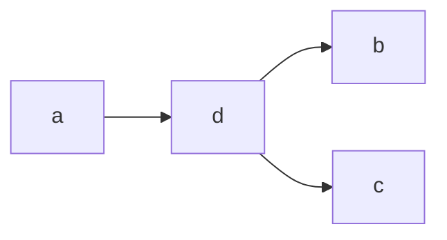

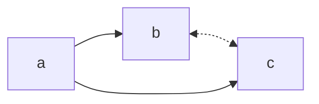

> 图 2.6 a) 交互式分叉结构；b) 等价于 a 的潜在结构

只有量子力学现象表现出了不能归因于潜在变量的关联，如果有人能在宏观世界中发现这种特殊的关联，那将被视为一个科学奇迹。不过，马尔可夫条件的批评者坚持认为，某些所谓的反例必须通过 $P(bc \mid a)$ 建模，而不能通过 $\sum_{d} P(b \mid d, a) P(c \mid d, a)$ 建模——也许认为有些见解或观点并不需要解释 $b$ 和 $c$ 之间的相关关系即可获得。

更讽刺的是，也许马尔可夫条件普遍适用的最有力证据可以在被称为“概率因果关系”的哲学研究大纲中找到（参见 7.5 节），其中 Cartwright 是主要的支持者。在这个大纲中，因果相关性被定义为对某些有关因素的集合取条件后仍然存在的概率相关性（Good，1961；Suppes，1970；Skyrms，1980；Cartwright，1983；Eells，1991）。这个定义建立在这样的假定上：对适当的因素集合取条件可以抑制所有的虚假关联，这一假定相当于马尔可夫条件假定。在过去的 40 年里，概率因果关系作为一个活跃的哲学研究分支而持续存在证明了一个事实，即马尔可夫条件的反例是相对罕见的，并且可以通过潜在变量来解释。

现在讨论稳定性假定。通常为论证稳定性而提出的论点（Spirtes et al., 1993）诉诸这样一个事实，即参数乘积之间的严格相等在任何概率空间中的勒贝格测度为零，在这些概率空间中参数可以彼此独立变化。例如，如果考虑参数 $\alpha$ 、 $-\beta$ 、 $\gamma$ 上的任意连续联合密度，则式（2.2）所对应的模型中等式 $\alpha = -\beta \gamma$ 的概率为 0，除非密度以某种方式先验地表达了 $\alpha = -\beta \gamma$ 的约束。与之相反，Freedman（1997）主张没有理由假定参数不被这类等式约束捆绑在一起，因为这会使结果分布不稳定 $^{\ominus}$ （使用定义 2.4.1）。

事实上，因果模型所宣扬的条件独立性恰恰等于联合分布上的等式约束。例如，链模型 $Y \to X \to Z$ 蕴含等式

$$
\rho_{YZ} = \rho_{XZ} \cdot \rho_{YX}
$$

其中， $\rho_{XY}$ 是 $X$ 和 $Y$ 之间的相关系数，这个等式约束将三个相关系数固定在一个等式联系中。那么，相比于另一组参数（比如 $\alpha$ 、 $\beta$ 和 $\gamma$ 之间的等式），是什么赋予了相关系数之间等式的特殊地位呢？为什么我们认为等式 $\rho_{YZ} = \rho_{XZ} \cdot \rho_{YX}$ 是“稳定的”，而等式 $\alpha = -\beta \gamma$ 是“偶然的”？

当然，答案在于 **自治** 的概念（Aldrich，1989），这是所有因果概念的核心（参见 1.3 节和 1.4 节）。一个因果模型不仅仅是通过一组参数对概率分布描述的另一种方案，因果模型的显著特点是，每一个变量都由一组其他变量通过一种关系（称为机制）决定，在其他机制受到外界影响时，这种关系仍然保持不变。这种不变性意味着机制可以彼此独立地改变，这反过来意味着当实验条件改变时，结构系数集合（例如式（2.2）实例中的 $\alpha$ 、 $\beta$ 和 $\gamma$ ）能够且会独立改变，而其他参数类型（例如， $\rho_{YZ}$ 、 $\rho_{XZ}$ 、 $\rho_{YX}$ ）未必满足这一点。因此，形如 $\alpha = -\beta \gamma$ 的等式约束与自治的理念相悖，这在自然条件下很少发生。

正是人们对 **稳定性** 的追求，解释了为什么他们发现除了想象两个独立原因的共同效应外，不可能举例说明相关性的非传递模式（参见 1.3 节）。任何能够令人信服地证明给定相关性模式的说法都必须支持传递性，而无论其中参数的数值是多少，这就是我们称为“稳定性”的需求。

出于这个原因，有人提出，仅基于关联关系的因果关系发现方法，例如包含在 IC\* 算法或 TETRAD-II 程序中的方法，在队列研究中具有最大的潜力。这些研究在略微变动的条件下进行，其中独立性偶然会被破坏，仅保留结构独立性。在这种变化的条件下，模型的参数将被扰动，而它的结构保持不变，这是一种微妙的平衡，可能很难验证。不过，考虑到那些仅仅依赖于受控随机实验的研究方案，这种队列研究仍是一个令人兴奋的机会。

#### 与贝叶斯方法的关系

需要重点强调一下， **极小性和稳定性原则也是贝叶斯方法中因果发现的基础** 。在这种方法中，人们根据一组候选因果网络的结构和参数来配置先验概率，然后使用贝叶斯法则为给定网络拟合数据的程度打分（Cooper and Herskovits，1991；Heckerman et al., 1999）。然后在可能的结构空间中执行搜索，来找到具有最大后验评分的结构。

基于这种策略的方法具有 **在小样本条件下运行良好的优点** ，但在处理隐变量方面存在困难。在贝叶斯方法的所有实际实现中都做了参数独立性假定，这导致了对参数较少模型的偏好，从而导致了对极小性的偏好。同样地，只有当参数表示的机制可以独立地自由改变时，即当系统是自治的因此是稳定的时候，才能证明参数独立性是合理的。

#### 第 2 版附言

卡耐基·梅隆大学的 TETRAD 研究组一直在积极进行因果发现的工作，并对 Spirtes 等人（2000）、Robins 等人（2003）、Scheines（2002）以及 Moneta 和 Spirtes（2006）的研究进行了报道。Spirtes、Glymour、Scheines 和 Tillman（2010）总结了因果发现的现状。

Bessler（2002）、Swanson 和 Granger（1997），以及 Demiralp 和 Hoover（2003）报道了因果发现在经济领域的应用。Gopnik 等人（2004）应用因果贝叶斯网络来解释儿童如何从观察和行动中获得因果知识（另见 Glymour（2001））。

Hoyer 等人（2006）以及 Shimizu 等人（2005，2006）提出了一种新的发现因果方向性的方法，该方法不是基于条件独立性，而是基于函数组成。这个方法思想是，在带有非高斯噪声的线性模型 $X \to Y$ 中，变量 $Y$ 是两个独立噪声项的线性组合。因此， $P(y)$ 是两个非高斯分布的卷积，打个比方说，它比 $P(x)$ “更加高斯化”。“更加高斯化”的关系可以给出精确的数值测量，并用来推断某些箭头的方向。

Tian 和 Pearl（2001a，b）提出了另一种因果发现的方法，该方法基于对“自发突变”的检测，或环境中自发的局部变化，这些变化就像“大自然的干预”并揭示了对于这些突变结果的因果方向性。

Verma 和 Pearl（1990）指出，两个潜在结构可能包含相同的条件独立集，但对联合分布施加不同的等式约束。Tian 和 Pearl（2002b）以及 Shpitser 和 Pearl（2008）系统地刻画了这些被称为“隐匿独立性”的约束，他们承诺为结构学习提供一个强大的结构发现新工具。

Guyon 等人（2008a，b；http://clopinet.com/causality）报告了一个因果发现算法的基准程序，名为“Causality Workbench”。他们组织定期的竞赛，为参赛者提供真实数据或由隐藏的因果模型生成的数据，目标是预测一组选择的干预措施的结果。
