# 第 3 章 因果图与因果效应识别

> 眼睛忠实于心灵。
> —Emerson (1860)

## 前言

在前一章中，我们讨论了从原始数据中学习因果关系的方法。在本章中，我们将探讨如何基于数据和定性因果假定推断这种关系，这些假定在给定的领域中被认为是可信的。更广泛地说，本章旨在帮助研究者讨论关于因果关系的定性假定，阐明这些假定的后果，并从假定、实验和数据的组合中推导出因果推论。我们的主要任务是决定已知假定是否足以从非实验数据中评估因果效应的强度。

因果效应使我们能够预测系统如何对假设的干预（intervention）做出响应，例如日常活动中的政策决定或行动。正如我们在第 1 章（1.3 节）中看到的，这样的预测是实证科学的标志，它们不能仅从概率信息中识别，而是建立在因果关系的基础上（事实上，它们定义了因果关系）。本章使用因果图给出干预概念的形式化语义，并根据干预前概率给出干预后概率的明确公式。这意味着，每种干预的结果都可以从非实验数据中估计出来，只要为这些数据补充一个既无环又不包含潜在变量的因果图。

如果一些变量无法测量，就会出现可识别性问题。本章介绍了一个非参数框架来分析一般因果关系的识别和特殊因果关系的识别。我们将看到因果图为这个分析提供了一个强大的数学工具，可以使用极其简单的检验来查询这些因果图，以确定现有的假定是否足以识别因果效应。如果可以识别，则因果图以观察分布的形式给出因果效应的数学表达式；如果不能识别，则可以通过查询因果图来指导额外的观察或辅助实验，以便得到所需的推论。

因果效应图模型分析的另一个工具是干预演算，即一组推断规则。涉及干预和观察的句子可通过这些规则转化为其他类似的句子，从而提供一个干预断言推导（或验证）以及干预与观察交互的句法方法。在这种演算的帮助下，读者将能够在数学上确定一组给定的协变量是否适合混杂控制、处理因果路径上的测量值，以及用一组测量值交换另一组。

最后，我们将展示新的演算方法如何消除在哲学家、统计学家、经济学家和心理学家之间存在争议和误解的概念歧义。这些涉及结构方程和回归方程之间的区别、直接效应和间接效应的定义，以及结构方程和 Neyman-Rubin 模型之间的关系。

## 3.1 简介

本章讨论的问题可以通过 Cochran 给出的经典例子来说明（参见 Wainer, 1989）。考虑通过使用土壤熏蒸剂（X）控制线虫数量（Z）来提高燕麦作物产量（Y）的试验。除了线虫控制外，熏蒸剂也可能对产量有（有利的和不利的）直接效应。当这一典型研究被几个因素复杂化时，我们希望评估熏蒸剂对产量的 **总效应** （total effect）。

首先，受控随机试验是不可行的，农民坚持自己决定对哪些土地进行熏蒸。其次，农民的（熏蒸）行为选择取决于去年的线虫数量（ $Z_{0}$ ），这是一个与今年的线虫数量密切相关的未知量。因此，我们得到一个 **混杂偏差** （confounding bias）的经典案例，无论样本大小如何，这个偏差都会干扰行为效应的评估。

幸运的是，通过对土壤样品的实验分析，我们可以确定行为前后的线虫数量。此外，由于已知熏蒸剂只在短时间内有效，因此我们可以放心地假定它们不会影响行为后存活的线虫的繁殖。相反，线虫的繁殖取决于鸟类（和其他捕食者）的数量，而鸟类的数量与去年的线虫数量有关，因此也与行为本身有关。

本章提出的方法允许研究者将这类复杂的思考转化为形式化语言，从而解决以下任务：

- 1. 说明模型背后的假定。
- 2. 确定假定是否足以获得目标值的一致性估计，如熏蒸剂对产量的总效应。
- 3.（如果第 2 条的答案是肯定的）根据观察值的分布给出目标值的解析表达式。
- 4.（如果第 2 条的答案是否定的）提出一组观察和实验，使得其执行后，一致性估计成为可能。

分析的第一步是构建一个如图 3.1 所示的因果图，它表示研究者对专业领域内可测值之间主要因果影响的理解。例如， $Z_{1}$ 、 $Z_{2}$ 、 $Z_{3}$ 分别表示行为前、行为后和季末的线虫种群数量。 $Z_{0}$ 表示去年的线虫种群数量，因为这是一个未知量，所以用一个空心的圆表示。表示鸟类数量和其他捕食者数量的 $B$ 也是如此。

图中的链接有两种：由未观测变量引出的链接用虚线箭头表示，由观测变量引出的链接用实线箭头表示。图中蕴含的基本假定是一些否定的因果断言，由图中缺失的链接来表达。例如， $Z_{1}$ 和 $Y$ 之间缺失的箭头表示研究者认识到行为前的线虫不能直接影响燕麦长势，它们对燕麦产量的总体影响是由行为后的变量 $Z_{2}$ 和 $Z_{3}$ 中介的。我们的目的不是验证或否定这些专业领域上的假定，而是检验一组给定的假定是否足以从非实验数据中量化因果效应，即估计熏蒸剂对产量的总体影响。

图 3.1 中的因果图在许多方面与 Wright（1921）设计的路径图（path diagrams）相似。两者都反映了研究者对相关专业领域内的因果影响的主观知识和定性知识，都使用有向无环图，并允许包含潜在或未测量的变量。二者的主要区别在于分析的方法。

首先，路径图大多是在带有高斯噪声的线性模型中分析的，但因果图允许任意的非线性相互作用。事实上，我们对因果效应的分析将完全是非参数的，对方程和分布不作任何特定函数形式的要求。其次，因果图不仅可以作为一种被动的语言来传达假定，而且还可以作为一种主动的计算手段来推导出所需的变量值。例如，将要介绍的方法允许研究者检查图 3.1 中的图，并立即得出以下结论。


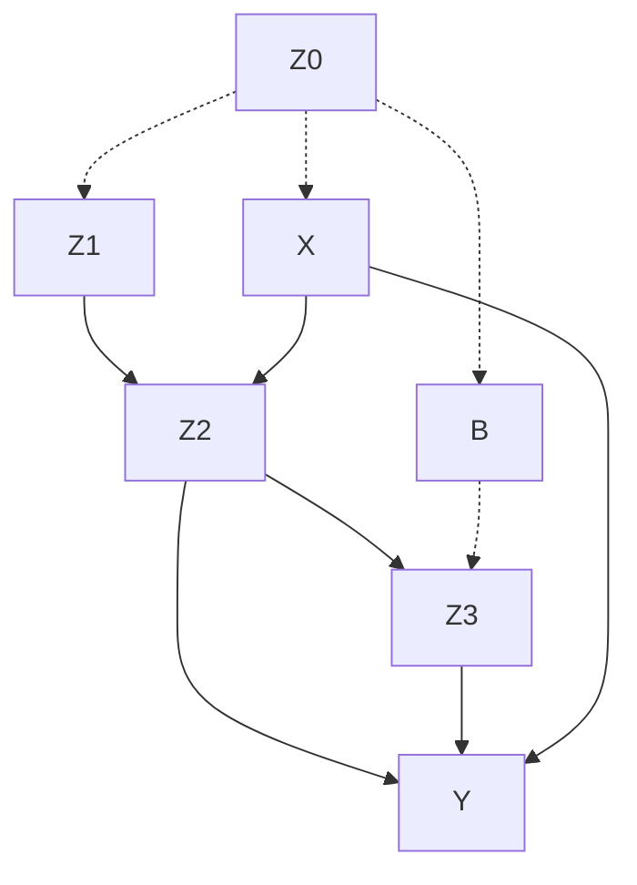

> **图 3.1** 熏蒸剂（X）对产量（Y）的效应的因果图

1. 从 X、 $Z_{1}$ 、 $Z_{2}$ 、 $Z_{3}$ 和 Y 的观测分布可以一致地估计 X 对 Y 的总效应。
2. X 对 Y 的总效应（假定全部为离散变量）由以下公式给出：

> **注** ：第 1 章使用了符号 $P_{x}(y)$ ，由于不便于处理下标，这里改为 $P(y|\hat{x})$ 或者 $P(y|do(x))$ 。读者现在可能对公式（3.1）感到陌生，但不必感到害怕。在阅读 3.4 节后，读者应该能够比求解代数方程更容易地推导出这样的公式。注意， $x'$ 仅仅是对 $X$ 所有取值求和的记号。

$$
P (y \mid \hat {x}) = \sum_ {z_{1}} \sum_ {z_{2}} \sum_ {z_{3}} P (y \mid z_{2}, z_{3}, x) P (z_{2} \mid z_{1}, x) \times \sum_ {x^{\prime}} P (z_{3} \mid z_{1}, z_{2}, x^{\prime}) P (z_{1}, x^{\prime}) \tag {3.1}
$$

其中 $P(y \mid \hat{x})$ 代表在外部干预设定 $X = x$ 的情况下，产量水平达到 $Y = y$ 的概率。

3. 如果 $Z_{3}$ 对于 Y 出现混杂，则无法获得 X 对 Y 的总效应的一致性估计。然而， $Z_{2}$ 对于 Y 混杂不会使公式 $P(y \mid \hat{x})$ 失效。

我们可以通过分析图的性质或通过执行一系列（由图控制的）符号推导来获得这些结论，这些符号推导可得到如式（3.1）的因果公式。

## 3.2 马尔可夫模型中的干预

在马尔可夫模型中，干预（Intervention）是一种对系统进行外部操作的方式，它强制将某些变量设定为特定值，从而切断其与父节点之间的自然依赖关系。这一概念在因果推断中至关重要，因为它允许我们模拟“如果……会怎样”的反事实情景。

> **批注** ：干预与条件作用不同。条件作用只是观察给定变量的值，而干预则主动改变系统的生成机制。

### 3.2.1 干预的定义与符号

干预通常用 **do** 算子表示，记作 $do(X=x)$ ，意思是强制将变量 $X$ 的值设为 $x$ ，同时移除所有指向 $X$ 的边。在马尔可夫模型中，干预后的分布称为 **干预分布** ，记作 $P(Y \mid do(X=x))$ 。

### 3.2.2 干预的图模型表示

在因果图中，干预 $do(X=x)$ 会删除所有指向 $X$ 的入边，保留 $X$ 指向其他变量的出边。这相当于在图中将 $X$ 的父节点集合 $\text{Pa}(X)$ 的影响完全移除。

例如，对于图 3.2 中的因果图：

- **干预前** ： $X$ 依赖于其父节点 $U$ 。
- **干预后** ： $X$ 被固定为常数 $x$ ，不再受 $U$ 影响。

### 3.2.3 干预分布的计算

对于任意变量 $Y$ ，干预分布 $P(Y \mid do(X=x))$ 可以通过以下公式计算：

$$
P(Y \mid do(X=x)) = \sum_{Z} P(Y \mid X=x, Z) \, P(Z)
$$

其中 $Z$ 是 $X$ 的父节点集合之外的协变量。这一公式体现了 **后门准则** （Backdoor Criterion）的核心思想。

> **批注** ：后门准则要求我们调整所有阻塞 $X$ 与 $Y$ 之间后门路径的变量集 $Z$ ，从而消除混杂偏差。

### 3.2.4 干预与条件作用的区别

| 概念     | 条件作用 $P(Y \mid X=x)$          | 干预 $P(Y \mid do(X=x))$          |
| -------- | --------------------------------- | --------------------------------- |
| 含义     | 观察 $X$ 取值为 $x$ 时 $Y$ 的分布 | 强制将 $X$ 设为 $x$ 时 $Y$ 的分布 |
| 图结构   | 保持所有边不变                    | 删除指向 $X$ 的所有边             |
| 适用场景 | 被动观察                          | 主动干预或反事实推理              |
| 公式     | 直接使用条件概率定义              | 使用后门准则或前门准则调整        |

### 3.2.5 示例：药物疗效分析

假设我们研究药物 $X$ 对康复 $Y$ 的影响，且存在混杂变量 $Z$ （如年龄）。图模型如下：

- $Z \rightarrow X$
- $Z \rightarrow Y$
- $X \rightarrow Y$

**干预分布** 为：

$$
P(Y \mid do(X=x)) = \sum_{z} P(Y \mid X=x, Z=z) \, P(Z=z)
$$

这一公式表明，我们需要通过分层调整来消除混杂偏差。

> **批注** ：在实际应用中，干预分布往往需要通过随机对照试验（RCT）来估计，但在观察性数据中，我们可以通过因果推断方法（如匹配、加权或工具变量）来近似。

### 3.2.6 干预的性质

1.  **一致性** ：如果 $X$ 确实被干预为 $x$ ，则 $P(Y \mid do(X=x))$ 与 $P(Y \mid X=x)$ 在无混杂时一致。
2.  **不变性** ：干预后， $X$ 的条件分布 $P(X \mid \text{Pa}(X))$ 被替换为退化分布（即 $X$ 恒等于 $x$ ）。
3.  **可识别性** ：干预分布 $P(Y \mid do(X=x))$ 是否可以从观察数据中识别，取决于图结构是否满足后门准则或前门准则。

### 3.2.7 算法：后门调整

后门调整用于估计干预分布，其步骤如下：

1. 识别所有从 $X$ 到 $Y$ 的后门路径（即存在指向 $X$ 的边的路径）。
2. 选择一组变量 $Z$ ，使得 $Z$ 阻塞所有后门路径，且 $Z$ 不包含 $X$ 的后代。
3. 计算调整后的分布：

   $$
   P(Y \mid do(X=x)) = \sum_{z} P(Y \mid X=x, Z=z) \, P(Z=z)
   $$

4. 如果 $Z$ 是离散变量，则直接分层计算；如果 $Z$ 是连续变量，则使用加权或回归方法。

> **批注** ：后门调整是因果推断中最基础的方法之一，但要求 $Z$ 满足“无未测量混杂”的假设。

### 3.2.8 参考文献

1. Pearl, J. (2009). _Causality: Models, Reasoning, and Inference_ (2nd ed.). Cambridge University Press.
2. Hernán, M. A., & Robins, J. M. (2020). _Causal Inference: What If_. Chapman & Hall/CRC.
3. Spirtes, P., Glymour, C., & Scheines, R. (2000). _Causation, Prediction, and Search_ (2nd ed.). MIT Press.

### 3.2.1 作为干预模型的图

在第 1 章（1.3 节）中，我们看到了因果模型是如何不同于概率模型来预测干预效应的。这个附加特性要求为联合分布 $P$ 补充一个因果图，即一个有向无环图 $G$ 。这个图确定了相关变量之间的因果关系。本节将详细阐述干预的本质，并给出其效应的明确公式。

DAG 的因果解读和关联解读之间的联系是通过基于机制的因果解释建立的，其根源在于计量经济学的早期工作（Frisch，1938；Haavelmo，1943；Simon，1953）。如图 3.1 中的链接所指定的那些，在这种解读下，因果影响指出了对应变量值之间的自治实体机制，这些机制表示为在随机扰动下的函数关系。与这一传统相呼应的是，Pearl 和 Verma（1991）用函数关系而非概率关系来解释 DAG 的因果解读（见式（1.40）和定义 2.2.2）。换句话说，有向无环图 G 中的每组父子节点代表了一个确定函数

$$
x_{i} = f_{i} (p a_{i}, \varepsilon_ {i}), i = 1, \dots , n \tag {3.2}
$$

其中， $pa_{i}$ 是 $G$ 中 $X_{i}$ 的父节点（parent）， $\varepsilon_{i} (1 \leqslant i \leqslant n)$ 是联合独立的、任意分布的随机扰动。这些扰动项表示独立的背景因素，不被分析人员特别关注。如果其中任何一个因素影响了两个或多个变量（从而违反了独立性假定），那么该因素必须作为一个未测量的（或潜在的）变量包含在分析中，并在图中以一个空心节点表示，如图 3.1 中的 $Z_{0}$ 和 $B$ 。例如，图 3.1 中模型传达的因果假定对应如下一组方程：

$$
Z_{0} = f_{0} (\varepsilon_ {0}), \quad B = f_{B} (Z_{0}, \varepsilon_ {B})
$$

$$
Z_{1} = f_{1} (Z_{0}, \varepsilon_ {1}), X = f_{X} (Z_{0}, \varepsilon_ {X})
$$

$$
Z_{2} = f_{2} (X, Z_{1}, \varepsilon_ {2}), Y = f_{Y} (X, Z_{2}, Z_{3}, \varepsilon_ {Y})
$$

$$
Z_{3} = f_{3} (B, Z_{2}, \varepsilon_ {3}) \tag {3.3}
$$

更一般的是，我们可能会把所有未观察到的因素（包括 $\varepsilon_{i}$ ）整合到背景变量集合 $U$ 中，然后通过分布函数 $P(u)$ 或 $P(u)$ 的某些方面（例如独立性）来总结它们的特性。因此，一个因果模型的完整描述包含两个部分：一组函数关系

$$
x_{i} = f_{i} \left(p a_{i}, u_{i}\right), \quad i = 1, \dots , n \tag {3.4}
$$

和背景因素上的联合分布函数 $P(u)$ 。如果与因果模型 $M$ 关联的图 $G(M)$ 是无环的，那么 $M$ 称为 **半马尔可夫模型** （semi-Markovian model）。此外，如果背景变量是独立的，则 $M$ 称为 **马尔可夫模型** （Markovian），这是由于观测变量的最终分布相对于 $G(M)$ 具有马尔可夫性（见定理 1.4.1）。因此，如果观测变量为 $\{X, Y, Z_1, Z_2, Z_3\}$ ，则图 3.1 所描述的模型是半马尔可夫模型；如果 $Z_0$ 和 $B$ 也能被观测到，则图 3.1 所描述的模型会变成马尔可夫模型。在第 7 章中，我们将继续分析一般的非马尔可夫模型，但在本章中，所有的模型都被假定为马尔可夫模型或具有未观测变量的马尔可夫模型（即半马尔可夫模型）。

毋庸置疑，我们很少会得到 $P(u)$ 甚至 $f_{i}$ 的确切形式。然而，对于一个完全确定模型的数学含义进行解释是很重要的，有助于从部分确定的模型（例如图 3.1 所描述的模型）中得出有效的推论。

式（3.2）称为结构方程模型（Structural Equation Model，SEM）的非参数化模式（Wright，1921；Goldberger，1973），只是方程的函数具体形式（以及扰动项的分布）尚未确定。结构方程中的等号表示“被（右边所）确定”的非对称的反事实关系，每个方程表示一个稳定的自治机制。例如， $Y$ 的方程表明：无论我们当前观察到 $Y$ 是什么，且无论其他方程中可能发生的任何变化，如果假定变量 $(X, Z_{2}, Z_{3}, \varepsilon_{Y})$ 的值分别是 $(x, z_{2}, z_{3}, \varepsilon_{Y})$ ，那么 $Y$ 的值肯定由函数 $f_{Y}$ 所确定。

回顾我们在 1.4 节中的讨论，所有父子关系的函数描述导出了联合分布的递归分解，而这正是贝叶斯网络的特性：

$$
P(x_{1}, \dots, x_{n}) = \prod_{i} P(x_{i} \mid pa_{i}) \tag{3.5}
$$

在图 3.1 的实例中，这个公式为：

$$
P(z_{0}, x, z_{1}, b, z_{2}, z_{3}, y) = P(z_{0}) \, P(x \mid z_{0}) \, P(z_{1} \mid z_{0}) \, P(b \mid z_{0}) \times P(z_{2} \mid x, z_{1}) \, P(z_{3} \mid z_{2}, b) \, P(y \mid x, z_{2}, z_{3}) \tag{3.6}
$$

此外，函数描述提供了一种方便的语言，用于刻画结果分布会如何改变以响应外部干预。这是通过将每个干预描述为对某个选择的函数子集的修改，同时保持其他函数不变来实现的。一旦我们知道了干预改变的机制特性和本质，就可以通过修改模型中相应方程并使用修改后的模型计算一个新的概率函数来预测干预的总体效应。

最简单的外部干预类型是强制一个变量 $X_{i}$ 取某个固定值 $x_{i}$ 。我们将这种干预称为 **原子干预（atomic intervention）** ，它相当于将 $X_{i}$ 从原有函数机制 $x_{i} = f_{i}(pa_{i}, u_{i})$ 的影响中移除，并将其置于一个新的机制的影响之下，该新机制在设置值 $x_{i}$ 的同时保持所有其他机制不变。形式上，我们将原子干预记作 $do(X_{i} = x_{i})$ ，或者简写为 $do(x_{i})$ ，它相当于从模型中移除方程 $x_{i} = f_{i}(pa_{i}, u_{i})$ 并在剩下的方程中代入 $X_{i} = x_{i}$ 。

这样得到的新模型代表了干预 $do(X_{i} = x_{i})$ 下的系统行为，此时求解 $X_{j}$ 的分布，得到的是 $X_{i}$ 对 $X_{j}$ 的因果效应，表示为 $P(x_{j} \mid \hat{x}_{i})$ 。更一般化的是，当干预强制一个变量集合 $X$ 取固定值 $x$ 时，那么从模型中移除式（3.4）指定的方程子集，每个方程对应 $X$ 的一个成员，由此定义的剩余变量上的新分布完全刻画了干预的效应。


#### 定义 3.2.1（因果效应）

给定两个不相交的变量集 $X$ 和 $Y$ ， $X$ 对 $Y$ 的 **因果效应** 是一个从 $X$ 到 $Y$ 的概率分布空间的函数，表示为 $P(y|\hat{x})$ 或者 $P(y|do(x))$ 。对于 $X$ 的每个取值 $x$ ， $P(y|\hat{x})$ 给出了从式（3.4）的模型中移除所有对应 $X$ 中变量的方程，并在剩余方程中代入 $X = x$ 后推导出 $Y = y$ 的概率。

显然，与简化的方程组对应的图是 $G$ 的子图，其中进入 $X$ 的所有箭头都被删除（Spirtes et al., 1993）。差值 $E(Y|do(x')) - E(Y|do(x''))$ 有时被视为“因果效应”的定义（Rosenbaum and Rubin, 1983），其中 $x'$ 和 $x''$ 是 $X$ 的两个不同取值。这个差值总可以从通用函数 $P(y|do(x))$ 中计算得到，该函数定义在 $X$ 的每个水平 $x$ 上，并给出了干预效应的更精细描述。

### 3.2.2 干预作为变量

另一种（但有时更吸引人的）干预解释是将对干预的响应视为一个变量（Pearl，1993b）。方法是将函数 $f_{i}$ 本身表示为变量 $F_{i}$ 的一个值，并将式（3.2）改写为

$$
x_{i} = I (pa_{i}, f_{i}, u_{i}) \tag{3.7}
$$

其中， $I$ 是一个三元函数，满足：

$$
I (a, b, c) = f_{i} (a, c), \text {只要} b = f_{i}
$$

这相当于将干预概念化为一种改变 $X_{i}$ 与其父节点之间函数 $f_{i}$ 的外部力量 $F_{i}$ 。在图模型上，我们可以将 $F_{i}$ 表示为 $X_{i}$ 的一个额外父节点，这种干预的效应可以通过标准条件化的方式来分析，即将变量 $F_{i}$ 取值 $f_{i}$ 的事件作为我们的概率条件。

原子干预 $do(X_{i} = x_{i}^{\prime})$ 的效应表示在 $G$ 中添加链接 $F_{i} \rightarrow X_{i}$ （参见图 3.2），其中 $F_{i}$ 是一个取值范围为 $\{do(x_i^{\prime}), \mathrm{idle}\}$ 的新变量， $x_{i}^{\prime}$ 在 $X_{i}$ 域中取值，“idle”表示无干预。因此，在增广网络中， $X_{i}$ 的新父代变量集合为 $PA_{i}^{\prime} = PA_{i} \cup \{F_{i}\}$ ，并且通过如下条件概率（conditional probability）与 $X_{i}$ 关联：

$$
P (x_{i} | pa_{i}^{\prime}) =
\left\{
\begin{array}{ll}
P (x_{i} | pa_{i}) & F_{i} = \mathrm{idle} \\
0 & F_{i} = do (x_{i}^{\prime}) \text {且} x_{i} \neq x_{i}^{\prime} \\
1 & F_{i} = do (x_{i}^{\prime}) \text {且} x_{i} = x_{i}^{\prime}
\end{array}
\right. \tag{3.8}
$$


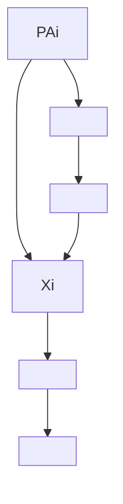


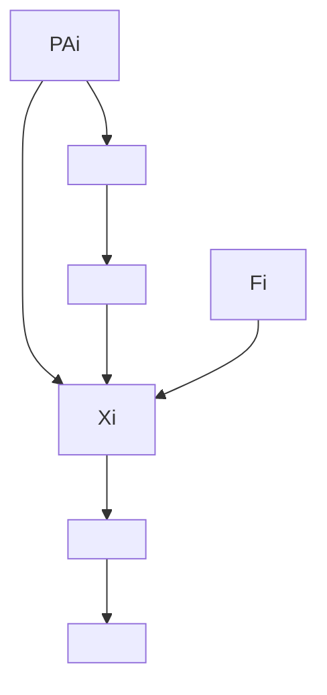

> 图 3.2 通过增广网络 $G^{\prime} = G \cup \{F_{i} \rightarrow X_{i}\}$ 来表示外部干预 $F_{i}$

干预 $do(x_{i}^{\prime})$ 的效应将原始概率函数 $P(x_{1}, \dots, x_{n})$ 转化为新概率函数 $P(x_{1}, \dots, x_{n} \mid \hat{x}_{i}^{\prime})$ ，公式为

$$
P (x_{1}, \dots, x_{n} | \hat{x}_{i}^{\prime}) = P^{\prime} (x_{1}, \dots, x_{n} | F_{i} = do (x_{i}^{\prime})) \tag{3.9}
$$

其中， $P'$ 是由增广网络 $G' = G \cup \{F_i \to X_i\}$ 和式（3.8）刻画的分布，在 $F_i$ 上具有任意先验分布。一般而言，通过为 $G$ 中的每个节点添加一个假设干预链接 $F_i \to X_i$ ，我们可以构造一个增广概率函数 $P'(x_1, \ldots, x_n; F_1, \ldots, F_n)$ ，其中包含更丰富的干预类型信息。多重干预可表示为将 $P'$ 条件于 $F_i$ 的子集（在各自的 $do(x_i')$ 域上取值），而干预前的概率函数 $P$ 被视为对 $P'$ 中的每个 $F_i$ 取条件“idle”值后所推导的后验分布。

> **注** ：增广网络表示法的一个优点是，它适用于函数关系 $f_{i}$ 的任何变化，而不仅仅是用常数替换 $f_{i}$ 。它也清楚地显示了 $f_{i}$ 不受外部控制的自发变化的结果。例如，图 3.2 预测，只有 $X_{i}$ 的后代会受到 $f_{i}$ 变化的影响，因此对于 $X_{i}$ 的任何非后代节点集 Z，边缘概率（marginal probability） $P(z)$ 将保持不变。同样，图 3.2 表明，如果对于 $X_{i}$ 的任何后代节点集 Y， $X_{i}$ 使 $F_{i}$ 与 Y d-分离，则条件概率 $P(y|x_{i})$ 不随 $f_{i}$ 的改变而变化。

Kevin Hoover（1990，2001）利用这种不变特性来确定经济变量（如就业、货币供应量）之间的因果影响方向，方法是观察控制这些变量的过程（如税收改革、劳动争议）突然改变所引起的变化。事实上，一旦我们获得了可靠的信息（例如，从历史或制度知识中获得），即一个突然的局部变化以特定机制 $f_{i}$ 的形式发生，而该机制制约一对给定的父子变量 $(X_{i}, PA_{i})$ ，那么我们可以用围绕这些变量的边缘概率和条件概率的变化来确定 $X_{i}$ 是否确实是这对父子变量中的子代变量（因变量），从而确定这个领域的因果影响结构（Tian and Pearl, 2001a）。增广网络 $G'$ 中显示了在这种变化下保持不变的统计特性，以及这种不变性背后的因果假定。

### 3.2.3 计算干预效应

无论我们是将干预表示为对现有模型的修改（定义 3.2.1），还是将其表示为增广模型中的条件化（式（3.9）），结果都是干预前分布和干预后分布之间明确定义的一种转换。至于原子干预 $do(X_{i} = x_{i}^{\prime})$ ，这种转换可以用一个简单的截断因子分解（truncated factorization）公式来表示，该公式可以直接从式（3.2）和定义 3.2.1 中得到：

$$
P \left(x_{1}, \dots , x_{n} \mid \hat {x}_{i}^{\prime}\right) = \left\{\begin{array}{l l} \prod_ {j \neq i} P \left(x_{j} \mid p a_{j}\right) & x_{i} = x_{i}^{\prime} \\ 0 & x_{i} \neq x_{i}^{\prime} \end{array} \right. \tag {3.10}
$$

式（3.10）表示从式（3.5）的乘积中移除 $P(x_{i}|pa_{i})$ 项，因为 $pa_{i}$ 不再影响 $X_{i}$ 。例如，干预 $do(X = x^{\prime})$ 将式（3.6）的干预前分布转化为乘积：

$$
P \left(z_{0}, z_{1}, b, z_{2}, z_{3}, y \mid \hat {x}^{\prime}\right) = P \left(z_{0}\right) P \left(z_{1} \mid z_{0}\right) P (b \mid z_{0}) \times P \left(z_{2} \mid x^{\prime}, z_{1}\right) P \left(z_{3} \mid z_{2}, b\right) P (y \mid x^{\prime}, z_{2}, z_{3})
$$

从图模型上看，移除 $P(x_{i}|pa_{i})$ 项等价于移除 $PA_{i}$ 和 $X_{i}$ 之间的链接，同时保持剩余网络不变。显然，式（3.10）中定义的转换既满足定义 1.3.1 的条件，又满足式（1.38）和式（1.39）的性质。

将式（3.10）乘以 $P(x_{i}^{\prime}|pa_{i})$ 然后再除以 $P(x_{i}^{\prime}|pa_{i})$ 后，干预前后分布的关系变得更加清晰：

$$
P (x_{1}, \dots , x_{n} | \hat {x}_{i}^{\prime}) = \left\{\begin{array}{l l} \frac {P (x_{1} , \cdots , x_{n})}{P (x_{i}^{\prime} | p a_{i})} & x_{i} = x_{i}^{\prime} \\ 0 & x_{i} \neq x_{i}^{\prime} \end{array} \right. \tag {3.11}
$$

如果我们把联合分布看作对抽象点集合 $(x_{1},\cdots,x_{n})$ 的质量分配，每个点代表了世界的一种可能状态，那么式（3.11）的描述揭示了由干预 $do(X_{i}=x_{i}^{\prime})$ 引发的质量分布变化的一些有趣的性质（Goldszmidt and Pearl，1992）。每个点 $(x_{1},\cdots,x_{n})$ 被看作质量增加了一个因子，即与该点对应的条件概率 $P(x_{i}^{\prime}|pa_{i})$ 的倒数。条件概率较低的点的质量值会大幅增加，而那些被看作是 $x_{i}^{\prime}$ 的自然（非干预）实现的具有 $pa_{i}$ 值的点（即 $P(x_{i}^{\prime}|pa_{i})\approx1$ ），将保持其质量不变。

在标准贝叶斯条件化（Bayes conditionalization）中，每个被排除的点 $(x_{i}\neq x_{i}^{\prime})$ 通过一个归一化常数将其质量转移到整个保留的点集。但是，式（3.11）描述了一种不同的变换：每个被排除的点 $(x_{i}\neq x_{i}^{\prime})$ 将其质量转移到具有相同 $pa_{i}$ 值的可选择的点集上，这可以从分配给每层 $pa_{i}$ 的总质量和该层内点的相对质量的不变性看出来。

> 参见 4.1.3 节。——译者注

$$
P (p a_{i} | d o (x_{i}^{\prime})) = P (p a_{i})
$$

$$
\frac {P (s_{i} , p a_{i} , x_{i}^{\prime} \mid d o (x_{i}^{\prime}))}{P (s_{i}^{\prime} , p a_{i} , x_{i}^{\prime} \mid d o (x_{i}^{\prime}))} = \frac {P (s_{i} , p a_{i} , x_{i}^{\prime})}{P (s_{i}^{\prime} , p a_{i} , x_{i}^{\prime})}
$$

在这里， $S_{i}$ 表示除了 $\{PA_{i} \cup X_{i}\}$ 外的所有点集。总体上说，选定的质量转移接受点可被认为是“最接近于”被排除的，且与其共享相同历史的点，这里共享历史指具有相同 $pa_{i}$ 值（参见 4.1.3 节和 7.4.3 节）。

当我们将除以 $P(x_{i}^{\prime}|pa_{i})$ 解释为对 $x_{i}^{\prime}$ 和 $pa_{i}$ 的条件化时，我们会得到式（3.11）的另一种有趣形式：

$$
P (x_{1}, \dots , x_{n} | \hat {x}_{i}^{\prime}) = \left\{\begin{array}{l l} P (x_{1}, \dots , x_{n} | x_{i}^{\prime}, p a_{i}) P (p a_{i}) & x_{i} = x_{i}^{\prime} \\ 0 & x_{i} \neq x_{i}^{\prime} \end{array} \right. \tag {3.12}
$$

当使用这个公式来计算干预 $do(X_{i} = x_{i}^{\prime})$ 对与 $(X_{i}\cup PA_{i})$ 不相交的变量集 $Y$ 的效应时，这个公式会变得很熟悉。在除 $Y\cup X_{i}$ 之外的所有变量上对式（3.12）求和得到如下定理。


#### 定理 3.2.2（直接原因校正）

令 $PA_{i}$ 表示变量 $X_{i}$ 的直接原因集， $Y$ 是与 $\{X_{i}\cup PA_{i}\}$ 不相交的任意变量集。干预 $do(X_{i}=x_{i}^{\prime})$ 对 $Y$ 的效应为

$$
P (y \mid \hat {x}_{i}^{\prime}) = \sum_ {p a_{i}} P (y \mid x_{i}^{\prime}, p a_{i}) P (p a_{i}) \tag {3.13}
$$

其中， $P(y|x_{i}^{\prime},pa_{i})$ 和 $P(pa_{i})$ 表示干预前的概率。

式（3.13）要求 $P(y \mid x_{i}^{\prime})$ 以 $X_{i}$ 的父节点为条件，然后用 $PA_{i} = pa_{i}$ 的先验概率加权取平均。这个由设置条件然后取平均定义的操作称为“ **通过 $PA_{i}$ 校正** ”。

许多哲学家提出将这一校正公式（adjustment formula）的变形作为因果性和因果效应的概率定义（probabilistic causality）（参见 7.5 节）。例如，Good（1961）提出以原因恰好出现“之前的宇宙状态”为条件。Suppes（1970）提出对直到原因发生之前的整个历史取条件。Skyrms（1980，p.133）要求条件化“在做出与我们的行为有因果关系的决定时，对于行为影响之外的因素给予最大程度的明确化说明”。

当然，这些建议中设置条件的目的是为了消除原因（在我们的例子中是 $X_{i}=x_{i}^{\prime}$ ）和结果（ $Y=y$ ）之间的虚假关联，显然，父节点 $PA_{i}$ 集合能够以极大经济的效率实现这一目标。在本书中我们追求的结构解释中，因果效应以一种完全不同的方式定义。式（3.13）中没有引入条件操作符作为一种旨在抑制虚假关联的补救性“校正”。相反，它在形式上出现在式（3.10）所表示的更深层的原则中，即 **保留干预前分布所能提供的所有不变信息** 。

式（3.13）很容易扩展为同时操纵多个变量的、更精细的干预。例如，如果我们考虑复合干预 $do(S = s)$ ，其中 $S$ 是变量集合，那么（对应式（1.37））我们应该从式（3.5）的乘积中删除所有对应 $S$ 中变量的因子 $P(x_{i}|pa_{i})$ ，得到更一般的截断因子分解：

$$
P (x_{1}, \dots , x_{n} | \hat {s}) = \left\{\begin{array}{l l} \prod_ {i | X_{i} \notin S} P (x_{i} | p a_{i}) & \text {所有与} s \text {一致的} x_{1}, \dots , x_{n} \\ 0 & \text {其他} \end{array} \right. \tag {3.14}
$$

同样，我们不需要把自己局限于将变量设置为常量的单一干预。相反，我们可以考虑对因果模型进行更一般的修正以替换某些机制。例如，如果我们决定将 $X_{i}$ 值的机制替换为另一个可能涉及新的变量集 $PA_{i}^{*}$ 的方程，那么可通过将原来的结果乘上新方程导出条件概率 $P^{*}(x_{i}|pa_{i}^{*})$ 。修正后的联合分布为

$$
P^{*}(x_{1},\dots ,x_{n}) = P(x_{1},\dots ,x_{n})P^{*}(x_{i}|pa_{i}^{*}) / P(x_{i}|pa_{i})
$$

### 实例：动态过程控制

为了说明这些操作，让我们考虑一个涉及过程控制（process control）的例子，一个在健康管理、经济政策制定、产品营销或机器人运动规划等领域的类似应用中都应该直接遵循的例子。

令变量 $Z_{k}$ 表示时间 $t_{k}$ 时的生产过程状态，令 $X_{k}$ 表示（时间 $t_{k}$ 时）用于控制该过程的变量集（参见图 3.3）。例如， $Z_{k}$ 可以表示工厂中不同位置的温度和压力等测量值， $X_{k}$ 可以表示主管道中的各种化学品的流速。

假定在收集数据的同时，过程由策略 $S$ 控制，其中每个 $X_{k}$ 取决于观测到的前三个变量（ $X_{k-1}, Z_{k}, Z_{k-1}$ ），并且以概率 $P(x_{k} \mid x_{k-1}, z_{k}, z_{k-1})$ 选择 $X_{k} = x_{k}$ 。 $S$ 的实施效果以联合概率函数 $P(y, z_{1}, z_{2}, \cdots, z_{n}, x_{1}, x_{2}, \cdots, x_{n})$ 的形式进行检测和描述，其中 $Y$ 是结果变量（例如，最终产品的质量）。

最后（为了简单起见），让我们假定过程的状态 $Z_{k}$ 只依赖于前一个状态 $Z_{k-1}$ 和前一个控制 $X_{k-1}$ 。我们希望评估将 $S$ 替换为新策略 $S^{*}$ 的价值，新策略中 $X_{k}$ 根据新的条件概率 $P^{*}(x_{k} \mid x_{k-1}, z_{k}, z_{k-1})$ 取值。


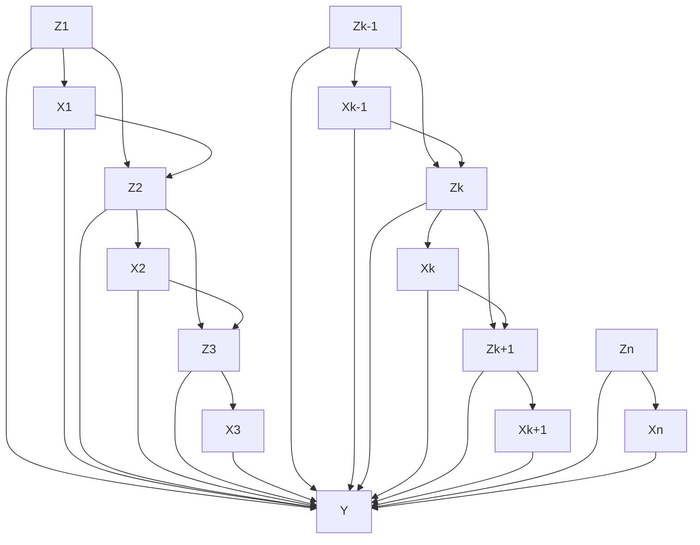

> 图 3.3 连续过程中控制变量 $X_{1}, \cdots, X_{n}$ 、状态变量 $Z_{1}, \cdots, Z_{n}$ 和结果变量 $Y$ 之间典型依赖的动态因果图

基于我们前面的分析（式（3.14）），新策略 $S^{*}$ 的性能 $P^{*}(y)$ 由以下分布决定：

$$
\begin{array}{l}
P^{*}(y, z_{1}, z_{2}, \dots , z_{n}, x_{1}, x_{2}, \dots , x_{n}) = P^{*}(y \mid z_{1}, z_{2}, \dots , z_{n}, x_{1}, x_{2}, \dots , x_{n}) \\
\times \prod_{k=1}^{n} P^{*}(z_{k} \mid z_{k-1}, x_{k-1}) \prod_{k=1}^{n} P^{*}(x_{k} \mid x_{k-1}, z_{k}, z_{k-1}) \tag{3.15}
\end{array}
$$

由于（方程右边的）前两项保持不变，而第三项是已知的，我们得到：

$$
\begin{array}{l}
P^{*}(y) = \sum_{z_{1}, \dots , z_{n}, x_{1}, \dots , x_{n}} P^{*}(y, z_{1}, z_{2}, \dots , z_{n}, x_{1}, x_{2}, \dots , x_{n}) \\
= \sum_{z_{1}, \dots , z_{n}, x_{1}, \dots , x_{n}} P(y \mid z_{1}, z_{2}, \dots , z_{n}, x_{1}, x_{2}, \dots , x_{n}) \\
\times \prod_{k=1}^{n} P(z_{k} \mid z_{k-1}, x_{k-1}) \prod_{k=1}^{n} P^{*}(x_{k} \mid x_{k-1}, z_{k}, z_{k-1}) \tag{3.16}
\end{array}
$$

在 $S^{*}$ 具有确定性和时间不变性的特殊情况下， $X_{k}$ 变为关于 $X_{k-1}$ 、 $Z_{k}$ 和 $Z_{k-1}$ 的函数：

$$
x_{k} = g(x_{k-1}, z_{k}, z_{k-1})
$$

那么，对于 $x_{1},\cdots,x_{n}$ 的求和可以得到：

$$
P^{*}(y) = \sum_{z_{1}, \dots , z_{n}} P(y \mid z_{1}, z_{2}, \dots , z_{n}, g_{1}, g_{2}, \dots , g_{n}) \prod_{k = 1}^{n} P(z_{k} \mid z_{k - 1}, g_{k - 1}) \tag{3.17}
$$

其中， $g_{k}$ 递归定义为

$$
g_{1} = g(z_{1}), \quad g_{k} = g(g_{k - 1}, z_{k}, z_{k - 1})
$$

在策略 $S^{*}$ 是由基本行为 $do(X_{k} = x_{k})$ 构成的特殊情况下，函数 $g$ 退化为常数 $x_{k}$ ，我们得到：

$$
P^{*}(y) = P\left(y \mid \hat{x}_{1}, \hat{x}_{2}, \dots , \hat{x}_{n}\right) = \sum_{z_{1}, \dots , z_{n}} P\left(y \mid z_{1}, z_{2}, \dots , z_{n}, x_{1}, x_{2}, \dots , x_{n}\right) \prod_{k} P\left(z_{k} \mid z_{k - 1}, x_{k - 1}\right) \tag{3.18}
$$

该公式也可由式（3.14）得到。

该实例所说明的规划问题是典型的 **马尔可夫决策过程（Markov decision processes, MDPs）** （Howard, 1960; Dean and Wellman, 1991; Bertsekas and Tsitsiklis, 1996），其分析的目标是在给定当前状态 $Z_{k}$ 和过去行为的条件下，找到下一个最佳行为 $do(X_{k} = x_{k})$ 。在 MDPs 中，我们通常给予转移函数 $P(z_{k+1} \mid z_{k}, \hat{x}_{k})$ 和最小化的代价函数。在我们刚才分析的问题中，这两个函数都没有给出，相反，我们必须从过去（可能是次优的）策略收集的数据中学习这两个函数。幸运的是，由于模型中所有的变量都是可测量的，因此这两个函数都是可识别的，可直接从相应的条件概率中估计得到：

$$
P\left(z_{k + 1} \mid z_{k}, \hat{x}_{k}\right) = P\left(z_{k + 1} \mid z_{k}, x_{k}\right)
$$

$$
P(y \mid z_{1}, z_{2}, \dots , z_{n}, \hat{x}_{1}, \hat{x}_{2}, \dots , \hat{x}_{n}) = P(y \mid z_{1}, z_{2}, \dots , z_{n}, x_{1}, x_{2}, \dots , x_{n})
$$

在第 4 章（4.4 节）中，我们将讨论 **部分可观察马尔可夫决策过程（POMDPs）** ，其中一些状态 $Z_{k}$ 是不可观察的，学习这些问题中的转移函数和代价函数需要更复杂的识别方法。

值得注意的是，在本例中，为了预测新策略的效应，首先需要测量受某些控制变量 $(X_{k-1})$ 影响的变量 $(Z_k)$ 。关于实验设计的经典文献通常回避这样的测量（Cox，1958，p.48），因为它们存在于干预和结果之间的因果路径上，所以往往会混杂预期的效应估计。然而，我们的分析表明，如果处理得当，这些测量对于预测动态控制过程的效果可能是不可缺少的。这在 **半马尔可夫模型** （即涉及未测量变量的有向无环图）中尤其正确，3.3.2 节将对此加以分析。

### 总结

本节所提供分析的直接含义是，给定一个干预变量的所有直接原因（即父代变量）都可观察的因果图，人们可以从干预前的分布推断干预后的分布。因此，在这样的假定下，我们可以使用截断因子分解公式（3.11）从被动（即非实验的）观察中估计干预效应。

然而，更具挑战性的问题是在类似图 3.1 所示的情形中推导因果效应，其中 $PA_{i}$ 的某些成员是不可观测的，从而导致难以估计 $P(x_{i}^{\prime}|pa_{i})$ 。在 3.3 节和 3.4 节中，我们提供了简单的图模型检验来确定何时 $P(x_{j}|\hat{x}_{i})$ 在这样的模型中是可估计的。

但首先，我们需要更形式化地定义，因果量值 $Q$ 在被动观察中可估计意味着什么，这是一个专业术语名为 **识别** 的问题。

### 3.2.4 因果量值的识别

不同于统计参数（statistical parameter），因果量值是相对于因果模型 $M$ 来定义的，而不是相对于观测变量集合 $V$ 上的联合分布 $P_{M}(v)$ 。由于非实验数据仅提供关于 $P_{M}(v)$ 的信息，并且不同的模型可能产生相同的分布，因此存在这样的危险：即使获取了无限多的样本，也无法从数据中明确地识别出所需的量值。

**可识别性** 确保 $M$ 表达的附加假定（如因果图或结构方程中的零系数）能够提供缺失的信息，而不要求完全详细地说明 $M$ 。


#### 定义 3.2.3（可识别性）

令 $Q(M)$ 是模型 $M$ 的任何可计算量值。如果对于一类模型 $\pmb{M}$ 中的任何一对模型 $M_{1}$ 和 $M_{2}$ ，只要 $P_{M_1}(v) = P_{M_2}(v)$ ，就有 $Q(M_{1}) = Q(M_{2})$ ，那么称 $Q$ 在模型类 $\pmb{M}$ 中是可识别的。当观察受限，只允许估计（ $P_M(v)$ ）特征的一部分集合 $F_{M}$ 时，如果当 $F_{M_1} = F_{M_2}$ 时 $Q(M_{1}) = Q(M_{2})$ ，那么定义 $Q$ 从 $F_{M}$ 可识别。

对于整合（ $P(v)$ 概述的）统计数据与 $\{f_i\}$ 的不完全因果知识来说，可识别性是至关重要的，因为它使我们能够从 $P(v)$ 的大量样本中一致地估计量值 $Q$ ，而不需要详细说明 $M$ 的细节，只要有 $M$ 类的一般特征就足够了。对于我们的分析而言，感兴趣的量值 $Q$ 是因果效应 $P_M(y|\hat{x})$ ，它显然在给定的模型 $M$ 中是可计算的（使用定义 3.2.1），但我们常常需要从 $M$ 的一个不完全的刻画（即 $M$ 对应的图 $G$ 中描述的定性特征）中计算该量值。因此，我们将考虑具有以下共同特性的模型类 $M$ 。

- (i) 它们具有相同的父子节点（即相同的因果图 $G$ ）。
- (ii) 它们产生在观测变量上的正分布（即 $P(v) > 0$ ）。

对于这样的类，我们得到如下定义。


#### 定义 3.2.4（因果效应可识别性）

如果量值 $P(y|\hat{x})$ 可从观测变量的任何正概率中唯一地计算，即对于任何满足 $P_{M_1}(v) = P_{M_2}(v) > 0$ 且 $G(M_{1}) = G(M_{2}) = G$ 的模型对 $M_{1}$ 和 $M_2$ ，有 $P_{M_1}(y|\hat{x}) = P_{M_2}(y|\hat{x})$ ，那么 $X$ 对 $Y$ 的因果效应在图 $G$ 中是可识别的。

$P(y \mid \hat{x})$ 的可识别性确保了从以下两个信息源中推导行为 $do(X = x)$ 对 $Y$ 的效应是可能的：

- (i) 由概率函数 $P(v)$ 概述的被动观察；
- (ii) 因果图 $G$ ，（定性地）明确了哪些变量构成问题领域中的稳定机制，或者说，在确定领域中的每个变量时，有哪些变量参与。

将可识别性限制为正分布可以确保在适当情况的数据中表示条件 $X = x'$ 出现，从而避免式（3.11）中的分母为零。因为在实施行为 $do(X = x')$ 后， $X$ 无法获得值 $x'$ ，所以不可能从数据中推断出该行为的效应。扩展到一些非正分布也是可行的，但这里将不再讨论。注意，为了证明不可识别性，只要找到两组结构方程就足够了，这两组结构方程满足在观测变量上产生相同的分布，但有不同的因果效应。

使用可识别性的概念，我们现在可以将 3.2.3 节的结果总结为以下定理。


#### 定理 3.2.5

给定任意马尔可夫模型的因果图 $G$ ，其中变量的子集 $V$ 是可测量的，只要 $\{X \cup Y \cup PA_X\} \subseteq V$ ，即只要 $X$ 、 $Y$ 以及 $X$ 的所有父代变量是可测量的，那么因果效应 $P(y|\hat{x})$ 是可识别的。 $P(y|\hat{x})$ 的表达式可通过校正 $PA_x$ 获得，正如式（3.13）所示。

定理 3.2.5 的一个特殊情况是假定所有变量都可观察的。


#### 推论 3.2.6

给定任意马尔可夫模型的因果图 $G$ ，其中所有变量都可测量，那么对于变量 $X$ 和 $Y$ 的任意两个子集，因果效应 $P(y \mid \hat{x})$ 都是可识别的，并且通过截断因子分解公式（3.14）可获得其值。

现在我们来看半马尔可夫模型中的识别问题。

## 3.3 控制混杂偏差

无论何时，我们评估一个因素（ $X$ ）对另一个因素（ $Y$ ）的影响，都会出现这样一个问题：我们是否应该对于其他一些因素（ $Z$ ）（也称为“协变量”“伴随因素”或“混杂因素”）的可能变化来校正（或标准化）我们的测量（Cox, 1958）。校正相当于将群体按照 $Z$ 分成同类的组，评估每个同类组中 $X$ 对 $Y$ 的影响，然后对结果求平均（如式（3.13））。早在 1899 年，Karl Pearson 提出辛普森悖论（Simpson's paradox）时（见 6.1 节）就认识到了这种校正难以捉摸的性质：在分析中加入额外因素，两个变量之间的任何统计关系都可能被反转。例如，我们可能会发现，吸烟的学生比不吸烟的学生获得了更高的成绩，但校正年龄后，在每个相同年龄组中吸烟学生的成绩更低，进一步校正家庭收入，在每个相同收入和相同年龄组中，吸烟学生再次比不吸烟学生获得更高成绩，等等。

尽管经过了一个世纪的分析，辛普森反转仍然“陷人以粗心”（是一个陷阱）（Dawid, 1979），它提出的实际问题，对于一个协变量集合的校正（adjustment for covariates）是否合适，难以实现数学化的处理。例如，流行病学家仍在争论“混杂”的意义（Grayson, 1987；Shapiro, 1997），经常对于错误的协变量集进行校正（Weinberg, 1993；也参见第 6 章）。Rosenbaum 和 Rubin（1983）与 Pratt 和 Schlaifer（1988）的潜在结果分析产生了一个名为“可忽略性（ignorability）”的概念，该概念在反事实词汇中重新定义了混杂问题，但未能给研究人员提供一个可行的标准来指导协变量的选择（参见 11.3.2 节）。可忽略性是指：“给定 $Z$ ，如果 $X$ 取值 $x$ 时 $Y$ 所得到的值独立于 $X$ ，那么 $Z$ 是一个可接受的协变量集。”由于反事实是不可观测的，并且反事实的条件独立性判断（judgement of conditional independence）不容易从常见的科学知识中进行判断，因此问题仍然存在：应该用什么准则来决定哪些变量适合校正？

3.3.1 节使用友好的因果图语言给出校正问题的一般化和形式化的解决方案。在 3.3.2 节中，我们将此结果扩展到受 $X$ 影响的非标准协变量上，因此需要几个校正步骤。最后，3.3.3 节举例说明了这些准则的应用。

### 3.3.1 后门准则

假定一个因果图 $G$ 与 $G$ 中观测变量子集 $V$ 的非实验数据，我们希望估计干预 $do(X = x)$ 对变量集 $Y$ 有何效应，其中 $X$ 和 $Y$ 是 $V$ 的两个子集。换句话说，在给定 $G$ 描述的假定条件下，我们寻求从 $P(v)$ 的样本中估计 $P(y|\hat{x})$ 。

我们将证明，存在一个简单的图模型检验，可以直接作用于因果图来检验变量集 $Z \subseteq V$ 是否足以识别 $P(y|\hat{x})$ ，该检验在 Pearl（1993b）中命名为“后门准则”（back-door criterion）。

> $^{\ominus}$ 后门准则的命名来源于其直观的路径阻断思想。


#### 定义 3.3.1（后门）

在有向无环图 $G$ 中，变量集 $Z$ 满足有序变量对 $(X_{i}, X_{j})$ 的后门准则，条件是：

1.  $Z$ 中没有节点是 $X_{i}$ 的后代。
2.  $Z$ 阻断了 $X_{i}$ 和 $X_{j}$ 之间所有指向 $X_{i}$ 的路径。

同理，如果 $X$ 和 $Y$ 是 $G$ 中两个不相交的节点子集，那么如果 $Z$ 满足任何变量对 $(X_{i}, X_{j})$ 的后门准则，其中 $X_{i} \in X$ ， $X_{j} \in Y$ ，则称 $Z$ 满足 $(X, Y)$ 的后门准则。

名称“后门”对应条件（ii），这个条件要求只有指向 $X_{i}$ 的路径被阻断；这些路径可被视为通过后门进入 $X_{i}$ 。例如，在图 3.4 中，集合 $Z_{1} = \{X_{3}, X_{4}\}$ ， $Z_{2} = \{X_{4}, X_{5}\}$ 满足后门准则，但 $Z_{3} = \{X_{4}\}$ 不满足，因为 $X_{4}$ 没有阻断路径（blocked path） $(X_{i}, X_{3}, X_{1}, X_{4}, X_{2}, X_{5}, X_{j})$ 。

> $^{\ominus}$ 第 11 章（11.3.1 节）给出了条件（i）和（ii）的直观解释。


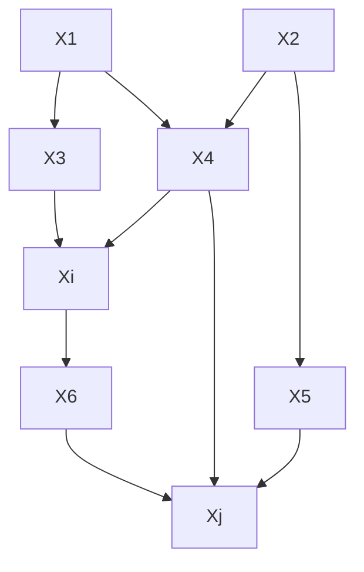

> **图 3.4** 后门准则示意图。对变量 $\{X_{3}, X_{4}\}$ （或 $\{X_{4}, X_{5}\}$ ）校正可得到 $P(x_{j} | \hat{x}_{i})$ 的一致性估计，对 $\{X_{4}\}$ 或者 $\{X_{6}\}$ 校正会得到有偏估计。


#### 定理 3.3.2（后门校正）

如果变量集 $Z$ 满足 $(X, Y)$ 的后门准则，那么 $X$ 对 $Y$ 的因果效应是可识别的，由以下公式给出：

$$
P(y \mid \hat{x}) = \sum_{z} P(y \mid x, z) P(z) \tag{3.19}
$$

式（3.19）中的求和表示对 $Z$ 校正后得到的标准公式。Rosenbaum 和 Rubin（1983）将满足式（3.19）时的变量 $X$ 命名为“在 $Z$ 条件下可忽略”。

将可忽略性条件约简为定义 3.3.1 的图模型准则，将关于反事实相关性的判断替换为普通的因果关系判断，如图 3.4 所示。我们可以通过系统化的程序来验证图模型准则，这种程序适用于任何大小和形状的图。该准则还使分析人员能够寻找最优的协变量集 $Z$ ，即最小化检验成本或抽样可变性的集合 $Z$ （Tian et al. 1998）。

第 5 章演示了利用一个类似的图模型准则来识别线性结构方程中的路径系数（path coefficients）。Greenland 等人（1999a）与 Glymour 和 Greenland（2008）给出了流行病学研究的应用，其中集合 $Z$ 称为“充分集”（sufficient set）。也许“可容许集”（admissible set）或“消混杂集”（deconfounding set）等术语更好。

#### 定理 3.3.2 的证明

Pearl（1993b）最初提供的证明是基于这样的观察：当 $Z$ 阻断了从 $X$ 到 $Y$ 的所有后门路径（back-door path）时，设置 $(X=x)$ 或者对 $X=x$ 取条件会得到对 $Y$ 的相同效应。从图 3.2 的增广图 $G'$ 中可以很好地看出这一点，该图中添加了干预弧 $F_{X}\rightarrow X$ 。如果所有从 $X$ 到 $Y$ 的后门路径都被阻断，那么所有从 $F_{X}$ 到 $Y$ 的路径都必须经过 $X$ 的子节点，并且如果我们以 $X$ 为条件，这些路径都会被阻断。这意味着，给定 $X$ 时 $Y$ 独立于 $F_{X}$ 。

$$
P (y \mid x, F_{x} = d o (x)) = P (y \mid x, F_{x} = \text {idle}) = P (y \mid x) \tag {3.20}
$$

这意味着无法区分观察 $X = x$ 和干预 $F_{X} = do(x)$ 。

形式上，我们可以通过以下过程证明这个观察：依照式（3.9）将 $P(y|\hat{x})$ 以增广概率函数 $P'$ 的形式改写，然后对 $Z$ 取条件，得到：

$$
P (y \mid \hat {x}) = P^{\prime} (y \mid F_{x}) = \sum_ {z} P^{\prime} (y \mid z, F_{x}) P^{\prime} (z \mid F_{x}) = \sum_ {z} P^{\prime} (y \mid z, x, F_{x}) P^{\prime} (z \mid F_{x}) \tag {3.21}
$$

蕴含式 $F_{x} \Rightarrow X = x$ 允许在最后一个等式中添加 $x$ 。为了从式（3.21）等号右边的两项中消除 $F_{x}$ ，我们引用定义 3.3.1 的两个条件。因为 $F_{x}$ 是子节点仅为 $X$ 的根节点（root nodes），因此它必须独立于包括 $Z$ 在内的所有非 $X$ 的子节点。因此，条件（i）得到：

$$
P^{\prime} (z \mid F_{x}) = P^{\prime} (z) = P (z)
$$

现在依据后门条件（ii）和式（3.20），可以从式（3.21）中消除 $F_{x}$ ，从而证明了式（3.19）。11.3.3 节提供了另一种证明。

### 3.3.2 前门准则

定义 3.3.1 的条件（i）反映了一种普遍认知，即“伴生的观察结果不应受措施的影响”（Cox, 1958, p. 48）。本节展示了如何使用受治疗影响（affected by the treatment）的伴生结果来促进因果推断（causal inference）。Pearl（1995a）将其称为 **前门准则** （front-door criterion），它将构成因果效应识别（identification of causal effects）的一般性检验的第二部分（3.4 节和定理 3.6.1）。

考虑图 3.5 中的图模型，它表示图 3.4 的模型中变量 $X_{1},\dots ,X_{5}$ 是不可观测的，并且 $\{X_i,X_6,X_j\}$ 分别重新标记为 $\{X,Z,Y\}$ 时的情形。虽然 $Z$ 不满足任何后门准则，但对于 $Z$ 的测量可得到 $P(y|\hat{x})$ 的一致性估计。我们将 $P(y|\hat{x})$ 的表达式约简为可从观察分布函数 $P(x,y,z)$ 中计算的公式来说明。


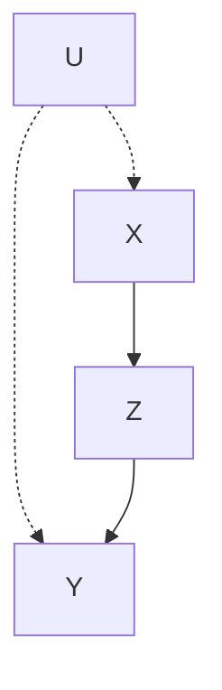

> 图 3.5 前门准则的图模型。对 $Z$ 的两步校正得到 $P(y \mid \hat{x})$ 的一致性估计

图 3.5 的联合分布（式（3.5））可被分解为：

$$
P (x, y, z, u) = P (u) P (x \mid u) P (z \mid x) P (y \mid z, u) \tag {3.22}
$$

依据式（3.10），干预 $do(x)$ 移除因子 $P(x|u)$ ，得到后验分布：

$$
P (y, z, u \mid \hat {x}) = P (y \mid z, u) P (z \mid x) P (u) \tag {3.23}
$$

对 $z$ 和 $u$ 求和，得到：

$$
P (y \mid \hat {x}) = \sum_ {\tilde {z}} P (z \mid x) \sum_ {u} P (y \mid z, u) P (u) \tag {3.24}
$$

为了从式（3.24）等号右边消除 $u$ ，我们使用图 3.5 中图模型描述的两个条件独立性（conditional independence）假定：

$$
P (u \mid z, x) = P (u \mid x) \tag {3.25}
$$

$$
P (y \mid x, z, u) = P (y \mid z, u) \tag {3.26}
$$

因此，得到等式：

$$
\begin{array}{l} \sum_ {u} P (y \mid z, u) P (u) = \sum_ {x} \sum_ {u} P (y \mid z, u) P (u \mid x) P (x) \\ = \sum_ {x} \sum_ {u} P (y \mid x, z, u) P (u \mid x, z) P (x) \tag {3.27} \\ = \sum_ {x} P (y \mid x, z) P (x) \\ \end{array}
$$

式（3.24）约简为仅涉及观察值：

$$
P (y \mid \hat {x}) = \sum_ {z} P (z \mid x) \sum_ {x^{\prime}} P (y \mid x^{\prime}, z) P (x^{\prime}) \tag {3.28}
$$

式（3.28）等号右边的所有因子都可从非实验数据中通过一致估计得到，所以 $P(y|\hat{x})$ 也可以估计得到。因此，只要我们能找到满足式（3.25）和式（3.26）条件的中介变量 $Z$ ，就拥有一个 $X$ 对 $Y$ 因果效应的无偏非参数估计。

式（3.28）可理解为后门准则的两步应用。第一步，我们找到 $X$ 对 $Z$ 的因果效应；由于图 3.5 中没有从 $X$ 到 $Z$ 的未阻断后门路径，因此我们得到：

$$
P (z \mid \hat {x}) = P (z \mid x)
$$

接下来，我们计算 $Z$ 对 $Y$ 的因果效应。我们不能再将其等同于条件概率 $P(y|z)$ ，因为从 $Z$ 到 $Y$ 有一条后门路径 $Z \leftarrow X \leftarrow U \rightarrow Y$ 。然而，由于 $X$ 阻断（ $d$ -分离）了这条路径，因此， $X$ 可以在后门准则中作为伴生变量，这使得我们可以依据式（3.19）计算 $Z$ 对 $Y$ 的因果效应，得到 $P(y|\hat{z}) = \sum_{x'} P(y|x', z) P(x')$ 。最后，我们将下式结合这两个因果效应：

$$
P (y \mid \hat {x}) = \sum_ {z} P (y \mid \hat {z}) P (z \mid \hat {x})
$$

得到式（3.28）。

在形式化定义这些假定后，用一个定理来总结这一结果。


#### 定义 3.3.3（前门）

变量集 $Z$ 满足有序变量对 $(X, Y)$ 的前门准则，条件是：

- (i) $Z$ 截断了所有从 $X$ 到 $Y$ 的有向路径（directed path）。
- (ii) 从 $X$ 到 $Z$ 没有未被阻断的后门路径。
- (iii) 所有从 $Z$ 到 $Y$ 的后门路径都被 $X$ 阻断。


#### 定理 3.3.4（前门校正）

如果 $Z$ 满足 $(X, Y)$ 的前门准则，且 $P(x, z) > 0$ ，那么 $X$ 对 $Y$ 的因果效应是可识别的，可由以下公式计算：

$$
P(y \mid \hat{x}) = \sum_{z} P(z \mid x) \sum_{x^{\prime}} P(y \mid x^{\prime}, z) P(x^{\prime}) \tag{3.29}
$$

定义 3.3.3 所述的条件过于严格，某些被条件（ii）、条件（iii）所排除的后门路径实际上是可以允许的，只要它们被某些伴生变量阻断。例如，图 3.1 中的变量 $Z_{2}$ 满足 $(X, Z_{3})$ 的类似前门的准则，因为 $Z_{1}$ 阻断了所有从 $X$ 到 $Z_{2}$ 的后门路径以及从 $Z_{2}$ 到 $Z_{3}$ 的后门路径。

为了分析如此复杂的结构，包括后门和前门条件的嵌套组合，3.4 节将介绍一种更强大的符号机制，该机制可回避诸如式（3.28）推导过程中所使用的代数操作。但首先让我们看一个例子来说明前门条件可能的应用。

### 3.3.3 实例：吸烟与基因型理论

考虑一个关于吸烟（_X_）和肺癌（_Y_）之间关系的百年争论（Sprites et al., 1993, pp. 291–302）。据多人陈述，烟草业已经成功阻止了反吸烟立法，他们辩称，吸烟和肺癌之间所观察到的相关性可用某种致癌基因型（_U_）来解释，这种基因型涉及对尼古丁的天生嗜好。

人体肺部沉积的焦油量（_Z_）是一个有望满足定义 3.3.3 中列出的条件的变量，因此符合图 3.5 的结构。为了满足条件（i），我们必须假定除了吸烟对肺癌的效应仅通过焦油沉积的中介产生以外，无其他效应。为了满足条件（ii）和（iii），我们必须假定，即使基因型加重了肺癌的产生，但它对肺部的焦油量没有影响，除非（通过吸烟）间接地产生影响。同样地，我们必须假定影响焦油沉积的其他因素对吸烟没有任何影响。

最后，定理 3.3.4 的条件 $P(x,z)>0$ 要求肺部的高水平焦油量不仅是吸烟的结果，还是其他因素的结果（例如，环境污染物的暴露），并且某些吸烟者肺部可能没有焦油（可能由于极其高效的焦油代谢机制）。最后一个条件的满足性可在数据中进行测试 $^{①}$ 。

> - 对于所有的 $z$ ， $P(x = 0, z) > 0$ 说明，对于不吸烟者而言，任何水平的焦油沉积都存在，这只能用其他因素来解释。而 $P(x, z = 0) > 0$ 则说明某些吸烟者并没有焦油沉积。——译者注

为了说明我们如何评估吸烟增加（或减少）肺癌风险的程度，我们假定一个假设性研究，在一个大的随机选择的群体样本中同时测量三个变量 $X$ 、 $Y$ 、 $Z$ 。为了简化说明，我们进一步假定这三个变量都是二进制的，取值为真（1）或假（0）。

表 3.1 给出了焦油、癌症和吸烟之间关系研究的假设数据集。表 3.1 显示 $95\%$ 的吸烟者和 $5\%$ 的非吸烟者的肺部已出现高水平的焦油沉积。此外，有焦油沉积的受试者中 $81\%$ 的人发展为肺癌，而没有焦油沉积的受试者中只有 $14\%$ 的人发展为肺癌。最后，在这两组人群中（有焦油和无焦油），吸烟者患癌症的比例比不吸烟者高得多。

**表 3.1**

| 分组    | 分组类型       | $P(x,z)$ 分组规模（群体的百分比） | $P(Y=1 | x,z)$ 分组中癌症患者百分比 |
| ------- | -------------- | --------------------------------- | ------ | -------------------------- |
| X=0,Z=0 | 不吸烟，无焦油 | 47.5                              | 10     |
| X=1,Z=0 | 吸烟，无焦油   | 2.5                               | 90     |
| X=0,Z=1 | 不吸烟，有焦油 | 2.5                               | 5      |
| X=1,Z=1 | 吸烟，有焦油   | 47.5                              | 85     |

这些结果似乎证明了吸烟是肺癌的主要诱因。然而，烟草业可能辩称，这个表格讲述了一个不同的故事，吸烟实际上降低了一个人患肺癌的风险。他们的论点是这样的：如果你决定吸烟，那么你发生焦油沉积的概率是 $95\%$ ，而如果你决定不吸烟，概率是 $5\%$ 。为了评估焦油沉积的效应，我们分别观察两组对象——吸烟者和非吸烟者。表 3.1 显示焦油沉积对两组人群都有保护作用：对吸烟者来说，焦油沉积将癌症发病率从 $90\%$ 降低到 $85\%$ ；对不吸烟者来说，焦油沉积将癌症发病率从 $10\%$ 降低到 $5\%$ 。因此，无论我是否天生嗜好尼古丁，我都应该寻求焦油沉积在肺部的保护作用，而吸烟提供了一个非常有效的手段来获取这些沉积。

为了解决这两种解释之间的争论，我们现在对表 3.1 中的数据应用前门公式（式 (3.29)）。我们希望计算一个随机选择的人在以下两种行为下患肺癌的概率：吸烟（设置 $X = 1$ ）或不吸烟（设置 $X = 0$ ）。

为 $P(z|x)$ 、 $P(y|x,z)$ 、 $P(x)$ 代入适当的值，得到：

$$
\begin{array}{l}
P(Y = 1 \mid do(X = 1)) = 0.05 (0.10 \times 0.50 + 0.90 \times 0.50) \\
+ 0.95 (0.05 \times 0.50 + 0.85 \times 0.50) \tag{3.30} \\
= 0.05 \times 0.50 + 0.95 \times 0.45 = 0.4525
\end{array}
$$

$$
P(Y = 1 \mid do(X = 0)) = 0.95 (0.10 \times 0.50 + 0.90 \times 0.50) \\
+ 0.05 (0.05 \times 0.50 + 0.85 \times 0.50) \\
= 0.95 \times 0.50 + 0.05 \times 0.45 = 0.4975
$$

因此，与预期相反，数据似乎证明吸烟对健康有些好处 $^{①}$ 。

> ① 这个结果是在前面所述的假定下得到的，因此它只是说明前门准则的一个例子，并不表明吸烟真的有利于健康。——译者注

显然，表 3.1 中的数据是不真实的数据，是为了支持基因型理论而精心设计的。然而，这个例子的目的是要演示对于因果机制运作的一些合理定性假定，再加上非实验数据，如何产生因果效应的精确定量估计。在现实中，我们期望观察性研究通过中介变量来反驳基因型理论，例如，吸烟的中介结果（如焦油沉积）倾向于增加而不是减少吸烟者和非吸烟者患肺癌风险。那么式（3.29）的估计可用于量化吸烟对肺癌的因果效应。

## 3.4 干预的计算

本节建立了一套推断规则，通过这些规则，可以将包含干预和观察的概率性命题转换成其他此类命题，从而提供一种推导（或验证）干预断言的句法方法。每个推断规则都将 $do(\cdot)$ 操作解释为一种修改底层模型中某些选择函数的干预。从这种解释中产生的推断规则称为 ** $do$ 算子（ $do$ calculus）公理** 。

假定我们有一个因果图 $G$ 的结构，其中一些节点是可观测的，而另一些节点是不可观测的。我们的目标是要得到形如 $P(y|\hat{x})$ 的因果效应表达式的语句推导，其中 $X$ 和 $Y$ 代表观测变量的任意子集。对于“推导”，我们的意思是将表达式 $P(y|\hat{x})$ 逐步约简为包含观察值的标准概率等式。只要这种约简可行， $X$ 对 $Y$ 的因果效应是 **可识别的** （参见定义 3.2.4）。

### 3.4.1 符号预备

令 $X, Y, Z$ 为有向无环的因果图 $G$ 中任意不相交的节点集。从 $G$ 中删除所有指向节点 $X$ 的边后得到的图表示为 $G_{\bar{X}}$ 。同样地，从 $G$ 中删除所有从节点 $X$ 出发的边后得到的图表示为 $G_{\underline{X}}$ 。删除指向 $X$ 和从 $Z$ 出发的边后得到的图表示为 $G_{\bar{X}\underline{Z}}$ （参见图 3.6 以获得说明）。

最后，表达式 $P(y|\hat{x},z) \triangleq P(y,z|\hat{x}) / P(z|\hat{x})$ 表示当 $X$ 固定为常数 $x$ ，并且（在此条件下） $Z = z$ 被观察到时， $Y = y$ 的概率。

### 3.4.2 推断规则

下面的定理陈述了本节提出的演算的三个基本推断规则。Pearl（1995a）给出了证明。


#### 定理 3.4.1 (do 算子准则)

令 $G$ 表示如式（3.2）定义的与因果模型对应的有向无环图，令 $P(\cdot)$ 表示该模型蕴含的概率分布。对于任何不相交的变量子集 $X, Y, Z, W$ ，我们有以下规则：

**规则 1（插入 / 删除观测变量）**

$$
\text{当} (Y \perp Z \vert X, W)_{G_{\bar{X}}} \text{时}, \qquad P(y \vert \hat{x}, z, w) = P(y \vert \hat{x}, w) \tag{3.31}
$$

**规则 2（行为 / 观察交换）**

$$
\text{当} (Y \perp Z \vert X, W)_{G_{\bar{X} Z}} \text{时}, \qquad P(y \vert \hat{x}, \hat{z}, w) = P(y \vert \hat{x}, z, w) \tag{3.32}
$$

**规则 3（插入 / 删除行为）**

$$
\text{当} (Y \perp Z \vert X, W)_{G_{\overline{X}, \overline{Z(W)}}} \text{时}, \qquad P(y \vert \hat{x}, \hat{z}, w) = P(y \vert \hat{x}, w) \tag{3.33}
$$

其中 $Z(W)$ 是在 $G_{\bar{X}}$ 中属于 $Z$ 但不属于 $W$ 祖代的节点集合。

---

每一条推断规则都遵循“带帽”操作符 $\hat{x}$ 的基本解释，即将连接 $X$ 与干预前父代变量的因果机制替换为干预后引入的新机制 $X = x$ ，得到由子图 $G_{\bar{X}}$ 刻画的子模型（submodel）（Spirtes 等人（1993）将其命名为“操作后的图”）。

**规则 1** 重申了 d-分离是干预 $do(X=x)$ （因此得到图 $G_{\bar{X}}$ ）所产生的分布中条件独立性的有效检验。这一规则遵循这样的事实：从系统中删除方程不会在剩余的干扰项之间引入任何依赖关系。

**规则 2** 为外部干预 $do(Z = z)$ 提供了一个条件，使其对 $Y$ 产生的效应与被动观察 $Z = z$ 的结果一致。该条件相当于 $\{X \cup W\}$ 阻断（ $G_{\bar{X}}$ 中）所有从 $Z$ 到 $Y$ 的后门路径，因为 $G_{\bar{X} Z}$ 保留了所有（且仅保留）这样的路径。

**规则 3** 为引入（或删除）外部干预 $do(Z = z)$ 而不影响 $Y = y$ 的概率提供了条件。同样，该规则的有效性起源于通过删除与 $Z$ 中变量相对应的所有方程（因此得到图 $G_{\overline{x} \overline{z}}$ ）来模拟干预 $do(Z = z)$ 。

Pearl（1995a）提供了规则 $1 \sim 3$ 的证明以及将删除限制在 $W$ 的非祖代节点的原因。


#### 推论 3.4.2

如果存在有限的转换序列可将因果效应 $q = P(y_{1}, \ldots, y_{k} \mid \hat{x}_{1}, \ldots, \hat{x}_{m})$ 约简为仅涉及观察量的（即无“带帽”符号）概率表达式，其中每个转换都符合定理 3.4.1 中的一条推断规则，那么 $p$ 在图 $G$ 刻画的模型中是可识别的。

规则 1～3 已经证明是完备的，即足以推导出所有可识别的因果效应（Shpitser and Pearl, 2006a；Huang and Valtorta, 2006）。此外，如 3.4.3 节所示，使用“带帽”符号进行符号推导比代数推导更便捷，代数推导的目标是从概率表达式中消除潜在变量（如 3.3.2 节，式（3.24））。然而，还没有系统化的方法判定是否存在一系列规则能够约简任意的因果效应表达式，因此用于识别的图模型准则更容易满足我们的需求。这些将在第 4 章中展开讨论。

### 3.4.3 因果效应的符号推导：一个实例

现在，我们来演示如何使用规则 1～3 推导图 3.5 所示结构中的所有因果效应估计。图 3.6 展示了后续推导所需要的子图。


**G:**


**G*{Z̄}=G*{X̄}:**

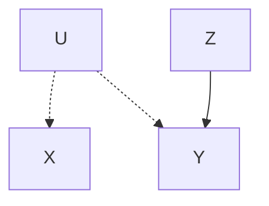

**G\_{X̄Z̄}:**

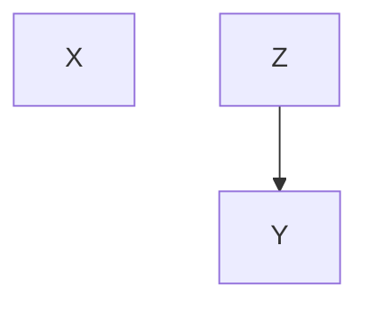

**G\_{Z̲}:**

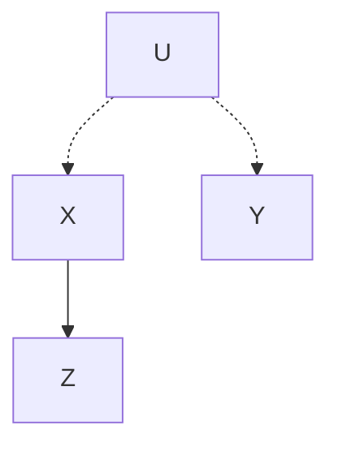

**G\_{X̄Z̲}:**

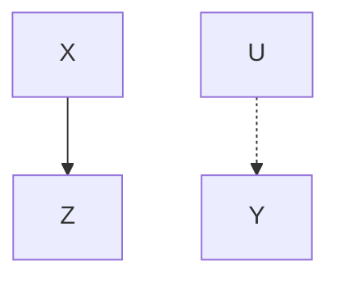

> 图 3.6 用于推导因果效应的 G 的子图

**任务 1：计算 $P(z|\hat{x})$ **

由于图 $G$ 满足规则 2 的应用条件，因此这个任务可一步完成。在 $G_{\underline{X}}$ 中 $X \perp Z$ （因为路径 $X \leftarrow U \rightarrow Y \leftarrow Z$ 被汇聚到 $Y$ 的箭头阻断），我们得到：

$$
P (z \mid \hat {x}) = P (z \mid x) \tag {3.34}
$$

**任务 2：计算 $P(y|\hat{z})$ **

由于 $G_{\underline{z}}$ 包含从 $Z$ 到 $Y$ 的后门路径： $Z \leftarrow X \leftarrow U \rightarrow Y$ ，因此我们不能应用规则 2 来将 $\hat{z}$ 替换为 $z$ 。自然而然地，我们希望通过该路径上的变量（如 $X$ ）来阻断该路径。这涉及对 $X$ 的所有值取条件并求和：

$$
P (y \mid \hat {z}) = \sum_ {x} P (y \mid x, \hat {z}) P (x \mid \hat {z}) \tag {3.35}
$$

现在我们需要处理两个包含 $\hat{z}$ 的项： $P(y|x,\hat{z})$ 和 $P(x|\hat{z})$ 。由于 $X$ 和 $Z$ 在 $G_{\bar{z}}$ 中 $d$ -分离，因此后者可以很容易地通过规则 3 的删除行为计算得到：

> 当 $(Z \perp X)_{G_{\bar {z}}}$ 时， $P (x | \hat {z}) = P (x) \tag {3.36}$

（直觉上，操作 $Z$ 不会对 $X$ 产生影响，因为在 $G$ 中 $Z$ 是 $X$ 的后代。）要约简前一项 $P(y|x,\hat{z})$ ，我们应用规则 2：

> 当 $(Z \perp Y | X)_{G_{\underline {{z}}}}$ 时， $P (y | x, \hat {z}) = P (y | x, z) \tag {3.37}$

注意，在 $G_{z}$ 中 $X$ 使 $Z$ 与 $Y$ $d$ -分离。这允许我们可以将式（3.35）改写为：

$$
P (y \mid \hat {z}) = \sum_ {x} P (y \mid x, z) P (x) = E_{x} P (y \mid x, z) \tag {3.38}
$$

这是后门公式（式（3.19））的一个特例。合法条件 $(Z \perp Y|X)_{G_2}$ 对于 $X$ 是否足以实现（ $Y$ 和 $Z$ 之间的）混杂控制提供了另一种图模型测试，该测试等价于 Rosenbaum 和 Rubin（1983）的不透明的“可忽略性”条件。

**任务 3：计算 $P(y|\hat{x})$ **

$P(y|\hat{x})$ 可写为：

$$
P (y \mid \hat {x}) = \sum_ {z} P (y \mid z, \hat {x}) P (z \mid \hat {x}) \tag {3.39}
$$

我们看到项 $P(z|\hat{x})$ 在式（3.34）中被约简，但无法应用任何规则从项 $P(y|z,\hat{x})$ 中删除带帽符号。然而，由于条件 $(Y\perp Z|X)_{G_{\bar{x} z}}$ 成立（参见图 3.6），因此我们可以通过规则 2 合理地添加这个符号：

$$
P (y \mid z, \hat {x}) = P (y \mid \hat {z}, \hat {x}) \tag {3.40}
$$

由于 $Y \perp X \mid Z$ 在 $G_{\overline{XZ}}$ 中成立，因此我们现在可以使用规则 3 从 $P(y|\hat{z},\hat{x})$ 中删除行为 $\hat{x}$ 。我们得到：

$$
P (y \mid z, \hat {x}) = P (y \mid \hat {z}) \tag {3.41}
$$

式（3.38）中计算了该式。在式（3.39）中代入式（3.38）、式（3.41）和式（3.34），最终得到：

$$
P (y \mid \hat {x}) = \sum_ {z} P (z \mid x) \sum_ {x^{\prime}} P (y \mid x^{\prime}, z) P (x^{\prime}) \tag {3.42}
$$

这与式（3.28）的前门公式一致。

**任务 4：计算 $P(y,z|\hat{x})$ **

我们有：

$$
P (y, z \mid \hat {x}) = P (y \mid z, \hat {x}) P (z \mid \hat {x})
$$

等号右边的两项已在式（3.34）和（3.41）中推导，因此可得到：

$$
P (y, z \mid \hat {x}) = P (y \mid \hat {z}) P (z \mid x) = P (z \mid x) \sum_ {x^{\prime}} P (y \mid x^{\prime}, z) P (x^{\prime}) \tag {3.43}
$$

**任务 5：计算 $P(x,y|\hat{z})$ **

我们有：

$$
P (x, y \mid \hat {z}) = P (y \mid x, \hat {z}) P (x \mid \hat {z}) = P (y \mid x, z) P (x) \tag {3.44}
$$

等号右边的第一项可由规则 2 得到（在 $G_{z}$ 中成立），第二项可由规则 3 得到（如式(3.36)）。

注意，在所有的推导中，图 $G$ 既提供了应用推断规则的条件，也提供了选择正确规则的指导。

### 3.4.4 基于替代试验的因果推断

假设我们希望在 $P(y|\hat{x})$ 不可识别时学习 $X$ 对 $Y$ 的因果效应，而由于成本或伦理的现实原因，我们不能通过随机化实验（randomized experiment）控制 $X$ 。这产生了一个问题： $P(y|\hat{x})$ 是否可以通过随机化一个比 $X$ 更容易控制的代理变量 $Z$ 来识别。

例如，如果我们想要评估胆固醇水平（ $X$ ）对心脏病（ $Y$ ）的效应，一个合理的实验应该是控制受试者的饮食（ $Z$ ），而不是直接控制受试者血液中的胆固醇水平。

形式上，这个问题相当于将 $P(y|\hat{x})$ 转换为只有 $Z$ 的成员含带帽符号的表达式。利用定理 3.4.1，可以证明以下条件足以决定代理变量 $Z$ ：

- (i) $X$ 截断了所有从 $Z$ 到 $Y$ 的有向路径。
- (ii) $P(y \mid \hat{x})$ 在 $G_{\bar{z}}$ 中是可识别的。

事实上，如果条件 (i) 成立，那么我们得到 $P(y \mid \hat{x}) = P(y \mid \hat{x}, \hat{z})$ ，因为 $(Y \perp Z \mid X)_{G_{\overline{x} \overline{z}}}$ 。但是 $P(y \mid \hat{x}, \hat{z})$ 代表 $G_{\overline{z}}$ 对应的模型中 $X$ 对 $Y$ 的因果效应，依据条件 (ii)，这是可识别的。

结合到胆固醇的实例中，这些条件要求饮食对心脏状况没有直接效应，并且胆固醇水平和心脏病之间无混杂，除非我们能通过额外的测量消除这种混杂。

图 3.9e 和图 3.9h（参见 3.5.2 节）展示了这两种条件都成立的模型。以图 3.9e 为例，我们得到了如下估计值：

$$
P(y \mid \hat{x}) = P(y \mid x, \hat{z}) = \frac{P(y, x \mid \hat{z})}{P(x \mid \hat{z})} \tag{3.45}
$$

首先应用规则 3 添加 $\hat{z}$ ：

$$
P(y \mid \hat{x}) = P(y \mid \hat{x}, \hat{z}), \text{因为} (Y \perp Z \mid X)_{G_{\bar{X} \bar{Z}}}
$$

然后应用规则 2 将 $\hat{x}$ 替换为 $x$ ：

$$
P(y \mid \hat{x}, \hat{z}) = P(y \mid x, \hat{z}), \text{因为} (Y \perp X \mid Z)_{G_{\bar{g} \bar{z}}}
$$

依据式（3.45），只要 $Z$ 的一个值就足以识别任意 $x$ 和 $y$ 的 $P(y|\hat{x})$ 。换句话说， $Z$ 在赋值上不需要变化，可以简单地通过外部手段使其保持不变。

如果 $G$ 中蕴含的假定成立，那么无论 $Z$ 保持在什么（恒定）值，式（3.45）等号右边的项都应该得到相同的值。然而，实际应用中，仍然需要 $Z$ 的一些值来确保对 $X$ 的每个预期值都能获得足够的样本。

例如，如果我们对 $E(Y|\hat{x}) - E(Y|\hat{x}')$ 感兴趣，其中 $x$ 、 $x'$ 是两个干预值，那么我们应该选择 $Z$ 的两个值 $z$ 和 $z'$ 以（分别）最大化 $x$ 和 $x'$ 的样本数量，然后估计：

$$
E(Y \mid \hat{x}) - E(Y \mid \hat{x}') = E(Y \mid x, \hat{z}) - E(Y \mid x', \hat{z}')
$$

## 3.5 可识别性的图模型检验

图 3.7 展示了 $P(y \mid \hat{x})$ 不能被识别的简单图，原因在于“弓形”模式的存在，即混杂弧（虚线）包容了 $X$ 和 $Y$ 之间的因果链接。混杂弧表示图中存在一条包含未观测变量且无汇聚箭头的后门路径。例如，图 3.1 中的路径 $X$ ， $Z_{0}$ ， $B$ ， $Z_{3}$ 可表示为 $X$ 和 $Z_{3}$ 之间的混杂弧。弓形模式（bow pattern）表示方程 $y = f_{Y}(x, u, \varepsilon_{Y})$ ，其中 $U$ 是未观测变量且与 $X$ 相关。这样的方程导致因果效应无法识别，因为 $X$ 和 $Y$ 之间任何观察到的相关都可能被归因于由 $U$ 中介的虚假相关。


**a)**

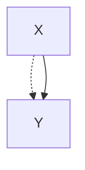

**b)**

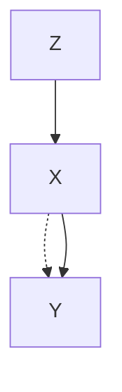

**c)**

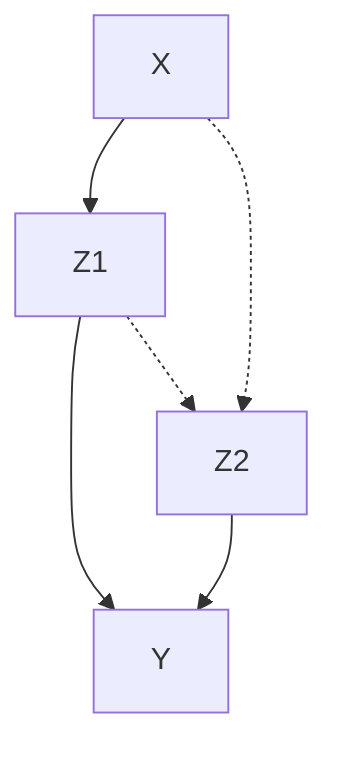

> 图 3.7 a）弓形模式：包容因果链接 $X \to Y$ 的混杂弧，即使存在工具变量 $Z$ ，也无法识别 $P(y|\hat{x})$ 如（b）所示。c）仍然无法识别 $P(y|\hat{x})$ 的（ $X$ 与 $Y$ 之间）无弓图

弓形模式的存在导致 $P(y|\hat{x})$ 不可识别，即使该模式存在于一个更大的图中，如图 3.7b 所示。这与线性模型相反，在线性模型中为弓形模式添加弧会导致 $P(y|\hat{x})$ 可识别（参见第 5 章，图 5.9）。例如，如果 $Y$ 通过线性关系 $y = bx + u$ 与 $X$ 相关，其中 $U$ 是一个可能与 $X$ 相关的未被观测的扰动，那么 $b = \frac{\partial}{\partial x} E(Y|\hat{x})$ 是不可识别的。然而，在结构中添加弧 $Z \to X$ （即，找到一个与 $X$ 相关但与 $U$ 不相关的变量 $Z$ ），可使 $E(Y|\hat{x})$ 借助工具变量（instrumental variables）公式计算（Bowden and Turkington，1984；另见第 5 章）：

$$
b \triangleq \frac {\partial}{\partial x} E (Y \mid \hat {x}) = \frac {E (Y \mid z)}{E (X \mid z)} = \frac {r_{y z}}{r_{x z}} \tag {3.46}
$$

在非参数模型中，为弓形模式添加工具变量 $Z$ （图 3.7b）不会使 $P(y|\hat{x})$ 可识别。这是一个在临床试验分析中常见的问题。在临床试验分析中，治疗措施（ $Z$ ）是随机化的（因此没有箭头指向 $Z$ ）但（病人的）行为是非完全服从的（见第 8 章）。图 3.7b 中 $X$ 和 $Y$ 之间的混杂弧表示受试者的治疗措施选择（ $X$ ）以及受试者对治疗反应（ $Y$ ）之间的不可测因素。在这样的试验中，如果不对（受试者）服从程度和治疗反应之间相互作用的性质作出另外的假定 $^{\ominus}$ （正如 Imbens 和 Angrist（1994）与 Angrist 等人（1996）的分析中所做的），就无法得到治疗效果 $P(y|\hat{x})$ 的无偏估计。虽然添加弧 $Z \to X$ 允许我们计算 $P(y|\hat{x})$ 的界限（Robins，1989，sec.lg；Manski，1990；Balke and Pearl，1997）并且某些类型的分布 $P(x,y,z)$ 的上下界甚至可能重合（参见 8.2.4 节），但仍然没有方法为每种正分布 $P(x,y,z)$ 计算 $P(y|\hat{x})$ ，这是定义 3.2.4 所要求的。

> ① 即受试者是否服从治疗与治疗反应之间的关系。——译者注

一般来说，在因果图中添加弧只会阻碍而不会帮助非参数模型中的因果效应的识别。因为这样的添加会减少图中包含的 $d$ -分离条件集，因此，如果在原图中无法推导某个因果效应，那么在增广图也一定无法识别该因果效应。相反，任何能够在增广图中推导的因果效应（通过一系列符号转换，如推论 3.4.2），在原图中也能够识别。

即使我们能够为变量对 $(Y_{1}, Y_{2})$ 的每一个变量计算 $P(y_{1}|\hat{x})$ 和 $P(y_{2}|\hat{x})$ ，也不能保证我们能够计算联合分布 $P(y_{1}, y_{2}|\hat{x})$ 。例如，图 3.7c 中展示了一个 $P(z_{1}|\hat{x})$ 和 $P(z_{2}|\hat{x})$ 可计算但 $P(z_{1}, z_{2}|\hat{x})$ 不可计算的因果图。因此，我们无法计算 $P(y|\hat{x})$ 。有趣的是，这个图是最小的、不包含（ $X$ 与 $Y$ 之间）弓形弧，但仍然无法计算 $X$ 对 $Y$ 因果效应的图。

图 3.7c 展示的另一个有趣特性是计算联合干预（joint intervention）的效应往往比计算其中单一干预的效应更容易 $^{②}$ 。这里，可以计算 $P(y|\hat{x},\hat{z}_{2})$ 和 $P(y|\hat{x},\hat{z}_{1})$ ，但无法计算 $P(y|\hat{x})$ 。例如，前者可在 $G_{\bar{X}Z_{2}}$ 中引用规则 2 进行计算：

$$
P (y \mid \hat {x}, \hat {z}_{2}) = \sum_ {z_{1}} P (y \mid z_{1}, \hat {x}, \hat {z}_{2}) P (z_{1} \mid \hat {x}, \hat {z}_{2}) = \sum_ {z_{1}} P (y \mid z_{1}, x, z_{2}) P (z_{1} \mid x) \tag {3.47}
$$

然而，不能使用规则 2 将 $P(z_{1}|\hat{x},z_{2})$ 转换为 $P(z_{1}|x,z_{2})$ ，因为当以 $z_{2}$ 为条件时， $X$ 和 $Z_{1}$ 在 $G_{\chi}$ 中（通过虚线） $d$ -连通。Pearl 和 Robins（1995）提出了计算联合干预和序贯干预的一般性方法，第 4 章中将会介绍该方法（4.4 节）。

> ② 即受试者是否服从治疗与治疗反应之间的关系。——译者注

### 3.5.1 识别模型

图 3.8 展示了 X 对 Y 的因果效应可识别的简单图（其中 X 和 Y 是单一变量）。这样的模型称为“识别模型”（identifying model），因为其结构包含了足够数量的假定（缺失链接）以使目标值 $P(y \mid \hat{x})$ 可识别。

潜在变量没有明确地显示在这些图中，这些变量隐含在混杂弧（虚线）中。每一个具有潜在变量的因果图都可以转化为一个观测变量构成的等价图，图中的变量由箭头和混杂弧相互连接。这种转化对应于替换掉结构方程（3.2）中的所有潜在变量，然后通过以下形式连接任意两个变量 $X_{i}$ 和 $X_{j}$ 来构造一个新图：

- （i）当 $X_{j}$ 出现于 $X_{i}$ 的方程中时，画一个从 $X_{j}$ 到 $X_{i}$ 的箭头；
- （ii）当 $f_{i}$ 和 $f_{j}$ 包含相同的项 $\varepsilon$ 时，画一个混杂弧。

这样得到一个所有未观测变量都是外生且相互独立的图。


**a)**

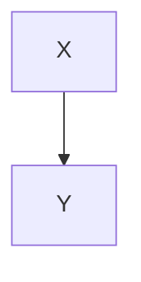

**b)**

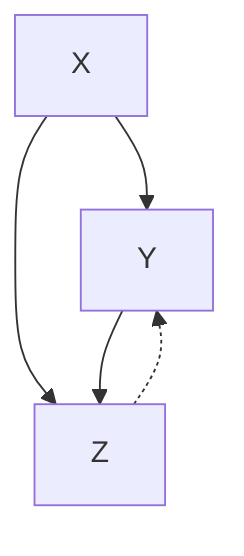

**c)**

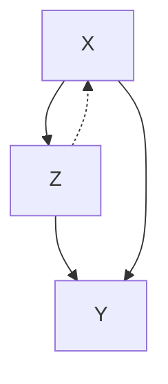

**d)**

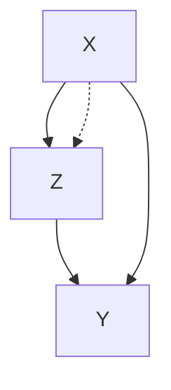

**e)**

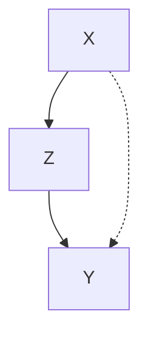

**f)**

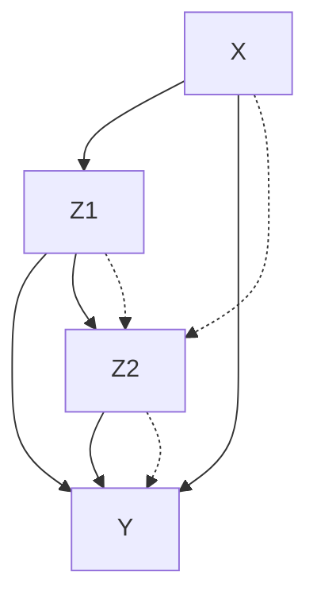

**g)**

```mermaid
graph TD
    X --> Z1
    Z1 --> Y
    X --> Z2
    Z2 --> Y
    X --> Z3
    Z3 --> Y
    Z1 --> Z3
    Z3 --> Z2
    X -.-> Z2
    Z1 -.-> Y
    Z2 -.-> Y
```

> 图 3.8 X 对 Y 的因果效应是可识别的典型模型。虚弧线表示混杂路径，Z 表示观测到的协变量。

通过检查图 3.8 可以发现如下特性。

1.  由于从因果图中移除任何弧或箭头只能有助于因果效应的可识别性，因此，在图 3.8 展示的图模型的任何子图上的 $P(y \mid \hat{x})$ 仍然可识别。同样地，将观察到的中介变量引入因果图中，可能帮助但绝不会阻碍任何因果效应的可识别性。因此，在图 3.8 展示的图模型上添加任何中介节点得到的图中， $P(y \mid \hat{x})$ 仍然可被识别。

2.  在图 3.8 中，现有节点对引入任何额外的弧或箭头都会使 $P(y \mid \hat{x})$ 不再可识别，从这个意义上讲，这个图是 **极大** 的。注意与定理 3.6.1 的一致性。

3.  虽然图 3.8 中的大多数图都包含弓形模式，但其中有些弓形不是从 X 引出的（如图 3.9a 和图 3.9b 的实例）。一般来说， $P(y|\hat{x})$ 可识别的一个必要条件是 X 与 X 的子代节点之间没有混杂弧，该子代节点也是 Y 的祖代。

4.  图 3.8a 和图 3.8b 不包含 X 和 Y 之间的后门路径，因此代表在措施（X）和反应（Y）之间不存在混杂偏差的实验设计，即 $P(y|\hat{x}) = P(y|x)$ 。同样地，图 3.8c 和图 3.8d 代表观察到的协变量 Z 阻断了 X 和 Y 之间的每条后门路径的实验设计（即，在 Rosenbaum 和 Rubin（1983）的词典中，X 在条件 Z 下是“条件可忽略的”），因此， $P(y|\hat{x})$ 可通过对 Z 的校正得到（如式（3.19））：

$$
P(y \mid \hat{x}) = \sum_{z} P(y \mid x, z) P(z)
$$

5.  对于图 3.8 中的每个图模型，我们很容易使用 3.4.3 节中的符号推导模式获得 $P(y \mid \hat{x})$ 的计算公式。推导过程通常依据图的拓扑结构。例如，根据图 3.8f 可以得出如下推导：

    $$
    P(y \mid \hat{x}) = \sum_{z_1, z_2} P(y \mid z_1, z_2, \hat{x}) P(z_1, z_2 \mid \hat{x})
    $$

    我们看到包含 $\{X, Z_1, Z_2\}$ 的子图结构与图 3.8e 一致，即用 $(Z_1, Z_2)$ 替换 $(Z, Y)$ 。因此， $P(z_1, z_2 | \hat{x})$ 可通过式（3.43）得到。同样地，因为 $(Y \perp X | Z_1, Z_2)_{G_X}$ ，所以 $P(y | z_1, z_2, \hat{x})$ 可依据规则 2 约简为 $P(y | z_1, z_2, x)$ 。这样，我们得到：

    $$
    P(y \mid \hat{x}) = \sum_{z_1, z_2} P(y \mid z_1, z_2, x) P(z_1 \mid x) \sum_{x^{\prime}} P(z_2 \mid z_1, x^{\prime}) P(x^{\prime}) \tag{3.48}
    $$

    对图 3.8g 应用类似的推导过程可得到：

    $$
    P(y \mid \hat{x}) = \sum_{z_1} \sum_{z_2} \sum_{x^{\prime}} P(y \mid z_1, z_2, x^{\prime}) P(x^{\prime} \mid z_2) \times P(z_1 \mid z_2, x) P(z_2) \tag{3.49}
    $$

    注意，式（3.49）中没有出现变量 $Z_{3}$ ，如果人们想要了解 X 对 Y 的因果效应，则不需要观测 $Z_{3}$ 。

6.  在图 3.8e、图 3.8f、图 3.8g 中， $P(y|\hat{x})$ 的可识别性是通过观测到的协变量 Z 实现的，其中 Z 受治疗（X）的影响（因为 Z 是 X 的后代）。这与统计实验的大多数文献中反复强调的警告相反，这些警告要求避免校正受 X 影响的伴生观测变量（Cox，1958；Rosenbaum, 1984；Pratt and Schlaifer, 1988；Wainer, 1989）。人们普遍认为，在分析 $X$ 的总效应时，必须将受 $X$ 影响的伴生观测变量 $Z$ 排除（Pratt and Schlaifer, 1988）。这种排除的原因是，计算总效应相当于将 $Z$ 对 $Y$ 的效应一并考虑在内，这等价于一开始就忽略 $Z$ 而直接计算 $X$ 对 $Y$ 的效应。图 3.8e、图 3.8f、图 3.8g 展示的案例中， $X$ 的总效应确实是研究的目标，即使如此，观测受 $X$ 影响的伴生观测变量（例如， $Z$ 或 $Z_{1}$ ）仍然是必要的。然而，此类伴生观察所需要的校正是非标准的，需应用两次或多次式（3.19）的标准校正（参见式（3.28）、（3.48）和（3.49））。

7.  在图 3.8b、图 3.8c、图 3.8f 中，Y 存在一个对 Y 的效应不可识别的父节点（即虚线表示的双向弓形弧），即便如此，X 对 Y 的效应仍是可识别的。这说明 **局部可识别性** 不是 **全局可识别性** 的必要条件。换句话说，要识别 X 对 Y 的效应，我们不需要坚持识别 X 到 Y 路径上的每一个链接。

### 3.5.2 非识别模型

图 3.9 展示了 X 对 Y 的总效应 $P(y \mid \hat{x})$ 不可识别的典型模型。这些图值得注意的特性如下：


```mermaid
graph TD
    X --> Y
    X -.-> Y
```

> a)


```mermaid
graph TD
    X --> Z
    Z --> Y
    X -.-> Z
    Z -.-> Y
```

> b)


```mermaid
graph TD
    X --> Y
    X --> Z
    Z --> Y
    X -.-> Z
```

> c)


```mermaid
graph TD
    X --> Y
    Z --> Y
    X -.-> Z
    Z -.-> Y
```

> d)


```mermaid
graph TD
    X --> Y
    Z --> Y
    X --> Z
    X -.-> Z
    Z -.-> Y
```

> e)


```mermaid
graph TD
    X --> Z
    Z --> Y
    X -.-> Z
    Z -.-> Y
    X -.-> Y
```

> f)


```mermaid
graph TD
    X --> Z1
    Z1 --> Y
    Z1 --> Z2
    Z2 --> Y
    X -.-> Z2
    Z1 -.-> Z2
```

> g)


```mermaid
graph TD
    Z --> X
    X --> W
    W --> Y
    Z -.-> X
    Z -.-> Y
    X -.-> Y
    W -.-> Y
```

> h) 图 3.9 $P(y|\hat{x})$ 不可识别的典型模型

- 1. 图 3.9 中的所有图模型都包含了 X 和 Y 之间的不可阻断的后门路径，即指向 X 的路径不能被可观测的 X 的非后代节点所阻断。图中存在这种路径确实是不可识别性的必要检验（见定理 3.3.2）。但它不是充分检验，如图 3.8e 所示，其中后门路径（虚线）是不可阻断的，但 $P(y \mid \hat{x})$ 是可识别的。
- 2.  $P(y|\hat{x})$ 不可识别的一个充分条件是 $X$ 与其任何位于 $X$ 到 $Y$ 的路径上的子节点之间存在混杂弧，如图 3.9b 和图 3.9c 所示。一个更强的充分条件是，图模型中的一个子图包含图 3.9 所示的任一模式。
- 3. 图 3.9g（与图 3.7c 一致）说明局部可识别不是全局可识别的充分条件。例如，我们可以识别 $P(z_{1} \mid \hat{x})$ 、 $P(z_{2} \mid \hat{x})$ 、 $P(y \mid \hat{z}_{1})$ 、 $P(y \mid \hat{z}_{2})$ ，但无法识别 $P(y \mid \hat{x})$ 。这是非参数模型和线性模型的主要区别之一。在后者中，所有的因果效应都可以由结构系数确定，每个系数代表一个变量对其直接后继变量的因果效应。

## 3.6 讨论

### 3.6.1 要求与扩展

本章介绍的方法有助于从（图模型中所描述的）定性因果假定和非实验观察数据相结合中得出定量因果推论。因果假定本身一般无法在非实验研究中检验，除非它们对观察到的分布施加约束。最常见的约束形式是条件独立性，正如图中通过 $d$ -分离条件所传达的那样。另一种约束形式是数值不等式。例如，在第 8 章中，我们将说明与工具变量（图 3.7b）相关的假定受制于条件概率不等式形式的证伪检验（Pearl，1995b）。然而，这样的约束仅能够检验图中包含的一小部分因果假定，而且这些假定的大部分必须通过领域知识证实，这些知识要么来自理论思考（例如，气压计不会导致降雨），要么来自相关的实验研究。

例如，Moertel 等人（1985）的实验研究否定了维生素 C 对抗癌有效的假说，因此该结果可以作为维生素 C 与癌症患者的观察性研究的实质性假定。在相关的图模型中，它将表示为（维生素 C 和癌症之间）缺失的链接。总之，本章所述方法的主要用途不在于检验因果假定，而在于提供一种有效的语言，使这些假定精确且清晰。因此，假定可以被分离出来进行思考或实验，然后（一旦被验证）与统计数据结合得到因果效应的定量估计。

另一个重要问题是 **抽样可变性** （sampling variability），本书只做简单讨论（见 8.5 节）。因果效应估计的数学推导应该被看作这些估计设置置信区间和显著性水平的第一步，就像对受控实验的传统分析那样。然而，我们应该指出，获得因果效应的非参数估计（nonparametric estimation for causal effect）并不意味着应该避免使用参数形式。例如，如果认为高斯分布、零均值扰动和相加交互作用假定是合理的，那么式（3.28）给出的估计可转化为乘积：

$$
E(Y|\hat{x}) = r_{ZX}r_{YZ,X}x
$$

其中， $r_{YZ,X}$ 是标准化（standardize）的回归系数（5.3.1 节）。这样，估计问题将简化为回归系数估计问题（例如，用最小二乘法）。Rosenbaum 和 Rubin（1983）、Robins（1989，sec. 17），以及 Robins 等人（1992，pp. 331-3）给出了更复杂的估计方法。例如，当需要校正的协变量维度很高时，Rosenbaum 和 Rubin（1983）提出的“ **倾向得分** （propensity score）”法很有效（11.3.5 节）。Robins（1999）表明，相比在校正公式（3.19）中估计独立因素，使用以下公式会更有效：

$$
P(y|\hat{x}) = \sum_{z}\frac{P(x,y,z)}{P(x|z)}
$$

该公式不分解干预前的分布。这样，研究者可以分别估计分母 $P(x|z)$ ，然后对此估计量的倒数进行个体样本加权，并将加权样本看作从干预后分布 $P(y|\hat{x})$ 中随机采样得到的。干预后的参数，如 $\frac{\partial}{\partial x}E(Y|\hat{x})$ ，可通过普通的最小二乘法进行估计。这种方法在具有时变协变量的队列研究中尤其有效，如 4.4.3 节和 3.2.3 节（见式（3.18））中讨论的问题。

本章介绍的方法的一些扩展也值得注意。首先， **原子干预的识别分析** 可以推广到复杂的时序（干预）策略中。在这些策略研究中，一组控制变量 $X$ 通过函数策略或随机策略（stochastic strategies）以特定的方式响应协变量集合 $Z$ ，如 3.2.3 节和 4.4.3 节所示。在第 4 章（4.4.3 节）中，可以看到识别这些策略的效应需要相关图模型中的一系列后门条件。

第二个扩展涉及 **干预演算** （定理 3.4.1）在非递归模型（nonrecursive model）中的使用，即包含有向环或反馈回路的因果图。从模型中“排除”方程的因果效应的基本定义（定义 3.2.1）仍然适用于非递归系统（Strotz and Wold，1960；Sobel，1990），但是必须解决两个问题。首先，识别分析必须确保剩余模型的稳定性（stability）（Fisher，1970）。其次，必须将有向无环图的 $d$ -分离准则扩展到有环图（cyclic graphs）。已经验证了非递归线性模型的 $d$ -分离有效性（Spirtes，1995）和包含离散变量的非线性系统中的 $d$ -分离有效性（Pearl and Dechter，1996）。然而，因果效应估计的计算在有环非线性系统更加困难，因为将 $P(y|\hat{x})$ 符号约简为无帽表达式可能需要求解非线性方程。在第 7 章（7.2.1 节）中，我们演示了非递归线性系统中策略和反事实的估计（另见 Balke and Pearl，1995a）。

第三个扩展涉及将 **干预演算** （定理 3.4.1）推广到采样数据不满足 i.i.d.（independent and identically distributed，独立同分布）条件的情形。例如，我们可以想象，只有在过去病人中幸存者比例低于某个临界值时，医生才会为这样的病人开治疗处方。在这种情况下，需要从非独立样本中估计因果效应 $P(y|\hat{x})$ 。Vladimir Vovk（1996）给出了当采样不满足 i.i.d.时定理 3.4.1 的规则仍然适用的条件，他接着把这三种推断规则整合成一个逻辑生成系统。

### 3.6.2 图作为一种数学语言

认识到将大量背景知识纳入概率推断（probabilistic inference）的好处可以追溯到 Thomas Bayes（1763）以及 Pierre Laplace（1814），大多数现代统计学家也普遍认可它在分析和解释复杂统计研究中的重要作用。然而，可用来表达背景知识的数学语言仍然处于相当可怜的发展状态。

传统上，统计学家只认可一种将实体知识与统计数据相结合的方法，即将主观先验知识赋予分布参数的贝叶斯方法（Bayesian approach）。为了在这个框架中包含因果信息，诸如“Y 不受 X 影响”的简单因果陈述必须转换成能够赋予概率值的句子或事件（如，反事实）。例如，为了传达“泥泞不会导致下雨”这一自然假定，我们必须使用一种相当不自然的表达方式，令反事实事件“如果不泥泞，那么会下雨”的概率与事件“如果泥泞，那么会下雨”的概率相同。事实上，这就是 Neyman 和 Rubin 的潜在结果方法取得统计合法性的方式：因果判断表达为包含反事实变量的概率函数的约束（参见 3.6.3 节）。

因果图提供了一种将数据与因果信息相结合的可选语言。这种语言通过接受简单的因果陈述语句作为其基本原语，简化贝叶斯方法。这种简单陈述句仅表明两个目标变量之间是否存在因果关系，这在日常话语中被广泛使用，它们为科学家们交流经验、组织知识提供了一种自然的方式 $^{①}$ 。因此，可以预见，因果图语言将在需要大量领域知识的问题中得到广泛应用。

> 值得注意的是，本章的许多读者（包括本书的两名推荐人）将这里介绍的方法归为“贝叶斯派”，认为该方法依赖于“好的先验”。这种分类是有误导性的。该方法确实依赖于主观假定（例如，泥泞不会导致下雨），但这些假定是因果的而非统计的，不能表示为联合分布参数的先验概率。

这不是一种新语言。在社会科学和计量经济学中，使用图和结构方程模型来表达因果信息非常流行。然而，统计学家普遍认为这些模型是可疑的，或许是因为社会科学家和计量经济学家未能对他们模型的实证性内容提供一个明确的定义，即详细说明结果受给定结构方程约束的实验条件，即使这些条件是假设的。（第 5 章讨论了结构方程在社会科学和经济学中的历史。）结果，甚至像“结构系数”或“缺失链接”这样的基本概念也成为严重争议对象（Freedman，1987；Goldberger，1992）和误解对象（Whittaker，1990，p.302；Wermuth，1992；Cox and Wermuth，1993）。

在很大程度上，这种争议和误解的历史根源在于缺乏足够的数学符号来定义因果模型的基本概念。例如，标准概率符号不能表达结构方程 $y = bx + \varepsilon_{Y}$ 中系数 $b$ 的实证性内容，即使研究者准备假定 $\varepsilon_{Y}$ （一个未被观测的量值）与 $X$ 无关。即便对不“直接影响” $Y$ 的方程变量进行排除这一操作，也无法给出任何概率意义。

本章提出的符号为这些（因果）概念提供了一个明确的经验性解释，因为该符号允许人们精确地规定在一个给定的实验中什么是保持不变的，什么只是被测量的。（许多研究人员都认识到这种区别的必要性，最著名的是 Pratt 和 Schlaifer（1988）与 Cox（1992）。） $b$ 的含义是 $\frac{\partial}{\partial x} E(Y|\hat{x})$ ，即在 $X$ 的值被控制为 $x$ 的实验中， $Y$ （对 $x$ ）的期望变化率。无论 $\varepsilon_{Y}$ 和 $X$ 是否相关（例如，通过另一个方程 $x = ay + \varepsilon_{X}$ ），该解释都成立。同样地，可以基于一个假设的受控实验来决定哪些变量应该包括在给定的方程中，如果（对于 $\varepsilon_{Y}$ 的每个取值）当所有其他变量（ $S_{YZ}$ ）保持不变时， $Z$ 对 $Y$ 没有影响，这意味着 $P(y|\hat{z},\hat{s}_{YZ}) = P(y|\hat{s}_{YZ})$ ，那么变量 $Z$ 可从 $Y$ 的方程中排除。具体而言，从方程 $y = bx + \varepsilon_{Y}$ 中排除的变量不是在已知（即观测到） $X$ 的值时条件独立于 $Y$ ，而是在给定（即设定） $X$ 的值时与 $Y$ 因果无关。“扰动项” $\varepsilon_{Y}$ 的运算意义也同样被阐明： $\varepsilon_{Y}$ 被定义为差值 $Y - E(Y|\hat{s}_Y)$ 。如果 $P(y|\hat{x},\hat{s}_{XY}) \neq P(y|x,\hat{s}_{XY})$ ，那么两个扰动项 $\varepsilon_{X}$ 和 $\varepsilon_{Y}$ 相关，等等（参见第 5 章，5.4 节将进一步阐述）。

带帽符号所表达的区别澄清了结构方程的实证基础，可以使得因果模型更容易为实证科学家所接受。此外，由于大多数科学知识是围绕“保持 $X$ 不变”而非“以 $X$ 为条件”的操作组织的，因此本章提出的符号和演算应该可以为科学家提供一种有效的手段来交流实际信息并推断其逻辑结果。

### 3.6.3 从图转换到潜在结果

本章使用了因果信息的两种表示方法：图和结构方程，前者是后者的抽象。近一个世纪以来，这两种表示方法都饱受争议。一方面，经济学家和社会科学家已经接受了这些建模工具，但他们持续质疑和辩论他们所估计的参数的因果含义（详见 5.1 节和 5.4 节），因此，在决策制定情境中使用结构模型往往受到怀疑。

总的来说，统计学家们拒绝这两种表示，并且认为它们即使不是毫无意义（Wermuth，1992；Holland，1995）也是有问题的（Freedman，1987）。当需要表达因果信息时，他们有时会求助于 Neyman-Rubin 的潜在结果符号 $^{①}$ （Rubin，1990）。第 7 章（7.4.4 节）给出了结构方法和潜在结果方法之间关系的详细形式化分析，并证明了它们在数学上的等价性，即一种方法中的定理蕴含了另一种方法中的定理。本节主要强调方法上的差异。

> ① 计量经济学文献中提出了名为“转换回归”（switching regression）的并行框架（Manski，1995，p.38），Heckman（1996）将其归因于 Roy（1951）和 Quandt（1958），但是由于缺乏式（3.51）的形式化语义，因此无法超越“框架”内涵。

在潜在结果框架（potential-outcome framework）中，分析的原始对象是基于个体的响应变量，表示为 $Y(x,u)$ 或 $Y_{x}(u)$ ，即“如若 $X$ 取值为 $x$ ，那么 $Y$ 将在个体 $u$ 中得到的值”。这种反事实表述在结构方程模型中有形式化解释。考虑包含如下类似式（3.4）中方程的结构模型 $M$ ：

$$
x_i = f_i(pa_i, u_i), \quad i = 1, \dots, n \tag{3.50}
$$

令 $U$ 代表背景变量的向量 $(U_1, \cdots, U_n)$ ， $X$ 和 $Y$ 是观测变量的两个不相交子集。设 $M_x$ 是用 $X = x$ 替换 $X$ 中变量所对应方程后得到的子模型，如同定义 3.2.1。 $Y(x, u)$ 的结构性解释（structural interpretation）为：

$$
Y(x, u) \triangleq Y_{M_x}(u) \tag{3.51}
$$

即 $Y(x, u)$ 是在 $M$ 的子模型 $M_x$ 中实现 $U = u$ 条件下 $Y$ 的（唯一）解。

虽然潜在结果文献中的术语“个体”（unit）通常代表群体中一个特定个体的识别，但一个个体也可能被认为是刻画该个体的属性集，例如研究中的实验条件、一天的时间等，这些都表示为结构建模中向量 $u$ 的组成部分。事实上，对 $U$ 的唯一要求是：它代表尽可能多的背景因素，以使内生变量之间的关系具有确定性，并且数据由服从 $P(u)$ 的独立样本组成。实验中个体人员的识别通常足以满足这个要求，因为它代表了这个人的解剖学和遗传学特性，这些通常足以确定这个人对治疗或其他目标方案的反应。

式（3.51）定义了晦涩的短语“如若 $X$ 取值为 $x$ ，那么 $Y$ 将在个体 $u$ 中得到的值”与实体过程“将 $X$ 的变化转移到 $Y$ 的变化”之间的重要形式化关系。子模型 $M_{x}$ 的构造精确地说明了假设短语“如若 $X$ 取值为 $x$ ”如何才能实现，以及必须放弃什么过程才能使 $X = x$ 成为现实。

鉴于对 $Y(x,u)$ 的这种解释，比较潜在结果和结构框架中的因果推断方法是有指导意义的。如果将 $U$ 视为一个随机变量，那么反事实 $Y(x,u)$ 的值也是一个随机变量，记作 $Y(x)$ 或 $Y_{x}$ 。潜在结果分析将观察到的分布 $P(x_{1},\cdots,x_{n})$ 想象成定义在观测变量和反事实变量上的增广概率函数 $P^{*}$ 的边缘分布来分析。因果效应（在结构分析中写作 $P(y|\hat{x})$ ）的问题表示为目标反事实变量的边缘分布问题，记为 $P^{*}(Y(x)=y)$ 。

将新的假设实体 $Y(x)$ 视为普通的随机变量，例如，假定它们服从概率演算公理、取条件定律和条件独立性公理。此外，假定这些假设实体通过一致性约束（consistency constraints）（Robins, 1986）与观测变量关联，例如：

$$
X = x \Rightarrow Y(x) = Y \tag{3.52}
$$

该公式表明：对于每个 $u$ ，如果 $X$ 的实际值变为 $x$ ，那么如若 $X$ 取值为 $x$ 时 $Y$ 的值将等于 $Y$ 的实际值。

因此，结构方法将干预 $do(x)$ 看作改变模型（以及分布），但保持所有变量不变；潜在结果方法将干预 $do(x)$ 下的变量看作一个不同的变量 $Y(x)$ ，通过诸如公式（3.52）的关系与 $Y$ 松散关联。在第 7 章中，我们将使用 $Y(x, u)$ 的结构解释说明将反事实视为随机变量确实在各方面都是合理的，此外，类似式（3.52）的一致性约束遵循结构解释的定理，不需要考虑其他约束。

为了表达实质性因果知识，潜在结果分析必须将因果假定表示为对 $P^{*}$ 的约束，这些约束通常的形式为包含反事实变量的条件独立性声明。例如，在具有不完全依从性的随机临床试验中（见图 3.7b）需要声明：受试者对治疗方案（ $X$ ）的反应（ $Y$ ）在统计上独立于治疗方案的分配（ $Z$ ），潜在结果会表示为 $Y(x) \perp Z$ 。同样，还需要声明：治疗方案的分配是随机的，并且独立于受试者如何服从分配方案，潜在结果会使用独立约束 $Z \perp X(z)$ 。

这种类型的约束集合有时可能足以确定目标问题的唯一解，在其他情况下，只能得到解的界限。例如，如果一个人可以合理地假定协变量集 $Z$ 满足条件独立性：

$$
Y(x) \perp X \mid Z \tag{3.53}
$$

（Rosenbaum 和 Rubin（1983）提出的“条件可忽略性”（conditional ignorability）假定），那么因果效应 $P^{*}(Y(x)=y)$ 可以很容易地使用式（3.52）来评估，得到：

$$
\begin{array}{l}
P^{*}(Y(x) = y) = \sum_{z} P^{*}(Y(x) = y \mid z) P(z) \\
= \sum_{z} P^{*}(Y(x) = y \mid x, z) P(z) \tag{3.54} \\
= \sum_{z} P^{*}(Y = y \mid x, z) P(z) \\
= \sum_{z} P(y \mid x, z) P(z)
\end{array}
$$

最后一个表达式不包含反事实量值（因此允许我们从 $P^{*}$ 中删除 $*$ ），并且恰好与由后门准则得到的校正公式（3.19）一致。然而，条件可忽略性的假定（式（3.53））——推导公式（3.54）的关键——并不容易直接理解或确定。用实验来比喻，这个假定是这样的：具有属性 $Z$ 的个体对治疗方案 $X = x$ 的反应独立于该个体实际接受的治疗方案。

#### 3.6.2 节

3.6.2 节解释了为什么这种方法可能吸引传统统计学家，尽管引发反事实相关性判断的过程极其困难而且容易出错。潜在结果框架不需要为因果表达式构造新的词汇和新的逻辑，该框架中的所有数学运算都在概率演算的安全范围内进行。

缺点在于需要使用反事实变量之间的独立性来表达简单的因果知识。当反事实变量不被视为基于过程的更深层次的模型内容时，就很难确定是否所有相关的反事实独立性判断都明确表达了 $^{②}$ ，所有明确表达的判断是否有冗余，或者这些判断是否自洽。可以通过转换为以下图模型来系统化地获取对这种反事实的判断（附加关系参见 7.1.4 节）。

> - $\ominus$ Gibbard 和 Harper（1976）使用“忽略性假定” $Y(x) \perp X$ 来推导等式 $P(Y(x) = y) = P(y \mid x)$ 。

图模型将真实信息描述为方程和概率函数 $P(u)$ ，前者描述为缺失的有向边（箭头），后者描述为缺失的虚线弧。因果图 G 中的每个父子对 $(PA_{i}, X_{i})$ 对应于式（3.50）的模型 M 中的一个方程。因此，缺失的有向边描述了排除假定，即在方程中加入被排除的变量不会改变该方程所描述的假设实验的结果 $^{②}$ 。缺失的虚线弧描述了两个或多个方程的干扰项之间的独立性。例如，节点 Y 和节点集 $\{Z_{1}, \cdots, Z_{k}\}$ 之间缺失的虚线弧表明对应的背景变量 $U_{Y}$ 和 $\{U_{Z_{1}}, \cdots, U_{Z_{k}}\}$ 在 $P(u)$ 中独立。

> - 在图 3.7b 的实例中，一个典型的疏忽是写出 $Z \perp Y(x)$ 和 $Z \perp X(z)$ ，而非 $Z \perp \{Y(x), X(z)\}$ ，如式（3.56）所示。

这些假定可以通过两个简单的规则转换为潜在结果符号（Pearl，1995a, p. 704）。第一个规则解释图中缺失的有向边，第二个规则解释缺失的虚线弧。

1.  **排斥性约束** ：对于每个父代为 $PA_{y}$ 的变量 Y 和与 $PA_{y}$ 不相交的变量集 S，有：

    $$
    Y(pa_{Y}) = Y(pa_{Y}, s) \tag{3.55}
    $$

2.  **独立性限制** ：如果节点集 $Z_{1}, \cdots, Z_{k}$ 与 Y 无虚线弧相连，那么有 $^{\ominus}$ ：

    $$
    Y(pa_{Y}) \perp \{Z_{1}(pa_{Z_{1}}), \dots, Z_{k}(pa_{Z_{k}})\} \tag{3.56}
    $$

独立性限制将 $U_{Y}$ 与 $\{U_{Z_{1}},\cdots,U_{Z_{k}}\}$ 之间的独立性转换为相应的潜在结果变量之间的独立性。这遵从观察：一旦我们确定了它们的父代变量， $\{Y,Z_{1},\cdots,Z_{k}\}$ 中的变量就与对应方程中的 U 项具有函数关系。

例如，图 3.5 展示的模型显示了如下的父代变量集合：

$$
PA_{X} = \{\emptyset\}, \quad PA_{Z} = \{X\}, \quad PA_{Y} = \{Z\} \tag{3.57}
$$

因此，转换为排斥性约束：

$$
Z(x) = Z(y, x) \tag{3.58}
$$

$$
X(y) = X(x, y) = X(z) = X \tag{3.59}
$$

$$
Y(z) = Y(z, x) \tag{3.60}
$$

$Z$ 和 $\{Y,X\}$ 之间缺失的虚线弧转换为独立性限制：

$$
Z(x) \perp \{Y(z), X\} \tag{3.61}
$$

如果对 $P^{*}$ 有足够数量的这种限制，那么可以尝试使用标准的概率演算和将反事实变量与可测量的对应变量结合的逻辑约束（例如式（3.52））来计算因果效应 $P^{*}(Y(x) = y)$ 。当尝试将形如 $P^{*}(Y(x) = y)$ 的因果效应表达式转换为只包含可观测变量的表达式时，这些约束可用作公理或推断规则。如果发现这样的转换，那么对应的因果效应是可识别的，这样 $P^{*}$ 约简为 $P$ 。

一个很自然的问题是：潜在结果所使用的约束条件是否是完备的，也就是说，它们是否足以推导出因果过程、干预和反事实的每一个有效陈述。为了回答这个问题，反事实陈述的有效性必须定义为更基本的数学对象，例如可能的世界（1.4.4 节）或结构方程（式（3.51））。然而，在标准的潜在结果框架中，完备性仍然是个开放问题，因为 $Y(x,u)$ 被当作一个基元概念，而且诸如式（3.52）的一致性约束不是从一个更深层次的数学对象推导出来的，尽管对于表述“如若 $X$ 取值为 $x$ ”这些约束似乎是可信的。第 7 章将通过式（3.51）从 $Y(x, u)$ 的结构语义中推导出了一组充分必要公理，来解决这个完备性问题。

在评估结构方程和潜在结果模型的历史发展时，怎么强调结构方程相对于潜在结果模型概念清晰度的重要性也不为过。读者可以通过尝试判断式（3.61）的条件在给定的熟悉场景中是否成立来理解这一重要性。这个条件写为：“如若 $X$ 取值为 $x$ ，那么 $Z$ 会获得的值联合独立于 $X$ 和 $X$ 取值为 $x$ 时 $Y$ 会获得的值。”（在结构性表示中，这句话写作：“除了 $X$ 自身外， $Z$ 与 $X$ 和 $Y$ 都没有共同原因，如图 3.5 所示。”）

一想到不得不如此麻烦地表达、维护、管理反事实关系，就可以解释为什么目前众多的流行病学家和统计学家对于因果推断如此畏惧和毫无信心，以及为什么大多数经济学家和社会科学家继续使用结构方程而不是 Holland（1988）、Angrist 等人（1996）以及 Sobel（1998）提倡的潜在结果模型。另一方面，一旦一个问题被适当地形式化，潜在结果符号所提供的代数机制就可以在细化假定、推导反事实概率、验证结论是否服从前提等方面表现出强大的能力，正如我们在第 9 章中所展示。式（3.51）～（3.56）给出的转换是统一这两个阵营的关键，应该有助于研究者结合两种方法的最佳特性。

---

### 3.6.4 与 Robins 的 $G-$ 估计的关系

在潜在结果框架下进行的研究中，在思想上与本章所描述的结构分析方法最接近的是 Robins 的“因果解释结构树图”（Robins，1986，1987）。Robins 是第一个意识到 Neyman 的反事实符号 $Y(x)$ 可作为因果推断的通用性数学语言潜力的人，他使用该符号扩展了 Rubin（1978）的“时间独立处理”模型来研究直接效应和间接效应、时变处理、伴生变量和结果。

> **行间批注** ：102

Robins 考虑时间有序的离散随机变量集 $V = \{V_{1}, \cdots, V_{M}\}$ （如图 3.3），并讨论在什么条件下可以识别控制策略 $g: X = x$ 对结果 $Y \subseteq V \setminus X$ 的效应，其中 $X = \{X_{1}, \cdots, X_{K}\} \subseteq V$ 是目标干预变量，该变量在时间上有序且潜在可操作。 $X = x$ 对 $Y$ 的因果效应可以表示为概率

$$
P(y \mid g = x) \triangleq P\{Y(x) = y\}
$$

其中，反事实变量 $Y(x)$ 表示，如若干预变量 $X$ 取值为 $x$ 时，结果变量 $Y$ 的值。

Robins 表明，如果 $X$ 的每个组成元素 $X_{k}$ “在已知过去的条件下，是随机指定的”，那么 $P(y \mid g = x)$ 可从分布 $P(v)$ 识别。这个概念解释如下。令 $L_{k}$ 表示出现在 $X_{k-1}$ 和 $X_{k}$ 之间的变量， $L_{1}$ 是 $X_{1}$ 之前的变量，记 $\overline{L}_{k} = (L_{1}, \cdots, L_{k})$ ， $L = \overline{L}_{K}$ ，以及 $\overline{X}_{k} = (X_{1}, \cdots, X_{k})$ ，定义 $\overline{X}_{0}$ 、 $\overline{L}_{0}$ 、 $\overline{V}_{0}$ 等同于零。如果如下关系成立，

$$
(Y(x) \perp X_{k} \mid \bar{L}_{k}, \bar{X}_{k-1} = \bar{x}_{k-1}) \tag{3.62}
$$

则认为干预 $X_{k} = x_{k}$ “在已知过去的条件下，是随机指定的”。

Robins 进一步证明，如果式（3.62）对每一个 $k$ 均成立，则因果效应为

$$
P(y \mid g = x) = \sum_{\overline{l}_{K}} P(y \mid \overline{l}_{K}, \overline{x}_{K}) \prod_{k=1}^{K} P(l_{k} \mid \overline{l}_{k-1}, \overline{x}_{k-1}) \tag{3.63}
$$

Robins 将其称为 **“G-计算的算法公式”** 。这个表达式可以通过迭代地运用条件（3.62）得到，如同式（3.54）的推导过程。如果 $X$ 是单变量（即 $K=1$ ），则式（3.63）简化为标准的校正公式：

$$
P(y \mid g = x) = \sum_{l_{1}} P(y \mid x, l_{1}) P(l_{1})
$$

类似于式（3.54）。同理，在图 3.3 的特殊结构中，公式（3.63）约简为式（3.18）。

为了把这个结果放在本章分析的情况中，我们需要关注条件（3.62），它启发了 Robins 对式（3.63）的推导，我们还需探寻这种形式的反事实独立性（independence of counterfactual）能否得到有意义的图模型（graph model）解释。第 4 章中将给出答案（定理 4.4.1）。在第 4 章中，我们为识别一组计划（即一组序贯行为）的效应推导了图模型条件。反过来，可将式（3.56）的转换规则应用于 $X_{k}$ 与 $\{PA_{k}\}$ 之间无混杂弧的图，得到式（3.62）。然而，我们注意到，这种蕴含是单向的，Robins 的条件（3.62）并不表示图的结构，因为式（3.56）的转换要求反事实之间的联合独立性（见第 107 页的注 ②），而式（3.62）对此不做要求。

本章介绍的结构分析从一个新的理论角度支持和推广了 Robins 的研究结果。首先， **在技术方面** ，这个分析提供了处理模型的系统化方法，而这是 Robins 的初始假定条件（3.62）无法做到的。举例见图 3.8d ～图 3.8g。

其次， **在概念方面** ，结构框架代表了从“反事实独立”词汇到“描述人类知识的过程和机制”词汇的根本提升。前者要求人们确认和肯定类似式（3.62）那样深奥的关系，而后者用链接缺失这一鲜明的图形化术语表达了同样的关系。Robins 的开拓性研究表明，为了使用时序干预恰当地处理多阶段问题，“可忽略性”的不透明条件（3.53）应该分解为它的序贯成分。这就引出了定理 4.4.5 的 **序贯后门准则** 。

---

## 个人评论和致谢

本章所述方法源于两个简单的想法，这两个想法完全改变了我对因果关系的态度。第一个想法出现在 1990 年夏天，当时我正和 Tom Verma 一起研究“因果推断理论”（Pearl and Verma，1991；参见第 2 章）。我们尝试将父子关系 $P(x_{i} \mid pa_{i})$ 替换为对应函数 $x_{i} = f_{i}(pa_{i}, u_{i})$ 的可能性，突然，一切开始变得合情合理：我们终于有一个可以将熟悉的物理机制性质归因于数学对象，而不是那些模糊的认知概率 $P(x_{i} \mid pa_{i})$ ，而对于后者，我们已在贝叶斯网络的研究中使用了如此长的时间。

Danny Geiger 当时正在写他的毕业论文，他惊讶地问道：“确定性方程？真的是确定性？”虽然我们知道确定性结构方程在计量经济学中有很长的历史，但我们仍将这种表示看作过去的遗物。20 世纪 90 年代初，对于我们加州大学洛杉矶分校的人来说，把贝叶斯网络的语义置于确定性基础之上的想法，似乎是最糟糕的异端邪说。

第二个简单的想法来自 Peter Spirtes 在国际科学哲学大会上的演讲（Uppsala, Sweden, 1991）。在他的一张幻灯片中，Peter 演示了当变量被操作时，因果图会如何改变。对我来说，Peter 的那张幻灯片——与确定性结构方程相结合——是揭开因果关系操纵解释的关键，并引出了本章所描述的大多数探索。

我确实还应该提到另一件对本章有帮助的事情。1993 年年初，我读到了 Arthur Goldberger 和 Nanny Wermuth 关于结构方程意义的激烈辩论（Goldberger，1992；Wermuth，1992）。我突然想到，经济学家和统计学家之间几个世纪的紧张关系源于简单的语义混乱：统计学家将结构方程看作关于 $E(Y|x)$ 的陈述，而经济学家将其看作 $E(Y|do(x))$ 。这可以解释为什么统计学家声称结构方程没有意义，而为什么经济学家反驳说统计没有实质内容。我写了一篇名为《关于结构方程的统计学解释》（“On the Statistical Interpretation of Structural Equations”）的技术报告（Pearl，1993c），并且希望看到这两个阵营能够和解，但这样的事情并没有发生。这场辩论中，统计学家继续坚持不能解释为 $E(Y|x)$ 的任何事物都缺乏意义。相比之下，经济学家仍在试图确定他们一直想要表达的是否就是 $do(x)$ 。

对于同行的鼓励和支持可以产生巨大的影响，而官方渠道在这方面的作为令人失望。我必须借此机会向四位同行致谢，他们在 $do(x)$ 受到普遍关注之前，就看到了 $do(x)$ 操作的亮点，他们是 Steffen Lauritzen、David Freedman、James Robins 以及 Philip Dawid。Philip 表现出了非凡的勇气，将我的论文刊印在《生物统计学》（Pearl, 1995），该杂志由因果关系最激烈的反对者 Karl Pearson 创办。

## 第 2 版附言

### 完整的识别结果

Jin Tian 推导出了一个关键的识别条件如下，它一般化了本章所建立的所有准则：

#### 定理 3.6.1（Tian and Pearl，2002a）

识别因果效应 $P(y \mid do(x))$ 的充分条件是在 $X$ 与其任何子节点之间不存在双向路径（即完全由双向弧组成的路径） $^{①}$ 。

> - 应用这个准则之前，可以从因果图中删除所有不是 $Y$ 祖代的节点。

值得注意的是，这个定理断言：只要 $X$ 的（到 $Y$ 的路径上的）每个子节点不通过双向路径可达 $X$ ，那么无论多么复杂的图，因果效应 $P(y \mid do(x))$ 都是可识别的。本章讨论的所有识别准则都是这个定理所定义准则的特例。

例如，在图 3.5 中，因为从 $X$ 到 $Z$ （ $X$ 的唯一子代）的两条路径不是双向的，所以 $P(y \mid do(x))$ 可被识别。另一方面，在图 3.7 中，有一条从 $X$ 到 $Z_1$ 的路径只由双向弧构成，因此违反了定理 3.6.1 的条件， $P(y \mid do(x))$ 不可识别。

注意，图 3.8 中所有图模型均满足这个条件，而图 3.9 中所有图模型均不满足这个条件。Tian 和 Pearl（2002a）进一步指出，这个条件对于识别 $P(v \mid do(x))$ 是充分必要的，其中 $V$ 包括了除 $X$ 外的所有变量。Shpitser 和 Pearl（2006b）给出了识别 $P(w \mid do(z))$ 的充分必要条件，其中 $W$ 和 $Z$ 是任意的两个集合。随后，研究者建立了一个完整的图模型准则判断条件干预下分布的可识别性，即形如 $P(y \mid do(x), z)$ 的表达式，其中 $X$ 、 $Y$ 和 $Z$ 是任意的变量集（Shpitser and Pearl，2006a）。

这些结果构成了图模型中因果效应的完整刻画。它们为我们提供了多项式时间算法来确定一个涉及 $do(x)$ 操作的任意量值是否可在给定的半马尔可夫模型中识别，如果可识别，该量值的估计量是多少。值得注意的是，这些结果的一个推论也表明 do-演算是完备的，即当且仅当量值 $Q = P(y \mid do(x), z)$ 可以通过定理 3.4.1 的三个规则被约简为无 do 的表达式，那么该量值是可识别的 $^{①}$ 。Tian 和 Shpitser（2010）提供了这些结果的一个全面总结。

### 应用和批评

Pearl（2003c）和 Pearl（2009a）简要介绍了本章讨论的概念。Robins（2001）、Hernán 等人（2002）、Hernán 等人（2004）、Greenland 和 Brumback（2002）、Greenland 等人（1999a，b）、Kaufman 等人（2005）、Petersen 等人（2006）、Hernández-Díaz 等人（2006）、VanderWeele 和 Robins（2007）以及 Glymour 和 Greenland（2008）介绍了因果图在流行病学中的应用。

前门准则（3.3.2 节）的有趣应用在社会科学（Morgan and Winship，2007）和经济学（Chalak and White，2006）中有所提及。

一些“潜在结果”方法的支持者一直激烈反对将图或结构方程作为因果分析的基础，但由于缺乏这些概念性工具，他们无法解决协变量选择的问题（Rosenbaum，2002，p.76；Rubin，2007，2008a），因此以“不明确的”“欺骗性的”“令人困惑的”（Holland，2001；Rubin，2004，2008b），甚至更糟糕的（Rubin，2009）借口回避这些重要的科学概念。Lauritzen（2004）和 Heckman（2005）批评了这种态度，Pearl（2009a，b，2010a）阐明了它的破坏性后果。

同样令人困惑的是一些哲学家（Cartwright，2007；Woodward，2003）和经济学家（Heckman，2005）的担忧：do-操作（do-operator）过于局部，无法对于复杂的、现实生活中的政策干预进行建模，这些干预有时会同时影响多个机制，经常涉及条件决策、不完全控制和多种行为。这些担忧源自将关系（例如，因果效应）的数学定义与在物理世界测试这种关系的技术可行性混为一谈。虽然 do-操作的确是一个想象的数学工具（与微分学中的导数类似），但它允许我们详细说明和分析非常复杂的干预策略。读者将在第 4 章找到这些策略的例子，并在第 11 章（11.4.3 节～ 11.4.6 节和 11.5.4 节）中找到关于这个问题的进一步讨论。

## 主要结果的章节路线图

本章的三个主要结果是：

1.  **混杂控制**
2.  **策略评估**
3.  **反事实评估**

- **混杂偏差控制问题** 可通过后门准则（定理 3.3.2）解决。该准则用于选择一组协变量，如果对这些协变量校正，会得到因果效应的无偏估计。
- **策略评估问题** ，即从非实验数据中预测干预的效应，可通过 do 算子（定理 3.4.1）和它所需要的图模型准则（定理 3.3.4、定理 3.6.1）来解决。do 算子的完备性意味着，任何（非参数）策略评估问题，如果没有识别图或等价的因果假定集支持，那么可以证明是“不可解的”。
- 最后， **式（3.51）为反事实提供了一个形式化语义** ，通过该语义可在科学理论框架内定义和评估反事实的联合概率（见第 7 章）。这个语义使我们能够为反事实分析开发一些技术（第 8 ～ 11 章），包括中介公式（Mediation Formula）（式（4.17）～（4.18）），该公式是在非线性模型中评估因果路径的一个关键工具。
