# 第 4 章 行动、计划和直接效应

> 行胜智者，其智长存。  
> ——Rabbi Hanina ben Dosa（公元 1 世纪）

## 前言

到目前为止，我们对因果效应的分析都集中在 $do(x)$ 这种简单的干预，即将变量 $X$ 的值设置为一个固定的常数 $x$ ，然后观察这一动作对某些响应变量 $Y$ 的概率的效果（作用）。在本章我们将介绍这种分析的几种扩展。

首先（4.1 节），我们将分别讨论在概率、决策分析和因果模型中行动与观察之间的相互比较，并提出因果模型在其中的主要作用是帮助评估在模型构造中无法预料的新行动和决策的效应。

在 4.2 节中，我们将第 3 章的识别分析扩展为条件行动，即“如果观测到 $z$ ，则操作变量为 $x$ ”，或者扩展为随机决策形式，即“如果观测到 $z$ ，按概率 $p$ 操作变量为 $x$ ”。我们将看到，可以通过单一干预的分析来获得复杂干预的评估和识别。

在 4.3 节中，我们利用在第 3 章中提出的干预演算，定义一组半马尔可夫模型的图表示方法，以识别一个变量对另一个变量的因果效应。

我们在 4.4 节中将讨论序贯计划（sequential plan）效应评估的问题，即设计一系列随时间变化的序贯行动（有些是同时进行的），以产生某种特定的结果。我们提供了一种图表示方法，采用非试验研究来评估此类计划的效果。在非试验研究中，一些行动受当前观察结果和先前行动的影响，一些观察结果受已有行动的影响，另外还存在一些未测量的混杂变量。接下来，我们会看到，将一个计划分解成若干个子行动进行分析，相比简单地将一系列行动看成一个整体，更具优势。

最后，在 4.5 节中，我们讨论了直接效应和间接效应的区别问题。我们发现，可以通过 4.4 节中提出的图表示方法来识别直接效应。我们将以大学录取中所谓的性别歧视作为案例，来论证正确分析直接效应所需要的假设。

## 4.1 简介

### 4.1.1 行动、动作和概率

**行动（action）** 有两种解释： **反应式（reactive）行动** 和 **应变式（deliberative）行动** 。反应式行动是指行动者根据信念、性情和环境而自然产生的行动，就像“亚当吃了苹果是因为夏娃把苹果给了他”。应变式行动是指行动者在经过深思熟虑之后选择的行动，通常涉及对各种可能后果的比较，就像“亚当想知道如果他吃了苹果，上帝会怎么做”。为了区分两者，我们将第一种称为 **“动作”（act）** ，第二种称为 **“行动”（action）** 。动作显于表面，而行动沉于内里。因此，一个动作可以被预测，并且预测依据可以作为该动作者动机的证据（前提是该动作者是模型的一部分）。相反，行动不能被预测，因此也没有预测证据，因为（根据定义）它们只是尚在思考中的选择，一旦考虑成熟并实施才会变成动作。

动作和行动之间的混淆导致了 **Newcomb 悖论（Newcomb's paradox）** （Nozick，1969）以及所谓的 **证据决策理论（evidential decision theory）** 中的怪异之处。证据决策理论鼓励决策者将一个行动实施之后的环境作为证据纳入考虑。Jeffrey 的著作《决策的逻辑》（Jeffrey，1965）似乎笼罩着这种奇怪的理论，该书将行动视为普通事件（而非干预）。因此，行动的结果是通过条件化而不是通过像 $do(x)$ 这样的操作机制来获取的（参见 Stalnaker，1972；Gibbard and Harper，1976；Skyrms，1980；Meek and Glymour，1994；Hitchcock，1996）。

> ① 作者故意避免使用常见的标题“因果决策理论”（causal decision theory），目的是避免以为还有“非因果决策论”，哪怕是一丁点儿的暗示。
> ② 根据 Stalnaker（1972）、Gibbard 和 Harper（1976）的建议，在 $U(x)$ 中使用 $P(x \square \rightarrow y)$ ，而非 $P(y \mid do(x))$ ，其中 $x \square \rightarrow y$ 代表假设条件“假设为 x，那么有 y”。这两个操作符的意义密切相关（参见 7.4 节），但是 $do(x)$ 操作符去掉了箭头形式，它的歧义性更少，并且明显排除了从结果到原因的推断。

**常识决策理论** 要求理性的决策者选择最优的 $x$ 来最大化以下期望效用：

$$
U(x) = \sum_{y} P(y \mid do(x)) \, u(y)
$$

其中 $u(y)$ 是结果 $y$ 的效用函数；相反， **“证据决策理论”** 要求最大化条件期望：

$$
U_{\mathrm{ev}}(x) = \sum_{y} P(y \mid x) \, u(y)
$$

其中，将 $x$ （不恰当地）视为一个观测变量。

108 这种错误引起的悖论是显而易见的：患者应避免去看医生以减少患重病的可能性（Skyrms，1980）；工人切勿着急工作，以减少睡过头的可能性；学生不应该准备考试，以免证明他们在学习上落后了，等等。简而言之，所有的补救措施都应该摒弃，以免增加确实需要补救的可能性。

这种逻辑的奇怪之处在于，它将行动视为受过去相关环境支配的动作，而不是由 $do(x)$ 操作符所赋予的可自由选择的操作性。证据决策理论认为，人们永远都不应忽略真正的统计证据（在我们的案例中，一项行动提供证据（即环境变化）说明该行动是否必要），但是决策理论却提醒我们，根据行动的确切定义，这类证据与当前应该选择哪个行动无关，因为行动会改变概率，而动作一般只服从概率[^22]。

这件事情的含义可以概括为以下的顺口溜：

> 行动之后看效果，可以评价好与否，但对事先做选择，一点帮助也没有。

证据决策理论是哲学领域中一个短暂的插曲，当今没有一个哲学家会认真对待该理论的原始版本。尽管如此，最近还是有人做了一些尝试以重燃对 Jeffrey 提出的期望效用的兴趣：使用 $P(y \vert x, K)$ 代替 $P(y \vert x)$ 以抑制伪相关（spurious association）（参见式 (3.13)），其中 $K$ 代表各种相关的上下文环境（Price, 1991；Hitchcock, 1996）。这种尝试反映了一种过于严苛的经验主义传统。根据这种传统，理性决策者的生死都取决于一个信息来源——统计关联性。因此，效用函数只能够采用贝叶斯条件化。

这种传统正迅速被一个更包容的概念所取代：理性决策者应该根据行动理论行事。当然，这种理论需要将行动条件化（例如 $do(x)$ ），同时保留贝叶斯条件化以表达被动的观察（参见 Goldszmidt and Pearl, 1992；Meek and Glymour, 1994；Woodward, 1995）。

原则上，行动不是概率论的一部分，它们之间的关系可以这样理解：概率能够刻画世界上事件之间的分布关系，而行动则代表了能够扰动这些关系的干预措施。这也难怪在整个有关概率和统计的文献中，行动都被视为外在事件，它们既不作为概率表达式的参数，也不作为条件化此类表达式的事件。

即便在统计决策理论文献（例如，Savage, 1954）中，行为是分析的主要目的，赋予动作的符号只用于区分不同的概率函数，而不作为概率函数中变量之间的逻辑关系。Savage（1954, p.14）将“动作”定义为“将每个现实状态映射到结果的函数”，他将一系列决定链条（一个导致另一个）视为单个决定。然而，从更基本的事件中推断行动和策略结果的逻辑却被排除在形式方法之外。例如，考虑“提高税收”“降低税收”和“提高利率”。在分析之前，必须分别指定三个行动的所有后果，并且它们之间均不能互相推断。因此，当我们定义 $P_A$ 和 $P_B$ 分别表示行动 $A$ 和行动 $B$ 的概率时，我们无法推断出联合行动 $A \wedge B$ 对应的联合概率 $P_{A \wedge B}$ ，或行动 $A$ 和行动 $B$ 的任何布尔组合的概率。这意味着，原则上，所有预期的联合行动的结果都需要预先确定，然而这是一项难以完成的任务。

与观测变量相比，行动变量在概率论中的特殊地位显而易见。通过指定一个概率函数 $P(s)$ 表示现实可能的状态，我们可以得到概率是如何随着每个可能的观测值 $e$ 变化的，因为 $P(s)$ 允许我们计算（以 $e$ 为条件）每一组事件 $E$ 和观测值 $e$ 的后验概率 $P(E \vert e)$ 。然而， $P(s)$ 并不能告诉我们，概率是如何随着行动 $do(x)$ 而变化的。一般来说，如果将行为 $do(A)$ 描述为将 $P(s)$ 转换为 $P_A(s)$ 的函数，那么 $P(s)$ 不会告诉我们 $P_A(s)$ 的性质，即使 $A$ 是一个基本事件，且 $P(A)$ 是已定义（例如，“温度提高 1 度”或“打开洒水器”）。除了“对任意 $P(s)$ ，如果 $s$ 蕴含 $\neg A$ ，则 $P_A(s)$ 为零”这一条平凡的要求之外，概率论并没有告诉我们 $P_A(s)$ 与 $P_A'(s)$ 的不同之处，其中 $P'(s)$ 是行动前的概率函数。正如我们在第 1 章和第 3 章的许多实例中所看到的那样（例如，参见 1.3.1 节），把 $A$ 作为条件变量显然不足以刻画这种转换，因为条件变量仅能代表现实世界中的被动观测变量，而行动却改变了现实世界。

类似于视觉感知，我们可以说包含在 $P(s)$ 中的信息类似于对三维物体的精确描述。这足以预测从物体外的任何角度观察时，该物体所呈现的样子，但是不能预测如果受到外力操作和挤压时，这个物体会变成什么样子。要实现这样的预测，必须提供有关物体物理特性的附加信息。以此类推，描述从 $P(s)$ 到 $P_A(s)$ 的转换所需的附加信息，应该是由 $do(A)$ 行动下那些仍保持不变的元素来确定的。这些额外的信息是由 **因果知识** 提供的，并且 $do(\cdot)$ 操作符使我们能够通过局部修改图模型或结构方程的方式，得到那些不变的元素（从而定义 $P_A(s)$ ）。下一节将其与标准的决策理论中看待行动的方法进行比较。

[^22]: 原文此处为上标注释，格式化为脚注引用。

### 4.1.2 决策分析中的行动

传统的方法并没有在概率论中引入新的操作符，而是将观察和操作之间的差异归因于可获取的证据上的差异。如以下的表述所示：“观察到的气压计读数为 $x$ ”和“设置气压计读数为 $x$ ”。前者帮助我们预测天气，后者则不能。第一个语句描述的证据仅限于气压计的读数，但第二个语句还告诉我们，气压计是被某种因素操作的。基于这一附加证据，气压计的读数与预测下雨无关。

该方法在实际应用时包括：将行动者作为变量包含在分析中，构建一个涵盖行动者决策的增广分布函数，并且通过将这些决策变量设置为特定值来推断行动结果。因此，操作气压计的操作员可能会作为“操作气压计”的决策变量进入系统，将这个变量纳入概率分布后，我们可以简单地通过增广分布来推断操作气压计的结果。例如，将“气压计受到外力 $y$ 的挤压达到 $x$ 的水平”这一事件作为约束条件。

为了使这种约束条件的方法能正确地评估行动的结果，操作员必须被视为一个具有自由意志的实验员，并且必须将相关的决策变量视为不受系统其他变量因果影响的外生变量。例如，如果增广概率函数刻画的是“当前气压计的所有者在每次感到关节疼痛时都会挤压气压计”这一事件，那么我们将无法使用该函数来评估故意挤压气压计的结果。即使是这个气压计所有者进行挤压的结果，我们也无法评估。

回顾一下动作与行动之间的区别，每当我们着手计算某个行动的结果时，我们都必须忽略过去约束或触发该行动执行的所有变量或机制。因此，“挤压气压计”这一事件在增广概率函数的定义中，必须独立于在操作之前发生的所有事件，类似于图 3.2 中行动变量 $F$ 进入增广网络的方式。

正如关于影响图（Influence Diagram，ID）文献中所描述的那样（Howard and Matheson，1981；Shachter，1986；Pearl，1988b，第 6 章；Dawid，2002），该解决方案与决策分析中处理行动的方式完全一致。每个决策变量都表示为一个外生变量（即图中的无父节点），它对其他变量的影响将根据条件概率进行评估和描述，类似于在图中任何其他父节点的影响 $^{①}$ 。

> ① 有关 ID 的文献坚持将 ID 中的联系与任何因果关系的解释分开，这与当时的实践不一致（Howard and Matheson，1981；Howard，1990）。因果解释允许我们将决策变量作为根节点，并构建合适的决策树进行分析，参见 11.6 节的示例。

这种方法的困难在于，我们需要提前预测，并明确表达我们希望评估的所有行动。这一点即使不是完全无法运作，也会使建模过程变得过于烦琐。例如，在电路诊断中，将每个可能的元件替换操作（类似地，每一个可以想到的与电压源、电流源等的连接操作）都表示为图中的一个节点会十分烦琐。然而，这种替换的结果本身在电路图中是隐含的，并且可以在给出其因果解释的情况下从该图中推导出来。

同样，在计量经济学建模中，将政策制定中每一个可能的干预措施表示为经济方程式中一个新的变量也会很棘手。相反，只要我们可以将每个政策的即时效果与方程式中相应的变量和参数进行关联，就可以通过解释方程式的结构推断此类干预措施的结果。例如，不需要在方程式中引入新变量来表达复合行动“提高税收和降低利率”，因为如果我们已经将“税收水平”和“利率”作为（外生或内生）变量列入方程式中，并且具有相应的数据，那么该行动的结果就可以推导出来。

**因果模型的一个主要优点是，能够预测干预的结果，而无须事先枚举这些干预行动。** 这也是因果关系概念的主要功能之一。由于行动或行动组合的数量巨大，它们无法在模型中显式地进行表示，而必须通过“每个行动直接强制执行”的命题进行索引。这些“强制执行”命题的间接结果可以从模型中变量之间的因果关系中推断出来。我们将在第 7 章（7.2.4 节）中回到这个主题，进一步探讨这个方法必须满足的不变性假设条件。

### 4.1.3 行动和反事实

哲学家（Lewis，1976；Gardenfors，1988）研究了另一种称为“成像”（imaging）的概率变换，作为贝叶斯条件化的替代方法。该变换在虚拟条件语句分析中十分有用，并且足以表示与行动相关的变换。利用 $P(s \mid e)$ 的贝叶斯公式，将被条件 $e$ 排除的状态的概率质量整体上转移到未被排除的状态（与当前概率 $P(s)$ 成正比） $^{\ominus}$ ，但成像方法的原理却不同：每一个被条件 $e$ 排除的状态 $s$ 转移其概率质量到一组被认为最接近 $s$ 的不被 $e$ 排除的状态集合 $S^{*}(s)$ 中（参见 7.4.3 节）。

> **批注** ： $^{\ominus}$ 此处指代原文中的脚注标记，表示对“成像”方法的补充说明。

虽然成像方法为行动设计提供了一个更充分和更通用的框架（Gibbard and Harper，1976），但是对于如何准确选择函数 $S^{*}(s)$ 却几乎未做任何说明。因此，列举未来行动这一问题转化为描述状态间距离的问题。这种描述应该既方便应用又符合对该领域因果规律的共同理解。第二个要求是必要的，并不是可有可无的，因为行动的间接后果往往会导致一个与现实世界完全不同的世界 $^{\ominus}$ （Fine，1975）。

> **批注** ： $^{\ominus}$ 此处指代原文中的脚注标记，强调间接后果导致的现实世界差异。

在这本书所追求的结构方法中，通过将干预的概念直接建立在因果机制的基础上，并利用这些机制所具有的不变性和自主性，避免成像中“选择最接近的集合”这种方法需要符合因果机制这一难点（7.4 节）。我们可以将这种“机制修改”方法视为“选择最接近的集合”方法的一个特例，即适当定义一种邻近度以满足因果机制，相应的选择函数 $S^{*}(s)$ 在式（3.11）中进行了定义（请参见下面的讨论）。

这种“机制修改”方法的可运算性已经在第 3 章中得到了证明，实现了对行动结果的定量预测，包括那些在模型构建期间未经深思熟虑的行动和行动组合。在建模期间，模型构造者可以自由地设定事物是如何运作的，不受任何外部干预的影响。在第 7 章中，我们将进一步使用“机制修改”为反事实陈述提供语义上的解释，如 1.4.4 节所述。在本章中，我们将把 do 算子的应用扩展到复杂策略的分析以及结果的分解中。

## 4.2 条件行动与随机策略

我们在识别分析（3.3 节和 3.4 节）中考虑的干预措施是一种“仅限于强制设置一个变量或一组变量 $X$ 为某个特定值 $x$ ”的行动。一般而言（请参见 3.2.3 节中的过程控制实例），干预可能涉及复杂的策略，其中变量 $X$ 是以指定的方式对变量集合 $Z$ 响应的结果，如通过函数关系映射 $x = g(z)$ 或者将 $X$ 以概率 $P^{*}(x|z)$ 设置为 $x$ 。

基于 Pearl（1994b）的工作，我们将证明识别此类策略的结果等同于识别表达式 $P(y|\hat{x},z)$ 。

令 $P(y\mid do(X = g(z)))$ 代表策略 $do(X = g(z))$ 下 $Y$ 的分布。为了计算 $P(y\mid do(X = g(z)))$ ，我们以 $Z$ 作为条件，计算如下所示：

$$
\begin{array}{l}
P (y \mid d o (X = g (z))) = \sum_ {z} P (y \mid d o (X = g (z)), z) P (z \mid d o (X = g (z))) \\
= \sum_ {z} P (y | \hat {x}, z) \mid_ {x = g (z)} P (z) \\
= E_{z} \left[ P (y \mid \hat {x}, z) \right|_{x = g (z)} ] \\
\end{array}
$$

等式

$$
P (z \mid d o (X = g (z))) = P (z)
$$

成立是因为 $Z$ 不是 $X$ 的后代，所以对 $X$ 施加的任何控制都不会影响 $Z$ 的分布。由此我们发现，策略 $do(X = g(z))$ 的因果效应可以直接通过表达式 $P(y|\hat{x},z)$ 进行评估，其中用 $g(z)$ 代替 $x$ ，并取 $Z$ 的期望值（使用观察到的分布 $P(z)$ ）。

**条件策略的识别准则比无条件干预的识别准则更加严格。** 显然，如果策略 $do(X = g(z))$ 是可识别的，那么一个简单的干预 $do(X = x)$ 也是可识别的，因为我们可以通过设置函数 $g(z) = x$ 来实现。但是，反过来却不能成立，因为 $Z$ 作为条件可能会产生与 $X$ 的依赖关系，从而不能将 $P(y|\hat{x},z)$ 改写为无 $\hat{x}$ 的表达式。Kuroki 和 Miyakawa（1999a，2003）给出了相关的图模型准则。

对 $x$ 施加新的条件分布 $P^{*}(x|z)$ 的随机策略可以以类似的方式处理。我们将随机干预（stochastic intervention）视作一个随机过程，其中以概率 $P^{*}(x|z)$ 强制实施无条件干预 $do(X=x)$ 。因此，给定 $Z=z$ 的情况下，干预 $do(X=x)$ 的发生概率为 $P^{*}(x|z)$ ，并且产生概率为 $P(y|\hat{x},z)$ 的因果效应。对 $x$ 和 $z$ 求平均，得到随机策略 $P^{*}(x|z)$ 在 $Y$ 变量的因果概率（probability of causation），表示如下：

$$
P (y) \big |_{P^{*} (x | z)} = \sum_ {x} \sum_ {z} P (y | \hat {x}, z) P^{*} (x | z) P (z)
$$

> **批注：** 由于 $P^{*}(x|z)$ 是由外部指定的，因此 $P(y|\hat{x},z)$ 的可识别性是任何随机策略（即“由 $Z$ 的结果决定 $X$ 分布”）可识别性的充要条件。

值得一提的是，类似 STRIPS 所定义的行动（Fikes and Nilsson，1971），直接结果 $X = x$ 取决于变量集合 $W$ 是否满足前提条件 $C(w)$ 。为了描述这类行动，令 $Z = W \cup PA_{x}$ ，并给出以下概率函数：

$$
P^{*} (x \mid z) = \left\{\begin{array}{l l}
P (x \mid p a_{X}) & \text {当} C (w) = \text {假} \\
1 & \text {当} C (w) = \text {真且} X = x \\
0 & \text {当} C (w) = \text {真且} X \neq x
\end{array} \right.
$$

## 4.3 什么时候行动的结果是可识别的

在第 3 章中，我们给出了几种基于图的准则，用于识别存在无法观测变量的情况下，一个变量对另一变量的因果效应，即 $P(y|do(x))$ 。这些准则都是半马尔可夫模型的特例，如后门（定理 3.3.2）和前门（定理 3.3.4）。对于这些模型，重复应用 do 算子的推理规则（定理 3.4.1）可以将 $P(y|\hat{x})$ 约简为无 $\hat{x}$ 的表达式，从而使其可识别。

在本节中，我们将描述一个更通用的模型，以实现因果效应 $P(y|\hat{x})$ 的可识别性。该模型包含在由 Tian 和 Pearl（2002a）在定理 3.7 所建立的类别中，并由 Shpitser 和 Pearl（2006b）给出了完整的描述。接下来将详细讨论这个模型。

### 4.3.1 基于图的识别条件

定理 4.3.1 中给出了四种基于图的条件形式刻画的一类模型。任何一个条件都足以识别 $P(y \mid \hat{x})$ ，其中 X 和 Y 为图中的节点。鉴于 do 算子的完备性，我们得出这样一个结论，即对于符合定义 3.2.4 的任何识别方法，必须满足四个条件之一。

#### 定理 4.3.1 (Galles and Pearl, 1995)

令 $X$ 和 $Y$ 为半马尔可夫模型图 $G$ 中的两个变量。 $P(y|\hat{x})$ 可识别的充分条件是 $G$ 满足以下四个条件之一。

- 1. 在 G 中不存在从 X 到 Y 的后门路径，即 $(X \perp Y)_{G_{x}}$ 。
- 2. 在 G 中不存在从 X 到 Y 的有向路径。
- 3. 存在节点集合 B，阻断从 X 到 Y 的所有后门路径，使得 $P(b \mid \hat{x})$ 可识别。（特殊地，当 B 完全由 X 的非后代组成时， $P(b \mid \hat{x})$ 可马上约简为 $P(b)$ 。）
- 4. 存在两个节点集合 $Z_{1}$ 和 $Z_{2}$ ，满足：
  - (i) $Z_{1}$ 阻断从 X 到 Y 的每一条有向路径（即 $(Y \perp X | Z_{1})_{G_{\bar{z}, \bar{y}}}$ ）。
  - (ii) $Z_{2}$ 阻断所有 $Z_{1}$ 和 Y 之间的后门路径（即 $(Y \perp |Z_{1}| Z_{2})_{G_{\bar{y}z}}$ ）。
  - (iii) $Z_{2}$ 阻断所有 X 和 $Z_{1}$ 之间的后门路径（即 $(X \perp Z_{1} | Z_{2})_{G_{x}}$ ）。
  - (iv) $Z_{2}$ 不激活任何从 X 到 Y 的后门路径（即 $(X \perp Y | Z_{1}, Z_{2})_{G_{\overline{Z_{1}}}\overline{X(Z_{2})}}$ ）。（如果满足条件(i)～(iii)且 $Z_{2}$ 中没有节点是 x 的后代，则该条件成立。）（条件 4 的一个特殊情况是，当 $Z_{2}=\varnothing$ 时，X 到 $Z_{1}$ 或 $Z_{1}$ 到 Y 之间没有后门路径。）

#### 证明

**条件 1** 这个条件直接遵循规则 2（参见定理 3.4.1）。如果 $(Y\bot X)_{G_X}$ 成立，我们可以马上把 $P(y|\hat{x})$ 改为 $P(y|x)$ ，即行动结果 $(y|\hat{x})$ 可识别。

**条件 2** 如果在 $G$ 中不存在从 $X$ 到 $Y$ 的有向路径，则 $(Y \perp X)_{G_{\hat{X}}}$ 。因此，根据规则 3， $P(y|\hat{x}) = P(y)$ ，即行动结果 $(y|\hat{x})$ 可识别。

**条件 3** 如果存在节点集合 $B$ 阻断了所有从 $X$ 到 $Y$ 的后门路径（即 $(Y \perp X|B)_{G_x}$ ），那么我们可以将 $P(y|\hat{x})$ 扩展为 $\Sigma_b P(y|\hat{x},b)P(b|\hat{x})$ ，并根据规则 2，将 $P(y|\hat{x},b)$ 约简为 $P(y|x,b)$ 。如果 $(b|\hat{x})$ 可识别，则 $(y|\hat{x})$ 也一定可识别。请参见图 4.1 中的实例。

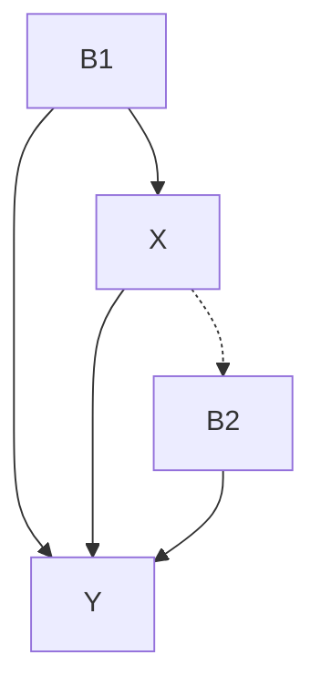

> a)

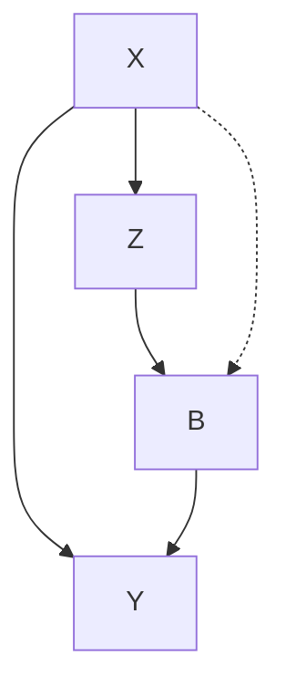

> b) 图 4.1 定理 4.3.1 中的条件 3：a）集合 $\{B_{1}, B_{2}\}$ 阻断了从 $X$ 到 $Y$ 的所有后门路径，所以 $P(b_{1}, b_{2}|\hat{x}) = P(b_{1}, b_{2})$ 。b）节点 $B$ 阻断了从 $X$ 到 $Y$ 的所有后门路径，运用条件 4 可识别 $P(b|\hat{x})$

**条件 4** 如果在 $G_{\bar{X}}$ 中存在节点集合 $Z_{1}$ 和 $Z_{2}$ ，其中 $Z_{1}$ 阻断了所有从 $X$ 到 $Y$ 的有向路径， $Z_{2}$ 阻断了所有 $Y$ 和 $Z_{1}$ 之间的后门路径，则 $P(y|\hat{x}) = \sum_{z_1, z_2} P(y|\hat{x}, z_1, z_2) P(z_1, z_2|\hat{x})$ 。由于 $Z_{1}$ 和 $Y$ 之间的所有后门路径都被 $G_{\bar{X}}$ 中的 $Z_{2}$ 阻断，则使用规则 2，可将 $P(y|\hat{x}, z_1, z_2)$ 写作 $P(y|\hat{x}, \hat{z}_1, z_2)$ 。因为 $(Y \perp X|Z_1, Z_2)_{G_{\bar{z}_1 \overline{X(Z_2)}}}$ ，我们利用规则 3，将 $P(y|\hat{x}, \hat{z}_1, z_2)$ 约简为 $P(y|\hat{z}_1, z_2)$ 。如果 $(Y \perp Z_1|Z_2)_{G_{\underline{z}_1}}$ ，则可将 $P(y|\hat{z}_1, z_2)$ 写作 $P(y|z_1, z_2)$ 。由于 $(Y \perp Z_1|Z_2)_{G_{\bar{X} \underline{z}_1}}$ ，115 仅当存在一条通过 $X$ 从 $Y$ 到 $Z_{1}$ 的路径时，这种独立性无法成立。但是，我们可以通过对 $X$ 的条件求和来阻断这条路径，即通过 $\sum_{x'} P(y|\hat{z}_1, z_2, x') P(x'|\hat{z}_1, z_2)^\ominus$ 。现在，我们可以使用规则 2 将 $P(y|\hat{z}_1, z_2, x')$ 写作 $P(y|z_1, z_2, x')$ 。同时由于 $Z_{1}$ 是 $X$ 的子节点且图是无环图，因此可以使用规则 3 将 $P(x'|\hat{z}_1, z_2)$ 写作 $P(x'|z_2)$ 。目前为止，可以将问题写作

$$
\sum_ {z_{1}, z_{2}} \sum_ {x^{\prime}} P (y \mid z_{1}, z_{2}, x^{\prime}) P (x^{\prime} \mid z_{2}) P (z_{1}, z_{2} | \hat {x})
$$

并且 $P(z_{1},z_{2}|\hat{x}) = P(z_{2}|\hat{x}) = P(z_{1}|\hat{x},z_{2})$ 。由于 $Z_{2}$ 不包含 $X$ 的后代，因此可以使用规则 3 将 $P(z_2|\hat{x})$ 约简为 $P(z_{2})$ 。由于 $Z_{2}$ 阻断了所有从 $X$ 到 $Z_{1}$ 的后门路径，因此可以使用规则 2 将 $P(z_1|\hat{x},z_2)$ 约简为 $P(z_1|x,z_2)$ 。至此，整个计算公式可以写作

$$
\sum_ {z_{1}, z_{2}} \sum_ {x^{\prime}} P (y \mid z_{1}, z_{2}, x^{\prime}) P (x^{\prime} \mid z_{2}) P (z_{1} | x, z_{2}) P (z_{2})
$$

参见图 4.2 中的实例。

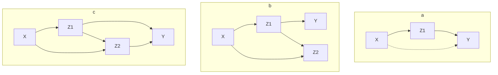

> 图 4.2 定理 4.3.1 中的条件 4。a) $Z_{1}$ 阻断了从 X 到 Y 的有向路径，空集阻断了 $G_{\bar{X}}$ 中所有 $Z_{1}$ 到 Y 的后门路径和 G 中所有 $Z_{1}$ 到 X 的后门路径。在 b 和 c 中， $Z_{1}$ 阻断了所有从 X 到 Y 的有向路径， $Z_{2}$ 阻断了

### 4.3.2 识别效率

实现定理 4.3.1 中的可识别性方法时，条件 3 和 4 似乎需要进行全局搜索。例如，为了证明条件 3 不成立，我们需要证明不存在任何阻断集合 $B$ 。幸运的是，以下定理让我们能够大幅缩小搜索空间，使可识别性检验易于实践。

#### 定理 4.3.2

如果存在一个最小集合 $B_{i}$ ， $P(b_{i}|\hat{x})$ 是可识别的，那么对于任何其他最小集合 $B_{j}$ ， $P(b_{j}|\hat{x})$ 也是可识别的。

定理 4.3.2 允许我们用一个最小的阻断集合 $B$ 来测试条件 3。如果 $B$ 满足条件 3 的要求，那么对行动结果的是可识别的，否则不能满足条件 3。在证明这个定理时，我们使用下面的引理。

#### 引理 4.3.3

如果 $P(y|\hat{x})$ 是可识别的，那么 $P(z|\hat{x})$ 是可识别的，其中 $Z$ 是从 $X$ 到 $Y$ 的有向路径上的任意节点集合。

#### 定理 4.3.4

假设 $Y_{1}$ 和 $Y_{2}$ 是两个节点子集，要么满足 $Y_{1}$ 中不存在 $X$ 的子节点，要么满足 $Y_{1}$ 和 $Y_{2}$ 中所有的节点都是 $X$ 的子节点，且 $Y_{1}$ 中任何节点都不是 $Y_{2}$ 的子节点，那么存在 $P(y_{1}, y_{2} | \hat{x})$ 的约简，当且仅当 $P(y_{1} | \hat{x})$ 和 $P(y_{2} | \hat{x}, y_{1})$ 都存在约简（依据推论 3.4.2）。

如果我们同时对 $P(y_{2}|\hat{x},y_{1})$ 和 $P(y_{1}|\hat{x})$ 实施这个过程，那么 $P(y_{1},y_{2}|\hat{x})$ 可能会通过定理 4.3.1 的检验，但是如果我们试图对 $P(y_{1}|\hat{x},y_{2})$ 实施这个检验，那么我们找不到一个规则可以对此进行约简。图 4.3 就是这样一个例子。

定理 4.3.4 保证，如果存在一个针对 $P(y_{1},y_{2}|\hat{x})$ 的约简序列，那么我们总是能够通过正确选择 $Y_{1}$ 找到针对 $P(y_{1}|\hat{x})$ 和 $P(y_{2}|\hat{x},y_{1})$ 的约简。

#### 定理 4.3.5

如果存在满足条件 4 所有要求的集合 $Z_{1}$ ，那么 $X$ 的子节点与 $Y$ 的父节点的交集也将满足条件 4 的所有要求。

定理 4.3.5 去掉了定理 4.3.1 中条件 4 对 $Z_{1}$ 搜索的要求。定理 4.3.2 ～ 4.3.5 的证明由 Galles 和 Pearl（1995）给出。

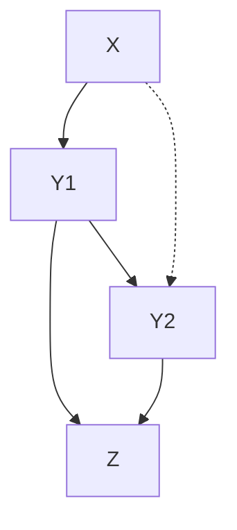

> 图 4.3 定理 4.3.1 虽然不能保证对 $P(y_{1}|\hat{x},y_{2})$ 进行约简，但确保了针对 $P(y_{2}|\hat{x},y_{1})$ 和 $P(y_{1}|\hat{x})$ 的约简

### 4.3.3 对控制问题解析解的推导

定理 4.3.1 中定义的算法不仅能够确定控制问题 $P(y \mid \hat{x})$ 的可识别性，而且（当存在控制问题的解析解时）根据观察到的概率分布还可以得到其解析解，如下所示。

**函数** ：`CloseForm(P(y |  $\hat{x}$ ))`  
 **输入** ：控制问题 $P(y|\hat{x})$  
 **输出** ： $P(y|\hat{x})$ 的解析解（仅根据观察到的变量），或者（当问题无法识别时）返回 FAIL。

- 1. 如果 $(X \perp Y)_{G_{\bar{X}}}$ ，则返回 $P(y)$ 。
- 2. 否则，如果 $(X \perp Y)_{G_{x}}$ ，则返回 $P(y|x)$ 。
- 3. 否则，设 $B = \text{BlockingSet}(X, Y)$ ， $Pb = \text{CloseForm}(P(b | \hat{x}))$ ；如果 $Pb \neq \text{FAIL}$ ，则返回 $\sum_{b} P(y | b, x)^* Pb$ 。
- 4. 否则，令 $Z_{1} = \text{Children}(X) \cap (Y \cup \text{Ancestors}(Y))$ ， $Z_{3} = \text{BlockingSet}(X, Z_{1})$ ， $Z_{4} = \text{BlockingSet}(Z_{1}, Y)$ ，以及 $Z_{2} = Z_{3} \cup Z_{4}$ ；如果 $Y \notin Z_{1}$ 且 $Y \notin Z_{2}$ ，则返回 $\sum_{z_{1}, z_{2}} \sum_{x} P(y | z_{1}, z_{2}, x') P(x' | z_{2}) P(z_{1} | x, z_{2}) P(z_{2})$ 。
- 5. 否则，返回 FAIL。

> **注** ：步骤 3 和步骤 4 调用函数 `BlockingSet(X, Y)`，该函数选择一个能够将 $X$ 从 $Y$ 中 d-分离的节点集合 $Z$ 。集合 $Z$ 可以在多项式时间内被找到（Tian et al., 1998）。步骤 3 包含了对算法 `CloseForm(P(b|x̂))` 本身的递归调用，以获得因果效应 $P(b|\hat{x})$ 的解析解。

### 4.3.4 总结

定理 4.3.1 的条件扩展了可识别模型（如图 3.8 中所示的模型）和不可识别模型（见图 3.9）之间的边界。这些条件引出了一种有效的算法，用于确定形式为 $P(y \mid \hat{x})$ 的行动控制问题的可识别性，其中 $X$ 是个体变量。该算法进一步基于估计概率给出了因果效应 $P(y \mid \hat{x})$ 的解析解。

## 4.4 动态计划的可识别性

本节基于 Pearl 和 Robins（1995）的内容，讨论涉及存在无法观测（或不可测量）变量的情况下对计划的概率评估。其中，计划由若干个并发和序贯行动（concurrent or sequential action）组成，并且每个行动都可能受该计划中前一个行动的影响。

我们建立了一套基于图的准则，用于识别在什么情况下可以仅从可测变量的观测值中预测计划的结果。当满足这个准则时，计划达到既定目标的概率将以解析解的方式给出。

### 4.4.1 动机

为了方便讨论，我们以文献（Robins，1993，附录 2）中的实例为切入点，如图 4.4 所示。变量 $X_{1}$ 和 $X_{2}$ 分别代表两个医生在不同阶段向患者提出的治疗方案。 $Z$ 表示第二个医生在确认方案 $X_{2}$ 前患者的情况， $Y$ 代表患者的存活情况。隐变量 $U_{1}$ 和 $U_{2}$ 分别代表病人的病史和康复趋势。

艾滋病患者治疗的例子就符合这种简单的结构，其中 $Z$ 代表 PCP 发病①。PCP 是一种艾滋病患者常见的感染。如图 4.4 所示，PCP 对存活情况 $Y$ 没有直接影响，因为 PCP 可以治愈，但 PCP 是反应患者潜在免疫状态（ $U_{2}$ ）的一个指标，而免疫状态（ $U_{2}$ ）差可导致死亡。 $X_{1}$ 和 $X_{2}$ 代表抗生素，这是一种能够治疗 PCP（ $Z$ ）的药物，也可以防止死亡。医生根据患者 PCP 病史（ $U_{1}$ ）提出 $X_{1}$ 方案，但并没有记录 $U_{1}$ 的值，无法用于后续的数据分析。

> ① 卡氏肺孢子虫肺炎，在艾滋病患者以及使用免疫抑制药物的病人中尤其常见。——译者注

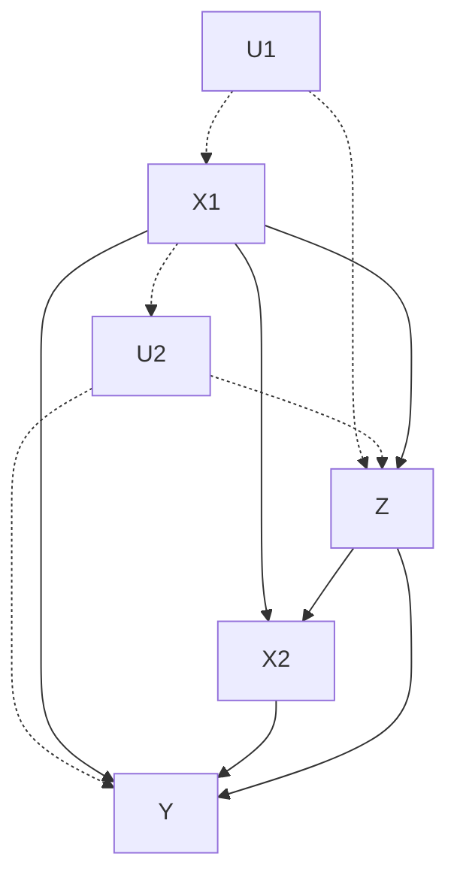

> 图 4.4 获取变量 $X_{1}$ 、 $Z$ 、 $X_{2}$ 和 $Y$ 的非实验数据②并评估计划 $(do(x_{1}), do(x_{2}))$ 对 $Y$ 的因果效应

> ② 即观察数据。——译者注

我们面临的问题如下：假设我们已经收集了许多有关患者和医生行动的数据，并归纳为有关 4 个可测变量 $(X_{1}, Z, X_{2}, Y)$ 的联合分布 $P$ 。当出现一位新的患者时，我们希望确定（无条件）计划（医疗方案） $(do(x_{1}), do(x_{2}))$ 对存活的影响，其中 $x_{1}$ 和 $x_{2}$ 是在预先指定的两个阶段内所使用的两种预定剂量的抗生素。

多数情况下，我们的问题相当于通过观察（已有的）其他计划的表现来评估一个新计划，其中其他计划的决策依据无从知晓。医生不会提供促使他们给出相应治疗方案的情况细节，他们只告知在确定 $X_{1}$ 方案时参考了 $U_{1}$ ，在确定 $X_{2}$ 方案时参考了 $Z$ 和 $X_{1}$ 。但不幸的是， $U_{1}$ 也没有被记录下来。

在流行病学中，计划评估问题称为“带有时变混杂因子的时变治疗”（Robins, 1993）。在人工智能应用中，对这些计划的评估能够使一个主体（学习者）通过观察其他主体的表现进行学习从而完成行动，即使在其他主体行动原因未知的情况下也可以完成学习。如果允许学习者做出行动和观察，那么任务就变得容易得多。在这种情况下，因果图的拓扑结构可以被推断出来（至少部分可被推断出来），一些以前无法识别的行动结果也可以被确定。

与行动识别（第 3 章）一样，计划的识别（identification of plan）的主要问题是对“混杂因子”的控制，即那些能够触发行动并影响结果，但又不可观测的因素。但是，由于一些混杂因子（例如 Z）受控制变量的影响，使计划的识别变得更加复杂。如第 3 章所述，统计实验设计中最致命的一点（Cox, 1958, p.48）就是需要针对此类变量不停地进行调整。因为对这种介于行动与结果之间的变量进行调整会干扰我们对该行动结果的评估。故而，需要提出一种识别方法以避开这些问题。

图 4.4 中的另外两个特性也值得注意。首先，如果将控制变量 $X_{1}$ 和 $X_{2}$ 合成一个单一的复合变量 X，则无法计算 $P(y|\hat{x}_{1},\hat{x}_{2})$ 。在这种合成后的图中，X 通过箭头和弧线（经过 U）连接到 Y，于是形成一个弓形模式（见图 3.9），因此无法识别。其次，孤立的因果效应 $P(y|\hat{x}_{1})$ 是无法识别的，因为 $U_{1}$ 在链接 $X \rightarrow Z$ 周围创建了一个弓形模式，它位于从 X 到 Y 的有向路径上（参见 3.5 节的讨论）。

$P(y|\hat{x}_{1},z,\hat{x}_{2})$ 的可识别性将促进 $P(y|\hat{x}_{1},\hat{x}_{2})$ 的可识别性，即仅识别单一行动 $do(X_{2}=x_{2})$ 的因果效应，以该行动实施后的观察结果为条件。这可以通过后门准则来验证，即 $\{X_{1},Z\}$ 阻断了 $X_{2}$ 和 Y 之间的所有后门路径。因此， $P(y|\hat{x}_{1},\hat{x}_{2})$ 的可识别性可以通过以下推导过程来证明：

$$
P (y \mid \hat{x}_{1}, \hat{x}_{2}) = P (y \mid \hat{x}_{1}, \hat{x}_{2}) \tag {4.1}
$$

$$
= \sum_ {z} P (y \mid z, x_{1}, \hat{x}_{2}) P (z \mid x_{1}) \tag {4.2}
$$

$$
= \sum_ {z} P (y \mid z, x_{1}, x_{2}) P (z \mid x_{1}) \tag {4.3}
$$

其中式（4.1）和式（4.3）符合规则 2，式（4.2）符合规则 3。应用这些规则所产生的子图如图 4.5 所示（见 4.4.3 节）。

这个推导过程还展示了如何评估条件计划。假设我们希望评估计划 $\{do(X_1 = x_1), do(X_2 = g(x_1, z))\}$ 的效果。根据 4.2 节的分析，假设 $U_1 = \{0\}$ ，有

$$
\begin{array}{l} P (y \mid do \left(X_{1} = x_{1}\right), do \left(X_{2} = g \left(x_{1}, z\right)\right)) = P (y \mid x_{1}, do \left(X_{2} = g \left(x_{1}, z\right)\right)) \\ = \sum_ {z} P (y \mid z, x_{1}, do (X_{2} = g (x_{1}, z))) P (z \mid x_{1}) \\ = \sum_ {z} P (y \mid z, x_{1}, x_{2}) P (z \mid x_{1}) \mid_ {x_{2} = g \left(x_{1}, z\right)} \\ \end{array}
$$

同样，此条件计划的可识别性取决于表达式 $P(y|z, x_1, \hat{x}_2)$ 的可识别性，该表达式约简为 $P(y|z, x_1, x_2)$ ，因为 $\{X_1, Z\}$ 会阻断 $X_2$ 和 $Y$ 之间的所有后门路径（参见 11.4.1 节）。

在下一节中，我们将制定相关的准则，通过图模型的方法来识别提交的计划是否足以从观测值的联合分布中进行评估。如果可以，则需要确定应测量哪些协变量 ① 以及如何对它们进行调整。

> ① 即观测变量。——译者注

### 4.4.2 识别计划：符号和假设

以因果图为基础制定一个相应的知识规范框架，与图 4.4 类似，它定性地总结了对相关数据生成过程的理解②。

> ② Robins（1986，1987）采用了另一种反事实相关的规范方案，参见 3.6.4 节。

#### 符号

一个控制问题（control problem）包括一个有向无环图（DAG） $G$ ，其节点集合为 $V$ 被划分为 4 个互不相交的子集合 $V = \{X, Z, U, Y\}$ ，其中：

- $X$ = 控制变量的集合（暴露，干预，治疗等）
- $Z$ = 观测变量的集合，通常称为协变量
- $U$ = 不可观测的（或者潜在的）变量的集合
- $Y$ = 结果变量

我们将控制变量排序为 $\{X = X_{1}, X_{2}, \cdots, X_{n}\}$ ，使每一个 $X_{k}$ 在图 $G$ 中是 $X_{k+j} (j > 0)$ 的非后代节点，并且令结果节点 $Y$ 为 $X_{n}$ 的后代节点。令 $N_{k}$ 代表观察节点集合，其中每个观察节点必须是 $\{X_{k}, X_{k+1}, \cdots, X_{n}\}$ 中任一节点的非后代节点。

计划（plan）是一个有序序列 $(\hat{x}_{1}, \hat{x}_{2}, \cdots, \hat{x}_{n})$ ，表示对控制变量的赋值，其中 $\hat{x}_{k}$ 表示 “ $X_{k}$ 被设置为 $x_{k}$ ”。条件计划（conditional plan）是一个有序序列 $(\hat{g}_{1}(z_{1}), \hat{g}_{2}(z_{2}), \cdots, \hat{g}_{n}(z_{n}))$ ，其中每个 $g_{k}$ 是从集合 $Z_{k}$ 到 $X_{k}$ 的映射函数。 $\hat{g}_{k}(z_{k})$ 表示 “当 $Z_{k}$ 的值为 $z_{k}$ 时，将 $X_{k}$ 的值设为 $g_{k}(z_{k})$ ”。每个 $g_{k}(z_{k})$ 函数中的变量 $Z_{k}$ 不能包含图 $G$ 中 $X_{k}$ 的任何后代变量。

我们的目标是通过计算概率 $P(y \mid \hat{x}_{1}, \hat{x}_{2}, \cdots, \hat{x}_{n})$ 来评估无条件计划 $^{①}$ ，这个概率代表计划 $(\hat{x}_{1}, \hat{x}_{2}, \cdots, \hat{x}_{n})$ 对结果变量 $Y$ 的影响程度。如果对于每个赋值 $(\hat{x}_{1}, \hat{x}_{2}, \cdots, \hat{x}_{n})$ ，概率 $P(y \mid \hat{x}_{1}, \hat{x}_{2}, \cdots, \hat{x}_{n})$ 可由变量 $\{X, Y, Z\}$ 组成的联合分布唯一确定，那么 $P(y \mid \hat{x}_{1}, \hat{x}_{2}, \cdots, \hat{x}_{n})$ 在图 $G$ 中可识别 $^{②}$ 。只要 $P(y \mid \hat{x}_{1}, \hat{x}_{2}, \cdots, \hat{x}_{n})$ 可识别，控制问题就可识别。

> - ① 条件计划将在 11.4.1 节中进行分析，通过重复使用定理 4.4.1 予以识别。
> - ② 变量 $X, Y, Z$ 都是可观测的。——译者注

我们将在定理 4.4.1 和定理 4.4.6 中给出重要的识别准则。它们在 $G$ 的各个子图上调用了序贯后门测试（sequential back-door test），从中删除了指向目标行动的箭头。我们用 $G_{\bar{x}}$ 和 $G_{x}$ 分别表示从 $G$ 中删除所有指向 $X$ 和由 $X$ 指出的箭头所获得的图。我们定义了符号 $G_{\bar{x}z}$ 表示同时删除指向 $X$ 和由 $Z$ 指出的箭头所获得的图。最后，表达式 $P(y|\hat{x},z) \triangleq P(y,z|\hat{x}) / P(z|\hat{x})$ 代表在观测到 $Z=z$ 且固定 $X$ 的值为 $x$ 的情况下 $Y=y$ 的概率。

### 4.4.3 识别计划：序贯后门准则

#### 定理 4.4.1 (Pearl and Robins, 1995)

对于每个 $1 \leqslant k \leqslant n$ ，存在满足以下（序贯后门）条件的协变量集合 $Z_{k}$ ：

$$
Z_{k} \subseteq N_{k} \tag {4.4}
$$

（即 $Z_{k}$ 由 $\{X_{k}, X_{k+1}, \cdots, X_{n}\}$ 的非后代节点组成）并且

$$
(Y \perp X_{k} | X_{1}, \dots , X_{k - 1}, Z_{1}, Z_{2}, \dots , Z_{k})_{G_{\underline{X}_{k}, \bar{X}_{k + 1}, \dots , \bar{X}_{n}}} \tag {4.5}
$$

则概率 $P(y \mid \hat{x}_{1}, \hat{x}_{2}, \cdots, \hat{x}_{n})$ 可识别。当这些条件满足时，该计划的结果为：

$$
\begin{array}{l}
P (y \mid \hat{x}_{1}, \dots , \hat{x}_{n}) = \sum_{z_{1}, \dots , z_{n}} P (y \mid z_{1}, \dots , z_{n}, x_{1}, \dots , x_{n}) \\
\times \prod_{k = 1}^{n} P \left(z_{k} \mid z_{1}, \dots , z_{k - 1}, x_{1}, \dots , x_{k - 1}\right) \\
\end{array}
$$

在给出上述定理的证明之前，让我们演示一下如何使用定理 4.4.1 来检验如图 4.4 中所示的控制问题的可识别性。首先，我们将证明如果不观测变量 Z， $P(y|\hat{x}_{1},\hat{x}_{2})$ 无法被识别。换句话说，序列 $Z_{1}=\varnothing, Z_{2}=\varnothing$ 将不满足条件（4.4）～（4.5）。条件（4.5）中两个 d-分离检验为

$$
(Y \bot X_{1})_{G_{\chi_{1}, \bar{\chi}_{2}}} \text {和} (Y \bot X_{2} | X_{1})_{G_{\chi_{2}}}
$$

与这些检验相关的两个子图如图 4.5 所示。我们可以看到 $(Y \perp X_{1})$ 在 $G_{\underline{X}_{1}, \bar{X}_{2}}$ 中成立，但 $(Y \perp X_{2}|X_{1})$ 在 $G_{\bar{X}_{2}}$ 中不成立。因此，为了通过检验，我们必须有 $Z_{1} = \{Z\}$ 或 $Z_{2} = \{Z\}$ 。由于 $Z$ 是 $X_{1}$ 的后代，因此只有第二个选项满足（4.4） $^{\ominus}$ 。适用于 $Z_{1} = \emptyset, Z_{2} = \{Z\}$ 序列的检验为 $(Y \perp X_{1})_{G_{X_{1}, \bar{X}_{2}}}$ 以及 $(Y \perp X_{2}|X_{1}, Z)_{G_{X_{2}}}$ 。图 4.5 显示了当前两种检验都满足条件，因为 $\{X_{1}, Z\}$ 集合 $d$ -分离了 $G_{\underline{X}_{2}}$ 中 $X_{2}$ 到 $Y$ 的路径。在满足条件（4.4）～（4.5）的情况下，公式（4.6）给出了计划 $(\hat{x}_{1}, \hat{x}_{2})$ 对 $Y$ 因果效应的公式

$$
P (y \mid \hat{x}_{1}, \hat{x}_{2}) = \sum_{z} P (y \mid z, x_{1}, x_{2}) P (z \mid x_{1}) \tag {4.7}
$$

与公式（4.3）一致。

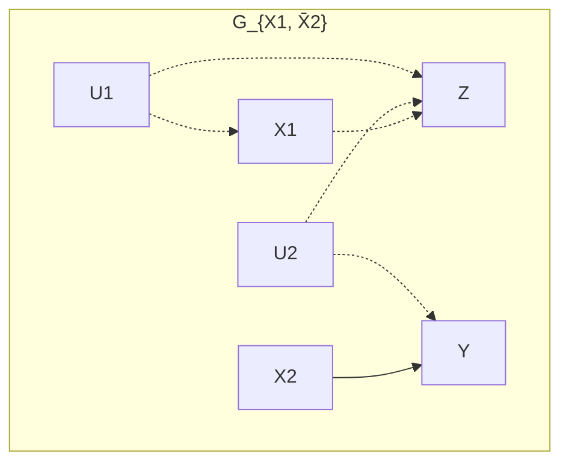

> a)

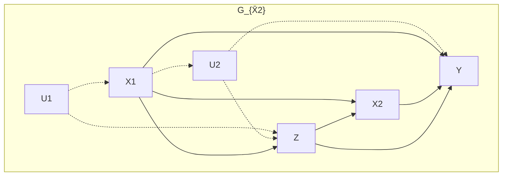

> b) 图 4.5 图 4.4 中用于检验计划 $(\hat{x}_{1}, \hat{x}_{2})$ 可识别性的图 G 的两个子图

这样，必然会产生一个问题：如果不进行全局搜索，是否可以识别序列 $Z_{1} = \emptyset$ 、 $Z_{2}=\{Z\}$ 。这个问题将在推论 4.4.5 和定理 4.4.6 中得到解答。

#### 定理 4.4.1 的证明

此处给出的证明是基于 do 算子的推断规则（定理 3.4.1），这个规则便于因果效应公式约简为无帽表达式。Pearl 和 Robins（1995）给出了基于潜在变量消除的另一种证明。

**步骤 1** 对于所有 $j \geqslant k$ ，条件 $Z_{k} \subseteq N_{k}$ 蕴含 $Z_{k} \subseteq N_{j}$ 。因此，我们可以得到：

$$
\begin{array}{l}
P \left(z_{k} \mid z_{1}, \dots , z_{k - 1}, x_{1}, \dots , x_{k - 1}, \hat {x}_{k}, \hat {x}_{k + 1}, \dots , \hat {x}_{n}\right) \\
= P \left(z_{k} \mid z_{1}, \dots , z_{k - 1}, x_{1}, \dots , x_{k - 1}\right) \\
\end{array}
$$

因为 $\{Z_{1},\cdots,Z_{k-1},X_{1},\cdots,X_{k-1}\}$ 中的任何节点都不可能是集合 $\{X_{k},\cdots,X_{n}\}$ 中任何节点的后代节点。于是，规则 3 允许我们从表达式中删除带帽变量。

**步骤 2** 公式（4.5）中的条件允许我们引入规则 2 并写作：

$$
\begin{array}{l}
P (y \mid z_{1}, \dots , z_{k}, x_{1}, \dots , x_{k - 1}, \hat {x}_{k}, \hat {x}_{k + 1}, \dots , \hat {x}_{n}) \\
= P (y \mid z_{1}, \dots , z_{k}, x_{1}, \dots , x_{k - 1}, x_{k}, \hat {x}_{k + 1}, \dots , \hat {x}_{n}) \\
\end{array}
$$

因此，我们得到：

$$
\begin{array}{l}
P (y \mid \hat {x}_{1}, \dots , \hat {x}_{n}) \\
= \sum_ {z_{1}} P (y \mid z_{1}, \hat {x}_{1}, \hat {x}_{2}, \dots , \hat {x}_{n}) P (z_{1} \mid \hat {x}_{1}, \dots , \hat {x}_{n}) \\
= \sum_ {z_{1}} P (y \mid z_{1}, x_{1}, \hat {x}_{2}, \dots , \hat {x}_{n}) P (z_{1}) \\
= \sum_ {z_{2}} \sum_ {z_{1}} P (y \mid z_{1}, z_{2}, x_{1}, \hat {x}_{2}, \dots , \hat {x}_{n}) P (z_{1}) P (z_{2} \mid z_{1}, x_{1}, \hat {x}_{2}, \dots , \hat {x}_{n}) \\
= \sum_ {z_{2}} \sum_ {z_{1}} P (y \mid z_{1}, z_{2}, x_{1}, x_{2}, \hat {x}_{3}, \dots , \hat {x}_{n}) P (z_{1}) P (z_{2} \mid z_{1}, x_{1}) \\
\begin{array}{c}
\bullet \\
\bullet \\
\bullet
\end{array} \\
= \sum_ {z_{n}} \dots \sum_ {z_{2}} \sum_ {z_{1}} P (y \mid z_{1}, \dots , z_{n}, x_{1}, \dots , x_{n}) \\
\times P \left(z_{1}\right) P \left(z_{2} \mid z_{1}, x_{1}\right) \dots P \left(z_{n} \mid z_{1}, x_{1}, z_{2}, x_{2}, \dots , z_{n - 1}, x_{n - 1}\right) \\
= \sum_ {z_{1}, \dots , z_{n}} P (y \mid z_{1}, \dots , z_{n}, x_{1}, \dots , x_{n}) \prod_ {k = 1}^{n} P (z_{k} \mid z_{1}, \dots , z_{k - 1}, x_{1}, \dots , x_{k - 1}) \\
\end{array}
$$

$$
\begin{array}{l}
\begin{array}{c}
\bullet \\
\bullet \\
\bullet
\end{array} \\
= \sum_ {z_{n}} \dots \sum_ {z_{2}} \sum_ {z_{1}} P (y \mid z_{1}, \dots , z_{n}, x_{1}, \dots , x_{n}) \\
\times P \left(z_{1}\right) P \left(z_{2} \mid z_{1}, x_{1}\right) \dots P \left(z_{n} \mid z_{1}, x_{1}, z_{2}, x_{2}, \dots , z_{n - 1}, x_{n - 1}\right) \\
= \sum_ {z_{1}, \dots , z_{n}} P (y \mid z_{1}, \dots , z_{n}, x_{1}, \dots , x_{n}) \prod_ {k = 1}^{n} P (z_{k} \mid z_{1}, \dots , z_{k - 1}, x_{1}, \dots , x_{k - 1}) \\
\end{array}
$$

#### 定义 4.4.2（容许序列和 G-可识别）

123 任何满足条件（4.4）～（4.5）的协变量序列 $Z_{1}, \cdots, Z_{n}$ 称为 **可容许的** 。任何通过定理 4.4.1 的准则检验可识别的表达式 $P(y|\hat{x}_1,\cdots,\hat{x}_n)$ 称为 ** $G$ -可识别的** ②。

> ② 即无 $^{。}$ ——译者注

注意，可容许性（4.5）要求每个子序列 $X_{1},\dots ,X_{k - 1},Z_{1},\dots ,Z_{k}$ 阻断所有从 $X_{k}$ 到 $Y$ 的“无行动”的后门路径（参见 11.3.7 节）。

于是，可以立刻得出下面的推论。

#### 推论 4.4.3

当且仅当一个控制问题有一个容许序列时，它是 **G-可识别** 的。

值得注意的是，尽管 do 算子是完备的，G-可识别对于 4.4.2 节中定义的计划可识别性来说充分但不必要。原因在于式（4.6）的约简过程中，第 $k$ 步阻碍了将 $X_{k}$ 的后代变量 $Z_{k}$ 作为条件——即那些可能受到行动 $do(X_{k}=x_{k})$ 影响的变量。在某些因果结构中，因果效应的可识别性要求我们以这些变量为条件，如前门准则所证明的那样（见定理 3.3.4）。

### 4.4.4 识别计划：计算流程

定理 4.4.1 为识别计划提供了一个声明性条件。它只能用于确认一个公式对给定的一个计划是否有效，但它并不能为获得这些公式提供一个有效的计算流程，因为它并没有说明每个 $Z_{k}$ 选择的过程。存在这样一种可能性，即对满足条件（4.4）和（4.5）的某些不恰当的 $Z_{k}$ 选择可能会妨碍约简过程，即使存在另一种可行的约简序列。

如图 4.6 所示， $W$ 是 $Z_{1}$ 的一个容许选择，但是如果我们做这个选择，我们将不能完成约简，因为不存在任何集合 $Z_{2}$ 可以满足条件（4.5）： $(Y \perp X_{2}|X_{1}, W, Z_{2})_{G_{X_{2}}}$ 。在这个例子中，更明智的选择是 $Z_{1} = Z_{2} = \varnothing$ ，它能够同时满足 $(Y \perp X_{1}| \varnothing)_{G_{X_{1}, \bar{X}_{2}}}$ 和 $(Y \perp X_{2}|X_{1}, \varnothing)_{G_{X_{2}}}$ 。

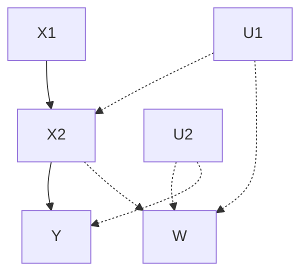

> **图 4.6** 一个容许选择 $Z_{1} = W$ 排除了对 $Z_{2}$ 的任何容许选择。选择 $Z_{1} = \emptyset$ 将使构造容许序列 $(\{Z_1 = \emptyset, Z_2 = \{Z\}\})$ 成为可能。

避免错误选择协变量的一种明显方法是始终坚持选择“极小”的 $Z_{k}$ ，即满足条件（4.5）的一组协变量，其任何子集都不能满足（4.5），如图 4.6 所示。然而，由于通常存在很多这样的最小集（参见图 4.7），因此仍然存在每个极小 $Z_{k}$ 的选择是否都是“可靠的”这样的问题：当存在某个容许序列 $Z_{1}^{*}, \cdots, Z_{n}^{*}$ 时，对当前极小子序列 $Z_{1}, \cdots, Z_{k}$ 的选择一定不会妨碍我们找到下一个可容许的 $Z_{k+1}$ 吗？

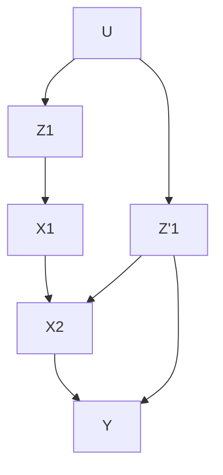

> **图 4.7** 极小容许集的非唯一性： $Z_{1}$ 和 $Z_{1}^{\prime}$ 都是极小容许集，因为 $(Y\perp \overline{X}_1|Z_1)$ 和 $(Y\perp X_1|Z_1^{\prime})$ 在 $G_{\underline{X}_1,\overline{X}_2}$ 中都成立。

接下来的定理保证了每个极小子序列 $Z_{1}, \cdots, Z_{k}$ 的可靠性，从而给出了一种有效的 G-可识别性的检验方法。

#### 定理 4.4.4

如果存在一个容许序列 $Z_{1}^{*}, \cdots, Z_{n}^{*}$ ，那么对于每一个极小容许子序列 $Z_{1}, \cdots, Z_{k-1}$ ，都存在一个容许集合 $Z_{k}$ 。

Pearl 和 Robins（1995）给出了证明。

现在，定理 4.4.4 可以推出如下针对 G-可识别性的有效检验过程。

#### 推论 4.4.5

一个控制问题是 G-可识别的，当且仅当以下算法执行成功。

1. 设 $k = 1$ 。
2. 选择最小的 $Z_{k} \subseteq N_{k}$ 满足条件（4.5）。
3. 如果不存在这样的 $Z_{k}$ ，则执行失败；否则，设 $k = k + 1$ 。
4. 如果 $k = n + 1$ 则执行成功；否则，返回第 2 步。

定理 4.4.4 的另一个说法是：避免搜索最小集合 $Z_{k}$ 。因为，如果存在一个容许序列，那么我们可以将定理 4.4.1 中的协变量改成一个显式的协变量序列 $W_{1}, W_{2}, \cdots, W_{n}$ ，该序列在 $G$ 中很容易识别。

#### 定理 4.4.6

对每一个 $1 \leqslant k \leqslant n$ ，当且仅当以下条件成立时，概率 $P(y \mid \hat{x}_{1}, \cdots, \hat{x}_{n})$ 是 G-可识别的：

$$
\left(Y \perp \perp X_{k} \mid X_{1}, \dots , X_{k - 1}, W_{1}, W_{2}, \dots , W_{k}\right)_{G_{\underline{X}_{k}, \bar{X}_{k + 1}, \dots , \bar{X}_{n}}}
$$

其中， $W_{k}$ 是 $G$ 中满足以下条件的所有协变量的集合：

1.  $W_{k}$ 中的协变量都不是 $\{W_{k}, X_{k+1}, \cdots, X_{n}\}$ 的后代。
2.  对每一个 $W_{k}$ 中的协变量，在 $G_{\underline{X}_{k}, \bar{X}_{k+1}, \cdots, \bar{X}_{n}}$ 中 $Y$ 或 $X_{k}$ 是其后代。

此外，如果满足此条件，则该计划的评估结果为：

$$
P(y \mid \hat{x}_{1}, \dots , \hat{x}_{n}) = \sum_{\substack{w_{1}, \dots , w_{n} \\ n}} P(y \mid w_{1}, \dots , w_{n}, x_{1}, \dots , x_{n}) \tag{4.8}
$$

$$
\times \prod_{k = 1}^{n} P(w_{k} \mid w_{1}, \dots , w_{k - 1}, x_{1}, \dots , x_{k - 1}) \tag{4.6}
$$

在文献（Pearl and Robins，1995）和文献（Robins，1997）中可以找到定理 4.4.6 的证明以及几种推广形式。Kuroki（Kuroki et al., 2003; Kuroki and Miyakawa, 1999a, b, 2003; Kuroki and Cai, 2004）提出了对 $G$ -可识别性的扩展。

值得注意的是，从系统化检验的意义来说，尽管推论 4.4.5 和定理 4.4.6 提供了一套程序化的计划识别方法，但它们仍与顺序相关。很有可能出现这种情况：两组对控制变量的排序都与图 $G$ 中的箭头方向一致，但容许序列出现在其中一种排序中而不在另一种排序中。图 4.8 描述了这种情况。两个子图可以通过从图 4.4 中删除箭头 $X_{1} \rightarrow X_{2}$ 和 $X_{1} \rightarrow Z$ 得到，从而两个控制变量（ $X_{1}$ 和 $X_{2}$ ）可以任意排序。如果进行（ $X_{1}, X_{2}$ ）的排序，则仍会像之前一样接受容许序列（ $\varnothing, Z$ ），但是如果进行（ $X_{2}, X_{1}$ ）的排序，则找不到任何容许序列。这可以从图 $G_{\underline{X}_{1}}$ 中很容易看出，其中（根据条件（4.5），其中 $k = 1$ ），我们需要找到一个集合 $Z$ ，使得集合 $\{X_{2}, Z\}$ 能够 $d$ -分离 $Y$ 与 $X_{1}$ ，但不存在这样的集合。

这种对顺序敏感的潜在含义是，只要 $G$ 存在对控制变量的多种排序，就需要检查所有的排序，然后才能确定计划不是 $G$ -可识别的。Shpitser 和 Pearl（2006b）提出的图模型准则避免了此类搜索。

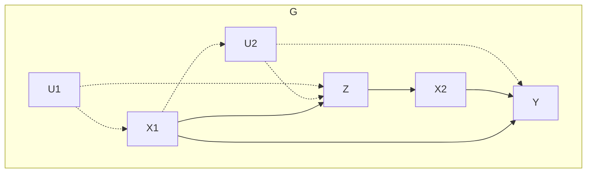

> a)

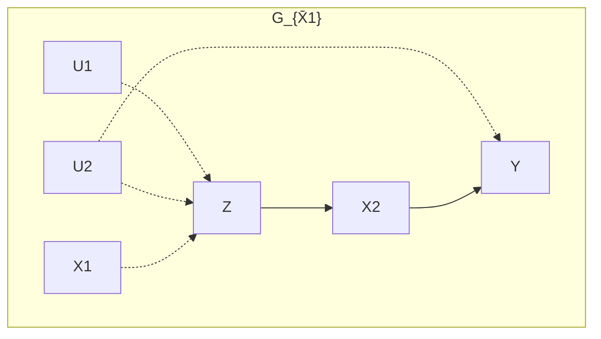

> b) 图 4.8 因果图 $G$ ，其中控制变量 $X_{1}$ 和 $X_{2}$ 的顺序很重要

## 4.5 直接效应和间接效应

### 4.5.1 直接效应与总效应

到目前为止，我们所作的因果效应 $P(y|\hat{x})$ 分析是衡量单个变量（或一组变量） $X$ 对结果变量 $Y$ 的 **总效应** （total effect）。在许多情况下，此结果不足以满足应用目标的需求，还需要关注 $X$ 对 $Y$ 的 **直接效应** 。

“直接效应”一词意味着量化一种不受模型中其他变量影响的效应。更准确地说，当分析中所有其他变量都保持不变时， $Y$ 对 $X$ 变化的敏感性。当然，固定这些变量将切断除 $X \to Y$ 之外所有从 $X$ 到 $Y$ 的因果路径，并且链接 $X \to Y$ 不会被任何中间变量切断。

直接效应是无处不在的。一个经典例子（Hesslow，1976；Cartwright，1989）是关于一种避孕药的故事。这种避孕药一直被怀疑会在女性体内形成血栓，同时，还会降低怀孕率，而这又对血栓的形成具有负面的间接效应（众所周知，怀孕会导致血栓形成）。在这个例子中，人们关注的是避孕药的直接效应，因为它代表了一种稳定的生理关系。与其产生的总效应不同，这种生理关系不会因为婚姻状况以及可能影响女性怀孕的其他社会因素而改变。

另一类例子涉及雇佣关系中的种族或性别歧视的法律纠纷。其中，性别或种族对申请人资格的影响，以及申请人资格对雇佣的影响都不是诉讼对象。被告必须证明性别和种族不会直接影响雇佣决定，不管性别和种族是否由于申请人的资格而对雇佣产生的间接影响 $^{①}$ 。

在所有这些例子中，保持中间变量固定的要求必须被解释为（假设地）通过物理上的干预将这些变量设置为常量，而不是通过条件化这些变量或调整变量的值（一种错误的认识，可追溯到文献（Fisher, 1935））。例如，对孕妇和非孕妇分别单独测量避孕药和血栓之间的关系，然后汇总结果，这是不够的。相反，我们必须对那些在使用避孕药之前就已经怀孕的，以及通过非药物手段进行避孕的女性进行研究。

原因是，通过条件化中间变量（本例中为怀孕），即使 $X$ 对 $Y$ 没有直接效应，我们也可能在 $X$ 和 $Y$ 之间创建伪相关。这可以用模型 $X \to Z \leftarrow U \to Y$ 轻松地说明，其中 $X$ 对 $Y$ 没有直接效应。物理上保持 $Z$ 恒定不变 $^{②}$ ，使 $X$ 和 $Y$ 之间不存在任何关联，这可以通过删除所有指向 $Z$ 的箭头看出来。但是，如果我们以 $Z$ 作为条件，就会通过 $U$ （未观察到的变量）产生一个伪相关，而错误地理解认为 $X$ 对 $Y$ 有直接效应。

> $^{①}$ 即性别或者种族可能会影响申请人的资格，从而间接影响雇佣关系，例如在一些社会，女性由于受教育程度低而在申请资格上处于劣势。——译者注

### 4.5.2 直接效应、定义和识别

如果可能的话，控制问题中的所有变量显然是一项巨大的工作。识别分析告诉我们，即使没有这种控制，在什么条件下仍可以从非实验数据中估计直接效应。应用 $do(x)$ 表示法（或简写为 $\hat{x}$ ），我们可以定义直接效应。

**定义 4.5.1（直接效应）**

$X$ 对 $Y$ 的直接效应记为 $P(y|\hat{x},\hat{s}_{XY})$ ，其中 $S_{XY}$ 是系统中除 $X$ 和 $Y$ 之外的所有内生变量的集合。

我们看到，对直接效应的测量更像是在做一个真实的实验。科学家可以控制所有可能的条件 $S_{XY}$ ，而无须了解图的结构或哪些变量是 $X$ 和 $Y$ 之间真正的中间变量。但是，如果我们知道图的结构，则可以省去许多需要实验控制的条件。事实上，没有必要将所有的变量保持不变，只需要将变量 $Y$ 的直接父代变量（不包括 $X$ ）保持不变就足够了。因此，我们得到以下直接效应的等价定义。

**推论 4.5.2**

$X$ 对 $Y$ 的直接效应记为 $P(y \mid \hat{x}, \widehat{pa}_{Y \setminus X})$ ，其中 $pa_{Y \setminus X}$ 表示除去 $X$ 之外的 $Y$ 的父节点赋值的集合。

显然，如果 $X$ 没有出现在 $Y$ 的父节点集合中（即 $X$ 不是 $Y$ 的父节点），那么 $P(y|\hat{x},\widehat{pa}_{Y \setminus X})$ 是一个独立于 $X$ 的常数分布，符合我们对“无直接效应”的理解。一般来说，假设 $X$ 是 $Y$ 的一个父节点，推论 4.5.2 意味着当 $P(y|\widehat{pa}_Y)$ 是可识别的， $X$ 对 $Y$ 的直接效应就是可识别的。此外，这个表达式的条件部分对应于一个计划，该计划中 $Y$ 的父节点都是控制变量。因此，我们得出结论，只要可以识别 $Y$ 的父节点计划效应，那么就可以识别 $X$ 对 $Y$ 的直接效应。现在，我们可以通过 4.4 节的分析，将定理 4.4.1 和 4.4.6 的图准则应用于直接效应的分析。我们通过以下定理对此进行表述。

#### 定理 4.5.3

令 $PA_{Y} = \{X_{1}, \cdots, X_{k}, \cdots, X_{m}\}$ ，当在某些可容许的变量排序中，计划 $(\hat{x}_{1}, \hat{x}_{2}, \cdots, \hat{x}_{m})$ 在推论 4.4.5 的条件下成立，那么任何 $X_{k}$ 对 $Y$ 的直接效应都是可识别的。直接效应的计算结果由式（4.8）给出。

定理 4.5.3 表明，如果 $Y$ 的其中一个父节点的效应是可识别的，那么 $Y$ 的其他任何父节点的效应也是可识别的。当然，效应的大小因不同的父节点而异，见式（4.8）。

直接可以得到下面的推论。

#### 推论 4.5.4

假设 $X_{j}$ 是 $Y$ 的一个父节点。如果存在一条包含任何 $X_{k} \rightarrow Y$ 的混杂弧，那么 $X_{j}$ 对 $Y$ 的直接效应是不可识别的。

### 4.5.3 案例：大学录取中的性别歧视问题

为了说明这一结论如何应用，我们以伯克利大学研究生录取中出现的性别偏见问题作为案例（Bickel et al., 1975）。这个案例中，数据显示在总体上男性申请人的录取率更高，但当按院系进行细分时，却显示偏好录取女性申请人。对此的解释是，女性申请者倾向于申请竞争更激烈、拒绝率更高的院系。基于这一发现，伯克利大学避免了歧视指控。这是一种称为“辛普森悖论”的反转问题，我们将在第 6 章进行更全面的讨论。

在这里，我们关注的问题是讨论对院系的选择是否适合用来评估大学录取中的性别歧视。传统观点认为，这样的评估调整是适当的，因为“我们知道申请一个受欢迎的院系（供少于求的院系）更容易被拒绝”（Cartwright，1983，p.38），但接下来我们很快就会发现应该还要考虑其他因素。

我们假设伯克利大学的案例中相关因素之间的关系如图 4.9 所示，变量解释如下：

$$
X_{1} = \mathrm{申请人性别}
$$

$$
X_{2} = \mathrm{申请人选择的院系}
$$

$$
Z = \text{申请人（预注册）的学业目标}
$$

$$
Y = \text{录取结果（接受 / 拒绝）}
$$

$$
U = \mathrm{申请人的能力（未记录）}
$$

请注意，U（例如，口头表达能力（未记录））将影响申请人的学业目标，也将影响录取结果 Y。

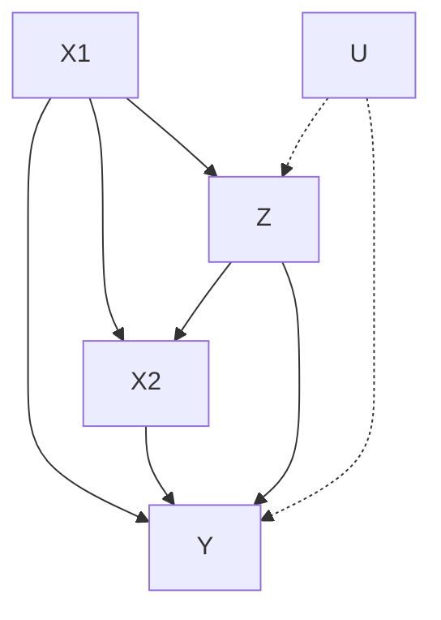

> 图 4.9 伯克利大学性别歧视研究中相关的因果关系。调整院系选择 $(X_{2})$ 或学业目标 $(Z)$ （或两者都调整）在估计性别对入学的直接效应时是不合适的。适当的调整见式（4.10）

调整院系选择相当于计算下列表达式：

$$
E_{x_{2}} P(y \mid \hat{x}_{1}, x_{2}) = \sum_{x_{2}} P(y \mid x_{1}, x_{2}) P(x_{2}) \tag{4.9}
$$

相反， $X_{1}$ 对 $Y$ 的直接效应如式（4.7）所示，记为：

$$
P(y \mid \hat{x}_{1}, \hat{x}_{2}) = \sum_{z} P(y \mid z, x_{1}, x_{2}) P(z \mid x_{1}) \tag{4.10}
$$

很明显，这两种表达式可能有很大的不同。第一个表达式检测申请人性别对某一院系的录取结果的（平均）效应。这个指标反映了一个事实，即某些“性别－院系”的组合可能与高录取率相关。这种伪相关性是由某种未被记录的能力（U）导致的。第二个表达式通过分别调整男女申请者的学业目标（Z）来消除这种伪相关。

为了验证式（4.9）不能合理地测量 $X_{1}$ 对 $Y$ 的直接效应，我们发现表达式依赖于 $X_{1}$ 的值，即使在 $X_{1}$ 和 $Y$ 之间没有任何箭头的情况下也是如此。另一方面，式（4.10）在这种情况下对 $X_{1}$ 变得不敏感。相关的证明留给读者去尝试。

为了更好地说明，我们将给出一个具体的数字实例。想象一个由 $A$ 、 $B$ 两个系组成的大学，这两个系都只根据入学资格（ $Q$ ）录取学生。进一步假设：

- （i）申请人由 100 名男生和 100 名女生组成；
- （ii）男女各有 50 名申请者的资格较高（因此被录取），另外各有 50 名的资格较低（因此被拒绝）。

显然，这所大学不能被指控为性别歧视。

然而，如果我们在不考虑资格的情况下对院系进行调整，就会出现完全不同的结果，这相当于使用了式（4.9）来评估性别对入学的效应。假设所有合格的男生都申请了 $A$ 系，而所有的女生都申请了 $B$ 系（见表 4.1）。

**表 4.1 各系男女生的录取率**

|        | 男性录取 | 男性申请 | 女性录取 | 女性申请 | 总计录取 | 总计申请 |
| ------ | -------- | -------- | -------- | -------- | -------- | -------- |
| A 系   | 50       | 50       | 0        | 0        | 50       | 50       |
| B 系   | 0        | 50       | 50       | 100      | 50       | 150      |
| 未调整 |          | 50%      |          | 50%      |          | 50%      |
| 调整后 |          | 25%      |          | 37.5%    |          |          |

从表 4.1 中我们可以看出，对院系调整后，错误地出现了偏向支持女性申请者这个结论，即 **37.5:25（= 3:2）** 。在这个例子中，一个未经调整的（有时被称为粗糙的）分析碰巧给出了正确的结果，男女的入学率都为 50%，从而使学校免于性别歧视的指控。

我们的分析并不意味着 Bickel 等人（1975）的伯克利研究是有缺陷的，也不意味着在该研究中对院系进行调整是不合理的。我们这么做的目的是强调，如果不仔细检查可识别的因果关系的假设，就不能保证任何调整对直接或间接的因果效应做出公正的估计。 **定理 4.5.3** 为我们提供了对这些假设的理解及其数学表达方法。我们注意到，如果申请人的资格没有被记录在数据中，就无法确定性别对录取结果的直接效应，除非我们能够测量出某些代理变量，这些变量与 Q 的关系与图 4.9 中 Z 与 U 的关系相同。

### 4.5.4 自然直接效应

熟悉结构方程模型的读者会注意到，在线性系统中，直接效应 $E(Y|\hat{x},\widehat{pa}_{Y \setminus X})$ 完全由 $X$ 到 $Y$ 的路径系数确定的。因此，直接效应与 $pa_{Y \setminus X}$ 的值无关，这个值是我们对 $Y$ 的其他父节点进行控制产生的 $^{\ominus}$ 。

在非线性系统中，这些值通常会改变 $X$ 对 $Y$ 的效应，因此应该仔细选择它们以表示分析中的目标策略。例如，避孕药对血栓形成的直接效应对孕妇和非孕妇来说很可能有所不同。流行病学家称这种差异为“效应修正”，并一直坚持在每个亚群中分别分析各自的效应。

尽管直接效应对结果变量父节点的（变化）控制程度很敏感，但有时对直接效应关于 $x$ 的平均值是有意义的。例如，如果我们希望在不参考特定院系的情况下评估某所学校的歧视程度，则应将院系之间的差异值

$$
P (\text {admission} \mid \widehat {\text {male}}, \widehat {\text {dept}}) - P (\text {admission} \mid \widehat {\text {female}}, \widehat {\text {dept}})
$$

替换为这种差异的某种平均值。这个平均值应该反映以下假设中录取率是否增长：所有的女性申请人保留她们的院系偏好，但将她们的性别一栏（在申请表上）从女性改为男性 $^{②}$ 。

> 除 $X$ 之外的 $Y$ 的其他父节点。——译者注

从概念上讲，我们可以将平均直接效应 $\mathrm{DE}_{x, x'}(Y)$ 定义为：无论结果变量 $Y$ 在 $do(x)$ 下得到什么值，将变量 $X$ 从值 $x$ 更改为值 $x'$ ，并且保持所有中间变量不变，所引起的结果变量 $Y$ 的预期变化。

Robins 和 Greenland (1991) 将这种假设性的变化称为“纯粹的”，而 Pearl (2001c) 称其为“自然的”，这正是立法者试图思考有关种族或性别歧视的情况：“任何雇佣歧视案件的核心问题是：如果更改了雇员的种族（或者年龄、性别、宗教、国籍等），但保持其他一切不变，雇主是否还会坚持与之前同样的决定？”（在 Carson 起诉伯利恒钢铁公司的案件中，第 70 卷第 7 期 FEP 921 案 (1996)）。

Pearl（2001c）利用公式（3.51）的括号，对“自然直接效应”给出了如下定义

$$
\mathrm{DE}_{x, x^{\prime}} (Y) = E [ (Y (x^{\prime}, Z (x))) - E (Y (x)) ] \tag {4.11}
$$

在此， $Z$ 是除 $X$ 外的所有 $Y$ 的父节点集合，表达式 $Y(x', Z(x))$ 表示将 $X$ 设置为 $x'$ ，并且 $Z$ 设置为当 $X = x$ 得到的值时 $Y$ 将得到的值。我们可以看到 $\mathrm{DE}_{x, x'}(Y)$ 是从 $x$ 过渡到 $x'$ 的自然直接效应，涉及有关嵌套反事实（nested counterfactual）的概率，而不能用 $do(x)$ 操作表示。因此，即使借助于理想的受控实验，自然直接效应一般也不能被识别（更直观的 130 说明请参见文献（Robins and Greenland，1992）和 7.1 节）。

然而，Pearl（2001c）指出，如果某些“无混杂”的假设被视为成立的 $^{①}$ ，那么自然直接效应就可以约简为

> 一个充分条件是对某些可观测的协变量集合 $W$ ， $Z(x) \perp Y(x', z) | W$ 成立。详情和图准则参见文献（Pearl, 2001c, 2005a; Petersen et al., 2006）。

$$
\mathrm{DE}_{x, x^{\prime}} (Y) = \sum_ {z} [ E (Y | d o (x^{\prime}, z)) - E (Y | d o (x, z)) ] P (z | d o (x)) \tag {4.12}
$$

这个公式直观理解起来很简单，即自然直接效应是受控直接效应的加权平均，用因果效应 $P(z \mid do(x))$ 作为其权重函数。在这种假设下，可以应用 4.4 节中为识别某种控制相关的计划 $P(y \mid \hat{x}_{1}, \hat{x}_{2}, \cdots, \hat{x}_{n})$ 提出的序贯后门准则。

特别地，表达式（4.12）在马尔可夫模型中是有效的和可识别的，其中所有的 do-操作都可以通过推论 3.2.6 去除。例如，131

$$
P (z \mid d o (x)) = \sum_ {t} P (z \mid x, p a_{X} = t) P (p a_{X} = t) \tag {4.13}
$$

### 4.5.5 间接效应与中介公式

值得注意的是，自然直接效应公式（4.11）很容易修改为间接效应公式，并为间接效应提供一个可运算的定义。间接效应（到目前为止）是一个笼罩在神秘和争议中的概念，因为使用 $do(x)$ 操作不可能做到禁止从 $X$ 到 $Y$ 的直接链接，而使 $X$ 仅通过其他间接路径影响 $Y$ 。

从 $x$ 到 $x'$ 转化的自然间接效应（简写为 IE）定义为：通过保持变量 $X$ 的值不变 $(X = x)$ ，并将变量 $Z$ 的值设置为等效于 $X$ 变化为 $X = x'$ 所引起的变化值，所得到的 $Y$ 的预期变化。形式化的表述为（Pearl，2001c）：

$$
\mathrm{IE}_{x, x^{\prime}} (Y) \triangleq E [ (Y (x, Z (x^{\prime}))) - E (Y (x)) ] \tag {4.14}
$$

我们看到，一般来说，一个变化的总效应等于这个变化的直接效应和反向变化的间接效应之差：

$$
\mathrm{TE}_{x, x^{\prime}} (Y) \triangleq E (Y (x^{\prime}) - Y (x)) = \mathrm{DE}_{x, x^{\prime}} (Y) - \mathrm{IE}_{x^{\prime}, x} (Y) \tag {4.15}
$$

在线性模型中，反向变化相当于变化所产生的效应的负值，式（4.15）可以写作以下标准加法公式：

$$
\mathrm{TE}_{x, x^{\prime}} (Y) = \mathrm{DE}_{x, x^{\prime}} (Y) + \mathrm{IE}_{x, x^{\prime}} (Y) \tag {4.16}
$$

在无混杂中间变量的简单情况下，可以通过以下两个回归方程来估算自然直接效应和自然间接效应，这两个方程称为 **中介公式** ：

$$
\mathrm{DE}_{x, x^{\prime}} (Y) = \sum_ {z} [ E (Y \mid x^{\prime}, z) - E (Y \mid x, z) ] P (z \mid x) \tag {4.17}
$$

$$
\mathrm{IE}_{x, x^{\prime}} (Y) = \sum_ {z} E (Y \mid x, z) [ P (z \mid x^{\prime}) - P (z \mid x) ] \tag {4.18}
$$

这个方程式提供了两种调节效应的通用方法，适用于任何非线性系统、任何分布和任何类型的变量（Pearl，2009b，2010b）。

请注意，间接效应对决策有明显的作用。例如：在一个招聘歧视的环境中，如果消除了性别偏见，所有申请人都得到平等对待，就像目前对待男性的方式一样，那么策略制定者可能会关心性别比例的构成。这一比例将由性别对雇佣的间接效应来决定，即通过教育背景、工作能力等与性别有关的因素来调节。更多实例请参见文献（Pearl，2001c，2010b）。

一般来说，策略制定者可能对激励下属所产生的效应感兴趣，又或者在一个相互作用的代理网络中对控制消息发送所产生的效应感兴趣。这些应用需要对 **特定路径效应** （path-specific effect）进行分析，即通过一条选定的路径分析 $X$ 对 $Y$ 的效应（Avin et al.，2005）。

在所有以上情况中，策略干预强调选择需要感知的信息，而不是固定不变的变量。因此，Pearl（2001c）提出，对于因果关系的概念而言， **信息感知比操作行为更为基础** 。后者只是在实验中引发前者的一种简单的方式（见 11.4.5 节）。在第 7、9、11 章以及文献（Shpitser and Pearl，2007）中给出了可通过经验检验的反事实的一般特征。
