## 第 5 章 社会学和经济学中的因果关系与结构模型

> 二人若不同心，岂能同行？
>
> ——Amos（旧约圣经）3:3

## 前言

自 20 世纪 50 年代以来，结构方程模型（Structural Equation Modeling，SEM）在经济学和社会科学的因果分析中一直占据主导地位。然而，对结构方程模型的主流解释在本质上与它的提出者的想法有很大偏差，同时也与本书中所阐述的解释不同。结构方程通常解释为概率（probabilistic）信息的载体，而不是实质性因果信息的载体。经济学家认为结构方程是密度函数的简洁描述，而社会科学家认为结构方程是协方差矩阵的概括。最终，导致许多 SEM 研究人员难以阐明 SEM 中的因果实质，而 SEM 最独特的功能目前没有得到充分理解和利用。

本章的目标在于重新明晰 SEM 的因果解释。我们将阐述随着图模型（graphical model）和干预逻辑的发展，结构方程如何走出当前的困境，并作为因果建模的主要语言。为此，我们以参数化方法（SEM 研究人员最熟悉的形式）重塑了第 3 章和第 4 章中的几个结果，并描述了如何通过图方法进行模型测试和参数识别的概念问题及实践问题。然后，我们回到非参数分析，从中我们将发展出一种操作语义，为结构方程是什么的问题提供一种连贯的解释（5.4 节）。特别地，我们将回答以下基本问题：结构方程关于这个世界声明了什么？这些声明中的哪些部分是可检验的？在什么条件下我们可以通过回归分析来估计结构参数（structural parameter）？

在 5.1 节中，我们将回顾 SEM 的发展历史，并对其在因果解释方面的忽视提出相应的解释（explanation）。结构模型的可检验的含义将在 5.2 节中给出。对于递归模型（本书称为马尔可夫模型），我们发现结构模型中的统计信息可以完全由一组零偏相关（zero partial correlation）来描述。这些零偏相关可以利用 d-分离准则从图看出来。同时，在线性模型中，该准则也适用于带有回路和关联误差（correlated error）的图（5.2 节）。5.2.2 节将讨论该准则在模型检验中的应用，并提出了局部优先于全局的检验策略。5.2.3 节提出了关于模型等价性（model equivalence）的简单图检验方法，从而阐明了结构模型的不可检验部分。

在 5.3 节，我们将讨论在收集任何数据之前，如何确定结构参数的可识别性问题。5.3.1 节提出了一种对线性马尔可夫模型和半马尔可夫模型（即具有相关误差的无环图）进行可识别性的简单图检验方法。这些检验能够通过简单的步骤判断，在什么情况下一个路径系数可以等同于回归系数，更一般地，在什么情况下结构参数能通过回归分析进行估计。5.3.2 节讨论了线性模型中的参数识别与非参数模型中因果效应识别（causal effect identification）之间的联系，5.3.3 节提供了后者作为前者的语义基础。

最后，在 5.4 节中，我们讨论了 SEM 的逻辑基础，并解决了一些过去遗留的问题，包括对结构方程、结构参数、误差项（error term）、总效应和直接效应的操作定义，以及计量经济学中外生性的形式化定义。

## 5.1 简介

### 5.1.1 寻找因果语言

“原因”这个词不存在于任何标准概率论的词汇中。概率论是许多经验科学的标准数学语言，但它不允许我们表达诸如“淤泥不会导致下雨”之类的句子，这是一个令人尴尬但又无法回避的事实。我们只能说，这两个事件是相互关联的，或者说这两个事件是相互依赖的，也就是说，如果我们发现其中一个的发生，就可以期待另一个的发生。因此，科学家如果想要寻找复杂现象的因果解释或者决策依据，就必须要把因果的词汇补充到概率论的语言中。在这种语言里，因果关系的符号化描述“淤泥不会导致下雨”与符号化描述“淤泥与下雨无关”是区别开来的。奇怪的是，这种区别一直没有被纳入标准的科学分析。

> ① 原文此处有脚注标记，但未提供具体内容。此处保留格式，供后续补充。

目前提出了两种因果语言：路径分析或者结构方程模型（SEM）（Wright，1921；Haavelmo，1943），以及 Neyman-Rubin 潜在结果模型（Neyman-Rubin potential-outcome model）（Neyman，1923；Rubin，1974）。前者已被经济学家和社会科学家所采用（Goldberger，1972；Duncan，1975），而有些统计学家则支持后者（Rubin，1974；Holland，1988；Rosenbaum，2002）。这两种语言在数学上是等价的（参见 7.4.4 节），然而它们都没有成为因果的标准模型。结构方程是因为它被错误使用以及形式化不充分（Freeman，1987），潜在结果模型是因为它只是部分形式化，并且（更重要的是）它依赖于有关随机化实验和反事实变量的那些深奥难懂、抽象空洞的词汇。在非实验环境中，这些词汇与对因果过程的理解没有明显联系（参见 3.6.3 节）。

目前，只有少数人能够理解潜在结果模型，应用就更少了。很多人使用结构方程模型，但是使用结构方程模型的人通常会质疑或者忽略其因果解释。在第 3 章和第 4 章中，我们描述了非参数形式的结构方程模型如何为干预理论提供语义基础。在 1.4 节和 3.6.3 节中，我们概述了这些模型如何为反事实理论提供语义基础。令人不解的是，这些鲜明的特征在现代 SEM 文献中很少被认识和利用。目前主流的思想认为 SEM 只是一种用来描述密度函数（经济学）或协方差（社会科学）的便利方法。具有讽刺意味的是，我们正在见证科学史上最奇特的怪圈之一：因果在寻找一种语言，与此同时，说这种语言的人在寻找它的意义。

本章节的目的是形式化因果解释，并概述结构方程模型的正确用法，从而恢复社会行为学因果分析中对 SEM 作为其主要形式化语言的信心。然而，我们首先根据 SEM 研究的历史发展，简要分析当前的危机。

### 5.1.2 SEM：它的意义怎么变模糊了

结构方程模型是由遗传学家（Wright，1921）和经济学家（Haavelmo，1943；Koopmans，1950，1953）提出的。由此，定性的因果关系与统计数据相结合来定量评估目标变量之间的因果关系。于是，对于“在什么条件下可以对结构系数进行因果解释？”这个经常被问到的问题，Wright 和 Haavelmo 会回答说：“始终都行！”根据 SEM 创始人的说法，使方程 $y = \beta x + \varepsilon$ 结构化的条件是断言“X 和 Y 之间的因果联系为 $\beta$ ”，并且 $x$ 和 $\varepsilon$ 之间的统计关系不能改变 $\beta$ 的解释。但令人惊讶的是，这种对 SEM 的基本理解几乎从后来的文献中消失，留下现代计量经济学家和社会科学家对 $\beta$ 左右为难。

如今大多数 SEM 研究人员的观点是，结构方程式需要额外的成分才有资格成为因果断言的载体。比如，社会科学家 James、Mulaik 和 Brett（1982，p.45）指出，一个称为“自包含”（self-containment）的条件是使方程 $y = \beta x + \varepsilon$ 具有因果关系的必要条件，这个自包含条件为 $\text{cov}(x, \varepsilon) = 0$ 。根据 James 等人（1982）的结论，如果自包含条件不成立，那么“方程和函数关系都不具有因果关系。” Bollen（1989，p.44）重申了自包含条件的必要性（在“隔离”或“伪隔离”的规定下），这个结论与以下理解相反：在结构方程描述的内容中，对于因果解释的获取优先于或者独立于统计关系①。原始的 SEM 逻辑认为， $\beta$ 定义了 $E(Y)$ 对于 X 的实验操作（或反事实变化）的敏感性； $\varepsilon$ 是根据 $\beta$ 定义的，而不是相反。此外，正交性条件 $\text{cov}(x, \varepsilon) = 0$ 对 $\beta$ 的因果解释既不充分也不必要（参见 3.6.2 节和 5.4.1 节）②。但是自 20 世纪 80 年代初以来，公开认可这一逻辑变得非常罕见了。因此，许多 SEM 教科书完全放弃因果解释也就不足为奇了。比如，“我们经常在研究文献中看到原因、结果以及因果模型这些术语。我们并不赞同这些说法，因此我们不使用这些术语”（Schumaker and Lomax，1996，p.90）。

> ① 自包含条件说明，因果解释的获取依赖于统计关系 $\operatorname{cov}(x, \varepsilon)$ ，因此也不会优先于统计关系。——译者注  
> ② 事实上，一旦 $\beta$ 被解释，这个条件是没有必要的，甚至对 $\beta$ 的可识别性来说也是没有必要的（参见图 5.7 和图 5.9 中对 $\alpha$ 的可识别性）。

计量经济学家对结构参数的因果解读也存在着同样的问题。Leamer（1985）发现：“我的惊人结论是，经济学家在使用‘外生’‘结构’和‘原因’等术语时，非常清楚自己的意思，但没有哪一本教科书的作者能够给出它们确切的定义。”Leamer 发现了这些问题，但情况几乎没有改变。计量经济学教科书总是将大部分内容用于分析结构参数的估计，但很少讨论这些参数在策略评估中的作用。少数几本关于策略分析的书（如 Goldberger, 1991; Intriligator et al., 1996, p.28）假设策略变量本身自然地满足正交条件，因而结构信息变得多余。例如，Hendry（1995, p.62）明确地将因果解释与正交条件联系起来，他的陈述如下：

在指定估计既定模型所需的条件之前， $\beta$ 的状态可能是不清楚的。比如，以下模型：

$$
y_t = z_t \beta + u_t, \quad \text{其中} u_t \sim \mathrm{IN}[0, \sigma_u^2]
$$

在指定 $z_t$ 和 $u_t$ 之间的关系之前， $\beta$ 的含义是不确定的，因为根据所提供的信息， $E[z_t u_t]$ 可以为零，也可以不为零。

LeRoy（1995）进一步提出：“在经济学的基础课程中，内生变量之间通常没有因果关系，这意味着‘ $y_1$ 对 $y_2$ 会产生什么效应？’这个问题通常没有任何意义，其中 $y_1$ 和 $y_2$ 是内生变量。”根据 LeRoy 的观点，如果一个变量的原因对结果变量有独立于此变量的影响，那么因果关系不能归因于任何这样的变量。这一立场否认了大多数基于结构参数的因果解读，而这些结构参数是经济学家和社会科学家努力估算出来的。

著名的科学哲学家 Cartwright（1995b）再次为这个折磨人的问题寻求答案，并反问：“为什么我们能够假设从那些外生变量互不相关的方程参数中找到原因，包括因果顺序（causal order）？”与 SEM 的提出者一样，Cartwright 意识到原因不能仅仅从统计学或者函数关系中得到，而因果假定（causal assumptions）是验证任何因果结论的先决条件。然而，与 Wright 和 Haavelmo 不同，Cartwright 对回归方程 $y = \beta x + \varepsilon$ 中参数 $\beta$ 具有合理的因果意义这一假设进行了全面的研究，并努力证明她提出的假设确实是充分的。从 Cartwright 的分析中可以看出，她没有考虑 Haavelmo 提供的答案，即从参数中得到因果结论所需的假设是由那些宣称方程为“结构化”的科学家传达给我们的。这些假设已经描述在方程的语法之中，可以像阅读购物清单一样轻松地从对应的图中读出 $^{①}$ 。同样，Haavelmo 的答案适用于任何大小和形状的模型，包括具有相关外生变量的模型。

> ① .4 节对这些假设进行了说明和演示。简单来说，如果 $G$ 是与因果模型对应的图，并使某个参数可识别，那么存在以下两个假设足以验证该参数的因果意义。首先，每个 $X$ 和 $Y$ 之间缺失的箭头代表了假设：一旦我们干预并固定设置 $Y$ 的父节点，那么 $X$ 对 $Y$ 是没有效应的。其次，每个缺失的双向弧 $X \leftrightarrow Y$ 代表了假设：所有影响 $Y$ 的遗漏因子均未与影响 $X$ 的遗漏因子进行修正。每个假设在干预可行的实验环境中都是可检验的（5.4.1 节）。

这些例子表明，经济学家和社会科学家有一种令人担忧的倾向，即把结构方程看作带有函数和统计假设，但不含因果内容的代数对象。一位著名社会科学家说的这句话很有代表性：“如果更多的研究人员放弃思考和使用诸如因果之类的术语，那将是非常有益的”（Muthen, 1987）。也许，对这一趋势最为直白的表述是 Holland（1995）所说：“当然，我说的是方程 $\{y = a + bx + \varepsilon\}$ ，它表达了什么？对于这个方程的意义，唯一可以确定是，它是描述在给定 $\{x\}$ 的情况下 $\{y\}$ 的条件分布的一种简明方法。”

SEM 的提出者对结构和模型有着完全不同的概念。Wright（1923）在路径系数理论中宣称“因果关系的先验知识被假定为先决条件”。Haavelmo（1943）明确地将每个结构方程解释为一个假设的对照实验的描述。同样，Marschak（1950）、Koopmans（1953）和 Simon（1953）指出，假设概率分布隐含结构目的是应对策略可能带来的变化。因此，人们想知道：在过去的 50 年里，SEM 到底发生了什么？为什么 Wright、Haavelmo、Marschak、Koopmans 和 Simon 等人的关于 SEM 的基本（仍然有效的）教义被大家遗忘了？

一些经济学家把对结构方程理解的退化归因于 Lucas（1976）的评论。他认为，经济实体所预期的策略干预往往与 SEM 的预测相反，而 SEM 的预测往往忽略了这种预期。然而，由于这种批评仅仅将模型的不变量和建模工作从行为层次转移到了涉及实体动机和期望（expectations）的更深层次，但它并没有免除经济学家在某种程度上定义和描述结构方程因果关系的任务。

我认为 SEM 中的因果关系已经逐渐从 SEM 的实践者的意识中消失，主要有以下几个原因。

- **1.** SEM 的实践者一直试图通过隐含的因果假定来获取对 SEM 的承认，因为受人尊敬的统计学家痛恨那些不能直接检验的假定。
- **2.** 主导 SEM 的代数语言缺乏做出因果假定所需的符号表现，以区别于统计假定。由于未能赋予因果关系精确的数学符号，因此 SEM 的先驱们实际上把 SEM 的因果基础遗忘了。如今，他们的追随者正在别处寻找这个基本问题的答案。

让我更详细地说明第二点。SEM 的先驱们很清楚，在结构模型中，等式符号表达了不对称关系“X 导致 Y”。因此，其意义更像编程语言中的赋值符号（:=），而不是代数中的等式。然而，也许是出于对数学纯粹性的考虑，他们没有提出任何一种符号来代表这种不对称。根据 Epstein（1987），在 20 世纪 40 年代，Wright 给 Cowles 委员会（Cowles Commission，SEM 的发源地）开了一个关于路径图的研讨会，但是双方都没有发现对方的方法有什么特殊优势。为什么？毕竟，图只不过是一种非参数化的结构方程，其中为了避免混淆，等式符号用箭头来代替。

对此，我的解释是：早期的计量经济学家是非常严谨的数学家，他们认为自己可以将数学保持在一种纯粹的“等式统计”形式中，并且只在头脑中对结构进行推理。事实上，他们在这方面做得令人惊奇的好，因为他们是能够在头脑中完成这些工作的真正了不起的人物。但是这样做所产生的后果在 20 世纪 80 年代初显现出来，他们的后继者把这个等式符号错误地理解为代数等式。最后的结局是，“所谓的干扰项”突然变得没有意义（Richard，1980）。我们为这个故事的结局感到遗憾。由于未能使用正确的数学符号描述他们的想法，SEM 的先驱们造成了目前关于结构方程解释的困境，正如 Holland 所总结的：“它到底表达了什么？”

### 5.1.3 图作为一种数学语言

图方法的最新发展有望将因果关系重新带入科学建模和分析的主流行列中。这些发展一方面包含了对图和概率之间关系的更好理解，另一方面，增强了对图和因果关系之间的理解。但最关键的改变是 **图作为一种数学语言** 的出现。这种数学语言不仅仅是一种描述代数关系的启发式助记符，就像 Blalock（1962）和 Duncan（1975）的著作中所写的那样。相反，图为概念和关系提供了一个基本的符号系统，而这些概念和关系却很难用代数方程和概率微积分这些标准数学语言进行表达。此外，图方法还提供一套强大的符号机制，用于推导基于统计数据的因果假定结果。

138 一个具体描述图语言的强大功能，并为 5.2 节和 5.3 节的讨论奠定基础的实例就是 **辛普森悖论** 。辛普森悖论在 3.3 节中讨论过，将在 6.1 节中进一步分析。这一悖论涉及当我们把一群人分成更细的组别（如学院）时，两个变量（如性别和入学率）之间关系就会发生反转。以辛普森命名的这种反转自 1899 年被发现以来，一直是统计学中的一个热点研究方向。这个研究方向关注的是避免反转的条件，而不是反转所带来的实际问题：“分组前后，哪种关联更正确？”在线性分析中，回归变量的选择引出了相关问题。例如，评估变量 $Z$ 是否可以添加到回归方程中，而不使结果产生偏差。这种变量添加可以很容易地反转其他回归变量，这种现象称为“抑制效应”（suppressor effect）（Darlington, 1990）。

尽管经过了一个多世纪的分析，回归变量的选择或协变量的校正问题仍在采用非形式化、就事论事的分析方法，最后取决于“民俗”或者直觉，而不是坚实的数学。传统的统计文献在这个问题上非常沉默。除了指出不应该对一个被假定原因（ $X$ ）的协变量进行调整外 $^{①}$ ，文献中并没有给出什么协变量可以被校正，以及在做出调整决定时需要什么样的形式化的假设条件。这种沉默的原因很明显：辛普森悖论和协变量选择问题的解决取决于因果假定（正如我们在 3.3.1 和 4.5.3 节中所看到的），而这些假定无法用统计学的标准语言形式化地描述 $^{②}$ 。

相反，用图的语言描述协变量选择问题可以立即得到一个既自然又形式化的解决方案。研究者用熟悉的路径图定性表达因果知识（或假设），一旦路径图确定了，一个简单的过程就可以确定所提出的校正（或回归）对于被评估的对象是否合适。这个过程（我们在定义 3.3.1 中称为 **后门准则** ）适用于评估 $X$ 对 $Y$ 的总效应。如果要评估直接效应，可以用定理 4.5.3 的图准则。在定理 5.3.1 中将给出一个用于识别线性模型中直接效应（即路径系数）的改进模型。

这些例子并不是图方法提供清晰性和理解的孤例。事实上，SEM 的基础概念通过图方法达到了一个新的精准表达水平。什么使一组方程“结构化”？研究者通过一组方程想表达什么样的假设条件？这些假设的可检验性蕴含什么条件？以及一个结构方程组所宣扬的什么策略主张，能够借助图方法得到简单且数学上精确的答案？这些问题（即使被目前的 SEM 支持者回避（Heckman and Vytlacil，2007；参见 11.5.4 节））将在下面的章节中进行讨论。

## 5.2 图与模型检验

1919 年，Wright 提出了他的“路径系数法”，该方法允许研究人员从相关性分析中计算因果系数的大小，前提是路径图能够正确地描述数据背后的因果过程。Wright 的方法由一组方程组成，其中一个方程包含一对变量 $(X_{i}, X_{j})$ ，并令（标准化的）相关系数 $\rho_{ij}$ 等于连接 $X_{i}$ 和 $X_{j}$ 的不同路径上的路径系数和残差相关系数（residual correlation）乘积的总和。接着，可以根据观察到的相关性来求解这些路径系数方程。

当方程关于路径系数 $\rho_{mn}$ 存在唯一解时，就称该路径系数为可识别的，其中 $\rho_{mn}$ 与（无法观察的）残差相关系数无关。如果每一个相关系数集合 $\rho_{ij}$ 都与某个路径系数的选择相兼容，那么该模型就称为 **不可检验的** （untestable）或 **不可证伪的** （unfalsifiable）（也称为饱和的、可识别的，等等），因为它能够完美地拟合任何数据。

虽然 Wright 的方法部分是基于图的，部分是基于代数的，但是有向图的理论允许我们在数据收集之前，用纯粹的图语言来分析可检验性和可识别性的问题，并且允许我们将这些分析从线性模型扩展到非线性或非参数模型。本节将讨论线性模型和非参数模型的可检验性问题。

### 5.2.1 结构模型的可检验性含义

我们假设一个数据生成过程的模型，该模型通常对所收集的数据施加统计上的限制。在观测性研究中，这些限制提供了假设模型可以被检验或证伪的唯一途径。在许多情况下，这种限制可以用零偏相关的形式表示。更重要的是，这些限制仅由路径图的结构表示，与参数的值无关，正如 $d$ -分离准则所揭示的那样。

#### 预备符号

在讨论结构模型的可检验性含义之前，让我们先回顾 1.4 节中的一些定义，并将它们与 SEM 文献中所使用的标准符号联系起来。

这章讨论的图代表一组结构方程，如下：

$$
x_{i} = f_{i} (p a_{i}, \varepsilon_ {i}), i = 1, \dots , n \tag {5.1}
$$

其中 $pa_{i}$ （父节点）表示一组被判断为 $X_{i}$ 的直接原因的变量（的值）， $\varepsilon_{i}$ 表示由遗漏因子带来的误差。式（5.1）是针对以下标准线性方程的非线性、非参数的推广：

$$
x_{i} = \sum_ {k \neq i} \alpha_ {i k} x_{k} + \varepsilon_ {i}, \quad i = 1, \dots , n \tag {5.2}
$$

其中， $pa_{i}$ 对应于上式等号右边中非零系数的变量。如果每个方程表示选择变量 $X_{i}$ 的值（不仅仅是概率）的过程，那么式（5.1）中的这组方程称为 **因果模型** （causal model）。从每个属于 $pa_{i}$ 的节点到节点 $X_{i}$ 都画一个箭头所得到的图 $G$ 称为 **因果图** （causal diagram）。除了箭头之外，因果图中还可能包含双向弧（即双向箭头），表示任意一对相关的误差变量。

必须强调的是，因果图（以及传统的路径图）应该区别于统计文献中各种各样的图模型，因为那些图模型的建立和解释完全依赖于联合分布的性质（Kiiveri et al., 1984；Edwards, 2000；Cowell et al., 1999；Whittaker, 1990；Coxand Wermuth, 1996；Lauritzen, 1996；Andersson et al., 1998）。统计模型中节点之间没有连接代表条件独立性，而因果图中没有连接代表无因果关系（参见第 148 页的注 ② 和 5.4 节），这时分布中既可能存在也可能不存在条件独立性。

> 术语“递归”是有歧义的。一些作者不考虑相关误差，但另一些作者又考虑相关误差。

如果一个因果模型的图不包含有向环，并且它的 $\varepsilon_{i}$ 是相互独立的（即没有双向弧），那么这个模型就称为 **马尔可夫模型** 。如果一个模型的图是无环的，并且它包含相关的误差变量，那么这个模型就称为 **半马尔可夫模型** 。

如果 $\varepsilon_{i}$ 是多元正态分布的（SEM 文献中常见的假设），那么式（5.2）中的 $X_{i}$ 也是多元正态分布的，并将完全由相关系数 $\rho_{ij}$ 表征。多元正态分布的一个重要性质是条件方差 $\sigma_{X|z}^{2}$ 、条件协方差 $\sigma_{XY|z}$ 和条件相关系数 $\rho_{XY|z}$ 都与值 $z$ 独立。偏方差、偏协方差和偏相关系数，分别用 $\sigma_{X,Z}$ ， $\sigma_{XY,Z}$ 和 $\rho_{XY,Z}$ 表示，其中 $X$ 和 $Y$ 是单一变量， $Z$ 是变量组。此外，当且仅当 $(X \perp Y|Z)$ 成立时，偏相关系数 $\rho_{XY,Z}$ 为零。

偏回归系数（partial regression coefficient）由下式得出：

$$
r_{Y X \cdot Z} = \rho_ {Y X \cdot Z} \frac {\sigma_ {Y \cdot Z}}{\sigma_ {X \cdot Z}}
$$

上式等于 $Y$ 对 $X$ 和 $Z$ 的回归方程中 $X$ 的相关系数（下标的顺序很重要）。换句话说，回归方程

$$
y = a x + b_{1} z_{1} + \dots + b_{k} z_{k}
$$

中 $x$ 的系数为：

$$
a = r_{Y X \cdot Z_{1} Z_{2} \dots Z_{k}}
$$

因此，这些系数可以用最小二乘法来估计（Cramer，1946）。

## d-分离和偏相关系数

马尔可夫模型（SEM 文献中用的术语是递归模型①；Bollen，1989）满足定理 1.2.7 的马尔可夫性质。结果表明，马尔可夫模型的统计参数通过一般回归分析方法就可以进行估计。特别是，d-分离准则在此类模型中是有效的（参见定理 1.2.4）。


## 定理 5.2.1 (Verma and Pearl, 1988; Geiger et al., 1990)

如果在有向无环图（DAG）G 中节点集合 X 和 Y 被 Z d-分离，那么 X 和 Y 对于 Z 是条件独立的。

相反地，如果在有向无环图 G 中 X 和 Y 不被 Z d-分离，那么在几乎所有基于 G 构造的马尔可夫模型中，X 和 Y 在条件 Z 下是相关的。

由于条件独立性意味着零偏相关，因此定理 5.2.1 得出一个图检验方法，用于识别那些一定在模型中消失的偏相关。


## 推论 5.2.2

在任何基于有向无环图 $G$ 构造的马尔可夫模型中，当属于 $Z$ 集合中的变量所对应的节点在 $G$ 中将节点 $X$ 和 $Y$ d-分离时，无论模型的参数如何，偏相关 $\rho_{XY,Z}$ 都会消失。

此外，对于任何模型参数，其他偏相关都不会消失。

不受限制的半马尔可夫模型总是可以被包含潜变量的马尔可夫模型所模拟，后者可以解释误差项之间的所有相关关系。因此，如果我们把双向弧解释为来自潜在共同父节点，那么 $d$ -分离准则在这类模型中仍然有效。

在某些线性半马尔可夫模型中，这也许是无效的，因为每个潜变量最多只能影响两个观测变量（Spirtes et al., 1996）②。然而，已经证明 $d$ -分离准则在这种受限系统中仍然有效（Spirtes et al., 1996）。而且，当图含有环时，该准则仍然有效（Spirtes et al., 1998; Koster, 1999）。这些结论在以下定理中总结。


> ① 递归模型：指模型中变量之间的因果关系是单向的，不存在反馈或循环依赖。
>
> ② 此处指每个潜变量最多只能影响两个观测变量，从而限制了模型的复杂度。

## 定理 5.2.3（广义线性模型中的 d-分离）

对于任何基于图 D 构造的，可能包括环和双向弧的线性模型，如果变量集合 Z 所对应的节点在 D 中将节点 X 和 Y **d-分离** ，那么偏相关 $\rho_{XY,Z}$ 将消失。（每个双向弧 $i \leftrightarrow j$ 解释为存在一个潜在父节点 L，满足 $i \leftarrow L \rightarrow j$ 。）

对于线性结构方程模型（参见 5.2 节），定理 5.2.3 表明，那些（而且只有那些）通过 $d$ -分离检验得到的偏相关可以保证不受模型参数 $\alpha_{ik}$ 以及误差方差的影响而消失。这为模型检验提供了一种简单而直接的方法：我们可以直接检验任何模型中所存在的每个零偏相关，而不需要通过对模型参数进行最大似然估计，并对这些估计进行拟合评分的传统做法。Shipley（1997）指出了使用这种检验方法的优点，并且还对其进行了实现。

然而，问题来了，对一个给定的模型中所包含的大量零偏相关系数进行检验是否可行？幸运的是，这些偏相关并不是相互独立的，它们可以从一个相对较小的偏相关集合中推导出来，而这个集合是构成整个偏相关集合的 **基集合** （Pearl and Verma，1987）。


---

## 定义 5.2.4（基集合）

设 $S$ 为一组偏相关集合，一个 **基集合** $B$ 是 $S$ 中的一组零偏相关集合，其中 $B$ 蕴含了（使用概率论法则） $S$ 中每个元素为零，且 $B$ 的任何子集都不能保持这种蕴含。

对于有向无环图 D 中的零偏相关，基集合的一个显而易见的选择为：

$$
B = \{\rho_{ij \cdot pa_{i}} = 0 \mid i > j\}
$$

其中 $i$ 的取值范围为 D 中所有节点的编号， $j$ 的取值范围为 $i$ 的所有父节点。事实上，这组等式 $B$ 反映了马尔可夫模型的“父代筛选”这一特性（定理 1.2.7），这是有向无环图中所有概率信息的来源。因此，检验这些等式足以检验线性马尔可夫模型的所有统计要求。

此外，当父节点集合 $PA_{i}$ 较大时，可能会选择一个更经济的基集合，如以下定理所示 ①。

> ① 我在与 Rod McDonald 的谈话中意识到，线性模型可能具有更经济的基集合。


---

## 定理 5.2.5（图基集合）

设 $(i, j)$ 是有向无环图 $D$ 中不相邻的一对节点， $Z_{ij}$ 为任何比 $j$ 更接近 $i$ 的一组节点 ②，并且满足 $Z_{ij}$ **d-分离** $i$ 和 $j$ 。由每个这样的非相邻对组成的零偏相关系数：

$$
B = \{\rho_{ij \cdot Z_{ij}} = 0 \mid i > j\}
$$

构成了 $D$ 中所有零偏相关的基集合。

> ② 以图的路径距离衡量。——译者注

定理 5.2.5 指出，图中不相邻节点之间的任何分离所对应的零偏相关集合概述了线性马尔可夫模型中的所有统计信息。定理 5.2.5 的证明由 Pearl 和 Meshkat（1999）给出。

从图 5.1 可以看出，该模型的基集合由以下两个集合构成：

$$
B_{1} = \{\rho_{3 2 \cdot 1} = 0, \rho_{4 1 \cdot 3} = 0, \rho_{4 2 \cdot 3} = 0, \rho_{5 1 \cdot 4 3} = 0, \rho_{5 2 \cdot 4 3} = 0 \} \tag{5.3}
$$

$$
B_{2} = \{\rho_{3 2 \cdot 1} = 0, \rho_{4 1 \cdot 3} = 0, \rho_{4 2 \cdot 1} = 0, \rho_{5 1 \cdot 3} = 0, \rho_{5 2 \cdot 1} = 0 \}
$$

基集合 $B_{1}$ 利用父节点集合 $PA_{i}$ 将 $i$ 与 $j$ 分离 $(i > j)$ 。而基集合 $B_{2}$ 则采用了更小的分离集，因此只需要更少的回归函数进行检验。

注意，基集合中的每个元素都对应于有向无环图中缺失的箭头。因此，验证一个有向无环图所需的检验数量等于它所缺失的箭头的数量。图越稀疏，对协方差矩阵的约束越大，验证这些约束就需要更多的检验。


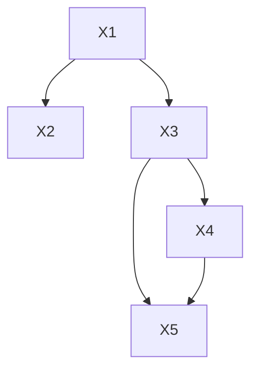

> 图 5.1 对每个缺失的链接使用两个回归函数可检验模型（式（5.3））

### 5.2.2 检验可检验性

在线性结构方程模型中，变量之间的因果关系可以用带系数的有向图表示，有些系数是固定的先验知识（通常为零），有些系数是自由变化的。基于数据来检验这类模型的传统方法包括两个阶段：首先，通过迭代方式极大化拟合度（如极大似然函数）来估计自由参数（free parameter）；其次，将估计参数所隐含的协方差矩阵与样本协方差进行比较，并使用统计检验来确定后者是否源自前者（Bollen，1989；Chou and Bentler，1995）。

这种方法主要有两个缺陷：

- **缺陷一** ：如果某些参数不可识别，那么第一阶段可能无法获得稳定的参数估计值，必须放弃检验。
- **缺陷二** ：如果模型未能通过数据拟合度检验（fitness test），那么对于哪些建模假设是错误的，得到的信息很少。

例如，图 5.2 所示的路径模型中，假设 $\operatorname{cov}(\varepsilon_1, \varepsilon_2)$ 是未知的，则参数 $\alpha$ 是不可识别的，这意味着极大似然法可能无法为 $\alpha$ 找到一个合适的估计值，从而无法进入检验的第二阶段。尽管如此，如果这些模型对协方差矩阵附加限制条件——偏相关 $\rho_{XZ \cdot Y}$ 消失（ $\rho_{XZ} = \rho_{XY} \rho_{YZ}$ ），该模型的可检验性并不比那些因为 $\operatorname{cov}(\varepsilon_1, \varepsilon_2) = 0$ 、 $\alpha$ 是可识别的进而检验可继续的模型的可检验性更差。但是，具有自由参数 $\operatorname{cov}(\varepsilon_1, \varepsilon_2)$ 的模型，由于 $\alpha$ 是不可识别的，因此不能对这个限制条件进行检验。


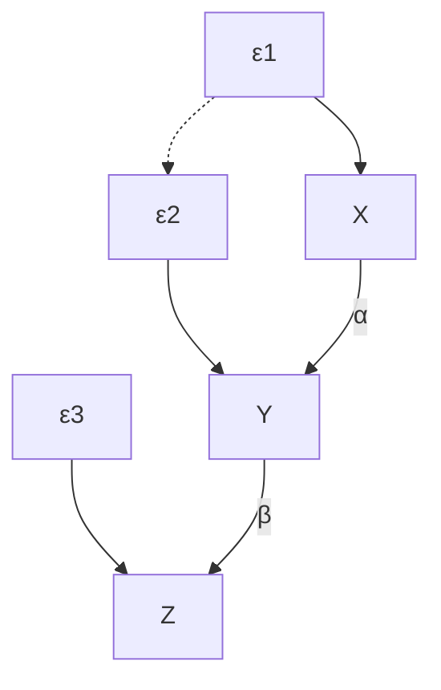

> 图 5.2 包含不可识别参数（ $\alpha$ ）的可检验模型

图 5.3 描述了与模型诊断相关的缺陷。假设真实的数据生成模型在 X 和 W 之间存在直接的因果关系，如图 5.3a 所示，而假设的模型（图 5.3b）不存在直接的因果关系。从统计学上看，两种模型的 $\rho_{XW.Z}$ 存在差异，在图 5.3b 中的 $\rho_{XW.Z}$ 应该消失，而图 5.3a 中 $\rho_{XW.Z}$ 应该是自由参数。

一旦清楚这种差异的本质，就必须确定在 X 和 W 之间添加一个链接或一个弧是否正确。然而，由于差异的影响将分散在几个协方差项上，因此全局拟 144 合度检验无法将这种差异轻松地分离出来。即使对模型的各种局部修改进行了多次拟合度检验（LISREL 给出了这样的测试），也不会有太大帮助，因为结果可能因模型不同部分的选择差异而有所偏差，例如以 $Y$ 为根节点的子图。因此，在模型调试中，对全局拟合度的检验通常很少使用。


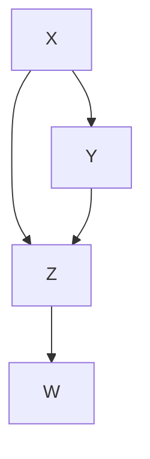


> 图 5.3 在局部检验中的不同模型， $\rho_{XWZ} = 0$

一个很好的替代全局拟合度检验的方法是 **局部拟合度检验** ，它罗列出隐含在模型中的限制条件并且逐一检验。例如，像 $\rho_{XW.Z} = 0$ 这样的约束条件可以在不测量 $Y$ 或其任何后代的情况下进行局部检验，从而防止那些与观测相关的误差干扰对 $\rho_{XW.Z} = 0$ 的检验，而这正是拟合度缺失的根本原因。

更一般地，经典的 SEM 模型经常接近于“饱和”，它只声明了一些约束条件，比如从大型的、不受限制的图中缺失一些边（edge）。针对这些约束条件的局部且直接的检验比全局检验更可靠，因为它们涉及的自由度更少，并且不会受到不相关的观测错误的影响。5.2.1 节中所描述的边缺失方法提供了一种系统的方法，用于发现和枚举模型检验时所需的局部检验。

### 5.2.3 模型等价性

在 2.3 节（定义 2.3.3）中，我们定义了两个结构方程模型，如果其中一个模型生成的每个概率分布也可以由另一个模型生成，则这两个模型是 **观测等价的** 。在标准 SEM 中，假设模型是线性的，数据由协方差矩阵表示。因此，如果这样的两个模型是 **协方差等价的** （covariance equivalent），即如果一个模型（通过某种参数选择）生成的每个协方差矩阵也可以由另一个模型生成，那么这两个模型在观测上是不可区分的。可以很容易地证明将定理 1.2.8 的等价准则推广到协方差等价。


#### 定理 5.2.6

当且仅当两个马尔可夫线性正态模型包含相同的零偏相关集时，这两个模型是协方差等价的。此外，当且仅当这两个模型所对应的图具有相同的边集和 v-结构集时，这两个模型是协方差等价的。

定理 5.2.6 的前一部分定义了马尔可夫模型可检验性蕴含的内容。它表明，在非干 145 预研究中，马尔可夫结构方程模型除了 $d$ -分离检验所揭示的零偏相关外，不能对其他任何特征进行检验。它还提供了另一个简单的等价性检验方法，即不需要检查所有的 $d$ -分离条件，只需比较相应的边及其方向。

在半马尔可夫模型（带关联误差的有向无环图）中， $d$ -分离对于检验独立性仍然有效（参见定理 5.2.3），但独立性等价不再意味着观察等价（observational equivalence）。两个包含观测变量之间的相同零偏相关系数的模型，可能会对（某些）协方差矩阵施加不同的不等式约束。尽管如此，定理 5.2.3 和 5.2.6 仍然为检验等价性提供了必要的条件。

## 生成等价模型

只要 **v-结构集** 没有被破坏或新建，我们就可以基于 **定理 5.2.6** ，通过箭头反转生成任何马尔可夫模型的等价模型（equivalent model）。Meek（1995）和 Chickering（1995）证明了当且仅当 $X$ 的所有父节点都是 $Y$ 的父节点时， $X \rightarrow Y$ 可以被 $X \leftarrow Y$ 代替 $^{②}$ 。他们还证明了，对于任何两个等价模型，总存在某些边反转序列将一个模型变为另一个模型。这一简单的边反转规则与 Stelzl（1986）和 Lee 与 Hershberger（1990）所提出的一致。

> - Verma 和 Pearl（1990）基于非参数模型给出了一个例子。此外，Richardson 用不包含关联误差的线性模型设计了一个例子（Spirtes and Richardson，1996）。

在半马尔可夫模型中，生成等价模型的规则更复杂。尽管如此， **定理 5.2.6** 给出了一套基于图的实用方法以检验边替换规则的正确性。基本原理是，如果我们把每个双向弧 $X \leftrightarrow Y$ 看作存在一个潜在共因的 $X \leftarrow L \rightarrow Y$ ，那么定理 5.2.6 中的“当”部分仍然有效。也就是说，任何不破坏或创建 $\nu$ -结构的边替换操作都是允许的。

因此，例如，当 $X$ 和 $Y$ 没有其他潜在的或可观测的父节点时，可以用双向弧 $X \leftrightarrow Y$ 代替边 $X \rightarrow Y$ 。同样地，当 $X$ 和 $Y$ 没有潜在的父节点，并且任何一个 $X$ 或 $Y$ 的父节点都是这两个节点的父节点时，可以用双向弧 $X \leftrightarrow Y$ 来代替边 $X \rightarrow Y$ 。这样的替换不会引入新的 $\nu$ -结构。

然而，由于 $\nu$ -结构当前可能包含潜在变量，因此我们容许某些 $\nu$ -结构的创建或破坏，只要这不影响观测变量之间的偏相关性。 **图 5.4a** 举出了可容许的某些 $\nu$ -结构创建的例子。通过反转箭头 $X \rightarrow Y$ ，我们得到两个汇聚箭头 $Z \rightarrow X \leftarrow Y$ ，其两头尾部节点不是直接相连的，而是通过一个潜在的共同原因连接起来。这是可容许的，因为尽管在 $X$ 处会截断路径 $(Z, X, Y)$ ，但 $Z$ 和 $Y$ 之间（通过弧 $Z \leftrightarrow Y$ ）的连接仍然是畅通的，更确切地说，它不能被任何一组观测变量所阻断。


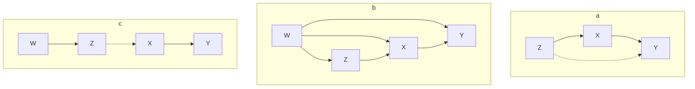

> **图 5.4** 允许 (a 和 b) 和不允许 (c) 反转 $X \rightarrow Y$ 的不同模型示例

我们可以通过泛化 **v-结构** 这一概念来进一步推广这一原则。在马尔可夫模型中，v-结构被定义为两个尾部节点没有连接的汇聚箭头，现在我们将 v-结构定义为任何两个尾部节点是“可分离的”汇聚箭头。我们所说的可分离是指存在一个条件集合 $S$ ，它能够 **d-分离** 两个尾部节点。很明显，如果两个尾部节点用箭头或双向弧连接在一起，它们就无法分离。但是，半马尔可夫模型中的一对节点即使没有一条边连接，也可能是不可分离的（Verma and Pearl, 1990）。针对这种泛化机制，我们可以对边替换的必要条件进行如下说明。

- **规则 1** ：只有当 $X$ 的每个邻居节点或父节点都与 $Y$ **不可分离** 时， $X \to Y$ 才可以与 $X \leftrightarrow Y$ 互换。（ $X$ 的邻居节点是指，通过一条双向弧连接到 $X$ 的节点。）
- **规则 2** ：只有当 $Y$ 的每一个邻居节点或父节点（不包括 $X$ ）都与 $X$ **不可分离** ，并且 $X$ 的每一个邻居节点或父节点都与 $Y$ **不可分离** 时， $X \rightarrow Y$ 才能反转为 $X \leftarrow Y$ 。

例如，考虑模型 $Z \leftrightarrow X \rightarrow Y$ 。箭头 $X \rightarrow Y$ 不能被双向弧 $X \leftrightarrow Y$ 代替，因为 $Z$ （ $X$ 的邻居）可以通过集合 $S = \{X\}$ 与 $Y$ 分离。实际上，在 $X$ 处创建的新 $\nu$ -结构将会使 $Z$ 和 $Y$ 边缘独立，这与原来的模型相反。

另一个例子是 **图 5.4a** 中的图模型。在这个图中，用 $X \leftrightarrow Y$ 或反向箭头 $X \leftarrow Y$ 替换 $X \rightarrow Y$ 是合理的，因为 $X$ 没有邻居，并且 $X$ 的唯一父节点 $Z$ 与 $Y$ 是不可分离的。这同样也适用于 **图 5.4b** ，变量 $Z$ 和 $Y$ 虽然不相邻，但它们是不可分离的，因为从 $Z$ 通过 $W$ 到 $Y$ 的路径不可能被阻断。

**图 5.4c** 给出了一个更复杂的例子，说明规则 1 和规则 2 不足以确保变换的合法性。在图 5.4 中，用 $X \leftrightarrow Y$ 替换 $X \rightarrow Y$ 似乎是合理的 $^{\ominus}$ ，因为在 $X$ 处（潜在的）v-结构被箭头 $Z \rightarrow Y$ 分流了。然而，原模型中存在一条 $Z$ 条件下从 $W$ 到 $Y$ 的 **d-连接** 路径，而变换后的模型在 $Z$ 条件下同样的路径被 **d-分离** 了。因此，偏相关 $\rho_{WY.Z}$ 在变换后的模型中消失了，而在变换前的模型中没有消失。偏相关 $\rho_{WY.ZX}$ 也出现了类似的分化情况。原模型显示，在 $\{Z, X\}$ 条件下，从 $W$ 到 $Y$ 的路径被阻断了；但是变换后的模型显示，在 $\{Z, X\}$ 条件下，该路径是 **d-连接** 的。因此，偏相关 $\rho_{WY, ZX}$ 在变换前的模型中消失，而在变换后的模型中不受约束。显然，只对 $X$ 的父节点和邻居节点进行约束是不够的， **祖代节点** （如 $W$ ）也应该考虑在内。

这些规则只是体现了 **d-分离准则** 应用于半马尔可夫模型时的一些作用。Spirtes 和 Verma（1992）给出了检验两个半马尔可夫模型 **d-分离等价性** 的充要条件。Spirtes 和 Richardson（1996）将该条件扩充到包含反馈环的模型。然而，我们应该记住，由于两个半马尔可夫模型可能是 **零偏相关等价** ，而不是协方差等价的，因此基于 **d-分离** 的准则只能作为模型等价性的 **必要条件** 。

## 等价模型的显著性

定理 5.2.6 在方法论上意义重大，因为它阐明了结构模型是“可检验的”这一说法的含义（Bollen，1989）②。它断言，我们不会检验单个模型，而是检验一类观测等价的模型，这类模型与假设的模型无法用任何统计方法区分开来。它还断言，这个等价类可以（通过检验）从图中构造出来，从而提供了多种的描述形式，供人们选择。Verma 和 Pearl（1990）（参见 2.6 节）、Spirtes 等人（1993）和 Andersson 等人（1998）提出了一个等价类中所有模型的图表示方法。Richardson（1996）讨论了带环的模型等价类的表示方法。

> - 这个引人注意的例子来自 Jin Tian，还有一个类似的例子来自两个匿名评论者。

虽然（过度识别的）结构方程模型确实具有可检验性的含义，但这些含义只是模型所表达内容的一小部分：一组断言、假定和蕴含。社会科学中，对量化方法产生怀疑和困惑的主要原因之一是无法将因果假定、统计含义和策略主张三者区分开来（Freeman, 1987, p.112；Goldberger, 1992；Wermuth, 1992）。然而，由于图模型方法能够直观地对它们进行直接区分，因此图模型有望让 SEM 更容易被广大的科研人员所接受。

总的来说，SEM 文献忽略了对等价模型的显式分析。例如，Breckler（1990）发现，在社会心理学和人格心理学领域的 72 篇文章中，只有一篇文章承认存在等价模型。一般观点是，数据拟合度和模型可识别度的组合足以验证假设模型。然而，近年来，多个等价模型的存在似乎引起了一些 SEM 学者的不安。MacCallum 等人（1993，p.198）认为“等价模型这一现象的出现对使用 CSM 的实证研究人员来说是一个值得重视的问题”，以及“对 CSM 结果解释的有效性是一种威胁”（CSM 表示“协方差结构建模”，这与 SEM 没有区别，但是一些社会科学家使用这个术语委婉地掩饰了他们模型中的因果内容）。Breckler（1990）认为“如果一个模型得到支持，那么它的所有等价模型也应得到支持”，因此他大胆提出“因果模型这个术语用词不当”。

这种极端思想是不合理的。如果我们接受因果关系不能仅从统计数据推断的事实，那么从逻辑上来说等价模型的存在是不可避免的。正如 Wright（1921）所述，在 SEM 中，“因果关系的先验知识被假定为先决条件”。但这并不意味着 SEM 作为因果模型的工具毫无用处。从基于路径图结构的定性因果前提（参见第 148 页的注①）到基于图模型系数的量化因果结论的转变，都表明 SEM 既不是毫无用处的，也不是微不足道的。例如，考虑图 5.5 中所描述的模型，Bagozzi 和 Burnkrant（1979）使用该模型来说明与等价模型有关的问题。虽然这个模型是饱和的（即恰好识别），并且它有（至少）27 个半马尔可夫等价模型，但是情感对行为的影响几乎是认知对行为影响的三倍（在标准尺度上）。这一发现仍富有启发性，如果已知一些策略是影响情感的，另一些是影响认知的，那么该发现可以告诉我们不同的策略所带来的相对有效性。当路径系数变为负数且相关系数为正数时，这种定量分析对策略分析的意义更加重大，可能对决策产生深远的影响。了解这些定量结果逻辑上是由数据和图模型中的定性前提所蕴含的，可使得决策的基础更加清晰，更便于进行辩护或批评（参见 11.5.3 节）。

综上所述，社会科学家不需要完全放弃 SEM，他们只需放弃 SEM 是一种检验因果模型的方法这一观念。SEM 是一种检验构成因果模型前提的极小部分的方法，在发现该部分与数据相容的情况下，该方法阐明了这些前提和数据必要的量化结果。接下来，SEM 的使用者应该专注于检查模型中隐含的理论前提。我们将在 5.4 节中看到，图模型方法使这些前提变得生动而精确。


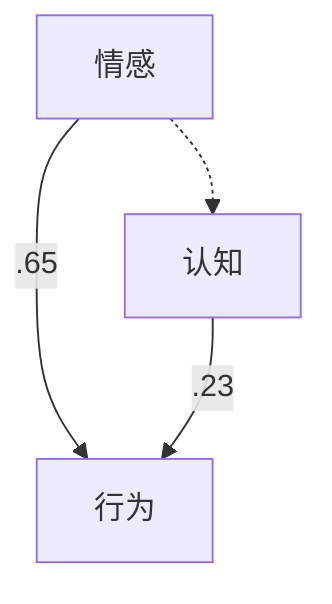

> 图 5.5 显示推导出来的定量因果信息的不可检验模型

## 5.3 图与可识别性

### 5.3.1 线性模型中的参数识别

考虑一个在路径图 $G$ 中嵌入的有向边 $X \to Y$ ，令 $\alpha$ 为该边的相关路径系数。已知回归系数 $r_{YX} = \rho_{XY}\sigma_{Y} / \sigma_{X}$ 能够分解为以下公式：

$$
r_{YX} = \alpha + I_{YX}
$$

其中， $I_{YX}$ 不是 $\alpha$ 的函数，因为它是由除了 $X \to Y$ 之外的其他连接 $X$ 和 $Y$ 的路径（这种路径既有单向弧也有双向弧）计算得出的（比如，利用 Wright 规则）。因此，如果我们从路径图中移除边 $X \to Y$ ，并发现结果子图中 $X$ 和 $Y$ 之间零相关，那么我们会得到 $I_{YX} = 0$ 且 $\alpha = r_{YX}$ 。因此， $\alpha$ 可识别。

这种蕴含关系能够以图模型的方式，通过检验子图中 $X$ 与 $Y$ 是否 $d$ -分离（通过空集 $Z = \{\varnothing\}$ ）来建立。图 5.6 演示了一个简单的识别检验：子图 $G_{\alpha}$ 中 $X$ 和 $Y$ 之间的任一路径都被汇聚箭头（converging arrow）截断， $\alpha$ 等于 $r_{YX}$ 。


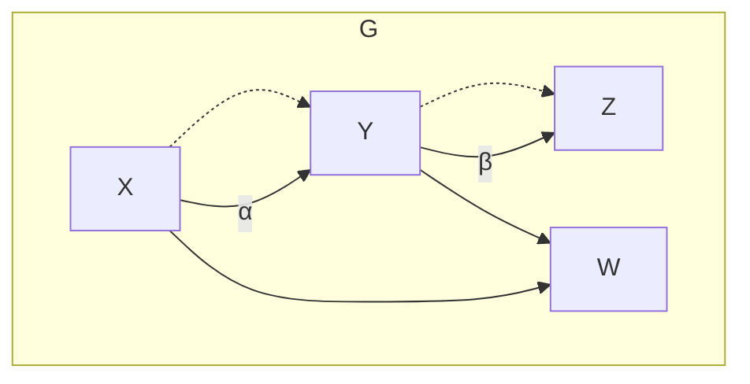

> a)


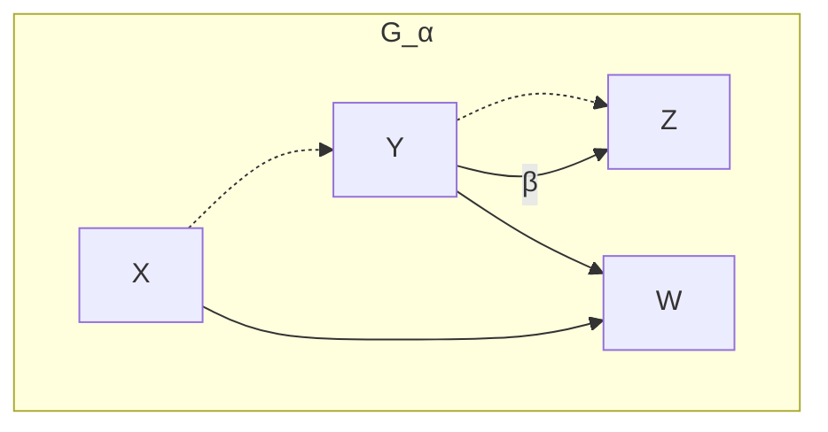

> b) 图 5.6 检验结构参数 $\alpha$ 是否与回归系数 $r_{yx}$ 相等

我们可以将这一基本思想扩展到以下情况： $I_{YX}$ 不为零，但可以通过调整任意 $X$ 与 $Y$ 之间 $d$ -连接路径上的一组变量 $Z=\{Z_{1},Z_{2},\cdots,Z_{k}\}$ 使 $I_{YX}$ 为零。

考虑偏回归系数 $r_{YX\cdot Z}=\rho_{YX\cdot Z}\sigma_{Y\cdot Z}/\sigma_{X\cdot Z}$ ，它表示 $Z$ 被“部分移除”后 $X$ 与 $Y$ 之间的残差相关性。如果 $Z$ 不包含 $Y$ 的后代，那么我们就能再次得到：

> 这个可以从以下情况看出来：当 $Y(Y=\alpha x+\sum_{i}\beta_{i}w_{i}+\varepsilon)$ 与其父节点的关系被替换到 $r_{YX.Z}$ 的表达式时，该表达式得出 $\alpha$ 再加一个涉及变量 $\{X, W_{1}, \cdots, W_{k}, Z, \varepsilon\}$ 之间的偏相关表达式 $I_{YX.Z}$ 。因为假定 $Y$ 不是这些变量的祖代节点，它们的联合密度不受 $Y$ 方程的影响。因此， $I_{YX.Z}$ 独立于 $\alpha$ 。

$$
r_{YX \cdot Z} = \alpha + I_{YX \cdot Z}
$$

其中， $I_{YX \cdot Z}$ 表示将 $\alpha$ 设为零之后的偏相关系数，即除了不存在边 $X \to Y$ 之外，其他与 $G$ 相同的图模型 $G_{\alpha}$ 中的偏相关系数。如果在 $G_{\alpha}$ 中， $Z$ $d$ -分离了 $X$ 与 $Y$ ，那么 $I_{YX \cdot Z}$ 在此类模型中确实会变为零。由此，我们得出，在原模型中 $\alpha$ 被识别并且 $\alpha$ 等于 $I_{YX \cdot Z}$ 。

此外，因为 $r_{YX \cdot Z}$ 是由 $Y$ 在 $X$ 和 $Z$ 上进行回归时 $x$ 的系数给出的，所以 $\alpha$ 可以通过以下回归函数进行估计：

$$
y = \alpha x + \beta_{1} z_{1} + \dots + \beta_{k} z_{k} + \varepsilon
$$

此结果为在 5.1.3 节中提出的问题——什么构成了一组适当的回归变量（regressor）？什么情况下回归系数能够提供对路径系数的一致性估计？——给出了一个简单的基于图模型的答案。答案归纳为以下定理：

> ⊖ Pearl（1998a）和 Spirtes 等人（1998）提到了这个结果。


#### 定理 5.3.1（直接效应的单门准则）

令 $G$ 为任意路径图，其中 $\alpha$ 为边 $X \to Y$ 的路径系数，并且设 $G_{\alpha}$ 为从 $G$ 中删除 $X \to Y$ 后得到的路径图。如果存在一组变量 $Z$ ，满足（i） $Z$ 不包含 $Y$ 的后代节点，（ii） $Z$ 在 $G_{\alpha}$ 中将 $X$ 与 $Y$ $d$ -分离，则系数 $\alpha$ 是可识别的。如果 $Z$ 满足这两个条件，那么 $\alpha$ 就等于回归系数 $r_{YX \cdot Z}$ 。反之，如果 $Z$ 不满足这些条件，那么 $r_{YX \cdot Z}$ 就不是 $\alpha$ 的一致性估计（除了少数等于 0 的情况）。

定理 5.3.1 的使用方法如下所示。考虑图 5.7 中的图模型 $G$ 和 $G_{\alpha}$ 。在 $G_{\alpha}$ 中，连接 $X$ 和 $Y$ 的唯一路径是遍历 $Z$ 的路径，由于该路径被 $Z$ $d$ -分离（阻断），因此 $\alpha$ 是可识别的，得到 $\alpha = r_{YX \cdot Z}$ 。当然，系数 $\beta$ 是可识别的，因为 $Z$ 在 $G_{\beta}$ 中与 $X$ （通过空集 $\varnothing$ ） $d$ -分离，因此 $\beta = r_{XZ}$ 。

请注意，这种“单门”检验与用于总效应检验的后门准则略有不同（定义 3.3.1）。这里的集合 $Z$ 必须阻断所有从 $X$ 到 $Y$ 的间接路径，而不仅仅是后门路径。条件（i）对于这两种情况都是相同的，因为如果 $X$ 是 $Y$ 的父节点，那么 $Y$ 的每个后代节点也必须是 $X$ 的后代节点。


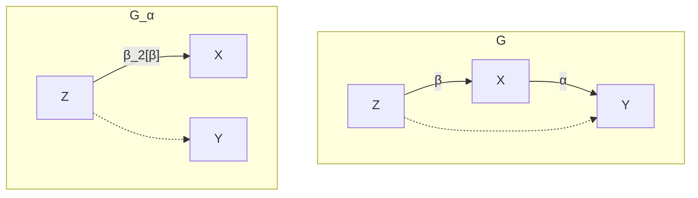

> **图 5.7** 通过 $G_{\alpha}$ 识别得出 $\alpha$ 等于 $r_{YX - Z}$ （定理 5.3.1）

现在，我们通过对总效应（而不是直接效应）的识别延伸到对结构参数的识别。考虑图 5.8 中的图 $G$ 。如果我们通过删除链接 $X \rightarrow Y$ 形成图 $G_{\alpha}$ ，那么我们会观察到不存在节点集合 $Z$ $d$ -分离所有从 $X$ 到 $Y$ 的路径。如果 $Z$ 包含 $Z_{1}$ ，则路径 $X \rightarrow Z_{1} \leftrightarrow Y$ 通过 $Z_{1}$ 处的汇聚箭头而不会被阻断 $^{①}$ 。如果 $Z$ 不包含 $Z_{1}$ ，则路径 $X \rightarrow Z_{1} \rightarrow Y$ 不会被阻断。因此，我们得出结论： $\alpha$ 不能用我们之前的方法进行识别。

但是，假设我们感兴趣的是 $X$ 对 $Y$ 的总效应，它由 $\alpha + \beta \gamma$ 得出（参见图 5.8）。对于这个由 $r_{YX}$ 确定的和式，除了从 $X$ 到 $Y$ 的路径外，其他路径对 $r_{YX}$ 没有影响。然而，我们在图中看到两条称为混杂或后门的路径，即 $X \leftarrow Z_{2} \rightarrow Y$ 和 $X \leftarrow \rightarrow Z_{2} \rightarrow Y$ 。幸运的是，这些路径被 $Z_{2}$ 阻断，因此我们可以得出结论，调整 $Z_{2}$ 将得到一个可识别的 $\alpha + \beta \gamma$ 。于是，我们得出：

> $^{①}$ 即 $X$ 和 $Y$ 之间产生了新路径。——译者注

$$
\alpha + \beta \gamma = r_{YX \cdot Z_{2}}
$$

整个推理过程是基于定义 3.3.1 的后门准则完成的，为了完整性，我们在此重申该准则。


#### 定理 5.3.2（后门准则）

对于因果图 $G$ 中的任意两个变量 $X$ 和 $Y$ ，如果存在一组观测变量 $Z$ ：

1.  $Z$ 中没有成员是 $X$ 的后代节点。
2.  从 $G$ 中删除所有从 $X$ 引出的箭头得到子图 $G_{X}$ ，在 $G_{X}$ 中 $Z$ d-分离 $X$ 与 $Y$ 。

那么， $X$ 对 $Y$ 的 **总效应** 是可识别的。

此外，如果这两个条件同时满足，那么 $X$ 对 $Y$ 的总效应为 $r_{YX \cdot Z}$ 。

---

正如我们在 3.3.1 节中所看到的，定理 5.3.2 的两个条件在非线性非高斯模型以及带离散变量的模型中都是有效的。该检验确保在对 $Z$ 校正后，变量 $X$ 和 $Y$ 无法通过混杂路径进行关联，即回归系数 $r_{YX \cdot Z}$ 等于总效应。

事实上，我们可以把定理 5.3.1 和 5.3.2 看作以下形式的特例：为了识别任何一个 **偏效应** （partial effect），其定义为所选择的一组从 $X$ 到 $Y$ 的因果路径，我们应该找得到一个观测变量集合 $Z$ ，它阻断了 $X$ 和 $Y$ 之间所有其他没有被选择的路径，那么偏效应将等于回归系数 $r_{YX \cdot Z}$ 。

图 5.8 表明，某些情况下总效应可以直接从图模型中确定，而不必识别其局部成分。标准的 SEM 方法（Bollen，1989；Chou and Bentler，1995）侧重于对单个参数的识别和估计，但可能忽略了对效应的识别和估计。如图 5.8 所示，尽管有些局部成分未被识别，但仍能可靠地对效应进行估计。

有些总效应不能作为一个整体直接确定，而需要分别对其每个局部成分进行确定。

例如，在图 5.7 中， $Z$ 对 $Y( = \alpha \beta)$ 的效应不满足后门准则，但这种效应可以通过对其局部成分 $\alpha$ 和 $\beta$ 来确定，它们分别满足后门准则，计算得到：

$$
\beta = r_{XZ}, \quad \alpha = r_{YX \cdot Z}
$$


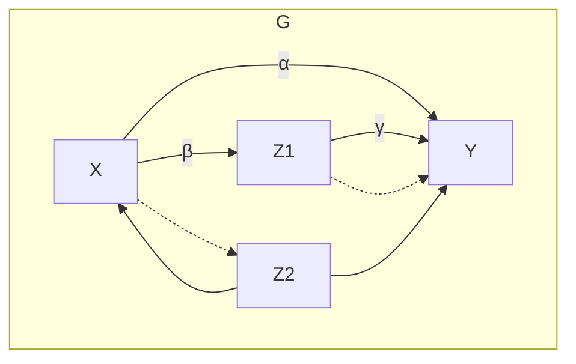

> $G$


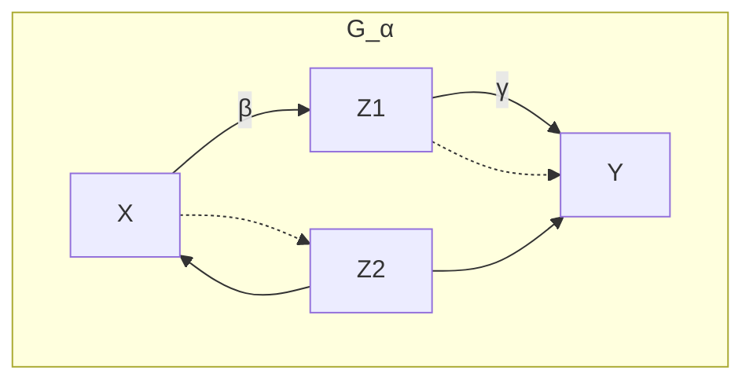

> $G_{\alpha}$


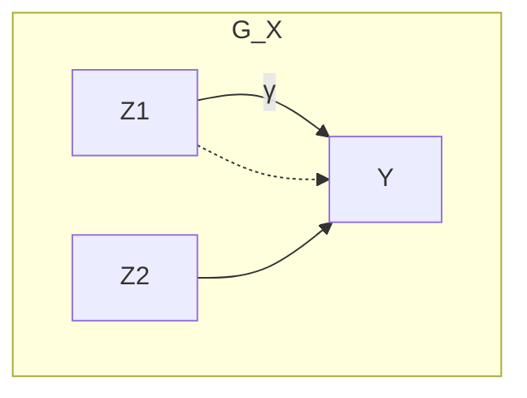

> $G_{X}$  
>  **图 5.8** 用图模型识别 $X$ 对 $Y$ 的总效应，得到 $\alpha + \beta\gamma = r_{YX} \cdot z_{1}$

---

还存在第三种因果参数：它既不能直接确定，也不能通过它的局部成分来确定，而是需要对更大范围的因果效应进行评估。图 5.9 中的结构就是这种情况的一个例子。参数既不能直接确定，也不能从其局部成分确定（它没有局部成分），但可以从 $\alpha \beta$ 和 $\beta$ 确定，它们分别代表 $Z$ 对 $Y$ 的效应和 $Z$ 对 $X$ 的效应。这两个效应都可以直接确定，因为 $Z$ 到 $Y$ 或 $X$ 都没有后门路径。因此， $\alpha \beta = r_{YZ}$ 和 $\beta = r_{XZ}$ ，即 $\alpha = r_{YZ} / r_{XZ}$ 。这就是我们所熟悉的 **工具变量公式** （Bowden and Turkington，1984；参见 3.5 节的式（3.46））。

图 5.10 中的示例结合了迄今为止所涉及的所有三种方法。 $X$ 对 $Y$ 的总效应由 $\alpha\beta + \gamma\delta$ 给出，它是不可识别的，因为它不符合后门准则，也不是另一个可识别结构的一部分。然而，假设我们希望估计 $\beta$ 。在条件 $Z$ 下，我们阻断所有经过 $Z$ 的路径，并得到 $\alpha\beta = r_{YX \cdot Z}$ ，它是通过对 $W$ 校正后 $X$ 对 $Y$ 的效应。因为从 $X$ 到 $W$ 没有后门路径， $\alpha$ 本身直接等于 $\alpha = r_{WX}$ ，所以我们得到：

$$
\beta = r_{YX \cdot Z} / r_{WX}
$$

另一方面，可以通过在条件 $X$ 下直接对 $\gamma$ 评估（从而阻断所有通过 $X$ 从 $Z$ 到 $Y$ 的后门路径），得到

$$
\gamma = r_{YZ \cdot X}
$$


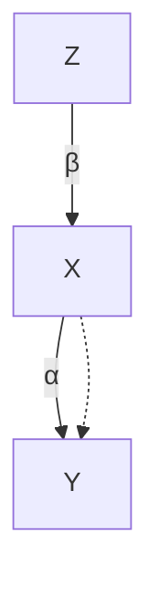


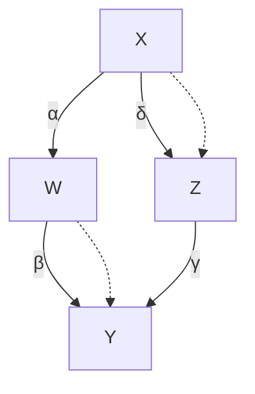

> 图 5.9 利用工具变量 Z 识别图模型参数 $\alpha$  
> 图 5.10 图模型中对参数 $\alpha$ ， $\beta$ 和 $\gamma$ 的识别

针对上述使用的方法，我们给出了以下用于识别图模型中可识别的系数的完整过程。

1.  **首先** ，使用后门准则和定理 5.3.1，在图中寻找每对变量之间可识别的因果效应。这些效应可以是直接效应、总效应或部分效应（即由特定变量集合校正的效应）。
2.  **其次** ，对于任何一个通过以上方式识别的效应，将其所涉及的路径系数保存至一个称为“桶”的集合中 $^{①}$ 。
3.  **然后** ，按照以下步骤对桶中的系数进行标记：

> $^{①}$ 不同的路径系数保存至不同的桶。——译者注

(a) 如果一个桶只含一个例项（singleton），则将其系数标记为 **I** （表示可识别）。  
 (b) 如果一个桶不止一个例项，但只包含一个未标记的系数（包括其他桶里已标记的），则将该系数标记为 **I** 。

4.  **重复** 这个过程，直到不再有新的标记出现。
5.  **最后** ，列出所有被标记的系数，它们都是可识别的。

刚才描述的过程是不完整的，因为我们一次只标记一个系数，这可能导致我们漏掉某些标记。如图 5.11 所示，从 $(X,Z)$ 、 $(X,W)$ 、 $(X',Z)$ 和 $(X',W)$ 变量对开始，我们依次发现 $\alpha, \gamma, \alpha'$ 和 $\gamma'$ 都是可识别的。


```mermaid
graph TD
    X --α--> Z
    X_prime["X'"] --α_prime["α'"] --> Z
    X --γ--> W
    X_prime --γ_prime["γ'"] --> W
    Z --β--> Y
    W --δ--> Y
    Z -.-> Y
    W -.-> Y
```

> 图 5.11 用两组工具变量识别 $\beta$ 和 $\delta$

轮到 $(X,Y)$ 时，我们发现 $\alpha\beta + \delta\gamma$ 是可识别的。同样，从 $(X',Y)$ 中我们可以得出 $\alpha' \beta + \gamma' \delta$ 是可识别的。通过我们设定的标记规则，不能直接标记 $\beta$ 或 $\delta$ ，但是我们可以通过这两个方程解出未知系数 $\beta$ 和 $\delta$ ，只要行列式 $\left| \begin{array}{cc}\alpha & \gamma \\ \alpha' & \gamma' \end{array} \right|$ 非零。由于我们不是对某个点上的可识别性感兴趣，而是对“几乎所有地方”的可识别性感兴趣（Koopmans et al., 1950；Simon, 1953），因此我们不需要计算这个行列式。我们只需检查行列式中行的符号形式，以确保方程是非冗余的。每一行中都对未标记的系数增加一个新的约束条件，该约束条件中至少包含一个标记过的系数的值。

利用冗余检测方法，我们可以通过添加以下规则来增强我们标记过程的能力：

3\*. 如果存在 $k$ 个非冗余桶，它们最多包含 $k$ 个未标记的系数，则标记这些系数并继续。

另一种增强标记过程能力的方法是，根据 Wright 的规则，不仅列出可识别的效应，还列出由双向弧引起的相关性表达式。最终，可以尝试联合列出多个变量的效应，如 4.4 节所述。然而，这种增强方式会使过程变得更加复杂，并可能偏离我们的主要目标，即提供一种方法，能够快速检测给定模型中已识别的系数，并能够立刻发现模型中那些影响目标变量可识别性的特征。现在，我们将这些结果与（如 3.3 节中处理的那些）非参数模型中的识别联系起来。

### 5.3.2 与非参数识别的比较

对于非参数模型，前一节的识别结果比第 3、4 章的识别结果要强大得多。由于实践和概念上的原因，对非参数模型的研究是由参数模型的建模者提出来的。

在实践方面，研究人员经常发现很难说明为什么要假设线性和正态分布（或其他函数分布假设），特别是涉及离散变量的时候。由于非参数结果对非线性函数和任何误差分布都是有效的，因此有了这些结果，我们就可以衡量标准技术对线性和正态性假设的敏感性。

在概念方面，非参数模型阐明了结构方程和代数方程之间的区别。寻找类似于路径系数的非参数因子，就可以明确路径系数的真正含义，为什么人们应该努力识别它们，以及为什么结构模型不仅仅是描述协方差信息的便捷方法。

在本节中，我们将非参数因果效应识别问题（第 3 章）映射到线性模型的参数识别环境中。

## 参数 vs 非参数模型：一个例子

考虑一组结构方程：

$$
x = f_{1}(u, \varepsilon_{1}) \tag{5.4}
$$

$$
z = f_{2}(x, \varepsilon_{2}) \tag{5.5}
$$

$$
y = f_{3}(z, u, \varepsilon_{3}) \tag{5.6}
$$

其中 $X$ 、 $Z$ 、 $Y$ 是观测变量， $f_{1}$ 、 $f_{2}$ 、 $f_{3}$ 是任意未知函数， $U$ 、 $\varepsilon_{1}$ 、 $\varepsilon_{2}$ 、 $\varepsilon_{3}$ 是不可观测变量，我们可以把它们看作潜在变量或干扰变量。为了便于讨论，我们假设 $U$ 、 $\varepsilon_{1}$ 、 $\varepsilon_{2}$ 、 $\varepsilon_{3}$ 是相互独立和任意分布的。这些关系可以用图 5.12 中的路径图来表示。

问题如下：我们已经得到了一系列由式（5.4）～（5.6）所定义的过程独立的样本，并记录了观测变量 $X$ 、 $Z$ 、 $Y$ 的值。现在，我们希望尽可能地估计模型中未知的变量。


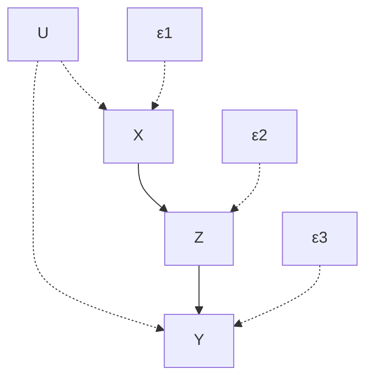

> **图 5.12** 与式（5.4）～（5.6）对应的路径图，其中 $\{X, Z, Y\}$ 都是可观测的， $\{U, \varepsilon_{1}, \varepsilon_{2}, \varepsilon_{3}\}$ 都不可观测。

为了使问题的范围更明确，我们考虑一组线性结构方程，见下式：

$$
x = u + \varepsilon_{1} \tag{5.7}
$$

$$
z = \alpha x + \varepsilon_{2} \tag{5.8}
$$

$$
y = \beta z + \gamma u + \varepsilon_{3} \tag{5.9}
$$

其中 $U$ 、 $\varepsilon_{1}$ 、 $\varepsilon_{2}$ 、 $\varepsilon_{3}$ 是不相关的，且零均值干扰。不难看出，参数 $\alpha$ 、 $\beta$ 和 $\gamma$ 可以由观测变量 $X$ 、 $Z$ 和 $Y$ 之间的相关性唯一确定。这种识别方法已经在图 5.7 的例子中展示了，利用后门准则得出：

$$
\beta = r_{Y Z \cdot X}, \quad \alpha = r_{Z X} \tag{5.10}
$$

并且，由此得出：

$$
\gamma = r_{Y X} - \alpha \beta \tag{5.11}
$$

因此，回到模型的非参数版本，很容易得出这样的结论：要想识别模型，必须从数据中唯一确定函数 $\{f_1, f_2, f_3\}$ 。然而，这很难实现，因为函数和分布之间的映射是多对一的。换句话说，对于任何非参数模型 $M$ ，存在无穷多个与给定分布 $P(x, y, z)$ 相容的函数 $\{f_1, f_2, f_3\}$ （参见图 1.6）。因此，似乎没有什么有用的信息可以从这种不明确的模型中推断出来，比如由式（5.4）～（5.6）给出的一个模型。

然而，即使在线性模型中，识别本身也不是最终目的。相反，它是用来回答预测和控制等实际问题的。关键问题不在于我们是否能够通过数据识别方程的形式，而在于我们是否能够通过数据对那些以往由参数模型解决的问题给出明确的回答。

当严格使用根据式（5.4）～（5.6）所定义的模型进行预测时（即以一组变量的观测值来确定另外一些变量取值的概率），识别问题则失去了很多（即使不是全部）重要意义。所有的预测值都可以直接从协方差矩阵或这些协方差样本估计中估算出来。如果进行降维（例如，改进估计精度），那么协方差矩阵可以用一组联立方程模型（simultaneous equation model）描述。

例如，在式（5.7）～（5.9）所定义的线性模型 $M$ 中， $X$ 、 $Y$ 和 $Z$ 之间的相关性很可能由以下模型 $M'$ 表示（图 5.13）：

$$
x = \varepsilon_{1} \tag{5.12}
$$

$$
z = \alpha^{\prime} x + \varepsilon_{2} \tag{5.13}
$$

$$
y = \beta^{\prime} z + \delta x + \varepsilon_{3} \tag{5.14}
$$

该模型与式（5.7）～（5.9）所定义的模型 $M$ 具有同样的紧凑性，就观测变量 $X$ 、 $Y$ 、 $Z$ 而言，该模型与 $M$ 是协方差等价的。设 $\alpha' = \alpha$ 、 $\beta' = \beta$ ，以及 $\delta = \gamma$ 时，模型 $M'$ 将得到与式（5.7）～（5.9）模型相同的概率预测值。尽管如此，当将这两个模型视为数据生成机制时，这两个模型并不等价。各自描述了一个关于生成 $X$ 、 $Y$ 和 $Z$ 数据过程的不同的故事。因此，在这些过程中施加外部干预，对其所导致的变化的预测结果自然也是不同的。


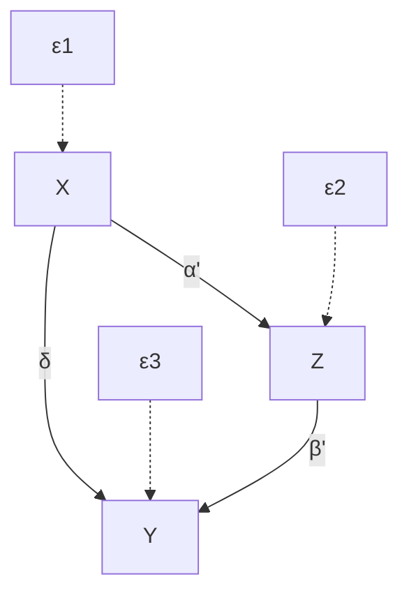

> **图 5.13** 代表式（5.12）～（5.14）中模型 $M'$ 的图。

### 5.3.3 因果效应：SEM 的干预解释

模型 $M$ 和 $M'$ 之间的差异精确地说明了联立方程模型的结构解读在什么地方起作用，以及为什么即使是羞于谈论因果的研究人员也认为结构参数比协方差和其他统计参数更“有意义”。

由式（5.12）～（5.14）定义的模型 $M'$ 将 $X$ 作为决定 $Y$ 值的直接因素，而由式（5.7）～（5.9）定义的模型 $M$ 将 $X$ 看作一个间接因素，它对 $Y$ 的效应是通过 $Z$ 来进行校正的。这种差异并不会在数据本身表现出来，而会表现在外部干预发生时数据的变化方式上。

例如，假设对 $X$ 进行干预并将其固定在某个常数 $x$ 上，我们希望能够预测这时 $Y$ 的期望值，记作 $E(Y \mid do(X = x))$ 。在 $X = x$ 代入式（5.13）和（5.14）后，模型 $M'$ 得出：

$$
E[Y \mid do(X = x)] = E\left[\beta' \alpha' x + \beta' \varepsilon_2 + \delta x + \varepsilon_3\right] \tag{5.15}
$$

$$
= (\beta' \alpha' + \delta)x \tag{5.16}
$$

模型 $M$ 得出：

$$
E[Y \mid do(X = x)] = E[\beta \alpha x + \beta \varepsilon_2 + \gamma u + \varepsilon_3] \tag{5.17}
$$

$$
= \beta \alpha x \tag{5.18}
$$

令 $\alpha' = \alpha$ 、 $\beta' = \beta$ ，以及 $\delta = \gamma$ （根据协方差等价性的条件，参见式（5.10）和式（5.11）），我们可以清楚地看到，这两个模型对于 $X$ 在 $Y$ 上的（总）因果效应赋予了不同的强度：模型 $M$ 预测随着 $x$ 变化一个单位量将使 $E(Y)$ 变化 $\beta \alpha$ ，而模型 $M'$ 中这个变化量为 $\beta \alpha + \gamma$ 。

在这一点上，我们不禁要问，我们是否应该先用 $x - \varepsilon_1$ 代替式（5.9）中的 $u$ ，然后再考虑式（5.17）中的期望。如果我们允许将式（5.8）代入式（5.9），就像我们在推导式（5.17）时所做的那样，那么为什么不允许式（5.7）代入式（5.9）呢？

毕竟（这是一个有争议的问题），建模者认为数学等式 $u = x - \varepsilon_1$ 是有效的，坚持这个等式没有坏处。然而，这种观点是错误的。结构方程不应当被看作一成不变的数学等式。相反，它们意味着定义一种平衡状态，当外部干预扰乱这种平衡时，平衡状态就会被打破。

事实上，结构方程模型的强大之处在于，它们不仅能够描述初始平衡状态，还能够描述对“确定哪些方程必须被改变以形成新的平衡状态”的问题所需的信息。例如，如果干预仅仅是让 $X$ 保持在 $x$ 处不变，那么方程 $x = u + \varepsilon_1$ （代表干预前确定 $X$ 的过程）应该被推翻，并用方程 $X = x$ 代替。新方程组的解代表新的平衡。

因此，结构方程区别于普通数学方程的基本特征是，结构方程代表的不是一组方程，而是多组方程，每一组方程对应于一个原始模型中所表达的方程组的子集。每一个这样的子集代表在给定的干预下某种假设的物理现实。

如果我们觉得结构方程的价值不在于对分布函数的概括，而是在于描述策略效应预测中所需的因果信息（Haavelmo，1943；Marschak，1950；Simon，1953），那么我们自然会把这种预测看作对结构系数的泛化。例如，线性模型 $M$ 中的系数 $\beta$ 的泛化可以回答以下控制性问题（control query）：“如果我们实施干预，将 $Z$ 的值从 $z$ 更改为 $z + 1$ ，那么 $Y$ 的期望值会发生什么变化？”

当然，这与观测性问题（observational query）不同：“如果我们发现 $Z$ 等于 $z + 1$ 而不是 $z$ ，那么 $Y$ 的期望值会有什么不同？”正如我们在第 1 章中讨论的，观测性问题可以直接从联合分布 $P(x, y, z)$ 找到答案，而控制性问题还需要因果信息。

结构方程通过将等式左边的变量视为结果，将右边的变量视为原因，从而将因果信息植入它们的语法中。在第 3 章中，我们用符号 $do(\cdot)$ 区分这两种类型的问题。比如，我们将受控期望（controlled expectation）写作：

$$
E(Y \mid do(x)) \triangleq E[Y \mid do(X = x)] \tag{5.19}
$$

将标准的条件期望或观测期望（observational expectation）写作

$$
E (Y \mid x) \triangleq E (Y \mid X = x) \tag {5.20}
$$

在式（5.7）～（5.9）模型中， $E(Y|do(x))=\alpha\beta x$ ，但是 $E(Y|x)=r_{YX}x=(\alpha\beta+y)x$ ，显然 $E(Y|do(x))$ 不等于 $E(Y|x)$ 。被动观测 $X=x$ 确实不会改变任何一个方程，这就是在取期望之前将式（5.7）和式（5.8）代入式（5.9）的理由。

在线性模型中，直接控制问题的答案可以从路径（或结构）系数中找到，这些系数可以推导出任何一个变量对另一个变量的总效应。例如，式（5.7）～（5.9）定义的模型中 $E(Y|do(x))$ 的值为 $\alpha\beta x$ ，即 $x$ 乘以 $X\to Z\to Y$ 中所有路径系数的乘积。

对 $E(Y|do(x))$ 的计算在非参数情况下会更复杂，即使我们知道函数 $f_{1}$ 、 $f_{2}$ 和 $f_{3}$ 。然而，这种计算很明确，它需要求解一组修改后的方程（以计算 $Y$ 的期望值），其中 $f_{1}$ 被“擦除”， $X$ 被常数 $x$ 替代：

$$
z = f_{2} \left(x, \varepsilon_ {2}\right) \tag {5.21}
$$

$$
y = f_{3} (z, u, \varepsilon_ {3}) \tag {5.22}
$$

因此，计算 $E(Y|do(x))$ 需要对下式进行估计

$$
E (Y \mid d o (x)) = E \left\{f_{3} \left[ f_{2} \left(x, \varepsilon_ {2}\right), u, \varepsilon_ {3} \right] \right\}
$$

其中，期望值由 $U$ 、 $\varepsilon_{2}$ 和 $\varepsilon_{3}$ 确定。值得一提的是，图模型方法在不知道 $f_{2}$ 、 $f_{3}$ 和 $P(\varepsilon_2,\varepsilon_3,u)$ 的情况下就可以完成这种计算（3.3.2 节）。

这确实是非参数模型可识别性的本质。这种基于数据和图模型解决干预问题的独特能力，正是定义 3.2.3 中对因果效应 $P(y|do(x))$ 可识别性进行解释的方法。正如我们在第 3 章和第 4 章中所看到的，这种能力几乎只需要看一眼，就能够从方程所对应的图模型中辨析出来。

## 5.4 部分概念基础

### 5.4.1 结构参数真实意味着什么

每一个 SEM 的学生都在他（或她）的职业生涯中遇到过这样的悖论。如果我们将方程

$$
y = \beta x + \varepsilon
$$

的系数 $\beta$ 解释为当 X 单位变化时 $E(Y)$ 的变化量，那么，将方程重写为

$$
x = (y - \varepsilon) / \beta
$$

之后，我们应该把 $1 / \beta$ 解释为当 $Y$ 单位变化时 $E(X)$ 的变化量。但这既与直觉相悖，也与模型的预测值矛盾：如果 $Y$ 在原来关于 $X$ 的结构方程中没有作为自变量出现，那么当 $Y$ 单位变化时， $E(X)$ 的变化应该为零。

讲解 SEM 的老师一般通过两种方法来回避这种困境。一种方法是否认 $\beta$ 有任何因果意义，它只用于纯粹的统计解释，其中 $\beta$ 度量了由 X 变化所导致的 Y 的变化（例如，参见文献（Muthen, 1987））。另一种方法只允许对那些满足“隔离”条件的系数进行因果解读（Bollen, 1989; James et al., 1982），即解释变量（explanatory variable）必须与方程中的误差不相关。由于 $\varepsilon$ 不可能与 X 和 Y 都不相关（或者就像争论的那样），因此 $\beta$ 和 $1/\beta$ 不可能都有因果意义，悖论也就消失了。

第一个方法是自洽的，但它违背了 SEM 提出者的意图（即 SEM 用于辅助策略的制定），并且也与大多数 SEM 使用者的直觉冲突。第二个方法在逻辑上有些问题。众所周知，每一对二元正态变量（bivariate normal variable）X 和 Y 都可以用两种等价的方式表示

$$
y = \beta x + \varepsilon_ {1} \text {和} x = \alpha y + \varepsilon_ {2}
$$

其中， $\operatorname{cov}(X, \varepsilon_1) = \operatorname{cov}(Y, \varepsilon_2) = 0$ 以及 $\alpha = r_{XY} = \beta \sigma_X^2 / \sigma_Y^2$ 。因此，如果条件 $\operatorname{cov}(X, \varepsilon_1) = 0$ 赋予 $\beta$ 因果意义，那么 $\operatorname{cov}(Y, \varepsilon_2) = 0$ 也应该赋予 $\alpha$ 因果意义。但是这也与直觉和 SEM 背后的意图矛盾。如果 $Y$ 对于 $X$ 没有因果关系，那么当 $Y$ 单位变化时 $E(X)$ 应该是零，而不是 $r_{XY}$ 。

那么结构系数到底意味着什么呢？结构方程本身呢？误差项呢？因果效应的干预解释加上 $do(x)$ 符号，为这些问题提供了清晰的答案。它们解释了结构方程的操作意义，因此，我希望，关于这些问题的争论和混乱的时代应该结束了。

#### 结构方程：操作定义


#### 定义 5.4.1（结构方程）

如果将一个方程 $y = \beta x + \varepsilon$ 理解为：在一个理想的实验中，控制变量 $X$ 等于 $x$ ，其他变量 $Z$ （不包括 $X$ 或 $Y$ ）等于 $z$ ， $Y$ 的值 $y$ 由 $\beta x + \varepsilon$ 给出，其中 $\varepsilon$ 不是关于 $x$ 和 $z$ 的函数，那么这个方程是 **结构化的** 。

尽管这个定义涉及控制操作，但却是可运算的，因为所有的量都是可观测的。虽然在大多数观测性研究中不能对变量进行操作，但这并不能否定该定义的可运算性，就像我们不能用肉眼观测到细菌，但并不能否定它们在显微镜下的可观测性一样。SEM 的挑战在于，从我们所能观测到的少量信息中，最大限度地提取我们所希望观测到的信息。

请注意，刚才给出的操作并没有说明，当我们控制 $Y$ 时 $X$ （或任何其他变量）会如何表现。这种不对称性使得结构方程中的等式符号与代数中的等式符号不同。前者在对 $X$ 和 $Y$ 进行观测时是对称的（例如，观察到 $Y = 0$ 蕴含 $\beta x = -\varepsilon$ ），但在进行干预时是不对称的（例如，将 $Y$ 设为零并不能告诉我们 $x$ 和 $\varepsilon$ 的关系）。路径图中的箭头明确了这一双重角色，这或许解释了通过使用图模型所获得的洞察力和推理能力。

方程 $y = \beta x + \varepsilon$ 的最强的经验结论是在等号右边排除其他变量，从而明确 $X$ 是 $Y$ 的唯一直接原因。这就转化成了一个可检验的不变性（invariance）声明：在 $do(x)$ 操作下 $Y$ 的统计值不会因对模型中其他任何变量的操作而改变（参见 1.3.2 节） $^{①}$ 。这个声明写成符号形式为：

$$
P (y \mid do(x), do(z)) = P (y \mid do(x)) \tag{5.23}
$$

该声明对所有与 $\{X \cup Y\}$ 不相交的集合 $Z$ 都成立 $^{②}$ 。相反，回归方程没有任何类似的声明。

> $^{①}$ 结构方程对系统中的某一改变保持不变性的基础概念可以追溯到 Marschak（1950）和 Simon（1953），并且它已经由 Hurwicz（1962）、Mesarovic（1969）、Sims（1977）、Cartwright（1989）、Hoover（1990）和 Woodward（1995）得出不同抽象程度的数学公式。然而，式（5.23）的简洁性、精确性和清晰性是最好的。

> $^{②}$ 这个声明实际上只是该式所传递信息的一部分；其余部分由一个动态的或者反事实的声明组成：如果我们控制 $X$ 为 $x'$ 而不是 $x$ ，那么 $Y$ 的值为 $\beta x' + \varepsilon$ 。换句话说，在对 $X$ 进行不同的假设控制，以及保持相同的外部条件（ $\varepsilon$ ）下，画出 $Y$ 的曲线，那么结果应该是一个斜率为 $\beta$ 的直线。这种关于连续控制条件下系统行为的声明，只能在 $\varepsilon$ 的假设下被检验， $\varepsilon$ 表示外部条件或者实验环境特征，当我们将 $x$ 变为 $x'$ ， $\varepsilon$ 保持不变。这种反事实声明组成了每个科学定律的经验性内容（参见 7.2.2 节）。

注意，这种不变性只适用于对 $Z$ 的操作，而不是对 $Z$ 的观测。已知观测值 $Z = z$ ，在 $do(x)$ 操作下 $Y$ 的统计值记作 $P(y|do(x),z)$ 。如果对 $Y$ 的结果（如后代节点）进行测量，那么 $Y$ 的统计值必然依赖于 $z$ 。还要注意，一般的条件概率 $P(y|x)$ 不具备如此强大的不变性，因为 $P(y|x)$ 通常对除 $X$ 以外的变量操作很敏感（除非 $X$ 和 $\varepsilon$ 是独立的）。然而，无论 $\varepsilon$ 和 $X$ 之间的统计关系如何，式（5.23）仍然有效。

若将其推广到一组结构方程，式（5.23）阐明了一个已知因果图背后的假设条件。如果 $G$ 是一组结构方程所对应的图，那么 $G$ 中的假设包括：

1. 每一个缺失的箭头（比如 $X$ 和 $Y$ 之间）都代表这样一种假设，即当我们实施干预并使 $Y$ 的父节点固定下来时， $X$ 不会对 $Y$ 产生因果效应；
2. $X$ 和 $Y$ 之间缺失的每一个双向弧都代表一个假设，即（直接）影响 $X$ 的遗漏因子（omitted factor）与（直接）影响 $Y$ 的遗漏因子之间是不相关的。

我们将在式（5.25）～（5.27）中定义后一种假设的运算意义。

## 结构参数：运算定义

如果将结构方程解释为 $Y$ 在干预条件下行为的描述，那么可以得到结构参数的一个简单的定义。方程 $y = \beta x + \varepsilon$ 中 $\beta$ 的意义为：

$$
\beta = \frac {\partial}{\partial x} E [ Y \mid d o (x) ] \tag {5.24}
$$

也就是表示在实验研究中，当外部控制将 $X$ 固定为 $x$ 时， $Y$ （对于 $x$ ）的期望变化率。无论 $\varepsilon$ 和 $X$ 在非实验研究中是否相关（比如，通过另一个方程 $x = \alpha y + \delta$ ），这种解释都成立。

此时，我们几乎不需要补充诸如 $\beta$ 与回归系数 $r_{YX}$ 无关，或者 $\beta$ 与条件期望 $E(Y|x)$ 无关这些条件，这已经在许多教科书提到了。定理 5.3.1 给出了 $\beta$ 与回归系数一致性的条件。

不过，重要的是，将式（5.24）中的定义与那些承认 $\beta$ 不变性但又难以说明 $\beta$ 对哪些变化是保持不变的理论进行比较。例如，Cartwright（1989，p.194）将 $\beta$ 描述为一种称为“容量”的自然不变量。Cartwright 正确地指出 $\beta$ 在变化环境中保持不变，但却解释道，当 $X$ 的统计值变化时，“无论方差如何变化，比率 $[\beta = E(YX) / E(X^2)]$ 都保持不变。”这种描述在两个方面是不精确的。

首先， $\beta$ 一般不等于上面的比率，也不等于任何其他统计参数的组合。第二点，也是定义 5.4.1 中的要点，结构参数对局部干预（系统中某个特定方程的变化）是不变的，并且对变量统计值的变化也是不变的。如果 $\operatorname{cov}(X, \varepsilon) = 0$ 并且我们（或大自然）对 $X$ 生成过程进行局部修改，导致 $X$ 的方差变化，那么 Cartwright 是正确的，比率 $[\beta = E(YX) / E(X^2)]$ 将保持不变。然而，如果 $X$ 的方差因为其他原因而变化，比如，因为我们观测到某些证据 $Z = z$ 并且依赖于 $X$ 和 $Y$ ，或者因为 $X$ 生成过程依赖于更多的变量集合，那么这个比率将不会保持不变。

> - 当有证据 $Z = z$ 依赖 $X$ 和 $Y$ 时， $X$ 的方差变为条件方差 $\operatorname{var}(X|z)$ ；当依赖更多变量时， $X$ 的方差会受其他变量的影响。——译者注

## 神秘的误差项：运算定义

定义 5.4.1 和式（5.24）中给出的解释为神秘的误差项提供了一个可运算的定义，即：

$$
\varepsilon = y - E [ Y \mid d o (x) ] \tag {5.25}
$$

尽管这个误差项在非干预性研究中不能被观测到，但这与一些研究人员（如 Richard (1980)、Holland (1988, p. 460)、Hendry (1995, p. 62)）提出的抽象玄奥的定义相去甚远。与回归方程中的误差不同， $\varepsilon$ 测量的是 $Y$ 与受控期望 $E[Y|do(x)]$ 的偏差，而不是与条件期望 $E[Y|x]$ 的偏差。因此，一旦控制了 $X$ ，就可以通过对 $Y$ 的观测来测量 $\varepsilon$ 的统计值。另一方面，因为不管 $X$ 是被控制还是被观测， $\beta$ 都是不变的，所以如果我们知道 $\beta$ ，那么 $\varepsilon = y - \beta x$ 的统计值就可以从观测性研究中测量出来。

同样，误差之间的相关性也可以通过经验值进行估计。对于任意两个不相邻的变量 $X$ 和 $Y$ ，从式（5.25）中可以得出：

$$
E [ \varepsilon_ {Y} \varepsilon_ {X} ] = E [ Y X \mid d o (p a_{Y}, p a_{X}) ] - E [ Y \mid d o (p a_{Y}) ] E [ X \mid d o (p a_{X}) ] \tag {5.26}
$$

一旦我们确定结构系数，那么受控期望 $E[Y|do(pa_{Y})]$ 、 $E[X|do(pa_{X})]$ 和 $E[YX|do(pa_{Y},pa_{X})]$ 就成为已知的关于观测变量 $pa_{Y}$ 和 $pa_{X}$ 的线性函数。因此，对式（5.26）等号右边的期望可以通过观测研究进行估计。相反，如果系数不确定，则可以在干预研究中，通过固定 $pa_{X}$ 和 $pa_{Y}$ 的值（假设 X 和 Y 不是父子关系），并基于在这种情况下所获得的数据估计 X 和 Y 的协方差，来直接评估表达式（5.26）。

最后，我们通常感兴趣的不是评估值 $E[\varepsilon_{Y}\varepsilon_{X}]$ ，而是确定 $\varepsilon_{Y}$ 和 $\varepsilon_{X}$ 是否可以被认为是无须校正的。对于这个判定，只要检验：

$$
E [ Y \mid x, d o (s_{X Y}) ] = E [ Y \mid d o (x), d o (s_{X Y}) ] \tag {5.27}
$$

是否成立，其中 $s_{XY}$ 表示模型中除 $X$ 和 $Y$ 外的所有变量的任意组合。该检验适用于模型中任意两个变量，但当 $Y$ 是 $X$ 的父代变量时除外，这时可采用其对称的方程（ $X$ 和 $Y$ 互换）②。

## 神秘的误差项：概念解释

162SEM 教科书的作者通常把误差项解释为遗漏因子的作用。然而，许多 SEM 研究人员不愿意接受这种解释，部分原因是未指明的遗漏因子为难以实证的推测打开了大门，部分原因是基于这些因素的一些结论被不恰当地作为从路径图中省略双向弧通常用到空洞无意义的理由（McDonald，1997）。这些关心的问题可以通过对误差项（5.25）的运算解读进行回答，因为它说明了如何测量误差，而不是说明误差是如何产生的。

但是，需要注意的是，在决定是否可以假设每对误差项是未修正的时，这个操作性定义并不能代替遗漏因子的概念。由于在模型参数仍是“自由”的阶段需要这样的决定，因此它们不能基于相关性的数值评估，而必须建立在定性结构知识的基础上，即有关机制如何联系在一起以及变量如何相互影响这些定性结构知识。这类判断性的决定很难运用式（5.26）中的运算法则，该法则指导研究人员评估两种偏差，即在复杂的实验条件下两个不同变量之间的偏差是相关的还是未修正的。这种评估在认知上是不可行的。

相比之下，遗漏因子这一概念指导研究人员判断是否存在同时影响几个观测变量的因素。这样的判断符合认知，因为它们是定性的，并且依赖纯粹的结构知识，而这些知识在建模阶段是唯一可用的知识。

研究人员应该考虑选择偏差（selection bias）是误差的另一个相关来源。如果两个不可观测的因素有一个共同的效应，而此效应在分析中被遗漏，却影响了样本的选择，那么相应的误差项在样本总体中是相关的。因此，式（5.26）中的期望不会随着样本总体的增加而趋于 0（参见 1.2.3 节对 Berkson 悖论（Berkson's paradox）的讨论）。

然而，我们应该着重指出，相比在图模型中出现的弧，图模型中 **缺失的弧** 更需要引起极大的关注以及细致的实质性论证。添加一个额外的双向弧在最坏的情况下会破坏参数的可识别性，但是删除一个现有的双向弧可能会产生错误的结论，以及对模型可检验性的错误认识。因此，在默认情况下，应该假定双向弧存在于图中的任意两个节点之间。只有在理由充分的情况下，才能删除它们，例如两个变量不太可能存在共同的原因，也不太可能存在选择偏差。虽然我们永远不可能认识所有可能影响给出变量的因素，但实质性的知识有时允许我们声明，一个潜在的共同因素可能并没有那么显著的影响。

因此，就像在科学中经常发生的那样，我们测量物理实体的方法并不一定是对它们进行分析的最好方式。在构建、评估和分析因果模型时，由于针对误差项提出的遗漏因子的概念依赖结构知识，因此它比运算定义更有价值。

### 5.4.2 效应分解的解释

结构方程模型以提供区分直接效应和间接效应的原则方法而自豪，这是得到认可的。在 4.5 节中，我们已经看到这种区分在许多应用中很重要，从过程控制到法律纠纷，SEM 确实提供了一套定义、识别和估计直接和间接效应的统一方法。然而，正如 Freedman（1987）和 Sobel（1990）所指出的那样，大多数 SEM 研究人员不愿承认结构参数的因果意义，加上他们专注于代数运算，导致了对直接和间接效应的定义不充分。在本节中，我们希望通过根据结构系数的运算含义来纠正这种混淆。

163 我们从定义 3.2.1 中因果关系 $P(y|do(x))$ 的基本概念开始，然后专门对直接效应进行定义，如 4.5 节所示，最后用结构系数来表达这些定义。


#### 定义 5.4.2（总效应）

$X$ 对 $Y$ 的总效应由 $P(y|do(x))$ 给出，即当 $X$ 的值固定为 $x$ ，并且其他变量保持原有状态时 $Y$ 的分布。


#### 定义 5.4.3（直接效应）

X 对 Y 的直接效应由 $P(y \mid do(x), do(s_{XY}))$ 给出，其中 $s_{XY}$ 是系统中除 X 和 Y 之外的所有观测变量的集合。

在线性分析中，定义 5.4.2 和 5.4.3，在对 $x$ 微分后，通常定义直接和间接效应的路径系数。然而，它们在几个重要的方面与传统的定义不同。

首先，直接效应是根据假设实验来定义的，在这些实验中，中间变量是通过物理干预保持不变的，而不是通过统计校正（统计校正经常被认为与误导性的短语“控制”一样）。图 5.10 描述了一个简单的例子，其中对中间变量（ $Z$ 和 $W$ ）进行校正不会得到 $X$ 对 $Y$ 的直接效应的正确值，即零值，而 $\frac{\partial}{\partial_x} E(Y|do(x,z,w))$ 确实得出了正确值 $\frac{\partial}{\partial_x} (\beta w + \gamma z) = 0$ 。4.5.3 节（表 4.1）提供了另一个这样的例子，它涉及二分变量（dichotomous variable）。

其次，没有必要将变量的控制仅限于中间变量，系统中的所有变量都可以固定不变（ $X$ 和 $Y$ 除外）。假设，科学家控制了所有可能的条件 $S_{XY}$ ，测量也可以在不了解图结构的情况下开始。

最后，我们的定义与传统定义不同，我们将总效应和直接效应分别解释为两个不同实验的结果。教科书（例如，Bollen，1989；Mueller，1996，p.141；Kline，1998，p.175）中的定义通常将总效应等同于路径系数矩阵的幂级数。此代数定义与递归（半马尔可夫）系统中运算定义（定义 5.4.2）一致，但它在带反馈的模型中会产生错误的表达式。比如，已知方程对 $\{y = \beta x + \varepsilon, x = \alpha y + \delta\}$ ， $X$ 对 $Y$ 的总效应为 $\beta$ ，而不是像 Bollen（1989）所得出的 $\beta(1 - \alpha \beta)^{-1}$ 。后者不具备有关“ $x$ 的效应”的运算意义。

> 这个错误由 Sobel（1990）指出，但是，也许因为路径系数的恒常性是一个新的无关紧要的假设，所以 Sobel 的校正并没有带来实践或者思想上的转变。

我们在结束效应分解这部分之前，讲一点可能对那些研究二分变量的研究人员感兴趣的内容。二分变量之间的关系通常是非线性的，所以 4.5 节的结果应该是适用的。特别地，X 对 Y 的直接效应将取决于我们对 Y 的其他父节点的控制程度 $^{②}$ 。如果我们想求这些值的平均值，我们将得到式（4.11）中给出的表达式，该表达式调用嵌套反事实，并且该表达式可以约简为式（4.12）。

> ② 即后门。——译者注

我们在定义结构方程（定义 5.4.1）的经验内容时所涉及的操作方式对于线性系统来说也是充分的。在线性系统中，大多数因果量可以从实验研究的总体层面上推断出来（参见 11.7.1 节）。在非线性和非参数模型中，我们偶尔需要深入单个单元，并激活（更基本的）结构方程的反事实含义，如式（3.51）和第 173 页的注 ② 所述。

间接效应分析就是一个很好的例子，其定义（式（4.14））基于嵌套反事实，不能用总体平均数表示。对间接效应的分析是必要的，可以使间接效应具有独立于总效应和直接效应之外的运算意义（参见 11.4.2 节）。然而，借助反事实语言，我们可以给出间接效应的一个简单的运算定义： $X$ 对 $Y$ 的间接效应是在保持 $X$ 不变，并且增加中间变量 $Z$ 以相当于 $X$ 单位增加时的量的条件下， $Y$ 的增加量（正式定义见 4.5.5 节）。在线性系统中，这一定义实际上与总效应和直接效应的差值是相等的。关于间接效应在社会科学和政策分析（Pearl, 2005a）中的作用将进一步在第 11 章进行讨论。

### 5.4.3 外生性、超外生性及其他话题

经济学教科书总是告诫读者，外生变量和内生变量的区别。一方面，这种区别“对模型的构建来说是最重要的”（Darnell，1994，p.127）；另一方面，它是“一个微妙的，时常引起争议的复杂情况”（Greene，1997，p.712）。经济学专业的学生自然会希望本章所介绍的概念和工具能对这一问题有所帮助。接下来，我们将提供一个简单的外生性定义，其中包含文献中所出现的重要的细微差别，并且既让人接受又比较精确。

现在的主流研究将外生性分为三类：弱外生性、强外生性和超外生性（superexo-geneity）（Engle et al.，1983）。前两个是基于统计的，最后一个是基于因果的。然而，外生性的重要性及其引起争议的原因在于其在政策干预中的含义。因此，一些经济学家认为，只有因果属性（超外生性）才配叫作“外生性”，而统计属性则是毫无根据的，容易将识别和解释问题与估计效率问题混淆（本人与 Ed Leamer 的交流中得出的）。下面，将从因果外生性的一个简单定义开始，然后给出一个更通用的定义，其中因果和统计方面都将作为这个定义的特例。因此，这里的“外生性”对应着 Engle 等人所称的“超外生性”，这是一个反映了在政策干预中某些关系的结构不变性的概念。

假设我们考虑对一组变量 $X$ 进行干预，并且希望描述在 $do(X = x)$ 干预下结果变量 $Y$ 的统计行为。用常规的表达式 $P(y|do(x))$ 表示干预后 $Y$ 的分布。如果我们对一组该分布的参数集合 $\lambda$ 感兴趣，那么我们的任务是从可用的数据中估计 $\lambda [P(y|do(x))]$ 的值。然而，可用的数据通常是在不同的条件下生成的： $X$ 不是固定不变的，而是允许随着经济压力和预期的变化而变化，即过去的经济压力和预期的变化促使决策者设定 $X$ 。用 $M$ 表示过去生成数据的过程，用 $P_M(v)$ 表示与 $M$ 相关的概率分布，我们想知道，已知关于 $M$ 的背景知识 $T$ （表示“理论”）， $\lambda [P_M(y|do(x)]$ 是否始终能够从服从 $P_M(v)$ 分布的样本中估计出来。

这个问题在本质上就是我们在这一章和前几章中分析过的识别问题，不过有一个重要的区别就是，我们现在要问的是 $\lambda [P(y|do(x)]$ 是否可以单独从条件分布 $P(y|x)$ 中识别出来，而不是从整个联合分布 $P(v)$ 中识别出来。当识别在这个约束条件下成立时， $X$ 被认为是关于 $(Y, \lambda, T)$ 的 **外生变量** 。

我们将此形式化地表述为以下定义。


#### 定义 5.4.4（外生性）

令 $X$ 和 $Y$ 为两组变量，设 $\lambda$ 为干预后概率分布 $P(y \mid do(x))$ 的任意一组参数集合。如果 $\lambda$ 在条件分布 $P(y \mid x)$ 下是可识别的，即对任意两个满足理论 $T$ 的模型 $M_{1}$ 和 $M_{2}$ ，有

$$
P_{M_{1}}(y \mid x) = P_{M_{2}}(y \mid x) \Rightarrow \lambda[P_{M_{1}}(y \mid do(x))] = \lambda[P_{M_{2}}(y \mid do(x))] \tag{5.28}
$$

那么我们称 $X$ 是关于 $(Y, \lambda, T)$ 外生的。

当 $\lambda$ 构成一个干预后概率的完全描述的特殊情况下，式（5.28）可约简为

$$
P_{M_{1}}(y \mid x) = P_{M_{2}}(y \mid x) \Rightarrow P_{M_{1}}(y \mid do(x)) = P_{M_{2}}(y \mid do(x)) \tag{5.29}
$$

如果我们进一步假设，对于每一个 $P(y \mid x)$ ，理论 $T$ 并不排除某些满足 $P_{M_{2}}(Y \mid do(x)) = P_{M_{2}}(y \mid x)$ 的模型 $M_{2}$ ，那么式（5.29）可约简为等式

$$
P(y \mid do(x)) = P(y \mid x) \tag{5.30}
$$

我们称之为“无混杂”的条件（参见 3.3 节和 6.2 节）。式（5.30）由式（5.29）推出，因为式（5.29）对理论 $T$ 中的所有 $M_{1}$ 都成立。注意，由于没有明确限定理论 $T$ 的具体内容，式（5.30）可以应用于任何单一模型 $M$ ，并且可以作为外生性的另一个定义，尽管对于 $X$ 的要求比式（5.28）更强。

尽管边缘分布 $P(x)$ 是可用的，但坚持仅通过条件分布 $P(y \mid x)$ 识别 $\lambda$ 的动机在于其对估计过程产生的影响。如式（5.30）所述，发现 $X$ 是外生的，允许我们可以直接从被动观测中预测（对 $X$ ）干预的效应，甚至不需要校正混杂因子。我们在 3.3 节和 5.3 节的分析中进一步给出了外生性的图模型检验：如果从 $X$ 到 $Y$ 没有一条后门路径，那么 $X$ 是 $Y$ 的外生变量（定理 5.3.2）。这个检验用一个过程性定义补充了式（5.30）中的结论性定义，由此实现外生性的形式化。由于每个因果图代表一个结构模型，并且每个结构模型已经包含了政策预测所需的不变性假设（见定义 5.4.1），因此，超外生性的不变性可以从因果图的拓扑结构中分辨出来，这一点也不奇怪。

Leamer（1985）将 $X$ 定义为外生变量，前提是 $P(y \mid x)$ 在“生成 $X$ 的过程”中保持不变。这个定义与式（5.30）一致，因为 $P(y \mid do(x))$ 是由一个结构模型控制的，在该结构模型中决定 $X$ 的方程被消去，所以 $P(y \mid x)$ 必须对于这些方程变化不敏感。相比之下，Engle 等人（1983）则将外生性（即，他们所说的超外生性）定义为 $X$ “边缘密度”的变化。通常，从过程语言到统计语言的转换会导致歧义。根据 Engle 等人（1983, p. 284），外生性要求条件分布 $P(y \mid x)$ 的所有参数“对于条件变量分布的任何变化都是不变的”（即 $P(x)$ ）。在 $P(x)$ 可能发生任何变化的情况下，这种对不变性的要求过于强烈，因为改变条件或新的观测值可以很容易地改变 $P(x)$ 和 $P(y \mid x)$ ，即使 $X$ 是完全外生的。（为了说明这一点，考虑将随机实验（其中 $X$ 是外生的）转变为非随机实验的变化，我们不应该坚持 $P(y \mid x)$ 在这种变化下保持不变。）如 Leamer 所述，变化必须仅限于为确定 $X$ 的机制（或方程）所需的局部修改操作，并且该限制条件必须纳入任何外生性的定义之中。但是，为了使这个限制条件更加精确，必须在 $P(y \mid do(x))$ 的定义中使用 SEM 的词汇。边缘密度和条件密度这些词汇太粗糙，无法恰当地定义那些使 $P(y \mid x)$ 保持不变的变化。

> 比如，如果 $T$ 代表所有具有相同图结构的模型，那么 $M_{2}$ 不会先验排除。

> 前提是变化仅限于修改函数，而不更改每个函数中的参数集合（即父节点集合）。

> 即对于 $X$ 的被动变化和主动变化， $P(y \mid x)$ 都是相同的。——译者注

现在，我们准备定义一个更泛化的外生性概念，涵盖了术语“弱”外生性和“超”外生性。为此，我们从定义 5.4.4 中删除约束条件，即 $\lambda$ 必须代表干预后分布的特征。相反，我们让 $\lambda$ 代表底层模型 $M$ 的任意特征，包括路径系数、因果效应、反事实等结构特征，以及统计特征（当然，这需要单独从联合分布中确定）。通过这种泛化，我们可以得到一个更简单的外生性定义。

> 我们对“强”外生性不作讨论，它是弱外生性（适用于时间序列分析）的一个稍微复杂的版本。


#### 定义 5.4.5（广义外生性）

$X$ 和 $Y$ 代表两组变量集合，令 $\lambda$ 为任意一组满足理论 $T$ 的结构模型 $M$ 的参数集合。如果 $\lambda$ 在条件分布 $P(y|x)$ 下是可识别的，即对任意两个满足理论 $T$ 的模型 $M_{1}$ 和 $M_{2}$ ，有

$$
P_{M_{1}}(y \mid x) = P_{M_{2}}(y \mid x) \Rightarrow \lambda(M_{1}) = \lambda(M_{2}) \tag{5.31}
$$

那么我们称 $X$ 是关于 $(Y, \lambda, T)$ 外生的 $^{②}$ 。

> 即 $X$ 的变化唯一确定了参数 $\lambda$ 。——译者注

当 $\lambda$ 由结构参数（比如路径系数或因果效应）构成时，那么式（5.31）表示对各种干预的不变性，不仅仅是对 $do(X = x)$ 。虽然式（5.31）并没有明确提及干预本身，但通过 $\lambda$ 的结构特征，等式 $\lambda(M_1) = \lambda(M_2)$ 反映了这些干预。特别地，如果 $\lambda$ 代表因果效应函数 $P(y|do(x))$ 在 $x$ 和 $y$ 这个点上的值，那么式（5.31）可以约简为

$$
P_{M_{1}}(y \mid x) = P_{M_{2}}(y \mid x) \Rightarrow P_{M_{1}}(y \mid do(x)) = P_{M_{2}}(y \mid do(x)) \tag{5.32}
$$

这个式子等同于式（5.29）。因此就有了外生性的因果属性。

当 $\lambda$ 由严格的统计参数构成——比如均值、众数、回归系数，或者其他分布特征——但不含有 $M$ 的结构特征时，那么我们有 $\lambda(M) = \lambda(P_M)$ ，并且对任意两个与 $T$ 一致的概率分布 $P_{1}(x, y)$ 和 $P_{2}(x, y)$ ，式（5.31）约简为

$$
P_{1}(y \mid x) = P_{2}(y \mid x) \Rightarrow \lambda(P_{1}) = \lambda(P_{2}) \tag{5.33}
$$

因此，我们得到了外生性的统计概念，它允许我们在估计 $\lambda$ 时忽略边缘概率 $P(x)$ ，我们称之为“ **弱外生性** ” $^{①}$ 。

> Engle 等人（1983）进一步增加了一个称为“无变化”（variation-free）的条件，当处理真正的结构模型 $M$ （在这种模型中，机制不相互约束）时，默认满足该条件。

最后，如果 $\lambda$ 是由集合 $Y$ 中变量之间（不含 $X$ ）的因果效应组成，那么我们将得到一个广义定义的工具变量。例如，如果我们对因果效应 $\lambda = P(w|do(z))$ 感兴趣，其中 $W$ 和 $Z$ 是 $Y$ 中的两组变量，那么 $X$ 关于参数 $\lambda$ 的外生性确保了可以通过条件概率 $P(z, w|x)$ 识别 $P(w|do(z))$ 。这本身就是工具变量的一个重要作用，即在对不包括其自身的因果效应进行识别时有协助作用。（见图 5.9， $Z$ 、 $X$ 、 $Y$ 分别代表 $X$ 、 $Z$ 、 $W$ 。）

需要注意的是，在大多数教科书中，外生性通常是通过参数是否“进入”条件密度或边缘密度函数来进行定义的。例如，Maddala（1992）将弱外生性定义为要求边缘分布 $p(x)$ “不包含” $\lambda$ 。这样的定义并不明确，因为一个参数是否“进入”一个密度函数或者一个密度函数是否“包含”一个参数，这个问题与代数表示方法相关。不同的代数表示方法可能使某些参数变得明确或者模糊。例如，如果 $X$ 和 $Y$ 为二分变量以及参数 $\lambda = P(y_0 | x_0)$ ，那么边缘概率 $P(x)$ 肯定“包含”参数 $\lambda$ 。比如，

$$
\lambda_{1} = P(x_{0}, y_{0}) + P(x_{0}, y_{1}) \quad \text{和} \quad \lambda_{2} = P(x_{0}, y_{0})
$$

并且 $\lambda$ “包含”它们的比值：

$$
\lambda = \lambda_{2} / \lambda_{1}
$$

因此，得到 $P(x_0) = \lambda_2 / \lambda$ ，这个式子表明 $\lambda$ 和 $\lambda_{2}$ 都包含在边缘概率 $P(x_0)$ 中。人们可能会得出这样的结论，即 $X$ 关于 $\lambda$ 不是外生的。但事实上， $X$ 关于 $\lambda$ 是外生的，因为比值 $\lambda = \lambda_{2} / \lambda_{1}$ 等于 $P(y_0|x_0)$ 。因此， $X$ 是根据式（5.33）中的规则由 $P(y_0|x_0)$ 唯一确定的 $^{②}$ 。

> Engle 等人（1983，p.281）和 Hendry（1995，pp.162-3）通过选择性的“再参数化”（reparameterization）来克服这种模糊性，这个必要步骤往往被教科书所忽略。

式（5.31）中给出的定义的优点在于，它与密度函数的语法形式 $^{③}$ 不相关，只与它的语义内容相关。参数被视为从模型中计算出来的值，而不是描述模型的数学符号。因此，这个定义既适用于统计参数，也适用于结构参数。事实上，任何参数值 $\lambda$ 都能够从结构模型 $M$ 中计算得出，不管它是否用于（或可能用于）描述边缘密度或条件密度。

> ③ 即代数表示方法。——译者注

## 重新审视神秘的误差项

从发展历程上来看，外生性的定义中引起最多争议的是有关变量与误差之间相关性的问题，如下所述。


#### 定义 5.4.6（基于误差的外生性）

如果变量 $X$ 与所有影响 $Y$ 的误差无关，除了那些由 $X$ 传播的误差，那么 $X$ （关于 $\lambda = P(y \mid do(x))$ ）是外生的。

这一定义由文献（Hendry and Morgan，1995）追溯到文献（Orcutt，1952），并在 1950 ～ 1970 年成为计量经济学文献中的标准定义（例如，Christ，1966，p.156；Dhrymes，1970，p.169），并仍然有助于大多数计量经济学者的研究工作（如工具变量的选择；Bowden and Turkington，1984）。但是，在 20 世纪 80 年代初期，它饱受批评，因为它对结构误差（式（5.25））和回归误差之间的区别变得模糊（Richard，1980）。（根据定义，回归误差与回归变量（回归元、回归子）是正交的。）

Cowles 委员会的结构方程逻辑（参见 5.1 节）从数学的角度来说还不成熟，而且由于忽略了结构参数和回归参数之间在概念上的区别，使得所有基于误差项的概念都有可能产生歧义。由于大家希望构建一种全新的外生性定义，例如，不包括“错误”和“结构”等理论术语（Engle et al., 1983），这种意愿进一步使经济学家放弃了 Cowles 委员会的结构方程逻辑，对基于误差的外生性定义的批评也变得越来越多。诸如，Hendry 和 Morgan（1995）写道：

> “当一个可观测变量的属性与一个不可观测的误差不相关时，外生性的概念迅速演变为一种不受约束的概念。”

而 Imbens（1997）也欣然同意这一概念“是不完整的”。

如果我们使用正确的概念（例如，式（5.25））对结构误差进行精确地、清晰地定义，那么这些批评几乎是没有道理的。当外生性的误差判据应用于结构误差时，其与式（5.30）中所定义的完全一致，这可用定理 5.3.2 的后门检验（ $Z = \emptyset$ ）进行验证。因此，标准定义中包含的信息与外生性定义中包含的信息相同，但外生性的定义更复杂，且更不易交流。因此， **我相信，标准定义终将重新获得它理应得到的接受和尊重** 。

基于图模型和反事实的外生性定义和工具变量之间的关系将会在第 7 章（7.4.5 节）中进行讨论。

## 5.5 结论

如今，SEM 受到越来越多指责。SEM 的提出者已经退休，但他们的思想被遗忘。

目前，相关的实践人员、教师和研究人员发现，他们继承的方法论既难以捍卫，也难以取代。现代 SEM 教科书偏重于参数估计，很少解释这些参数在因果解释或政策分析中的作用。例如，明显缺少有关干预效应的例子。现在 SEM 研究几乎都集中在模型拟合上，而与 SEM 模型的意义和用法有关的问题还不清晰，且具有争议。

这些困惑也从我在读者那里收到的许多问题中反映出来（11.5 节），我专门为他们准备了“SEM 救生包”（11.5.3 节），这是一组为 SEM 因果意义及其科学原理辩护的论据。

我完全相信，SEM 的当代危机源于缺乏一种数学语言来处理涵盖于结构方程之中的因果信息。图模型为其提供了这样一种语言。因此，它们帮助我们回答了许多导致当前危机的悬而未决的问题：

- 1. 在什么条件下我们可以对结构系数进行因果解释？
- 2. 一个已知结构方程模型背后的因果假定是什么？
- 3. 任何已知结构方程模型的统计含义是什么？
- 4. 结构系数的运算含义是什么？
- 5. 任何已知结构方程模型的决策断言是什么？
- 6. 什么时候方程不是结构方程？

170 本章讲述了当前解决这些基本问题的概念发展（在 11.5.2 节和 11.5.3 节中将进一步阐述）。此外，我们还提出了一些工具，用于回答具有实际意义的问题：

- 1. 什么时候两个结构方程模型在观测上不可区分？
- 2. 什么时候回归系数代表路径系数？
- 3. 什么时候增加一个回归变量会导致偏差？
- 4. 在收集任何数据之前，我们如何确定哪些路径系数是可识别的？
- 5. 什么时候我们可以舍弃线性正态的假设条件（linearity-normality assumption），仍能从数据中发现因果信息？

我仍然希望研究人员能够认识到这些概念和工具的好处，并使用它们来重新激活社会科学和行为科学中对因果关系的分析。

## 5.6 第 2 版附言

### 5.6.1 计量经济学的觉醒

在对经济学领域的因果分析忽视了数十年之后，一股热潮似乎正在形成。在最近的一系列论文中，Jim Heckman（2000，2003，2005，2007（and Vytlacil））做出了巨大的努力来恢复和重申 Cowles 委员会对结构方程模型的解释，并使经济学家相信，最近在因果分析方面的进展是基于 Haavelmo（1943）、Marschak（1950）、Roy（1951）和 Hurwicz（1962）等人提出的观点。

不幸的是，针对本章中所提出的问题，Heckman 仍然没有给计量经济学家明确的答案。特别是，由于过分关注实现问题，Heckman 反对将 Haavelmo 的“方程消去法”（equation wipe-out）作为反事实定义的基础，同时也没有为计量经济学家提供另一种定义，即在一个适定的（well-posed）经济模型中，反事实 $Y(x,u)$ 的计算过程，其中 X 和 Y 为模型中的任意两个变量，如式（3.51）（见 11.5.4 节～11.5.5 节）。

这种定义对于赋予“潜在结果”方法以基于 SEM 的形式化语义是至关重要的，从而统一目前处于孤立状态的两个计量经济学阵营。

另一个积极觉醒的标志来源于社会科学，通过 Morgan 和 Winship 的书 _Counterfactual and Causal Inference_（2007）的出版，SEM 的因果解读明显得到恢复 $^{①}$ 。

> 然而，不幸的是，反事实的 SEM 基础还没有阐明。

### 5.6.2 线性模型的识别问题

在一系列的论文中，Brito 和 Pearl（2002a，b，2006）建立了图模型法则，明显扩展了可识别的半马尔可夫线性模型的类别，已经超出了本章讨论的范围。他们首先证明了所有不包含弓形弧（bow-arcs）的图模型都可以识别，即在模型中，一个原因与它的直接效应之间不允许有任何误差相关性，而与间接原因相关的误差项不受任何约束（Brito and Pearl，2002b）。随后，他们将工具变量的概念推广到图 5.9 和图 5.11 所示的经典模式之外，建立了一个广义识别条件，该条件在多项式时间内可检验，并涵盖了文献中已知的所有条件。

可参见 McDonald（2002a）中的代数方法，以及 Brito（2010）中的详细介绍和综述报告。

### 5.6.3 因果论断的鲁棒性

SEM 中的因果论断（causal claim）是通过观测数据与模型中内含的因果假定相结合建立起来的。比如，论断“图 5.9 中的因果效应 $E(Y \mid do(x))$ 由 $\alpha x = r_{YZ} / r_{XZ} x$ 给出”基于以下假设： $\mathrm{cov}(e_{Z}, e_{Y}) = 0$ 和 $E(Y \mid do(x, z)) = E(Y \mid do(x))$ ，这两个假设条件都能从图中看出来。当一个论断对模型中的某些假设不敏感时，它是鲁棒的。例如，上面的断言对模型中的假设 $\operatorname{cov}(e_Z, e_Y) = 0$ 是不敏感的。

当几个不同的假设集合产生了 $k$ 个关于参数 $\alpha$ 的不同估计时，这个参数 $\alpha$ 称为 ** $k$ -识别** 的。 $k$ 值越高，基于 $\alpha$ 的论断的鲁棒性就越高。因为这些估计值之间的等价性给协方差矩阵施加了 $k - 1$ 个约束条件。如果这个协方差矩阵与观测数据相符，则表明 $k$ 个不同假设集合之间是一致的，从而证明了它们的有效性。

一个典型的例子是，当若干个（独立的）工具变量 $Z_{1}, Z_{2}, \dots, Z_{k}$ 对连接 $X \to Y$ 可用时，可得出等式：

$$
\alpha = r_{YZ_1} / r_{XZ_1} = r_{YZ_2} / r_{XZ_2} = \dots = r_{YZ_k} / r_{XZ_k}
$$

Pearl（2004）给出了鲁棒性的形式化定义，并提出了在图模型上量化因果论断的鲁棒性程度的条件。 ** $k$ -识别** 泛化了标准 SEM 分析中自由度的概念，后者刻画的是整个模型，而前者适用于单一参数（更一般地说，适用于单一因果论断）。

## 致谢

本章的灵感来自一代又一代统计学家，他们带着既幽默又怀疑的态度提出了这样的问题：对于任何理性的人，尤其是那些（也许是无意中）拯救了传统 SEM 的社会科学家来说，SEM 的方法论怎样才有意义？

Herman Ader、Peter Bentler、Kenneth Bollen、Jacques Hagenaars、Rod McDonald、Les Hayduk，以及 Stan Mulaik 的评论帮助我更好地理解 SEM 的应用和语言。John Aldrich、Nancy Cartwright、Arthur Goldberger、James Heckman、Kevin Hoover、Ed Leamer 和 Herbert Simon 帮助我走出了计量经济学中结构方程和外生性的迷宫。Jin Tian 对 5.2.3 节和 5.3.1 节的修订中发挥了积极的作用。
