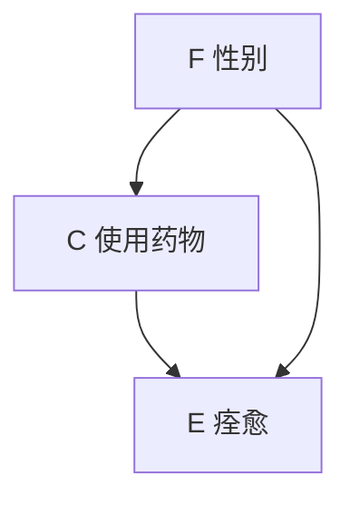
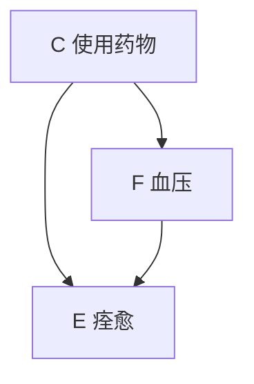
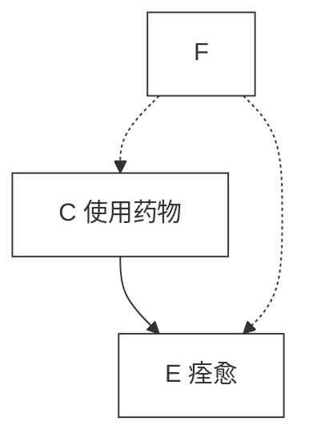
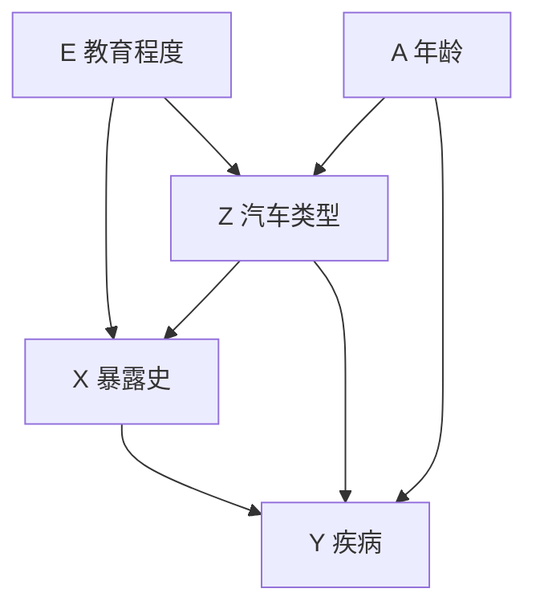
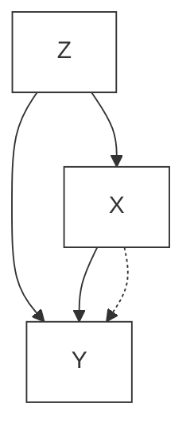
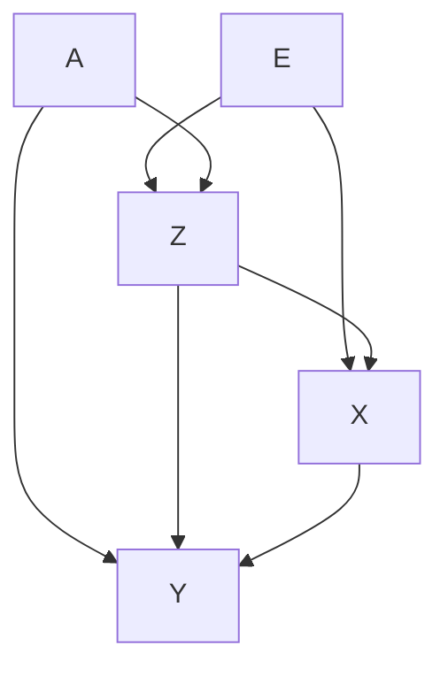

# 第 6 章 辛普森悖论、混杂与可压缩性

谁能够直面矛盾，谁就能触摸现实。

——Friedrick Durrenmatt（1962）

## 前言

混杂（confounding）被认为是从经验数据解释因果推断最主要的障碍之一。因此，在那些极其依赖因果推断的领域中，包括流行病学、计量经济学、生物统计学以及社会科学，对于混杂的考虑是许多讨论的基础。然而，除了随机化实验的标准分析之外，在大多数统计学教科书中，很少甚至根本没有讨论过这个话题。

原因很简单：混杂是一个因果概念，因此无法在标准的统计模型中表达。当使用常规的统计分析时，往往会导致问题混乱或复杂化，使非专业的研究人员很难理解，更不用说掌握了。

这本书的主要目的之一就是解决这些混杂问题，将混杂控制问题约简为简单的数学方程。在第 3 章中介绍的数学方法已经实现了简单的图模型计算方程，用于检测混杂的存在，并识别出哪些变量应被控制，以得出无混杂（no-confounding）的效应估计。在本章中，我们将解决使用统计准则来定义和控制混杂时遇到的困难。

我们将从分析辛普森悖论的有趣历史（6.1 节）开始，并将其作为放大镜来审视几代统计学家试图以统计语言刻画因果概念时遇到的困难。在 6.2 节和 6.3 节中，我们验证了用仅基于频率数据和可测量的统计关联的统计准则，取代混杂的因果定义的可行性。我们将说明，尽管这种取代通常是不可行的（6.3 节），但一种称为 **稳定（stable）** 的无混杂条件具有统计或半统计特性（6.4 节）。这种特性使得类似于可压缩性（collapsibility）检验的运算成为可能，可以提示研究人员在效应估计中存在不稳定性或偏差（6.4.3 节）。最后，6.5 节澄清可压缩性与无混杂性、混杂因子（confounder）与混杂性之间的区别，以及表示混杂问题的结构性方法和可交换性（exchangeability）方法之间的区别。

## 6.1 剖析辛普森悖论

辛普森悖论中的反转效应在本书中已经被简要地讨论过两次：第一次与协变量选择问题有关（3.3 节），第二次与直接效应的定义有关（4.5.3 节）。在本节中，我们将分析为什么反转效应一直被认为是（现在仍然是）自相矛盾的，以及它的解决方法来得这么晚的原因。

### 6.1.1 一个有关悖论的示例

辛普森悖论（Simpson，1951；Blyth，1972）是 Pearson 在 1899 年首次发现的（Aldrich，1995），它说的是这么一个现象：在已知人群 $p$ 中，一个事件 $C$ 增加了 $E$ 发生的概率，但同时在 $p$ 的每个亚群（子群组）中却减小了 $E$ 发生的概率。换句话说，如果 $F$ 和 $\neg F$ 分别描述两个亚群中互补的属性，那么我们很可能会遇到以下不等式：

$$
P (E \mid C) > P (E \mid \neg C) \tag {6.1}
$$

$$
P (E \mid C, F) < P (E \mid \neg C, F) \tag {6.2}
$$

$$
P (E \mid C, \neg F) < P (E \mid \neg C, \neg F) \tag {6.3}
$$

尽管这种顺序颠倒可能不会让研究概率的学生感到惊讶，但当进行因果解释时，它是矛盾的。例如，如果 $C$ （表示原因）代表服用某种药物， $E$ （表示效果）代表已康复， $F$ 代表女性，则对式（6.2）～（6.3）的因果解释是：该药物对男性群体和女性群体均有害，但对总体人群是有利的（式（6.1））。直觉上，我们觉得这样的结果是不可能发生的，但从公式来看是正确的。

图 6.1 给出了一个实际的例子，通过具体数值描述了辛普森反转。我们可以看到，总体而言，服用药物（ $C$ ）患者的痊愈率（50%）超过了未服用药物（ $\neg C$ ）患者的痊愈率（40%），因此显然应该选择药物治疗。但是，当我们分别检查男性患者和女性患者的表格时，发现无论男性还是女性，未服用药物患者的痊愈率比服用药物的患者高 10 个百分点。

**图 6.1 治疗组（ $C$ ）和对照组（ $\neg C$ ）中男性、女性和总体的痊愈率**

| 分组        | 状态                     | $E$ | $\neg E$ | 合计 | 痊愈率 |
| ----------- | ------------------------ | --- | -------- | ---- | ------ |
| **a) 总体** | 服用药物（ $C$ ）        | 20  | 20       | 40   | 50%    |
|             | 未服用药物（ $\neg C$ ） | 16  | 24       | 40   | 40%    |
|             | 合计                     | 36  | 44       | 80   |        |
| **b) 男性** | 服用药物（ $C$ ）        | 18  | 12       | 30   | 60%    |
|             | 未服用药物（ $\neg C$ ） | 7   | 3        | 10   | 70%    |
|             | 合计                     | 25  | 15       | 40   |        |
| **c) 女性** | 服用药物（ $C$ ）        | 2   | 8        | 10   | 20%    |
|             | 未服用药物（ $\neg C$ ） | 9   | 21       | 30   | 30%    |
|             | 合计                     | 11  | 29       | 40   |        |

对于本书的读者来说，关于辛普森悖论的解释应该是很清楚的，因为我们一直都非常注意区分观测（seeing）和干预（doing）。在概率论中，条件操作符代表证据条件“当我们观测到”，而 $do(\cdot)$ 操作符表示因果条件“当我们干预为”。因此，对于描述“ $C$ 对 $E$ 产生有益效果”的陈述，不应该使用不等式

$$
P (E \mid C) > P (E \mid \neg C)
$$

而应该写成

$$
P (E \mid do (C)) > P (E \mid do (\neg C))
$$

这才是“ $C$ 对 $E$ 产生有益效果”的正确表达方式。产生上述问题可能是 $C$ 和 $E$ 的伪混杂因子造成的。在本例中，看起来药物在总体上是有效的，因为男性（不管是否服用药物）比女性更容易痊愈，也比女性更有可能服用药物。事实上，对一个服用药物（ $C$ ）但性别未知的患者，我们可以容易地推断出该患者更有可能是男性，并且更有可能痊愈，这与式（6.1）～（6.3）完全一致。

处理此类潜在的混杂因子的标准方法是“使它们固定不变” $^{①}$ ，也就是说，对于可能同时导致 $C$ 和 $E$ 变化的任何因素，计算其相应的条件化概率 $^{②}$ 。在这个例子中，如果男性（ $\neg F$ ）被认为是痊愈（ $E$ ）和服用药物（ $C$ ）的原因，那么需要分别对男性和女性进行药效评估（即式（6.2）～（6.3）），然后再求平均值。因此，假设 $F$ 是唯一的混杂因子，式（6.2）～（6.3）合理地描述了服用药物在各自亚群中的效果，而式（6.1）只代表了在缺乏性别信息的情况下服用药物与否相关的证据权重，由此悖论消失了。

> - ① 哲学家（如 Eells，1991）和统计学家（如 Pratt and Schlaifer，1988）使用的两个术语“固定 $F$ 不变”和“对 $F$ 进行控制”，都意味着外部干预，因此可能具有误导性。在统计分析中，我们所能做的是，通过考虑 $F$ 相等的情况对“保持 $F$ 不变”进行模拟，即以 $\neg F$ 和 $F$ 作为“条件”——一种我称之为“对 $F$ 进行调节”的操作。
> - ② 即将这种因子的值固定，计算 $C$ 和 $E$ 在此条件下的概率关系。——译者注

### 6.1.2 统计学中苦恼的事情

到目前为止，我们已经描述了当前学习因果论的学生所理解或应该理解的悖论（参见 Cartwright，1983³；Holland and Rubin，1983；Greenland and Robins，1986；Pearl，1993b；Spirtes et al.，1993；Sciences et al.，1993；Meek and Glymour，1994）。然而，统计学家不愿意接受这样一种观点，即辛普森悖论是由因果关系引起的。

大多数观点认为这种反转是真实发生的，并且令人烦扰，因为它确实在数值计算中出现了，可能会误导统计学家得出错误的结论。如果某件事确实如此，那么它就不可能是因果关系，因为因果关系是一种尚未明确定义的智力构造⁴。因此，这种悖论必须是一种统计现象，并且能够通过统计分析工具来发现、解释和避免。

例如，《统计科学百科全书》（The Encyclopedia of Statistical Sciences）严厉地警告我们，辛普森悖论潜藏极大的危机，却没有提到“原因”或“因果性”（Agresti，1983）。此外，《生物统计学百科全书》（The Encyclopedia of Biostatistics）（Dong，1998）和《剑桥统计医学词典》（The Cambridge Dictionary of Statistics in Medical Sciences）（Everitt，1995）都持有相同的观点。

> ③ 然而，Cartwright 指出，当且仅当第三个因子 F 与 E 有因果关系时，F 应“固定不变”。正确的（后门）准则复杂得多（见定义 3.3.1）。
>
> ④ 即这种现象不符合常识中关于因果关系的理解。——译者注

据我了解，在统计学文献中，只有两篇文章明确地将辛普森反转归因于因果解释。第一个发现这一现象⁵的是 Pearson 等人（Pearson et al., 1899），他们对此做了如下阐述：

> ⑤ Pearson 等人（Pearson et al., 1899）和 Yule（1903）提出了一个较弱版本的悖论，其中式（6.2）～（6.3）满足等号条件。后来 Cohen 和 Nagel（Cohen and Nagel, 1934, p.449）发现了这种反转。

对于那些坚持认为所有的相关关系都是因果关系的人来说，通过人为地将两个密切相关的人群混合在一起，可以使两个完全不相关的特征 A 和 B 之间产生相关性，这一事实确实令人震惊¹。

> ① 即通过男性和女性之间数据的混合，可以产生有关性别 A 和服药效果 B 之间的关联性，而性别和服药效果之间孤立来看是不相关的，服药并不会改变性别。——译者注

受 Pearson 毕生学术观点的影响，统计学家尽可能避免谈论因果关系，并且在半个多世纪的时间里，这种反转现象一直被视为 $2 \times 2$ 表格中的一种独特的数学性质，剥离了它的因果起源。最终，Lindley 和 Novick（1981）从一个新的角度出发分析了这个问题，并第二次将其与因果关系联系起来：

> 在最后一段中，已经介绍了“因果”这个概念。一种可能性是使用因果关系的语言，而不是使用（统计学中）可交换或公认的语言。我们既没有选择这样做，也没有讨论因果关系，因为这个概念虽然被广泛使用，但似乎仍然没有明确定义。

令人惊奇的是，在辛普森反转的这段历史中，从 Pearson 等人到 Lindley 和 Novick，撰写过这一主题的许多学者都不敢问为什么这一现象值得我们关注，为什么它会令人惊讶。毕竟，在不同的概率条件下，观测到概率发生巨大变化很常见，甚至出现符号反转也并不少见（通过对这些概率进行区分和混合）。因此，如果不是因为某种执拗的错误观念，那么不等式符号反转这种现象又有什么可令人震惊的呢？

Pearson 明白，这种震惊源于扭曲的因果解释，他试图通过统计相关性和列联表（contingency table）来修正这种解释（见第 10 章）。他的追随者也相当虔诚地信奉他，有些人甚至断言因果关系只是一种特殊的相关关系（Niles，1922）。在这种否定因果直觉的氛围下，研究人员通常别无选择，只能将辛普森反转归因（attribution）于数据的某些邪恶特征，而这不是一个严谨的研究人员应有的态度。

自 20 世纪 50 年代以来，已有数十篇论文就辛普森反转统计方面的研究进行了论述。其中，一些研究了结果的变化程度（Blyth，1972；Zidek，1984），一些确定了其消除的条件（Bishop et al.，1975；Whittemore，1978；Good and Mittal，1987；Wermuth，1987），甚至有人提议采用激进的补救方式，例如用 $P(C|E)$ 代替 $P(E|C)$ 作为治疗效果的衡量标准（Barigelli and Scozzafava，1984）。总之，目标是必须不惜一切代价避免反转。

Bishop、Fienberg 和 Holland（1975）的著作中有关于这个问题的典型处理方法。

Bishop 等人（1975）给出了一个示例，当对参与研究的每个诊所分别进行考虑时，产前护理量和婴儿存活率之间明显的相关性消失了。他们得出结论：“如果我们只看这个（合成）表，就会错误地得出存活率与所接受的护理量相关的结论。”具有讽刺意味的是，实际上存活率的确与所接受的护理量相关。其实，Bishop 等人的意思是，如果不加批判地去看合成后的总表，我们会错误地得出存活率与所接受的护理量有因果关系的结论。

然而，由于在 20 世纪 70 年代人们不得不避免使用因果关系词汇（causal vocabulary），像 Bishop 这样的研究人员被迫使用诸如“相关”或“关联”之类的统计替代词，因此自然而然成为语言局限性的牺牲品，因为统计词汇无法表达研究人员想要表达的因果关系。

辛普森悖论有助于我们了解这一代统计学家的苦恼，同时也感叹于他们的成就。在良好的因果直觉（causal intuition）的驱动下，尽管在文化上不被承认，在数学上也无法被表达，他们仍然设法从枯燥无味的表格中探寻其中的内在意义，并使统计方法成为经验科学的标准。但最终将证明，辛普森悖论的新奇之处并不在统计方面。

### 6.1.3 因果关系与可交换性

Lindley 和 Novick（1981）首先阐述了辛普森悖论的非统计特征（nonstatistical character of Simpson's paradox），即不存在任何统计方法可以防止研究人员得出错误结论，也不存在任何统计标准可以指出哪个表格才真正代表了正确答案。

在传统的贝叶斯决策理论中，他们首先把注意力转移到这个现象的实际应用方面，并大胆地提出问题：对一个新的患者，我们是否应该使用药物？也就是说：我们到底要参考哪一张表，总体表还是性别表？Novick（1983，p.45）回答得很直白：“答案很明确，当我们知道患者的性别是男性或女性时，我们就不使用这种药物。但是，如果性别是未知的，我们就应该使用该药物进行治疗！”显然，这个结论是荒谬的。

然后，Lindley 和 Novick 进行了一段冗长的非正式讨论，得出结论（正如我们在 6.1.1 节中所做的那样），我们应该参考性别表，不使用药物。

接下来的一个问题是，是否存在一些额外的统计信息可以帮助我们选出正确的表格。对于这个问题，Lindley 和 Novick 的回答是否定的。他们表示，对于同样的数据，我们有时会做出相反的决定，并参考总体表。他们问道：假设我们将数据保持不变，仅仅改变数据背后的故事，会发生什么？想象一下，如果 $F$ 代表一些受 $C$ 影响的属性，比如低血压，如图 6.2b 所示 $^{①}$ 。

> 通过查看图 6.2b 中的关系，我们可以立即得出结论：总体表就是我们想要的答案。我们不应该将 $F$ 作为条件，因为它位于我们想要评估的因果路径上。（如果以 $F$ 为条件，那么相当于我们对治疗后血压相同的患者进行比较，这样就会掩盖药物通过另一条路径实现康复的作用。）

> **图 6.2** 三个因果模型分别生成图 6.1 中的数据。模型 a）使用按性别分类的表格，b）和 c）使用总体表格。

当两个因果模型生成相同的统计数据（图 6.2a 和图 6.2b 在观测上是等价的），并且在一个模型中我们决定使用药物，而在另一个却不使用药物时，我们的决定很明显是由因果而不是统计驱动的。一些读者可能会怀疑时间信息与决定有关，并且注意到性别是在治疗前就确定的，而血压是在治疗后确定的。但事实并非如此。图 6.2c 表明， $F$ 可能出现在 $C$ 之前或之后，正确的决定仍然应该是参考总体表（即不以 $F$ 为条件，这从后门准则中可以看出）。

我们刚才用例子说明了在 6.1.1 节中提到的内容，即与行动效果（effect of actions）有关的每一个问题都必须根据因果关系决定，仅凭统计信息是不够的。此外，选择哪一张表格作为决策依据其实是协变量选择问题的一个特例，在 3.3 节中通过因果演算已经给出了一个针对该问题的通用解决方案。然而，Lindley 和 Novick 没有意识到这一点，而是将这两个示例之间的差异归因于 De Finetti（1974）首次提出的称为 **可交换性** 的元统计 $^{②}$ 概念。

> Lindley 和 Novick（1981）的例子取自农业，没有提及 $C$ 和 $F$ 之间的因果关系，但其结构与图 6.2b 中的结构相同。

可交换性涉及如何选择一个合理的参考类或亚群，以实现对个体的预测。例如，保险公司希望利用与新客户特征最为相似的一类人的死亡记录来估计这个新客户的预期寿命。De Finetti 通过将关于相似性的判断转化为对概率的判断，对这个问题进行了形式化 $^{178}$ 的定义。根据这个准则，如果联合概率分布 $P(X_{1},\cdots,X_{n},X_{n+1})$ 在 $X_{n+1}$ 的值被改变的情况下仍然保持不变，则 $X$ 中的第 $(n+1)$ 个变量相对于其他 $n$ 个变量来说是 **可交换** 的。

对 De Finetti 来说，如何建立这种不变性（invariance）在他心中是一个次要的目标，更重要的是将心中的目标定义为形式化的数学表达式，以便大家可以用科学的术语进行交流和讨论。Lindley 和 Novick 试图将这一概念应用到辛普森反转现象中，并希望以此证明当“ $F=$ 性别”时，合理的选择是分别考虑男性患者和女性患者两个亚群，而当“ $F=$ 血压”时，则应该考虑整个患者群体。

Lindley 和 Novick 论文的读者很快就会意识到，尽管他们通过可交换性和亚群来粉饰自己的讨论，但实际上他们所做的都是为了给直觉提供了一种非形式化的因果论证。Meek 和 Glymour（1994）敏锐地观察到，Lindley 和 Novick 在关于可交换性的讨论中唯一可理解的部分是有关因果关系的讨论，这意味着“需要明确解释因果和概率之间的相互关系，以理解什么时候应该或者不应该进行可交换性的假设，这是非常必要的。”（Meek and Glymour, 1994）。

情况的确如此，实验研究中的可交换性取决于对数据生成机制的因果理解。一个新事件的结果是否应该由一组已知的事件结果来判断，取决于新事件所涉及的实验条件是否与观测已知事件时的条件相同。我们不能使用总体表（图 6.1a）确定新患者（性别未知）的结果，因为实验条件已经发生了改变。之前已知的患者自己选择治疗方案，而新患者可能被迫接受某种治疗，这可能违背了他的自然选择倾向。因此，当新实验中的一个机制发生改变时，如果不首先对其所涉及的概率是否会改变做出因果假定，就不可能判断可交换性。

我们可以在图 6.2b 的血压示例中使用总体表的原因是，假设在该实验环境中更改治疗选择对条件概率 $P(E|C)$ 没有影响。也就是说，假定 $C$ 是外生的。（在图中没有任何后门路径的情况下，可以清楚地看到这一点 $^{①}$ 。）注意，如果下一个患者是分组实验中的成员（假设治疗和效果可以重复，并且下一个患者的性别和身份未知），那么这个准则同样是成立的。如果我们将样本置于新的实验条件下，群体中随机选择的样本与该群体可能是不可交换的。为了确定在新的情况下是否具有可交换性，必须考虑因果机制的变化。然而，一旦考虑了因果机制，就不再需要单独判断可交换性。

> 即是否服用药物对于药物的疗效（无论男性还是女性）没有影响。——译者注

但是，为什么 Lindley 和 Novick 选择如此隐晦地（通过可交换性）谈论这个问题？他们本可以通过公开谈论因果关系来直接表达自己的观点。他们对这个问题的部分回答如下：“‘因果关系’这个术语虽然被广泛使用，但似乎并没有一个很好的定义。”人们自然想知道，如何才能更明确地给出可交换性的定义，而不仅仅是判断它。我们仔细回想一下 1981 年统计学家可使用的数学工具有哪些，才能够真正理解他们这个回答的含义。

当 Lindley 和 Novick 说因果关系没有很好的定义时，他们真正的意思是因果关系不能通过当时他们所惯用的任何数学形式描述出来。基于 5.1 节和 7.4.3 节中所述的原因，在 1981 年那个时代，人们普遍没有意识到路径图、结构方程式以及 Neyman-Rubin 表示法作为因果数学语言的潜力。事实上，如果 Lindley 和 Novick 想用因果关系来表达他们的观点，他们就无法用数学语言来表达性别不受药物影响这一简单又关键的事实，更不用说从这个事实中得出不那么明显的结论 $^{①}$ 。他们唯一熟悉的形式化语言是概率演算，但是正如我们已经在一些案例中看到的那样，如果没有合理的扩展，概率演算无法充分处理因果关系。

幸运的是，在过去十年中发展起来的数学工具对于这个问题提供了更系统、更友好的解决方法。

### 6.1.4 悖论已解决（或者，人是什么类型的机器）

悖论就像幻觉一样，经常被心理学家用来揭示思维的内在运作，因为悖论源于（并放大了）隐含的假定之间潜在的冲突。以辛普森悖论为例，我们在“因果关系由概率演算法则支配”的假设和“驱动因果直觉”的一组隐含假设之间存在冲突。第一个假设告诉我们式（6.1）～（6.3）中的三个不等式是一致的，它甚至为我们提供了一个概率模型来证实这一论断（图 6.1）。第二个假设告诉我们，没有一种神奇的药物既能分别对男性和女性都有害，但又能同时对整体有益。

为了解决这个悖论，我们必须要么证明因果直觉是误导性的或不合逻辑的，要么否认因果关系受标准概率演算法则支配的假设。正如读者现在肯定会怀疑的那样，我们将选择第二种假设。我们在这里以及本书其余部分的立场是，因果关系受其自身逻辑的支配，而这种逻辑需要对概率演算法则进行大规模扩展。我们有必要阐明支配因果直觉的逻辑，并从形式上证明，这种逻辑排除了这种神奇药物的存在。

`do(·)` 操作符的逻辑完全适用于此目的。我们先把这种神奇药物 C 对男性和女性都是有害的这种说法，翻译成因果演算中的形式化描述：

$$
P(E \mid do(C), F) < P(E \mid do(\neg C), F) \tag{6.4}
$$

$$
P(E \mid do(C), \neg F) < P(E \mid do(\neg C), \neg F) \tag{6.5}
$$

我们必须证明 C 对总体人群也是有害的，也就是说，必须证明不等式

$$
P(E \mid do(C)) > P(E \mid do(\neg C)) \tag{6.6}
$$

与我们对药物和性别（之间的关系）的认知不一致。

#### 定理 6.1.1（确实原理）①

> Savage（1954，p.21）提出了确实原理（sure-thing principle）作为（关于行动）偏好的基本假设，并默认定理中的无变化约定。Blyth（1972）利用这一漏洞设计了一个显而易见的反例。定理 6.1.1 表明，确实原理不需要作为一个单独的假设来陈述，作为结构方程（或机制）的附加性质，它从逻辑上遵循行动的语义。有关反事实分析方面的内容，请参见 Gibbard 和 Harper（1976）。值得注意的是，无变化约定是概率性的，只要亚群的相对大小保持不变，它允许行动改变单一个体的类别。

假设行动 C 不改变亚群分布，如果 C 提高了每个亚群中事件 E 发生的概率，那么 C 也必定会提高在整个群体（总体）中事件 E 发生的概率。

#### 证明

我们将通过给出的例子来证明定理 6.1.1，其中总体被划分为男性和女性两个亚群（这很容易推广到多个亚群）。在这种情况下，我们要证明式（6.4）～（6.6）中不等式的反转现象与药物对性别没有影响的假设不一致：

$$
P (F \mid d o (C)) = P (F \mid d o (\neg C)) = P (F) \tag {6.7}
$$

展开 $P(E|do(C))$ 并使用式（6.7）得出

$$
\begin{array}{l} P (E \mid d o (C)) = P (E \mid d o (C), F) P (F \mid d o (C)) + P (E \mid d o (C), \neg F) P (\neg F \mid d o (C)) \tag {6.8} \\ = P (E \mid d o (C), F) P (F) + P (E \mid d o (C), \neg F) P (\neg F) \\ \end{array}
$$

同样，对于 $do(\neg C)$ ，得出

$$
P (E \mid d o (\neg C)) = P (E \mid d o (\neg C), F) P (F) + P (E \mid d o (\neg C), \neg F) P (\neg F) \tag {6.9}
$$

由于式（6.8）中右边的每一项都小于式（6.9）中对应的项，因此得出以下结论：

$$
P (E \mid d o (C)) <   P (E \mid d o (\neg C))
$$

证毕。

因此，我们可以看到因果直觉的来源：在人的直觉逻辑中，一个显而易见但又至关重要的假设是药物不会影响性别。这就解释了为什么当 $F$ 成为受药物影响的中间事件时，人的直觉会发生如此剧烈的变化，如图 6.2b 所示。在这种情况下（即 $F$ 受 $C$ 的影响），我们的直觉逻辑告诉我们，找到一种药物，同时满足式（6.4）～（6.6）三个不等式完全可能，并且校正 $F$ 也是不合适的。如果 $F$ 受 $C$ 的影响，则不能得出式（6.8），而且 $P(E|do(C)) - P(E|do(\neg C))$ 的值可以是正的，也可以是负的，这取决于 $P(F|do(C))$ 和 $P(F|do(\neg C))$ 的大小。如果 $C$ 和 $E$ 没有共同的原因，我们应该直接从总体表（式（6.1））而不是从 $F$ 相关的亚群表（式（6.2）～（6.3））来评估 $C$ 的疗效。

请注意，在我们的分析中，没有假设数据必须来源于随机化实验（即 $P(E|do(C)) = P(E|C)$ ）或平衡实验（即 $P(C|F) = P(C|\neg F)$ ）。相反，根据图 6.1 中的表格，我们的因果逻辑能够处理不平衡数据，但不会得出式（6.4）～（6.6）是一致的。同样，人们可以从表格中清楚地看到，男性比女性更有可能服用药物。然而，当出现反转现象时，人们“吃惊”地发现，通过总体表可以反转痊愈率。

我们从这些观察中得出的结论是，人类通常对（易变的）比率和比例置之不理，他们不断地寻求（不变的）因果关系。一旦人们把比例理解为因果关系，他们就应该继续用因果演算而不是比例演算来处理这些关系。假若我们的思维被比例计算所束缚，图 6.1 就不会引起任何惊讶，辛普森悖论也不会引起如此大的关注。

## 6.2 为什么没有关于混杂的统计检验，为什么许多人认为应该有，为什么他们是正确的

### 6.2.1 简介

混杂是一个简单的概念。如果我们通过检查一个变量（ $X$ ）与另一个变量（ $Y$ ）之间的统计关联来估计 $X$ 对 $Y$ 的效应，那么我们应该确保这种关联不是由其他因素产生的。这种伪相关（spurious association）的存在，例如由于外生变量的影响，称为混杂，因为它往往会混淆我们的观测，并使我们对效应的估计产生偏差。因此，从概念上讲，当存在第三个变量 $Z$ 同时影响 $X$ 和 $Y$ 时，我们可以说 $X$ 和 $Y$ 是混杂的，这样的变量 $Z$ 称为 $X$ 和 $Y$ 的混杂因子。

> 我们将“效应”“影响”和“作用”等术语的使用范围限于因果解释。“关联”一词将用于统计相关性。

尽管这个概念很简单，但几十年以来一直没有形式化的描述，而且看似理由很充分：对于这些“效应”和“影响”的概念，必须定义什么是“伪相关”，但无法利用现有的数学方式表达。在随机化对照实验中，关联关系通常作为效应的实证定义，但这种实证定义并不容易用标准的概率语言来描述，因为概率理论只适用于静态条件，如果条件发生了变化（即从观测研究变为对照研究），即使给出了完整的总体密度函数，也无从知道什么样的关系适合作为效应的实证定义。这种预测需要以因果假设或反事实假设的形式提供额外的信息，而这些信息无法从密度函数中分辨出来（参见 1.3 节和 1.4 节）。本书中使用的 $do(\cdot)$ 操作是专门为区分和处理这类额外信息设计的。

尽管存在这些困难，流行病学家、生物统计学家、社会科学家和经济学家已经多次尝试用统计学术语来定义混杂，这么做的部分原因是统计定义不含“效应”或“影响”等理论术语，可以用传统的数学形式表达，还有部分原因是这样的定义可以对混杂进行实际检验，从而提醒研究人员可能存在的偏差以及需要进行的调整。这些尝试都汇总在以下基本准则中。

> 在计量经济学中，这种困难集中在“外生性”的概念上（Engle et al., 1983；Leamer, 1985；Aldrich, 1993），它基本上代表了“无混杂”（参见 5.4.3 节）。

### 关联性准则（associational criteria）

两个变量 $X$ 和 $Y$ 是无混杂的，当且仅当不受 $X$ 影响的每个变量 $Z$ ，要么（U1）与 $X$ 不相关，要么（U2）在 $X$ 条件下，与 $Y$ 无关。

这一准则及其变形和推论（通常回避了“仅当”部分），几乎可以在每一本流行病学教科书（Schlesselman，1982；Rothman，1986；Rothman and Greenland，1998）和每一篇涉及混杂的文献中找到。事实上，这一准则在文献中已经根深蒂固，以至于作者（例如，Gail，1986；Hauck et al.，1991；Becher，1992；Steyer et al.，1996）经常把它当作无混杂的定义，却忘记了混杂只有在谈到效应偏差时才有用。

183 本节和下一节将强调关联性准则及其推论的几个基本限制。我们将证明，关联性准则既不能保证无偏效应估计，也不能满足无偏的要求。我们先举例说明混杂的统计概念和混杂的因果概念之间没有逻辑联系，然后定义一个无偏性的更强的概念，称为“稳定无偏”。基于这个概念，我们将证明一个修正后的统计准则是充分且必要的。其中，必要部分可以对稳定无偏进行实际检验，而不需要知道所有潜在的混杂因子。最后，我们将说明，用统计方法替代基于效应的混杂定义的普遍做法并非完全错误，因为稳定无偏实际上是研究人员旨在（或者应该）实现的目标，并且可以用统计方法进行检验。

### 6.2.2 因果定义和关联定义

为了便于讨论，我们首先以数学形式给出无混杂的因果定义和统计定义。

> 为了简单起见，我们将把讨论限制在无须校正的混杂上，涉及辅助变量测量的扩展是直接的（即需要对辅助变量进行校正的混杂），这可以从 3.3 节中得出。我们也可以使用表述“X 和 Y 无混杂”，尽管“X 对 Y 的效应无混杂”更加准确。

#### 定义 6.2.1（无混杂的因果定义）

假设 $M$ 为一个数据生成机制的因果模型，即一种确定每个观测变量值的形式化描述。令 $P(y|do(x))$ 表示在假设干预 $X = x$ 下的响应事件 $Y = y$ 的概率，该概率在 $M$ 下进行计算。对于 $X$ 和 $Y$ 各自域中的所有 $x$ 和 $y$ ，我们说， $X$ 和 $Y$ 在 $M$ 中无混杂，当且仅当

$$
P (y | d o (x)) = P (y \mid x) \tag {6.10}
$$

其中 $P(y|x)$ 是由 $M$ 生成的条件概率。如果式（6.10）成立，则称 $P(y|x)$ 是无偏的。

为了此处讨论的目的，我们将以上因果定义作为“无混杂”的意义。在第 3 章中已经定义了概率 $P(y|do(x))$ （定义 3.2.1，也简写为 $P(y|\hat{x})$ ），它可以解释为对照实验中的条件概率 $P^{*}(Y=y|X=x)$ ，其中 X 为随机变量。通过模拟干预操作 $do(X=x)$ ，或者（当 $P(x,s)>0$ 时）通过校正公式（式（3.19）），这个概率可以从一个因果模型 M 中直接计算出来：

$$
P (y | d o (x)) = \sum_ {s} P (y \mid x, s) P (s)
$$

其中，S 表示任何满足后门准则（定义 3.3.1）的可观测的或非观测的变量集合。 $P(y|do(x))$ 同样可以写作 $P(Y(x)=y)$ ，其中 $Y(x)$ 是式（3.51）或 Rubin（1974）定义的潜在结果变量。我们需要记住， $do(\cdot)$ 操作以及因此产生的效应估计和混杂，必须相对于具体的因果或数据生成模型 M 进行定义，因为这些概念不具有统计性质，不能用联合分布来定义。

#### 定义 6.2.2（无混杂的关联性准则）

令 $T$ 为不受 $X$ 影响的变量集合。如果 $T$ 中的每个变量 $Z$ 至少满足下列条件之一，则称 $X$ 和 $Y$ 无混杂：

- $(U_{1})$ Z 与 X 无关（即 $P(x|z)=P(x)$ ）。
- $(U_{2})$ 在 X 条件下，Z 与 Y 无关（即 $P(y|z,x)=P(y|x)$ ）。

反过来说，如果 $T$ 中的任何一个元素 $Z$ 同时违反了 $(U_{1})$ 和 $(U_{2})$ ，则称 $X$ 和 $Y$ 混杂。

需要注意的是，定义 6.2.2 中的关联性准则不是纯粹的统计定义，因为它使用了谓语“受……影响”，这个谓词无法通过概率进行辨认，而需要依赖因果信息。排除受 X 影响的变量是无法回避的，并且长期以来，人们一直认为它是观察和实验研究中进行效应分析时必要的判断输入（Cox，1958，p.48；Greenland and Neutra，1980）。我们将自始至终假设研究人员具备区分受 X 影响和不受 X 影响所需的知识。然后，我们将试着找出需要什么额外的因果知识，如果有的话，我们将这些知识用于混杂检验。

## 6.3 关联性准则如何失效

我们说，如果一个无混杂的定义将任何变量归为无混杂时从未出错，那么这个定义是 **充分** 的；如果这个定义将任何变量归为混杂时从未出错，那么这个定义是 **必要** 的。定义 6.2.2 中的关联性准则与定义 6.2.1 中的因果定义在很多方面都不匹配。我们将依次介绍关联性准则在充分性和必要性方面存在的问题。

### 6.3.1 凭借边缘化使充分性失效

定义 6.2.2 中的关联性准则基于对 T 中的每个变量分别进行检验。很可能会存在这样一种情况： $Z_{1}$ 和 $Z_{2}$ 这两个因子共同混杂了 X 和 Y（在定义 6.2.2 的意义上），但每个因子却分别满足 $(U_{1})$ 或 $(U_{2})$ 。

这可能是因为在统计上，X 与 T 中的某个元素之间的独立性不能确保 $X$ 与 $T$ 中的变量组之间的独立性。例如，令 $Z_{1}$ 和 $Z_{2}$ 为两个独立的、质量均匀的硬币的抛掷结果，每个硬币都影响 $X$ 和 $Y$ 。假定当 $Z_{1}$ 和 $Z_{2}$ 相等时发生 $X$ ，当 $Z_{1}$ 和 $Z_{2}$ 不相等时发生 $Y$ 。

显然， $T = (Z_{1}, Z_{2})$ 这对变量高度混杂了 $X$ 和 $Y$ 。事实上， $X$ 和 $Y$ 是完全（负）相关的，没有因果关系。另外， $Z_{1}$ 和 $Z_{2}$ 与 $X$ 或 $Y$ 都无关，发现其中任何一枚硬币的抛掷结果都不会改变 $X$ （或 $Y$ ）的初始值为 $\frac{1}{2}$ 的概率。

可以尝试修正定义 6.2.2，即通过 $(U_{1})$ 和 $(U_{2})$ 中 T 的任意子集来代替 Z，但这种方法的局限性太大，因为当把 X 和 Y 的所有原因集合作为一个组来处理时，几乎肯定无法满足 $(U_{1})$ 和 $(U_{2})$ 的检验。在 6.5.2 节中，我们给出了在 $(U_{1})$ 和 $(U_{2})$ 中应该用哪些子集替换 Z，以确保充分性。

### 6.3.2 凭借封闭世界假定使充分性失效

所谓“封闭世界”假定（closed-world assumption）指的是，假设我们的模型能够解释所有相关的变量，特别是假设在定义 6.2.2 中的变量集合 T 包含了所有潜在的混杂因子。为了正确分辨出每一种无混杂的情况，关联性准则要求每一个潜在的混杂因子 Z 都必须满足条件（ $U_{1}$ ）或（ $U_{2}$ ）。

在实际应用中，由于研究人员永远无法确定已知的潜在混杂因子集合 T 是否完整，因此关联性准则会错误地将某些混杂情况归类为无混杂的情况。

实际上，这种缺陷意味着任何统计检验都注定是不充分的。由于在实际应用中检验总是涉及 $T$ 的子集，因此我们最希望通过统计手段检验必要性。也就是说，当 $T$ 中的任意子集不满足条件（ $U_{1}$ ）和（ $U_{2}$ ）时，可以正确地将其标记为混杂。正如我们接下来所说的那样，定义 6.2.2 在必要性检测方面也无法完成。

### 6.3.3 凭借无益代理使必要性失效

#### 例 6.3.1

设想这样一种情况：暴露史（ $X$ ）受教育程度（ $E$ ）影响，疾病（ $Y$ ）受暴露史和年龄（ $A$ ）影响，汽车类型（ $Z$ ）受年龄（ $A$ ）和教育程度（ $E$ ）影响。这些关系如图 6.3 所示。

> 图 6.3 $X$ 和 $Y$ 无混杂，尽管 $Z$ 与两者都关联

汽车类型变量（ $Z$ ）不满足定义 6.2.2 中的两个条件，因为：

1. 汽车类型反映了一个人受教育的程度，因此与暴露史这个变量相关；
2. 汽车类型反映了年龄，因此与暴露史和无暴露史人群的疾病有关。

然而，在本例中， $X$ 对 $Y$ 的影响并不是混杂的。一个人拥有的汽车类型无论对其暴露史还是疾病都没有影响，这仅仅是众多无关属性中的一个，这些无关属性通过某个中间变量与暴露史和疾病相关。第 3 章的分析表明，实际上，在该模型中确实满足式（6.10），而且，对 $Z$ 的校正通常会产生一个有偏差的结果：

$$
\sum_{z} P(Y = y \mid X = x, Z = z) P(Z = z) \neq P(Y = y \mid do(x))
$$

因此，我们可以看到，传统的统计关联性准则无法识别无混杂的效应，并且会误导人们错误地对变量进行校正。当我们将 $(U_{1})$ 和 $(U_{2})$ 应用于称为 **无益代理** 的变量 $Z$ 时，即这个变量本身对 $X$ 或 $Y$ 没有影响，但它却是具有这种影响的因子的代理，就会出现这种错误。

读者可能不会认为这种错误有多严重，因为经验丰富的流行病学家很少会把一个变量看成混杂因子，除非怀疑它对 $X$ 或 $Y$ 有影响。尽管如此，在流行病学中，对代理变量的校正是一种普遍做法，应该对此非常谨慎（Glandland and Neutra, 1980；Weinberg, 1993）。为了解决这一问题，必须修正关联性准则，将无益代理排除在检验集 $T$ 之外。这就产生了以下修正的准则，其中 $T$ 只包含（可能通过 $X$ ）影响 $Y$ 的变量。

#### 定义 6.3.2（无混杂，修正的关联性准则）

设 $T$ 为不受 $X$ 影响但可能影响 $Y$ 的变量集合。当且仅当 $T$ 中的每个元素 $Z$ 满足定义 6.2.2 中的条件 $(U_{1})$ 或 $(U_{2})$ 时，称 $X$ 和 $Y$ 在 $T$ 存在的情况下无混杂。

Stone（1993）和 Robins（1997）对定义 6.2.2 提出了另一种修正，既不需要判断变量是否对 $Y$ 有影响，又避免了由无益代理产生的问题。他们没有将集合 $T$ 限制为 $Y$ 的潜在原因，而是令 $T$ 为不受 $X$ 影响的所有变量的集合 $^{\ominus}$ ，由两个不相交的子集 $T_{1}$ 和 $T_{2}$ 组成，并满足以下条件：

- $(U_{1} *) T_{1}$ 与 $X$ 无关。
- $(U_{2} *)$ 在 $X$ 和 $T_{2}$ 条件下， $T_{2}$ 与 $Y$ 无关。

例如，在图 6.3 的模型中，当 $T_{1} = A$ 和 $T_{2} = \{Z,E\}$ 时，满足条件（ $U_{1}^{*}$ ）和（ $U_{2}^{*}$ ），因为（使用 $d$ -分离检验得出） $A$ 与 $X$ 无关，并且在 $\{X,A\}$ 条件下， $\{E,Z\}$ 与 $Y$ 无关。

对关联性准则的这种修正也纠正了边缘化相关的问题（请参见 6.3.1 节），因为 $(U_{1}^{*})$ 和 $(U_{2}^{*})$ 将 $T_{1}$ 和 $T_{2}$ 视为联合变量。然而，这种修正并没有解决必要性问题。由于集合 $T = (T_{1}, T_{2})$ 必须包含不受 $X$ 影响的所有变量（见附注 13），并且在实际应用中只能检验 $T$ 的真子集，因此如 6.3.2 节所述，我们就不能得出结论：混杂只是由于 $(U_{1}^{*})$ 和 $(U_{2}^{*})$ 失败引起的 ②。因此，这一定义也不足以作为实际应用中检验混杂的判断依据。

> ② 或者， $T$ 被限制在任何可以充分控制混杂的变量集合 $S$ 中： $P(y|do(x)) = \sum_{s}P(y|x,s)P(s)$ 。然而，我们永远也无法确定模型中测量的变量是否包含这样一个集合，或者 $T$ 的哪些子集具有这个属性。——译者注

通过统计手段检验混杂这个方法的能力是有限的，下面我们将讨论另一个局限性。

### 6.3.4 凭借偶然抵消使必要性失效

接下来，我们给出一个没有无益代理的情况，其中 $X$ 对 $Y$ 的效应基于式（6.10）的定义是无混杂的，但根据定义 6.3.2 中修正后的关联性准则是混杂的。

#### 例 6.3.3 考虑由一组线性方程定义的因果模型

$$
x = \alpha z + \varepsilon_ {1} \tag {6.11}
$$

$$
y = \beta x + \gamma z + \varepsilon_ {2} \tag {6.12}
$$

其中， $\varepsilon_{1}$ 和 $\varepsilon_{2}$ 是两个相关的未观测变量，满足 $\operatorname{cov}(\varepsilon_{1}, \varepsilon_{2}) = r$ ，并且 $Z$ 是一个外生变量，与 $\varepsilon_{1}$ 或 $\varepsilon_{2}$ 不相关，如图 6.4 所示。 $X$ 对 $Y$ 的影响可以通过路径系数进行量化，路径系数是 $X$ 单位变化时 $E(Y|do(x))$ 的变化率 ②。

> - 当 $T$ 的变量没有包含所有的变量（包括潜在变量）时，即使 $(U_{1}^{*})$ 和 $(U_{2}^{*})$ 成立，也不能认为无混杂。

不难看出（假设标准化变量），Y 在 X 上的回归方程为：

$$
y = (\beta + r + \alpha \gamma) x + \varepsilon
$$

其中， $\mathrm{cov}(x,\varepsilon)=0$ 。因此，当 $r=-\alpha\gamma$ 成立时， $r_{YX}=\beta+r+\alpha\gamma$ 的回归系数是对 $\beta$ 的无偏估计，也就是说 X 对 Y 的效应是无混杂的（不需要校正）。而变量 Z 导致无法满足条件 $(U_{1})$ 和 $(U_{2})$ ，因为 Z 与 X 相关（当 $\alpha\neq0$ ），同时在给定 X 的条件下，Z 与 Y 相关（除了 $\rho_{yz\cdot x}=0$ 时 $\gamma$ 的特殊值）。

> 图 6.4 Z 与 X 和 Y 都相关，但是 X 对 Y 的效应无混杂（当 $r = -\alpha\gamma$ ）

这个例子证明了无偏条件（定义 6.2.1）并没有蕴含定义 6.3.2 中的修正准则。关联性准则可能会将一些无混杂的情况错误地分类为混杂，更糟糕的是，对伪混杂因子（在本例中为 Z）进行校正反而会在效应估计中引入偏差 $^{①}$ 。

> - 注意，在本例中，对定义 6.3.2 进行 Stone-Robins 修正也会失败，除非我们能够度量导致 $\varepsilon_{1}$ 和 $\varepsilon_{2}$ 之间相关性的因素。

## 6.4 稳定无偏与偶然无偏

### 6.4.1 动机

之前的例子中，关联性准则的失败要求我们重新审视式（6.10）中定义的混杂和无偏的概念。在例 6.3.3 中，将 $X$ 和 $Y$ 归类为无混杂的原因是，通过设置 $r = -\alpha \gamma$ ，我们能够让 $r$ 所表示的伪关联抵消 $Z$ 带来的伪关联。在实际应用中，这种抵消完全是偶然发生的情况，特定于某种实验条件的组合，当实验参数（如 $\alpha$ 、 $\gamma$ 和 $r$ ）发生轻微变化，例如，在不同地点或不同时间重复进行实验时，该情况将不会持续。

相比之下，在例 6.3.1 中表示的无混杂情况则不存在这种波动性。在该例中，不管教育程度和暴露史之间的关联强度如何，也不管教育程度和年龄如何影响患者所拥有的汽车类型，式（6.10）表示的无偏性总是存在。我们称这种无偏是 **稳定的** ，因为它对参数的变化是稳定的，并且只要模型中因果关系的结构保持不变，它就不会受到影响。

鉴于稳定无偏和偶然无偏之间的区别，我们需要重新审视：如果一个准则将那些仅仅由于偶然抵消而变得无混杂的情况分类为混杂，那么我们是否应该认为这个准则是不充分的。更根本的是，我们是否应该坚持将这种特殊情况纳入无偏性的定义中 $^{①}$ （在这些情况下，可以得到满足式（6.10）的不稳定性条件）。尽管这些问题的答案在一定程度上是一个选择问题，但有充分的证据表明，我们关于混杂的理解是基于 **稳定无偏** 考虑的，而不仅仅是偶然无偏。否则，我们怎么能解释为什么几代流行病学家和生物统计学家会提倡对混杂进行定义，而这些定义在涉及偶然抵消时会失效呢？就实用性而言，偶然无偏这种情况不应在观测性研究中造成明显的误差，因为这些情况是短暂的，并且很可能在稍有不同的条件下就会被随后的实验推翻 $^{②}$ 。

假设我们准备将无偏的情况归类为对参数的变化保持鲁棒无偏性的情况，仍然存在两个问题：（1）我们如何给“稳定无偏”这个新概念一个形式化的、非参数化的公式？（2）是否有实用的统计方法来检验稳定无偏？这两个问题都可以用结构模型来回答。

第 3 章描述了一个图模型的准则，称为“ **后门准则** ”，用于识别因果图中的无偏条件 $^{③}$ 。在（对可观测的协变量）不进行校正的简单情况下，如果 $X$ 和 $Y$ 之间包含指向 $X$ 的箭头的每条路径也包含了两个头对头的箭头（如图 6.3 所示），则 $X$ 和 $Y$ 是无混杂的。当图中两个变量之间没有连接就表示它们之间没有因果关系时，这个准则是有效的。由于缺失连接的因果假设非常明确，因此后门准则有两个显著特点。首先，不需要统计信息，图模型的拓扑结构足以可靠地判断一个效应是否是无混杂的（基于定义 6.2.1），以及当某种混杂存在时，对一组变量进行校正是否足以消除混杂。其次，不管什么样的模型（或情况），只要是通过对图模型中的因果关系指定不同的参数生成的，任何满足后门准则的模型实际上都会满足式（6.10）。

> $^{①}$ 事实上作者是在否定将偶然无偏分类为无混杂。——译者注

为了说明这一点，请思考图 6.3 中所示的图模型。后门准则把 $(X, Y)$ 标识为无混杂，因为唯一指向 $X$ 箭头的路径是一个遍历路径 $(X, E, Z, A, Y)$ ，并且该路径包含指向 $Z$ 的头对头的两个箭头。此外，由于该准则仅基于图模型上的关系，因此很明显， $(X, Y)$ 将被归类为无混杂，不论图中所表示的因果关系的强度或类型如何。相比之下，在例 6.3.3 的图 6.4 中，两条路径均有指向 $X$ 的箭头。由于这些路径均不包含头对头的箭头，因此后门准则无法将 $X$ 对 $Y$ 的效应归类为无混杂，因为等式 $r = -\alpha \gamma$ （如果存在）并不代表稳定无偏。

后门准则易受因果假设的影响，这可以在图 6.3 中得到证明。假设研究人员怀疑变量 $Z$ （汽车类型）对结果变量 $Y$ 有一定的影响，这相当于在图模型中添加一个从 $Z$ 到 $Y$ 的箭头，此时将被分类为混杂，并建议需要对 $E$ （或 $\{A, Z\}$ ）进行校正。然而，如果研究中某些特定的实验条件确认 $Z$ 实际上对 $Y$ 没有影响，那就无须进行校正。诚然，后门准则所建议的校正不会产生偏差，但是如果在没有混杂的情况下进行多余的测量，这种校正可能代价高昂 $^{①}$ 。如果有鉴于已有的因果信息（例如， $Z$ 可能会影响 $Y$ ）和确保稳定无偏（即避免在与已有信息相符的所有情况下出现偏差），那么这时增加成本是合理的。

> $^{①}$ 从表面上看，Stone-Robins 准则似乎可以正确地识别出在这种情况下不存在混杂，因为它是基于实际数据的概率分布中所存在的关联（根据这种关联，在 $\{A, X\}$ 条件下， $\{E, Z\}$ 应该独立于 $Y$ ）。但是，这些关联在决定是否可以避免某些测量时并无帮助，这些决定必须在收集数据之前做出，因此必须依赖于条件相关性消失的主观假设。此类假设通常由因果知识而非关联知识支撑（参见 1.3 节）。

### 6.4.2 形式化定义

为了在形式化上区分稳定无偏和偶然无偏，我们使用以下通用定义。

#### 定义 6.4.1（稳定无偏）

设 $A$ 为数据生成过程中的一组假设（或约束），设 $C_A$ 为满足 $A$ 的一类因果模型。如果对 $C_A$ 中每一个模型 $M$ ， $P(y|do(x)) = P(y|x)$ 都成立，那么称在 $A$ 条件下 $X$ 对 $Y$ 的效应估计是 **稳定无偏** 的。相应地，在 $A$ 条件下， $(X,Y)$ 是 **稳定无混杂** 的。

通常，因果模型的假设条件可以是参数化的，也可以是拓扑的。例如，社会科学和经济学中使用的结构方程模型通常受到线性假设条件和正态假设条件的约束。在这种情况下， $C_A$ 将包含所有以下模型，即那些通过方程和误差项协方差矩阵中非特定参数指定不同的值而产生的模型。

当我们只指定因果图的拓扑结构，而不明确误差分布和方程的函数形式时，会出现较弱的非参数假设。我们接下来探讨这些非参数假设的统计影响。

#### 定义 6.4.2（图结构上的稳定无混杂）

设 $A_{D}$ 是因果图 $D$ 中的假设集合。如果对于任何 $D$ 的参数化设置， $P(y|do(x)) = P(y|x)$ 都成立，那么称在 $A_{D}$ 条件下， $X$ 和 $Y$ 是 **稳定无混杂** 的。我们所说的“参数化”是指将函数赋予图模型中的链接，将先验概率赋予图模型中的背景变量。

在第 3 章和第 5 章中明确解释了因果图中所包含的假设。简而言之，如果 $D$ 是与因果模型相对应的图，那么：

- 每一个缺失的箭头（比如在 $X$ 和 $Y$ 之间）都代表了这样一种假设，即一旦人为干预并保持 $Y$ 的父节点不变， $X$ 对 $Y$ 没有因果效应。
- $X$ 和 $Y$ 之间每一个缺失的双向链接都代表了一个假设，即除了 $D$ 中给出的原因之外， $X$ 和 $Y$ 没有其他共同原因。

当 $D$ 为无环图时，给定 $A_{D}$ ，后门准则为稳定无混杂提供了一种必要且充分的检验方法。在对协变量不进行校正的简单情况下，该准则约简为 $X$ 和 $Y$ 不存在一个共同的祖代节点，无论该节点是可观测的还是潜在的。因此，我们得出下一个定理。

#### 定理 6.4.3（共因原则）

令 $A_{D}$ 为无环因果图 $D$ 的一组假设。当且仅当变量 $X$ 和 $Y$ 在 $D$ 中没有共同的祖代时， $X$ 和 $Y$ 在 $A_{D}$ 条件下是稳定无混杂的。

**证明** ：“当”部分的证明遵循后门准则的有效性（定理 3.3.2）。“仅当”部分的证明要求构建一个特定的模型（反例），在该模型中， $X$ 和 $Y$ 在 $D$ 中有一个共同的祖代，且式（6.10）不成立。使用线性模型和 Wright 路径系数规则很容易做到这一点。

定理 6.4.3 提供了一种在不借助统计数据的情况下，稳定无混杂的必要且充分的条件，因为它完全依赖于图模型中的信息。当然，图模型本身具有可检验的统计含义（1.2.3 节和 5.2.1 节），但是这些检验并没有唯一指定图模型（参见第 2 章和 5.2.3 节）。

然而，假设我们并不知道构建因果图所需的所有信息，而只知道对于每个变量 $Z$ 来说，是否可以明确假设 $Z$ 对 $Y$ 没有影响，以及是否 $X$ 对 $Z$ 没有影响。现在的问题是，这些更加一般化的信息以及统计数据是否足以认定 $(X, Y)$ 是稳定无混杂的。答案是肯定的。

### 6.4.3 稳定无混杂的运算检验

#### 定理 6.4.4（关于稳定无混杂的准则）

设 $A_{z}$ 表示以下假设：（i）数据是由某种（未指定的）无环模型 $M$ 生成的；（ii） $Z$ 是 $M$ 中不受 $X$ 影响但可能影响 $Y$ 的变量 $^{①}$ 。如果定义 6.2.2 中的关联性准则 $(U_{1})$ 和 $(U_{2})$ 都不能被满足，那么 $(X,Y)$ 在 $A_{z}$ 条件下不是稳定无混杂的。

> **①** 我们说“可能影响 $Y$ ”指的是： $A_{Z}$ 不包含“ $Z$ 不影响 $Y$ ”的假设，换句话说，与 $M$ 相关联的图必须包含一条从 $X$ 到 $Y$ 的有向路径。

#### 证明

当 $X$ 和 $Y$ 是稳定无混杂时，定理 6.4.3 排除与基本模型关联的图中存在 $X$ 和 $Y$ 的共同祖代。反之，如果没有共同的祖代，意味着当 $Z$ 满足 $A_{Z}$ 时，条件 $(U_{1})$ 或 $(U_{2})$ 也被满足。这是 $d$ -分离规则（1.2.3 节）的一个结果，用于发现图中所包含的条件独立关系。

定理 6.4.4 意味着传统的关联性准则（ $U_{1}$ ）和（ $U_{2}$ ）可以用于对稳定无混杂的简单运算检验，这种检验不需要我们知道变量之间的因果结构，甚至不需要列出相关的变量集合。只要找到满足 $A_{Z}$ 且违反（ $U_{1}$ ）和（ $U_{2}$ ）的任何变量 $Z$ ，我们就可以取消 $(X,Y)$ 作为稳定无混杂变量的资格（虽然 $(X,Y)$ 可能在某个特定实验条件下是偶然无混杂的）。

定理 6.4.4 描述了统计关联与混杂之间的一种形式化上的联系，而这种联系不是基于封闭世界假设的 $^{②}$ 。值得注意的是，这种联系可以在这样一组薄弱的附加假设下形成：一个变量可能对 $Y$ 有影响而不受 $X$ 影响的定性假设，足以进行针对稳定无混杂的必要性统计检验 $^{③}$ 。

> - ② 它也遵循文献（Robins，1997）中的定理 7（a）。
> - ③ 我不知道其他文献中是否存在这种联系。

## 6.5 混杂、可压缩性和可交换性

### 6.5.1 混杂与可压缩性

定理 6.4.4 同时也建立了混杂和“可压缩性”之间的形式化联系。“可压缩性”是一种准则，在这个准则下，关联性度量在忽略某些变量的情况下保持不变。

#### 定义 6.5.1（可压缩性）

设 $g[P(x,y)]$ 为测量在联合分布函数 $P(x,y)$ 中 $Y$ 和 $X$ 之间关联性的任意泛函 $^{①}$ 。如果

> - $\ominus$ 泛函是对一组函数集合中任意一个函数的实数赋值。例如，均值 $E(X) = \sum_{x} xP(x)$ 是一个泛函，因为它为每个概率函数 $P(x)$ 指定了一个实数 $E(X)$ 。

$$
E_{Z} g[P(x, y \mid z)] = g[P(x, y)]
$$

则称 $g$ 在变量 $Z$ 上是可压缩的。

不难证明，如果 $g$ 代表 $P(y|x)$ 的任何线性泛函，例如，风险差 $P(y|x_1) - P(y|x_2)$ ，那么当 $Z$ 与 $X$ 无关或在 $X$ 条件下与 $Y$ 无关时，可压缩性成立。因此，任何不满足可压缩性的情况都意味着不满足定义 6.2.2 中的两个统计条件，这可能就是为什么许多人认为不可压缩性与混杂紧密相关的原因。但是，本章中的例子已经表明，不满足这两个条件对混杂来说既不充分也不必要。因此，不可压缩性与混杂通常是两个不同的概念，两者互不蕴含。

一些研究人员倾向于认为，这种区别是非线性效应度量 $g$ 的一个特殊性质，例如概率或似然比，并且“当效应度量是对总群个体的期望时，混杂和可压缩性在代数上是等价的”（Greenland, 1998）。本章指出，即使在线性泛函中，混杂和不可压缩性也不需要对应。例如，图 6.3 中的效应度量 $P(y|x_1) - P(y|x_2)$ （风险差）在 $Z$ 上是不可压缩的（对图模型中几乎每个参数化设定来说），但效应度量是无混杂的（对每个参数化设定来说）。

混杂和可压缩性之间的逻辑联系是通过定义 6.4.2 和定理 6.4.4 中所表述的稳定无混杂的概念形成的。因为任何不满足可压缩性的情况都意味着不满足定义 6.2.2 中的条件 $(U_{1})$ 和 $(U_{2})$ ，也就意味着（根据定理 6.4.4）不满足稳定无偏（或稳定无混杂）。因此，我们可以得出以下推论。

#### 推论 6.5.2（稳定无混杂蕴含可压缩性）

设 $Z$ 为不受 $X$ 影响且可能影响 $Y$ 的任何变量。设 $g[P(x, y)]$ 为测量 $X$ 和 $Y$ 之间关联性的任何线性泛函。如果 $g$ 在 $Z$ 上是不可压缩的，那么 $X$ 和 $Y$ 不是稳定无混杂的。

这一推论为广泛采用参数变换法（change-in-parameter method）检验混杂提供了理论基础，也就是说，当关联性的“粗略”度量 $g[P(x, y)]$ 不等于在 $Z$ 条件下的平均关联度量时，就将变量 $Z$ 标记为混杂因子（Breslow and Day，1980；Kleinbaum et al., 1982；Yanagawa, 1984；Grayson, 1987）。定理 6.4.4 表明，这种做法源自寻求一种稳定无混杂的条件，而不仅仅是偶然无混杂的条件。此外，定理 6.4.4 中的条件 $A_{z}$ 证实了一些作者提出的一个必要条件，即混杂因子必须是结果变量 $Y$ 的因果确定因素，而不仅仅是与结果变量 $Y$ 相关的因素。

### 6.5.2 混杂与混杂因子

本章讨论的焦点是混杂现象，我们将其等同于效应偏差（定义 6.2.1）。关于这一问题，许多文献都是围绕是否存在混杂因子的主题进行研究，假定一些变量具备混杂的能力，而另一些则不具备。如果从字面上理解这个概念，可能会产生误导，在我们将一个变量标记为混杂因子之前，应该保持谨慎。

例如，Rothman 和 Greenland（1998，p.120）给出以下定义：“造成暴露者和未暴露者之间疾病发生频率差异的外部因素称为混杂因子”。他们接着提出：“一般来说，混杂因子必须与研究中的暴露史和疾病有关，才能使其混杂”。Rothman 和 Greenland 用“一般”这个词来约束他们的陈述，这是有充分理由的：我们已经看到（在 6.3.1 节两枚硬币的例子中），一个问题中的每个个体变量都可能与研究中的暴露史（_X_）和疾病（_Y_）不相关，而 _X_ 对 _Y_ 的效应仍然是混杂的。在图 6.5 的线性模型中也可以看到类似的情况。尽管 _Z_ 显然是 _X_ 对 _Y_ 的效应的混杂因子，因此必须加以控制，但 _Z_ 和 _Y_ 之间的关联关系实际上可能会消失（在 _X_ 的每个水平上）。同样，_Z_ 和 _X_ 之间的关联关系也可能会消失。当由 $Z \leftarrow A \rightarrow Y$ 路径所产生的关联恰好（偶然）抵消了 $Z \rightarrow Y$ 所产生的直接关联时，会发生这种情况。这种抵消并不意味着不存在混杂，因为 $X \leftarrow E \rightarrow Z \rightarrow Y$ 路径是畅通的，而 $X \leftarrow E \rightarrow Z \leftarrow A \rightarrow Y$ 是阻断的。因此，_Z_ 是一种与疾病（_Y_）无关的混杂因子。

> 图 6.5 _Z_ 可能与 _X_ 和 _Y_ 都无关联，但它仍然是一个混杂因子（即，每个充分集（sufficient set）中的一个元素）

Rothman 和 Greenland 的说明背后的直觉可以通过稳定性的概念来形式化解释：对那些与 _X_ 或 _Y_ 稳定无关的变量可以放心地不进行校正。或者，Rothman 和 Greenland 的说明也可以通过使用 **非平凡充分集** （3.3 节）的概念进行描述（而不需要使用稳定性）。非平凡充分集是一组变量，通过校正能够消除混杂偏差。可以看出（参见本节末尾），每个这样的集合 _S_，作为一个整体，必定与 _X_ 相关，并且在 _X_ 条件下与 _Y_ 条件相关。因此，Rothman 和 Greenland 的方法对于非平凡充分集（即可容许集）是有效的，但并不适用于集合中的单个变量。

这种方法所带来的实际后果如下。如果我们给定一个声称是充分的变量集 _S_（为了通过校正消除偏差），则可以对该集合进行必要性统计检验：_S_ 作为一个联合变量必须同时与 _X_ 和 _Y_（在 _X_ 条件下）相关。例如，在图 6.5 中， $S_{1} = \{A, Z\}$ 和 $S_{1} = \{E, Z\}$ 是充分且非平凡的，两个集合都必须满足上述条件。

然而，需要注意的是，尽管这种检验方法可以筛选明显不好的但却声称是充分的集合 _S_，但它与充分性或混杂无关，它只满足非平凡性。当我们找到一个非平凡集 _S_ 时，对 _S_ 进行校正会改变 _X_ 和 _Y_ 之间的关联性，但不能确定该关联从一开始就是无偏的（如图 6.3 所示），还是在校正后才变成无偏的。

#### 必要性证明

为了证明当一个非平凡充分集 $S$ 为 $Z$ 时，必定不能够满足条件 $(U_{1})$ 和 $(U_{2})$ ，我们考虑 $X$ 对 $Y$ 没有影响的情况。在这种情况下，混杂相当于 $X$ 和 $Y$ 之间的非零关联（nonvanishing association，即不会被抵消的关联）。

假定 $S$ 满足 $(U_{1})$ ，即 $X \perp S$ ，再结合充分性，即 $X \perp Y|S$ ，利用条件独立性中一个众所周知的性质—— **收缩** （contraction，1.1.5 节），可以推导出 $S$ 不满足非平凡性，即 $X \perp Y^{\ominus}$ 。

$$
X \bot S \ \&\ X \bot Y | S \Rightarrow X \bot Y
$$

同样，假定 $S$ 满足 $(U_{2})$ ，即 $S \perp Y | X$ ，再结合充分性，即 $X \perp Y | S$ ，利用条件独立性的另一个性质—— **交叉** （intersection），也可推导出 $S$ 不满足非平凡性，即 $X \perp Y$ 。

$$
S \perp Y | X \ \&\ X \perp Y | S \Rightarrow X \perp Y
$$

因此，任何非平凡充分集 $S$ 都必定无法满足 $(U_{1})$ 和 $(U_{2})$ 。

但是，请注意，交叉仅适用于严格的正概率分布，这意味着如果一个问题中某些变量之间存在确定性关系 $^{①}$ ，可能会违反 Rothman-Greenland 条件。这可以从一个简单的例子中看出，其中 $X$ 和 $Y$ 都与第三个变量 $Z$ 呈一一对应的函数关系，一旦知道 $X$ 的值，就可以确定 $Y$ 的概率， $Y$ 的概率不会随着 $Z$ 值的改变而发生改变。显然， $Z$ 是一个 **非平凡充分集** ，并且在 $X$ 条件下与 $Y$ 没有关联 $^{①}$ 。

> - 这说明， $S$ 并没有改变 $X$ 与 $Y$ 之间的独立性，因此是平凡的。——译者注
> - $\ominus$ 即满足 $U_{2}$ 。——译者注

### 6.5.3 可交换性与混杂结构分析

流行病学专业的学生对文献中“混杂”这一基本概念的表述方式经常困惑不已，怨声载道。一些作者发现了混杂问题（例如，Greenland and Robins，1986；Wickramaratne and Holford，1987；Weinberg，1993），并提出了新的方法来解决这个问题，以便更加系统地对其进行分析。特别是 Greenland 和 Robins（GR），他们已经认识到与 6.2 和 6.3 节中阐述的基本原理和结果。

他们的分析代表了众多混杂因子文献中为数不多的亮点之一，因为他们将混杂因子视为一种无法从观测数据中直接测量的未知因果变量。他们进一步发现（正如 Miettinen 和 Cook（1981）所做的那样），混杂存在与否不应等同于可压缩性存在与否，并且混杂也不应被视为与参数相关的问题。

然而，本章介绍的结构分析在根本上不同于 GR 方法，后者采用基于“可交换性”判断的方法。在 6.1 节中，我们遇到过一个有关可交换性的概念，Lindley 和 Novick（1981）试图用它来解释辛普森悖论。GR 的可交换性概念则更加具体，适用范围也更明确。

从概念上讲，混杂和可交换性之间的联系如下：如果我们要评估某些治疗的效果，我们应该确保治疗组和对照组之间的任何结果差异都是由治疗本身造成的，而不是由与治疗无关的一些组间内在差异引起的。换言之，这两个组的所有特征，只要与结果变量有关，都必须彼此相似。原则上，我们可以在这一点上完成混杂的定义，简单地声明：如果治疗组和对照组在所有相关特征上都相似，那么治疗效果是无混杂的。然而，这个定义过于口头化，因为它非常依赖“相似性”（resemblance）和“关联性”（relevance）这两个术语的含义。

为了更正式一些，GR 使用了 De Finetti 的假设置换法（twist of hypothetical permutation），而不是去判断两个组是否相似。研究人员假设交换两个组（治疗组变为对照组，对照组变为治疗组），然后判断交换后的观测数据是否与实际数据有区别。

相对于直接判断这两组群体是否完全相同，人们可以有理由问，通过这种思维方式能够有什么收获。收获是双重的。首先，人们非常善于设想动态过程，并且通过对支配治疗效果的过程，以及对影响治疗方案所选择的因素的基本理解，人们能够从中模拟这种交换场景的结果。其次，从对相似性的判断变为对概率的判断，这使人们能够将这些判断用概率方式进行描述，从而借助概率演算的能力和威严。

Greenland 和 Robins 朝着这种形式化迈出了重要的第一步，他们让表示法更接近于这种判断的起源，即人类对因果过程的理解。本书所介绍的结构方法自然而然地向前再跨了一步：将因果过程本身形式化。

令 $A$ 、 $B$ 分别代表治疗组和对照组，设 $P_{A1}(y)$ 和 $P_{A0}(y)$ 分别代表 $A$ 组在治疗和未治疗两种假设条件下的响应分布。如果我们对响应分布的某个参数 $\mu$ 感兴趣，可以用 $\mu_{A1}$ 和 $\mu_{A0}$ 分别表示 $P_{A1}(y)$ 和 $P_{A0}(y)$ 中该参数的值。同样地， $\mu_{B1}$ 和 $\mu_{B0}$ 代表 $B$ 组中对应的参数值。

在实际情况中，我们会度量 $(\mu_{A1}, \mu_{B0})$ ，在假设交换之后，又将度量 $(\mu_{B1}, \mu_{A0})$ 。如果这两对变量是没有区别的，即

$$
(\mu_{A1}, \mu_{B0}) = (\mu_{B1}, \mu_{A0})
$$

那么称这两个组相对于参数 $\mu$ 是可交换的。特别地，如果用差值 $CE = \mu_{A1} - \mu_{A0}$ 来定义因果效应，那么可交换性允许我们用 $\mu_{B0}$ 代替 $\mu_{A0}$ ，从而得到 $CE = \mu_{A1} - \mu_{B0}$ ，这是可以度量的，因为可以同时观测到这两个量。因此，如果 $\mu_{A0} = \mu_{B0}$ ，那么 Greenland 和 Robins 就会说因果效应 $CE$ 是无混杂的。

如果我们将这个定义与式（6.10）中的定义（即 $P(y|do(x)) = P(y|x)$ ）进行比较，我们就会发现当把后者改写为 $\mu [P(y|do(x)] = \mu [P(y|x)]$ 时，两者吻合，其中 $\mu$ 为响应分布中的参数。然而，结构方法与 GR 方法的主要区别在于分析层面。

结构建模从两个重要的方面扩展了对混杂的形式化。首先，式（6.10）不是直接进行判断，而是从关于因果过程的基本判断中进行数学推导出来的。其次，结构模型所需输入的判断是定性且稳定的。

#### 一个简单的例子就能说明这些特点的优点

考虑以下说法（Greenland，1998）：

> **（ $Q^{*}$ ）** “如果效应度量是响应概率的差值或比率，那么上述现象（无混杂的不可压缩性）不可能发生，不可压缩的混杂也不可能发生。”

在本章中，我们已经看到，命题（ $Q^{*}$ ）应以多种方式加以限定。就一般情况而言， **不可压缩和混杂是两个截然不同的概念** ——无论效应度量如何（6.5.1 节），两者都不意味着另一个。

然而，我们想在这里讨论的问题是 **方法论** ：什么形式化方法适合于验证、否定或者限定这类命题？显然，由于（ $Q^{*}$ ）对所有实例都做了一般性论断，因此一个反例足以否定它。但是我们应该如何构造这样一个反例？更通俗地说，我们该如何构建实例，以包含混杂、效应偏差、因果效应、实验与非实验数据、反事实以及其他因果概念的特性？

在概率论中，如果想否定一个关于参数及其关系的一般性陈述，那么只需要给出一个密度函数 $f$ ，而这个函数关系对它来说是不成立的。在命题逻辑中，为了证明一个句子是假的，只需要给出一个满足前提且违背结论的真值表 $T$ 。那么，当我们想要否定像语句（ $Q^{*}$ ）那样的因果陈述时，应该用什么数学方式来替换 $f$ 或 $T$ ？

Greenland 和 Robins 提出的可交换性框架中所使用的方法是 **反事实列联表** （参见 Greenland et al., 1999b, p.905; 1.4.4 节中的图 1.7）。例如，为了说明混杂，我们需要两张这样的表格：一个描述治疗组 $A$ 对治疗和未治疗的假设结果，另一个描述对照组 $B$ 对治疗和未治疗的假设结果。如果表格显示，根据治疗组对未治疗的假设结果所计算出的参数 $\mu_{A0}$ ，与对照组的实际结果所计算出的参数 $\mu_{B0}$ 不同，那么我们就可以得到存在混杂这一结论。

对于只涉及一种治疗和一个结果变量的简单问题，可以构造该类型的表格。但当涉及多个协变量或我们希望对这些协变量施加某些约束时，就会变得很棘手了。例如，我们可能希望纳入标准假设，即协变量 $Z$ 不在治疗和结果变量之间的因果路径上，或者 $Z$ 对 $Y$ 有因果影响。此类假设就很难用反事实列联表来表示。因此，被否定的命题总是可以辩称，反例中所使用的表格可能与约定好的假设不一致 $^{①}$ 。

> $^{①}$ 如果有人试图利用反事实列联表构造反例语句（ $Q^{*}$ ），那么肯定会感受到这种困难。

用结构方法来描述混杂不会出现这样的困境。在结构模型这种形式化方法中，因果模型能够合理地例证或否定某个因果命题。这种模型已经在第 3 章中定义，并且在本书中使用。在该模型中，假设响应（ $\mu_{A0}$ 和 $\mu_{B0}$ ）和列联表都不是原始变量，而是从一组方程中推导得出的，而这组方程体现了我们所希望遵守的假设。

结构模型的每一种参数化设定都蕴含（使用式（3.51）或 $do(\cdot)$ 算子）一组特定的反事实列联表集合。该集合满足输入假设，并体现了图模型中的统计特征。例如，图 6.3 中图模型的任何参数化设定都会生成一组反事实列联表，这些列联表体现了 $Z$ 不在 $X$ 和 $Y$ 的因果路径上且 $Z$ 对 $Y$ 没有因果效应等假设，并且几乎每一次这样的参数化设定都会生成一个反例来否定命题（ $Q^{*}$ ）。此外，我们还可以对图进行因果检查来证明（ $Q^{*}$ ）是错误的，而无须在数值上生成反例。例如，图 6.3 生动地描绘了风险差 $P(y|x_1) - P(y|x_2)$ 在 $Z$ 上是不可压缩的，同时， $X$ 和 $Y$ 是（稳定）无混杂。

当我们对混杂的一般性命题进行证实而不是否定时，这两种表述之间的差异就更加明显了。在这里，仅仅提供一个列联表是不够的。相反，我们必须证明，对于所有可能按照输入假设进行构造的表格来说，命题是有效的。正如我们所意识到的那样，在列联表这种框架内完成这项任务是毫无希望的。它需要一种形式化方法，在这种方法中，假设可以很简洁地表述出来，结论可以通过数学推导得出。结构模型提供了这种形式化方法，正如本书中给出的许多一般性命题所证明的那样（包括定理 6.4.4 和推论 6.5.2 的例子）。

尽管我很钦佩 Greenland 和 Robins 通过可交换性框架进行分析时的严谨性，但我坚信， **反事实列联表的不透明性和不灵活性** 在很大程度上是阻碍流行病学家接受 GR 框架的原因，同时也是在统计文献中有关混杂的困惑挥之不去的原因。我同样相信， **用结构模型的语言来描述命题和假设** ，能够让普通研究人员对因果关系进行数学分析，从而最终对混杂这一概念轻松理解，完全不存在困惑。

## 6.6 结论

过去试图在统计关联（或可压缩性）与混杂之间建立某种理论联系的努力都失败了，原因有三。首先，由于缺乏数学语言来表达关于因果关系和效应偏差的命题，因此难以评估效应无偏性的必备条件（定义 6.2.1）与刻画这种无偏性的统计准则之间的差别①。其次，排除无益代理（图 6.3）的必要性在某种程度上没有引起研究人员的注意。最后，稳定无偏和偶然无偏之间的区别没有得到应有的重视，正如我们在例 6.3.3 中所发现的，如果不定义稳定性这一概念，就无法在关联性准则（或可压缩性）与混杂之间形成任何联系。

这种定义的关键依赖于因果模型的概念，即一个自治机制的集合，这些机制可以相互独立地变化（Aldrich，1989）。只有对这种独立变化有所期望，我们才不满足于偶然无偏，而去寻求稳定无偏的条件。这一概念的数学形式化产生了有向无环图同构（Pearl，1988b，p.128）、稳定性（Pearl and Verma，1991）、忠实性（faithfulness）（Spirtes et al.，1993）等相关概念，这有助于从稀疏的统计关联关系中阐明因果图（见第 2 章）。显然，这些概念也同样被那些渴望将关联性准则与混杂联系起来的研究人员们所认同。

> **①** 大多数关于可压缩性的论文（例如，Bishop，1971；Whittemore，1978；Wermuth，1987；Becher，1992；Geng，1992）都通过引用辛普森悖论和计算混杂效应估计的风险来推动这一研究主题。其中，只有少数人致力于研究混杂或效应估计，多数人则更倾向于将更容易处理的可压缩性作为一个独立的目标进行分析。有些人甚至将可压缩性命名为“无混杂性”（Grayson，1987；Steyer et al.，1997）。

借助于图模型方法，结构模型分析的出现为更有效地定义和处理混杂因子提供了一种数学框架。利用这一框架，本章阐述了稳定无偏的准则，并表明该准则已间接地成为流行病学和生物统计学中许多研究的目标，并且可以进行类似于可压缩性检验时所运用的统计运算检验。我们进一步证明（6.5.3 节），结构框架克服了主要的认知障碍和方法论障碍，这些障碍使混杂成为文献中最令人头疼的主题之一。因此，我们很自然地预测该框架将成为未来混杂研究中的初级数学基础。

## 致谢

与 James Robins 和 Sander Greenland 的讨论极具价值。特别是，Sander 对早期的两份草稿给出了许多建设性的意见，并使它们能够被流行病学家所理解。Jan Koster 提醒我们注意 Stone 与 Robins 的无混杂准则之间的联系，并在较早的一份草稿中发现了几处疏漏。提供帮助的其他讨论者还有 Michelle Pearl、Bill Shipley、Rolf Steyer、Stephen Stigler 和 David Trichler。

## 第 2 版附言

读者会很惊讶地发现，本章的第一次印刷并没能阻止统计学家对辛普森悖论的迷恋。教科书继续对这一现象感到惊奇（Moore and McCabe，2005），研究人员继续延续着 20 世纪 70 年代至 20 世纪 90 年代的激情，追逐着它的数学复杂性（Cox and Wermuth，2003）和可视化方法（Rücker and Schumacher，2008），但不曾提及“原因”一词，也不曾停下来追问“到底有什么意义”。

一个明显的例外是 Larry Wasserman 的《统计学大全》（_All of Statistics_）（Wasserman，2004）。这是第一本在正确的因果语境中处理辛普森反转的统计学教科书。流行病学文献中发表的一篇文章也坚定了我对这种悖论的因果理解会最终胜利的信心，这篇文章的结论不言而喻：“解释方法和解决方案存在于因果推理中，它依赖于背景知识，而不是统计准则（Arah，2008）。”看来，随着我们进入因果关系时代，我们应该向流行病学家寻求更多的指导和智慧。
