## 第 7 章 结构化反事实的逻辑

耶和华说，我若在所多玛城里见到五十个好人，我就为他们的缘故饶恕那地方的众人。

——创世纪 第 18 章 26 篇

### 前言

本章主要是对结构化反事实进行形式化分析，在第 1 章和第 3 章中已经简要介绍了反事实的概念，我们将在本书的其余部分对它进行讨论。通过形式化分析，我们将对前面章节中介绍的部分概念赋予更清晰的数学定义，包括因果模型、行动、因果效应、因果关联、误差项和外生性。

用形式化的数学术语表述因果模型和反事实的概念，通过实例说明如何从确定性和概率性因果模型中回答反事实问题（7.1 节）。在 7.2.1 节中，我们将论证策略分析是反事实推断的一个很好的应用，并用计量经济学中的一个简单例子来证明这一论点。这将为 7.2.2 节中的讨论奠定基础。在 7.2.2 节中，我们根据策略预测来阐述反事实的实证性内容。7.2.3 节讨论了反事实在因果解释和产生因果解释中的作用。7.2 节中最后讨论了如何从行动和机制中产生因果关系（7.2.4 节），以及如何从对称方程中得出因果方向性（causal directionality）（7.2.5 节）。

在 7.3 节中，我们根据结构模型语义给出了反事实和因果关联关系的公理化特征。7.3.1 节将确定一组属性或公理（axiom），这些属性或公理依据某些假设能够推导新的反事实关系，7.3.2 节演示了在因果效应的代数推导中如何使用这些公理。7.3.3 节介绍了因果关联关系的公理，并利用它们与图公理的相似性来验证图模型中的因果关联关系。

利用 7.3 节中的公理化特征，我们可以对结构模型方法与其他因果关系和反事实方法进行比较，尤其是基于 Lewis 最邻近世界语义（Lewis's closest-world semantics）的方法（7.4.1 ～ 7.4.4 节）。7.4.4 节讨论了结构化方法和 Neyman-Rubin 潜在结果框架，这两种方法在形式化语义中是相等的。最后，在 7.4.5 节中，我们再次讨论外生性的问题，对 5.4.3 节中的相关内容进行扩展，讨论外生变量和工具变量的反事实定义。

本章的最后部分（7.5 节）对因果关系的结构性解释与概率性解释进行了比较。我们阐述了结构性解释的优势，也强调了概率性解释目前面临的困难。

### 7.1 结构模型语义学

科学家是如何利用已知实验结果来预测另一个条件完全不同的实验结果呢？这样的预测需要我们设想，在不同的假设条件下事物会发生什么变化，这就引出了 **反事实推断** （counterfactual inference）。尽管反事实推断是科学思想的基础，但它很难用逻辑、代数方程或概率等标准数学语言进行形式化。因此，反事实推断需要一种形式化语言，在这种语言中，表示世界（规律）的 **恒常关系** （invariant relationship）与表示一个人对于世界信念的 **短暂关系** （transitory relationship）是有区别的，而这种区别无法用标准代数（例如，方程代数、布尔代数和概率演算）来表示。

结构模型可以表示这种区别，本节介绍了 Balke 和 Pearl（1994a，b）、Galles 和 Pearl（1997，1998），还有 Halpern（1998）定义的反事实结构模型语义，这与 Rubin（1974）的实证观点形成了鲜明的对比。此外，Simon 和 Rescher（1966）以及 Ortiz（1999）也提出了相关方法。

我们从因果模型的确定性定义入手，（正如我们在前几章所讨论的）该定义包括了目标变量之间的函数关系，每个函数关系又代表了一种自治机制。在此模型中，因果关系和反事实关系是根据这些机制对于局部修改所做出的反应来进行定义的。概率关系是通过给背景条件 $^{②}$ 赋予概率而自然产生的。接下来，我们通过一些实例演示了该模型如何在确定性和概率性情景中进行反事实计算（7.1.2 节），并提出了基于因果图的反事实表达式概率计算的一般性方法（7.1.3 节）。

> 类似的模型称为“神经元图”（Lewis，1986，p.200；Hall，2004），哲学家利用这个模型非形式化地描述因果过程链。

#### 7.1.1 定义：因果模型、行动与反事实

“模型”常用于对现实的理想化描述，它往往突出了现实中的一部分而忽略了其他部分。然而，在逻辑系统中，模型是一个数学对象，它为给定语言中的句子赋予真值，每个句子代表现实的某个方面。

例如，真值表是命题逻辑中的模型，它为每个布尔表达式分配一个真值，布尔表达式表示目标域中的一个事件或一组条件。联合概率函数是概率逻辑中的模型，这个模型将真值赋予任何形式为 $P(A|B) < p$ 的语句，其中 $A$ 和 $B$ 是表示事件的布尔表达式。

顺理成章地，一个因果模型应该能够为描述因果关系的语句赋予真值，这些语句包括行动语句（例如，“如果我们做 $B$ ，那么 $A$ 将是正确的”）、反事实语句（例如，“如若不是 $B$ ，那么 $A$ 将会有所不同”），以及简单的因果语句（例如，“ $A$ 可能导致 $B$ ”或“由于 $A$ 而发生 $B$ ”）。这些语句不能用标准的命题逻辑或概率演算来解释，因为它们描述的是外部世界发生的变化，而不是我们对静态世界信念的变化。因果模型通过改变机制的显式表示来表示和区分外部变换的信息。

##### 定义 7.1.1（因果模型）

因果模型是一个三元模型

$$
M = \langle U, V, F \rangle
$$

其中：

- (i) $U$ 是一组背景变量集（也称为外生变量） $^{②}$ ，由模型外部因素决定。
- (ii) $V$ 是由变量 $\{V_{1}, V_{2}, \cdots, V_{n}\}$ 组成的集合，称为内生变量，这些变量由模型中的变量（即 $U \cup V$ ）决定。
- (iii) $F$ 是由 $\{f_{1}, f_{2}, \cdots, f_{n}\}$ 组成的函数集合，每个 $f_{i}$ 都是从 $U_{i} \cup PA_{i}$ 到 $V_{i}$ 的映射，其中 $U_{i} \subseteq U$ ， $PA_{i} \subseteq V \setminus V_{i}$ ，并且全集 $F$ 形成从 $U$ 到 $V$ 的映射。换句话说，每个函数

$$
v_{i} = f_{i} \left( pa_{i}, u_{i} \right), \quad i = 1, \dots, n
$$

为内生变量 $V_{i}$ 指定了一个值，该值取决于 $V \cup U$ 中选择的变量子集（的值） $^{\ominus}$ ，并且全集 $F$ 具有唯一的解 $V(u)^{\ominus \ominus}$ 。

> - ② 我们在中文中用“如若”一词来表示反事实陈述。——译者注

每个因果模型 $M$ 与有向图 $G(M)$ 相关联，其中每个节点对应一个变量，有向边是从 $PA_{i}$ 和 $U_{i}$ 中的节点指向 $V_{i}$ 。我们称 $G(M)$ 是因果模型 $M$ 的因果图。因果图 $G(M)$ 仅识别对每个节点 $V_{i}$ 来说有直接影响的内生变量和外生变量。 $G(M)$ 未指定 $f_{i}$ 的函数形式。

将节点 $V$ 的父节点限制为 $PA_{i}$ 的主要原因是： $V$ 的子集这一惯例源于这样一个事实——外生变量通常是不可观测的。然而，一般情况下，我们可以扩展父节点集合来包含集合 $U$ 中的可观测变量。

##### 定义 7.1.2（子模型）

令 $M$ 为一个因果模型， $X$ 为 $V$ 中的一组变量集合， $x$ 是 $X$ 的一个具体赋值。 $M$ 的子模型 $M_x$ 为

$$
M_x = \langle U, V, F_x \rangle
$$

它是一个因果模型，其中

$$
F_x = \{f_i : V_i \notin X\} \cup \{X = x\} \tag{7.1}
$$

换句话说， $F_x$ 是通过删除 $F$ 中与集合 $X$ 的变量相应的所有函数 $f_i$ ，并将其替换为常数函数 $X = x$ 的集合而组成的。

子模型（submodel）用于表示局部行动和假设变化的效应，包括那些由反事实的前提（antecedent）所隐含的效应。如果我们将 $F$ 中的每个函数 $f_i$ 分别解释为一个独立的物理机制，并将行动 $do(X = x)$ 定义为在任意 $u$ 下 $M$ 的最小变化使 $X = x$ 成立，那么 $M_x$ 表示这个最小变化所对应的模型，因为 $M_x$ 与 $M$ 的区别仅在于 $M_x$ 直接确定了指向 $X$ 的机制 $(f)$ 。

从 $M$ 到 $M_x$ 的转换修改了 $F$ 的代数表示，Galles 和 Pearl（1998）将其命名为“可修改的结构方程”②。

> - $\ominus$ 即 $\{PA_i, U_i\}$ 。——译者注

##### 定义 7.1.3（行为效应）

令 $M$ 为一个因果模型， $X$ 为 $V$ 中的一组变量集合， $x$ 是 $X$ 的一个具体赋值。子模型 $M_x$ 定义了行动 $do(X = x)$ 对 $M$ 的效应。

##### 定义 7.1.4（潜在响应）

令 $X$ 和 $Y$ 为 $V$ 的任意两个变量子集。 $Y$ 对行动 $do(X = x)$ 的潜在响应表示为 $Y_{x}(u)$ ，是方程组 $F_{x}$ 中 $Y$ 的解 $^{\ominus}$ ，即 $Y_{x}(u) = Y_{M_{x}}(u)$ 。

接下来，我们将主要考虑形式为 $do(X = x)$ 的行动。其中，条件行动“当 $Z = z$ ， $do(X = x)$ ”可以通过使用 $Z$ 的函数替换方程的方式进行形式化，而不是用常量 $x$ 替换方程（4.2 节）。我们也不会考虑形式为“ $do(X = x \text{or} Z = z)$ ”的行动，因为这种析取行动（disjunctive action）会使反事实的概率计算复杂化。

##### 定义 7.1.5（反事实）

令 $X$ 和 $Y$ 为 $V$ 的任意两个变量子集，反事实语句“在条件 $u$ 下，如若 $X$ 为 $x$ ，则 $Y$ 为 $y$ ”，记作 $Y_{x}(u) = y$ ，其中 $Y_{x}(u)$ 为 $Y$ 对 $X = x$ 的潜在响应。

204 因此，定义 7.1.5 将反事实语句“如若 $X$ 为 $x$ ”解释为对模型中方程的假设性修改，它模拟了一种外部行动（或自发变化），这种行动改变了原有的实际过程，并以最小的机制变化强制执行条件“ $X = x$ ”。这是反事实语义学中的关键（Balke and Pearl，1994b），因为它允许 $x$ 与 $X(u)$ 的值不同，而不会造成逻辑上的矛盾。同时，它还避免了从反事实的前提 $X = x$ 进行反演推断（或回溯法） $^{②}$ 。

在第 3 章（3.6.3 节）中，与 Neyman-Rubin 潜在结果模型中所定义的条件类似，我们使用符号 $Y(x,u)$ 来表示基于特例条件的反事实“如若 $X$ 为 $x$ ，则 $Y$ 在特例条件 $u$ 下的值”。在本书其余的部分中，我们将使用符号 $Y_{x}(u)$ 来表示反事实，这与定义 7.1.5 中的结构模型密切相关（与式（3.51）一致）。 $Y(x,u)$ 这个符号留给一般虚拟条件语句，不受任何特定语义的约束。

> - $\ominus$ 如果 $Y$ 是一组变量集合 $Y=(Y_{1},Y_{2},\cdots)$ ，则 $Y_{x}(u)$ 代表一组函数向量 $(Y_{1x}(u),Y_{2x}(u),\cdots)$ 。

定义 7.1.5 对原子机制 $\{f_{i}\}$ 本身赋予了干预——反事实解释，因为 $v_{i}=f_{i}(pa_{i},u_{i})$ 是子模型 $M_{v\backslash v_{i}}$ 中 $V_{i}$ 的值。换句话说，当我们干预 V 中所有其他变量时， $f_{i}(pa_{i},u_{i})$ 表示 $V_{i}$ 的潜在响应。

这个公式可以推广到概率系统，如下所示。

##### 定义 7.1.6（概率的因果模型）

概率的因果模型是一个二元组

$$
\langle M, P (u) \rangle
$$

其中 M 是因果模型， $P(u)$ 是定义在域 U 上的概率函数。

函数 $P(u)$ （加上“每个内生变量都是 $U$ 的函数”的事实）定义了内生变量的概率分布。也就是说，对于每一组变量 $Y \subseteq V$ ，有

$$
P (y) \triangleq P (Y = y) = \sum_ {\{u | Y (u) = y \}} P (u) \tag {7.2}
$$

反事实语句的概率可以通过子模型 $M_{x}$ 导出的函数 $Y_{x}(u)$ 以相同的方式进行定义：

$$
P (Y_{x} = y) = \sum_ {\{u | Y_{x} (u) = y \}} P (u) \tag {7.3}
$$

同样，因果模型定义了反事实语句的联合分布，也就是说，对变量 $Y$ 、 $X$ 、 $Z$ 和 $W$ 的任何集合（不一定不相交），定义了 $P(Y_{x} = y,Z_{w} = z)$ 。特别地，对于 $x\neq x^{\prime}$ ， $P(Y_{x} = y,X = x^{\prime})$ 和 $P(Y_{x} = y,Y_{x^{\prime}} = y^{\prime})$ 的定义由下式给出：

$$
P (Y_{x} = y, X = x^{\prime}) = \sum_ {\{u | Y_{x} (u) = y \& X (u) = x^{\prime} \}} P (u) \tag {7.4}
$$

和

$$
P (Y_{x} = y, Y_{x^{\prime}} = y^{\prime}) = \sum_ {\{u | Y_{x} (u) = y \& Y_{x^{\prime}} (u) = y^{\prime} \}} P (u) \tag {7.5}
$$

如果 $x$ 和 $x'$ 不相容 $^{\ominus}$ ，那么无法同时得出 $Y_x$ 和 $Y_{x'}$ ，这时谈论联合语句“如果 $X = x$ 时 $Y$ 为 $y$ ，如果 $X = x'$ 时 $Y$ 为 $y'$ ”似乎毫无意义。这种担忧是最近反对将反事实视为联合分布随机变量的一个原因（Dawid, 2000）。 $Y_x$ 和 $Y_{x'}$ 在两个不同的子模型中关于 $Y$ 的解的定义，受到 $U$ 上的概率空间约束，但这可以通过将看起来相互矛盾的联合语句解释为 $U$ 空间中的一个正常事件来抵消这些矛盾。

我们感兴趣的是，根据实际观测到的变量来计算反事实的概率。例如，“事件 $X = x$ 是事件 $Y = y$ 的原因”的概率可以解释为：假设 $X = x$ 且 $Y = y$ 实际上已经发生，如若 $X$ 不为 $x$ ，那么 $Y$ 不等于 $y$ 的概率（有关因果关系概率的深入讨论，请参见第 9 章）。在刚刚描述的模型中很好地定义了这种概率，即需要评估形式为 $P(Y_{x^{\prime}} = y^{\prime}|X = x,Y = y)$ 的表达式，其中 $x^{\prime}$ 和 $y^\prime$ 分别与 $x$ 和 $y$ 不相容。式（7.4）可以通过以下方式计算该概率值：

$$
\begin{array}{l} P (Y_{x^{\prime}} = y^{\prime} | X = x, Y = y) = \frac {P (Y_{x^{\prime}} = y^{\prime} , X = x , Y = y)}{P (X = x , Y = y)} \tag {7.6} \\ = \sum_ {u} P (Y_{x^{\prime}} (u) = y^{\prime}) P (u | x, y) \\ \end{array}
$$

换句话说，我们首先需要更新 $P(u)$ 以得到 $P(u|x,y)$ ，然后使用更新后的分布 $P(u|x,y)$ 计算等式 $Y_{x'}(u) = y'$ 的期望值。

这证实了 1.4 节中介绍的三个步骤，我们现在将其总结为一个定理。

##### 定理 7.1.7

已知模型 $\langle M, P(u) \rangle$ ，给定事实 $e$ 的情况，可以使用以下三个步骤来评估反事实语句“如若 $A$ 发生，那么 $B$ 会发生”的条件概率 $P(B_A | e)$ 。

1.  **溯因** ——利用事实 $e$ 更新 $P(u)$ 以得到 $P(u|e)$ 。
2.  **行动** ——通过行动 $do(A)$ 修改 $M$ ，以获得子模型 $M_A$ ，其中 $A$ 是反事实的前提。
3.  **预测** ——通过修改后的模型 $\langle M_A, P(u|e) \rangle$ 计算 $B$ 的概率，即为反事实的结果。

为了实现此部分，我们将引入另外两个对象，它们将在随后的讨论中被证明是有用的： **因果世界** $^{①}$ 和 **因果理论** 。

> ① Adnan Darwiche 提醒我注意因果世界的重要性。

##### 定义 7.1.8（因果世界和因果理论）

**因果世界** （causal world） $w$ 是一个二元组 $\langle M, u \rangle$ ，其中 $M$ 是因果模型， $u$ 是背景变量 $U$ 的一个具体赋值。 **因果理论** （causal theory）是一组因果世界的集合。

因果世界 $w$ 可以被看作 $P(u)=1$ 的退化概率模型（degenerate probabilistic model） $^{②}$ 。因果理论将用于描述因果模型的部分规范，例如，一组具有相同的因果图的模型，或者一组函数 $f_i$ 是线性且系数待定的模型。

> ② 单一的数值向量（看作变量的一组具体取值） $w$ 也是一个因果世界。——译者注

#### 7.1.2 评估反事实：确定性分析

在 1.4.1 节中，我们给出了一些示例，演示了在结构模型中对行动和反事实的解释。

现在使用 7.1.1 节的定义来说明如何使用形式化的结构模型回答有关反事实的问题，包括确定性和概率性的问题。

##### 实例 1：刑法执行

考虑如图 7.1 所示的一个两人行刑组，其中 $A$ 、 $B$ 、 $C$ 、 $D$ 和 $U$ 分别代表以下命题。

- $U$ = 法院下令执行死刑
- $C$ = 队长发出指令
- $A$ = 行刑警察 A 开枪
- $B$ = 行刑警察 B 开枪
- $D$ = 囚犯死亡

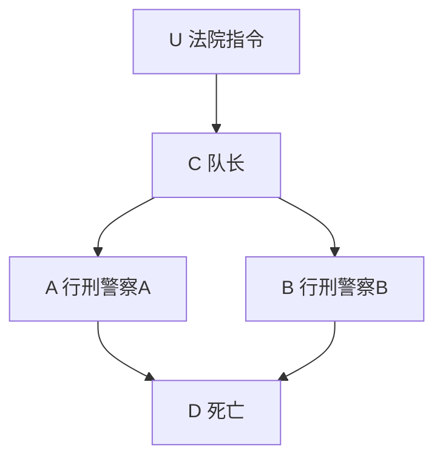

> 图 7.1 以两人行刑组为例的因果关系

假定法院的判决是未知的，两个行刑警察都是枪法准确、敬业和守法的，同时囚犯不太可能死于恐惧或其他外生原因。我们希望构建这个实例的形式化描述，以便可以按部就班地对以下语句进行评估。

- **S1 预测** ——如果行刑警察 A 没有开枪，那么该囚犯还活着：

  $$
  \neg A \Rightarrow \neg D
  $$

- **S2 溯因** ——如果囚犯还活着，那么队长没有发出指令：

  $$
  \neg D \Rightarrow \neg C
  $$

- **S3 延导** ——如果行刑警察 A 开枪，那么 B 也开枪：

  $$
  A \Rightarrow B
  $$

- **S4 行动** ——如果队长没有发出任何指令，但行刑警察 A 决定开枪，那么囚犯必死，并且 B 不会开枪：

  $$
  \neg C \Rightarrow D_A \& \neg B_A
  $$

- **S5 反事实** ——如果发现囚犯已经死了，那么即使行刑警察 A 没有开枪，囚犯也会死：
  $$
  D \Rightarrow D_{\neg A}
  $$

##### 评估标准语句

为了证明前三句话，我们不需要引入因果模型。这些句子包含标准的逻辑连接词，因此可以使用标准逻辑推断进行处理。这个实例可以很方便地用任何逻辑理论（一组命题语句）来描述，例如：

$$
T_1: U \Leftrightarrow C, \quad C \Leftrightarrow A, \quad C \Leftrightarrow B, \quad A \lor B \Leftrightarrow D
$$

或者：

$$
T_2: U \Leftrightarrow C \Leftrightarrow A \Leftrightarrow B \Leftrightarrow D
$$

其中，任何一个理论都承认以下两个逻辑模型：

$$
m_1: \{U, C, A, B, D\} \quad \text{和} \quad m_2: \{\neg U, \neg C, \neg A, \neg B, \neg D\}
$$

也就是说，任何描述这个实例的逻辑理论 $T$ 都意味着，所有 5 个命题要么全部为真，要么全部为假。模型 $m_1$ 和 $m_2$ 明确展示了这两种可能性。因此，S1 ～ S3 的有效性很容易得到验证：要么从 $T$ 中推导得出，要么注意到每个语句中的前提和结果都是同一模型的一部分。

在继续分析语句 S4 和 S5 之前，有两点值得考虑。

首先， $T_1$ 和 $T_2$ 中的双向蕴含对于溯因是非常必要的。如果我们使用单向蕴含（例如， $C \Rightarrow A$ ），那么将无法从 $A$ 中推断出 $C$ 。在标准逻辑中，这种对称性消除了预测（正向推断）、溯因（从证据到解释的推断）和延导（从证据到解释，然后从解释到预测的推断）之间的所有区别。在使用双向蕴含时，这三种推断模式的区别仅仅在于它们对条件语句的前因后果的解释，而不是它们的推断方法。在非标准逻辑（例如，逻辑编程）中，如果蕴含符号表示推断的方向，并且不存在矛盾，则必须利用元逻辑推断机制来实现溯因（Eshghi and Kowalski，1989）。

其次，在标准逻辑中，S1 ～ S3 都涉及认知推断，即在静态世界中从信念到信念的推断，这一特性使得 S1 ～ S3 易于把握。例如，语句 S2 可以解释为：如果我们发现囚犯还活着，那么我们就有理由相信队长没有发出指令。逻辑学上的蕴含符号（ $\Rightarrow$ ）并没有超出这个范围，接下来将与反事实蕴含进行对比。

##### 评估行为语句

语句 S4 中出现了一个有意的行动——“行刑警察 A 决定开枪”。根据我们对行动的讨论（例如，参见第 4 章或定义 7.1.3），任何此类的行动都必须违反原有理论（设定）中的某些前提或机制。如果需要形式化地确定在某个行动下什么保持不变，我们必须把因果关系纳入这个理论中，仅靠逻辑关系是不够的。与我们的实例相对应的因果模型如下所示。

**模型 $M$ **

$$
\begin{array}{l}
(U) \\
C = U \quad (C) \\
A = C \quad (A) \\
B = C \quad (B) \\
D = A \vee B \quad (D) \\
\end{array}
$$

在这里，我们使用方程而不是蕴含，以便允许双向推断，并且与逻辑语句不同，强调每个方程都代表一种自治机制（数据库语言中的“完整性约束”）——除非被明确修改，它都会保持不变。我们进一步在每个方程的右边加上括号内容，以便在方程中明确标识等式的因变量（等式左边），从而表示在图 7.1 中以箭头为标识的因果不对称性。

为了评估 S4，我们遵循定义 7.1.3 并以此形成子模型 $M_A$ ，其中将方程 $A = C$ 替换为 $A$ （模拟行刑警察 A 忽略指令而做出开枪的决定）。

**模型 $M_A$ **

$$
\begin{array}{ll}
& (U) \\
C = U & (C) \\
A & (A) \\
B = C & (B) \\
D = A \lor B & (D) \\
\end{array}
$$

**事实：** $\neg C$

**结论：** $A, D, \neg B, \neg U, \neg C$

我们可以看出，已知 $\neg C$ ，可以轻松地推导 $D$ 和 $\neg B$ ，并由此确定 S4 的有效性。

值得注意的是，像 S4 这样的“问题”语句，其前提（即 $A$ ）违反了实例的一个基本事实（即两个行刑警察都敬业），而被处理成为该实例中确定的情况。传统的逻辑学家和概率学家倾向于拒绝像 S4 这样自相矛盾的语句，并坚持用概率的方式重新表述问题，以容许规则 $A = C$ 之外的情况¹。这种重新表述是没有必要的。结构方法允许我们能够在确定性环境中处理常见的因果关系，而无须先将因果关系放在不确定性的环境中。在这个框架中，所有规则都应默认理解为“可改变”的表达式，即受到故意干预的破坏。当然，物理学中的基本定律仍然是不变的，但是它们的适用性在某个情景中可能会因行动或外部干预而发生改变。

> ¹ 我推测，这个问题是 20 世纪 60 年代概率因果关系（probabilistic causality）出现的主要推动力之一（请参见 7.5 节）。

##### 评估反事实

现在我们准备评估反事实语句 **S5** 。按照定义 7.1.5，反事实 $D_{-A}$ 代表子模型 $M_{-A}$ 中 $D$ 的值。该值是不确定的，因为它取决于 $U$ 的值，而这个值在 $M_{-A}$ 中未明确。观测值 $D$ 可以消除这种不确定性。在发现囚犯死亡后，我们可以推断出法院已下达命令（ $U$ ），因此，如果行刑警察 $A$ 没有开枪，那么行刑警察 $B$ 便会开枪杀死该囚犯，从而证实 $D_{-A}$ 的说法。

我们可以使用定理 7.1.7 中的步骤通过形式化的方式推导出 $D_{-A}$ （尽管不涉及任何概率）。我们首先将事实 $D$ 添加到原始模型 $M$ 中，对 $U$ 求值，然后建立子模型 $M_{-A}$ ，并使用第一步中得到的 $U$ 值，重新评估 $M_{-A}$ 中 $D$ 取真值的情况。这些步骤解释如下。

**步骤 1** 模型 $M$

$$
\begin{array}{l}
C = U \\
A = C \\
B = C \\
D = A \vee B
\end{array}
$$

（U）事实： $D$  
结论： $U, A, B, C, D$

**步骤 2** 模型 $M_{-A}$

$$
\begin{array}{l}
C = U \\
\neg A \\
B = C \\
D = A \vee B
\end{array}
$$

（U）事实： $U$  
结论： $U, \neg A, C, B, D$

> **注意** ：只有背景变量 $U$ 从步骤 1 转移到了步骤 2。所有其他命题都必须根据修改后的模型重新评估。这反映了一种认识，即背景因素 $U$ 不受模型 $\{f_{i}\}$ 中的变量或机制的影响。因此，反事实结果（在我们的例子中为 $D$ ）必须在与现实世界中普遍存在的相同背景条件下进行评估。事实上，背景变量是从现实世界到假设世界的主要信息载体，在将前者转变为后者的动态过程中，它们充当了“不变性（或恒常性）的守护者”（本人与 David Heckerman 交流中得出的）。

还需要注意的是，评估反事实的两个步骤可以组合为一个过程。如果我们使用星号来区分修改前和修改后的变量，则可以将 $M$ 和 $M_{x}$ 结合为一个逻辑理论，并通过组合理论中的逻辑推断证明 **S5** 的有效性。为了说明这一点，我们将 **S5** 写为 $D \Rightarrow D_{-A}^{*}$ （读作：如果 $D$ 在现实世界中为真，那么 $D$ 在修改为 $\neg A^{*}$ 后的假设世界中也将为真），并在组合理论中证明 $D^{*}$ 的有效性，如下所示。

**组合理论**

$$
\begin{array}{l}
(U) \\
C^{*} = U \quad C = U \\
\neg A^{*} \quad A = C \\
B^{*} = C^{*} \quad B = C \\
D^{*} = A^{*} \vee B^{*} \quad D = A \vee B
\end{array}
$$

事实： $D$  
结论： $U, A, B, C, D, \neg A^{*}, C^{*}, B^{*}, D^{*}$

> **注意** ： $U$ 不必加注“星号”，以反映背景条件保持不变的假设。

在这一点上，值得反思的是 **S4** 和 **S5** 之间的差异。这两句话在语法上看起来完全相同，因为两句话都包含了一个隐含反事实的事实，然而我们将 **S4** 标记为“行动”语句，将 **S5** 标记为“反事实”语句。它们的区别在于已知事实与反事实的前提（即“行动”部分）之间的关系。在 **S4** 中，已知事实（ $\neg C$ ）不受前提（ $A$ ）的影响；在 **S5** 中，已知事实（ $D$ ）可能会受前提（ $\neg A$ ）的影响。

从它们的评估方法可以看出，这两种情况之间有根本的区别。在评估 **S4** 时，我们预先知道 $C$ 不会受到对模型的修改 $do(A)$ 的影响。因此，我们能够将 $C$ 直接添加到修改后的模型 $M_A$ 中。另一方面，在评估 **S5** 时，我们会考虑修改 $do(\neg A)$ 所造成的从 $D$ 到 $\neg D$ 的反转问题 $^{\ominus}$ 。因此，我们首先必须将事实 $D$ 添加到行动前的模型 $M$ 中，通过 $U$ 评估其影响，并在对模型的修改 $do(\neg A)$ 发生之后重新评估 $D$ 。因此，尽管行动的因果关系可以用反事实语句来表示，但反事实需要通过 $U$ 来传递已知事实的影响，这使得反事实不同于行动（参见 1.4 节）。

> **补充说明** ：我们还应该强调，在自然语言中，大多数反事实的话语往往都隐含对受前提影响的事实的认知。例如，当我们说“如若不是因为 $A$ ， $B$ 就会有所不同”，这意味着我们知道 $B$ 的实际值是什么，并且 $B$ 易受 $A$ 影响。正是这种关系赋予了反事实独特的特征，这与行动语句不同，正如我们在 1.4 节中所看到的，这样的语句需要更详细的说明以对其进行评估：一些有关函数机制 $f_{i}(pa_{i}, u_{i})$ 的知识是必要的。

#### 7.1.3 评估反事实：概率分析

为了说明反事实的概率评估（式（7.3）～（7.5）），让我们稍微修改一下行刑组的实例，假设：

- 1. 法院下令执行死刑的可能性为 $P(U)=p$ 。
- 2. 行刑警察 A 因为紧张而扣动扳机的概率是 $q$ 。
- 3. 行刑警察 A 的紧张与 $U$ 无关。

根据这些假设，我们希望计算 $P(\neg D_{\neg A}|D)$ 的值，即已知囚犯已经死亡的事实，如若 $A$ 没有开枪，囚犯存活的概率是多少。

直观来看，我们可以通过“当且仅当法院未签发命令时 $\neg D_{\neg A}$ 为真”的线索找出答案。因此，我们的任务相当于计算 $P(\neg U|D)$ ，其结果为 $q(1-p)/[1-(1-q)(1-p)]$ 。然而，我们的目标是在式（7.4）的基础上，给出一种推导这类概率的通用形式化方法，这种方法几乎不能依靠直觉。

与新实例相关的概率因果模型（定义 7.1.6）包含两个背景变量 $U$ 和 $W$ ，其中 $W$ 代表行刑警察 $A$ 的紧张情绪。该模型如下所示。

**模型** $\langle M,P(u,w)\rangle$

$$
\begin{array}{l l}
& (U, W) \sim P (u, w) \\
C = U & (C) \\
A = C \vee W & (A) \\
B = C & (B) \\
D = A \vee B & (D)
\end{array}
$$

在此模型中，背景变量分布为：

$$
P (u, w) = \left\{\begin{array}{l l}
p q & u = 1, w = 1 \\
p (1 - q) & u = 1, w = 0 \\
(1 - p) q & u = 0, w = 1 \\
(1 - p) (1 - q) & u = 0, w = 0
\end{array} \right. \tag {7.7}
$$

根据定理 7.1.7，我们第一步（溯因）需要计算后验概率 $P(u, w \mid D)$ ，因为发现囚犯已死的事实。这很容易得到：

$$
P (u, w \mid D) = \left\{\begin{array}{l l}
\frac {p (u , w)}{1 - (1 - p) (1 - q)} & u = 1 \text {或} w = 1 \\
0 & u = 0 \text {且} w = 0
\end{array} \right. \tag {7.8}
$$

第二步（行动）是在保留后验概率式（7.8）的基础上，形成子模型 $M_{-A}$ 。

**模型** $\langle M_{-A}, P(u, w|D) \rangle$

$$
C = U \quad (U, W) \sim P (u, w \mid D) \tag {C}
$$

$$
\begin{array}{l}
\neg A (A) \\
B = C (B) \\
D = A \vee B (D) \\
\end{array}
$$

最后一步（预测）是在此概率模型中计算 $P(\neg D)$ 。注意， $\neg D \Rightarrow \neg U$ ，（期望）结果为：

$$
P (\neg D_{\neg A} | D) = P (\neg U | D) = \frac {q (1 - p)}{1 - (1 - q) (1 - p)}
$$

#### 7.1.4 孪生网络法

上述过程中，一个主要的实际困难是需要计算、存储和使用后验分布 $P(u|e)$ ，其中 $u$ 表示模型中所有背景变量的集合。如前述示例，即使我们从背景变量相互独立的马尔可夫模型开始，条件 $e$ 通常也会破坏这种独立性，因此有必要在条件 $e$ 下对 $U$ 的联合分布进行完整描述。如果以表格的形式，那么这样的描述可能就会非常庞大，就像我们在式（7.8）中所做的那样。

Balke 和 Pearl（1994b）给出图模型方法，解决了这个困难。他们使用了两个网络，一个代表现实世界，另一个代表假设世界。图 7.2 展示了在行刑组的例子中这种结构的表示方法。

这两个网络在结构上是相同的，除了指向 $A^{*}$ 的箭头被删除，这是为了表达从孪生网络（twin network） $M_{\neg A}$ 中删除的方程。像连体双胞胎（Siamese twins）一样，这两个网络共享背景变量（在我们的例子中为 $U$ 和 $W$ ），因为它们在修改后保持不变。内生变量被复制并被明确标记，因为它们在假设世界和真实世界中可能会得出不同的值。因此，在模型 $\langle M_{\neg A}, P(u, v|z) \rangle$ 中计算 $P(\neg D)$ 的任务就简化为在孪生网络中计算 $P(\neg D^{*}|D)$ 的任务，其中 $A^{*}$ 被赋值为假。

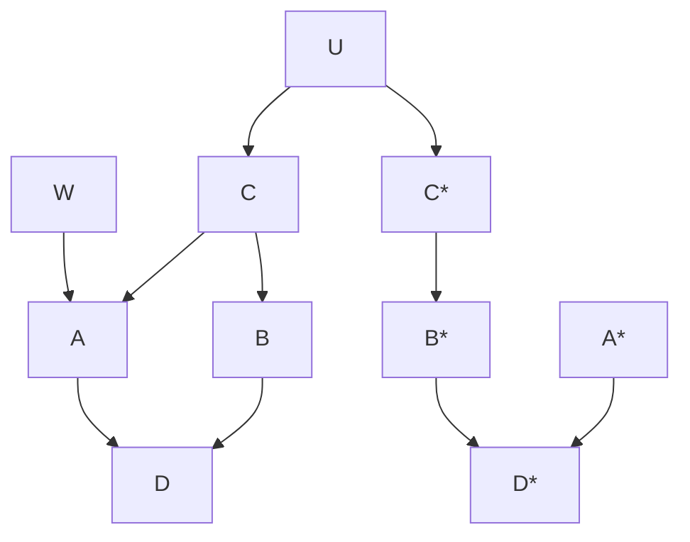

> **图 7.2** 行刑组示例中的孪生网络表示

一般来说，如果我们想计算反事实概率 $P(Y_{X}=y|z)$ ，其中 X、Y 和 Z 是任意变量集（不一定互不相交），定理 7.1.7 给出了在子模型 $\langle M_{x},P(u|z)\rangle$ 中计算 $P(y)$ 的方法，该方法将其简化为计算增强贝叶斯网络中常见的条件概率 $P(y^{*}|z)$ 。这种计算可以用标准证据传播技术（standard evidence propagation technique）来实现。将这种计算变为贝叶斯网络中推断的优点是不需要说明分布概率 $P(u|z)$ ，可以利用条件独立性，以及可以采用局部计算方法（如 1.2.4 节中总结的方法）。

孪生网络表示法还提供了一种检验反事实变量之间独立性的有效方法。为了说明这一点，假设存在一个链式因果图 $X \to Z \to Y$ ，我们想检验在 $Z$ 条件下， $Y_x$ 是否独立于 $X$ （即 $Y_x \perp X \mid Z$ ）。与该链相关的孪生网络如图 7.3 所示。为了检验 $Y_x \perp X \mid Z$ 在原始模型中是否成立，我们检验在孪生网络中 $Z$ 是否将 $X$ 从 $Y^{*}$ 中 $d$ -分离。可以很容易地看到（通过定义 1.2.3），以 $Z$ 为条件使得 $X$ 与 $Y^{*}$ 之间的路径通过 $Z$ 的对撞结构 $d$ -连接，因此 $Y_{x} \perp X \mid Z$ 在模型中不成立。这个结论很难从链式模型本身或从该模型方程中得出。以同样的方式，我们可以看出，只要以 $Y$ 或 $\{Y, Z\}$ 为条件，就会在 $Y^{*}$ 和 $X$ 之间形成一个连接。因此， $Y_{x}$ 和 $X$ 并不条件独立于这些变量。但是，如果不以 $Y$ 或 $Z$ 为条件，连接就会中断，于是 $Y_{x} \perp X$ 。

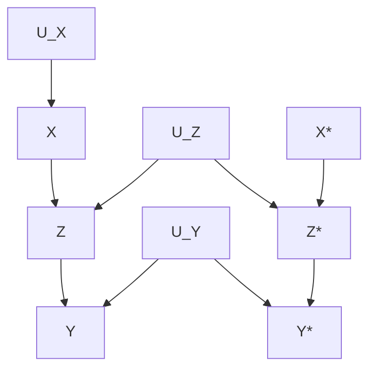

> **图 7.3** 在模型 $X \rightarrow Z \rightarrow Y$ 中反事实 $Y_{x}$ 的孪生网络图

孪生网络揭示了形如 $Z_{pa_z}$ 的反事实的有趣解释，其中 $Z$ 是任何变量， $PA_Z$ 代表 $Z$ 的父节点集合。考虑以下问题：在图 7.3 的模型中， $Z_x$ 是否独立于某些给定的变量集。这个问题的答案取决于 $Z^*$ 是否与该变量集 $d$ -分离。但是，任何与 $Z^*$ $d$ -分离的变量也将与 $U_Z$ $d$ -分离，因此节点 $U_Z$ 可作为反事实变量 $Z_x$ 的单向代理（one-way proxy）变量。考虑到 $Z$ 由方程 $z = f_Z(x, u_Z)$ 控制，所以这不是巧合。根据定义， $Z_x$ 的概率等于 $X$ 固定为 $x$ 时 $Z$ 的概率。在这种情况下，仅当 $U_Z$ 变化时， $Z$ 才可能变化。如果 $U_Z$ 服从某种独立关系，那么 $Z_x$ （更广泛而言， $Z_{pa_z}$ ）也必须服从该关系。因此，就所谓的“误差项” $U_Z$ 而言，我们得到了形式为 $Z_{pa_z}$ 的任何反事实变量的简单图模型表示。利用该图模型表示法，我们很容易从图 7.3 验证 $(U_Y \perp X \mid \{Y^*, Z^*\})_G$ 和 $(U_Y \perp U_Z \mid \{Y, Z\})_G$ 在孪生网络中都成立，因此，

$$
Y_{Z} \perp X \mid \{Y_{x}, Z_{x}\} \quad \text{和} \quad Y_{Z} \perp Z_{x} \mid \{Y, Z\}
$$

在模型中也都成立。Shpitser 和 Pearl（2007）报告了涉及孪生网络的更多考量，包括对多网络的推广（描述不同前提下的反事实）。参见 11.3.2 节和 11.7.3 节。

### 7.2 结构模型的应用与解释

结构方程模型（Structural Equation Modeling, SEM）在社会科学、心理学、管理学等领域有着广泛的应用。其核心优势在于能够同时处理 **测量关系** （潜变量与观测指标之间的关系）与 **结构关系** （潜变量之间的因果关系），从而实现对复杂理论模型的检验与解释。

#### 7.2.1 模型识别与参数估计

在应用结构模型之前，首先需要确保模型是 **可识别的** 。模型识别是指能否从观测数据的协方差矩阵中唯一地估计出所有模型参数。一个必要的条件是：

> **t 规则** ：模型待估计的自由参数数量 $t$ 必须小于或等于观测变量协方差矩阵中非冗余元素的数量，即：
>
> $$
> t \leq \frac{p(p+1)}{2}
> $$
>
> 其中 $p$ 为观测变量的个数。

常见的参数估计方法包括：

- **最大似然估计（ML）** ：最常用的方法，假设数据服从多元正态分布。
- **广义最小二乘法（GLS）** ：对正态性假设的稳健性稍强。
- **加权最小二乘法（WLS）** ：适用于分类数据或非正态数据。

**示例** ：考虑一个简单的模型，包含两个潜变量（ $\xi_1$ 和 $\eta_1$ ），每个潜变量由三个观测指标（ $x_1, x_2, x_3$ 和 $y_1, y_2, y_3$ ）测量。结构方程为：

$$
\eta_1 = \gamma_{11} \xi_1 + \zeta_1
$$

#### 7.2.2 模型拟合评估

模型估计完成后，需要评估其整体拟合优度。常用的拟合指数可以分为以下几类：

1.  **绝对拟合指数** ：衡量模型再现观测协方差矩阵的程度。

    -    **卡方值（ $\chi^2$ ）** ：值越小越好，但易受样本量影响。
    -    **RMSEA（近似误差均方根）** ：< 0.05 表示良好拟合，< 0.08 表示可接受拟合。
    -    **SRMR（标准化残差均方根）** ：< 0.08 表示良好拟合。

2.  **相对拟合指数** ：比较待测模型与基准模型（通常为独立模型）的改进程度。

    -    **CFI（比较拟合指数）** ：> 0.90 表示可接受，> 0.95 表示良好。
    -    **TLI（Tucker-Lewis 指数）** ：> 0.90 表示可接受，> 0.95 表示良好。

3.  **信息准则** ：用于比较非嵌套模型。

    -    **AIC（赤池信息准则）** ：值越小越好。
    -    **BIC（贝叶斯信息准则）** ：值越小越好。

> **批注** ：在实际应用中，不应仅依赖单一指标，而应综合报告多个拟合指数（如 $\chi^2$ 、RMSEA、CFI、SRMR），并结合理论依据进行判断。

#### 7.2.3 模型修正与解释

当模型拟合不佳时，可以进行模型修正。修正通常基于 **修正指数（MI）** 和 **理论依据** 。

- **修正指数** ：表示若释放某个被固定的参数（如增加一个残差相关或路径），模型卡方值预期减少的量。通常选择 MI 值较大且理论上合理的参数进行释放。
- **注意** ：模型修正应 **谨慎** 进行，避免过度数据驱动。每一次修正都应视为对原假设模型的扩展或调整，并需要在结果报告中明确说明。

**模型解释** 的核心在于 **路径系数** 的解读：

- **直接效应** ：一个变量对另一个变量的直接影响，由路径系数（ $\gamma$ 或 $\beta$ ）表示。
- **间接效应** ：一个变量通过中介变量对另一个变量的影响，等于各段路径系数的乘积。
- **总效应** ：直接效应与间接效应之和。

例如，若模型包含中介路径 $\xi \rightarrow \eta_1 \rightarrow \eta_2$ ，则 $\xi$ 对 $\eta_2$ 的间接效应为 $\gamma_{\xi\eta_1} \times \beta_{\eta_1\eta_2}$ 。

#### 7.2.4 多组分析与交互效应

**多组分析** 用于检验模型结构（如路径系数、因子载荷）在不同群体（如性别、文化背景）间是否一致。其步骤通常包括：

1.  分别在各组内运行模型，检查各组拟合情况。
2.  设定形态等同模型（即各组路径图相同，参数自由估计）。
3.  逐步增加约束（如因子载荷等同、路径系数等同、截距等同），比较约束模型与自由模型之间的卡方差异（ $\Delta \chi^2$ ）。

**交互效应** （调节效应）在 SEM 中通常通过以下方式处理：

- **乘积指标法** ：为潜变量创建乘积项（如 $\xi_1 \times \xi_2$ ）作为新的潜变量，并指定其测量指标。
- **多组分析** ：将调节变量（如高/低分组）作为分组变量，比较路径系数在不同组间的差异。

#### 7.2.5 实际应用示例

**研究问题** ：探究“工作满意度”与“组织承诺”对“离职意向”的影响，并检验“工作压力”的调节作用。

**假设模型** ：

- **测量模型** ：
- 工作满意度（ $JS$ ）由 $JS_1, JS_2, JS_3, JS_4$ 测量。
- 组织承诺（ $OC$ ）由 $OC_1, OC_2, OC_3$ 测量。
- 离职意向（ $TI$ ）由 $TI_1, TI_2, TI_3$ 测量。
- 工作压力（ $WS$ ）由 $WS_1, WS_2, WS_3$ 测量。

- **结构模型** ：
- $TI = \beta_1 JS + \beta_2 OC + \beta_3 WS + \beta_4 (JS \times WS) + \beta_5 (OC \times WS) + \zeta$

**分析步骤** ：

1.  **数据准备** ：检查缺失值、正态性、异常值。
2.  **模型设定** ：使用 Mplus 或 lavaan（R 包）等软件编写模型语法。
3.  **模型估计** ：运行模型，检查收敛情况。
4.  **拟合评估** ：报告 $\chi^2$ 、RMSEA、CFI、SRMR。若拟合不佳，查看 MI 进行修正。
5.  **结果解释** ：

    -   报告各路径的标准化系数及其显著性（ $p$  值）。
    -   若交互项显著，需进行简单斜率分析，绘制调节效应图。
    -   报告总效应、间接效应及其 Bootstrap 置信区间。

**结果报告示例** （表格形式）：

| 路径关系                      | 非标准化系数 | 标准误 | $t$ 值 | $p$ 值  | 标准化系数 |
| :---------------------------- | :----------- | :----- | :----- | :------ | :--------- |
| $JS \rightarrow TI$           | -0.35        | 0.08   | -4.38  | < 0.001 | -0.42      |
| $OC \rightarrow TI$           | -0.22        | 0.07   | -3.14  | 0.002   | -0.28      |
| $WS \rightarrow TI$           | 0.15         | 0.06   | 2.50   | 0.012   | 0.18       |
| $JS \times WS \rightarrow TI$ | 0.12         | 0.05   | 2.40   | 0.016   | 0.15       |
| $OC \times WS \rightarrow TI$ | -0.08        | 0.05   | -1.60  | 0.110   | -0.10      |

> **批注** ：上表显示，工作满意度与组织承诺均显著负向预测离职意向，而工作压力正向预测离职意向。工作满意度与工作压力的交互项显著，表明工作压力会削弱工作满意度对离职意向的负向影响。

#### 7.2.6 常见问题与注意事项

1.  **样本量** ：SEM 通常需要较大的样本量（一般建议 $N > 200$ ，或每个自由参数对应 10-20 个样本）。小样本可能导致估计不稳定或拟合指数失真。
2.  **正态性** ：ML 估计对多元正态性敏感。若数据严重偏离正态，可考虑使用稳健估计方法（如 MLR）。
3.  **缺失数据** ：处理缺失数据的方法包括列表删除、成对删除、全信息最大似然估计（FIML）和多重插补。FIML 是目前推荐的方法。
4.  **模型复杂性** ：模型越复杂，需要的样本量越大。应追求简洁且理论上合理的模型（简约原则）。
5.  **因果推断** ：SEM 本身

#### 7.2.1 线性经济计量模型政策分析：示例

在 1.4 节中，我们利用供需均衡的典型经济问题说明结构方程建模的性质（参见图 7.4）。在本章中，我们将使用该问题来回答与策略相关的问题。

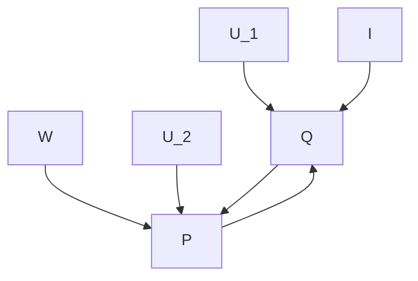

> 图 7.4 描述价格（P）与需求（Q）之间关系的因果图

回想一下，这个示例由两个方程组成：

$$
q = b_{1} p + d_{1} i + u_{1}, \tag {7.9}
$$

$$
p = b_{2} q + d_{2} w + u_{2} \tag {7.10}
$$

其中， $q$ 是家庭对产品 A 的需求量， $p$ 是产品 A 的单价， $i$ 是家庭收入， $w$ 是生产产品 A 的工资标准，而 $u_{1}$ 和 $u_{2}$ 是误差项，分别代表了影响需求量和价格的遗漏因子（Goldberger, 1992）。

如果我们定义 $V = \{Q, P\}$ 以及 $U = \{U_1, U_2, I, W\}$ ，并且基于定义 7.1.3，假设每个方程代表一个自治过程，那么这个方程组构成一个因果模型（定义 7.1.1）。通常，假设 $I$ 和 $W$ 是可观测变量，而 $U_1$ 和 $U_2$ 是不可观测的且独立于 $I$ 和 $W$ 的变量。

由于误差项 $U_1$ 和 $U_2$ 是不可观测的，因此模型的一个完整规范中必须包括这些误差项的分布，这些分布通常被认为是协方差矩阵为 $\sum_{ij} = \text{cov}(u_i, u_j)$ 的高斯分布。众所周知，在经济学中（可以追溯到文献（Wright，1928）），对 $\{I, W\}$ 和 $\{U_1, U_2\}$ 的线性、正态性和独立性的假设，使得我们可以对所有模型参数（包括协方差矩阵 $\sum_{ij}$ ）进行一致性估计。但是，本书的重点不是参数估计，而是参数在策略预测中的作用。因此，我们将说明如何评估以下三个问题。

- **问题一** ：如果价格被控制在 $P = p_0$ ，需求 $Q$ 的期望值是多少？
- **问题二** ：如果价格被报告为 $P = p_0$ ，需求 $Q$ 的期望值是多少？
- **问题三** ：假设当前价格为 $P = p_{0}$ ，如果价格被控制在 $P = p_{1}$ ，需求 $Q$ 的期望值是多少？

读者应该认识到这些问题分别代表了行动、预测和反事实，即我们所提出的三级层次结构。问题二在文献中是一个标准的预测问题，可以利用协方差矩阵直接进行回答，不涉及因果关系、结构或者不变性。问题一和问题三取决于方程的结构性质，正如预料，在有关结构方程的文献中没有提及这两个问题的处理方法[^1]。

为了回答问题一，我们将式（7.10）替换为 $p = p_0$ ，得到

$$
p = b_1 p + d_1 i + u_1, \tag{7.11}
$$

$$
p = p_0, \tag{7.12}
$$

其中，保留 $U_1$ 和 $I$ 的统计信息不变。那么，受控条件下需求为 $q = b_1 p_0 + d_1 i + u_1$ ，其期望值（以 $I = i$ 为条件）为

$$
E[Q \mid do(P = p_0), i] = b_1 p_0 + d_1 i + E(U_1 \mid i). \tag{7.13}
$$

由于 $U_1$ 独立于 $I$ ，因此最后一项的计算结果为

$$
E(U_1 \mid i) = E(U_1) = E(Q) - b_1 E(P) - d_1 E(I).
$$

将其代入式（7.13），得出

$$
E[Q \mid do(P = p_0), i] = E(Q) + b_1 (p_0 - E(P)) + d_1 (i - E(I)).
$$

问题二的答案是通过以当前观测值 $\{P = p_0, I = i, W = w\}$ 为式（7.9）的条件，并取期望值，得到

$$
E(Q \mid p_0, i, w) = b_1 p_0 + d_1 i + E(U_1 \mid p_0, i, w). \tag{7.14}
$$

一旦已知 $\sum_{ij}$ ，对 $E[U_1 \mid p_0, i, w]$ 的计算就是一个标准过程（Whittaker, 1990）。注意，尽管假设 $U_1$ 独立于 $I$ 和 $W$ ，但是只要观测到 $P = p_0$ ，这种独立性就不再成立。还要注意，式（7.9）和式（7.10）都参与了这个求解过程，并且即使 $b_1 = 0$ ，观测值 $p_0$ 也会（通过 $E(U_1 \mid p_0, i, w)$ ）影响期望需求 $Q$ ，但问题一并非如此。

问题三是以当前观测值 $\{P = p_0, I = i, W = w\}$ 为条件，计算反事实需求量 $Q_{p = p_1}$ 的期望值（请参见 11.7.1 节）。根据定义 7.1.5， $Q_{p = p_1}$ 由子模型控制

$$
q = b_1 p + d_1 i + u_1, \tag{7.15}
$$

$$
p = p_1. \tag{7.16}
$$

此外， $u_1$ 的概率密度应以观测值 $\{P = p_0, I = i, W = w\}$ 为条件。于是得到

$$
E(Q_{p = p_1} \mid p_0, i, w) = b_1 p_1 + d_1 i + E(U_1 \mid p_0, i, w). \tag{7.17}
$$

期望值 $E(U_1 \mid p_0, i, w)$ 与问题二中得出的期望值相同，后者仅在 $b_1 p_1$ 项有所不同。Balke 和 Pearl（1995a）描述了一种用于评估线性高斯模型中反事实问题的通用矩阵方法。

在这一点上，值得强调的是，计算反事实期望的问题并不是一个学术习题。实际上，它代表了几乎所有决策情况中的典型案例。无论何时，当我们着手预测策略的效应时，需要考虑两个方面。首先，策略变量（例如，经济学中的价格和利率，过程控制中的压力和温度）很少是外生的。当我们观测一个正在运行的系统时，策略变量是内生的。在计划阶段，当我们付诸实施行动和变化时，策略变量变成了外生变量。其次，很少对策略变量进行抽象评估。相反，它们是由某些情况所引起的，而这些情况需要进行补救性修正。例如，在故障排除过程中，我们观测到受其他条件 $X = x$ 影响的不良情况 $e$ ，并希望预测一种引起 $X$ 发生变化的行动是否可以补救这种情况。 $e$ 提供的信息非常有价值，在我们能够预测某个行动的效应之前，必须对其进行处理（利用溯因）。正如我们在对问题三的式（7.17）的评估中所看到的那样，溯因这一步使得在解决实际问题的过程中，行动具备了反事实特征。

当前价格 $p_0$ 反映了决策时普遍的经济状况（如 $Q$ ），假定这些经济状况在不同的策略下是可变化的。因此，价格 $P$ 代表一个内生决策变量（如图 7.4 所示），而该变量在规划审议过程中变成了外生变量，并由子模型 $M_{p = p_1}$ 决定。我们将问题三中的假设性语句转化为策略分析中的一个实际应用问题，即“已知当前价格为 $P = p_0$ ，如若我们今天将价格更改为 $P = p_1$ ，那么需求的期望值（ $Q$ ）是多少。”在下一节以及 11.7.2 节中将讨论在实际决策中使用假设性语句的原因。

[^1]: 在有关结构方程的文献中没有提及这两个问题的处理方法。

#### 7.2.2 反事实的实证性内容

“反事实”这个词用词不当，因为它指的是一种与事实相反的说法，或者至少是一种逃避实证性验证的说法。反事实不属于这两类，它是科学思想的基础，与任何科学规律一样具有明确的实证性信息。

考虑欧姆定律 $V = IR$ 。该定律的实证性内容可以用以下两种形式进行描述。

1.  **预测形式** ：如果在时间 $t_0$ 测得电流 $I_0$ 和电压 $V_0$ ，那么在任何将来的时间 $t > t_0$ ，如果电流为 $I(t)$ ，则电压为

$$
V(t) = \frac{V_0}{I_0} I(t)
$$

2.  **反事实形式** ：如果在时间 $t_0$ 处测得电流 $I_0$ 和电压 $V_0$ ，那么，如若在时间 $t_0$ 的电流是 $I'$ 而不是 $I_0$ ，则电压应为

$$
V' = \frac{V_0 I'}{I_0}
$$

从表面上看，预测形式提出了有意义且可检验的实证性内容，而反事实形式则仅仅是对没有（也不可能）发生的事件进行推测，因为不可能同时将两种不同的电流加到同一个电阻上。

但是，如果我们将反事实形式恰恰解释为预测形式的简记方式，则反事实的实证性内容就会很清晰地展现出来。这两种方法都使我们能够仅根据一个测量值 $(I_0, V_0)$ 进行无限次的预测，并且都能从一个科学定律中得出它们的有效性，该定律将随时间不变的特性（比率 $V / I$ ）归因于任何导电物体都存在的现象。

但是，如果反事实语句仅仅是一种用于表达预测的迂回的方式，那么为什么我们要求助于这种复杂的表达方式而不直接使用预测模式呢？一个显而易见的答案是，我们经常使用反事实来表达的不是预测本身，而是这些预测的逻辑结果。例如，“如若 $A$ 不开枪，那么囚犯仍将活着”这句话的意图可能仅仅是传达 $B$ 没有开枪的事实信息。在这种情况下，反事实语气表达的是对一般规律的逻辑论证进行事实补充。此外，一个不太明显的答案在于预测要求其余情况均相同（或均保持不变），而这并非完全没有歧义。当我们改变电阻器中的电流时，应保持什么条件恒定呢？温度？实验室设备？一天中的时间？当然不是电压表上的读数！

当我们对预测的要求做出判断时，必须仔细说明一些条件并认真对待。当我们使用反事实表达式时，有许多条件都是隐含的（因此是多余的），特别是当我们利用潜在因果模型时。例如，我们不需要指明在什么温度和压力下，这些预测才是正确的。这是由语句“在时间 $t_0$ 处的电流是 $I'$ 而不是 $I_0$ ”所蕴含的。换句话说，我们所指的是在时间 $t_0$ 处实验室中普遍存在的条件。这句话还暗示，我们并不是真正想让任何人维持电压表的读数不变。电压应该按照其自然过程运行，根据我们的因果模型，我们所能设想的变化取决于当前决定电流的机制。

总而言之，反事实语句可以很好地被解释为在一系列明确定义的条件下所做出的预测，这些条件存在于该语句中的事实部分。为了使这些预测有效，必须保持两个组成部分不变：定律（或机制）以及边界条件。用结构模型语言来说，定律对应于方程 $\{f_i\}$ ，边界条件对应于背景变量 $U$ 的状态（值）。因此，对一个反事实语句进行预测性解释，其有效性的前提条件是假设当我们的预测在应用或检验时， $U$ 不会改变。

博彩（下注）的实例能最好地说明这一点。我们必须对抛硬币的结果（正面或者反面）下赌注。如果我们猜对了，赢一美元；否则，输一美元。假设我们下注正面，不看 218 硬币的结果，赢了一美元。考虑反事实的表述：“如若我以不同的方式下注，我会输一美元。”这句话的解释可能变成了一种令人难以置信的说法：“如果我下一次赌注是反面，我将输一美元。”为了使该说法有效，必须假设两个不变因素：输赢规则和硬币结果。前者在博彩业中是一个貌似合理的假设，而后者只有在极少数特殊的情况下才能保持不变。正因为如此，“如若我以不同的方式押注，我就会输一美元”这句话的预测效果相当低，甚至有人认为这是在事后胡说八道。正是 $U$ 和 $f(x, u)$ 在时间上的恒常性才赋予反事实表达式预测能力。如果没有这种不变性，反事实将明显失去预测效果。

然而，在反事实中有一种效用因素，它不能立刻转化为预期的输赢回报，但可以用来解释反事实在人类话语中无处不在。此时，我所考虑的是其在解释方面的价值。假设在博彩的例子中，每次下注都重新抛硬币。“如若我以不同的方式下注，我会输一美元”这句话没有任何价值吗？我相信有。它告诉我们，我们面对的不是一个异想天开的赌徒，而是一个至少会看一眼赌局，拿它与某个标准进行比较，并一直坚持某种策略来决定输赢的人。这些信息对于我们这些玩家来说可能不是很有用，但对那些经常校准赌博机以确保政府能从中获利的检察官来说是有用的。更重要的是，如果我们冒险稍微作弊，比如说，操纵硬币的轨迹，或者安装一个微型发射器来告诉我们硬币落在哪边，这对我们这些玩家来说可能也很有用。为了使这种作弊方式奏效，我们应该知道输赢规则 $y = f(x, u)$ ，而“如若我以不同的方式下注，我会输一美元”这句话则说明了该规则的重要性。

通过假设不太可能发生的情况（比如玩家作弊、规则被打破）来论证反事实的价值是否会很牵强？我认为，这种不太可能的操作恰恰是衡量语句在解释方面价值的标准。任何因果解释的本质是，它的效用不是在常规情况中证明的，而是在需要进行非常规操作中体现出来。了解电视工作原理的作用不在于是否能够正确地旋转按钮，而是在电视机发生故障时能够修复它。回想一下，每个因果模型都包含许多子模型，未必只有一个子模型，每个子模型都是通过违反某些规则创建的。因此，因果模型中机制的 **自治性（autonomy）** 代表取消或替换这些机制的开放性，而且很自然，一个语句的解释价值是对替换后的结果的预测程度来判断的。

##### 反事实的内在不确定性

重新回顾一下我们的讨论，我们发现反事实可以在两种情况下具有预测价值：

（1）当不可观测的产生不确定性的变量（ $U$ ）保持不变时（直到我们下一次预测或行动）；

（2）当导致不确定性的变量有可能在未来某个时候（在我们的下一次预测或采取行动之前）被观测到时。

在这两种情况下，我们还需要确保结果生成机制 $f(x, u)$ 保持不变。

当在微观现象中使用反事实，这些结论会出现有趣的问题，因为以上两种情况都不适用于在量子理论中遇到的不确定性问题。海森堡的骰子每秒会滚动数十亿次，我们对 $U$ 的测量永远无法精确到足以消除反应方程 $y = f(x, u)$ 中的所有不确定性。因此，当我们把量子级过程纳入分析中时，我们会面临一种两难的境地： **要么摒弃所有关于反事实的讨论** （一些研究人员所建议的策略，包括 Dawid，2000）， **要么继续使用反事实，但其使用范围仅限于假设在经验上被认可的情况** 。这相当于在我们的分析中只保留满足第（1）项和第（2）项条件的变量 $U$ 。不假设 $U$ 完全消除了所有不确定性，而是只接受那些（1）保持不变的变量 $U$ ，或（2）潜在可观测的变量 $U$ 。

显然，不对背景变量进行细分是有代价的：机制描述方程 $v_{i} = f_{i}(pa_{i}, u_{i})$ 失去了确定性，因而变得随机。我们应该考虑随机函数 $\{f_{i}^{*}\}$ 组成的模型，而不是从一组确定性方程 $\{f_{i}\}$ 中构建因果模型，其中每个 $f_{i}^{*}$ 是从 $V \cup U$ 到 $V$ 的某个内在概率分布 $P^{*}(v_{i})$ 的映射，这种方式会得到一个因果贝叶斯网络（1.3 节），其中条件概率 $P^{*}(v_{i}|pa_{i}, u_{i})$ 表示内在不确定性（有时称为“客观机会”；Skyrms，1980），根节点集合表示背景变量 $U$ ，这些背景变量是不受影响的或潜在可观测的。

在这种表示法中，反事实概率 $P(Y_{x} = y|e)$ 仍然可以使用定理 7.1.7 的三个步骤（溯因、行动和预测）来计算：

- **溯因阶段** ：根据事实 $e$ 确定根节点的先验概率 $P(u)$ ，从而得到 $P(u|e)$ 。
- **行动阶段** ：删除那些指向集合 $X$ 中变量的箭头，并将 $X$ 的值设为 $X = x$ 。
- **预测阶段** ：计算在操纵后的网络中 $Y = y$ 的概率。

当然，这种评估可以在普通的因果贝叶斯网络中实现（即不仅限于内在不确定性的网络）。但在这种情况下，计算的结果并不代表反事实 $Y_{x} = y$ 的概率。这样的评估相当于假设个体之间都是同质的，每个个体都具有总体的随机性质，即 $P(v_{i}|pa_{i}, u) = P(v_{i}|pa_{i})^{\ominus}$ 。这样的假设在量子级现象中可能是合理的，因为一个个体代表某个特定的实验条件，但在宏观现象中就不适合了，因为宏观中各个体之间可能存在明显的差异。

在第 1 章的示例中（1.4.4 节的图 1.6），随机归因（stochastic attribution）相当于假设没有人会受到药物的影响（如模型 1 所述），忽略了某些人可能实际上比其他人对药物更敏感的可能性（如模型 2 所示）。

### 7.2.3 因果解释、表达及其理解

众所周知，解释能增进理解力，懂得多的人能更有效地推断和学习。同时，人们普遍认为，解释的概念不能脱离因果的概念。例如，症状可以解释我们对某种疾病的看法，但不能解释疾病本身。但是，原因和解释之间的确切关系仍然是一个值得讨论的话题（Cartwright，1989；Woodward，1997）。

在确定性和概率性的背景下，因果关系和反事实的形式化理论对于已经充分解释的问题提供了一种新的视角，同时也为机器自动生成解释提供了全新的可能性（Halperm and Pearl，2005a，b）。

生成解释的一个很自然的出发点是使用因果贝叶斯网络（1.3 节），其中需要解释的事件（待解释事实）由网络中实例化节点的某种组合 $e$ 组成，任务是找到 $e$ 的祖代子集中的实例 $c$ （即原因），使得“解释力”在某种程度上最大化，即 $c$ 解释 $e$ 的程度。但是，这种度量方法的正确性尚未确定。

许多哲学家和统计学家认为，似然比 $L = \frac{P(e|c)}{P(e|c')}$ 是一种度量 $c$ 在多大程度上比 $c'$ 更好地解释 $e$ 的合理标准。Pearl（1988b，第 5 章）以及 Peng 和 Reggia（1986）通过最大化后验概率 $P(c|e)$ 找到了最佳解释。这两种方式都有缺陷，并且受到一些研究人员的批评，包括 Pearl（1988b）、Shimony（1991，1993）、Suermondt 和 Cooper（1993），以及 Chajewska 和 Halpern（1997）。为了弥补这些缺陷，人们提出更复杂的概率参数组合 $[P(e|c), P(e|c'), P(c), P(c')]$ ，但是这些参数似乎都没有很好地描述人们对“解释”一词的理解。

概率的度量问题在于无法表述 $c$ 和 $e$ 之间的因果关系的强度。只要稍加想象，任何命题 $h$ 都可以被认为对 $e$ 有某种影响，无论这个影响多么微弱。这使得 $h$ 成为因果网络中 $e$ 的祖代，并允许 $h$ 与 $e$ 存在强伪相关，从而使 $h$ 在与真正解释的竞争中胜出。

为了解决这一难题，我们必须跨过概率的度量，专注于因果参数，例如，因果效应 $P(y|do(x))$ 和反事实概率 $P(Y_{x'}=y'|x,y)$ ，作为定义解释力的基础。其中， $x$ 和 $x'$ 的范围包含在可选解释的集合内， $Y$ 是反应变量的集合，由观测得到，反应变量的值为 $y$ 。表达式 $P(Y_{x'}=y'|x,y)$ 读作“如若 $X$ 为 $x'$ （代替实际值 $x$ ），则 $Y$ 取不同值 $y'$ 的概率”。（注意 $P(y|do(x)) \triangleq P(Y_x=y)$ 。）当前，随着因果效应和反事实概率计算模型的发展，有可能将因果参数与标准概率参数结合起来，从而整合出一种更可靠的解释力的度量方法，以帮助选择和生成合理的解释。

这些可能性引出一个重要的本质问题：“解释”到底是一个基于一般因果的概念（例如，“喝毒药导致死亡”），还是基于特例因果（singular cause）的概念（例如，“苏格拉底喝毒药导致他死亡”）？因果关系表达式 $P(y|do(x))$ 属于一般因果，而反事实表达式 $P(Y_{x'} = y'|x, y)$ 则属于特例因果，因为以 $x$ 和 $y$ 为条件将会使一般情况被缩小为与当前已知最特定的信息相一致的情况，即 $X = x$ 和 $Y = y$ 。

将因果语句分为一般和特例两种类别，一直是哲学领域深入研究的主题（参见 Good, 1961；Kvart, 1986；Cartwright, 1989；Eells, 1991；另请参见 7.5.4 节和 10.1.1 节中的讨论）。这项研究在认知科学和人工智能领域很少受到关注，一部分原因是它没有实际的推断过程，另一部分原因是它建立在有问题的概率语义上（参见 7.5 节中讨论的概率因果关系）。在机器生成的解释中，这种分类同时具有认知意义和计算意义。

我们在第 1 章（1.4 节）中讨论了两种因果问题之间的明确界线，这些因果问题可从 $\langle P(M), G(M) \rangle$ 得到答案（分别与模型 $M$ 相关联的概率和图模型），并且需要以函数形式表达的额外信息。一般因果关系语句（例如， $P(y|do(x))$ ）通常属于第一类（如第 3 章中所述），而反事实表达式（例如， $P(Y_x' = y|x, y)$ ）属于第二类，因此，需要更详细的说明和更多的计算资源。

如何将解释合理地分类为一般性类别还是特例性类别，取决于原因 $c$ 是否产生对于效应 $e$ 的一般性趋向（与 $c$ 的导致其他效应的较弱趋向相比），而获得 $c$ 对于效应 $e$ 的解释力，还是由于 $c$ 触发一系列特定事件的必要条件，从而在特定情况下导致 $e$ 的发生（例如，满足 $e$ 也许还包含其他事实和观测的特征）。从形式上讲，两者的区别在于，在评估各种假设的解释力时，我们是否应该根据实际发生的事件 $c$ 和 $e$ 来确定我们的信念。

> **译者注：** 即使分为一般因果和特例因果两种解释，其分界仍然是十分模糊的。“苏格拉底喝毒药导致他死亡”看起来应是特例因果解释。如果并没有用到苏格拉底这个个体的特殊性质（背景变量），那么这个解释也适用于“一般的”人，因此实际上这也是一般性解释。

第 9 章和第 10 章给出了形式化分析方法，讨论了因果关系的必要和充分条件以及特例事件因果关系的概念。在本节的其余部分中，我们将以必要条件为准则，诠释和生成解释性语句。

下面的列表主要摘自文献（Galles and Pearl，1997），给出了在 7.1.1 节中描述的可修改的结构模型方法中用于解释性语句及其相关语义的实例。

- ☐ 如果存在两个 $X$ 的值 $x$ 和 $x'$ ，以及一个 $U$ 的值 $u$ ，使得 $Y_x(u) \neq Y_{x'}(u)$ ，那么“ $X$ 是 $Y$ 的原因”。
- ☐ 如果存在两个 $X$ 的值 $x$ 和 $x'$ ，以及一个 $U$ 的值 $u$ ，使得 $Y_{xz}(u) \neq Y_{x'z}(u)$ ，那么“在

#### 因果关系的定义与分类

在 Z = z 的情况下，X 是 Y 的原因。

> **说明** ：以下定义基于可修改的结构模型，用于区分不同类型的因果关系。

☐ 如果存在两个 X 的值 x 和 $x'$ ，以及一个 U 的值 u，使得 $Y_{xr}(u) \neq Y_{x'r}(u)$ （其中 r 是变量集 $V \setminus \{X, Y\}$ 的具体赋值），那么“X 是 Y 的直接原因”。

☐ 如果 X 是 Y 的原因并且 X 不是 Y 的直接原因，那么“X 是 Y 的间接原因”。

☐ 如果以下情况成立，那么“事件 X = x 总会导致 Y = y”：

- (i) 对于所有 u， $Y_{x}(u) = y$ 。
- (ii) 存在一个 U 的值 $u'$ ，对于某些 $x' \neq x$ ，满足 $Y_{x'}(u') \neq y$ 。

☐ 如果以下情况成立，那么“事件 X = x 可能会导致 Y = y”：

- (i) X = x 和 Y = y 为真。
- (ii) 存在一个 U 的值 u，对于某些 $x' \neq x$ ，满足 $X(u) = x$ 、 $Y(u) = y$ 、 $Y_{x'}(u) \neq y$ 。

☐ 如果以下情况成立，那么“不可观测的事件 X = x 可能是 Y = y 的一个原因”：

- (i) Y = y 为真。
- (ii) 对于所有 $x' \neq x$ ， $P(Y_{x} = y, Y_{x'} \neq y \mid Y = y)$ 较大。

☐ 如果以下情况成立，那么“尽管 X = x，事件 Y = y 仍会发生”：

- (i) X = x 和 Y = y 为真。
- (ii) $P(Y_{x} = y)$ 较低。

---

以上列表展示了可修改的结构模型在因果表达的细微差别上展示的灵活性。其他细微差别（例如，激活、防止、维持、产生等概念）将在第 9 章和第 10 章中进行分析。

相关表达方式包括：

- “事件 A 解释了事件 B 的发生”
- “如果 C 发生，A 将解释 B”
- “不管 A 是否发生，B 还是会发生，因为 C 发生了”

解释和生成此类解释性句子，或者选择最适合上下文的表达方式，是人机对话研究中最有趣的挑战之一。

### 7.2.4 从机制到行动再到因果

7.1.1 节中描述的结构模型语义为认知科学和人工智能中的两个问题提出了解决方案：行动的表示和因果顺序的作用。由于第二个问题建立在第一个问题的基础上，因此我们将依次讨论这些问题。

#### 行动、机制和手术

无论我们采用概率范式（即行动是概率分布之间的转换）还是采用确定性范式（即行动是状态之间的转换），这些转换在原则上都可能是无限复杂的。在实践中，人们很快就可以相互传授行动的结果，并且可以毫不费力地预测大多数行动的后果。这是怎么做到的呢？

结构模型回答了这个问题，它假设在一般推断过程中将施加的行动表述为 **局部手术** （local surgery）。世界由大量自主的、不变的联系或机制组成，每一个联系或机制都对应一个物理过程，这个过程约束一组相对较少的变量集合的行动。如果我们理解了这些联系是如何相互作用的（通常这种相互只是共享变量），那么我们也应该能够理解任何行动的结果：只需简单地重新指定那些少数被行动干扰的机制，然后让这些修改后的机制进行相互作用，看看在平衡状态下会演化成什么状态。

如果规范说明是完全的（即如果给定 $M$ 和 $U$ ），那么将演化为单一状态。如果规范说明是概率性的（即如果给定 $P(u)$ ），那么将会出现一个新的概率分布。如果规范说明是不完全的（即如果一部分 $f_{i}$ 未给定），那么将会生成一个新的局部的理论。在这三种情况下，我们都能够回答关于行动发生之后的状态问题，尽管准确性会依次降低。

使这种方式具有可操作性的因素是行动的 **局部性** 。单独来看，局部性是一个模糊的概念，因为在一个空间中可能是局部的，但在另一空间中则可能不是局部的。例如，一个杂音在时频（或傅里叶）表示中显得非常分散，相反，单纯乐声需要将时间拉长后才能被欣赏 $^{①}$ 。结构语义学强调行动在 **机制空间** 中是局部的，而不是在变量空间、语句或时间段中。例如，一组多米诺骨牌中最左边的物体倒了，在物理空间中似乎不是“局部”的，但在机制空间中却是局部的：只有一种机制受到扰动，即通常使骨牌保持稳定直立的重力支撑力；所有其他机制则都保持不变，如上述说明服从物理方程。

局部性使我们可以很容易地指定这种行动，而无须枚举该行动的所有影响。假设读者和我们一样，对多米诺骨牌的物理特性有着相同的理解，那么读者可以自己得出该行动或任何类型行动的后果：“将第 $i$ 个多米诺骨牌向右倾斜”。通过以稳定机制的集合形式表示域，我们实际上已经创造了一个 **预言能力器** ，它能够回答大量有关行动和行动组合所产生的效应的问题，而无须详细地解释这些效应 $^{②}$ 。

> ① 作者在这里试图说明，杂音和单纯乐声都是对于原状态空间的干预（修改），但是杂音是局部的，而乐声是非局部的。——译者注  
> ② 即对于任何违反某个稳定机制的行动或行动组合，都是局部地改变了这个域（只修改了其中的某些稳定机制），因而能够回答这种改变的后果。——译者注

#### 定律与事实

在结构方程模型中，这种手术过程听起来微不足道。然而，当人们试图以经典逻辑方法来实现这些方案时，就会遇到很大困难。为了在机制空间中实施手术，我们需要一种语言，其中某些语句被赋予不同于其他语句的重要地位。

描述机制的语句应该与描述其他事实（例如，观察、假设和结论）的语句区别对待，因为前者通常被认为是稳定的，而后者只是暂时的。实际上，即使多米诺骨牌本身的状态可以随环境而变化，描述多米诺骨牌之间相互作用的方程式保持不变。

承认这种区别一直是从逻辑方法过渡到行动和因果关系艰难的一环，这也许是因为经典逻辑的强大之处在于表述的统一性和句法的不变性，在这种情况下，没有语句要求特殊的地位。概率学家不太愿意接受定律与事实之间的区别，因为贝叶斯在 1763 年就已经把这种区别纳入了概率语言：事实表示为普通命题，因此可以指定概率值，并且能够加以条件约束；另一方面，定律表示为条件概率语句（例如， $P(\text{事故} \mid \text{粗心驾驶}) = \text{高}$ ），因此不应该被赋予概率，也不能再以条件约束。

正是由于这一传统，概率学家总认为条件语句（例如，鸟会飞）不具有命题性质，拒绝接受基于结构的嵌套条件语句（Levi, 1988），并坚持将对于条件语句的信任程度解释为条件概率认定（Adams, 1975；也参见 Lewis, 1976）。值得注意的是，这些被一些哲学家视为局限性的约束条件，恰恰是防止概率学家混淆定律和事实的保障措施，使他们免于重蹈某些逻辑方法的覆辙 $^{①}$ 。

> ① Poole（1985）和 Geffner（1992）将定律与事实之间的区别作为非单调推理的基本原理。在数据库理论中，定律由称为完整性约束的特殊语句表达（Reiter，1987）。这种区别似乎在人工智能领域得到了更广泛的支持，因为这是形式化描述行动的必要条件（Sandewall，1994；Lin，1995）。

#### 机制与因果关系

从目前的讨论来看，我们似乎可以构建一种有效的表示方法来计算行动的后果，而无须使用任何因果关系的概念。在物理学和工程学的许多领域中，这确实是可行的。例如，我们有一个由电阻和电源组成的大型电路，如果想要计算电路中改变一个电阻的影响，那么几乎不会使用因果关系。只需将电阻修改后的值代入欧姆方程和基尔霍夫方程中，然后针对目标变量求解一组（对称）方程。这种方式可以有效地计算结果，而无须考虑电流和电压之间的任何因果关系。

为了理解因果关系的作用，我们应该注意到（与以上电路的例子不同）大多数机制在日常语言中没有专业的术语。我们说：“增加税收”，或“逗他笑”，或“按一下按钮”，即一般来说， $do(q)$ ，其中 $q$ 是命题，而不是机制。在电路示例中，“增加这个电流”或“如果这个电流更高……”这种说法是毫无意义的，因为有很多种（最小限度地）增加电流的方法，每种方法都会有不同的结果。显然，常识知识并不像电路那样错综复杂。

再举一个例子，在 STRIPS 语言 $^{①}$ （Fikes and Nilsson, 1971）中，一个行动不是由它所修改的机制的名称刻画的，而是由行动的直接效应（添加和删除数组）刻画的，这些效应都表示为普通命题。事实上，如果我们的知识是按因果关系组织的，那么此规范就足够了，因为每个变量都有且仅由一个机制控制（请参见定义 7.1.1）。因此，我们需要弄清楚，在实现某个指定的结果时，必须扰动哪种机制，使我们能够预测接下来的情况。

这种语言的缩略语形式定义了事件之间的一种新关系，我们通常将这种关系称为“因果关系”：如果实现事件 $A$ 所需的扰动导致了事件 $B$ 的实现，则事件 $A$ 导致事件 $B^{\ominus}$ 。这种因果缩略语在描述领域知识时非常有效。关于什么样的关系是稳定的，以及机制之间如何相互作用的复杂描述很少明确地依据机制来传达，而是依据事件或变量之间的因果关系来传达。例如，我们说：“如果骨牌 $i$ 向右倾斜，那么骨牌 $i + 1$ 也会向右倾斜”。我们不会根据每块多米诺骨牌如何保持其物理形状、如何反应重力，以及如何遵守牛顿力学来传达这些知识。

### 7.2.5 Simon 因果顺序

我们直接谈论一个事件导致另一个事件的能力在计算上非常有用（而不是一个行动改变一种机制，然后再产生影响），但同时它要求问题领域中的机制集合满足一定的条件，以适应因果方向性。实际上，7.1.1 节中给出的因果模型的正式定义假定了每个方程都指定了一个不同的特权变量，位于方程等号左边，作为“因变量”或“输出”。但是，通常，一个机制可以被指定为一个函数约束条件

$$
G_{k} (x_{1}, \dots , x_{l}; u_{1}, \dots , u_{m}) = 0
$$

而不需要识别任何“因变量”。

Simon（1953）设计了一个程序，判定一组对称函数 $G$ 是否为每个机制（不包括背景变量，因为它们是由系统外部确定的）选择一个内生因变量提供了唯一的方式。Simon 问到：我们什么时候才可以对变量 $(V_{1}, V_{2}, \cdots, V_{n})$ 进行排序，这样就可以求解每个 $V_{i}$ ，而不必先求解 $V_{i}$ 的任何后续变量？如果存在这样的顺序，那么就可以确定因果关系的方向。

这个标准一开始听起来像是人为的，因为求解方程的顺序是为了计算的便利，而因果方向性是物理现实中的一个客观属性。（有关此问题的讨论，请参见 De Kleer and Brown, 1986；Iwasaki and Simon, 1986；Druzdzel and Simon, 1993。）

为了证明这个标准的正确性，我们用行动和机制来重新阐述 Simon 的问题。假定可以独立地修改每种机制（即方程），并设 $A_{k}$ 为能够修改 $G_{k}$ 方程的行动集合（同时保持其他方程不变）。想象一下，我们从 $A_{k}$ 中选择了一个行动 $a_{k}$ ，并且对 $G_{k}$ 进行修改，使得整个方程组的解 $(V_{1}(u), V_{2}(u), \cdots, V_{n}(u))$ 与实施行动前的解不同。如果 X 是直接被 $G_{k}$ 约束的变量集，我们可以问：X 中是否存在一个元素（如 $X_{k}$ ），该元素可以说明所有其他解的变化。如果对于所有可选择的 $a_{k}$ 和 u， $X_{k}$ 总是能做出这样的说明，那么 $X_{k}$ 指定为 $G_{k}$ 中的因变量。

从形式化角度讲，这个性质意味着更改 $a_{k}$ 导致了从 $X_{k}$ 域到 $\{V \setminus X_{k}\}$ 域的函数映射，系统中的所有变化（由 $a_{k}$ 生成）都可以归因于 $X_{k}$ 的变化。在这种情况下，将 $X_{k}$ 指定为机制 $G_{k}$ 的“代表”是有道理的，我们有理由将语句“行动 $a_{k}$ 导致事件 $Y = y$ ”替换为“事件 $X_{k} = x_{k}$ 导致 $Y = y$ ”（其中， $Y$ 是系统中的任何变量）。 $X_{k}$ 对于所有可选择的 $a_{k}$ 保持不变是将一个行动视为 $do(X_{k} = x_{k})$ 的基础（定义 7.1.3）。它允许通过直接结果来表征行动，与产生这个结果的过程无关，这种不变性实际上定义了“局部行动”或“局部手术”的概念。

可以证明（Nayak，1994）， $X_{k}$ 的唯一性可以通过一个简单的准则来确定，该准则涉及方程组的纯拓扑性质（即变量如何组合到方程中）。这个准则能够使方程和变量之间形成一对一的对应关系，并且这种对应关系是唯一的。这可以通过解出方程和变量之间的“匹配问题”（Serrano and Gossard，1987）来确定。如果匹配是唯一的，那么每个方程中因变量的选择也是唯一的，并且因变量选择所引起的方向性定义了一个有向无环图（DAG）。例如，在图 7.1 中，箭头的方向无须从外部指定，它可以从刻画某个具体问题中的对称约束（即逻辑命题）集合中指定出来：

$$
S = \{G_{1} (C, U), G_{2} (A, C), G_{3} (B, C), G_{4} (A, B, D) \} \tag {7.18}
$$

读者可以很容易地验证，从每个方程中选择一个特权变量是唯一的，因此图 7.1 中所示箭头的因果方向性是必然的。

#### 因果方向性的来源与 Simon 的排序标准

因此，根据 Simon 的观点，我们看到因果方向性来自两个假设：

1.  将变量划分为背景变量集（ $U$ ）和内生变量集（ $V$ ）；
2.  模型中机制的整体配置。

因此，当将相同机制嵌入不同的模型时，在已知机制中指定为“因变量”的变量很可能被标记为“自变量”。

> **行间批注** ：事实上，当火车上坡时，发动机使车轮转动，但在下坡时发动机的作用却发生了改变。

当然，如果我们无法确定背景变量，那么可能会出现不同的因果顺序。例如，在式（7.18）中，如果不知道 $U$ 是背景变量，那么可以选择 $\{U, A, B, C\}$ 中的任何一个作为背景变量。不管选择哪一个变量，都会导致其余变量的排序不同（有些排序会与常识冲突，例如，队长的信号会影响法院的判决）。然而，在所有这些排序中，方向 $A \to D \leftarrow B$ 都保持不变。在对称约束系统中，变量是否存在一个划分 $\{U, V\}$ 的问题也可以通过拓扑方法（在多项式时间内）来解决（Dechter and Pearl, 1991）。

---

#### 方程组求解与因果顺序的失效

当我们无法一次求解一个方程，而必须同时求解一组 $k$ 个方程时，Simon 的排序标准就失效了。在这种情况下，由该方程组确定的所有 $k$ 个变量之间将是相互无序的，即使它们与其他方程之间仍然是有序的。

例如，在图 7.4 的经济模型中， $P$ 和 $Q$ 需要同时求解式（7.9）和式（7.10），因此方程和变量之间的对应关系并不唯一。 $Q$ 或者 $P$ 都可以在这两个方程中被指定为“自变量”。实际上，将式（7.9）归为“需求”方程（并将式（7.10）归为“价格”方程）所需的信息不是来自方程中的变量形式，而是来自对问题本身的考虑。我们对 **家庭收入直接影响家庭需求（而不是价格）** 的理解在此分类中发挥重要作用。

---

#### 反馈回路中的因果方向性

如果我们倾向于明确断言：因果关系在反馈回路环中的方向是顺时针的，那么这种说法通常基于 **解释力的相对大小程度** 。例如，打开水龙头会降低水箱中的水位，但我们无法利用水箱中的水打开水龙头。当这些信息可用时，因果方向性再次诉诸假设干预的概念，以及 **一个变量的外部控制是否会影响其他变量** 这样的问题进行确定的。因此，这种考虑方式构成了用于识别非递归因果模型中因变量 $V_{i}$ 的操作语义（定义 7.1.1）。

---

#### 因果关系的不对称性与物理方程的对称性

因果关系的不对称性与物理方程的对称性完全不冲突。“X 导致 Y，而 Y 不会导致 X”的意思是，更改一个机制（其中“X 是因变量”）与更改另一个机制（其中“Y 是因变量”）对结果的影响不同。由于涉及两种不同的机制，因此该语句与我们在物理方程中发现的对称性是完全一致的。

---

#### Simon 因果顺序理论对 Hume 归纳问题的启示

Simon 的因果顺序理论对 Hume 的因果归纳问题产生了深远的影响，即如何从经验中获得因果知识（请参见第 2 章）。从一组对称机制中推断出因果方向性（以及对一组内生变量的选择）意味着 **因果关系的发现与常见物理定律的发现（例如，通过实验）没有什么不同** ，如胡克定律的悬挂弹簧或牛顿定律的加速度。

这并不意味着发现物理定律是一项平凡的任务，没有方法论和哲学上的微妙之处。然而，这确实意味着，可以将 **因果归纳** 这一哲学史上最棘手的问题约简为更熟悉的 **科学归纳问题** 。

### 7.3 公理刻画

公理在形式化系统的描述中起着重要作用。它们对系统的基本性质给出了一个简洁的描述，从而允许在不同的公式之间进行比较，并易于对这些公式之间的等价性或包容性进行测试。此外，公理通常作为推断规则，从已知前提集合中推导（或验证）新的关系。

在下一小节中，我们将建立一套公理，描述在递归和非递归系统中，形式为 $Y_{x}(u)=y$ 的反事实语句之间的关系。利用这些公理，我们将证明如何用符号化的方法来识别因果效应（7.3.2 节），这与第 3 章（3.4 节）中的推论一致。

最后，7.3.3 节针对因果相关性的概念建立了公理，并与描述信息相关性的公理进行对比。

#### 7.3.1 结构反事实的公理

我们提出反事实的三个性质： **合成性** （composition）、 **有效性** （effectiveness）和 **可逆性** （reversibility），它们在所有的因果模型中都适用。

##### 性质 1（合成性）

对于因果模型中任意三组内生变量 $X$ 、 $Y$ 和 $W$ ，有：

$$
W_x(u) = w \Rightarrow Y_{xw}(u) = Y_x(u) \tag{7.19}
$$

合成性表明，如果我们强制将一个变量（ $W$ ）的值设置为 $w$ ，与没有干预的情况相同（ $W$ 的值也是 $w$ ），那么这个干预将不会对系统中的其他变量产生影响。这种不变性适用于所有的固定条件 $do(X = x)$ 。

由于合成性允许删除下标（即将 $Y_{xw}(u)$ 简化为 $Y_x(u)$ ），因此我们需要解释下标为空集的变量，当然我们无须干预也可识别出该变量。

##### 定义 7.3.1（空行动）

$$
Y_{\emptyset}(u) \triangleq Y(u)
$$

##### 推论 7.3.2（一致性）

对于因果模型中的任何变量 $Y$ 和 $X$ ，有

$$
X(u) = x \Rightarrow Y(u) = Y_{x}(u) \tag{7.20}
$$

##### 证明

在式（7.19）中，用 $X$ 代替 $W$ ，用 $\varnothing$ 代替 $X$ ，我们得到 $X_{\varnothing}(u) = x \Rightarrow Y_{\varnothing}(u) = Y_x(u)$ 。空行动的定义（定义 7.3.1）允许去掉 $\varnothing$ ，剩下 $X(u) = x \Rightarrow Y(u) = Y_x(u)$ 。

Robins（1987）将式（7.20）中的含义称为“一致性” $^{①}$ 。

> ① 经济学（Manski，1990；Heckman，1996）和统计学（Rosenbaum，1995）经常在潜在结果框架内使用一致性和合成性（3.6.3 节）。一致性由 Gibbard 和 Harper（1976，p.156）与 Robins（1987）正式提出（请参见式（3.52））。合成性由 Holland（1986，p.968）提出，并在 J. Robins 的文献中引起了我的注意。

##### 性质 2（有效性）

对于所有变量 $X$ 和 $W$ ， $X_{xw}(u) = x$ 。

有效性说明了干预对变量本身的影响，即如果强制将变量 $X$ 的值设置为 $x$ ，那么 $X$ 的取值肯定为 $x^{\ominus}$ 。

##### 性质 3（可逆性）

对于任意两个变量 $Y$ 和 $W$ 以及任意一组变量 $X$ ，有

$$
(Y_{xw}(u) = y) \& (W_{xy}(u) = w) \Rightarrow Y_{x}(u) = y \tag{7.21}
$$

可逆性防止了由于反馈回路所产生的多种结果。如果将 $W$ 的值设置为 $w$ 导致 $Y$ 的值为 $y$ ，并且如果将 $Y$ 设置为 $y$ 将导致 $W$ 值为 $w$ ，那么 $W$ 和 $Y$ 自然会得到 $w$ 和 $y$ ，而无须任何外部条件 ②。在递归系统中，可逆性可以直接从合成性推出。这很容易看出，在递归系统中，要么 $Y_{xw}(u) = Y_x(u)$ ，要么 $W_{xy}(u) = W_x(u)^{\text{®}}$ 。因此，毫无疑问，可逆性可以简化为 $Y_{xw}(u) = y \& W_x(u) = w \Rightarrow Y_x(u) = y$ （可逆性的另一种结构形式）或者 $Y_x(u) = y \& W_{xy}(u) = w \Rightarrow Y_x(u) = y$ （这是平凡的）。

> ② 与其他变量 $W$ 上的干预无关。——译者注

可逆性反映了“无记忆”的行为：系统状态 $V$ 只依据 $U$ 的状态，而不考虑 $U$ 的历史状态。不可逆性的一个典型例子是双方坚持“针锋相对”的策略（例如“囚徒困境”）。这样的系统在相同的外部条件 $U$ 下具有两个稳定的结果，即合作与背叛，因此不满足可逆性条件 ③。强迫其中的一个合作会导致另一个也合作（ $Y_{w}(u) = y, W_{y}(u) = w$ ），但这不能保证从一开始他们就合作（ $Y(u) = y, W(u) = w$ ）。在这样的系统中，这种不可逆性 ④ 是因为以过于粗糙的方式对状态进行描述，在这种描述方式中，决定系统最终状态的所有因素并不一定都包含在 $U$ 中。在一个针锋相对的系统中，一个完整的状态描述还应包括诸如囚徒先前的行动等因素，并且一旦包含了缺失的因素，可逆性就恢复了。

> ③ 即通过干预之后反推原来的值，所以称为可逆性（ $X = \varnothing$ ）。——译者注
> ④ 当 $W$ 是 $Y$ 的后代或同一层变量时是前一种情况，当 $W$ 是 $Y$ 的祖先时是后一种情况。——译者注

通常，合成性、有效性和可逆性这三个性质相互之间是独立的，其中任何一个都不是其他两个的结果。这可以通过构建特定的模型来证明（Galles and Pearl, 1997），在这些模型里，其中两个性质成立，而另一个性质不成立。在递归系统中，合成性和有效性是相互独立的，而可逆性是平凡的，如前面所示。

接下来的定理将证明性质 1 ～ 3 的可靠性（soundness） $^{①}$ ，即正确性。

> ① 术语可靠性和完备性有时分别称为必要性和充分性。

##### 定理 7.3.3（可靠性）

合成性、有效性和可逆性在结构模型语义中是可靠的，也就是说，它们适用于所有因果模型。

Galles 和 Pearl（1997）证明了定理 7.3.3。

我们接下来的定理证明了在公理系统或推断规则中这三个性质的完备性（completeness）。完备性等价于充分性，即反事实语句中的所有其他性质均来自这三个性质。

完备性的另一种解释如下：假设任何反事实语句集合 $S$ 与性质 $1 \sim 3$ 一致，那么存在一个因果模型 $M$ ，其中 $S$ 为真。

完整性的证明需要解释因果模型定义（定义 7.1.1）中隐含的两个技术方面的性质，即存在性（existence）和唯一性（uniqueness）。

##### 性质 4（存在性）

对于任何变量 $X$ 以及任何一组变量集合 $Y$ ，有

$$
\exists x \in X, \text{满足} X_{y}(u) = x \tag{7.22}
$$

##### 性质 5（唯一性）

对于任何变量 $X$ 以及任何一组变量集合 $Y$ ，有

$$
X_{y}(u) = x \ \&\ X_{y}(u) = x^{\prime} \Rightarrow x = x^{\prime} \tag{7.23}
$$

##### 定义 7.3.4（递归性）

设 $X$ 和 $Y$ 为模型中的单个变量， $X \to Y$ 表示对于某些值 $x$ 、 $w$ 和 $u$ ，不等式 $Y_{xw}(u) \neq Y_w(u)$ 成立。对于任意序列 $X_1, X_2, \cdots, X_k$ ，如果

$$
X_{1} \rightarrow X_{2}, X_{2} \rightarrow X_{3}, \dots, X_{k-1} \rightarrow X_{k} \Rightarrow X_{k} \nrightarrow X_{1} \tag{7.24}
$$

那么模型 $M$ 是递归的。

显然，对于任何模型 $M$ ，如果其对应的因果图 $G(M)$ 是无环图，那么 $M$ 必然是递归的。

##### 定理 7.3.5（递归完备性）

合成性、有效性和递归性是完备的（Galles and Pearl，1998；Halpern，1998）①。

> ① Galles 和 Pearl（1997）证明了递归完备性，假设对于任意两个变量，我们知道这两个变量中的哪一个变量是另一个变量的父节点（如果有）。Halpern（1998）在没有这个假设的情况下证明了递归完备性，只需要假设对模型中的任意两个变量，式（7.24）均成立。Halpern 进一步针对 $Y_{x}(u)$ 的解不是唯一的或不存在的情况提供了一组公理。

##### 定理 7.3.6（完备性）

对于所有因果模型，合成性、有效性和可逆性是完备的（Halpern，1998）。

当我们试图检验某一组条件是否足以识别反事实量 $Q$ 时，可靠性和完备性的重要地位就显现出来。在这种情况下，可靠性保证：如果我们使用三个公理以符号运算的方式来操作 $Q$ ，并设法将其简化为一个包含普通概率的表达式（不包含反事实术语）时，那么 $Q$ 是可识别的（依据定义 3.2.3）。完备性保证了相反的情况：如果我们不能成功地将 $Q$ 简化为概率表达式，那么 $Q$ 是不可识别的。这三个公理是非常强大的。

下一节我们将以有效性和分解性（decomposition）作为推断规则，来说明可识别性的一个证明方法。

#### 7.3.2 反事实逻辑中的因果效应：示例

我们回顾一下 3.4.3 节中所分析的吸烟——癌症这个示例。假设此示例相关的模型结构如下（参见图 7.5）：

$$
V = \{X (\text{吸烟}), Y (\text{肺癌}), Z (\text{焦油}) \}
$$

$$
U = \{U_{1}, U_{2} \}, \quad U_{1} \perp U_{2}
$$

$$
\begin{array}{l}
x = f_{1} (u_{1}) \\
z = f_{2} (x, u_{2}) \\
y = f_{3} (z, u_{1})
\end{array}
$$

该模型包含了几个假设，如图 7.5 所示。 **X 和 Y 之间缺失的链接** 代表了一种假设，即吸烟（X）对肺癌（Y）的效应完全由肺部焦油沉积物来调节。 $U_{1}$ （基因类型）和 $U_{2}$ 之间缺失的链接表示一种假设，即，即使 $U_{1}$ 加重了肺癌，但是除了间接链接之外（通过吸烟）， $U_{1}$ 对肺中的焦油量没有影响。

我们希望利用模型中包含的假设，推导出基于联合分布 $P(x,y,z)$ 的因果关系 $P(Y = y|do(x))\triangleq P(Y_x = y)$ 的估计表达式。

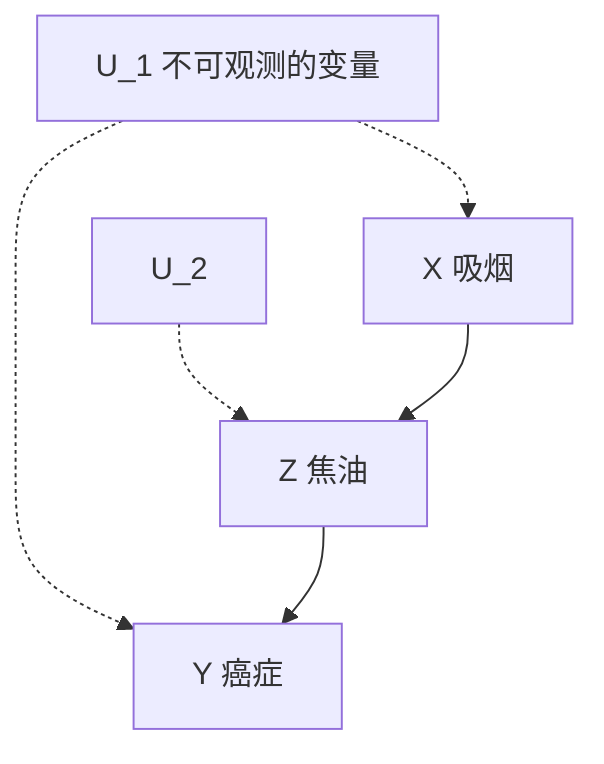

> **图 7.5** 吸烟对肺癌效应的因果图

该问题在 3.4.3 节中通过图模型方法解决，并使用了 do 算子公理（定理 3.4.1）。我们将演示如何通过纯粹的符号运算（不涉及反事实）将反事实表达式 $P(Y_{x}=y)$ 简化为概率表达式。在这里，我们仅使用概率演算和两个推断规则： **有效性和合成性** 。

为此，我们首先需要将图模型中所包含的假设转换为反事实语言。3.6.3 节表明，利用两个简单的规则可以完全实现反事实语句的转换（Pearl，1995a，p.704）。

**规则 1（排斥性约束）** ：对每个变量 Y（父节点集合为 $PA_{Y}$ ）以及每个变量集 $Z \subset V$ （与 $PA_{Y}$ 不相交），有

$$
Y_{p a_{\gamma}} (u) = Y_{p a_{\gamma}, z} (u) \tag {7.25}
$$

**规则 2（独立性约束）** ：令 $Z_{1}, \cdots, Z_{k}$ 为 V 中的任意节点集合，如果该集合无法通过只包含 U 变量的路径与 Y 连通，那么

$$
Y_{p a_{Y}} \perp \left\{Z_{1 p a_{Z_{1}}}, \dots , Z_{k p a_{Z_{k}}} \right\} \tag {7.26}
$$

等价地，如果相应的 $U=(U_{z_{1}},\cdots,U_{z_{k}})$ 联合独立于 $U_{y}$ ，则式（7.26）也成立。

> **232** 规则 1 反映了一旦其直接原因 $PA_{Y}$ 保持不变，则 Y 对 V 的任何操作都不敏感。它服从定义 7.1.1 中的等式 $v_{i}=f_{i}(pa_{i},u_{i})$ 。规则 2 将 U 中变量之间的独立性解释为变量 V 所对应的反事实之间的独立性，其中它们的父节点保持不变。实际上， $PA_{Y}$ 的统计值由等式 $Y=f_{y}(pa_{Y},u_{Y})$ 决定。因此，一旦我们固定了 $PA_{Y}$ ，Y 的残余变化完全受 $U_{Y}$ 控制。

将以上两条规则应用到我们的示例中，我们可以看到图 7.5 中的因果图包含了以下假设：

$$
Z_{x} (u) = Z_{y x} (u) \tag {7.27}
$$

$$
X_{y} (u) = X_{z y} (u) = X_{z} (u) = X (u) \tag {7.28}
$$

$$
Y_{z} (u) = Y_{z x} (u) \tag {7.29}
$$

$$
Z_{x} \perp \left\{Y_{z}, X \right\} \tag {7.30}
$$

式（7.27）～（7.29）来自式（7.25）的排斥性约束，使用

$$
P A_{X} = \emptyset , \quad P A_{Y} = \{Z \}, \quad \text{和} \quad P A_{Z} = \{X \}
$$

---

例如，式（7.27）表示从 $Y$ 到 $Z$ 不存在因果链接，而式（7.28）表示 $Z$ 到 $X$ 或 $Y$ 到 $X$ 不存在因果链接。相反，式（7.30）遵循式（7.26）的独立性约束，因为 $U_{1}$ 和 $U_{2}$ 之间没有连接（即 $U_{1}$ 和 $U_{2}$ 独立）排除了 $Z$ 和 $\{X,Y\}$ 之间仅包含 $U$ 变量的任何路径。

现在，我们使用这些假设（包含递归性），与合成性和有效性一起，来计算 3.4.3 节中分析的任务。

**任务 1** 计算 $P(Z_{x}=z)$ （即吸烟对焦油的因果效应）。

$$
\begin{array}{l}
P \left(Z_{x} = z\right) = P \left(Z_{x} = z \mid x\right) \quad \text {依据式(7.30)} \\
= P (Z = z \mid x) \quad \text {通   过   合   成   性} \tag {7.31} \\
= P (z \mid x) \\
\end{array}
$$

**任务 2** 计算 $P(Y_{z}=y)$ （即焦油对肺癌的因果效应）。

$$
P (Y_{z} = y) = \sum_ {x} P (Y_{z} = y \mid x) P (x) \tag {7.32}
$$

由于式（7.30）蕴含 $Y_{z}\perp\perp Z_{x}|X$ ，所以写成

$$
\begin{array}{l}
P \left(Y_{z} = y \mid x\right) = P \left(Y_{z} = y \mid x, Z_{x} = z\right) \quad \text {依据式(7.30)} \\
= P \left(Y_{z} = y \mid x, z\right) \quad \text {通过合成性} \tag {7.33} \\
= P (y \mid x, z) \quad \text {通过合成性} \\
\end{array}
$$

将式（7.33）代入式（7.32），得到

$$
P \left(Y_{z} = y\right) = \sum_ {x} P (y \mid x, z) P (x) \tag {7.34}
$$

**任务 3** 计算 $P(Y_{x}=y)$ （即吸烟对肺癌的因果效应）。

对于任意变量 Z，根据合成性，有

$$
Y_{x} (u) = Y_{x z} (u) \quad \text {当} Z_{x} (u) = z \text {时}
$$

由于 $Y_{xz}(u)=Y_{z}(u)$ （依据式（7.29）），因此

$$
Y_{x} (u) = Y_{x z_{x}} (u) = Y_{z} (u), \text {其中} z_{x} = Z_{x} (u) \tag {7.35}
$$

所以

$$
\begin{array}{l}
P \left(Y_{x} = y\right) = P \left(Y_{z x} = y\right) \quad \text {依据式(7.35)} \\
= \sum_ {z} P \left(Y_{z x} = y \mid Z_{x} = z\right) P \left(Z_{x} = z\right) \\
= \sum_ {z} P \left(Y_{z} = y \mid Z_{x} = z\right) P \left(Z_{x} = z\right) \quad \text {通过合成性} \tag {7.36} \\
= \sum_ {z} P \left(Y_{z} = y\right) P \left(Z_{x} = z\right) \quad \text {依据式(7.30)} \\
\end{array}
$$

分别计算式（7.34）和式（7.31）中的概率 $P(Y_{z} = y)$ 和 $P(Z_{x} = z)$ ，得到

$$
P (Y_{x} = y) = \sum_ {z} P (z \mid x) \sum_ {x^{\prime}} P (y \mid z, x^{\prime}) P (x^{\prime}) \tag {7.37}
$$

可以从 $P(x, y, z)$ 计算式（7.37）的右边项，并与 3.4.3 节（式（3.42））中得出的前门公式一致。

因此， $P(Y_{x}=y)$ 可以简化为关于观测变量的概率表达式，从而是可识别的。更一般地，我们的完备性结果（定理 7.3.5）意味着，任何可识别的反事实量都可以通过重复运用合成性和有效性（假设递归性），简化为适当的表达式。

#### 7.3.3 因果相关性公理

在 1.1.5 节中，我们提出了一类称为图胚（graphoid）关系的公理集合（Pearla and Paz, 1987; Geiger et al., 1990），用于描述信息相关性。现在，我们对于因果相关性提出一套平行的公理，即在物理世界中，某些事件如何影响其他事件的发生与观察者、推断者无关。

信息相关性涉及以下问题：“假设我们知道 _Z_，获得有关 _X_ 的信息会给我们带来有关 _Y_ 的新信息吗？”因果相关性涉及以下问题：“假设 _Z_ 是固定的，改变 _X_ 会改变 _Y_ 吗？”我们证明了在有向图中，因果相关性满足除了传递性外的所有路径截获公理（axioms of path interception）。

因果相关性的概念起源于 Suppes（1970）和 Salmon（1984）的哲学著作，他们试图给出因果关系的概率性解释，并认为有必要将因果相关性与统计相关性区分开来（参见 7.5 节）。虽然这些尝试并未给出因果相关性的概率定义（definition），但找到了在已知概率分布和变量之间时间顺序的情况下，检验相关性语句一致性的方法（参见 7.5.2 节）。在这里，我们的目标是将相关性语句本身公理化，而不涉及任何潜在的概率分布或时间顺序。

对于那些不存在精确的因果模型的领域，因果相关性的公理化可能是十分有用的，特别是对于这些领域中的实验研究人员。如果我们通过实验知道，在一个系统中，某些变量对其他变量没有因果关系，那么我们可能希望确定其他变量之间是否会产生因果关系（在不同的实验条件下），或者还有哪些其他的实验可以提供这样的信息。

例如，假设我们发现，当运动量保持不变时，老鼠的饮食情况对肿瘤生长没有影响；反之，当饮食情况保持不变时，运动对老鼠的肿瘤生长没有影响。我们希望能够推断出，仅控制饮食（不注意运动）仍然不会影响肿瘤的生长。另一个更微妙的推论问题是，笼中的环境温度是否会对老鼠的身体活动产生影响，因为我们已经确定了保持饮食不变时，温度对身体活动没有影响，并且当身体活动保持不变时，温度对（老鼠的）饮食选择没有影响。

Galles 和 Pearl（1997）分析了因果无关性的概率性解释和确定性解释。概率性解释将因果无关性等同于（原因变量）无法改变结果变量的概率，直觉上这一解释很合理，但在推断上却显得很无力。除非对潜在的因果模型做进一步的假设，否则它不支持一组表达能力较强的公理集。如果我们加上稳定性假设（即不可能通过改变系统中单个过程的性质来改变任何无关性），那么对于概率因果无关性，我们将在有向图中得到一组相同的公理集，该公理组支配一个节点集合的路径阻断特性。

在本节中，我们将分析确定性解释，该解释将因果无关性等同于在任何状态 $u$ 的情况下都无法改变结果变量。这种解释由一组丰富的公理决定，我们没有对因果模型做任何假设：有向图中的许多路径阻断特性都具有确定因果无关性。

##### 定义 7.3.7（因果无关性）

如果对于每个与变量 $X \cup Y \cup Z$ 不相交的集合 $W$ ，有

$$
\forall (u, z, x, x^{\prime}, w), \quad Y_{x z w} (u) = Y_{x^{\prime} z w} (u) \tag {7.38}
$$

其中， $x$ 和 $x'$ 是 $X$ 的两个不同的值，那么在 $Z$ 的条件下，变量 $X$ 与 $Y$ 因果无关，记为 $X \rightarrow Y \mid Z$ 。

这个定义描述了直觉“如果 $X$ 与 $Y$ 因果无关，那么在任何情况 $u$ 下，或者在对包含 $do(Z = z)$ 的模型做任何修改的情况下， $X$ 都不会影响 $Y$ 。”为了理解为什么我们要求等式 $Y_{xzw}(u) = Y_{x'zw}(u)$ 在任何背景 $W = w$ 的情况中都成立，请思考图 7.6 中的因果模型。在这个示例中， $Z=\varnothing$ ， $W$ 在 $X$ 之后发生，因此 $Y$ 也在 $X$ 之后发生，即 $Y_{x=0}(u)=Y_{x=1}(u)=u_{2}$ 。但是，由于 $y(x,w,u_{2})$ 是 $x$ 的一个非平凡函数，因此 $X$ 被认为与 $Y$ 因果相关。只有固定 $W$ 不变，才能揭示 $X$ 对 $Y$ 的因果影响。为了描述这种直觉，我们必须对定义 7.3.7 中的所有 $W=w$ 的情况进行考虑。

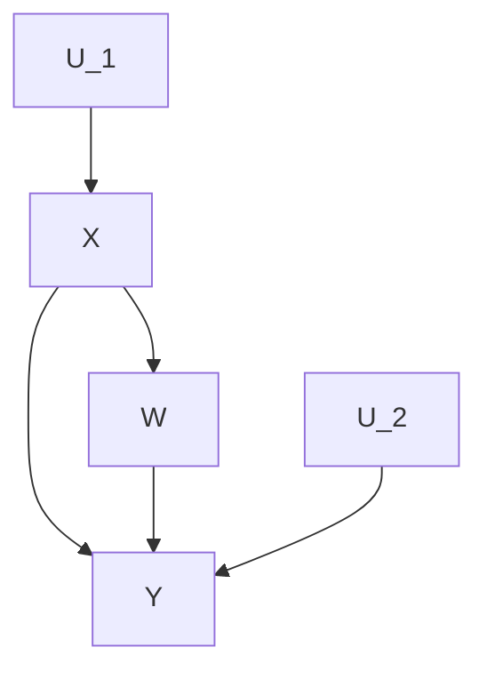

> **图 7.6** 一个因果模型的示例，其中需要检查子模型以确定因果相关性

利用因果无关性的定义，我们得到以下定理。

##### 定理 7.3.8

对于任何因果模型，以下情况都成立。

**弱右分解** $^{①}$ ：

> - ⊖ Galles 和 Pearl（1997）使用了更强的右分解形式： $(X \to XW|Z) \Rightarrow (X \to Y|Z)$ 。但是，Bonet（2001）指出必须削弱它才能使公理系统变得更可靠。

$$
(X \nrightarrow Y W | Z) \& (X \nrightarrow Y | Z W) \Rightarrow (X \nrightarrow Y | Z)
$$

**左分解** ：

$$
(X W \nrightarrow Y | Z) \Rightarrow (X \nrightarrow Y | Z) \& (W \nrightarrow Y | Z)
$$

**强联合** ：

$$
(X \nrightarrow Y | Z) \Rightarrow (X \nrightarrow Y | Z W) \forall W
$$

**右相交** ：

$$
(X \nrightarrow Y | Z W) \& (X \nrightarrow W | Z Y) \Rightarrow (X \nrightarrow Y W | Z)
$$

**左相交** ：

$$
(X \nrightarrow Y | Z W) \& (W \nrightarrow Y | Z X) \Rightarrow (X W \nrightarrow Y | Z)
$$

这组公理与有向图中的路径阻断特性非常相似。Paz 和 Pearl（1994）证明了在有向图 $G$ 中，当从 $X$ 到 $Y$ 的每条路径都至少包含了 $Z$ 中的一个节点时，定理 7.3.8 中的公理加上传递性和右分解，组成了关系 $(X \to Y | Z)_{G}$ 的完整描述。（也可参见 Paz et al., 1996）

Galles 和 Pearl（1997）指出，尽管缺乏传递性，但定理 7.3.8 允许从有向图的性质中推断出因果无关的某些性质。假设我们希望验证一般性的语句，例如：“如果 $X$ 对 $Y$ 有影响，但是当我们固定 $Z$ 时就不起作用了，那么 $Z$ 一定会对 $Y$ 有影响。”这个语句可以从以下事实中得到证明：在任何有向图中，如果从 $X$ 到 $Y$ 的所有路径都被 $Z$ 截断，并且没有从 $Z$ 到 $Y$ 的路径，那么就没有从 $X$ 到 $Y$ 的路径。

##### 因果相关传递性的讨论

从图 7.6 可以清楚地看到，因果相关是不可传递的。在 $(U_{1}, U_{2})$ 的任何状态下， $X$ 都可以改变 $W$ 的状态， $W$ 可以改变 $Y$ 的状态，但是 $X$ 不能改变 $Y$ 的状态。Galles 和 Pearl（1997）给出了一些例子，其中在较弱意义上定义的因果相关性（定义 7.3.7）也是不可传递的，即使对二元变量也是如此。那么，自然而然就会产生了疑问，为什么可传递性经常被认为是因果相关的固有属性？或者更确切地说，当认为因果相关可传递时，我们默认做了哪些假设？

一个貌似合理的答案是，我们通常将传递性解释为：“如果 $X$ 导致 $Y$ ， $Y$ 导致 $Z$ 且与 $X$ 无关，那么 $X$ 导致 $Z$ 。”关于传递性的问题会让人联想到链式过程，其中 $X$ 影响 $Y$ ， $Y$ 影响 $Z$ ，但 $X$ 对 $Z$ 没有直接影响。有了这个条件，可以通过合成性（式（7.19））证明二元变量的传递性，如下所示。

假设将语句“ $X=x$ 导致 $Y=y$ ”（记作 $x \to y$ ）表示为联合条件 $\{X(u)=x, Y(u)=y, Y_{x'}(u)=y' \neq y\}$ （换句话说， $x$ 和 $y$ 保持不变，但将 $x$ 变为 $x'$ 会使 $y$ 变为 $y'$ ）。现在我们可以证明，如果 $X$ 对 $Z$ 没有直接效应，即如果

$$
Z_{y' x'} = Z_{y'} \tag{7.39}
$$

则

$$
x \to y \ \& \ y \to z \ \Rightarrow \ x \to z \tag{7.40}
$$

证明式（7.40）的等号左边项包括：

$$
X(u) = x, \quad Y(u) = y, \quad Z(u) = z, \quad Y_{x'}(u) = y', \quad Z_{y'}(u) = z'
$$

我们可以把式（7.39）重写为 $Z_{y' x'}(u) = z'$ 。通过合成性，可进一步写作：

$$
Y_{x'}(u) = y' \ \& \ Z_{y' x'}(u) = z' \ \Rightarrow \ Z_{x'}(u) = z'
$$

其中，与 $X(u)=x$ 和 $Z(u)=z$ 结合起来可以得到 $x \to z$ 。

较弱的因果传递性形式在第 9 章（引理 9.2.7 和引理 9.2.8）中进行了讨论。

### 7.4 基于结构化和相似性的反事实

#### 7.4.1 与 Lewis 反事实的关系

##### 反事实的因果性

在 David Hume 最引人注目的一句话中，他将因果关系的两个方面联系在一起，即顺序的规律性和反事实的依赖性：

> 我们可以将一个原因定义为一个对象后面跟着另一个对象，并且所有与第一个对象相似的对象后面都跟着一个与第二个对象相似的对象，或者换句话说，如果第一个对象不存在，那么第二个对象也就不存在。（Hume, 1748/1958, 第 7 节）

涉及以上两个问题的定义在几个方面令人费解。第一，顺序的规律性和现代术语中的“相关性”都不足以解释因果关系，即便不是统计学家也知道这个问题。第二，考虑到规律性依赖于客观观察，而反事实依赖于主观想法，“换句话说”这种表达过于强烈。第三，Hume 早在九年前就提出了规律性准则 $^{①}$ ，人们不禁要问，是什么促使他用反事实来进行补充。

显然，Hume 对规律性的解释并不是十分满意，他一定觉得反事实的准则问题较少，且更具启发性。但是，“如果第一个对象不存在，那么第二个对象也就不存在”这种复杂的表达式如何解释“A 导致 B”这样简单常见的表达式呢？

> - Hume 在《人性论》中写道：“我们记得有很多客体对象存在的实例，而且还知道，另一种客体对象的个体一直伴随着它们，并在连续性和继承性方面都是以有规律的顺序存在。”（Hume，1739，p.156）

John Stuart Mill（1843）进一步回应了基于反事实的因果关系的观点，并在 David Lewis（1973b, 1986）的著作中得以体现。Lewis 呼吁完全放弃规律性解释，将“A 导致 B”解释为“如果 A 不发生，那么 B 就不会发生”。Lewis（1986, p.161）问道：“为什么不以事实为依据来看待反事实：作为对实际情况的另一种可能的陈述方式……？”

在这个提议中隐含着这样一种主张，即反事实表达比因果表达更清晰。否则，为什么“如果 $A$ 不发生，那么 $B$ 就不会发生”这样的表述会被认为是对“A 导致了 $B$ ”的解释，而不是相反的意思呢？除非我们有比因果表达更好的方式，以更大的把握来辨别反事实表达的对错。从字面上看，辨别反事实的对错需要生成和检查在实际情况中可替代的方案，以及检验某些命题在这些替代方案中是否成立，这是一项巨大的脑力工程。尽管如此，Hume、Mill 和 Lewis 都认为，进行这种脑力工作比直接凭直觉判断是否由 $A$ 导致了 $B$ 简单得多。如何才能做到这一点呢？什么样的思维表达方式才能使人类如此迅速且可靠地处理反事实，又是什么逻辑支配着这一过程，从而在一致性和合理性上保持统一标准呢？

##### 结构化与相似性

根据 Lewis 的观点（1973b），反事实评估涉及相似性的概念：通过某种相似性的度量对可能存在的世界进行排序，并且反事实 $A \square \rightarrow B$ （读作：“如若 A，则 B”）在 w 世界中被声明为真，以防在那些所有最接近 w 的 A-世界中 B 也都真（参见图 7.7）。

这种语义仍然没有解决反事实表达的问题。选择什么样的相似性度量才能让反事实推断与普通的因果概念相容？什么样的思维表达形式在世界排序中才会让反事实的计算（在人和机器上）变得可控和实用？

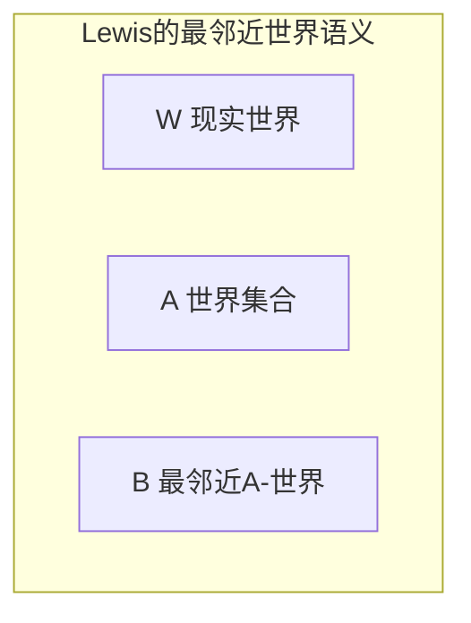

> 图 7.7 Lewis 的最邻近世界语义的图形表示。每个圆形区域对应于一组与 w 相似的世界。阴影区域表示最邻近的 A-世界的集合。由于所有这些世界都满足 B，因此反事实语句 $A \square \rightarrow B$ 在 w 中为真。

在最初的提议中，Lewis 小心翼翼地保持形式化尽可能地通用。除了要求每个世界都离自己最近之外，他没有在相似性度量上强加任何结构。然而，在进行简单的观察后，我们发现，相似性度量不能随心所欲。人们用反事实进行交流的事实已经表明，他们共享一种相似性度量，这种度量方式在头脑中的描述方式十分简洁，因此它肯定是高度结构化的。Kit Fine（1975）进一步证明了表面上相似是不够的。他举出了“如若尼克松按下按钮，就会爆发核战争”这种反事实，但人们普遍认为这是事实的。显然，与发生核爆炸的世界相比，一个按钮碰巧失效的世界与我们现在的世界更加相似。因此，相似性度量不仅不能是随心所欲的，而且它们还必须遵循因果法则 $^{①}$ 。

随后，Lewis（1979）建立了一个复杂的包含权重和优先级的系统来描述相似性的各个方面——“奇迹”（违反法则）的程度、事实匹配、时间顺序，等等——试图使相似性更接近因果直觉。但是，这些优先级可能是因果颠倒的，仍然会产生违反因果直觉（causal intuition）的推断（本人与 J. Woodward 的交流中得出）。

> - 在人工智能领域中，提出了一个相关的概念（即可能世界语义（possible-world semantics））来表示行动和数据库更新操作（Ginsberg，1986；Ginsberg and Smith，1987；Winslett，1988；Katsuno and Mendelzon，1991）。

这种难题并不会出现在结构化解释中。与 Lewis 的理论不同，反事实并不是建立在假设世界之间相似性的抽象概念上。相反，它们直接取决于生成这些世界的机制（或者更喜欢称为“定律”），以及这些机制的不变属性。Lewis 深奥难懂的“奇迹”理论被原则化的最小手术方法（principled minisurgeries）所取代，即 $do(X = x)$ ，它表示（对于所有 $u$ ）建立前因 $X = x$ 时所必需的最小变化（对一个模型来说）。因此，如果需要的话，相似性和优先级可以事后作为补充，加入 $do(\cdot)$ 操作中（参见式（3.11）以及 Goldszmidt 和 Pearl（1992）的讨论），但是它们并不是因果分析的基础。

结构解释通过简洁的知识描述来回答思维表达的问题，通过有效的算法可以从中推导出原因、反事实以及反事实的概率。但是，这种有效性一部分是通过将反事实的前提限制在命题语句合取的基础上而得到的。在析取假设中，例如“如果 Bizet 和 Verdi 是同胞”，通常会有多种理解，从而导致概率结果不唯一 $^{②}$ 。

> - 在这个方面，Lewis 把原因归结为反事实多少有点循环论证。

#### 7.4.2 公理系统的比较

如果我们根据因果知识来评估世界之间的距离，那么就会出现一个问题：因果知识是否会将自己的结构附加在距离上，这种结构并未在 Lewis 的逻辑中得到体现。换句话说，接受了利用因果关系来衡量世界的邻近程度的方法，是否限制了我们认为有效的反事实语句集合呢？这个问题不仅仅是一个理论问题。

例如，Gibbarda 和 Harpe（1976）使用 Lewis 的一般性框架来描述决策条件语句（即形式为“如果我们做 A，则有 B”的语句），然而，我们定义的 $do(\cdot)$ 操作却表示基于因果机制的函数。这两种形式是否相同目前还不确定。

> ② 这句话隐含一个析取假设，即他们可能是血缘同胞，或者民族同胞，或者籍贯同胞。——译者注

现在我们证明这两种形式在递归系统中是相同的。换句话说，当存在递归时，合成性和有效性都与 Lewis 的最邻近世界的框架保持一致。首先，我们提供一种 Lewis 的逻辑方法，用于描述反事实语句（摘自 Lewis（1973c））。

##### 规则

- （1）如果 A 和 $A \Rightarrow B$ 都是定理，那么 B 也是定理。
- （2）如果 $(B_{1}\&\cdots)\Rightarrow C$ 是定理，那么 $((A\square\rightarrow B_{1})\square\rightarrow B_{2})\cdots)\Rightarrow(A\square\rightarrow C)$ 也是定理。

##### 公理

（1）所有真值函数的重言式（永真式）

- （2） $A \square \rightarrow A$
- （3） $(A\square \rightarrow B)\& (B\square \rightarrow A)\Rightarrow (A\square \rightarrow C)\equiv (B\square \rightarrow C)$
- （4） $((A \lor B) \square \rightarrow A) \lor ((A \lor B) \square \rightarrow B) \lor ((A \lor B) \square \rightarrow C) \equiv (A \square \rightarrow C) \& (B \square \rightarrow C))$
- （5） $A \square \rightarrow B \Rightarrow A \Rightarrow B$
- （6） $A \& B \Rightarrow A \square \rightarrow B$

语句 $A \square \rightarrow B$ 表示“在所有最邻近世界中，如若 $A$ 成立，则 $B$ 也成立。”为了将 Lewis 公理与因果模型的公理联系起来，我们必须对 Lewis 的语言进行翻译。首先，我们将把 Lewis 世界等同于因果模型中所有变量的一个实例化，包括 $U$ 中的变量。然后，Lewis 命题将由因果模型中指定给变量子集的值代表（例如，在规定的规则和公理中的 $A$ 和 $B$ ）。因此，令 $A$ 代表合取 $X_{1} = x_{1}, \ldots, X_{n} = x_{n}$ ， $B$ 代表合取 $Y_{1} = y_{1}, \ldots, Y_{m} = y_{m}$ ，则

$$
\begin{array}{r l}
A \square & \rightarrow B \equiv Y_{1_{x_{1}, \dots , x_{n}}}(u) = y_{1} \\
& \& Y_{2_{x_{1}, \dots , x_{n}}}(u) = y_{2} \\
& \vdots \\
& Y_{m_{x_{1}, \dots , x_{n}}}(u) = y_{m}
\end{array}
\tag{7.41}
$$

反过来，我们将因果语句（例如 $Y_{x}(u) = y$ ）翻译为 Lewis 的表达方法。那么，令 $A$ 代表命题 $X = x$ ， $B$ 代表命题 $Y = y$ ，则

$$
Y_{x}(u) = y \equiv A \square \rightarrow B
\tag{7.42}
$$

公理（1）～（6）遵循最邻近世界理论的解释，对距离度量没有任何限制，除非要求每个世界 $w$ 与自己的距离不得超过与其他世界 $w' \neq w$ 的距离。由于结构语义定义了一个明确的度量世界之间的距离 $d(w, w')$ ，即等于将 $w$ 转换为 $w'$ 所需局部干预的最少数量。因此，在因果模型中，所有 Lewis 公理都成立，并在逻辑上满足有效性、合成性和（对于非递归系统）可逆性。这些能够明显地看出来。但是，为了保证结构语义不会引入新的约束，我们需要证明相反的情况：结构语义中的三个公理服从 Lewis 公理。接下来，证明这个问题。

为了证明公理（1）～（6）在结构语义上成立，我们依次验证每个公理。

- （1）该公理肯定是正确的。
- （2）该公理与有效性等同：如果强制将一组变量 $X$ 的值设置为 $x$ ，则 $X$ 的结果值就是 $x$ 。即 $X_{x}(u) = x$ 。
- （3）该公理是可逆性的一种较弱形式，仅与非递归因果模型相关。
- （4）因为结构模型中的行动仅限于合取，所以该公理与结构模型是不相关的。
- （5）该公理可从合成性得到。
- （6）该公理可从合成性得到。

为了证明合成性和有效性可由 Lewis 公理得到，我们注意到，合成性是公理（5）以及 Lewis 形式化表达中规则（1）的结果，而有效性与 Lewis 公理（2）相同。

总的来说，对于递归模型，因果模型框架除了 Lewis 框架所强加的限制条件之外，对反事实语句不加任何限制，因此，最邻近世界理论的一般性概念就足够了。换句话说， **递归性假设非常强大，以至于它已经包含了结构语义所施加的其他限制条件** 。然而，当我们考虑非递归系统时，我们发现 Lewis 框架并没有强制要求系统具有可逆性。Lewis 公理（3）与可逆性相似，但不如可逆性强。也就是说，即使 $Y = y$ 在所有最邻近 $w$ 的世界中都成立，并且 $W = w$ 在所有最邻近 $y$ 的世界中都成立，但 $Y = y$ 在现实世界中仍不成立。尽管如此，我们还是可以有把握地得出结论，在采用反事实（与可修改的结构方程模型的表示方法和算法机制一起）进行因果解释时，我们并未对递归系统中有效的反事实语句集合施加任何限制。

#### 7.4.3 成像与条件

如果行动是一种从一个概率函数到另一个概率函数的转换，那么人们可能会问，是否每个这样的转换都对应一个行动，或者是否存在某些源自行动本身的转换所特有的约束呢？Lewis（1976）的反事实公式可以识别这种约束条件：转换必须是一个 **成像（imaging）算子** 。

贝叶斯条件 $P(s \mid e)$ 将整个概率质量从被 $e$ 排除的状态转移到其余状态（与当前的 $P(s)$ 成比例）。而成像的工作方式却不同：每个被排除的状态 $s$ 分别将其质量转移到另一组状态 $S^{*}(s)$ ，这组状态被认为与 $s$ “最邻近”。确实，我们在式（3.11）中看到，由 $do(X_{i} = x_{i})$ 定义的转换可以解释为这种质量的转移过程。每个排除状态（即当 $X_{i} \neq X_{i}^{\prime}$ 时的状态）将其质量转移到一组共享相同 $pa_{i}$ （即 $X_{i}$ 的父节点取值）的非排除状态。这种最邻近状态集合 $S^{*}(s)$ 的简单表述对于马尔可夫模型来说是有效的，然而一般来说，成像允许选择任何这样的集合。

成像为什么可以更充分地表述与行动相关的转换呢？原因可以从 Gardenfors 的一个表示定理中得到答案（Gardenfors，1998，p113；奇怪的是，成像与行动之间的关联从未出现在 Gardenfors 的分析中）。Gardenfors 定理指出，当且仅当一个概率更新操作 $P(s) \rightarrow P_A(s)$ 满足 **幺组合可交换** 时，它才是成像算子，即对于所有常数 $1 > \alpha > 0$ ，所有命题 $A$ ，以及所有概率函数 $P$ 和 $P'$ ，有：

$$
[ \alpha P (s) + (1 - \alpha) P^{\prime} (s) ]_{A} = \alpha P_{A} (s) + (1 - \alpha) P_{A}^{\prime} (s) \tag {7.43}
$$

也就是说，对任何幺组合的更新就是更新的幺组合。

> **译者注** ：do-操作将排除状态 $s$ 的第 $i$ 个分量 $X_{i}^{\prime}$ 变换为 $X_{i}$ （ $X_{i}$ 的子代变量作出相应的变化），成为非排除状态 $s^{*}$ ，再由 $P(s^{*})=\sum_{v\in V}P(s^{*}\mid v)P(v)=\sum_{pa_{i}}P(s^{*}\mid pa_{i})P(pa_{i})$ 实现质量转移，其中 $V$ 是非 $X_{i}$ 子代的变量集合。

这一性质称为 **同态** ，它使我们能够根据转移概率来指定行动，正如通常在随机控制和马尔可夫决策过程（Markov Decision Process，MDP）中所做的那样。令 $P_{A}(s \mid s')$ 为已知状态 $s'$ 的情况下完成行动 $A$ 后的概率，那么，同态（7.43）有：

$$
P_{A} (s) = \sum_ {s^{\prime}} P_{A} (s \mid s^{\prime}) P (s^{\prime}) \tag {7.44}
$$

这表示当 $s'$ 未知时， $P_A(s)$ 可由在 $s'$ 上对 $P_A(s \mid s')$ 进行加权和得到，其中权重为当前的概率函数 $P(s')$ 。

但是，这种性质过于宽泛了。尽管它允许任何基于行动的转换都可以用转换概率描述，但它也需要接受任何有关概率转换的规范，无论这些规范看起来多么啰唆复杂和不切实际。该性质忽略了行动只是局部手术的有价值的信息。例如，与原子行动 $A_{i}=do(X_{i}=x_{i})$ 相关的转换概率仅是从一组机制中删除其中的一个机制。因此，一组与原子行动关联的转换概率之间通常会相互约束。当对变量 $U$ 的状态赋予概率时，这种约束就从有效性、合成性和可逆性这些公理中体现出来（Galles and Pearl，1997）。

#### 7.4.4 与 Neyman-Rubin 框架的关系

##### 一种模型搜索语言

我们用来表示反事实变量的符号 $Y_{x}(u)$ ，借用了 Neyman（1923）和 Rubin（1974）的潜在结果框架，3.6.3 节简要介绍了这一框架，该框架是为评估因果效应统计分析而设计的。在该框架中， $Y_{x}(u)$ （通常写为 $Y(x, u)$ ）代表在假设实验条件 $X = x$ 下受试个体 $u$ 的结果（例如，个人或农田）。

然而，与结构化建模不同的是，这个变量不是从因果模型或任何科学知识中推导出来的，而是作为一个原始变量，即一个不可观测变量，根据一致性规则 $X = x \Rightarrow Y_{x} = Y$ （式（7.20）），它只在 $x$ 与实际接受的治疗一致的情况下才能反映出它的值。因此，潜在结果框架无法提供一个数学模型，从中可以推导出这些规则，也无法在这个框架的基础上进行公理刻画，以确定诸如“是否应该配置额外的规则”，或者“一个给定的潜在结果表达式集合是冗余的还是矛盾的”这些问题。

实际上，7.1 节中提出的结构方程模型给出了潜在结果框架中缺乏的形式化语义。因为每个结构方程模型为潜在结果框架中的反事实变量都指定了一致的真值。从结构的角度来看，反事实变量 $Y_{x}(u)$ 不是一个基本变量，而是对一组方程 $F$ 进行数学推导出来的，这些方程 $F$ 清晰地表达对于某个问题的知识程度。这些知识是通过方程中的变量定性地表达出来的，而不拘泥于它们的函数形式。变量 $U$ 代表一组背景因素集合，而不一定非要代表群体中的某个特定个体。

利用这种语义，在 7.3 节中，我们建立了潜在结果函数 $Y_{x}(u)$ 及其与观测变量 $X(u)$ 和 $Y(u)$ 关系的公理化特征。这些基本公理包含或者蕴含了一些约束条件，如一致性规则（式（7.20）），这些约束条件是由潜在结果框架的研究人员所给出的。

**完备性** 进一步保证，在递归模型中，涉及反事实关系的推导过程可以通过两个公理来实现： **有效性** 和 **合成性** 。结构方程语义隐含的所有真命题也可以用这两个公理推导出来。同样，在对递归模型构建假设列联表时（参见 6.5.3 节），我们可以确定，一旦一个列联表满足有效性和合成性，那么至少存在一个因果模型可以生成该表。从本质上讲，这在形式化上建立了经济学和社会学中流行的结构方程模型（Goldberger，1991）与统计学中常用的潜在结果框架（Rubin，1974；Holland，1986；Robins，1986）之间的等价性 $^{①}$ 。

> ① 经济学中有一个相关的（如果不是完全相同的话）框架叫作转换回归（switching regression）模型。有关此类模型的简要说明，请参见 Heckman（1996）（另请参见文献（Heckman and Honoré，1990）以及文献（Manski，1995）。Winship 和 Morgan（1999）对这两种流派进行了很好的概述。

然而，在非递归模型中，情况却并非如此。仅利用合成性和有效性来评估反事实语句，可能无法证明某些有效结论（即在所有因果模型中都是真的），这些结论只能通过可逆性来确认。

##### 图分析与反事实分析

结构框架和潜在结果框架之间的这种形式化上的对等性涵盖了语义和描述的问题，但并不意味着在概念上或实际应用中的等价性。结构方程及其相关的图模型作为表达因果关系的假设时特别有用。这些假设建立在先验经验知识的基础上，正如大量证据所表明的那样，这些知识在人类大脑中被描述为相互关联的自主机制的集合。因此，这些机制是判断反事实的基础。

结构方程 $\{f_i\}$ 及其图模型 $G(M)$ 直接反映了这些机制，因此构成了描述或验证因果知识或假设的语言。潜在结果框架的主要缺点在于，它要求将假设表述为包含反事实变量的条件独立关系。比如，式（7.30）中所表达的假设，即便是专家也很难理解，但它所对应的结构模型 $U_1 \perp U_2$ 却很容易理解 ②。

> - 在 Holland（1988）、Pratt 和 Schlaifer（1988）、Pearl（1995a），以及 Robins（1995）的文献中，这种等价性被认为是一种数学事实，通过式（3.51）的显式转换以及定理 7.3.6 的完备性结论可以得出。

7.3.2 节举例说明了图模型与反事实概念之间良好的共生关系。在这个例子中，假设以图模型表示，然后转换为反事实表示（使用式（7.25）和式（7.26）的规则），最后进行代数推导。与那些坚持将假设直接表达为反事实的方法相比，这种共生关系提供了一种更有效的分析方法。在第 9 章中将给出更多的例子，以分析因果概率。

值得注意的是，在 7.3.2 节的推导过程中，图模型显示了它可以通过条件独立关系辅助推导过程，而这些关系仅通过代数方法不容易推导出来。例如，很难直接证明式（7.27）～（7.30）中的假设蕴含条件独立性（ $Y_{z} \perp Z_{x} | \{Z, X\}$ ），而不是（ $Y_{z} \perp Z_{x} | Z$ ）。但是，这些蕴含关系却很容易通过图 7.5 中的图模型以及 7.1.3 节中的孪生网络（参见图 7.1.3）检验出来。

用图模型语言可以很好地描述因果假定，最重要的原因是这些假设在数据采集之前就提出来了，即在这个阶段，模型参数仍然是“未知的”（仍需依据观测数据确定）。通常错误的做法是用统计独立性语言来描述那些假设，这种语言具有可检验性，因此在数学上是可行的（第 6 章证明了这种错误做法是徒劳的）。

然而，不管统计独立性的条件是否与变量 $V$ 、变量 $U$ 或反事实有关，通常它们对模型参数值很敏感，而这些参数在模型构建阶段是未知的。在建模阶段已知的知识不足以支撑这些假设，除非这些假设是稳定的，即对模型中的参数值不敏感。图模型的含义完全取决于机制之间的相互关系，满足了这种稳定性要求，因此可以在数据采集之前从常识中确定。例如，对于 $\{f_i\}$ 中的任何函数替换，或者 $U_{1}$ 和 $U_{2}$ 的先验概率赋值来说，图 7.5 中的图模型隐含的断言（ $X \perp Y|Z, U_{1}$ ）都是有效的。

这种方法不仅适用于因果假定的表述，同时也可作为定义和交流因果概念的语言。社会科学和医学中的许多概念是根据不可观测变量 $U$ 之间的关系来定义的，也称作“误差”或“扰动项”。我们已经在第 5 章（5.4.3 节）中看到，对于一些重要的计量经济学概念，例如外生性和工具变量，传统的方法是根据某些观测变量与某些误差项之间无关进行定义的。自然而然，这样的定义会招致严谨的经验主义者的批评，他们认为不可观测的事物是玄奥的或者只是为定义而定义的（Richard，1980；Engle et al.，1983；Holland，1988）。最近，潜在结果分析人员也错误地认为，使用结构模型是对一类特定函数形式的不必要的迁就（Angrist et al.，1996）。下一节将详细讨论这种看法。

#### 7.4.5 外生性和工具变量：反事实定义和图模型定义

245 本章分析了结构方程模型中误差项的反事实解释，补充了式（5.25）的运算定义。我们已经知道，方程 $Y = f_{Y}(pa_{Y}, u_{Y})$ 中误差项 $u_{Y}$ 的含义可以通过反事实变量 $Y_{pay}$ 进行描述。换句话说，变量 $U_{Y}$ 可以解释为 $PA_{Y}$ 到 $Y$ 的函数映射的修正因子。当 $pa_{Y}$ 固定时，这种修正的统计信息是可观测的。这种反事实表示方法有利于 $U_{Y}$ 的代数运算，而不必迁就 $f_{Y}$ 的函数形式。但是，从模型规范的角度来看，误差项仍应视为所有遗漏因子的总和。

有了这种解释，我们就可以得到因果概念的图模型定义和反事实定义，这些因果概念最初是基于误差项定义的。这种概念的例子包含因果影响、外生性和工具变量（5.4.3 节）。在阐明这些概念的定义依赖于误差项、反事实和图模型之间的关系时，我们应首先注意到，这三种描述方式可以组织为一个简单的顺序层次结构。由于图分离意味着独立性，但独立性并不意味着图分离（定理 1.2.4），因此基于图分离的定义应该隐含基于误差项独立性的定义。同样，由于对于任意两个变量 $X$ 和 $Y$ ，独立性关系 $U_{X} \perp U_{Y}$ 蕴含反事实独立性 $X_{pa_X} \perp Y_{pa_Y}$ （但反过来不成立），因此基于误差项独立性的定义应该隐含基于反事实独立性的定义。总的来说，存在以下层次顺序：

$$
\text {图模型准则} \rightarrow \text {基于误差项的准则} \rightarrow \text {反事实准则}
$$

外生性的概念可以用来解释这种层次关系。在实际应用中，外生性的定义最好用反事实或干预的术语进行表述，如下所示。

##### 外生性（反事实准则）

当且仅当 $X$ 对 $Y$ 的效应与 $X$ 条件下 $Y$ 的概率相同时，变量 $X$ 相对于 $Y$ 是外生的，即

$$
P (Y_{x} = y) = P (y \mid x) \tag {7.45}
$$

或者

$$
P (Y = y \mid do (x)) = P (y \mid x) \tag {7.46}
$$

反过来，这等价于被 Rosenbaum 和 Rubin（1983）称为“弱可忽略性”（weak ignorability）的独立性条件 $Y_{x} \perp X^{\ominus}$ 。

这种定义是实用的，因为它强调了经济学家应关注外生性的原因，解释了发现一个外生变量对于策略分析的好处。但是，这一定义不能帮助研究人员从某个领域的常识中，验证这种独立性条件是否适用于给定的系统，尤其是在涉及多个方程式时（参见 11.3.2 节）。为了便于做出这样的判断，经济学家（比如，Koopmans，1950；Orcutt，1952）采用了基于误差项的准则（定义 5.4.6）。

##### 外生性（基于误差项的准则）

如果在模型 M 中， $X$ 独立于所有不经 $X$ 而影响 $Y$ 的误差项，那么变量 $X$ 相对于 $Y$ 是外生的 $^{②}$ 。

> - ② 我们在本节中重点讨论外生性的因果成分。计量经济学文献不幸地将其更名为“超外生性”（参见 5.4.3 节）。流行病学者将式（7.46）称为“无混杂”（见式（6.10））。我们将“强可忽略性”的讨论推迟到第 9 章（定义 9.2.3），其被定义为联合独立性 $\{Y_{X}, Y_{X}\} \perp X$ 。

这种定义更有利于我们的判断，因为使用误差项的表述时，更容易将注意力集中在可能会潜在影响 $Y$ 的那些特定因素上，而这些因素往往是科学家所熟悉的。不过，判断这些因素在统计上是否独立是一项艰巨的智力任务，除非独立性是由确保其稳定性的拓扑所决定的。事实上，最通俗易懂的外生性概念包含在“共同原因”的概念中，形式化表述如下。

##### 外生性（图准则）

如果 $X$ 和 $Y$ 在 $G(M)$ 中没有共同祖代，或者等价地，如果 $X$ 和 $Y$ 之间的所有后门路径（通过对撞箭头）都被阻断，那么变量 $X$ 相对于 $Y$ 是外生的。

很容易看出，图模型条件蕴含基于误差项的条件，而后者又蕴含式（7.46）的反事实（或实用性）条件。反之，则不成立。例如，图 6.4 给出了一种情况，即基于误差项和反事实的准则都将 $X$ 归类为外生变量，而图准则认为 $X$ 不是外生的。我们在 6.4 节指出，这种外生性（这里称为“无混杂”）是不稳定的或偶然的，并且我们提出了这样一个问题，即是否应该将这种情况包括在定义之内？如果我们将不稳定的情况排除在外，那么我们的三级顺序层次结构将会失效，所有这三个定义都将重合。

##### 工具变量：三个定义

工具变量的概念具有类似的三级层次结构（Bowden and Turkington，1984；Pearl，1995c；Angrist et al.，1996），如图 5.9 所示。如果（i） $Z$ 独立于所有不经 $X$ 影响 $Y$ 的变量（包括误差项），（ii） $Z$ 不独立于 $X$ ，那么在传统定义中，变量 $Z$ 被定义为工具变量（相对于 $(X,Y)$ ）。

反事实定义 $^{②}$ 将条件（i）替换为 $(i')$ ，即 $Z$ 独立于 $Y_{x}$ 。图模型定义将（i）代替为条件 $(i'')$ ，即任何连接 $Z$ 到 $Y$ 的路径都必须包含一个指向 $X$ 的箭头（也就是说， $(Z\perp Y)_{G_{\bar{x}}}$ ）。图 7.8 通过示例说明了这一定义。

> - 与第 6 章（第 207 页的注）中一样，“共同祖代”一词应排除除通过 $X$ 之外与 $Y$ 没有其他连接的节点，并应该包含每对相关误差的潜在节点。在所有这三个定义中，将条件外生性泛化到相对于可观测的协变量都是很简单的。

当一组协变量 $S$ 被测量出来时，这些定义概括如下。

> a)

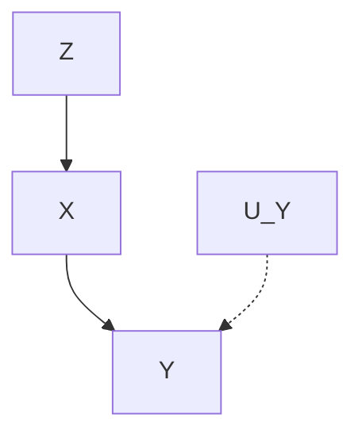

> b)

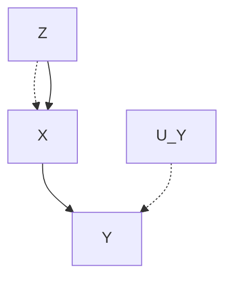

> c)

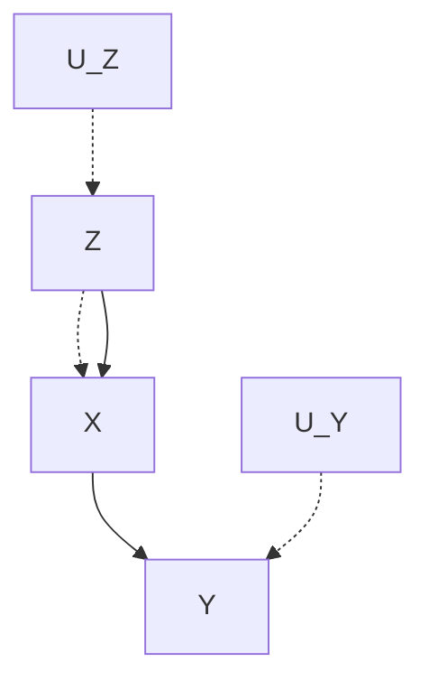

> d)

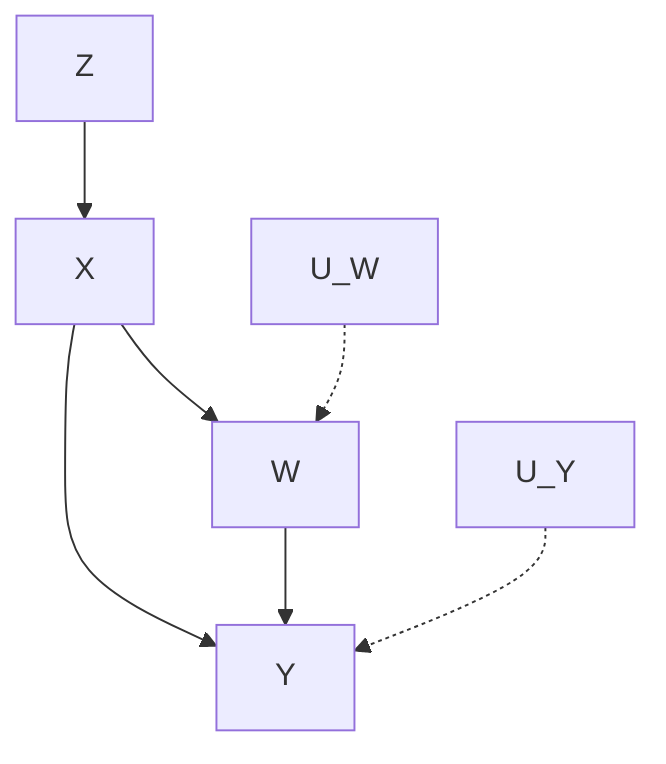

> 图 7.8 $Z$ 是 a、b、c 模型中的工具变量，因为它满足 $Z \perp U_{y}$ 。在 d 中， $Z$ 不是的工具变量，因为它与 $W$ 相关，从而影响了 $Y$ 。

##### 定义 7.4.1（工具变量）

如果存在一组不受 $X$ 影响的测量值 $S = s$ ，满足以下准则中的其中一项：

**1. 反事实准则：**

- (i) $Z \perp Y_{x} \mid S = s$
- (ii) $Z \not\perp X \mid S = s$

  **2. 图准则：**

- (i) $(Z \perp Y \mid S)_{G_{\bar{X}}}$
- (ii) $(Z \not\perp X \mid S)_{G}$

那么，变量 $Z$ 是相对于 $X$ 对 $Y$ 的总效应的一个 **工具变量** 。

在结束本节前，需要再次强调的是，由于图定义对模型参数的取值不敏感，因此图模型可以很好地用于描述我们的直觉假设，包括因果效应、外生性、工具变量、混杂等，甚至（我推测）还可以描述更多的技术概念，例如随机性和统计独立性。

### 7.5 结构因果与概率因果

概率因果是哲学的一个分支，它试图用概率关系来说明因果关系。这一尝试是由某些想法和期望引起的。

首先（也是最重要的一点），概率因果有望解决数百年来有关因果发现的难题，即人类如何只从纯粹的经验观察中发现真正的因果关系，而不需要任何先验的因果关系知识。借鉴休谟论者（Humean）的格言，即所有知识都源于人类的经验，并且假设人类的经验都是以概率函数的形式进行描述的（这一假设不是那么令人信服，但后来也被普遍接受），人们很自然地期望因果知识可简化为某种概率分布上的一组关系，而这种概率是定义在相关变量上的。

其次，与因果关系的确定性解释不同，概率因果提供了实质性的认知结构。物理状态和物理定律无须详细说明，因为它们可以用宏观状态之间的概率关系来概括，以便与自然语言描述的程度匹配。

最后，概率因果还可以处理现代理论（即量子理论）中的不确定性问题。根据这一概念，决定论只是认识论的一种假想形式，而不确定性是物理现实世界的基本特征。

概率因果正式起源于 Reichenbach（1956）以及 Good（1961）。随后，Suppes（1970）、Skyrms（1980）、Spohn（1980）、Otte（1981）、Salmon（1984）、Cartwright（1989），以及 Eells（1991）对这一概念进行了推动。考虑到它最初的愿景，目前现状令人失望，但回顾我们在 1.5 节中的讨论，这并不奇怪。

Salmon 完全放弃了这一努力，他认为“因果关系不能依据统计相关关系进行合理地分析”（1984）。相反，他提出了一套分析方法，其中“因果过程”是基本的组成部分。在 Cartwright 和 Eells 最近的著作中解决了 Salmon 遇到的一些难题，但代价是要么使理论复杂化，难以辨认，要么违背了最初的目标。下面简要介绍了 Cartwright（1989）和 Eells（1991）在概率因果问题上的主要成就、困难以及在哪些方面进行了妥协。

#### 7.5.1 对时序的依赖性

在标准的因果概率假设中，除了已知概率函数 $P$ ，还已知变量之间的时间顺序。这很好理解，因为因果关系不是对称关系，而统计相关性是对称的。如果缺乏时间信息，就不可能确定两个因变量中的哪一个是原因，哪一个是结果，因为由“ $X$ 是 $Y$ 的原因”模型所产生的任何联合概率分布 $P(x, y)$ 也可以通过模型“ $Y$ 是 $X$ 的原因”产生。因此，任何推断出“ $X$ 是 $Y$ 的原因”的方法都会对应地推断出“ $Y$ 是 $X$ 的原因”。

在第 2 章中，我们证明至少需要三个变量来确定有向无环图中箭头的方向，但更糟糕的是，如果不附加任何（因果）稳定性或极小条件的假设，仅凭概率信息无法确定箭头的方向。通过施加约束“结果不能先于原因”，这种对称性就被打破了，因果推断就可以开始了。

对时间信息的依赖是有代价的，因为它事先排除了对时间顺序未明确定义的情况。这种情况要么因为事件的发生在时间上重叠，要么因为它们（几乎）是瞬时发生的。例如，我们必须放弃（通过不受控制的方法）回答以下这类问题：持续的体育锻炼是否有助于降低胆固醇水平，或者反过来，低胆固醇是否会增强体育锻炼的积极性。同样，概率因果理论在哲学上也不会试图区分“旗杆高会造成阴影长”和“阴影长会导致旗杆高”。从实际应用的角度来讲，在这两种说法中，原因和结果是同时发生的。

我们在第 2 章中已经看到，如果假设极小条件或稳定性，那么可以不用时间统计信息来确定因果关系中的某些方向性。但是，这些假设隐含地反映了物理过程的一般属性，即 **不变性** 和 **自治性** （参见 2.9 节），它们构成了因果关系结构方法的基础。

#### 7.5.2 死循环风险

尽管因果关系依赖于时间顺序，哲学家为确定因果关系而设计的标准却存在明显的死循环：为了确定一个事件 $C$ 是否是另一个事件 $E$ 的原因，必须预先知道其他因素与 $C$ 和 $E$ 的因果关系。这种死循环源于在因果评估中对“背景变量”的定义，因为我们认为，“原因应该增加其结果发生的可能性”的直觉必须通过“假设其他变量保持不变”的条件来限定。

例如，“学习算术”增加了通过科学测验的可能性，但前提是保持学生年龄不变。否则，实际上随着学生年龄的减小，学习算术可能会降低通过测验的可能性。因此，自然地抛出了以下定义。

##### 定义 7.5.1

如果在某些背景变量 $K$ 中存在至少一个条件 $F$ ，满足 $P(E|C, F) > P(E|\neg C, F)$ ，那么事件 $C$ 对 $E$ **因果相关** $^{\ominus \ominus}$ 。

但是，我们应该在背景变量中包括哪些条件呢？一方面，坚持对物理环境的完整描述会将概率因果关系约简为确定性物理定律（除非考虑量子级）。另一方面，完全忽略背景因素（或过于粗略地描述背景因素）会导致伪相关和其他混杂效应。一种比较自然的折中办法是，要求背景变量本身与所讨论的变量“因果相关”，但这正是概率因果中死循环的根源。

如何选择合理的背景变量的问题类似于如何为混杂找到一个合理的校正方法，前几章中有关辛普森悖论的讨论中已经涉及（例如，3.3 节、5.1.3 节和 6.1 节）。我们发现（例如在 6.1 节中），选择一组合理的协变量进行校正的准则不能仅仅基于概率关系，还必须依赖于因果信息。尤其是，我们必须确保作为背景的变量满足后门条件，因为总是可以在某些假想因子 $F$ （这些因子 $F$ 使 $C$ 和 $E$ 之间伪相关）的条件下，满足定义 7.5.1 中的不等式（如图 6.2c）。此时，死循环出现了：为了确定 $C$ 对 $E$ 的因果作用（例如，药物对痊愈的效应），必须首先确定每个变量 $F$ （例如性别）对 $C$ 和 $E$ 的因果作用。

人们可能尝试通过以 $C$ 之前的所有因素为条件来避免这种死循环，但不幸的是，其他无法通过时间顺序来确定的因素也需要斟酌。回顾 7.2.2 节中下赌注的例子。我必须在掷硬币后对正面或反面下注：猜对了我就赢，猜错了我就输。当然，一旦掷出硬币（尽管结果仍然未知），下注就被认为与赢钱有因果关系，尽管无论下注正面还是反面，赢的概率总是一样的。为了揭示下注（ $C$ ）的因果关系，即使硬币（ $F$ ）不符合共同原因的准则， $F$ 不会影响下注（ $C$ ），也对赢钱（ $E$ ）没有因果作用（除非我们事先声明下注与赢钱有关），我们也必须在背景中包括 $F$ 的结果。

更糟糕的是，虽然 $F$ 出现的时间早于 $C$ ，但是我们无法证明在背景变量中包含 $F$ 是否合理，因为无论在我下注之前还是之后掷出硬币，都与当前的问题完全无关。我们的结论是， **时间顺序不足以确定哪些背景变量是合理的** ，即使我们利用了 Eells（1991）所谓的“相互作用的原因”，即（简化的）因子 $F$ 不受 $C$ 的因果影响，并且与 $C$ （或 $\neg C$ ）一起增加 $E$ 的概率。

由于因果相关性的所有定义都具有死循环性，因此不能将概率因果视为从时间顺序概率信息中提取因果关系的方法。相反，它应该被视为一种用于“验证一组因果关系是否与已知的时间概率信息一致”的方法。更形式化地，假设已知在一个（完整的）变量集合 $V$ 上的概率分布 $P$ 和时间顺序 $O$ 。此外，对 $V$ 中的任何一对变量集（比如， $X$ 和 $Y$ ）用符号 $R$ 或 $I$ 进行标注，其中 $R$ 代表“因果相关”， $I$ 代表“因果无关”。概率因果用于检验标注后的 $R$ 和 $I$ 标签是否与 $\langle P, O \rangle$ 一致，以及是否符合“原因应先于结果，并且增加了结果的概率”。

目前，最新的一致性检验方法是基于 Eells（1991）的相关性准则的一致性检验，可以定义为如下过程。

##### 一致性检验

对于任何标记为 $R(X,Y)$ 的变量对 $(X,Y)$ ，检验是否同时满足以下条件：

（i）在 $O$ 中， $X$ 先于 $Y$ 。

（ii）存在 $x$ 、 $x^{\prime}$ 、 $y$ ，使得对变量 $Z$ 的某些取值 $z$ ， $P(y|x,z) > P(y|x',z)$ 成立，其中， $Z$ 是背景 $K$ 中的一组变量，满足 $I(X,Z)$ 和 $R(Z,Y)$ 。

这又导致了其他问题：

- （a）每对 $\langle P, O \rangle$ 都有一致的标注吗？
- （b）什么情况下标注唯一？
- （c）如果这种一致性标注存在，是否有一种方法能够找出这种一致性标注？

尽管图模型方法（Pearl，1996）提供了对这些问题的一些见解，但关键在于，由于死循环的特性，概率因果的使命已经发生了改变：从发现因果变为 **一致性检验** 。

还应该指出的是，从条件化的角度来定义因果关系的基本方法，即使最终证明是成功的，但也与“因果关系作为干预的预言”的自然概念背道而驰。该方法首先混淆了因果关系 $P(E|do(C))$ 与认知条件化 $P(E|C)$ ，然后（对于 $P(E|C)$ ）通过补救性的条件化步骤去除伪相关，从而得到 $P(E|C,F)$ 。相比之下，结构化方法直接根据自然不变性来定义因果关系（即定义 7.1.2 中的子模型 $M_x$ ）。参见定理 3.2.2 之后的讨论。

#### 7.5.3 与孩子们一起挑战封闭世界假定

到目前为止，概率因果中最关键和最不可辩驳的范式是基于这样一种假定：问题域中所有相关变量的概率函数已经悉知。这种假设使研究人员不用担心无法衡量的虚假原因，这些原因（从物理上）可能会影响问题分析中的若干个变量，并且对研究人员来说仍然是模糊的。众所周知，这种“混杂因子”的存在可能会逆转或否定从概率中得出的任何因果结论。

例如，如果人们不了解蚊子的作用，可能会认为“不良空气”是疟疾的原因，或者气压计读数下降是下雨的原因，或者工作效率高是迟到的原因，等等。因为以上那些因素是无法衡量的（甚至是完全未曾想到的），所以无法通过条件化或“固定它们”来抵消这些示例中的混杂因子。因此，仔细思考 Hume 关于从原始数据中提取因果信息的目标，需要解决这样一个问题：任何因果信息的有效性都必须建立在一个不可检验的假定之上，即 **所有相关因素都已被考虑在内** 。

这就出现了一个问题：人们如何从环境中获取因果信息。更具体地说，儿童如何从经验中提取因果信息。概率因果的支持者试图通过统计学中的学习理论来解释这一现象，但他们不能忽视这样一个事实：儿童从来没有在一个封闭、孤立的环境中生活过。那些未被关注过的外部条件控制着每一个学习环境，这些条件往往有可能以意想不到的隐秘的方式来混杂因果关系。

幸运的是，儿童不会在封闭、单调枯燥的环境中成长，这的确是有优点的。除了被动观察之外，儿童还拥有两个统计学家无法获得的有价值的因果信息来源： **操控实验** 和 **语言指导** 。操控将假定的因果事件归结于已知机制的唯一影响，从而否定了那些不可控制的（可能产生假定因果效应的）因素的影响。“当然，独立操控的好处在于，其他因素可以保持不变，而不必加以识别”（Cheng，1992）。独立性是通过使相关对象服从自己的意志来实现的，以确保操控不受任何可能产生假定因果效应的环境因素的影响。

因此，例如，儿童可以推断出摇晃玩具会发出卡嗒卡嗒的声音，因为正是由孩子的手进行操控，完全由孩子的意志支配，从而引起了玩具的摇晃和随后的声音。自由操控的随意性取代了随机化实验（randomized experimentation）的统计概念，并有助于将儿童行动产生的声音从不受控制的环境因素产生的声音中区分开来。

但是，我们所在环境中的大多数变量是不能够直接被操控的，所以操控实验无法解释人类目前已知的所有因果知识。那么，因果知识的第二个重要来源是 **语言指导** 。我们从父母、朋友、老师以及书籍中获得关于事物运作的明确的因果语句，这些语句记录了前人的操控经验。尽管这种因果信息的获取方式似乎看起来很明显，也很乏味，但它可能占据了我们的因果知识中的大部分，理解这种因果信息传递方式并非易事。

为了理解和掌握因果语句，比如“因为你推翻了玻璃杯，所以玻璃杯碎了”，儿童必须在脑海中已经具有一个因果分析模式，并且这些因果语句是有意义的。如果需要进一步推断，打碎玻璃杯会让某人对你生气，而不是对你弟弟生气，虽然是他把最后一个玻璃杯打碎的，这需要一套复杂的推断机制。大多数儿童天生就具备这种机制（Gopnik et al., 2004）。

但是，值得注意的是，语言指导大多数都是定性的。我们很少听到家长向孩子们解释说，把玻璃杯放在桌子边上会使玻璃杯打碎的概率增加 2.85 倍。概率因果方法将这种定性嵌入到人工计算的框架中，而结构因果方法（7.1 节）则直接建立在我们通过语言获得和传播的定性知识之上。

#### 7.5.4 特例因果与一般因果

在 7.2.3 节中，我们发现，一般因果（例如，“服用毒芹导致死亡”）和特例因果（例如，“苏格拉底服用毒芹导致死亡”）之间的区别在理解解释的本质方面起着重要作用。我们还注意到，在因果关系的概率解释中，特例因果关系（也称为“特殊性”或“单一事件”因果关系）的概念化或形式化还不够充分。在本节中，我们将详细说明这些问题的性质，并得出结论——它们主要源自概率方法中的基本缺陷。

在第 1 章（图 1.6）中，我们证明了对特例因果关系的评估需要以反事实或函数关系描述的知识，并且这些知识不能从纯粹的统计数据中提取，即使这些数据是在受控实验条件下获得的。这种局限性在 7.2.2 节中被归因于维持反事实陈述所需信息在时间上的恒常性（或不变性）。这种恒常性在使用统计语言进行陈述时（通过平均）会消失，即使在时间和因果相关信息十分丰富的情况下也是如此。这种局限性的影响在概率因果的文献中引起了人们的兴趣，并导致了关于特例因果和一般因果之间关系的激烈辩论（比如，参见 Good，1961；Cartwright，1989；Eells，1991；Hausman，1998）。

根据概率因果的一个基本原则，原因应该增加结果的概率。然而，通常情况下，当条件概率 $P(y|x)$ 小于 $P(y|x')$ 时，我们会将事件 $x$ 判断为 $y$ 的原因。例如，疫苗（ $x$ ）通常会降低疾病发生的概率（ $y$ ），但是我们发现（并且可以在医学上证实）疫苗本身会导致某个特例 $u$ 的疾病发生。这种反转对于了解结构模型的学生来说不会有什么问题，我们可以将特例因果陈述解释为“如果 $u$ 没有接种疫苗（ $x'$ ），那么 $u$ 仍然保持健康（ $y'$ ）”。这种反事实陈述的概率 $P(Y_x = y' \mid x, y)$ 可能很高，而条件概率 $P(y|x)$ 和 $P(y \mid do(x))$ 都很低，虽然所有概率值都是从同一结构模型中评估的（9.2 节给出了这三个量之间的精确关系）。然而，这种反转对概率因果关系的学生造成了困惑，因为各种原因，他们开始不信任反事实。其中，部分原因是反事实具有决定论的特质（Kvart，1986）。另外一部分原因是反事实被认为是建立在不稳定的形式化基础上的，“因为我们只有一个语义的起点（通过对可能世界的测量手段）”（Cartwright，1983）。

为了使概率增长与特例因果这两个概念一致，概率论者声称，如果我们足够仔细地研究任何给定的场景，发现 $x$ 是 $y$ 的原因，那么我们总能够找到一个子群 $Z = z$ ，在此条件下， $x$ 增加 $y$ 的概率，即

$$
P(y \mid x, z) > P(y \mid x^{\prime}, z) \tag{7.47}
$$

在上面疫苗的例子中，我们可以确定该子群是由对疫苗产生过敏的人群组成的。根据定义，疫苗无疑会增加这类群体中疾病发生的概率。奇怪的是，只有少数哲学家注意到，诸如“产生过敏”之类的定义是反事实的，在允许对这些因素进行条件化的过程中，人们打开了一扇秘密的后门，将决定论和反事实信息偷偷带回分析中去。

也许在避孕药的例子（Hesslow，1976）中，反事实的表现可能不太明显，这在 4.5.1 节中讨论过。假设我们发现琼斯夫人没有怀孕，并询问服用避孕药是否是她患有血栓的 254 原因。事实证明，没有怀过孕的女性的人口过于庞大，无法明确回答这个问题。如果琼斯夫人属于那些若不吃药就可能怀孕的女性，那么这种药实际上可以通过防止怀孕来降低血栓形成的概率。另一方面，如果她属于那些不管服不服药都不会怀孕的女性，那么服用这种药肯定会增加血栓形成的概率。这个例子很有启发性，因为这两类测试人群没有专门的名称（与疫苗例子中的“易感性”（susceptibility）不同），必须在反事实词汇中明确定义。一名女性是属于前一类还是后一类取决于许多社会和环境上的偶然因素，这些通常都是未知的，并且不太可能定义为个体的不变属性。不过，我们意识到，在评估避孕药是否是琼斯夫人血栓形成的原因时，有必要分别考虑这两个类别。

因此，我们发现，处理特例因果关系时，无法回避反事实。概率论者在定义特例因果时，坚持不用反事实语法，这反而导致了只能用反事实进行描述子群：在疫苗例子中的“产生过敏”以及琼斯夫人例子中的“不会怀孕”。

概率论者当然可以争辩说，没有必要将子群 $Z = z$ 细化到确定性的极端，因为只要找到一个子群增加 $y$ 的概率，就可以停止细化，正如式（7.47）中所要求的那样。然而，除非有一种形式化的方法来识别子群 $Z = z$ ，并根据某种合理的知识模型（无论假设与否）来计算式（7.47），否则这种论点近似同义重复。不幸的是，没有关于概率因果的文献提到这样的方法。

> ——Cartwright（1989，第 3 章）认识到可观测的类别划分（例如怀孕）不足以支持概率增长的论点，但她没有强调更精细的划分不可避免具有反事实性质。这并非偶然，Cartwright 极力主张将反事实排除在因果分析之外（Cartwright，1983，pp.34-35）。

特别是，概率论者在解释以下问题时面临窘境：人类如何如此迅速且一致地找出子群 $z$ ，以及人们当被问到 $x$ 是否导致 $y$ 时，为什么大多数人的答案都是相同的。例如（在文献（Suppes，1970）中对 Debra Rosen 的引用），一个偶然使高尔夫球偏转的树枝（ $x$ ）立刻被一致认为是球最终进洞的“原因”，尽管这种碰撞通常会降低球进洞（ $y$ ）的概率。显然，如果在这个例子中有一个满足式（7.47）的子群 $z$ （我怀疑有人考虑过这个问题），那么它必须至少具有两个特征：

1.  $z$ 必须包含 $x$ 之前和 $x$ 之后发生的事件。例如，球撞击树枝的角度以及球撞击树枝后反弹的草地质地都应该是 $z$ 的一部分。
2.  $z$ 必须依赖 $x$ 和 $y$ 。因为，如果我们要测试树枝是否会引起其他后果 $y'$ ——比如，球停在距离洞口两码远的地方，那么在式（7.47）中，肯定还需要另一个条件 $z'$ 。

这引出了概率因果方法论的一个重大的矛盾：如果对 $x$ 和 $y$ 的忽略导致了错误的 $z$ ，以及如果对 $x$ 和 $y$ 的关注导致对 $z$ 的正确选择，那么一定存在某个过程，人们通过这个过程将 $x$ 和 $y$ 的发生融入他们的意识。这个过程到底是什么？根据概率认识论的标准，证据通过条件化的方式纳入一个人的知识语料库。那么，我们如何才能证明导致 $z$ 被选中的那些证据（即 $x$ 和 $y$ 的发生）被排除在外了呢？

对式（7.47）的检验表明，从 $z$ 中排除 $x$ 和 $y$ 是出于语法上的不得已，因为这会导致 $P(y|x',z)$ 未定义，而且使 $P(y|x,z) = 1$ 。实际上，在概率演算的语法中，在 $y$ 已经发生的条件下，我们不能问事件 $y$ 发生的概率会是多少——答案就是（简单的）1。我们能做的最好的事情就是暂时脱离现实世界，假装对 $y$ 的发生一无所知，并在这种状态下计算 $y$ 的概率。这恰好对应于评估 $P(Y_{x'} = y'|x,y)$ 的三个步骤（溯因、行动和预测）（参见定理 7.1.7），通过该步骤将得出一个较高的概率值（在我们的示例中），并最终正确地将树枝 $(x)$ 确定为进洞 $(y)$ 的原因。正如我们看到的，概率值可以通过对 $x$ 和 $y$ 的条件化来表示和评估，而无须明确找出任何子群 $z^{\ominus}$ 。

具有讽刺意味的是，通过否认反事实条件，概率论者剥夺了自己使用标准条件语句权力（这正是他们试图去保留的），并被迫以迂回的方式来表达那些简单的证据信息。概率论者围绕因果关系所建立的这种句法栅栏，在特例因果和一般因果之间制造了一种人为的对立，但这种对立在结构模型中消失了。在 10.1.1 节中，我们指出，通过同时满足标准条件和反事实条件（即 $Y_{x}$ ），特例因果和一般因果不再需要单独进行分析。这两类原因的区别仅仅在于引起问题的场景特定信息在层次上有所不同，即 $P(Y_{x}=y|e)$ 中证据 $e$ 的特异性程度。

> ——② 以避免得到特例因果关系。——译者注

#### 7.5.5 总结

Cartwright（1983，p.34）列出采用概率方法与反事实方法进行因果分析的几个原因：

反事实方法要求我们评估反事实的概率，对于这种概率，我们只有一个语义的起点（通过对可能世界的测量手段），而没有方法论，更不用说解释为什么方法论适合于语义了。我们如何检验关于反事实概率的论断？我们没有答案，更没有符合我们新生语义学 256 的答案了。最好有一种有效性的度量方法，它只需要事件的概率，而这些事件可以用常规的方式在现实世界中进行检验。

回顾过去 30 年来概率方法的进展，Cartwright 的想法明显不是在她所倡导的框架中实现的，而是在反事实的竞争框架中实现的，如结构模型。在 Simon（1953）以及 Strotz 和 Wold（1960）提出的可修改结构模型的概念中，以“可检验的事件”的角度，对“有效性”（在我们的词汇中是“因果效应”）进行了完整的描述，最终形成了后门准则（定理 3.3.2）以及更为泛化的定理 3.6.1 和定理 4.4.1，其中概率准则（如式（3.13）所示）只是一种粗略的特例。根据反事实概率 $P(Y_x \neq y \vert x, y)$ 对特例因果关系的解释，可以得到有意义的形式化语义（7.1 节）和有效的评估方法（定理 7.1.7 和 7.1.3 节～ 7.2.1 节）的支撑，而式（7.47）的概率准则还徘徊在模糊和毫无头绪的争辩之中。随着不可测量的实体（例如，世界状态、背景语境、因果相关性、易感性）允许被加入分析中，因果论断可检验的最初梦想在概率框架中被放弃了，而回答可检验性问题的方法已经转移到结构化反事实框架中（参见第 9 章和 11.9 节）。

与不确定性物理学的教义保持一致的理想，似乎是概率因果的唯一出路，本节质疑了维持这一理想是否值得。我们进一步表明，概率因果的基本目标应该重新进行严谨的评估。如果这种方法是一种认识论的体现，那么“概率”一词就是自相矛盾的：人类对因果关系的理解是准确定性的（quasi-deterministic），而我们这些易犯错误的人类仍然是因果关系的主要使用者。如果这种方法是现代物理学中的一种体现，那么“因果关系”一词就不那么重要了：量子级的因果关系遵循其自身的规则和直觉，而使用另一个名称（也许是“量子因果性”）可能更适合一些。然而，关于人工智能和认知科学，我大胆地预测，编程上模拟拉普拉斯（Laplace）和爱因斯坦（Einstein）所提出的“准确定性宏观近似”（quasi-deterministic macroscopic approximations）的机器人，其性能将远胜于 Born、Heisenberg 和 Bohr 提出的“正确但有违直觉理论”（correct but counterintuitive theories）的机器人。

#### 致谢

本章的各节基于 Alex Balke 和 David Galles 的博士研究工作。这项研究工作得益于 257 Joseph Halpern 的大量投入。
