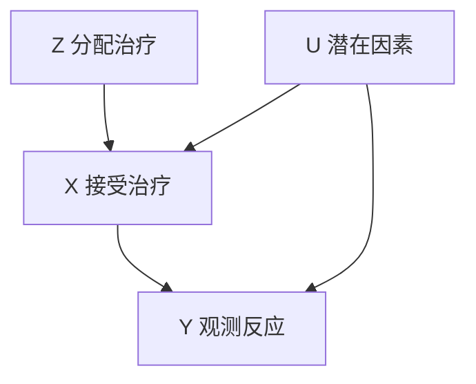
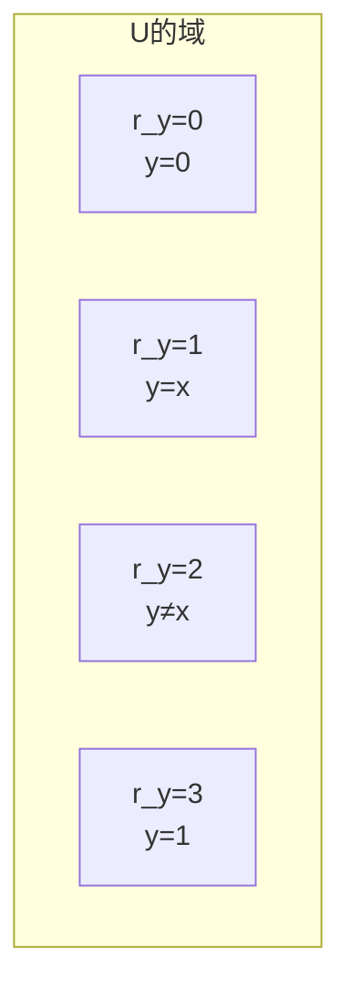
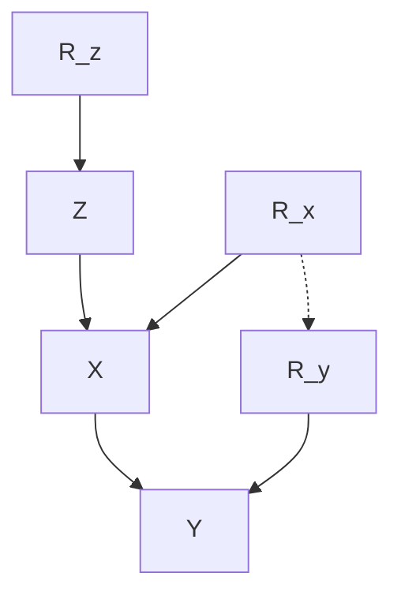
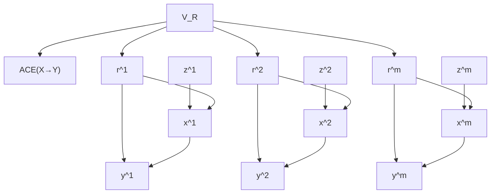
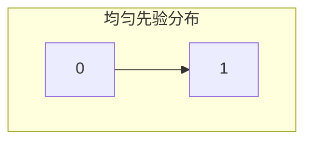
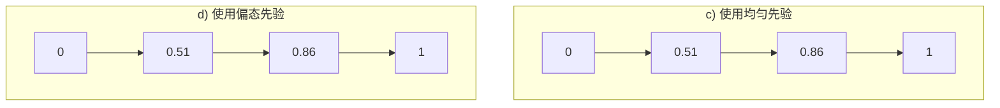

## 第 8 章 不完美实验：边界效应和反事实

但愿我能像揭露谎言一样容易发现真相。

—Cicero（公元前 44 年）

### 前言

在本章中，我们将描述图模型（graphical model）和反事实（counterfactual）模型（3.2 节和 7.1 节）如何与不完美（imperfect）实验（实验偏离了理想的随机控制）结合，并从中得出因果信息。例如，当随机临床试验中的受试者未完全遵守指定的治疗方法时，通常会发生偏差，从而影响因果效应的识别。当不满足识别条件时，最好的办法就是得出目标值的边界（bound），即在数据生成过程中我们所忽略的值可能范围，而且这个范围不会随着样本量的增加而改进。

本章将阐述：

- （i）可以通过简单的代数方法推导出这些边界；
- （ii）尽管实验的不完美，但从中推导出来的边界是有意义的，有时甚至包含策略对总体及特定个体影响的精确信息；
- （iii）可以有效利用先验知识来获得这些影响的贝叶斯估计。

### 8.1 简介

#### 8.1.1 不完美与间接实验

在生物学、医学和行为科学领域，标准实验研究经常会使用随机控制，即将受试者随机分配到各个小组（或治疗、方案），并且将不同分组中受试者之间的平均差异视为相关方案有效性的度量标准。在这种理想的实验设置中，无法满足实验要求或有意放宽实验要求可能会造成偏差。间接实验就是一种针对随机控制不可行或有害时的研究方式。在这样的实验中，仍将受试者随机分配到各个小组，但只鼓励（而不是强迫）每个小组成员参与该小组相关的方案，最终还是由个人对这些方案进行选择。

近年来在社会学和医学实验中，对使用严格的随机化方法提出了质疑，主要有以下三个原因：

1.  **完全控制难以实现，也难以确认** 。“假设治疗是随机化的”这一研究中常用的方式可能会遭到不受控制的不完全依从性（imperfect compliance）的影响。例如，对实验药物出现不良反应的受试者可能会自行决定减少剂量。或者，如果一个实验正在测试一种治疗晚期疾病的药物，某个受试者可能会怀疑自己属于对照组，那么他可能会从其他渠道获得这种药物。这种不完全依从性使实验变为间接实验，研究人员从这些数据中得出的结论会存在偏差。除非构建更加详细的依从性模型，否则无法纠正这种偏差（Efron and Feldman, 1991）。

2.  **拒绝将药物分配给对照组中的受试者，让他们无法享受最佳治疗方案，这违背道德和法律** 。例如，在艾滋病研究中，很难证明安慰剂方案的合理性，因为那些被分配到安慰剂组的患者将无法获得可能挽救生命的治疗方法（Palca，1989）。

3.  **随机化的存在可能会影响受试者的参与程度和行动方式** （Heckman，1992）。例如，合格的考生一旦发现学校故意将录取标准随机化，那么他们在申请该学校时可能会变得谨慎。同样，正如 Kramer 和 Shapiro（1984）所指出的那样，与参与非实验研究相比，已经接受药物实验的受试者更不愿意参与随机实验，即使在所有治疗方法都无害的情况下。

总之，研究人员开始意识到，强制进行随机化可能会破坏实验证据的可靠性，同时也意识到，在以人作为受试者的实验中通常涉及（有时应涉及）自我选择这一要素。

本章主要涉及从分析研究中进行推导，在这些研究中，受试者有最终方案（计划）的选择权。随机化仅被当作一种间接工具变量（或分配），仅仅鼓励或劝阻受试者参与各式各样的项目。例如，在评估某个培训计划的效果时，可以随机向一组学生发送合格通知，也可以随机选择一组合格的候选人，颁发奖学金，以奖励他们参加该计划。同样，在药物实验中，受试者可以随机选择医生建议的剂量水平，但是最终的剂量选择将由受试者根据个人需求决定。

不完美依从性带来了一个问题，因为简单地利用治疗组和对照组之间差异的比率可能会导致错误估计，即如果将治疗方案统一应用于总体人群，那么治疗效果将会如何？例如，如果那些拒绝服药的受试者恰好是那些会产生不良反应的受试者，那么实验可能会得出结论：这种药物比实际效果更有效。在第 3 章中（参见 3.5 节的图 3.7b），我们发现这些研究的治疗效果实际上是无法识别的。也就是说，在没有其他模型假设的情况下，即使实验中受试者的数量接近无穷大，甚至记录每个受试者的行动和反应，也无法从数据中无偏差地估计治疗效果。

在本章中，我们试图回答以下问题：间接随机化是否可以提供一种信息，允许对一个计划的内在价值进行近似评估，例如，度量某个计划是否需要在总体人群中进行推广和实施。分析表明，在一组最小的假设条件下，对于计划或治疗方案的因果效应进行推断确实是可能的，尽管这种推断会以边界的形式给出，而不是精确的值估计。研究人员可以使用这些边界来确定一个已知计划的因果效应势必会高于某一个可度量的值，而低于另一个可度量的值 $^{①}$ 。

> ① 因果效应在一个可度量的区间。——译者注

最关键的假设是，对于任何一个特定的人，激励方式会影响其对治疗方案的选择，但对其所选治疗的反应没有影响（参见 7.4.5 节中工具变量的定义）。第二个假设是，受试者对治疗的反应是相互独立的，这个假设在实验研究中经常用到。除了这两个假设，我们的模型对治疗反应的倾向与治疗方案的选择之间的相互作用没有任何限制。

#### 8.1.2 不依从性与治疗意愿

对于不完美依从性问题，研究人员采用了一种普遍的折中方法，即进行“治疗意愿”分析。在这个分析中，将对照组和治疗组进行比较，但不考虑他们是否真的接受了治疗②。这种分析的结果是度量治疗方案的分配对疾病的影响程度，而不是度量治疗本身对疾病的影响程度。

只要实验条件完全模拟最终使用该治疗方法时普遍存在的条件，那么基于治疗意愿分析的估计值就是有效的。实验尤其应该模拟受试者接受每种治疗的激励措施。在现实激励比实验激励更具吸引力的情况下（例如，通常在药物获得政府机构批准时），治疗效果可能与分配效果有很大差异。

例如，设想一项研究，其中药物对大部分人群有不良副作用，并且只有那些从某种治疗方案中退出的患者（亚群体）才能康复。治疗意愿分析会将这些康复病例溯因于药物的作用，因为它们是治疗意愿的一部分，尽管实际上这些病例是通过避免治疗而康复的。

> - ② 某些 FDA 机构目前使用这种方法来批准新药。

解决这种问题的另一种方法是，使用基于工具变量公式的修正因子（Angrist et al., 1996），根据该公式，治疗意愿度量应除以依从所分配治疗方案的受试者的比例。Angrist 等人（1996）研究表明，在某些条件下，修正后的公式对“反应型”受试者亚群体有效，也就是那些如果分配不同的方案，其治疗状态也会改变的受试者。

不幸的是，这一亚群体无法确定，更糟糕的是，它不能作为涉及总体人群策略的基础，因为它依赖于工具变量。由于在群体中获得治疗的意愿与实验中的意愿可能不同，因此在实验中反应敏感的个体，在群体中未必反应敏感。因此，我们将分析的重点放在治疗方案的稳定性方面，即不随依从程度的变化而变化。

### 8.2 利用工具变量界定因果效应的范围

#### 8.2.1 问题的形式化表述：约束优化

与间接实验相关的基本实验设置如图 8.1 所示，它与图 3.7b 和图 5.9 同构。尽管在通常情况下，这种分析方式适用于任何利用工具变量（定义 7.4.1）激励受试者选择某种方案的实验研究，但为了突出讨论重点，我们将考虑一个具有部分依从性的临床试验原型。

我们假设 Z、X、Y 是观察到的二值变量，其中：

> 图 8.1 具有部分依从的随机临床试验的因果相关性图模型表示。其中，Z 为工具变量。

Z 代表（随机）分配的治疗方案，X 是实际接受的治疗方案，Y 是可观测的反应。U 代表影响受试者治疗反应的所有因素，包括观测到的和未观测到的因素。因此，画一个从 U 指向 Y 的箭头。从 U 到 X 的箭头表示 U 也可能影响受试者对治疗方案 X 的选择。这种依赖关系可能代表一个介于分配（Z）和实际治疗（X）之间的复杂决策过程。

为了便于表示，我们令 $z$ 、 $x$ 、 $y$ 分别表示变量 $Z$ 、 $X$ 、 $Y$ 的值，解释如下：

- $z \in \{z_{0}, z_{1}\}$ ， $z_{1}$ 表示已经分配治疗方案（ $z_{0}$ ，没有分配）。
- $x \in \{x_{0}, x_{1}\}$ ， $x_{1}$ 表示已经进行治疗（ $x_{0}$ ，没有进行治疗）。
- $y \in \{y_{0}, y_{1}\}$ ， $y_{1}$ 表示观测到正（好的）反应（ $y_{0}$ ，负（不好的）反应）。

U 的值域未指定，但通常可以由几个随机（离散和连续）变量的空间组合而成。

图模型反映以下两个假设：

1. 分配的治疗方案 Z 不会直接影响 Y，而会影响实际的治疗方案 X。事实上，Z 可能对 Y 产生的任何直接影响都可以通过使用安慰剂进行校正。
2. 变量 $Z$ 和 $U$ 是边缘独立的，这可以通过对 $Z$ 的随机化来确保，它排除了 $Z$ 和 $U$ 的共同原因。

基于这些假设，联合分布可以分解为：

$$
P (y, x, z, u) = P (y \mid x, u) P (x \mid z, u) P (z) P (u) \tag {8.1}
$$

当然，这并不能直接观测到，因为 $U$ 是不可观测的。然而，边缘分布 $P(y, x, z)$ 和条件分布是可观测的 $^{\ominus}$ ，尤其是条件分布：

$$
P (y, x \mid z) = \sum_ {u} P (y \mid x, u) P (x \mid z, u) P (u), \quad z \in \{z_{0}, z_{1} \} \tag {8.2}
$$

难点在于从这些分布中评估由治疗方案所引起的 Y 的平均变化。

治疗效果由 $P(y \mid do(x))$ 决定，通过截断因子分解公式（3.10），得出：

$$
P (y \mid d o (x)) = \sum_ {u} P (y \mid x, u) P (u) \tag {8.3}
$$

此处， $P(y|x,u)$ 和 $P(u)$ 与式（8.2）相同。因此，如果我们对由治疗方案所引起的 Y 的平均变化感兴趣，那么应计算 **平均因果效应** （average causal effect） $ACE(X\to Y)$ （Holland，1988），由以下公式给出：

$$
\begin{array}{l}
\mathrm{ACE} (X \rightarrow Y) = P \left(y_{1} \mid d o \left(x_{1}\right)\right) - P \left(y_{1} \mid d o \left(x_{0}\right)\right) \\
= \sum_ {u} [ P (y_{1} | x_{1}, u) - P (y_{1} | x_{0}, u) ] P (u) \tag {8.4} \\
\end{array}
$$

现在，我们的任务是，已知观测概率 $P(y|x, z_0)$ 和 $P(y|x, z_1)$ （参见式（8.2）），估计或界定式（8.4）中的表达式。此任务相当于做一道在式（8.2）约束条件下找出式（8.4）的最大值和最小值的约束优化问题的练习题，其中，最大化以下所有满足约束条件的函数：

$$
P (u), \quad P \left(y_{1} \mid x_{0}, u\right), \quad P \left(y_{1} \mid x_{1}, u\right), \quad P \left(x_{1} \mid z_{0}, u\right), \quad P \left(x_{1} \mid z_{1}, u\right)
$$

#### 8.2.2 正则划分：有限响应变量的演化

8.2.1 节中描述的边界问题可以使用传统的数学优化方法来解决。但是，所涉及的函数的连续性，以及未指定 $U$ 的值域，使得这种表示形式不便于计算。相反，我们发现， $U$ 总是能够被一个有限状态变量所代替，这样得到的模型对于 $Z$ 、 $X$ 和 $Y$ 的所有观察和操作都是等价的（Pearl，1994a）。

考虑因果模型中连接两个二值变量 $Y$ 和 $X$ 的结构方程：

$$
y = f (x, u)
$$

对于任何给定的 $u$ ， $X$ 和 $Y$ 之间的关系必然为以下四个函数之一：

$$
f_{0}: y = 0, \quad f_{1}: y = x \tag {8.5}
$$

$$
f_{2}: y \neq x, \quad f_{3}: y = 1
$$

当 $u$ 随其域值变化时，不管变化有多复杂，它对模型的唯一影响就是 $X$ 和 $Y$ 之间的关系在这四个函数之间进行切换。如图 8.2 所示，这将 $U$ 的域划分为四个等价类，其中每个类都包含一组与相应函数对应的 $u$ 值。因此，我们可以用一个四值状态变量 $R(u)$ 替换 $U$ ，其中每个状态都代表四个函数之一。概率 $P(u)$ 将自动转换为概率函数 $P(r)$ ，其中 $r = 0,1,2,3$ ，该函数值等于与 $r$ 对应的等价类的总权重。

> 图 8.2 正则划分将 $U$ 分为四个等价类，对任何已知函数 $y = f(x,u)$ ，每个等价类分别代表从 $X$ 到 $Y$ 的不同函数映射

Balke 和 Pearl（1994a，b）将像 $R$ 这样的状态最小变量称为“响应”变量，Heckerman 和 Shachter（1995）则将其称为“映射”变量，但是“正则划分”一词的更具有描述性 $^{①}$ 。

> 在实验框架中，这些划分可以追溯到 Greenland 和 Robins（1986），并被 Frangakis 和 Rubin（2002）称为“主分层”。在此框架中（参见 7.4.4 节）， $u$ 代表一个实验单元， $R(u)$ 为单元 $u$ 对治疗 $x$ 的潜在响应。假设每个单元（例如，单个受试者）具有一个内在的、看似“与生俱来”的响应函数遭到了一些反对（Dawid，2000），因为许多因素固有的不可观察性可能决定个体对治疗的反应。 $R(u)$ 的等价类公式减少了这些异议（Pearl，2000，2011），它表明了 $R(u)$ 能够从任何存在随机潜在变量的复杂系统中顺理成章地计算出来，前提是我们要通过方程 $y = f(x, u)$ 确认它们的存在。那些之后对量子力学产生异议的人（例如，Salmon，1998）也应将函数关系 $y = f(x, u)$ 视为抽象的数学结构，表示满足约束（8.1）和（8.2）的条件概率 $P(y|x, u)$ 中的极值点（顶点）。

因为 $Z$ 、 $X$ 和 $Y$ 都是二值变量，所以 $U$ 的状态空间可分为 16 个等价类，每个类代表两个函数映射：一个从 $Z$ 到 $X$ ，另一个从 $X$ 到 $Y$ 。为了描述这些等价类，可以简单地将每一个类都看作由两个四值变量 $R_{x}$ 和 $R_{y}$ 组成的联合空间中的一个点。通过以下映射函数，变量 $R_{x}$ 决定了受试者的依从程度。

$$
x = f_{X} (z, r_{x}) = \left\{\begin{array}{l l} x_{0} & r_{x} = 0 \\ x_{0} & r_{x} = 1, z = z_{0} \\ x_{1} & r_{x} = 1, z = z_{1} \\ x_{1} & r_{x} = 2, z = z_{0} \\ x_{0} & r_{x} = 2, z = z_{1} \\ x_{1} & r_{x} = 3 \end{array} \right. \tag {8.6}
$$

Imbens 和 Rubin（1997）根据依从程度 $r_{x}=0,1,2,3$ 将受试者分别称为 **绝不接受者** （never-taker）、 **依从者** （compiler）、 **抵触者** （defier）和 **绝对接受者** （always-taker）。类似地，变量 $R_{y}$ 通过以下映射函数决定受试者的反应：

$$
y = f_{Y} (x, r_{y}) = \left\{\begin{array}{l l} y_{0} & r_{y} = 0 \\ y_{0} & r_{y} = 1, x = x_{0} \\ y_{1} & r_{y} = 1, x = x_{1} \\ y_{1} & r_{y} = 2, x = x_{0} \\ y_{0} & r_{y} = 2, x = x_{1} \\ y_{1} & r_{y} = 3 \end{array} \right. \tag {8.7}
$$

Heckerman 和 Shachter（1995）将响应程度 $r_{y}=0,1,2,3$ 分别称为 **永不康复** （never-recover）、 **有益** （helped）、 **有害** （hurt）和 **绝对康复** （always-recover）。

变量 $R_{y}$ 的状态值与在 7.1 节（定义 7.1.4）中定义的反事实变量 $Y_{x_0}$ 和 $Y_{x_1}$ 之间的对应关系如下：

$$
Y_{x_{1}} = \left\{\begin{array}{l l} y_{1} & r_{y} = 1 \text {或} r_{y} = 3 \\ y_{0} & \text {其他} \end{array} \right.
$$

$$
Y_{x_{0}} = \left\{\begin{array}{l l} y_{1} & r_{y} = 2 \text {或} r_{y} = 3 \\ y_{0} & \text {其他} \end{array} \right.
$$

通常，响应和依从性可能不是独立的，因此用图 8.3 中的双箭头 $R_{x}\leftrightarrow\rightarrow R_{y}$ 表示。 $R_{x}\times R_{y}$ 上的联合分布包含 15 个独立参数，这些参数足以表达图 8.3 中的模型。 $P(y,x,z,r_{x},r_{y})=P(y|x,r_{y})P(x|r_{x},z)P(z)P(r_{x},r_{y})$ ，因为在图模型中， $Y$ 和 $X$ 与它们的父节点是固定的函数关系。

> 图 8.3 一种与图 8.1 等价的结构，其中利用有限状态响应变量 $R_{z}$ 、 $R_{x}$ 和 $R_{y}$

现在，可以直接从式（8.7）得出治疗方案的因果效应：

$$
P (y_{1} \mid d o (x_{1})) = P (r_{y} = 1) + P (r_{y} = 3) \tag {8.8}
$$

$$
P (y_{1} \mid d o (x_{0})) = P (r_{y} = 2) + P (r_{y} = 3) \tag {8.9}
$$

$$
\mathrm{ACE} (X \rightarrow Y) = P (r_{y} = 1) - P (r_{y} = 2) \tag {8.10}
$$

#### 8.2.3 线性规划公式

通过阐述 $P(y, x \mid z)$ 参数和 $P(r_x, r_y)$ 参数之间的关系，我们得到了一组线性约束。在已知 $P(y, x \mid z)$ 的情况下，这组线性约束可用于 $\mathrm{ACE}(X \to Y)$ 最小化或最大化的求解。

观测变量上的条件分布 $P(y, x \mid z)$ 完全由以下 8 种参数指定：

$$
p_{00.0} = P(y_0, x_0 \mid z_0), \quad p_{00.1} = P(y_0, x_0 \mid z_1)
$$

$$
p_{01.0} = P(y_0, x_1 \mid z_0), \quad p_{01.1} = P(y_0, x_1 \mid z_1)
$$

$$
p_{10.0} = P(y_1, x_0 \mid z_0), \quad p_{10.1} = P(y_1, x_0 \mid z_1)
$$

$$
p_{11.0} = P(y_1, x_1 \mid z_0), \quad p_{11.1} = P(y_1, x_1 \mid z_1)
$$

以下概率约束：

$$
\sum_{n=00}^{11} p_{n.0} = 1 \quad \text{且} \quad \sum_{n=00}^{11} p_{n.1} = 1
$$

进一步蕴含了 $\vec{p} = (p_{00.0}, \cdots, p_{11.1})$ 可以由六维空间中的一个点来指定，该空间记为 **P** 。

联合概率 $P(r_x, r_y)$ 有 16 种参数：

$$
q_{jk} \triangleq P(r_x = j, r_y = k) \tag{8.11}
$$

其中 $j, k \in \{0, 1, 2, 3\}$ 。以下概率约束：

$$
\sum_{j=0}^{3} \sum_{k=0}^{3} q_{jk} = 1
$$

表示 $\vec{q}$ 在 15 维空间中指定了一个点，该空间记为 **Q** 。

现在可以将式（8.10）重写为包含 Q 参数的线性组合式：

$$
\mathrm{ACE}(X \rightarrow Y) = q_{01} + q_{11} + q_{21} + q_{31} - q_{02} - q_{12} - q_{22} - q_{32} \tag{8.12}
$$

结合式（8.6）和式（8.7），我们可以得出从 **Q** 中点 $\vec{q}$ 到 **P** 中点 $\vec{p}$ 的线性变换公式：

$$
p_{00.0} = q_{00} + q_{01} + q_{10} + q_{11}, \quad p_{00.1} = q_{00} + q_{01} + q_{20} + q_{21}
$$

$$
p_{01.0} = q_{20} + q_{22} + q_{30} + q_{32}, \quad p_{01.1} = q_{10} + q_{12} + q_{30} + q_{32}
$$

$$
p_{10.0} = q_{02} + q_{03} + q_{12} + q_{13}, \quad p_{10.1} = q_{02} + q_{03} + q_{22} + q_{23}
$$

$$
p_{11.0} = q_{21} + q_{23} + q_{31} + q_{33}, \quad p_{11.1} = q_{11} + q_{13} + q_{31} + q_{33}
$$

上式也可以写成矩阵形式 $\vec{p} = R\vec{q}$ 。

已知 $P$ 空间中的一个点 $\vec{p}$ ，可以通过解决以下线性规划问题来确定 $\mathrm{ACE}(X \to Y)$ 的严格下界。

**最小化** ： $q_{01} + q_{11} + q_{21} + q_{31} - q_{02} - q_{12} - q_{22} - q_{32}$  
 **满足** ：

$$
\sum_{j = 0}^{3} \sum_{k = 0}^{3} q_{jk} = 1
$$

$$
\boldsymbol{R} \vec{q} = \vec{p} \tag{8.13}
$$

对于 $j, k \in \{0, 1, 2, 3\}, q_{jk} \geqslant 0$ 。  
对于以上问题，可以使用已有的方法推导解决此类优化问题的符号表达式（Balke, 1995），从而得出治疗效果的下界：

$$
\mathrm{ACE}(X \rightarrow Y) \geqslant \max \left\{\begin{array}{c}
p_{11.1} + p_{00.0} - 1 \\
p_{11.0} + p_{00.1} - 1 \\
p_{11.0} - p_{11.1} - p_{10.1} - p_{01.0} - p_{10.0} \\
p_{11.1} - p_{11.0} - p_{10.0} - p_{01.1} - p_{10.1} \\
- p_{01.1} - p_{10.1} \\
- p_{01.0} - p_{10.0} \\
p_{00.1} - p_{01.1} - p_{10.1} - p_{01.0} - p_{00.0} \\
p_{00.0} - p_{01.0} - p_{10.0} - p_{01.1} - p_{00.1}
\end{array}\right\} \tag{8.14a}
$$

同样地，上界为：

$$
\mathrm{ACE}(X \rightarrow Y) \leqslant \min \left\{\begin{array}{c}
1 - p_{01.1} - p_{10.0} \\
1 - p_{01.0} - p_{10.1} \\
- p_{01.0} + p_{01.1} + p_{00.1} + p_{11.0} + p_{00.0} \\
- p_{01.1} + p_{11.1} + p_{00.1} + p_{01.0} + p_{00.0} \\
p_{11.1} + p_{00.1} \\
p_{11.0} - p_{00.0} \\
- p_{10.1} + p_{11.1} + p_{00.1} + p_{11.0} + p_{10.0} \\
- p_{10.0} + p_{11.0} + p_{00.0} + p_{11.1} + p_{10.1}
\end{array}\right\} \tag{8.14b}
$$

我们还可以（在相同的线性约束条件下）分别推导出式（8.8）和式（8.9）的边界：

$$
P(y_{1} \mid do(x_{0})) \geqslant \max \left\{\begin{array}{c}
p_{10.0} + p_{11.0} - p_{00.1} - p_{11.1} \\
p_{10.1} \\
p_{10.0} \\
p_{01.0} + p_{10.0} - p_{00.1} - p_{01.1}
\end{array} \right\} \tag{8.15}
$$

$$
P(y_{1} \mid do(x_{0})) \leqslant \min \left\{\begin{array}{c}
p_{01.0} + p_{10.0} + p_{10.1} + p_{11.1} \\
1 - p_{00.1} \\
1 - p_{00.0} \\
p_{10.0} + p_{11.0} + p_{01.1} + p_{10.1}
\end{array} \right\}
$$

$$
P(y_{1} \mid do(x_{1})) \geqslant \max \left\{\begin{array}{c}
p_{11.0} \\
p_{11.1} \\
- p_{00.0} - p_{01.0} + p_{00.1} + p_{11.1} \\
- p_{01.0} - p_{10.0} + p_{10.1} + p_{11.1}
\end{array} \right\} \tag{8.16}
$$

$$
P(y_{1} \mid do(x_{1})) \leqslant \min \left\{\begin{array}{c}
1 - p_{01.0} \\
1 - p_{01.1} \\
p_{00.0} + p_{11.0} + p_{10.1} + p_{11.1} \\
p_{10.0} + p_{11.0} + p_{00.1} + p_{11.1}
\end{array} \right\}
$$

以上公式给出在无假设情况下最严格的量化边界值①。

> ① “假设透明化”可能是一个更好的术语。我们对决定受试者依从性的因素不作任何假设，但是我们依赖于假设随机分配和无副作用，如图 8.1 所示。

#### 8.2.4 自然边界

$\mathrm{ACE}(X\rightarrow Y)$ 的边界（式（8.4））可以由以下两个简单的公式进行描述，每个公式由式（8.14a）和式（8.14b）中的前两项组成（Robins，1989；Manski，1990；Pearl，1994a）：

$$
\mathrm{ACE} (X \rightarrow Y) \geqslant P \left(y_{1} \mid z_{1}\right) - P \left(y_{1} \mid z_{0}\right) - P \left(y_{1}, x_{0} \mid z_{1}\right) - P \left(y_{0}, x_{1} \mid z_{0}\right) \tag {8.17}
$$

$$
\mathrm{ACE} (X \rightarrow Y) \leqslant P \left(y_{1} \mid z_{1}\right) - P \left(y_{1} \mid z_{0}\right) + P \left(y_{0}, x_{0} \mid z_{1}\right) + P \left(y_{1}, x_{1} \mid z_{0}\right)
$$

由于其简单性和广泛适用性，式（8.17）给出的边界称为自然边界（Balke and Pearl, 1997）。自然边界保证了实际治疗的因果效应不可能比激励因素下的因果效应 $(P(y_{1}|z_{1}) - P(y_{1}|z_{0}))$ 还要小 $(P(y_{1},x_{0}|z_{1}) + P(y_{0},x_{1}|z_{0}))$ 。它们同时也保证了治疗的因果效应不可能比激励的因果效应还要大 $(P(y_0,x_0|z_1) + P(y_1,x_1|z_0))$ 。毫无疑问，自然边界的宽度由不依从率给出，即 $(P(x_{1}|z_{0}) + P(x_{0}|z_{1}))$ 。

但是，式（8.14a）和式（8.14b）中的严格边界宽度可以大大缩小。Balke（1995）和 Pearl（1995b）的研究证明，即使在 $50\%$ 不依从的情况下，这些边界也可能压缩至某一点，因此可以对 $\mathrm{ACE}(X\to Y)$ 进行一致性估计。当依从方案 $z_0$ 的受试者的百分比与依从方案 $z_{1}$ 的受试者的百分比相同，且 $Y$ 和 $Z$ 在至少一个治疗方案 $x$ 中完全相关（见 8.5 节的表 8.1）时，就会发生这种情况。

尽管式（8.14a）和式（8.14b）中的严格边界比式（8.17）中的自然边界更复杂，但是一旦我们有了 $P(y, x \mid z)$ 八种情况的频率数据，就很容易估计严格边界。还可以证明（Balke，1995），当我们有把握假设没有受试者是抵触治疗的方案时，即没有受试者会坚决选择与所分配完全相反的治疗方案，那么自然边界是最优的。

请注意，如果响应变量 $Y$ 是连续的，那么可以将 $y_{1}$ 和 $y_{0}$ 与二值事件 $Y > t$ 和 $Y \leqslant t$ 分别关联，并令 $t$ 在 $Y$ 的范围内连续变化。式（8.15）和式（8.16）将给出治疗效果 $P(Y < t \mid do(x))$ 整体分布的边界。

#### 8.2.5 对于处理（治疗）者的处理效应（ETT）

许多文献都假设 $\mathrm{ACE}(X \to Y)$ 是目标参数，因为 $\mathrm{ACE}(X \to Y)$ 可以预测在总体人群中均匀（或随机）应用治疗方案的影响。但是，如果策略制定者对引入新的治疗方案不感兴趣，而只是在现行激励机制下决定维持或终止现有计划，那么目标参数应评估治疗方案对被治疗者的影响，即接受治疗的受试者的平均反应与未接受治疗的相同受试者的平均反应的比较（Heckman，1992）。计算此参数较为合适公式为：

$$
\begin{array}{l} \operatorname{ETT} (X \rightarrow Y) = P (Y_{x_{1}} = y_{1} \mid x_{1}) - P (Y_{x_{0}} = y_{1} \mid x_{1}) \\ = \sum_ {u} [ P (y_{1} \mid x_{1}, u) - P (y_{1} \mid x_{0}, u) ] P (u \mid x_{1}) \tag {8.18} \\ \end{array}
$$

上式与式（8.4）相似，只是对 u 的期望变成了条件 $X = x_{1}$ 下的期望。

对 $\mathrm{ETT}(X\to Y)$ 的分析表明，在无干扰的情况下（即在大多数临床试验中 $P(x_{1}|z_{0}) = 0$ ），可以精确地识别 $\mathrm{ETT}(X\to Y)$ （Bloom，1984；Heckman and Robb,1986；AngristImbens，1991）。一般情况下， $\mathrm{ETT}(X\to Y)$ 的自然边界可以通过类似的方法获得（Pearl，1995b)，其结果如下：

$$
\mathrm{ETT} (X \rightarrow Y) \geqslant \frac {P (y_{1} | z_{1}) - P (y_{1} | z_{0})}{P (x_{1}) / P (z_{1})} - \frac {P (y_{0} , x_{1} | z_{0})}{P (x_{1})} \tag {8.19}
$$

$$
\operatorname{ETT} (X \rightarrow Y) \leqslant \frac {P \left(y_{1} \mid z_{1}\right) - P \left(y_{1} \mid z_{0}\right)}{P \left(x_{1}\right) / P \left(z_{1}\right)} + \frac {P \left(y_{1} , x_{1} \mid z_{0}\right)}{P \left(x_{1}\right)} \tag {269}
$$

Balke（1995，p.113）给出严格边界。显然，在只有受激励的人（即通过分配）才能获得治疗的情况下，我们有 $P(x_{1}|z_{0}) = 0$ ，以及

$$
\mathrm{ETT} (X \to Y) = \frac {P (y_{1} | z_{1}) - P (y_{1} | z_{0})}{P (x_{1} | z_{1})} \tag {8.20}
$$

与 $\mathrm{ACE}(X \rightarrow Y)$ 不同， $\mathrm{ETT}(X \rightarrow Y)$ 并不是治疗方案的内在属性，因为它随着激励手段变量的不同而变化。因此，它的意义在于研究如何评估现有方案对当前参与者的有效性。

#### 8.2.6 示例：消胆胺的作用

我们以脂质医学研究所冠状动脉一级预防试验数据（1984 年项目）为例，说明如何利用 $\mathrm{ACE}(X\rightarrow Y)$ 边界来提供有意义的因果效应信息。Efron 和 Feldman（1991）对该数据集中的一部分（包括 337 名受试者）进行了分析。

将受试者随机分为数量大致相等的两个治疗组。在其中一组中，所有受试者均服用消胆胺（ $z_{1}$ ），而另一组作为对照组，受试者服用安慰剂（ $z_{0}$ ）。在数年的治疗过程中，对每个受试者的胆固醇水平进行多次测量，并将这些测量的平均值作为治疗后的胆固醇水平（连续变量 $C_{F}$ ）。每个受试者的依从性是通过跟踪处方中开具的剂量（连续数量）来确定的。

为了将式（8.17）的边界公式应用于本次研究中的实验数据，首先利用阈值将连续数据转换二值变量，分别代表分配的治疗方案（Z）、实际接受的治疗方案（X）和治疗反应（Y）。药物剂量的阈值大约选择为最小和最大处方剂量之间的中位值。胆固醇水平降低的阈值设置为 28 个单位。在完成这些“阈值设置”之后，数据样本将呈现出以下 8 个概率 $^{①}$ ：

> ① 我们采用大样本假设，并将样本频率表示为 $P(y, x \mid z)$ 。为了说明样本的多样性，所有边界都应该用置信区间和显著性水平来完善，就像在传统的受控实验分析中一样。8.5.1 节使用吉布斯采样（Gibbs sampling）评估样本的多样性。

$$
\begin{array}{l}
P(y_0, x_0 \mid z_0) = 0.919, \quad P(y_0, x_0 \mid z_1) = 0.315 \\
P(y_0, x_1 \mid z_0) = 0.000, \quad P(y_0, x_1 \mid z_1) = 0.139 \\
P(y_1, x_0 \mid z_0) = 0.081, \quad P(y_1, x_0 \mid z_1) = 0.073 \\
P(y_1, x_1 \mid z_0) = 0.000, \quad P(y_1, x_1 \mid z_1) = 0.473 \\
\end{array}
$$

从这些数据中，可以计算出依从率：

$$
P(x_1 \mid z_1) = 0.139 + 0.473 = 0.61
$$

平均差异（令 $P(z_{1}) = 0.50$ ）：

$$
P(y_1 \mid x_1) - P(y_1 \mid x_0) = \frac{0.473}{0.473 + 0.139} - \frac{0.073 + 0.081}{1 + 0.315 + 0.073} = 0.662
$$

激励措施的效应（治疗意愿）：

$$
P(y_1 \mid z_1) - P(y_1 \mid z_0) = 0.073 + 0.473 - 0.081 = 0.465
$$

根据式（8.17）， $\mathrm{ACE}(X\rightarrow Y)$ 的边界为：

$$
\mathrm{ACE}(X \rightarrow Y) \geqslant 0.465 - 0.073 - 0.000 = 0.392
$$

$$
\mathrm{ACE}(X \rightarrow Y) \leqslant 0.465 + 0.315 + 0.000 = 0.780
$$

这些边界包含大量信息：尽管 $38.8\%$ 的受试者偏离了他们的治疗方案，但实验人员仍可以明确保证，当统一应用于总体人群时，该治疗方案至少增加 $39.2\%$ 的概率，使胆固醇水平降低 28 个单位以上。

“被治疗者”的治疗效果同样显著。使用式（8.20），可以精确评估 $\mathrm{ETT}(X\to Y)$ （因为 $P(x_{1} \mid z_{0}) = 0$ ）：

$$
\mathrm{ETT}(X \rightarrow Y) = \frac{0.465}{0.610} = 0.762
$$

换句话说，那些接受治疗方案的受试者比在他们未接受治疗的情况下的治疗效果要好得多：在这些受试者中， $76.2\%$ 的受试者的胆固醇水平降低了至少 28 个单位，说明这种治疗方法有效。

### 8.3 反事实和法律责任

在某些法律案件中，原告声称被告的行为是造成原告伤害的原因，这对反事实概率的评估可能会有所启发。如果对反事实的处理不当，很容易做出错误的判决（Robins and Greenland, 1989）。

考虑以下假设性的虚构案例，这个案例是由 Balke 和 Pearl（1994a）精心构建的，用以说明因果效应与归因之间的差异。

胃肽（PeptAid）的销售商随机将产品样品邮寄给加利福尼亚州压力之城中 $10\%$ 的家庭。在后续研究中，研究人员针对每个人确定他们是否接受了胃肽样品，是否服用了胃肽，以及在接下来的一个月中是否患有胃溃疡。

这种情况的因果结构与图 8.1 中给出的部分依从模型相同，其中 $z_{1}$ 表示从销售商那里收到了胃肽， $x_{1}$ 表示服用了胃肽， $y_{1}$ 表示发生了胃溃疡。调查数据显示以下分布：

$$
\begin{array}{l}
P(y_{0}, x_{0} \mid z_{0}) = 0.32, \quad P(y_{0}, x_{0} \mid z_{1}) = 0.02 \\
P(y_{0}, x_{1} \mid z_{0}) = 0.32, \quad P(y_{0}, x_{1} \mid z_{1}) = 0.17 \\
P(y_{1}, x_{0} \mid z_{0}) = 0.04, \quad P(y_{1}, x_{0} \mid z_{1}) = 0.67 \\
P(y_{1}, x_{1} \mid z_{0}) = 0.32, \quad P(y_{1}, x_{1} \mid z_{1}) = 0.14 \\
\end{array}
$$

这些数据表明，服用胃肽的人与患有胃溃疡的人之间存在高度相关性：

$$
P(y_{1} \mid x_{1}) = 0.50, \quad P(y_{1} \mid x_{0}) = 0.26
$$

此外，治疗意愿分析表明，收到胃肽的人患胃溃疡的概率增加了 45%：

$$
P(y_{1} \mid z_{1}) = 0.81, \quad P(y_{1} \mid z_{0}) = 0.36
$$

原告史密斯先生听说了这项研究，对销售公司和胃肽生产商提起诉讼。原告的律师对生产商提出异议，声称服用胃肽会导致其客户患胃溃疡，并因此产生医疗费用。同时，原告的律师也对该销售商提出了异议，声称如果销售商未分发产品样品，他的客户也不会患上胃溃疡。

代表胃肽生产商和销售商的辩护律师驳斥了这一论点，他指出胃肽的服用量与患胃溃疡之间存在高度相关性可以归因于一个共同因素，即患胃溃疡之前本身胃肠不适，胃肠不适的人更有可能会服用胃肽，同时胃肠不适也更有可能会发展为胃溃疡。为了证明他们的论点，辩护律师介绍了专家对数据的分析，结果表明， **平均而言，服用胃肽实际上可以将一个人患胃溃疡的概率降低至少 $15\%$ ** 。

事实上，利用式（8.14a）和式（8.14b）可以计算出，服用胃肽对胃溃疡的平均因果效应具有以下边界：

$$
-0.23 \leqslant \mathrm{ACE}(X \rightarrow Y) \leqslant -0.15
$$

这也证明对于总体人群来说，胃肽是有益的。

但是，原告的律师强调，应该注意总体人群和亚人群之间平均治疗效果的区别，这些人和他的委托人一样，接受并服用胃肽，然后出现了胃溃疡。对总体人群数据的分析表明，在不考虑任何混杂因素（如胃溃疡前疼痛等）的影响下，如果不分发胃肽样品，原告史密斯先生最多有 $7\%$ 的概率患上胃溃疡。同样，如果原告史密斯先生没有服用胃肽，那么他最多有 $7\%$ 的概率患上胃溃疡。

已知原告实际上收到且服用了胃肽样品，并患上了胃溃疡，那么通过评估“如若原告没有收到胃肽样品，也会患上胃溃疡”的反事实概率边界，我们可以得出对销售商不利的统计数据。该反事实概率可以用参数 $q_{13}$ 、 $q_{31}$ 和 $q_{33}$ 表示为：

$$
P (Y_{z_{0}} = y_{1} \mid y_{1}, x_{1}, z_{1}) = \frac {P (r_{z} = 1) (q_{13} + q_{31} + q_{33})}{P (y_{1}, x_{1}, z_{1})}
$$

这是由于只有组合 $\{r_x = 1, r_y = 3\}$ 、 $\{r_x = 3, r_y = 1\}$ 、 $\{r_x = 3, r_y = 3\}$ 满足联合事件 $\{X = x_1, Y = y_1, Y_{z0} = y_1\}$ ，参见式（8.6）、式（8.7）以及式（8.11）。因此：

$$
P (Y_{z_{0}} = y_{1} \mid y_{1}, x_{1}, z_{1}) = \frac {q_{13} + q_{31} + q_{33}}{P (y_{1}, x_{1} \mid z_{1})}
$$

以 $q$ 为参数，该表达式是线性的，可以使用线性规划得出边界：

$$
P (Y_{z_{0}} = y_{1} \mid z_{1}, x_{1}, y_{1}) \geqslant \frac {1}{p_{11.1}} \max \left\{\begin{array}{c} 0 \\ p_{11.1} - p_{00.0} \\ p_{11.0} - p_{00.1} - p_{10.1} \\ p_{10.0} - p_{01.1} - p_{10.1} \end{array} \right\}
$$

$$
P (Y_{z_{0}} = y_{1} \mid z_{1}, x_{1}, y_{1}) \leqslant \frac {1}{p_{11.1}} \min \left\{\begin{array}{c} p_{11.1} \\ p_{10.0} + p_{11.0} \\ 1 - p_{00.0} - p_{10.1} \end{array} \right\}
$$

同样，通过评估反事实概率边界，可以得出对胃肽生产商不利的数据：

$$
P (Y_{x_{0}} = y_{1} \mid y_{1}, x_{1}, z_{1}) = \frac {q_{13} + q_{33}}{p_{11.1}}
$$

我们以式（8.13）为约束条件最小化和最大化以上公式中的分子，得出：

$$
P (Y_{x_{0}} = y_{1} \mid y_{1}, x_{1}, z_{1}) \geqslant \frac {1}{p_{11.1}} \max \left\{\begin{array}{c} 0 \\ p_{11.1} - p_{00.0} - p_{11.0} \\ p_{10.0} - p_{01.1} - p_{10.1} \end{array} \right\}
$$

$$
P (Y_{x_{0}} = y_{1} \mid y_{1}, x_{1}, z_{1}) \leqslant \frac {1}{p_{11.1}} \min \left\{\begin{array}{c} p_{11.1} \\ p_{10.0} + p_{11.0} \\ 1 - p_{00.0} - p_{10.1} \end{array} \right\}
$$

将观察到的分布 $P(y, x \mid z)$ 代入这些公式，可得到以下边界：

$$
0.93 \leqslant P (Y_{z_{0}} = y_{0} \mid z_{1}, x_{1}, y_{1}) \leqslant 1.00
$$

$$
0.93 \leqslant P (Y_{x_{0}} = y_{0} \mid z_{1}, x_{1}, y_{1}) \leqslant 1.00
$$

因此，如若原告这一亚人群不被分发胃肽（ $z_{0}$ ），或者类似地，如果他们不服用胃肽（ $x_{0}$ ），则他们中 **至少有 93%** 的人不会患上胃溃疡。这为原告提供了非常有力的支持，即原告声称销售商和生产商的行为和产品对他产生了有害影响。

在第 9 章中，我们将继续分析特定事件中的归因，并给出从实验数据和非实验数据中正确识别归因概率的条件。

### 8.4 工具变量测试

根据 8.2 节的定义，不完美实验模型依赖于两个假设： $Z$ 是随机的， $Z$ 对 $Y$ 没有额外效应。这两个假设意味着 $Z$ 与 $U$ 无关，经济学家称之为“外生性”（exogeneity）的一个条件，并将 $Z$ 定义为相对于 $X$ 和 $Y$ 之间关系的工具变量（参见 5.4.3 节和 7.4.5 节）。

长期以来，人们一直认为不可能通过实验来验证变量 $Z$ 是外生的还是工具变量（Imbens and Angrist, 1994），因为定义涉及像 $U$ 这样的不可观测的因素（或通常称为干扰）①。与因果关系本身一样，外生性的概念被视为主观的产物，无须进行非实验数据的核证。

> ① 经济学家（Wu，1973）提出的检验方法仅仅比较了基于两个或两个以上的工具变量的估计值，在出现不一致的情况下，并不能客观地告诉我们哪个估计值是错误的。

式（8.14a）和式（8.14b）中提出的边界方法给出了不同的见解。尽管外生性具有难以捉摸的性质，但可以对它进行实验测试。这种检验方式不能保证检测出所有违反外生性的情况，但可以（在某些情况下）筛选掉非常不好的可能工具变量。

通过限制式（8.14b）中的每个上界都大于式（8.14a）中相应的下界，我们可以得到可检验的观测数据分布的约束条件：

$$
\begin{array}{l}
P (y_0, x_0 \mid z_0) + P (y_1, x_0 \mid z_1) \leqslant 1 \\
P (y_0, x_1 \mid z_0) + P (y_1, x_1 \mid z_1) \leqslant 1 \\
P (y_1, x_0 \mid z_0) + P (y_0, x_0 \mid z_1) \leqslant 1 \\
P (y_1, x_1 \mid z_0) + P (y_0, x_1 \mid z_1) \leqslant 1
\end{array} \tag{8.21}
$$

如果违反了这些不等式中的任何一个，则可以推断出，我们模型的基础假设中至少有一个也被违反了。如果随机分配方案是精心设计的，那么任何违反这些不等式的现象都必然会被归因于分配方式对受试者反应（例如，创伤经历）存在直接影响。或者，如果 $Z$ 对 $Y$ 的直接效应可以消除（例如，通过有效使用安慰剂），那么任何违反不等式的现象都可以有把握地归因于 $Z$ 和 $U$ 之间存在伪相关性，即分配偏差，并因此丧失了外生性。Richardson 和 Robins（2010）讨论了这些测试的作用。

#### 工具变量不等式

将式（8.21）中的不等式推广为多值变量时，采用如下形式：

$$
\max_x \sum_y [ \max_z P (y, x \mid z) ] \leqslant 1 \tag{8.22}
$$

称为 **工具变量不等式** （instrumental inequality）。Pearl（1995b，c）给出了证明。将工具变量不等式扩展到 $Z$ 或 $Y$ 连续的情况也不困难。如果 $f(y|x,z)$ 是在 $X$ 和 $Z$ 条件下 $Y$ 的条件密度函数，则不等式变为：

$$
\int_y \max_z [ f (y \mid x, z) P (x \mid z) ] \mathrm{d} y \leqslant 1 \quad \forall x \tag{8.23}
$$

但是，扩展至 $X$ 连续的情况在行为上会发生很大的变化，Pearl（1995c）推测图 8.1 的结构对所观察到的密度没有任何约束。该猜想由 Bonet（2001）证明。

从式（8.21）中我们看到，当受控的工具变量 $Z$ 设法在保持 $X$ 不变的同时，使响应变量 $Y$ 产生显著变化，这不满足工具变量不等式。尽管原则上可以通过 $U$ 、 $X$ 和 $Y$ 之间的强相关性来解释这种变化（因为 $X$ 没有将 $Z$ 与 $Y$ 隔开），但工具变量不等式限制了变化的幅度。

工具变量不等式与量子物理学中的 **贝尔不等式** 相似（Suppes，1988；Cushing and McMullin，1989），这并非偶然。这两个不等式描绘了一类观察到的相关性，这些相关性无法通过假设潜在的共同原因来解释。从某种意义上说，工具变量不等式可以看作贝尔不等式的推广，允许在相关的观测值 $X$ 和 $Y$ 之间有直接因果关系。

如果我们愿意对受试者的行为做出额外的假设，那么工具变量不等式会明显收紧。例如，没有人会因为激励工具而气馁，或者（从数学上）对于所有的 $u$ ，我们都有：

$$
P (x_1 \mid z_1, u) \geqslant P (x_1 \mid z_0, u)
$$

这样的假设等于受试者中没有 **抵触者** ，也就是说，没有一个受试者会始终选择与分配给他们的相反的治疗方案。在这种假设下，可能会收紧式（8.21）中的不等式（Balke and Pearl, 1997），对于所有的 $y \in \{y_0, y_1\}$ ，有：

$$
P (y, x_1 \mid z_1) \geqslant P (y, x_1 \mid z_0) \tag{8.24}
$$

$$
P (y, x_0 \mid z_0) \geqslant P (y, x_0 \mid z_1)
$$

现在，违反这些不等式意味着要么存在选择偏差（selection bias），要么 $Z$ 对 $Y$ 有直接效应，要么存在抵触的受试者。

### 8.5 解决不依从性的一种贝叶斯方法

#### 8.5.1 贝叶斯方法和吉布斯采样

本节介绍从有限样本中，结合先验知识，估计因果效应和反事实概率的通用方法。由 Chickering 和 Pearl（1997）提出的方法适用于贝叶斯框架，利用该框架可以为任何未知的统计参数指派先验概率，并且可以在采样数据的条件下进行参数值的估计，计算其后验分布。

在我们的问题中，参数为概率 $P(r_x, r_y)$ （或简写为 $P(r)$ ），从中我们可以推断出 $\mathrm{ACE}(X \to Y)$ 。

如果我们不将 $P(r)$ 视为一种概率，而是把它看作总群体中具有响应特征 $R = r$ 的个体的占比 $\nu_{r}$ ，那么将概率指派一个值的想法符合贝叶斯分析的标准原理。 $\nu_{r}$ 是一个潜在可度量（尽管未知）的物理值，因此可以接受先验概率，即描述了我们对这个量的不确定程度。

假设实验中有 $m$ 个受试者。我们使用 $z^i$ 、 $x^i$ 、 $y^i$ 分别表示第 $i$ 个受试者在变量 $Z$ 、 $X$ 、 $Y$ 上的观测值。同样，我们使用 $r^i$ 表示受试者 $i$ 的（未观测的）依从 $(r_x)$ 和响应 $(r_y)$ 的组合。我们使用 $\chi^i$ 表示 $\{z^i, x^i, y^i\}$ 。

已知实验观测数据 $\chi$ 以及未知占比 $v_{r}$ 的先验分布，我们的目标是推导 $\mathrm{ACE}(X \to Y)$ 的后验分布。 $v_{R}$ 和 $\mathrm{ACE}(X \to Y)$ 的后验分布可以使用图 8.4 中所示的图模型导出，该模型明确表示关于变量 $\{\chi, v_{R}, \mathrm{ACE}(X \to Y)\}$ 的联合（贝叶斯）分布中具有独立性。

该模型可以理解为响应变量模型的 $m$ 维实现（图 8.3），每一维实现都对应于 $\chi$ 中的一个三元组，它们通过未知占比 $v_{R} = (v_{r_1}, v_{r_2}, ..., v_{r_{16}})$ 将相应的节点连接在一起。该模型明确表示了这样一个假设：在已知占比 $v_{R}$ 的情况下，一个受试者属于 16 个子群（依从-响应）中任何一个的概率独立于实验中其他受试者的依从和响应行为。根据式（8.10）， $\mathrm{ACE}(X \to Y)$ 是 $v_{R}$ 的确定性函数，因此一旦已知这些占比， $\mathrm{ACE}(X \to Y)$ 就与所有其他变量无关。

> **图 8.4** 用于表示 $P(\{\chi\} \cup \{\nu_R\} \cup \{\mathrm{ACE}(X\to Y)\})$ 中独立性的模型

因此，原则上，估计 $\mathrm{ACE}(X\to Y)$ 可以简化为标准的推理任务，即在完全指定的贝叶斯网络中计算变量的后验概率。（在 1.2.4 节中简要总结了这种推理计算的图模型技术）。在大多情况下，可以利用图模型中所包含的独立性来提高推理任务的效率。

不幸的是，由于 $r^t$ 从未被观察到，因此即使在已知独立性的情况下，在我们的模型中也不容易推导出 $\mathrm{ACE}(X \to Y)$ 的后验分布。为了获得 $\mathrm{ACE}(X \to Y)$ 的后验分布估计值，可以使用 **吉布斯采样** 的近似技术（Robert and Casella, 1999）。Pearl（1988b）描述了这种技术的图模型表示，并称之为“随机模拟”。有关细节（如图 8.4 所示），请参见文献（Chickering and Pearl, 1997）。在这里，我们以直方图的形式呈现了具有代表性的结果，证明了这种技术对因果推断问题的普遍适用性。

#### 8.5.2 样本量和先验分布的效应

以上方法将以下两个变量作为输入：

1.  观测数据 $\chi$ ，即观测到的有关 $\{z, x, y\}$ 的 8 种实现中的每一种实现的个数；
2.  未知占比 $v_{R}$ 的狄利克雷先验（Dirichlet prior），用 16 个参数表示。

系统输出 $\mathrm{ACE}(X \rightarrow Y)$ 的后验分布，用直方图表示。

为了说明先验分布对输出的影响，我们用两个不同的先验表示所有的结果。第一种是在 16 维向量 $v_{R}$ 上的平坦（均匀）分布，通常用于表达对该问题域一无所知。第二种先验偏向于表示受试者的依从性和反应性之间的强相关性。图 8.5 显示了由这两个先验分布（在没有任何数据的情况下）得出的 $ACE(X \rightarrow Y)$ 分布。我们看到图 8.5b 的偏态先验几乎都集中在 $ACE(X \rightarrow Y)$ 的负值区间。

为了说明增加样本量是如何消除先验分布影响的，我们将该方法应用于从分布 $P(x,y|z)$ 中采样出来的模拟数据。通过此分布可识别 ACE，参见表 8.1，并且式（8.14a）和式（8.14b）的上界和下界重叠为一个点： $ACE(X\rightarrow Y)=0.55$ 。

**表 8.1 一种 ACE $(X \rightarrow Y)$ 可识别的分布情况**

| z   | x   | y   | P(x, y, z) |
| --- | --- | --- | ---------- |
| 0   | 0   | 0   | 0.275      |
| 0   | 0   | 1   | 0.0        |
| 0   | 1   | 0   | 0.225      |
| 0   | 1   | 1   | 0.0        |
| 1   | 0   | 0   | 0.225      |
| 1   | 0   | 1   | 0.0        |
| 1   | 1   | 0   | 0.0        |
| 1   | 1   | 1   | 0.275      |

图 8.6 显示了利用吉布斯采样法进行采样后的不同大小的数据集，该采样法使用均匀先验和偏态先验，依从表 8.1 中的分布。正如预期的那样，随着病例数的增加，后验分布越来越集中在 0.55 附近。通常，由于 ACE(X → Y) 的偏态先验比均匀先验更集中于 0.55，因此在后验分布收敛至 0.55 之前，均匀先验需要更多样本。

#### 8.5.3 从不完全依从的临床数据中估计因果效应

在本节中，我们将分析在不完全依从条件下收集到的两个临床数据集。首先考虑 8.2.6 节中描述的脂质医学研究所冠状动脉一级预防试验数据。表 8.2 为经过阈值处理之后收集到的数据集。基于大样本假设，式（8.14a）和式（8.14b），可得出边界 $0.39 \leqslant \mathrm{ACE}(X \rightarrow Y) \leqslant 0.78$ 。

**表 8.2 脂质研究和维生素 A 研究中的观察数据**

| z   | x   | y   | 脂质研究观察 | 维生素 A 研究观察 |
| --- | --- | --- | ------------ | ----------------- |
| 0   | 0   | 0   | 158          | 74                |
| 0   | 0   | 1   | 14           | 11 514            |
| 0   | 1   | 0   | 0            | 0                 |
| 0   | 1   | 1   | 0            | 0                 |
| 1   | 0   | 0   | 52           | 34                |
| 1   | 0   | 1   | 12           | 2385              |
| 1   | 1   | 0   | 23           | 12                |
| 1   | 1   | 1   | 78           | 9663              |

图 8.7 显示了基于这些数据的 ACE(X→Y) 的后验密度。值得注意的是，即使数据集中只有 337 个样本，两个后验分布都高度集中在边界 0.39 ～ 0.78 的范围内。

第二个例子是由 Sommer 等人（1986）提出的实验，旨在确定补充维生素 A 对儿童死亡率的影响。在这项持续一年的研究中，苏门答腊北部的 450 个村庄被随机分配参加维生素 A 补充计划或作为对照组。治疗组的儿童接受服用两次大剂量的维生素 A（ $x_{1}$ ），而对照组的儿童则未接受任何治疗（ $x_{0}$ ）。一年后，计算两组的死亡人数 $y_{0}$ 。研究结果在表 8.2 中显示。

在大样本假设下，通过式（8.14a）和式（8.14b）中的不等式，得到边界： $-0.19 \leq ACE(X \rightarrow Y) \leq 0.01$ 。图 8.8 分别显示了给定数据后两个先验的 $ACE(X \rightarrow Y)$ 后验密度。有趣的是，对于本研究，先验分布的选择对后验有显著影响。这表明，如果临床医生对先验知识不太确信，则应进行敏感性分析（sensitivity analysis）。

在这种情况下，近似边界比贝叶斯估计更具参考意义，吉布斯采样的主要作用是给出这些边界的近似程度。

#### 8.5.4 特例事件因果关系的贝叶斯估计

除了评估因果效应外，刚刚描述的贝叶斯方法也能够（仅需稍加修改）回答与具有特定特征的个体有关的各种反事实问题。在大样本假设下，8.3 节中对此类问题进行了分析和界定。在本节中，我们将演示以下问题的贝叶斯分析过程：

> 已知乔在脂质研究中属于对照组，乔按处方服用安慰剂，并且乔的胆固醇指数没有改善，那么如若乔服用了消胆胺，那么他的胆固醇指数有改善的概率是多大？

这个问题可以通过利用吉布斯采样来回答，与图 8.4 所示的模型类似，只是函数 $\mathrm{ACE}(X\rightarrow Y)$ （式（8.10））被另一个描述该问题的 $v_{R}$ 的函数所代替。如果乔在对照组中并服用了安慰剂，那就意味着他要么是依从者，要么是总是不接受者。此外，由于乔的胆固醇指数没有改善，因此乔的响应程度要么是永不康复，要么是有益。因此，他必定属于以下四个依从－响应群体之一：

$$
\{(r_{x} = 0, r_{y} = 0), (r_{x} = 0, r_{y} = 1), (r_{x} = 1, r_{y} = 0), (r_{x} = 1, r_{y} = 1) \}
$$

当且仅当乔的响应程度为有益（ $r_{y}=1$ ），如若他服用消胆胺，那么他的情况会得到改善。下面的函数描述了这个问题：

$$
f (v_{R}) = \frac {v_{0 1} + v_{1 1}}{v_{0 1} + v_{0 2} + v_{1 1} + v_{1 2}}
$$

图 8.9a 和图 8.9b 分别显示了 $f(v_{R})$ 的两个先验分布，即均匀先验和偏态先验。图 8.9c 和图 8.9d 分别显示了当使用均匀先验和偏态先验时，从脂质数据中得出的后验分布 $P(f(v_{R} \mid \chi))$ 。在大样本假设下，所计算出的边界为 $0.51 \leqslant f(v_{R} \mid \chi) \leqslant 0.86$ 。

> a）均匀先验

> 图 8.9（续）

因此，尽管治疗组中有 $39\%$ 的患者不依从，并且只有 337 名受试者，但该研究强烈支持以下结论：在乔的特定情况下，乔服用该药会更好。此外，对于两种先验，该结论都成立。

### 8.6 结论

本章提出了因果分析技术用于处理临床试验中的主要问题之一，即在不完全依从的情况下治疗效果的评估。仅基于治疗意愿分析或者工具变量公式估计可能会产生误导，甚至可能完全超出理论边界。本章中建立的一般公式为策略分析提供了独立于工具变量的保证，此外，还可以使分析人员能够确定强制依从在多大程度上可以提高总体治疗效果。

间接实验和工具变量的重要性不仅局限于人类受试者。每当我们试图评估这些变量（不能被直接操纵，但可能会受到间接影响）的因果效应时，就会出现与不完全依从等价的实验条件。典型的应用包括对正在进行的某个实验过程的诊断，对于这些过程，必须使用间接方式来识别错误行为的来源，因为对可疑来源进行直接操纵在物理上是不可能的，或者成本太高。

从方法论上讲，本章要证明的是，即使在因果量不可识别的情况下，也可以对定义域内的因果关系结构进行合理假设，从而得出对这些关系强度有用的定量信息。一旦将这些假设以图模型形式表达出来，并根据正则划分进行重新描述，就可以利用代数方法进行计算，从而得出我们感兴趣的信息边界。正则划分使我们能够利用研究对象的先验知识来补充结构假设，并通过吉布斯采样技术实现贝叶斯方法对目标参数的估计。

### 致谢

本章的内容基于与 Alex Balke 和 David Chickering 的合作，并从与 Phil Dawid、James Heckman、Guido Imbens、Steve Jacobsen、Steffen Lauritzen、Charles Manski 和 James Robins 的研讨中受益。
