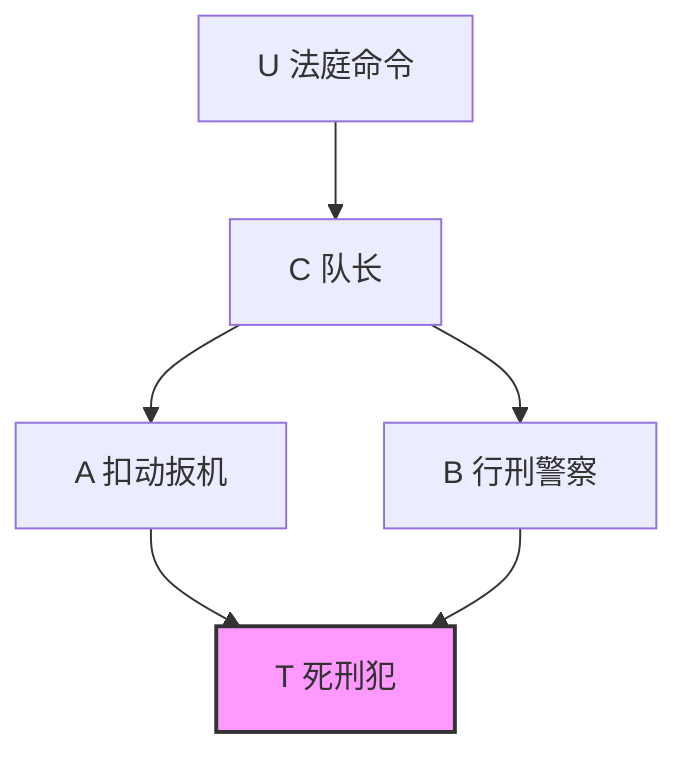
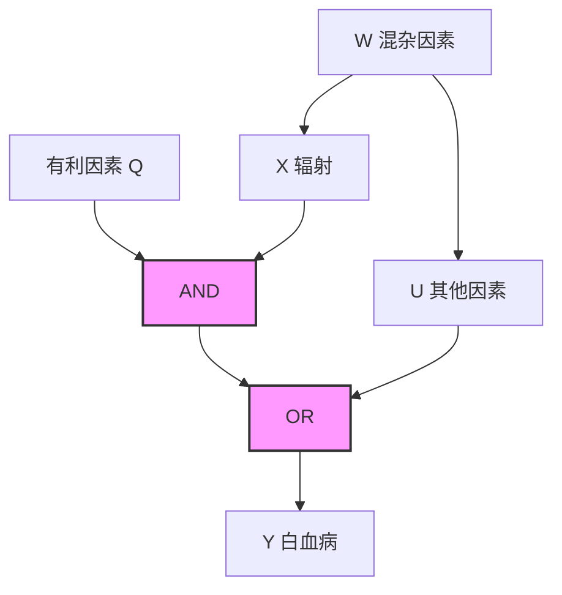

## 第 9 章 因果关系概率：解释和识别

来吧！我们掣签，看看这灾临到我们是因谁的缘故。

—Jonah 1:7（约拿书，1：7）

### 前言

评估一个事件导致另一个事件的可能性，在很大程度上可以指导我们对世界的理解（以及我们如何行动）。例如，根据常用的司法标准，当且仅当被告的行为“很可能是”原告受伤（或死亡）的原因时，才应做出有利于原告的判决。

但是因果关系有两个方面： **必要** 和 **充分** 。这两个方面中哪一个是立法者需要考虑的呢？如何评估它们的概率呢？

本章为事件 $x$ 是另一事件 $y$ 的必要或充分原因（或两者都有）的概率提供了形式化语义。然后，我们阐述了从统计数据中学习必要（或充分）因果关系概率的条件，并说明了如何将实验和非实验方法的数据结合起来，以生成两种方法都不能独立提供的信息。

### 9.1 简介

因果关系的标准反事实定义（即“如若不是 C，E 就不会发生”）抓住了“必要原因”的概念。诸如“充分原因”和“必要充分原因”等相互区别的概念在许多应用中都很重要，这些概念也可以在结构模型语义中给出简明的数学定义（7.1 节）。尽管必要原因和充分原因之间的区别可以追溯到 J. S. Mill（1843），但直到在 20 世纪 60 年代，才通过条件概率（Good，1961）和逻辑含义（Mackie，1965；Rothman，1976）得到半形式化的解释。这些解释都有基本的语义表达困难①，而且它们并没有像结构解释（7.1.3 节和 8.3 节）那样给出如何计算原因概率的程序。

> ① 7.5 节讨论概率论的局限性。10.1.4 节讨论逻辑解释的局限性。

在本章中，我们探讨了必要原因和充分原因的反事实解释，说明了结构模型语义在识别原因概率问题上的应用，并通过实例介绍了从统计数据计算原因概率的新方法。此外，我们认为必要性和充分性是因果关系的两个不同方面，这两个方面都应该参与因果解释的构建。

我们的研究成果在流行病学、法律推理、人工智能和心理学等领域都有应用。流行病专家长期以来一直致力于估计某一疾病“归因于”某一特定暴露的概率，这通常被反事实地解释为“在疾病和暴露确实发生的情况下，如若没有暴露，那么疾病不会发生的概率”。Robins 和 Greenland（1989）称这种反事实概率为“因果关系概率”，用来衡量产生结果的必要性②。它经常用于法律责任（legal responsibility）处于争议焦点的诉讼中（参见 8.3 节）。我们将用符号 **PN** 来表示这个概念，PN 是必要性概率（probability of necessity）的缩写。

> ② Greenland 和 Robins（1988）进一步区分了两种衡量因果关系概率的方法：第一种方法（称为“额外部分”）仅关注在特定时间是否发生了效应（例如疾病）；第二种方法（称为“病因学部分”（etiological fraction））要求考虑何时发生效应。在这里，我们将讨论限制在特定时间段内发生的事件，或者是那些“要么全部要么没有”的结果（例如出生缺陷），对于这些结果，重要的是发生的概率，而不是发生的时间。

另一方面，因果关系的概念刻画了一个原因对于产生这种结果的充分性，并发现其在策略分析、人工智能和心理学中的应用。政策制定者很可能对某些暴露可能给健康人群带来的危险感兴趣（Khoury et al., 1989）。从反事实角度说，这个概念可以表示为“如若一个健康的未暴露的个体被暴露，那么他将染上疾病的概率”，这将用 **PS** （probability of sufficiency，充分性概率）表示。一个自然的延伸是探究 **PNS** （probability of necessary and sufficient，必要性和充分性因果关系概率），也就是说，一个给定的个体同时受到两种方式影响的概率有多大。

如示例所示，PS 评估是否存在能够主动产生结果的原因，而 PN 强调在其他原因缺失的情况下（不包含所讨论的原因），这个原因是否仍然能够解释结果。

在法律环境中，如果原因（x）和结果（y）的发生是已经被充分确定的，则 PN 是引起最多关注的焦点。原告必须证明，如若 x 没有发生，y 不会发生（Robertson，1997）。然而，缺乏足够的充分性可能会削弱基于 PN 的论证（Good，1993；Michie，1999）。

众所周知，PN 通常是无法识别的，也就是说，它无法从涉及暴露和疾病的频率数据中估计得出（Greenland and Robins，1988；Robins and Greenland，1989）。这种识别受到两个因素的阻碍：

1.  **混杂** ——暴露和未暴露的受试者可能在几个相关因素上有所不同，或者更一般来说，原因和结果都可能受到第三个因素的影响。在这种情况下，我们认为，相对于结果 $^{[284]}$ 而言，原因不是外生的（参见 7.4.5 节）。

2.  **对生成过程的易感性** ——即使在没有混杂的情况下，某些反事实关系的概率也无法从频率信息中识别出来，除非我们明确指出连接原因和结果之间的函数关系。只要手头的事实（如疾病）可能受到反事实的前因（如暴露）的影响，就需要这种函数描述（参见 1.4 节、7.5 节和 8.3 节中的示例）。

尽管 PN 在一般情况下不可识别，但是仍有人提出了几个公式，根据流行病学研究中获得的频率来计算各种类型的归因（Breslow and Day，1980；Hennekens and Buring，1987；Cole，1997）。当然，任何这样的公式都必须基于关于数据生成过程的某些隐含假设。

9.2 节解释了其中一些假设，并探讨了在何种条件下可以放宽这些假设 $^{①}$ 。它为 PN 和 PS 提供了新公式，在原因（与结果）混杂的情况下，其结果仍然可以计算（例如，通过临床试验或辅助测量）。9.3 节举例说明了这些公式在法律和流行病学背景下的使用，而 9.4 节提供了当函数关系仅部分已知时可识别 PN 和 PS 的一般条件。

> **行间批注/脚注** ：Robins 和 Greenland（1989）给出了一组识别病因学部分的充分条件。然而，这些条件对于识别 PN 过于严格，以至于忽略了与病因学相关的时间部分。

必要原因和充分原因之间的区别在人工智能中具有重要意义，特别是在自动生成会话解释的系统中（参见 7.2.3 节）。从流行病学的例子可以看出，必要因果关系是一个专门针对所考虑的特定事件的概念（特例因果关系），而充分因果关系是基于某类事件产生其他事件的一般趋势。完备的解释应该同时考虑这两个方面。

如果我们仅仅根据一般趋势（即充分因果关系）进行解释，那么我们就失去了重要的特定信息。例如，用枪瞄准并在 1000 米外射击一个人，不能作为对该人死亡的解释，因为从如此远的距离发射子弹击中目标的可能性非常低，这与常识相悖。然而如果真的在某一天，子弹确实击中了目标，那么不管是什么原因，开枪者都是造成这一结果的罪魁祸首 $^{①}$ 。

另一方面，如果我们仅仅基于单个事件的考虑（即必要因果关系）来进行解释，那么通常存在于各种事件的背景因素就会尴尬地成为解释。例如，房间里有氧气的存在可以解释为发生火灾的原因，因为如果没有氧气，火灾就不会发生。事实上，我们会判断是火柴而不是氧气是引发火灾的实际原因，这表明我们应该超出看到的单个事件（每个这样的事件引发了结果，因此相对于背景因素都是必要和充分的），进而考虑同样问题的一般情况，在这些情况下，氧气显然不是引发火灾的原因。

在因果解释的必要成分和充分成分之间必须达到某种平衡 $^{②}$ 。接下来，本章通过形式化地阐述这两个成分之间的基本关系来说明这种平衡。

### 9.2 充分必要原因：识别条件

#### 9.2.1 定义、符号和基本关系

使用 7.1 节中介绍的反事实符号和结构模型语义，我们对前言中讨论的因果关系的三个方面给出以下定义。


##### 定义 9.2.1（必要性概率，PN）

设 $x$ 和 $y$ 是因果模型 $M$ 中的两个二值变量， $x$ 和 $y$ 分别代表命题 $X = \mathrm{true}$ 和 $Y = \mathrm{true}$ ， $x'$ 与 $y'$ 表示它们的反值。必要性概率定义为

$$
P N \triangleq P (Y_{x^{\prime}} = \text {false} \mid X = \text {true}, Y = \text {true}) \tag {9.1}
$$

$$
\triangleq P \left(y_{x^{\prime}}^{\prime} \mid x, y\right)
$$

换言之，假设 $x$ 和 $y$ 实际上确实已经发生，PN 代表 $y_{x}^{\prime}$ （如若没有事件 $x$ ，事件 $y$ 不会发生）的概率。

与 7.1 节中使用的符号相比，这里的符号有些细微的变化。小写字母（例如 $x$ 和 $y$ ）在 7.1 节中表示变量的值，但现在表示命题（或事件）。还要注意 $y_{x}$ 表示 $Y_{x} = \text{true}$ 的缩写， $y'_{x}$ 表示 $Y_{x} = \text{false}$ 的缩写 $^{\ominus}$ 。习惯于将反事实“如若 $A$ 发生，则 $B$ 发生”写成“ $A > B$ ”的读者可以把式（9.1）翻译成 $PN \triangleq P(x' > y' | x, y)^{\ominus}$ 。


##### 定义 9.2.2（充分性概率，PS）

$$
P S \triangleq P (y_{x} \mid y^{\prime}, x^{\prime}) \tag {9.2}
$$

PS 度量 $x$ 产生 $y$ 的能力，并且“产生”意味着 $x$ 和 $y$ 从不存在到存在的变换，因此我们对概率 $P(y_{x})$ 设置了 $x$ 和 $y$ 不存在的条件。于是，PS 给出了在 $x$ 和 $y$ 不存在的情况下“如若 $x$ 发生，那么产生 $y$ ”的概率，这也反映了 $x$ 的某种必要性（由 PN 度量）。


##### 定义 9.2.3（充分必要性概率，PNS）

$$
P N S \triangleq P (y_{x}, y_{x^{\prime}}^{\prime}) \tag {9.3}
$$

PNS 代表 y 在两种情况下对 x 做出响应的概率，因此可以度量 x 产生 y 的充分性和必要性。

与这三个基本概念相联系的其他反事实的量化值引起了应用或概念上的兴趣。我们将提到两个这样的量化值，但不会详细讨论它们的分析过程，因为这些可以从 PN、PS 和 PNS 中推出。


##### 定义 9.2.4（禁阻概率，PD（Probability of Disablement））

$$
P D \triangleq P (y_{x}^{\prime} | y) \tag {9.4}
$$

PD 度量 $y$ 在没有 $x$ 的情况下被禁阻的概率，因此，希望评估各种预防计划的社会问题决策者对此很感兴趣（Fleiss，1981，p.75-6）。


##### 定义 9.2.5（启开概率，PE（Probability of Enablement））

$$
P E \triangleq P (y_{x} \mid y^{\prime})
$$

PE 与 PS 类似，只是不以 $x'$ 为条件。例如，当我们希望评估整个健康人群（包括已经暴露的人群）暴露的危险时，它是适用的。

尽管这些量都不足以充分确定其他量，但它们并不是完全独立的，如以下引理所示。


##### 引理 9.2.6

因果关系的概率（PNS、PN 和 PS）满足以下关系：

$$
P N S = P (x, y) P N + P (x^{\prime}, y^{\prime}) P S \tag {9.5}
$$

**证明** ：用我们的符号可以将式（7.20）的一致性条件 $X = x \Rightarrow Y_x = Y$ 翻译成

$$
x \Rightarrow (y_{x} = y), \quad x^{\prime} \Rightarrow (y_{x^{\prime}} = y)
$$

因此我们可以写出

$$
\begin{array}{l}
y_{x} \wedge y_{x^{\prime}}^{\prime} = \left(y_{x} \wedge y_{x^{\prime}}^{\prime}\right) \wedge (x \vee x^{\prime}) \\
= \left(y \wedge x \wedge y_{x^{\prime}}^{\prime}\right) \vee \left(y_{x} \wedge y^{\prime} \wedge x^{\prime}\right) \\
\end{array}
$$

利用两边的概率和 $x$ 和 $x^{\prime}$ 的互斥性，我们得到

$$
\begin{array}{l}
P \left(y_{x}, y_{x^{\prime}}^{\prime}\right) = P \left(y_{x^{\prime}}^{\prime}, x, y\right) + P \left(y_{x}, x^{\prime}, y^{\prime}\right) \\
= P \left(y_{x^{\prime}}^{\prime} \mid x, y\right) P (x, y) + P \left(y_{x} \mid x^{\prime}, y^{\prime}\right) P \left(x^{\prime}, y^{\prime}\right) \\
\end{array}
$$

至此，证明了引理 9.2.6。

为了专注于 PN 和 PS 所得的因果关系的各个方面的描述，在因果模型中描述那些使这两个量保持不变的变化是有帮助的。接下来的两个引理表明 PN 对抑制 y 的其他原因不敏感，而 PS 对引起 y 的其他原因不敏感。


##### 引理 9.2.7

设 $\mathrm{PN}(x,y)$ 表示 $x$ 是 $y$ 的一个必要原因的概率。设 $z = y \wedge q$ 是 $y$ 的一个结果，它可能被 $q'$ 所抑制。如果 $q_{\perp} \{X, Y, Y_{x'}\}$ ，那么

$$
P N (x, z) \triangleq P \left(z_{x^{\prime}}^{\prime} \mid x, z\right) = P \left(y_{x^{\prime}}^{\prime} \mid x, y\right) \triangleq P N (x, y)
$$

将过程 $Y_{x}(u)$ 与 $z = y \wedge q$ 连起来相当于用概率 $P(q')$ 来抑制过程的结果。引理 9.2.7 断言，如果 $q$ 是随机的，我们可以在不影响 PN 的情况下添加这样的链接。原因很清楚：在所考虑的场景中， $x$ 和 $z$ 的条件设置意味着添加的链接没有被 $q'$ 所抑制。

**证明** ：我们有

$$
\begin{array}{l}
P N (x, z) = P \left(z_{x^{\prime}}^{\prime} \mid x, z\right) = \frac {P \left(z_{x^{\prime}}^{\prime} , x , z\right)}{P (x , z)} \tag {9.6} \\
= \frac {P \left(z_{x^{\prime}}^{\prime} , x , z \mid q\right) P (q) + P \left(z_{x^{\prime}}^{\prime} , x , z \mid q^{\prime}\right) P \left(q^{\prime}\right)}{P (z , x , q) + P (z , x , q^{\prime})} \\
\end{array}
$$

使用 $z=y\wedge q$ ，它遵循

$$
q \Rightarrow (z = y), \quad q \Rightarrow (z_{x^{\prime}}^{\prime} = y_{x^{\prime}}^{\prime}) \quad \text {且} \quad q^{\prime} \Rightarrow z^{\prime}
$$

因此

$$
\begin{array}{l}
P N (x, z) = \frac {P (y_{x^{\prime}}^{\prime} , x , y \mid q) P (q) + 0}{P (y , x , q) + 0} \\
= \frac {P (y_{x^{\prime}}^{\prime} , x , y)}{P (y , x)} = P (y_{x^{\prime}}^{\prime} \mid x, y) = P N (x, y) \\
\end{array}
$$


##### 引理 9.2.8

设 $PS(x,y)$ 表示 $x$ 是 $y$ 的一个充分原因的概率。设 $z = y \vee r$ 是 $y$ 的一个结果，它可能被 $r$ 触发。如果 $r \perp \{X, Y, Y_x\}$ ，那么

$$
P S (x, z) \triangleq P \left(z_{x} \mid x^{\prime}, z^{\prime}\right) = P \left(y_{x} \mid x^{\prime}, y^{\prime}\right) \triangleq P S (x, y)
$$

引理 9.2.8 断言，可以在不影响 PS 的情况下添加其他（独立）原因（r）。理由同样很清楚：对事件 $x'$ 和 $y'$ 的条件设置意味着添加的原因（r）没有激活。引理 9.2.8 的证明与引理 9.2.7 的证明相似。

由于到目前为止定义的所有因果度量都引用了对 $y$ 的条件化，并且假定 $y$ 受 $x$ 的影响。即使在没有混杂的情况下，我们知道这些量也不能仅从因果图 $G(M)$ 和数据 $P(v)$ 中识别。此外，通常情况下，这些量中没有一个能够决定其他量。然而，在没有混杂的假设下，这些量可以推导出简单的相互关系和有用的界限，我们称之为 **外生性假设** 。

#### 9.2.2 外生性下的界限与基本关系


##### 定义 9.2.9（外生性）

在模型 M 中，变量 X 是相对于 Y 外生的，当且仅当

$$
\{Y_{x}, Y_{x^{\prime}}\} \perp X \tag {9.7}
$$

换句话说，Y 对条件 x 或 $x'$ 的潜在响应的方式与 X 的实际值无关。

式（9.7）是第 5 章（式（5.30））和第 6 章（式（6.10））中使用的公式的一个强化版本，因为它涉及联合变量 $\{Y_x, Y_{x'}\}$ 。Rosenbaum 和 Rubin（1983）将这种定义命名为“强可忽略性”（strong ignorability），它与经典的基于误差的外生性标准（Christ, 1966, p.156；参见 7.4.5 节）和后门定义准则 3.3.1 一致。式（5.30）的弱定义对于本章中的所有结果都是充分的，但式（9.11）、式（9.12）和式（9.19）除外，因为式（9.11）、式（9.12）和式（9.19）需要强外生性（式（9.7））。

外生性的重要性依赖于允许识别 $\{P(y_x), P(y_{x'})\}$ ，即 $X$ 对 $Y$ 的因果效应，因为（使用 $x \Rightarrow (y_x = y)$ ）

$$
P(y_{x}) = P(y_{x} \mid x) = P(y \mid x) \tag {9.8}
$$

对于 $P(y_{x'})$ 也有类似的归约。


##### 定理 9.2.10

在外生性条件下，PNS 的界限如下

$$
\max[0, P(y \mid x) - P(y \mid x^{\prime})] \leqslant PNS \leqslant \min[P(y \mid x), P(y^{\prime} \mid x^{\prime})] \tag {9.9}
$$

这两个边界都是严格的，因为对于每个联合分布 $P(x,y)$ ，都存在一个模型 $y = f(x,u)$ （其中 $\pmb{u}$ 独立于 $x$ ），满足该界限范围内的任意 PNS 值。

##### 证明

对于任何两个事件 $A$ 和 $B$ ，我们都有严格的界限

$$
\max[0, P(A) + P(B) - 1] \leqslant P(A, B) \leqslant \min[P(A), P(B)] \tag {9.10}
$$

式（9.9）根据式（9.3）和式（9.10），使用 $A=y_{x}$ 、 $B=y'_{x'}$ 、 $P(y_{x})=P(y|x)$ 和 $P(y'_{x'})=P(y|x')$ 得到。

显然，如果不能确定外生性，那么 PNS 被类似于式（9.9）的一个不等式约束，其中使用 $P(y_{x})$ 和 $P(y'_{x'})$ 分别代替 $P(y|x)$ 和 $P(y'|x')$ 。


##### 定理 9.2.11

在外生性条件下，概率 PN、PS 和 PNS 之间的相互关联如下所示：

$$
PN = \frac{PNS}{P(y \mid x)} \tag {9.11}
$$

$$
PS = \frac{PNS}{P(y^{\prime} \mid x^{\prime})} \tag {9.12}
$$

因此，式（9.9）中 PNS 的界限为 PN 和 PS 提供了相应的界限。

那么，PN 的界限为

$$
\frac{\max[0, P(y \mid x) - P(y \mid x^{\prime})]}{P(y \mid x)} \leqslant PN \leqslant \frac{\min[P(y \mid x), P(y^{\prime} \mid x^{\prime})]}{P(y \mid x)} \tag {9.13}
$$

在外生性存在的实验研究中，该界限限制了我们识别 PN 的能力。


##### 推论 9.2.12

如果 $x$ 和 $y$ 发生在实验研究中，同时 $P(y_{x})$ 和 $P(y_{x^{\prime}})$ 是该研究中测量得到的因果效应，那么，对于下述范围内的任何 $P$ 值

$$
\frac {\max [ 0 , P (y_{x}) - P (y_{x^{\prime}}) ]}{P (y_{x})} \leqslant p \leqslant \frac {\min [ P (y_{x}) , P (y_{x^{\prime}}^{\prime}) ]}{P (y_{x})} \tag {9.14}
$$

存在一个与 $P(y_{x})$ 和 $P(y_{x^{\prime}})$ 一致且 $PN = p$ 的因果模型 $M$ 。

如果我们有实验研究和观察研究的数据（如 9.3.4 节），那么可以为非实验性事件建立其他边界。这些边界的非零宽度意味着因果关系的概率不能在随机（非拉普拉斯）模型中唯一定义，其中对于每个 $u$ ， $y_{x}(u)$ 需要通过概率 $P(Y_{x}(u)=y)$ 来确定，而不是具体的数字来确定。

##### 定理 9.2.11 的证明

使用 $x \Rightarrow (y_x = y)$ ，我们可以写作 $x \wedge y_x = x \wedge y$ ，从而得到

$$
P N = P (y_{x^{\prime}}^{\prime} \mid x, y) = \frac {P (y_{x^{\prime}}^{\prime} , x , y)}{P (x , y)} \tag {9.15}
$$

$$
= \frac {P (y_{x^{\prime}}^{\prime} , x , y_{x})}{P (x , y)} \tag {9.16}
$$

$$
= \frac {P (y_{x^{\prime}}^{\prime} , y_{x}) P (x)}{P (x , y)} \tag {9.17}
$$

$$
= \frac {P N S}{P (y \mid x)} \tag {9.18}
$$

这就证明了式（9.11）。式（9.12）同理可证。

为了完整起见，我们给出 PNS 与禁阻概率和启开概率之间的关系：

$$
P D = \frac {P (x) P N S}{P (y)}, \quad P E = \frac {P (x^{\prime}) P N S}{P (y^{\prime})} \tag {9.19}
$$

#### 9.2.3 单调性和外生性下的可识别性

在讨论式（9.1）～（9.3）中识别反事实量的一般问题之前，讨论一个特殊条件是有指导意义的，该条件称为 **单调性（monotonicity）** 。这种单调性通常在实践中是被假定的，并且使这些量是可识别的。由此产生的概率表达式被认为是文献中常见的因果关系度量。


##### 定义 9.2.13（单调性）

在因果模型 $M$ 中，当且仅当函数 $y_{x}(u)$ 在 $x$ 中对所有 $u$ 是单调时，称变量 $Y$ 相对于变量 $X$ 是单调的。等价地， $Y$ 相对于 $X$ 是单调的，当且仅当

$$
y_{x}^{\prime} \wedge y_{x^{\prime}} = \text {false} \tag {9.20}
$$

单调性表示这种假设：在任何情况下，从 $X = \text{false}$ 到 $X = \text{true}$ 的变化都不能使 $Y$ 从 $\text{true}$ 变为 $\text{false}$ 。在流行病学中，这一假设常常被表达为“无预防”，也就是说，人群中的任何个体都不能通过暴露危险而避免疾病。

> **注** ：我们的分析对于 $x$ 或 $y$ （或两者）的互补保持不变。因此，单调性的一般条件应为： $y_x' \wedge y_x' = \text{false}$ 或者 $y_x' \wedge y_x = \text{false}$ 。然而为了简单起见，我们将遵循式（9.20）中的定义。注意：单调性意味着式（5.30）蕴含式（9.7）。


##### 定理 9.2.14（外生性和单调性下的可识别性）

如果 $X$ 是外生的， $Y$ 相对于 $X$ 是单调的，那么 **PN、PS 和 PNS** 概率都是可识别的，由式（9.11）和式（9.12）给出，其中

$$
P N S = P (y \mid x) - P (y \mid x^{\prime}) \tag {9.21}
$$

式（9.21）的等号右边在流行病学中被称为“风险差”，也被误称为“归因风险”（attributable risk）（Hennekens and Buring, 1987）。

从式（9.11）中我们可以看出，必要性概率是可识别的，并由 **超额风险率（Excess Risk Ratio, ERR）** 给出

$$
P N = \frac {P (y \mid x) - P (y \mid x^{\prime})}{P (y \mid x)} \tag {9.22}
$$

这个概率通常被误称为“归因分数”（Schlesselman，1982）、“归因率百分比”（Hennekens and Boring，1987）或“归因比例”（Cole，1997）。从字面上看，式（9.22）中的比率与归因无关，因为它由统计术语组成，而不是由因果关系或反事实关系组成。然而， **外生性和单调性的假设** 使我们能够将 PN 定义中的归因概念（式（9.1））转化为纯统计关联的比率。这表明，许多作者提出或推导式（9.22）作为“归因于暴露因素的暴露疾病比例”的度量都默认了外生性和单调性。

Robins 和 Greenland（1989）在随机单调性假设下（即 $P(Y_{x}(u) = y) > P(Y_{x^{\prime}}(u) = y)$ ）分析了 PN 的识别，并表明该假设太弱，无法进行这种识别。实际上，它产生的界限与式（9.13）中的界限相同。这表明 **随机单调性** 对介于 $X$ 和 $Y$ 之间的函数机制没有任何约束。

PS（式（9.12））的表达式（如下）同样能够说明问题：

$$
P S = \frac {P (y \mid x) - P (y \mid x^{\prime})}{1 - P (y \mid x^{\prime})} \tag {9.23}
$$

因为它与流行病学家所称的“相对差”（Shep，1958）吻合，后者用于测量人群对暴露 $x$ 的易感性。易感性被定义为具有“足以使人在暴露后感染疾病的潜在因素”的人群比例（Khoury et al., 1989）。PS 提供了对易感性的形式化反事实解释，这种解释使定义更加清晰，使易感性易于系统分析。

Khoury 等人（1989）通过三个假设：无混杂、单调性和独立性（即假设暴露易感性与背景易感性无关）认识到易感性一般是不可识别的，也不能推导出式（9.23）。最后一个假设常常被批评为站不住脚，定理 9.2.14 向我们证明了 **独立性实际上是不必要的** 。仅需要外生性和单调性，式（9.23）就具备有效性。

> **注** ：Khoury 等人（1989）未提及单调性，但必须隐含地假定单调性以使推导有效。

式（9.23）也与 Cheng（1997）所称的“因果力”一致，即在抑制“ $y$ 的所有其他原因”后， $x$ 对 $y$ 的效应。PS 的反事实定义（即 $P(y_{x} \mid x', y')$ ）表明了对该量的另一种解释。它度量了在实际上不存在 $x$ 和 $y$ 的情况下假设 $x$ 产生 $y$ 的概率。对 $y'$ 的条件作用相当于选择了（或假设）那些“ $y$ 的所有其他原因”被抑制的世界。

然而，需要注意的是，三个因果关系概念（式（9.11）～（9.12））之间的简单关系仅在外生性假设下成立。在一般情况下，是式（9.5）这种较弱的关系。此外，所有这些因果关系的概念都是根据全局关系 $Y_{x}(u)$ 和 $Y_{x^{\prime}}(u)$ 来定义的，这对于完整描述因果关系的许多细节来说过于粗糙。从 $x$ 到 $y$ 的因果模型的详细结构往往需要提供更精确的概念，如“实际原因”（见第 10 章）。

##### 定理 9.2.14 的证明

记 $y_{x'} \vee y'_{x'} = \text{true}$ ，我们有：

$$
y_{x} = y_{x} \wedge (y_{x^{\prime}} \vee y_{x^{\prime}}^{\prime}) = (y_{x} \wedge y_{x^{\prime}}) \vee (y_{x} \wedge y_{x^{\prime}}^{\prime}) \tag{9.24}
$$

且：

$$
y_{x^{\prime}} = y_{x^{\prime}} \wedge (y_{x} \vee y_{x}^{\prime}) = (y_{x^{\prime}} \wedge y_{x}) \vee (y_{x^{\prime}} \wedge y_{x}^{\prime}) = y_{x^{\prime}} \wedge y_{x} \tag{9.25}
$$

因为单调性意味着 $y_{x'} \wedge y'_{x} = \text{false}$ ，所以将式（9.25）代入式（9.24）得到：

$$
y_{x} = y_{x^{\prime}} \vee (y_{x} \wedge y_{x^{\prime}}^{\prime}) \tag{9.26}
$$

取式（9.26）中的概率并利用 $y_{x'}$ 与 $y'_{x'}$ 的互斥性，得到：

$$
P(y_{x}) = P(y_{x^{\prime}}) + P(y_{x}, y_{x^{\prime}}^{\prime})
$$

或：

$$
P(y_{x}, y_{x^{\prime}}^{\prime}) = P(y_{x}) - P(y_{x^{\prime}}) \tag{9.27}
$$

式（9.27）与外生性假设（式（9.8））一起推出了式（9.21）。

#### 9.2.4 单调性和非外生性下的可识别性

定理 9.2.10 ～ 定理 9.2.14 中建立的关系是基于外生性假设的。在本节中，我们放宽了这一假设，并考虑 ** $X$ 对 $Y$ 的影响有混杂** 的情况，即 $P(y_{x}) \neq P(y|x)$ 。在这种情况下， $P(y_{x})$ 仍然可以通过辅助手段（例如，通过校正某些协变量或通过实验研究）来估计，但问题是，这些附加信息是否能够使因果关系的概率变得可识别。

**答案是肯定的。**


##### 定理 9.2.15

如果 $Y$ 相对于 $X$ 是单调的，那么当因果效应 $P(y_{x})$ 和 $P(y_{x^{\prime}})$ 可识别时，PNS、PN 和 PS 可识别：

$$
P N S = P (y_{x}, y_{x^{\prime}}^{\prime}) = P (y_{x}) - P (y_{x^{\prime}}) \tag {9.28}
$$

$$
P N = P \left(y_{x^{\prime}}^{\prime} \mid x, y\right) = \frac {P (y) - P \left(y_{x^{\prime}}\right)}{P (x , y)} \tag {9.29}
$$

$$
P S = P (y_{x} \mid x^{\prime}, y^{\prime}) = \frac {P (y_{x}) - P (y)}{P (x^{\prime} , y^{\prime})} \tag {9.30}
$$

为了理解式（9.29）和式（9.22）之间的差异，我们可以展开 $P(y)$ 并得到：

$$
P N = \frac {P (y \mid x) P (x) + P (y \mid x^{\prime}) P \left(x^{\prime}\right) - P \left(y_{x^{\prime}}\right)}{P (y \mid x) P (x)}
$$

$$
= \frac {P (y \mid x) - P (y \mid x^{\prime})}{P (y \mid x)} + \frac {P (y \mid x^{\prime}) - P (y_{x^{\prime}})}{P (x , y)} \tag {9.31}
$$

式（9.31）右边的第一项是我们熟悉的超额风险率（如式（9.22）所示），表示在外生性下的 PN 值。第二个术语表示解释混杂所需的校正，也就是 $P(y_{x'}) \neq P(y|x')$ 。

因此，式（9.28）～（9.30）提供了更精确的因果关系度量，可用于因果关系 $P(y_{x})$ 通过辅助手段识别的情况（参见 **9.3.4 节** ）。也可以证明，式（9.28）～（9.30）中的表达式为 PNS、PN 和 PS 提供了一般非单调情况下的下界（Tian and Pearl, 2000, **11.9.2 节** ）。

值得注意的是，由于 PS 和 PN 必须是非负的，因此式（9.29）～（9.30）为单调性假设提供了一个简单必要的检验：

$$
P (y_{x}) \geqslant P (y) \geqslant P (y_{x^{\prime}}) \tag {9.32}
$$

它收紧了标准不等式（从 $x^{\prime} \wedge y \Rightarrow y_{x^{\prime}}$ 和 $x \wedge y^{\prime} \Rightarrow y_{x^{\prime}}$ ）：

$$
P \left(y_{x^{\prime}}\right) \geqslant P \left(x^{\prime}, y\right), \quad P \left(y_{x}^{\prime}\right) \geqslant P \left(x, y^{\prime}\right) \tag {9.33}
$$

J. Tian 已经证明了事实上这些不等式是严格的：满足这些不等式的实验和非实验数据的每种组合都可以从某些因果模型中产生，其中 $Y$ 在 $X$ 中是单调的。“无预防措施”的一般性假设并不能完全免除实验性的工作，这应该让许多流行病学家感到宽慰。换言之，如果无预防措施假设在理论上是不可辩驳的，那么式（9.32）可用于测试实验数据和非实验数据的一致性，即临床试验中的受试者是否代表了以联合分布 $P(x, y)$ 刻画的目标人群。

##### 定理 9.2.15 的证明

式（9.28）由式（9.27）推出。为了证明式（9.30），我们写作：

$$
P (y_{x} \mid x^{\prime}, y^{\prime}) = \frac {P (y_{x} , x^{\prime} , y^{\prime})}{P (x^{\prime} , y^{\prime})} = \frac {P (y_{x} , x^{\prime} , y_{x^{\prime}}^{\prime})}{P (x^{\prime} , y^{\prime})} \tag {9.34}
$$

因为 $x' \wedge y' = x' \wedge y'_{x'}$ （一致性）。为了计算式（9.34）的分子，我们将式（9.26）与 $x'$ 结合得到：

$$
x^{\prime} \wedge y_{x} = \left(x^{\prime} \wedge y_{x^{\prime}}\right) \vee \left(y_{x} \wedge y_{x^{\prime}}^{\prime} \wedge x^{\prime}\right)
$$

然后，我们取两边的概率，得出（因为 $y_{x'}$ 和 $y'_{x'}$ 是互斥的）：

$$
\begin{array}{l} P (y_{x}, y_{x^{\prime}}^{\prime}, x^{\prime}) = P (x^{\prime}, y_{x}) - P (x^{\prime}, y_{x^{\prime}}) \\ = P \left(x^{\prime}, y_{x}\right) - P \left(x^{\prime}, y\right) \\ = P \left(y_{x}\right) - P \left(x, y_{x}\right) - P \left(x^{\prime}, y\right) \\ = P \left(y_{x}\right) - P (x, y) - P \left(x^{\prime}, y\right) \\ = P (y_{x}) - P (y) \\ \end{array}
$$

代入式（9.34），最终得到：

$$
P (y_{x} \mid x^{\prime}, y^{\prime}) = \frac {P (y_{x}) - P (y)}{P (x^{\prime} , y^{\prime})}
$$

即证明了式（9.30）。式（9.29）同理可证。

第 3 章举例说明了一类允许在非外生性条件下识别 $P(y_{x})$ 的模型。 **3.2 节** （式（3.13））表明，在正马尔可夫模型 $M^{\ominus}$ 中，任意两个变量 $X$ 和 $Y$ 的因果效应 $P(y_{x})$ 是可识别的，并可由下式得出：

$$
P (y_{x}) = \sum_ {p a_{X}} P (y \mid p a_{X}, x) P (p a_{X}) \tag {9.35}
$$

其中 $pa_{X}$ 是与 $M$ 相关的因果图中 $X$ 的（实际的）父代变量。因此，我们可以将式（9.35）与定理 9.2.15 结合起来，获得确定因果概率的具体条件。


##### 推论 9.2.16

对于任何正马尔可夫模型 $M$ ，如果函数 $Y_{x}(u)$ 是 **单调** 的，则 PNS、PS 和 PN 的因果概率是可识别的，并由式（9.28）～（9.30）给出，其中 $P(y_{x})$ 如式（9.35）所示。

通过使用后门准则和前门准则（3.3 节）可以获得更广泛的识别条件，这些准则适用于半马尔可夫模型。Galles 和 Pearl（1995）（参见 4.3.1 节）与 Tian 和 Pearl（2002a）（定理 3.6.1）中有进一步的推广，并得出以下推论。


##### 推论 9.2.17

设 $GP$ 是一类满足定理 3.6.1 的半马尔可夫模型。如果 $Y_{x}(u)$ 是 **单调** 的，则 PNS、PS 和 PN 的因果概率在 $GP$ 中是可识别的，并由式（9.28）～（9.30）给出，其中 $P(y_{x})$ 由 $G(M)$ 的拓扑通过 Tian 和 Pearl（2002a）提出的算法确定。

---

### 9.3 实例与应用

本章将通过几个具体的实例，展示如何将前文介绍的数值方法应用于解决实际问题。这些实例涵盖了从简单函数求根到复杂物理系统模拟的多个层面。

#### 9.3.1 二分法求根

**问题** ：求方程 $f(x) = x^3 - 2x - 5 = 0$ 在区间 $[2, 3]$ 内的一个实根，要求精度为 $10^{-5}$ 。

**分析** ：
首先验证根的存在性。计算区间端点函数值：
$f(2) = 2^3 - 2 \times 2 - 5 = -1 < 0$
$f(3) = 3^3 - 2 \times 3 - 5 = 16 > 0$

由于 $f(2) \cdot f(3) < 0$ ，根据介值定理，函数 $f(x)$ 在区间 $(2, 3)$ 内至少存在一个根。二分法通过不断将区间一分为二，使有根区间逐步缩小，直至满足精度要求。

**算法伪代码** ：

- 输入：区间端点 $a, b$ ，精度要求 $\epsilon$
- 步骤：
  1.  计算中点 $c = \frac{a+b}{2}$
  2.  如果 $f(c) = 0$ 或 $\frac{b-a}{2} < \epsilon$ ，则输出 $c$ 并结束。
  3.  如果 $f(a) \cdot f(c) < 0$ ，则根在区间 $[a, c]$ 内，令 $b = c$ 。
  4.  否则，根在区间 $[c, b]$ 内，令 $a = c$ 。
  5.  重复步骤 1-4。

**Python 代码实现** ：

```python
def bisection(f, a, b, tol=1e-5, max_iter=100):
    """
    使用二分法求函数 f 在区间 [a, b] 上的根。
    """
    if f(a) * f(b) >= 0:
        print("二分法失败：区间端点函数值必须异号。")
        return None

    for i in range(max_iter):
        c = (a + b) / 2.0
        fc = f(c)

        # 检查是否满足精度要求
        if abs(fc) < tol or (b - a) / 2.0 < tol:
            print(f"迭代次数: {i+1}, 根为: {c:.6f}")
            return c

        # 更新区间
        if f(a) * fc < 0:
            b = c
        else:
            a = c

    print("达到最大迭代次数，未收敛。")
    return (a + b) / 2.0

# 定义函数
def func(x):
    return x**3 - 2*x - 5

# 调用二分法求解
root = bisection(func, 2, 3)
```

**结果** ：
运行上述代码，得到方程的近似根为 $x \approx 2.094551$ 。

#### 9.3.2 牛顿迭代法求解非线性方程组

**问题** ：求解下列非线性方程组：

$$
\begin{cases}
x^2 + y^2 = 4 \\
x^2 - y = 1
\end{cases}
$$

**分析** ：
牛顿迭代法可以推广到求解非线性方程组。其核心思想是，在每一步迭代中，将非线性方程组线性化，然后求解线性方程组得到修正量。设向量 $\mathbf{x} = (x, y)^T$ ，方程组可写为 $\mathbf{F}(\mathbf{x}) = \mathbf{0}$ ，其中：

$$
\mathbf{F}(\mathbf{x}) = \begin{bmatrix} f_1(x, y) \\ f_2(x, y) \end{bmatrix} = \begin{bmatrix} x^2 + y^2 - 4 \\ x^2 - y - 1 \end{bmatrix}
$$

**迭代公式** ：

$$
\mathbf{x}^{(k+1)} = \mathbf{x}^{(k)} - \mathbf{J}^{-1}(\mathbf{x}^{(k)}) \mathbf{F}(\mathbf{x}^{(k)})
$$

其中 $\mathbf{J}$ 是雅可比矩阵：

$$
\mathbf{J} = \begin{bmatrix}
\frac{\partial f_1}{\partial x} & \frac{\partial f_1}{\partial y} \\
\frac{\partial f_2}{\partial x} & \frac{\partial f_2}{\partial y}
\end{bmatrix} = \begin{bmatrix}
2x & 2y \\
2x & -1
\end{bmatrix}
$$

**算法伪代码** ：

- 输入：初始猜测 $\mathbf{x}^{(0)}$ ，精度要求 $\epsilon$
- 步骤：
  1.  计算函数值 $\mathbf{F}(\mathbf{x}^{(k)})$ 和雅可比矩阵 $\mathbf{J}(\mathbf{x}^{(k)})$ 。
  2.  求解线性方程组 $\mathbf{J} \Delta \mathbf{x} = -\mathbf{F}$ ，得到修正量 $\Delta \mathbf{x}$ 。
  3.  更新解： $\mathbf{x}^{(k+1)} = \mathbf{x}^{(k)} + \Delta \mathbf{x}$ 。
  4.  如果 $\Vert \Delta \mathbf{x} \Vert < \epsilon$ ，则输出 $\mathbf{x}^{(k+1)}$ 并结束。
  5.  否则， $k = k + 1$ ，重复步骤 1-4。

**Python 代码实现** ：

```python
import numpy as np

def newton_system(F, J, x0, tol=1e-6, max_iter=100):
    """
    使用牛顿法求解非线性方程组。
    F: 函数向量，接受一个 numpy 数组并返回一个 numpy 数组
    J: 雅可比矩阵函数，接受一个 numpy 数组并返回一个 2D numpy 数组
    x0: 初始猜测
    """
    x = np.array(x0, dtype=float)
    for i in range(max_iter):
        Fx = F(x)
        Jx = J(x)
        # 求解线性方程组 Jx * dx = -Fx
        try:
            dx = np.linalg.solve(Jx, -Fx)
        except np.linalg.LinAlgError:
            print("雅可比矩阵奇异，算法失败。")
            return None

        x = x + dx

        if np.linalg.norm(dx) < tol:
            print(f"迭代次数: {i+1}, 解为: x = {x[0]:.6f}, y = {x[1]:.6f}")
            return x

    print("达到最大迭代次数。")
    return x

# 定义方程组
def F(x):
    return np.array([x[0] **2 + x[1]** 2 - 4,
                     x[0]**2 - x[1] - 1])

# 定义雅可比矩阵
def J(x):
    return np.array([[2*x[0], 2*x[1]],
                     [2*x[0], -1]])

# 初始猜测
x0 = [1.0, 1.0]
# 求解
solution = newton_system(F, J, x0)
```

**结果** ：
从初始点 $(1.0, 1.0)$ 出发，算法收敛到一组解 $(x, y) \approx (1.581139, 1.500000)$ 。从不同的初始点出发，可能会收敛到方程组的另一组解（例如 $(-1.581139, 1.500000)$ ）。

#### 9.3.3 使用欧拉法模拟单摆运动

**问题** ：模拟一个长度为 $L = 1m$ ，初始摆角为 $\theta_0 = 60^\circ$ 的单摆在无阻尼情况下的运动。其运动微分方程为：

$$
\frac{d^2\theta}{dt^2} + \frac{g}{L} \sin(\theta) = 0
$$

其中 $g = 9.81 m/s^2$ 是重力加速度。

**分析** ：
这是一个二阶常微分方程（ODE）。我们可以通过引入新变量 $\omega = \frac{d\theta}{dt}$ （角速度），将其降阶为一阶常微分方程组：

$$
\begin{cases}
\frac{d\theta}{dt} = \omega \\
\frac{d\omega}{dt} = -\frac{g}{L} \sin(\theta)
\end{cases}
$$

**欧拉法（Forward Euler）** ：这是一种最简单的数值积分方法。给定当前时刻 $t_n$ 的状态 $(\theta_n, \omega_n)$ ，下一时刻 $t_{n+1} = t_n + \Delta t$ 的状态通过以下公式近似：

$$
\begin{aligned}
\theta_{n+1} &= \theta_n + \omega_n \cdot \Delta t \\
\omega_{n+1} &= \omega_n + (-\frac{g}{L} \sin(\theta_n)) \cdot \Delta t
\end{aligned}
$$

**算法伪代码** ：

- 输入：初始角度 $\theta_0$ ，初始角速度 $\omega_0$ ，时间步长 $\Delta t

#### 9.3.1 实例 1：公平硬币下注

我们必须对掷硬币的结果下正面或反面的赌注：猜对就赢一美元，猜错就输了。假设我们猜正面朝上，赢了一美元，而不看硬币的实际结果。我们的赌注是获胜的必要原因（或充分原因，或两者都有）吗？

本例与 1.4.4 节（见图 1.6）讨论的临床试验是同样的。令 $x$ 代表“我们下注正面”， $y$ 代表“我们赢了一美元”， $u$ 代表“硬币正面朝上”。 $y$ 、 $x$ 、 $u$ 之间的函数关系是：

$$
y = (x \wedge u) \vee \left(x^{\prime} \wedge u^{\prime}\right) \tag {9.36}
$$

这不是单调的，但是，由于模型是完全确定的，因此允许我们从它们的定义（式 (9.1)～(9.3)）计算因果关系的概率。例如，因为 $x \wedge y \Rightarrow u$ 且 $Y_{x'}(u) = false$ ，所以有：

$$
P N = P (y_{x^{\prime}}^{\prime} \mid x, y) = P (y_{x^{\prime}}^{\prime} \mid u) = 1
$$

换句话说，已知当前的赌注（ $x$ ）和当前的输赢（ $y$ ）可以让我们推断硬币的结果一定是正面朝上（ $u$ ）。由此我们可以进一步推断，猜反面朝上而不是正面朝上会导致赌输。同样地：

$$
P S = P (y_{x} \mid x^{\prime}, y^{\prime}) = P (y_{x} \mid u) = 1
$$

（因为 $x' \wedge y' \Rightarrow u$ ）且：

$$
\begin{array}{l} P N S = P (y_{x}, y_{x^{\prime}}^{\prime}) \\ = P \left(y_{x}, y_{x^{\prime}}^{\prime} \mid u\right) P (u) + P \left(y_{x}, y_{x^{\prime}}^{\prime} \mid u^{\prime}\right) P \left(u^{\prime}\right) \\ = 1 (0.5) + 0 (0.5) = 0.5 \\ \end{array}
$$

我们看到下注正面有 $50\%$ 的机会成为获胜的充分必要原因。不过，一旦我们赢了，我们可以 $100\%$ 肯定赌注是赢局的必要条件；一旦我们输了（比如说，下注反面），我们可以 $100\%$ 肯定下注正面对产生赢局是充分的。7.2.2 节讨论了这些反事实的经验性内容。

在不知道式（9.36）中的函数关系的情况下，很容易验证这些反事实量不能从 $X$ 和 $Y$ 的联合概率计算得到，因为这个函数关系告诉我们决定胜负的（确定性）策略（1.4.4 节）。例如，从这个例子的条件概率和因果效应可以看出：

$$
P (y \mid x) = P (y \mid x^{\prime}) = P (y_{x}) = P (y_{x^{\prime}}) = P (y) = \frac {1}{2}
$$

因为相等的概率是由一个随机的收益策略产生的，在这个策略中， $y$ 在函数中独立于 $x$ 。比如，一个只看硬币而不管我们下注的庄家产生的收益 $^{\ominus}$ ，在这种随机策略中，PN、PS 和 PNS 的因果概率都为零。因此，根据我们对可识别性的定义（定义 3.2.3），如果两个模型在 $P$ 上一致，而在 $Q$ 上不一致，那么 $Q$ 是不可识别的。事实上，定理 9.2.10（式 (9.9)）中所描述的界限是 $0 \leqslant PNS \leqslant 1/2$ ，这意味着三种因果关系的概率不能仅由 $X$ 和 $Y$ 的统计数据来确定，即使在对照实验中也是如此。如（9.36）所述，需要解理其中的函数机制。

值得注意的是，硬币是在下注之前还是之后投掷，与刚才定义的因果关系的概率没有关系。这与一些概率因果关系理论（例如，Good，1961）形成鲜明对比，后者试图通过将所有概率条件化为“在所述原因（ $x$ ）发生之前的世界状态”来避免某些确定性关系。当应用于我们的投注场景时，其目的是将所有的概率都限定在硬币的状态（ $u$ ）上，但如果在下注后掷硬币，则不满足所要求的条件 $^{②}$ 。试图用在原因之后发生的事件来扩大条件集，导致了涉及反事实变量的某些确定性关系（参见 Cartwright，1989；Eells，1991；7.5.4 节中的讨论）。

> - 在这种情况下，庄家的收益独立于我们的下注。——译者注

当然，有人可能会争辩说，如果我们在下注后掷硬币，那么我们根本不知道以不同的方式下注将获得什么收益，只有说出我们的下注，才可能想象也许会影响硬币的抛掷结果（Dawid，2000）。这种异议可以通过将 $x$ 和 $u$ 放置在两个遥远的地方，并在下注后的一瞬间，在任何光线从投注室到达投币室之前投掷硬币，就可以消除这种异议。在这种假设的情况下，即使条件事件（ $u$ ）发生在原因（ $x$ ）之后，反事实陈述“如果我们下注不同，我们的胜负也会有所不同”也是相当令人信服的 $^{②}$ 。我们的结论是，诸如“ $x$ 之前的世界状态”之类的时间描述不能用来正确地识别问题中的适当条件事件集（ $u$ ），为了形成“因果概率”的概念，需要一个所涉机制的确定性模型。

> - ② 即在 $x$ 变化之前的概率。——译者注

#### 9.3.2 实例 2：刑法执行

再次考虑 7.1.2 节中的刑法执行（见图 9.1），A 和 B 是行刑警察，C 是队长（等待法庭命令 U），T 是死刑犯。设 u 为法院已经下令执行死刑，x 为 A 扣动了扳机，y 为 T 死亡。我们再次假设 $P(u)=1/2$ ，A 和 B 枪法准确、遵纪守法，T 不太可能死于恐惧或其他无关原因。我们希望计算 x 是 y 的必要原因（或充分原因，或两者兼而有之）的概率（即我们希望计算 PN、PS 和 PNS）。




> 图 9.1 两人在刑法执行中的因果关系

定义 9.2.1～定义 9.2.3 允许我们直接从给定的因果模型计算这些概率，因为所有函数和所有概率都是确定的，每个变量的真值都追溯到 U 的真值。因此，我们可以写为：

> - $\ominus$ 回想一下， $P(Y_{x}(u^{\prime}) = \mathrm{true})$ 涉及子模型 $M_{x}$ ，其中 $X$ 独立于 $U$ 并设置为“true”。因此，尽管在条件下队长未给出信号，潜在结果 $Y_{x}(u^{\prime})$ 假设行刑警察 A 不恰当地扣动了扳机（ $x$ ）。

$$
\begin{array}{l} P \left(y_{x}\right) = P \left(Y_{x} (u) = \text {true}\right) P (u) + P \left(Y_{x} \left(u^{\prime}\right) = \text {true}\right) P \left(u^{\prime}\right) \\ = \frac {1}{2} (1 + 1) = 1 \tag {9.37} \\ \end{array}
$$

同理，我们有：

$$
\begin{array}{l} P \left(y_{x^{\prime}}\right) = P \left(Y_{x^{\prime}} (u) = \text {true}\right) P (u) + P \left(Y_{x^{\prime}} \left(u^{\prime}\right) = \text {true}\right) P \left(u^{\prime}\right) \\ = \frac {1}{2} (1 + 0) = \frac {1}{2} \tag {9.38} \\ \end{array}
$$

为了计算 PNS，我们必须评估联合事件 $y'_{x'} \wedge y_{x}$ 的概率。假设这两个事件只有当 U = true 时才是联合为真，那么我们有：

> - $P(y_{x}, y'_{x'} | u) = 0$ 是因为在命令下达的情况下（u = true），A 开枪 T 死，A 不开枪 T 不死是不可能的，因为这时 B 也会开枪。——译者注

$$
\begin{array}{l} P N S = P (y_{x}, y_{x^{\prime}}^{\prime}) \\ = P (y_{x}, y_{x^{\prime}}^{\prime} \mid u) P (u) + P (y_{x}, y_{x^{\prime}}^{\prime} \mid u^{\prime}) P (u^{\prime}) \tag {9.39} \\ = \frac {1}{2} (0 + 1) = \frac {1}{2} \\ \end{array}
$$

PS 和 PN 的计算同样简单，因为每个条件事件（ $x \wedge y$ 表示 PN， $x' \wedge y'$ 表示 PS）只在 U 的一个状态下是真的。因此我们有：

$$
P N = P \left(y_{x^{\prime}}^{\prime} \mid x, y\right) = P \left(y_{x^{\prime}}^{\prime} \mid u\right) = 0
$$

再强调一下，一旦法院下令执行死刑（u），即使 A 不开枪（x'），T 也会死于 B 的枪杀（y）。事实上，在得知 T 的死亡后，我们可以明确地指出，行刑警察 A 开枪并不是死亡的必要原因。

同理：

$$
P S = P (y_{x} \mid x^{\prime}, y^{\prime}) = P (y_{x} \mid u^{\prime}) = 1
$$

298 与我们的直觉相吻合的是，无论法庭判决如何，一名专业射手开枪是导致 T 死亡的 **充分原因** 。

注意，定理 9.2.10 和定理 9.2.11 不适用于本例，因为 x 不是外生的。事件 x 和 y 有一个共同的原因（队长的信号），即 $P(y \mid x') = 0 \neq P(y_{x'}) = 1/2^{\ominus}$ 。然而，Y（在 x 上）的单调性允许我们从联合分布 $P(x, y)$ 和因果效应（使用式（9.28）～式（9.30））中计算 PNS、PS 和 PN，而不是参考函数模型。实际上，可以写作：

$$
P (x, y) = P (x^{\prime}, y^{\prime}) = \frac {1}{2} \tag {9.40}
$$

且：

$$
P (x, y^{\prime}) = P (x^{\prime}, y) = 0 \tag {9.41}
$$

我们可以得到：

$$
P N = \frac {P (y) - P (y_{x^{\prime}})}{P (x , y)} = \frac {\frac {1}{2} - \frac {1}{2}}{\frac {1}{2}} = 0 \tag {9.42}
$$

且：

$$
P S = \frac {P (y_{x}) - P (y)}{P (x^{\prime} , y^{\prime})} = \frac {1 - \frac {1}{2}}{\frac {1}{2}} = 1 \tag {9.43}
$$

正如预期的一样。

#### 9.3.3 实例 3: 辐射对白血病的影响

考虑以下数据（表 9.1，改编自文献
$$ ^{②} $$
（Finkelstein and Levin，1990）），比较犹他州南部儿童白血病死亡情况与内华达州核试验辐射的高低。鉴于这些数据，我们希望估计高辐射暴露是白血病死亡的必要（或充分，或两者都有）原因的概率。

**表 9.1**

|                | 高（ $x$ ） | 低（ $x'$ ） |
| -------------- | ----------- | ------------ |
| 死亡（ $y$ ）  | 30          | 16           |
| 存活（ $y'$ ） | 69 130      | 59 010       |

假设单调性，即在本研究中核辐射暴露对任何个体都没有治疗作用，这个过程可以用一个简单的析取公式表示：

$$
y = f(x, u, q) = (x \wedge q) \vee u \tag{9.44}
$$

其中 $u$ 代表 $y$ 的“所有其他原因”， $q$ 代表 $x$ 触发 $y$ 必须具有的所有“激活”机制。假设 $q$ 和 $u$ 都是不可观测的，我们要问的问题是：在什么条件下，我们可以从 $x$ 和 $y$ 的联合分布中确定因果关系的概率（PNS、PN 和 PS）。

由于式（9.44）关于 $x$ 是单调的，因此定理 9.2.14 指出，如果 $x$ 是外生的，所有三个量都是可识别的；也就是说， $x$ 应该独立于 $q$ 和 $u$ 。在这个假设下，式（9.21）～（9.23）进一步允许我们从频率数据计算因果关系的概率。以分数表示概率，表 9.1 中的数据表示以下数值结果：

$$
PNS = P(y \mid x) - P(y \mid x^{\prime}) = \frac{30}{30 + 69130} - \frac{16}{16 + 59010} = 0.0001627 \tag{9.45}
$$

$$
PN = \frac{PNS}{P(y \mid x)} = \frac{PNS}{30 / (30 + 69130)} = 0.37514 \tag{9.46}
$$

$$
PS = \frac{PNS}{1 - P(y \mid x^{\prime})} = \frac{PNS}{1 - 16 / (16 + 59010)} = 0.0001627 \tag{9.47}
$$

从统计学上讲，这些数字意味着：

- 一个随机选择的儿童有万分之 1.627 的概率如果暴露则会患白血病死亡，如果不暴露则存活。
- 因白血病死亡的暴露儿童如果没有暴露，存活的概率为 37.514%。
- 有万分之 1.627 未暴露的存活儿童在暴露后将死于白血病。

Glymour（1998）分析了这个例子，目的是确定概率 $P(q)$ （Cheng 的“因果力”），它与 PS 一致（参见引理 9.2.8）。Glymour 得出的结论是 $P(q)$ 是可识别的，并由式（9.23）给出，前提是 $x$ 、 $u$ 和 $q$ 是相互独立的。我们的分析表明，Glymour 的结果可以用几种方法加以推广。

首先，由于 $Y$ 在 $X$ 上是单调的，因此即使 $q$ 和 $u$ 是相互依赖的，也可以保证式（9.23）的有效性，因为外生性仅仅要求 $x$ 和 $\{u, q\}$ 之间的联合独立。这在流行病学环境中很重要，因为个体对核辐射的易感性可能与白血病的其他潜在病因（如自然类型的辐射）的易感性有关。

其次，定理 9.2.11 使我们确信，即使 $u$ 和 $q$ 是相互依赖的，Glymour 为独立的 $q$ 和 $u$ 推导出的 PN、PS 和 PNS（式（9.11）～（9.12））之间的关系也仍然有效。

最后，定理 9.2.15 使我们确信，即使 $x$ 不独立于 $\{u, q\}$ ，PN 和 PS 也是可识别的，只要将式（9.44）的机制嵌入一个更大的可以识别 $P(y_x)$ 和 $P(y_{x'})$ 的因果结构中。例如，假设核辐射暴露（ $x$ ）被怀疑与地形和海拔有关，这也是确定暴露于宇宙辐射的因素。反映这种考虑的模型如图 9.2 所示，其中 $W$ 表示影响 $X$ 和 $U$ 的因素。




> 图 9.2 辐射-白血病的因果关系的例子，其中 $W$ 代表混杂因素

校正 $X$ 对 $Y$ 的因果效应中可能存在的混杂偏差的自然方法是校正 $W$ ，即计算 $P(y_{x})$ 和 $P(y_{x'})$ ，并使用标准校正公式（式（3.19））：

$$
P(y_{x}) = \sum_{w} P(y \mid x, w) P(w), \quad P(y_{x^{\prime}}) = \sum_{w} P(y \mid x^{\prime}, w) P(w) \tag{9.48}
$$

（不是 $P(y|x)$ 和 $P(y|x')$ ），其中对所有 $W$ 的值进行计算求和。这个从式（9.35）得出的校正公式，无论调节 $X$ 和 $Y$ 的机制是什么，都是正确的，只要 $W$ 代表影响 $X$ 和 $Y$ 的所有共同因素（参见 3.3.1 节）。

定理 9.2.15 告诉我们，通过将式（9.48）分别代入式（9.29）和式（9.30）可以评估 PN 和 PS，并且确保由此得到的表达式构成 PN 和 PS 的一致性估计。这种一致性由单调性假设和因果图的（假定）拓扑共同保证。

注意式（9.20）中定义的单调性是 $x$ 和 $y$ 之间所有路径的全局性质。因果模型可以包括沿着这些路径的一些非单调机制，这并不影响式（9.20）的有效性。然而，关于单调性的有效论证必须基于实际信息，因为它一般是不可检验的。例如，Robins 和 Greenland（1989）认为，暴露于核辐射可能对某些人有益，因为临床上经常使用这种辐射治疗癌症患者。式（9.32）中的不等式构成了基于实验和观测研究的单调性（尽管是弱单调性）统计检验。

#### 9.3.4 实例 4：来自实验数据和非实验数据的法律责任

在一起针对制药公司的诉讼中，指控药物 _x_ 可能导致 A 先生死亡，A 先生服用该药是为了缓解与疾病 D 相关的症状 S。

制药公司声称，关于症状 S 的病人的实验数据确凿地表明，药物 _x_ 可能只会导致死亡率轻微上升。然而，原告辩称，实验研究与本案关系不大，因为它代表了药物对所有患者的影响，而不是像 A 先生这样在使用药物 _x_ 时实际死亡的患者的影响。此外，原告认为，A 先生的独特之处在于他是自愿服用药物的，这与实验研究中的受试者不同，他们服用药物是为了遵守实验协议。

为了支持这一论点，原告提供了非实验数据，表明如果不是药物 _x_，大多数选择药物 _x_ 的病人都会活着。制药公司反驳称：

1.  关于病人是否会死亡的反事实推测纯粹是纯理论和空洞的，应该避免（Dawid，2000）；
2.  非实验性数据应该首先被排除，因为这些数据可能会被外部因素严重混杂。

法院现在必须根据实验性和非实验性的研究来决定药物 _x_ 是 A 先生死亡原因的概率有多大。

与两项研究相关的（假设）数据如表 9.2 所示。对实验数据进行估算：

$$
P(y_x) = 16 / 1000 = 0.016 \tag{9.49}
$$

$$
P(y_{x'}) = 14 / 1000 = 0.014 \tag{9.50}
$$

对非实验数据进行估算：

$$
P(y) = 30 / 2000 = 0.015 \tag{9.51}
$$

$$
P(y, x) = 2 / 2000 = 0.001 \tag{9.52}
$$

**表 9.2**

|           | 实验性 |      | 非实验性 |      |
| :-------- | :----- | :--- | :------- | :--- |
|           | _x_    | _x'_ | _x_      | _x'_ |
| 死亡 (y)  | 16     | 14   | 2        | 28   |
| 存活 (y') | 984    | 986  | 998      | 972  |

将这些估计值代入式（9.29）中，得到了 PN 的一个下界（见式（11.42））：

$$
PN \geqslant \frac{P(y) - P(y_{x'})}{P(y, x)} = \frac{0.015 - 0.014}{0.001} = 1.00 \tag{9.53}
$$

因此，原告是正确的。除抽样误差外，这些数据为我们提供了 **100%** 的保证，该药物 _x_ 实际上是 A 先生死亡的原因。请注意，直接使用实验性的超额风险率将产生更低（和不正确）的结果：

$$
\frac{P(y_x) - P(y_{x'})}{P(y_x)} = \frac{0.016 - 0.014}{0.016} = 0.125 \tag{9.54}
$$

显然，实验研究没有揭示的是，如果有选择的话，晚期患者会避免使用药物 _x_。事实上，如果有任何晚期患者会选择服用 _x_（给定选择），那么对照组（_x'_）也会包括一些这样的病人（由于随机化），因此对照组中的死亡比例 $P(y_{x'})$ 会高于未服用 _x_ 的晚期患者人数比例 $P(x', y)$ 。然而，等式 $P(y_{x'}) = P(y, x')$ 告诉我们，对照组中没有这类病人，这意味着（由于样本的随机化）在整个人群中不存在这样的病人，因此自由选择药物 _x_ 的病人没有一个是晚期患者，所有的患者都易受 _x_ 的影响。

表 9.2 中的数字显然是为表示一种极端情况而设计的，因此有助于对式（9.29）的有效性进行定性解释。然而，值得注意的是， **实验研究和非实验研究的结合可能会解开仅靠实验研究无法揭示的问题** ，此外，这种结合可能会为实验步骤的充分性提供必要的检验。例如，如果表 9.2 中的数字稍有不同，则对于式（9.53）中的 PN，很容易产生大于 1 或其他违反式（9.33）的基本不等式的情况。这种违反可能表明，由于采样不充分，实验组和非实验组的数据不相容。

最后一点可能需要解释一下，让读者们都知道，为什么在不同的实验条件下从两个不同的组中提取的数据集会相互约束。解释是，如果两个亚群体是从整个总群中合理取样的，那么这两个亚群体中的某些数值预计将保持不变，不受这些差异的影响。这些不变量就是因果效应概率 $P(y_x)$ 和 $P(y_x)$ 。尽管这些反事实概率无法在观察组中进行测量，但它们必须（通过定义）与在实验组中所测量得到的概率相同。这些量的不变性是受控实验的基本公理，没有这个公理，就不可能从实验研究中推断出群体的一般行为。这些量的不变性意味着不等式（9.33），并且如果单调性成立，那么必然会出现式（9.32）。

#### 9.3.5 结果总结

我们现在总结 9.2 节和 9.3 节的结果。这些结果在实践应用中对流行病学家和决策者有价值。这些结果如表 9.3 所示，其中列出了在各种假设和各种类型的数据下 PN（对于非实验性事件）的最佳估计值，即假设越强，估计值的信息量越大。

**表 9.3 PN 作为假设和可用数据的函数**

|  假设  |  假设  |    假设    | 可用数据 |  可用数据  |  可用数据  |
| :----: | :----: | :--------: | :------: | :--------: | :--------: |
| 外生性 | 单调性 |  附加条件  | 实验数据 |  观测数据  |  组合数据  |
|   +    |   +    |            |   ERR    |    ERR     |    ERR     |
|   +    |   -    |            |   边界   |    边界    |    边界    |
|   -    |   +    | 控制协变量 |    —     | 修正的 ERR | 修正的 ERR |
|   -    |   +    |            |    —     |     —      | 修正的 ERR |
|   -    |   -    |            |    —     |     —      |    边界    |

我们发现，流行病学家通常将超额风险率（ERR）等同于因果关系的概率，只有当两个假设（外生性（即无混杂）和单调性（即无免疫））成立时，它才是 PN 的有效度量。当单调性不成立时，ERR 仅提供 PN 的下界，如式（9.13）所示（上界通常是统一的）。表 9.3 右侧的横线（一）表示空白边界（即 $0 \leqslant PN \leqslant 1$ ）。

在存在混杂的情况下，ERR 必须使用式（9.31）中所述的附加项 $[P(y|x') - P(y_{x'})] / P(x,y)$ 进行校正。换言之，当（因果效应的）混杂偏差为正时，PN 比传统的（即未修正的）ERR 要高出该附加项的值。显然，由于除以 $P(x,y)$ ，PN 偏差可能比因果效应 $P(y|x') - P(y_{x'})$ 要高出很多倍。然而，由于混杂仅来自暴露与影响结果的其他因素之间的关联，因此人们不必担心这些因素与暴露易感性之间的关联（参见图 9.2）。

表 9.3 中的最后一行与任何假设都不对应，除非我们有组合数据，否则会导致 PN 的边界为空。然而，这并不意味着除了单调性和外生性之外，其他合理的假设在 PN 可识别方面没有帮助。下一节将探讨这些假设的使用。

### 9.4 非单调模型的可识别性

在本节中，我们讨论在不做单调性假设的情况下对因果概率的识别。假设我们得到了一个因果模型 $M$ ，其中所有的函数关系都是已知的，但是由于背景变量 $U$ 没有被观察到，其分布是未知的，并且模型的说明是不完整的。

我们的第一步是研究在什么条件下可以识别函数 $P(u)$ ，从而使整个模型可识别。如果 $M$ 是马尔可夫模型，那么可以通过分别考虑每对节点之间的父子关系对来分析这个问题。考虑 $M$ 中的任意等式

$$
\begin{array}{l}
y = f(p a_{Y}, u_{Y}) \tag{9.55} \\
= f\left(x_{1}, x_{2}, \dots, x_{k}, u_{1}, \dots, u_{m}\right)
\end{array}
$$

其中， $U_{Y} = \{U_{1}, \cdots, U_{m}\}$ 是 $Y$ 的等式中出现的背景（可能是因变量）变量集。通常， $U_{Y}$ 的域可以是任意的、离散的或连续的，表示模型中遗漏的未观测的因子。然而，由于观测变量是二值的，因此从 $PA_{Y}$ 到 $Y$ 只有有限多个函数 $(2^{(2^{k})})$ ，并且对于任何点 $U_{Y} = u$ ，仅对应其中一个函数。这定义了将 $U_{Y}$ 的域正则划分为一组等价类集合 $S$ ，其中每个等价类 $s \in S$ 都从 $PA_{Y}$ 到 $Y$ 产生相同的函数 $f^{(s)}$ （参见 8.2.2 节）。

因此，当 $u$ 在其域上变化时，可以得到对应的函数集 $S$ 。我们可以将 $S$ 视为一个新的背景变量，其值对应于在 $U_{Y}$ 中从 $PA_{Y}$ 到 $Y$ 的可实现的函数集合 $\{f^{(s)} : s \in S\}$ ，这些函数的数量通常小于 $2^{(2^{k})}$ 。

例如，考虑图 9.2 中描述的模型。由于背景变量 $(Q, U)$ 在其各自的域中变化， $X$ 和 $Y$ 之间的关系由以下三个不同的函数组成：

$$
f^{(1)}: Y = \mathrm{true}, \quad f^{(2)}: Y = \mathrm{false}, \quad \text{以及} \quad f^{(3)}: Y = X
$$

第四个可能的函数 $Y \neq X$ 永远不会实现，因为 $f_{Y}(\cdot)$ 是单调的。 $(q, u)$ 和 $(q', u)$ 在 $X$ 和 $Y$ 之间产生了相同的函数，因此它们属于相同的等价类。

如果我们得到分布 $P(u_{\gamma})$ ，那么我们就可以计算分布 $P(s)$ 。由此，可以通过对所有函数 $f^{(s)}$ 对应的 $P(s)$ 求和来确定条件概率 $P(y|pa_{\gamma})$ ，其中 $f^{(s)}$ 将 $pa_{\gamma}$ 映射为 true：

$$
P(y \mid p a_{Y}) = \sum_{S: f^{(s)}(p a_{Y}) = \text{true}} P(s) \tag{9.56}
$$

为了确保模型的可识别性，我们可以对这个过程求逆，并从 $P(y|pa_{Y})$ 中确定 $P(s)$ 。如果我们令条件概率 $P(y|pa_{Y})$ 由向量 $\vec{p}$ （维度 $2^{k}$ ）表示， $P(s)$ 由向量 $\vec{q}$ 表示，那么式（9.56）定义了 $\vec{p}$ 和 $\vec{q}$ 之间的线性关系，可以表示为矩阵乘法（如式（8.13））：

$$
\vec{p} = \boldsymbol{R} \vec{q} \tag{9.57}
$$

其中， $\boldsymbol{R}$ 是一个 $2^{k} \times |S|$ 的矩阵，该矩阵每个元素的值为 0 或 1。因此，可识别性的一个简单的充分条件是 $\boldsymbol{R}$ 可逆且 $\sum_{j} \vec{q}_{j} = 1$ 。

一般来说， $\boldsymbol{R}$ 是不可逆的，因为 $\vec{q}$ 的维度比 $\vec{p}$ 的维度大得多。然而，在许多情况下，如“含噪或门”（noisy OR）函数 $^{②}$ ，情况会有所不同。

> **② 含噪或门（noisy OR）函数** ：一种常见的因果模型，其中多个原因独立地导致结果发生，且每个原因的作用可能被“噪声”干扰。

> - $\ominus$ Balke 和 Pearl（1994a，b）将这些 $S$ 变量称为“响应变量”，如 8.2.2 节所述。Heckerman 和 Shachter（1995）称之为“映射变量”。

$$
Y = U_{0} \underset {i = 1, \dots , k} {\vee} (X_{i} \wedge U_{i}) \tag {9.58}
$$

305 即使外生变量 $U_{0}, U_{1}, \cdots, U_{m}$ 不是独立的，对称性仍允许 $\vec{q}$ 从 $P(y \mid pa_{Y})$ 中识别出来。这可以通过使 $U_{0} = false$ 的每个点 $u$ 定义一个唯一的函数 $f^{(s)}$ 看出来，因为如果 $T$ 是 $U_{i}$ 为 true 的一组下标 $i$ ，那么 $PA_{Y}$ 和 $Y$ 之间的关系就变成：

$$
Y = U_{0} \underset {i \in T} {\vee} X_{i} \tag {9.59}
$$

并且，对于 $U_{0} = \mathrm{false}$ ，这个方程为每个 $T$ 定义了一个不同的函数。生成的函数数目是 $2^{k} + 1$ ，这需要 $2^{k}$ 个独立的等式来确定它们，正好是 $PA_{Y}$ 的不同函数实现的数目。此外，很容易证明关联 $\vec{p}$ 和 $\vec{q}$ 的矩阵是可逆的。因此，我们得出结论，无论每个背景变量族中的变量是否相互独立，在由“含噪或门”函数组成的任何马尔可夫模型中都可以识别每个反事实语句的概率。当然，对于“含噪与门”（noisy AND）函数或其任何组合（包括否定）也是如此，前提是每个背景变量族由一种类型的函数组成。

为了将此结果推广到除“含噪或门”和“含噪与门”以外的函数，我们注意到，尽管本例中的 $f_{Y}(\cdot)$ 是单调的（在每个 $X_{i}$ 中），但确保可识别性的是 $f_{Y}(\cdot)$ 的冗余性 $^{②}$ ，而不是其单调性。以下是 $R$ 矩阵不可逆的单调函数的例子：

> - 即含有一个不确定影响因子的与门函数。——译者注

$$
Y = \left(X_{1} \wedge U_{1}\right) \vee \left(X_{2} \wedge U_{1}\right) \vee \left(X_{1} \wedge X_{2} \wedge U_{3}\right)
$$

当 $U_{3} = \text{false}$ 时，此函数表示一个“含噪或门”；当 $U_{3} = \text{true}$ 和 $U_{1} = U_{2} = \text{false}$ 时，它变成一个“含噪与门”。生成的等价类的数量是 $6$ ，这需要 $5$ 个独立的等式来确定它们的概率，而 $P(y|pa_{Y})$ 只提供 $4$ 个这样的等式。

相反，由下列函数控制的函数，虽然不是单调的，却是可逆的：

$$
Y = \mathrm{XOR} (X_{1}, \mathrm{XOR} (U_{2}, \dots , \mathrm{XOR} (U_{k - 1}, \mathrm{XOR} (X_{k}, U_{k}))))
$$

其中 $\mathrm{XOR}(\cdot)$ 代表异或门函数。该公式仅导出从 $PA_{Y}$ 到 $Y$ 的两个函数：

$$
Y = \left\{\begin{array}{l l} \mathrm{XOR} (X_{1}, \dots , X_{k}) & \mathrm{XOR} (U_{1}, \dots , U_{k}) = \text {false} \\ \neg \mathrm{XOR} (X_{1}, \dots , X_{k}) & \mathrm{XOR} (U_{1}, \dots , U_{k}) = \text {true} \end{array} \right.
$$

因此，一个条件概率，比如 $P(y|x_{1},\cdots,x_{k})$ ，就足以计算可识别所需的一个参数 $P[\mathrm{XOR}(U_{1},\cdots,U_{k})=\mathrm{true}]$ 。

我们用一个定理来总结这些考虑。


#### 定义 9.4.1（局部可逆性）

已知一个模型 $M$ ，当每个变量 $V_{i} \in V$ ， $2^{k} + 1$ 个方程的集合

$$
P(y \mid pa_{i}) = \sum_{\bar{S}: f^{(s)}(pa_{i}) = \text{true}} q_{i}(s) \tag{9.60}
$$

对于 $q_{i}(s)$ ，

$$
\sum_{s} q_{i}(s) = 1 \tag{9.61}
$$

有唯一解，那么模型 $M$ 称为局部可逆的。其中，每个 $f_{i}^{(s)}(pa_{i})$ 对应于等价类 $s$ 中 $u_{i}$ 生成的函数 $f_{i}(pa_{i}, u_{i})$ 。


#### 定理 9.4.2

给定一个马尔可夫模型 $M = \langle U, V, \{f_i\} \rangle$ ，其中函数 $\{f_i\}$ 是已知的，外生变量 $U$ 是不可观测的。如果 $M$ 是局部可逆的，那么每个反事实语句的概率都可以从联合概率 $P(v)$ 中识别出来。

#### 证明

如果式（9.60）对 $q_{i}(s)$ 有唯一解，那么我们可以用 $S$ 代替 $U$ ，得到如下等价模型：

$$
M^{\prime} = \langle S, V, \{f_{i}^{\prime}\} \rangle, \quad \text{其中} \quad f_{i}^{\prime} = f_{i}^{(s)}(pa_{i})
$$

模型 $M'$ 和 $q_{i}(s)$ 完全指定了一个概率因果模型 $\langle M', P(s) \rangle$ （由于马尔可夫性质），从中可以通过定义推导反事实的概率。

定理 9.4.2 为确定因果关系的概率提供了一个充分条件，但它没有详细讨论有助于实现可识别性的假设范围。在许多情况下，我们可以假设模型的附加结构，例如，变量 $U$ 之间是独立的。在这种情况下，对概率 $P(s)$ 添加附加约束，即使 $S$ 的规模远远超过条件概率 $P(y|pa_{y})$ 的维度，也是有可能计算出式（9.60）的。

### 9.5 结论

本章阐述并分析了因果关系的必要性和充分性之间的相互关系。利用基于结构模型语义的反事实解释，我们展示了如何使用计算反事实概率的简单方法来计算原因概率，确定可识别性问题，揭示从统计数据中估计原因概率的条件，以及为分析人员和调查人员通常（一般是无意间）做出的假设进行检验的方法。

在实践方面，我们为流行病学家和卫生领域的专家提供了一些有用的工具（部分总结见表 9.3）。本章阐述并提醒大家注意一些必须需要确定的、存在细微差别的假设条件，然后才能使用超额风险率等统计指标表示归因风险或原因概率等因果关系（定理 9.2.14）。我们展示了如何将实验研究和非实验研究的数据结合起来，产生两项研究都不能单独揭示的信息（定理 9.2.15 和 9.3.4 节）。最后，它为通常假定的“无预防”假设以及临床研究是否代表对应的目标人群这些常见问题提供了检验（式（9.32））。

在概念方面，我们已经看到必要性概率（PN）和充分性概率（PS）在我们理解因果关系中发挥的作用，它们都有自己相应的逻辑和计算规则。虽然必要原因的反事实概念（即“若非”某个行动的话，那么结果就不会发生）在法律环境和日常谈话中起主导地位（Robertson，1997），但因果关系的充分性部分对因果思想也具有一定的影响。

在必要性部分处于默认或者得到保证的情况下，可以看出充分性部分的重要性。为什么我们认为划火柴比氧气的存在更能解释着火？用 PN 和 PS 的语言重述这个问题，我们注意到，由于这两种解释对于着火来说都是必要的，因此每种解释都会得到一个相同的 PN。（事实上，如果我们允许使用其他点燃火花的方式，氧气的 PN 实际上还会更高。）于是，只有用充分性部分才能够得出划火柴比氧气有更强的解释力。如果划火柴和存在氧气的概率分别表示为 $p_{m}$ 和 $p_{o}$ ，那么与这些解释相关的 PS 值估算为 $PS(\text{划火柴}) \approx p_{o}$ 和 $PS(\text{有氧}) \approx p_{m}$ ，当 $p_{o} \gg p_{m}$ 时，显然划火柴更具有解释力。因此，一个机器人被要求解释为什么会引起火灾，除了在讨论中同时考虑 PN 和 PS 之外别无选择。

PS 是否应该纳入刑法和侵权法的法律考虑？我认为应该，正如 Good（1993）所提到的，因为充分性的关注意味着对一个人行动后果的关注。划火柴的人应该预料到氧气的存在，而提供或能够消除氧气的人（事实上不存在这样的人）一般不会预料到划火柴的行为。

然而，法律应该给因果关系的必要性与充分性赋予多少权重？这个问题显然超出了我们的研究范围，而且根本不清楚谁有资格处理这个问题，也不清楚我们的法律制度是否准备接受这项建议。然而，我希望，无论谁负责考虑这些问题，本章的分析都会对其有所帮助。下一章将必要性和充分性结合起来，阐述一个更为明确的概念——“实际原因”。

### 致谢

感谢 Sander Greenland 在流行病学文献中对归因疗法以及我们的成果在实际流行病学研究中的潜在应用提出的许多宝贵建议和讨论。Donald Michie 和 Jack Good 把我的注意力从 PN 转移到了 PS 和 PNS。Clark Glymour 和 Patricia Cheng 帮助我解开了一些因果力理论的谜团，Michelle Pearl 为流行病学文献提供了有用的指导。Blai Bonet 修正了早期版本中引理 9.2.7 和引理 9.2.8 中的遗漏，Jin Tian 将其与紧致边界值进行了结合。
