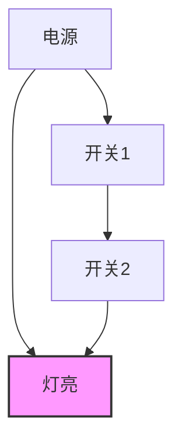
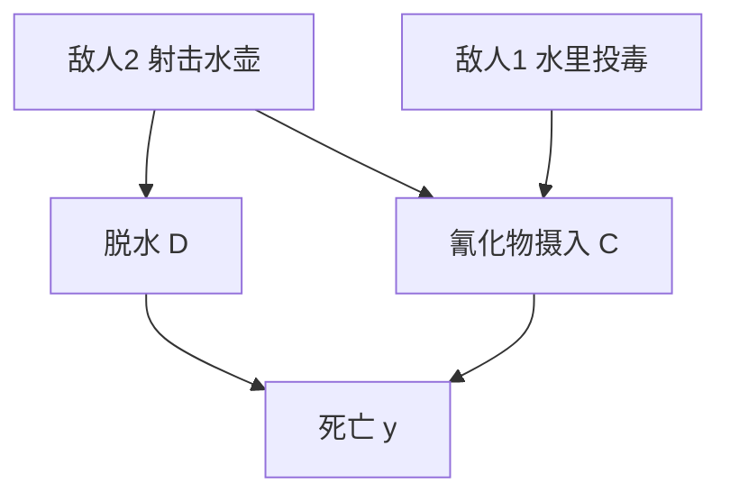
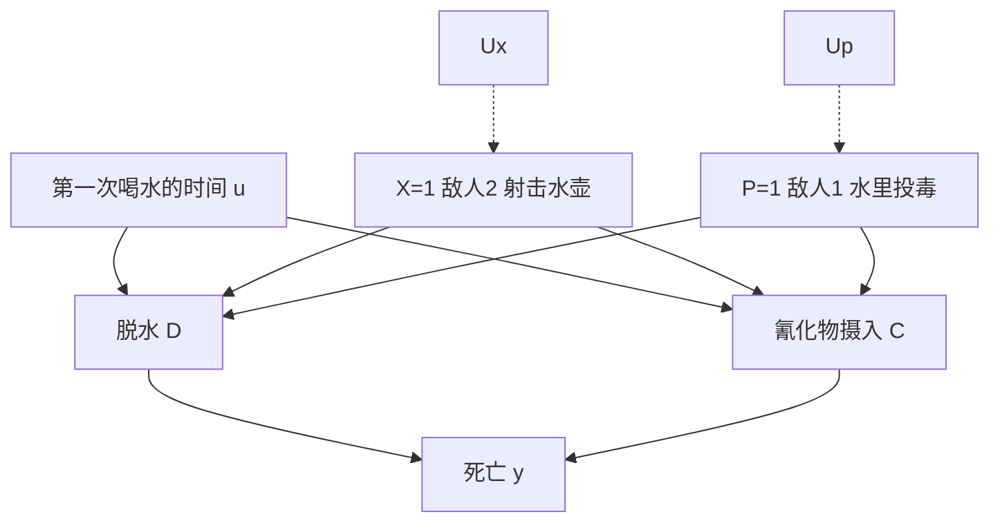
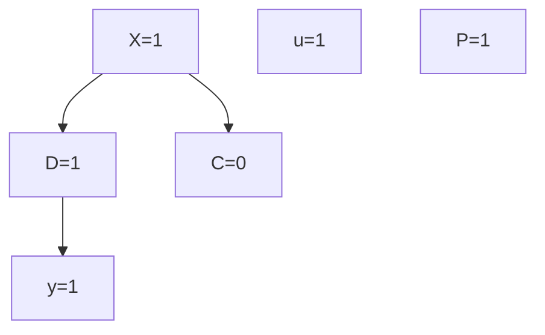
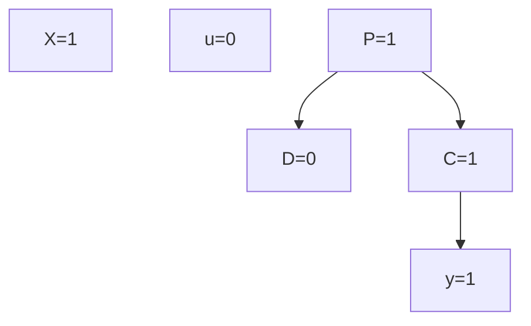
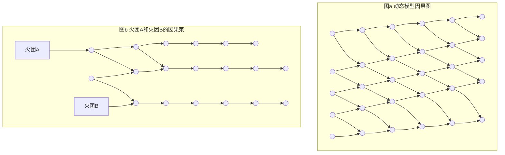
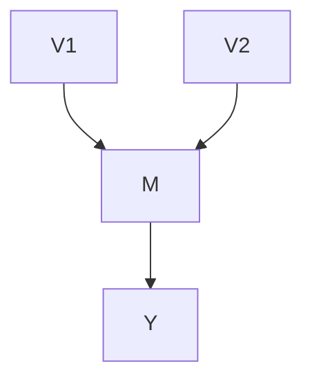

## 第 10 章 实际原因

现在的问题仍然是，我们要找出这个结果的原因，或者说，这个缺陷的原因，因为这个结果的缺陷是由原因造成的。

——莎士比亚（《哈姆雷特》II.ii.100-4）

### 前言

本章对“实际原因”的概念进行了形式化解释，即在特定场景中产生已知结果的原因，如“苏格拉底喝了毒药是其死亡的实际原因”。人类的直觉在发现和确定这类因果关系方面极为敏锐，因此被认为是构建解释的关键（7.2.3 节），也是确定法律责任的最终准则（称为“事实上的原因”）。

然而，尽管因果关系在自然观中无处不在，但它并不是一个容易表述的概念。一个典型的例子（由 Wright 在 1988 年提出）是考虑两团火正朝着一间房屋蔓延。如果火团 A 在火团 B 之前烧毁了房屋，那么我们（以及全国许多陪审团）肯定会认为火团 A 是造成房屋损失的“实际原因”，尽管任何一种火灾都足以（两者都不是必要的）烧毁房屋。显然，实际因果关系（actual causation）所需要的信息超出了必要性和充分性的范围，必须考虑在原因和结果之间实际发生的过程。但在结构模型语言中的“过程”到底是什么？

因果过程的哪些方面定义了实际因果关系？我们如何将有关场景不确定的证据拼接起来，从而计算实际因果关系的概率？

在本章中，我们提出了一种用结构模型语义形式化解释实际因果关系的方法，这种方法看起来是合理的，其主要依据 10.2 节中定义的“维持”的概念。该概念具有结合必要性和充分性两个方面来衡量原因保持其结果的能力，尽管模型存在某些结构性变化。我们通过实例说明了这种方法如何避免与 Lewis（1986）所定义的反事实解释相关的问题，以及如何生成特定场景的解释和如何计算这种解释事实上正确的概率。

### 10.1 引言：必要因果关系的不充分性

#### 10.1.1 重新探讨特例原因

相对于一个特定的场景，“车祸是导致乔死亡的原因”这种类型的陈述被归类为“特例”“特例事件”或“特殊层级”（token-level）的因果陈述。相对于一类事件或一类个体，“车祸导致死亡”类型的陈述被归类为“通常”或“普遍层级”（type-level）的因果论断（参见 7.5.4 节）。我们将特例事件语句中的原因称为特例原因，而普遍层级语句中的原因称为一般原因。

> 特殊层级的原文是 token-level，现根据上下文并参考哲学上的习惯术语翻译，在第 7 章中，特殊层级的因果关系称为特例因果关系（singular causation）。——译者注

在哲学文献中（Woodward，1990；Hitchcock，1995），关于普遍因果和特殊因果之间的关系一直存在争议，诸如“哪个优先？”和“可以将一个层级归约到另一个层级吗？”（Cartwright，1989；Eells，1991；Hausman，1998）已经转移了人们对于更基本问题的注意力：“普遍性论断和特殊性论断对我们的世界提出了什么样的具体构想，以及如何组织因果知识来证实这种构想？”这个辩论引出了一些理论，认为普遍性和特殊性是两种不同类别的因果关系（如 Good，1961，1962），每种都有自身的哲学阐述（例如，参见 Sober，1985；Eells，1991，第 6 章）即“不完全幸福的困境”（Hitchcock，1997）。相比之下，结构化描述将普遍性论断和特殊性论断视为同一种论断的实例，仅在涉及特定场景信息的细节上存在差异。因此，结构化描述为两个层级论断的剖析研究提供了一个形式化基础，需要什么样的信息来支持每个层级，以及为什么哲学家解开它们之间的关系如此艰难。

> 这就是哲学上常说的特殊规律与普遍规律之间的关系。——译者注

结构化描述的基本构件是函数 $\{f_i\}$ ，它表示类似定律那样的机制，并为普遍层级和特殊层级的论断提供信息。这些函数在表示变量之间的一般关系和反事实关系上是普遍层级的，这些变量适用于每种假设场景，而不仅仅是现实的场景。同时，这些关系的任意特定实例都表示特殊层级的论断。可通过背景变量 $U$ 区分一种场景与另一种场景，当所有因素都已知时， $U = u$ ，我们手上就有一个“世界”（定义 7.1.8），即一个理想的、对特定情景完整的描述，在这个描述中，所有相关的细节都被阐明，没有留下任何侥幸或猜测。在全域水平上提出因果论断是特殊因果论断的极端案例，一般而言，我们不具备指定具体世界 $U = u$ 所必需的详细知识，我们使用概率 $P(u)$ 概括我们对这些细节的无知。这将我们引入概率因果模型 $\langle M, P(u) \rangle$ （定义 7.1.6）的层级。在不涉及实际场景的情况下，基于此类模型提出的因果论断将被归类为普遍层级的论断。因果效应论断（例如 $P(Y_x = y) = p$ ）是此类论断的示例，因为它们表达了在所有潜在场景中 $x$ 引起 $y$ 的普遍趋势。然而，在大多数情况下，我们只能掌握当前场景的部分信息，例如，乔死了，他出了车祸，也许他开跑车导致头部受伤。这种特定情节信息的总和称为“证据”（e），可用于将 $P(u)$ 更新为 $P(u|e)$ 。从模型 $\langle M, P(u|e) \rangle$ 得出的因果论断表示了各种各样的特殊论断，具体取决于 $e$ 的特殊性。

因此，普遍论断和特殊论断之间的区别是结构化描述中的度量问题。我们收集的针对特定场景的证据越多，就越接近特殊论断和实际原因的目标。PS 和 PN 的概念（第 9 章的重点）代表了两者之间的中间点。充分性概率（PS）接近普遍层级的论断，因为未考虑实际场景，实际上也没有打算考虑。必要性概率（PN）对于实际场景做了一些参考，尽管只是基本场景（即 $x$ 和 $y$ 为真）。在本节中，我们将试图通过考虑额外的信息来接近实际原因。

### 10.1.2 抢占和结构信息的作用

在 9.2 节中，我们提到了这样一个事实，即 PN 和 PS 都是因果模型的全局特征（即输入-输出），仅与函数 $Y_{x}(u)$ 相关，而不依赖原因（ $x$ ）和结果（ $y$ ）中间过程的结构。

在下面的示例中可以看到这种结构在因果解释中扮演的角色。

考虑一个由一个灯泡和两个开关组成的电路，如图 10.1 所示。从用户的角度来看，灯对两个开关的响应是对等的，任何一个开关都足以把灯打开。但是，在内部，当开关 1 接通时，它不仅会打开灯，而且会断开开关 2 与电路之间的连接，从而使开关 2 无法工作。因此，在两个开关都打开的情况下，我们会毫不犹豫地宣称开关 1 是灯泡中电流流动的“实际原因”，因为我们知道，在这种特定状态下，开关 2 不会对电流通路产生任何影响。由于 PN 和 PS 中每个都基于响应函数 $Y_{x}(u)$ ，而忽略了电路的内部工作原理，因此无法解释这种不对等性。




> 图 10.1 开关 1（而不是开关 2）被认为是导致灯亮的原因，但两者中的任何一个都不是必要的

这个例子代表了一类反例，涉及“抢占”（preemption）的概念。这些反例是针对 Lewis 关于因果关系的反事实陈述提出的。它说明了一个事件（例如，开关 1 接通）是如何被认为是原因的，尽管结果在它不存在时已经存在。Lewis（1986）对这种反例的回答是修改反事实准则，只要存在 $x$ 到 $y$ 之间变量的反事实相关链，就使 $x$ 成为 $y$ 的原因，也就是说，链中每一个输出都反事实地依赖于其输入。对于开关 2，不存在这样的链，因为考虑到当前的情况（即两个开关均处于接通状态），接通或断开开关 2，电路的任何部分都不会受到（电气）影响。在下面的示例中可以更清楚地说明这一点。

**例 10.1.1（沙漠旅行者，由 P. Suppes 提供）** 沙漠旅行者 T 有两个敌人。敌人 1 对 T 的水壶下毒，而敌人 2 不知道敌人 1 的行动，射击并打漏水壶。一周后，发现 T 死了，两个敌人承认了行动和意图。陪审团必须审判谁的行动是 T 死亡的实际原因。

设 $x$ 和 $p$ 分别表示命题“敌人 2 开枪射击”和“敌人 1 投毒”，并设 $y$ 表示“T 死亡”。除了这些事件外，我们还将使用中间变量 $C$ （表示氰化物）和 $D$ （表示脱水），如图 10.2 所示。函数 $f_{i}(pa_{i}, u)$ 在图 10.2 中未明确显示，但是根据对事件的通常理解 $^{①}$ ，假定它们可以根据图中的父节点确定每个子节点的值：

> ① 为了简单起见，我们在本章的其余部分省略了“^”符号。




> 图 10.2 沙漠旅行者案例中的因果关系

$$
c = p x'
$$

$$
d = x \tag{10.1}
$$

$$
y = c \vee d
$$

当我们把 $c$ 和 $d$ 代入 $y$ 的表达式时，得到一个简单的析取：

$$
y = x \vee p x' \equiv x \vee p \tag{10.2}
$$

不要被上述式子的对称性所欺骗。

在这些符号中，我们可以看到结构信息所起的作用。虽然在逻辑上 $x \vee x'p$ 等价于 $x \vee p$ ，但在结构上它们并不等价， $x \vee p$ 相对于 $x$ 和 $p$ 的交换来说是完全对称的，而 $x \vee x'p$ 也告诉我们，当 $x$ 为真时， $p$ 不起作用，不仅对 $y$ 没有影响，而且对任何可能潜在影响 $y$ 的中间变量都没有影响。正是这种不对称性使得我们可以宣称 $x$ 是死亡的原因，而不是 $p^{\ominus}$ 。

> 当 $p$ 为真时，要认定 $p$ 是原因，还需依赖 $x$ 的值，因为如果 $x$ 也为真，则打漏了水壶，从而中止了投毒的后果，因此 $x$ 与 $p$ 并不对等。——译者注

根据 Lewis 的观点， $x$ 和 $p$ 之间的区别在于它们与 $y$ 的链路（路径）的性质。从 $x$ 开始，存在因果链 $x \rightarrow d \rightarrow y$ ，使得每个元素都反事实地依赖于它的前因。但是不存在从 $p$ 到 $y$ 的链，因为当 $x$ 为真时，该链 $p \rightarrow c \rightarrow y$ 被抢占（在 $c$ 处）。也就是说，无论 $p$ 为何值， $c$ 都为假。换句话说，虽然 $x$ 不满足成为 $y$ 原因的反事实检验，但 $x$ 的后果之一（ $d$ ）满足，即已知 $x$ 和 $p$ 为真，如若 $d$ 为假，那么 $y$ 将为假 $^{②}$ 。

Lewis 的链式标准保留了因果关系和反事实之间的联系，但它是相当特殊的。毕竟，为什么把反事实相关链的存在作为对“实际原因”这一至关重要概念的定义性检验，从而判定被告在法庭上有罪或无罪呢？基本反事实准则确实体现了实用主义的基本原理。我们不希望因某些无法避免的损害而惩罚一个人，我们希望鼓励人们注意其行动可能产生实质性差异的情况。然而，一旦行动和结果之间的反事实相关链被另一个原因的出现破坏，那么仍坚持链之间的反事实相关性又有什么好处呢？

### 10.1.3 过度确定和准依赖性

Lewis 链的另一个问题是它无法处理同时发生的并列原因的情况。例如，考虑图 9.1 中的刑法执行案例，假定行刑警察 $A$ 和 $B$ 一起射击并杀死了死刑犯。我们的直觉认为，任何一名行刑警察都是造成死亡的实际原因，尽管两个行刑警察都没有满足反事实检验，也没有在对方在场的情况下支持反事实的相关链①。

> ① 即脱水是 $y$ 死亡的必要原因。——译者注

这个例子代表了一种称为“过度确定”的情况，它对反事实方法提出了严峻的挑战。Lewis 提供了反事实准则的另一种修正来应对这一挑战。他提出反事实相关链应视为该过程的内在因素（例如，子弹从 $A$ 到 $D$ 的飞行），并且由于特殊环境导致的外在相关性消失（例如，子弹从 $B$ 到 $D$ 的飞行）不应被视为内在的相关性消失，“如果仅仅因为环境不同”，我们仍然应该把这种过程视为准依赖的过程（Lewis，1986，p.206）。

Hall（2004）发现准依赖概念中的一些困难的问题：

- 首先，过程究竟是什么？
- 第二，一个过程的内在特征“恰好像”另一个过程意味着什么？
- 第三，我们究竟如何“准确测量周围环境的变化”？

我们将使用一个称为 **因果束** （causal beam）的对象来回答这些问题（10.3.1 节），这可以看作对“过程”概念的结构语义解释。我们首先对 Mackie 的方法进行一个简短的探讨，它从不同的角度处理了实际因果关系的问题，之后我们将在 10.2 节中回到链和束，以及 **抢占** 和 **过度确定** 这两个问题的讨论。

### 10.1.4 Mackie 的 INUS 条件

在上一节中，我们遇到的问题是典型的，哲学家试图对单个事件的因果关系（这里是“实际因果关系”）的概念给出令人满意的逻辑解释。这些尝试看起来始于 Mill 的发现，即没有任何原因对于结果是真正充分或必要的（Mill，1843，p.398）。随后提出的许多说明——基于更详细的充分性和必要性的结合——都遇到了无法克服的困难（Sosa and Tooley，1993）。Mackie（1965）的描述似乎是最早尝试在此逻辑框架内对“实际因果关系”进行半形式化的解释。他的解决方案（称为 INUS 条件）非常流行。

INUS 条件指出，如果 $C$ 是一个“对于结果的不必要但充分条件中的不充分但必要部分”，则事件 $C$ 被认为是事件 $E$ 的原因（Mackie, 1965）②。尽管赋予 INUS 精确的表述（包括文献（Mackie, 1980）中的一些表述）的尝试并未产生一致的看法（Sosa and Tooley, 1993, pp.1-8），但 INUS 背后的基本思想仍具有吸引力：如果我们将 $\{S_1, S_2, S_3, \cdots\}$ 看作（对于 $E$ 的）所有极小充分条件集，那么如果事件 $C$ 是某些 $S_i$ 的合取，则事件 C 是 E 的 INUS 条件。在这种情况下，如果 C 关于某个 $S_{i}$ 是充分的 $^{\ominus}$ ，则事件 C 被认为是导致 E 的原因。因此，例如，如果 E 可以写成析取范式

> 即通过“若非”准则的检验，如若 $A(B)$ 不射击，则死刑犯不会死。——译者注

$$
E = A B \vee C D
$$

那么由于 C 是析取 CD 的成员，而 CD 对 E 来说是极小且充分的，因此 C 是 INUS 条件。于是，如果 D 已在问题中出现，那么 C 被认为是导致 E 的原因 $^{②}$ 。

> $\ominus$ 即 C 与 $S_{i}$ 形成充分条件。——译者注

许多学科的研究人员都有这种基本直觉。例如，法律学者提倡一种叫作 NESS（Wright，1988）的关系，表示“充分集合（sufficient set）的必要元素”，这是对 Mackie 的 INUS 条件的一种更简单的重新表述。在流行病学中，Rothman（1976）提出了类似的标准，称为“充分成分”，用于识别何时暴露是导致疾病的原因——“我们认为，如果一些原因是添加 E 后构成第一个充分原因，则这时暴露 E 就会导致疾病”（Rothman and Greenland，1998，p.53）。Hoover（1990，p.218）将 INUS 条件与计量经济学的因果关系联系起来：“在 Simon 的意识中，任何引起另一个变量的变化的变量都可以被视为另一个变量的 INUS 条件。”然而，所有这些方法都存在一个基本缺陷：逻辑必要性和充分性的语言不足以解释这些直觉（Kim, 1971）。在 Cartwright（1989, pp.25-34）的分析中也隐含了类似的结论，她一开始对 INUS 的直觉着迷，但最终不得不纠正 INUS 的错误。

这种逻辑解释的基本缺陷在于，在表示稳定机制的公式（或者用 Mackie 的术语来说是“倾向关系”）和表示环境条件的公式之间缺乏语法上的区别。这个局限性最简单的表现可以从换质位法看出：“A 意味着 B”在逻辑上等同于“非 B 意味着非 A”，这使非 B 成为非 A 的 INUS 原因。这是反直觉的，从“疾病会导致症状”，我们不能推断消除症状会导致疾病消失。换质位法的失败进一步带来切换问题（通过共同原因进行推断）：如果疾病 D 导致 A 和 B 这两种症状，那么治愈症状 A 将（根据 INUS 的逻辑解释）会导致症状 B 消失。

另一组问题源于语法敏感性。假设我们将 Mackie 的 INUS 条件应用于图 9.1 的刑法执行案例。如果我们将死刑犯的死亡条件 $D$ 写成：

$$
D = A \vee B
$$

则 $A$ 满足 INUS 准则，我们可以合理地得出结论 $A$ 是 $D$ 的原因。然而，我们将模型中已知的 $A = C$ 代入，我们得到

$$
D = C \vee B
$$

突然间，A 不再作为 D 表达式中的合取部分出现。我们是否可以得出结论，A 不是 D 的原因？当然，我们可以通过禁止这种替换，并且保持 A 与 B 和 C 之间的析取形式来避免这种消失 $^{①}$ 。但是，更糟糕的问题随之而来：在队长发出指令（C）并且两个行刑警察都没有射击的情况下，死刑犯仍将被视为死亡。简言之，事件中结构信息流动的表达不能用标准的逻辑语法进行描述——Mackie、Rothman 和 Wright 的直觉必须重新表述。

> $\ominus$ 即 $A \vee B \vee C$ 。——译者注

最后，让我们考虑沙漠旅行者的例子，旅行者死亡在式（10.2）中表示为

$$
y = x \vee x^{\prime} p
$$

该表达式不是极小析取范式，因为它可以重写为

$$
y = x \vee p
$$

从中可以得出 $x$ 和 $p$ 在导致 $y$ 时是对等的，这个结果是反直觉的。另一方面，如果我们允许像 $y = x \vee x' p$ 这样的非极小表达式，那么我们也可能允许等价表达式 $y = x p' \vee p$ ，从中我们可以很荒谬地得出结论：如果有人向旅行者射击（ $x$ ），那么不投毒（ $p'$ ）成为旅行者死亡的原因。

现在我们回到结构分析，在结构分析中不会出现这样的句法问题。外在信息是通过结构或反事实描述的（例如， $v_{i}=f_{i}(pa_{i},u)$ ），其中 u 是一般变量，而间接信息是通过特定条件 U=u 的介词表达式（例如， $X(u)=x$ ）传递的。即使保留了真实值，结构模型也不允许任意转换和替换。例如，如果将 c（氰化物摄入）理解为由独立的机制控制，而与控制 y 的机制无关，则不允许用其他表达式代替 $y=d\vee c$ 中的 c。

现在，使用结构分析，我们将提出一个描述 Mackie 和 Lewis 的直觉的形式化方法。我们的分析将基于因果关系的一个称为“维持”的性质，它结合了充分性和必要性的因素，还考虑了结构信息。

### 10.2 产生、依赖和维持

因果充分性的概率概念 **PS** （定义 9.2.2）给出了一种解救反事实的因果解释的方法。

我们回顾刑法执行实例中的对等性过度确定的问题。每个行刑警察的射击都具有等于 1 的 **PS** 值（参见式（9.43）），因为每次射击都会在死刑犯还活着的状态 $u'$ 下导致死刑犯死亡。

> ① 注意到 $u' = d'$ 。——译者注

较高的 **PS** 值符合我们的直觉，尽管 **PN** 值很低（ **PN** =0），但每次射击都是造成死亡的实际原因。因此，似乎有理由认为我们的直觉考虑了充分性，并且我们可以通过对 **PN** 和 **PS** 的正确组合为实际因果关系制定适当的标准。

Hall（2004）也表达了类似的期望。在分析反事实方法所面临的问题时，Hall 发现有存在两个因果关系概念，其中第一个概念可通过反事实进行描述，而第二个概念则不行，第二个概念可能很好地解释了与直觉的冲突。Hall 将第一个概念称为“依赖”，第二个概念称为“产生”。

在刑法执行的例子中，我们在直觉上认为每次射击都是对等的死亡“产生者”。相反，反事实解释仅检验“依赖”，但却失败了，因为死刑犯的状态不“依赖”于任何一个单独的射击。

依赖和产生的概念分别与必要性和充分性的概念密切相关。因此，我们对 **PS** 的表述可以很好地为 Hall 的产生的概念提供形式化基础，并向实际因果关系的形式化迈出一步。但是，要使该描述方式成功，首先必须克服一个基本障碍：产生性因果关系忽略了特定场景中的信息（Pearl，1999），这可以从以下考虑中看出。

因果关系的依赖性（dependence）反映了原因 $x$ 在面对某些意外情况时仍然保持结果 $y$ 的必要性，否则就会否定 $y$ （定义 9.2.1）：

$$
X(u) = x, \quad Y(u) = y, \quad Y_{x'}(u) = y' \tag{10.3}
$$

另一方面，产生性（production）反映了在 $u'$ 的环境中， $x$ 和 $y$ 都未出现的前提下，原因（ $x$ ）产生结果（ $y$ ）的能力（定义 9.2.2）：

$$
X(u') = x', \quad Y(u') = y', \quad Y_{x}(u') = y \tag{10.4}
$$

比较这两个定义，我们注意到产生的一个特殊性质：为了检验产生，我们必须暂时走出现实的世界，想象一个没有 $x$ 和 $y$ 的新世界 $u'$ ，应用 $x$ ，看看 $y$ 是否成立。因此，句子“ $x$ 产生 $y$ ”仅在 $x$ 和 $y$ 为假的世界里才可能是真的，由此看来：

- （a）似乎没有任何事情可以解释（从产生的角度）在现实世界中发生过什么；
- （b）收集到的关于现实世界 $u$ 的证据不能用于定义产生的假设世界 $u'$ 。

为了克服这一障碍，我们求助于一种叫作“维持”的因果关系性质，它通过产生所具有的特征来丰富依赖的概念，同时又保留了 $x$ 和 $y$ 均为真的现实世界 $u$ 。维持不同于依赖之处在于， $x$ 可能会针对偶然事件保护 $y$ ，鉴于式（10.3）中考虑的偶然性是“间接的”——也就是说，从当初一个特定情况 $U = u$ 演变而来——在这种情况下，我们坚持认为 $x$ 仍然维持 $y$ ，以防止由于模型本身的结构修正而产生的偶然情况（Pearl，1998b）。


#### 定义 10.2.1（维持）

设 _W_ 为 _V_ 中的一组变量，令 _w_、_w'_ 为这些变量的具体取值。我们说，_x_ 相对于 _W_ 中的偶然性在 _u_ 上因果维持 _y_，当且仅当：

- (i) $X(u) = x$
- (ii) $Y(u) = y$ (10.5)
- (iii) 对于所有 $w$ ， $Y_{xw}(u) = y$
- (iv) 存在 $x' \neq x$ 和 $w'$ ，使得 $Y_{x'w'}(u) = y' \neq y$

式（10.5）的维持特征在条件（iii） $Y_{xw}(u) = y$ 中表现出来，这要求 _x_ 自己可以充分地维持 _y_。读作：如果我们在 _u_ 中将 _X_ 设置为它的实际值（_x_），那么，即使 _W_ 设置为与其实际值不同的任何值（_w_），_Y_ 仍将在 _u_ 中保留其实际值（_y_）。条件（iv） $Y_{x'w'}(u) = y'$ 可以解读为在相反的条件下 $X = x$ 维持 $Y = y$ 的“责任”。如果我们将 _X_ 设置为其他值（ $x'$ ），则至少存在一个集合 $W = w'$ ，使 _Y_ 放弃了实际值（_y_）。条件（iii）和条件（iv）联合起来表明，存在一种设置 $W = w'$ ，其中 _x_ 是 _y_ 的充分必要条件。

维持是强加给“实际原因”的合理要求吗？再次考虑图 9.1 中导致死刑犯死亡的两颗子弹。在这种情况下，我们认为 _A_ 是导致 _D_ 的一个实际原因，因为即使在没有 _B_ 的情况下，_A_ 也会“单独”维持 _D_。但是，我们如何形式化表示在 $U = u$ 中未出现 _B_，而事实上 _B_ 确实出现了呢？如果我们想（假设）在 _u_ 的上下文中抹掉 _B_，那么我们必须使用结构偶然性，并想象 _B_ 是由于某种违反规则 $B = C$ 的外部干预（intervention）（或“奇迹”）而变为假的。例如，由于某些机械故障，行刑警察 _B_ 无法射击。我们非常清楚这种失误并没有发生，但是我们努力通过以多级因果模型的形式来描述这一设想中的动作，用以讨论和思考这种失误导致的后果，如图 9.1 所示。

回顾一下，由于 do-操作的每个可能状态都代表一个模型，因此每个因果模型不仅代表一个模型，还代表整个模型集，考虑干预的偶然性是每个此类模型的固有特征。换句话说，模型中机制的自主性意味着每种机制都会表现出可能的故障，并且这些故障标志着因果解释的偶然性。因此，我们有理由将这种偶然性纳入实际因果关系的定义中，这也是一种解释形式。

在定义 10.2.1 中，选择 _W_ 时应谨慎。显然，我们不允许 _W_ 包含 _X_ 和 _Y_ 之间的中间变量，因为这将使 _x_ 永远无法维持 _y_。更严重的是，如果不限制 _W_，我们就有可能消除实际的抢占，并将非原因变成原因。例如，在沙漠旅行者事件中，通过选择 $W = \{X\}$ 和 $w' = 0$ （见图 10.2），我们将敌人 1 变成了实际的死亡原因，这与直觉和实际情况相反（排除了氰化物的摄入）。设计“因果束”的概念（Pearl，1998b）是为了选择合理的 _W_ 使对实际场景干扰最小 $^{①}$ 。

> ① Halpern 和 Pearl（1999）允许选择任意集合 _W_，使得 _x_ 维持其补集 $Z = V - W$ ，也就是说，对于所有 $w$ ， $Z_{xw}(u) = Z(u)$ 。

### 10.3 因果束和基于维持的因果关系

#### 10.3.1 因果束：定义及其含义

我们首先考虑 7.1 节中定义的因果模型 _M_，然后为每个家族和每个 _u_ 选择维持其父代变量的子集 _S_。回想一下，因果模型中函数 $\{f_{i}\}$ 的参数在某种意义上被认为是极小的，因为我们已经从每个 $f_{i}$ 中修剪了所有冗余的参数，仅保留那些使 $f_{i}(pa_{i}, u)$ 变得非平凡的、记作 $pa_{i}$ 的自变量（定义 7.1.1）。但是，在这个定义中，我们关注的是相对于所有可能的 _u_ 的非平凡性，但是对于某些特定状态 $U = u$ ，进一步修剪是可行的。

为了说明这一点，考虑函数 $f_{i} = a x_{1} + b u x_{2}$ 。这里是 $PA_{i} = \{X_{1}, X_{2}\}$ ，因为总有某些 _u_ 值使 $f_{i}$ 对 $X_{1}$ 或 $X_{2}$ 中的变化敏感。但是，假设我们处于 $u = 0$ 的状态，则可以放心地将 $X_{2}$ 视为平凡的参数，将 $f_{i}$ 替换为 $f_{i}^{0} = a x_{1}$ ，并将 $X_{1}$ 视为 $f_{i}^{0}$ 的唯一必要参数。我们称 $f_{i}^{0}$ 为 $f_{i}$ 在 $u = 0$ 上的投影。更一般地，我们将考虑整个模型 _M_ 的投影，将 $\{f_{i}\}$ 中的每个函数替换为相对于特定 _u_ 及其非必要部分的特定值的映射。这就产生了一个新的模型，我们称之为 **因果束** 。


##### 定义 10.3.1（因果束）

已知模型 $M = \langle U, V, \{f_i\} \rangle$ 和状态 $U = u$ ，因果束是一个新的模型 $M_u = \langle u, V, \{f_i^u\} \rangle$ ，其中函数集 $f_i^u$ 通过 $\{f_i\}$ 构造如下：

1.  对于每个变量 $V_{i} \in V$ ，将 $PA_{i}$ 分为两个子集， $PA_{i} = S \cup \overline{S}$ ，其中 $S$ （表示“维持集”）是 $PA_{i}$ 的任何子集，且对于所有 $\overline{S}$ 的具体赋值 $\overline{s}$ 和 $\overline{s}'$ ，满足

    $$
    f_{i}(S(u), \overline{s}, u) = f_{i}(S(u), \overline{s}', u) \tag{10.6}
    $$

    换句话说， $S$ 是 $PA_{i}$ 的子集，无论我们如何设置 $PA_{i}$ 的其他变量都不影响 $V_{i}(u)$ 的实际值。

2.  对于每个变量 $V_{i} \in V$ ，存在一个 $\overline{S}$ 的子集 $W$ 及其赋值 $W = w$ ，使得函数 $f_{i}(s, \overline{S}_{w}(u), u)$ 关于 $s$ 是非平凡的，也就是说，对于某些 $S$ 的赋值 $s'$ ，

    $$
    f_{i}(s', \overline{S}_{w}(u), u) \neq V_{i}(u)
    $$

    这里， $\bar{S}$ 不应与任何其他变量 $V_{j}(j \neq i)$ 的维持集相交。（同样，设置 $W=w$ 不应与其他设置矛盾。）

3.  将 $f_{i}(s, \overline{s}, u)$ 替换为其投影 $f_{i}^{u}(s)$ ，由下式给出

    $$
    f_{i}^{u}(s) = f_{i}(s, \overline{S}_{w}(u), u) \tag{10.7}
    $$

    因此， $V_{i}$ 新的父代变量集合变为 $PA_{i}^{u}=S$ ，并且每个 $f^{u}$ 函数都只对 $S$ 作出响应。


##### 定义 10.3.2（自然束）

如果定义 10.3.1 中的条件 2 对所有 $V_{i} \in V$ 都满足 $W = \emptyset$ ，则称因果束 $M_{u}$ 是 **自然的** 。

> 换句话说，自然束是通过“冻结”维持集之外的所有变量的实际值 $\overline{S}(u)$ 而形成的，从而产生投影 $f_{i}^{u}(s) = f_{i}(s, \overline{S}(u), u)$ 。


##### 定义 10.3.3（实际原因）

事件 $X = x$ 是在状态 $u$ 下 $Y = y$ 的实际原因（简称“ $x$ 引起 $y$ ”），当且仅当存在自然束 $M_{u}$ 使得

$$
\text{在} M_{u} \text{中}, Y_{x} = y \tag{10.8}
$$

以及

$$
\text{在} M_{u} \text{中}, \text{对于某个} x' \neq x \text{有} Y_{x'} \neq y \tag{10.9}
$$

> **注意** ：式（10.8）等价于
>
> $$
> Y_{x}(u) = y \tag{10.10}
> $$
>
> 这可以通过 $X(u) = X$ 和 $Y(u) = Y$ 得出。但是式（10.9）保证了在冻结 $\overline{S}$ 所表示的“无关大局的环境”之后， $X$ 的某个值 $x'$ 不能维持 $Y = y$ 。


##### 定义 10.3.4（主要原因）

在状态 $u$ 下 $x$ 是 $y$ 的主要原因，当且仅当存在满足式（10.8）和式（10.9）的因果束但不满足自然束时。

综上所述，因果束可以被解释为这样一种理论：在通过 do-操作冻结了某些变量（ $\overline{S}$ ）的假设下，为每个实际事件 $V_{i}(u)=v_{i}$ 提供了充分而非平凡的解释。利用这一新理论，我们对事件 $X=x$ 进行了反事实检验，如果 $X$ 不是 $x$ ， $Y$ 是否会发生变化。

如果当冻结发生在所有 $\overline{S}$ 的赋值（即 $W=\varnothing$ ）时， $Y$ 都发生变化，那么我们说“ $x$ 是 $y$ 的实际原因”。如果变化仅发生在所有 $\overline{S}_{w}(u)$ 的赋值情况下（ $W\neq\varnothing$ ）②，那么我们说“ $x$ 是 $y$ 的主要原因”③。

> - $\ominus$ 这表示 $X = x$ 的确是引起 $Y = y$ 的原因，当 $\bar{S} = \varnothing$ 时，实际原因就是通常的原因。——译者注
> - ② 即 $\bar{S}$ 的部分变量 $W$ 被固定。——译者注

**注解** ：尽管选择 $W$ 使 $V_{i}$ 只对 $S$ 作出响应，但这不能保证 $S(u)$ 对于 $V_{i}(u)$ 是必要和充分的，因为局部响应并不排除存在另一个状态 $s'' \neq S(u)$ ，使得 $f_{i}^{u}(s'') = V_{i}(u)$ 。因此，式（10.8）并不能保证 $x$ 对于 $y$ 既是必要的又是充分的。这就是式（10.9）要对反事实进行检验的理由。如果要求 $w$ 使 $f^{u}$ 对 $S$ 中的每一个 $s$ 都是非平凡的，那么限制性太强了，这样的 $w$ 可能不存在。如果满足式（10.8）～（10.9），那么 $W = w$ 表示对模型做了某些假设性限制，使得 $x$ 对 $y$ 来说既是充分的又是必要的。

**关于多变量事件的注解** ：尽管定义 10.3.3 和定义 10.3.4 适用于单变量因果以及多变量因果，但是当 $X$ 和 $Y$ 由变量集组成时，某些细化计算是按顺序进行的。如果结果 $E$ 是变量集 $Y = \{Y_1, \dots, Y_k\}$ 的任意布尔函数，则式（10.8）应该应用于 $Y$ 的每个成员 $Y_i$ ，并且式（10.9）应该修改为 $Y_{x'} \Rightarrow \neg E$ 而不是 $Y_{x'} \neq y$ 。

另外，如果 $X$ 由多个变量组成，则要求 $X$ 极小是合理的，换句话说，要求这些变量的任何子集都不能通过式（10.8）～（10.9）的检验。这要求从 $X$ 中删除不相关的、过度指定的细节。例如，如果喝毒药符合乔死亡的实际原因，那么尴尬的是，喝毒药和打喷嚏也会通过式（10.8）～（10.9）的检验，并符合乔死亡的原因。极小化将“打喷嚏”从因果事件 $X = x$ 中移除。

##### 概率与证据的结合

假设状态 $u$ 是不确定的，并且它的概率为 $P(u)$ 。如果 $e$ 在这种情况下是可用的证据，那么 $x$ 导致 $y$ 的概率可以通过对断言“ $x$ 导致 $y$ ”为真时，所有状态 $u$ 下的证据 $P(u \mid e)$ 的权值求和来获得。


##### 定义 10.3.5（实际因果概率）

设 $U_{xy}$ 是断言“ $x$ 是 $y$ 的实际原因”为真的状态集（定义 10.3.2），令 $U_{e}$ 是与证据 $e$ 兼容的状态集。根据证据 $e$ ， $x$ 导致 $y$ 的概率表示为 $P(\text{caused}(x, y \mid e))$ ，给出的表达式为

$$
P (\text {caused} (x, y \mid e)) = \frac {P (U_{x y} \cap U_{e})}{P (U_{e})} \tag {10.11}
$$

#### 10.3.2 实例：从析取式到通用公式

##### 过度确定和主要原因

主要因果关系的典型例子是两个行动共同导致一个事件，且其中任何一个行动仍然会导致该事件。在这种情况下，模型仅由一种机制组成，该机制通过简单的析取关系将结果 $E$ 与两个行动联系起来： $E = A_{1} \vee A_{2}$ 。不存在自然束可以使 $A_{1}$ 或 $A_{2}$ 成为 $E$ 的实际原因。

如果我们将 $A_{1}$ 或 $A_{2}$ 固定为其当前值（即 true），则 $E$ 将成为另一个行动的平凡函数。但是，如果我们离开当前的状态，并将 $A_{2}$ 设置为 false（即用 $W = \{A_{2}\}$ 形成束，并将 $W$ 设为 false），则 $E$ 将根据 $A_{1}$ 的不同而做出不同的反应，从而通过式（10.9）的反事实检验。

这个例子说明了束准则包含 Lewis 准依赖性的含义。如果我们同意在由 $do(A_{2} = \text{false})$ 产生的假设子模型（submodel）中检验这种相关关系，则可以认为事件 $E$ 准依赖于 $A_{1}$ 。在 10.2 节中，我们认为这种假设检验，尽管它与当前场景 $u$ 冲突，但还是在每个因果模型中被隐含地许可。因此，因果束可以被认为是 Lewis 关于准依赖过程概念的形式化解释，并且集合 $W$ 代表这个过程的“特殊环境”（在适当修改后），使得 $X = x$ 对于 $Y = y$ 是必要的。

##### 析取范式

考虑由布尔函数刻画的单一机制

$$
y = f (x, z, r, h, t, u) = x z \vee r h \vee t
$$

其中（为了简单起见）假设变量 $X$ 、 $Z$ 、 $R$ 、 $H$ 、 $T$ 之间是相互因果独立的（即在因果图 $G(M)$ 中没有一个是另一个的后代）。接下来，我们说明在哪些条件下 $x$ 可以作为 $y$ 的主要原因。

首先，考虑状态 $U = u$ ，其中所有变量都为真

$$
X (u) = Z (u) = R (u) = H (u) = T (u) = Y (u) = \text {true}
$$

在这种状态下，每个析取表示一组极小的维持变量。特别地，取 $S = \{X, Z\}$ ，我们发现投影 $f^u = f(x, z, R(u), H(u), T(u))$ 总为真。这时，自然束 $M_u$ 不存在，于是 $x$ 不能成为 $y$ 的实际原因。

可以使用 $w = \{r', t'\}$ 或 $w = \{h', t'\}$ 得到可行的因果束，其中符号 $'$ 表示补值。这两个选择中任何一个都会产生投影 $f^u(x, z) = xz$ 。显然， $M_u$ 满足式（10.8）和式（10.9）的条件，因此证明 $x$ 是 $y$ 的主要原因。

利用相同的参数很容易得出，对于

$$
X (u^{\prime}) = Z (u^{\prime}) = \text {true}, \quad R (u^{\prime}) = T (u^{\prime}) = \text {false}
$$

的状态 $u'$ 下，存在自然束。也就是说，通过将冗余（ $\overline{S}$ 的）变量 $R$ 、 $H$ 和 $T$ 设为 $u'$ 中的实际值，可以得到非平凡投影 $f^{u'}(x, z) = xz$ 。因此， $x$ 是 $y$ 的实际原因。

这个例子说明了如何在结构框架中解释 Mackie 对于 INUS 条件的直觉。它还说明了结构（或“倾向性”）知识（如 $f_{i}(pa_{i},u)$ ）和环境知识（ $X(u) = \mathrm{true}$ ）所起的准确作用，而严格的逻辑解释并没有明确区分这些作用。

下一个例子说明 INUS 条件如何推广到任意布尔函数，尤其是具有某些极小析取范式的函数。

##### 一般布尔形式的单一机制

考虑函数

$$
y = f (x, z, h, u) = x z^{\prime} \vee x^{\prime} z \vee x h^{\prime} \tag {10.12}
$$

具有等价形式

$$
y = f (x, z, h, u) = x z^{\prime} \vee x^{\prime} z \vee z h^{\prime} \tag {10.13}
$$

如前所述，假设我们考虑一个状态 $u$ ，其中 $X$ 、 $Z$ 和 $H$ 为真，并且询问事件 $x: X = \mathrm{true}$ 是否导致事件 $y: Y = \mathrm{false}$ 。在这种状态下，唯一的维持集是 $S = \{X, Z, H\}$ ，因为选择其中任何两个变量（固定状态 $U = u$ ），如果不考虑第三个变量如何取值，那么不会必然得到 $Y = \mathrm{false}$ 。

由于 $\bar{S}$ 为空，因此束的选择是唯一的： $M_u = M$ ，其中 $y = f^u(x, z, h) = xz' \vee x'z \vee xh'$ 。因为 $f^u(x', z, h) = \text{true}$ ，所以 $M_u$ 通过式（10.9）的反事实检验，因此，我们得出结论， $x$ 是 $y$ 的实际原因。

同样，我们可以看到事件 $H = \text{true}$ 是 $Y = \text{false}$ 的实际原因。这直接来自反事实检验。

$$
Y_{h} (u) = \text {false}, \quad Y_{h^{\prime}} (u) = \text {true}
$$

因为定义 10.3.3 和定义 10.3.4 基于语义考虑，所以任何逻辑上等价的 $f$ 形式（不一定是极小析取形式）可以得到相同的结论，只要 $f$ 代表单一机制。因此，在简单的单一机制模型中，束准则可以被视为 INUS 直觉背后的语义基础。束准则在结构变化上的问题将在接下来的两个例子中出现，其中考虑了多层模型。

#### 10.3.3 束、抢占以及特例事件因果关系的概率

在本节中，我们将束准则应用于沙漠旅行者的一个概率化版本。这将说明在涉及抢占的问题中如何利用结构信息，以及在已知一组观测值的情况下，我们如何计算一个事件“是另一个事件的实际原因”的概率。

我们考虑修改一下沙漠旅行者示例，不知道旅行者在水壶漏空之前是否喝了有毒的水。为了对这种不确定性进行建模，我们添加了一个二值变量 $U$ ，该变量表示喝水（ $U = 0$ ）或没有喝水（ $U = 1$ ）。由于 $U$ 同时影响 $D$ 和 $C$ ，我们得到如图 10.3 所示的结构。为了完成模型的详细说明，我们需要为图中的每一个家族指定函数 $f_{i}(pa_{i}, u)$ 和概率分布 $P(u)$ 。为了形式化描述模型，我们引入了假设的背景变量 $U_{x}$ 和 $U_{p}$ ，它们表示敌人行动背后的因素。




> 图 10.3 概率化版本的沙漠旅行者因果关系图

通常对这个示例的理解会产生以下函数关系：

$$
\begin{array}{l}
c = p (u^{\prime} \vee x^{\prime}) \\
d = x (u \vee p^{\prime}) \\
y = c \vee d
\end{array}
$$

连同证据信息

$$
X (u_{x}) = 1, \quad P (u_{p}) = 1
$$

（我们假设即使在射击前喝完无毒的水 $(p'u')$ ， $T$ 也无法借助空水壶 $(x)$ 存活）。

为了构造因果束 $M_{u}$ ，我们检查了这三个函数中的每一个，并在 $u$ 上形成了它们各自的投影。例如，对于 $u = 1$ 的投影，我们得到式（10.1）中所示的函数，其（极小）维持父代变量集分别为： $X$ （对于 $C$ ）、 $X$ （对于 $D$ ）和 $D$ （对于 $Y$ ）。投影函数变为

$$
c = x^{\prime}
$$

$$
d = x \tag {10.14}
$$

$$
y = d
$$

束模型 $M_{u=1}$ 是自然束，其结构如图 10.4 所示。为了检验 $x$ （或 $p$ ）是否是 $y$ 的原因，我们应用式（10.8）～（10.9）并得出：

> 在 $M_{u=1}$ 中， $Y_{x} = 1, Y_{x'} = 0$  
> 在 $M_{u=1}$ 中， $Y_{p} = 1, Y_{p'} = 1$

因此，敌人 2 向水壶（ $x$ ）射击被归因为 $T$ 死亡的实际原因（ $y$ ），而敌人 1 投毒（ $p$ ）并不是 $y$ 的实际原因 $^{①}$ 。

> ① 式（10.15）的第二个公式说明，在 $u = 1$ 的前提下（没有喝水），那么在证据 $X(u_{X}) = 1$ 下，无论投毒与否，旅行者都会因射击而死。——译者注

接下来，考虑状态 $u = 0$ ，这表示旅行者在敌人 2 向水壶射击之前拿壶喝水的事件。 $M_{u=0}$ 对应的图模型如图 10.5 所示，得出：

> 在 $M_{u=0}$ 中， $Y_{x} = 1, Y_{x'} = 1$  
> 在 $M_{u=0}$ 中， $Y_{p} = 1, Y_{p'} = 0$




> 图 10.4 代表状态 $u = 1$ 的自然因果束




> 图 10.5 代表状态 $u = 0$ 的自然因果束

因此，在这种情况下，我们将敌人 1 的行动归类为 $T$ 死亡的实际原因，而敌人 2 的行动则不被视为死亡原因。

如果我们不知道哪个状态占优—— $u = 1$ 还是 $u = 0$ ——那么我们必须确定 $x$ 导致 $y$ 的概率。同样，如果我们观察到一些反映概率 $P(u)$ 的证据 $e$ ，那么这些证据会得出（参见式（10.11））：

$$
P (\text {caused} (x, y \mid e)) = P (u = 1 \mid e)
$$

和

$$
P (\text {caused} (p, y \mid e)) = P (u = 0 \mid e)
$$

例如，法医报告确认“体内没有氰化物”将排除状态 $u = 0$ 而支持 $u = 1$ ，并且 $x$ 是 $y$ 的原因的概率变为 $100\%$ 。Pearl（1999）分析了更详细的概率模型。

#### 10.3.4 路径切换因果关系

**例 10.3.6** 设 $x$ 为双位开关的状态。在位置 1（ $x = 1$ ）时，开关打开灯（ $z = 1$ ）并关闭手电筒（ $w = 0$ ）。在位置 0（ $x = 0$ ）时，开关打开手电筒（ $w = 1$ ）并关闭灯（ $z = 0$ ）。令 $Y = 1$ 表示命题“房间被照亮了”。

324 与开关位置相应的因果束 $M_{u}$ 和 $M_{u'}$ 如图 10.6 所示。与上面同理，在 $M_{u}$ 中 $Y_{x}=1$ 和 $Y_{x'}=0$ 。同样，在 $M_{u'}$ 中 $Y_{x}=1$ 和 $Y_{x'}=0$ 。因此，“开关在位置 1”和“开关在位置 2”都被认为是“房间被照亮了”的实际原因，尽管两者都不是一个必要的原因。


```mermaid
graph TD
    Xu[X(u)=1] --> z1[z=1]
    Xu --> w0[w=0]
    z1 --> y3[y=1]
```


```mermaid
graph TD
    Xu2[X(u')=0] --> z0[z=0]
    Xu2 --> w1[w=1]
    w1 --> y4[y=1]
```

> **图 10.6** 例 10.3.6 中路径切换的自然束

这个例子进一步强调了“实际原因”概念的微妙之处。将 $X$ 从 1 更改为 0 只会改变因果路径的过程，而其来源和结果保持相同。是否应将当前的开关位置（ $X = 1$ ）视为室内灯亮的实际原因（或一种“解释”）呢？尽管 $X = 1$ 使电流能够通过灯，并且实际上是当前维持光亮的唯一机制，但有人可能会辩称，在日常生活中它不应该被称为“原因”。

例如， $X = 1$ 可能是阻止入室盗窃企图的原因，这就很奇怪了。然而，回顾因果性解释的价值，正在于结构性偶然造成的异常情况，当我们将手电筒故障的可能性指定为一个单独的机制时，它就引起我们的注意。考虑这种偶然性，将开关位置看作阻止入室盗窃企图的原因不应太奇怪。

#### 10.3.5 时序抢占

考虑本章前言中提到的例子，其中有两团火正在朝着一间房屋蔓延。如果火团 $A$ 在火团 $B$ 之前烧毁了房屋，那么我们将火团 $A$ 视为造成损失的“实际原因”，即使火团 $B$ 在没有火团 $A$ 的情况下也会造成同样的损失。

简单地将结构模型写为 $H = A \vee B$ ，其中 $H$ 代表“房屋烧毁”，那么束方法会将每种火团归类为同等贡献的原因，这与直觉相反——看起来火团 $B$ 不被视为对 $H$ 有任何贡献。

这个例子与沙漠旅行者相似，但又有所不同。在这里，一个原因优先于另一个原因抢占的方式更加微妙，因为第二个原因仅在结果已经发生后才变得无效。Hall（2004）认为这种抢占等同于普通抢占，他通过因果图对其进行建模，在这种因果图中， $H$ 一旦被激活，就会抑制自己的父节点。与定义 7.1.1 中的唯一解假设相反，这种抑制性反馈回路导致不可逆行为。

一种更直接的方式是动态因果模型，用于表达这样一个事实：房屋一旦被烧毁，即使火团这一原因消失，也仍然被烧毁（如图 3.3 所示），其中变量是有时间标记的。实际上，使用 7.1 节中定义的静态因果模型是不可能描述诸如“先到”之类的时序关系，相反，必须使用动态模型。

令处于地点 $x$ 和时间 $t$ 的火团状态 $V(x,t)$ 取三个值： $g$ （绿色）、 $f$ （着火）和 $b$ （烧毁）。然后，以火势传播为特征的动态结构方程可以写为（简化形式） $^{\ominus}$ ：

$$
V(x, t) =
\begin{cases}
f & V(x, t - 1) = g \text{且} V(x - 1, t - 1) = f \\
f & V(x, t - 1) = g \text{且} V(x + 1, t - 1) = f \\
b & V(x, t - 1) = b \text{或} V(x, t - 1) = f \\
g & \text{其他}
\end{cases}
\tag{10.17}
$$

与该模型相关的因果图如图 10.7a 所示，每个变量 $V(x,t)$ 指定了三个父代变量：其北面邻居的先前状态 $V(x+1,t-1)$ 、其南面邻居的先前状态 $V(x-1,t-1)$ 和地点 $x$ 处的先前状态 $V(x,t-1)$ 。从火团 $A$ 开始和火团 $B$ 相隔一个时间单位（对应于动作 $do(V(x^{*}+2,t-2)=f)$ 和 $do(V(x^{*}-2,t^{*}-1)=f)$ ），如图 10.7b 所示。黑色和灰色的圆点分别代表状态 $f$ （着火）和 $b$ （燃烧）的时空区域，这个束既自然又唯一，从式（10.17）中可以看出。图 10.7b 中的箭头表示由每个家族的（唯一）极小充分集 $S$ 构造的自然束，该束赋予每个变量的父代状态构成一个事件，这个事件对于该变量的实际状态既是必要的也是充分的（假定在 $\bar{S}$ 中的变量被冻结为它们的实际值）。




**图 10.7** 将式（10.9）中的检验方法应用于这个束上，我们发现事件（ $V(x^{*} - 2, t^{*} - 2) = f$ ）（代表火团 $A$ 的开始）和序列（ $V(x^{*}, t), t > t^{*}$ ）（表示房屋在一段时间内的状态）之间存在反事实依赖（counterfactual dependence）关系。火团 $B$ 则不存在这种依赖性。在此基础上，我们将火团 $A$ 归类为房屋火灾的实际原因。

值得注意的是，将因果关系归因于促使结果发生的事件，这种通常的直觉被视为事件的时空表征中束检验的必然结果。但是，正如 Paul（1998）所建议的，这种直觉不能作为实际因果关系的定义原则。例如，在我们的示例中，单独发生的每场火灾都没有促成（或延迟或改变）以下事件的发生： $E =$ 房屋的所有者第二天不吃早餐。然而，正如束准则所预测的那样，我们仍然认为火团 $A$ （而不是 $B$ ）是 $E$ 的实际原因。

通过检查图 10.7b 所示的极小束的构造，可以阐明这一准则的概念基础。在这个构造中，关键步骤在于时空区域 $(x^{*}, t^{*})$ ，该区域代表火团到来时的房屋。变量 $V(x^{*}, t^{*})$ 代表当时房屋的状态，具有双父节点维持集 $S = \{(x^{*} + 1, t^{*} - 1) \text{and} V(x^{*}, t^{*} - 1)\}$ ，取值分别为 $f$ 和 $g$ 。利用式（10.17），我们看到南面的父节点 $V(x^{*} - 1, t^{*} - 1)$ 是多余的，因为 $V(x^{*}, t^{*})$ 的值是由（关于 $f$ ）其他两个父节点的当前值确定的。因此，可以将南面的父节点从束中排除，使 $V(x^{*}, t^{*})$ 依赖于火团 $A$ 。此外，由于南面父节点的值为 $g$ ，不能成为任何最小维持集的一部分，因此确保了 $V(x^{*}, t^{*})$ 与火团 $B$ 无关。（当然，我们可以将此父节点添加到 $S$ ，但是 $V(x^{*}, t^{*})$ 仍独立于火团 $B$ 。）

下一个要检查的变量是 $V(x^{*}, t^{*} + 1)$ ，其父节点 $V(x^{*} + 1, t^{*})$ 、 $V(x^{*}, t^{*})$ 和 $V(x^{*} - 1, t^{*})$ 的值分别为 $b$ 、 $f$ 和 $f$ 。从式（10.17）开始，中间的父节点（即 $V(x^{*}, t^{*})$ ）的值 $f$ 充分确保了子节点的值是 $b$ ，因此，这个父节点有资格作为一个单独维持集 $S = (x^{*}, t^{*})$ ，这使我们可以从束中排除其他两个父节点，从而使子节点依赖于火团 $A$ （通过 $S$ ）而不是火团 $B$ 。南北两个父节点本身不足以维持子节点的当前值 $(b)$ （相邻区域的火团可能使房屋着火，但不会立即被“烧毁”），因此，我们必须将中间的父节点保持在 $S$ 中，这样就使所有变量 $V(x^{*}, t), t > t^{*}$ 与火团 $B$ 无关。

我们看到维持考虑通过两个关键步骤得出了直观的结果：

- (1) 允许排除每个变量 $V(x^{*}, t), (t > t^{*})$ 的南面父节点（从束中排除），从而保持 $V(x^{*}, t)$ 对火团 $A$ 的依赖性；
- (2) 要求（在任何束中）包含每个变量 $V(x^{*}, t), (t > t^{*})$ 的中间的那个父节点，从而防止 $V(x^{*}, t)$ 对火团 $B$ 的依赖性。

步骤 (1) 对应于从因果中选择内在过程，然后抑制其非内在过程的影响，步骤 (2) 防止因果过程超出其内在边界。

### 10.4 结论

我们已经看到，束检验（定义 10.3.3）所体现的 **维持性质** （定义 10.2.1），这一性质是阐明实际因果关系（或法律术语中的“事实原因”）概念的关键。在涉及具有多个潜在原因的多步骤场景的情况下，此性质可以代替“若非”（but for）检验。维持给出原因在面对结构化偶发事件时，维持其效应值的能力，包括在特殊条件下对事实的必要性进行反事实检验，并抑制结构化偶发事件（即 $W = \emptyset$ ）。

我们认为：

（a）传递因果论断真实意义的是结构化偶然事件，而不是间接的偶发事件，因此  
（b）这些结构化偶然事件应作为因果关系解释的基础。

我们进一步论证了基于这种偶然性的解释如何解决诸多问题，这些问题困扰着单一事件因果关系的反事实解释，主要是与抢占、过度确定、时序抢占和切换因果关系相关的困难。

然而， **维持并不能完全代替产生** ，产生是充分性的第二个组成部分，也就是说，在结果未知的情况下，假定原因产生结果的能力。例如，在火柴－氧气示例（参见 9.5 节）中，氧气和点燃的火柴均满足定义 10.3.3 中的维持检验（ $W = \emptyset$ 和 $\overline{S} = \emptyset$ ），因此，每个因素都可以视为观察到火灾的实际原因。在这种情况下，氧气成为一个尴尬的解释，并不是因为它在偶发事件时维持火灾无能为力（偶发集合 $W$ 为空），而是因为在我们遇到的最常见的 $U = u'$ 情况下（即没有划火柴的情况下）无法起火。

这个论点仍然没有告诉我们，为什么我们应该在火柴－氧气的示例中考虑假设情况 $(U=u')$ ，而不是对本章中那些维持性良好的任何例子进行分析。尽管一个没有划火柴 $(U=u')$ 的世界是有其变化规律的常态性世界，但现在的世界却与此背道而驰，因为确实发生了火灾。那么，在对实际世界中的事件（火灾）进行解释时，为什么要跑到另一个可能的世界呢？

我认为，答案在于寻求解释时所使用的 **语用学** 。在火柴-氧气的事件中，人们默认解释对象是这样一个问题：“如何才能防止火灾？”鉴于这一目标，我们别无他选，只能罔顾现实世界（火灾已经发生），设想一个有能力阻止这场火灾的世界（ $U = u'$ ）。

在开关灯示例（例 10.3.6）中，因果解释出于不同的语用学理由。在此示例中，人们可能更关心保持房间的照明，而目标问题是：“我们如何确保在不可预见的意外情况下，房间仍保持明亮？”基于这个目标，我们还不如留在现实的世界 $U = u$ ，利用维持准则，而不是产生准则。

看来，围绕我们寻求解释的语用问题的关键是使用哪方面的因果关系，而这种语用的数学描述是迈向自动生成充足解释的关键一步 $^{②}$ 。遗憾的是，我现在必须将这个任务留待以后研究。

> ① 即如果没有划火柴的世界。——译者注

### 致谢

328 我对实际因果关系这个话题的兴趣是由 Don Michie 引起的，他发了很多电子邮件试图说服我：

1. 这个问题并非平凡的；
2. Good（1961，1962）对因果趋势的度量可以扩展到处理个体事件。

他在（1）方面取得了成功。这一章是基于 1998 年春天在加州大学洛杉矶分校举行的一次研讨会，其中“实际因果关系”是主题。我要感谢研讨会的参与者：Ray Golish、Andrew Lister、Eitan Mendelowitz、Peyman Meshkat、Igor Roizen 和 Jin Tian，感谢他们推翻了关于束和维持的两次早期的尝试，也感谢他们激烈的讨论，才有了现在的内容。

与 Clark Glymour、Igal Kvart、Jim Woodward、Ned Hall、Herbert Simon、Gary Schwartz 和 Richard Baldwin 的讨论加深了我对相关哲学和法律问题的理解。随后与 Joseph Halpern 的合作帮助我进一步完善了这些想法，并提出了在 Halpern 和 Pearl（2000）中更一般和更清晰的关于实际原因的定义。

### 第 2 版附言

Halpern 和 Pearl（2001a，b）发现需要完善 10.3.3 节的因果束定义。他们保留了在偶发事件所扰动的世界中通过反事实依赖关系来定义实际因果关系的想法，但允许使用范围更广的偶发事件。

因果束定义需要细化，请考虑以下示例。

**例 10.4.1** 投票由两人参加。如果他们中至少有一人投赞成票，Y 项议案就通过。事实上，他们两人都投了赞成票，这项议案通过了。

这个故事的版本与 10.1.3 节中讨论的析取场景相同，在此我们要声明每张赞成票 $V_{1}=1$ 和 $V_{2}=1$ ，都是促成 $Y=1$ 的一个主要原因。

但是，假设有一个投票机来统计选票。设 $M$ 为机器记录的总票数。显然 $M = V_{1} + V_{2}$ ， $Y = 1$ ，当且仅当 $M \geqslant 1$ 。图 10.8 代表了这个示例的更精细的版本。

在这种情况下，束准则不再将 $V_{1} = 1$ 限定为 $Y = 1$ 的主要原因，因为相对于 $M$ 不能将 $V_{2}$ 标记为“无效”，因此我们不能像在简单析取情况下那样，自由设置偶发性 $V_{2}=0$ ，并测试 $Y$ 对 $V_{1}$ 的反事实依赖性。

Halpern 和 Pearl（2001a，b）提出了一种合理地处理此类反例的改进方案，但不幸的是，Halpern 和 Pearl（2002）指出，对偶发事件的限制过于宽松。这引起了（Halpern and Pearl，2005a，b）进一步改进，并给出了以下定义：




> 图 10.8 显示束的定义需要细化的一个示例


#### 定义 10.4.2（实际因果关系）

如果满足以下三个条件，则 $X = x$ 是条件 $U = u$ 中 $Y = y$ 的实际原因。

**AC1.** $X(u)=x$ ， $Y(u)=y$ 。

**AC2.** 将 $V$ 分为两个子集 $Z$ 和 $W$ ，其中 $X \subseteq Z$ ，并且分别将 $X$ 和 $W$ 中的变量设置为 $x'$ 和 $w$ ，使得如果 $Z(u) = z^*$ ，则以下两个条件都成立：

- （a） $Y_{x',w} \neq y$ ；
- （b）对于 $W$ 的所有子集 $W'$ 以及 $Z$ 的所有子集 $Z'$ ，有 $Y_{x,w,z^{*}} = y$ ，其中 $W'$ 的值和 $Z'$ 的值分别等于 $W = w$ 和 $Z = z^{*}$ 中这些变量的值。

  **AC3.** $W$ 是极小的，没有 $X$ 的子集满足条件 AC1 和 AC2。

如 AC2（a）所示，赋值 $W = w$ 充当了偶发事件，对 $X = x$ 进行反事实检验。

AC2（b）限制了偶发事件的选择。粗略地说，它表示如果将 $X$ 中的变量重置为其原始值 $x$ ，那么 $Y = y$ 必须保持不变，甚至在偶发事件 $W = w$ 下，或者即使 $Z$ 中的某些变量被赋予了它们的原始值（即 $z^{*}$ ），也保持不变。

在投票机的例子中，如果我们将 $W = w$ 定义为 $V_{2} = 0$ ，而将 $Z = z^{*}$ 定义为 $V_{1} = 1$ ，则可以看到根据 AC2， $V_{i} = 1$ 是一个原因。我们不再要求 $M$ 对偶发性 $V_{2} = 0$ 保持不变， $Y = 1$ 不变就足够了。

这个定义虽然可以正确地解决文献中提出的大多数问题（Hiddleston，2005；Hall，2007；Hitchcock，2007，2008），但仍然存在一个缺陷。它必须排除某些不合理的偶然事件。Halpern（2008）通过在缺省逻辑中引入“常态化”（normality）的概念，为这个问题提供了解决方案（Spohn，1988；Kraus et al.，1990；Pearl，1990b），但仅考虑了那些与真实世界中处于相同“正常”水平的偶发事件。

Halpern 和 Hitchcock（2010）总结了实际因果关系结构方法的研究现状，并讨论了其对变量选择的敏感性。
