## 第 11 章 对读者的回应、阐述和讨论

图之于因果关系，就如同 X 射线之于外科医生。

—Judea Pearl

在本章中，我回顾了第 1 章到第 10 章的内容，讨论了需要进一步阐述的问题，介绍了过去 8 年里取得的新的成果，并且回答了第 1 版中读者向我提出的具有普遍兴趣的问题。这些问题既包括书中某些具体段落的说明，也包括目前尚有争议的因果关系概念和哲学问题，以及如何在课堂上讲授和如何在教材和论文中阐述这些问题。

讨论大体上按照这些问题在书中出现的次序，并且指出所在的相应章节。

### 11.1 因果、统计和图的术语

#### 11.1.1 区分因果和统计是必要的吗

**给作者的问题（来自许多读者）** ：第 1 章（1.5 节）强调统计和因果概念之间的明显区别，前者可以根据（观测变量的）联合概率分布函数来定义，而后者则不能。考虑到本书中有关“因果”的许多概念（诸如随机化、混杂、工具变量）在统计学书籍中经常被讨论，这种区别是清楚的吗？必要的吗？有用的吗？

#### 作者的回答

331 这种区别是清楚的¹、必要的、有用的。正如我在所有的演讲中告诉听众：“如果你听了演讲之后，除了记住统计概念与因果概念的区别是重要的，什么也没有得到，那么演讲就是成功的。”在这里我敢于进一步说：“如果人们记不起我有什么贡献，只是坚持因果和统计的区别，那么我的科学研究也是值得的。”

这种区别说起来竟是如此清楚和简单，甚至有些令人难以启齿，实际上就是静态与动态之间的根本区别。以回归、估计和假设检验技术为代表的标准统计分析，旨在从抽样中评估静态的分布参数。借助这些参数，人们可以推导变量之间的相关关系，估计过去与未来事件之间的似然性，以及根据新的证据和测量方法更新事件的似然性。只要实验条件保持不变，通过标准的统计学分析可以很好完成任务。

而因果分析则更近一步，它不仅推断静态条件下事件的似然性，还要推断条件变化下事件发生的动态。例如，由某些措施和外部干预引起的变化，或者由新政策和新实验设计引起的变化。

> ¹ 基本的区别通过各种专门的术语给出，例如，病症和病因、关联和因果、经验和理论、观察和实验，以及许多其他的。但是仅用这样的词汇替代是不够的，其中一部分原因是这些不是清晰的定义，一部分原因是这些年来这些词汇的含义变得模糊不清，一部分原因是与“非统计的”联系引出了新的看法。

这种区别意味着因果概念与统计概念不能混为一谈。症状与疾病的联合分布并不能告诉我们，消除症状就能治愈或者不能治愈疾病。更一般地，分布函数并不能告诉我们如果外部发生变化，例如从观察结果变为实验结果时，分布是否会不一样，因为概率论的定理没有说明当一个分布属性被修改时，另一个属性应该如何变化。这些信息必须由外部假定来提供，这些假定明确说明当指定的变化发生时，分布中的哪些东西保持不变。这些外部假定的总和就是我们所说的“因果知识”。

这就意味着“关联关系不能推出因果关系”可以解释为一条有用的原则： **每个因果结论的背后必须具备一些在分布函数中无法识别的因果假定。**

我们用随机化的概念来解释因果为什么不是统计。假设我们有一个二元密度函数 $f(x, y)$ ，并且其中一个变量是随机的，我们能够通过测试 $f(x, y)$ 来判断这个变量是哪一个吗？当然不行。根据我们的定义，随机化是因果概念，而不是统计概念。的确，每一个随机化的实验都涉及外部的“干预”，受试者根据实验协议被“强迫”接受一种或者另一种实验方案，而不考虑他们自己的选择。干预的存在决定了实验的结果，以及从这些结果推出的各种关系，例如因果关系。

然而，在因果和统计之间划分界线（如 1.4 节所述）并不是要从统计分析中排除因果概念，而是鼓励研究人员使用适当的数学和推理工具明确地处理因果概念。事实上，统计学家首先提出了随机实验的概念，并且从费希尔时代（1926）开始就成功地运用它们。然而在那些研究中，无论是因果假设还是因果结论，在研究人员聪明的头脑里都是隐含的，没有把它们用数学表示出来。例如，人们很难找到一本哪怕是研究生水平的统计学教材，从数学上证明，随机化的确能够为希望估计的量给出无偏估计，即治疗或者决策的效果。

作为一个相关的例子，现在很少有统计学教师能写出一个公式来描述“随机试验证明药物 $x_{1}$ 的有效性是药物 $x_{2}$ 的两倍”。当然他们能够写出“ $P(y \vert x_{1}) / P(y \vert x_{2}) = 2$ ”（ $y$ 表示有效性），但是他们必须记住这个比率只适用于特定的（实验设置下的）随机化条件，而不应与观察研究中普通存在的似然比混淆。 **科学的进步要求用数学表示这种区别。**

在过去 20 年中，因果分析最重要的贡献是数学语言的出现，不仅仅是数据，实验设计本身也能够用数学描述。事实上，如果人们希望将一个实验的结果作为另一个实验的前提，或者用一个设计中得到的数据预测另一个设计的结果，或者仅判断是否具有充分的知识做出这样交叉预测的可能，那么数学描述本质上都是必不可少的。

### 区别是必要的吗

科学的发展在于区别概念和事物，特别是对那些不能混为一谈的概念。例如，有理数和无理数的区别在数论中是非常重要的，它可以使我们不必通过前者的算术运算来定义后者。相同的道理表现在素数、合数、代数数和超越数的区别上。包括 George Boole（1815—1864）和 Augustus De Morgan（1806—1871）在内的逻辑学家花费了半个世纪的时间，试图使用命题逻辑来证明一阶逻辑的三段论（例如，所有人都会死）。这两件事情之间的区别直到 19 世纪末才弄清楚。

在因果性研究的历史上也发生过类似的情况，半个世纪以来，哲学家试图把因果性归结于概率论（7.5 节）。但是除了诸如“证据决策理论”（4.1 节）这样的陷阱，他们一无所获。流行病学专家花了半个世纪的努力使用关联的语言定义混杂（第 6 章），其中一些人现在还在继续努力（参见 11.6.4 节）。这些努力试图绕过一条基本原理：如果混杂是统计学概念，我们就能够从非实验数据的特征中识别混杂因子，并对混杂因子进行校正，从而得到因果效应的无偏估计。这将违反我们的黄金法则：任何因果结论的背后一定有未经观察研究证实的因果假定。流行病学专家以前为何没有认识到这种尝试的徒劳，这是一个谜题，只能有两个解释，要么他们没有认真对待因果和统计的区别，要么害怕把“混杂”这样一个简单而直观的概念归类为“非统计学的”。

将简单的概念从统计学领域（经验主义科学家所知的最有力的形式语言）割裂开来，的确可能产生缺陷。半个世纪以来，社会学家一直在努力利用统计分析来评估公共政策，基本上是回归分析，直到最近才非常失望地承认，其中的问题在 20 世纪 60 年代已经很明显了：“回归分析除了从数据集合中产生一些条件均值和条件方差，什么也没有做”（Berk，2004, p. 237）。经济学家在处理外生性概念的时候也同样具有类似的缺陷（5.4.3 节），即使那些认识到外生性（或超外生性）具有各种因果变化形式的人，也回过头来试图用分布定义它（Maddala，1992；Hendry，1995）。然而，无论如何，跨过因果和统计之间的界限是迟早会发生的，其中的原因我们已经理解。根据先验的和有条件的分布来定义概念（经验知识的终极天条），被认为是科学审慎性的标志，对于这一点我们现在更加清楚了。

### 区别是有用的吗

我现在相当有信心地认为，从哲学、流行病学和经济学的失败实验中得到教训，任何一个正统的学科，再也不会受严密性和直观性的诱惑，浪费半个世纪的时间去追求一个基于分布的因果概念定义。今天，区别的用处主要在于帮助研究人员追溯各种需要的假设条件，用以支持各种各样的科学论断，因为每一个引用因果概念的论断都必须依赖于一些前提假定，而因果词汇只能用专门的与统计不同的符号描述。这种区别提供了一些符号工具，用来识别每一个因果论断中容易受到混淆的前提假定。

即使统计假设未经检验，只要给定充分多的样本和足够细致的测量，原则上这些假设都是可以检验的。相反，因果假定甚至在原则上也无法得到验证，除非人们诉诸严格的实验控制。这个区别在贝叶斯分析中很突出。虽然贝叶斯主义者不检验统计参数的先验指定值，但是当增大样本规模后，这些先验值的敏感性会减少 $^{①}$ 。相反，先验因果假设的敏感性（例如，治疗不改变性别）却与样本规模无关。

> - 先验指定的值可能会由于抽样的不同而偏离实际值，这是先验指定关于样本的敏感性问题，但是当样本数量充分多后，这种偏离会减小。这在统计学中是常见的问题。但是因果假设不具有这个性质，因果假设一般表述一个事实，这个事实不会随着样本增加而改变。——译者注

这些性质具有双重重要性。既可以使我们用来表达因果假设的符号有意义且明确，又可以使我们能够清楚地判断假设链条的合理性和必然性。

### 如何在统计学文献中识别因果关系符号

熟悉潜在结果（Neyman，1923；Rubin，1974；Holland，1988）符号的读者能够从有关反事实事件或者变量的描述中识别因果表达式，例如， $Y_{x}(u)$ 或者 $Z_{xy}$ 。（有些作者使用括号形式的表达式，例如， $Y(x,u)$ 或者 $Z(x,y)$ 。）（语义参见 3.6.3 节。）作为另一种选择，本书也使用形如 $P(Y = y|do(X = x))$ 或者 $P(Y_{x} = y)$ 的公式表示：如果将措施 $X = x$ 施加于总体上，那么事件 $(Y = y)$ 将会发生的概率（明显地， $P(Y = y|do(X = x))$ 等价于 $P(Y_{x} = y)$ ）。图模型提供了第三种表示形式，其中箭头表示如定义 1.3.1 的因果影响，或者表示如图 1.6c 的函数关系（即反事实）。

这些符号系统对于检测和追溯因果前提是非常有用的，这些前提是因果推断的出发点。任何表示标准概率表达式、无效的图形、无效的反事实标记，或者无效的 $do(*)$ 操作符表示的因果前提都被认为是不充分的。因此，任何一篇描述实证研究的文章，如果不以正确的图、反事实标记、或者 $do(*)$ 的表达式开头，都可以被认为其研究结果是不充分的。

然而，虽然这种严格的规定可能将许多有价值的实证研究文献被认为是不够充分，但可以为研究人员节省很多时间，在确定一个研究中的因果要求是否与另一个研究有关时，避免陷入无休止的困惑和争论。更重要的是，这样的规定可以使研究人员明确地指出因果前提，从而在研究人员之间进行无歧义的交流，并展开专业的审查、评议和改进。

#### 11.1.2 无须担心的 $d$ -分离（第 1 章）

应许多对从代数思维转换到图论思维感到困难的读者的要求，我在此对 $d$ -分离进行一个通俗的介绍，以补充第 1 章给出的正式定义。（也可参见文献（Hayduk et al., 2003）。）

### 介绍

**d-分离** 是一个准则，在给定第三个集合 $Z$ 的条件下，从给定的因果图中判定变量的集合 $X$ 关于另一个集合 $Y$ 是否独立。这个想法是将“相关性”与“连通性”（即存在连通路径），或者将“独立”与“无连通性”或“分离”联系起来。

这个简单想法中仅有的弯子就是如何定义所谓的“连通路径”，其中有些 $Z$ 中的节点是可测的变量，它们的值是准确可知的。我们使用“ $d$ -分离”和“ $d$ -连通”（ $d$ 表示有向的）这样的术语说明箭头的方向。我们首先考虑两个单变量 $x$ 和 $y$ 的分离，然后直接扩展到变量的集合（即两个集合是分离的，当且仅当它们之间任何两个变量是分离的）。

### 无条件分离

**规则 1** ：如果 $x$ 和 $y$ 之间有一条非阻断路径，那么 $x$ 和 $y$ 是 d-连通的。

我们所说的“路径”是指连续的边的序列，而不考虑方向。我们所说的“非阻断的路径”是指一条没有两个箭头“头对头”对撞的路径。换句话说，“头对头”的箭头不能构成传递信息的连接，这种情况称为“对撞点”。

**例 11.1.1** 在图 11.1 包含了一个对撞点 $t$ ，路径 $x - r - s - t$ 是非阻断的，因此 $x$ 和 $t$ 是 $d$ -连通的。路径 $t - u - v - y$ 也是非阻断的，因此 $t$ 和 $y$ 是 $d$ -连通的，同理， $u$ 和 $y$ ， $t$ 和 $v$ ， $x$ 和 $s$ 等都是 d-连通的。


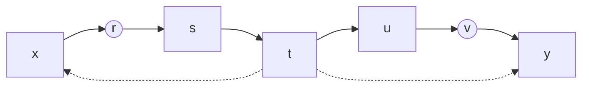

然而， $x$ 和 $y$ 不是 d-连通的，没有一条路径可以绕过对撞点 $t$ 从 $x$ 到 $y$ 。由此， $x$ 和 $y$ 是 d-分离的，同样， $x$ 和 $v$ ， $s$ 和 $u$ ， $r$ 和 $u$ 等也是 d-分离的。（在线性模型中，对于模型参数的每一个选择，对应到这些变量对的协方差项为 0。）

### 条件阻断

**目的** ：当测量一组变量 $Z$ ，并取其值为给定值时，其余变量的条件分布将发生改变，原来相关的变量可能变成独立的，而原来独立的变量可能变成相关的。为了用图表示这种动态，我们需要一个概念“条件 d-连通性”，或者更具体地说，“关于集合 $Z$ 条件下的 d-连通性”。

**规则 2** ：如果 $x$ 和 $y$ 之间有一条不经过 $Z$ 中节点的无对撞路径，那么 $x$ 和 $y$ 在集合 $Z$ 条件下是 d-连通的。如果这样的路径不存在，则称 $x$ 和 $y$ 是被 $Z$ d-分离的，也称 $x$ 和 $y$ 之间的每一条路径被 $Z$ “阻断”。

**例 11.1.2** 令 $Z$ 是集合 $\{r,v\}$ （图 11.2 中用圆圈标记），规则 2 告诉我们， $x$ 和 $y$ 是被 $Z$ d-分离的。同样的还有 $x$ 和 $s$ ， $u$ 和 $y$ ， $s$ 和 $u$ 等。在这个例子中，在 $Z$ 条件下 $d$ -连通的节点对只有 $s$ 和 $t$ 、 $u$ 和 $t$ 。注意，虽然 $t$ 不在 $Z$ 中，但是路径 $s - t - u$ 仍然被 $Z$ 阻断，因为 $t$ 本身是对撞节点，因此根据规则 1，该路径是阻断的。


### 对撞条件

**目的** ：当我们测量两个独立原因的共同效果时，这两个原因就变得相关，因为其中一个原因成立时，另一个原因的可能性会减少（即解释移除），而排除一个原因则使另一个原因成立。这个现象（称为 **伯克森悖论** ，或解释移除）说明在以对撞节点（表示共同效果）或者它的后代（表示共同效果的证据）为条件时，需要（对于因果性）进行另外的特殊处理。

**规则 3** ：如果一个对撞节点在条件集合 $Z$ 中，或者有一个后代在 $Z$ 中，则该节点不再阻断任何通过它的路径。

### 例 11.1.3

令 $Z$ 是集合 $\{r, p\}$ （在图 11.3 中仍用圆圈标记），规则 3 告诉我们， $s$ 和 $y$ 在 $Z$ 条件下是 d-连通的，因为对撞节点 $t$ 有一个后代 $(p)$ 在 $Z$ 中，所以打开了路径 $s-t-u-v-y$ 。然而， $x$ 和 $u$ 被 $Z$ d-分离的，虽然 $t$ 的连接已经打开，但是根据规则 2，节点 $r$ 仍然阻断了路径（因为 $r$ 在 $Z$ 中）。


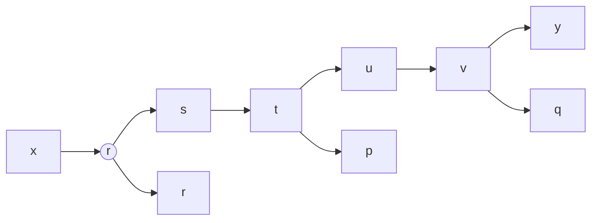

> 图 11.3 给定对撞点 $t$ 的后代节点 $p$ ， $s$ 和 $y$ 是 $d$ -连通的

这就完成了对于 d-分离的定义，读者可以尝试更复杂的图，例如第 1 章的图 1.3。

**典型应用** ：考虑例 11.1.3。假设已经有了 $y$ 关于 $p$ 、 $r$ 和 $x$ 的回归方程

$$
y = c_{1} p + c_{2} r + c_{3} x + \epsilon
$$

希望预测回归方程中哪个系数为 0。从前面的讨论可以直接指出 $c_{3}=0$ ，因为给定 $p$ 和 $r$ ， $y$ 与 $x$ 是 d-分离的，因此在此条件下， $y$ 与 $x$ 是独立的，也就是说，一旦知道了 $p$ 和 $r$ 的值， $x$ 不能给 $y$ 提供任何信息（形式化地，在条件 $p$ 和 $r$ 下， $x$ 和 $y$ 之间的偏相关性消失）。另一方面， $c_{1}$ 和 $c_{2}$ 一般不等于 0，这可以从图中看出： $Z=\{r,z\}$ 不能 d-分离 $y$ 和 $p$ ， $Z=\{p,x\}$ 不能 d-分离 $y$ 和 $r$ 。

**关于相关误差的注记** ：相关的外生变量（或误差项 $\epsilon$ ）不需要特殊处理，它们使用双向的弧（双箭头）表示，这些箭头也和其他箭头一样用于指示路径。例如，如果我们在图 11.3 的 $x$ 和 $t$ 之间加上一个双向弧 $^{\ominus}$ ，那么 $y$ 与 $x$ 不再是 d-分离的（通过条件 $Z = \{r, p\}$ ），因为 $t$ 的后代 $p$ 在 $Z$ 中，路径 $x-t-u-v-y$ 是 d-连通的。

### 11.2 逆转统计时间（第 2 章）

### 给作者的问题

Keith Markus 求解改变坐标系实现统计时间逆转的一般方法，或者在式（2.3）的特定例子里，求解参数 $a$ 、 $b$ 、 $c$ 和 $d$ ，以使统计时间与物理时间运行相反。

### 作者的回答

考虑任意两个时间变量 $X(t)$ 和 $Y(t)$ ，它们可以表示两个粒子在一维空间的位置、温度和压力、销售量和广告预算等。

假设 $X(t)$ 和 $Y(t)$ 的时序变化由下面的方程描述：

$$
X(t) = \alpha X(t - 1) + \beta Y(t - 1) + \epsilon(t) \tag{11.1}
$$

$$
Y(t) = \gamma X(t - 1) + \delta Y(t - 1) + \eta(t)
$$

其中， $\epsilon(t)$ 和 $\eta(t)$ 是相互之间与顺序之间都不相关的噪声项 $^{②}$ 。

> 即把 $x$ 看作是外生变量。——译者注

在这个坐标系下，我们发现两个当前状态分量 $X(t)$ 和 $Y(t)$ 在过去状态分量 $X(t - 1)$ 和 $Y(t - 1)$ 的条件下是不相关的。同时，当前状态分量 $X(t)$ 和 $Y(t)$ 在未来状态分量 $X(t + 1)$ 和 $Y(t + 1)$ 的条件下是相关的。因此根据定义 2.8.1，统计时间与物理时间重合 $^{②}$ 。

> 即 $\epsilon(t)$ 和 $\eta(t)$ 之间不相关， $\epsilon(t)$ 和 $\epsilon(t+k)$ 也不相关。——译者注

现在我们通过变换来旋转坐标：

$$
\begin{array}{l}
X^{\prime}(t) = a X(t) + b Y(t) \\
\text{当} t = 0, \text{当} t = 100
\end{array} \tag{11.2}
$$

$$
Y^{\prime}(t) = c X(t) + d Y(t)
$$

相应的物理方程仍然与式（11.1）是相同的，只是在新的坐标系下，式（11.1）写作：

$$
X^{\prime}(t) = \alpha^{\prime} X^{\prime}(t - 1) + \beta^{\prime} Y(t - 1) + \epsilon^{\prime}(t) \tag{11.3}
$$

$$
Y^{\prime}(t) = \gamma^{\prime} X_i^{\prime}(t - 1) + \delta^{\prime} Y^{\prime}(t - 1) + \eta^{\prime}(t)
$$

带撇号的系数可以从原来（不带撇号）的系数经过矩阵乘法得到。类似地，我们有

$$
\epsilon^{\prime}(t) = a \epsilon(t) + b \eta(t)
$$

$$
\eta^{\prime}(t) = c \epsilon(t) + d \eta(t)
$$

由于 $\epsilon(t)$ 和 $\eta(t)$ 是不相关的，然而 $\epsilon^{\prime}(t)$ 和 $\eta^{\prime}(t)$ 却是相关的，因此当前状态 $X^{\prime}(t)$ 和 $Y^{\prime}(t)$ 在过去状态分量 $X^{\prime}(t-1)$ 和 $Y^{\prime}(t-1)$ 的条件下不相关的事实不再成立。于是统计时间（如果存在）不再沿着物理时间运行。

现在我们需要证明，可以选择参数 $a$ 、 $b$ 、 $c$ 和 $d$ ，使得统计时间与物理时间相反，也就是说，使当前状态分量 $X^{\prime}(t)$ 和 $Y^{\prime}(t)$ 与未来状态分量 $X^{\prime}(t + 1)$ 和 $Y^{\prime}(t + 1)$ 不相关。

通过逆转式（11.3），我们能够根据 $X^{\prime}(t)$ 、 $Y^{\prime}(t)$ 、 $\epsilon^{\prime}(t)$ 和 $\eta^{\prime}(t)$ 的线性组合表示 $X^{\prime}(t - 1)$ 和 $Y^{\prime}(t - 1)$ 。由于新的误差项 $\epsilon(t)$ 和 $\eta(t)$ 是不相关的，因此可以进一步选择 $a$ 、 $b$ 、 $c$ 和 $d$ ，使得在 $X^{\prime}(t - 1)$ 方程中的误差项 $e(t)$ 与 $Y^{\prime}(t - 1)$ 方程中的误差项 $h(t)$ 不相关（这一点最好用矩阵计算展示）。

根据上面的说明，选择坐标系的一般原则是沿着相反方向对角化噪声相关矩阵 $^{①}$ 。

> 为了得到与物理时间相反的统计时间，需要进行两次线性变换，第一次变换将 $X^{\prime}(t - 1)$ 和 $Y^{\prime}(t - 1)$ 用 $X^{\prime}(t)$ 、 $Y^{\prime}(t)$ 、 $\epsilon^{\prime}(t)$ 和 $\eta^{\prime}(t)$ 表示（时间反转），第二次变换将误差项矩阵对角化（消相关）。第一个变换要求矩阵可逆，第二个变换要求矩阵可对角化，因此这样的变换可能不存在。如果要对连续的 $X^{\prime}(t - 1), t = 1,2,\dots$ ，同时反转，并对新产生的误差项逐个消相关，那么这样变换存在的条件更加苛刻。——译者注

我希望读者能够接受挑战，验证时间偏移猜想：

> **在大多数自然现象中，物理时间至少与一个统计时间吻合。**

Alex Balke 试图在经济时间序列中解决这一猜想，但由于缺乏足够的数据，结果不是很确定。我仍然相信猜想是对的，并且希望读者有更好的运气。

### 11.3 估计因果效应

#### 11.3.1 后门准则背后的直观理解（第 3 章）

### 给作者的问题

在后门条件的定义中（定义 3.3.1），将 $X$ 的后代排除在外（条件（i））看起来是一个善后之举，只是因为如果不这样做会引起麻烦。为什么我们不能从第一原理中得到它，首先根据消除偏差的目标定义 $Z$ 的充分性，然后说明为了实现这个目标，我们既不希望 338 也不需要 X 的后代在 Z 中。

### 作者的回答

就消除偏差的目标而言，在后门准则中将后代排除在外确实是基于第一原理。该原理如下：我们希望度量某个确定的值（因果效应），但是实际度量的却是图中所有路径引起的相关值 $P(y|x)$ ，有些是伪路径（后门路径），有些是真路径（从 X 到 Y 的直接路径）。因此为了消除偏差，需要修改度量的值，使其等于所要求的值。为了系统地做到这一点，我们设置了一组条件变量 Z，从而确保：

- **1.** 阻断所有从 X 到 Y 的伪路径。
- **2.** 保留所有未经改变的直接路径。
- **3.** 不产生新的伪路径。

原则 1 和原则 2 用于阻断所有的后门路径，仅保留条件（ii）中描述的路径。原则 3 要求不能把 X 的后代作为条件，即使这些后代并没有阻断直接路径，因为这样的后代可能在 X 和 Y 之间产生新的伪路径。为了解释这一点，考虑下面的图：

$$
X \rightarrow S_{1} \rightarrow S_{2} \rightarrow S_{3} \rightarrow Y
$$

中间变量 $S_{1}, S_{2}, \cdots$ （包括 Y）被噪声因子 $e_{0}, e_{1}, e_{2}, \cdots$ （未在图上明确标注）影响，这个图放大后如图 11.4 所示。

现在假设将 $S_{1}$ 的后代 $Z$ 设置为条件，如图 11.5 所示。由于 $S_{1}$ 是虚拟对撞点，这就产生了 $X$ 与 $e_1$ 之间的相关性，其作用如同一条后门路径：


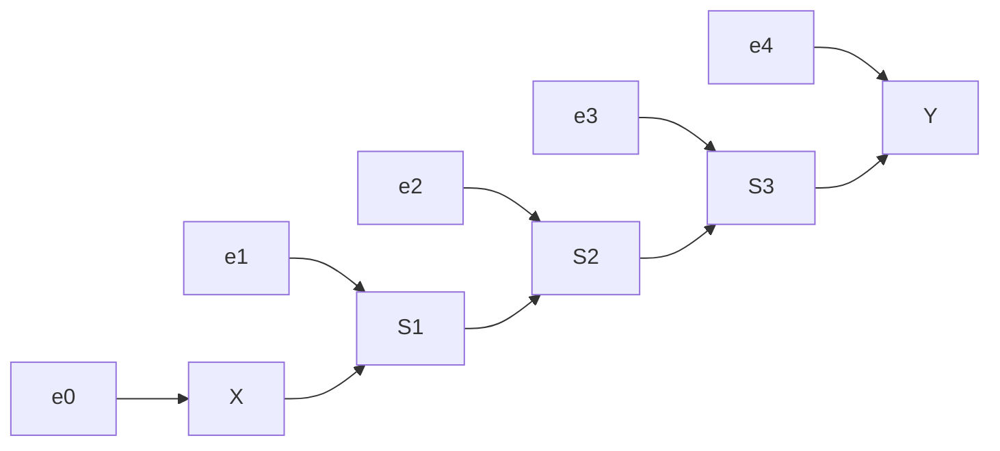

> **图 11.4** 显示 $X$ 到 $Y$ 路径上的噪声因素

$$
X \leftrightarrow e_{1} \rightarrow S_{1} \rightarrow S_{2} \rightarrow S_{3} \rightarrow Y
$$

根据原则 3，这样的路径不应该产生，因为它会引起 X 和 Y 的伪相关。

339 请注意，X 的后代 Z 不是其他 $S_{i}$ （或者 $e_{i}, i > 1$ ）的后代，排除了 X 与 Y 之间伪相关的可能，因此将 Z 作为条件仍然是安全的，不会引起偏差（但是会降低 X 与 Y 之间因果效应估算的效率 $^{①}$ ）。11.3.3 节提供了关于后门准则的另一个证明，更清楚地说明需要排除 X 的后代。

> - 因为 $X$ 与 $e_1$ 之间的新路径会增加 $X$ 与 $Y$ 之间的估算难度。——译者注

同样重要的是，对于错误的变量进行校正有产生新偏差的危险，这样也会破坏随机试验。在这样的试验中，研究人员希望对于协变量进行校正，尽管事实上这些协变量最终会以随机方式逐步抹平可测的或者不可测的各种混杂。校正的目的是改善精度（Cox，1958），或者是匹配不均衡样本，或者是得到协变量特有的因果效应。在试验前校正协变量引起的偏差时，随机试验不受这种校正的影响，但是对试验之后进行校正则可能通过图 11.5 的机制引起偏差，或者更严重地，当校正变量 Z 与某些与影响结果的变量之间存在相关性时，可能会引起这种偏差（例如图 11.5 中的 $e_{4}$ ）。

例如，假设对于疑似疾病 Y 的病人，治疗有一个副作用（例如头疼），如果我们希望对疾病治疗方案进行校正，就不能对于附加症状（头疼）进行校正，因为这会产生伪路径“治疗 $\rightarrow$ 头疼 $\leftarrow$ 症状 $\rightarrow$ 疾病”而导致偏差 $^{\ominus}$ 。然而，如果我们小心谨慎，不对打开伪路径的治疗后果（不仅是那些指向疾病的因果路径）进行校正，随机试验就不会出现偏差。


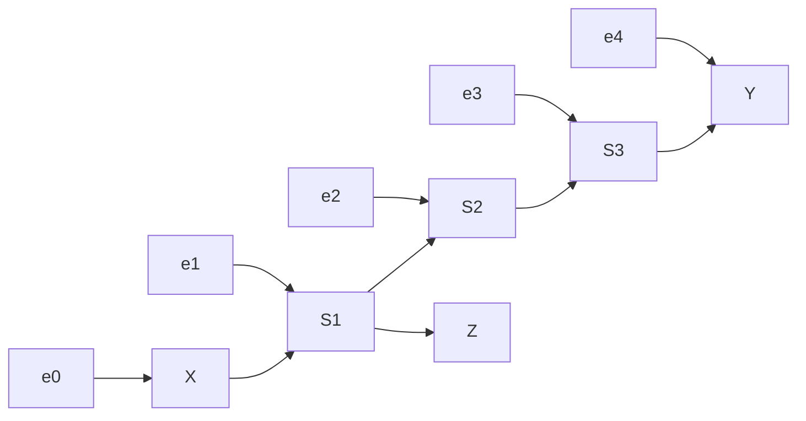

> **图 11.5** 在条件 $Z$ 下，产生了 $X$ 与 $e_1$ 之间的相关性，给估计 $X$ 对于 $Y$ 的效果带来偏差

### 这位读者的进一步问题

这个关于排除 X 的后代的解释是合理的，但有两个瑕疵：

1. 没有提到如下的情况：

   $$
   X \leftarrow C \rightarrow Y \rightarrow F
   $$

   这在流行病学中经常出现，传统的方法允许对于 $Z=\{C,F\}$ 进行校正。

2. 这种解释看起来重新定义了混杂和充分性，以表示与过去几十年流行病学家所理解的不同的东西。我们能在图论中找到更接近传统意义的东西吗？

### 作者的回答

1. 流行病学传统上允许对 $Z = \{C, F\}$ 进行校正，是为了检测 $X$ 对 $Y$ 有因果效应，而不是估计因果效应的量值。在前一种情况下，以 $F$ 为条件在 $C$ 与影响 $Y$ 的噪声因子之间产生了一条伪路径 ②，这条路径被 $C$ 阻断。于是将 $Z = \{C, F\}$ 设置为条件使得 $X$ 与 $Y$ 独立。如果碰巧在 $Z$ 的某个水平值上测量到 $X$ 与 $Y$ 的相关性，那就说明该模型是错误的，即要么 $X$ 对于 $Y$ 有直接的因果效应，要么 $X$ 和 $Y$ 之间有图上未显示的另外路径。

> ① 对治疗后的变量值（头疼）进行校正（例如强制设置为 0），会影响治疗对于疾病影响的正确判断。——译者注

因此如果我们要检验（零）假设，即 $X$ 对于 $Y$ 没有因果关系，那么对于 $Z = \{C, F\}$ 进行校正是非常合理的，上图也说明了这一点（即 $C$ 与 $F$ 不是 $X$ 的后 340 代）。但是当怀疑 $X$ 与 $Y$ 之间有因果关系时，用校正 $Z$ 的方法进行评估就不合理，因为这时应该采用的图是图 11.6，其中 F 成为 X 的后代，并且根据后门准则被排除。

2. 如果混杂和充分性的解释听起来有些与传统的流行病学不同，那只是因为传统的流行病学并没有真正意义上表达阻断和产生相关性的运算。他们可能对于相关性有一个正确的直觉，但图将这种直觉转化为关闭和打开一条路径的形式系统。


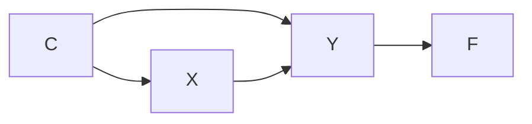

> 图 11.6 评估 X 与 Y 之间因果关系应采用的图

我们还应该注意到，在 1985 年以前，流行病学中的因果分析处于混乱状态，由于一些顶级流行病学专家的直觉，因果关系使用了相关性的语言来表达，但这是不可能的。即使试图将混杂表示为“差别”，即“两个相关性之间的差别，一个我们希望去度量，另一个我们已做度量”，这种想法也受到很多人的抵制（参见第 6 章），因为他们无法数学地表示混杂 $^{①}$ 。

> 回想一下，Greenland 和 Robins（1986）曾经多年来一直是孤独的真理灯塔，甚至他们也不得不求助于用“可交换性”这样的“黑箱语言”去定义“偏差”，这阻碍了对于混杂的直观解释（参见 6.5.3 节）。的确，又过了 6 年，流行病学专家才发现校正对原因有影响的因素（见图 11.5）会引进“偏差”。

因此不是要去寻找“图论语言中与传统更贴近的东西”，我们能够做到更好，阐明“传统意义”应该是什么。

换句话说，传统意义是非形式的，有时会产生误导，而图的准则是形式的，并且已被数学证明。

第 6 章描述了流行病学中一些直觉的悠久历史，其中一些是由杰出的流行病学家提出的，这些直觉在面对混杂和校正问题时误入歧途（参见 Greenland and Robins, 1986; Wickramaratne and Holford, 1987; Weinberg, 1993）。虽然今天大多数主要的流行病学专家都非常熟悉因果分析的当前发展（例如，Glymour and Greenland, 2008），但是流行病学界仍然弥漫着传统的直觉，这些直觉是高度可疑的（参见 6.5.2 节）。总之，图的准则（包括上面的原则 1 ～原则 3）给了我们关于“流行病学概念的传统意义”一个合理的、通俗的和准确的解释。

#### 11.3.2 揭开神秘的“强可忽略性”

341 用“潜在结果”语言进行工作的研究人员使用称为“强可忽略性”的独立关系来表达“零偏差”或者“非混杂”（Rosenbaum and Rubin，1983）。形式上，如果 $X$ 是一个二元处理（或动作），强可忽略性写作：

$$
\{Y (0), Y (1) \} \perp X \mid Z \tag {11.4}
$$

其中 $Y(0)$ 和 $Y(1)$ 分别是在动作 $do(X = 0)$ 和 $do(X = 1)$ 下（不可观察的）潜在结果（定义见式（3.51））， $Z$ 是可测的协变量的集合。如果强可忽略性成立，则 $Z$ 是可容许的，或者消混杂的，也就是说，通过校正 $Z$ 的值可以消除估计偏差，正如式（3.54）推导的那样。

式（3.54）的推导显示，强可忽略性是描述反事实公式的一种方便的语言工具，也是无须检验即可认定（ $Z$ 的）可容许性的一种简便方法。然而，正如我们本书中多次指出的，几乎没有人知道如何在实际问题中应用它，因为反事实变量 $Y(0)$ 和 $Y(1)$ 是不可观测的，当前的科学知识并不能够在形式上可靠地判断反事实的条件独立性。

因此并不奇怪，强可忽略性几乎只是用来作为假设“ $Z$ 是可容许的”的替代说法而已，也就是：

$$
P (y \mid do (x)) = \sum_{z} P (y \mid z, x) P (z) \tag {11.5}
$$

而且很少（如果有的话）作为一条准则来防止我们选择坏的 $Z^{\ominus}$ 。

深谙图模型的读者立刻可以认出，式（11.4）就是后门准则（定义 3.3.1）的翻版 $^{②}$ ，因为后者实际上就是“可容许性”所需要的。这个认识使我们不仅可以把式（11.5）作为一种要求或假定，而且可以有效地进行因果关系的推理。

> 即可能的结果，该式说明在条件 $Z$ 下， $Y$ 的两种可能结果与 $X$ 的当前值无关。——译者注

然而这引起一个问题，变量 $Y(0)$ 和 $Y(1)$ 是否能够用某种方式在因果图上表示，使得我们可以在图上通过 $d$ -分离检测式（11.4）。换句话说，寻找一个节点集合 $W$ ，使得 $Z$ $d$ -分离 $X$ 和 $W$ ，当且仅当 $Z$ 满足式（11.4）。

答案直接从图与潜在结果之间的转化规则得到，根据规则， $\{Y(0), Y(1)\}$ 表示所有外生变量（潜在的或者被观察的）作用之和，这些变量通过一条不经过 $X$ 的路径影响 $Y$ 。理由如下：根据 $\{Y(0), Y(1)\}$ 的结构定义（式（3.51））， $Y(0)$ （类似的 $Y(1)$ ）表示切断所有指向 $X$ 的箭头， $X$ 被设置在 $X = 0$ 下的常数。因此在这个移走指向 $X$ 箭头的残留图中， $Y(0)$ 的统计变化受所有 $Y$ 的外生祖代变量的支配。

342 在图 11.4 的例子中， $\{Y(0), Y(1)\}$ 被外生变量 $\{e_1, e_2, e_3, e_4\}$ 表示。在作为另一个例子的图 3.4 中， $\{Y(0), Y(1)\}$ 被影响 $X_4$ 、 $X_1$ 、 $X_2$ 、 $X_5$ 和 $X_6$ 的噪声因子（图中未标出）表示。然而，由于变量 $X_4$ 和 $X_5$ 综合了（相对于 $Y$ ）它们祖代变量的变化，因此一个表示 $\{Y(0), Y(1)\}$ 的充分集合是 $X_4$ 和 $X_5$ ，加上影响 $Y$ 和 $X_6$ 的噪声因子。

---

综上所述，潜在结果 $\{Y(0), Y(1)\}$ 可以被 $X$ 到 $Y$ 路径上所有节点的父节点表示，无论这些父节点是已观测的还是未观测的 $^{\ominus}$ 。我们可以像图 11.7a 那样按图索骥地表示父节点。容易看出，借助 $\{Y(0), Y(1)\}$ 的这个解释，一个协变量集合 $Z$ 能够 $d$ -分离 $X$ 和 $W$ ，当且仅当 $Z$ 满足后门准则。


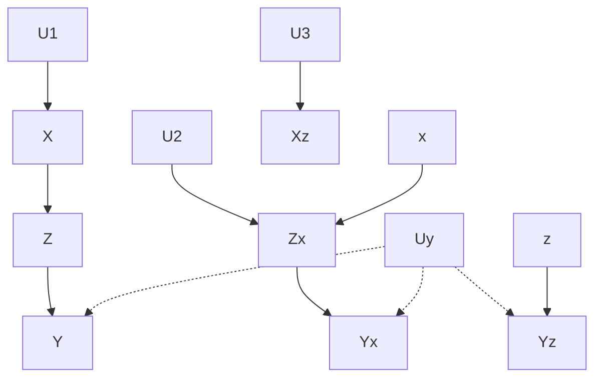


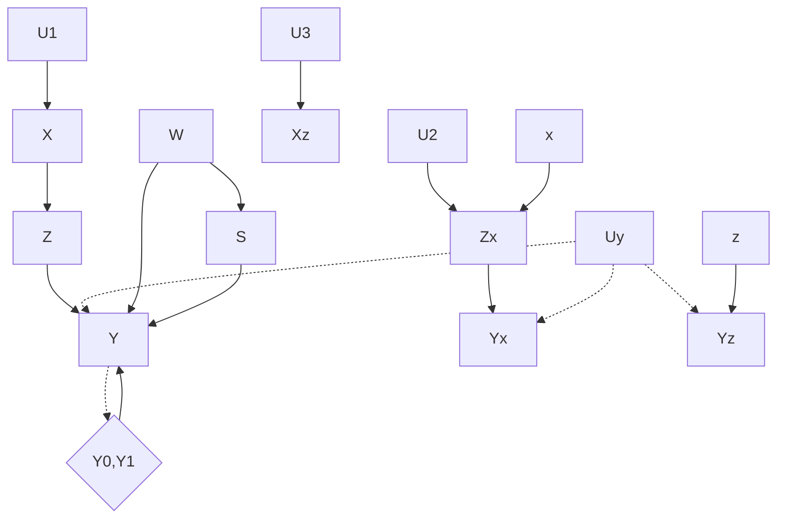

> b) 图 11.7 反事实 $\{Y(0), Y(1)\}$ 在“强可忽略性”条件下的图解释

需要注意的是，图 11.7 中可观测变量集合 $W$ 是不可观测的反事实 $\{Y(0), Y(1)\}$ 的替代，其目的是（借助 $d$ -分离）确定因果图中的条件独立性（例如式（11.4））。对 $\{Y(0), Y(1)\}$ 的更精确的处理在图 11.7b 中给出，其中 $\{Y(0), Y(1)\}$ 被表示为 $Y$ 的（虚拟）父节点，虽然与 $Y$ 和 $S$ 实际的（可观察）父节点不是一回事，但却是它们的函数。

精通结构方程模型的读者可以看出， $\{Y(0), Y(1)\}$ 的图表示正是经济学概念“干扰”或者“误差项”的细化（关于 $Y$ 的方程），并且在 $X$ 作为外生变量时，“强可忽略性”要求 $X$ 独立于干扰（参见 5.4.3 节）。在 20 世纪 70 年代，这个概念与计量经济学方程的因果解释一起声名狼藉（Richard，1980），然而图结构的研究驱散了结构方程形式化的阴影，使其具有明确性和清晰性。鉴于这一点，我曾经预言到这些概念将会被重新接受，图 11.7 进一步促进了这些概念的接受。

在一个描述实际过程的知识模型中，将“强可忽略性”转换成这样一种简单的分离条件，应该可以解开“强可忽略性”这一朦胧概念的神秘面纱，并使谈论“可忽略性”的研究人员从图形化的解释中获益。

这些解释使研究人员能够理解在消除偏差之前，协变量必须满足什么条件，在选择协变量时，应该注意和考虑什么，以及做哪些实验来检测（至少部分的）我们是否具有选择协变量的知识。11.3.4 节举例说明了这样的考虑。

在图和反事实的共同框架下，这些概念的一个应用是估计治疗组的治疗效应： $\mathrm{ETT} = P(y_x | x)$ （参见 8.2.5 节和 11.9.1 节）。这种反事实量（例如，一个治疗康复的人如果不治疗仍然康复的概率，或者在照射疾病的人群中，如果避免照射仍然得病的比率）难以用 do-演算的记号进行分析。但是，使用反事实的记号可以得出有用的结论：只要满足后门准则的协变量集合 $Z$ 存在，ETT 就可以从观察研究中估计。这可直接从

$$
(Y \bot X | Z)_{G \underline {{{X}}}} \Rightarrow Y_{x^{\prime}} \bot X | Z
$$

得到，上式可以写作

$$
\begin{array}{l}
\mathrm{ETT} = P (Y_{x^{\prime}} = y \mid x) \\
= \sum_ {z} P (Y_{x^{\prime}} = y \mid x, z) P (z \mid x) \\
= \sum_ {z} P \left(Y_{x^{\prime}} = y \mid x^{\prime}, z\right) P (z \mid x) \\
= \sum_ {z} P (y | x^{\prime}, z) P (z \mid x) \\
\end{array}
$$

图形化解开了“强可忽略性”的神秘面纱，也帮助解释了因果关系概率 $P(Y_x' = y'|x, y)$ 的原因。事实上任何关于条件 $y$ 的反事实表达式都不允许这样的推导（如果没有前面的独立性条件），因此一般来说是不可识别的（参见第 9 章；Shpitser and Pearl, 2007）。

#### 11.3.3 后门准则的另一种证明

后门准则原来的证明（定理 3.3.2）使用了一个辅助干预节点 $F$ （见图 3.2），因此是一个比较间接的证明。下面给出了另一种证明，其中 $Z$ 不能包含 $X$ 的后代节点的需要是显然的。

> **批注** ：原证明中引入 $F$ 节点是为了模拟干预操作，而新证明则直接利用 $d$ -分离性质。

假设我们有一个 DAG $G$ ，其中 $X$ 和 $Y$ 是任意两个节点， $Z$ 是 $X$ 的非后代节点集合。我们想要证明：

$$
P(y \mid do(x)) = \sum_{z} P(y \mid x, z) P(z)
$$

当且仅当 $Z$ 满足后门准则，即 $Z$ 阻断了 $X$ 和 $Y$ 之间的所有后门路径。

**证明思路** ：通过将 $do(x)$ 操作转化为条件概率，并利用 $d$ -分离性质来消除混淆路径的影响。

首先，根据干预的定义， $do(x)$ 等价于移除所有指向 $X$ 的边，并固定 $X = x$ 。因此，在干预后的图中， $Y$ 的分布由以下公式给出：

$$
P(y \mid do(x)) = \sum_{z} P(y \mid x, z, \text{pa}(x)) P(z \mid \text{pa}(x))
$$

其中 $\text{pa}(x)$ 是 $X$ 的父节点集合。由于 $Z$ 不包含 $X$ 的后代，且 $Z$ 阻断了所有后门路径，我们可以证明：

$$
P(y \mid x, z, \text{pa}(x)) = P(y \mid x, z)
$$

并且：

$$
P(z \mid \text{pa}(x)) = P(z)
$$

从而得到后门调整公式。

**关键步骤** ：利用 $d$ -分离性质，当 $Z$ 满足后门准则时， $Y$ 与 $\text{pa}(x)$ 在给定 $X$ 和 $Z$ 的条件下独立，因此可以简化上述表达式。

> **批注** ：此证明更直观地展示了为什么 $Z$ 不能包含 $X$ 的后代——因为后代节点会引入新的混淆路径。

最后，我们得到：

$$
P(y \mid do(x)) = \sum_{z} P(y \mid x, z) P(z)
$$

证毕。

### 后门准则的证明

考虑一个马尔可夫模型 $G$ ，其中 $T$ 是 $X$ 的父节点集合。从式（3.13），我们知道 $X$ 对于 $Y$ 的因果效应由下面公式给出：

$$
P(y \mid \hat{x}) = \sum_{t \in T} P(y \mid x, t) P(t) \tag{11.6}
$$

现在假设 $T$ 的某个成员是不可观测的，寻找另一个可观测变量的集合 $Z$ 来替代 $T$ ，于是：

$$
P(y \mid \hat{x}) = \sum_{z \in Z} P(y \mid x, z) P(z) \tag{11.7}
$$

容易验证，如果 $Z$ 满足：

- (i) $(Y \perp T \mid X, Z)$
- (ii) $(X \perp Z \mid T)$

则式（11.7）可以从式（11.6）中推出。只需注意到在 $Z$ 的条件下，上述条件（i）可以将式（11.6）重新写作：

$$
P(y \mid \hat{x}) = \sum_{t} P(t) \sum_{z} P(y \mid z, x) P(z \mid t, x)
$$

由上述条件（ii）进一步推出 $P(z \mid t, x) = P(z \mid t)$ ，由此推出式（11.7）。

现在只需要证明后门准则推出条件（i）和条件（ii），这纯粹是一道图形练习题。的确， $Z$ 由 $X$ 的非后代节点组成直接推出条件（ii），而所有的后门路径被 $Z$ 阻断可推出 $(Y \perp T \mid X, Z)_{G}$ ，也就是条件（i）。这可以从图 $G$ 看出， $G$ 中任何一条未被 $\{X, Z\}$ 阻断的从 $Y$ 到 $T$ 的路径都可以延伸为一条未被 $Z$ 阻断的从 $Y$ 到 $X$ 的后门路径 $^{\ominus}$ 。

### 关于识别消混杂的可容许集

条件（i）和条件（ii）使我们可以从某个可容许集合 $T$ 出发，不一定是 $X$ 的父节点，识别另一个集合 $Z$ 也是可容许的（即满足式（11.7））。 $T$ 的父节点身份仅用于建立式（11.6），在用 $Z$ 替换 $T$ 得到式（11.7）时没有作用。不过从父节点集合 $T$ 出发可以借助条件（i）和条件（ii）识别每一个可容许集，这是其唯一的优点。

从任何其他集合 $T$ 出发，就可能存在不满足条件（i）和条件（ii）的可容许集 $Z$ ，例如这时选择 $X$ 的父节点作为 $Z$ 就显然不满足条件（i）和条件（ii），因为没有集合能够 $d$ -分离 $X$ 和它的父节点，而这却是条件（ii）所要求的。

同时也注意到，条件（i）和条件（ii）是纯统计学的，不要求具有图的知识和因果假设。因此人们有兴趣问道，是否有一般的独立性条件联系两个可容许集合 $S_{1}$ 和 $S_{2}$ ，类似于条件（i）和条件（ii）。当 $S_{1}$ 是 $S_{2}$ 的子集合时，答案由 Stone-Rubin 准则给出。另一个答案如下。

如果下面等式成立，定义两个子集合 $S_{1}$ 和 $S_{2}$ 是 **c-等价** 的（“c”意味着混杂）。

$$
\sum_{s_{1}} P(y \mid x, s_{1}) P(s_{1}) = \sum_{s_{2}} P(y \mid x, s_{2}) P(s_{2}) \tag{11.8}
$$

该公式保证，关于 $X$ 和 $Y$ 的因果效应估计对 $S_{1}$ 和 $S_{2}$ 校正产生相同的偏差。

**申明** ：下面两个条件中任何一个都是 $S_{1}$ 和 $S_{2}$ 是 **c-等价** 的充分条件：

$$
C_{1}: X \perp S_{2} \mid S_{1} \text{且} Y \perp S_{1} \mid S_{2}, X
$$

$$
C_{2}: X \perp S_{1} \mid S_{2} \text{且} Y \perp S_{2} \mid S_{1}, X
$$

$C_{1}$ 使我们可以从式（11.8）的左边推导右边，而 $C_{2}$ 使我们可以从另一个方向推导。因此，如果 $S_{1}$ 已知是可容许的，根据 $C_{1}$ 或 $C_{2}$ 可以确认 $S_{2}$ 也是可容许的。这个宽松的条件可以对任何可容许集合 $S_{1}$ ，确保例如 $S_{2}=PA_{x}$ 这样的集合是可容许的，因为这时无论 $S_{1}$ 如何选择，条件 $C_{2}$ 总是满足的。

这个宽松的条件并没有刻画所有的 **c-等价** 集合对 $S_{1}$ 和 $S_{2}$ 。例如，考虑图 11.8a，其中 $S_{1} = \{Z_{1},W_{2}\}$ 和 $S_{2} = \{Z_{2},W_{1}\}$ 都是可容许的（由于都满足后门准则），因此 $S_{1}$ 和 $S_{2}$ 是 **c-等价** 的，但是 $C_{1}$ 和 $C_{2}$ 都不成立。

一个自然的想法是利用这个条件得到这样的 $S_{1}$ 和 $S_{2}$ ，它们都与 $S_{1} \cup S_{2}$ 是 **c-等价** ，从而得到 Stone（1993）和 Rubin（1997）所要求的关于集合-子集合等价准则。这种方法虽然是有效的，但仍是不完全的。存在这样的情况： $S_{1}$ 和 $S_{2}$ 是 **c-等价** 的，但不与它们的并集 **c-等价** 。这是 Pearl 和 Paz（2008）使用不可约集合放宽这个条件得到的定理。

当然，即使有了 **c-等价** 的独立性条件刻画，也不能解决可容许性的识别问题，因为后者是因果概念，不能给出统计学的刻画。

图 11.8b 显示了在社会学和卫生科学中共同面临的问题。假设给定了 $\{X, Y, Z_1, Z_2, W_1, W_2, V\}$ 的值，我们的任务是估计 $P(y|do(x))$ ，然而不知道基本的图结构。一个聪明的方法是从所有可使用的协变量 $C = \{Z_1, Z_2, W_1, W_2, V\}$ 出发，检测是否有一个真子集能够产生等价的校正估计。这种归约的统计学方法已被 Greenland 等人（1999b），Geng 等人（2002）和 Wang 等人（2008）阐述。

例如，连续应用条件 $C_{1}$ 和 $C_{2}$ ，可以从 $C$ 中移走 $V$ 和 $Z_{2}$ ，从而得到不可约子集 $\{Z_1, W_1, W_2\}$ ， **c-等价** 于原来的协变量集合 $C$ ，然而这个子集合对于校正并不是可容许的，因为它与 $C$ 一样并不满足后门准则。Tian 等人（1998）有一个定理，任何一个与 $C$ 是 **c-等价** 的子集合都可以从 $C$ 出发，一次移走一个变量，经历一系列 **c-等价** 归约过程得到。但是（初始）协变量集合选择的问题是，由于缺乏图的结构，因此我们并不知道 $C$ 的许多子集合中哪一个是可容许的（如果有） $^{\ominus}$ 。下一小节讨论如何利用外部知识，以及更仔细的数据分析来解决这个问题。


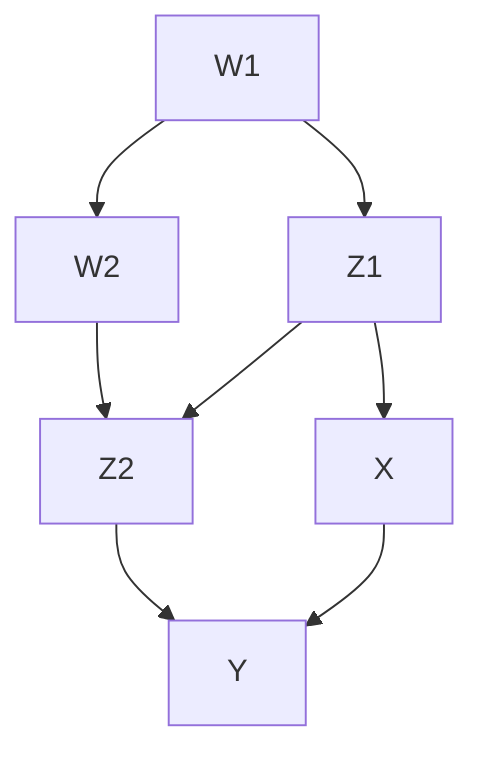


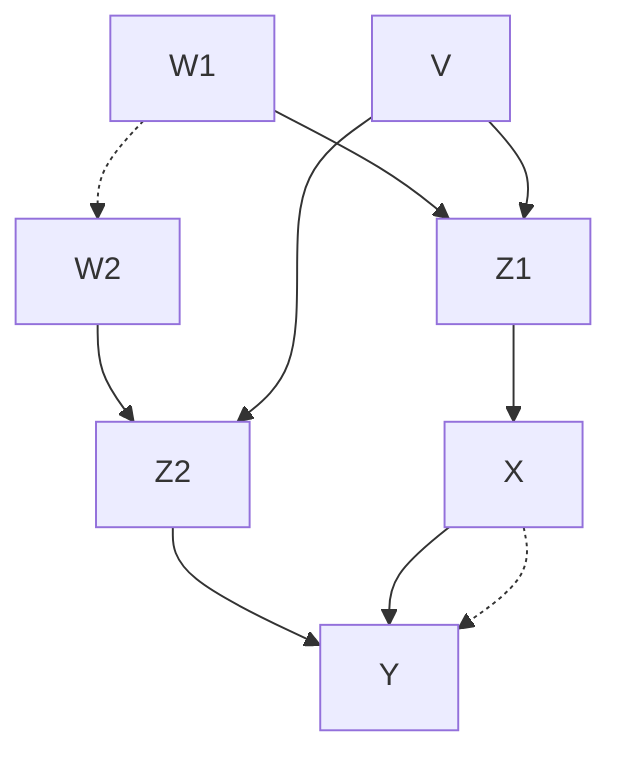

> 图 11.8 a 中 $S_{1} = \{Z_{1},W_{2}\}$ 和 $S_{2} = \{Z_{2},W_{1}\}$ 都是可容许的，但却不满足 $C_{1}$ 或 $C_{2}$ 。b 中 $C = \{Z_1,Z_2,W_1,$ $W_{2},V\}$ 的任一子集合都不是可容许的。

#### 11.3.4 协变量选择中的数据与知识

当缺少因果图时，我们应该做些什么呢？一个方法是根据领域知识，假设一个合理的图，然后检验数据是否反驳图的统计性质。在图 11.8b 中就有这样一些性质，作为条件独立约束，每一条都与丢失的箭头有关：

$$
\begin{array}{l} V \bot \{W_{1}, W_{2} \} \qquad X \bot \{V, Z_{2} \} | \{Z_{1}, W_{2}, W_{1} \} \\ Z_{1} \bot \{W_{2}, Z_{2} \} | \{V, W_{1} \} \quad V \bot Y | \{X, Z_{2}, W_{2}, Z_{1}, W_{1} \} \\ Z_{2} \bot \{W_{1}, Z_{1}, X \} | \{V, W_{2} \} V \bot Y | \{Z_{2}, W_{2}, Z_{1}, W_{1} \} \\ \end{array}
$$

当然，满足这些条件并不能得到假设因果模型的有效性，正如第 2 章中所说，因为可能存在其他满足这些约束条件却有明显不同的因果结构的模型，所以具有明显不同的可容许集合与效应估算。一个平凡的例子是完全图，选择恰当的参数和箭头方向可以模拟任何其他的图。一个稍微复杂的例子是等价结构类中的图，它们对于参数的选择不敏感，所有条件独立性来自图中节点的分层 ①。第 2 章介绍的搜索技术提供了获取所有等价模型的系统方法，这些模型都与给定的条件独立关系相容 ②。

> ① 参考第 2 章，在等价结构的图中，其节点和边是相同的，因此参数的变化只反映了因果效应数值上的变化，而关键是边的定向，不同的定向决定了节点的不同分层，于是也决定了不同的因果结构。——译者注
>
> ② 半马尔可夫模型也可以通过无法表达条件独立性的函数关系来识别（Verma and Pearl, 1990; Tian and Pearl, 2002b; Shpitser and Pearl, 2008），在本例中，我们未考虑这类有用的约束。

图 11.9 是图 11.8b 的有力竞争者，它满足后者所有的独立性条件，再增加一个不易发现和检测的独立性条件： $Z_{1} \perp Y \mid X, W_{1}, W_{2}, Z_{2}$ 。与图 11.8b 不同，图 11.9 有三个集合 $\{Z_{1}, W_{1}, W_{2}\}$ 、 $\{V, W_{1}, W_{2}\}$ 、 $\{Z_{2}, W_{1}, W_{2}\}$ 是可容许的，因此也是 $c$ -等价的。检测这三个集合的 $c$ -等价性就可以在这两个竞争模型之中做出判断。


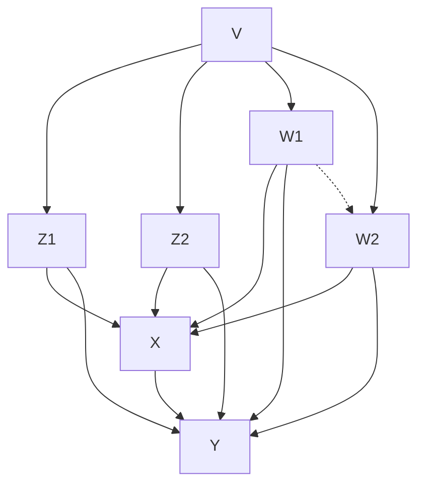

> 图 11.9 这个模型与图 11.8b 几乎无法区别，仅多了一个独立性 $Z_{1} \perp Y|X, W_{1}, W_{2}, Z_{2}$ ，它有三个集合是可容许的（因此是 $c$ -等价的）： $\{V, W_{1}, W_{2}\}$ 、 $\{Z_{1}, W_{1}, W_{2}\}$ 、 $\{W_{1}, W_{2}, Z_{2}\}$ 。因此，如果其中任何两个不能通过 $c$ -等价性检验，将拒绝该模型。

已被确认的因果知识可以对这样的判断提供有价值的信息。例如，如果我们有充分的理由相信变量 $W_{2}$ 不会影响 $X$ （比如迟于 $X$ 出现），或者 $W_{1}$ 对于 $Y$ 不可能有直接效果，那么图 11.9 的模型可以排除。

图的力量在于给研究人员提供了关于推理的清晰语言，讨论某些假定的合理性，并且在无法达成共识的情况下，区别各种意见的差异，确定解决分歧需要哪些条件观察。这些手段是潜在结果方法所缺乏的，对于大多数研究人员来说，“强可忽略性”仍然是一个神秘的黑箱。

图模型除了提供正面的性质判断之外，还具有无须逐个检验就可以排除大量模型的能力。例如，在所有 $V$ 和 $W_{1}$ 是 $X$ 仅有父节点的模型中， $\{V, W_{1}\}$ （当然也就包括 $C = \{Z_{1}, Z_{2}, W_{1}, W_{2}, V\}$ ）是可容许的，一旦数据中条件 $X \perp Z_{1} | V, W_{1}$ 不成立，该模型立刻就可以排除。

例如，第 3 章中，我们演示了介于 $X$ 和 $Y$ 之间的附加变量的测量，为何对于确认 $X$ 对 $Y$ 的因果效应是充分的。图 11.8b 也说明了此事。 $X$ 和 $Y$ 之间的路径上的变量 $Z$ 的测量，可以通过式（3.29）来实现 $P(y|do(x))$ 的可识别性和可估计性。这就说明图 11.8b 是正确的数据生成模型。另一方面，如果图 11.9 表示正确的模型，则因果关系由下式给出：

$$
\begin{array}{l} p (y \mid d o (x)) = \sum_ {p a_{X}} P (y \mid p a_{X}, x) P (p a_{X}) \\ = \sum_ {z_{1}, w_{1}, w_{2}} P (y | x, z_{1}, w_{1}, w_{2}) P (z_{1}, w_{1}, w_{2}) \\ \end{array}
$$

这与式（3.29）可能一致，也可能不一致。如果是后者，我们可以用不一致的充分理由拒绝图 11.9 的模型，转而寻找另外的测量来肯定或者反驳图 11.8b。

辅助实验可能比辅助观察能提供更有力的识别工具。考虑图 11.8b 中的变量 $W_{1}$ ，如果我们能够进行一个 $W_{1}$ 的（而不是 X 的）随机对照实验，得到的数据将能够用于 X 对于 Y 的因果效应的估计无偏差（见 3.4.4 节）。至少，能够分辨 $W_{1}$ 是 X 的父代变量（见图 11.9），还是 X 的间接祖代变量（见图 11.8b）。

一些因果分析专家试图坚持传统的统计学，采用称为“敏感性分析”的方法（例如，Rosenbaum，2002，pp.105-7），给人一种该方法似乎不需要因果假定的印象，这当然是错觉。该分析不是通过假定模型中没有某些因果关系来进行推断，而是尝试假设有这样的因果关系，并且估算这种因果关系达到多强才能解释观察的数据，然后将结果提交给合理的判断，其本质与图 11.9 中的模型所引用的判断没有什么不同。在更丰富的背景下，敏感性分析相当于放置了一个因果关系图表，它的强度受到合理判断的限制，试图在不违反这些约束的条件下根据数据得出结论。这是一种脱离实际的做法，到目前为止只局限于处理变量非常少的问题。图表的出现预示着这一方法将可能扩展到更现实的问题。

#### 11.3.5 理解倾向得分

倾向得分（Rosenbaum and Rubin，1983）法，或者倾向得分匹配（PSM）法，是观察研究中最成熟和最流行的数据因果分析方法。该方法在本书中没有特别强调，因为这是用于处理有限样本的估计方法，对于渐进的大样本极限并没有增加更多的理解，而这才是本书的重点。然而，由于倾向得分法在因果分析中的显著地位，以及当前围绕其使用的各种争论，我们专设一节解释它在图模型、可容许性、可识别性、偏差降减，以及统计与因果的区分这个庞大体系中的位置。

倾向得分法是建立在一个简单而巧妙的纯统计学特点的想法上。假设有一个二元行动（或者处理） $X$ ，以及一个可测量的协变量集合 $S$ ，倾向得分 $L(s)$ 是具有特征 $S=s$ 的参与者选择行动 $X=1$ 的概率，即

$$
L(s) = P(X = 1 \mid S = s) \tag{11.9}
$$

正如 Rosenbaum 和 Rubin 所阐释的，将 $L(s)$ 看作 $S$ 的函数，从而 $L(s)$ 是一个随机变量。给定 $L(s)$ ， $X$ 和 $S$ 是独立的，即 $X \perp S \mid L(s)$ 。换句话说，所有映射到相同值 $L(s)$ 的个体都是可比较的，或“平衡的” $^{\ominus}$ ，这意味着，对于 $L$ 的每一个层面，处理或者不处理的个体具有相同的特征 $S$ 分布 $^{\ominus}$ 。

> - $\ominus$ 具有不同的特征 $s_1$ 和 $s_2$ 的个体，也可能有相同的 $L$ 值，即 $L(s_{1}) = P(X = 1 \vert S = s_{1}) = P(X = 1 \vert S = s_{2}) = L(s_{2})$ ，这两个子群体对于 $X$ 有相同的选择倾向。——译者注

为了说明该结果的意义，简单起见，假设 $L(s)$ 的各个值能够被分别估计，并且近似地分划为离散的取值层面， $L = \{l_{1}, l_{2}, \cdots, l_{k}\}$ 。依据 11.3.3 节的定义和式（11.8），条件独立性 $X \perp S \mid L(s)$ 连同函数映射 $S \to L$ ，推出 $S$ 与 $L$ 是 c-等价的。即对于任何 $Y$ ，

$$
\sum_{s} P(y \mid s, x) P(s) = \sum_{l} P(y \mid l, x) P(l) \tag{11.10}
$$

这可以直接从下面的式子得到 $^{③}$ ：

$$
\begin{array}{l}
\sum_{l} P(y \mid l, x) P(l) = \sum_{s} \sum_{l} P(y \mid l, s, x) P(l) P(s \mid l, x) \\
= \sum_{s} \sum_{l} P(y \mid s, x) P(l) P(s \mid l) \\
= \sum_{s} P(y \mid s, x) P(s)
\end{array}
$$

到目前为止，我们尚未提到任何因果关系，也没有提到 $Y$ 是结果变量，而我们最终的任务是估计 $X$ 对于 $Y$ 的因果效应。 $S$ 和 $L$ 的 c-等价性仅仅意味着，如果出于任何原因，希望对于任意的两个变量集合 $S$ 和 $Y$ ，估计“校正值” $\sum_{s} P(y \mid s, x) P(s)$ ，那么无须对高维的 $S$ 求和，只需要对于 1 维的 $L(s)$ 求和即可。在超大样本数量的情况下，两种方法在大样本极限下的渐进估计是相同的。

c-等价性还进一步指出，如果选择校正值 $E_{s}P(y \mid s, x)$ 逼近因果效应 $P(y \mid do(x))$ （这是因果推断第一次被牵扯进来），那么可以通过估算值 $E_{l}P(y \mid l, x)$ 得到相同的渐近，其中对 $L$ 的取值层面进行校正。后者有一个优点，对于有限样本来说， $L(s)$ 的每个取值层面不太可能是空的，都包含处理和不处理的个体。

因此倾向得分法可以看作有效的估计算子，由任意协变量集合 $S$ 形成。它既不要求 $S$ 满足某些适当性条件，也不要求修正任何混杂偏差，更不担心产生原本没有的新偏差。

在 $S$ 是可容许的特殊情况下，即

$$
P(y \mid do(x)) = E_{s} P(y \mid s, x) \tag{11.11}
$$

$L$ 也是可容许的，这样，我们就可以通过下面公式的右边做出对于因果效应的无偏估计 $^{①}$ ：

> - 不幸的是，Rosenbaum 和 Rubin（1983）只对可容许的 $S$ 证明了 $S$ 和 $L$ 的 c-等价性。这给读者留下了印象，倾向得分匹配法在某种程度上有助于减少偏差。

$$
P(y \mid do(x)) = E_{l} P(y \mid l, x)
$$

反之，如果 $S$ 不是可容许的， $L$ 也不是可容许的，这时能保证的只是前者产生的偏差后者也能够一模一样的。

### 围绕倾向得分的争论

到目前为止，关于倾向得分的表述没有产生误解。本书读者可能会疑惑，如此简单明了的估计方法怎么会出现争论，这个方法仅仅提供了一个统计量的估计。根据 $S$ 的选择，该统计量有时与感兴趣的因果效应相符，有时不相符。

但最近出现了一场争论，最有可能的原因是这种方法越来越受欢迎，并得到了著名统计学家（Rubin，2007）、社会学家（Morgan and Winship，2007；Berk and de Leeuw，1999）、卫生科学家（Austin，2007）和经济学家（Heckman，1992）的强烈支持。实际上，这种方法的普及程度已经上升到一些联邦机构希望项目评估员使用这种方法代替实验设计的地步（Peikes et al.，2008）。

这一举动反映了研究人员普遍倾向于淡化关于 $S$ 可容许性的要求，并将 Rosenbaum 和 Rubin 的数学证明解释作为保证，在 $L$ 的每个层面中，适当地匹配试验组和对照组的受试者能以某种方式消除数据中的混杂，从而有助于整体偏差的减少。这种趋势在实证研究中（Heckman et al.，1998；Dehejia and Wahba，1999）被进一步强化，在倾向得分分析和随机试验之间发现了一致性，并且认为前者能够在重要特征上“平衡”实验组和对照组。Rubin 鼓励这样的解释，他说：“这个应用使用倾向得分法来创建实验个体和对照个体的子组……仿佛它们被随机化了。采取这样的分组，然后对于已观测的协变量进行‘近似’随机区组实验”（Rubin，2007）。

然而，后续的实证研究对于倾向得分采取了更多批评的观点，令人失望的是，在仔细比较临床研究的结果时，有时测量会出现本质性的偏差（Smith and Todd，2005；Luellen et al.，2005；Peikes et al.，2008）。

但是，为什么有人会淡化 Rosenbaum 和 Rubin 的警告，这样做将违反因果分析的黄金法则： **因果论断不可能建立在纯粹的统计方法上** ，无论是倾向得分、回归、分层还是其他基于分布的设计。我相信答案在于 Rosenbaum 和 Rubin 描述可容许性条件的语言，即式（11.11）。这个条件是用潜在结果的含糊语言描述的，要求集合 $S$ 必须使 $X$ 是“强可忽略的”，也就是 $\{Y_{1}, Y_{0}\} \perp X \mid S$ 。

正如本书多次提到的，“可忽略性”概念的不透明性是潜在结果方法的阿喀琉斯之踵。即使对于所有因果关系都明确的简单问题，也没有一个凡人能够使用该条件判断“可忽略性”是否成立，更不用说对于因果关系只是部分明确，并且涉及几十个变量的问题了 $^{①}$ 。

> $^{①}$ 大多数研究人员在理解“可忽略性”的意义以及在实际中判断它们的困难性，导致人们假定当分析过程中包含了尽可能多的协变量时，这个条件是自动满足的，或者至少像是满足的。普遍的看法是增加更多协变量没有害处（Rosenbaum，2002，p.76），却能够让人们免于考虑各种因素之间因果关系（Rubin，2009）。这些因素包括协变量、处理、结果以及（最重要的）未测量的混杂因子等。

但是这种看法与图模型的学生学到的内容相反，也与本书讲授的内容相反。 $S$ 的可容许性只能通过研究者可获得的因果知识来确定。正如我们从图论或者后门准则中学到的，这些知识认为，减偏是一个非单调的算子，即消除一个混杂因子带来的偏差（或不平衡）可能会唤醒和释放另一个蛰伏的、未测量的混杂因子带来的偏差。这样的例子很多（例如图 6.3），在分析中增加一个变量可能带来不可挽回的偏差（Pearl，2009b，2010a；Shrier，2009；Sjölander，2009）。

另一个引发争论的因素是，人们普遍相信倾向得分法的减偏潜力能够通过实验性的案例研究，并将倾向得分和随机试验得到的效果进行比较来评价（Shadish and Cook, 2009）②。然而这个想法并未证明是正确的，因为倾向得分减少偏差的潜力严重依赖于 $S$ 的特殊选择，或者更准确地，依赖 $S$ 的内部变量和外部变量之间的因果关系。在一个问题实例（例如，在俄克拉荷马州的教育计划）中测量出的有效偏差并不能阻止在其他例子（例如，在阿肯色州的犯罪控制）中的零偏差，即使两者之间有相同的统计分布 $P(x, s, y)$ 。

> 潜在结果传统的拥护者寄托于检查图 11.8b（或者所选择的任何模型、故事、小例子）是否有某个子集合 $C$ 使得 $X$ 是“强可忽略的”。当然，这通过后门准则是容易确定的，但不幸的是，潜在结果阵营中某些拥护者的领袖人物仍然对于图怀有恐惧和误解（例如，Rubin，2004，2008b，2009）。

带着这样的考虑，人们自然有理由问一个社会学类型的问题：对于倾向得分，是什么原因抑制了对其所带来的期待，以及限制了更加广泛的理解？

Richard Berk 在《回归分析：一个建设性批判》（Berk，2004）一书中，回顾了社会学中类似的现象，那些完美的思想被科学界曲解：“我回忆了与 Don Campbell 的交谈，350 他公开表示希望自己从未写过《研究中的实验与准实验设计》(Campbell and Stanley, 1966)，这本著作将随机实验与准实验近似之间进行对比，并强烈反对后者。然而这本书的巨大影响是使大量应用社会科学的准实验设计合法。Dudley Duncan 在职业生涯晚年认为他那本很有影响的关于路径分析的书《结构方程模型导论》是一个大错误。读完这本书的研究人员相信，关于社会不平等的基本政策问题可以通过路径分析快速且简单地得到答案。”我相信，围绕着倾向得分，一个类似的文化现象正在逐步形成。

Rosenbaum 和 Rubin 在说明成功的条件时并没有掉以轻心，反而很清楚告诫实际工作人员倾向得分仅在“ **强可忽略性** ”的条件下才有效，失败之处在于没有足够地告诫人们如何躲开不能识别的危险。为了防止盲目冒险，我们必须戴上眼镜以认出风险，使用有意义的语言来解释风险。目前尚未给读者提供工具（例如图）去识别“强可忽略性”是如何违背或者成立的。Rosenbaum 和 Rubin 已经鼓励一代研究人员（包含联邦机构）去假设“强可忽略性”在大多数情况下或者成立，或者通过巧妙的设计使之成立。

#### 11.3.6 do-算子背后的直观性

### 给作者的关于定理 3.4.1 问题

在 do-算子的推理规则中，由于 $X$ 的所有直接原因被移走，子图 $G_{\bar{X}}$ 表示在运算 $do(X = x)$ 下的现行分布，这个分布是什么？

### 作者的回答

图 $G_{\bar{X}}$ 表示 $X$ 的所有子节点假设“保持常值”，这阻断了所有从 $X$ 到 $Y$ 的有向路径，同时完整地保留了后门路径。如果 $X$ 和 $Y$ 在图上是 $d$ -连通的，那么这些路径必然也是两者之间（未阻断）的混杂路径。反之，如果我们在图上找到一个 $d$ -分离 $X$ 和 $Y$ 的节点集合 $Z$ ， $Z$ 必然阻断原图上所有的后门路径。如果进一步以变量集 $Z$ 作为条件，那么根据后门准则，必然抵消了所有混杂因素。因此，在以 $Z$ 为条件之后，无论测量到什么样（ $X$ 与 $Y$ 之间）的相关性，都归结到 $X$ 与 $Y$ 的因果效应，与混杂无关。

#### 11.3.7 $G$ -估计的有效性

在 3.6.4 节中，介绍了 $G$ -估计公式（3.63），以及反事实的独立性 $(Y(x) \perp X_k \mid \overline{L}_k, \overline{X}_{k-1} = \overline{x}_{k-1})$ ，Robin 证明了这是（3.63）的充分条件。一般而言，条件（3.62）既限制过多，又缺乏直观基础。（3.63）的更加一般和直观的条件在式（4.5）中给出，该公式内容如下：

### (3.62\*) 关于 g-估计的一般条件（贯序后门）

如果每一个从 $X_{k}$ 到 $Y$ 的行动回避（action-avoiding）的后门路径都被某个 $X_{k}, \cdots, X_{n}$ 的非后代子集合 $L_{k}$ 阻断，那么 $P(y | g = x)$ 是可识别的，并由（3.63）给出。（所谓行动回避指的是在变量的某种拓扑顺序下，不含指向迟于 $X_{k}$ 的变量 $X$ 。）这种情况比起（3.62）有几个改进，如下面三个例子所示：

**例 11.3.1** 图 11.10 描述了一种情形， $g$ -公式（3.63）对于部分过去变量的子集合 $L_{k}$ 是有效的，而非所有的过去变量。假设 $U_{1}$ 和 $U_{2}$ 是未观察的，时间顺序为 $U_{1}, Z, X_{1}, U_{2}, Y$ ，我们来看（3.62）和（3.62\*）。因此（3.63）关于 $L_{1} = 0$ 是满足的，而对于全部的过去变量 $L_{1} = Z$ ，则（3.62）和（3.62\*）都不成立。


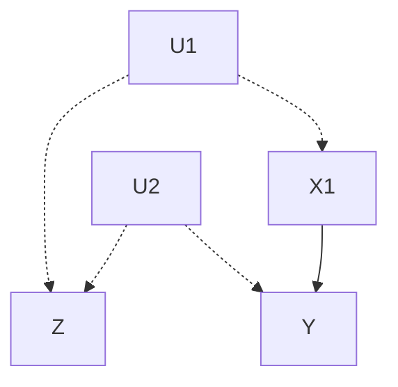

> 图 11.10 以所有的过去 $L_{1} = Z$ 作为条件使得 $g-$ 估计失效

**例 11.3.2** 图 11.11 描述了一种情形，扩展了（3.62），定义 $L_{k}$ 为 $X_{k}$ 的非后代节点的集合（与 $X_{k}$ 的时序祖代相反）。假设时间顺序为 $U_{1}, X_{1}, S, Y$ ，则当 $L_{1} = S$ 时，（3.62）和 $(3.62^{*})$ 都满足；当 $L_{1} = 0$ 时，两者都不满足。


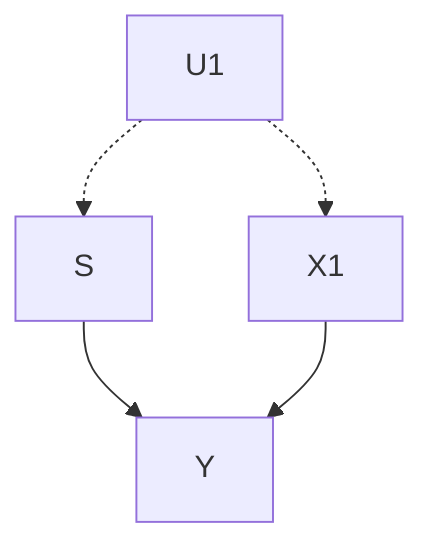

> 图 11.11 通过包含一个 $S$ 的非祖代节点使得 $g-$ 估计有效

**例 11.3.3** （该例子由 Ilya Shpitser 回答 Eliezer Yudkowsky 的问题时给出）图 11.12 描述了一种情形，即使 $L_{k}$ 的新解释下不能满足（3.62），却可以满足图条件（ $3.62^{*}$ ）。容易看出(3.62\*) 是满足的：所有的动作回避后门路径都被 $\{X_0, Z\}$ 阻断。同时也可以证明（孪生网络方法），给定 $Z$ 和 $X_0$ ， $Y(x_0, x_1)$ 不独立于 $X_1$ 。（在孪生世界网络模型中，有一条从 $X_1$ 到 $Y(x_0, x_1)$ 的 $d$ -连通路径，即 $X_1 \leftarrow Z \leftrightarrow Z^* \rightarrow Y^*$ ，因此对于 $Y(x_0, x_1)$ 和 $X_1$ ，(3.62) 不能被满足。）


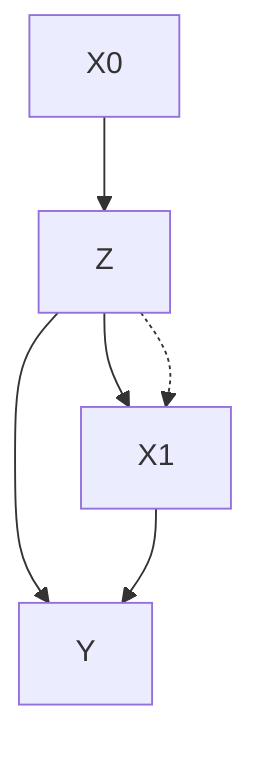

> 图 11.12 Robins 条件（3.62）不成立时， $G$ -估计也是有效的

这个例子再次证明了 Robins 在推导（4.63）时，采用潜在结果语言的弱点。g-估计公式中使用反事实条件（3.62）的合法化是模糊的，无法得到直观的支持。流行病学家在应用这个公式时得不到基本的医学知识指导。幸运的是，随着越来越多研究者开始理解 g-估计背后的假定，图的方法迅速进入了流行病学的实践（Greenland et al., 1999a；Robins, 2001; Hernán et al., 2002; Greenland and Brumback, 2002; Kaufman et al., 2005; Petersen et al., 2006; VanderWeele and Robins, 2007）。随着对于结构方程模型与图、反事实、潜在结果，以及因果关系充分成分方法（Rothman, 1976）的融合统一，并对于其基础的进一步理解 $^{①}$ ，流行病学有机会成为第一个从过去的教条中完全解放出来，敢于直接思考因果关系的学科（Weinberg, 2007）。

> ① 这个统一性既没有被领军的流行病学家（Greenland and Brumback，2002）、经济学家（Heckman and Vytlacil，2007）以及社会科学家（Morgan and Winship，2007）充分重视，也没有被统计学家提起（Cox and Wermuth，2004；Rubin，2005）。在此我无意冒犯多元文化主义地说一句，所有关于因果关系的方法都是本书所呈现的结构理论的变形和抽象（第 7 章）。

### 11.4 策略评估与 do-操作

#### 11.4.1 识别附条件计划（4.2 节）

### 给作者的问题

本书的 4.2 节给出了条件行动效果的识别条件和估计公式，即一个行动 $do(X = g(z))$ 的效果，其中 $Z = z$ 是行动之前的测量值。这个方程能够推广到多个行动的情况（即附条件计划）吗？

难点在于，该公式假定 $X$ 不改变 $Z$ 的值，然而在多行动计划中， $X$ 的某些行动可能改变确定下一步行动 $Z$ 的观测值。我们没有符号区别干预后和干预前的观察。由于缺少这样的符号，因此尚不清楚附条件计划如何能够形式化地表示并使用 do-操作符来分析。

### 作者的回答（与 Ilya Shpitser）

关于区别干预后和干预前观察的符号已经在第 7 章中使用反事实语言进行介绍。然而，附条件计划的情形并不需要更多的符号即可处理。理由是：决定当前行动选择的观察值不被该行动改变，而那些被以前行动改变的观察值已经在符号 $P(y|do(x),z)$ 中得到反映。

为了进一步弄清这种情况，我们首先介绍反事实符号，然后说明该符号可以从表达式中消除。使用 **黑体字母** 表示集合，普通字母表示单个元素。同时，大写字母表示随机变量，小写字母表示这些变量的可能取值。用 $Y_{x}$ 表示“如若令变量 $X$ 的值为 $x$ 时， $Y$ 的值”。类似地，用 $Y_{X_g}$ 表示“如若在随机策略 $g$ 下， $X$ 所取的值为 $X_g$ 时， $Y$ 的值”。注意， $Y_x$ 和 $Y_{X_g}$ 与变量 $Y$ 一样，都是随机变量。

假设我们有 $K$ 个行动变量的集合 $X$ ，它们依照某种时间顺序出现，用上标表示（行动）变量被实施的时间，即当 $i < j$ 时，变量 $X^{i}$ 先于 $X^{j}$ 出现。对于给定的 $X^{i}$ ，用 $X^{<i}$ 表示先于 $X^{i}$ 的所有行动变量集合。

我们感兴趣的是一组结果变量 $Y$ 的概率分布。在一个策略下，设置每一个 $X^{i} \in X$ 的值为函数 $g_{i}$ 的输出（ $g_{i}$ 事先已知），该输出依赖于先前变量 $Z_{i}$ 和先前干预 $X^{<i}$ ，同时变量 $Z^{i}$ 自身也受先前干预的影响。为了适当定义 $X_{g}$ 取值的递归性，我们采用了归纳定义，基本起点是 $X_{g}^{1} = g_{1}(Z_{1})$ ，归纳步骤是 $X_{g}^{i} = g_{i}(Z_{X_{g}^{<i}}^{i}, X_{g}^{<i})$ ，其中下标 $g$ 表示使用的策略，即 $g = \{g_{i} \mid i = 1, 2, \cdots, K\}$ 。现在可以写出量化公式：

$$
P \left(Y_{X_{g}} = y\right) = P \left(Y = y \mid do\left(X^{1} = X_{g}^{1}\right), do\left(X^{2} = X_{g}^{2}\right), \dots, do\left(X^{K} = X_{g}^{K}\right)\right)
$$

令 $Z_{g} = \cup_{i} Z_{X_{g}}^{i}$ 。这里的关键是，由于 $X_{g}$ 是 $Z_{g}$ 的函数，如果观察 $Z_{g}$ 取定的某个值， $X_{g}$ 也会归咎为唯一的值。我们假设在 $Z_{g}$ 被观察的值是 $z = \{z_{1}, z_{2}, \cdots, z_{K}\}$ 时， $X_{g}$ 的值是 $x_{z} = \{x_{z}^{1}, x_{z}^{2}, \cdots, x_{z}^{K}\}$ 。由于函数 $g_{i}$ 是固定的，并且我们事先已知，因此我们知道 $z$ 就可以提前计算 $x_{z}$ ，但是我们不知道 $Z_{g}$ 可能获取的值，于是考虑所有情况的组合，从而：

$$
P(Y_{X_{g}} = y) = \sum_{z^{1}, \dots, z^{K}} P\left(Y = y \mid do(X = x_{z}), Z^{1} = z^{1}, \dots, Z_{x_{z}^{<K}}^{K} = z^{K}\right) \times
$$

$$
P\left(Z^{1} = z^{1}, \dots, Z_{x_{z}^{<K}}^{K} = z^{K} \mid do(X = x_{z})\right)
$$

请注意， $Z_{i}$ 不会与后续的干预相关。于是得到：

$$
\sum_{Z} P\left(Y = y \mid do(X = x_{z}), Z_{x_{z}}^{1} = z^{1}, \dots, Z_{x_{z}}^{K} = z^{K}\right) \times
$$

$$
P\left(Z^{1} = z^{1}, \dots, Z^{K} = z^{K} \mid do(X = x_{z})\right)
$$

这两个式子中的下标是多余的，因为 $do(x_{z})$ 已经对表达式中的所有变量蕴含了这样的下标，于是重写上面的式子得到最终的形式：

$$
\sum_{z} P\left(Y = y \mid do(X = x_{z}), Z^{1} = z^{1}, \dots, Z^{K} = z^{K}\right) P\left(Z^{1} = z^{1}, \dots, Z^{K} = z^{K} \mid do(X = x_{z})\right)
$$

或者更简明地：

$$
\sum_{z} P\left(y \mid do(x_{z}), z\right) P\left(z \mid do(x_{z})\right)
$$

我们能够通过 $P(y|do(x),z)$ 和 $P(y|do(x))$ 计算上式，其中 $Y$ 、 $X$ 、 $Z$ 是不相交的集合。

> **批注** ：综上所述，尽管附条件计划自然地由嵌套的反事实表达式来表示，但它们仍然可以约简为对形如 $P(y|do(x),z)$ （ $Z$ 可能为空集）的条件干预分布的识别。Shpitser 和 Pearl（2006a，b）给出了从给定图 $G$ 的联合分布中识别这些量的完整条件。

---

#### 11.4.2 间接效应的意义

### 给作者的问题

我正在教授一门关于潜在变量模型的课程（面向生物统计学和公共卫生学专业的学生），昨天恰好介绍了路径分析的概念，包括直接效应和间接效应。

我说明了如何通过直接路径的乘积计算间接效应，然后一个学生提问如何解释间接效应。我一如往常地给出回答：间接效应 $ab$ （在图 11.13 的简单模型中）。经过几秒钟的琢磨，学生问了如下的问题：

**学生** ：“ $b$ 路径的解释是，当固定 $X$ 的值， $Z$ 的值增加一个单位， $Y$ 的增加量是 $b$ ，对吗？”

**我** ：“是的。”

**学生** ：“那么在解释间接效果时，什么是固定一个常数？”

**我** ：“我不明白你的意思。”

**学生** ：“你说过， $ab$ 是在给 $X$ 增加一个单位值后，借助与 $Z$ 的因果效应在 $Y$ 上看到的增加值。但是既然计算 $b$ （从 $Z$ 到 $Y$ 的直接效应）要求 $X$ 的值固定，那么如何要求 $X$ 变化一个单位值呢？”

**我** ：“嗯，这是一个很好的问题。我不敢保证给你一个好的答案。如果 $X$ 到 $Y$ 的直接路径是 $0$ ，我想这没有问题，因为这时 $Z$ 和 $Y$ 之间的关系与 $X$ 无关。但是当 $c$ 不等于 $0$ 时，必须将 $b$ 解释为：在固定 $X$ 的值时， $Z$ 对于 $Y$ 的效应。这一点你是对的，我知道这听起来似乎与间接效应 $ab$ 的解释矛盾。我们先测试一下 $X$ 的变化会引起什么，然后我再回答你。正如之前告诉你的，计算并不困难，困难的是真正理解模型的意义。”


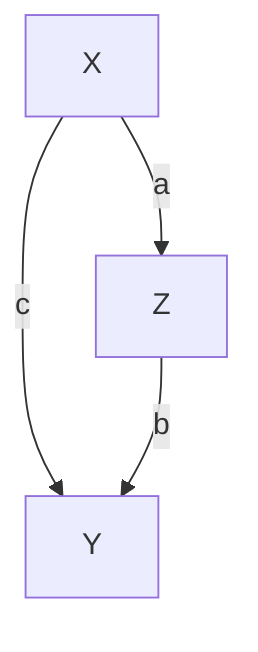

> 图 11.13 X 借助 Z 对 Y 产生的间接效果

### 作者的回答

赞赏你的学生的求知欲。答案可以相当简单地叙述（参见 4.5.5 节，这是第 2 版里添加的）：

> **X 对于 Y 的间接原因是** ：固定 $X$ 为常数，然后对 $Z$ 增加一个量值，这个量值是 $X$ 增加一个单位量值时 $Z$ 增加的量值，在这个条件下我们所看到的 $Y$ 增加的量值。

这个反事实的定义导致了中介公式（4.18），它将路径分析扩展到非线性模型，并使用通常的回归来估计变量的间接效应。

### 作者的后续想法

这个问题说明了在一些领域中，标准结构方程模型的教育是需要改革的地方。虽然一些 SEM 教科书粗略地提到了结构参数作为影响系数的解释，但这种解释并没有被作者、教师和学生非常认真地对待。在 2008 年的文章中，我发现大部分的 SEM 教育仍然侧重于统计估计和模型拟合技术，只要模型能够拟合和估算，就很难找到关于模型意义的认真讨论（参见 11.5.3 节关于 SEM 的救生包） $^{①}$ 。

> 我已经检查过，名词“因果”并没有出现在 2000 年后任何 SEM 教科书的索引中。

当好奇心强的学生提出的问题稍微偏离标准的 LISREL 套路时，这种教育传统的弱点就会显露出来，这些问题的答案取决于结构系数和结构方程的因果解释。例如：

- 为什么我们要用这种方式定义总效应（即一些直接效应的乘积之和）？这是随意而为，还是路径系数的因果解释必须如此？
- 为什么我们定义间接效应为总效应和直接效应之差？
- 如何在非线性或者涉及二分变量的系统中定义直接效应？
- 如何使用一种有意义的方式在包括反馈回路（即互为因果关系）的系统中定义效应？以避免在 SEM 教科书中使用的错误定义的陷阱？
- 如果在实施试图评估其影响的行动之前采取一些措施，我们对直接效应和总效应的估计会保持不变吗？

请读者注意，这些问题在 4.5.4 节、4.5.5 节、11.5.2 节、11.5.3 节，以及 11.7.1 节中给出了正式答案。

就我个人而言，我对于直接效应和间接效应的兴趣是被 Jacques Hagenaars 的一段话引起的，他写道（2000 年 9 月 15 日）：“在各种理论中，间接效应的确占据了重要的位置。许多社会学理论在输入（背景特征）和输出（行动）变量上是一致的，但是对于干预机制的考虑却完全不同。举一个简单的例子，教育对于政治倾向的影响是通过经济状态（更高的教育获取更好的工作和收入）和‘文化机制’（教育的内容和校园生活中的社会化过程）起作用的。我们需要知道和区别这两种不同过程的性质和后果，也就是说，我们需要知道间接效应的表现和程度。在线性参数的结构方程模型中，存在‘路径系数计算’其中我们可以根据直接效应和间接效应得到总效应。但这对于一般的非线性参数情况是不可能的（例如对数线性模型）。对于逻辑模型系统，不存在‘路径系数计算’，这在很久以前已经注意到了。但是鉴于其压倒一切的理论重要性，间接效应的问题不能简单地忽视。”

受这些评论的激发，借助嵌套的反事实描述，我开始对于雇工歧视问题给出合理的形式化定义，从而导致 4.5.4 节和 4.5.5 节的那些结果（其中一些已经被 Robins 和 Greenland（1992）预料到了），以及式（4.12）、式（4.17）和式（4.18）的中介公式。受到这些结果的启发，我不得不高兴地收回在《因果论》第 1 版 165 页上的早期表述：“间接效应缺乏内在的运算意义。”虽然间接效应不能通过 $do(x)$ 操作进行隔离是真的，但是它们的确具有内在的运算意义。Pearl（2001，2010b）和 Petersen 等人（2006）进一步例证了直接效应与间接效应在策略制定中的应用。

#### 11.4.3 $do(x)$ 能够表示实际实验吗

### 给作者的问题

来自亚利桑那大学 L.B.S.（生物科学研究实验室）的提问： $do(x)$ 操作是否表示现实中的行动或实验？

> “即使一个完美的随机实验也可能产生完美的误导结论，一个很好的例子是一项关于维生素 $E$ 注射的研究，对处于晶状体后纤维增生风险的保温箱婴儿注射维生素 $E$ ，随机实验已经指出了注射的有效性，但是很快就发现实际的有效治疗是每天打开几次加压饱和氧气的保温箱给予注射，从而降低了婴儿血压和血氧饱和水平（Leonard，《重大医疗事故》）。在此案例中，任何统计分析都存在误导。”

来自乔治亚理工学院的 S.M. 附加道：

> “你所举的关于误导因果效应的例子也同样表明了我关于 $do(x)$ 概念的困惑。你执行 $do(x)$ 或者不执行 $do(x)$ ，总有一些其他的事情与 $do(x)$ 一起发生，它们是 $do(x)$ 的原因，但不是 $do(x)$ 本身。”

### 作者的回答

数学处理的是理想情况，而实验人员的工作是保证实验条件尽可能接近数学理想。 $do(x)$ 操作表示在理想的实验中让 $X = x$ ，其中 $X$ 单独被直接操纵，而不是模型中的其他变量。

在维生素 E 注射的例子中，有另外一个变量与 $X$ 一起操作，即保温箱的盖子 $Z$ ，这就使得实验条件是 $do(x, z)$ 而不是 $do(x)$ 。这样的实验与预期相去甚远，甚至与要求使用安慰剂的标准实验方案也相去甚远。假若使用了安慰剂（接近 $do(x)$ 操作的要求），结果将不会产生偏差 $^{①}$ 。

> - 如果实验设计另一组受试者，打开盖子但不接受注射，即所谓的安慰剂，那么这才是需要的 $do(x)$ 操作，而不是 $do(x,z)$ ，于是实验结果将会避免误导。——译者注

一个模型不可能预测一个行动的效应，除非详细说明模型中的哪个变量直接被该行动影响，以及如何影响。 $do(x)$ 操作是一个数学工具，帮助我们形式地描述在实验中哪些变量保持常数，哪些变量让其自由变化。假设实验被忠实地执行，假设有一个关于背景的有效因果模型，并且假设具有指定条件下进行的其他实验数据，那么 $do$ -算子可以帮助我们预报所要求的逻辑结果 $^{②}$ （参见 11.4.6 节）。

> - 三个假设说明了真实计算 $do(x)$ 需要的前提，其中第三个假设是因为计算 $do(x)$ 需要有数据，这个数据必须来源于其他实验或者观察。

#### 11.4.4 $do(x)$ 操作是通用的吗

### 给作者的问题（来自 Bill Shipley）

在大部分实验中，外部操作是对 $X$ 增加（或者减少）一定的量，而不是消除 $X$ 已有的量。例如，对于土地增加 5kg/h 肥料，对受试者增加 5mg/l 胰岛素等。因此操作变量原有的原因依然发挥作用，但是增加了新的变量 (M)。

作为一般的外部操作，我认为 $do(x)$ 操作的问题在于，它需要做两件事：

1. 消除 $x$ 以前存在的原因；
2. 设置 $x$ 为某个值。

这对应于某些类型的外部操作，但不是所有（甚至大多数）类型的外部操作。我建议引入 $\operatorname{add}(x = n)$ 操作，其意思是“对于原有的因果流程，从外部增加一个量从‘ $n$ ’到 $x$ ”。从图上看，在原来的因果图上增加一条新的边，即 $M \to n \to X$ 。用代数语言说，增加一个新的项（ $n$ ）作为 $X$ 的一个原因（Shipley, 2000b）。

### 作者的回答

在很多情况下，你的“添加干预”确实代表干预变量 $X$ 的唯一方式。在其他情况下，它可能代表了我们试图评估的实际策略 $^{①}$ 。事实上，关于干预更一般的概念就是允许用方程替换 $X$ ，不一定是常数 $X = x$ 。

> - 对于策略评估，存在多种干预方式，添加干预也经常使用。——译者注

你所提议的操作相当于将 $X$ 的原方程 $x = f(pa_X)$ 替换成 $x = f(pa_X) + n$ ，这个替换可以使用“工具变量”表示，这等价于写作 $x = f(pa_X) + I$ （ $I$ 是工具）， $I$ 从 0 变到 $n$ 。

有三点需要注意：

- **添加操作能够在 $do()$ 框架中表示** ——只是将 $do()$ 操作应用于工具 $I$ ，而不是 $X$ 自身。这是需要与 $do()$ 区别开的另一种类型的操作，正如下面将说明的那样，两者在 $Y$ 上的效应是不同的。
- **在很多情况下，科学家并不满足估计工具 $I$ 对于 $Y$ 的效应** ，而是努力尝试估计 $X$ 本身在 $Y$ 上的效应，这通常更有意义，也更容易迁移到其他情况。（参见对于“意向治疗”效应的讨论。）
- **考虑一个非递归的例子** ，其中 LISREL 对于 $y = bx + e_{1} + I$ ， $x = ay + e_{2}$ 失效。如果把总效应解释为 $Y$ 对于工具变量 $I$ 的单位变化的响应，那么从 LISREL 公式得到： $I$ 对于 $Y$ 的效应是 $b/(1-ab)$ 。然而，如果坚持“ $X$ 的单位变化”，则将回到 $do$ -公式： $X$ 对于 $Y$ 的效应是 $b$ ，不是 $b/(1-ab)$ 。换句话说，我们从 0 到 1 改变工具变量 $I$ 的值，并观察 $X$ 和 $Y$ 的变化，如果把 $Y$ 的变化除以 $X$ 的变化，得到的值是 $b$ ，而不是 $b/(1-ab)$ 。

总而言之，添加操作有时候在建模时是需要的，并且可以使用工具变量在 $do(x)$ 框架下实现。然而我们仍需要区别工具效应和 $X$ 的效应，前者是不稳定的，而后者是稳定的。对于识别操作“添加 $n$ 到 $X$ ”的效应，Shpitser 和 Pearl（2009）给出了一个图形化的必要条件和充分条件。

### Bill Shipley 的追问

谢谢你对问题的澄清。在我看来，最简单且最直接的模型化表示因果系统的操作是：（1）修改原始系统的因果图表示计划实施的操作；（2）将此新图变换为结构方程；（3）从得到的方程推导预测结果（包含条件预测）；我的书里就是这样处理这些概念的 $^{②}$ 。特别地，可以使用这种方法来建模非常复杂的操作，为什么还要多此一举引入 $do(x)$ 呢？例如，人们可能会问，如果在因果图中将一个数量 $z$ 添加到变量 $x$ ，而 $z$ 又与图中其他变量相关，那么这时会发生什么呢？

> - ② 这里指 Bill Shipley 的著作 _Cause and Correlation in Biology_（2000 年由剑桥大学出版社出版）。——译者注

### 作者的回答

你说的方法是用 $x = g(f(pa_X), I, z)$ 替换当前方程 $x = f(pa_X)$ ，这要求我们知道函数 $f$ 和 $g$ 的形式，就像在线性系统中那样，或者知道 $X$ 的父节点被观察，就像在 3.2.3 节中描述的过程控制那样。但是对于第 3 章和第 4 章中所描述的非参数、部分可观察的情况，这些并不适用，这可能导致无法利用干预前收集的数据预测干预的效应，我们称之为 **识别问题** 。因为干预前的统计数据不能用于 $I$ ，而且 $f$ 又是未知的，所以存在半马尔可夫的情况，其中 $P(y \mid do(x))$ 是可识别的，而 $P(y \mid do(x = g(f(pa_X, I, z)))$ 不是可识别的。每一种情况必须就事论事地具体分析，因此重要的是，在各种各样潜在的干预上建立某些标准，并将注意力集中在那些能够说明其他标准的标准上 $^{\ominus}$ 。

科学因标准而发展，因为标准（至少）有两个目的： **交流** 和 **理论统一** 。例如，数学家认为微分算子“dy/dx”是用于交流变化信息的一个好的标准，这就是我们在微积分课程中讲授的内容，虽然其他的算子也可以用于这个目的，例如 $xdy / dx$ 或者 $(dy / dx) / y$ 。同样的情况也适用于因果分析：

1.  **交流** ：如果从流行病学中去掉术语“治疗效果”，而代之以如何测量效果的细节描述，那么就扼杀了流行病学专家之间的所有交流。因此建立了一个标准：在随机对照实验中测量的结果称为“治疗效果”，其余的都认为是这个标准的变形。“do-操作”也忠实地表示了这样的标准。

在 SEM 中也有相同情况，Sewall Wright 提到“效应系数”，并把它们作为路径分析中“直接效应”的标准（在此之前，曾经受到回归术语的干扰），借助于此可以构造更加复杂精巧的效应。do-操作再一次成为定义这个标准的基础。

2.  **理论统一** ：许多不同的操作可以归约为“do”，或者是“do”的应用。关于“do”的理论结果都可以应用于这些方面。例如，你的“添加 n”的操作可以通过工具表达为“do”。另一个例子是，对于涉及“do”的表达式的识别问题也可以应用到更加复杂的效应识别问题。在 4.2 节中，我们证明了，如果表达式 $P(y \mid do(x), z)$ 是可识别的，那么条件行动 $P(y \mid do(x = g(z) \text{if} Z = z))$ 也是可识别的。本书中许多其他的理论结果也是如此。它们都是从 do-操作发展起来的，相互借用，并应用于多种变化。

最后，do-操作“外科手术式”的定义对于解释反事实命题提供了适当的形式化方法，而反事实在科学论述中是大量出现的。我还没有看到任何其他定义方法具有类似的多功能性、普遍性、形式化能力，以及（起码而言）概念上的吸引力。

#### 11.4.5 没有操纵的因果关系

### 给作者的问题

在直接效应的分析中，4.5 节借用了一个学校招生中性别歧视的例子。在一些公式中，性别变量冠以“帽子”符号，或者等价地作为 do-操作的对象。由于性别变量不能被操作，因此它如何能够放置在 do-操作后面呢？

### 作者的回答

自从 Holland 创造了那句“没有操作就没有因果关系”（Holland，1986），在因果分析中许多好的想法被扼杀和丢弃。不允许谈论男性和女性在许多生物、社会以及心理方面的区别，就抹杀了 90% 的有关性别差异的知识。

当然，有不需要操作的因果关系。月亮引起潮汐，种族引起歧视，性别引起某种荷尔蒙的分泌。自然是一个由各种规律和机制组成的社会，它呆板地感知某些变量的值，并确定其他变量的值，它不需要人类的操作。

事实也真是如此：操作是科学家探索机制运行的一种方法（虽然是粗糙的），但它不应该以任何方式抑制各种因果思维、形式化定义，以及探索现象变化机制的数学分析。也许正是因为这个原因，科学家发明了反事实。反事实允许谈论和构思前提条件的实现，无须具体说明建立这些条件的物理手段。

定义 4.5.1 中采用“帽子”符号的目的并不是想方设法改变申请人性别，而是提醒我们：任何与“效应”有关的定义都应该侧重于因果关系，并从所定义的量值上过滤掉虚假的关联。在性别的案例中，可以放心地用 $P(y \mid \text{女性})$ 替换 $P(y \mid do(\text{女性}))$ ，因为可以放心地假定决定性别的机制独立于影响 $Y$ 的各种背景因素（从而保证没有混杂）。但是作为一般的定义，甚至作为有指导意义例子的一部分，有关直接效应和性别歧视的数学表达式应该有帽子符号。如无其他问题，在“帽子”符号下面替换“female”将有助于传播早就该宣传的另一句话：

> **“没有操作的因果关系？必须有！”**

#### 11.4.6 与 Cartwright 一起追猎原因

在 Nancy Cartwright 的《追猎原因并加以利用》一书中（2007 年由剑桥大学出版社出版），针对 $do(x)$ 操作及其所依据的“外科手术式”的语义，表达了一些反对意见。在这个过程中，她对一些领域中的问题进行系统澄清。我将依次回答这些问题：

Nancy Cartwright 对于这种“外科手术式”的方法描述如下：

> Pearl 对于反事实给了一个精确且细致的语义。但是语义的意思是什么？Pearl 提出的特殊语义不适合大量使用反事实的自然语言，特别是对于我曾经讨论过的那些类型的规划和评估。这是因为他以一种特殊的方式设想，反事实的前提条件可以如此得到：通过精确地切割前提条件某些恰当的变化，保留其余的不变（除了那些附带的因果性变化）。但是当我们考虑实施一项决策时，这完全不是需要问的问题。对于决策和评估，我们需要知道的是如果策略真正到位将会发生什么，无论我们对于策略如何落实到位知道多少，我们能够肯定的一件事情是，所需要的不是 Pearl 假设的精确切割。

考虑 Pearl 的组成公理，他证明了该公理在所有的因果模型中成立，当然是在他的因果模型特征和反事实的语义之下。该公理指出，“如果我们强迫一个变量（W）取一个值 w，而这个值在未干预时已经存在，那么干预 $do(W=w)$ 就不会对系统中的其他变量产生影响。”如果我们希望以尽可能小的干预来改变反事实前提条件，那么这个公理是合理的。但是在大量的现实案例中，这显然是不符合实际情况的。

事实的确如此，即使我们承认支配原则是正确的 $^{①}$ ，通常也并不知道这样的前提是否真的会得到。我们推行一项策略，以确保这项策略能够达到效果，而这项策略可能会影响系统内其他变量的一系列变化，有些是预期的，有些则不是。（Cartwright，2007）

Cartwright 的反对意见可以综合为 3 个观点，下面分别叙述：

> ① 这里指的是外生变量支配所有变量的值。——译者注

- 1. 在大多数研究中，需要预测非原子干预的效应 $^{②}$ 。
- 2. 对于决策评估，“我们需要知道的是如果策略真正到位将会发生什么”，但不幸的是，“策略可能影响系统内其他变量的一系列变化，有些是预期的，有些则不是”。
- 3. 由于实际策略是非原子的，即使我们能够预期那些被策略影响的变量，也不能通过 $do(x)$ 算子的原子语义来评估。

> ② 非原子干预指的是可以分解为更小干预的组合。——译者注

让我们从最容易反驳的观点（2）开始。这个反对意见与 11.4.3 节中讨论的内容相同，对此的回答是：“除非能够正确指定模型中受行动影响的变量是什么，以及如何影响，否则模型本身无法预测一个行动的效应。”换句话说，依据 Cartwright 在观点（2）中所描述的盲目状态下，决策评估研究只能止步于无意义的答案：由于没有足够的信息，因此任何事情都可能发生。这好比在黑暗中按下了未知的按钮，或者试图求解三个未知量的两个方程。

此外，对于任何给定的情况，do-操作能够在任何背景下，检测这种盲目状态是否只能导致无意义的答案。因此，如果认为认真的决策评估研究是在这种盲目状态下进行的，那就错了。我所见到的所有决策评估都是假定具有受策略影响的变量的相关知识，并且形式地表达这些知识，然后从这些假定开始着手研究的。

观点（1）可适用于某些情况，但肯定不适用于大多数情况。在许多研究中，我们的目标不是预测我们即将实施的、笼统的非原子干预的效果，而是要评估一个理想的、原子的策略，这个策略在现有条件下无法（单独）实现，但是却代表了一种理论关系，这对我们理解这个领域来说至关重要。

举个例子会有帮助。我们不能用任何法律或教育手段来阻止吸烟，但是香烟广告可以。这并不妨碍研究人员通过实验来估计“吸烟对癌症的影响”，并且在实验中把工具变量由烟草广告变为不吸烟 $^{①}$ 。

> ① 这里作者认为烟草广告是非原子策略，而“不吸烟”是原子策略。——译者注

人们之所以对于原子干预 $P(\text{癌症} \mid do(\text{吸烟}))$ 感兴趣，而不是（或除此之外者） $P(\text{癌症} \mid do(\text{广告}))$ ，是因为前者代表具有稳定生物特征的群体，不含那些影响广告敏感性的社会因素。借助这些稳定的特性，可以评估各种各样的实际策略的影响，每项策略采取了不同的减少吸烟的行为。

最后，在本书的几乎每一章中，观点（3）都被证明是错误的。比起由一连串行动组成的策略，其中每一个行动都是依据观察值 $Z$ 选择，而 $Z$ 又受前面行动的影响（参见 4.4 节和 11.4.1 节），还有什么决策行动更加非原子性呢？实施这种复杂决策的效应能够使用 $do$ 操作这种“外科手术式”的语义来预测，这与通过原子物理预测复杂分子性质的方法如出一辙。

我曾经接受 Cartwright 的挑战（Pearl，2003a），这里我愿意再次挑战她。举一个决策的例子，它既不能使用 $do(x)$ 操作描述和分析，也不能使用 $do(x)$ 操作证明是“不可预测的”（例如，在黑暗中按下一个未知的按钮）。

具有讽刺意味的是，回避以理想原子干预为基础的数学，可能会使科学家在处理现实的非原子干预时无能为力。

科学和数学充满了辅助的抽象量，这些量不能直接测量或测试，而是用来分析那些可以测量和测试的量。自然界并不存在纯粹的化学元素，但它们对于理解合金和化合物是必不可少的。负数（更不用说虚数了）不是孤立存在的，而对于理解正数运算是至关重要的。

本书所处理（和解决）的一系列问题无一例外地证明，关于干预和实验的问题，无论是理想的还是非理想的，实践论的还是认识论的，都可以把原子干预作为一个原始概念来精确地表达和系统地处理。

#### 11.4.7 非模块化的错觉

在 Cartwright 对 do-操作的批评中，她提出了另一个论点——模块化的失败，据说它困扰着大多数机械系统和社会系统。

用她的话：

> “当 Pearl 最近在伦敦政治经济学院谈到这一点时，他用一个电路的布尔输入输出图表来说明这一要求。在这种方法中，不仅每个变量的整个输入可以相互独立地改变，而且输入的每个布尔组件也可以独立地改变。但我们研究的大多数系统不是这样的。它们很像烤面包机或化油器。”

在这一点上，Cartwright 提供了一个汽车化油器的四方程模型，并得出结论：

> 气缸内的气体是由泵送的气体和乳化管内喷出的汽油共同作用的结果。每种气体的贡献大小由一些因素决定：对于泵送的气体，取决于气流的大小和参数 $a$ ，这个参数部分依赖于气缸的几何形状；对于乳化管喷出的汽油，取决于参数 $a'$ ，这个参数也依赖于气缸的几何形状。问题是，在 Pearl 的电路板中，有不同的物理机制来承担不同的因果关系。但对于化油器而言，这样会产生空间和材料的极大浪费。工程师在设计化油器时的核心技巧是确保一个相同的物理设计，例如，气缸的设计能够同时满足许多不同的因果关系。

> 只要回头看看我的图解方程，我们可以看到大量的规律都依赖于相同的物理特征，即化油器的几何形状。所以这些规律没有一个是可以单独改变的，要改变任何一个就需要重新设计化油器，这也将改变其他已经就绪的设计。通过设计将不同的因果规律整合在一起，不能单独改变，在这种情况下模块化是失效的。（Cartwright，2007，pp.15-6）

因此，对于 Cartwright 来说，共享参数的一组方程本质上是非模块的，改变一个方程意味着至少修改它的一个参数，如果这个参数出现在其他方程中，也必须随之改变，这违反了模块化。

Heckman（2005，p.44）也提出了类似的观点：

> “对一个方程施加约束就等于对整个内部变量集合施加约束”“关闭一个方程可能会影响系统中其他方程的参数，违反参数稳定性的要求”。

这种担心和告诫其实是多余的。“外科手术式”的操作以及围绕其建立的整个语义和演算，并不认为在物理世界中，我们有技术可以精确地修改每个结构方程背后的机制，而不改变其他的结构方程。 **符号模块化并不假设物理模块化** 。“外科手术式”的定义是一种符号操作，它并不要求实验者拥有相应的物理手段，也不要求相关机制之间存在某种联系。

从符号上说，人们可以改变一个方程而不改变其他方程，进而可以定义这种以“原子”改变为基础的量。这种方式定义的数量变化是否有相对应的物理上可以实现的变化，则是另一个完全不同的问题。只有对有效的干预做了形式化的描述之后，才能解决这个问题。更重要的是， **关闭一个方程并不一定意味着要修改它的参数，它意味着强制冻结这个方程** ，也就是说，完整地保持方程并固定其结果变量。

一个简单的例子可以说明这一点。

假设在自由落体的条件下，两个物体的加速度分别是 $a_1$ 和 $a_2$ ，由下面的方程给出。

$$
a_{1} = g \tag {11.12}
$$

$$
a_{2} = g \tag {11.13}
$$

其中 $g$ 是地球引力。这两个方程共享一个参数 $g$ ，并且在 Cartwright 看来是非模块化的。事实上，没有一种物理方法可以改变一个物体上的引力而不改变另一个物体上的引力。

然而，这并不意味着我们不能在不接触物体 2 的情况下干预物体 1。假设我们抓住物体 1 并使它停止。从数学上讲，这个干预相当于将式（11.12）替换为

$$
a_{1} = 0 \tag {11.14}
$$

保持式（11.13）完整不变。将式（11.12）中的 $g$ 设为 0 是一个符号性手术，它不会改变物理世界中的 $g$ ，而是通过将物体 1 置于一种新的力量 $f$ 的影响下，即从我们的抓握之手中发出的力量，将物体 1 设为 0。因此式（11.14）是两个力的结果：

$$
a_{1} = g + f / m_{1} \tag {11.15}
$$

其中 $f = -g m_{1}$ ，这等同于式（11.14）。

同样的操作也适用于 Cartwright 的化油器。例如，通过在乳化管上安装流量调节器，可以在不改变腔室几何形状的情况下稳定气体流出。这个方法当然也适用于经济系统，在这些系统中，大多数方程是受人为因素影响的，方程的左边可以通过接触到的不同信息进行修正，而不是通过改变物理世界中的参数。

一个典型的例子出现在工作歧视案件中（4.5.3 节）。为了测试“性别对雇佣的影响”，无须实际改变申请人的性别，只需改变雇主对申请人性别的判断就足够了。我还没有看到一个经济系统的例子，在这种描述的意义下不是模块化的。

这种添加一项到等式右边以确保等式左边恒定的操作，正是 Haavelmo（1943）在经济学研究中设想的手术。为什么自 2008 年以后，他的聪明想法从他的门徒的教义中消失了，这是经济学中最大的谜团之一（参见 Hoover，2004），我的观点至今仍然是， **这一切都是由于在 20 世纪 70 年代早期统计思维的无情入侵下，一个粗心的符号选择造成的** 。

更多关于计量经济学的混乱和现代计量经济学家不愿意重拾 Haavelmo 的聪明想法的问题，将在 11.5.4 节中讨论。

### 11.5 线性结构模型中的因果分析

#### 11.5.1 参数识别的一般准则（第 5 章）

### 给作者的问题

5.3.1 节所述的参数识别方法是基于两个基本准则的应用：（1）定理 5.3.1 的单门准则；（2）定理 5.3.2 的后门准则。这种方法需要相当可观的数据记录，用以组合图中各部分的结果。是否有一个单独的图形化识别准则来统一这两个定理，从而避免了大量的数据记录工作？

### 作者的回答

统一的准则在下面的引理中描述（Pearl，2004）。


### 引理 11.5.1（直接效应的图形化识别）

令 $c$ 表示因果图 $G$ 中箭头 $X \to Y$ 的路径系数。如果存在 $(W, Z)$ ，其中 $W$ 是 $G$ 的单个节点（不排除 $W = X$ ）， $Z$ 是 $G$ 的节点集合（可能为空集），使得：

1.  $Z$ 由 $Y$ 的非后代节点组成；
2.  在从 $G$ 中移走 $X \rightarrow Y$ 后形成的图 $G_{c}$ 中， $Z$ **d-分离** $W$ 和 $Y$ ；
3.  在 $G_{c}$ 中，给定 $Z$ ， $W$ 和 $X$ 是 **d-连通** 的。

那么参数 $c$ 是可识别的。并且由 $(W, Z)$ 导出的估算式是：

$$
c = \frac {\operatorname{cov} (Y , W \mid Z)}{\operatorname{cov} (X , W \mid Z)}
$$

直观地，在条件 $Z$ 下， $W$ 的作用相当于 $X \to Y$ 的工具变量，也可参考 McDonald（2002a）。更一般的识别方法见 Brito 和 Pearl（2002a，b，c，2006）的文献，关于此问题的综述见 Brito（2010）的文献。

#### 11.5.2 结构系数的因果解释

### 给作者的问题

5.1 节和 5.4 节中提到，有关 SEM 书籍和论文（包括所有 $1970\sim 1999$ 年的经济学教材）明显缺乏正确的因果解释。两位读者写道，“单位变化”的解释很常见，并且被广泛接受。阿尔伯塔大学的 L. H. 写道：

> L. Hayduk 的《使用 LISREL 结构方程建模研究：概要与进步》，1987 年第 245 页提到，斜率可以解释为：在 $x$ 变化一个单位，其他变量保留原值时， $y$ 的变化量大小。

> O. D. Duncan 的《结构方程模型导论》（1975），第 1 页和第 2 页非常清楚地说明了 $b$ 的因果意义，更准确地说是“ $x$ 一个单位的变化……产生 $y$ 的 $b$ 单位变化”（第 2 页）。

> 我猜想 H. M. Blalock 的书《社会科学中的因果模型》和 D. Heise 的书《因果分析》可能提到过 $b$ 作为因果关系。

来自乔治亚理工学院的 S. M. 表示赞同：

> 《因果分析》（1975）的作者 Heise 认为，因果方程中的 $b$ 表示原因变量变化一个单位时，在结果变量上产生多少影响。这是一个被广泛接受的观点。

### 作者的回答

“单位变化”的概念偶尔非正式地出现在一些 SEM 出版物中，然而，类似于计量经济学中的反事实（11.5.5 节），它还没有通过一个精确的数学定义来操作。

上面引用的段落（来自 Hayduk，1987）可以用来说明 SEM 文献中如何介绍单位变化的思想，以及应该如何使用因果建模的现代理解来介绍它。原文是这样写的：

> 将结构系数解释为“效应系数”来源于常规的回归方程，比如
>
> $$
> X_{0} = a + b_{1} X_{1} + b_{2} X_{2} + b_{3} X_{3} + e
> $$
>
> 关于变量 $X_{1}$ 、 $X_{2}$ 、 $X_{3}$ 对变量 $X_{0}$ 的影响，可以将 $b_{1}$ 的估计值解释为，当 $X_{1}$ 的变化增加一个单位，而 $X_{2}$ 和 $X_{3}$ 不改变原值时，预测 $X_{0}$ 变化的大小。我们避免使用“保持常数”这句话，正如我们稍后将看到的，这句话在包含多个方程的模型时必须放弃。同样的解释也适用于 $b_{2}$ 和 $b_{3}$ 。（Hayduk，1987，p.245）

这一段说明了在 SEM 文献中，两个基本的区别是如何被混为一谈的。第一个是结构系数与这些系数的回归（或统计）估计之间的区别。我们很少发现前者独立于后者来定义，这种混淆非常普遍，在计量经济学教材中尤其令人尴尬。第二个是“保持常数”与“保留原值”或“发现依然是常数”之间的不同， $do(x)$ 操作就是基于这些不同而设计的。（相应不同的是：“做”与“看”、“干预性变化”与“自然变化”。）

为了强调这些区别的重要性，我现在建议对 Hayduk 的段落作一个简要的修正：

### 建议修正后的段落

将结构系数解释为“效应系数”与回归方程中对系数的解释有相似之处，但又有根本区别，例如

$$
X_{0} = a + b_{1} X_{1} + b_{2} X_{2} + b_{3} X_{3} + e \tag {11.16}
$$

如果式（11.16）是一个回归方程，那么 $b_{1}$ 表示在 $X_{2}$ 和 $X_{3}$ 仍然保持原值的情况下，当 $X_{1}$ 变化一个单位时， $X_{0}$ 预测的变化。我们用条件期望来形式地表达这种解释：

$$
b_{1} = E (X_{0} \mid x_{1} + 1, x_{2}, x_{3}) - E (X_{0} \mid x_{1}, x_{2}, x_{3}) = R_{X_{0} X_{1} \cdot X_{2} X_{3}} \tag {11.17}
$$

注意，作为回归方程，式（11.16）是无约束的，即它不能被任何实验证伪 $^{①}$ ，并且在式（11.17）中， $e$ 自动认为与 $X_{1}$ 、 $X_{2}$ 和 $X_{3}$ 是不相关的。

> - 即回归方程变量之间无任何假设的约束条件，在这种情况下，无伪可证。——译者注

相反，如果式（11.16）表示一个结构方程，那么它会对客观世界做出经验结论（例如，当保持 $X_{1}$ 、 $X_{2}$ 和 $X_{3}$ 不变时，系统中的其他变量不会影响 $X_{0}$ ）， $b_{1}$ 的解释必须以两种基本方式进行修改。首先，“ $X_{1}$ 变化一个单位”的严格意思是“ $X_{1}$ 变化一个单位的干预”，由此排除模型中其他变量所产生的 $X_{1}$ 的变化（可能与 $e$ 相关的变化）。第二，“ $X_{2}$ 和 $X_{3}$ 保持不变”必须代之以“如果我们固定 $X_{2}$ 和 $X_{3}$ 不变”，从而即使 $X_{2}$ 被 $X_{1}$ 影响，也确保 $X_{2}$ 的恒值性。

这两个修改后的形式表示为：

$$
b_{1} = E \left(X_{0} \mid do \left(x_{1} + 1, x_{2}, x_{3}\right)\right) - E \left(X_{0} \mid do \left(x_{1}, x_{2}, x_{3}\right)\right) \tag {11.18}
$$

句子“保留原值”可能会导致歧义性。保留变量的原值也可以允许这些变量变化（例如，跟随 $X_{1}$ 的一个单位增加或其他影响），在这种情况下， $X_{0}$ 的变化将对应于总效应

$$
E (X_{0} \mid do (x_{1} + 1)) - E (X_{0} \mid do (x_{1})) \tag {11.19}
$$

或者，对应于边际条件期望

$$
E (X_{0} \mid x_{1} + 1) - E (X_{0} \mid x_{1}) \tag {11.20}
$$

依赖于 $X_{1}$ 的变化是干预还是观察。无论我们将式（11.16）视为结构方程还是回归方程，式（11.19）和式（11.20）均不能符合式（11.16）中 $b_{1}$ 的含义。

式（11.18）中的解释适用于所有模型，包括含有多个递归和非递归方程的模型，无论 $e$ 是否与模型中的其他变量相关，也无论 $X_{2}$ 和 $X_{3}$ 是否受到 $X_{1}$ 的影响。相比之下，只有在非常特殊的情况下（由定理 5.3.1 的单门准则定义），式（11.17）才与式（11.18）重合。正是因为这个原因，我们认为式（11.18）而不是式（11.17）才是 $b_{1}$ 的“解释”，式（11.17）解释了 $b_{1}$ 的“回归估计”（很可能是有偏差的），式（11.18）解释了 $b_{1}$ 本身。

#### 11.5.3 为 SEM（或者 SEM 救生包）的因果解释辩护

### 给作者的问题

来自英格兰萨里郡的 J. Wilson 询问：如何在不赞成结构方程模型（SEM）因果解释的考官面前，为自己的博士论文辩护？  
他抱怨：“博士课程在使用 SEM 时，完全没有强调如何为它的因果解释和策略应用的成功进行现场辩护……如果在课程开始时就充分解释因果性，那么这篇 7 万字的论文中每个单词都会被仔细推敲，首先为因果假设辩护，然后是数据，最后是解释……（我不知道这个问题的普遍性如何？）回到当前紧急任务上，设法让考官满意，尤其是那两位非常挑剔的统计学教授，他们似乎想在挑毛病方面胜过对方。”

### 作者的回答

你抱怨的现象正是我写第 5 章的动机——对于大多数 SEM 的研究者、领导者、教育者和实际工作者来说，SEM 的因果解释仍然是一个谜。  
我花了好几个小时在 SEMNET 上进行讨论，试图纠正目前的忽视，但只有像你这样的学生才能扭转局面，帮助恢复因果解释在 SEM 研究中的中心作用 $^{①}$ 。

> - 保留原值可以有两种理解：一种是不管别的变量如何变，该变量的值不变；另一种是不主动改变该变量的值，但允许它跟随别的变量的变化而自动改变。两者的区别分别是式（11.19）和式（11.20）。——译者注

至于你的具体问题——如何向抵触这种解释的考官辩护 SEM 的因果性解释——请允许我描述一个假设的场景。在该场景中，你在一个充满怀疑的考官 Dr. EX 面前力辩论文的因果解释。（名字如有雷同，纯属巧合。）

### 与一个充满怀疑的考官对话

或者

### SEM 救生包

为了简单起见，我们假设论文中的模型只包含两个方程：

$$
y = b x + e_{1} \tag {11.21}
$$

$$
z = c y + e_{2} \tag {11.22}
$$

$e_{2}$ 与 $x$ 无关，图 11.14 给出了相关的图。让我们进一步假设论文的目标是估计参数 $c$ ，你已经使用最好的 SEM 方法来令人满意地估算了 $c = 0.78$ ，而且已经对你的结果给出因果解释。

现在你那讨厌的考官 Dr. EX 出场了，并对你的解释提出了问题。


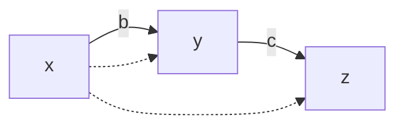

> 图 11.14 基本方程（11.21）～（11.22）的图

**Dr. Ex** ：你说的“ $c$ 有一个因果解释”是什么意思？

**你** ：我的意思是 $y$ 的一个单位改变会带来 $E(Z)$ 的 $c$ 个单位变化。

**Dr. EX** ：“改变”和“带来”这两个词让我感到不舒服，让我们科学地讨论。你的意思是 $E(z \mid y) = cy + a$ ？我能理解这个表达式，因为给定 $y$ 后 $z$ 的条件期望 $E(z \mid y)$ 已经有良好的数学定义，并且我知道如何从数据中估算它。但是“改变”和“带来”对我来说像是某种行话。

**你** ：实际上，我指的是“改变”，而不是“条件期望的增加”。所谓“改变”指的是：如果我们有物理的方法将 $y$ 的值固定为常数 $y_{1}$ ，然后从 $y_{1}$ 到 $y_{2}$ 改变这个常数，那么在 $E(Z)$ 上观察到的改变就是 $c(y_{2} - y_{1})$ 。

**Dr. Ex** ：好吧，我们是不是有点过于抽象了？在我的统计学课上从来没听说过“固定”这个词。

369

**你** ：抱歉，我不知道你有统计学背景。让我重新叙述一下刚才的解释：如果我们有方法进行对于 $y$ 的随机对照实验，那么如果我们将对照组设置为 $y_{1}$ ，实验组设置为 $y_{2}$ ，在 $E(Z)$ 中观察到的差值将是 $E(Z_{2}) - E(Z_{1}) = c(y_{2} - y_{1})$ ，这与 $y_{1}$ 和 $y_{2}$ 选择的值无关 $^{\ominus}$ 。（ $Z_{1}$ 和 $Z_{2}$ 分别是对照组和实验组 $z$ 的测量值。）

**Dr. EX** ：这听起来很接近我的理解。但我对你似乎要迈出的一大步感到担心。你的数据是非实验性的，在你的整个研究中，你没有进行过一次实验。你是在告诉我们，你的 SEM 可以从观察性研究中获取数据，对它进行 LISREL 分析，就能预测随机对照实验的结果吗？你在开玩笑吧！你知道如果可以用 SEM 魔法代替实验研究，将会在全国范围内节省多少钱吗？

**你** ：Dr. EX，这不是魔法，这就是简单的逻辑。我的 LISREL 分析的输入不仅仅是非实验数据。输入包括两个部分：（1）数据；（2）因果假设。我的结论符合逻辑。因果假设在标准实验研究中是不存在的，这也是实验如此昂贵的原因。

**Dr. EX** ：什么样的假设？“因果”？我从未听说过这样陌生的词汇。你能用我们通常表达假设的数学方式来表达它们吗？比如说，以条件联合密度的形式，或者以协方差矩阵的形式？

**你** ：因果假设是另一种类型，它们不能写成密度函数或协方差矩阵的形式，它们被表达在我的因果模型中。

**Dr. EX** ：看看你的模型，方程（11.21）～（11.22）。我没有看到任何新的词汇，我看到的都是方程。

**你** ：Dr. EX，这些不是普通的代数方程，这些是“结构方程”。如果我们正确地阅读，它们传达了一组你熟悉的假定，即关于对总体进行的假设性随机实验结果的假定，我们称之为“因果”或“模型”假定，因为找不到更好的词汇，也可以理解为对各种随机实验下总体行动的假定。

**Dr. EX** ：等一下！现在我开始明白你的因果假定是什么了，但却比以前更加困惑。如果允许在随机实验中对总体行动做出假定，为什么还要费这么大劲进行研究呢？为什么不直接假定在一个 $y$ 被随机化的随机实验中， $E(Z)$ 的观测差值应该是 $c'(y_2 - y_1)$ ，这里 $c'$ 可以随意取一个数字，这样就可以省去几个月痛苦的数据收集和分析。如果一个人相信你的其他未经验证的假定，那么他也应该相信你对于 $E(Z_2) - E(Z_1) = c'(y_2 - y_1)$ 的假定。

370

**你** ：Dr. EX，不是这样的。相比研究的结论 $E(Z_{2})-E(Z_{1}) = 0.78(y_{2}-y_{1})$ ，模型假定要宽泛得多。首先，模型的假定是定性的，而结论是定量的，给出了一个具体的值 $c = 0.78$ 。其次，许多研究人员（包括你，Dr. EX）愿意接受我的假定，而不一定愿意接受我的结论，因为前者符合常识性理解和世界运转的一般理论知识。再次，我的大多数假定不需要 $y$ 的随机实验来检验，这意味着如果随机化 $y$ 的代价高昂，或者不可行，我们仍然可以通过控制其他不那么难对付的变量来检验这些假定。最后，尽管在我的研究中并非如此，但模型假设通常具有一些可以在非实验性研究中进行检验的统计学意义，而且，如果检验结果是成功的（我们称之为“拟合”），它将进一步证实这些假定的有效性。

**Dr. EX** ：这越来越有趣了。让我看看那些“因果”或模型假定，这样我就可以判断它们有多宽泛。

**你** ：这很容易，看一下图 11.14 的模型，其中：

- $z$ ——学生在期末考试中的成绩；
- $y$ ——学生花费在课外作业上的小时数；
- $x$ ——课外作业占期末总成绩的比重（由老师宣布）。

当我把这个模型写在纸上的时候，我想到了两个随机实验，其中一个 $x$ 是随机的（即老师随机分配（期末总成绩）比重），另一个花费在课外作业上的时间（ $y$ ）是随机的。我在思考这些实验时所做的假定是：

1.  ** $y$ ** ： $E(Y_{2}) - E(Y_{1}) = b(x_{2} - x_{1})$ 是线性的和独立取值的，其中 $b$ 是未知量（ $Y_{2}$ 和 $Y_{1}$ 分别是在比重 $x_{2}$ 和 $x_{1}$ 情况下花费在课外作业上的时间）。方程中排斥了 $z$ ，我假设 $z$ 不会影响 $y$ ，因为当 $y$ 确定时， $z$ 还不知道。

2.  ** $z$ ** ： $E(Z_{2}) - E(Z_{1}) = c(y_{2} - y_{1})$ 是线性的，并且排斥了 $x$ ，其中 $c$ 是未知的。换句话说， $x$ 对于 $z$ 没有影响，除非通过 $y$ 。

此外，我还对在非实验条件下支配 $x$ 的不可测因素做了定性假定，假定 $x$ 和 $z$ 没有共同的原因。

**Dr. EX** ：好的，我同意这些假定是宽泛的，比起毫无依据地直接将论文结论 $E(Z_{2}) - E(Z_{1}) = 0.78(y_{2} - y_{1})$ 作为假定更容易让人接受。我有点惊讶的是，这种宽泛的假定能够支持一个大胆的关于课外作业对分数实际影响的实验预测。但我还是不满意你的共同原因假定。在我看来，一个强调课外作业重要性的老师也会是一个鼓励学生并有成效的老师，因此 $e_{2}$ （包括教学质量等因素）应该与 $x$ 相关，这与你的假定相反。

**你** ：Dr. EX，现在你的言谈像一个 SEM 研究人员了。我们不再挑剔这个方法和它的哲学，而是开始讨论实质性的问题，例如，老师的教学效果与课外作业比重无关的假定是否合理。就我个人而言，我见过很棒的老师，他们对课外作业毫不关心，当然相反的也有。

但这不是我论文的主题。我并不是说老师的教学效率与他们如何看重课外作业无关，这个问题可以留给其他研究人员（或者可能已经研究过了？）。我要说明的是：那些愿意接受老师的教学效率与他们如何看重课外作业无关这一假定的人将会发现，有趣的是，这样的假定再加上数据，可以从逻辑上推出结论——每天增加一个课外作业小时可以提高学生分数（平均）0.78 个点。如果允许我们进行随机化作业量（ $y$ ）的对照实验，这一结论可以得到实验验证。

**Dr. EX** ：我很高兴你没有坚持模型假定是真实的，只是陈述它们的合理性，并解释它们的推导结果，我不能反对这样做。但还有一个问题。你说模型没有任何统计学意义，因此不能测试它是否适合数据。你怎么知道的？你不觉得困扰吗？

**你** ：只要查看图并检查缺失的环节就知道了。一个名为 ** $d$ -分离** 的准则（见 11.1.2 节）允许 SEM 的学生浏览图，并确定相应的模型是否存在某些约束来消除变量之间的一些相关性。

> $\ominus$ ：大多数统计结果（尽管不是全部）都是这种性质的。

我们例子中的模型并不蕴含对协方差矩阵的任何约束，因此它可以完全拟合任何数据。我们称这种模型为“饱和”的（5.2 节），一些无法摆脱统计检验传统的 SEM 研究人员认为这是模型的缺陷。恰恰相反，饱和模型意味着研究人员不愿意做出令人难以置信的因果假定，然而他做出不痛不痒的假定又太弱，不足以产生统计上的影响。这种保守的态度应该受到赞扬，而不是谴责。无可否认，如果我的模型不是饱和的，我会很高兴——比如说， $e_1$ 和 $e_2$ 不相关。但事实并非如此，常识告诉我们 $e_1$ 和 $e_2$ 可能是相关的

> $\ominus$ ：数据也显示了这一点。

我试着假设 $\operatorname{cov}(e_1, e_2) = 0$ ，但是与数据拟合得并不好。为了让模型戴上“非饱和”的桂冠，是否要做一些无依据的假定？不！我宁愿做出合理的假定，得出有用的结论，然后把结果和假定一起报告出来。

**Dr. EX** ：但是，如果有另一个饱和模型，基于同样合理的假定，却导致不同的 $c$ 值。你难道不担心一些最初的假定是错误的，因此你的结论 $c = 0.78$ 也是错误的吗？数据中没有东西能帮助你选择一种模型而不是另一种。

**你** ：我也关心此事。事实上，我可以立即列举所有这些相互竞争模型的结构，图 11.15 中的两个模型就是例子，还有更多。（这也可以使用 ** $d$ -分离** 准则来完成。）但请注意，相互竞争模型的存在丝毫没有削弱我之前的观点——“接受模型 $M$ 定性假设的研究人员必须接受结论 $c = 0.78$ 。”这种说法在逻辑上是无懈可击的。此外，可以通过报告每个候选模型的结论以及该模型所依据的假定，进一步完善这一观点。结论的格式读作：

如果你接受假定集合 $A_{1}$ ，那么得到 $c = c_{1}$ 。如果你接受假定集合 $A_{2}$ ，那么得到 $c = c_{2}$ 。等等。


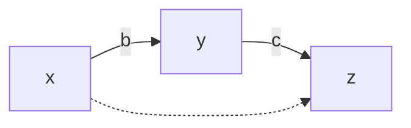


> **图 11.15** 与图 11.14 统计等价的模型

**Dr. EX** ：我明白了。但是，如果我们想要越过这些具体的条件陈述，在各种假定中进行一些选择，有没有 SEM 方法能够帮助我们？在统计学中，我们不习惯面对具有两种不同假定的问题，不管这两个假定多么微弱，都无法接受某些检验。

**你** ：这就是统计数据分析和 SEM 的根本区别。根据定义，统计假设是可以用统计方法检验的。相比之下，SEM 模型依赖于因果假定，而根据定义，这些假定不能进行统计检验。

如果两个（具有不同假设的）竞争模型都是饱和的，那么我们事先就可以知道，报告在某个条件下的结论，除了如上所说的，我们别无选择。然而，如果竞争是在同等合理的假设但统计上截然不同的模型之间进行的，那么我们就面临着模型选择这样一个具有百年历史的古老问题。

在这个问题上，人们提出了各种各样的选择标准，比如用 AIC 进行分析。然而，模型选择的问题现在被赋予了一种新的、具有因果关系的考量——我们的任务不是最大化拟合，或最大化预测能力，而是产生最可靠的因果参数估计，例如 $c$ 。这是一个全新的领域（参见文献：Pearl, 2004）。

**Dr. EX** ：有意思。现在我明白了为什么我的统计学同事们遇到 SEM 方法论就犯糊涂、怀疑，以至于抗拒（例如，Freedman, 1987；Holland, 1988；Wermuth, 1992）。最后一个问题。你在意识到我是一个统计学家之后，才开始谈论随机实验。你如何向一个非统计学家解释你的 SEM 策略？

**你** ：我会用朴素的语言说：“如果我们有物理方法把 $y$ 固定在某个常数 $y_{1}$ 上，并把这个常数从 $y_{1}$ 改变为 $y_{2}$ ，那么 $E(Z)$ 的变化就是 $c(y_{2} - y_{1})$ 。”大多数人理解“固定”的意思，因为这是在决策时经常思考的。例如，一个对于课外作业影响学习效果感兴趣的老师不会考虑随机化（布置）课外作业。随机化仅仅是预测固定效果的间接手段。

实际上，如果与我交谈的人真的很开明（许多统计学家也是如此），我甚至可能会采用反事实的词汇，比如说，如果一个学生花了 $y$ 个小时完成课外作业，在考试中得到了 $z$ 分，那么如若他/她在课外作业上花了 $y + 1$ 个小时，也许会得到 $z + c$ 分。

说实话，这是我在写方程式 $z = cy + e_2$ 时真正想到的， $e_2$ 代表学生的所有其他特征，在我们的模型中没有具体给出变量名，也不受 $y$ 的影响。我甚至没有考虑 $E(Z)$ ，只考虑特定学生的 $z$ 。反事实是我们用来表达科学（因果）关系的最精确的语言工具。但是，当我与统计学家交谈时，我避免提及反事实，因为（这是令人遗憾的）统计学家倾向于怀疑确定性的概念，或者那些不能立即检验的概念，而反事实就是这样的概念（Dawid, 2000; Pearl, 2000）。

**Dr. EX** ：谢谢你在 SEM 的这些方面对我的说明，我没有进一步的问题了。

**你** ：这是我的荣幸。

#### 11.5.4 今天的经济学模型在哪里——与 Heckman 一起追求原因

本书的 5.2 节批评了在过去 30 年中，人们对于计量经济学中结构方程建模的理解有所下降（另见文献（Hoover，2003）中的“失落的原因”），并将这种下降归咎于对符号的草率选择，使得代数方程和结构方程之间的本质区别模糊不清。在一系列文章中（Heckman，2000，2003，2005；Heckman and Vytlacil，2007），James Heckman 已经着手扭转这些看法，重新将因果模型作为经济学研究的中心焦点，并将经济学重新确立为因果分析的活跃前沿。

无论以何种标准衡量，这都不是一项容易的任务。采用相邻学科中出现的概念和技术进步，将等于承认了计量经济学数十年来的忽视。如果不理会这些发展，就必须在计量经济学中找到新的替代者。Heckman 选择了后一种方法，尽管因果模型的当代发展大多数植根于经济学家的思想，诸如 Haavelmo（1943）、Marschak（1950），以及 Strotz 和 Wold（1960）。

Heckman 方案中的一个环节是拒绝 “do-操作” 及其所基于的 “外科手术式” 的语义，因此使经济学家丧失了本书（特别是第 7 章）中有关反事实的结构语义，该语义统一了传统的计量经济学与潜在结果方法。Heckman 拒绝 “外科手术式” 语义的理由总结如下：

> 控制外部（强制）变量的变化是定义非递归模型中因果效应的关键……Pearl 用他丰富多彩的语言，通过“关闭一个方程式”或执行“外科手术式”的操作来定义因果效应。他含蓄地假设，“外科手术式”的操作，或者关闭联立方程组中的一个方程式，就唯一固定了结果变量或内部变量（在我的例子中表示另一个人的消费）。然而，一般来说这是不对的，对一个方程加以约束就是对所有（包括其他方程）的内部变量加以限制。在一个联立方程组中，没有哪个单一的方程可以确定单个的结果变量，关闭一个方程也可能影响系统中其他方程的参数，这违反参数稳定性的要求。（Heckman and Vytlacil，2007）

显然，Heckman 的反对意见与 Cartwright 的相同（11.4.6 节）：

- 理想的“外科手术式”的操作在技术上不可行。
- 经济学系统是非模块化的。

我们已经在前面的四个小节（11.4.3 节～ 11.4.6 节）中驳斥了这些反对意见，读者可以很容易地再次应用这些内容拆解 Heckman 的论点。然而，有必要再次强调，就像 Cartwright 的情况一样，这些反对意见来源于将定义反事实的任务与识别和实际估算的任务混为一谈，这是研究人员之间经常出现的混淆，Heckman（2005）曾经严厉地警告过读者避免这种混淆。

这种混为一谈在 Heckman 的关注中显而易见，他担心“关闭一个方程可能也会影响系统中其他方程的参数”。在物理世界中，依据“外科手术式”的操作有时可能会影响其他方程中的参数。正如我们将看到的，这个问题同样存在于 Heckman 提到的“外部变化”。然而，在这里我们处理的是符号，而不是物理操作。我们的任务是在称为“模型”的符号系统中，为“一个变量对另一个变量的因果影响”给出有意义的数学定义，这使得我们可以随意地操作符号，而忽略这些技术可行性，因此在讨论定义时不需要考虑如何实现。

# 因果效应的新定义：“外部变化”

在缺乏精准语义的情况下，Heckman 和 Vytlacil（HV）建立了一个新的因果效应定义，希望依据“外部变化”而不是关闭方程来摆脱运行过程中发现的缺陷。不幸的是，作为反事实逻辑的基石，新定义中没有给予明确的形式化阐述：它被半形式化地放在脚注（HV，p.77），即使喜欢刨根问底和勤奋的读者也会觉得难以理解。下面是我对 HV 定义的外推，因为它适用于多方程和非线性系统。

给定一个方程组：

$$
Y_i = f_i(Y, X, U), \quad i = 1, 2, \dots, n
$$

其中 $X$ 和 $U$ 分别是观察和未观察的外部变量的集合。 $Y_j$ 对于 $Y_k$ 的因果影响分四步计算：

1. 在 $X$ 中选择一个出现在 $f_j$ 中的成员 $X_t$ 。如果没有，则退出，计算失败。

> ① 即该因果影响无法计算。——译者注

2. 如果 $X_t$ 也出现在其他某个方程中，那么将它从那个方程中移走（例如，如果方程是线性的，那么令 $X_t$ 的系数为 0，或者用一个常数替换 $X_t$ ）。

> ② 还不清楚什么条件下（如果有的话）不准设置 $e = 0$ （在例 11.5.2 中），或者完全忽略 $X$ ，并在第二个方程中加上一个替代变量 $X'$ 。HV 给人的印象是，确定 $e$ 是否可以设置为 0 需要对处理的问题有深刻理解，如果这是他们的意图，那就不必如此大费周章。作者认为，如果这个定义仍然需要对于处理问题有深刻理解，那引进新定义替代本书的定义就没有必要。

3. 求解移走后的方程组的简化形式：

$$
Y_i = g_i(X, U), \quad i = 1, 2, \dots, n \tag{11.23}
$$

4.  $Y_j$ 对于 $Y_k$ 的因果影响由偏导数给出：

$$
\mathrm{d}Y_k / \mathrm{d}Y_j = \mathrm{d}g_k / \mathrm{d}X_t : \mathrm{d}g_j / \mathrm{d}X_t \tag{11.24}
$$

**例 11.5.2** 考虑一个由三个方程组成的方程组：

$$
Y_1 = a Y_2 + c Y_3 + e X + U_1
$$

$$
Y_2 = b Y_1 + X + U_2
$$

$$
Y_3 = d Y_1 + U_3
$$

目标： $Y_2$ 对于 $Y_1$ 的因果效应。

方程组有一个外部变量 $X$ ，它出现在前两个方程中。如果能够令 $e = 0$ ， $X$ 将仅出现在 $Y_2$ 的方程中，然后我们进入“外部变化”程序的第三步，从修改后的既约形式得出：

$$
\mathrm{d}Y_1 / \mathrm{d}X = a / (1 - b a - c d), \quad \mathrm{d}Y_2 / \mathrm{d}X = (1 - c d) / (1 - a b - c d)
$$

因此，计算 $Y_2$ 对于 $Y_1$ 的因果效应得到：

$$
\mathrm{d}Y_1 / \mathrm{d}Y_2 = a / (1 - c d)
$$

相比之下，前面介绍的“外科手术式”的操作过程构建了以下修改后的方程组：

> ③ 根据后门准则，所有指向 $Y_2$ 的路径都被切断，因此有第二个方程。

$$
Y_1 = a Y_2 + c Y_3 + e X + U_1
$$

$$
Y_2 = y_2
$$

$$
Y_3 = d Y_1 + U_3
$$

由此得到 $Y_2$ 对于 $Y_1$ 的因果效应：

$$
\mathrm{d}Y_1 / \mathrm{d}y_2 = a / (1 - c d)
$$

这等同于“外部变化”程序得到的表达式。

**这两个过程很可能总是产生相同的结果，这有助于说明“外部变化”在定义上的有效性和概念上的清晰性。**

#### 11.5.5 外部变化与外科手术

在将“外部变化”的定义与“外科手术式”的定义进行比较时，HV 写道：“在一个相互依赖的非递归的系统中，定义因果关系或确定因果参数并不需要关闭一个等式或修改参数……。更基本的想法是从不同方程中排除不同的外部变量，在做这些操作时，研究人员可以构造需要的因果量。”在这个问题上我和 HV 意见不同。我认为“外科手术式”的定义是更基本的想法、更扎实的理由和更适合决策评估任务。我还注意到，基于排除和外部变化的定义存在以下缺陷：

- 1. 一般来说，“排除”涉及从方程中移走一个变量 $^{①}$ ，相当于“修改参数”。因此，这种对于原有方程组的修改也是“外科手术”的形式，也会受到与“外科手术”同样的批评。虽然我们在前几节反驳了这种批评，但应该注意到，如果这种批评有一定道理的话，那么它对两种方法都同样适用。
- 2. 完全依靠外部变量来揭示内部因果关系的想法，其根源来自有关“识别”的文献（例如，在“工具变量”的研究中），这些变量充当了“自然的实验”。但是，在定义因果效应时，受制于这种想法是没有道理的，因为“因果效应”的意思是新的外部操作所产生的量化效应，不一定是模型中明确显示的效应，也不一定是数据收集阶段的操作产生的效应。此外，每一个因果结构方程模型，就其本质而言，都隐含了通过“外科手术式”的操作模拟这种外部操作的机制。

> - ① 即固定一个变量。——译者注

的确，大多数决策评估任务都与新的外部操作有关，这些操作直接控制了内生变量。例如，制造商在对某一个产品的价格跟踪成本多年之后（即 $price = f(cost)$ ），决定将当前价格提高一倍。这样的决定相当于从现有的模型中移除等式 $price = f(cost)$ （即从有用的数据中获取价格的原来模型），代之一个以新的价格常数。这种变化忠实地模仿了决策评估，试图通过诉诸“外部变量”来绕过它完全是人为的，且对于（模型分析）也几乎没有帮助。

另一个例子，考虑一个已被深入研究的问题（Heckman，1992），即评估终止一个教育项目所产生的影响，该项目根据一系列资格证书来录取学生。而当项目终止时，方程 $admission = f(qualifications)$ 不再成立，但是没有外部变量能够模拟新的条件（即 $admission = 0$ ），除非人们在实际操作中，对方程 $admission = f(qualifications)$ 睁一只眼闭一只眼（或者“忽略”，或者“无视”） $^{②}$ 。

> - ② 根据 HV 的定义，该变量无法移走或忽略，因此无法模拟项目终止时的情况，即无法设置 $admission = 0$ ，但根据本书的相关定义，可以直接令 $admission = 0$ 来模拟项目终止时的操作。——译者注

值得注意的是，Haavelmo（1943）用来定义因果效应的方法在数学上等同于“外科手术式”的定义，而不是外部变化的定义。他不是根据“外科手术式”所要求的那样，用 $Y_{j}=y_{j}$ 置换方程 $Y_{j}=f_{j}(Y,X,U)$ ，而是写作 $Y_{j}=f_{j}(Y,X,U)+X_{j}$ ，其中选择 $X_{j}$ 的值使得 $Y_{j}$ 为常数， $Y_{j}=y_{j}$ 。因此，由于 $X_{j}$ 将 $Y_{j}$ 从 $f_{j}(Y,X,U)$ 的支配中解放出来，Haavelmo 的方法仍然等同于“外科手术式”的定义，而 Heckman 的外部变化方法仍使 $Y_{j}$ 置于 $f_{j}$ 的约束之下。

- 3. 基于外部变化的定义存在一个明显的缺陷，即目标方程可能不包含任何可观测的外部变量。事实上，在许多情况下，系统中能观察到的外部变量集是空的（例如，图 3.5）。此外，基于两个偏导数之比的定义很难推广到具有离散变量的非线性系统。因此，那些虔诚接受 Heckman 定义的人，将无法使用很多无工具变量模型中的识别技术（参见第 3 章和第 4 章），甚至更严重地，无法知道因果效应在此类模型中是否被识别，因为在没有量化定义的情况下，识别问题是无意义的。

幸运的是，由于理解了定义可以基于纯粹的符号操作，我们可以修改 Heckman 的方案，将替代的外部变量添加到要求的方程中。增加的变量可以用类似于方程（11.23）和方程（11.24）中的步骤（假设为连续变量）定义因果效应。这让我们离“外科手术式”的定义更近了，但基本的不同是仍然保留了 $f_{j}(Y, X, U)$ 对于 $Y_{j}$ 的影响。

认识到基于“外部变化”的定义在概念上是有问题的，我们现在探讨它是否能处理非因果的方程组。

### 非因果方程组的歧义性

几位经济学家（Leroy，2002；Neuberg，2003；Heckman and Vytlacil，2007）批评了 do-操作符依赖于因果（或有向）结构方程，在这种方程中，变量和方程之间有一一对应关系。HV 这样批评道：“一般来说，联立方程组中没有一个方程能唯一决定任何一个结果变量”（Heckman and Vytlacil，2007，p.77）。

人们可能会猜测，Heckman 和 Vytlacil 在这里指的是包含无向方程的方程组，即等号不表示非对称关系“被确定”或“被引起”，而是表示对称的代数等式。在计量经济学中，这类非因果方程组通常表示均衡或资源约束，在等式两边施加相等的条件，并不赋予等号左边的变量是“结果”变量的特殊地位。

无向方程的出现使反事实 $Y_{x}$ 的定义变得模糊不清，反事实要求用常数方程 $X = x$ 替代确定 $X$ 的方程。如果 $X$ 出现在几个方程中，或者如果 $X$ 在方程中的位置是任意的，那么这些方程中的每一个都同样可以用 $X = x$ 来代替，这样的话， $Y_{x}$ 的值（即替换后的 $Y$ 的解）将是歧义的 $^{①}$ 。

> - ① 根据反事实计算的定义，只有出现在左边变量是 $X$ 的那个方程被替换为 $X = x$ ，而出现在其他方程右边的 $X$ 不被替换，因为它们表示历史情况（即反事实之前的）。如果方程是无向的，则替换可以任意进行，那么反事实的定义变得模糊而产生歧义。

注意，对称等式在结构上不同于互为因果的有向非递归系统（即图 7.4 那样带反馈的系统），因为对于后者而言，每个变量都是另一个方程的“结果”。然而，对称性却是适用于给动态反馈系统，表示该系统的解。在这样的系统中，方程两边的平衡几乎是在瞬间达到的（Lauritzen and Richardson，2002；Pearl，2003a） $^{②}$ 。

> - ② 这里作者强调了在结构方程中，右边变量的变化经过“因果链条”引起左边变量的变化，而在刻画动态反馈系统的对称方程中，没有这种“时滞”。——译者注

Heckman 和 Vytlacil 给人这样一种印象，方程的歧义是“外科手术式”方法的缺陷，而基于排除的定义中却没有这个问题。事实并非如此。在一个无向方程组中，我们无法知道从哪个方程中排除哪个外部变量才能得到正确的因果关系。

例如，考虑 HV 在第 75 页讨论的两个非递归方程系统：

$$
Y_{1} = a_{1} + c_{12} Y_{2} + b_{11} X_{1} + b_{12} X_{2} + U_{1} \tag{11.25}
$$

$$
Y_{2} = a_{2} + c_{21} Y_{1} + b_{21} X_{1} + b_{22} X_{2} + U_{2} \tag{11.26}
$$

假设我们把 $Y_{1}$ 移到式（11.26）的左边，得到：

$$
Y_{1} = - \left[ a_{2} - Y_{2} + b_{21} X_{1} + b_{22} X_{2} + U_{2} \right] / c_{21} \tag{11.27}
$$

为了定义 $Y_{2}$ 对于 $Y_{1}$ 的因果效应，可以选择从式（11.25）或式（11.27）中排除 $X_{2}$ （这是一个外部变量）。前者的效应是 $c_{12}$ ，后者的效应是 $1 / c_{21}$ 。由此我们看到，对于“外科手术式”的操作中，方程出现的歧义性转化为选择方程和外部变量排除引起的歧义性 $^{③}$ 。

> - ③ 在式（11.25）和式（11.27）中， $Y_{2}$ 是原因变量，因此在固定（即所谓排除）外部变量时， $Y_{2}$ 变动一个单位， $Y_{1}$ 变动 $c_{12}$ 或者 $1 / c_{21}$ 个单位，出现了两个引起歧义的不同的值。——译者注

消除这种歧义性的方法由 Simon（1953）提出，并在 7.2.5 节进行了讨论。

### 总结——重振经济学模型

通过排除和操作外部变量构造来量化因果关系的想法，虽然在识别问题的背景下有很好的理由，但在基于模型的定义方面却没有逻辑基础。另一方面，基于“外科手术式”的定义具有通用性、语义清晰性和计算上的简单性。

那么，计量经济学模型该何去何从呢？对于经济分析和决策评估而言，“外部变量”方法的失败是核心的，还是次要的？

最近，James Heckman 在几乎每一篇文章中都强调了反事实的重要性，并认为它是经济分析的必要组成部分，也是 20 世纪计量经济学成就的标志。例如，HV 文章的第一段写道：“他们（策略比较）要求经济学家构建反事实，预测在一个环境中已经试行，但拟在新环境中应用的策略的效果，同时去预测另一个尚未试行过的新策略的效果。”同样，在他的《社会学方法论》（学术期刊）文章（2005）中，Heckman 指出：“自 Haavelmo 时代（1943 年、1944 年）以来，经济学家已经认识到需要精确的模型来构建反事实……计量经济学框架明确指出了反事实是如何产生的，以及干预是如何施加的……”

然而，尽管在计量经济学分析中宣称了反事实的中心地位，但细心的读者很难在过去 40 年中找出一篇正式定义了反事实或因果效应的计量经济学文章或教科书。需要这样一个程序，它能够在一个适当形式的、充分描述的、具有两个变量 $X$ 和 $Y$ 的经济学模型中计算反事实 $Y(x,u)$ 。由于拒绝了 Haavelmo 基于“外科手术式”的关于 $Y(x,u)$ 的定义，Heckman 承认计量经济学将会进入另一个分裂和模糊的十年，这两个对立的阵营在几乎完全孤立的情况下工作。

在 Neyman-Rubin 模型的潜在结果框架内工作的经济学家把反事实作为原始的、不可观测的变量，完全脱离结构方程模型中的知识表述（例如，Angrist，2004；Imbens，2004）。即便是那些应用倾向得分技术的人，其有效性完全依赖于“可忽略性”或“非混杂性”的因果假设，也很少知道如何利用结构性知识来证实或否定这种假设（参见 11.3.5 节）。在结构方程框架内工作的经济学家（例如，Kennedy，2003；Mittelhammer et al.，2000；Intrinigator et al.，1996）热衷于估计参数，把反事实看作与凡人没有关系的超自然幽灵。他们相信像 Heckman 这样的领导人能够精确地定义他们努力估算的结构参数的策略含义，并将其与潜在结果阵营同事们正在做的事情联系起来 $^{①}$ 。

> ① 值得注意的是，经济学家 Hoover（2008）在《综合评论》文章中的参考书目与经济学家 Angrist（2004）和 Imbens（2004）的几乎完全不同，这种差异在文化上是很深的。

“外科手术式”方法所表达语义和引出的因果理论（第 7 ～ 10 章）提供了这两种对立的、范围狭窄的计量经济学派之间简单而精准的统一，一种方法中的一个定理必然对应另一种方法中的一个定理，反之亦然。经济学家将很好地复活 Haavelmo（1943）、Marschak（1950）、Strotz 和 Wold（1960）的基本思想，并通过本书中提出的图和反事实的逻辑使它们再次焕发活力。

为了完整起见，我在这里明确地重申（使用括号的方式）反事实和结构方程之间的两个基本联系。

1. 反事实的结构定义是

$$
Y_{M}(x, u) = Y_{M_{x}}(u)
$$

读作：对于模型 M 和背景信息 u，反事实条件“如若 X 取值 x”Y 由在子模型 $M_{x}$ 中（即用 $X = x$ 替代确定 X 的方程，所得到的残留图 M）Y 的解给出。

2. 结构方程 $y = f(x, e(u))$ 的经验公式是

$$
Y(x, z, u) = f(x, e(u))
$$

其中 Z 与 X 或 Y 都不相交。

读作：如若 X 和 Z 分别是 x 和 z，那么 Y 就是 $f(x, e(u))$ ，与 z 无关，也与模型中的其他方程无关。

### 11.6 决策与混杂（第 6 章）

#### 11.6.1 辛普森悖论与决策树

### Nimrod Megiddo（IBM Almaden）写道

“我不同意‘因果性’是解决这一悖论的关键（但这也是一个定义问题），也不同意二十年前还没有研究这一问题的工具。根据博弈论，我认为这个问题对于那些喜欢画决策树的人来说并不困难，决策树中的决策节点不同于机会节点。

我画了两棵这样的树（图 11.16a 和图 11.16b），我认为这两棵树可以在不同的情况下说明正确的决定。”


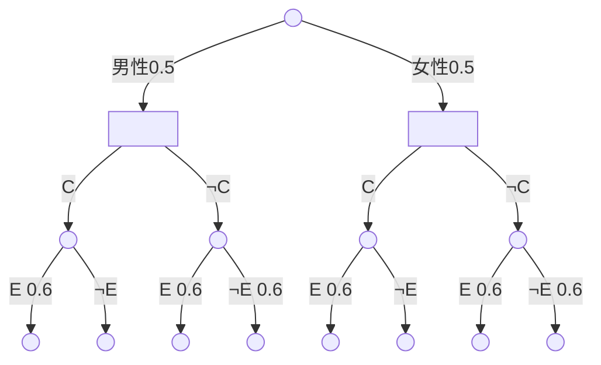

> 图 11.16a 对应于图 11.17a 的决策树。给定男性， $\neg C$ 优于 $C$ （ $0.35 > 0.3$ ）。给定女性，也是 $\neg C$ 更优（ $0.15 > 0.1$ ）。因此无条件地，任何男性的概率为 $p$ ，女性的概率为 $1 - p$ ， $\neg C$ 总是优于 $C$ （ $0.35p + 0.15(1 - p) > 0.3p + 0.1(1 - p)$ ）


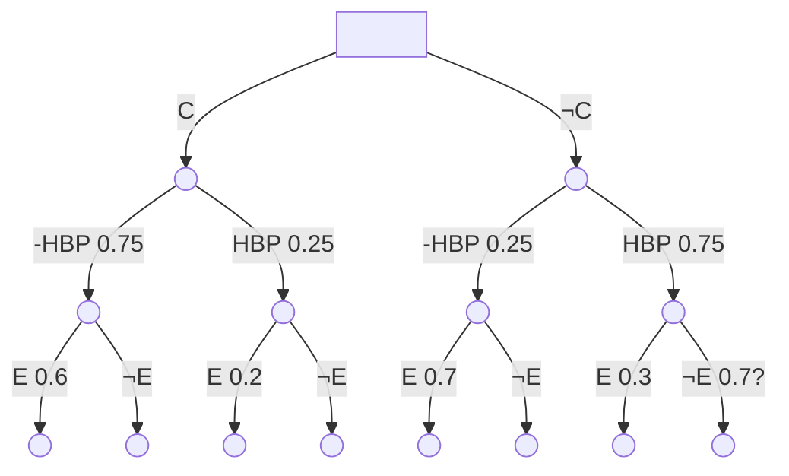

> 图 11.16b 对应于图 11.17b 的决策树。该树可以压缩为图 11.16c 的形式


```mermaid
graph TD
    root[ ] -->|C| C(( ))
    root -->|¬C| NC(( ))
    C -->|E 0.5| CE(( ))
    C -->|¬E 0.5| CNE(( ))
    NC -->|E 0.4| NCE(( ))
    NC -->|¬E 0.6| NCNE(( ))
```

> 图 11.16c 压缩决策树。显然， $C$ 优于 $\neg C$ （因为 $0.5 > 0.4$ ）

### 作者的回答

你为相同的输入表构造了两棵不同的决策树，这意味着构造的关键不在于数据，而在于从数据背后的故事中获得的某些信息。那是什么信息？

决策树分析的文献已经存在至少 50 年，但是据我所知，它并没有很好地解决上面提出的问题：“我们用什么信息构建正确的决策树？”我们同意仅仅给机器人频率表并不足以完成任务。但是，机器人先生（或者统计学家）还需要什么？把问题从 $F =$ “女性”改成 $F =$ “血压”似乎足以说明问题 ②，因为性别和血压在整个过程中扮演不同的角色。我们能够形式化描述这些特征，从而使机器人构造出正确的决策树吗 ③？

我的建议是：给机器人（或者统计学家或者决策树专家）一个二元组 $(T, G)$ ，其中 $T$ 是频率表的集合， $G$ 是因果图。然后，机器人将能够自动建立正确的决策树。这就是我所说的解决悖论取决于对因果关系的考虑。此外，还可以进一步讨论：“如果 $(T, G)$ 中的信息已经足够，为什么不干脆跳过决策树的构造，直接从 $(T, G)$ 中得到正确的答案呢？”这正是本书第 $3 \sim 4$ 章的要点。使用这种关于 $(T, G)$ 的合理而简明的描述，决策分析方面的丰富文献能否更多地从中获益？引入影响图（Howard and Matheson，1981；Pearl，2005）是朝这个方向迈出的一步。而且，正如 4.1.2 节所指出的，第二步可能不会太远。虽然影响图是决策和机会变量选择的参数化形式，但是因果图却不特定于任何这样的选择，它在决策期间，对于观察的决策变量和机会变量的任何选择，包含了参数化所有影响图（和决策树）的信息。

最近，Dawid（2002）开发了一种结合影响图和贝叶斯网络的混合表示，通过给后者的某些变量附加一个表示潜在干预的决策节点（如图 3.2），就能够从观察（被动）模式转换到干预（积极）模式（如式（3.8））。

> ① 参见图 6.2。——译者注  
> ② 作者在这里强调了变量语义的重要性，不同含义的变量具有不同的角色（即性别不会依据服药而变化，但血压可以），因此仅靠频率表不足以识别这些不同。——译者注

#### 11.6.2 时间信息对于决策树是充分的吗

### Megiddo 的回复

> “因果性”这个术语引入了一些不必存在的问题，比如决定论、自由意志、因果关系等。重要的是，在结果确定过程中，变量 $X$ 的值发生在变量 $Y$ 的值之前，而 $Y$ 依赖 $X$ 。你喜欢把这种情况称为因果关系。当然在数学理论中，你可以选择任何你喜欢的名字，但是人们首先会产生一些直觉，这些直觉可能因为名字的表面意义而导致错误。在数学模型之外对这种名字的直观解释往往因其具有现实生活的含义而产生歧义，例如， $X$ 是否确实引起 $Y^{\ominus}$ 。决策树是显示附加时间信息的简单方法，有向图当然可以更简洁地描述这些信息。当你必须精确定义这些图表的含义时，你会选择类似树那样更完整的描述。因此，总而言之，我唯一反对的是使用“因果性”这个词，而且我从未怀疑过时间顺序信息对基于历史数据做出正确决策的重要性。

### 作者的回答

1. 在 21 世纪之前，将某些数学关系归结为诸如“因果关系”的概念确实有些危险，这些概念充满了直觉、神秘和争议。但是现在不再是这样了——神秘消失了，并且这个解释的现实含义并没有错， **X 确实引起 Y** 。

此外，如果除了数学上的正确，人们还有兴趣（用数学定义）说明那些宝贵的直觉，那么就可以更精确地解释这些直觉，甚至可以教给机器人。如此一来，不可避免需要给这些关系贴上名称，当然这就用我们喜欢的名称，即“因果关系”。

2. 输入决策树的信息比时间和相关信息要多得多。例如，图 11.17c 所表达的时间和相关信息与图 11.17a 所表达的信息相同（假设 F 出现在 C 之前），但图 11.17c 却表示了一个不同的决策树（并得出不同的结论），因为 F 和 Y 之间的相互关系在图 11.17a 中是“因果”，而在图 11.17c 中是相关。因此，如果要构造正确的决策树并以正确的概率添加它们的分支，因果考虑必须加上时间顺序和相关信息。


```mermaid
graph TD
    C[治疗] --> E[痊愈 E]
    F[性别] --> C
    F --> E
```


```mermaid
graph TD
    C[治疗] --> E[痊愈 E]
    F[血压] --> C
    F --> E
```


```mermaid
graph TD
    C[治疗] --> E[痊愈 E]
    F[ ] --> C
    F -.-> E
```


```mermaid
graph TD
    C --> E
    F --> E
    C -.-> F
```

> 图 11.17 说明时间信息不充分性的图

作为一个思想实验，想象我们希望编写一个程序，从图 11.17a、图 11.17b 和图 11.17c 中自动构造决策树。程序给出了经验频率表，允许询问 C、E 和 F 之间的时间顺序和相关关系，但不允许询问有关因果的问题。程序能否区分图 11.17a 及图 11.17c？答案是不能。如果忽略了因果关系，并且像你建议的那样，仅仅考虑了时间顺序和相关信息，那么为图 11.17c 构建的决策树将与 F = 性别的决策树相同（即图 11.16a），从而得出错误的结论，即药物（C）对 F = true 和 F = false 的患者都有害。这是不对的，因为正确的答案是，既然药物有益于总的群体（如血压的例子），那么它必须有益于 F = true 或 F = false 的患者（或两者）。决策树掩盖了这些信息，因而产生了错误的结果。

这个错误源于将不正确的概率配置于决策树的分支。例如，树中最左边的分支被赋予概率 $P(E \mid C, \neg F) = 0.6$ ，这是错误的。正确的概率应该是 $P(E \mid do(C), \neg F)$ ，在图 11.17c 的情况下，这个概率不能从图和表中确定。然而我们知道 $P(E \mid do(C)) = 0.5$ 以及 $P(E \mid do(\neg C)) = 0.4$ ，因此式（6.4）或式（6.5）至少有一个不成立。决策分析中的通用技巧是对树的分支指定条件概率 $P(E \mid \text{行动}, Z)$ ，其中 $Z$ 是决策时可用的信息。但是这里需要告诫实际工作者不要盲目地遵循这个惯例，正确的指定当然应该是 $P(E \mid do(\text{行动}), Z)$ ，这可以从实验研究或者定量可识别中的因果图中估算出来。

3. 我不同意为了精确定义因果关系图，必须“引用像树一样更完整的描述”。在 7.1 节中，我们给出了因果图的形式定义是一个函数集合，没有使用任何决策树（至少没有明确地）。因此，一个因果图有它自己的意义，独立于许多可以从图中构造的决策树。打个比方，如果说微分方程（比如质点运动）的意义在于遵循该方程轨迹的集合，那就有点外行了（尽管在数学上并非错误）。从第一原理出发就可以精确定义微分方程中每一项的意义，不需要方程解的任何线索。

#### 11.6.3 Lindley 关于因果性、决策树和贝叶斯主义的理解

### 给作者的问题（来自 Dennis Lindley）

如果你的假定是可行的，即在 $x$ 处控制 $X$ 等于移除 $X$ 的函数，并在其他地方令 $X = x$ ，那么这个假定是有意义的。我现在不明白的是，这和决策树有什么关系。

一个决策节点以决策时已知的数量为条件。一个随机节点包含已知条件下所有相关的不确定量。这时没有什么比联合分布（以及效用考虑）更需要的了。例如，在医学案例中，混杂因子在决定治疗时可能已知或未知，这决定了树的结构。当数据被用来评估树中所需的概率时，因果关系就出现了，这就是 Novick 和我使用可交换性的地方。贝叶斯范式在概率作为信念和概率作为频率之间有明显的区分，将后者称为机会。如果我理解因果关系，那么在这种情况下，我们的概念可以方便地被你的概念取代，而且这种取代是合理的。

### 作者的回答

许多决策分析专家认为不需要因果性，因为“没有什么比联合分布（以及效用考虑）更需要的了”（参见 11.6.2 节的讨论）。他们既是对的也是错的。尽管我们所需要的只是概率分布，但是所需要的分布 $P(y|do(x),\mathrm{see}(z))$ 却具有特殊类型。它们不能从支配数据的联合分布 $P(y,x,z)$ 中推导出来，除非用因果知识补充数据，例如由因果图表提供的知识。

你的下一句话说明了一切：

> “当数据被用来评估树中所需的概率时，因果关系就出现了……”

我认为频率与信念的区别与因果关系的讨论无关。假设辛普森故事中的表格不是频率表，而是关于各种联合事件发生的主观信念 $(C,E,F)$ ， $(C,E,\neg F)$ ，…等。我的主张仍然是，这种信念的总体不足以构建决策树。我们还需要评估对于假设事件“如若 $do(C)$ ，则 $E$ 发生”的信念，而且正如我们已经看到的，单独的时间信息不足以从上述的 384 信念中得出这个评估。因此，这个信念总体不足以构建决策树，我们需要另外的原料，我称之为“ **因果** ”信息，你称之为“ **可交换性** ”——我不会争论命名方法。但是如果我们相信别人提供可靠的信息，也应该尊重他们提供信息时所使用的词汇，并且令谨慎的学者非常失望的是，这个词汇毫无疑问就是 **因果关系** 。

### 给作者的新问题

你关于概率和决策树的观点言之有理，我同意你的观点，我以前没有意识到这一点。谢谢你！

让我换一种说法，看看我们是否意见一致。在处理决策树时，很容易看出需要什么概率来解决问题。如何用数值评估这些数据并不容易。然而，我不明白因果关系是如何完全解决这个问题的。当然，可交换性也未能解决这个问题。

### 作者的回答

很高兴我们已经把问题缩小到简单且具体的问题：

1. 如何评估决策树所需的概率；
2. 这些概率来自哪里；
3. 如何有效地表述这些概率；
4. 或许还有——这些概率是否必须遵守内部一致性的某些规则，特别是当我们构造多个决策树，在决策节点和机会节点的选择上有所不同时。

我之所以欢迎缩小这个问题的范围，是因为这将大大有助于明确区分因果关系和概率关系。总的来说，我发现贝叶斯统计学家是最难信服这种区分必要性的统计学家。为什么？因为传统的统计学家一直在关注那些不能被实际数据证实的假定，而贝叶斯学派在这方面更加宽容，这样做是正确的①。然而，由于允许自行判断信息的合法来源，贝叶斯学派在对待信息特征的动态和来源方面变得不那么谨慎了。你在前面已经描述了贝叶斯学派对条件的习惯性、不加批判的使用，偶尔会诱使粗心的人走进死胡同（例如，Rubin，2009）：

> 由于贝叶斯学派是根据事件发生后的情况调整原来的假设，因此概率关系与因果关系看起来似乎区别不大。但是非贝叶斯学派则需要仔细对待先验假设，因此区分概率关系和因果关系看起来就很重要。——译者注

一个决策节点以决策时已知的数量为条件。一个随机节点包含已知条件下所有相关的不确定量。这时没有什么比联合分布（以及效用考虑）更需要的了。

正如 Newcomb 悖论提示的那样（参见 4.1 节），“一个决策节点以决策时已知的数量为条件”并不完全正确。至少有一些“条件”需要用“做”来代替。如果情况不是这样，那么所有的决策树都会变成笑话——“病人应该避免去看医生，以降低一个人患重病的可能性（Skyrms，1980）；工人不应该急于去工作，以降低睡过头的可能性；学生不应该为考试做准备，以免在学习中落后于别人，等等。简而言之，所有的补救行动都应该禁止，以免增加确实需要采取补救措施的可能性。”（第 4 章）。

但即使在摆脱了这种“条件性”陷阱之后，贝叶斯学派的哲学家仍然认为，决策节点分支和机会节点分支的概率之间没有任何区别。对于贝叶斯学派来说，两种评估都是概率评估。前者是假设实验的内在模拟，而后者是被动观察的内在预设。区别它们没有多大意义，因为贝叶斯学派专注于区别作为信念的概率和作为频率的概率。

---

① 原文注：传统的统计学家一直在关注那些不能被实际数据证实的假定，而贝叶斯学派在这方面更加宽容，这样做是正确的。

这种成见使他们对以下事实熟视无睹，即信念有多种来源，重要的是区别源于观察结果的信念和源于试验结果的信念（Pearl，2001a，“贝叶斯主义和因果关系”）。首先，后者是稳固的，前者不是。也就是说，如果我们关于观察的主观信念是错误的，随着观察次数和数量的增加，错误的影响将在适当的时候被冲刷掉。但实验结果不是这样，不管样本大小，错误的前提会产生永久性偏差。其次，关于实验结果的信念不能用概率演算的语言清楚地表达出来。因此，为了形式化地表达这些信念，并将它们与数据前后一致地结合起来，概率演算必须用因果符号来充实（即图、do(x) 或反事实）。

到目前为止，我已经找到了两个有效的方法来赢得贝叶斯学派的心，一个涉及“简约性”的概念（参见 11.6.2 节中的讨论），另一个是“相合性”的概念。

给定感兴趣的 $n$ 个变量，可以从这些变量中构造大量的决策树，每个决策树都对应这些变量不同的时序选择，以及不同的决策节点和机会节点选择。问题自然而然出现：决策者如何确保所有这些决策树的概率评估都是可重现的？当然，由于人类不能把所有潜在的决策树精确地存储在大脑中，因此必须假定评估可以从决策和机会事件知识的简约表示中推导出来，因果关系可以被看作构造决策树的简约表示之一。

事实上，正如我写给 Megiddo（11.6.2 节）的回复，如果需要指导机器人根据需要构建这样的决策树，那么以现有的知识和信念，我们最好的方法是给机器人提供一对输入 $(G, P)$ ，其中 $G$ 是一个因果图， $P$ 是感兴趣变量上的联合分布（对于贝叶斯学派，这就是主观分布）。在这对输入的帮助下，机器人应该能够“相应地”构造所需的决策树，将变量划分为决策节点和机会节点，并在分支上复现参数。这是贝叶斯学派鉴别因果性的一种方法，同时又不会冒犯传统的立场，即“这不过是联合分布……”

第二种方法是“相合性”，相合性是贝叶斯学派非常得意的东西，因为 DeFinetti、Savage 以及其他人都努力构建有关的定性公理，以防止随心所欲的概率认定，并使信念符合概率计算。

对于从决策节点发出的两个分支，分别有选项 $do(X = x)$ 和 $do(X = x')$ ，而 $P(y|do(x))$ 给出了量化的结果。我们可以请贝叶斯学派的哲学家告诉我们，关于联合概率的认定，比如 $P(x,y)$ ，是否应该以某种方式与基于决策的概率结果 $P(y|do(x))$ 相合。然后进一步询问贝叶斯学派，这些概率是否应该与通常的条件概率 $P(y|x)$ 有任何联系，即（在某决策树中）从一个机会事件 $X = x$ 出发，得到结果 $Y = y$ 的估计概率。

不难说服贝叶斯学派，这两种评估不可能是完全随意的，而是必须遵守某些相合性的限制。例如，对于所有的事件 $x$ 和 $y$ ，都必须服从不等式 $P(y|do(x)) \geqslant P(y, x)^{\ominus}$ 。此外，根据第 3 章的规则，当 $P(y|do(x))$ 是由因果网络中推导出来的，将会自动满足这种相合性约束。这两个方法可以使贝叶斯学派从因果演算中得到数学上的好处，同时保持谨慎和怀疑的态度，正如在犹太法典中所说：

> “从好处中获得理解”。（意译自 “mitarch shelo lishma, ba lishma” ，《塔木德经》，圣歌，50b。）

贝叶斯学派最终会接受因果词汇，对此我深信不疑。

#### 11.6.4 为什么混杂不是一个统计学概念

2001 年 6 月，我收到两份匿名评论，关于我的论文《卫生科学中的因果推断》（Pearl, 2001c）。审稿人提出的问题让我震惊，这让我想起了一些统计学家对于因果关系的陈旧看法，以及仍然要付出的巨大教育努力来改变这些看法。为了对这项努力作出贡献，我把我的答复写在本章中。有关因果关系和统计学区别的相关讨论见 11.1 节。

### 审稿人意见摘录

### 审稿人 1

“统计概念和因果概念之间的对比被夸大了。随机化、工具变量等都有清晰的统计学定义……（这篇论文强调）‘任何系统的因果分析方法都需要新的数学符号。’这是错误的：在医学领域对于因果推断有长期的非形式化传统，然而它却是系统且成功的。”

### 审稿人 2

“这篇论文充斥着许多泛泛的议论，这些议论依赖于区分‘统计’和‘因果’的概念……也包括因果关系（因此，根据本文是非统计的）中的概念，例如混杂，但这个概念在标准的频率派统计学中可以明确找到。统计学家倾向于说，‘当 $U$ 和 $X$ 以及 $U$ 和 $Y$ 都不独立时， $U$ 是处理 $X$ 对于结果 $Y$ 影响的潜在混杂因子，因此为什么混杂不是统计学概念呢？’……如果作者想让我相信这一点，他至少要举出一个例子来说明常规分析是如何失败的。”[^387]

### 作者的回答

审稿人 1 似乎提倡一种对于因果关系非形式的处理方法（不管那是什么意思，它让我想起了在伯努利之前的非正式统计学），因此，他带着与论文基本目标和原则相反的想法来到这个论坛。让历史在我们之间做决定吧。

这篇论文的目标读者是与审稿人 2 持相同意见的人，他们试图调解这篇论文的观点（我承认，有时也是笼统的）与传统统计学至理名言之间的矛盾。对于这篇论文的审稿人，我有以下几点看法。

你质疑我提出的为统计概念和因果概念划分界线的有用性。让我提出例子来证明这种有用性，即“混杂”。你写道“混杂在标准的频率派统计学中可以明确找到。”统计学家倾向于说“当 $U$ 和 $X$ 以及 $U$ 和 $Y$ 都不独立时， $U$ 成为检验处理 $X$ 对结果 $Y$ 影响时的潜在混杂因素，因此为什么混杂不是统计学概念呢？”本书的第 6 章用了很长的篇幅解释为什么这个定义在充分性和必要性检验中都失败了，以及为什么这个定义的所有变形在第一原理下也必然失败。我带来了两个例子说明这一点，在 11.3.3 节中提供了更多的讨论。

考虑一个变量 $U$ ，它同时受到 $X$ 和 $Y$ 的影响，当 $X$ 和 $Y$ 都达到高水平时，例如变成 1。 $U$ 满足你的标准，但是对于检验处理 $X$ 对结果的影响， $U$ 不是一个混杂因子。事实上，在这个分析中，可以放心地忽略 $U$ 。（类似的情况也适用于任何变量 $U$ ，它对 $Y$ 的影响是由 $X$ 传导的，就像我论文图 2 中的 $Z$ 。）

作为第二个例子，考虑一个变量 $U$ ，它位于从 $X$ 到 $Y$ 的“因果路径”上。这个变量也满足你的标准，但它不是一个混杂因子。一代又一代统计学家都被告诫（参见 Cox，1958）不要对这些变量进行校正。有人可能会说定义只是混杂的必要条件，而不是充分条件。但这也是不对的，第 6 章描述了一些例子，在这些例子中，没有任何变量满足你的定义，检验处理 $X$ 对于结果 $Y$ 的影响时仍然可能存在混杂。

我们还可以构造一个例子（图 6.5），其中 $U$ 是一个混杂因子（即必须进行校正以消除影响偏差），而 $U$ 仍然与 $X$ 或 $Y$ 都不相关。

我不是第一个发现混杂和它的各种统计学“定义”不相符的人，从 20 世纪 80 年代中期开始，Miettinen、Cook、Robins、Greenland 就在流行病学中争论这个问题，但毫无结果。研究人员继续将可压缩性等同于无混杂，并继续校正错误的变量（Weinberg，1993）。此外，人们认为任何重要的概念（如随机化、混杂、工具变量）必须有一个统计学的定义，甚至在今天，这个流行的观点在卫生科学中仍然根深蒂固，以至于在我的书出版 15 个月后，拥有最高学历和最纯粹研究目标的人继续在问：“那么，为什么混杂不是一个统计学概念呢？”我相信任何纠正这种传统的尝试，听起来都会是泛泛的，只有实施影响广泛的行动，才能根除关于混杂、统计和因果关系的错误概念。

统计学教育牢牢掌握在与审稿人 1 持相同意见的人手中。像你这样追求彻底理解混杂的人，很少在公共论坛上提出这样的问题，“那么，为什么混杂不是统计学概念呢？”同样的理由也适用于“随机化”和“工具变量”的概念（具有讽刺意味的是，审稿人 1 权威地声称，这些概念“具有明确的统计定义”。我会给他一个二元分布 $f(x, y)$ ，然后问他 $x$ 是否是随机的）。这些概念的任何定义都必须引用因果词汇，单靠分布无法定义，这一点是无法回避的。

这让我再次强调 1.5 节所定义的统计与因果分界线的有用性。那些认识到随机化、混杂、工具变量等概念必须依赖于因果信息的人，在使用这些概念进行研究时，将会谨慎地剥离和说明其背后的因果假设。相比之下，那些忽视因果与统计差异的人（例如，审稿人 1）将不会考虑这样的说明，并且继续对“通常的分析是如何失败的”这类问题故意视而不见。

[^387]: 此处为原文脚注，保留原编号。

### 11.7 反事实的演算

#### 11.7.1 线性系统中的反事实

我们知道，在一般情况下，反事实问题的形式 $P(Y_{x} = y \mid e)$ 可能是（也可能不是）实证可识别的，甚至在实验研究中也是如此。例如，因果关系的概率 $P(Y_{x} = y \mid x', y')$ 一般不能从观察或实验研究中识别（推论 9.2.12）。我们在这里谈论的问题是，线性假定是否会使反事实推断在实证观察上更有把握。答案是肯定的：

**申明 A** ：在线性因果模型中，对于任意证据 $e$ ，任何 $E(Y_{x} \mid e)$ 形式的反事实疑问都是实证可识别的。

**申明 B** ：只要因果效应 $T$ 可以识别 $^{①}$ ，那么 $E(Y_{x} \mid e)$ 也可以识别。

> ① $T$ 的意义见申明 C。——译者注

**申明 C** ： $E(Y_{x} \mid e)$ 表示为

$$
E(Y_{x} \mid e) = E(Y \mid e) + T [ x - E(X \mid e) ] \tag{11.28}
$$

其中 $T$ 是 $X$ 对于 $Y$ 的全（因果）效应系数，即 $^{②}$

> ② 这里假设 $X$ 是二元变量的形式，不是一般（连续变量）的形式。——译者注

$$
T = \mathrm{d} E [ Y_{x} ] / \mathrm{d} x = E(Y \mid do(x + 1)) - E(Y \mid do(x)) \tag{11.29}
$$

申明 A 并不奇怪。它已经由 Balke 和 Pearl（1994b）在一般性意义上建立起来了，其中 $E(Y_{x} \mid e)$ 以协方差矩阵和结构系数的形式给出了明确的表达式，而后者是实证可识别的。

申明 B 说明，在所有模型中，只要因果效应 $E(Y_{x})$ 可识别， $E(Y_{x} \mid e)$ 在观察上也是可识别的。

申明 C 对 $E(Y_{x} \mid e)$ 直观地提供了一个令人信服的解释：给定证据 $e$ ，计算 $E(Y_{x} \mid e)$ （即如若 $X$ 是 $x$ ，而不是当前值的情况下， $Y$ 的期望值），首先计算以证据 $e$ 为条件时， $Y$ 的最佳估计值 $E(Y \mid e)$ ，然后加上一个变化值，这个变化值是将 $X$ 从当前的期望值 $E(X \mid e)$ 转变为假定值 $X = x$ ，所得到的差值再与总效应系数 $T$ 相乘，即 $T [ x - E(X \mid e) ]$ 。

注意，式（11.28）也可以用 $do(x)$ 的符号来写：

$$
E(Y_{x} \mid e) = E(Y \mid e) + E(Y \mid do(x)) - E [ Y \mid do(X = E(X \mid e)) ] \tag{11.30}
$$

### 证明（借助 Ilya Shpitser 的帮助）

不失一般性，假设是一个零均值模型。因为模型是线性的，可以把 $X$ 和 $Y$ 的关系写成：

$$
Y = T X + I + U \tag {11.31}
$$

其中 $T$ 是式（11.29）给出的 $X$ 对于 $Y$ 的总效应， $I$ 表示包含模型中其他的非 $X$ 后代变量的项， $U$ 表示外部变量。

总是有可能将确定 $Y$ 的函数归约到式（11.31）的形式，只需要递归地替换右边的每一以 $X$ 为其祖代的变量 $^{\ominus}$ ，然后将所有的这些 $X$ 的项合并形成 $TX$ 。显然， $T$ 是从 $X$ 到 $Y$ 的路径成本的 Wright 规则总和（Wright，1921）。

从式（11.31）可以得到：

$$
Y_{x} = T x + I + U \tag {11.32}
$$

由于 $I$ 和 $U$ 不受 $X = x$ 的变化影响，并且 $x$ 是常数，因此：

$$
E (Y_{x} \mid e) = T x + E (I + U \mid e) \tag {11.33}
$$

式（11.33）的最后一项，可以通过式（11.31）的两边取期望来估计：

$$
E (I + U \mid e) = E (Y \mid e) - T E (X \mid e) \tag {11.34}
$$

由此代入到式（11.33），得到：

$$
E (Y_{x} \mid e) = T x + E (Y \mid e) - E (X \mid e) \tag {11.35}
$$

这就证明了式（11.28）。

$e$ 的三种特殊情形值得注意：

**例 11.7.1** $e: X = x', Y = y'$ （线性情况下的因果关系等价形式，第 9 章），从式（11.28）可以直接得到：

$$
E \left(Y_{x} \mid Y = y^{\prime}, X = x^{\prime}\right) = y^{\prime} + T \left(x - x^{\prime}\right)
$$

这在直觉上很有说服力， $Y$ 在假设 $X=x$ 下的期望就是当前观测值 $y'$ ，加上由于 $X$ 的变化 $x-x'$ 引起 $Y$ 的预期变化。

**例 11.7.2** $e: X = x'$ （对于处理组的处理效应，8.2.5 节）。

$$
\begin{array}{l} E \left(Y_{x} \mid X = x^{\prime}\right) = E (Y \mid x^{\prime}) + T (x - x^{\prime}) \\ = r x^{\prime} + T \left(x - x^{\prime}\right) \tag {11.36} \\ = r x^{\prime} + E (Y \mid d o (x)) - E (Y \mid d o (x^{\prime})) \\ \end{array}
$$

其中 $r$ 是 $Y$ 关于 $X$ 的回归系数。

**例 11.7.3** $e: Y = y'$ （例如，当前收入 $Y = y'$ ，如若每个月花费 $x$ 小时接受培训，期望的收入水平 $Y$ ）。

$$
\begin{array}{l} E \left(Y_{x} \mid Y = y^{\prime}\right) = y^{\prime} + T [ x - E (X \mid y^{\prime}) ] \tag {11.37} \\ = y^{\prime} + E (Y \mid d o (x)) - E [ Y \mid d o (X = r^{\prime} y^{\prime}) ] \\ \end{array}
$$

其中 $r'$ 是 $X$ 关于 $Y$ 的回归系数。

**例 11.7.4** 考虑 7.2.1 节中的价格需求模型，式（7.9）～式（7.10）：

$$
q = b_{1} p + d_{1} i + u_{1} \tag {11.38}
$$

$$
p = b_{2} q + d_{2} w + u_{2}
$$

我们的反事实问题是：当前的价格是 $P = p_{0}$ ，如若把价格控制在 $P = p_{1}$ ，那么需求 $Q$ 的期望值是什么？

令 $P=X$ 、 $Q=Y$ 、 $e=\{P=p_{0},i,w\}$ 。这个问题就等同于上面的例 11.7.2（对于处理组的处理效应），服从于条件 $i$ 和 $w$ 。由于 $T=b_{1}$ ，可以直接写出：

$$
E (Q_{p_{1}} \mid p_{0}, i, w) = E (Y \mid p_{0}, i, w) + b_{1} (p_{1} - p_{0}) \tag {11.39}
$$

$$
= r_{p} p_{0} + r_{i} i + r_{w} w + b_{1} \left(p_{1} - p_{0}\right)
$$

其中 $r_p$ 、 $r_i$ 、 $r_w$ 分别是 $Q$ 关于 $P$ 、 $i$ 和 $w$ 的回归系数。

式（11.39）替代式（7.17）。注意，价格方程 $p = b_{2}q + d_{2}w + u_{2}$ 中的参数仅仅是通过回归系数出现在式（11.39），因此可以直接用最小二乘法估计，而不需要精确地计算它们。

**注解** ：例 11.7.1 并不奇怪。我们知道，在单调性的假定下，因果关系的概率是实证可识别的。但是例子 11.7.2 和 11.7.3 却引起了以下猜想：

> 在任何常效应模型中，即对于 $u$ ， $Y_{x_{1}}(u)-Y_{x_{2}}(u)$ 是常数，形如 $P(Y_{x}|e)$ 的反事实问题都是实证可识别的。

用这个富有挑战性的问题结束本节是很好的。

#### 11.7.2 反事实的意义

### 给作者的问题

我很难理解反事实到底有什么用。在我看来，它们看起来是在回答错误的问题。在你的书中，对于什么时候人们需要回答反事实问题，至少给出了几个不同的理由，让我分别来讨论这些问题：

**3911\. 法律责任问题。** 从你的书中推断，美国法律体系规定，如果被告造成了原告的不幸，那么他就是有罪的。但在我看来，这项法律显然是有缺陷的。责任应该取决于被告行动的预期结果，而不是实际发生了什么。如果医生给一位严重疾病患者开具药物，该药物能治愈 99.999 99% 的群体，却导致 0.000 01% 的死亡，即使他不幸地看到病人死去，他也不应该为此负责。如果法律是基于反事实的概念推断责任，那么在我看来，这种法律是有严重缺陷的。

**3912\. 决策过程中的背景问题。** 在 7.2.1 节中，你写道：“在这一点上，值得强调的是，计算反事实期望并不是一个学术问题，实际上，它代表了几乎所有决策情况中的典型案例。”我同意背景在决策中很重要，但不同意需要用反事实来回答。

**3913\. 概念定义问题。** 在本书的后半部分，你使用反事实来定义概念，例如“X 的原因”或“Y 的充分必要原因”。当然我能理解，用数学来定义这些概念是很有吸引力的，因为它们在日常语言中经常使用，但我不认为这会有多大帮助。为什么我们需要知道一个特定事件的“原因”？是的，我们对了解事件的“原因”很感兴趣，因为它们可以让我们预测未来，但这又回到了上面第（2）点的问题。

简而言之，我的观点如下：无论是个人、企业、组织还是政府，都经常面临如何行动的决定（这是我们能做的唯一决定）。我们想知道的是，如果我们以特定的方式行动，可能会发生什么。因此我们想知道的是 $P$ （未来 | do（行动），see（背景）），既不想要也不需要反事实的答案。

我的理解在哪里出了问题？

### 作者的回答

**1\. 法律责任问题。** 你的第一个问题怀疑，在确定法律责任时，使用单个事件概率而不是群体事件概率是否明智。假设有一小部分患者对某种药物过敏，但制造商在没有警告可能发生过敏反应的情况下销售该药物。难道我们不应该认为，当一个过敏病人死亡了，有权得到赔偿吗？通常情况下，制药商为那些特殊情况购买保险，而不是在服用药物之前让所有人接受昂贵的测试——这样做经济实惠。医生当然是无罪的，因为他只是遵循了公认的做法。如果有人能够以反事实方式证明，病人如果没有服用这种药物，死亡就不会发生，那么法律规定必须有人为此买单。

**2\. 决策过程中的背景问题。** 你的第二个问题是关于以观察结果为条件的决策。或者，就像你说的：“在决策过程中，需要估计的是 $P$ （未来 | do（行动），see（背景））。”

问题是，为了做出正确的预测，我们需要一个连续的具有时间标记的模型，其中“未来”变量明显不同于“背景”变量。然而，我们通常只给定一个固定的模型，其中“背景”变量被看作“行动”的结果，然后使用表达式 $P(y|do(x),z)$ ，这是不合适的。它表示我们做了 $X = x$ ，然后观察 $Z = z$ ，所得到的 $Y = y$ 的概率，而我们需要的是首先观察 $Z = z$ ，然后做 $X = x$ ，所得到的 $Y = y$ 的概率。反事实提供了表达这样一种概率的方法，写作

$$
P = P(y_x \mid z)
$$

这表示在当前观察 $Z = z$ 的情况下，如若 $X$ 取值 $x$ ， $Y = y$ 的概率。请注意，在固定的模型中，如果 $Z$ 不是 $X$ 的后代变量，则 $P(y_x|z) = P(y|do(x),z)$ 。

举个例子会有启发性。假设一个工程师画了电路图 $M$ ，其中包含一个门的链路 $X \to Y \to Z$ 。在时刻 $t_1$ ，观察到 $Z(t_1)$ ，我们想知道在条件 $Z(t_1)$ 下， $X(t_2)$ 对于 $Y(t_3)$ 的因果效应。当然我们可以借助必要的时间标记，通过 $do$ -算子来做这个练习。如果复制模型 $M$ ，并且对于每一个时间点 $t_i$ ，指定一个模型 $M_i$ ，显示 $X(t_i)$ 、 $Y(t_i)$ 、 $Z(t_i)$ ，以及与先前变量之间的关系，那么计算 $P(Y(t_3) | do(X(t_2), Z(t_1)))$ 。但是使用反事实 $P(Y_x = y | z)$ 的语言，我们可以在一个固定的模型中做得更好，避免了花费时间去描绘一个又一个的各种变化的模型，并且反事实使我们能够利用这种简化的模型描述，这是一项令人钦佩的发明。当然，有人可以争辩说，如果反事实的说法仅仅是一种“速记”方式，为了方便在连续变化的等效模型中作些科学预测，那么它们根本就不需要。这就与科学方法的精神相悖，因为在科学方法中，符号的简明起着至关重要的作用。原则上，乘法在代数中是不需要的，我们可以单独依赖加法，当需要乘法时，可以将一个数与它自己多次相加。但是如果没有乘法，科学就不会走得这么远，反事实也是一样。

**3\. 概念定义问题。** 归根结底，我们想知道“事件起因”的理由，的确是为了能够更好地预测未来，并采取更好的行动。但并不总是事先知道在什么样的未来环境下，我们的知识可以被用来帮助我们做出决策。我们需要知道具体事故起因的理由可能是多方面的：警告公众不要使用类似车辆，改进某些设备的维护程序，计算采取补救行动的成本，在敌方领土上造成类似事故，等等。每一个这样的应用可能需要不同的信息，因此“事件起因”是记录人类经验的有用方法，以便在广泛应用中分享。

#### 11.7.3 反事实的 $d$ -分离

### 给作者的问题

我试图将图 7.3 中的孪生网络方法，推广到涉及两个以上可能世界的反事实情况。  
考虑因果模型 $X \to Y \to Z$ ，并假设希望检测断言

$$
Y_{x} \perp X \mid Y_{z}, Z_{x}, Y \tag {11.40}
$$

在模型中是否真。我会想当然地构建以下的“三世界网络”，如图 11.18 所示。

左边部分对应于一个不施加任何干预的世界，中间部分对应于施加了 $do(X = x)$ 的世界，右边部分施加了 $do(Z = z)$ 。在这个网络中，式（11.40）并不满足 $d-$ 分离，因为从 $Y_{x}$ 到 $X$ 的路径在条件 $Y$ 下是开放的，用这种方式推广孪生世界网络有什么错吗？


```mermaid
graph TD
    Ux -.-> X
    Ux -.-> Xz
    Uz -.-> Z
    Uz -.-> Zx
    Uy -.-> Y
    Uy -.-> Yx
    Uy -.-> Yz
    X --> Z
    Z --> Y
    x --> Zx
    Zx --> Yx
    z --> Yz
```

> 图 11.18 关于式（11.40）的三世界网络

**作者的回答（与 Ilya Shpitser）：**  
你把孪生世界网络推广到两个以上的世界是正确的，结论也是正确的。给定 $Y_{z}$ 、 $Z_{x}$ 、 $Y$ ， $Y_{x}$ 与 $X$ 不是独立的。事实上，最近的一篇论文（Shpitser and Pearl，2007）阐述了多世界中反事实的图表示，并冠以“反事实图”。

---

### 给作者的后续问题

您的回答帮助我理解了孪生网络方法，以及论文《直接效应和间接效应》（Pearl, 2001c）中使用的方法，但这引出了一个新问题：如文献（Pearl, 2001）所述，为什么图 11.19 中 $Y_{xz} \perp Z_{x^*} | W$ 是成立的？如果画一个“三世界网络”，很明显 $Y_{xz}$ 和 $Z_{x^*}$ 之间的路径没有被 $W$ 阻断，而后者位于一个完全不同的世界。


```mermaid
graph TD
    U1 -.-> X
    U1 -.-> Y
    U2 -.-> W
    U2 -.-> Y
    U3 -.-> X
    U3 -.-> W
    U4 -.-> X
    U4 -.-> Z
    X --> Z
    X --> Y
    Z --> Y
    W --> Z
    W --> Y
```

> 图 11.19 本图中，根据等式 $W_{x^{\star}} = W$ ， $Y_{xz} \perp Z_{x^{\star}}$ 成立

---

### 作者的再次回答

在图 11.19 中，独立性实际上是成立的，因为在你提到的“三世界网络”中， $Y_{xz}$ 与 $Z_{x^*}$ 被 $W_{x^*}$ 分离。根据 do-算子的规则 3，用 $W_{x}$ 替换 $W$ 是允许的，由于 $W$ 不是 $X$ 的后代，所以 $W_{x^*} = W$ 。这提出了在推广孪生网络时的一个重要改进：在表面看来不同的反事实变量之间，因果性公理可能要求同等的约束。在应用 $d$ -分离到反事实网络时，需要考虑这些隐含的同等性 $^{\ominus}$ 。Shpitser 和 Pearl（2007）给出了一个描述和处理这些同等性的系统方法。

---

### 11.8 工具变量与不依从性

### 不依从性试验的严格界限

### 给作者的问题

我认为在不完全依从的实验情况下，你改善了 Manski 关于治疗效果的界限。你的方法用到了哪些 Manski 方法没有利用的信息？它背后的直观意义是什么？

### 作者的回答

我们使用了与 Manski 相同的信息和相同的假定，并在 16 维空间中用线性规划方法导出了通过 $U$ （Balke and Pearl，1994a，1995a）的正则划分来定义的严格界限。显然，Manski 要么并不想得到严格的界限，要么没有意识到将 $U$ 划分为等价类的力量。回想一下，在 Frangakis 和 Rubin（2002）的以“主分层”的规则将这种划分推广之前，经济学家并不知道这种划分。

正如我在 8.2.4 节所述，Manski 的界限在某些条件下是严格的，例如，没有反向作用。这意味着只有当群体中存在反向作用时，界限才会变得更窄。如 Pearl（1995b）中讨论的例子，展示了反向作用的数据如何提供足够的信息，使得界限塌缩到某一点。那篇文章还直观地解释了这是如何能够发生的。

值得一提的是，正则划分的概念加上 Bakle 和 Pearl（1994a，1995a，b）发展起来的线性规划方法，已经成为各种应用中强大的分析工具。Tian 和 Pearl（2000）将其应用于因果关系概率估计的界限，Kaufman 等人（2005）和 Cai 等人（2008）将其用于混杂中介存在时，估计直接效应的界限。同样，Imai 等人（2008）将其用于估计自然直接效应和间接效应的界限。通过这种方法得到的封闭形式表达式，能够评估分布中的哪些特征对于缩小界限是至关重要的。

Rubin（2004）通过独立的研究，试图在传统的潜在结果框架内运用正则划分来分析直接效应和间接效应，但是由于缺乏图形和结构化视角，导致结论认为这些效应是“定义不明确的”和“更具欺骗性而不是有益的。”我相信这本书的读者，在根植于结构化的潜在结果分析指导下，会得出更积极的结论（参见 4.5 节和 11.4.2 节）。

### 11.9 更多关于因果关系的概率

回顾八年前《因果论》的第一次出版，我认为第 9 章的结果是反事实分析的成功，驱散了一些研究人员对于反事实的实证内容所表达的所有顾虑和不安（Dawid，2000；Pearl，2000）。它表明，一个量 PN，乍一看似乎是假设的、不明确的、不可测试的，因此不值得科学分析，然而事实上它却是可定义的、可测试的，在某些情况下甚至是可识别的。

此外，在某些数据的组合下，不作任何假定，就能够以概率 1 确定一个重要法律诉求，如“如果原告没有服用药物，就会活下来”，这是真正令人诧异的。

#### 11.9.1 “有罪的概率为 1” 有可能吗

我已经在许多会议和大学的几十次演讲中提出了 9.3.4 节的例子，而式（9.53）的结果 $\mathrm{PN} \geqslant 1$ 总是遭到普遍的怀疑。我们如何从频率数据确定，被告有罪的概率为 1，即如果 $A$ 先生没有服药，他今天肯定还活着。Stephen Fienberg 教授参加了其中的两次讲座，并两次摇着头说：“这不可能是真的。”对我来说，这种反应构成了一个有力的证明，反事实分析可以产生非平凡的结果，因此它是现实的、有意义的和有用的。如果只是空洞的分析就不会引起这样的争议。

导致人们不相信这一结果的原因是这个问题有三点令人困惑：

- 1. 在某些条件下，一个假设的、一般不可测试的量可以用概率 1 来确定。
- 2. 频率表单独而言并不说明药物的真实影响，隐含了群体使用药物时的高度敏感性。
- 3. 基于抽样群体中获得的数据，一个未被测试的个体属性可以被赋值为概率 1。

  **第一个困惑** 对于那些善于使用逻辑和数学的理科学生来说并不奇怪。一旦我们给出了某个量的形式化语义，我们就从本质上定义了它与数据的关系。而且，在某些条件下得到的数据能够使得这个量收缩到一个点，这并不是不可想象的。

这种形式反事实分析的好处可以用一个很简单的例子说明。考虑对于处理组的处理效应 $P(Y_{x'} \mid x)$ （8.2.5 节）。 $P(Y_{x'} \mid x)$ 代表一个已经接受治疗的病人 $X = x$ ，如若他没有接受治疗 $(X = x')$ ，他会存活一段时间 $Y = y$ 的概率。这个反事实的量值看起来无法实际测量，因为我们永远不能回溯历史，对于已经接受治疗的病人拒绝治疗。然而，对于二元变量 $X$ ，可以写为

$$
P \left(y_{x^{\prime}}\right) = P \left(y_{x^{\prime}} \mid x^{\prime}\right) P \left(x^{\prime}\right) + P \left(y_{x^{\prime}} \mid x\right) P (x) \tag {396}
$$

并得到

$$
P \left(y_{x^{\prime}} \mid x\right) = \left[ P \left(y_{x^{\prime}}\right) - P \left(y, x^{\prime}\right) \right] / P (x) = P \left(y \mid x^{\prime}\right) + \left[ P \left(y_{x^{\prime}}\right) - P (y \mid x) \right] / P (x)
$$

换句话说， $P(y_{x^{\prime}}|x)$ 可以还原为实际上可估的量，其中 $P(y_{x^{\prime}}) = P(y|do(x^{\prime}))$ 是实验可估量，其他的是观察可估量。此外，如果数据支持等式 $P(y_{x^{\prime}}) = P(y,x^{\prime})$ ，我们可以肯定，对于那些已经接受治疗的患者，如若不采取这种治疗，存活的概率为零。那些不相信先验反事实分析的人认为，这是计算现实中不存在的量，他们永远不会乐见这样的结果。但是某些（现实中不存在的）量实际上是可定义的，优美的逻辑可以为我们重现历史。

**第二个困惑** 在式（9.54）后面的段落中给出了直观的解释。

**第三个困惑** 让大多数人都难以相信，尤其对于统计学家来说，能够对没有直接测试的特定个体说出任何确定的事是很罕见的。这是由两个因素造成的，首先，统计学家通常处理有限的样本，其样本差异性排除了任何断言的确定性，不仅是关于个体，也关于基本分布的任何性质。然而，这个因素不应该进入我们的讨论，因为我们一直在假定无限的样本。（读者可以想象表 9.2 中的数字代表百万。）第二个因素来源于这样一个事实：即使我们精确地知道一个分布，也不能对于抽取的特定个体属性，给出明确的概率估计。其理由是，我们永远不知道，更不用说测量，所有决定个体行动的解剖学和心理学的变量，而且即使知道，我们也不能够通过现有分布所能提供的大致分类来表示它们。因此，由于这种内在的模糊性，“A 先生可能已经死了”这个句子永远不会被赋予概率 1（或者任何确定的概率）。

Freedman 和 Stark（1999）提出的这一论点与日常陈述概率的方式是不相容的，因为它意味着对于每一个个体的概率表述都必须是一个关于子群体的表述，这个子群体含有所有个体的特征 $^{②}$ 。极端地说，这种限制性的解释将坚持对原告进行详尽无遗的描述，并且在考虑到所有相关细节后，才能将 PN 归结为 0 或 1。不可思议的是，这种解释是当前司法标准的基础。使用“高度盖然性”的说法 $^{①}$ ，立法者允许忽略无法获得数据的属性，并根据获得的可靠数据中最具体的属性建立裁定。在我们的例子中，注意到 A 先生的两个特性：（1）他死了；（2）他选择使用药物。这些属性在界定 PN 时被适当考虑。如果还知道 A 先生的其他属性，并被认为是与此案相关的（例如，他有红色的头发，或者他是左撇子），那么原则上，这些属性也代表了适当的子群体，分析应该限制在这种数据上说明原因。然而，在缺乏这些数据的情况下，而且事先知道永远无法匹配 A 先生所有特殊的属性，立法规定必须根据手头已知的性质来解释 $^{②}$ 。

> - 从公式上看，分子为 0。直观上讲，如果干预 $do(x')$ 的结果与自然的结果（未干预）一样，说明干预不增加原有的结果，因此 $P(y_x \mid x) = 0$ 。——译者注
> - 高度盖然性是司法中采用的标准，对于不同的证据采信证明力较大者。——译者注
> - ② 精细的估计需要全面的和准确的数据，在属性数据缺失或者精度粗糙的情况下，个体的某些属性值具有概率 1 是可能的。如果数据库里的天鹅都是白色的，那么一只具体的天鹅是白色的概率就是 1。——译者注

#### 11.9.2 收紧因果关系的概率界限

Jin Tian（Tian and Pearl，2000）通过系统的工作在几个方面改进了第 9 章的结果。首先，Tian 指出，对于这些结果中的大多数，强外生性假设（即式（9.10））可以用弱外生性假定来代替： $Y_{x} \perp X$ 和 $Y_{x'} \perp X$ 。其次，在不假定单调性的情况下，根据单调性假定（定义 9.2.13）得到的估计下界能够进一步降低。最后，第 9 章推导出的界限是 **紧的** ，也就是说，如果不使用更强的假定，它们就无法得到改进。

特别有趣的是，当来自实验研究和非实验研究的数据都是可用的，并且没有做出其他假定时，所得到的界限如下：

$$
\max \left\{
\begin{array}{c}
0 \\
P(y_{x}) - P(y_{x^{\prime}}) \\
P(y) - P(y_{x^{\prime}}) \\
P(y_{x}) - P(y)
\end{array}
\right\} \leqslant PNS \leqslant \min \left\{
\begin{array}{c}
P(y_{x}) \\
P(y_{x^{\prime}}^{\prime}) \\
P(x, y) + P(x^{\prime}, y^{\prime}) \\
P(y_{x}) - P(y_{x^{\prime}}) + P(x, y^{\prime}) + P(x^{\prime}, y)
\end{array}
\right\} \tag{11.41}
$$

$$
\max \left\{
\frac{0}{P(y) - P(y_{x^{\prime}})}
\right\} \leqslant PN \leqslant \min \left\{
\frac{1}{P(y_{x^{\prime}}^{\prime}) - P(x^{\prime}, y^{\prime})}
\right\} \tag{11.42}
$$

$$
\max \left\{
\frac{0}{P(y_{x}) - P(y)}
\right\} \leqslant PS \leqslant \min \left\{
\frac{1}{P(y_{x}) - P(x, y)}
\right\} \tag{11.43}
$$

值得注意的是，在与药品有关的诉讼中，从实验和观察性研究中获得数据的情况并不少见。前者通常可以在制造商或批准药物销售的机构（例如，FDA）获得，而后者很容易通过对人群的随机调查获得。在这种情况下，流行病学家用来确定法律责任的标准下界——超额风险率（式（9.22）），可以通过式（11.42）的下界得到 **显著改善** 。同样，式（11.42）的上界可以用于减免制药商的法律责任。Cai 和 Kuroki（2006）分析了 PNS、PN 和 PS 的统计特性。

同样值得注意的是，在涉及溯因的情况中，要在事件 $Y = y$ 的几种可能的解释中做出最佳解释，使用 PN 是 **最合理的模式** 。在这样的应用中，式（11.42）给出的界限可以通过因果贝叶斯网络模型计算，其中 $P(y_{x})$ 和 $P(y_{x^{\prime}})$ 可以通过式（9.48）计算。

### 致谢

感谢所有以提出问题这种方式为本章做出贡献的读者，包括：David Bessler、Nimrod Megiddo、David Kenny、Keith A. Markus、Jos Lehmann、Dennis Lindley、Jacques A. Hagenaars、Jonathan Wilson、Stan Mulaik、Bill Shipley、Nozer D. Singpurwalla、Les Hayduk、Erich Battistin、Sampsa Hautaniemi、Melanie Wall、Susan Scott、Patrik Hoyer、Joseph Halpern、Phil Dawid、Sander Greenland、Arvid Sjolander、Eliezer S. Yudkowsky、UCLA CS262Z 的学生（因果性讨论班，2006 年春季），以及 UCLA 流行病学 EPIDEM 200C 班级的学生。

同样感谢第 1 版的所有审稿人和编辑。在他们协助下，这些有关的评论引起了读者的注意。他们包括：

- _Choice_（Byerly, 2000）
- _Structural Equation Modeling_（Shipley, 2000a）
- _Chance_（McDonald, 2001）
- _Technometrics_（Zelterman, 2001）
- _Mathematical Reviews_（Lawry, 2001）
- _Politische Vierteljahrsschrlft_（Didelez and Pigeot, 2001）
- _Technological Forecasting & Social Change_（Payson, 2001）
- _British Journal for the Philosophy of Science_（Gillies, 2001）
- _Human Biology_（Chakraborty, 2001）
- _The Philosophical Review_（Hitchcock, 2001）
- _Intelligence_（O'Rourke, 2001）
- _Journal of Marketing Research_（Rigdon, 2002）
- _Tijdschrlft Voor_（Decock, 2002）
- _Psychometrika_（McDonald, 2002b）
- _International Statistical Review_（Lindley, 2002）
- _Journal of Economic Methodology_（Leroy, 2002）
- _Statistics in Medicine_（Didelez, 2002）
- _Journal of Economic Literature_（Swanson, 2002）
- _Journal of Mathematical Psychology_（Butler, 2002）
- _IIE Transactions_（Gursoy, 2002）
- _Royal Economic Society_（Hoover, 2003）
- _Econometric Theory_（Neuberg, 2003）
- _Economica_（Abbring, 2003）
- _Economics and Philosophy_（Woodward, 2003）
- _Sociological Methods and Research_（Morgan, 2004）
- _Review of Social Economy_（Boumans, 2004）
- _Journal of the American Statistical Association_（Hadlock, 2005）
- _Artificial Intelligence_（Kyburg, 2005）

感谢 UCLA 的因果论博客（http://www.mii.ucla.edu/causality/）的各位撰稿人，以及博主 William Hsu。

特别感谢 **Dennis Lindley** ，他不辞劳苦地从第一原理出发研究我的想法，并让我相信那些以统计学为基础的读者会从这本书中受益。很幸运我们之间有过交集，我有幸认识了一位聪慧、求知并且正直的真正绅士。

如果没有 **Jin Tian** 、Avin Chen、Carlo Brito、Blai Bonet、Mark Hopkins、Ilya Shpitser、Azaria Paz、Manabu Kuroki、Zhihong Cai、Kaoru Mulvihill，以及加州大学洛杉矶分校认知系统实验室的所有成员的支持和洞察力，本章将不可能完成。在过去的六年里，他们继续探索因果关系的绿色田园，而我则被召唤去改造世界，这个世界曾经夺去了我儿子 Daniel 的生命（2002 年在巴基斯坦卡拉奇被极端分子谋杀）。这些年来，我已经确信，理性和启蒙的力量会战胜狂热和残暴。

最后，我把这个版本献给我的妻子 **Ruth** ，感谢她在我们磨难时刻的坚强、爱和开导，同时献给我的女儿们 **Tamara** 和 **Michelle** ，还有我的外孙们 **Leora** 、 **Torri** 、 **Adam** 、 **Ari** 和 **Evan** ，感谢他们陪伴我一起度过这段人生旅程，并让这段旅程富有意义和目标。
