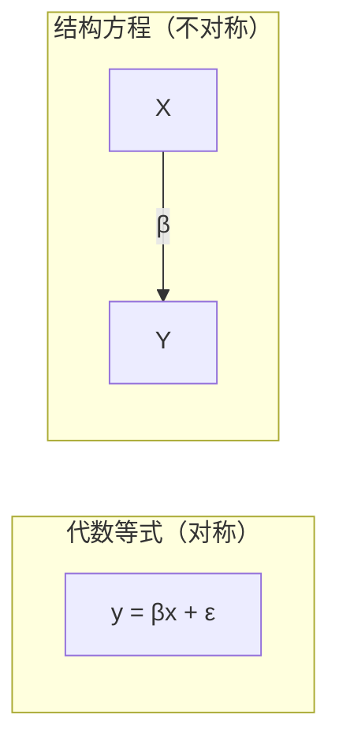
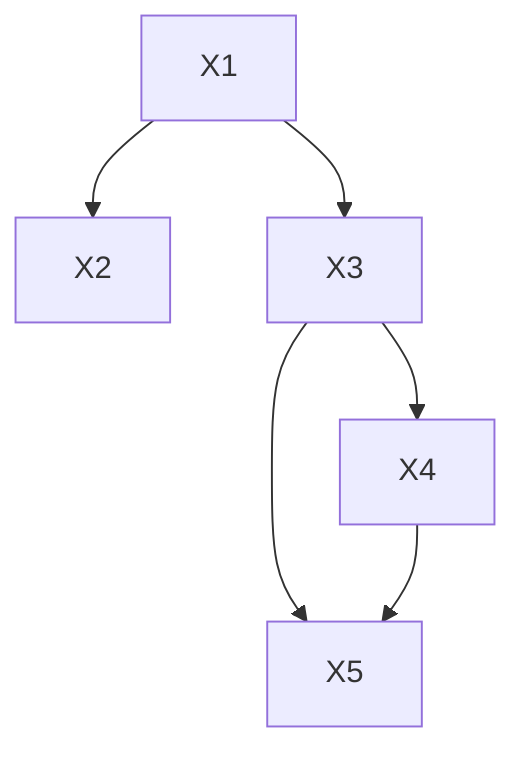
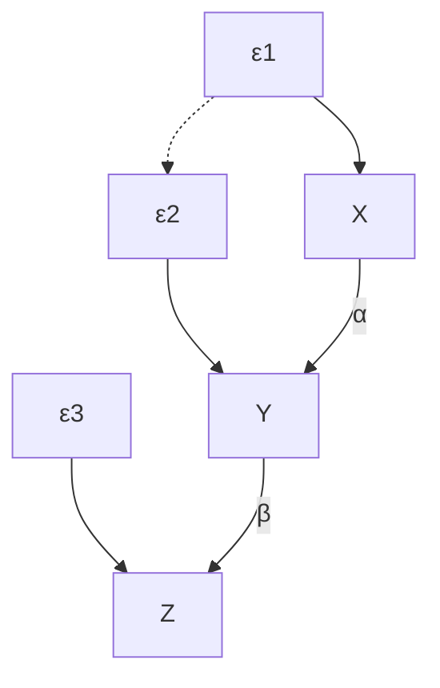
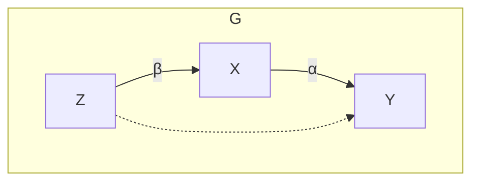
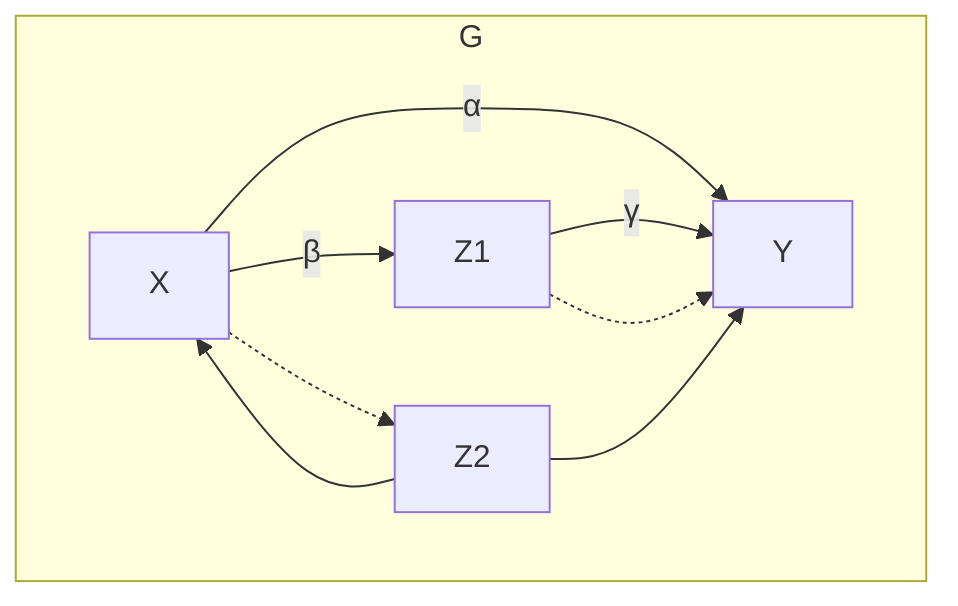
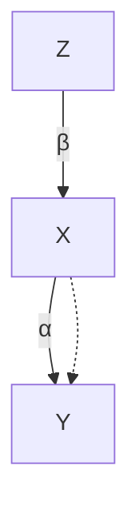
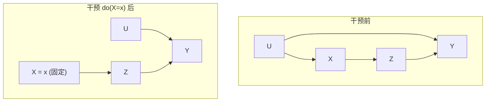

# 第5章 社会学和经济学中的因果关系与结构模型 —— 系统学习与参考材料

---

## 一、章节概览与历史背景

### 1.1 核心问题意识

本章致力于**恢复结构方程模型（SEM）的因果解释**，解决一个科学史上的奇特悖论：

> **"因果在寻找一种语言，与此同时，说这种语言的人在寻找它的意义。"**

自20世纪50年代以来，SEM在经济学和社会科学中占主导地位，但其因果实质逐渐被遗忘。经济学家将结构方程视为密度函数的简洁描述，社会科学家将其视为协方差矩阵的概括。本章的目标是通过图模型和干预逻辑，重新明晰SEM的因果解释。

### 1.2 SEM意义模糊化的历史原因

作者（Pearl）分析了SEM因果意义消失的两个主要原因：

1. **实践者回避无法直接检验的因果假定**：为获得统计学家认可，SEM实践者试图隐藏因果假定。
2. **代数语言缺乏表达因果不对称性的符号**：等式符号 $=$ 被错误地理解为代数等式，而非赋值符号 $:=$ 。先驱者未提出专门符号来表示"X导致Y"的不对称关系。

### 1.3 图作为数学语言

图方法的关键突破在于：**图不仅仅是启发式助记符，而是一种基本的数学符号系统**，能够表达标准代数方程和概率微积分难以表达的概念和关系。

---

## 二、预备知识与基本符号（5.2.1节前部）

### 2.1 结构方程的基本形式

**非线性、非参数形式**（一般形式）：

$$
x_i = f_i(pa_i, \varepsilon_i), \quad i = 1, \dots, n \tag{5.1}
$$

其中 $pa_i$（父节点）表示被判断为 $X_i$ 的直接原因的变量集合，$\varepsilon_i$ 表示遗漏因子带来的误差。

**标准线性形式**：

$$
x_i = \sum_{k \neq i} \alpha_{ik} x_k + \varepsilon_i, \quad i = 1, \dots, n \tag{5.2}
$$

其中 $pa_i$ 对应于等式右边非零系数的变量。

### 2.2 核心定义

| 术语 | 定义 |
|------|------|
| **因果模型** | 每个方程表示选择变量 $X_i$ 的值（不仅仅是概率）的过程 |
| **因果图** | 从每个 $pa_i$ 中的节点到 $X_i$ 画箭头得到的图 $G$；可含双向弧表示相关的误差变量 |
| **马尔可夫模型** | 图无有向环，且 $\varepsilon_i$ 相互独立（无双向弧） |
| **半马尔可夫模型** | 图无环，但包含相关的误差变量（有双向弧） |

> **关键区别**：统计图模型中，节点间无连接代表**条件独立性**；因果图中，无连接代表**无因果关系**，此时分布中可能存在也可能不存在条件独立性。

### 2.3 多元正态分布下的统计量

在线性SEM的常见假设（$\varepsilon_i$ 多元正态）下：

- **偏相关系数** $\rho_{XY \cdot Z}$：当且仅当 $(X \perp\!\!\!\perp Y \mid Z)$ 时为零
- **偏回归系数**：

$$
r_{YX \cdot Z} = \rho_{YX \cdot Z} \frac{\sigma_{Y \cdot Z}}{\sigma_{X \cdot Z}}
$$

等于 $Y$ 对 $X$ 和 $Z$ 的回归方程中 $X$ 的系数：

$$
y = a x + b_1 z_1 + \dots + b_k z_k
$$

中 $a = r_{YX \cdot Z_1 Z_2 \dots Z_k}$。

---

## 三、图与模型检验（5.2节）

### 3.1 定理5.2.1 — d-分离与条件独立

> **定理5.2.1（Verma and Pearl, 1988; Geiger et al., 1990）**
>
> 如果在有向无环图（DAG）$G$ 中节点集合 $X$ 和 $Y$ 被 $Z$ **d-分离**，那么 $X$ 和 $Y$ 对于 $Z$ 是条件独立的。
>
> 相反地，如果在DAG $G$ 中 $X$ 和 $Y$ 不被 $Z$ d-分离，那么在几乎所有基于 $G$ 构造的马尔可夫模型中，$X$ 和 $Y$ 在条件 $Z$ 下是相关的。

**推论5.2.2**：在任何基于DAG $G$ 构造的马尔可夫模型中，当 $Z$ 在 $G$ 中将 $X$ 和 $Y$ d-分离时，无论模型参数如何，偏相关 $\rho_{XY \cdot Z}$ 都会消失。

### 3.2 定理5.2.3 — 广义线性模型中的d-分离

> **定理5.2.3（广义线性模型中的d-分离）**
>
> 对于任何可能包括**环**和**双向弧**的线性模型，如果变量集合 $Z$ 在 $D$ 中将 $X$ 和 $Y$ **d-分离**，那么偏相关 $\rho_{XY \cdot Z}$ 将消失。（每个双向弧 $i \leftrightarrow j$ 解释为存在潜在父节点 $L$，满足 $i \leftarrow L \rightarrow j$。）

**意义**：该定理给出了一个简单的模型检验方法——直接检验模型中存在的每个零偏相关，而不需通过最大似然估计和全局拟合评分。

### 3.3 定义5.2.4 — 基集合

> **定义5.2.4（基集合）**
>
> 设 $S$ 为一组偏相关集合，一个**基集合** $B$ 是 $S$ 中的一组零偏相关集合，其中 $B$ 蕴含了（使用概率论法则）$S$ 中每个元素为零，且 $B$ 的任何子集都不能保持这种蕴含。

对于DAG中零偏相关，基集合的一个自然选择为：

$$
B = \{\rho_{ij \cdot pa_i} = 0 \mid i > j\}
$$

其中 $i$ 遍历所有节点，$j$ 遍历 $i$ 的所有父节点。这反映了**"父代筛选"**特性（定理1.2.7）。

### 3.4 定理5.2.5 — 图基集合

> **定理5.2.5（图基集合）**
>
> 设 $(i, j)$ 是DAG $D$ 中不相邻的一对节点，$Z_{ij}$ 为任何比 $j$ 更接近 $i$ 的一组节点，且满足 $Z_{ij}$ d-分离 $i$ 和 $j$。由每个这样的非相邻对组成的零偏相关系数：
>
> $$B = \{\rho_{ij \cdot Z_{ij}} = 0 \mid i > j\}$$
>
> 构成了 $D$ 中所有零偏相关的基集合。

**实例**：对于下图模型：

基集合 $B_1$（利用父节点集合）：
$$\{\rho_{32 \cdot 1}=0, \rho_{41 \cdot 3}=0, \rho_{42 \cdot 3}=0, \rho_{51 \cdot 43}=0, \rho_{52 \cdot 43}=0\}$$

基集合 $B_2$（采用更小的分离集）：
$$\{\rho_{32 \cdot 1}=0, \rho_{41 \cdot 3}=0, \rho_{42 \cdot 1}=0, \rho_{51 \cdot 3}=0, \rho_{52 \cdot 1}=0\}$$

> **重要结论**：基集合中每个元素对应图中**缺失的箭头**。验证一个DAG所需的检验数量等于它所缺失的箭头数量。**图越稀疏，需要的检验越多**。

### 3.5 局部检验 vs 全局检验（5.2.2节）

**传统方法的两个缺陷**：

| 缺陷 | 说明 |
|------|------|
| 缺陷一 | 若参数不可识别，无法获得稳定估计，必须放弃检验 |
| 缺陷二 | 模型未通过检验时，对哪些假设是错误的得到的信息很少 |

**例**：下图中参数 $\alpha$ 不可识别（因为 $\operatorname{cov}(\varepsilon_1, \varepsilon_2)$ 未知），但模型仍可检验（需满足 $\rho_{XZ} = \rho_{XY}\rho_{YZ}$）。

> **图5.2** 包含不可识别参数（$\alpha$）的可检验模型

**局部检验策略**：逐一检验模型中隐含的限制条件（如 $\rho_{XW \cdot Z} = 0$），相比全局检验更可靠——涉及自由度更少，不受不相关观测错误影响。

### 3.6 模型等价性（5.2.3节）

> **定理5.2.6**
>
> 当且仅当两个马尔可夫线性正态模型包含**相同的零偏相关集**时，这两个模型是协方差等价的。此外，当且仅当这两个模型所对应的图具有**相同的边集**和**相同的v-结构集**时，这两个模型是协方差等价的。

**v-结构（v-structure）**：两个尾部节点没有连接的汇聚箭头（$X \rightarrow Z \leftarrow Y$ 且 $X$ 与 $Y$ 不相邻）。

**边反转规则**：当且仅当 $X$ 的所有父节点都是 $Y$ 的父节点时，$X \rightarrow Y$ 可替换为 $X \leftarrow Y$（不改变v-结构集）。

**半马尔可夫模型中的边替换规则**：

- **规则1**：只有当 $X$ 的每个邻居节点或父节点都与 $Y$ **不可分离**时，$X \to Y$ 才可以与 $X \leftrightarrow Y$ 互换。
- **规则2**：只有当 $Y$ 的每个邻居节点或父节点（不包括 $X$）都与 $X$ **不可分离**，且 $X$ 的每个邻居节点或父节点都与 $Y$ **不可分离**时，$X \rightarrow Y$ 才能反转为 $X \leftarrow Y$。

**方法论意义**：我们不是检验单个模型，而是检验一类**观测等价的模型**。等价类可以从图中构造出来。

> **重要观点**：社会科学家不需要完全放弃SEM，他们只需放弃"SEM是检验因果模型的方法"这一观念。SEM是检验构成因果模型**前提的极小部分**的方法，在发现该部分与数据相容的情况下，阐明这些前提和数据的量化结果。

---

## 四、图与可识别性（5.3节）

### 4.1 定理5.3.1 — 直接效应的单门准则

> **定理5.3.1（直接效应的单门准则）**
>
> 令 $G$ 为任意路径图，其中 $\alpha$ 为边 $X \to Y$ 的路径系数，设 $G_{\alpha}$ 为从 $G$ 中删除 $X \to Y$ 后得到的路径图。如果存在一组变量 $Z$，满足：
> - (i) $Z$ 不包含 $Y$ 的后代节点
> - (ii) $Z$ 在 $G_{\alpha}$ 中将 $X$ 与 $Y$ d-分离
>
> 则系数 $\alpha$ 是可识别的，且 $\alpha = r_{YX \cdot Z}$。反之，如果 $Z$ 不满足这些条件，那么 $r_{YX \cdot Z}$ 不是 $\alpha$ 的一致性估计。

**原理**：回归系数 $r_{YX} = \alpha + I_{YX}$，其中 $I_{YX}$ 是由除 $X \to Y$ 之外的其他连接 $X$ 和 $Y$ 的路径计算的。如果在 $G_{\alpha}$ 中 $Z$ d-分离 $X$ 与 $Y$，则 $I_{YX \cdot Z} = 0$，从而 $\alpha = r_{YX \cdot Z}$。

**实例（图5.7）**：

在 $G_{\alpha}$（删除 $X \to Y$）中，$X$ 与 $Y$ 被 $Z$ d-分离（$Z$ 阻断了唯一的路径 $X \leftarrow Z \leftrightarrow Y$），因此：
$$\alpha = r_{YX \cdot Z}, \quad \beta = r_{XZ}$$

### 4.2 定理5.3.2 — 后门准则（总效应识别）

> **定理5.3.2（后门准则）**
>
> 对于因果图 $G$ 中的任意两个变量 $X$ 和 $Y$，如果存在一组观测变量 $Z$：
> 1. $Z$ 中没有成员是 $X$ 的后代节点
> 2. 从 $G$ 中删除所有从 $X$ 引出的箭头得到子图 $G_X$，在 $G_X$ 中 $Z$ d-分离 $X$ 与 $Y$
>
> 那么，$X$ 对 $Y$ 的**总效应**是可识别的，且为 $r_{YX \cdot Z}$。

**实例（图5.8）**：

- $\alpha$ **不可识别**（单门准则失效：没有任何 $Z$ 能在 $G_\alpha$ 中d-分离 $X$ 和 $Y$）
- 但**总效应** $\alpha + \beta\gamma$ **可识别**：后门路径 $X \leftarrow Z_2 \rightarrow Y$ 和 $X \leftrightarrow Z_2 \rightarrow Y$ 被 $Z_2$ 阻断，因此：

$$\alpha + \beta\gamma = r_{YX \cdot Z_2}$$

### 4.3 工具变量公式（图5.9）

$Z$ 对 $Y$ 的效应 $\alpha\beta = r_{YZ}$，$Z$ 对 $X$ 的效应 $\beta = r_{XZ}$，因此：

$$\alpha = \frac{r_{YZ}}{r_{XZ}}$$

这就是经典的**工具变量公式**（Bowden and Turkington, 1984）。

### 4.4 识别系数的完整过程

| 步骤 | 操作 |
|------|------|
| **步骤1** | 使用后门准则和定理5.3.1，寻找每对变量之间可识别的因果效应 |
| **步骤2** | 将已识别效应所涉及的路径系数保存至"桶"中 |
| **步骤3** | 标记：若桶只含一个未标记系数，标记为**可识别(I)**；若桶含多个系数但仅一个未标记，也标记为**I** |
| **步骤3\*** | 若存在 $k$ 个非冗余桶最多含 $k$ 个未标记系数，则标记这些系数 |
| **步骤4** | 重复直至无新标记出现 |
| **步骤5** | 列出所有标记的系数 |

### 4.5 参数识别与非参数识别的对比（5.3.2-5.3.3节）

**关键区别**：非参数模型中，识别的目标不是函数形式本身，而是**干预问题的答案**。

**示例**：考虑模型 $M$：

$$
x = u + \varepsilon_1,\quad z = \alpha x + \varepsilon_2,\quad y = \beta z + \gamma u + \varepsilon_3
$$

与协方差等价的模型 $M'$：

$$
x = \varepsilon_1,\quad z = \alpha' x + \varepsilon_2,\quad y = \beta' z + \delta x + \varepsilon_3
$$

- 两个模型对观测数据产生相同的协方差矩阵
- 但对干预的预测不同：
  - 模型 $M$：$E[Y \mid do(X = x)] = \beta\alpha x$
  - 模型 $M'$：$E[Y \mid do(X = x)] = (\beta'\alpha' + \delta)x$

**核心洞察**：结构方程区别于普通数学方程的基本特征是——**结构方程代表的不是一组方程，而是多组方程**，每一组对应原始模型中方程组的某个子集，代表在给定干预下某种假设的物理现实。干预会"擦除"被干预变量的方程并用常数替代。

---

## 五、概念基础（5.4节）

### 5.1 结构方程的操作定义

> **定义5.4.1（结构方程）**
>
> 如果将一个方程 $y = \beta x + \varepsilon$ 理解为：在一个理想的实验中，控制变量 $X$ 等于 $x$，其他变量 $Z$（不包括 $X$ 或 $Y$）等于 $z$，$Y$ 的值 $y$ 由 $\beta x + \varepsilon$ 给出，其中 $\varepsilon$ 不是关于 $x$ 和 $z$ 的函数，那么这个方程是**结构化的**。

**核心不对称性**：等式符号在观测时是对称的（观察到 $Y=0$ 蕴含 $\beta x = -\varepsilon$），但在干预时是不对称的（将 $Y$ 设为零不能告诉我们 $x$ 和 $\varepsilon$ 的关系）。

**最强经验结论**：方程右边排除其他变量，明确 $X$ 是 $Y$ 的唯一直接原因。转化为可检验的不变性声明：

$$
P(y \mid do(x), do(z)) = P(y \mid do(x)) \tag{5.23}
$$

该声明对所有与 $\{X \cup Y\}$ 不相交的集合 $Z$ 成立。

因果图 $G$ 中的两个核心假设：
1. **缺失的箭头**（$X$ 和 $Y$ 之间）：干预固定 $Y$ 的父节点时，$X$ 对 $Y$ 无因果效应
2. **缺失的双向弧**（$X$ 和 $Y$ 之间）：直接影响 $X$ 的遗漏因子与直接影响 $Y$ 的遗漏因子不相关

### 5.2 结构参数的操作定义

$$
\beta = \frac{\partial}{\partial x} E[Y \mid do(x)] \tag{5.24}
$$

即**实验研究中**，当外部控制将 $X$ 固定为 $x$ 时，$Y$ 对 $x$ 的期望变化率。

> 重要：$\beta$ 与回归系数 $r_{YX}$ **无关**，与条件期望 $E(Y \mid x)$ **无关**。无论 $\varepsilon$ 和 $X$ 在非实验研究中是否相关，此解释均成立。

### 5.3 误差项的操作定义

$$
\varepsilon = y - E[Y \mid do(x)] \tag{5.25}
$$

$\varepsilon$ 测量的是 $Y$ 与**受控期望** $E[Y \mid do(x)]$ 的偏差，而非与**条件期望** $E[Y \mid x]$ 的偏差。

误差之间的相关性：

$$
E[\varepsilon_Y \varepsilon_X] = E[YX \mid do(pa_Y, pa_X)] - E[Y \mid do(pa_Y)] E[X \mid do(pa_X)] \tag{5.26}
$$

> **关于遗漏因子的说明**：在构建因果模型时，基于遗漏因子的**定性结构知识**比操作定义更有价值。默认应假定双向弧存在于任意两节点之间，只有在理由充分时才删除。

### 5.4 效应分解（5.4.2节）

> **定义5.4.2（总效应）**
>
> $X$ 对 $Y$ 的总效应由 $P(y \mid do(x))$ 给出。

> **定义5.4.3（直接效应）**
>
> $X$ 对 $Y$ 的直接效应由 $P(y \mid do(x), do(s_{XY}))$ 给出，其中 $s_{XY}$ 是系统中除 $X$ 和 $Y$ 之外所有观测变量的集合。

**与传统定义的三个重要区别**：

| 方面 | 传统定义 | 操作定义 |
|------|----------|----------|
| 中间变量处理 | 统计校正（"控制"） | 物理干预保持不变 |
| 控制范围 | 仅中间变量 | 系统中所有变量（$X,Y$除外） |
| 总效应计算 | 路径系数矩阵的幂级数 | 干预实验结果（在反馈模型中更正确） |

> **反馈模型的例子**：已知方程组 $\{y = \beta x + \varepsilon, x = \alpha y + \delta\}$，$X$ 对 $Y$ 的总效应为 $\beta$（而非 $\beta(1-\alpha\beta)^{-1}$）。

### 5.5 外生性（5.4.3节）

#### 定义5.4.4 — 外生性（超外生性）

> $X$ 是关于 $(Y, \lambda, T)$ **外生的**，如果干预后分布的参数 $\lambda$ 在条件分布 $P(y \mid x)$ 下是可识别的。即对任意两个满足理论 $T$ 的模型 $M_1$ 和 $M_2$：
>
> $$P_{M_1}(y \mid x) = P_{M_2}(y \mid x) \Rightarrow \lambda[P_{M_1}(y \mid do(x))] = \lambda[P_{M_2}(y \mid do(x))] \tag{5.28}$$

**特例 — 无混杂条件**：当 $\lambda$ 构成完整干预后分布时：

$$P(y \mid do(x)) = P(y \mid x) \tag{5.30}$$

**图模型检验**：如果从 $X$ 到 $Y$ 没有一条后门路径，则 $X$ 是关于 $Y$ 的外生变量（定理5.3.2，$Z = \emptyset$）。

#### 定义5.4.5 — 广义外生性

> $X$ 是关于 $(Y, \lambda, T)$ **外生的**，如果 $\lambda$（可为结构参数或统计参数）在 $P(y \mid x)$ 下可识别：
>
> $$P_{M_1}(y \mid x) = P_{M_2}(y \mid x) \Rightarrow \lambda(M_1) = \lambda(M_2) \tag{5.31}$$

- 当 $\lambda$ 为**因果效应**：式(5.31) → 式(5.32) → 因果外生性（超外生性）
- 当 $\lambda$ 为**统计参数**：式(5.31) → 式(5.33) → **弱外生性**

#### 定义5.4.6 — 基于误差的外生性

> 如果变量 $X$ 与所有影响 $Y$ 的误差无关（除了那些由 $X$ 传播的误差），那么 $X$（关于 $\lambda = P(y \mid do(x))$）是外生的。

> 当使用正确的结构误差定义（式5.25）时，此定义与式(5.30)完全一致，可用定理5.3.2的后门检验（$Z = \emptyset$）验证。

---

## 六、第2版附言要点（5.6节）

### 6.1 计量经济学的觉醒

Heckman（2000-2007）等人努力恢复Cowles委员会对SEM的解释，但未给计量经济学家明确的答案。

### 6.2 线性模型识别的扩展

Brito和Pearl（2002a,b, 2006）证明：
- 所有不包含**弓形弧**（bow-arcs：原因与其直接效应之间的误差相关性）的图模型都可识别
- 将工具变量概念推广到经典模式之外

### 6.3 因果论断的鲁棒性 — k-识别

当 $k$ 个不同的假设集合产生关于参数 $\alpha$ 的 $k$ 个不同估计时，$\alpha$ 称为 **$k$-识别**的。$k$ 值越高，论断鲁棒性越高。

**典型例子**：当 $k$ 个独立工具变量 $Z_1, Z_2, \dots, Z_k$ 可用于连接 $X \to Y$ 时：

$$\alpha = r_{YZ_1} / r_{XZ_1} = r_{YZ_2} / r_{XZ_2} = \dots = r_{YZ_k} / r_{XZ_k}$$

**$k$-识别**泛化了标准SEM分析中的自由度概念——后者刻画整个模型，前者适用于单一因果论断。

---

## 七、核心定理/准则汇总

| 编号 | 名称 | 功能 | 条件 |
|------|------|------|------|
| 5.2.1 | d-分离定理 | 将图结构映射到条件独立性 | DAG中$Z$ d-分离 $X,Y$ ⇒ $X \perp\!\!\!\perp Y \mid Z$ |
| 5.2.3 | 广义d-分离 | 扩展到环和双向弧 | 同上，含环和关联误差 |
| 5.2.5 | 图基集合 | 找到最小的零偏相关检验集 | 图中不相邻节点对的d-分离 |
| 5.2.6 | 模型等价定理 | 判断两模型是否协方差等价 | 相同边集和v-结构集 |
| 5.3.1 | 单门准则 | 识别直接效应（路径系数） | $Z$ d-分离 $G_\alpha$ 中的 $X,Y$ |
| 5.3.2 | 后门准则 | 识别总效应 | $Z$ d-分离 $G_X$ 中的 $X,Y$ |
| 5.4.1 | 结构方程定义 | 赋予干预语义 | $Y$ 由 $\beta x + \varepsilon$ 在 $do(x)$ 下给出 |

---

## 八、关键公式汇总

| 公式 | 含义 |
|------|------|
| $x_i = f_i(pa_i, \varepsilon_i)$ | 结构方程的非参数一般形式 |
| $\rho_{XY \cdot Z} = 0 \Leftrightarrow X \perp\!\!\!\perp Y \mid Z$ | 偏相关与条件独立的关系 |
| $r_{YX \cdot Z} = \alpha + I_{YX \cdot Z}$ | 回归系数分解为路径系数+混杂 |
| $\beta = \frac{\partial}{\partial x} E[Y \mid do(x)]$ | 结构参数的操作定义 |
| $\varepsilon = y - E[Y \mid do(x)]$ | 误差项的操作定义 |
| $P(y \mid do(x), do(z)) = P(y \mid do(x))$ | 结构方程的不变性声明 |
| $\alpha = r_{YZ} / r_{XZ}$ | 工具变量公式 |
| $P_{M_1}(y \mid x) = P_{M_2}(y \mid x) \Rightarrow \lambda(M_1) = \lambda(M_2)$ | 广义外生性条件 |

---

## 九、结论：图方法解决的悬而未决问题

本章通过图模型语言回答了导致SEM当代危机的以下基本问题：

1. ✅ 在什么条件下可以对结构系数进行因果解释？
2. ✅ 一个已知结构方程模型背后的因果假定是什么？
3. ✅ 任何已知结构方程模型的统计含义是什么？
4. ✅ 结构系数的运算含义是什么？
5. ✅ 任何已知结构方程模型的决策断言是什么？
6. ✅ 什么时候方程不是结构方程？

以及实践问题：
- 什么时候两个SEM在观测上不可区分？（定理5.2.6）
- 什么时候回归系数代表路径系数？（定理5.3.1、5.3.2）
- 什么时候增加回归变量会导致偏差？（后门准则）
- 哪些路径系数在收集数据前就是可识别的？（步骤1-5识别过程）
- 什么时候可以舍弃线性正态假设仍能发现因果信息？（非参数识别，第3-4章）

---

> **最终启示**：SEM不是检验因果模型的方法，而是检验构成因果模型**前提的极小部分**的方法。图模型方法使这些前提变得生动而精确，有望重新激活社会科学和行为科学中的因果分析。