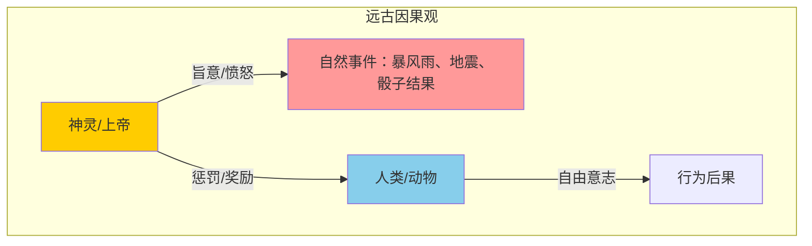
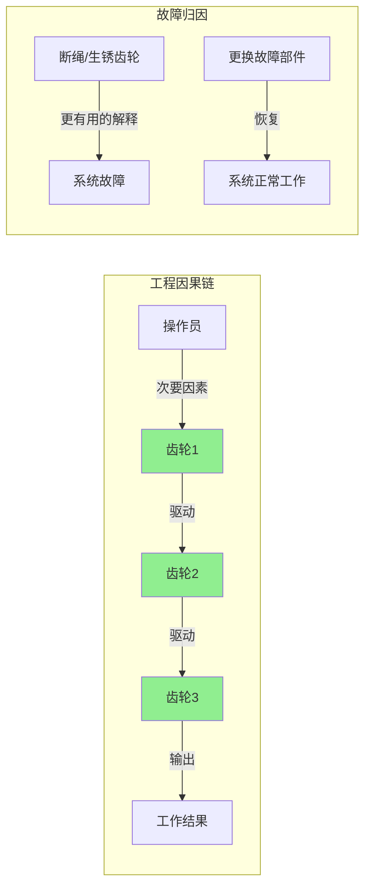
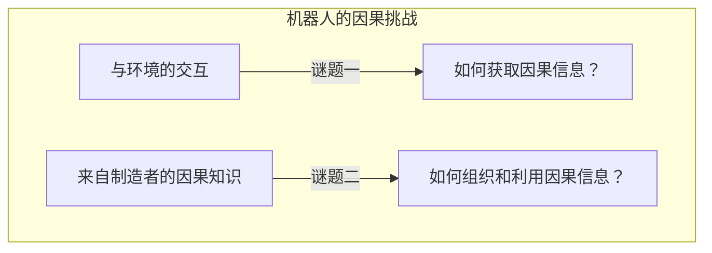
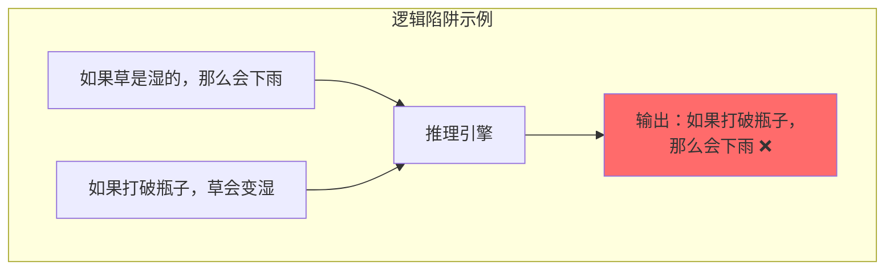
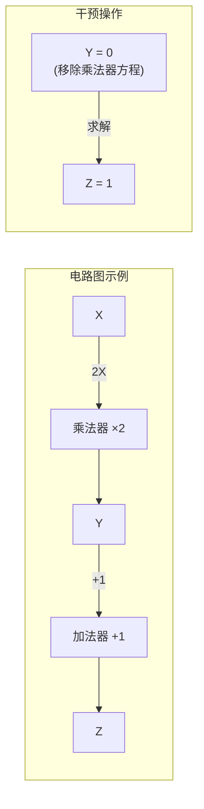
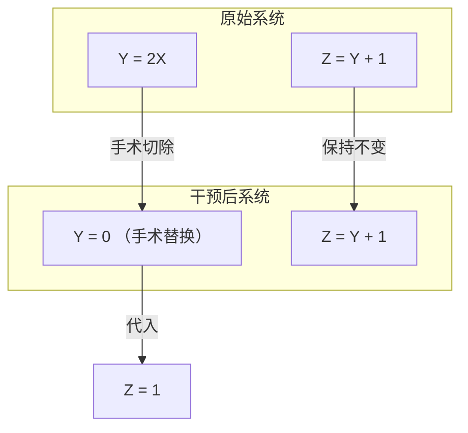
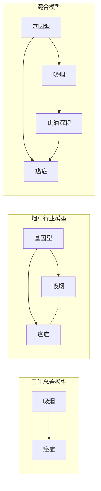
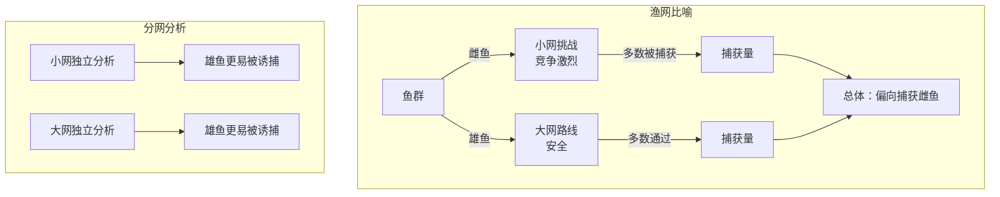
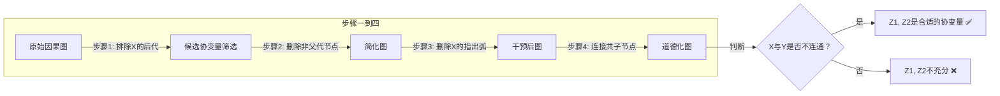

# 后记：因果的艺术与科学 —— 系统学习与参考材料

---

## 一、引言与讲座概览

本后记源自 **Judea Pearl** 于 **1996年11月** 在加州大学洛杉矶分校（UCLA）面向各领域研究者开设的一次公开讲座。讲座的核心主题是：**因果关系——即我们对"哪些事物是导致另一些事物的原因"及其重要性的认识。**

尽管因果关系是人类思想大厦的基石，但它却长期被神秘、争议和审慎所笼罩——因为科学家和哲学家极难精确界定一个事件"何时真正导致"另一事件。Pearl举了一个经典例子：**公鸡打鸣不会导致太阳升起，但即使如此简单的事实，也很难用数学方程来描述。**

> **讲座的三大结构**：
> 1. 回顾各学科在因果关系上遇到的历史困难；
> 2. 概述解决这些历史难题的思路；
> 3. 展示如何将这些想法变为简单可行的实用工具，并应用于统计学和社会学。

---

## 二、第一部分：因果观念的历史演变

### 2.1 远古时代（前工程时代）：神与人——因果不成为"问题"

在人类文明的早期，人们就已经具有问"为什么"的欲望和寻找因果解释的能力。这一时期的因果观具有以下特征：

#### 关键特征：
- **因果关系是人为的概念**。Pearl引用《圣经·创世纪》亚当与夏娃的故事：当上帝仅仅要求"是/否"的事实时，亚当却主动给出因果解释（"那女人摘了果子给我吃"），夏娃又将原因推给蛇。这说明：**解释从一开始就服务于推卸责任的社会功能。**
- **因果动因的局限**：只有神、人或者动物才被视为因果力量的推动者——无生命的物体、事件或物理过程并不承担因果责任。
- **自然事件被神化**：暴风雨、地震都被视为"愤怒众神"的控制结果；即使是掷骰子这种不稳定事件，也被理解为"神的旨意的传达"而非偶然事件。Pearl引用约拿书的故事：抽签不是娱乐，而是"单向调制解调器"——接收神的消息。
- **概念明确而无问题**：这种因果观虽然"幼稚"，却是**十分明确且不产生问题的**——因果动因清晰：要么是神灵的目的，要么是人类/动物的自由意志。

---

### 2.2 工程时代：物理对象进入因果体系

**真正的因果问题始于工程**——当人类开始构造多级联机器系统，将因果从神和人的垄断中解放出来。

#### 关键转变：
- **多级联系统**（齿轮传动）：一个齿轮驱动另一个齿轮，形成了物理对象之间的因果链。
- **故障归因的根本变化**：系统出错时，责怪上帝或操作员毫无用处——断绳或生锈的齿轮才是"更有用的解释"，因为**更换它们可以使系统恢复正常**。
- **无生命物体获得因果地位**：物理对象和过程开始承担因果责任，而且保留了前任（神灵和人类）的某些特征——成为**力量、意志甚至目的**的载体。

#### 亚里士多德的"最终原因"：
亚里士多德认为，从**目的（telos）**的角度来解释是"对一件事物为何如此"的唯一充分且令人满意的方式，他称之为**最终原因**（final cause）——即科学探究的最终目的。由此，因果关系形成了**双重角色**：
1. **信任与责备的对象**（规范性维度）
2. **物理控制过程的载体**（描述性维度）

> 从工程时代起，因果关系既是"为什么这件事发生了"的解释工具，也是"如何控制这件事"的操作工具。这种双重性在文艺复兴之前一直得到认可。

---

### 2.3 伽利略革命：描述第一，解释第二

Recorde在1575年出版的《知识的城堡》中，命运之轮的转动"不是靠上帝的智慧，而是靠人类的无知"——上帝作为终极原因的角色已被人类知识所取代，因果解释的概念受到冲击。

#### 伽利略的两条格言（1638年，《关于两门新科学的对话》）：

> **格言一**：**"描述第一，解释第二"**——"如何"（How）先于"为什么"（Why）。先不要急于追问物体为何下落（是被拉下还是被推下），而应先追问：如何**预测**行进一定距离所需的时间？物体变化和轨道角度变化时，时间如何变化？

> **格言二**：**用数学语言（方程式）进行描述**。不要用人类自然语言定性或模糊地回答，而需要用数学方程式的形式来描述。

#### 代数为何被选中？
**因为代数成功了。** 物体经过的距离确实与时间的平方成比例 $s \propto t^2$。代数方程不仅预测实验结果，更重要的是使工程师**第一次能够提出并解决"如何做"的问题**（而不仅仅是"假设……怎么样"的问题）。例如：
- 假设性问题：缩短承重梁，它还能承载同样的负荷吗？
- 操作性问题：**如何**对承重梁进行成形，使其能承受相应负荷？

#### 代数的关键特性：
**代数方程不对变量之间的先后关系进行区分**——可以根据参数预测目标，也可以根据目标反解参数。这一特性为后来的因果方向性难题埋下了伏笔。

---

### 2.4 休谟的挑战：因果第一谜

大约在伽利略之后一百年，苏格兰哲学家 **大卫·休谟**（David Hume）将伽利略的第一条格言推向极致。

#### 休谟的核心主张：
**"为什么"不仅仅是次于"如何"，而且"为什么"完全是多余的，因为它被"如何"所包含。**

休谟在《人性论》中的经典段落：

> "我们记得曾经见过那种称为火焰的物体，并感受到了我们称之为热的感觉……无论在什么情况下，它们之间的联系总是一直存在的。那么，不需要任何进一步的阐述，我们称其中一个为原因，另一个为结果，并能够从一个的存在推断出另一个的存在。"

#### 休谟的因果观：
- 因果联系是**观察的结果**——是一种"可学习的思维习惯"。
- 因果关系几乎与视错觉一样具有**虚构性**，与巴甫洛夫的条件反射一样具有**短暂性**。
- 因果知识 = 恒常联结（constant conjunction）+ 习惯性推断。

#### 第一因果之谜：人们如何获得因果关系的知识？

休谟的方案——通过"恒常联结"（演替规律）来学习因果关系——面临一个致命的反例：

> 公鸡打鸣与太阳升起一直存在恒常联结，但**公鸡打鸣不会导致太阳升起**。

同样，气压计读数始终与降雨保持关联，但**读数不会引起降雨**。

这引出了现代统计学的核心警示：**"相关关系并不意味着因果关系"**（Correlation does not imply causation），即存在**不蕴含因果关系的相关关系**（虚假相关）。

> **第一因果之谜（学习之谜）**：如果演替规律/关联关系不足以获得因果关系，那么**什么才是足够的？** 哪种经验模式产生的因果关系能够使人们信服？

---

### 2.5 罗素的困境：因果第二谜

如果第一谜团涉及因果关系的**学习**，那么第二谜团涉及因果关系的**用法**：知道某联系是因果的还是非因果的，有什么区别？

#### 直观理解：
如果公鸡打鸣确实导致太阳升起，我们可以**更早唤醒公鸡**让夜晚变短——因果知识直接影响我们的**行为选择**。但这一谜团在形式化的物理学中遇到了深刻的困难。

#### 罗素的论点（1913年）：
> "所有的哲学家想象因果关系是科学的基本公理之一。但奇怪的是，在科学发展中，'因果'这个词从未出现过……因果定律是过去时代的遗物，像君主制一样幸存下来，只是因为它被错误地认为是无害的。"

#### 物理学的"双语困境"：
物理学家以两种不同的语言工作：
- **交谈、写作、思考**：使用因果语言（"力导致了加速度"）
- **形式化描述**：使用对称的数学方程（$f = ma$）

> **第二因果之谜（表达之谜）**：如果因果关系仅仅是表达复杂物理关系的速记法，那么物理定律都是**对称的、双向的**（如 $f=ma$ 可以变形为 $a=f/m$ 或 $m=f/a$），而因果关系是**单向的、从原因到结果的**。代数规则不能区分"力导致加速度"和"加速度导致力"，那么因果词汇是否纯粹是形而上学的遗迹？

---

### 2.6 统计学：相关性与因果的断裂

故事始于弗朗西斯·高尔顿（Francis Galton）在1888年前后发现**相关性**（correlation）概念。

#### 高尔顿的发现：
- 在二维图上将 $X$ 对 $Y$ 绘制，适当缩放两轴，最佳拟合线的斜率具有漂亮的数学性质：
  - 精确预测时，斜率 = 1
  - 不比随机猜测更好时，斜率 = 0
  - **无论 $X$ 对 $Y$ 还是 $Y$ 对 $X$ 绘制，斜率相同**
- 高尔顿提出：这种相互关系"一定是由某种共同原因所引起的"——这是第一个严格基于数据、不受主观判断影响的客观关联度量。

#### 卡尔·皮尔逊（Karl Pearson）的激进立场：
皮尔逊将高尔顿的发现推向极端：
> "存在一个比因果关系更广泛的范畴，即**相关性**，因果关系只是它的极限。"
> "列联表……描述两个事物之间关系的最终科学陈述总是可以归结为此列表上……一旦读者理解了这张表的本质，就会掌握因果关系这个概念的实质。"

皮尔逊**断然否定了独立定义因果关系的必要性**——定义相关性就足够了。他对"意志"和"力量"等"万物有灵论"的讨伐如此激烈，以至于**因果关系在统计学中根本没有机会生根**。

#### 费舍尔（Ronald Fisher）的随机实验：
统计学家花了25年，才通过费舍尔的**随机实验**（randomized experiment）找到了**唯一经过科学证明的、从数据中检验因果关系的方法**——至今这也是主流统计学中唯一达成共识的因果概念。

#### 现代统计学界的"因果恐惧症"：
- 《统计科学百科全书》：相关性占12页，因果关系仅2页（其中1页还在证明"相关性不意味着因果关系"）
- Philip Dawid："因果推理是所有统计学问题中最重要、最微妙、最容易被忽视的问题之一"
- Terry Speed："对待因果关系应该像对统计一样，最好一点都不考虑"
- David Cox 和 Nanny Wermuth 在书中致歉："我们在这本书中没有使用因果关系这个词"
- 一位著名社会学家（1987）："如果更多的研究人员放弃对原因和结果等术语的思考和使用，那将是非常有益的"

#### 深层原因——概率语言的局限：
统计学之所以早早放弃因果关系，深层原因在于其官方语言——**概率论**——中根本没有"原因"这个词。我们无法用概率语言表达"淤泥不会导致下雨"，只能说两者相互关联/依赖：
$$P(\text{rain} \mid \text{mud}) \neq P(\text{rain})$$
但这表达的只是依赖关系，而非因果方向。

> **核心困境**：如果缺乏明确表达因果概念的语言，就无法围绕该概念开展科学活动。科学发展的要求——知识的跨研究可靠转移——需要**形式化语言的表达精确性和计算优势性**。

---

### 2.7 计算机科学：因果谜题的新活力

当研究者开始使用计算机对因果关系进行编码时，两个因果谜团重新焕发活力。

#### 经典逻辑陷阱（幻灯片28）：
- 输入1：如果草是湿的，那么会下雨（$wet \rightarrow rain$）
- 输入2：如果我们打破瓶子，草会变湿（$break \rightarrow wet$）
- 错误输出：如果我们打破瓶子，那么会下雨（$break \rightarrow rain$）

这种程序缺陷表明：**标准逻辑不能处理因果方向性**——这正是罗素困境的计算机版本。这也使AI程序成为研究因果关系的理想场所。

---

## 三、第二部分：解决方案框架

### 3.1 核心思想的三根支柱

Pearl提出的解决方案建立在三个核心概念之上：

> **第一**：将因果关系视为**干预行为的结果**。
>
> **第二**：使用**方程式和图**作为数学语言来表达和处理因果关系。
>
> **第三**：将干预视为一种**对方程式的操作**（手术）。

### 3.2 图的力量：自主性与局部机制

Pearl以电路工程图为例，阐述了图相对于纯代数的优势。

#### 电路图的"奇迹"：
一个简单的与/或门电路图能够传递的信息远超数百万个代数方程、概率函数或逻辑表达式。其力量在于：
1. **预测正常行为**（输入-输出方程即可）
2. **预测数百万种异常行为**：如将 $Y$ 设为0、将 $Y$ 与 $X$ 绑定、将与门改为或门等——即使设计者未曾预料这些干预，图仍然允许我们预测结果。

#### 这种能力的来源：**自主性**（Autonomy）
图中的每个门代表一个**独立的机制**——很容易在不改变一个的情况下改变另一个。图利用这种独立性，使用**在干预下保持不变的模块**来描述系统。

#### 休厄尔·赖特（Sewall Wright）的路径图：
在遗传学中，路径图可以在改变环境因素（如E）甚至遗传因素（H）时，预测豚鼠窝中可能出现的毛型——这种预测**不能建立在纯代数或相关性分析的基础上**。

---

### 3.3 干预作为方程手术：因果的形式化定义

#### 核心操作：通过方程的"手术"来模拟干预

给定系统：
$$\begin{cases} Y = 2X \\ Z = Y + 1 \end{cases}$$

**干预：将 $Y$ 设为 0** 的步骤：
1. 识别 $Y$ 的方程：$Y = 2X$
2. **手术切除**该方程，替换为：$Y = 0$
3. 求解新系统：$Z = 0 + 1 = 1$

#### 因果关系的正式定义：
> **如果我们可以通过操作 $Y$ 来改变 $Z$，即移除 $Y$ 的方程之后，$Z$ 的解将取决于替换的 $Y$ 的新值，那么 $Y$ 就是 $Z$ 的原因。**

#### 图的关键作用：
图告诉我们在操作 $Y$ 时**要删除哪个方程**。当方程被转换为代数等价形式时，这个信息就**完全被清除了**——单凭方程组无法预测干预结果，因为方程组中根本不存在"属于 $Y$ 的方程"的概念。

**关键洞察**：
- 干预 $\equiv$ 对图引导的方程手术
- 因果关系 $\equiv$ 预测此类手术的后果

---

### 3.4 因果模型与方程模型的本质区别

| 维度 | 方程模型（物理） | 因果模型 |
|:-----|:----------------|:---------|
| 基本描述 | 一组对称方程 | 一组对称方程 + 三个额外要素 |
| 范围（要素i） | 无区分 | **区分模型内与外**（哪些在模型内，哪些是边界条件/外生变量） |
| 局域性（要素ii） | 方程可任意代数变换 | 每个方程对应于一个**独立的机制**，必须作为单独的数学语句保存 |
| 干预（要素iii） | 无定义 | 干预被看作对这些机制进行的**手术** |

---

### 3.5 罗素困境的解决：因果方向性的来源

**罗素的问题**：物理方程对称，因果方向不对称——矛盾何在？

**Pearl的解答**：
- 当我们比较"$A$ 导致 $B$"和"$B$ 导致 $A$"时，我们比较的是**两个不同的物理世界模型**：一个移除了 $A$ 的方程，另一个移除了 $B$ 的方程。
- 如果包含整个宇宙，因果关系确实会消失——因为干预消失，操作者和被操作者的区分消失。
- 但科学家**从不把整个宇宙作为研究对象**——他们从宇宙中"挖出一块"（限定/clipping），其余部分作为背景和边界条件。**这种对内/对外的选择造成了不对称性**，正是这种不对称性使我们能够谈论"外部干预"，从而谈论因果关系和因果方向性。

> **笛卡儿的经典画作示例**：手眼系统的整体（粒子和光子的等离子体）服从对称的薛定谔方程，对因果关系一无所知。但当我们切出手部（限定），则手运动 $\rightarrow$ 光线变化；当我们切出脑部，则光线 $\rightarrow$ 手运动。**分割宇宙的方式决定了因果关联的方向性。**

---

### 3.6 do-演算：干预的代数

#### 符号创新：do 运算符

概率论中，竖线 $|$ 表示"假设我们观察到"：
$$P(\text{rain} \mid \text{wet}) \quad \text{读作：在观察到草地潮湿的条件下，下雨的概率}$$

Pearl引入了新符号 **$do(\cdot)$**：
$$P(\text{rain} \mid do(\text{wet})) \quad \text{读作：在我们将草地弄湿（干预）的条件下，下雨的概率}$$

直觉答案：$P(\text{rain} \mid do(\text{wet})) = P(\text{rain})$，因为人为弄湿草地不会改变下雨概率。但**标准的概率规则不适用于这个新符号**——需要一种新的代数。

#### 新代数的类比（乘法代数 vs do-演算）：

| | 乘法代数的发展 | do-演算的发展 |
|:--|:-------------|:-------------|
| **已有基础** | 加法代数：$a+b=b+a$ 等 | 观察的代数（概率论）：$P(x \mid y) = \frac{P(x, y)}{P(y)}$ |
| **新运算符** | $a \times b$ | $do(z)$ |
| **含义** | 将 $a$ 加 $b$ 次 | 手术 + 替代 |
| **新规则** | 交换律、结合律、分配律 | 三条规则（见下文） |

#### do-演算的三条规则：

| 规则 | 公式 | 条件（由图判定） |
|:-----|:-----|:----------------|
| **规则1：忽略观察** | $P(y \mid do\{x\}, z, w) = P(y \mid do\{x\}, w)$ | $(Y \perp Z \mid X, W)_{G_{\overline{X}}}$ |
| **规则2：动作/观察交换** | $P(y \mid do\{x\}, do\{z\}, w) = P(y \mid do\{x\}, z, w)$ | $(Y \perp Z \mid X, W)_{G_{\overline{X}\underline{z}}}$ |
| **规则3：忽略动作** | $P(y \mid do\{x\}, do\{z\}, w) = P(y \mid do\{x\}, w)$ | $(Y \perp Z \mid X, W)_{G_{\overline{X}\overline{Z(W)}}}$ |

> **规则解读**：
> - **规则1**：允许忽略不相关的观察
> - **规则3**：允许忽略不相关的行动
> - **规则2**：允许在相同事实条件下，观察和行动互换
>
> 每条规则右侧的图论条件（"红绿灯"）由图结构自动判定——这就是**图**在do-演算中的核心作用。

---

## 四、第三部分：实际应用

### 4.1 吸烟与肺癌的百年争论

#### 背景：
1964年美国卫生总署报告：吸烟与肺癌存在强相关性，声称该相关性是**因果关系**：
$$P(c \mid do(s)) \approx P(c \mid s)$$

#### 烟草行业的反击（费舍尔爵士支持）：
存在一个**未被发现的基因型**，同时导致癌症和对尼古丁的依赖。用do-演算表述：
$$P(\text{癌症} \mid do(\text{吸烟})) = P(\text{癌症})$$
即强制吸烟或戒烟**对癌症发病率没有任何影响**。

#### 引入中间变量：焦油沉积量
双方同意测量焦油沉积量后，统计学家使用do-演算给出解析解：从非实验数据中，**$P(\text{癌症} \mid do(\text{吸烟}))$ 变得可计算了**。

#### do-演算推导过程（消除 do 符号）：

$$\begin{aligned}
P(c \mid do\{s\}) &= \sum_t P(c \mid do\{s\}, t) P(t \mid do\{s\}) & \text{（概率公理）}\\
&= \sum_t P(c \mid do\{s\}, do\{t\}) P(t \mid do\{s\}) & \text{（规则2）}\\
&= \sum_t P(c \mid do\{s\}, do\{t\}) P(t \mid s) & \text{（规则2）}\\
&= \sum_t P(c \mid do\{t\}) P(t \mid s) & \text{（规则3）}\\
&= \sum_{s'} \sum_t P(c \mid do\{t\}, s') P(s' \mid do\{t\}) P(t \mid s) & \text{（概率公理）}\\
&= \sum_{s'} \sum_t P(c \mid t, s') P(s' \mid do\{t\}) P(t \mid s) & \text{（规则2）}\\
&= \sum_{s'} \sum_t P(c \mid t, s') P(s') P(t \mid s) & \text{（规则3）}
\end{aligned}$$

最终结果只包含**不涉及 $do(\cdot)$ 的可观测概率**——从非实验数据中估算因果效应成为可能。

---

### 4.2 校正问题与辛普森悖论

#### 辛普森悖论（Simpson's Paradox）：
> 两个变量之间的**任何**统计关系都可以通过加入其他变量进行**反转**。

**经典案例1**（UC Berkeley 1975年性别偏见调查）：
- 总体数据：男性申请者录取率更高
- 按院系细分：略微偏向录取女性申请者
- 原因：女性更倾向于申请竞争性强的院系（男女录取率都低）

**经典案例2**（Pearl的渔网比喻）：

#### 逆向回归（社会学中的工资歧视争议）：
- 比较同等资历的男女工资：**男性工资更高**
- 比较同等工资的男女资历：**男性资历也更高**
- **两种选择得出相反的结论！** 结论对"保持哪些变量不变"极其敏感。

> 这就是**校正问题（adjustment problem）**或**协变量选择问题**：在观察研究的分析中，应该选择哪些变量进行测量和调整（条件化）？

---

### 4.3 校正问题的图模型解法

假设我们要研究 $X$（治疗）对 $Y$（疗效）的因果效应，候选协变量为 $Z_1$ 和 $Z_2$，检验其是否充分的步骤如下：

#### 步骤一：
**$Z_1$ 和 $Z_2$ 不能为 $X$ 的后代节点**（descendant nodes），即不能是被 $X$ 因果影响的变量。

#### 步骤二：
**删除所有 $\{X, Y, Z\}$ 的非父代节点**，简化图结构。

#### 步骤三：
**删除所有由 $X$ 指出的弧**（即切断 $X$ 对外的因果箭头）。

#### 步骤四：
**连接所有含有共同子节点的两个节点**（将V结构的父节点相连，即"道德化"操作）。

#### 判定准则：
> **如果经过上述操作后，$X$ 与 $Y$ 在图中的路径全部断开（不连通），则 $Z_1$ 和 $Z_2$ 是合适的测量值（充分协变量集）。**

---

## 五、总结与展望

### 5.1 讲座的核心信息

1. **因果关系不是神秘的或形而上学的**——可以用简单的过程来理解，用友好的数学语言来表达。
2. **因果检验困难，因果发现更困难**——但符号和数学的力量不容小觑。
3. **三个核心概念的统一**：
   - 因果关系 = 干预的结果
   - 图 + 方程 = 因果的数学语言
   - 干预 = 对方程的手术（以图为指导）

### 5.2 历史反思

> Pearl的洞见：许多科学发现被推迟了好几个世纪，因为缺乏能解放思想并让科学家交流的数学语言。**如果卡尔·皮尔逊将因果图纳入数学语言，他可能在1901年就悟出随机实验的想法。**

### 5.3 面向未来

> "我们对贫穷、癌症和偏执这些现象仍然无法理解其因果性，只有数据的积累和敏锐的洞察力，最终才能实现真正的理解。"
>
> **数据无处不在，洞察力由你掌握，现在算盘（do-演算工具）也在你的手中。**

---

## 六、关键概念术语表

| 术语 | 英文 | 定义 |
|:-----|:-----|:-----|
| **虚假相关** | Spurious correlation | 不蕴含因果关系的统计相关关系 |
| **最终原因** | Final cause | 亚里士多德的概念，从目的角度的解释 |
| **自主性** | Autonomy | 图中各模块代表独立机制，可在不改变其他机制的情况下改变某一机制 |
| **干预/手术** | Intervention/Surgery | 移除一个方程并用新方程替换的操作 |
| **do-演算** | do-calculus | 处理干预表达式的代数系，含三条规则 |
| **校正问题** | Adjustment problem | 确定应条件化哪些协变量以消除混杂偏倚 |
| **辛普森悖论** | Simpson's paradox | 统计关系在加入额外变量后可能被反转 |
| **限定** | Clipping | 从宇宙中"挖出一块"作为研究对象，区分内/外 |
| **第一因果之谜** | First causal riddle | 人们如何从经验中**获得**因果知识？ |
| **第二因果之谜** | Second causal riddle | 因果信息（方向性）如何与对称的物理方程**兼容**？ |
| **路径分析** | Path analysis | Sewall Wright提出的用图表示和量化因果路径的方法 |

---

## 七、核心公式与符号体系

### do-演算三条规则的图论条件表述：

- **规则1条件** $(Y \perp Z \mid X, W)_{G_{\overline{X}}}$：在删除所有指向 $X$ 的箭头后的图中，给定 $X$ 和 $W$，$Y$ 与 $Z$ d-分离。

- **规则2条件** $(Y \perp Z \mid X, W)_{G_{\overline{X}\underline{Z}}}$：在既删除指向 $X$ 的箭头又删除从 $Z$ 指出的箭头后的图中，给定 $X$ 和 $W$，$Y$ 与 $Z$ d-分离。

- **规则3条件** $(Y \perp Z \mid X, W)_{G_{\overline{X}\overline{Z(W)}}}$：在删除指向 $X$ 的箭头和删除从 $Z(W)$（即 $Z$ 中不属于 $W$ 的变量的父节点）指出的箭头后的图中，给定 $X$ 和 $W$，$Y$ 与 $Z$ d-分离。

### 概率论与因果论的对比：

| | 观察（概率论） | 干预（因果论） |
|:--|:-------------|:-------------|
| 符号 | $P(y \mid x)$ | $P(y \mid do(x))$ |
| 含义 | 假设我们**看到** $X=x$ | 假设我们**设定** $X=x$ |
| 计算 | 条件概率公式 | do-演算 + 因果图 |

---

*本材料基于 Judea Pearl 1996年UCLA公开讲座的记录整理而成，系统梳理了因果观念从远古到现代的历史演变、两大因果之谜、干预-图-代数三位一体的解决框架，以及do-演算在吸烟-肺癌争论和校正问题中的实际应用。*