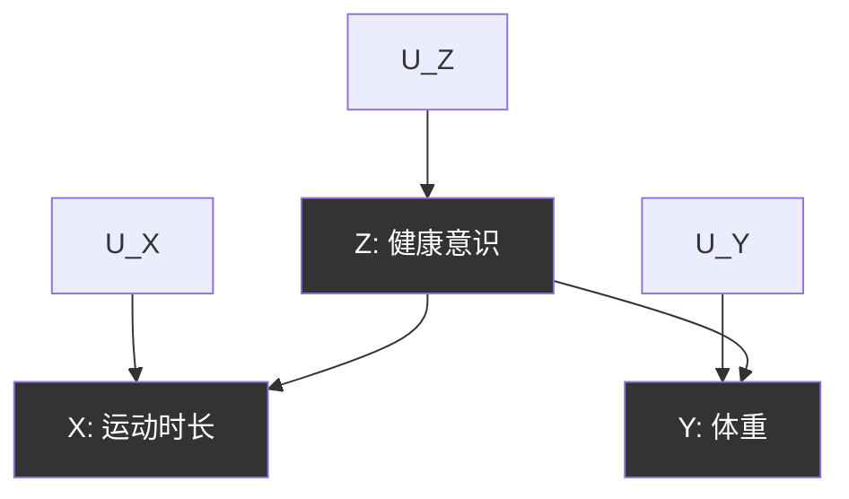
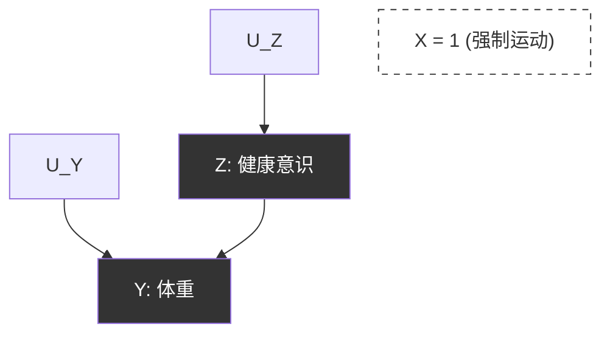
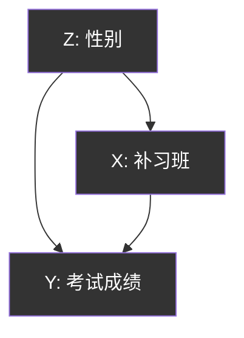
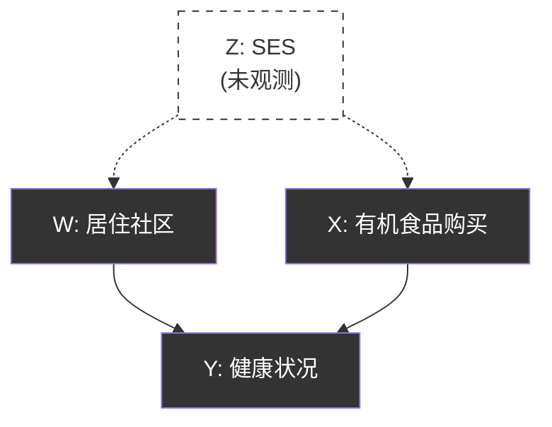
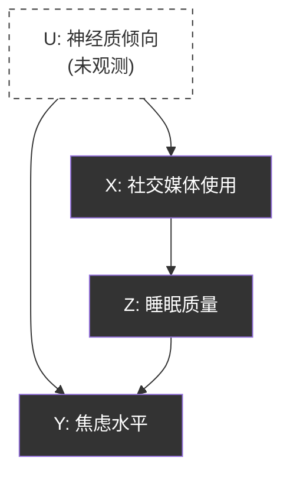
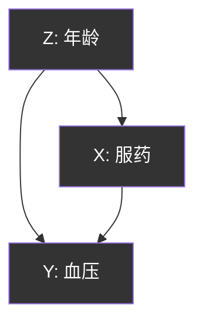
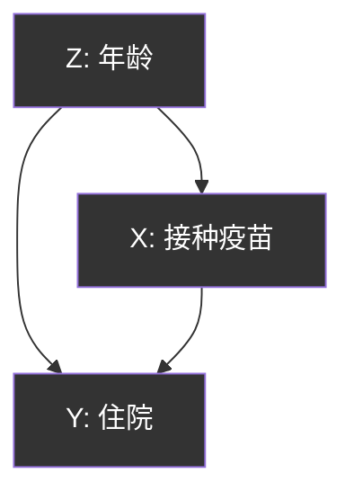
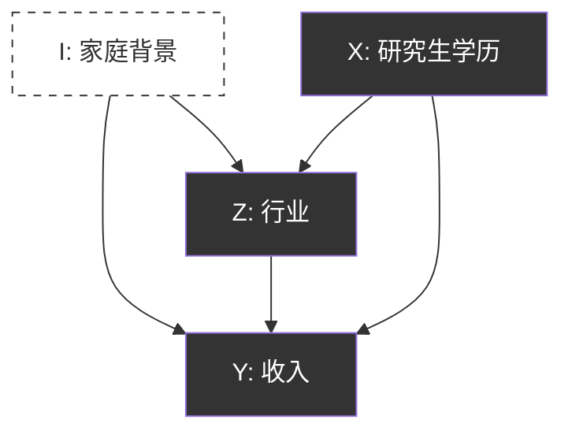
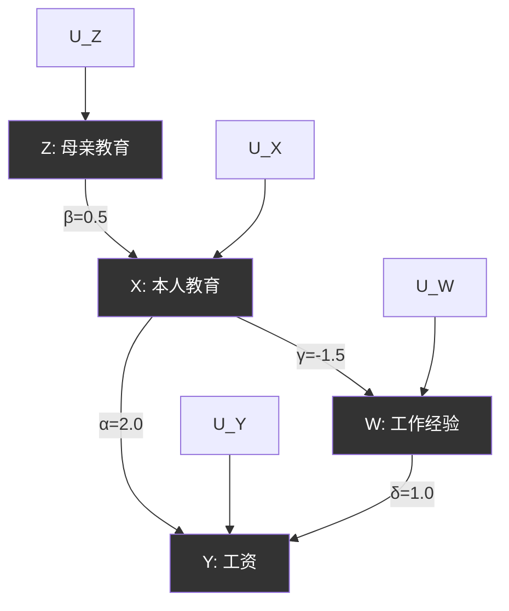
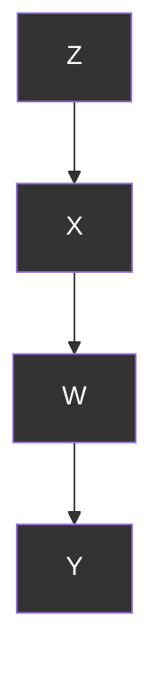

# 第 3 章《干预的效果》逐节详解（附完整示例）

---

## 3.1 干预（Interventions）——以"运动与体重"为例

### 背景故事

假设我们关心一个问题： **运动是否真的能降低体重？** 我们收集了一批人的数据，发现运动时长（ $X$ ）和体重（ $Y$ ）呈负相关——运动多的人体重更轻。但这能说明因果关系吗？

可能存在一个混杂因素： **健康意识** （ $Z$ ）。健康意识强的人既更倾向于运动，也更注意饮食，从而体重更轻。在这种情况下，运动与体重之间的负相关，可能完全由健康意识驱动。

### 因果图

### 条件化 vs 干预的本质区别

**条件化（观察）** ：
我们查看那些"恰好运动多"的人。由于运动多的人往往是健康意识强的人，而健康意识强也意味着体重更轻，所以我们在这些人的数据中看到的运动-体重关联，实际上混杂了健康意识的影响。我们无法区分：体重轻是因为运动，还是因为这些人本来就是健康意识强的人？

**干预（do-算子）** ：
我们设想一个干预：强制所有人在每天跑步 1 小时（ $do(X=1)$ ），无论他们的健康意识如何。在图手术中，我们 **切断指向 $X$ 的箭头** （即切断 $Z \to X$ 这条边），因为 $X$ 不再受健康意识的自然影响。

### 关键理解

|                  | $P(Y \mid X = \text{多运动})$      | $P(Y \mid do(X = \text{多运动}))$      |
| ---------------- | ---------------------------------- | -------------------------------------- |
| **问的是什么**   | 在已经运动多的人中，体重如何分布？ | 如果强制所有人多运动，体重会如何变化？ |
| **改变的是什么** | 只改变了我们的观察范围             | 改变了世界本身                         |
| **混杂解决了吗** | 没有                               | 是的，切断了 $Z \to X$                 |

> **一句话总结** ：当我们说"相关性不等于因果性"时，本质上是在说 $P(Y \mid X) \neq P(Y \mid do(X))$ 。干预概念让我们用精确的数学语言刻画了这种区别。

---

## 3.2 调整公式（The Adjustment Formula）——以"补习班与考试成绩"为例

### 背景故事

一所学校想评估 **周末补习班是否真的能提高学生期末考试成绩** 。他们收集了以下数据（假设总体 1000 名学生）：

| 补习班参与 | 性别 | 人数 | 通过考试人数 | 通过率 |
| ---------- | ---- | ---- | ------------ | ------ |
| 参加       | 男   | 100  | 70           | 70%    |
| 参加       | 女   | 300  | 240          | 80%    |
| 不参加     | 男   | 500  | 350          | 70%    |
| 不参加     | 女   | 100  | 80           | 80%    |

### 朴素分析会得出什么结论？

- 参加补习班总通过率：(70 + 240) / 400 = **77.5%**
- 不参加总通过率：(350 + 80) / 600 = **71.7%**
- 差异：+5.8%

看起来补习班有帮助，但性别可能是混杂变量——如果女性更倾向于参加补习班（300/400 = 75% vs 100/600 ≈ 16.7%），且女性天生考试通过率更高，那么补习班的表面效果可能被夸大了（或缩小了）。

### 因果图

### 调整公式推导（三步走）

**第 1 步** ：模拟干预 $do(X=\text{参加})$ 。切断 $Z \to X$ ，这意味着性别不再影响是否参加补习班——所有人都参加。

**第 2 步** ：利用两个不变性：

- 干预不改变性别分布： $P_m(Z=\text{男}) = P(Z=\text{男}) = 600/1000 = 0.6$ ， $P_m(Z=\text{女}) = 0.4$
- 干预不改变响应机制：给定性别和补习班状态下的通过率不变

  **第 3 步** ：应用调整公式：

$$
\begin{aligned}
P(Y=\text{通过} \mid do(X=\text{参加})) &= \sum_z P(Y=\text{通过} \mid X=\text{参加}, Z=z) \, P(Z=z) \
\\
&= P(\text{通过} \mid \text{参加}, \text{男}) \cdot P(\text{男}) + P(\text{通过} \mid \text{参加}, \text{女}) \cdot P(\text{女}) \
\\
&= 0.70 \times 0.60 + 0.80 \times 0.40 \
\\
&= 0.42 + 0.32 = \mathbf{0.74}
\end{aligned}
$$

$$
\begin{aligned}
P(Y=\text{通过} \mid do(X=\text{不参加})) &= 0.70 \times 0.60 + 0.80 \times 0.40 = \mathbf{0.74}
\end{aligned}
$$

### 平均因果效应（ACE）

$$
ACE = 0.74 - 0.74 = \mathbf{0}
$$

### 结果解读

**补习班实际上没有效果！** 表面上 5.8%的通过率优势完全来自性别构成的不平衡（女性既更爱参加补习班，本身通过率也更高）。调整公式通过"先分层、后按总体性别比例加权平均"，消除了这种虚假关联。

> **一句话总结** ：调整公式 = 在每个混杂变量层内计算关联，然后按该变量的总体分布加权平均。这本质上是对混杂因素的"标准化"。

---

## 3.3 后门准则（The Backdoor Criterion）——以"有机食品与健康"为例

### 背景故事

一项观察性研究发现： **经常购买有机食品的人比不买有机食品的人更健康** （更低的慢性病发病率）。有机食品真的使人更健康吗？

我们怀疑存在混杂因素：

- **社会经济地位（SES）** 影响了购买有机食品的能力和健康水平
- **健康意识** 也同时影响购买决策和健康结果
- 但 SES 没有被测量，健康意识也没有被测量

然而，我们测量了 **居住社区** （ $W$ ），它受 SES 影响，又与健康意识没有直接关系。

### 因果图

### 后门准则分析

**步骤 1：找出从 $X$ 到 $Y$ 的后门路径。**

后门路径是那些以指向 $X$ 的箭头为起点的路径。这里有一条：

$$
X \leftarrow Z \rightarrow W \rightarrow Y
$$

这是"后门"的，因为 $Z$ 是 $X$ 和 $Y$ 的共同原因。

**步骤 2：考察候选调整变量 $W$ 。**

- $W$ 是 $X$ 的后代吗？ **不是** （ $W$ 不是从 $X$ 出发能到达的节点）
- $W$ 能阻断后门路径 $X \leftarrow Z \rightarrow W \rightarrow Y$ 吗？ **是的！** $Z \rightarrow W \rightarrow Y$ 是一条链，以中间节点 $W$ 为条件可以阻断它。

因此 $W$ **满足后门准则** ！

**步骤 3：对 $W$ 不必是 $X$ 的父节点，也可以是能满足后门准则的"代理变量"。**

### 假设数据

| 社区类型 | 买有机食品 | 人数 | 健康人数 | 健康率 |
| -------- | ---------- | ---- | -------- | ------ |
| 富裕社区 | 是         | 400  | 360      | 90%    |
| 富裕社区 | 否         | 100  | 85       | 85%    |
| 普通社区 | 是         | 100  | 80       | 80%    |
| 普通社区 | 否         | 400  | 300      | 75%    |

### 计算

后门准则告诉我们，调整公式只需对 $W$ 进行：

$$
\begin{aligned}
P(\text{健康} \mid do(X=\text{买})) &= \sum_w P(\text{健康} \mid X=\text{买}, W=w)P(W=w) \
\\
&= 0.90 \times \frac{500}{1000} + 0.80 \times \frac{500}{1000} \
\\
&= 0.90 \times 0.5 + 0.80 \times 0.5 = \mathbf{0.85}
\end{aligned}
$$

$$
\begin{aligned}
P(\text{健康} \mid do(X=\text{不买})) &= 0.85 \times 0.5 + 0.75 \times 0.5 = \mathbf{0.80}
\end{aligned}
$$

$$
ACE = 0.85 - 0.80 = \mathbf{+5\%}
$$

### 结果解读

有机食品确实对健康有 5%的正向因果效应。注意：即使 SES 没有被测量，我们仅凭"居住社区"这个代理变量就成功估计了因果效应——因为社区既反映了 SES 的影响，又阻断了后门路径。

> **一句话总结** ：后门准则是一个图论算法——"找出所有以指向 $X$ 为起点的路径，选择一组非 $X$ 后代的变量来阻断它们"。它告诉我们"应该调整哪些变量"以及"为什么不需要测量所有混杂因素"。

---

## 3.4 前门准则（The Front-Door Criterion）——以"社交媒体与焦虑"为例

### 背景故事

心理学家想研究： **青少年每天使用社交媒体的时间（ $X$ ）是否增加了焦虑水平（ $Y$ ）？**

问题在于：可能存在一个未观测的基因/人格特质（ $U$ ，如"神经质倾向"），它同时导致青少年更沉迷社交媒体和更容易焦虑。没有测量 $U$ ，后门准则无法使用。

但幸运的是，研究者测量了一个中介变量： **睡眠质量** （ $Z$ ）——社交媒体使用影响睡眠质量，进而影响焦虑水平。

### 因果图

### 前门准则检查

| 条件                                   | 检查                                                                     | 结果 |
| -------------------------------------- | ------------------------------------------------------------------------ | ---- |
| 1. $Z$ 截断所有 $X \to Y$ 的有向路径   | $X \to Z \to Y$ 是唯一的因果路径， $Z$ 在中间                            | ✓    |
| 2. $X$ 到 $Z$ 没有后门路径             | 从 $X$ 出发指向 $Z$ 的唯一箭头是 $X \to Z$ ，没有指向 $X$ 的后门影响 $Z$ | ✓    |
| 3. $Z \to Y$ 的所有后门路径被 $X$ 阻断 | 后门路径 $Z \leftarrow X \leftarrow U \rightarrow Y$ 以 $X$ 为条件被阻断 | ✓    |

**前门准则满足！**

### 分步识别

**步骤 1** ： $X$ 对 $Z$ 的因果效应（后门准则，空集调整）

$$
P(Z=z \mid do(X=x)) = P(Z=z \mid X=x)
$$

**步骤 2** ： $Z$ 对 $Y$ 的因果效应（后门准则，调整 $X$ ）

$$
P(Y=y \mid do(Z=z)) = \sum_x P(Y=y \mid Z=z, X=x) \, P(X=x)
$$

**步骤 3** ：链式组合

$$
P(Y=y \mid do(X=x)) = \sum_z P(Y=y \mid do(Z=z)) \, P(Z=z \mid do(X=x))
$$

### 假设数据（1000 名青少年）

|                | 睡眠差 (Z=差) (400 人) |            | 睡眠好 (Z=好) (600 人) |            |
| -------------- | ---------------------- | ---------- | ---------------------- | ---------- |
|                | 多用(X=多)             | 少用(X=少) | 多用(X=多)             | 少用(X=少) |
| 人数           | 300                    | 100        | 100                    | 500        |
| 焦虑(Y=高)比例 | 30%                    | 15%        | 15%                    | 6%         |

详细计算：

- $P(Z=\text{差} \mid X=\text{多}) = 300/400 = 0.75$
- $P(Z=\text{差} \mid X=\text{少}) = 100/600 \approx 0.167$
- $P(X=\text{多}) = 400/1000 = 0.4$ ， $P(X=\text{少}) = 0.6$

**步骤 2 的 do(z)计算** ：

$$
\begin{aligned}
P(Y=\text{高} \mid do(Z=\text{差})) &= 0.30 \times 0.4 + 0.15 \times 0.6 = 0.12 + 0.09 = 0.21 \
\\
P(Y=\text{高} \mid do(Z=\text{好})) &= 0.15 \times 0.4 + 0.06 \times 0.6 = 0.06 + 0.036 = 0.096
\end{aligned}
$$

**步骤 3 的链式组合** ：

$$
\begin{aligned}
P(Y=\text{高} \mid do(X=\text{多})) &= P(Y=\text{高} \mid do(Z=\text{差})) \cdot P(Z=\text{差} \mid X=\text{多}) \\
&\quad + P(Y=\text{高} \mid do(Z=\text{好})) \cdot P(Z=\text{好} \mid X=\text{多}) \
\\
&= 0.21 \times 0.75 + 0.096 \times 0.25 \
\\
&= 0.1575 + 0.024 = \mathbf{0.1815}
\end{aligned}
$$

$$
\begin{aligned}
P(Y=\text{高} \mid do(X=\text{少})) &= 0.21 \times 0.167 + 0.096 \times 0.833 \
\\
&= 0.035 + 0.080 = \mathbf{0.115}
\end{aligned}
$$

$$
ACE = 0.1815 - 0.115 = \mathbf{+6.65\%}
$$

### 结果解读

即使"神经质倾向"这个混杂因素从未被测量，我们仍然通过睡眠质量这个中介变量（前门）成功估计了社交媒体使用对焦虑的因果效应：多用社交媒体使焦虑风险增加约 6.65 个百分点。

### 前门公式一次性计算

$$
\begin{aligned}
P(y \mid do(x)) &= \sum_z P(z \mid x) \sum_{x'} P(y \mid x', z) P(x')
\end{aligned}
$$

这本质上是：X 通过改变 Z 的分布来影响 Y。先算 Z 对 Y 的因果效应，再算 X 对 Z 分布的影响，最后组合。

> **一句话总结** ：前门准则是"用中介变量作为桥梁"的方法——当你无法阻断后门时，可以从前面走进来。它体现了因果推断中"化整为零、分而治之"的思想。

---

## 3.5 条件性干预与协变量特定效应——以"药物与年龄依赖性治疗策略"为例

### 背景故事

一种降压药的效果可能因年龄而异。政策制定者考虑一个 **年龄依赖性策略** ：

- 年龄 ≥ 60 岁：建议服药
- 年龄 < 60 岁：不建议服药

我们需要预测：如果实施这一策略，总体人群的血压会如何变化？

这种策略记为 $do(X = g(Z))$ ，其中 $g(Z) = 1$ 当 $Z \geq 60$ ，否则 $g(Z) = 0$ 。

### 因果图（同图 3.3）

### z-特定效应的识别

首先我们需要识别 $P(Y=y \mid do(X=x), Z=z)$ ，即在特定年龄层的因果效应。

由于 $Z$ 本身就是 $X$ 的父节点， $S = \emptyset$ 且 $S \cup Z = \{Z\}$ 满足后门准则。根据规则 2：

$$
P(Y=y \mid do(X=x), Z=z) = P(Y=y \mid X=x, Z=z)
$$

（对 $S$ 的求和退化，因为 $S$ 为空。）

### 假设数据

| 年龄组 | 服药 | 人数 | 平均血压降低 (mmHg) |
| ------ | ---- | ---- | ------------------- |
| <60    | 是   | 80   | -5                  |
| <60    | 否   | 320  | -2                  |
| ≥60    | 是   | 300  | -12                 |
| ≥60    | 否   | 100  | -3                  |

其中 $P(Z<60) = 0.4$ ， $P(Z \geq 60) = 0.6$ 。

### z-特定效应

从数据中直接读出（因为 $Z$ 是父节点，条件化已足够）：

- 对年轻人：服药使血压降低 $-5 - (-2) = -3$ mmHg
- 对老年人：服药使血压降低 $-12 - (-3) = -9$ mmHg

这说明存在 **效应修饰** （effect modification）：药物对老年人效果更强。

### 评估年龄依赖性策略

策略 $do(X = g(Z))$ 意味着：

- 60 岁以下的人全部不服药 → 预期血压降低 = -2 mmHg
- 60 岁以上的人全部服药 → 预期血压降低 = -12 mmHg

总体效果：

$$
\begin{aligned}
E[Y \mid do(X=g(Z))] &= \sum_z E[Y \mid do(X=g(z)), Z=z] \, P(Z=z) \
\\
&= (-2) \times 0.4 + (-12) \times 0.6 \
\\
&= -0.8 + (-7.2) = \mathbf{-8.0 \text{mmHg}}
\end{aligned}
$$

### 对比：如果不加区分地全部服药

$$
\begin{aligned}
E[Y \mid do(X=1)] &= \sum_z E[Y \mid X=1, Z=z] \, P(Z=z) \
\\
&= (-5) \times 0.4 + (-12) \times 0.6 \
\\
&= -2.0 + (-7.2) = \mathbf{-9.2 \text{mmHg}}
\end{aligned}
$$

### 结果解读

- 全部服药的总体效果是 -9.2 mmHg
- 年龄依赖性策略的效果是 -8.0 mmHg
- 差距只有 1.2 mmHg，但年龄依赖策略避免了让年轻人承担不必要的药物副作用

> **一句话总结** ：条件性干预将因果推断从"一刀切"的干预扩展到"因人而异"的动态策略。核心方法是先识别 z-特定效应，再对 z 的分布取期望。

---

## 3.6 逆概率加权（Inverse Probability Weighting）——以"疫苗接种与住院率"为例

### 背景故事

假设我们想评估 **流感疫苗是否降低了住院率** 。但我们知道，年老体弱的人既更可能接种疫苗，也更可能住院——这是一种"适应症混杂"（confounding by indication）。如果不纠正，甚至会得到"疫苗增加住院率"的荒谬结论。

假设我们有年龄（ $Z$ ）作为唯一的混杂变量。逆概率加权提供了一种不同于分层求和的估计方法。

### 因果图

### 原始数据（联合分布 $P(X,Y,Z)$ ，共 10000 人）

| X (接种) | Y (住院) | Z (年龄) | 人数 | 比例  |
| -------- | -------- | -------- | ---- | ----- |
| 是       | 是       | 老年     | 180  | 0.018 |
| 是       | 是       | 年轻     | 20   | 0.002 |
| 是       | 否       | 老年     | 1620 | 0.162 |
| 是       | 否       | 年轻     | 980  | 0.098 |
| 否       | 是       | 老年     | 800  | 0.080 |
| 否       | 是       | 年轻     | 100  | 0.010 |
| 否       | 否       | 老年     | 3200 | 0.320 |
| 否       | 否       | 年轻     | 3100 | 0.310 |

### 朴素分析（条件化——错误的做法）

$$
P(Y=\text{住院} \mid X=\text{接种}) = \frac{180+20}{180+20+1620+980} = \frac{200}{2800} \approx 7.14\%
$$

$$
P(Y=\text{住院} \mid X=\text{未接种}) = \frac{800+100}{800+100+3200+3100} = \frac{900}{7200} = 12.5\%
$$

表面上看接种者住院率更低，但这可能只是因为他们中年轻人比例更高。

### 逆概率加权方法

**核心思想** ：给每个人一个权重 = $1 / P(X=x \mid Z=z)$ 。在"接种"组中，如果某种类型的人很少接种（倾向得分低），则赋予他们更大的权重；反之则赋予更小的权重。效果是 **创建一个伪人群，其中年龄与接种状态独立** ，就像随机实验一样。

**步骤 1** ：计算每个年龄组的倾向得分

$$
\begin{aligned}
P(X=\text{接种} \mid Z=\text{老年}) &= \frac{180+1620}{180+1620+800+3200} = \frac{1800}{5800} \approx 0.310 \
\\
P(X=\text{接种} \mid Z=\text{年轻}) &= \frac{20+980}{20+980+100+3100} = \frac{1000}{4200} \approx 0.238
\end{aligned}
$$

**步骤 2** ：对每个案例赋予逆概率权重

| 案例             | 原始比例 | 倾向得分 | 权重因子        | 加权后比例         |
| ---------------- | -------- | -------- | --------------- | ------------------ |
| 接种+住院+老年   | 0.018    | 0.310    | 1/0.310 = 3.226 | 0.018×3.226=0.0581 |
| 接种+住院+年轻   | 0.002    | 0.238    | 1/0.238 = 4.202 | 0.002×4.202=0.0084 |
| 接种+未住院+老年 | 0.162    | 0.310    | 3.226           | 0.162×3.226=0.5225 |
| 接种+未住院+年轻 | 0.098    | 0.238    | 4.202           | 0.098×4.202=0.4118 |

**步骤 3** ：在加权伪人群中计算

$$
\begin{aligned}
P(Y=\text{住院} \mid do(X=\text{接种})) &= \frac{0.0581 + 0.0084}{0.0581+0.0084+0.5225+0.4118} \
\\
&= \frac{0.0665}{1.0008} \approx \mathbf{6.65\%}
\end{aligned}
$$

同理计算 $P(Y=\text{住院} \mid do(X=\text{未接种}))$ ，类似可得出约 **11.43%** 。

$$
ACE = 6.65\% - 11.43\% = \mathbf{-4.78\%}
$$

### 与传统调整公式对比

调整公式：

$$
\begin{aligned}
P(Y \mid do(X=\text{接种})) &= 0.10 \times 0.58 + 0.02 \times 0.42 = 0.058 + 0.0084 = 6.64\%
\end{aligned}
$$

两者结果一致（舍入误差范围内），但计算路径不同。

### 逆概率加权的优势

当年龄有 100 个类别而样本只有 1000 人时：

- 调整公式：需要在每个年龄层内计算，许多层可能没有或只有极少样本
- 逆概率加权：只需估计倾向得分函数（可用逻辑回归平滑），然后对每个样本加权，避免了稀疏分层问题

> **一句话总结** ：逆概率加权 = "给每个样本按其被选入处理组的概率的倒数加权"，从而创建一个模拟随机实验的伪人群。它在高维混杂情况下比分层调整更具可操作性。

---

## 3.7 中介效应（Mediation）——以"教育程度与收入"为例

### 背景故事

我们想知道： **研究生学历是否直接提高了收入，还是仅仅通过使你进入更高薪的行业来间接提高收入？**

- $X$ ：是否有研究生学历（1=是，0=否）
- $Z$ ：所在行业（中介变量，分为"高薪行业"和"普通行业"）
- $Y$ ：年收入（万）
- $I$ ：家庭背景（未测量的混杂因素——富裕家庭的孩子更可能读研，同时有更多人脉进入高薪行业，且即使在同一行业中也更可能拿到高薪）

### 因果图

### 传统条件化方法的问题

如果我们直接比较"在同一个行业"中有研究生学历和没有研究生学历的人的收入差异：

$$
\text{朴素直接效应} = E[Y \mid X=1, Z=\text{高薪}] - E[Y \mid X=0, Z=\text{高薪}]
$$

问题在于：以行业（ $Z$ ）为条件会打开对撞路径：

$$
X \to Z \leftarrow I \to Y
$$

因为行业同时受学历和家庭背景影响。在"高薪行业"这个子群体中，没有研究生学历的人之所以能进入，很可能是家庭背景特别强——因此他们的收入也偏高。这会 **低估** 学历的直接效应。

### 受控直接效应（CDE）

正确的做法是用 **干预** 而非 **条件化** 来固定中介变量：

$$
\begin{aligned}
CDE(z) &= E[Y \mid do(X=1), do(Z=z)] - E[Y \mid do(X=0), do(Z=z)]
\end{aligned}
$$

这相当于问： **如果我们强制所有人进入同一个行业（比如高薪行业），有研究生学历和没有研究生学历的人之间的收入差距是多少？**

### 识别 CDE

**步骤 1** ：移除 $do(X=x)$ 。

检查从 $X$ 到 $Y$ 的后门路径：模型中没有指向 $X$ 的箭头（除了外生变量），所以没有从 $X$ 出发的后门路径。因此：

$$
P(Y \mid do(X=x), do(Z=z)) = P(Y \mid X=x, do(Z=z))
$$

**步骤 2** ：移除 $do(Z=z)$ 。

检查从 $Z$ 到 $Y$ 的后门路径（给定 $X=x$ ）：路径 $Z \leftarrow I \to Y$ 需要通过调整 $I$ 来阻断。但由于 $I$ 未被测量，我们无法直接调整它。但等等——在 $do(Z=z)$ 下，指向 $Z$ 的所有箭头（包括 $X \to Z$ 和 $I \to Z$ ）都被切断，所以后门路径 $Z \leftarrow I \to Y$ 在干预图中不存在了！

实际上在干预 $do(Z=z)$ 后， $Z$ 和 $I$ 独立，所以以 $I$ 为条件也不是必须的。然而，在公式中我们仍需小心。

重新检查：在图 3.12 中（有 $I$ ），从 $Z$ 到 $Y$ 有两条后门路径需要阻断，一条通过 $X$ （已被条件 $X=x$ 阻断），一条通过 $I$ 。如果 $I$ 可测量，用 $I$ 调整即可。否则不可识别。

### 假设 $I$ 可测量的情况

假设我们测量了家庭背景（富裕/普通）：

| 家庭背景 $I$ | 学历 $X$ | 行业 $Z$ | 人数 | 平均收入(万) |
| ------------ | -------- | -------- | ---- | ------------ |
| 富裕         | 研究生   | 高薪     | 70   | 45           |
| 富裕         | 研究生   | 普通     | 30   | 35           |
| 富裕         | 本科     | 高薪     | 40   | 38           |
| 富裕         | 本科     | 普通     | 60   | 28           |
| 普通         | 研究生   | 高薪     | 30   | 35           |
| 普通         | 研究生   | 普通     | 70   | 30           |
| 普通         | 本科     | 高薪     | 10   | 30           |
| 普通         | 本科     | 普通     | 190  | 22           |

以及 $P(I=\text{富裕}) = 0.2$ ， $P(I=\text{普通}) = 0.8$

**计算 CDE（固定行业为高薪）** ：

$$
\begin{aligned}
E[Y \mid do(X=1), do(Z=\text{高薪})] &= \sum_i E[Y \mid X=1, Z=\text{高薪}, I=i] \, P(I=i) \
\\
&= 45 \times 0.2 + 35 \times 0.8 = 9 + 28 = \mathbf{37\text{万}}
\end{aligned}
$$

$$
\begin{aligned}
E[Y \mid do(X=0), do(Z=\text{高薪})] &= \sum_i E[Y \mid X=0, Z=\text{高薪}, I=i] \, P(I=i) \
\\
&= 38 \times 0.2 + 30 \times 0.8 = 7.6 + 24 = \mathbf{31.6\text{万}}
\end{aligned}
$$

$$
CDE(\text{高薪行业}) = 37 - 31.6 = \mathbf{+5.4\text{万}}
$$

**计算 CDE（固定行业为普通行业）** ：

$$
\begin{aligned}
E[Y \mid do(X=1), do(Z=\text{普通})] &= 35 \times 0.2 + 30 \times 0.8 = 7 + 24 = 31\text{万} \
\\
E[Y \mid do(X=0), do(Z=\text{普通})] &= 28 \times 0.2 + 22 \times 0.8 = 5.6 + 17.6 = 23.2\text{万} \
\\
CDE(\text{普通行业}) &= 31 - 23.2 = \mathbf{+7.8\text{万}}
\end{aligned}
$$

### 结果解读

- **直接效应（CDE）** ：即使在同一个行业内，研究生学历也能带来约 5.4 万（高薪行业）至 7.8 万（普通行业）的直接收入溢价。这说明学历确实有超越行业选择的直接价值（例如：同行业内更好的岗位、更快的晋升）。
- **CDE 的 z-依赖性** ：有趣的是，学历的直接效应在普通行业中更大（+7.8 万 vs +5.4 万）——这可能因为在高薪行业（如投行）中，收入更多地由业绩而非学历决定。
- **与条件化方法的对比** ：如果直接用条件化计算（ $E[Y \mid X=1, Z=\text{高薪}] - E[Y \mid X=0, Z=\text{高薪}]$ ），由于未消除家庭背景的混杂，结果会有偏差。

> **一句话总结** ：中介分析的核心创新是用 $do(Z=z)$ 而非以 $Z$ 为条件来固定中介变量。这避免了打开对撞路径导致的偏差。CDE 让我们可以回答："如果强制所有人走同一条中间路径，原因对结果的直接影响是多大？"

---

## 3.8 线性系统中的因果推断——以"教育、技能与工资"为例

### 背景故事

劳动经济学家想研究： **受教育年限（ $X$ ）对工资（ $Y$ ）的总效应和直接效应分别是什么？**

- $X$ ：受教育年限
- $W$ ：工作经验（年数）
- $Z$ ：母亲的受教育年限（工具变量）
- $Y$ ：年工资（万元）

假设所有关系是线性的，误差项相互独立且服从正态分布。

### 因果图与结构方程

结构方程：

$$
\begin{aligned}
Z &= U_Z \\
X &= \beta Z + U_X = 0.5Z + U_X \\
W &= \gamma X + U_W = -1.5X + U_W \\
Y &= \alpha X + \delta W + U_Y = 2.0X + 1.0W + U_Y
\end{aligned}
$$

### 路径系数与因果效应的关系

**直接效应** （ $X \to Y$ 的路径系数）： $\alpha = 2.0$ 。这表示： **在保持工作经验不变的情况下** ，每多受一年教育，工资增加 2 万元。

**总效应** （所有非后门路径系数乘积之和）：

从 $X$ 到 $Y$ 有两条非后门路径：

1.  $X \to Y$ ：系数 = $\alpha = 2.0$
2.  $X \to W \to Y$ ：系数乘积 = $\gamma \times \delta = (-1.5) \times 1.0 = -1.5$

$$
\text{总效应} \tau = 2.0 + (-1.5) = \mathbf{0.5}
$$

这意味着：每多受一年教育，工资的 **净增加** 只有 0.5 万元。为什么总效应比直接效应小这么多？因为教育增加会减少工作经验（ $\gamma = -1.5$ ），而经验对工资有正面影响（ $\delta = 1.0$ ）。所以教育的部分正面效果被"经验损失"抵消了。

### 从观测数据中识别（回归方法）

假设我们只有观测数据，不知道真实的 $\alpha, \beta, \gamma, \delta$ 。

**识别总效应** ：

后门准则分析：从 $X$ 到 $Y$ 有没有后门路径？

- 没有指向 $X$ 的箭头（除了 $Z$ ，但 $Z$ 不是 $Y$ 的原因）
- 实际上， $X$ 的父节点只有 $Z$ ，而 $Z$ 不是 $Y$ 的父节点

因此，空集满足后门准则！只需将 $Y$ 对 $X$ 做简单回归：

$$
Y = \tau X + \epsilon
$$

回归系数就是总效应 $\tau = 0.5$ 。无需调整任何变量。

**识别直接效应（ $G_\alpha$ 程序）** ：

移除 $X \to Y$ 的边，得到 $G_\alpha$ ：

在 $G_\alpha$ 中， $W$ d-分离了 $X$ 和 $Y$ （路径 $X \to W \to Y$ 被 $W$ 阻断）。因此：

将 $Y$ 对 $X$ 和 $W$ 回归：

$$
Y = r_X X + r_W W + \epsilon
$$

回归中 $X$ 的系数 $r_X$ 就是直接效应 $\alpha = 2.0$ 。

### 假设数据拟合

|                         | 系数         | 标准误 | t 值  |
| ----------------------- | ------------ | ------ | ----- |
| 简单回归 $Y \sim X$     | 0.52         | 0.12   | 4.33  |
| 多元回归 $Y \sim X + W$ | $r_X = 2.03$ | 0.15   | 13.53 |
|                         | $r_W = 1.01$ | 0.08   | 12.63 |

### 间接效应

$$
\text{间接效应} = \tau - \alpha = 0.5 - 2.0 = \mathbf{-1.5}
$$

（在线性系统中，间接效应等于 $\gamma \times \delta$ 。）

### 如果存在未观测混杂（工具变量方法）

假设 $Y$ 和 $X$ 存在未观测的混杂（由双箭头弧线表示），使直接效应无法通过调整识别。此时，母亲教育（ $Z$ ）可以作为 **工具变量** ：

在 $G_\alpha$ 中：

- $Z$ 与 $X$ d-连通（ $Z \to X$ ）
- $Z$ 与 $Y$ d-分离（没有从 $Z$ 到 $Y$ 的路径）

分别做回归：

$$
X = r_1 Z + \epsilon_1 \quad \text{和} \quad Y = r_2 Z + \epsilon_2
$$

则 $\alpha = r_2 / r_1$ 。直观理解： $Z$ 对 $Y$ 的影响只能通过 $X$ 传递（排除限制），所以 $Z$ 对 $Y$ 的效应除以 $Z$ 对 $X$ 的效应就等于 $X$ 对 $Y$ 的效应。

### 结果解读

| 效应类型          | 数值       | 解释                                 |
| ----------------- | ---------- | ------------------------------------ |
| 总效应 $\tau$     | +0.5 万/年 | 每多受一年教育，工资净增 0.5 万      |
| 直接效应 $\alpha$ | +2.0 万/年 | 保持经验不变，教育本身值 2 万/年     |
| 间接效应          | -1.5 万/年 | 教育 → 减少经验 → 工资降低 1.5 万/年 |

**政策含义** ：如果仅仅鼓励更多人接受教育，由于受教育时间增加会减少工作经验，净效果只有每年 0.5 万元。这可能意味着应设计"边工作边学习"的项目来消除间接的负面影响。

> **一句话总结** ：在线性系统中，因果效应简化为路径系数的代数和。总效应=所有非后门路径系数乘积之和；直接效应=删边后通过 d-分离识别；间接效应=总效应-直接效应。回归分析（含工具变量）是实现这些识别的核心计算工具。

---

## 全章方法对照总表

| 节  | 方法           | 适用场景             | 关键操作                  | 核心公式                                             |
| --- | -------------- | -------------------- | ------------------------- | ---------------------------------------------------- |
| 3.1 | do-算子/图手术 | 定义干预             | 删除所有指向 $X$ 的箭头   | $P(y \mid do(x))$                                    |
| 3.2 | 调整公式       | 存在混杂但可测量     | 对父节点 $PA(X)$ 分层求和 | $\sum_z P(y \mid x,z)P(z)$                           |
| 3.3 | 后门准则       | 混杂不可全测但有代理 | 找满足条件的调整集 $Z$    | 同上， $Z$ 扩展为任意满足后门准则的集                |
| 3.4 | 前门准则       | 后门准则失败，有中介 | 两步后门+链式组合         | $\sum_z P(z\mid x)\sum_{x'}P(y\mid x',z)P(x')$       |
| 3.5 | 条件性干预     | 依赖协变量的动态策略 | z-特定效应+期望           | $\sum_z P(y \mid do(x),z)P(z)$                       |
| 3.6 | 逆概率加权     | 高维调整的计算替代   | 按 $1/P(x\mid z)$ 重加权  | $\sum_z P(x,y,z)/P(x\mid z)$                         |
| 3.7 | 受控直接效应   | 中介分析/直接效应    | $do(X), do(Z)$ 双重干预   | CDE = $P(y\mid do(x),do(z)) - P(y\mid do(x'),do(z))$ |
| 3.8 | 线性系统方法   | 线性正态模型         | 回归+路径系数+工具变量    | $\tau = \sum$ 路径系数乘积                           |
