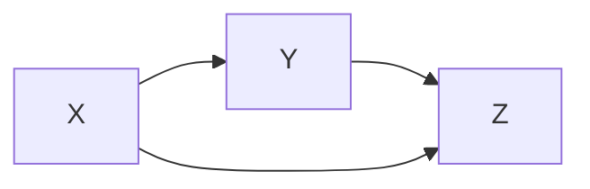
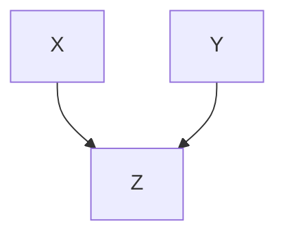
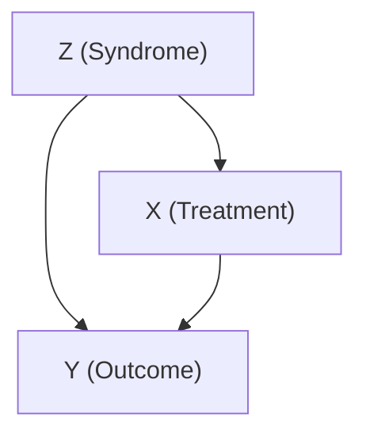

# 预备知识：统计模型与因果模型（Preliminaries: Statistical and Causal Models）

## 1.1 为何研究因果关系（Why Study Causation）

“为什么要研究因果关系？”这个问题的答案几乎和“为什么要研究统计学？”一样直接。我们研究因果关系，是因为我们需要理解数据、指导行动与政策、并从成功与失败中学习。我们需要估计吸烟对肺癌的影响、教育对工资的影响、碳排放对气候的影响。更进一步，我们还需要理解原因如何以及为何影响其结果——这同样具有重要价值。例如，了解疟疾是由蚊子传播还是像过去许多人认为的那样由“瘴气”（mal-air）传播，决定了我们下次去沼泽地时应该携带蚊帐还是呼吸面罩。

不那么显而易见的是这个问题的答案：“为什么要把因果关系作为一个独立于传统统计学课程的专题来研究？”单独考虑“因果关系”这个概念，能告诉我们哪些传统统计方法无法揭示的关于世界的信息？

事实证明，它能揭示很多。当以严谨的方式处理时，因果关系不仅仅是统计学的一个方面；它是对统计学的补充，是一种丰富，使得统计学能够揭示传统方法单独无法揭示的世界运行机制。例如，以下这一点可能会让许多人感到惊讶：上述问题中没有一个可以用标准统计语言来表达。

为了理解因果关系在统计学中的特殊作用，让我们考察一下统计文献中最引人入胜的谜题之一，它生动地说明了为什么传统统计语言必须用新的要素来丰富，才能处理因果效应关系，正如我们上面提到的那些。

## 1.2 辛普森悖论（Simpson's Paradox）

以其推广者、统计学家 **爱德华·辛普森（Edward Simpson，生于 1922 年）** 的名字命名，这个悖论指的是这样一种数据现象：**在整个总体中成立的统计关联，在每一个子总体中都发生逆转**。例如，我们可能发现，吸烟的学生平均成绩高于不吸烟的学生。但当我们考虑学生的年龄时，我们可能发现，在每个年龄组中，吸烟者的成绩都低于不吸烟者。然后，如果我们同时考虑年龄和收入，我们可能发现，吸烟者的成绩再次高于同龄同收入的非吸烟者。随着我们考虑越来越多的属性，这种逆转可能会无限持续，来回切换。在这种情况下，我们想判断吸烟是否导致成绩提高、方向如何、程度多大，但要从数据中获得答案似乎毫无希望。

> 配套网站：www.wiley.com/go/Pearl/Causality

在辛普森（1951）使用的经典例子中，一组病人被给予试用一种新药的机会。在服用该药的人中，康复比例低于未服药者。然而，当我们按性别分组时，我们发现，服药的男性比未服药的男性康复比例更高，服药的女性也比未服药的女性康复比例更高！换句话说，这种药似乎对男性和女性都有帮助，但对总体人群却有害。这看起来荒谬，甚至不可能——这当然就是它被称为悖论的原因。有些人很难相信数字竟然能以这种方式组合。为了让其可信，请考虑以下例子：

**例 1.2.1** 我们记录了 700 名有机会服用该药的患者的康复率。共有 350 名患者选择服药，350 名患者未服药。研究结果如表 1.1 所示。

**表 1.1** 一项新药研究的结果（考虑性别因素）

| 组别     | 服药               | 未服药             |
| -------- | ------------------ | ------------------ |
| 男性     | 81/87 康复 (93%)   | 234/270 康复 (87%) |
| 女性     | 192/263 康复 (73%) | 55/80 康复 (69%)   |
| 合并数据 | 273/350 康复 (78%) | 289/350 康复 (83%) |

第一行显示男性患者的结果；第二行显示女性患者的结果；第三行显示所有患者（不分性别）的结果。

在男性患者中，服药者的康复率高于未服药者（93% vs 87%）。在女性患者中，服药者的康复率同样高于未服药者（73% vs 69%）。然而，在合并总体中，未服药者的康复率高于服药者（83% vs 78%）。

数据似乎在说：如果我们知道患者的性别——男性或女性——我们可以开这种药；但如果性别未知，我们就不应该开！显然，这个结论是荒谬的。如果这种药对男性和女性都有帮助，那么它必然对任何人有帮助；我们不了解患者的性别并不会使药物变得有害。

那么，根据这项研究的结果，医生应该给一位女性病人开这种药吗？给一位男性病人呢？给一位性别未知的病人呢？或者考虑一位政策制定者，他正在评估该药对总体的整体有效性。他/她应该使用总体的康复率吗？还是应该使用按性别分组的子总体的康复率？

答案在简单的统计中无处可寻。为了判断药物对患者是有害还是有益，我们首先必须理解数据背后的故事——导致或生成我们所看到结果的 **因果机制（causal mechanism）** 。例如，假设我们知道一个额外的事实： **雌激素（Estrogen）** 对康复有负面影响，因此无论是否服药，女性的康复可能性都低于男性。此外，从数据中我们可以看到，女性服药的可能性显著高于男性。因此，药物在总体上看起来有害的原因是，如果我们随机选择一个服药者，这个人更可能是女性，因此比随机选择一个未服药者更不可能康复。换句话说， **性别是服药和未康复的共同原因（common cause）** 。

因此，为了评估有效性，我们需要比较相同性别的受试者，从而确保服药者与未服药者之间康复率的任何差异都不能归因于雌激素。这意味着我们应该参考分组数据，这些数据明确告诉我们该药是有帮助的。这符合我们的直觉，即分组数据比未分组数据“更具体”，因此信息量更大。

稍作改动，我们可以看到同样的逆转如何在一个连续型例子中发生。考虑一项研究，**测量不同年龄组的每周运动量和胆固醇水平**。当我们将运动量绘制在 X 轴上，胆固醇绘制在 Y 轴上，并按年龄分组时，如图 1.1 所示，我们看到每个组内都有一个总体下降趋势：年轻人运动越多，胆固醇越低，中年人和老年人也是如此。然而，如果我们使用相同的散点图，但不按年龄分组（如图 1.2 所示），我们看到一个总体上升趋势：一个人运动越多，其胆固醇越高。

> **图 1.2** 运动-胆固醇研究的结果（未分组）。数据点与图 1.1 相同，只是未显示不同年龄组之间的界限。

为了解决这个问题，我们再次求助于数据背后的故事。如果我们知道，年龄较大的人更可能运动（图 1.1），并且无论运动与否，他们也更可能胆固醇高，那么这种逆转就很容易解释和解决。 **年龄是处理变量（运动）和结果变量（胆固醇）的共同原因** 。因此，我们应该查看按年龄分组的数据，以便比较同龄人，从而消除我们检查的每个组中运动量大的人更可能因其年龄（而非运动）而胆固醇高的可能性。

然而——这可能会让一些读者感到惊讶——**分组数据并不总是给出正确答案**。假设我们观察与第一个服药与康复例子中相同的数字，但这次记录的不是参与者的性别，而是实验结束时患者的血压。在这种情况下，我们知道药物通过降低服用者的血压来影响康复——但不幸的是，它也有毒性作用。在实验结束时，我们得到如表 1.2 所示的结果。（表 1.2 在数值上与表 1.1 相同，只是列标签被交换了。）

**表 1.2** 一项新药研究的结果（考虑治疗后血压）

|          | 未服药             | 服药               |
| -------- | ------------------ | ------------------ |
| 低血压   | 81/87 康复 (93%)   | 234/270 康复 (87%) |
| 高血压   | 192/263 康复 (73%) | 55/80 康复 (69%)   |
| 合并数据 | 273/350 康复 (78%) | 289/350 康复 (83%) |

现在，你会向患者推荐这种药吗？答案再次取决于数据是如何生成的。在总体人群中，药物可能因其对血压的影响而提高康复率。但在子总体中——即治疗后血压高的组和治疗后血压低的组——我们当然看不到这种效果；我们只会看到药物的毒性效应。

与性别例子一样，实验的目的是衡量处理对康复率的总体效应。但在这个例子中，由于 **降低血压是处理影响康复的机制之一** ，因此根据血压来分离结果是没有意义的。（如果我们记录了患者*治疗前*的血压，并且是血压影响处理，而不是相反，那将是另一个故事。）因此，我们查阅总体人群的结果，发现处理增加了康复的概率，我们决定应该推荐处理。

值得注意的是，尽管性别例子和血压例子中的数字相同，但正确的结果在前者中来自分组数据，在后者中来自汇总数据。使我们能够做出处理决策的所有信息——测量的时间点、处理影响血压的事实、以及血压影响康复的事实——在数据中都无法找到。事实上，正如统计学教科书传统上（且正确地）告诫学生的， **相关不等于因果（correlation is not causation）** ，因此没有任何统计方法可以仅从数据中确定因果故事。因此，没有任何统计方法可以帮助我们做出决策。

然而，统计学家一直在基于此类因果假设来解释数据。事实上，我们最初的、定性的、关于辛普森问题的性别例子的悖论性质本身就源于我们坚信 **处理不能影响性别** 。如果它可以，那就没有悖论了，因为数据背后的因果故事可以轻易地呈现出与我们血压例子相同的结构。

尽管“处理不会导致性别”这个假设看似微不足道，但无法在数据中检验它，也无法在标准统计学的数学中表示它。事实上，在 **列联表（contingency tables）** （如表 1.1 和 1.2）中，无法表示任何因果信息，而统计推断常常基于这些表格。

然而，存在一些 **超统计方法（extra-statistical methods）** 可用于表达和解释因果假设。这些方法及其含义是本书的重点。借助这些方法，读者将能够数学地描述任何复杂程度的因果情景，并像在代数问题中求解 $X$ 一样迅速而轻松地回答类似于辛普森悖论提出的决策问题。这些方法将使我们可以轻松区分上述三个例子，并走向适当的统计分析和解释。

一个由简单逻辑运算组成的 **因果演算（calculus of causation）** 将澄清我们已有的直觉——关于不存在一种能治愈男性和女性却伤害总体的药物，以及关于比较血压相同的患者是徒劳的。这种演算将使我们能够超越辛普森悖论的小问题，进入复杂的实际问题，在这些问题中，直觉已无法指导分析。简单的数学工具将能够回答政策评估的实际问题，以及关于事件如何以及为何发生的科学问题。

但我们还没有准备好完成如此大胆的壮举。为了严谨地理解数据背后的因果故事，我们需要四样东西：

1. “**因果关系**”的工作定义。
2. 一种正式阐明因果假设的方法——即创建**因果模型**。
3. 一种**将因果模型的结构与数据特征联系起来的方法**。
4. 一种**从嵌入在模型和数据中的因果假设组合中得出结论的方法**。

本书的前两部分致力于提供对因果假设建模并将其与数据集联系起来的方法，以便在第三部分中，我们可以使用这些假设和数据来回答因果问题。但在我们继续之前，我们必须定义因果关系。这看起来可能直观或简单，但几个世纪以来，统计学家和哲学家们一直未能就一个普遍认同、完全包容的因果关系定义达成一致。

就我们的目的而言，因果关系的定义很简单，尽管有点比喻性：如果变量 $Y$ 的值以任何方式依赖于变量 $X$ ，那么变量 $X$ 就是变量 $Y$ 的一个 **原因（cause）** 。稍后我们将对这个定义稍作扩展，但现在，将因果关系视为一种“倾听”： $X$ 是 $Y$ 的原因，如果 $Y$ 倾听 $X$ 并根据它所听到的来决定其值。

读者还必须了解一些来自概率论、统计学和图论的基本概念，才能理解上述因果方法。因此，接下来的两节将提供必要的定义和示例。对概率论、统计学和图论有基本了解的读者可以跳到第 1.5 节，而不会影响理解。

 研究问题

研究问题 1.2.1

以下说法有什么问题？

- (a) “数据显示收入和婚姻有很高的正相关。因此，如果你结婚，你的收入会增加。”
- (b) “数据显示，随着火灾数量的增加，消防员的数量也在增加。因此，为了减少火灾，你应该减少消防员的数量。”
- (c) “数据显示，匆忙的人往往会开会迟到。不要匆忙，否则你会迟到。”

研究问题 1.2.2

棒球击球手 Tim 的平均安打率高于他的队友 Frank。然而，有人注意到，Frank 对阵右投手和左投手的平均安打率都高于 Tim。这怎么可能发生？（用表格呈现你的答案。）

研究问题 1.2.3

针对以下每个因果故事，确定你应该使用汇总数据还是分组数据来确定真实效应。

- (a) 有两种治疗肾结石的方法：治疗 A 和治疗 B。医生更可能对较大（因此更严重）的结石使用治疗 A，更可能对小结石使用治疗 B。一个不知道自己结石大小的患者在决定哪种治疗更有效时，应该查看总体人群数据，还是结石大小特定的数据？
- (b) 一个小镇上有两位医生。每位医生在其职业生涯中进行了 100 次手术，这些手术分为两种类型：一种非常困难的手术和一种非常容易的手术。第一位医生进行容易手术的频率远高于困难手术，第二位医生进行困难手术的频率高于容易手术。你需要做手术，但你不知道你的病例是容易还是困难。为了最大化成功手术的机会，你应该查阅每位医生在所有病例中的成功率，还是应该分别查阅他们在容易和困难病例中的成功率？

研究问题 1.2.4

为了评估一种新药的有效性，进行了一项随机实验。总体而言，50% 的患者被分配接受新药，50% 接受安慰剂。在正式实验的前一天，一名护士向一些表现出抑郁迹象的患者分发棒棒糖，这些患者大多被分配在第二天接受治疗（即，护士查房时恰好经过了治疗病房）。奇怪的是，实验数据显示了一个辛普森逆转：尽管该药对整个总体有益，但在棒棒糖接收者和非接收者中，服药者的康复可能性都低于未服药者。假设吮吸棒棒糖本身对康复没有任何影响，回答以下问题：

- (a) 该药对整个总体是有益还是有害？
- (b) 你的答案是否与我们的性别例子相矛盾？在那个例子中，性别特定的数据被认为更合适。
- (c) （非正式地）画一个大致能捕捉故事的图。（如果你愿意，可以提前看第 1.4 节。）
- (d) 你如何解释在这个故事中出现的辛普森逆转？
- (e) 如果棒棒糖是在研究结束后一天（按相同标准）分发的，你的答案会改变吗？

> **提示：** 利用这一事实：收到棒棒糖表明更有可能被分配到药物治疗组，并且更有可能抑郁，而抑郁是降低康复可能性的风险因素的症状。

## 1.3 概率论与统计学（Probability and Statistics）

由于统计学通常关注的不是绝对性而是可能性，概率语言对它来说极其重要。概率对因果关系的研究同样重要，因为大多数因果陈述都是不确定的（例如，“粗心驾驶导致事故”是正确的，但这并不意味着粗心的司机一定会出事故），而概率是我们表达不确定性的方式。

在本书中，我们将使用概率的语言和法则来表达我们对世界的信念和不确定性。为了帮助没有扎实概率背景的读者，我们在此提供一个他们在理解本书其余部分时需要了解的最重要术语和概念的词汇表。

#### 1.3.1 变量（Variables）

**变量（Variable）** 是指任何可以取多个值的属性或描述符。例如，在一项比较吸烟者和非吸烟者健康状况的研究中，一些变量可能是参与者的年龄、参与者的性别、参与者是否有癌症家族史，以及参与者吸烟的年数。

变量可以被视为一个问题，其值就是答案。例如，“这个参与者多大了？”“38 岁。”这里，“年龄”是变量，“38”是其值。变量 $X$ 取值 $x$ 的概率记为 $P(X = x)$ 。在上下文允许的情况下，这通常简写为 $P(x)$ 。我们也可以同时讨论多个值的概率；例如， $X = x$ 且 $Y = y$ 的概率记为 $P(X = x, Y = y)$ ，或 $P(x, y)$ 。注意， $P(X = 38)$ 特指从总体中随机选择的个体年龄为 38 的概率。

变量可以是 **离散的（discrete）** 或 **连续的（continuous）** 。离散变量（有时称为分类变量）可以取任何范围内有限或可数无限集合中的一个值。描述标准电灯开关状态的变量是离散的，因为它有两个值：“开”和“关”。连续变量可以在连续尺度上取无限集合中的任何一个值（即，对于任意两个值，存在介于它们之间的第三个值）。例如，详细描述一个人体重的变量是连续的，因为体重是用实数测量的。

#### 1.3.2 事件（Events）

**事件（Event）** 是指将某个值或一组值赋给某个变量或一组变量的任何赋值。“ $X = 1$ ”是一个事件，“ $X = 1$ 或 $X = 2$ ”也是，“ $X = 1$ 且 $Y = 3$ ”也是，“ $X = 1$ 或 $Y = 3$ ”也是。“硬币抛掷结果是正面”、“受试者年龄大于 40”、“患者康复”都是事件。在第一个事件中，“硬币抛掷结果”是变量，“正面”是它取的值。在第二个事件中，“受试者年龄”是变量，“大于 40”描述了它可能取的一组值。在第三个事件中，“患者状态”是变量，“康复”是值。

这个“事件”的定义与我们日常的概念相悖，日常概念要求发生某种变化。（例如，在日常对话中，我们不会把一个人处于某个年龄称为一个事件，但我们会把那个人年长一岁称为一个事件。）在概率论中思考事件的另一种方式是：任何陈述句（可以判断真假的陈述）都是一个事件。

研究问题 1.3.1

识别研究问题 1.2.4 的棒棒糖故事中涉及的变量和事件。

#### 1.3.3 条件概率（Conditional Probability）

已知某个其他事件 $B$ 已经发生的情况下，事件 $A$ 发生的概率，称为 **给定 $B$ 下 $A$ 的条件概率（conditional probability）** 。给定 $Y = y$ 时 $X = x$ 的条件概率记为 $P(X = x \mid Y = y)$ 。与无条件概率一样，这通常简写为 $P(x \mid y)$ 。通常，我们赋予事件“ $X = x$ ”的概率会因我们条件化于知识“ $Y = y$ ”而发生巨大变化。例如，你现在患流感的概率相当低。但是，如果你量体温并发现是 $102^\circ \mathrm{F}$ ，这个概率会变得高得多。

在处理由数据集中频率表示的概率时，思考条件化的一种方法是根据一个或多个变量的值对数据集进行过滤。例如，假设我们查看了上次总统选举中美国选民的年龄。根据人口普查局的数据，我们可能会得到如表 1.3 所示的数据集。

在表 1.3 中，总共投出了 132,948,000 张选票，因此我们估计给定选民年龄小于 45 的概率为

$$
P(\text{选民年龄} < 45) = \frac{20,539,000 + 30,756,000}{132,948,000} = \frac{51,295,000}{132,948,000} = 0.38
$$

然而，假设我们想估计一个选民年龄小于 45 的概率，已知他年龄大于 29。为了找出这一点，我们只需过滤数据，形成一个新集合（如表 1.4 所示），只使用选民年龄大于 29 的个案。

**表 1.3** 2012 年选举选民年龄分布（所有数字单位为千）

| 年龄组 | 选民人数 |
| ------ | -------- |
| 18–29 | 20,539   |
| 30–44 | 30,756   |
| 45–64 | 52,013   |
| 65+    | 29,641   |
|        | 132,948  |

**表 1.4** 2012 年选举中年龄大于 29 的选民年龄分布（所有数字单位为千）

| 年龄组 | 选民人数 |
| ------ | -------- |
| 30–44 | 30,756   |
| 45–64 | 52,013   |
| 65+    | 29,641   |
|        | 112,409  |

在这个新数据集中，总共有 112,409,000 张选票，因此我们估计

$$
P(\text{选民年龄} < 45 \mid \text{选民年龄} > 29) = \frac{30,756,000}{112,409,000} = 0.27
$$

像这样的条件概率在调查因果问题时起着重要作用，因为我们通常希望比较在不同过滤或暴露条件下结果概率（或风险）如何变化。例如，吸烟者患肺癌的概率与不吸烟者的相应概率相比如何？

研究问题 1.3.2

考虑表 1.5，该表显示了美国成年人口中性别与教育水平之间的关系。

- (a) 估计 P(高中)。
- (b) 估计 P(高中 或 女性)。
- (c) 估计 P(高中 | 女性)。
- (d) 估计 P(女性 | 高中)。

  **表 1.5** 男性和女性达到特定教育水平的比例

| 性别 | 最高教育程度 | 发生次数（以十万计） |
| ---- | ------------ | -------------------- |
| 男性 | 从未完成高中 | 112                  |
| 男性 | 高中         | 231                  |
| 男性 | 大学         | 595                  |
| 男性 | 研究生院     | 242                  |
| 女性 | 从未完成高中 | 136                  |
| 女性 | 高中         | 189                  |
| 女性 | 大学         | 763                  |
| 女性 | 研究生院     | 172                  |

#### 1.3.4 独立性（Independence）

可能会发生这样的情况：一个事件的概率在观察到另一个事件后保持不变。例如，观察到你的体温升高会增加你患流感的概率，但观察到你的朋友乔（Joe）38 岁则完全不会改变这一概率。在这种情况下，我们说这两个事件是 **独立的** 。形式上，若事件 $A$ 和 $B$ 满足

$$
P(A \mid B) = P(A) \tag{1.1}
$$

则称它们是独立的。也就是说，知道 $B$ 已经发生，不会给我们提供关于 $A$ 发生概率的额外信息。

如果这个等式不成立，则称 $A$ 和 $B$ 是 **相依的** 。相依性和独立性是对称关系——如果 $A$ 依赖于 $B$ ，那么 $B$ 也依赖于 $A$ ；如果 $A$ 独立于 $B$ ，那么 $B$ 也独立于 $A$ 。（形式上，如果 $P(A \mid B) = P(A)$ ，那么必然有 $P(B \mid A) = P(B)$ 。）这很直观；如果“烟”能告诉我们关于“火”的信息，那么“火”也一定能告诉我们关于“烟”的信息。

两个事件 $A$ 和 $B$ 在给定第三个事件 $C$ 的条件下是 **条件独立的** ，如果满足

$$
P(A \mid B, C) = P(A \mid C) \tag{1.2}
$$

且 $P(B \mid A, C) = P(B \mid C)$ 。例如，“烟雾探测器开启”这一事件依赖于“附近有火”这一事件。但这两个事件在给定第三个事件“附近有烟”的条件下可能变得独立；烟雾探测器只对烟雾的存在做出反应，而非其成因。在处理数据集或概率表时，如果在通过对 $C$ 进行过滤创建的新数据集中 $A$ 和 $B$ 是独立的，则称 $A$ 和 $B$ 在给定 $C$ 的条件下是条件独立的。

如果在原始未过滤的数据集中 $A$ 和 $B$ 是独立的，则称它们为 **边际独立的** 。

与事件类似，变量之间也可以相互依赖或独立。两个变量 $X$ 和 $Y$ 被认为是独立的，如果对于 $X$ 和 $Y$ 能取到的每一个值 $x$ 和 $y$ ，我们有

$$
P(X = x \mid Y = y) = P(X = x) \tag{1.3}
$$

（与事件的独立性一样，变量的独立性也是一种对称关系，因此式 (1.3) 意味着 $P(Y = y \mid X = x) = P(Y = y)$ 。）如果对于 $X$ 和 $Y$ 的任意一对取值，该等式不成立，则称 $X$ 和 $Y$ 是相依的。从这个意义上说，变量的独立性可以理解为一组事件的独立性。例如，“身高”和“音乐天赋”是独立变量；对于每个身高 $h$ 和音乐天赋水平 $m$ ，一个人身高为 $h$ 英尺的概率并不会因为发现他/她具有 $m$ 水平的才能而改变。

#### 1.3.5 概率分布（Probability Distributions）

变量 $X$ 的 **概率分布** 是分配给 $X$ 每个可能取值的概率集合。例如，如果 $X$ 可以取三个值——1、2 和 3——那么 $X$ 的一个可能概率分布为 $P(X = 1) = 0.5$ ， $P(X = 2) = 0.25$ ， $P(X = 3) = 0.25$ 。概率分布中的概率必须在 0 到 1 之间，并且总和必须为 1。概率为 0 的事件是不可能的；概率为 1 的事件是确定的。

连续变量也有概率分布。连续变量 $X$ 的概率分布由一个称为 **密度函数** 的函数 $f$ 表示。当 $f$ 绘制在坐标平面上时，变量 $X$ 的值落在 $a$ 和 $b$ 之间的概率是曲线下 $a$ 和 $b$ 之间的面积——或者，学过微积分的人会知道，是 $\int_a^b f(x) \, dx$ 。整个曲线下的面积——即 $\int_{-\infty}^{\infty} f(x) \, dx$ ——当然必须等于 1。

一组变量也可以有概率分布，称为 **联合分布** 。一组变量 $V$ 的联合分布是 $V$ 中每个变量值可能组合的概率集合。例如，如果 $V$ 是两个变量—— $X$ 和 $Y$ ——的集合，每个变量可以取两个值——1 和 2——那么 $V$ 的一个可能联合分布为 $P(X = 1, Y = 1) = 0.2$ ， $P(X = 1, Y = 2) = 0.1$ ， $P(X = 2, Y = 1) = 0.5$ ， $P(X = 2, Y = 2) = 0.2$ 。与单变量分布一样，联合分布中的概率总和必须为 1。

#### 1.3.6 全概率定律（The Law of Total Probability）

有几条普遍的概率真理值得了解。首先，对于任意两个互斥事件 $A$ 和 $B$ （即 $A$ 和 $B$ 不能同时发生），我们有

$$
P(A \text{或} B) = P(A) + P(B) \tag{1.4}
$$

由此可得，对于任意两个事件 $A$ 和 $B$ ，我们有

$$
P(A) = P(A, B) + P(A, \text{“非} B\text{”}) \tag{1.5}
$$

因为事件“ $A$ 和 $B$ ”与“ $A$ 而非 $B$ ”是互斥的——并且如果 $A$ 为真，那么要么“ $A$ 和 $B$ ”为真，要么“ $A$ 而非 $B$ ”为真。例如，“Dana 是一个高个子男人”和“Dana 是一个高个子女人”是互斥的，并且如果 Dana 个子高，那么他/她要么是高个子男人，要么是高个子女人；因此， $P(\text{Dana 个子高}) = P(\text{“Dana 是一个高个子男人”}) + P(\text{“Dana 是一个高个子女人”})$ 。

更一般地，对于任意一组事件 $B_1, B_2, \ldots, B_n$ ，其中恰好有一个事件必须为真（一个完备且互斥的集合，称为 **划分** ），我们有

$$
P(A) = P(A, B_1) + P(A, B_2) + \dots + P(A, B_n) \tag{1.6}
$$

这个规则被称为 **全概率定律** ，一旦我们用现实世界的例子来描述它，它就变得相当明显：如果我们从一副标准扑克牌中随机抽取一张牌，这张牌是 J 的概率等于它是黑桃 J 的概率，加上它是红心 J 的概率，加上它是梅花 J 的概率，再加上它是方块 J 的概率。

通过将所有 $B_i$ 上的概率求和来计算事件 $A$ 的概率称为对 $B$ 进行 **边际化** ，得到的概率 $P(A)$ 称为 $A$ 的 **边际概率** 。

如果我们知道 $B$ 的概率以及 $A$ 在 $B$ 条件下的概率，我们可以通过简单的乘法推导出 $A$ 和 $B$ 的概率：

$$
P(A, B) = P(A \mid B) P(B) \tag{1.7}
$$

例如，乔（Joe）既有趣又聪明的概率等于一个聪明的人有趣的概率乘以乔聪明的概率。除法规则

$$
P(A \mid B) = P(A, B) / P(B)
$$

在形式上被视为条件概率的定义，其合理性在于将条件化视为一种过滤操作，正如我们在表 1.3 和 1.4 中所做的那样。当我们以 $B$ 为条件时，我们从表中移除所有与 $B$ 冲突的事件。得到的子表，如同原始表一样，代表一个概率分布，并且像所有概率分布一样，其总和必须为 1。由于原始分布中子表行的概率总和为 $P(B)$ （根据定义），我们可以通过将每个概率乘以 $1 / P(B)$ 来确定它们在新分布中的概率。

式 (1.7) 意味着 **独立性** 的概念——到目前为止我们非正式地将其理解为“不提供额外信息”——在概率分布中有其数值表示。特别地，对于事件 $A$ 和 $B$ 要独立，我们需要

$$
P(A, B) = P(A) P(B)
$$

例如，要检查两枚硬币的结果是否真正独立，我们应该计算两者都出现反面的频率，并确保它等于每枚硬币出现反面的频率的乘积。

利用 (1.7) 以及对称性 $P(A, B) = P(B, A)$ ，我们可以立即得到概率论中最重要的定律之一—— **贝叶斯法则（Bayes' rule）** ：

$$
P(A \mid B) = \frac{P(B \mid A) P(A)}{P(B)} \tag{1.8}
$$

借助 (1.7) 中的乘法规则，我们可以将全概率定律表示为条件概率的加权和：

$$
P(A) = P\left(A \mid B_{1}\right) P\left(B_{1}\right) + P\left(A \mid B_{2}\right) P\left(B_{2}\right) + \dots + P\left(A \mid B_{k}\right) P\left(B_{k}\right) \tag{1.9}
$$

这非常有用，因为我们经常会遇到无法直接评估 $P(A)$ 的情况，但可以通过这种分解来评估。通常，评估与特定上下文相关的条件概率（如 $P(A \mid B_{k})$ ）比评估不依附于上下文的 $P(A)$ 更容易。

例如，假设我们有来自两个来源的一批小工具：30% 由工厂 A 制造，其中每 5000 个中有 1 个有缺陷；而 70% 由工厂 B 制造，其中每 10000 个中有 1 个有缺陷。要找出随机选择的一个小工具有缺陷的概率并非易事，但根据式 (1.9) 进行分解后就变得容易了：

$$
\begin{array}{l}
P(\text{有缺陷}) = P(\text{有缺陷} \mid A) P(A) + P(\text{有缺陷} \mid B) P(B) \\
= \frac{0.30}{5{,}000} + \frac{0.70}{10{,}000} \\
= \frac{1.30}{10{,}000} = 0.00013
\end{array}
$$

或者，举一个稍微难一点的例子，假设我们掷两个骰子，我们想知道第二次掷出的点数大于第一次的概率，即 $P(A) = P(\text{第 2 次掷} > \text{第 1 次掷})$ 。没有明显的方法可以一次性计算出这个概率。但如果我们通过以第一个骰子的值为条件，将其分解为上下文 $B_{1}, \ldots, B_{6}$ ，就很容易求解：

$$
\begin{array}{l}
P(\text{第 2 次掷} > \text{第 1 次掷}) = P(\text{第 2 次掷} > \text{第 1 次掷} \mid \text{第 1 次掷} = 1) P(\text{第 1 次掷} = 1) \\
+ P(\text{第 2 次掷} > \text{第 1 次掷} \mid \text{第 1 次掷} = 2) P(\text{第 1 次掷} = 2) \\
+ \dots + P(\text{第 2 次掷} > \text{第 1 次掷} \mid \text{第 1 次掷} = 6) \times P(\text{第 1 次掷} = 6) \\
= \left(\frac{5}{6} \times \frac{1}{6}\right) + \left(\frac{4}{6} \times \frac{1}{6}\right) + \left(\frac{3}{6} \times \frac{1}{6}\right) + \left(\frac{2}{6} \times \frac{1}{6}\right) + \left(\frac{1}{6} \times \frac{1}{6}\right) + \left(\frac{0}{6} \times \frac{1}{6}\right) \\
= \frac{5}{12}
\end{array}
$$

式 (1.9) 中描述的分解有时被称为“备选定律”或“扩展对话”；在本书中，我们将称之为 **以 B 为条件化** 。

#### 1.3.7 使用贝叶斯法则（Using Bayes' Rule）

在使用贝叶斯法则时，我们有时会非正式地将事件 $A$ 称为“假设”，将事件 $B$ 称为“证据”。这种命名反映了贝叶斯定理如此重要的原因：在许多情况下，我们知道或可以轻松确定 $P(B \mid A)$ （在假设正确的情况下，某条证据出现的概率），但找出 $P(A \mid B)$ （在获得某条证据后，假设正确的概率）则困难得多。然而，后者正是我们在现实世界中最常想回答的问题；通常，我们希望在某个证据 $B$ 发生后，将我们对某个假设 $A$ 的信念 $P(A)$ 更新为 $P(A \mid B)$ 。

要以这种方式精确使用贝叶斯法则，我们必须将每个假设视为一个事件，并为给定情况下的所有假设分配一个概率分布，称为 **先验分布（prior）** 。

例如，假设你在一家赌场，听到一位庄家喊“11！”你碰巧知道赌场中只有两种游戏会产生这一事件： **双骰子游戏（craps）** 和 **轮盘赌（roulette）** ，并且在任何时刻，正在进行的双骰子游戏和轮盘赌游戏的数量恰好相等。在听到他喊“11”后，这位庄家正在玩双骰子游戏的概率是多少？

在这个例子中，“双骰子游戏”是我们的假设，“11”是我们的证据。直接算出这个概率很困难。但反过来——在给定的一轮双骰子游戏中出现 11 的概率——很容易计算；这由游戏规则决定。双骰子游戏是一种赌徒对两个骰子点数之和下注的游戏。因此，11 会在 $\frac{2}{36} = \frac{1}{18}$ 的情况下出现： $P(\text{“11”} \mid \text{“双骰子游戏”}) = \frac{1}{18}$ 。在轮盘赌中，有 38 个等可能的结果，所以 $P(\text{“11”} \mid \text{“轮盘赌”}) = \frac{1}{38}$ 。

在这种情况下，有两个可能的假设：“双骰子游戏”和“轮盘赌”。由于双骰子游戏和轮盘赌游戏数量相等， $P(\text{“双骰子游戏”}) = \frac{1}{2}$ ，这是我们在听到“11”喊声之前的先验信念。使用全概率定律，

$$
\begin{array}{l}
P(\text{“11”}) = P(\text{“11”} \mid \text{“双骰子游戏”}) P(\text{“双骰子游戏”}) + P(\text{“11”} \mid \text{“轮盘赌”}) P(\text{“轮盘赌”}) \\
= \frac{1}{2} \times \frac{1}{18} + \frac{1}{2} \times \frac{1}{38} = \frac{7}{171}
\end{array}
$$

我们现在已经相当容易地获得了确定 $P(\text{“双骰子游戏”} \mid \text{“11”})$ 所需的所有信息：

$$
P(\text{“双骰子游戏”} | \text{“11”}) = \frac{P(\text{“11”} | \text{“双骰子游戏”}) \times P(\text{“双骰子游戏”})}{P(\text{“11”})} = \frac{1/18 \times 1/2}{7/171} = 0.679
$$

贝叶斯法则的另一个有启发性的例子是 **蒙提霍尔问题（Monty Hall problem）** ，这是统计学中一个经典的脑筋急转弯。在该问题中，你是一个游戏节目的参赛者，主持人是蒙提·霍尔（Monty Hall）。蒙提向你展示了三扇门——A、B 和 C——其中只有一扇门后面有一辆新车。（另外两扇门后面有山羊。）如果你猜对了，车就是你的；否则，你会得到一只山羊。你随机猜了 A。蒙提（他被禁止透露车的位置）然后打开了 C 门，当然，后面是一只山羊。他告诉你，你现在可以换到 B 门，或者坚持选 A 门。无论你选哪个，你都会得到门后的东西。

你是选 A 门更好，还是换到 B 门更好？许多人在第一次遇到这个问题时会推理，既然车的位置与你最初选择的门无关，换门既不会带来好处也不会带来损失；车在 A 门后的概率等于它在 B 门后的概率。

但正确的答案是——正如几十年来统计学学生沮丧地发现的那样——如果你换到 B 门，赢得汽车的可能性是坚持选 A 门的两倍。对于这个反直觉的解决方案，通常给出的推理是：当你最初选择一扇门时，你选到有车的门的概率是 $\frac{1}{3}$ 。由于蒙提总是打开一扇有山羊的门，无论你最初是否选到车，你从那之后都没有收到新信息。因此，你选的门后面藏有车的概率仍然是 $\frac{1}{3}$ ，而剩下的 $\frac{2}{3}$ 的概率必然在另一扇唯一关着的门上。

我们可以用贝叶斯法则来证明这个令人惊讶的事实。这里有三个变量： $X$ ，玩家选择的门； $Y$ ，汽车隐藏的门； $Z$ ，主持人打开的门。 $X$ 、 $Y$ 和 $Z$ 都可以取值 $A$ 、 $B$ 或 $C$ 。我们想证明 $P(Y = B \mid X = A, Z = C) > P(Y = A \mid X = A, Z = C)$ 。我们的假设是汽车在 $A$ 门后面；我们的证据是蒙提打开了 $C$ 门。我们将证明留给读者——见学习问题 1.3.5。

为了进一步培养你的直觉，你可以将游戏推广到有 100 扇门（其中隐藏 1 辆汽车和 99 只山羊）。参赛者仍然选择一扇门，但现在蒙提在打开最后几扇门之前先打开 98 扇门——全部故意展示山羊——然后才提供换门的机会。现在，换门的选择应该显而易见了。

为什么蒙提打开 C 门会成为关于汽车位置的证据？毕竟，它并没有提供任何关于你最初选择是否正确的新信息。而且，当然，当他准备打开一扇门（无论是 B 还是 C）时，你事先就知道你不会在后面找到汽车。答案是，蒙提不可能在你选择 A 门后打开它——但他本可以打开 B 门。他没有打开 B 门这一事实使得他打开 C 门更可能是出于被迫；这提供了证据表明汽车在 B 门后面。这是贝叶斯分析的一个一般主题： **任何经受过反驳检验的假设都会变得更有可能。** B 门容易受到反驳（即蒙提本可以打开它），而 A 门则不然。因此，B 门成为更可能的位置，而 A 门则不是。

读者可能会发现，注意到以上解释充满了反事实术语是很有启发性的；例如，“他本可以打开”、“因为他被迫”、“他正准备打开”。确实，使蒙提霍尔问题在概率谜题中独一无二的是它对生成数据过程的严重依赖。它表明我们的信念不仅应依赖于观察到的事实，还应依赖于导致这些事实的过程。特别地，汽车不在 C 门后面这一信息本身并不足以描述该问题；要计算涉及的概率，我们还必须知道主持人在打开 C 门之前有哪些选项可用。在本书的第 4 章中，我们将阐述一个反事实理论，使我们能够描述这些过程和替代选项，从而形成关于选择的正确信念。

贝叶斯法则存在一些争议。通常，**当我们试图在给定某些证据的情况下确定一个假设的概率时，我们无法用分数或频率来计算假设的先验概率** $P(A)$ 。考虑：如果我们不知道赌场中轮盘赌桌与双骰子游戏桌的比例，我们究竟如何确定先验概率 $P(\text{“双骰子游戏”})$ ？我们可能会倾向于假设 $P(A) = \frac{1}{2}$ 作为表达我们无知的一种方式。但如果我们有一种直觉，认为轮盘赌桌在这家赌场不太常见，或者喊话者的声音让我们想起了昨天听到的一位双骰子游戏庄家，那该怎么办？

在这种情况下，为了使用贝叶斯法则，我们用对假设相对于其他可能性的相对真实性的 **主观信念** 来替代 $P(A)$ 。争议源于这种信念的主观性——我们如何知道所分配的 $P(A)$ 准确地总结了我们关于该假设的信息？我们是否应该坚持将所有支持与反对的论点提炼成一个单一数字？即使我们这样做了，为什么我们应该像更新客观频率那样更新我们对假设的主观信念？一些行为实验表明，人们并不会按照贝叶斯法则更新他们的信念——但许多人认为他们应该这样做，并且偏离该法则代表着妥协，即使不是推理上的缺陷，也会导致次优决策。关于贝叶斯定理正确使用的争论至今仍在继续。尽管存在这些争议，贝叶斯法则仍然是统计学中一个强大的工具，我们将在本书中有效地使用它。

学习问题 1.3.3（Study question 1.3.3）

考虑第 1.3.6 节中描述的赌场问题。

(a) 假设赌场中轮盘赌桌的数量是双骰子游戏桌的两倍，计算 $P(\text{“双骰子游戏”} \mid \text{“11”})$ 。

(b) 假设赌场中双骰子游戏桌的数量是轮盘赌桌的两倍，计算 $P(\text{“轮盘赌”} \mid \text{“10”})$ 。

研究问题 1.3.4

假设我们有三张卡片。卡片 1 两面都是黑色；卡片 2 两面都是白色；卡片 3 一面白色一面黑色。你随机选择一张卡片并将其放在桌子上。你发现朝上的一面是黑色。那么卡片朝下一面也是黑色的概率是多少？

- (a) 凭直觉论证朝下一面也是黑色的概率是 $\frac{1}{2}$ 。为什么这个概率可能大于 $\frac{1}{2}$ ？
- (b) 用以下变量表示你容易估计的概率和条件概率（例如， $P(C_D = Black)$ ）：

$$
I = \text{所选卡片的身份（卡片 1、卡片 2 或卡片 3）}
$$

$$
C_D = \text{朝下一面的颜色（黑色、白色）}
$$

$$
C_U = \text{朝上一面的颜色（黑色、白色）}
$$

    利用你上面的估计，求出所选卡片朝下一面是黑色的概率。

- (c) 使用贝叶斯定理（Bayes' theorem）求出：如果观察到所选卡片的正面是黑色，其背面也是黑色的正确概率。

研究问题 1.3.5（蒙提霍尔问题）

使用贝叶斯定理证明，在蒙提霍尔问题（Monty Hall problem）中，换门能提高你赢得汽车的概率。

#### 1.3.8 期望值（Expected Values）

在统计学中，我们经常处理数据集合和概率分布，这些分布可能过于庞大，以至于无法有效地检查每一种可能的取值组合。因此，我们使用统计度量来代表分布中有意义的特征，尽管这会损失一些信息。其中一种度量是 **期望值（expected value）** ，也称为 **均值（mean）** ，当变量取数值时可以使用。

变量 $X$ 的期望值，记作 $E(X)$ ，通过将变量的每个可能取值乘以该变量取该值的概率，然后将乘积求和得到：

$$
E(X) = \sum_{x} x \, P(X = x) \tag{1.10}
$$

例如，一个表示抛掷一次公平六面骰子结果的变量 $X$ 具有以下概率分布：

$$
P(1) = \frac{1}{6}, \quad P(2) = \frac{1}{6}, \quad P(3) = \frac{1}{6}, \quad P(4) = \frac{1}{6}, \quad P(5) = \frac{1}{6}, \quad P(6) = \frac{1}{6}
$$

$X$ 的期望值为：

$$
E(X) = \left(1 \times \frac{1}{6}\right) + \left(2 \times \frac{1}{6}\right) + \left(3 \times \frac{1}{6}\right) + \left(4 \times \frac{1}{6}\right) + \left(5 \times \frac{1}{6}\right) + \left(6 \times \frac{1}{6}\right) = 3.5
$$

类似地， $X$ 的任意函数（比如 $g(X)$ ）的期望值，是通过对 $X$ 的所有取值求和 $g(x) P(X = x)$ 得到的：

$$
E[g(X)] = \sum_{x} g(x) P(x) \tag{1.11}
$$

例如，如果抛掷骰子后，我获得的现金奖励等于结果的平方，那么有 $g(X) = X^2$ ，期望奖励为：

$$
E[g(X)] = \left(1^2 \times \frac{1}{6}\right) + \left(2^2 \times \frac{1}{6}\right) + \left(3^2 \times \frac{1}{6}\right) + \left(4^2 \times \frac{1}{6}\right) + \left(5^2 \times \frac{1}{6}\right) + \left(6^2 \times \frac{1}{6}\right) = 15.17 \tag{1.12}
$$

我们还可以计算在给定 $X$ 条件下 $Y$ 的期望值 $E(Y \mid X = x)$ ，方法是将 $Y$ 的每个可能取值 $y$ 乘以 $P(Y = y \mid X = x)$ ，然后求和：

$$
E(Y \mid X = x) = \sum_{y} y \, P(Y = y \mid X = x) \tag{1.13}
$$

$E(X)$ 是对 $X$ 值做出“最佳猜测”的一种方式。具体来说，在我们能做出的所有猜测 $g$ 中，选择 $g = E(X)$ 能够最小化期望平方误差 $E[(g - X)^2]$ 。类似地， $E(Y \mid X = x)$ 表示在观察到 $X = x$ 的情况下，对 $Y$ 的最佳猜测。如果 $g = E(Y \mid X = x)$ ，那么 $g$ 能够最小化期望平方误差 $E[(g - Y)^2 \mid X = x]$ 。

例如，如表 1.3 所示，2012 年一位选民的期望年龄为：

$$
E(\text{选民年龄}) = 23.5 \times 0.16 + 37 \times 0.23 + 54.5 \times 0.39 + 70 \times 0.22 = 48.9
$$

> （在此计算中，我们假设每个年龄段内的所有年龄等可能，例如，选民年龄为 18 岁和 25 岁的可能性相同，为 30 岁和 44 岁的可能性也相同。我们还假设任何选民的最大年龄为 75 岁。）

这意味着，如果我们被要求猜测一个随机选民的年龄，并且约定如果猜测偏差 $e$ 岁，我们将损失 $e^2$ 美元，那么平均而言，猜测 48.9 岁时我们损失的钱最少。类似地，如果我们被要求猜测一个年龄小于 45 岁的随机选民的年龄，我们的最佳猜测是：

$$
E[\text{选民年龄} \mid \text{选民年龄} < 45] = 23.5 \times 0.40 + 37 \times 0.60 = 31.6 \tag{1.14}
$$

将期望值作为预测或“最佳猜测”的基础，在很大程度上依赖于关于 $X$ 或 $Y \mid X = x$ 分布的一个隐含假设，即这些分布近似对称。然而，如果所关注的分布高度偏斜，其他预测方法可能更好。例如，在这种情况下，我们可以使用 $X$ 分布的中位数（median）作为我们的“最佳猜测”；这个估计量能够最小化期望绝对误差 $E(\vert g - X \vert)$ 。我们在此不再进一步探讨这些替代度量。

#### 1.3.9 方差与协方差（Variance and Covariance）

变量 $X$ 的 **方差（variance）** ，记作 $\operatorname{Var}(X)$ 或 $\sigma_X^2$ ，大致衡量的是数据集合或总体中 $X$ 的值偏离其均值的程度。如果 $X$ 的值都集中在一个值附近，方差就相对较小；如果它们覆盖的范围很大，方差就相对较大。

数学上，我们将变量的方差定义为该变量与其均值之差的平方的平均值。可以通过先求其均值 $\mu$ ，然后计算：

$$
\operatorname{Var}(X) = E\left((X - \mu)^2\right) \tag{1.15}
$$

随机变量 $X$ 的 **标准差（standard deviation）** $\sigma_X$ 是其方差的平方根。与方差不同， $\sigma_X$ 与 $X$ 具有相同的单位。

例如，根据表 1.3，45 岁以下选民年龄分布的方差可以很容易地计算出来（式 (1.15)）：

$$
\begin{aligned}
\operatorname{Var}(X) &= ((23.5 - 31.5)^2 \times 0.41) + ((37 - 31.5)^2 \times 0.59) \\
&= (64 \times 0.41) + (30.25 \times 0.59) \\
&= 26.24 + 17.85 = 43.09 \, \text{岁}^2
\end{aligned}
$$

而标准差为：

$$
\sigma_X = \sqrt{43.09} = 6.56 \, \text{岁}
$$

这意味着，随机选择一位选民，其年龄与平均年龄 31.5 岁的差距很可能在 6.56 岁以内。这种解释可以被量化。

例如，对于一个 **正态分布（normally distributed）** 的随机变量 $X$ ，大约三分之二的总体值落在期望值（即均值）的一个标准差之内。此外，大约 95% 的值落在均值的两个标准差之内。

特别重要的是乘积 $(X - E(X))(Y - E(Y))$ 的期望值，它被称为 $X$ 和 $Y$ 的 **协方差（covariance）** ：

$$
\sigma_{X Y} \triangleq E [ (X - E (X)) (Y - E (Y)) ] \tag{1.16}
$$

它衡量 $X$ 和 $Y$ 共同变化的程度，即这两个变量一起变化或“相关联”的程度。这种关联度量实际上反映了 $X$ 和 $Y$ 共同变化的一种特定方式；它衡量的是 $X$ 和 $Y$ **线性（linearly）** 共同变化的程度。你可以将其理解为绘制 $Y$ 对 $X$ 的散点图，并考虑一条直线在多大程度上捕捉了 $Y$ 随 $X$ 变化而变化的方式。

协方差 $\sigma_{X Y}$ 通常被归一化以得到 **相关系数（correlation coefficient）** ：

$$
\rho_{X Y} = \frac{\sigma_{X Y}}{\sigma_{X} \sigma_{Y}} \tag{1.17}
$$

这是一个无量纲的数，取值范围从 $-1$ 到 $1$ ，它表示在我们将 $X$ 和 $Y$ 分别按其标准差归一化后，最佳拟合直线的斜率。当且仅当一个变量可以用线性方式预测另一个变量时， $\rho_{X Y}$ 为 1；当这种线性预测不比随机猜测更好时， $\rho_{X Y}$ 为 0。

$\sigma_{X Y}$ 和 $\rho_{X Y}$ 的重要性将在下一节讨论。目前，只需注意这些共同变化的程度可以通过使用式 (1.16) 和 (1.17) 从联合分布 $P(x, y)$ 中轻松计算出来。此外，当 $X$ 和 $Y$ 独立时， $\sigma_{X Y}$ 和 $\rho_{X Y}$ 都为零。

> **注意：** $Y$ 和 $X$ 之间的非线性关系无法自然地用一个简单的数值概括来捕捉；它们需要完整指定条件概率 $P(Y = y | X = x)$ 。
>
> 研究问题 1.3.6

- (a) 证明，一般来说，当 $X$ 和 $Y$ 独立时， $\sigma_{X Y}$ 和 $\rho_{X Y}$ 都为零。[提示：使用式 (1.16) 和 (1.17)。]
- (b) 给出两个高度相关但其相关系数为零的变量的例子。

 研究问题 1.3.7

同时抛掷两枚公平的硬币，以决定镇上赌场中两名玩家的收益。当且仅当至少一枚硬币正面朝上时，玩家 1 赢得 1 美元。当且仅当两枚硬币朝上的一面相同时，玩家 2 获得 1 美元。设 $X$ 表示玩家 1 的收益， $Y$ 表示玩家 2 的收益。

- (a) 找出并描述概率分布

$$
P (x), P (y), P (x, y), P (y | x) \text{和} P (x | y)
$$

- (b) 使用 (a) 中的描述，计算以下度量：

$$
E [ X ], E [ Y ], E [ Y | X = x ], E [ X | Y = y ]
$$

$$
\operatorname{Var} (X), \operatorname{Var} (Y), \operatorname{Cov} (X, Y), \rho_{X Y}
$$

- (c) 已知玩家 2 赢得 1 美元，你对玩家 1 收益的最佳猜测是什么？
- (d) 已知玩家 1 赢得 1 美元，你对玩家 2 收益的最佳猜测是什么？
- (e) 是否存在两个事件 $X = x$ 和 $Y = y$ 是相互独立的？

研究问题 1.3.8

计算单次掷骰子游戏（一次抛掷两个独立的骰子）结果的理论度量，其中 $X$ 表示骰子 1 的结果， $Z$ 表示骰子 2 的结果， $Y$ 表示它们的和。

(a)

$$
E[X], \quad E[Y], \quad E[Y \mid X = x], \quad E[X \mid Y = y], \quad \text{对于每个} x \text{和} y \text{的值}
$$

以及

$$
\operatorname{Var}(X), \quad \operatorname{Var}(Y), \quad \operatorname{Cov}(X, Y), \quad \rho_{XY}, \quad \operatorname{Cov}(X, Z).
$$

表 1.6 描述了 12 次掷骰子游戏的结果。

- (b) 基于表 1.6 中的数据，找出 (a) 中计算的度量的 **样本估计值（sample estimates）** 。
  > **提示：** 许多软件包可以帮助你完成此计算。
  >

(c) 利用 (a) 中的结果，在已知测量值 $X = 3$ 的条件下，确定和 $Y$ 的最佳估计值。

**表 1.6** 两次公平骰子投掷 12 次的结果

| 投掷次数 | $X$ (骰子 1) | $Z$ (骰子 2) | $Y$ (和) |
| -------- | -------------- | -------------- | ---------- |
| 投掷 1   | 6              | 3              | 9          |
| 投掷 2   | 3              | 4              | 7          |
| 投掷 3   | 4              | 6              | 10         |
| 投掷 4   | 6              | 2              | 8          |
| 投掷 5   | 6              | 4              | 10         |
| 投掷 6   | 5              | 3              | 8          |
| 投掷 7   | 1              | 5              | 6          |
| 投掷 8   | 3              | 5              | 8          |
| 投掷 9   | 6              | 5              | 11         |
| 投掷 10  | 3              | 5              | 8          |
| 投掷 11  | 5              | 3              | 8          |
| 投掷 12  | 4              | 5              | 9          |

---

#### 1.3.10 回归（Regression）

在统计学中，我们经常希望根据一个变量 $X$ 的值来预测另一个变量 $Y$ 的值。例如，我们可能想根据学生的年龄来预测其身高。我们之前提到，基于 $X$ 对 $Y$ 的最佳预测由 **条件期望（conditional expectation）** $E[Y \mid X = x]$ 给出，至少在均方误差（mean-squared error）意义上是这样。但这假设我们从联合分布 $P(y, x)$ 中知道或能够计算出条件期望。通过 **回归（regression）** ，我们直接从数据中进行预测。我们试图找到一个公式（通常是一个线性函数），该公式将观测到的 $X$ 值作为输入，并输出 $Y$ 的值，使得预测值与 $Y$ 的实际值之间的平方误差在平均意义上最小化。

我们从散点图（scatter plot）开始，该图将数据集中的每个案例绘制在坐标平面上，如图 1.2 所示。我们的预测变量或输入变量位于 $x$ 轴上，我们要预测其值的变量位于 $y$ 轴上。

**最小二乘回归线（least squares regression line）** 是使散点图上各点到该线的垂直距离的平方和最小的直线。也就是说，如果散点图上有 $n$ 个数据点 $(x, y)$ ，并且对于任何数据点 $(x_i, y_i)$ ，值 $y_i'$ 表示直线 $y = \alpha + \beta x$ 在 $x_i$ 处的值，那么最小二乘回归线就是使下式值最小的直线：

$$
\sum_{i} (y_i - y_i')^2 = \sum_{i} (y_i - \alpha - \beta x_i)^2 \tag{1.18}
$$

为了了解斜率 $\beta$ 与概率分布 $P(x, y)$ 的关系，假设我们连续玩 12 轮双骰子赌博游戏（craps），并获得表 1.6 所示的结果。如果我们想仅根据 $X = \text{骰子 1}$ 的值来预测骰子点数和 $Y$ ，使用表 1.6 中的数据，我们将使用图 1.3 所示的散点图。

对于我们的双骰子赌博示例，最小二乘回归线如图 1.4 所示。请注意，我们使用的样本的回归线不一定与总体的回归线相同。总体是当我们允许样本量增加到无穷大时得到的结果。图 1.4 中的实线表示理论最小二乘线，由下式给出：

$$
y = 3.5 + 1.0x \tag{1.19}
$$

虚线表示样本最小二乘线，由于抽样变异，其在斜率和截距上都与理论线不同。

在图 1.4 中，我们知道总体回归线的方程，因为我们知道在第一个骰子点数为 $x$ 的条件下，两个骰子点数和的条件期望。计算很简单：

$$
E[Y \mid X = x] = E[\text{骰子 2} + X \mid X = x] = E[\text{骰子 2}] + x = 3.5 + 1.0x
$$

这个结果并不令人惊讶，因为 $Y$ （两个骰子的和）可以写成：

$$
Y = X + Z
$$

其中 $Z$ 是骰子 2 的结果，并且按理说，如果 $X$ 增加一个单位，例如从 $X = 3$ 增加到 $X = 4$ ，那么 $E[Y]$ 同样也会增加一个单位。

然而，读者可能会有点惊讶地发现，反过来并非如此； $X$ 对 $Y$ 的回归斜率不是 1.0。为了理解原因，我们写出：

$$
E[X \mid Y = y] = E[Y - Z \mid Y = y] = 1.0y - E[Z \mid Y = y] \tag{1.20}
$$

并且认识到附加项 $E[Z \mid Y = y]$ 由于依赖于 $y$ （线性地），使得斜率小于 1。实际上，我们可以通过对称性计算出 $E[X \mid Y = y]$ 的精确值，并写出：

$$
E[X \mid Y = y] = E[Z \mid Y = y]
$$

代入式 (1.20) 后，得到：

$$
E [X \mid Y = y] = 0.5y
$$

这种减少的原因是，当我们把 $Y$ 增加一个单位时， $X$ 和 $Z$ 平均而言各自对这个增加贡献一半。这与直觉相符；观察到两个骰子的和为 $Y = 10$ ，我们对每个骰子的最佳估计是 $X = 5$ 和 $Z = 5$ 。

一般来说，如果我们把 $Y$ 对 $X$ 的回归方程写为：

$$
y = a + b x \tag{1.21}
$$

斜率 $b$ 用 $R_{YX}$ 表示，并且可以用协方差 $\sigma_{XY}$ 表示如下：

$$
b = R_{YX} = \frac{\sigma_{XY}}{\sigma_{X}^{2}} \tag{1.22}
$$

从这个方程中，我们清楚地看到 $Y$ 对 $X$ 的斜率可能与 $X$ 对 $Y$ 的斜率不同——也就是说，在大多数情况下， $R_{YX} \neq R_{XY}$ 。（只有当 $X$ 的方差等于 $Y$ 的方差时， $R_{YX} = R_{XY}$ 。）回归线的斜率可以是正的、负的或零。如果是正的，则称 $X$ 和 $Y$ 具有 **正相关（positive correlation）** ，意味着随着 $X$ 值的增大， $Y$ 的值也增大；如果是负的，则称 $X$ 和 $Y$ 具有 **负相关（negative correlation）** ，意味着随着 $X$ 值的增大， $Y$ 的值减小；如果是零（一条水平线），则 $X$ 和 $Y$ 没有线性相关，知道 $X$ 的值并不能帮助我们预测 $Y$ 的值，至少在线性意义上是这样。如果两个变量是相关的，无论是正相关还是负相关（或以其他方式），它们就是 **相依（dependent）** 的。

#### 1.3.11 多元回归（Multiple Regression）

也可以使用 **多元线性回归（multiple linear regression）** 将变量对多个变量进行回归。例如，如果我们想使用变量 $X$ 和 $Z$ 的值来预测变量 $Y$ 的值，我们可以对 $Y$ 关于 $\{X, Z\}$ 进行多元线性回归，并估计一个回归关系：

$$
y = r_{0} + r_{1} x + r_{2} z \tag{1.23}
$$

这表示通过三维坐标系的一个倾斜平面。

我们可以创建一个三维散点图， $Y$ 值在 $y$ 轴上， $X$ 值在 $x$ 轴上， $Z$ 值在 $z$ 轴上。然后，我们可以沿着 $Z$ 轴将散点图切成薄片。每个切片将构成一个如图 1.4 所示的二维散点图。这些二维散点图中的每一个都将有一条斜率为 $r_{1}$ 的回归线。沿着 $X$ 轴切片将得到斜率 $r_{2}$ 。

当我们保持 $Z$ 不变时， $Y$ 对 $X$ 的斜率称为 **偏回归系数（partial regression coefficient）** ，记为 $R_{YX \cdot Z}$ 。请注意， $R_{YX}$ 可能为正，而 $R_{YX \cdot Z}$ 可能为负，如图 1.1 所示。这是 **辛普森悖论（Simpson’s Paradox）** 的一种表现：总体而言 $Y$ 和 $X$ 之间呈正相关，但当我们在第三个变量 $Z$ 上取条件时，这种正相关可能变成负相关。

偏回归系数（例如 (1.23) 中的 $r_{1}$ 和 $r_{2}$ ）的计算通过一个定理得到极大简化，该定理是回归分析中最基本的结果之一。它指出，如果我们将 $Y$ 写成变量 $X_{1}, X_{2}, \dots, X_{k}$ 的线性组合加上一个噪声项 $\epsilon$ ：

$$
Y = r_{0} + r_{1} X_{1} + r_{2} X_{2} + \dots + r_{k} X_{k} + \epsilon \tag{1.24}
$$

那么，无论 $Y, X_{1}, X_{2}, \dots, X_{k}$ 的底层分布如何，当 $\epsilon$ 与每个回归变量 $X_{1}, X_{2}, \dots, X_{k}$ 都不相关时，就能得到最佳的最小二乘系数。即：

$$
Cov(\epsilon, X_{i}) = 0 \quad \text{对于} \quad i = 1, 2, \dots, k
$$

为了了解这个正交性原理（orthogonality principle）如何为我们所用，假设我们希望根据和 $Y = \text{骰子 1} + \text{骰子 2}$ 来计算 $X = \text{骰子 1}$ 的最佳估计值。写出：

$$
X = \alpha + \beta Y + \epsilon \tag{1.25a}
$$

我们的目标是找到用可估计的统计量表示的 $\alpha$ 和 $\beta$ 。不失一般性地假设 $E[\epsilon] = 0$ ，并对等式两边取期望，我们得到：

$$
E[X] = \alpha + \beta E[Y] \tag{1.25b}
$$

进一步将 (1.25a) 两边乘以 $Y$ 并取期望，得到：

$$
E[XY] = \alpha E[Y] + \beta E[Y^{2}] + E[Y\epsilon] \tag{1.26}
$$

正交性原理规定 $E[Y \epsilon] = 0$ ，并且 (1.25b) 和 (1.26) 给出两个方程。解出两个未知量 $\alpha$ 和 $\beta$ ，我们得到：

$$
\alpha = E(X) - E(Y) \frac{\sigma_{X Y}}{\sigma_{Y}^{2}}
$$

$$
\beta = \frac{\sigma_{X Y}}{\sigma_{Y}^{2}}
$$

这完成了推导。斜率 $\beta$ 本可以通过简单地交换 X 和 Y 从式 (1.22) 得到，但上述推导展示了一种在二维或更高维度计算斜率的通用方法。

考虑例如在给定两个观测值 $X = x$ 和 $Y = y$ 的情况下，求 $Z$ 的最佳估计值的问题。和之前一样，我们写出回归方程：

$$
Z = \alpha + \beta_{Y} Y + \beta_{X} X + \epsilon
$$

但现在，为了得到关于 $\alpha$ 、 $\beta_{Y}$ 和 $\beta_{X}$ 的三个方程，我们还将两边乘以 Y 和 X 并取期望。施加正交性条件 $E[\epsilon Y] = E[\epsilon X] = 0$ 并求解所得方程，得到：

$$
\beta_{Y} = R_{Z Y \cdot X} = \frac{\sigma_{X}^{2} \sigma_{Z Y} - \sigma_{Z X} \sigma_{X Y}}{\sigma_{Y}^{2} \sigma_{X}^{2} - \sigma_{Y X}^{2}} \tag{1.27}
$$

$$
\beta_{X} = R_{Z X \cdot Y} = \frac{\sigma_{Y}^{2} \sigma_{Z X} - \sigma_{Z Y} \sigma_{Y X}}{\sigma_{Y}^{2} \sigma_{X}^{2} - \sigma_{Y X}^{2}} \tag{1.28}
$$

方程 (1.27) 和 (1.28) 是通用的；它们用方差和协方差给出了任意三个变量的线性回归系数 $R_{Z Y \cdot X}$ 和 $R_{Z X \cdot Y}$ ，因此，它们使我们能够看到这些斜率对其他模型参数的敏感程度。然而，在实践中，回归斜率是通过高效的“最小二乘”算法从样本数据中估计出来的，很少需要记忆数学公式。一个例外是，在获得任何数据之前，预测这些斜率中是否有任何一个为零的任务。当我们考虑为一目的或另一目的选择一组回归变量时，这种预测很重要，并且正如我们将在第 3.8 节中看到的，这项任务将通过使用 **因果图（causal graphs）** 得到相当高效的处理。

学习问题 1.3.9（Study question 1.3.9）

(a) 使用正交性原理证明式 (1.22)。[提示：遵循式 (1.26) 的处理方法。]

(b) 对于学习问题 1.3.8 中描述的双骰子赌博游戏，找出所有偏回归系数：

$$
R_{Y X \cdot Z}, R_{X Y \cdot Z}, R_{Y Z \cdot X}, R_{Z Y \cdot X}, R_{X Z \cdot Y}, \text{和} R_{Z X \cdot Y}
$$

[提示：应用式 (1.27)，并使用在学习问题 1.3.8 的 (a) 部分中计算的方差和协方差。]

### 1.4 图（Graphs）

我们从辛普森悖论中了解到，某些决策不能仅基于数据做出，而是取决于数据背后的故事。在本节中，我们将介绍一种数学语言——图论（graph theory），通过这些语言可以传达这些故事。图论在高中数学中通常不讲授，但它提供了一种有用的数学语言，使我们能够通过类似于解决算术问题的简单运算来处理因果问题。

虽然“图”（_graph_）这个词在口语中用来指代各种视觉辅助工具——或多或少与“图表”（_chart_）一词互换使用——但在数学中，图是一个形式定义的对象。一个数学图是一个 **顶点（vertices）** （或者，我们将称之为 **节点（nodes）** ）和 **边（edges）** 的集合。图中的节点通过边连接（或不连接）。图 1.5 展示了一个简单的图。X、Y 和 Z（点）是节点，A 和 B（线）是边。

> 图 1.5 一个无向图，其中节点 X 和 Y 相邻，节点 Y 和 Z 相邻，但 X 和 Z 不相邻

如果两个节点之间存在一条边，则它们是 **相邻（adjacent）** 的。在图 1.5 中，X 和 Y 相邻，Y 和 Z 相邻。如果图中每对节点之间都有一条边，则称该图为 **完全图（complete graph）** 。

两个节点 X 和 Y 之间的 **路径（path）** 是一个节点序列，从 X 开始，到 Y 结束，其中每个节点通过一条边连接到下一个节点。例如，在图 1.5 中，存在一条从 X 到 Z 的路径，因为 X 连接到 Y，Y 连接到 Z。

图中的边可以是 **有向的（directed）** 或 **无向的（undirected）** 。图 1.5 中的两条边都是无向的，因为它们没有指定的“入”端和“出”端。另一方面，有向边从一个节点出发并进入另一个节点，方向由箭头指示。所有边都是有向的图称为 **有向图（directed graph）** 。图 1.6 展示了一个有向图。在图 1.6 中，A 是从 X 到 Y 的有向边，B 是从 Y 到 Z 的有向边。

> 图 1.6：一个有向图，其中节点 X 是 Y 的父节点，Y 是 Z 的父节点。

有向边起始的节点称为该边指向节点的 **父节点（parent）** ；反之，该边指向的节点是其来源节点的 **子节点（child）** 。在图 1.6 中，X 是 Y 的父节点，Y 是 Z 的父节点；相应地，Y 是 X 的子节点，Z 是 Y 的子节点。

两个节点之间的路径如果是沿着箭头方向追溯的——即路径上的每个节点没有两条边指向它，也没有两条边从它指出——则称为 **有向路径（directed path）** 。如果两个节点通过一条有向路径相连，则路径上的第一个节点是路径上所有其他节点的 **祖先（ancestor）** ，而路径上的每个节点都是第一个节点的 **后代（descendant）** 。（可以将此理解为父节点和子节点的类比：父节点是其子节点、子节点的子节点、子节点的子节点的子节点等的祖先。）例如，在图 1.6 中，X 是 Y 和 Z 的祖先，而 Y 和 Z 都是 X 的后代。

当存在从某个节点到其自身的有向路径时，该路径（以及该图）称为 **循环的（cyclic）** 。没有循环的有向图是 **无环的（acyclic）** 。例如，在图 1.7(a) 中，该图是无环的；然而，图 1.7(b) 中的图是循环的。注意，在 1.7(a) 中，不存在从任何节点到其自身的有向路径，而在 1.7(b) 中，例如存在从 X 回到 X 的有向路径。

> (a)

> 图 1.7：(a) 无环图和 (b) 循环图
>
> 学习问题（Study Questions）
>
> 学习问题 1.4.1（Study Question 1.4.1）

考虑图 1.8 所示的图：

> 图 1.8：学习问题 1.4.1 中使用的有向图

- (a) 列举 Z 的所有父节点。
- (b) 列举 Z 的所有祖先。
- (c) 列举 W 的所有子节点。
- (d) 列举 W 的所有后代。
- (e) 画出 X 和 T 之间的所有（简单）路径（即每个节点不应出现超过一次）。
- (f) 画出 X 和 T 之间的所有有向路径。

## 1.5 结构因果模型（Structural Causal Models）

### 1.5.1 建模因果假设（Modeling Causal Assumptions）

为了严谨地处理因果关系问题，我们必须有一种方法能够正式地设定关于数据集背后因果故事的假设。为此，我们引入 **结构因果模型（structural causal model, SCM）** 的概念，这是一种描述世界相关特征及其相互交互方式的方法。具体来说，**结构因果模型描述了自然如何为感兴趣的变量赋值**。

形式上，一个结构因果模型由两组变量—— $U$ 和 $V$ ——以及一组函数 $f$ 组成， $f$ 根据模型中其他变量的值为 $V$ 中的每个变量赋值。在此，正如之前所承诺的，我们扩展了因果关系的定义：

> 如果变量 $X$ 出现在为变量 $Y$ 赋值的函数中，则 $X$ 是 $Y$ 的 **直接原因（direct cause）** 。如果 $X$ 是 $Y$ 的直接原因，或者是 $Y$ 的任何原因的原因，则 $X$ 是 $Y$ 的 **原因（cause）** 。

$U$ 中的变量称为 **外生变量（exogenous variables）** ，大致意思是它们位于模型外部；我们出于某种原因选择不解释它们是如何被引起的。 $V$ 中的变量是 **内生变量（endogenous）** 。模型中的每个内生变量至少是一个外生变量的后代。外生变量不能是任何其他变量的后代，特别地，不能是内生变量的后代；它们没有祖先，在图中表示为根节点。**如果我们知道每个外生变量的值，那么利用 $f$ 中的函数，我们可以完全确定地得出每个内生变量的值。**

例如，假设我们想要研究哮喘患者中治疗 $X$ 与肺功能 $Y$ 之间的因果关系。我们可能假设 $Y$ 也依赖于（或者说“由”变量 $Z$ 所代表的空气污染水平“引起”）。在这种情况下，我们会将 $X$ 和 $Y$ 称为内生变量，而将 $Z$ 称为外生变量。这是因为我们假设空气污染是一个外部因素——也就是说，它不能由个体选择的治疗或他们的肺功能引起。

每个 SCM 都关联一个 **图形因果模型（graphical causal model）** ，通常非正式地称为“图形模型”或简称为“图”。图形模型由一组节点（表示 $U$ 和 $V$ 中的变量）和一组边（表示 $f$ 中的函数）组成。SCM $M$ 的图形模型 $G$ 包含 $M$ 中每个变量的一个节点。如果在 $M$ 中，变量 $X$ 的函数 $f_X$ 包含变量 $Y$ （即，如果 $X$ 的值依赖于 $Y$ ），则在 $G$ 中，将有一条从 $Y$ 到 $X$ 的有向边。

我们将主要处理图形模型为 **有向无环图（directed acyclic graphs, DAGs）** 的 SCM。由于 SCM 与图形模型之间的关系，我们可以给出因果关系的图形定义：如果在图形模型中，变量 $X$ 是另一个变量 $Y$ 的子节点，则 $Y$ 是 $X$ 的直接原因；如果 $X$ 是 $Y$ 的后代，则 $Y$ 是 $X$ 的潜在原因（存在少数非传递的情况，其中 $Y$ 不会是 $X$ 的原因，我们将在第二部分讨论）。

通过这种方式，因果模型和图编码了因果假设。例如，考虑以下简单的 SCM：

SCM 1.5.1（基于教育和工作经验的薪资模型）

$$
U = \{X, Y\}, \quad V = \{Z\}, \quad F = \{f_Z\}
$$

$$
f_Z: Z = 2X + 3Y
$$

该模型表示雇主向具有 $X$ 年教育经历和 $Y$ 年职业经验的个人支付的薪资（ $Z$ ）。 $X$ 和 $Y$ 都出现在 $f_Z$ 中，因此 $X$ 和 $Y$ 都是 $Z$ 的直接原因。如果 $X$ 和 $Y$ 有任何祖先，这些祖先将是 $Z$ 的潜在原因。

与 SCM 1.5.1 相关的图形模型如图 1.9 所示。

> 图 1.9：SCM 1.5.1 的图形模型，其中 $X$ 表示受教育年限， $Y$ 表示工作年限， $Z$ 表示薪资

由于存在连接 $Z$ 与 $X$ 和 $Y$ 的边，仅通过观察图形模型我们就可以得出结论：模型中存在某个函数 $f_Z$ ，它根据 $X$ 和 $Y$ 为 $Z$ 赋值，因此 $X$ 和 $Y$ 是 $Z$ 的原因。然而，如果没有 SCM 的更完整规范，我们无法从图中看出定义 $Z$ 的函数是什么——或者说， $X$ 和 $Y$ 如何引起 $Z$ 。

如果**图形模型**包含的信息比 SCM 少，为什么我们还要使用它们呢？有几个原因。首先，通常我们关于因果关系的知识不是量化的（如 SCM 所要求的），而是定性的（如图形模型所表示的）。我们凭直觉知道性别是身高的原因，身高是篮球表现的原因，但我们不愿意为这些关系赋予数值。我们可以不画图，而简单地创建一个部分指定的 SCM 版本：

SCM 1.5.2（基于身高和性别的篮球表现模型）

$$
V = \{\text{Height}, \text{Sex}, \text{Performance}\}, \quad U = \{U_1, U_2, U_3\}, \quad F = \{f_1, f_2\}
$$

$$
\text{Sex} = U_1
$$

$$
\text{Height} = f_1(\text{Sex}, U_2)
$$

$$
\text{Performance} = f_2(\text{Height}, \text{Sex}, U_3)
$$

此处，$U = \{U_1, U_2, U_3\}$ 代表我们无需具体命名、但会影响可测量变量 $V$ 的未测量因素。这些 $U$ 因素有时被称为“误差项”或“遗漏因素”。它们代表了我们所观察到的现象背后额外的、未知的和/或随机的**外生原因**。

然而，与这类部分指定的结构因果模型（SCM）相比，**图模型为因果关系提供了更直观的理解**。考虑上文引入的 SCM 及其关联的图模型；虽然 SCM 与其图模型包含相同的信息（即 $X$ 导致 $Z$，且 $Y$ 导致 $Z$），但通过观察图模型，这些信息能够被**更快速、更容易地识别**。

学习问题 1.5.1（Study Question 1.5.1）

假设我们有以下的 SCM。假设所有外生变量是独立的，并且每个变量的期望值为 0。

SCM 1.5.3

$$
V = \{X, Y, Z\}, \quad U = \{U_X, U_Y, U_Z\}, \quad F = \{f_X, f_Y, f_Z\}
$$

$$
f_X: X = U_X
$$

$$
f_Y: Y = \frac{X}{3} + U_Y
$$

$$
f_Z: Z = \frac{Y}{16} + U_Z
$$

- (a) 绘制符合该模型的图。
- (b) 给定我们观察到 $Y = 3$ ，确定 $Z$ 的最佳猜测值（期望值）。
- (c) 给定我们观察到 $X = 3$ ，确定 $Z$ 的最佳猜测值。
- (d) 给定我们观察到 $X = 1$ 和 $Y = 3$ ，确定 $Z$ 的最佳猜测值。
- (e) 假设所有外生变量服从均值为 0、方差为 1 的正态分布，即 $\sigma = 1$ 。
  - (i) 给定我们观察到 $Y = 2$ ，确定 $X$ 的最佳猜测值。
  - (ii) （高级）给定我们观察到 $X = 1$ 和 $Z = 3$ ，确定 $Y$ 的最佳猜测值。[提示：你可以使用多元回归技术，以及以下事实：对于每三个正态分布变量，例如 X、Y 和 Z，我们有 $E[Y \mid X = x, Z = z] = R_{YX \cdot Z} x + R_{YZ \cdot X} z$ 。]

#### 1.5.2 乘积分解（Product Decomposition）

图形模型的另一个优点是它们允许我们非常高效地表达联合分布。到目前为止，我们以两种方式呈现了联合分布。

首先，我们使用了表格，为每个可能的取值组合分配了一个概率。这在直觉上易于解析，但在具有许多变量的模型中，它可能占用过多的空间；10 个二元变量需要一个包含 1024 行的表格！

其次，在一个完全指定的 SCM 中，我们可以更高效地表示 _n_ 个变量的联合分布：我们只需要指定控制变量间关系的 _n_ 个函数，然后从误差项的概率中，我们可以发现控制联合分布的所有概率。但我们并不总是能够完全指定一个模型；我们可能知道一个变量是另一个变量的原因，但不知道关联它们的方程形式，或者我们可能不知道误差项的分布。即使我们知道这些对象，将其写下来也可能说起来容易做起来难，特别是当变量是离散的且函数没有熟悉的代数表达式时。

幸运的是，我们可以通过以下规则利用图形模型来帮助克服这两个障碍。

##### 乘积分解规则（Rule of product decomposition）

对于任何图是无环的模型，模型中变量的联合分布由图中所有“族”的条件分布 $P(\text{child} \mid \text{parents})$ 的乘积给出。形式上，我们将此规则写为

$$
P(x_1, x_2, \dots, x_n) = \prod_i P(x_i \mid pa_i) \tag{1.29}
$$

其中 $pa_i$ 表示变量 $X_i$ 的父节点的值，乘积 $\Pi_i$ 对所有 $i$ 从 1 到 _n_ 进行。关系式 (1.29) 源自变量间某些普遍成立的独立性，这将在下一章中更详细地讨论。

例如，在一个简单的链式图 $X \to Y \to Z$ 中，我们可以直接写出：

$$
P(X = x, Y = y, Z = z) = P(X = x) P(Y = y \mid X = x) P(Z = z \mid Y = y)
$$

这一知识允许我们在布局联合分布时节省大量空间。我们不需要创建一个列出每个可能三元组 $(x, y, z)$ 概率的概率表。只需为 $X$ 、 $(Y \mid X)$ 和 $(Z \mid Y)$ 创建三个更小的表格，并在需要时相乘即可。

为了从上述模型生成的数据集中估计联合分布，我们不需要计算每个三元组的频率；我们可以改为计算每个 $x$ 、 $(y \mid x)$ 和 $(z \mid y)$ 的频率并相乘。这在大模型中节省了大量处理时间。它也显著提高了频率计数的准确性。因此，图背后的假设允许我们将一个“高维”估计问题转化为几个“低维”概率分布挑战。因此，图简化了估计问题，同时提供了更精确的估计量。如果我们不知道 SCM 的图形结构，对于具有大量变量和较小或中等规模数据集的情况，估计将变得不可能——这就是所谓的“维数灾难（curse of dimensionality）”。

图形模型让我们在不需要总是知道变量间关系的函数、它们的参数或误差项分布的情况下完成所有这些工作。

以下是一个形象化（尽管不严谨）的演示，展示该策略节省的时间和空间：考虑链 $X \to Y \to Z \to W$ ，其中 $X$ 表示有云/无云， $Y$ 表示下雨/不下雨， $Z$ 表示湿路面/干路面， $W$ 表示滑路面/不滑路面。

根据你自己的判断，基于你对世界的经验， $P(\text{有云}, \text{不下雨}, \text{干路面}, \text{滑路面}) = 0.23$ 的可能性有多大？这是一个很难直接回答的问题。但使用乘积规则，我们可以将其分解为若干部分：

$$
P(\text{有云}) P(\text{不下雨} \mid \text{有云}) P(\text{干路面} \mid \text{不下雨}) P(\text{滑路面} \mid \text{干路面})
$$

我们对世界的普遍感觉告诉我们， $P(\text{有云})$ 应该相对较高，可能是 0.5（当然，对于生活在奇怪、无天气的城市洛杉矶的人来说会更低）。类似地， $P(\text{不下雨} \mid \text{有云})$ 相当高——比如 0.75。而 $P(\text{干路面} \mid \text{不下雨})$ 会更高，可能是 0.9。但 $P(\text{滑路面} \mid \text{干路面})$ 应该相当低，大约在 0.05 的范围内。因此，综合起来，我们得到一个大致的估计： $0.5 \times 0.75 \times 0.9 \times 0.05 = 0.0169$ 。

在本书中，当我们需要用数值概率进行推理，但又希望避免写出大型概率表时，我们将经常使用这个乘积规则。

当我们处理估计问题时，可以特别体会到乘积分解规则的重要性。事实上，统计学的许多作用都集中在有效的抽样设计和估计策略上，这些策略允许我们利用适当的数据集尽可能精确地估计概率。再次考虑从数据（而不是我们自己的判断）估计链 $X \to Y \to Z \to W$ 的概率 $P(X, Y, Z, W)$ 的问题。需要分配概率的 $(x, y, z, w)$ 组合数量为 $16 - 1 = 15$ 。假设我们有 45 个随机观测值，每个观测值由一个向量 $(x, y, z, w)$ 组成。平均而言，每个 $(x, y, z, w)$ 单元格将接收大约三个样本；有些将接收一两个样本，有些则保持为空。我们不太可能在每个单元格中获得足够数量的样本来评估总体中的比例（即当样本量趋近于无穷大时）。

然而，如果我们使用乘积分解规则，这45个样本将被划分到更大的类别中。为了确定 $P(x)$，每个 $(x, y, z, w)$ 样本仅落入两个单元格之一：$(X =1)$ 和 $(X =0)$。显然，其中任何一个单元格为空的概率要低得多，而估计总体频率的准确性则要高得多。我们为确定 $P(y|x)$ 所需进行的划分也是如此：$(Y =1, X =1)$、$(Y =0, X =1)$、$(Y =1, X =0)$ 和 $(Y =0, X =0)$。为确定 $P(z|y)$ 的划分：$(Y =1, Z =1)$、$(Y =0, Z =1)$、$(Y =1, Z =0)$ 和 $(Y =0, Z =0)$。为确定 $P(w|z)$ 的划分：$(W =1, Z =1)$、$(W =0, Z =1)$、$(W =1, Z =0)$ 和 $(W =0, Z =0)$。与最初划分成15个单元格相比，这些划分中的每一个都将为我们提供准确得多的频率估计。在此，我们明确看到了**通过假设一个结构因果模型（Structural Causal Model, SCM）的图结构所允许的更简单的估计问题，以及由此带来的频率估计准确性的提升**。

这并非我们利用图所提供的定性知识的唯一用途。正如我们将在下一节看到的，图模型揭示的信息远比乍看之下要多得多；**仅凭其因果故事的图模型，我们就能了解关于数据集的许多信息，并从中推断出许多结论**。

学习问题 1.5.2（Study Question 1.5.2）

假设一个患者群体中包含比例为 $r$ 的个体患有某种致命综合征 $Z$ ，同时该综合征使这些患者难以服用一种延长寿命的药物 $X$ （图 1.10）。设 $Z = z_1$ 和 $Z = z_0$ 分别表示存在和不存在该综合征， $Y = y_1$ 和 $Y = y_0$ 分别表示死亡和存活， $X = x_1$ 和 $X = x_0$ 分别表示服用和不服用该药物。假设没有携带该综合征的患者（ $Z = z_0$ ）在服用药物时以概率 $p_2$ 死亡，在不服用药物时以概率 $p_1$ 死亡。另一方面，携带该综合征的患者（ $Z = z_1$ ）在不服用药物时以概率 $p_3$ 死亡，在服用药物时以概率 $p_4$ 死亡。此外，患有该综合征的患者更可能避免服用该药物，概率分别为 $q_1 = P(x_1 \mid z_0)$ 和 $q_2 = P(x_1 \mid z_1)$ 。

- (a) 基于此模型，用参数 $(r, p_1, p_2, p_3, p_4, q_1, q_2)$ 计算所有 $x, y, z$ 取值下的联合分布 $P(x, y, z)$ 、 $P(x, y)$ 、 $P(x, z)$ 和 $P(y, z)$ 。[提示：使用第 1.5.2 节的乘积分解。]
- (b) 计算三个群体的 $P(y_1 \mid x_1) - P(y_1 \mid x_0)$ 差值：(1) 携带该综合征的群体，(2) 未携带该综合征的群体，以及 (3) 整个群体。

> 图 1.10 模型显示未观测到的综合征 $Z$ 同时影响治疗 ( $X$ ) 和结果 ( $Y$ )

- (c) 利用你在 (b) 中的结果，找出一组表现出辛普森悖论（Simpson's reversal）的参数组合。

##### 学习问题 1.5.3（Study Question 1.5.3）

考虑一个由二元随机变量组成的图 $X_1 \to X_2 \to X_3 \to X_4$ ，并假设任意两个连续变量之间的条件概率由下式给出：

$$
P(X_i = 1 \mid X_{i-1} = 1) = p
$$

$$
P(X_i = 1 \mid X_{i-1} = 0) = q
$$

$$
P(X_1 = 1) = p_0
$$

计算以下概率：

$$
P(X_1 = 1, X_2 = 0, X_3 = 1, X_4 = 0)
$$

$$
P(X_4 = 1 \mid X_1 = 1)
$$

$$
P(X_1 = 1 \mid X_4 = 1)
$$

$$
P(X_3 = 1 \mid X_1 = 0, X_4 = 1)
$$

##### 学习问题 1.5.4（Study Question 1.5.4）

定义对应于蒙提霍尔问题（Monty Hall problem）的结构模型，并用它描述所有变量的联合分布。

## 第 1 章参考文献注释（Bibliographical Notes for Chapter 1）

关于辛普森悖论历史的详细说明见 Pearl (2009, pp. 174–182)，包括统计学家在不援引因果关系的情况下解决该问题的许多尝试。面向统计学教师的最新说明见 (Pearl 2014b)。

在众多提供概率论基础介绍的教材中，Lindley (2014) 和 Pearl (1988, 第 1 章和第 2 章) 在精神上最接近第 1 章使用的贝叶斯视角。Selvin (2004) 和 Moore 等人 (2014) 的教材提供了对经典统计方法（包括参数估计、假设检验和回归分析）的出色介绍。

第 1.3 节讨论的蒙提霍尔问题出现在许多概率论入门教材中（例如，Grinstead and Snell 1998, p. 136; Lindley 2014, p. 201），并且在数学上等价于 (Pearl 1988, pp. 58–62) 中讨论的“三个囚犯困境”。

关于图形模型的友好介绍见 Elwert (2013)、Glymour and Greenland (2008)，以及更高级的教材：Pearl (1988, 第 3 章)、Lauritzen (1996) 和 Koller and Friedman (2009)。

第 1.5.2 节的乘积分解规则在 Howard and Matheson (1981) 和 Kiiveri 等人 (1984) 中使用，并成为贝叶斯网络（Bayesian Networks）的语义基础 (Pearl 1985)——有向无环图，表示概率知识，不一定是因果性的。关于贝叶斯网络的推理和应用，见 Darwiche (2009)、Fenton and Neil (2013) 以及 Conrady and Jouffe (2015)。

结构因果模型的乘积分解规则的有效性在 Pearl and Verma (1991) 中得到了证明。
