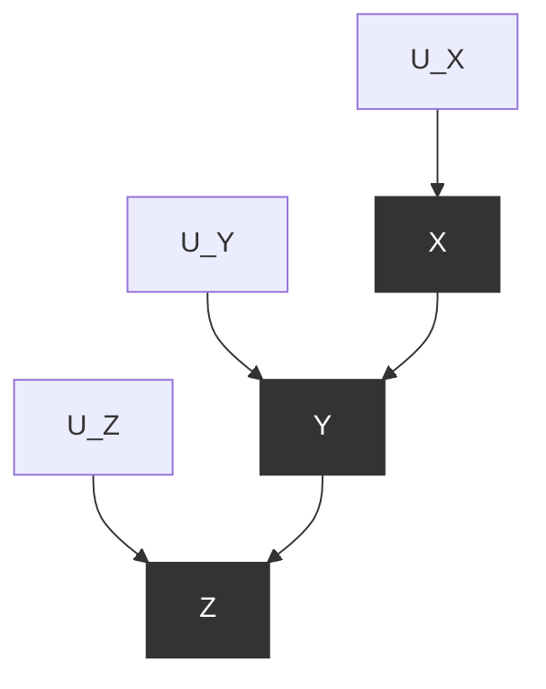
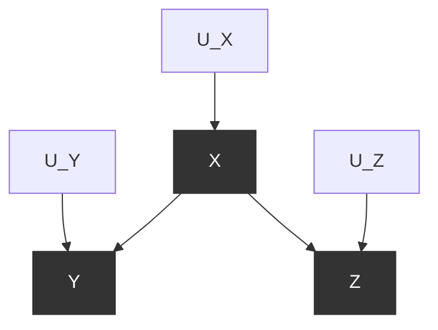
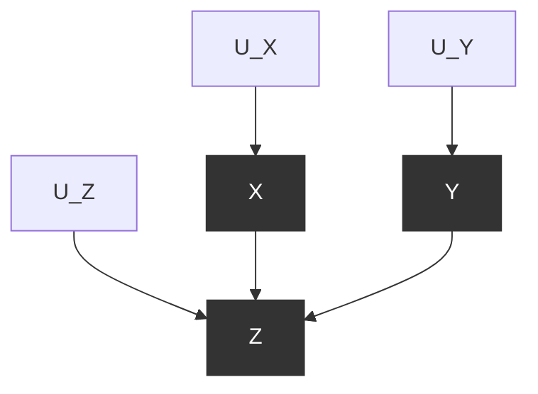
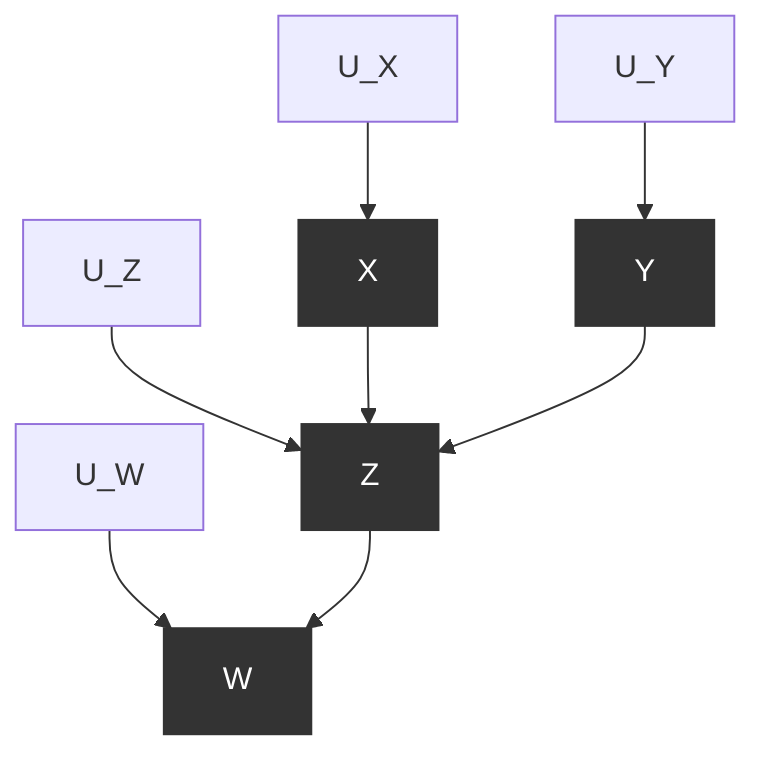
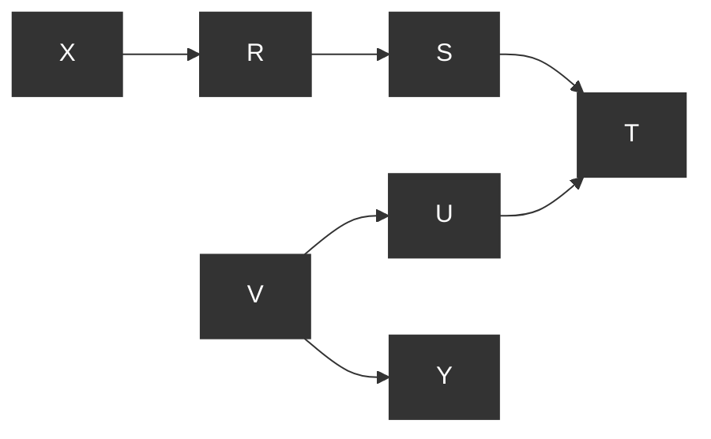
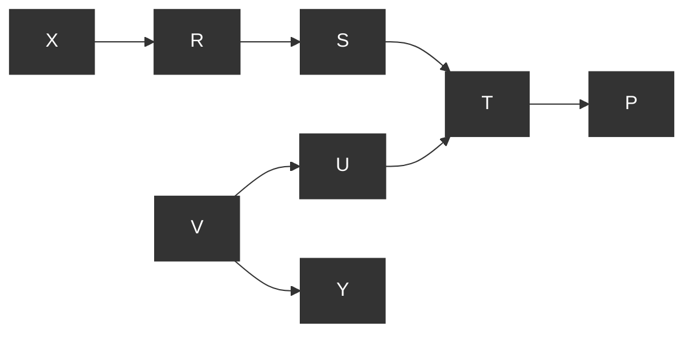
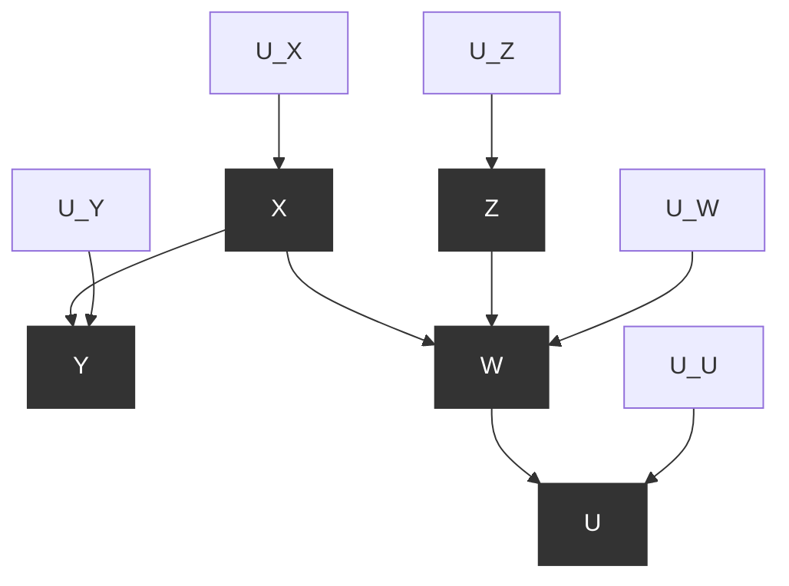
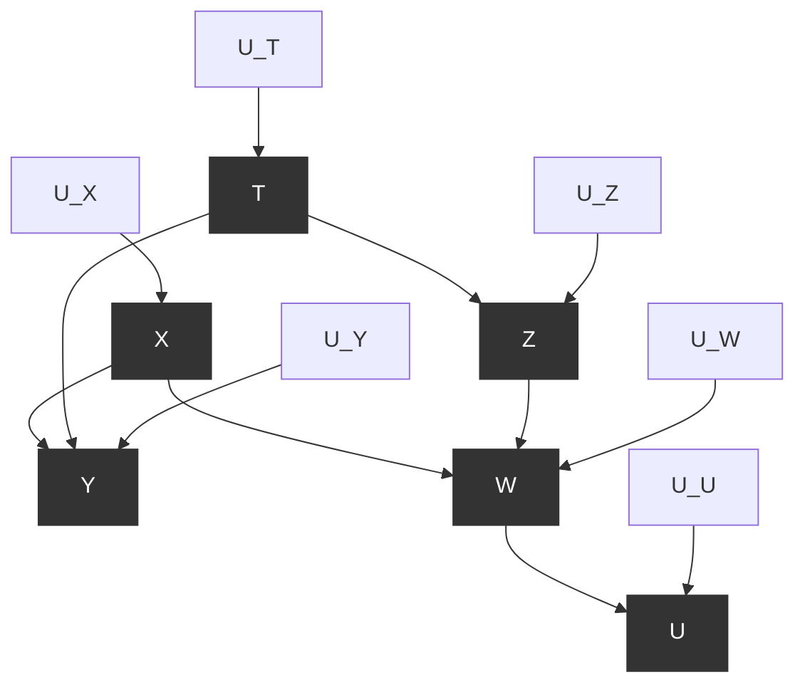
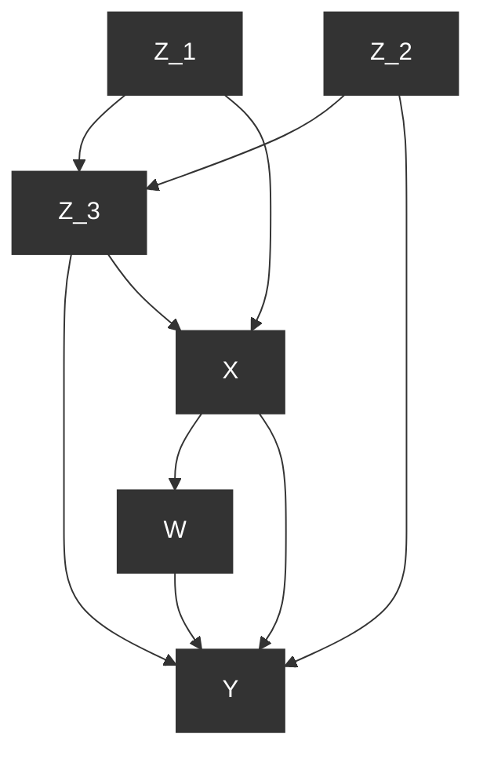

# 2 图模型及其应用（Graphical Models and Their Applications）

## 2.1 将模型与数据连接（Connecting Models to Data）

在第 1 章中，我们将概率、图和结构方程视为孤立的数学对象，它们之间几乎没有联系。但实际上，这三者是紧密相连的。在本章中，我们将展示 **独立性（independence）** 的概念——在概率语言中通过代数等式定义——可以使用 **有向无环图（directed acyclic graphs, DAGs）** 进行视觉化表达。此外，这种图形表示将使我们能够捕捉嵌入在结构方程模型中的概率信息。

最终结果是，拥有以结构方程模型形式呈现的科学知识的研究人员，能够仅基于模型图的结构，而不依赖于方程或误差分布所携带的任何定量信息，预测数据中的独立性模式。反之，这意味着观察数据中的独立性模式使我们能够对假设模型是否正确做出判断。

最终，正如我们将在第 3 章中看到的，图的结构与数据相结合，将使我们能够定量预测干预的效果，而无需实际执行这些干预。

## 2.2 链和叉（Chains and Forks）

到目前为止，我们将因果模型视为数据背后"因果故事"的表示。另一种思考方式是，因果模型代表了数据生成机制。因果模型是宇宙相关部分的一种蓝图，我们可以用它们来模拟来自这个宇宙的数据。

假设我们有一个关于高中三年级学生数学考试成绩的完整因果模型，并且知道该模型中每个外生变量的完整值列表，理论上我们可以为任何个体生成一个数据点（即考试成绩）。当然，这需要指定可能影响学生考试成绩的所有因素，这是一个不现实的任务。在大多数情况下，我们不会对模型有如此精确的了解。我们可能有一个描述外生变量的概率分布，这使我们能够生成一个近似于整个学生群体和相关学生子群体的考试成绩分布。

然而，假设我们连一个概率指定的因果模型都没有，只有模型的图形结构。我们知道哪些变量由哪些其他变量引起，但我们不知道关系的强度或性质。即使有如此有限的信息，我们也能对模型生成的数据集有相当多的了解。

从一个未指定的图形因果模型——即我们知道哪些变量是哪些其他变量的函数，但不知道连接它们的具体函数性质——我们可以了解数据集中哪些变量相互独立，哪些变量在给定其他变量的条件下相互独立。这些独立性对于具有该图形结构的因果模型生成的每个数据集都成立，无论 SCM 中附加的具体函数是什么。

例如，考虑以下三个假设的 SCM，它们都共享相同的图模型。

- 第一个 SCM 表示某高中某年资金（ $X$ ）、平均 SAT 分数（ $Y$ ）和大学录取率（ $Z$ ）之间的因果关系。
- 第二个 SCM 表示电灯开关状态（ $X$ ）、相关电路状态（ $Y$ ）和灯泡状态（ $Z$ ）之间的因果关系。
- 第三个 SCM 涉及一场赛跑的参与者。它表示参与者每周工作时间（ $X$ ）、每周训练时间（ $Y$ ）和比赛完成时间（以分钟计， $Z$ ）之间的因果关系。

在所有三个模型中，外生变量 $(U_X, U_Y, U_Z)$ 代表可能改变内生变量之间关系的任何未知或随机效应。具体来说，在 SCM 2.2.1 和 2.2.3 中， $U_Y$ 和 $U_Z$ 是解释个体间差异的加性因子。在 SCM 2.2.2 中，如果存在某些未观察到的异常， $U_Y$ 和 $U_Z$ 取值为 1，否则为 0。

SCM 2.2.1（学校资金、SAT 分数和大学录取）

$$
V = \{X, Y, Z\}, \quad U = \{U_X, U_Y, U_Z\}, \quad F = \{f_X, f_Y, f_Z\}
$$

$$
f_X: X = U_X
$$

$$
f_Y: Y = \frac{x}{3} + U_Y
$$

$$
f_Z: Z = \frac{y}{16} + U_Z
$$

SCM 2.2.2（开关、电路和灯泡）

$$
V = \{X, Y, Z\}, \quad U = \{U_X, U_Y, U_Z\}, \quad F = \{f_X, f_Y, f_Z\}
$$

$$
f_X: X = U_X
$$

$$
f_Y: Y = \left\{
\begin{array}{l}
\text{闭合 如果} (X = \text{上} \text{且} U_Y = 0) \text{或} (X = \text{下} \text{且} U_Y = 1) \\
\text{断开 否则}
\end{array}
\right.
$$

$$
f_Z: Z = \left\{
\begin{array}{l}
\text{亮 如果} (Y = \text{闭合} \text{且} U_Z = 0) \text{或} (Y = \text{断开} \text{且} U_Z = 1) \\
\text{灭 否则}
\end{array}
\right.
$$

SCM 2.2.3（工作时间、训练和比赛时间）

$$

V = \{X, Y, Z\}, \quad U = \{U_X, U_Y, U_Z\}, \quad F = \{f_X, f_Y, f_Z\}
$$

$$

f_X: X = U_X
$$

$$

f_Y: Y = 84 - x + U_Y
$$

$$

f_Z: Z = \frac{100}{y} + U_Z
$$

SCM 2.2.1–2.2.3 共享图 2.1 所示的图模型。

SCM 2.2.1 和 2.2.3 处理连续变量；SCM 2.2.2 处理分类变量。2.2.1 中变量之间的关系都是正的（即父变量的值越高，子变量的值越高）；2.2.3 中变量之间的相关性都是负的（即父变量的值越高，子变量的值越低）；2.2.2 中变量之间的相关性根本不是线性的，而是逻辑性的。

没有两个 SCM 共享任何相同的函数。但因为它们共享一个共同的图形结构，所有三个 SCM 生成的数据集必须共享某些独立性——我们可以仅通过检查图 2.1 中的图模型来预测这些独立性。由这三个 SCM 生成的数据集共享的独立性，以及所有此类 SCM 可能共享的依赖性如下：

1. **Z 和 Y 可能相关**对于某些 $z, y$ ， $P(Z = z \mid Y = y) \neq P(Z = z)$
2. **Y 和 X 可能相关**对于某些 $y, x$ ， $P(Y = y \mid X = x) \neq P(Y = y)$
3. **Z 和 X 可能相关**对于某些 $z, x$ ， $P(Z = z \mid X = x) \neq P(Z = z)$
4. **Z 和 X 在给定 Y 的条件下独立**
   对于所有 $x, y, z$ ， $P(Z = z \mid X = x, Y = y) = P(Z = z \mid Y = y)$

为了理解为什么这些独立性和依赖性成立，让我们检查图模型。首先，我们将验证任何两个有边相连的变量很可能是相关的。记住，从一个变量指向另一个变量的箭头表示第一个变量导致第二个变量——即第一个变量的值是决定第二个变量的函数的一部分。因此，第二个变量的值依赖于第一个变量；存在某些情况，改变第一个变量的值会改变第二个变量的值。这使得当我们检查数据集中的这些变量时，给定我们知道另一个变量的值，一个变量取特定值的概率很可能会改变。所以在典型的因果模型中，无论具体函数如何，通过边连接的两个变量是相关的。通过这个推理，我们可以看到在 SCM 2.2.1–2.2.3 中， **Z 和 Y** 很可能是相关的，而 **Y 和 X** 也很可能是相关的。

> **图 2.1** SCM 2.2.1–2.2.3 的图模型

从这两个事实，我们可以得出结论，Z 和 X 很可能是相关的。如果 Z 的值依赖于 Y，而 Y 的值依赖于 X，那么 Z 的值很可能依赖于 X。存在一些病理情况，其中这不成立。例如，考虑以下 SCM，它也具有图 2.1 中的图。

SCM 2.2.4（非传递依赖的病理情况）

$$

V = \{X, Y, Z\}, U = \{U_X, U_Y, U_Z\}, F = \{f_X, f_Y, f_Z\}
$$

$$

f_X: X = U_X
$$

$$

f_Y: Y = \left\{
\begin{array}{ll}
a & \text{如果} X = 1 \text{且} U_Y = 1 \\
b & \text{如果} X = 2 \text{且} U_Y = 1 \\
c & \text{如果} U_Y = 2
\end{array}
\right.
$$

$$

f_Z: Z = \left\{
\begin{array}{ll}
i & \text{如果} Y = c \text{或} U_Z = 1 \\
j & \text{如果} U_Z = 2
\end{array}
\right.
$$

在这种情况下，无论 $U_Y$ 和 $U_Z$ 取什么值，X 对 Z 的值都没有影响；X 的变化导致 Y 在 a 和 b 之间变化，但除非 Y 取值为 c，否则 Y 不会影响 Z。因此，在这个模型中，X 和 Z 独立变化。我们将此类情况称为 **非传递情况（intransitive cases）** 。

然而，非传递情况只占我们将遇到的情况的一小部分。在大多数情况下，X 和 Z 的值像 X 和 Y、Y 和 Z 一样一起变化。因此，它们在数据集中很可能是相关的。

现在，让我们考虑第 4 点：Z 和 X 在给定 Y 的条件下独立。记住，当我们以 $Y$ 为条件时，我们根据 Y 的值将数据分成组。所以我们比较所有 $Y = a$ 的情况，所有 $Y = b$ 的情况，等等。假设我们正在查看 $Y = a$ 的情况。我们想知道，仅在这些情况下，Z 的值是否独立于 X 的值。

之前，我们确定 X 和 Z 很可能是相关的，因为当 X 的值改变时，Y 的值很可能会改变，而当 Y 的值改变时，Z 的值很可能会改变。然而，现在只检查 $Y = a$ 的情况，当我们选择不同 $X$ 值的案例时， $U_Y$ 的值会改变以保持 Y 为 $Y = a$ ，但由于 Z 只依赖于 Y 和 $U_Z$ ，而不依赖于 $U_Y$ ，Z 的值保持不变。所以选择不同的 X 值不会改变 $Z$ 的值。因此，在 $Y = a$ 的情况下，X 独立于 Z。当然，无论我们以 Y 的哪个具体值为条件，这都是成立的。所以 X 在给定 Y 的条件下独立于 Z。

这种变量配置——三个节点和两条边，一条边指向中间变量，一条边从中间变量指出——被称为 **链（chain）** 。与上述类似的推理告诉我们，在任何图模型中，给定任意两个变量 X 和 Y，如果 X 和 Y 之间的唯一路径完全由链组成，那么 X 和 Y 在给定该路径上的任何中间变量时是条件独立的。这种独立关系成立，无论连接变量的函数如何。这给了我们一个规则：

> **规则 1（链中的条件独立性）**
> 两个变量 X 和 Y 在给定 Z 的条件下是条件独立的，如果 X 和 Y 之间只有一条单向路径，且 Z 是拦截该路径的任何变量集合。

一个重要说明：规则 1 仅在假设误差项 $U_X$ 、 $U_Y$ 和 $U_Z$ 相互独立时才成立。例如，如果 $U_X$ 是 $U_Y$ 的原因，那么以 Y 为条件不一定会使 X 和 Z 独立——因为 X 的变化仍然可能通过它们的误差项与 Y 的变化相关联。

现在，考虑图 2.2 中的 **图模型（graphical model）** 。该结构可能代表了，例如，连接某城市一天的温度（以华氏度为单位， $X$ ）、当地冰淇淋店当天的销售量（Y）以及该城市当天的暴力犯罪数量（Z）之间的因果机制。这些变量之间可能的函数关系在 **SCM 2.2.5** 中给出。或者，该结构也可能代表了，如 **SCM 2.2.6** 中所示，连接一个开关的状态（向上或向下，X）、一个灯泡的状态（亮或灭，Y）以及第二个灯泡的状态（亮或灭，Z）的因果机制。外生变量（exogenous variables） $U_X$ 、 $U_Y$ 和 $U_Z$ 代表了影响这些设备运行的其他（可能是随机的）因素。

SCM 2.2.5（温度、冰淇淋销量与犯罪率）

$$

V = \{X, Y, Z\}, U = \{U_X, U_Y, U_Z\}, F = \{f_X, f_Y, f_Z\}
$$

$$

f_X: X = U_X
$$

$$

f_Y: Y = 4x + U_Y
$$

$$

f_Z: Z = \frac{x}{10} + U_Z
$$

SCM 2.2.6（开关与两个灯泡）

$$

V = \{X, Y, Z\}, U = \{U_X, U_Y, U_Z\}, F = \{f_X, f_Y, f_Z\}
$$

$$

f_X: X = U_X
$$

$$

f_Y: Y = \left\{
\begin{array}{l}
\text{On IF} (X = \text{Up AND} U_Y = 0) \text{OR} (X = \text{Down AND} U_Y = 1) \\
\text{Off otherwise}
\end{array}
\right.
$$

$$

f_Z: Z = \left\{
\begin{array}{l}
\text{On IF} (X = \text{Up AND} U_Z = 0) \text{OR} (X = \text{Down AND} U_Z = 1) \\
\text{Off otherwise}
\end{array}
\right.
$$

> **图 2.2** SCM 2.2.5 和 SCM 2.2.6 的图模型

如果我们假设误差项 $U_X$ 、 $U_Y$ 和 $U_Z$ 是独立的，那么通过检查图 2.2 中的图模型，我们可以确定 **SCM 2.2.5** 和 **SCM 2.2.6** 共享以下依赖性和独立性：

1. **X 和 Y 很可能是依赖的。**对于某些 $x, y$ ，有 $P(X = x \mid Y = y) \neq P(X = x)$ 。
2. **X 和 Z 很可能是依赖的。**对于某些 $x, z$ ，有 $P(X = x \mid Z = z) \neq P(X = x)$ 。
3. **Z 和 Y 很可能是依赖的。**对于某些 $z, y$ ，有 $P(Z = z \mid Y = y) \neq P(Z = z)$ 。
4. **Y 和 Z 在给定 X 的条件下是独立的。**
   对于所有 $x, y, z$ ，有 $P(Y = y \mid Z = z, X = x) = P(Y = y \mid X = x)$ 。

第 1 点和第 2 点再次源于这样一个事实：Y 和 Z 都通过箭头直接连接到 X，因此当 X 的值改变时，Y 和 Z 的值都可能改变。然而，这告诉我们更多信息：如果当 X 改变时 Y 改变，并且当 X 改变时 Z 改变，那么 Y 很可能（尽管不确定）会与 Z 一起改变，反之亦然。因此，由于 Y 值的变化为我们提供了关于 Z 值相关变化的信息，所以 Y 和 Z 很可能是依赖变量。

那么，为什么 Y 和 Z 在给定 X 的条件下是独立的呢？当我们对 X 进行条件化（condition on X）时会发生什么？我们根据 X 的值过滤数据。所以，现在我们只比较 X 值保持不变的情况。由于 X 不变，Y 和 Z 的值不会随之改变——它们只响应于 $U_Y$ 和 $U_Z$ 而改变，而我们假设 $U_Y$ 和 $U_Z$ 是独立的。因此，Y 和 Z 值的任何额外变化必须彼此独立。

这种变量配置——三个节点，其中中间变量发出两条箭头——被称为 **叉接（fork）** 。叉接中的中间变量是其他两个变量及其任何后代的 **共同原因（common cause）** 。如果两个变量共享一个共同原因，并且该共同原因是它们之间唯一路径的一部分，那么与上述类似的推理告诉我们，这些依赖性和条件独立性

## 2.3 碰撞器（Colliders）

到目前为止，我们已经研究了在连接两个变量的路径上可能出现的两种简单的边和节点配置：链式（chain）和叉接（fork）。还有第三种这样的配置，我们将其单独讨论，因为它带来了独特的考量和挑战。第三种配置包含一个 **碰撞器节点（collider node）** ，当一个节点接收来自其他两个节点的边时，就会出现这种情况。包含碰撞器的最简单的图因果模型如图 2.3 所示，它表示两个原因 X 和 Y 的一个共同效应 Z。

与每个图因果模型的情况一样，所有以图 2.3 为图的 SCM 共享一组我们可以仅从图模型中确定的依赖性和独立性。在图 2.3 的模型情况下，假设 $U_X$ 、 $U_Y$ 和 $U_Z$ 独立，这些独立性如下：

> 图 2.3 一个简单的碰撞器

1. X 和 Z 很可能是依赖的。对于某些 x, z，有 $P(X = x \mid Z = z) \neq P(X = x)$ 。
2. Y 和 Z 很可能是依赖的。对于某些 y, z，有 $P(Y = y \mid Z = z) \neq P(Y = y)$ 。
3. X 和 Y 是独立的。对于所有 x, y，有 $P(X = x \mid Y = y) = P(X = x)$ 。
4. X 和 Y 在给定 Z 的条件下很可能是依赖的。对于某些 x, y, z，有 $P(X = x \mid Y = y, Z = z) \neq P(X = x \mid Z = z)$ 。

前两点的正确性已在第 2.2 节中确立。第 3 点是不言自明的；X 和 Y 既不是彼此的后代也不是祖先，它们也不依赖于同一个变量来获取其值。它们只响应于假设独立的 $U_X$ 和 $U_Y$ ，因此不存在任何因果机制使得 X 值的变化应与 Y 值的变化相关联。这种独立性也反映了我们对因果关系在时间中如何运作的理解；在当下独立的事件，不会仅仅因为它们在未来可能具有共同效应而变得依赖。

那么，为什么第 4 点成立呢？为什么两个独立的变量在我们对它们的共同效应进行条件化时会突然变得依赖？为了回答这个问题，我们再次回到条件化的定义，即按条件化变量的值进行过滤。当我们对 Z 进行条件化时，我们将比较限制在 Z 取相同值的情况。但请记住，Z 的值依赖于 X 和 Y。因此，在比较 Z 取某个值的情况时，X 值的任何变化都必须由 Y 值的变化来补偿——否则，Z 的值也会改变。

碰撞器这一属性（即对碰撞节点进行条件化会在该节点的父节点之间产生依赖性）背后的推理起初可能难以掌握。在最基本的情况下， $Z = X + Y$ ，且 X 和 Y 是独立变量，我们有如下逻辑：如果我告诉你 $X = 3$ ，你对 Y 的可能值一无所知，因为这两个数字是独立的。另一方面，如果我一开始告诉你 $Z = 10$ ，那么告诉你 $X = 3$ 会立即告诉你 Y 必定是 7。因此，在给定 $Z = 10$ 的条件下，X 和 Y 是依赖的。

这种现象可以通过一个现实生活中的例子进一步阐明。例如，假设某所大学向两类学生提供奖学金：具有非凡音乐天赋的学生和拥有极高平均绩点的学生。通常，音乐天赋和学业成就是独立的特质，因此，在总体人群中，发现一个有音乐天赋的人并不能告诉我们关于此人成绩的任何信息。然而，发现一个人获得了奖学金则改变了情况；知道此人缺乏音乐天赋会立即告诉我们他很可能拥有很高的平均绩点。因此，两个边际独立的变量在获知第三个变量（奖学金）的值（该变量是前两个变量的共同效应）后变得依赖。

让我们检查一个数值例子。考虑同时（独立）抛掷两枚均匀硬币，以及一个只要至少一枚硬币正面朝上就会响铃的铃铛。设两枚硬币的结果分别为 X 和 Y，设 Z 代表铃铛的状态，其中 Z = 1 表示响铃，Z = 0 表示静音。该机制可以表示为图 2.3 中的一个碰撞器，其中两枚硬币的结果是父节点，铃铛的状态是碰撞节点。

如果我们知道硬币 1 正面朝上，由于它们的独立性，这并不能告诉我们关于硬币 2 结果的任何信息。但是，假设我们听到铃铛响了，然后我们得知硬币 1 反面朝上。我们现在知道硬币 2 必定正面朝上。类似地，如果我们假设我们听到了铃铛响，并且我们得知硬币 2 也正面朝上，那么硬币 1 正面朝上的概率会发生变化。这种特定的概率变化比第一种情况要微妙一些。

要查看后一种计算，请考虑表 2.1 中所示的初始概率。我们看到

$$

P(X = \text{“Heads”} \mid Y = \text{“Heads”}) = P(X = \text{“Tails”} \mid Y = \text{“Tails”}) = \frac{1}{2}
$$

也就是说，X 和 Y 是独立的。现在，让我们对 $Z = 1$ 和 $Z = 0$ （铃铛响和不响）进行条件化。得到的数据子集如表 2.2 所示。

通过计算这些表中的概率，我们得到

$$

P(X = \text{“Heads”} \mid Z = 1) = \frac{1}{3} + \frac{1}{3} = \frac{2}{3}
$$

如果我们进一步过滤 Z = 1 的子表，只检查那些 $Y = \text{“Heads”}$ 的情况，我们得到

$$

P(X = \text{“Heads”} \mid Y = \text{“Heads”}, Z = 1) = \frac{1}{2}
$$

我们看到，在给定 $Z = 1$ 的条件下，在获知 $Y = \text{“Heads”}$ 后， $X = \text{“Heads”}$ 的概率从 $\frac{2}{3}$ 变为 $\frac{1}{2}$ 。所以，显然，在给定 $Z = 1$ 的条件下， $X$ 和 $Y$ 是依赖的。当然，当铃铛不响时 ( $Z = 0$ )，会出现更显著的依赖性，因为那时我们知道两枚硬币都必须反面朝上。

**表 2.1** 抛掷两枚均匀硬币的概率分布，其中 $X$ 代表第一次抛掷， $Y$ 代表第二次抛掷， $Z$ 代表一个铃铛，如果任一次抛掷结果为正面则响铃。

| X     | Y     | Z   | P(X, Y, Z) |
| ----- | ----- | --- | ---------- |
| Heads | Heads | 1   | 0.25       |
| Heads | Tails | 1   | 0.25       |
| Tails | Heads | 1   | 0.25       |
| Tails | Tails | 0   | 0.25       |

**表 2.2** 表 2.1 中分布的条件概率分布。
_(上：给定 $Z = 1$ 的条件分布。下：给定 $Z = 0$ 的条件分布。)_

| X     | Y     | P(X, Y \vert Z = 1) |
| ----- | ----- | ------------------- |
| Heads | Heads | 0.333               |
| Heads | Tails | 0.333               |
| Tails | Heads | 0.333               |
| Tails | Tails | 0                   |

| X     | Y     | P(X, Y \vert Z = 0) |
| ----- | ----- | ------------------- |
| Heads | Heads | 0                   |
| Heads | Tails | 0                   |
| Tails | Heads | 0                   |
| Tails | Tails | 1                   |

碰撞器在起作用时的另一个例子——可能有助于进一步阐明此类配置可能给统计学家带来的困难——是 **蒙提霍尔问题（Monty Hall Problem）** ，我们首次在第 1.3 节中遇到过。其核心在于，蒙提霍尔问题反映了碰撞器的存在。你最初选择的门是一个父节点；汽车所在的门是另一个父节点；蒙蒂打开并露出一只山羊的门是碰撞节点，它受到其他两个变量的因果影响。这里的因果关系很明确：如果你选择了 A 门，并且 A 门后面有一只山羊，蒙蒂被迫打开剩下的门中后面有山羊的那一扇。

你最初的选择和汽车的位置是独立的；这就是为什么你最初有 $\frac{1}{3}$ 的机会选到后面有汽车的门。然而，与两枚独立的硬币一样，在给定蒙蒂选择的门的条件下，你最初的选择和奖品的放置是依赖的。尽管汽车可能只在 $\frac{1}{3}$ 的情况下位于 B 门后面，但在你选择了 A 门并且蒙蒂打开了 C 门的情况下，汽车位于 B 门后面的概率是 $\frac{2}{3}$ 。

正如对碰撞器进行条件化会使先前独立的变量变得依赖一样，对碰撞器的任何后代进行条件化也会如此。要理解为什么这是真的，让我们回到我们关于两枚独立硬币和一个铃铛的例子。假设我们没有直接听到铃铛声，而是依赖一个有点不可靠的目击者；每当铃铛不响时，我们的目击者有 50% 的可能性会错误地报告它响了。让 $W$ 代表目击者的报告，其因果结构如图 2.4 所示，所有 $X$ 、 $Y$ 和 $W$ 组合的概率如表 2.3 所示。

读者可以很容易地验证，基于此表，我们有

$$

P(X = \text{“Heads”} \mid Y = \text{“Heads”}) = P(X = \text{“Heads”}) = \frac{1}{2}
$$

并且

$$

P(X = \text{“Heads”} \mid W = 1) = (0.25 + 0.25) \div (0.25 + 0.25 + 0.25 + 0.125) = \frac{0.5}{0.875}.
$$

$$

P(X = \text{“Heads”} \mid Y = \text{“Heads”}, W = 1) = 0.25 \div (0.25 + 0.25) = 0.5 < \frac{0.5}{0.875}
$$

> **图 2.4** 一个简单的碰撞器（collider）Z，带有一个子节点 W，表示表 2.3 中的场景，其中 X 表示一次抛硬币，Y 表示第二次抛硬币，Z 表示一个铃铛，当 X 或 Y 为正面时响铃，W 表示一个不可靠的目击者，他报告铃铛是否响过。

**表 2.3** 公平硬币两次抛掷的概率分布，以及当任意一次抛掷为正面时铃响的情况，其中 X 表示第一次抛掷，Y 表示第二次抛掷，W 表示一个目击者，其可靠性可变，报告铃铛是否响过。

| X     | Y     | W   | P(X, Y, W) |
| ----- | ----- | --- | ---------- |
| Heads | Heads | 1   | 0.25       |
| Heads | Tails | 1   | 0.25       |
| Tails | Heads | 1   | 0.25       |
| Tails | Tails | 1   | 0.125      |
| Tails | Tails | 0   | 0.125      |

因此，在阅读目击者报告之前，X 和 Y 是独立的，但在此之后变得相关。

这些考虑引导我们得出第三条规则，除了我们在第 2.2 节中建立的两条规则之外。

**规则 3（碰撞器中的条件独立性）**
如果变量 Z 是两个变量 X 和 Y 之间的碰撞节点，并且 X 和 Y 之间只有一条路径，那么 X 和 Y 是无条件独立的，但在以 Z 和 Z 的任何后代为条件时是相关的。

规则 3 对因果研究极为重要。在接下来的章节中，我们将看到，它使我们能够检验某个因果模型是否可能生成了一个数据集，从数据中发现模型，并通过确定要测量哪些变量以及如何在混杂（confounding）下估计因果效应来完全解决辛普森悖论（Simpson's Paradox）。

> **备注**
> 好学的学生可能会好奇，为什么与在碰撞器上取条件相关的依赖性对大多数人来说如此令人惊讶——例如，在蒙提霍尔问题（Monty Hall example）中。原因在于，人类倾向于将依赖性与因果关系联系起来。因此，他们（错误地）假设，两个变量之间的统计依赖性只有在存在产生这种依赖性的因果机制时才能存在；也就是说，要么其中一个变量导致另一个变量，要么第三个变量同时导致两者。在碰撞器的情况下，他们惊讶地发现一种以第三种方式产生的依赖性，从而违反了“无因果则不相关”的假设。

> **图 2.5** 用于演示条件独立性的有向图（未明确显示误差项）。

> **图 2.6** 一个 P 是碰撞器后代的有向图。

学习问题（Study Questions）

学习问题 2.3.1

- (a) 列出图 2.5 中所有在以集合 $Z = \{R, V\}$ 为条件时独立的变量对。
- (b) 对于图 2.5 中的每一对非相邻变量，给出一个变量集合，当以该集合为条件时，使得该对变量独立。
- (c) 列出图 2.6 中所有在以集合 $Z = \{R, P\}$ 为条件时独立的变量对。
- (d) 对于图 2.6 中的每一对非相邻变量，给出一个变量集合，当以该集合为条件时，使得该对变量独立。
- (e) 假设我们由图 2.5 描述的模型生成数据，并拟合线性方程 $Y = a + bX + cZ$ 。可以选择模型中的哪些变量作为 Z，以保证斜率 b 等于零？
  > _提示：_ 回想一下，非零斜率意味着在给定 Z 的情况下 Y 和 X 是相关的。
- (f) 继续问题 (e)，但现在参考图 2.6，假设我们拟合数据使用方程：

$$

Y = a + bX + cR + dS + eT + fP
$$

哪些系数为零？

## 2.4 d-分离（d-separation）

因果模型通常不像我们迄今为止所考察的案例那样简单。具体地说，一个图形模型很少由变量之间的单一路径组成。在大多数图形模型中，变量对之间会有多条可能的路径连接它们，每条路径会穿过各种链（chains）、叉（forks）和碰撞器（colliders）。问题仍然在于，是否存在一个可以应用于任何复杂程度的图形因果模型的标准或过程，以预测该图生成的所有数据集所共有的依赖性。

确实存在这样一个过程： **d-分离** ，它建立在上一节建立的规则之上。d-分离（_d_ 代表“有向的”）使我们能够确定，对于任何一对节点，这些节点是 _d-连通_（d-connected）——意味着它们之间存在一条连接路径——还是 _d-分离_（d-separated）——意味着不存在这样的路径。当我们说一对节点是 d-分离时，意味着它们所代表的变量是确定的独立；当我们说一对节点是 d-连通时，意味着它们可能是，或者极有可能相关的。¹

两个节点 $X$ 和 $Y$ 是 **d-分离** 的，如果它们之间的每条路径（如果存在的话）都被阻塞。如果 $X$ 和 $Y$ 之间甚至有一条路径是未阻塞的，那么 $X$ 和 $Y$ 就是 **d-连通** 的。变量之间的路径可以被视为管道，而相关性则像是流经管道的水；如果甚至有一条管道是未堵塞的，一些水就可以从一个地方流到另一个地方，如果一条路径是畅通的，那么两端的变量将是相关的。然而，一条管道只需在一个地方被堵塞就能阻止水流通过它，类似地，只需要一个节点就能阻止相关性在整个路径中通过。

有某些类型的节点可以阻塞一条路径，这取决于我们是在进行无条件的还是条件性的 d-分离。如果我们 **没有** 以任何变量为条件，那么只有 **碰撞器** 可以阻塞一条路径。这样做的原因相当直接：正如我们在第 2.3 节中看到的，无条件相关性不能通过碰撞器。因此，如果两个节点 $X$ 和 $Y$ 之间的每条路径都有一个碰撞器，那么 $X$ 和 $Y$ 不能是无条件相关的；它们必须是边缘独立（marginally independent）的。

然而，如果我们是以一组节点 $Z$ 为条件，那么以下类型的节点可以阻塞一条路径：

- 一个 **没有** 被取条件（即不在 $Z$ 中）的碰撞器，并且它在 $Z$ 中没有后代。
- 一个中间节点 **在** $Z$ 中的链或叉。

这些点背后的推理可以追溯到我们在第 2.2 和 2.3 节中学到的内容。碰撞器不允许相关性在其父节点之间流动，从而阻塞了路径。但规则 3 告诉我们，当我们以碰撞器或其后代为条件时，父节点可能变得相关。因此，其碰撞节点不在条件集 $Z$ 中的碰撞器会阻止相关性通过一条路径，但其碰撞节点或其后代在条件集 $Z$ 中的碰撞器则不会。相反，相关性可以通过非碰撞器——链和叉——但规则 1 和 2 告诉我们，当我们以它们为条件时，这些路径两端的变量变得独立（当我们一次考虑一条路径时）。因此，条件集中的任何非碰撞节点会阻塞相关性，而不在条件集中的节点则允许相关性通过。

我们现在准备给出 d-分离的通用定义：

> **定义 2.4.1（d-分离）**一条路径 $p$ 被节点集合 $Z$ 阻塞，当且仅当
>
> 1. $p$ 包含一个链 $A \rightarrow B \rightarrow C$ 或一个叉 $A \leftarrow B \rightarrow C$ ，使得中间节点 $B$ 在 $Z$ 中（即 $B$ 被取条件），或者
> 2. $p$ 包含一个碰撞器 $A \rightarrow B \leftarrow C$ ，使得碰撞节点 $B$ **不在** $Z$ 中，并且 $B$ 的任何后代都不在 $Z$ 中。

> **图 2.7** 一个包含带有子节点的碰撞器和叉的图形模型

如果 $Z$ 阻塞了两个节点 $X$ 和 $Y$ 之间的每一条路径，那么 $X$ 和 $Y$ 在给定 $Z$ 的条件下是 d-分离的，因此在给定 $Z$ 的条件下是独立的。

有了 d-分离这个工具，我们现在可以考察一些更复杂的图形模型，并确定其中哪些变量是独立的和相关的，无论是边缘的还是以其他变量为条件的。让我们以图 2.7 中的图形模型为例。这个图可能与任意数量的因果模型相关联。变量可以是离散的、连续的，或两者的混合；它们之间的关系可以是线性的、指数的，或无限多种其他关系中的任何一种。然而，无论模型如何，d-分离总是会在模型生成的数据中提供相同的独立性集合。

具体来说，让我们看看 $Z$ 和 $Y$ 之间的关系。使用空的条件集，它们是 d-分离的，这告诉我们 $Z$ 和 $Y$ 是无条件独立的。为什么？因为它们之间没有未阻塞的路径。 $Z$ 和 $Y$ 之间只有一条路径，并且该路径被一个碰撞器阻塞 $( Z \rightarrow W \leftarrow X \rightarrow Y )$ 。

但假设我们以 $W$ 为条件。d-分离告诉我们，在给定 $W$ 的条件下， $Z$ 和 $Y$ 是 d-连通的。原因在于我们的条件集现在是 $\{W\}$ ，并且由于 $Z$ 和 $Y$ 之间的唯一路径包含一个 **不在** 该集合中的叉 ( $X$ )，并且该路径上的唯一碰撞器 ( $W$ ) **在** 该集合中，因此该路径没有被阻塞。（记住，以碰撞器为条件会“解锁”它们。）如果我们以 $U$ 为条件，情况也是如此，因为 $U$ 是 $Z$ 和 $Y$ 之间路径上的一个碰撞器的后代。

另一方面，如果我们以集合 $\{W, X\}$ 为条件， $Z$ 和 $Y$ 保持独立。这次， $Z$ 和 $Y$ 之间的路径是由第一个标准而非第二个标准阻塞的：路径上现在有一个在条件集中的非碰撞器节点 ( $X$ )。尽管 $W$ 已通过取条件被解锁，但一个被阻塞的节点就足以阻塞整条路径。由于 $Z$ 和 $Y$ 之间的唯一路径被这个条件集阻塞，因此在给定 $\{W, X\}$ 的条件下， $Z$ 和 $Y$ 是 d-分离的。

现在，考虑当我们添加另一条 $Z$ 和 $Y$ 之间的路径时会发生什么，如图 2.8 所示。 $Z$ 和 $Y$ 现在是无条件相关的。为什么？因为它们之间有一条路径 $( Z \leftarrow T \rightarrow Y )$ ，其中不包含碰撞器。然而，如果我们以 $T$ 为条件，那条路径就被阻塞了， $Z$ 和 $Y$ 再次变得独立。另一方面，以 $\{T, W\}$ 为条件使它们再次变得 d-连通（以 $T$ 为条件阻塞了路径 $Z \leftarrow T \rightarrow Y$ ，但以 $W$ 为条件解锁了路径 $Z \rightarrow W \leftarrow X \rightarrow Y$ ）。并且如果我们将 $X$ 添加到条件集中，使其变为 $\{T, W, X\}$ ， $Z$ 和 $Y$ 再次变得独立！

在这个图中， $Z$ 和 $Y$ 在以 $W$ , $U$ , $\{W, U\}$ , $\{W, T\}$ , $\{U, T\}$ , $\{W, U, T\}$ , $\{W, X\}$ , $\{U, X\}$ 和 $\{W, U, X\}$ 为条件时是 d-连通的（因此很可能相关）。它们在以 $T$ , $\{X, T\}$ , $\{W, X, T\}$ , $\{U, X, T\}$ 和 $\{W, U, X, T\}$ 为条件时是 d-分离的（因此独立）。注意， $T$ 出现在每一个使 $Z$ 和 $Y$ d-分离的条件集中；这是因为 $T$ 是唯一一条无条件 d-连接 $Z$ 和 $Y$ 的路径上的节点，所以除非以它为条件，否则 $Z$ 和 $Y$ 将始终是 d-连通的。

> **图 2.8** 图 2.7 中的模型，在 $Z$ 和 $Y$ 之间增加了一条叉路径

---

学习问题（Study questions）

学习问题 2.4.1

下面的图 2.9 表示一个因果图，其中误差项已被删除。假设所有这些误差项是相互独立的。

## 2.5 模型检验与因果搜索（Model Testing and Causal Search）

前面的章节表明，因果模型在其生成的数据集中具有可检验的含义。例如，如果我们有一个我们认为可能生成了数据集 $S$ 的图 $G$ ，d-分离将告诉我们 $G$ 中哪些变量必须在以哪些其他变量为条件时是独立的。条件独立性是我们可以使用数据集来检验的。

假设我们列出 $G$ 中的 d-分离条件，并注意到变量 $A$ 和 $B$ 必须在以 $C$ 为条件时是独立的。然后，假设我们基于 $S$ 估计概率，并发现数据表明 $A$ 和 $B$ **并非** 在以 $C$ 为条件时独立。那么我们可以拒绝 $G$ 作为 $S$ 的一个可能的因果模型。

> **图 2.9** 学习问题 2.4.1 中使用的因果图，所有 $U$ 项（未显示）假设是独立的。

我们可以用图 2.9 的因果模型来演示。在该模型所声明的众多条件独立性中，我们发现 $W$ 和 $Z_1$ 在给定 $X$ 的条件下是独立的，因为 $X$ 将 $W$ 与 $Z_1$ d-分离。现在假设我们对 $W$ 关于 $X$ 和 $Z_1$ 进行回归。即，我们找到最适合我们数据的直线：

$$

w = r_{\mathrm{X}} x + r_{1} z_{1}
$$

如果结果发现 $r_{1}$ **不等于零** ，我们就知道 $W$ 在给定 $X$ 的条件下依赖于 $Z_1$ ，因此该模型是错误的。

> **回顾：** 条件相关意味着条件依赖。

我们不仅知道模型是错误的，我们还知道它 _在哪里_ 是错误的；真实的模型必须有一条 $W$ 和 $Z_1$ 之间的路径，该路径不被 $X$ d-分离。最后，这是一个对所有具有独立误差的无环模型（acyclic models）都成立的理论结果（Verma and Pearl 1990），并且我们也知道，如果模型中的每个 d-分离条件都与数据中的条件独立性相匹配，那么没有进一步的检验可以反驳该模型。这意味着，对于任何数据集，我们总能找到一组函数 $F$ 用于模型，并为 $U$ 项分配概率，从而精确地生成该数据。

还有其他方法用于检验模型的拟合度。评估拟合度的标准方法涉及对整个模型进行统计假设检验，也就是说，我们评估观察到的样本是由假设模型生成的可能性，而不是纯粹偶然。然而，由于模型并非完全指定，我们需要在评估该可能性之前首先估计其参数。当我们假设一个线性和高斯模型（即模型中的所有函数都是线性的，所有误差项都是正态分布的）时，这可以（近似地）完成，因为在这种假设下，联合分布（也是高斯的）可以用模型的参数简洁地表示，然后我们可以评估观察到的样本由完全参数化的模型生成的可能性（Bollen 1989）。

然而，这个过程存在一些问题：

- **首先** ，如果任何参数无法估计，那么联合分布就无法估计，模型也就无法检验。正如我们将在第 3.8.3 节中看到的，当某些误差项相关时，或者等价地，当某些变量未被观测到时，可能会发生这种情况。
- **其次** ，这个过程是 _全局地_ 检验模型。如果我们发现模型与数据拟合不佳，我们无法确定原因——应该移除或添加哪些边以改善拟合。
- **第三** ，当我们全局地检验一个模型时，涉及的变量数量可能很大，并且如果每个变量都存在测量噪声和/或抽样变异，那么该检验将不可靠。

d-分离相比这种全局检验方法具有几个优点：

- **首先** ，它是 _非参数_ 的，意味着它不依赖于连接变量的具体函数；相反，它仅使用所讨论模型的图。
- **其次** ，它是 _局部地_ 而非全局地检验模型。这使我们能够识别假设模型存在缺陷的具体区域，并进行修复，而不是从头开始构建一个全新的模型。这也意味着，如果由于某种原因，我们无法识别模型某个区域中的系数，我们仍然可以获得关于模型其余部分的一些不完整信息。（与第一种方法相反，在第一种方法中，如果我们无法估计一个系数，我们就无法检验模型的任何部分。）

如果我们有一台计算机，我们可以通过这种方式检验并拒绝许多可能的模型，最终将可能的模型集合缩减到只有少数几个，其可检验含义与数据集中存在的依赖性不矛盾。这是一个模型集合，而不是单个模型，因为有些图具有无法区分的含义。具有无法区分的含义的一组图称为一个 **等价类（equivalence class）** 。如果两个图 $G_1$ 和 $G_2$ 共享一个共同的骨架（skeleton）——即相同的边，无论这些边的方向如何——并且它们共享共同的 v-结构（v-structures），即其父节点不相邻的碰撞器，那么它们属于同一个等价类。满足此标准的任何两个图都具有相同的 d-分离条件集，因此具有相同的可检验含义集（Verma and Pearl 1990）。

这个结果的重要性在于，它允许我们在数据集中搜索可能生成该数据的因果模型。因此，我们不仅可以从一个因果模型开始并生成一个数据集——我们还可以从一个数据集开始，并反向推理出一个因果模型。这非常有用，因为大多数数据驱动的研究的目标正是找到一个能够解释数据的模型。

还有其他因果搜索方法——包括一些依赖于我们本节开始时讨论的那种全局模型检验的方法——但对它们的全面研究超出了本书的范围。有兴趣了解更多关于搜索内容的人应参考（Pearl 2000; Pearl and Verma 1991; Rebane and Pearl 1987; Spirtes and Glymour 1991; Spirtes et al. 1993）。

学习问题 2.5.1

- (a) 图 2.9 中的哪些箭头可以被反转而不被任何统计检验检测到？[提示：使用等价类的标准。]
- (b) 列出所有与图 2.9 在观测上等价的图。
- (c) 列出图 2.9 中其方向性可以从非实验数据中确定的箭头。
- (d) 为 $Y$ 写出一个回归方程，使得如果该方程中的某个系数非零，则图 2.9 的模型是错误的。
- (e) 对变量 $Z_3$ 重复问题 (d)。
- (f) 假设 $X$ 未被测量，重复问题 (e)。
- (g) 需要多少个 (d) 和 (e) 中描述类型的回归方程才能确保模型被完全检验，即，如果它通过了所有这些检验，它就不能被此类额外检验所反驳。[提示：确保你检验了由乘积分解 (1.29) 所隐含的每一个消失的偏回归系数。]

## 第 2 章参考文献注释（Bibliographical Notes for Chapter 2）

因果模型中链和叉之间的区别由 Simon (1953) 和 Reichenbach (1956) 提出，而对碰撞器（或共同效应）的处理可以追溯到英国经济学家 Pigou (1911)（参见 Stigler 1999, pp. 36–41）。在流行病学中，碰撞器与“选择偏倚（Selection bias）”或“伯克森悖论（Berkson paradox）”（Berkson 1946）相关联，而在人工智能中，它被称为“解释排除效应（explaining away effect）”（Kim and Pearl 1983）。

用于通过图形确定条件独立性的 d-分离规则（定义 2.4.1）由 Pearl (1986) 引入，并由 Verma and Pearl (1988) 使用图论（graphoids）理论（Pearl and Paz 1987）正式证明。关于 d-分离的温和介绍可在 Hayduk et al. (2003)、Glymour and Greenland (2008) 以及 Pearl (2000, pp. 335–337) 中找到。用于检测 d-分离以及寻找最小分离集的算法和软件在 Tian et al. (1998)、Kyono (2010) 和 Textor et al. (2011) 中有所描述。

局部模型检验优于全局模型检验的优势在 Pearl (2000, pp. 144–145) 中讨论，并在 Chen and Pearl (2014) 中进一步阐述。d-分离的最新应用包括跨群体的外推（extrapolation across populations）（Pearl and Bareinboim 2014）、从抽样选择偏倚中恢复（Bareinboim et al. 2014）以及处理缺失数据（Mohan et al. 2013）。
