# 3 干预的效果（The Effects of Interventions）

## 3.1 干预（Interventions）

许多统计研究的最终目标是预测干预的效果。当我们收集与西部野火相关的因素数据时，实际上是在寻找可以干预以降低野火频率的方法。当我们进行一项关于新抗癌药物的研究时，我们试图确定患者在接受药物治疗后，其病情如何响应。当我们研究暴力电视节目与儿童攻击行为之间的相关性时，我们试图判断干预以减少儿童接触暴力电视是否会降低他们的攻击性。

正如你在统计学课程中无数次听到的那样，"相关性不等于因果性"。两个变量之间仅仅存在关联，并不一定（甚至通常不）意味着其中一个变量导致另一个变量。（这一特性的著名例子是：冰淇淋销量的增加与暴力犯罪的增加相关——并非因为冰淇淋导致犯罪，而是因为冰淇淋销量和暴力犯罪在炎热天气中都更为常见。）出于这个原因， **随机对照实验（randomized controlled experiment）** 被视为统计学的黄金标准。在一个设计得当的随机对照实验中，所有影响结果变量的因素要么保持不变，要么随机变化，只有一个因素例外——因此结果变量的任何变化都必然归因于这个输入变量。

不幸的是，许多问题并不适合进行随机对照实验。我们无法控制天气，因此无法随机化影响野火的变量。我们理论上可以随机化一项关于暴力电视研究的参与者，但很难有效控制每个孩子看电视的时间，并且几乎无法知道我们是否有效地控制了它们。即使是随机药物试验，当参与者退出、未能服药或误报用药情况时，也可能出现问题。

在随机对照实验不可行的情况下，研究人员转而进行 **观察性研究（observational studies）** ，即仅记录数据，而非控制数据。这类研究的问题在于，很难将因果关系与单纯的相关关系区分开来。我们的常识告诉我们，干预冰淇淋销量不太可能对犯罪产生任何影响，但事实并不总是如此清晰。例如，考虑最近温尼伯大学的一项研究，该研究表明青少年频繁发短信与"肤浅"相关。媒体抓住这一点，声称发短信使青少年变得更加肤浅。（或者，用干预的语言来说，干预减少青少年发短信会使他们不那么肤浅。）然而，该研究根本没有证明这一点。可能是肤浅使青少年更倾向于发短信。也可能是肤浅和频繁发短信都是由一个共同因素——也许是基因——引起的，如果可能的话，干预该变量会同时减少两者。

> *Causal Inference in Statistics: A Primer*, First Edition. Judea Pearl, Madelyn Glymour, and Nicholas P. Jewell. © 2016 John Wiley & Sons, Ltd. Published 2016 by John Wiley & Sons, Ltd. Companion Website: [www.wiley.com/go/Pearl/Causality](http://www.wiley.com/go/Pearl/Causality)

**干预一个变量**与**以该变量为条件**之间的区别应该是显而易见的。

- 当我们对模型中的一个变量进行干预时，我们固定了它的值。我们改变了系统，其他变量的值通常会因此发生变化。
- 当我们以某个变量为条件时，我们什么也没有改变；我们只是将注意力缩小到该变量取我们感兴趣值的那些案例子集上。因此，改变的是我们对世界的认知，而不是世界本身。

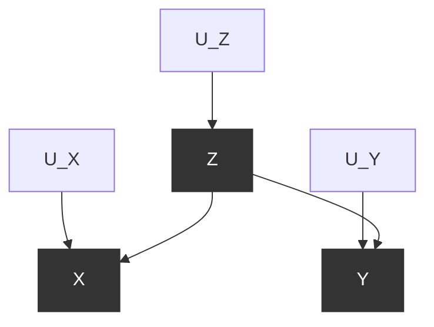


> **图 3.1**  表示温度（ $Z$ ）、冰淇淋销量（ $X$ ）和犯罪率（ $Y$ ）之间关系的图形模型

例如，考虑图 3.1，它展示了我们冰淇淋销量例子的图形模型，其中  $X$  为冰淇淋销量， $Y$  为犯罪率， $Z$  为温度。当我们干预固定一个变量的值时，我们抑制了该变量在自然中响应其他变量而变化的自然趋势。这相当于对图形模型进行一种手术，移除所有指向该变量的边。如果我们干预使冰淇淋销量降低（例如，关闭所有冰淇淋店），我们将得到图 3.2 所示的图形模型。当我们检查这个新图中的相关性时，我们发现犯罪率当然与冰淇淋销量完全独立（即不相关），因为后者不再与温度（ $Z$ ）相关联。换句话说，即使我们改变固定  $X$  的水平，这种变化也不会传递到变量  $Y$ （犯罪率）。我们看到，干预一个变量会导致与以某个变量为条件完全不同的依赖模式。此外，后者可以直接从数据集中获得，使用第一部分描述的程序，而前者则取决于因果图的结构。正是这个图指示我们，对于任何给定的干预，应该移除哪条箭头。

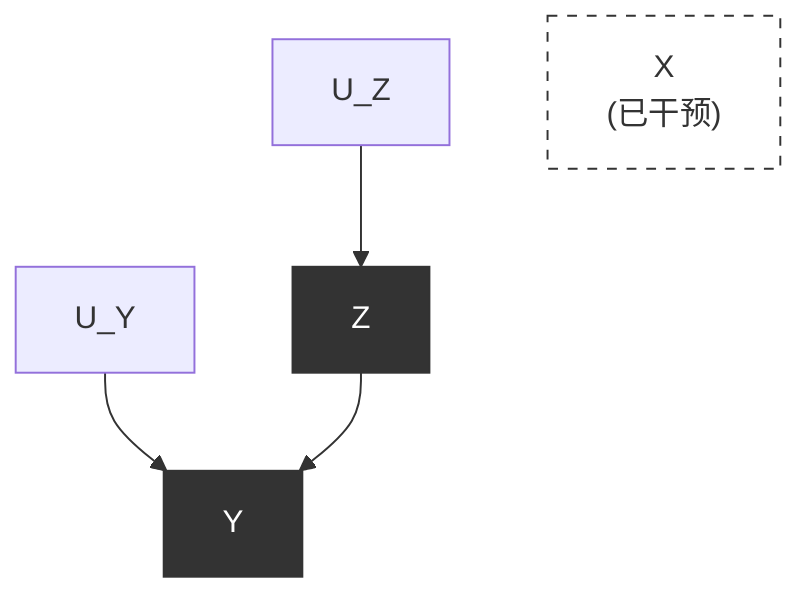


> **图 3.2**  表示对图 3.1 模型进行干预以降低冰淇淋销量的图形模型

在符号表示上，我们区分变量  $X$  自然取值为  $x$  的情况和我们通过干预固定  $X = x$  的情况，将后者记为  $do(X = x)$ 。因此， $P(Y = y \mid X = x)$  是在发现  $X = x$  的条件下  $Y = y$  的概率，而  $P(Y = y \mid do(X = x))$  是我们干预使  $X = x$  时  $Y = y$  的概率。在分布术语中， $P(Y = y \mid X = x)$  反映了  $X$  值为  $x$  的个体中  $Y$  的总体分布。另一方面， $P(Y = y \mid do(X = x))$  表示如果总体中每个人的  $X$  值都固定为  $x$  时  $Y$  的总体分布。我们类似地写  $P(Y = y \mid do(X = x), Z = z)$  来表示在由干预  $do(X = x)$  创建的分布中，给定  $Z = z$  条件下  $Y = y$  的条件概率。

使用  **do-表达式（do-expressions）**  和图手术，我们可以开始从相关关系中理清因果关系。在本章的剩余部分，我们将学习一些令人惊叹的方法，这些方法可以从纯粹的观察数据中梳理出因果信息，当然前提是图构成了对现实的有效表示。值得注意的是，这里我们假设干预没有"副作用"，即对个体变量  $X$  赋值为  $x$  不会以直接方式改变后续变量。例如，"被分配"一种药物与因宗教反对而被强迫服药可能对康复产生不同的效果。当存在副作用时，需要在模型中明确指定。

## 3.2 调整公式（The Adjustment Formula）

冰淇淋例子代表了一种极端情况，其中 X 和 Y 之间的相关性从因果角度看完全是虚假的，因为从 X 到 Y 没有因果路径。大多数现实情况并非如此清晰。为了探讨一个更现实的情况，让我们检查图 3.3，其中 Y 同时响应 Z 和 X。

这样的模型可以代表，例如，我们遇到的辛普森悖论的第一个故事，其中 X 代表用药，Y 代表康复，Z 代表性别。为了找出药物在总体中的有效性，我们设想一个假设性干预，即我们统一对整个人群施用药物，并将康复率与互补干预（即阻止所有人使用药物）下获得的结果进行比较。将第一个干预记为  $do(X = 1)$ ，第二个记为  $do(X = 0)$ ，我们的任务是估计差值

$$
P(Y = 1 \mid do(X = 1)) - P(Y = 1 \mid do(X = 0)) \tag{3.1}
$$

```

graph TD
    UZ["U_Z"] --> Z
    UX["U_X"] --> X
    UY["U_Y"] --> Y
    Z --> X
    Z --> Y
    X --> Y
  
    style Z fill:#333,stroke:#333,color:#fff
    style X fill:#333,stroke:#333,color:#fff
    style Y fill:#333,stroke:#333,color:#fff
```


> 图 3.3 表示新药效果的图形模型，其中 Z 代表性别，X 代表用药，Y 代表康复

这被称为"因果效应差"或"**平均因果效应**（Average Causal Effect, ACE）"。然而，一般来说，如果 X 和 Y 各自可以取多个值，我们希望预测一般的因果效应  $P(Y = y \mid do(X = x))$ ，其中 x 和 y 是 X 和 Y 可以取的任意两个值。例如，x 可能是药物剂量，y 是患者的血压。

我们从基本原理知道，如果没有因果故事，仅凭数据集本身无法估计因果效应。这就是辛普森悖论的教训：**数据本身甚至不足以确定药物的效果是正还是负**。但借助图 3.3 中的图，我们可以从数据中计算因果效应的大小。为此，我们以图手术的形式模拟干预（图 3.4），就像我们在冰淇淋例子中所做的那样。

因果效应  $P(Y = y \mid do(X = x))$  等于在图 3.4 的受操作模型中占主导的条件概率  $P_{m}(Y = y \mid X = x)$ 。（这当然也解决了正确答案是在聚合表还是 Z 特定表中的问题——当我们通过干预确定答案时，只有一个表需要处理。）

```mermaid
graph TD
    UZ["U_Z"] --> Z
    UY["U_Y"] --> Y
    Z --> Y
    x["x"] --> X["X = x"]
    X --> Y
  
    style Z fill:#333,stroke:#333,color:#fff
    style Y fill:#333,stroke:#333,color:#fff
    style X fill:#333,stroke:#333,color:#fff
```


> 图 3.4 表示对图 3.3 模型进行干预以设定人群用药的修改后图形模型，产生受操作概率  $P_{m}$

计算因果效应的关键在于观察到  $P_{m}$ （受操作概率）与 P（图 3.3 干预前模型中占主导的原始概率函数）共享两个基本属性。

首先，边际概率  $P(Z = z)$  在干预下不变，因为决定 Z 的过程不受移除从 Z 到 X 箭头的影响。在我们的例子中，这意味着男性和女性的比例在干预前后保持不变。

其次，条件概率  $P(Y = y \mid Z = z, X = x)$  不变，因为 Y 响应 X 和 Z 的过程  $Y = f(x, z, u_{Y})$  保持不变，无论 X 是自发变化还是通过有意操控而变化。

因此，我们可以写出两个不变性方程：

$$
P_{m}(Y = y \mid Z = z, X = x) = P(Y = y \mid Z = z, X = x) 
$$

和

$$

\quad P_{m}(Z = z) = P(Z = z)
$$

我们还可以利用这样一个事实：在修改后的模型中，Z 和 X 是 d-分离的，因此在干预分布下它们是独立的。

这告诉我们  $P_{m}(Z = z \mid X = x) = P_{m}(Z = z) = P(Z = z)$ ，最后一个等式来自上述不变性。综合考虑这些因素，我们有

$$
\begin{array}{l} 
P(Y = y \mid do(X = x)) \\ 
= P_{m}(Y = y \mid X = x) \quad (\text{根据定义}) \tag{3.2} \\ 
\end{array}
$$

$$
= \sum_{z} P_{m}(Y = y \mid X = x, Z = z) P_{m}(Z = z \mid X = x) \tag{3.3}
$$

$$
= \sum_{z} P_{m}(Y = y \mid X = x, Z = z) P_{m}(Z = z) \tag{3.4}
$$

方程 (3.3) 使用全概率公式通过对所有  $Z = z$  的值取条件并求和得到（如方程 (1.9)），而方程 (3.4) 利用了修改后模型中  $Z$  和  $X$  的独立性。

最后，使用不变性关系，我们得到用干预前概率表示的因果效应公式：

$$
P(Y = y \mid do(X = x)) = \sum_{z} P(Y = y \mid X = x, Z = z) P(Z = z) \tag{3.5}
$$

方程 (3.5) 被称为 **调整公式（adjustment formula）** ，如你所见，它计算在  $Z$  的每个值  $z$  下  $X$  和  $Y$  之间的关联，然后对这些值取平均。**这个过程被称为"对  $Z$  进行调整"或"控制  $Z$ "**。

这个最终表达式——方程 (3.5) 的右侧——可以直接从数据中估计，因为它仅由条件概率组成，每个条件概率都可以通过第 1 章描述的过滤程序计算。还要注意，在随机对照实验中不需要调整，因为在这种设置下，数据是由已经具有图 3.4 结构的模型生成的；因此，无论任何影响  $Y$  的因素  $Z$  如何，都有  $P_{m} = P$ 。因此，我们对调整公式 (3.5) 的推导构成了一个形式化证明，即随机化给了我们想要估计的量，即  $P(Y = y \mid do(X = x))$ 。在实践中，研究人员在随机实验中也会使用调整，目的是最小化抽样变异（Cox 1958）。

为了演示调整公式的运作，让我们将其数值应用于辛普森悖论的故事，其中  $X = 1$  代表患者服药， $Z = 1$  代表患者为男性， $Y = 1$  代表患者康复。我们有

$$
P(Y = 1 \mid do(X = 1)) = P(Y = 1 \mid X = 1, Z = 1) P(Z = 1) + P(Y = 1 \mid X = 1, Z = 0) P(Z = 0)
$$

代入表 1.1 中给出的数字，我们得到

$$
P(Y = 1 \mid do(X = 1)) = \frac{0.93 (87 + 270)}{700} + \frac{0.73 (263 + 80)}{700} = 0.832
$$

而类似地，

$$
P(Y = 1 \mid do(X = 0)) = \frac{0.87 (87 + 270)}{700} + \frac{0.69 (263 + 80)}{700} = 0.7818
$$

因此，比较服药（ $X = 1$ ）的效果与不服药（ $X = 0$ ）的效果，我们得到

$$
ACE = P(Y = 1 \mid do(X = 1)) - P(Y = 1 \mid do(X = 0)) = 0.832 - 0.7818 = 0.0502
$$

这表明服药有明显的正面优势。这里对 ACE 的一个更非正式的解释是，它仅仅是如果每个人都服药时康复的人口比例与没有人服药时康复的人口比例之差。

我们看到，**调整公式指示我们以性别为条件，分别找出药物对男性和女性的益处，然后才使用男性和女性在人口中的百分比对结果进行平均**。它还因此指示我们忽略聚合人口数据  $P(Y = 1 \mid X = 1)$  和  $P(Y = 1 \mid X = 0)$ ，从这些数据中我们可能会（错误地）得出药物总体上有负面效果的结论。

这些简单的例子可能会让读者产生这样的印象：每当我们面临是否要对第三个变量  $Z$  进行条件化（condition）的两难选择时，调整公式（adjustment formula）总是倾向于使用  $Z$  特定的分析，而非非特定的分析。但我们知道事实并非如此，回想一下表 1.2 中给出的辛普森悖论（Simpson's paradox）的血压例子。我们在那里论证，更合理的方法不是对血压进行条件化，而是直接检查非条件化的总体表格。调整公式如何处理类似的情况呢？

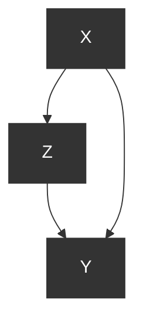


> **图 3.5**  一个表示新药效果的图形模型，其中  $X$  代表药物使用情况， $Y$  代表康复情况， $Z$  代表血压（在研究结束时测量）。外生变量（Exogenous variables）未在图中显示，这意味着它们是相互独立的。

图 3.5 中的图形代表了血压例子中的因果故事。它与图 3.4 相同，但  $X$  和  $Z$  之间的箭头方向相反，反映了治疗对血压有影响，而不是相反。现在，让我们尝试像处理性别例子那样，评估与该模型相关的因果效应  $P(Y = 1 \mid do(X = 1))$ 。

首先，我们模拟一次干预（intervention），然后检查从模拟干预中得出的调整公式。在图形模型中，干预通过切断所有进入被操纵变量  $X$  的箭头来模拟。然而，在我们的例子中，图 3.5 显示没有箭头进入  $X$ ，因为  $X$  没有父节点（parents）。这意味着不需要进行任何“手术”；数据获取的条件使得治疗分配是“如同随机化（as if randomized）”的。如果存在某种因素会使受试者偏好或拒绝治疗，那么这个因素应该在模型中体现出来；没有这样的因素，就允许我们将  $X$  视为随机化治疗。

在这种条件下，干预图等于原始图——无需移除任何箭头——并且调整公式简化为

$$
P(Y = y \mid do(X = x)) = P(Y = y \mid X = x),
$$

这可以通过让空集（empty set）作为被调整的变量，从我们的调整公式中得到。显然，如果我们对血压进行调整，我们将得到一个错误的评估——这个评估对应于一个模型，在该模型中，血压导致人们寻求治疗。

### 3.2.1 调整还是不调整？（To Adjust or not to Adjust?）

我们现在能够理解，哪个变量或变量集合  $Z$  可以合法地包含在调整公式中。导致调整公式的干预程序规定， $Z$  应该与  $X$  的父节点一致，因为当我们通过外部操纵固定  $X$  时，我们抵消的正是这些父节点的影响。将  $X$  的父节点记作  $PA(X)$ ，因此我们可以写出一个通用的调整公式，并将其总结为一条规则：

> **规则 1（因果效应规则，The Causal Effect Rule）**
> 给定一个图  $G$ ，其中一组变量  $PA$  被指定为  $X$  的父节点，则  $X$  对  $Y$  的因果效应由下式给出：
>
> $$
> P(Y = y \mid do(X = x)) = \sum_{z} P(Y = y \mid X = x, PA = z) P(PA = z) \tag{3.6}
> $$
>
> 其中  $z$  遍历  $PA$  中变量可能取值的所有组合。

如果我们将 (3.6) 中的被加数乘以并除以概率  $P(X = x \mid PA = z)$ ，我们得到一个更方便的形式：

$$
P(y \mid do(x)) = \sum_{z} \frac{P(X = x, Y = y, PA = z)}{P(X = x \mid PA = z)} \tag{3.7}
$$

这明确展示了  $X$  的父节点在预测干预结果中的作用。因子  $P(X = x \mid PA = z)$  被称为“ **倾向得分（propensity score）** ”，以这种形式表达  $P(y \mid do(x))$  的优势将在第 3.5 节中讨论。

我们现在可以理解因果图在解决辛普森悖论中所起的作用，更一般地说，可以理解图的哪些方面允许我们仅从纯统计数据预测因果效应。我们需要图来确定  $X$  的父节点——即在非实验条件下，足以确定  $X$  值或该值概率的那组因素。

仅此结果就令人震惊；使用图及其基本假设，我们能够在纯观测数据中识别因果关系。但是，从这一讨论中，读者可能会倾向于认为图的作用相当有限；一旦我们确定了  $X$  的父节点，图的其余部分就可以丢弃，并且可以通过调整公式机械地评估因果效应。下一节将说明事情可能并非如此简单。在大多数实际案例中， $X$  的父节点集合将包含未观测变量，这将阻止我们计算调整公式中的条件概率。幸运的是，正如我们将在后续章节中看到的，我们可以调整模型中的其他变量来替代  $PA(X)$  中未测量的元素。

学习问题 3.2.1（Study questions 3.2.1）

参考学习问题 1.5.2（图 1.10）及其列出的参数，

- (a) 通过在模型上模拟干预  $do(x)$ ，计算所有  $x$  和  $y$  值的  $P(y \mid do(x))$ 。
- (b) 使用调整公式 (3.5)，计算所有  $x$  和  $y$  值的  $P(y \mid do(x))$ 。
- (c) 计算平均因果效应（Average Causal Effect, ACE）

$$
ACE = P(y_1 \mid do(x_1)) - P(y_1 \mid do(x_0))
$$

并将其与风险差（Risk Difference, RD）

$$
RD = P(y_1 \mid x_1) - P(y_1 \mid x_0)
$$

进行比较。ACE 和 RD 之间的区别是什么？哪些参数值会使差异最小化？

- (d) 找到一组表现出辛普森逆转（如学习问题 1.5.2(c) 所示）的参数组合，并明确展示药物的总体因果效应是从分类数据（desegregated data）中获得的。

### 3.2.2 多重干预与截断乘积法则（Multiple Interventions and the Truncated Product Rule）

在推导调整公式时，我们假设对单个变量  $X$  进行干预，其父节点被断开，以模拟干预后它们的影响消失的情况。然而，社会和医疗政策偶尔会涉及多重干预，例如那些同时规定多个变量值的政策，或者那些随时间控制某个变量的政策。为了表示多重干预，我们方便地求助于图形模型施加在联合分布上的乘积分解，正如我们在第 1.5.2 节中讨论的那样。

根据乘积分解法则（Rule of Product Decomposition），图 3.3 模型中的干预前分布由以下乘积给出：

$$
P(x, y, z) = P(z) P(x \mid z) P(y \mid x, z) \tag{3.8}
$$

而由图 3.4 模型支配的干预后分布则由以下乘积给出：

$$
P(z, y \mid do(x)) = P_m(z) P_m(y \mid x, z) = P(z) P(y \mid x, z) \tag{3.9}
$$

其中因子  $P(x \mid z)$  从乘积中被剔除，因为当  $X$  被固定为  $X = x$  时，它变得没有父节点。这与调整公式一致，因为为了评估  $P(y \mid do(x))$ ，我们需要对  $z$  进行边缘化（求和），得到

$$
P(y \mid do(x)) = \sum_{z} P(z) P(y \mid x, z)
$$

这与 (3.5) 一致。

这种考虑也允许我们将调整公式推广到多重干预，即将一组变量  $X$  的值固定为常数的干预。我们只需写出干预前分布的乘积分解，并划掉所有对应于干预集  $X$  中变量的因子。形式上，我们写作

$$
P(x_1, x_2, \dots, x_n \mid do(x)) = \prod_{i} P(x_i \mid pa_i) \quad \text{对于所有} X_i \text{不在} X \text{中的} i.
$$

这被称为  **截断乘积公式（truncated product formula）**  或  **g-公式（g-formula）** 。为了说明，假设我们对图 2.9 的模型进行干预，将  $X$  设置为  $x$ ，将  $Z_3$  设置为  $z_3$ 。模型中其他变量的干预后分布将是

$$
P(z_1, z_2, w, y \mid do(X = x, Z_3 = z_3)) = P(z_1) P(z_2) P(w \mid x) P(y \mid w, z_3, z_2)
$$

其中我们从乘积中删除了因子  $P(x \mid z_1, z_3)$  和  $P(z_3 \mid z_1, z_2)$ 。

值得注意的是，结合 (3.8) 和 (3.9)，我们得到了干预前和干预后分布之间的一个简单关系：

$$
P(z, y \mid do(x)) = \frac{P(x, y, z)}{P(x \mid z)} \tag{3.10}
$$

它告诉我们，条件概率  $P(x \mid z)$  是我们从由分布  $P(x, y, z)$  支配的非实验数据中预测干预  $do(x)$  的效果所需了解的全部内容。

## 3.3 后门准则（The Backdoor Criterion）

在上一节中，我们得出结论，在试图确定一个变量对另一个变量的效应时，我们应该对该变量的父节点进行调整。但通常，我们知道或相信，这些变量存在未测量的父节点，这些父节点虽然在图中被表示出来，但可能无法进行测量。在这些情况下，我们需要找到一组替代变量来进行调整。

这个困境引出了一个更深刻的统计问题：在什么条件下，一个因果故事允许我们仅从被动观察获得的数据（无干预）计算一个变量对另一个变量的因果效应？既然我们决定用图来表示因果故事，这个问题就变成了一个图论问题：在什么条件下，因果图的结构足以让我们从给定的数据集中计算出一个因果效应？

这个问题的答案足够长——也足够重要——以至于我们将用本章的剩余部分来解决它。但是，我们用来确定是否能够计算因果效应的最重要工具之一是一个简单的测试，称为  **后门准则（backdoor criterion）** 。使用它，我们可以确定，在一个由有向无环图（Directed Acyclic Graph, DAG）表示的因果模型中，对于任意两个变量  $X$  和  $Y$ ，在寻找  $X$  和  $Y$  之间的因果关系时，应该对模型中的哪个变量集合  $Z$  进行条件化。

 **定义 3.3.1（后门准则，The Backdoor Criterion）**
给定有向无环图  $G$  中的一个有序变量对  $(X, Y)$ ，如果变量集合  $Z$  满足相对于  $(X, Y)$  的后门准则，则  $Z$  中没有任何节点是  $X$  的后代（descendant），并且  $Z$  阻断了（blocks） $X$  和  $Y$  之间所有包含指向  $X$  的箭头的路径。

如果一个变量集合  $Z$  满足针对  $X$  和  $Y$  的后门准则，那么  $X$  对  $Y$  的因果效应由以下公式给出：

$$
P(Y = y \mid do(X = x)) = \sum_{z} P(Y = y \mid X = x, Z = z) P(Z = z)
$$

就像我们对  $PA(X)$  进行调整时一样。（注意， $PA(X)$  始终满足后门准则。）

### 3.3 后门准则（The Backdoor Criterion）

 **后门准则（Backdoor Criterion）** 背后的逻辑相当直接。通常，我们希望 **以一组节点  $Z$  为条件** ，使得：

1. 我们 **阻断  $X$  和  $Y$  之间的所有伪路径（spurious paths）** 。
2. 我们 **保持所有从  $X$  到  $Y$  的有向路径不受干扰** 。
3. 我们 **不创造任何新的伪路径** 。

在尝试找到  $X$  对  $Y$  的因果效应时，我们希望作为条件的节点能够阻断任何一端有指向  $X$  的箭头的“后门”路径。因为这样的路径可能会使  $X$  和  $Y$  产生依赖，但显然不传递来自  $X$  的因果影响；如果我们不阻断它们，它们将混淆  $X$  对  $Y$  的效应。我们对后门路径取条件以满足我们的第一个要求。

然而，我们 **不希望以  $X$  的后代节点为条件** 。 $X$  的后代会受到对  $X$  干预的影响，并可能自身影响  $Y$ ；以它们为条件会阻断这些路径。因此，我们不以  $X$  的后代为条件以满足第二个要求。

最后，为了满足第三个要求，我们 **应避免以任何会打开  $X$  和  $Y$  之间新路径的对撞节点（collider）为条件** 。排除  $X$  后代的要求也保护我们避免以  $X$  和  $Y$  之间中间节点的子节点为条件（例如，图 2.4 中的对撞节点  $W$ ）。这种条件作用会扭曲  $X$  和  $Y$  之间因果关联的传递，类似于以其父节点为条件的方式。

为了理解这在实践中的含义，让我们看一个具体例子，如图 3.6 所示。

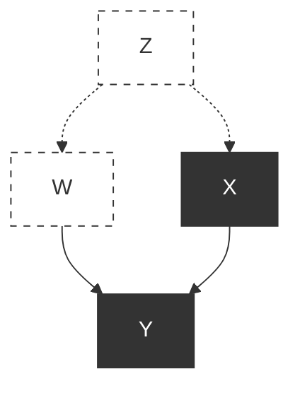


> **图 3.6**  一个表示新药 ( $X$ )、康复 ( $Y$ )、体重 ( $W$ ) 和一个未测量变量  $Z$ （社会经济地位）之间关系的图形模型。

这里我们试图衡量药物 ( $X$ ) 对康复 ( $Y$ ) 的效应。我们还测量了体重 ( $W$ )，它对康复有影响。此外，我们知道社会经济地位 ( $Z$ ) 同时影响体重和接受治疗的选择——但我们参考的研究并未记录社会经济地位。

相反，我们寻找一个符合从  $X$  到  $Y$  的后门准则的观测变量。对图的简要检查表明， $W$ （不是  $X$  的后代）也阻断了后门路径  $X \leftarrow Z \rightarrow W \rightarrow Y$ 。因此， $W$  满足后门准则。只要因果故事符合图 3.6 中的图，对  $W$  进行调整将给出  $X$  对  $Y$  的因果效应。使用调整公式，我们得到

$$
P(Y = y \mid do(X = x)) = \sum_{w} P(Y = y \mid X = x, W = w) P(W = w)
$$

只要  $W$  被观测到，这个求和就可以从我们的观测数据中估计。

借助后门准则，即使在复杂的图中，您也可以轻松地通过算法得出关于紧迫政策问题的结论。考虑图 2.8 中的模型，并再次假设我们希望评估  $X$  对  $Y$  的效应。我们应该以哪些变量为条件才能获得正确的效应？问题归结为找到一组满足后门准则的变量，但由于从  $X$  到  $Y$  没有后门路径，答案是显而易见的： **空集满足该准则** ，因此不需要调整。

答案是

$$
P(y \mid do(x)) = P(y \mid x)
$$

然而，假设我们以  $W$  为条件。我们能得到  $X$  对  $Y$  效应的正确结果吗？由于  $W$  是一个对撞节点，以  $W$  为条件会打开路径  $X \rightarrow W \leftarrow Z \rightarrow T \rightarrow Y$ 。这条路径是伪的，因为它位于  $X$  到  $Y$  的因果路径之外。打开这条路径会产生偏差，并得出错误的答案。这意味着分别计算  $W$  每个值的  $X$  和  $Y$  之间的关联不会得到  $X$  对  $Y$  的正确效应，甚至可能为每个  $W$  值给出错误的效应。

那么，我们如何计算  $X$  对  $Y$  在  $W$  的特定值  $w$  下的因果效应呢？在图 2.8 中， $W$  可能代表例如患者治疗后的疼痛水平，我们可能只对评估那些没有遭受任何疼痛的患者中  $X$  对  $Y$  的效应感兴趣。指定  $W$  的值相当于以  $W = w$  为条件，正如我们已经意识到的，由于  $W$  是一个对撞节点，这打开了一条从  $X$  到  $Y$  的伪路径。

答案是，我们仍然可以选择使用其他变量来阻断那条路径。例如，如果我们以  $T$  为条件，即使  $W$  是条件集的一部分，我们也能阻断伪路径  $X \rightarrow W \leftarrow Z \rightarrow T \rightarrow Y$ 。因此，为了计算  $w$  特定的因果效应，记为  $P(y \mid do(x), w)$ ，我们对  $T$  进行调整，并得到

$$
P(Y = y \mid do(X = x), W = w) = \sum_{t} P(Y = y \mid X = x, W = w, T = t) P(T = t \mid X = x, W = w) \tag{3.11}
$$

计算这种  $W$  特定的因果效应是检验 **效应修饰（effect modification）** 或 **调节（moderation）** 的关键步骤，即  $X$  对  $Y$  的因果效应被  $W$  的不同值修饰的程度。再次考虑图 3.6 中的模型，并假设我们希望检验在  $W = w$  水平上的因果效应是否与在  $W = w^{\prime}$  水平上的相同（ $W$  可以表示任何处理前变量，如年龄、性别或种族）。这个问题需要比较两个因果效应：

$$
P(Y = y \mid do(X = x), W = w) \quad \text{和} \quad P(Y = y \mid do(X = x), W = w^{\prime})
$$

在图 3.6 的具体例子中，答案很简单，因为  $W$  满足后门准则。因此，我们需要比较的只是条件概率  $P(Y = y \mid X = x, W = w)$  和  $P(Y = y \mid X = x, W = w^{\prime})$ ；不需要求和。在更一般的情况下，当仅  $W$  不满足后门准则，而更大的集合  $T \cup W$  满足时，我们

这个等式在两个方面很有用。首先，在那些我们有多个观测变量集可用于调整的情况下（例如，在图 3.6 中，如果  $W$  和  $Z$  都被观测到了），它为我们提供了选择调整哪些变量的余地。这可能出于许多实际原因而有用——也许一组变量比另一组测量成本更高，或者更容易出现人为错误，或者仅仅因为变量更多而更难计算。

其次，当所有调整变量都被观测到时，该等式构成了数据上一个可检验的约束，类似于  **d-分离（d-separation）**  的规则。如果我们试图在一个违反该等式的数据集上拟合一个导致该等式的模型，我们可以舍弃该模型。

学习问题 3.3.1

考虑图 3.8 中的图：

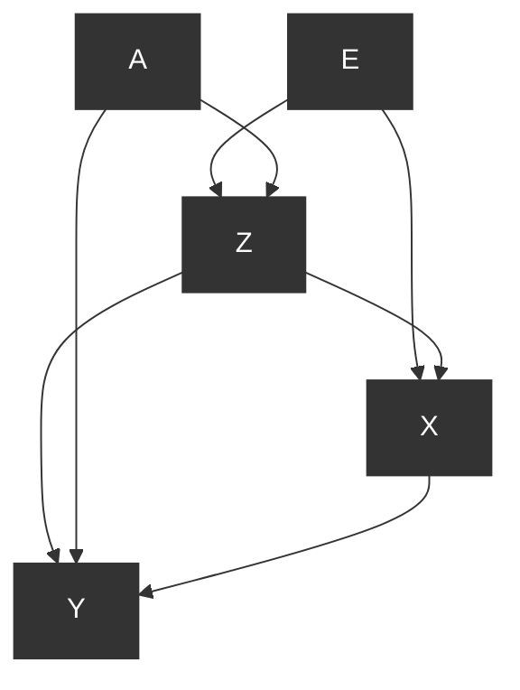

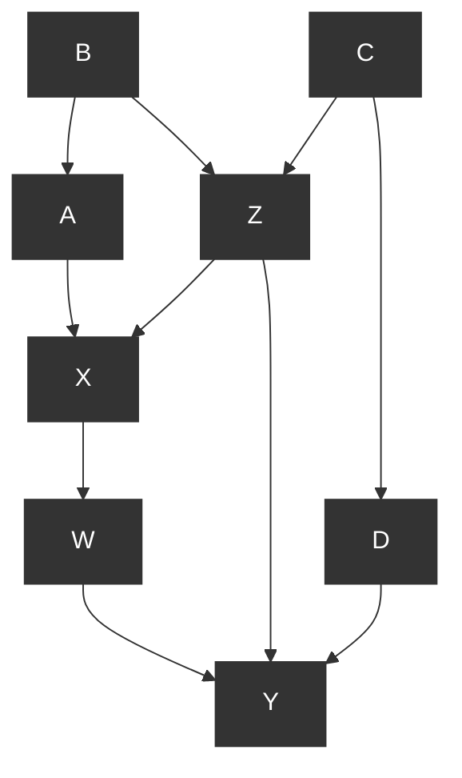


> **图 3.8：**  用于说明以下学习问题中后门准则的因果图。

* (a) 列出所有满足后门准则以确定  $X$  对  $Y$  因果效应的变量集。
* (b) 列出所有满足后门准则以确定  $X$  对  $Y$  因果效应的最简变量集（即，任何变量集，如果从该集中移除任何一个变量，它将不再满足该准则）。
* (c) 列出所有需要测量以识别  $D$  对  $Y$  效应的最简变量集。对  $\{W, D\}$  对  $Y$  的效应，重复此操作。

学习问题 3.3.2（洛德悖论 Lord’s paradox）

学年开始时，一所寄宿学校向其学生提供两种膳食计划供选择：计划 A 和计划 B。学生在学年开始和结束时记录体重。为了确定每个计划如何影响学生的体重增加，学校聘请了两位统计学家，奇怪的是，他们得出了不同的结论。

第一位统计学家计算了每个学生六月体重  $(W_F)$  和九月体重  $(W_I)$  之间的差值，并发现每个计划的平均体重增加为零。

第二位统计学家将学生分成几个子组，每个初始体重  $W_I$  一组。他发现，对于每个初始体重，计划 B 的最终体重高于计划 A 的最终体重。

因此，第一位统计学家得出结论，饮食对体重增加没有影响，而第二位统计学家得出结论有影响。

图 3.9 说明了可能导致两位统计学家得出相互矛盾结论的数据集。统计学家 1 检查了体重增加  $W_F - W_I$ ，对于每个学生，这由到  $45^\circ$  线的最短距离表示。确实，每个饮食计划的平均增益为零；两个组都相对于零增益线  $\mathcal{W}_F = \mathcal{W}_I$  对称分布。另一方面，统计学家 2 比较了计划 A 学生的最终体重与以相同初始体重  $W_0$  入学的计划 B 学生的最终体重，如图所示，垂直线上计划 B 学生位于计划 A 学生之上。对于任何其他垂直线，无论  $W_0$  为何，情况都将相同。

* (a) 绘制表示这种情况的因果图。
* (b) 确定哪位统计学家是正确的。
* (c) 这个例子与辛普森悖论（Simpson’s paradox）有何关系？


> **图 3.9：**  散点图，x 轴为学生的初始体重，y 轴为最终体重。垂直线表示初始体重相同的学生，与计划 A 相比，计划 B 的最终体重（平均）更高。

#学习问题 3.3.3

重新审视学习问题 1.2.4 中的棒棒糖故事，并回答以下问题：

* (a) 绘制一个捕捉该故事的图。
* (b) 通过应用后门准则确定必须调整哪些变量。
* (c) 写出药物对康复效应的调整公式。
* (d) 假设护士在研究一天后发放棒棒糖，并且仍然偏爱接受治疗的患者而不是接受安慰剂的患者，重复问题 (a)–(c)。

### 3.4 前门准则（The Front-Door Criterion）

 **后门准则** 为我们提供了一种简单的方法来识别当我们试图从非实验数据估计因果效应时应调整的协变量集。然而，它并没有穷尽所有估计此类效应的方法。 **do-算子（do-operator）** 可以应用于不满足后门准则的图形模式，以识别那些初看起来似乎无法企及的效应。本节讨论的一种此类模式称为 **前门（front-door）** 。

考虑关于吸烟与肺癌之间关系的长达一个世纪的争论。在 1970 年之前的几年里，烟草业通过宣扬一种理论来阻止反吸烟立法，即观察到的吸烟与肺癌之间的相关性可以通过某种致癌基因型来解释，这种基因型同时也诱导了对尼古丁的先天渴望。

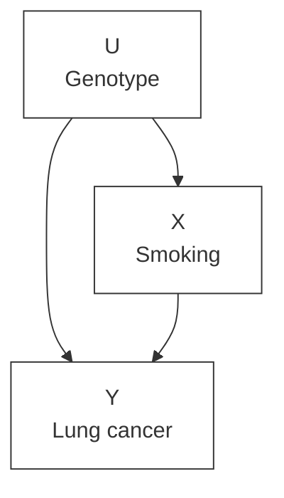


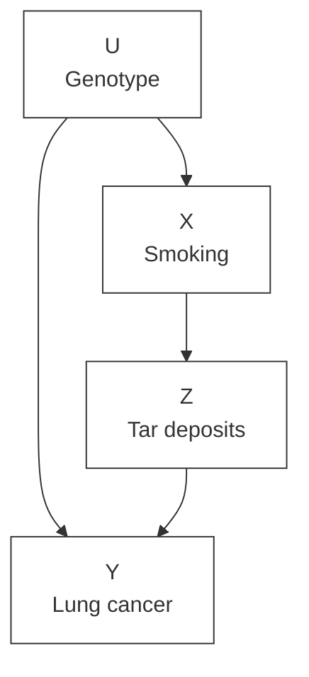


> (b)  **图 3.10**  一个表示吸烟 (X) 和肺癌 (Y) 之间关系的图形模型，包含未观测到的混杂因子 (U) 和一个中介变量 Z

描述此示例的图如图 3.10(a) 所示。该图不满足后门条件，因为变量 U 未被观测到，因此不能用于阻断从 X 到 Y 的后门路径。在此模型中，吸烟对肺癌的因果效应是不可识别的；人们永远无法确定 X 和 Y 之间观察到的相关性的哪一部分是伪的（可归因于它们的共同效应 U），哪一部分是真正的因果关系。（然而，我们注意到，即使在这些情况下，也有大量令人信服的工作旨在量化（未观测到的）U 与 X 之间以及 U 与 Y 之间的关联必须有多强才能完全解释 X 与 Y 之间观察到的关联。）

然而，通过考虑图 3.10(b) 中的模型，我们可以走得更远，其中有一个额外的测量值可用：患者肺部的焦油沉积量。该模型不满足后门准则，因为仍然没有变量能够阻断伪路径  $X \leftarrow U \rightarrow Y$ 。然而，我们看到，因果效应  $P(Y = y \mid do(X = x))$  在此模型中仍然是可识别的，通过两次连续应用后门准则。

中间变量 Z 如何帮助我们评估 X 对 Y 的效应？答案绝非显而易见：如下面的定量示例所示，它可能导致激烈的辩论。

假设进行了一项仔细的研究，其中在一个随机选择的 800,000 名被认为处于癌症极高风险（由于环境暴露，如吸烟、石棉、氡等）的受试者样本中同时测量了以下因素。

* 受试者是否吸烟
* 受试者肺部的焦油量
* 患者是否检测到肺癌

这项研究的数据呈现在表 3.1 中，为简单起见，假设所有三个变量都是二元的。所有数字均以千计。

 **表 3.1 一个假设的随机选择样本数据集，显示每个焦油类别中吸烟者和非吸烟者的癌症病例百分比（数字以千计）**

|        | 焦油 (400) |          | 无焦油 (400) |          | 所有受试者 (800) |          |
| ------ | ---------- | -------- | ------------ | -------- | ---------------- | -------- |
|        | 吸烟者     | 非吸烟者 | 吸烟者       | 非吸烟者 | 吸烟者           | 非吸烟者 |
| 无癌症 | 380        | 20       | 20           | 380      | 400              | 400      |
|        | 323        | 1        | 18           | 38       | 341              | 39       |
|        | (85%)      | (5%)     | (90%)        | (10%)    | (85%)            | (9.75%)  |
| 癌症   | 57         | 19       | 2            | 342      | 59               | 361      |
|        | (15%)      | (95%)    | (10%)        | (90%)    | (15%)            | (90.25%) |

对于这些数据，可以提出两种对立的解释。烟草业认为该表证明了吸烟的有益效果。他们指出，只有 15% 的吸烟者患上了肺癌，而非吸烟者这一比例为 90.25%。此外，在焦油和无焦油两个子组中，吸烟者的癌症百分比远低于非吸烟者。（这些数字显然与经验观察相反，但很好地说明了我们的观点，即观察结果不可信。）

然而，反吸烟游说者认为，该表讲述了一个完全不同的故事——吸烟实际上会增加而非降低患肺癌的风险。他们的论证如下：如果你选择吸烟，那么你产生焦油沉积的机会是 95%，而如果你选择不吸烟，这一比例是 5%（380/400 对比 20/400）。为了评估焦油沉积的效应，我们分别观察吸烟者和非吸烟者两组，如表 3.2 所示。所有数字均以千计。

 **表 3.2 对表 3.1 数据集的重新组织，显示每个吸烟-焦油类别中癌症病例的百分比（数字以千计）**

|        | 吸烟者 (400) |        | 非吸烟者 (400) |        | 所有受试者 (800) |        |
| ------ | ------------ | ------ | -------------- | ------ | ---------------- | ------ |
|        | 焦油         | 无焦油 | 焦油           | 无焦油 | 焦油             | 无焦油 |
| 无癌症 | 380          | 20     | 20             | 380    | 400              | 400    |
|        | 323          | 18     | 1              | 38     | 324              | 56     |
|        | (85%)        | (90%)  | (5%)           | (10%)  | (81%)            | (19%)  |
| 癌症   | 57           | 2      | 19             | 342    | 76               | 344    |
|        | (15%)        | (10%)  | (95%)          | (90%)  | (19%)            | (81%)  |

看来焦油沉积在两组中都有有害影响；在吸烟者中，它使癌症发病率从 10% 增加到 15%，在非吸烟者中，它使癌症发病率从 90% 增加到 95%。因此，无论我是否对尼古丁有自然渴望，我都应该避免焦油沉积的有害影响，而不吸烟是避免焦油沉积的非常有效的手段。

图 3.10(b) 的图使我们能够在这两组统计学家之间做出决定。首先，我们注意到 X 对 Z 的效应是可识别的，因为从 X 到 Z 没有后门路径。因此，我们可以立即写出

$$
P(Z = z \mid do(X = x)) = P(Z = z \mid X = x) \tag{3.12}
$$

接下来，我们注意到 Z 对 Y 的效应也是可识别的，因为从 Z 到 Y 的后门路径，即  $Z \leftarrow X \rightarrow U \rightarrow Y$ ，可以通过以 X 为条件来阻断。因此，我们可以写出

$$
P(Y = y \mid do(Z = z)) = \sum_{x} P(Y = y \mid Z = z, X = x) P(X = x) \tag{3.13}
$$

(3.12) 和 (3.13) 都是通过调整公式获得的，第一个是通过以空集为条件，第二个是通过调整 X。

我们现在将把这两个部分效应链接起来，以获得 X 对 Y 的总体效应。推理如下：如果自然选择将 Z 赋值为 z，那么 Y 的概率将是  $P(Y = y \mid do(Z = z))$ 。但是，鉴于我们选择将 X 设为 x，自然选择这样做的概率是  $P(Z = z \mid do(X = x))$ 。因此，对 Z 的所有状态 z 求和，我们有

$$
P(Y = y \mid do(X = x)) = \sum_{z} P(Y = y \mid do(Z = z)) P(Z = z \mid do(X = x)) \tag{3.14}
$$

(3.14) 右侧的项已在 (3.12) 和 (3.13) 中评估，我们可以将它们代入，以获得  $P(Y = y \mid do(X = x))$  的无 do 表达式。我们还区分了 (3.12) 中出现的 x 和 (3.13) 中出现的 x，后者只是一个求和索引，也可以记为  $x'$ 。我们得到的最终表达式是

$$
P(Y = y \mid do(X = x)) = \sum_{z} \sum_{x'} P(Y = y \mid Z = z, X = x') P(X = x') P(Z = z \mid X = x) \tag{3.15}
$$

方程 (3.15) 被称为 **前门公式（front-door formula）** 。

将此公式应用于表 3.1 中的数据，我们看到烟草业是错误的；焦油沉积具有有害影响，因为它使肺癌更可能发生，而吸烟通过增加焦油沉积，增加了造成这种危害的机会。

表 3.1 中的数据显然是不现实的，并且是故意设计的，以便让读者对从观测数据的朴素分析中可能出现的反直觉结论感到惊讶。在现实中，我们期望观测研究显示吸烟与肺癌之间存在正相关。然后可以使用 (3.15) 的估计量来确认和量化吸烟对癌症的有害影响。

前面的分析可以推广到存在多条从 X 到 Y 的路径的结构。

 **定义 3.4.1（前门 Front-Door）**
一组变量 Z 被认为相对于有序变量对 (X, Y) 满足前门准则，如果

1. Z 截断了所有从 X 到 Y 的有向路径。
2. 从 X 到 Z 没有后门路径。
3. 所有从 Z 到 Y 的后门路径都被 X 阻断。

 **定理 3.4.1（前门调整 Front-Door Adjustment）**
如果 Z 相对于 (X, Y) 满足前门准则且  $P(x, z) > 0$ ，则 X 对 Y 的因果效应是可识别的，并由以下公式给出

$$
P(y \mid do(x)) = \sum_{z} P(z \mid x) \sum_{x'} P(y \mid x', z) P(x') \tag{3.16}
$$

定义 3.4.1 中陈述的条件过于保守；条件 (2) 和 (3) 排除的一些路径实际上可以被允许，前提是它们被某些变量阻断。有一种强大的符号机制，称为  **do-演算（do-calculus）** ，允许分析此类复杂的结构。事实上，do-演算揭示了可以从给定图中识别的所有因果效应。不幸的是，它超出了本书的范围（详见 Tian and Pearl 2002, Shpitser and Pearl 2008, Pearl 2009, and Bareinboim and Pearl 2012）。但是调整公式、后门准则和前门准则的组合涵盖了众多场景。它证明了因果图在不仅仅是表示，而是在实际发现因果信息方面的巨大甚至具有启示性的力量。

学习问题 3.4.1

假设在图 3.8 中，只能测量 X、Y 和一个额外的变量。哪个变量将允许识别 X 对 Y 的效应？该效应是什么？

学习问题 3.4.2

我去药店买某种药，发现有两种不同的瓶子：一种售价 1 美元，另一种售价 10 美元。我问药剂师：“有什么区别？”他告诉我：“10 美元的瓶子是新鲜的，而 1 美元的瓶子已经在架子上放了 3 年。但是，你知道，数据显示，购买便宜货的人康复率要高得多。很神奇，不是吗？”我问是否测试过陈旧的药物。他说：“是的，这更神奇；95% 的陈药和只有 5% 的新药失去了活性成分，然而，那些拿到没有活性成分的坏瓶子的人的康复率仍然远高于那些拿到含有活性成分的好瓶子的人。”

在订购便宜瓶子之前，我想到要仔细看看数据。数据是针对每个以前的顾客的：购买的瓶子类型（陈旧或新鲜）、瓶中活性成分的浓度（高或低）以及顾客是否从疾病中康复。数据完全证实了药剂师的说法。然而，在进行了额外的计算后，我最终还是决定购买昂贵的瓶子；即使不测试其含量，我也能确定新鲜瓶子将为普通患者提供更大的康复机会。

基于两个非常合理的假设，数据清楚地表明新鲜药物更有效。假设如下：

* (i) 顾客对购买的具体药瓶的化学成分（高或低）没有信息；他们的选择仅受价格和货架期影响。
* (ii) 药物对任何特定个体的影响仅取决于其化学成分，而不取决于其货架期（新鲜或陈旧）。
* (a) 确定问题的相关变量，并在因果图中描述此场景。
* (b) 构建一个与故事和购买昂贵瓶子的决定兼容的数据集。
* (c) 使用假设 (i) 和 (ii) 以及 (b) 中给出的数据，确定选择新鲜药物与陈旧药物的效应。

## 3.5 条件性干预与协变量特定效应（Conditional Interventions and Covariate-Specific Effects）

到目前为止所考虑的干预仅限于那些仅仅迫使一个变量或一组变量  $X$  取某个指定值  $x$  的行动。一般而言，干预可能涉及动态策略，其中变量  $X$  被设定为以特定方式响应其他某个变量集  $Z$ ——例如，通过函数关系  $x = g(z)$  或通过随机关系，即  $X$  以概率  $P^*(x \mid z)$  被设置为  $x$ 。

例如，假设医生决定只对体温  $Z$  超过某一水平  $Z = z$  的患者给药。在这种情况下，行动将取决于  $Z$  的值，可以写为  $do(X = g(Z))$ ，其中当  $Z > z$  时  $g(Z)$  等于 1，否则为 0（其中  $X = 0$  表示未给药）。由于  $Z$  是一个随机变量，行动所选择的  $X$  的值同样将是一个随机变量，随  $Z$  的变化而变化。实施此类策略的结果是一个概率分布，记为  $P(Y = y \mid do(X = g(Z)))$ ，该分布仅取决于函数  $g$  和驱动  $X$  的变量集  $Z$ 。

为了估计此类策略的效应，让我们更仔细地考察另一个概念，即我们在第 3.3 节（公式 (3.11)）中简要遇到的  $X$  的" $z$ -特定效应"。该效应记为  $P(Y = y \mid do(X = x), Z = z)$ ，衡量的是在干预后  $Z$  达到值  $z$  的那部分人群中  $Y$  的分布。例如，我们可能对治疗如何影响特定年龄组  $Z = z$ ，或具有特定特征  $Z = z$  的人群感兴趣，这些特征可能在治疗后测量。

 $z$ -特定效应可以通过类似于 **后门调整（backdoor adjustment）**  的过程来识别。推理如下：当我们旨在估计  $P(Y = y \mid do(X = x))$  时，如果集合  $S$  阻断了从  $X$  到  $Y$  的所有后门路径，则对集合  $S$  进行调整是合理的。现在我们要识别  $P(Y = y \mid do(X = x), Z = z)$ ，我们需要确保当我们向条件集合添加另一个变量  $Z$  时，这些路径仍然被阻断。这为识别  $z$ -特定效应提供了一个简单的准则：

> **规则 2**  只要我们能测量到一组变量  $S$ ，使得  $S \cup Z$  满足后门准则，则  $z$ -特定效应  $P(Y = y \mid do(X = x), Z = z)$  就是可识别的。此外， $z$ -特定效应由以下调整公式给出

$$
\begin{array}{l}
P(Y = y \mid do(X = x), Z = z) \\
= \sum_{s} P(Y = y \mid X = x, S = s, Z = z) \, P(S = s \mid Z = z)
\end{array}
$$

这个修正后的调整公式与公式 (3.5) 类似，但有两个例外。首先，调整集是  $S \cup Z$ ，而不仅仅是  $S$ ；其次，求和仅对  $S$  进行，不包括  $Z$ 。表达式  $S \cup Z$  中的  $\cup$  符号表示集合并运算，这意味着，如果  $Z$  是  $S$  的子集，则  $S \cup Z = S$ ，并且仅  $S$  本身需要满足后门准则。

请注意， $z$ -特定效应的可识别性准则比非特定效应的准则更为严格。将  $Z$  添加到条件集中可能会产生依赖关系，从而阻碍所有后门路径的阻断。一个简单的例子发生在  $Z$  是一个 **碰撞器（collider）**  时；以  $Z$  为条件将在  $Z$  的父节点之间产生新的依赖关系，从而可能违反后门要求。

现在我们可以着手处理估计条件性干预的原始任务。假设政策制定者考虑一项年龄依赖性策略，即根据患者的年龄  $Z$  向其给药  $x$  剂量。我们将其记为  $do(X = g(Z))$ 。为了找出由此策略产生的结果  $Y$  的分布，我们寻求估计  $P(Y = y \mid do(X = g(Z)))$ 。

我们现在证明，识别此类策略的效应等同于识别  $z$ -特定效应  $P(Y = y \mid do(X = x), Z = z)$  的表达式。

为了计算  $P(Y = y \mid do(X = g(Z)))$ ，我们以  $Z = z$  为条件并写出

$$
\begin{array}{l}
P(Y = y \mid do(X = g(Z))) \\
= \sum_{z} P(Y = y \mid do(X = g(Z)), Z = z) \, P(Z = z \mid do(X = g(Z))) \\
= \sum_{z} P(Y = y \mid do(X = g(z)), Z = z) \, P(Z = z) \tag{3.17}
\end{array}
$$

等式

$$
P(Z = z \mid do(X = g(Z))) = P(Z = z)
$$

当然源于  $Z$  出现在  $X$  之前这一事实；因此，对  $X$  施加的任何控制都不会影响  $Z$  的分布。公式 (3.17) 也可以写为

$$
\sum_{z} \left. P(Y = y \mid do(X = x), Z = z) \right|_{x = g(z)} P(Z = z)
$$

这告诉我们，条件性策略  $do(X = g(Z))$  的因果效应可以直接从  $P(Y = y \mid do(X = x), Z = z)$  的表达式评估，只需将  $g(z)$  代入  $x$  并对  $Z$  取期望（使用观察到的分布  $P(Z = z)$ ）。

研究问题 3.5.1（Study Question 3.5.1）

考虑图 3.8 中的因果模型。

1. (a) 找出  $X$  对  $Y$  的  $c$ -特定效应的表达式。
2. (b) 确定一组需要测量以估计  $X$  对  $Y$  的  $z$ -特定效应的四个变量，并找出该效应大小的表达式。
3. (c) 利用 (b) 部分的答案，确定在  $Z$ -依赖策略下  $Y$  的期望值，其中当  $Z$  小于或等于 2 时  $X$  设为 0，当  $Z$  大于 2 时  $X$  设为 1。（假设  $Z$  取 1 到 5 的整数值。）

## 3.6 逆概率加权（Inverse Probability Weighting）

至此，敏锐的读者可能已经注意到我们的干预程序存在一个问题。后门准则和前门准则告诉我们，是否有可能从观察性研究中获得的数据预测假设性干预的结果。此外，它们告诉我们，我们可以在不模拟干预甚至不考虑干预的情况下进行这种预测。我们所要做的就是确定一组满足其中一个准则的协变量  $Z$ ，将这组变量代入调整公式，然后我们就完成了：所得的表达式保证能提供关于干预将如何影响结果的有效预测。

这在理论上很好，但在实践中，对  $Z$  进行调整可能会出现问题。它需要分别查看  $Z$  的每个值或值组合，估计该层中给定  $X$  时  $Y$  的条件概率，然后对结果进行平均。随着层数的增加，对  $Z$  进行调整将遇到计算和估计上的困难。由于集合  $Z$  可能由数十个变量组成，每个变量跨越数十个离散值，调整公式所需的求和可能非常艰巨，并且落在每个  $Z = z$  单元格中的数据样本数量可能太少，无法提供所涉及条件概率的可靠估计。

然而，我们在本章中的所有工作并非徒劳。调整过程是直接的，因此易于用于解释干预准则。但还有另一种更微妙的过程，可以克服调整的实际困难。

在本节中，我们将讨论规避此问题的一种方法，前提是我们能够获得函数  $g(x, z) = P(X = x \mid Z = z)$  的可靠估计，该函数通常称为 **"倾向得分（propensity score）"** ，针对每个  $x$  和  $z$ 。这种估计可以通过将灵活函数  $g(x, z)$  的参数拟合到现有数据来获得，方式与我们拟合线性回归函数的系数以最小化相对于一组样本的均方误差（图 1.4）大致相同。所使用的方法将取决于随机变量  $X$  的性质，例如它是连续的、离散的还是二元的。

假设函数  $P(X = x \mid Z = z)$  对我们可用，我们可以使用它生成人工样本，这些样本表现得好像它们是从干预后概率  $P_m$  中抽取的，而不是从  $P(x, y, z)$  中抽取的。一旦我们获得此类虚构样本，我们就可以通过简单地计算样本中每个层  $X = x$  中事件  $Y = y$  的频率来评估  $P(Y = y \mid do(x))$ 。通过这种方式，我们跳过了对所有层  $Z = z$  求和的相关劳动；我们本质上让自然为我们进行求和。

使用虚构样本估计概率的想法对我们来说并不新鲜；它一直隐式地使用，尽管我们是从有限样本估计条件概率时使用的。

在第 1 章中，我们将条件化描述为一个过滤过程——即忽略所有条件  $X = x$  不成立的案例，并对幸存的案例进行归一化，使它们的总概率加起来为 1。此操作的净结果是，每个幸存案例的概率都被提升了一个因子  $1 / P(X = x)$ 。这可以直接从贝叶斯规则看出，它告诉我们

$$
P(Y = y, Z = z \mid X = x) = \frac{P(Y = y, Z = z, X = x)}{P(X = x)}
$$

换句话说，要找到幸存表中每一行的概率，我们将无条件概率  $P(Y = y, Z = z, X = x)$  乘以常数  $1 / P(X = x)$ 。

现在让我们考察由  $do(X = x)$  操作创建的人群，并询问每个案例的概率如何因该操作而改变。答案由调整公式给出，即

$$
P(y \mid do(x)) = \sum_{z} P(Y = y \mid X = x, Z = z) \, P(Z = z)
$$

将求和内的表达式乘以并除以倾向得分  $P(X = x \mid Z = z)$ ，我们得到

$$
P(y \mid do(x)) = \sum_{z} \frac{P(Y = y \mid X = x, Z = z) \, P(X = x \mid Z = z) \, P(Z = z)}{P(X = x \mid Z = z)}
$$

意识到分子正是  $(X, Y, Z)$  的干预前分布，我们可以写出

$$
P(y \mid do(x)) = \sum_{z} \frac{P(Y = y, X = x, Z = z)}{P(X = x \mid Z = z)}
$$

答案变得清晰：人群中每个案例  $(Y = y, X = x, Z = z)$  应将其概率提升一个等于  $1 / P(X = x \mid Z = z)$  的因子。（因此得名 **"逆概率加权"** 。）

这为我们提供了一种在有限样本情况下估计  $P(Y = y \mid do(X = x))$  的简单程序。如果我们用因子  $= 1 / P(X = x \mid Z = z)$  对每个可用样本进行加权，那么我们可以将重新加权的样本视为从  $P_m$  生成，而不是从  $P$  生成，并相应地继续估计  $P(Y = y \mid do(x))$ 。

这在示例中得到了最好的展示。

表 3.3 回到我们辛普森悖论的例子，即似乎对男性和女性有帮助但对总体人群有害的药物。我们将使用之前使用的相同数据，但这次以加权表的形式呈现。在这种情况下， $X$  表示患者是否服用了药物， $Y$  表示患者是否康复， $Z$  表示患者的性别。

 **表 3.3**  第 1 章药物-性别-康复故事的联合概率分布  $P(X, Y, Z)$ （表 1.1）

| $X$ | $Y$ | $Z$ | 人口百分比 |
| ----- | ----- | ----- | ---------- |
| 是    | 是    | 男性  | 0.116      |
| 是    | 是    | 女性  | 0.274      |
| 是    | 否    | 男性  | 0.009      |
| 是    | 否    | 女性  | 0.101      |
| 否    | 是    | 男性  | 0.334      |
| 否    | 是    | 女性  | 0.079      |
| 否    | 否    | 男性  | 0.051      |
| 否    | 否    | 女性  | 0.036      |

 **表 3.4**  表 3.3 人群中药物使用者  $(X = \text{是})$  的条件概率分布  $P(Y, Z \mid X)$

| X  | Y  | Z    | 人口百分比 |
| -- | -- | ---- | ---------- |
| 是 | 是 | 男性 | 0.231      |
| 是 | 是 | 女性 | 0.549      |
| 是 | 否 | 男性 | 0.017      |
| 是 | 否 | 女性 | 0.203      |

如果我们以  $X = \text{是}$  为条件，我们得到表 3.4 所示的数据集，该数据集分两步形成。首先，排除所有  $X = \text{否}$  的行。其次，对剩余行的权重进行"重新归一化"，即乘以一个常数使其总和为 1。根据贝叶斯规则，这个常数是  $1 / P(X = \text{是})$ ，在我们的示例中， $P(X = \text{是})$  是表 3.3 前四行的组合权重，即

$$
P(X = \text{是}) = 0.116 + 0.274 + 0.01 + 0.101 = 0.501
$$

结果是表 3.4 四行中的权重分布；每行的权重都被提升了一个因子  $1 / 0.501 = 2.00$ 。

现在让我们考察由  $\operatorname{do}(X = \text{是})$  操作创建的人群，这代表了向同一人群施药的刻意决定。要计算该人群中的权重分布，我们需要计算每个  $z$  的因子  $P(X = \text{是} \mid Z = z)$ ，根据表 3.3，该因子为

$$
P(X = \text{是} \mid Z = \text{男性}) = \frac{(0.116 + 0.01)}{(0.116 + 0.01 + 0.334 + 0.051)} = 0.247
$$

$$
P(X = \text{是} \mid Z = \text{女性}) = \frac{(0.274 + 0.101)}{(0.274 + 0.101 + 0.079 + 0.036)} = 0.765
$$

将性别匹配的行分别乘以  $1 / 0.247$  和  $1 / 0.765$ ，我们得到表 3.5，该表代表了表 3.3 人群的干预后分布。该分布中的康复概率现在可以直接从数据中计算，通过求和前两行：

$$
P(Y = \text{是} \mid \operatorname{do}(X = \text{是})) = 0.476 + 0.357 = 0.833
$$

 **表 3.5**  通过逆概率方法确定的干预  $\operatorname{do}(X = \text{是})$  下表 3.3 人群的概率分布

| X  | Y  | Z    | 人口百分比 |
| -- | -- | ---- | ---------- |
| 是 | 是 | 男性 | 0.475      |
| 是 | 是 | 女性 | 0.358      |
| 是 | 否 | 男性 | 0.035      |
| 是 | 否 | 女性 | 0.132      |

关于此过程，有几点值得注意。

首先，权重的重新分配不再是成比例的，而是相当有区别的。例如，第 1 行的权重从 0.116 提升到 0.476，提升了 4.1 倍，而第 2 行的权重从 0.274 提升到 0.357，仅提升了 1.3 倍。这种重新分配使  $X$  独立于  $Z$ ，就像在随机试验中一样（图 3.4）。

其次，敏锐的读者会注意到，在这个例子中没有实现计算节省；要估计  $P(Y = \text{是} \mid \operatorname{do}(X = \text{是}))$ ，我们仍然需要对  $Z$  的所有值（男性和女性）求和。实际上，当  $Z$  值的数量为数千或数百万，而样本量为数百时，节省才变得显著。在这种情况下，逆概率方法会遇到  $Z$  值的数量等于可用样本的数量，而不是可能的  $Z$  值的数量，后者是难以处理的。

最后，一个重要的警告。逆概率加权方法仅在进入因子  $1 / P(X = x \mid Z = z)$  的集合  $Z$  满足后门准则时才有效。缺乏这种保证，该方法实际上可能引入比通过朴素条件化获得的偏差更多的偏差，朴素条件化产生了表 3.4 和辛普森悖论的荒谬结果。

至此以及以下内容，我们专注于因果效应的 **无偏估计（unbiased estimation）** 。换句话说，我们专注于随着样本数量无限增加而收敛到真实因果效应的估计。这显然很重要，但它不是与估计相关的唯一问题。此外，我们还必须解决 **精度（precision）**  问题。

精度指的是如果样本数量有限，我们的因果估计的变异性，特别是我们的估计在不同实验之间会有多大变化。显然，在其他条件相同的情况下，我们更倾向于具有高精度且偏差很小或没有偏差的估计程序。实际上，高精度估计导致更短的置信区间，这些区间量化了我们对样本估计如何描述感兴趣的因果效应的确定性水平。

我们的大部分讨论不涉及估计相关因果均值和效应的"最佳"或最精确的方式，而是侧重于当样本数量趋于无穷大时，是否可能从观察到的数据分布中估计此类量。

例如，假设我们希望估计  $X$  对  $Y$  的因果效应（在上述因果图中），其中  $X$  和  $Y$  都是连续变量。假设  $Z$  的效应是使  $X$  的高值和低值最常见，而接近  $X$  范围中间的值则不那么常见。那么，逆概率加权会降低  $X$  范围两端的极端值的权重（因为这些值由于  $Z$  而最频繁地被观察到），并基本上完全关注  $X$  的"中间"值。如果我们随后使用回归模型（例如，参见第 3.8 节）利用重新加权的观测值来估计  $X$  对  $Y$  的因果效应，以解释  $Z$  的作用，则所得估计将非常不精确。

在这种情况下，我们通常寻求更精确的替代估计策略。虽然我们在本书中不追求这些替代方案，但必须强调的是，除了确保因果效应可以从数据中识别外，我们还必须设计使用有限数据估计效应大小的有效策略。

## 3.7 中介效应（Mediation）

通常情况下，当一个变量引起另一个变量时，它既会通过直接路径，也会通过一组 **中介变量（mediating variables）** 产生间接影响。例如，在我们关于血压/治疗/康复的辛普森悖论（Simpson's paradox）例子中，治疗既是康复的直接（负面）原因，也通过中介变量——血压——产生间接（正面）影响：治疗降低血压，而血压降低促进康复。在许多情况下，了解变量  $X$  对变量  $Y$  的效应中有多少是直接的、多少是通过中介传导的，是非常有用的。然而在实践中，将这两种因果路径分开被证明是困难的。

例如，假设我们想知道一家公司在招聘实践（ $Y$ ）中是否存在性别（ $X$ ）歧视以及歧视程度如何。这种歧视将构成性别对招聘的直接效应，这在许多情况下是非法的。然而，性别也通过其他方式影响招聘实践；例如，女性比男性更有可能（或更不可能）进入某个特定领域，或者在该领域获得更高学位。因此，性别也可能通过中介变量——资质（ $Z$ ）——对招聘产生间接效应。

为了找出性别对招聘的直接效应，我们需要以某种方式保持资质不变，并测量性别与招聘之间的剩余关系；在资质不变的情况下，招聘的任何变化都必须仅由性别引起。传统上，这是通过 **条件化（conditioning on）** 中介变量来实现的。因此，如果  $P(\text{被录用} \mid \text{女性}, \text{高资质})$  与  $P(\text{被录用} \mid \text{男性}, \text{高资质})$  不同，那么推理认为，性别对招聘存在直接效应。

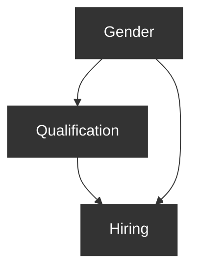


> **图 3.11**  表示性别、资质与招聘之间关系的图形模型。

在图 3.11 的例子中，这是正确的。但请考虑如果存在中介变量与结果变量的 **混杂因素（confounders）** 会发生什么。例如，收入：来自较高收入背景的人更有可能上过大学，也更有可能拥有有助于他们获得工作的人脉。

现在，如果我们对资质进行条件化，我们实际上是在对一个 **对撞因子（collider）** 进行条件化。因此，如果我们不对资质进行条件化，间接依赖关系可以通过路径 性别 → 资质 → 招聘 从性别传递到招聘。但如果我们对资质进行条件化，间接依赖关系可以通过路径 性别 → 资质 ← 收入 → 招聘 从性别传递到招聘。（要直观地理解这个问题，请注意：通过对资质进行条件化，我们将在不同收入水平上比较男性和女性，因为为了保持资质不变，收入必须发生变化。）无论你怎么看，我们都没有得到性别对招聘的真实直接效应。因此，传统上统计学不得不放弃一大类潜在的中介问题，在这些问题中，“直接效应”的概念甚至无法定义，更不用说估计了。

幸运的是，我们现在有一种概念性的方法来保持中介变量不变，而无需对其进行条件化：我们可以对中介变量进行 **干预（intervene）** 。如果我们不进行条件化，而是固定资质，那么性别与资质之间的箭头（以及收入与资质之间的箭头）就会消失，就不会有虚假的依赖关系通过它传递。（当然，我们不可能真正改变申请人的资质，但请记住，这是一种理论上的干预，如同上一节讨论的那种，通过选择合适的调整集来实现。）因此，对于任意三个变量  $X$ 、 $Y$  和  $Z$ ，其中  $Z$  是  $X$  与  $Y$  之间的中介变量，将  $X$  的值从  $x$  改变为  $x^{\prime}$  对  $Y$  的 **受控直接效应（Controlled Direct Effect, CDE）** 定义为

$$
CDE = P(Y = y \mid do(X = x), do(Z = z)) - P(Y = y \mid do(X = x^{\prime}), do(Z = z)) \tag{3.18}
$$

这个定义相对于基于条件化的定义的明显优势在于其 **普遍性** ；即使在  $Z \to Y$  关系存在混杂的情况下（同样适用于  $X \to Z$  和  $X \to Y$  关系），它也能捕捉到“保持  $Z$  不变”的意图。实际上，这个定义向我们保证，在任何情况下，只要干预后的概率可以从观测概率中识别出来，我们就可以估计  $X$  对  $Y$  的直接效应。请注意，直接效应可能因  $Z$  的不同取值而不同；例如，招聘实践可能在资质要求高的职位上歧视女性，但在资质要求低的职位上歧视男性。因此，为了全面了解直接效应，我们需要对  $Z$  的每个相关取值  $z$  进行计算。（在线性模型中，这并非必要；更多信息请参见第 3.8 节。）

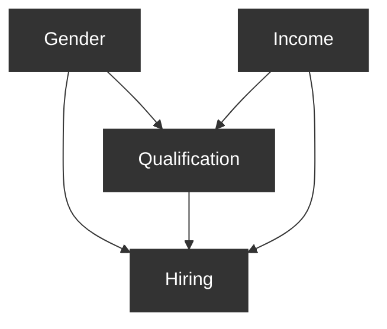


> **图 3.12**  一个图形模型，显示资质（ $Z$ ）是性别（ $X$ ）与招聘（ $Y$ ）之间的中介变量，收入（ $I$ ）是资质与招聘之间的混杂因素。

当直接效应的表达式中包含两个 do-算子时，我们如何估计它？该技术大致与第 3.2 节中使用的相同，当时我们通过调整来处理单个 do-算子。在我们的图 3.12 的例子中，我们首先注意到模型中不存在从  $X$  到  $Y$  的后门路径，因此我们可以用简单的条件化  $x$  来替换  $do(x)$ （这本质上等同于调整所有混杂因素）。这得到

$$
P(Y = y \mid X = x, do(Z = z)) - P(Y = y \mid X = x^{\prime}, do(Z = z))
$$

接下来，我们尝试移除  $do(z)$  项，并注意到从  $Z$  到  $Y$  存在两条后门路径，一条通过  $X$ ，一条通过  $I$ 。第一条路径被阻断（因为  $X$  被条件化），第二条路径可以通过调整  $I$  来阻断。这得到

$$
\sum_{i} \bigl[ P(Y = y \mid X = x, Z = z, I = i) - P(Y = y \mid X = x^{\prime}, Z = z, I = i) \bigr] P(I = i)
$$

最后一个公式是 do-自由的，这意味着它可以从非实验数据中估计。

一般来说， $X$  对  $Y$  的受控直接效应（中介变量为  $Z$ ）在满足以下两个性质时是可识别的：

1. 存在一个变量集  $S_1$ ，它阻断了从  $Z$  到  $Y$  的所有后门路径。
2. 存在一个变量集  $S_2$ ，在删除所有进入  $Z$  的箭头后，它阻断了从  $X$  到  $Y$  的所有后门路径。

如果这两个性质在模型  $M$  中成立，那么我们可以通过调整适当的变量来从数据集确定  $P(Y = y \mid do(X = x), do(Z = z))$ ，并估计随之产生的条件概率。请注意，在随机试验中，条件 2 不是必需的，因为随机化  $X$  使得  $X$  没有父节点。在  $X$  被判定为外生变量（即“如同”随机化）的情况下也是如此，例如前面提到的性别歧视例子。

确定间接效应比确定直接效应更加棘手，因为根本没有办法通过条件化来消除  $X$  对  $Y$  的直接效应。找到总效应和直接效应很容易，因此有些人可能会认为间接效应应该就是这两者之差。这在线性系统中可能是正确的，但在非线性系统中，差值意义不大； $Y$  的变化可能依赖于  $X$  和  $Z$  之间的某种交互作用——正如我们上面假设的，女性在高资质工作中受到歧视，男性在低资质工作中受到歧视，那么从总效应中减去直接效应几乎无法告诉我们关于性别通过资质中介对招聘产生的影响。显然，我们需要一个不依赖于总效应或直接效应的间接效应定义。

我们将在第 4 章中表明，这些困难可以通过使用 **反事实（counterfactuals）** 来克服，这是一种更精细的干预类型，适用于个体层面，并且可以从结构模型中计算得出。

## 3.8 线性系统中的因果推断（Causal Inference in Linear Systems）

我们在本书中介绍的因果方法的一个优势是，无论构成所讨论模型的方程类型如何，它们都适用。d-分离和后门准则不对两个变量之间的关系形式做任何假设——只假设这种关系存在。

然而，从非参数角度展示和解释因果方法限制了我们呈现这些方法在线性系统中的全部力量——而线性系统正是传统因果分析在社会科学和行为科学中主要进行的领域。这很不幸，因为许多统计学家广泛使用线性系统，并且几乎所有统计学家都非常熟悉它们。

在本节中，我们将深入探讨线性方程组中因果假设和含义的表现形式，以及图形方法如何帮助我们回答这些系统中提出的因果问题。这既是对我们在非参数模型中应用的方法的强化，也为那些希望在线性系统背景下具体应用因果推断的人提供了有用的帮助。

例如，我们可能想知道在调整混杂因素后，避孕药使用对血压的影响；课外学习项目对考试成绩的总效应；该项目对其他变量无中介的直接效应；或者参加可选职业培训项目对未来收入的影响，当参与率和收入被一个共同原因（如动机）混杂时。这些涉及连续变量的问题，传统上被表述为线性方程模型，但很少关注这些方程独特的因果特性；我们将使这种特性变得明确。

在本节使用的所有模型中，我们做出一个强假设：变量之间的关系是线性的，并且所有误差项都具有高斯（或“正态”）分布（在某些情况下，我们只需要假设对称分布）。这个假设极大地简化了因果分析所需的程序。我们都熟悉表征单个变量正态分布的钟形曲线。它在统计学中如此流行的原因是，每当一个现象是许多噪声微观过程的副产品，这些过程叠加产生宏观测量值（如身高、体重、收入或死亡率）时，它在自然界中出现的频率非常高。

然而，我们对正态分布的兴趣主要源于多个正态分布变量如何组合形成它们的联合分布。正态性假设产生了四个在处理线性系统时非常有用的性质：

- **高效表示（Efficient representation）**
- **用期望替代概率（Substitutability of expectations for probabilities）**
- **期望的线性性（Linearity of expectations）**
- **回归系数的不变性（Invariance of regression coefficients）**

从两个正态变量  $X$  和  $Y$  开始，我们知道它们的联合密度形成一个三维尖峰（就像一座从  $X$ – $Y$  平面上升起的山），并且该尖峰上等高平面是像图 1.2 中所示的椭圆。每个这样的椭圆由五个参数刻画： $\mu_X$ 、 $\mu_Y$ 、 $\sigma_X$ 、 $\sigma_Y$  和  $\rho_{XY}$ ，如第 1.3.8 节和第 1.3.9 节所定义。参数  $\mu_X$  和  $\mu_Y$  指定椭圆在  $X$ – $Y$  平面上的位置（或重心），标准差  $\sigma_X$  和  $\sigma_Y$  分别指定椭圆沿  $X$  和  $Y$  维度的散布，而相关系数  $\rho_{XY}$  指定其方向。在三维空间中，描绘联合分布的最佳方式是想象一个悬浮在  $X$ – $Y$ – $Z$  空间中的椭圆形橄榄球（图 1.2）；每个恒定的  $Z$  平面将像图 1.1 中所示的二维椭圆那样切割这个橄榄球。

当我们进入更高维度，考虑一组  $N$  个正态分布变量  $X_1, X_2, \dots, X_N$  时，我们无需关心额外的参数；只需指定刻画  $N(N-1)/2$  对变量  $(X_i, X_j)$  的参数就足够了。换句话说，一旦我们指定了  $(X_i, X_j)$  的二元密度（其中  $i$  和  $j$ （ $i \neq j$ ）从  $1$  到  $N$ ）， $(X_1, X_2, \dots, X_N)$  的联合密度就完全确定了。这是一个极其有用的性质，因为它提供了一种极其简洁的方式来指定  $N$  变量的联合分布。

此外，由于每对变量的联合分布由五个参数指定，我们得出结论：联合分布最多需要  $5 \times N(N-1)/2$  个参数（均值、方差和协方差），每个参数由期望定义。实际上，参数总数甚至比这更少，即  $2N + N(N-1)/2$ ；第一项给出均值和方差参数的数量，第二项给出相关系数的数量。

这引出了多元正态分布的另一个有用特征：它们完全由期望定义，因此我们无需像处理离散变量时那样关心概率表。条件概率可以表示为条件期望，而定义图形模型结构的诸如条件独立性等概念可以用条件期望之间的等式关系来表示。例如，要表达给定  $Z$  时  $Y$  和  $X$  的条件独立性，

$$
P(Y \mid X, Z) = P(Y \mid Z)
$$

我们可以写成

$$
E[Y \mid X, Z] = E[Y \mid Z].
$$

（其中  $Z$  是一个变量集）。正态系统的这一特性赋予我们一种极其有用的能力：用期望替代概率使我们能够使用回归（一种预测方法）来确定因果信息。正态分布的另一个有用特征是它们的线性性：每个条件期望  $E[Y \mid X_1, X_2, \ldots, X_n]$  都由条件变量的线性组合给出。形式上，

$$
E[Y \mid X_1 = x_1, X_2 = x_2, \ldots, X_n = x_n] = r_0 + r_1 x_1 + r_2 x_2 + \dots + r_n x_n
$$

其中每个斜率  $r_1, r_2, \ldots, r_n$  是第 1.3.10 节和第 1.3.11 节中定义的偏回归系数。

这些斜率的大小不依赖于条件变量（称为回归变量）的值  $x_1, x_2, \ldots, x_n$ ；它们只依赖于选择哪些变量作为回归变量。换句话说， $Y$  对测量值  $X_i = x_i$  的敏感性不依赖于回归中其他变量的测量值；它只依赖于我们选择测量哪些变量。无论  $X_i = 1$ 、 $X_i = 2$  还是  $X_i = 312.3$ ，只要我们将  $Y$  对  $X_1, X_2, \ldots, X_n$  进行回归，所有斜率将保持不变。

正态分布这一独特而有用的特性在第 1 章的图 1.1 和 1.2 中得到了说明。图 1.1 显示，无论我们选择哪个年龄水平，在该水平上  $Y$  对  $X$  的斜率都是相同的。然而，如果我们不保持年龄恒定（即不将其作为回归变量），斜率就会变得截然不同，如图 1.2 所示。

线性假设还允许我们通过在因果图的每条边上标注 **路径系数（path coefficient）** （或结构系数）来完全指定模型中的函数。沿边  $X \to Y$  的路径系数量化了定义模型中  $Y$  的函数中  $X$  的贡献。例如，如果函数定义  $Y = 3X + U$ ，则  $X \to Y$  的路径系数将为 3。路径系数  $\beta_1, \beta_2, \ldots, \beta_n$  与我们在第 1.3 节讨论的回归系数  $r_1, r_2, \ldots, r_n$  有着根本的不同。前者是“结构的”或“因果的”，而后者是统计的。区别将在下一节解释。

我们讨论的许多回归方法要通用得多，适用于变量  $X_1, \dots, X_k$  的分布远非多元正态的情况；例如，当某些  $X_i$  是分类变量甚至是二值变量时。这样的推广也允许条件均值  $E(Y \mid X_1 = x_1, \dots, X_k = x_k)$  包含  $X_i$  的非线性组合，例如包含  $X_1 X_2$  这样的项，以允许效应修正或交互作用。由于我们对  $X_i$  的值进行条件化，通常不需要对这些变量施加分布假设。尽管如此，完整的多元正态情景为结构因果模型提供了相当深入的见解。

### 3.8.1 结构系数与回归系数（Structural versus Regression Coefficients）

既然我们现在要处理线性模型，因此自然要处理类似回归的方程，那么定义回归方程与本书中在结构因果模型（SCM）中使用的结构方程之间的区别就至关重要。回归方程是描述性的；它不对因果关系做任何假设。当我们把  $y = r_1 x + r_2 z + \epsilon$  写成一个回归方程时，我们并不是说  $X$  和  $Z$  引起  $Y$ 。我们只是承认我们需要知道  $r_1$  和  $r_2$  的哪些值能使方程  $y = r_1 x + r_2 z$

> **脚注** ：例如，当  $X$  和  $U_Y$  是公平硬币，且  $Y = 1$  当且仅当  $X = U_Y$  时，就会出现这种情况。在这种情况下， $P(Y = 1 \mid X = 1) = P(Y = 1 \mid X = 0) = P(Y = 1) = 1/2$ 。这类病态情况需要精确的数值概率才能实现独立性  $(P(X = 1) = P(U_X) = 1/2)$ ；它们很罕见，出于所有实际目的可以忽略。

 **d-连通变量（d-connected variables）**  对于图中分配给箭头的几乎所有函数集都将是相关的，例外情况是第 2.2 节讨论的那些非传递性情况。

数据的最佳线性近似，或者等价地， $E(y \vert x, z)$  的最佳线性近似。由于结构方程与回归方程之间存在的这一根本性差异，一些书籍通过在结构方程中使用箭头而非等号来区分它们，还有一些书籍则通过使用不同的字体来区分系数。我们通过将结构系数记为  $\alpha$ 、 $\beta$  等，将回归系数记为  $r_1, r_2$  等来加以区分。

此外，我们还区分出现在这些方程中的随机“误差项”。回归方程中的误差项记为  $\epsilon_1, \epsilon_2$  等，如公式 (1.24) 所示；而结构方程中的误差项则记为  $U_1, U_2$  等，如 SCM 1.5.2 所示。前者表示在将方程  $y = r_1 x + r_2 z$  拟合到数据后，观测中的残差；而后者则表示影响  $Y$  但自身不受  $X$  影响的 **潜在因素（latent factors）** （有时称为“扰动项”或“遗漏变量”）。前者是人为造成的（由于拟合不完美）；后者是自然产生的。

尽管回归方程本身不具有因果约束力，但在与线性系统相关的因果关系研究中，它们具有重要的用途。考虑一下：在第 3.2 节中，我们能够用条件概率来表达干预的效果，例如公式 (3.5) 的调整公式。在线性系统中，条件概率的作用将由回归系数取代，因为这些系数代表了模型所诱导的依赖关系，此外，它们还可以通过 **最小二乘分析（least square analyses）** 轻松估计。

类似地，尽管非参数模型的可检验含义以条件独立性的形式表达，但在线性模型中，这些独立性通过为零的回归系数来表示，例如第 1.3.11 节讨论的那些。具体来说，给定回归方程

$$
y = r_0 + r_1 x_1 + r_2 x_2 + \dots + r_n x_n + \epsilon
$$

如果  $r_i = 0$ ，那么  $Y$  在给定所有其他回归变量的条件下与  $X_i$  独立。

### 3.8.2 结构系数的因果解释（The Causal Interpretation of Structural Coefficients）

在线性系统中，每个 **路径系数（path coefficient）**  都代表自变量  $X$  对因变量  $Y$  的直接效应。为了理解为何如此，我们参考第 3.7 节（公式 (3.18)）给出的直接效应的干预定义，该定义要求计算当  $X$  增加一个单位而  $Y$  的所有其他父变量保持不变时  $Y$  的变化。当我们将此定义应用于任何线性系统时，无论扰动项是否相关，结果都将是指向  $X \rightarrow Y$  的箭头上的路径系数。

例如，考虑图 3.13 中的模型，并假设我们希望估计  $Z$  对  $Y$  的直接效应。完全指定模型中的结构方程如下：

$$
\begin{array}{l}
X = U_X \\
Z = a X + U_Z \\
W = b X + c Z + U_W \\
Y = d Z + e W + U_Y
\end{array}
$$

将公式 (3.18) 写成期望形式，我们得到

$$
DE = E[Y \vert do(Z = z + 1), do(W = w)] - E[Y \vert do(Z = z), do(W = w)]
$$

因为  $W$  是图中  $Y$  的唯一另一个父变量。通过从模型中删除相应方程来应用  $do$  算子， $DE$  中的增加值项变为  $d(z + 1) + ew$ ，而增加值前项变为  $dz + ew$ 。正如预期，两者之差为  $d$ ——即  $Z$  和  $Y$  之间的路径系数。

请注意，以这种方式简化方程的依据直接来自  $do$  算子的定义（公式 (3.18)），该定义未对  $U$  因子之间的相关性做任何假设；即使误差项  $U_Y$  与  $U_Z$  相关，等式  $DE = d$  仍然成立，尽管这会使  $d$  变得不可识别。其他直接效应也是如此；每个结构系数都代表一个直接效应，无论误差项如何分布。还要注意，变量  $X$  以及系数  $a$ 、 $b$  和  $c$  不参与此计算，因为  $do$  算子所需的“手术”将它们从模型中移除。

对于直接效应，这很好。然而，假设我们希望计算  $Z$  对  $Y$  的总效应。

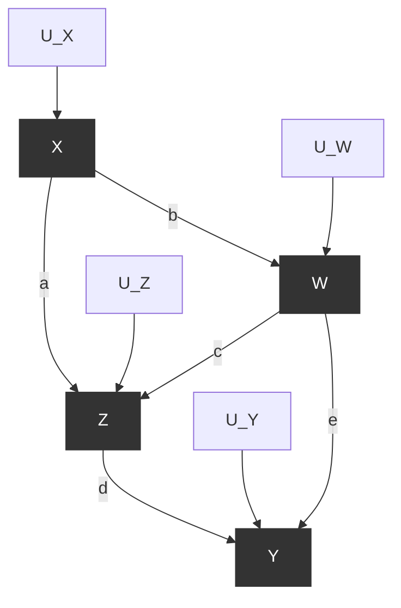


> **图 3.13**  说明路径系数与总效应之间关系的图形模型

在线性系统中， $X$  对  $Y$  的总效应就是从  $X$  到  $Y$  的每条非后门路径上边系数的乘积之和。这有点拗口，所以将其视为一个过程：

- 要找到  $X$  对  $Y$  的总效应，首先找到从  $X$  到  $Y$  的每条非后门路径
- 然后，对于每条路径，将路径上的所有系数相乘
- 然后将所有乘积相加

这个恒等式成立的原因在于 SCM 的本质。再次考虑图 3.13 的图形。由于我们想找到  $Z$  对  $Y$  的总效应，我们应该首先对  $Z$  进行干预，移除所有指向  $Z$  的箭头，然后在剩余模型中将  $Y$  表示为  $Z$  的函数。我们可以通过一点代数运算来实现：

$$
\begin{array}{l}
Y = dZ + eW + U_Y \\
= dZ + e(bX + cZ) + U_Y + eU_W \\
= (d + ec)Z + ebX + U_Y + eU_W
\end{array}
$$

最终的表达式形式为  $Y = \tau Z + U$ ，其中  $\tau = d + ec$ ， $U$  仅包含在修改后的模型中不依赖于  $Z$  的项。因此， $Z$  增加一个单位将使  $Y$  增加  $\tau$ ——这正是总效应的定义。快速检查将表明， $\tau$  是从  $Z$  到  $Y$  的两条非后门路径上系数乘积之和。在所有线性模型中都是如此；代数要求如此。此外，无论  $U$  变量的分布如何，也无论它们是相关的还是独立的，乘积和规则都将成立。

### 3.8.3 识别结构系数与因果效应（Identifying Structural Coefficients and Causal Effect）

到目前为止，我们已经用路径系数表达了总效应和直接效应，假设这些系数要么是先验已知的，要么是从干预实验中估计出来的。我们现在要解决一个更困难的问题：从非实验数据估计总效应和直接效应。这个问题被称为“ **可识别性（identifiability）** ”，从数学上讲，它相当于用协方差  $\sigma_{XY}$  或回归系数  $R_{YX \cdot Z}$  来表达与总效应和直接效应相关的路径系数，其中  $X$  和  $Y$  是模型中的任意两个变量， $Z$  是模型中的一组变量（公式 (1.27) 和 (1.28) 以及第 1.3.11 节）。

然而，在许多情况下，事实证明，要识别直接效应和总效应，我们并不需要识别模型中的每一个结构参数。让我们首先用总效应来演示。 **后门准则（backdoor criterion）**  为我们提供了为确定  $X$  对  $Y$  的因果效应而需要调整的变量集  $Z$ 。但是，我们如何利用该准则在线性系统中确定效应呢？原则上，一旦我们获得集合  $Z$ ，我们就可以估计给定  $X$  和  $Z$  时  $Y$  的条件期望，然后，对  $Z$  进行平均，我们可以使用由此产生的  $Y$  和  $X$  之间的依赖关系来衡量  $X$  对  $Y$  的效应。我们只需要将这个程序翻译成回归的语言。

这种翻译相当简单。首先，我们找到一个满足模型中从  $X$  到  $Y$  的后门准则的协变量集  $Z$ 。然后，我们将  $Y$  对  $X$  和  $Z$  进行回归。所得方程中  $X$  的系数代表了  $X$  对  $Y$  的真实因果效应。这样做的理由与我们最初用来证明后门准则的理由类似——对  $Z$  进行回归将这些变量添加到方程中，阻断了从  $X$  到  $Y$  的所有后门路径，从而防止  $X$  的系数吸收这些路径包含的虚假信息。

例如，考虑一个符合图 3.14 中图形的线性模型。如果我们想找到  $X$  对  $Y$  的总因果效应，我们首先使用后门准则确定我们必须调整  $T$ 。因此，我们使用回归方程将  $Y$  对  $X$  和  $T$  进行回归：

$$
y = r_X X + r_T T + \epsilon
$$

系数  $r_X$  代表  $X$  对  $Y$  的总效应。请注意，这种识别无需识别任何模型参数，也无需测量变量  $W$  即可实现；图形结构本身允许我们忽略  $W$ ，仅将  $Y$  对  $T$  和  $X$  进行回归，并将总效应（ $X$  对  $Y$ ）与该回归中  $X$  的系数等同起来。

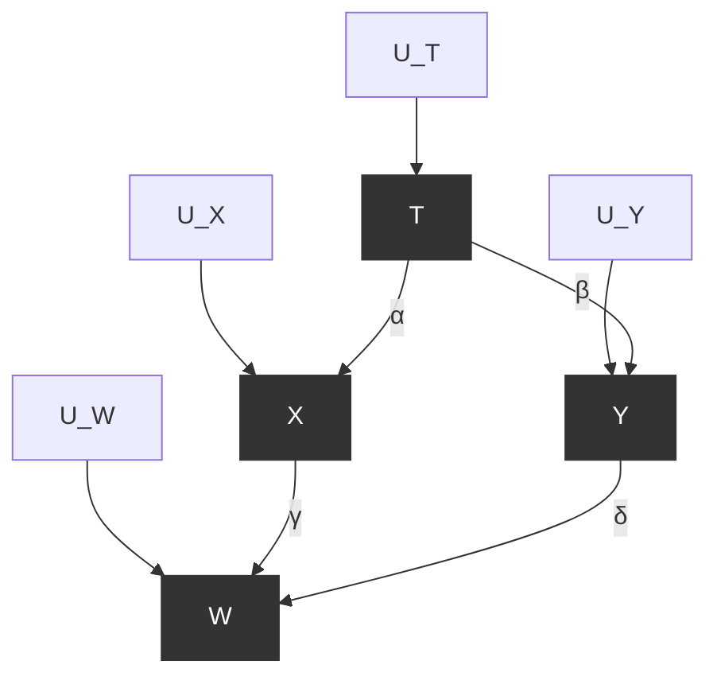


> 图 3.14 一个图形模型，其中  $X$  对  $Y$  没有直接效应，但通过调整  $T$  可以确定总效应

现在假设，我们想找的不是总因果效应，而是  $X$  对  $Y$  的直接效应。在线性系统中，这个直接效应是函数中的结构系数  $\alpha$ ：

$$
y = \alpha x + \beta z + \cdots + U_Y
$$

该函数在系统中定义了  $Y$ 。从图 3.14 的图形中我们知道  $\alpha = 0$ ，因为没有从  $X$  到  $Y$  的直接箭头。所以，在这个特定情况下，答案是显而易见的：直接效应为零。但一般来说，如果模型没有确定  $\alpha$  的值，我们如何从数据中找到  $\alpha$  的大小呢？

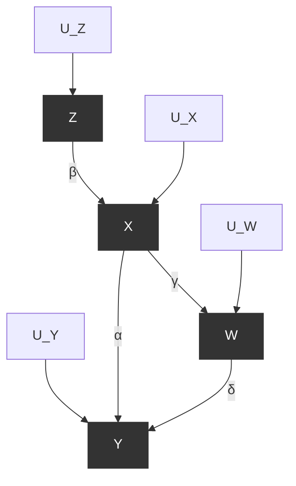


> 图 3.15 一个图形模型，其中  $X$  对  $Y$  有直接效应  $\alpha$

我们可以调用类似于后门准则的程序，不同之处在于，现在我们需要阻断的不仅是后门路径，还有从  $X$  到  $Y$  的间接路径。首先，我们移除从  $X$  到  $Y$  的边（如果存在这样的边），并将得到的图称为  $G_{\alpha}$ 。如果在  $G_{\alpha}$  中，存在一组变量  $Z$  能够 **d-分离（d-separates）**   $X$  和  $Y$ ，那么我们可以简单地将  $Y$  对  $X$  和  $Z$  进行回归。所得方程中  $X$  的系数将等于结构系数  $\alpha$ 。

上述程序，我们不妨称之为“识别的回归规则”，为我们提供了一种快速方法，用于确定任何给定参数（例如  $\alpha$ ）是否可以通过 **普通最小二乘法（Ordinary Least Square, OLS）**  回归来识别，如果可以，那么哪些变量应该进入回归方程。例如，在图 3.15 的线性模型中，我们可以通过这种方法找到  $X$  对  $Y$  的直接效应。首先，我们移除  $X$  和  $Y$  之间的边，得到如图 3.16 所示的图  $G_{\alpha}$ 。很容易看出，在这个新图中， $W$  d-分离了  $X$  和  $Y$ 。因此，我们使用回归方程将  $Y$  对  $X$  和  $W$  进行回归：

$$
Y = r_X X + r_W W + \epsilon
$$

系数  $r_X$  就是  $X$  对  $Y$  的直接效应。

总结我们到目前为止的观察，出现了两个有趣的特征。首先，我们看到，在线性系统中，回归是识别和估计因果效应的主要工具。要估计一个给定的效应，我们所要做的就是写出一个回归方程，并指定：

1. 方程中应包含哪些变量。
2. 该方程中的哪个系数代表感兴趣的效应。

剩下的就是对采样数据进行常规的最小二乘分析，正如我们之前提到的，各种极其高效的软件包可以方便地完成这项工作。

其次，我们看到，只要  $U$  变量相互独立，并且图中的所有变量都被测量，那么每个结构参数都可以通过这种方式被识别——也就是说，至少存在一个识别回归方程，其中一个系数对应于我们试图估计的参数。其中一个方程显然是结构方程本身，以  $Y$  的父变量作为回归变量。但可能还有其他几个识别方程，可能具有更好的估计特性，图形分析可以揭示所有这些方程（见学习问题 3.8.1(c)）。此外，当某些变量未被测量，或者某些误差项相关时，从结构方程本身寻找识别回归的任务通常是无法完成的；此时， $G_{\alpha}$  程序变得不可或缺（见学习问题 3.8.1(d)）。

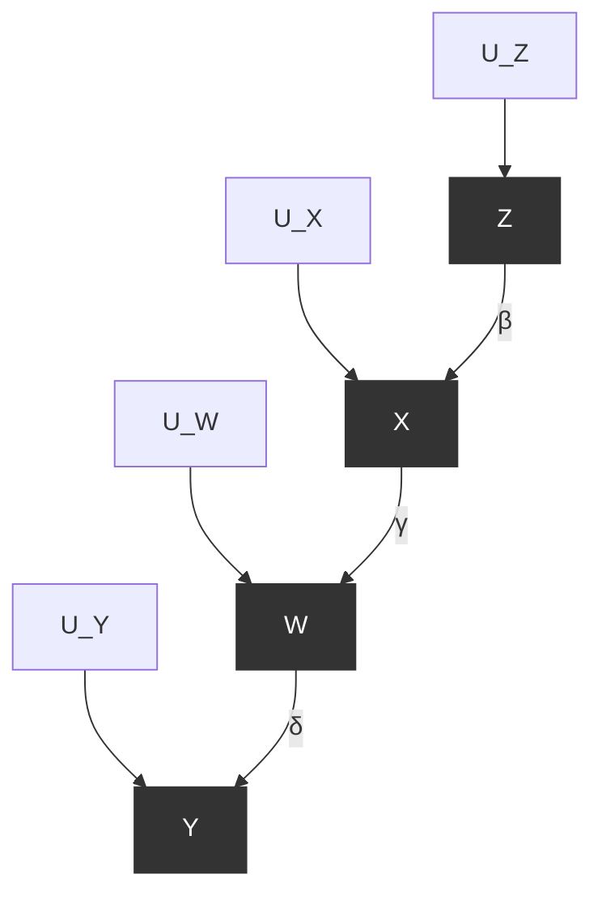


> 图 3.16 通过移除从  $X$  到  $Y$  的直接边，并找到能够 d-分离它们的变量集  $\{W\}$ ，我们找到了为确定  $X$  对  $Y$  的直接效应而需要调整的变量

值得注意的是，回归规则程序几乎困扰了研究者一个世纪，可能是因为用代数的、非图形的术语来阐述它极其困难。

然而，假设在  $G_{\alpha}$  中不存在能够 d-分离  $X$  和  $Y$  的变量集。例如，在图 3.17 中， $X$  和  $Y$  有一个未观测到的共同原因，由虚线双箭头弧线表示。由于它未被测量，我们无法以它为条件，因此  $X$  和  $Y$  将始终通过它而相关。在这种特定情况下，我们可以使用一个 **工具变量（instrumental variable）**  来确定直接效应。如果一个变量在  $G_{\alpha}$  中与  $Y$  d-分离并且与  $X$  d-连通，则称其为“工具”。为了理解为什么这样的变量使我们能够识别结构系数，我们仔细看看图 3.17。

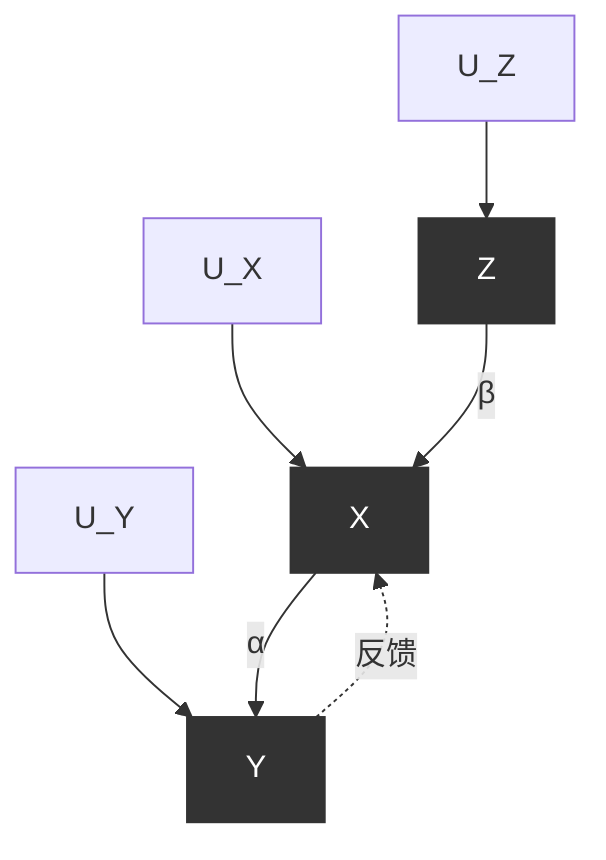


> 图 3.17 一个图形模型，在该模型中我们无法通过调整找到 X 对 Y 的直接效应，因为虚线双箭头弧线表示 X 和 Y 之间存在一条由未测量变量组成的后门路径。在这种情况下，Z 是关于 X 对 Y 效应的一个工具，它使得识别 ??? 成为可能

在图 3.17 中，Z 是关于 X 对 Y 效应的一个工具，因为它在  $G_{\alpha}$  中与 X d-连通并且与 Y d-分离。我们分别将 X 和 Y 对 Z 进行回归，得到回归方程  $y = r_{1}z + \epsilon$  和  $x = r_{2}z + ??$ 。由于 Z 不发出后门路径， $r_{2}$  等于 ??，而  $r_{1}$  等于 Z 对 Y 的总效应，????。因此，比率  $r_{1} / r_{2}$  提供了所需的系数 ??。这个例子说明了直接效应如何可以从总效应中识别出来，但反过来则不行。

图形模型为我们提供了一种在系统中找到所有工具变量的程序，尽管枚举它们的程序超出了本书的范围。有兴趣了解更多信息的人可以（见 Chen and Pearl 2014; Kyono 2010）。

学习问题 3.8.1（Study question 3.8.1）

模型 3.1（Model 3.1）

$$
Y = a W_{3} + b Z_{3} + c W_{2} + U \quad X = t_{1} W_{1} + t_{2} Z_{3} + U^{\prime}
$$

$$
W_{3} = c_{3} X + U_{3}^{\prime} \qquad W_{1} = a_{1}^{\prime} Z_{1} + U_{1}^{\prime}
$$

$$
Z_{3} = a_{3} Z_{1} + b_{3} Z_{2} + U_{3} \quad Z_{1} = U_{1}
$$

$$
W_{2} = c_{2} Z_{2} + U_{2}^{\prime} \quad Z_{2} = U_{2}
$$

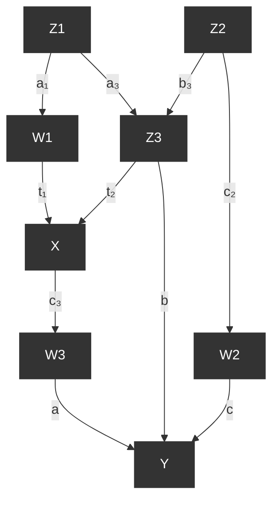


> 图 3.18 对应于学习问题 3.8.1 中模型 3.1 的图形

给定上述模型，回答以下问题：（所有答案应以指定回归方程中的回归系数形式给出。）

- (a) 识别该模型的三个可检验含义。
- (b) 假设仅观测到 X、Y、 $W_{3}$  和  $Z_{3}$ ，识别一个可检验含义。
- (c) 对于模型中的每个参数，写出一个回归方程，其中一个系数等于该参数。识别存在多于一个此类方程的参数。
- (d) 假设 X、Y 和  $W_{3}$  是唯一观测到的变量。可以从数据中识别哪些参数？能否估计 X 对 Y 的总效应？
- (e) 如果我们对  $Z_{1}$  关于模型中所有其他变量进行回归，哪个回归系数将为零？
- (f) 图 3.18 中的模型暗示，当添加一个额外的变量作为回归变量时，某些回归系数将保持不变。识别五个这样的系数及其添加的回归变量。
- (g) 假设变量  $Z_{2}$  和  $W_{2}$  无法测量。找到一种使用回归系数估计 b 的方法。[提示：找到一种方法将  $Z_{1}$  转变为 b 的工具变量。]

### 3.8.4 线性系统中的中介分析（Mediation in Linear Systems）

当我们能够假设变量之间存在线性关系时，中介分析比在非线性或非参数系统（第 3.7 节）中进行的分析要简单得多。例如，估计 X 对 Y 的直接效应相当于估计这两个变量之间的路径系数，这又简化为使用第 3.8.3 节介绍的技术估计相关系数。类似地，间接效应通过差值  $IE = \tau - DE$  计算，其中 ??，即总效应，可以通过如图 3.14 所示的方式进行回归来估计。另一方面，在非线性系统中，直接效应通过诸如 (3.18) 的表达式来定义，或者

$$
DE = E[Y | do(x, z)] - E[Y | do(x^{\prime}, z)]
$$

其中  $Z = z$  代表 Y 的所有其他父变量（除了 X 之外）的一个特定层。即使满足识别条件，并且我们能够（通过调整）将 do() 算子简化为普通的条件期望，结果仍然取决于  $x$ 、 $x^{\prime}$  和  $z$  的具体值。此外，间接效应不能以 do 表达式的形式给出定义，因为我们无法通过保持变量恒定来禁用 Y 对 X 做出响应的能力。间接效应也不能定义为总效应与直接效应之差，因为差值不能忠实地反映非线性系统中对 X 的操作。

这种操作将在第 4 章（第 4.4.5 节和第 4.5.2 节）中使用 **反事实（counterfactuals）**  的语言引入。

## 第 3 章参考文献注释（Bibliographical Notes for Chapter 3）

学习问题 3.3.2 是 **罗德悖论（Lord’s paradox）**  (Lord 1967) 的一个版本，并在 Glymour (2006)、Hernández-Díaz et al. (2006)、Senn (2006) 和 Wainer (1991) 中有描述。统一处理见 Pearl (2016)。

基于修改模型对  $do$  算子和  $\mathrm{ACE}$  的定义，其概念源于经济学家  **特里格夫·哈维尔莫（Trygve Haavelmo）**  (1943)，他是第一个通过修改模型中的方程来模拟干预的人（历史记载见 Pearl (2015c)）。Strotz 和 Wold (1960) 后来主张“擦除”确定  $X$  的方程，Spirtes et al. (1993) 以“操作图”的形式给出了其图形表示。

公式 (3.5) 的“调整公式”以及“截断乘积公式”首次出现在 Spirtes et al. (1993) 中，尽管它们隐含在 Robins (1986) 的  **G-计算公式（G-computation formula）**  中，该公式是使用反事实假设推导出来的（见第 4 章）。定义 3.3.1 中的后门准则及其对调整的含义由 Pearl (1993) 引入。前门准则以及从观测和实验数据中识别因果效应的一般演算（称为  **do-演算（do-calculus）** ）由 Pearl (1995) 引入，并由 Tian and Pearl (2002)、Shpitser and Pearl (2007) 以及 Bareinboim and Pearl (2012) 进一步改进。

第 3.7 节，以及条件干预和 c-特定效应的识别，基于 (Pearl 2009, pp. 113–114)。其向动态、时变策略的扩展在 Pearl and Robins (1995) 和 (Pearl 2009, pp. 119–126) 中描述。最近，do-演算被用于解决外部有效性、数据融合和 **元分析（meta-analysis）**  的问题 (Bareinboim and Pearl 2013, Bareinboim and Pearl 2016, and Pearl and Bareinboim 2014)。

协变量特定效应在评估交互、调节或效应修饰中的作用在 Morgan and Winship (2014) 和 Vanderweele (2015) 中有描述，而规则 2 在检测潜在异质性中的应用在 Pearl (2015b) 中有描述。关于使用 **逆概率加权（inverse probability weighting）**  的更多讨论（第 3.6 节）可以在 Hernán and Robins (2006) 中找到。

我们关于中介分析（第 3.7 节）和 CDE 识别的讨论基于 Pearl (2009, pp. 126–130)，而“以”中介变量“为条件”来评估直接效应的不可靠性在 Pearl (1998) 以及 Cole and Hernán (2002) 中得到了证明。在过去的 15 年里，中介分析变得非常活跃，这主要是由于反事实逻辑的出现（见第 4.4.5 节）；Vanderweele (2015) 对这一进展进行了全面阐述。

关于线性系统中因果推断的教程综述（第 3.8 节），侧重于参数识别，由 Chen and Pearl (2014) 提供。关于回归与结构方程混淆的更多讨论可以在 Bollen and Pearl (2013) 中找到。

关于结构系数和回归系数之间关系的经典且仍是最好的教科书是 Heise (1975)（在线获取：[http://www.indiana.edu/~socpsy/public_files/CausalAnalysis.zip](http://www.indiana.edu/~socpsy/public_files/CausalAnalysis.zip)）。其他经典著作包括 Duncan (1975)、Kenny (1979) 和 Bollen (1989)。然而，经典文本未能提供识别的图形工具，例如那些使用后门准则和  $G_{\alpha}$  的工具（见学习问题 3.8.1）。最近的一个例外是 Kline (2016)。

关于工具变量的介绍可以在 Greenland (2000) 和许多计量经济学教科书（例如 Bowden and Turkington 1984, Wooldridge 2013）中找到。扩展了第 3.8.3 节经典定义的广义工具变量由 Brito and Pearl (2002) 引入。

程序  **DAGitty** （在线获取：[http://www.dagitty.net/dags.html](http://www.dagitty.net/dags.html)）允许用户在图中搜索广义工具变量，并报告得到的 IV 估计量 (Textor et al. 2011)。
