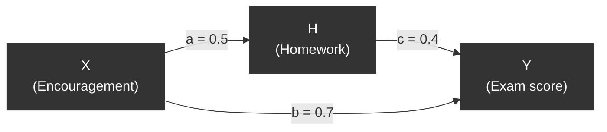
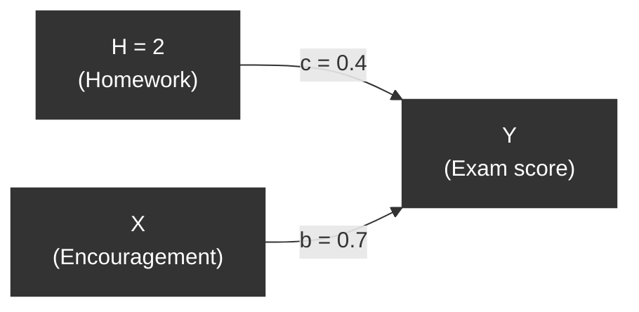
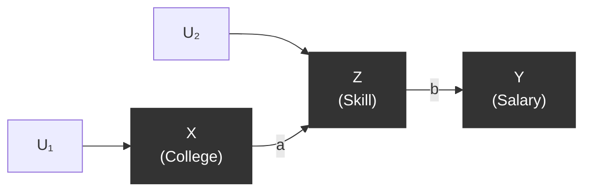
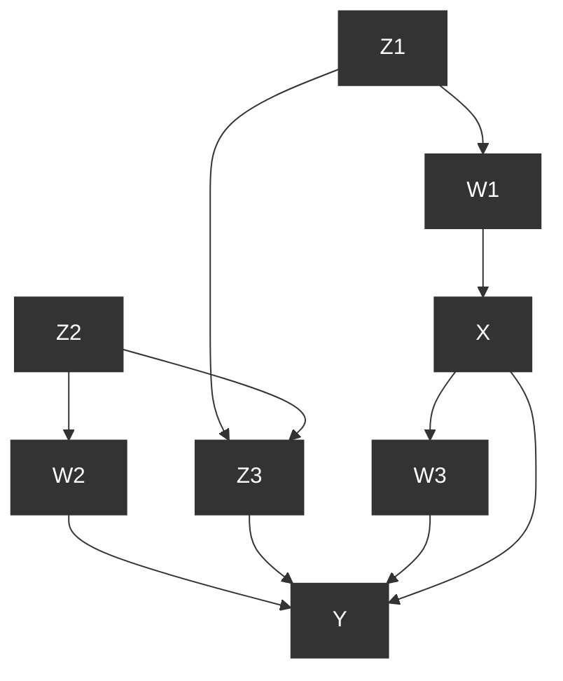
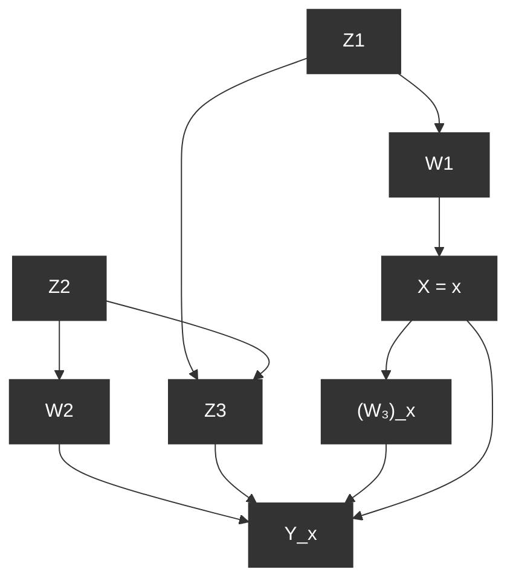
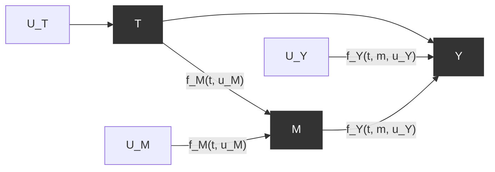
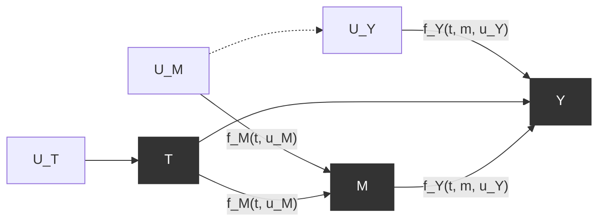

# 4 反事实及其应用（Counterfactuals and Their Applications）

## 4.1 反事实（Counterfactuals）

昨晚开车回家时，我遇到了一个岔路口，必须做出选择：走高速公路（ $X = 1$ ）还是走名为塞普尔维达大道（Sepulveda Boulevard）的地面街道（ $X = 0$ ）。我选择了塞普尔维达大道，结果却发现交通状况时断时续。当我一个小时后到家时，我对自己说："哎呀，我应该走高速公路的。"

说"我应该走高速公路"意味着什么？通俗地说，它的意思是"如果我走了高速公路，我就能更早到家。"科学地说，它意味着我对当天、相同情况下、受我相同独特驾驶习惯支配的高速公路预期驾驶时间的心理估计，会低于我的实际驾驶时间。

这种陈述——一种"如果"部分不真实或未实现的"如果"陈述——被称为 **反事实（counterfactual）** 。反事实的"如果"部分被称为 **假设条件（hypothetical condition）** ，或者更常见地，称为 **前件（antecedent）** 。我们使用反事实来强调我们希望比较在完全相同条件下、仅在一个方面不同的两个结果（例如，驾驶时间）：前件，在我们的例子中代表"走高速公路"而非地面街道。

我们知道实际决策的结果这一事实很重要，因为我在看到实际决策（选择塞普尔维达大道）的后果后对高速公路驾驶时间的估计，可能与看到后果之前的估计完全不同。后果（1 小时）可能为评估提供有价值的证据，例如，当天交通特别拥堵，可能是因为一场灌木火灾。我"我应该走高速公路"的陈述传达了这样一个判断：无论是什么机制阻碍了我在塞普尔维达大道上的速度，都不会以相同的程度影响高速公路上的速度。我的回顾性估计是，高速公路驾驶本应少于 1 小时，而这个估计显然与我在做出决策时、在看到后果之前的预期估计不同——否则，我一开始就会选择高速公路。

如果我们试图用 $do$ 表达式来表达这个估计，就会陷入困境。写成

$$
E (\text{driving time} | do(\text{freeway}), \text{driving time} = 1 \text{hour})
$$

会导致我们希望估计的驾驶时间与实际观察到的驾驶时间之间发生冲突。显然，为了避免这种冲突，我们必须在符号上区分以下两个变量：

1. 实际驾驶时间
2. 在已知实际地面驾驶时间为 1 小时的情况下，高速公路条件下的假设驾驶时间

不幸的是， $do$ 算子过于粗糙，无法做出这种区分。虽然 $do$ 算子允许我们区分两个概率， $P(\text{driving time} \mid do(\text{freeway}))$ 和 $P(\text{driving time} \mid do(\text{Sepulveda}))$ ，但它没有提供区分这两个变量本身的手段，一个代表塞普尔维达大道上的时间，另一个代表高速公路上的假设时间。我们需要这种区分，以便让实际驾驶时间（在塞普尔维达大道上）为我们的假设驾驶时间评估提供信息。

幸运的是，做出这种区分很容易；我们只需使用不同的下标来标记这两个结果。我们将高速公路驾驶时间记为 $Y_{X=1}$ （或 $Y_1$ ），在上下文允许的情况下）和塞普尔维达大道驾驶时间记为 $Y_{X=0}$ （或 $Y_0$ ）。在我们的例子中，由于 $Y_0$ 是实际观察到的 $Y$ ，我们希望估计的量是

$$
E (Y_{X=1} | X = 0, Y = Y_0 = 1) \tag{4.1}
$$

初学者可能会对最后一个表达式感到有些不适应，它包含三个变量的混合：一个假设变量和两个观察变量，其中假设变量 $Y_{X=1}$ 以一个事件（ $X = 1$ ）为前提，却以冲突的事件 $X = 0$ （实际观察到的）为条件。我们以前没有遇到过这样的冲突。当我们使用 $do$ 算子来预测干预的效果时，我们写出了诸如

$$
E [ Y | do (X = x) ] \tag{4.2}
$$

这样的表达式。这个表达式中的 $Y$ 以事件 $X = x$ 为前提。用我们的新记法，这个表达式也可以写成 $E [ Y_{X=x} ]$ 。但由于这个表达式中的所有变量都是在同一个世界中测量的，所以没有必要放弃 $do$ 算子并调用反事实记法。

当我们遇到像 (4.1) 这样的反事实表达式时，问题就出现了，因为 $Y_{X=1} = y$ 和 $X = 0$ 是——而且必须是——在不同条件下发生的事件，有时被称为"不同世界"。这个问题在干预表达式中不会出现，因为方程 (4.1) 试图估计在我们选择高速公路的世界中的总驾驶时间，前提是实际驾驶时间（在我们选择塞普尔维达大道的世界中）是 1 小时，而方程 (4.2) 试图估计在选择高速公路的世界中的预期驾驶时间，完全不涉及另一个世界。

然而，在方程 (4.1) 中，这种冲突阻止我们将表达式简化为 $do$ 表达式，这意味着它无法从干预实验中估计出来。事实上，对这两个决策选项进行的随机对照实验永远无法得到我们想要的估计。这样的实验可以给我们 $E [ Y_1 ] = E [ Y | do(freeway) ]$ 和 $E [ Y_0 ] = E [ Y | do(Sepulveda) ]$ ，但我们不能同时走高速公路和塞普尔维达大道这一事实，阻止了我们估计我们希望估计的量，即条件期望 $E [ Y_1 | X = 0; Y = 1 ]$ 。人们可能倾向于通过稍后时间或由另一位驾驶员测量高速公路时间来规避这个困难，但条件可能随时间变化，而另一位驾驶员的驾驶习惯可能与我的不同。无论哪种情况，我们通过这些替代变量测量的驾驶时间都只能是我们着手估计的 $Y_1$ 的近似值，而近似的程度取决于我们能够对替代条件与如果我走了高速公路时我自己的驾驶时间的相似程度所做的假设。这种近似在某些情况下可能适合估计目标量，但不适合定义它。定义应该准确捕捉我们希望估计的内容，因此，我们必须诉诸下标记法 $Y_1$ ，并理解 $Y_1$ 是如果我当时在那个历史关头选择了高速公路时我的"将会是"的驾驶时间。

读者会很高兴知道，他们对方程 (4.1) 冲突性质的不适感将是短暂的。尽管反事实 $Y_1$ 具有假设性质，但我们在本书第二部分学习的 **结构因果模型（Structural Causal Models, SCMs）** 将证明不仅能够计算任何完全指定模型的反事实概率，而且能够从数据中估计这些概率，即使底层函数未指定或某些变量未被测量。

在下一节中，我们将详细说明计算和估计反事实属性的方法。完成之后，我们将使用这些方法来解决各种复杂的、看似棘手的问题。我们将使用反事实来确定职业培训项目的效果，方法是计算出有多少参与者如果没有参加该项目本会找到工作；从实施统一干预（将一组患者的胰岛素水平设置为相同的常数值）的实验研究中预测加法干预（向一组具有不同胰岛素水平的患者添加 5 mg/l 胰岛素）的效果；确定个别癌症患者如果选择了不同的治疗方案本会有不同结果的可能性；以足够的概率证明一家公司在拒绝求职者时是否存在歧视；以及通过直接和间接效应的分析，探究性别盲录用实践对纠正劳动力中性别差异的效果。

所有这一切，甚至更多，我们都可以用反事实来实现。但首先，我们必须学习如何定义它们、如何计算它们以及如何在实际中使用它们。

## 4.2 定义与计算反事实（Defining and Computing Counterfactuals）

## 4.2.1 反事实的结构解释（The Structural Interpretation of Counterfactuals）

我们在关于干预的小节中看到，结构因果模型可用于预测从未实施过的行动和政策的效果。将变量 $X$ 设置为值 $x$ 的动作，是通过用方程 $X = x$ 替换 $X$ 的结构方程来模拟的。在本节中，我们表明，通过在略微不同的上下文中使用相同的操作，我们可以使用 SEM 来定义反事实代表什么、如何从给定模型中读取反事实，以及当模型部分未知时如何估计反事实的概率。

我们从完全指定的模型 $M$ 开始，对于该模型，我们既知道函数 $\{F\}$ ，也知道所有外生变量的值。在这样的确定性模型中，每个对外生变量的赋值 $U = u$ 对应于总体中的单个成员或"单元"，或自然界中的一种"情境"。这种对应关系的原因如下：每个赋值 $U = u$ 唯一地确定 $V$ 中所有变量的值。类似地，总体中每个个体"单元"的特征具有唯一的值，取决于该个体的身份。

如果总体是"人"，这些特征包括工资、地址、教育程度、参与音乐活动的倾向，以及我们在任何给定时间与该个体关联的所有其他属性。如果总体是"农业地块"，这些特征包括土壤成分、周围气候和当地野生动物等。这些定义性属性如此之多，以至于它们不可能全部被包含在模型中，但综合起来，它们唯一地区分每个个体，并确定我们确实包含在模型中的变量的值。正是在这个意义上，每个赋值 $U = u$ 对应于总体中的单个成员或"单元"，或自然界中的一种"情境"。

例如，如果 $U = u$ 代表名为乔的个体的定义特征，而 $X$ 代表名为"工资"的变量，那么 $X(u)$ 代表乔的工资。如果 $U = u$ 代表一个农业地块的身份，而 $Y$ 代表在给定季节测量的产量，那么 $Y(u)$ 代表地块 $U = u$ 在该季节产生的产量。

现在考虑反事实语句："在情境 $U = u$ 中，如果 $X$ 是 $x$ ，则 $Y$ 会是 $y$ "，记为 $Y_x(u) = y$ ，其中 $Y$ 和 $X$ 是 $V$ 中的任意两个变量。解释这种语句的关键是将"如果 $X$ 是 $x$ "这个短语视为在当前模型中做出最小修改以建立前件条件 $X = x$ 的指令，该条件很可能与 $X$ 的观察值 $X(u)$ 冲突。这种最小修改相当于用常数 $x$ 替换 $X$ 的方程，这可以被视为一种外部干预 $do(X = x)$ ，不一定是人类实验者进行的。这种替换允许常数 $x$ 与 $X$ 的实际值（即 $X(u)$ ）不同，而不会使方程组不一致，并且通过这种方式，它允许所有变量（外生变量和内生变量）作为其他变量的前件。

我们在一个简单的因果模型上演示这个定义，该模型仅由三个变量 $X$ 、 $Y$ 、 $U$ 组成，并由两个方程定义：

$$
X = a U \tag{4.3}
$$

$$
Y = b X + U \tag{4.4}
$$

我们首先计算反事实 $Y_x(u)$ ，即在情境 $U = u$ 中，如果 $X$ 是 $x$ ，则 $Y$ 会是什么。用 $X = x$ 替换第一个方程给出"修改后的"模型 $M_x$ ：

$$
X = x
$$

$$
Y = b X + U
$$

代入 $U = u$ 并求解 $Y$ 得到

$$
Y_x(u) = b x + u
$$

**表 4.1** 方程 (4.3) 和 (4.4) 的线性模型中 $X(u)$ 、 $Y(u)$ 、 $Y_x(u)$ 和 $X_y(u)$ 的值

| $u$ | $X(u)$ | $Y(u)$ | $Y_1(u)$ | $Y_2(u)$ | $Y_3(u)$ | $X_1(u)$ | $X_2(u)$ | $X_3(u)$ |
| --- | ------ | ------ | -------- | -------- | -------- | -------- | -------- | -------- |
| 1   | 1      | 2      | 2        | 3        | 4        | 1        | 1        | 1        |
| 2   | 2      | 4      | 3        | 4        | 5        | 2        | 2        | 2        |
| 3   | 3      | 6      | 4        | 5        | 6        | 3        | 3        | 3        |

这是预期的，因为结构方程 $Y = b X + U$ 的含义正是"自然赋予 $Y$ 的值必须是 $U$ 加上 $b$ 乘以赋予 $X$ 的值"。

为了演示一个不太明显的结果，让我们考察反事实 $X_{y}(u)$ ，即在情境 $U = u$ 中，如果 $Y$ 是 $y$ ，则 $X$ 会是什么。这里，我们用常数 $Y = y$ 替换第二个方程，求解 $X$ 得到 $X_{v}(u) = a u$ ，这意味着 $X$ 不受假设条件"如果 $Y$ 是 $y$ "的影响。如果我们把这个假设条件解释为来自一种外部的、尽管未指定的干预，那么这是可以预期的。如果我们不援引干预隐喻，而仅仅将 $Y = y$ 视为一种自发的、未预料到的变化，那么这就没那么容易预期了。在这种反事实条件下 $X$ 的不变性反映了这样一种直觉：假设未来的结果不会改变过去。

每个 SCM 在其内部编码了许多这样的反事实，对应于其变量可以取的各种值。为了说明该模型产生的额外反事实，让我们假设 $U$ 可以取三个值 1、2 和 3，并在方程 (4.3) 和 (4.4) 中令 $a = b = 1$ 。表 4.1 给出了 $X(u)$ 、 $Y(u)$ 、 $Y_{x}(u)$ 和 $X_{y}(u)$ 在几个 $x$ 和 $y$ 水平下的值。

例如，要计算 $u = 2$ 时的 $Y_{2}(u)$ ，我们只需求解一组新的方程，用 $X = 2$ 替换 $X = a U$ ，得到 $Y_{2}(u) = 2 + u = 4$ 。计算非常简单，这表明，虽然反事实被认为是假设性的，甚至从统计学的观点来看是神秘的，但它们非常自然地从我们对现实的感知中产生，正如在结构模型中所编码的那样。每个结构方程模型都为每一个可以想象的反事实分配一个确定的值。

从这个例子中，读者可能会得到这样的印象：反事实与由 $do$ 算子捕获的普通干预没有区别。然而，请注意，在这个例子中，我们计算的不仅仅是在某种或另一种干预下 $Y$ 的概率或期望值，而是在假设的新条件 $X = x$ 下 $Y$ 的实际值。对于每个情境 $U = u$ ，我们得到了一个确定的数 $Y_{x}(u)$ ，它代表该情境下 $Y$ 的假设值。

另一方面， $do$ 算子仅定义在概率分布上，并且在从乘积分解（方程 (1.29)）中删除因子 $P(x_i \mid pa_i)$ 后，总是提供诸如 $E[Y \mid do(x)]$ 这样的概率结果。从实验主义者的角度来看，这种差异反映了总体层面与个体层面分析之间的深刻差距； $do(x)$ 算子捕获了总体在干预下的行为，而 $Y_{x}(u)$ 描述了特定个体 $U = u$ 在此类干预下的行为。这种差异具有深远的影响，并将使我们能够定义诸如功劳、责备和遗憾等概念的概率，而 $do$ 算子无法捕获这些概念。

### 4.2.2 反事实的基本定律（The Fundamental Law of Counterfactuals）

我们现在准备将反事实的概念推广到任何结构模型 $M$ 。考虑任意两个变量 $X$ 和 $Y$ ，不一定要由单个方程连接。

令 $M_{x}$ 表示 $M$ 的修改版本，其中 $X$ 的方程被替换为 $X = x$ 。反事实 $Y_{x}(u)$ 的形式定义如下

$$
Y_{x}(u) = Y_{M_{x}}(u) \tag{4.5}
$$

换句话说：模型 $M$ 中的反事实 $Y_{x}(u)$ 被定义为在"外科手术修改过的"子模型 $M_{x}$ 中 $Y$ 的解。

方程 (4.5) 是因果推断最基本的原则之一。它允许我们利用我们对现实的科学概念 $M$ ，并用来生成对大量"如果 $X$ 是 $x$ ，则 $Y$ 会是什么"类型假设问题的答案。当 $X$ 和 $Y$ 是变量集时，同样的定义也适用，只要 $M_{x}$ 表示 $X$ 的所有成员的方程都被常数替换的模型。

这极大地增加了给定模型可计算的反事实语句的数量，并提出了一个有趣的问题：一个仅由几个方程组成的简单模型如何能为如此多的反事实赋值？答案是，这些反事实所接收的值并非完全任意，而是必须彼此一致，以与底层模型保持一致。

例如，如果我们观察到 $X(u) = 1$ 且 $Y(u) = 0$ ，那么 $Y_{X=1}(u)$ 必须为零，因为将 $X$ 设置为它已有的值 $X(u)$ 应该不会在世界中产生任何变化。因此， $Y$ 应保持其当前值 $Y(u) = 0$ 。

一般来说，反事实遵循以下一致性规则：

$$
\text{if} \quad X = x \quad \text{then} \quad Y_{x} = Y \tag{4.6}
$$

如果 $X$ 是二元的，那么一致性规则采用方便的形式：

$$
Y = X Y_{1} + (1 - X) Y_{0}
$$

这可以解释如下：每当 $X$ 取值为 1 时， $Y_{1}$ 等于 $Y$ 的观察值。对称地，每当 $X$ 为 0 时， $Y_{0}$ 等于 $Y$ 的观察值。如果我们通过方程 (4.5) 计算反事实，所有这些约束都会自动满足。

### 4.2.3 从总体数据到个体行为——一个例证（From Population Data to Individual Behavior—An Illustration）

为了说明反事实在推理个体单元行为中的使用，我们参考图 4.1 中描绘的模型，该模型代表了一个"鼓励设计"： $X$ 代表学生参加课后补习项目的时间量， $H$ 代表学生做作业的量， $Y$ 代表学生的考试成绩。

每个变量的值以学生高于平均值的标准差数给出（即模型已标准化，使得所有变量的均值为 0，方差为 1）。例如，如果 $Y = 1$ ，则该学生的考试成绩高于平均值 1 个标准差。该模型代表一个随机试点项目，在该项目中，学生通过抽签被分配到补习课程。

模型 4.1（Model 4.1）

$$
X = U_X
$$

$$
H = a \cdot X + U_H
$$

$$
Y = b \cdot X + c \cdot H + U_Y
$$

$$
\sigma_{U_i U_j} = 0 \quad \text{对于所有} i, j \in \{X, H, Y\}
$$

我们假设所有 $U$ 因子都是 **独立的** ，并且已知模型 4.1 中系数的值（这些值可以从总体数据中估计得到）：

$$
a = 0.5, \quad b = 0.7, \quad c = 0.4
$$

让我们考虑一位名叫 Joe 的学生，我们测量得到 $X = 0.5$ ， $H = 1$ ， $Y = 1.5$ 。假设我们希望回答以下问题： **如果 Joe 的学习时间翻倍，他的分数会是多少？**

在线性 **结构方程模型（Structural Equation Model, SEM）** 中，每个变量的值由系数和 $U$ 变量决定；后者解释了个体之间的所有变异。因此，我们可以利用证据 $X = 0.5$ ， $H = 1$ 和 $Y = 1.5$ 来确定与 Joe 相关的 $U$ 变量的值。这些值对于假设性行动（或"奇迹"）是不变的，例如那些可能导致 Joe 作业量翻倍的行动。

在这种情况下，我们能够从证据中获取 Joe 的具体特征：

$$
U_X = 0.5,
$$

$$
U_H = 1 - 0.5 \cdot 0.5 = 0.75,
$$

$$
U_Y = 1.5 - 0.7 \cdot 0.5 - 0.4 \cdot 1 = 0.75.
$$

接下来，我们通过将 $H$ 的结构方程替换为常数 $H = 2$ 来模拟 Joe 学习时间翻倍的行动。修改后的模型如图 4.2 所示。最后，我们使用更新后的 $U$ 值计算修改后模型中 $Y$ 的值，得到：

> **图 4.1** 一个描述鼓励（ $X$ ）对学生分数影响的模型。

> 图 4.2 回答关于特定学生分数的 **反事实（counterfactual）** 问题，基于作业量将增加到 $H = 2$ 的假设。

$$
\begin{array}{l} Y_{H=2}(U_{X}=0.5, U_{H}=0.75, U_{Y}=0.75) \\
= 0.5 \cdot 0.7 + 2.0 \cdot 0.4 + 0.75 \\
= 1.90
\end{array}
$$

因此我们得出结论：如果 Joe 的作业量翻倍，他的分数将是 1.9 而不是 1.5。根据我们的约定，这意味着从当前高于均值 1.5 个标准差增加到高于均值 1.9 个标准差。

总之，我们首先应用证据 $X = 0.5$ ， $H = 1$ 和 $Y = 1.5$ 来更新 $U$ 变量的值。然后，我们通过将结构方程 $H = a X + U_{H}$ 替换为方程 $H = 2$ 来模拟一个外部干预，强制条件 $H = 2$ 。最后，我们根据结构方程和更新后的 $U$ 值计算 $Y$ 的值。（在上述所有过程中，我们当然假设 $U$ 变量不受对 $H$ 的假设性干预的影响。）

### 4.2.4 计算反事实的三个步骤（The Three Steps in Computing Counterfactuals）

Joe 和课后项目的案例说明了如何将反事实的基本定义转化为获取给定反事实值的过程。计算任何 **确定性反事实（deterministic counterfactual）** 都有一个三步过程：

- (i) **溯因（Abduction）** ：利用证据 $E = e$ 来确定 $U$ 的值。
- (ii) **行动（Action）** ：修改模型 $M$ ，移除 $X$ 中变量的结构方程，并用适当的函数 $X = x$ 替换它们，得到修改后的模型 $M_{x}$ 。
- (iii) **预测（Prediction）** ：使用修改后的模型 $M_{x}$ 和 $U$ 的值来计算 $Y$ 的值，即反事实的结果。

用时态隐喻来说，步骤 (i) 根据当前证据 $e$ 解释过去（ $U$ ）；步骤 (ii) 改变历史进程（最小限度地）以符合假设性前提 $X = x$ ；最后，步骤 (iii) 基于我们对过去的新理解和新建的条件 $X = x$ 来预测未来（ $Y$ ）。

这个过程将解决任何确定性反事实，即涉及总体中我们知道每个相关变量值的单个单位的反事实。结构方程模型能够回答这种性质的反事实查询，因为每个方程代表变量获取其值的机制。如果我们知道这些机制，我们也应该能够预测，如果其中一些机制被改变，在给定的改变下会得到什么值。因此，很自然地可以将反事实视为结构方程的导出属性。

> （在某些框架中，反事实被视为原始概念（Holland 1986; Rubin 1974）。）

但反事实也可以是 **概率性的（probabilistic）** ，涉及总体中的一类单位；例如，在课后项目示例中，我们可能想知道如果所有 $Y < 2$ 的学生都将作业时间翻倍，会发生什么。这些概率性反事实与 **do-算子（do-operator）** 干预不同，因为与它们的确定性对应物一样，它们限制了被干预的个体集合，而 do-表达式无法做到这一点。

我们现在可以从确定性模型推进到概率性模型，从而能够处理关于反事实的概率和期望的问题。例如，假设 Joe 是参与图 4.1 研究的一名学生，他在考试中得了 $Y = y$ 分。如果 Joe 再多接受五个小时的鼓励训练，他的分数是 $Y = y^{\prime}$ 的概率是多少？或者，在这样的假设世界中，他的期望分数是多少？与模型 4.1 的例子不同，我们现在没有关于所有三个变量 $\{X, Y, H\}$ 的信息，因此无法唯一确定与 Joe 相关的 $u$ 值。相反，Joe 可能属于与可用证据兼容的一大类单位，每个单位都有不同的 $u$ 值。

非确定性通过在外生变量 $U$ 上分配概率 $P(U = u)$ 进入因果模型。这些概率代表了我们对所考虑主体身份的不确定性，或者当主体已知时，该主体可能对我们问题有影响的其他特征的不确定性。

外生概率 $P(U = u)$ 在内生变量 $V$ 上诱导了一个唯一的概率分布 $P(\nu)$ ，借助这个分布，我们不仅可以定义和计算任何单个反事实 $Y_{x} = y$ 的概率，还可以定义和计算所有观察变量和反事实变量组合的联合分布。例如，我们可以确定 $P(Y_{x} = y, Z_{w} = z, X = x^{\prime})$ ，其中 $X$ 、 $Y$ 、 $Z$ 和 $W$ 是模型中的任意变量。这样的联合概率指的是总体中括号内所有事件都为真的个体 $u$ 的比例，即 $Y_{x}(u) = y$ 、 $Z_{w}(u) = z$ 和 $X(u) = x^{\prime}$ ，特别地，允许 $w$ 或 $x^{\prime}$ 与 $x$ 冲突。

关于这些概率的一个典型查询是："给定我们观察到某个个体的特征 $E = e$ ，如果 $X$ 是 $x$ ，那么该个体的 $Y$ 值预期是多少？"这个期望记为 $\mathcal{E}[Y_{X=x} | \mathcal{E} = e]$ ，其中我们允许 $E = e$ 与前提 $X = x$ 冲突。条件竖线后的 $E = e$ 代表我们可能拥有的关于该个体的所有信息（或证据），可能包括 $X$ 、 $Y$ 或任何其他变量的值，正如我们在方程 (4.1) 中看到的那样。下标 $X = x$ 代表反事实语句指定的前提。

关于如何处理这些概率和期望的具体细节将在以下章节中研究，但就目前而言，重要的是要知道，使用它们，我们可以将三步过程推广到任何概率性非线性系统。

给定任意形式的反事实 $E[Y_{X=x} | E = e]$ ，三步过程如下：

- (i) **溯因（Abduction）** ：根据证据更新 $P(U)$ ，得到 $P(U | E = e)$ 。
- (ii) **行动（Action）** ：修改模型 $M$ ，移除 $X$ 中变量的结构方程，并用适当的函数 $X = x$ 替换它们，得到修改后的模型 $M_{x}$ 。
- (iii) **预测（Prediction）** ：使用修改后的模型 $M_{x}$ 和 $U$ 变量上的更新概率 $P(U | E = e)$ 来计算 $Y$ 的期望，即反事实的结果。

我们将在第 4.4 节看到，上述概率性程序不仅适用于回顾性反事实查询（"如果 $X$ 是 $x$ ， $Y$ 会是多少？"形式的查询），也适用于某些类型的干预查询。特别地，它适用于当我们让每个个体采取依赖于其当前 $X$ 值的行动时。一个典型的例子是"加法干预"：例如，无论患者之前的剂量如何，给每个患者的方案中增加 5 mg/l 的胰岛素。由于最终的胰岛素水平因患者而异，这种策略无法用 do-符号表示。

再举一个例子，假设我们希望使用图 4.1 估计一项学校政策对考试成绩的影响，该政策让作业懒惰的学生（ $H \leq H_{0}$ ）参加 $X = 1$ 的课后项目。我们不能简单地干预 $X$ 在 $H$ 低的情况下将其设为 1，因为在我们模型中， $X$ 是 $H$ 的原因之一。

相反，我们以反事实符号将这个量的期望值表示为 $E[Y_{X=1} | H \leq H_{0}]$ ，原则上可以使用上述三步方法计算。反事实推理和上述程序对于估计行动和政策对总体子集的影响是必要的，这些子集的特征本身受到政策的影响（例如 $H \leq H_{0}$ ）。

## 4.3 非确定性反事实（Nondeterministic Counterfactuals）

### 4.3.1 反事实的概率（Probabilities of Counterfactuals）

为了考察非确定性如何在反事实计算中体现，让我们为方程 (4.3) 和 (4.4) 模型中的 $U$ 值分配概率。假设 $U = \{1, 2, 3 \}$ 代表总体中的三种个体类型，其发生概率为：

$$
P(U = 1) = \frac{1}{2}, \quad P(U = 2) = \frac{1}{3}, \quad \text{和} \quad P(U = 3) = \frac{1}{6}.
$$

同一总体类型内的所有个体都具有相同的反事实值，如表 4.1 中对应行所指定的。利用这些值，我们可以计算反事实满足指定条件的概率。

例如，我们可以计算 $Y$ 在 $X$ 为 $2$ 的情况下为 $3$ 的单位比例，即 $Y_{2}(u) = 3$ 。这个条件只出现在表的第一行，并且由于它是 $U = 1$ 的一个属性，我们得出结论它将以概率 $\frac{1}{2}$ 发生，得到：

$$
P(Y_{2} = 3) = \frac{1}{2}.
$$

我们可以类似地计算任何反事实语句的概率，例如：

$$
P(Y_{1} = 4) = \frac{1}{6}, \quad P(Y_{1} = 3) = \frac{1}{3}, \quad P(Y_{2} > 3) = \frac{1}{2},
$$

等等。然而，值得注意的是，我们还可以计算反事实和可观察事件的每种组合的联合概率。例如：

$$
P(Y_{2} > 3, \, Y_{1} < 4) = \frac{1}{3},
$$

$$
P(Y_{1} < 4, \, Y - X > 1) = \frac{1}{3},
$$

$$
P(Y_{1} < Y_{2}) = 1.
$$

在这些表达式的第一个中，我们找到了两个发生在不同世界中的事件的联合概率：第一个 $Y_{2} > 3$ 发生在 $X = 2$ 的世界中，第二个 $Y_{1} < 4$ 发生在 $X = 1$ 的世界中。它们的合取概率为 $\frac{1}{3}$ ，因为这两个事件只在 $U = 2$ 时同时发生，而 $U = 2$ 被分配了 $\frac{1}{3}$ 的概率。其他跨世界事件出现在第二和第三个表达式中。

值得注意的是（并且有用的是），世界之间的这种冲突对计算没有障碍。事实上，跨世界概率与内世界概率一样简单推导：我们只需识别指定组合为真的行，并将分配给这些行的概率相加。这立即赋予我们计算反事实之间条件概率的能力，并定义反事实之间的依赖和条件独立等概念，正如我们在第 1 章处理可观察变量时所做的那样。

例如，很容易验证，在 $Y$ 大于 $2$ 的个体中，如果 $X$ 为 $3$ ， $Y$ 会增加的概率是 $\frac{2}{3}$ （因为 $P(Y_{3} > Y \mid Y > 2) = \frac{1}{3} / \frac{1}{2} = \frac{2}{3}$ ）。类似地，我们可以验证差值 $Y_{x+1} - Y_{x}$ 与 $x$ 无关，这意味着 $X$ 对 $Y$ 的因果效应在总体类型间不变，这是所有线性模型共有的属性。

这种跨世界反事实的联合概率可以很容易地使用下标符号表示，如 $P(Y_{1} = y_{1}, Y_{2} = y_{2})$ ，并且可以从任何结构模型计算，就像我们在表 4.1 中所做的那样。然而，它们不能使用 $do(x)$ 符号表示，因为后者只为每个干预 $X = x$ 提供一个概率。为了看清这一限制的影响，让我们检查方程 (4.3) 和 (4.4) 中模型的一个轻微修改，其中第三个变量 $Z$ 作为 $X$ 和 $Y$ 之间的中介变量。新模型的方程如下：

$$
X = U_{1}, \quad Z = a X + U_{2}, \quad Y = b Z. \tag{4.7}
$$

其结构如图 4.3 所示。为了将这个模型置于一个背景中，设 $X = 1$ 代表拥有大学教育， $U_2 = 1$ 代表拥有专业经验， $Z$ 代表特定工作所需的技能水平， $Y$ 代表薪水。

假设我们的目标是计算 $E[Y_{X=1} \mid Z = 1]$ ，这代表技能水平为 $Z = 1$ 的个体，如果他们接受了大学教育，其预期薪水。这个量不能用 do-表达式捕获，因为条件 $Z = 1$ 和前提 $X = 1$ 指的是两个不同的世界；前者代表当前的技能，而后者代表未实现过去的假设性教育。试图使用表达式 $E[Y \mid do(X = 1), Z = 1]$ 来捕获这个假设性薪水不会揭示所需信息。do-表达式代表所有完成大学教育并随后获得技能水平 $Z = 1$ 的个体的预期薪水。如图表所示，这些个体的薪水仅取决于他们的技能，不受他们是通过大学还是工作经验获得技能的影响。在这种情况下，以 $Z = 1$ 为条件切断了我们感兴趣的干预效应。

相比之下，一些当前具有 $Z = 1$ 的人可能没有上过大学，如果他们接受了大学教育，本可以获得更高的技能（和薪水）。他们的薪水对我们来说非常感兴趣，但它们不包括在 do-表达式中。因此，一般来说，do-表达式不会捕获我们的反事实问题：

$$
E[Y \mid do(X = 1), Z = 1] \neq E[Y_{X = 1} \mid Z = 1] \tag{4.8}
$$

我们可以进一步确认这个不等式，注意到虽然 $E[Y \mid do(X = 1), Z = 1]$ 等于 $E[Y \mid do(X = 0), Z = 1]$ ，但 $E[Y_{X = 1} \mid Z = 1]$ 不等于 $E[Y_{X = 0} \mid Z = 1]$ ；前者将 $Z = 1$ 视为干预后条件，在两种前提条件下适用于两组不同的单位，而后者将其视为定义当前世界中在两种前提条件下会有不同反应的一组单位。 $do(x)$ 符号无法捕获后者，因为表达式 $E[Y_{X = 1} \mid Z = 1]$ 中的事件 $X = 1$ 和 $Z = 1$ 分别指代两个不同的世界，即干预前和干预后。另一方面，表达式 $E[Y \mid do(X = 1), Z = 1]$ 只涉及干预后事件，这就是为什么它可以用 $do(x)$ 符号表示。

> **图 4.3** 代表方程 (4.7) 的模型，说明大学教育（ $X$ ）、技能（ $Z$ ）和薪水（ $Y$ ）之间的因果关系。

一个自然的问题是，反事实符号是否可以捕获干预后的单世界表达式 $E[Y \mid do(X = 1), Z = 1]$ 。答案是肯定的；反事实更加灵活，可以捕获单世界和跨世界概率。 $E[Y \mid do(X = 1), Z = 1]$ 到反事实符号的翻译就是 $E[Y_{X = 1} \mid Z_{X = 1} = 1]$ ，它明确将事件 $Z = 1$ 指定为干预后。变量 $Z_{X = 1}$ 代表如果 $X$ 为 1， $Z$ 将达到的值，这正是我们通过贝叶斯规则在 do-表达式中放入 $Z = z$ 时所指的含义：

$$
P(Y = y \mid do(X = 1), Z = z) = \frac{P(Y = y, Z = z \mid do(X = 1))}{P(Z = z \mid do(X = 1))}
$$

这明确显示了 $Z$ 对 $X$ 的依赖性应如何处理。在 $Z$ 是干预前变量的特殊情况下，就像我们在讨论条件干预（第 3.5 节）时的年龄一样，我们有 $Z_{X = 1} = Z$ ，我们不需要区分两者。不等式 (4.8) 此时变为等式。

让我们看看这个逻辑如何在数字中体现。表 4.2 描述了与模型 (4.7) 相关的反事实，所有下标表示 $X$ 的状态。它是通过与我们构建表 4.1 相同的方法构建的：将方程 $X = u$ 替换为适当的常数（0 或 1）并求解 $Y$ 和 $Z$ 。使用这个表，我们可以立即验证（参见脚注 2）：

$$
E[Y_1 \mid Z = 1] = (a + 1) b \tag{4.9}
$$

$$
E[Y_0 \mid Z = 1] = b \tag{4.10}
$$

$$
E[Y \mid do(X = 1), Z = 1] = b \tag{4.11}
$$

$$
E[Y \mid do(X = 0), Z = 1] = b \tag{4.12}
$$

这些方程提供了不等式 (4.8) 的数值确认。它们也展示了我们之前注意到的反事实条件的一个特殊属性：尽管在图 4.3 的图中 $Z$ 将 $X$ 与 $Y$ 分离，我们发现对于属于 $Z = 1$ 的那些单位， $X$ 对 $Y$ 有影响：

$$
E [ Y_{1} - Y_{0} \mid Z = 1 ] = a b \neq 0
$$

这种行为的原因最好在我们的薪水示例的背景下解释。虽然那些获得技能水平 $Z = 1$ 的人的薪水仅取决于他们的技能，而不是 $X$ ，但那些当前处于 $Z = 1$ 的人如果拥有不同的过去，他们的薪水会不同。这种关于对未实现过去的依赖的回顾性推理，在图 4.3 中没有明确显示。为了促进这种推理，我们需要设计直接在图中表示反事实变量的方法；我们在第 4.3.2 节中提供了这样的表示。

**表 4.2** 在式 (4.7) 模型中 $X(u)$ 、 $Y(u)$ 、 $Z(u)$ 、 $Y_{0}(u)$ 、 $Y_{1}(u)$ 、 $Z_{0}(u)$ 和 $Z_{1}(u)$ 所取的值

| $u_1$ | $u_2$ | $X(u)$ | $Z(u)$ |  $Y(u)$  | $Y_0(u)$ | $Y_1(u)$ | $Z_0(u)$ | $Z_1(u)$ |
| :---: | :---: | :----: | :----: | :------: | :------: | :------: | :------: | :------: |
|   0   |   0   |   0    |   0    |    0     |    0     |   $ab$   |    0     |   $a$    |
|   0   |   1   |   0    |   1    |   $b$    |   $b$    | $(a+1)b$ |    1     |  $a+1$   |
|   1   |   0   |   1    |  $a$   |   $ab$   |    0     |   $ab$   |    0     |   $a$    |
|   1   |   1   |   1    | $a+1$  | $(a+1)b$ |   $b$    | $(a+1)b$ |    1     |  $a+1$   |

> **注：** 该模型定义为： $X = u_1$ ， $Z = aX + u_2$ ， $Y = bZ$ 。

到目前为止， $P(u_1)$ 和 $P(u_2)$ 概率的相对大小尚未进入计算，因为条件 $Z = 1$ 仅发生在 $u_1 = 0$ 且 $u_2 = 1$ 时（假设 $a \neq 0$ 且 $a \neq 1$ ），并且在这些条件下， $Y$ 、 $Y_1$ 和 $Y_0$ 各自具有确定的值。然而，如果我们在模型中假设 $a = 1$ ，这些概率就会发挥作用，因为此时 $Z = 1$ 可以在两种条件下发生： $(u_1 = 0, u_2 = 1)$ 和 $(u_1 = 1, u_2 = 0)$ 。第一种情况发生的概率为 $P(u_1 = 0) P(u_2 = 1)$ ，第二种情况发生的概率为 $P(u_1 = 1) P(u_2 = 0)$ 。在这种情况下，我们得到

$$
E \left[ Y_{X=1} \mid Z = 1 \right] = b \left(1 + \frac{P(u_1 = 0) P(u_2 = 1)}{P(u_1 = 0) P(u_2 = 1) + P(u_1 = 1) P(u_2 = 0)}\right) \tag{4.13}
$$

$$
E \left[ Y_{X=0} \mid Z = 1 \right] = b \left(\frac{P(u_1 = 0) P(u_2 = 1)}{P(u_1 = 0) P(u_2 = 1) + P(u_1 = 1) P(u_2 = 0)}\right) \tag{4.14}
$$

第一个表达式大于第二个表达式的事实再次表明，教育对工资的 **技能特定因果效应（skill-specific causal effect）** 非零，尽管工资仅由技能决定，而非教育。这是可以预期的，因为在技能水平 $Z = 1$ 的工人中，有非零比例的人没有接受大学教育，而如果他们接受了大学教育，他们的技能将提升至 $Z_1 = 2$ ，工资也将提升至 $2b$ 。

研究问题 4.3.1

考虑图 4.3 中的模型，并假设 $U_1$ 和 $U_2$ 是两个独立的 **高斯变量（Gaussian variables）** ，每个变量的均值为零，方差为单位方差。

- (a) 求在技能水平 $Z = z$ 的工人，如果接受了 $x$ 年大学教育，其预期工资。

  > **提示：** 使用 **定理 4.3.2（Theorem 4.3.2）** ，其中 $e: Z = z$ ，并利用以下事实：对于任意两个高斯变量，例如 $X$ 和 $Z$ ，有 $E[X \mid Z = z] = E[X] + R_{XZ}(z - E[Z])$ 。使用第 3.8.2 节和第 3.8.3 节的内容，将所有回归系数表示为结构参数，并证明 $E[Y_x \mid Z = z] = a b x + b z / (1 + a^2)$ 。

- (b) 基于 (a) 的解，证明教育对工资的技能特定效应与技能水平无关。

### 4.3.2 反事实的图形表示

由于反事实是 **结构方程模型（Structural Equation Models, SEMs）** 的副产品，一个自然的问题是，我们能否在与这些模型相关的因果图中看到它们。答案是肯定的，这可以从 **反事实基本定律（fundamental law of counterfactuals）** ，即式 (4.5) 中看出。该定律告诉我们，如果我们修改模型 $M$ 以获得子模型 $M_x$ ，那么修改后模型中的结果变量 $Y$ 就是原始模型的反事实 $Y_x$ 。由于修改需要移除所有进入变量 $X$ 的箭头，如图 4.4 所示，我们得出结论，与 $Y$ 变量关联的节点充当了 $Y_x$ 的替代，但需理解这种替代仅在修改条件下有效。

> (a)

> **图 4.4** 说明反事实的图形解读。(a) 原始模型。(b) 修改后的模型 $M_x$ ，其中标记为 $Y_x$ 的节点表示基于 $X = x$ 预测的潜在结果 Y。

这种对反事实的临时可视化足以回答关于 $Y_x$ 统计性质的一些基本问题，以及这些性质如何依赖于模型中的其他变量，特别是在这些其他变量被条件化时。

当我们询问 $Y_x$ 的统计性质时，需要检查什么会导致 $Y_x$ 发生变化。根据其结构定义， $Y_x$ 表示在 $X$ 保持恒定于 $X = x$ 的条件下 Y 的值。因此， $Y_x$ 的统计变异由所有能够在 $X$ 保持恒定（即移除进入 $X$ 的箭头，如图 4.4(b) 所示）时影响 Y 的 **外生变量（exogenous variables）** 所控制。在这种条件下，能够将变异传递到 Y 的变量集是 Y 的 **父节点（parents）** （已观测和未观测的），以及 X 与 Y 之间路径上节点的父节点。

例如，在图 4.4(b) 中，这些父节点是 $\{Z_3, W_2, U_3, U_Y \}$ ，其中 $U_Y$ 和 $U_3$ （Y 和 $W_3$ 的误差项）未在图中显示。（这些变量在两个模型中保持不变。）任何阻断通向这些父节点的路径的变量集也会阻断通向 $Y_x$ 的路径，因此会导致 $Y_x$ 的条件独立性。特别地，如果我们有一个满足 M 中 **后门准则（backdoor criterion）** 的协变量集 Z（见定义 3.3.1），则该集合同样阻断 X 与这些父节点之间的所有路径，从而在每一层 $Z = z$ 中使 X 与 $Y_x$ 独立。

这些考虑在定理 4.3.1 中正式总结。

**定理 4.3.1（后门的反事实解释）** 如果一个变量集 Z 满足相对于 (X, Y) 的后门条件，那么对于所有 x，反事实 $Y_x$ 在给定 Z 的条件下与 X 条件独立：

$$
P(Y_x \mid X, Z) = P(Y_x \mid Z) \tag{4.15}
$$

定理 4.3.1 在从观测研究中估计反事实概率方面具有深远影响。特别是，它意味着 $P(Y_x = y)$ 可以通过式 (3.5) 的 **调整公式（adjustment formula）** 进行识别。为证明这一点，我们对 Z 进行条件化（如式 (1.9)），并写出：

$$
\begin{array}{l}
P(Y_x = y) = \sum_z P(Y_x = y \mid Z = z) P(z) \\
= \sum_z P(Y_x = y \mid Z = z, X = x) P(z) \\
= \sum_z P(Y = y \mid Z = z, X = x) P(z) \tag{4.16}
\end{array}
$$

第二行由定理 4.3.1 授权，而第三行则由 **一致性规则（consistency rule）** (4.6) 授权。

在式 (4.16) 中得到我们熟悉的调整公式并不令人惊讶，因为同样的公式在第 3.2 节（式 (3.4)）中为 $P(Y = y \mid do(x))$ 推导过，并且我们知道 $P(Y_x = y)$ 只是 $P(Y = y \mid do(x))$ 的另一种写法。有趣的是，这个推导仅涉及代数步骤；一旦我们确保 Z 满足后门准则，它就不再引用模型。式 (4.15) 将这种图形现实转化为代数符号，并允许我们推导出 (4.16)，有时被称为“条件可忽略性（conditional ignorability）”；定理 4.3.1 为这一概念提供了科学解释，并允许我们测试它在任何给定模型中是否成立。

有了反事实的图形表示，我们可以解决在第 4.3.1 节（图 4.3）中面临的困境，并从图形上解释为什么更强的教育 (X) 会对当前处于技能水平 $Z = z$ 的人的工资 (Y) 产生影响，尽管根据模型，工资仅由技能决定。形式上，要确定教育对工资 $(Y_x)$ 的效应是否与教育水平统计独立，我们需要在图中定位 $Y_x$ ，并查看在给定 $Z$ 的情况下，它是否与 X **d-分离（d-separated）** 。参照图 4.3，我们看到 $Y_x$ 可以与 $U_2$ 等同， $U_2$ 是从 X 到 Y 的因果路径上节点的唯一父节点（因此，也是在 X 保持恒定时产生 $Y_x$ 变异的唯一变量）。快速检查图 4.3 告诉我们，Z 充当了 X 和 $U_2$ 之间的一个 **对撞子（collider）** ，因此，在给定 Z 的情况下， $X$ 和 $U_2$ （以及类似的 X 和 $Y_x$ ）不是 d-分离的。因此我们得出结论：

$$
E[Y_x \mid X, Z] \neq E[Y_x \mid Z]
$$

尽管事实上

$$
E[Y \mid X, Z] = E[Y \mid Z]
$$

在研究问题 4.3.1 中，我们显式地评估了这些反事实期望，假设了一个线性高斯模型。本节建立的图形表示允许我们通过图形手段确定反事实之间的独立性，而无需假设线性或任何特定的参数形式。这是现代因果分析引入统计学的工具之一，正如我们在教育-技能-工资故事的分析中所见，它将一个极难通过直觉解决的问题简化为对图形的简单操作。

关于可视化反事实依赖关系的其他方法，称为“孪生网络（twin networks）”，在 (Pearl 2000, pp. 213–215) 中进行了讨论。

### 4.3.3 实验环境中的反事实

在确信每一个反事实问题都可以从一个完全指定的结构模型中得到答案之后，我们接下来转向实验环境，在该环境中没有可用的模型，实验者必须基于有限样本的观测个体来回答 **干预性问题（interventional questions）** 。

让我们回顾图 4.1 的“鼓励设计（encouragement design）”模型，其中我们分析了一个名叫 Joe 的个体的行为，并假设实验者观测了一组 10 个个体，Joe 是参与者 1。每个个体由一个不同的向量 $U_i = (U_X, U_H, U_Y)$ 表征，如表 4.3 前三列所示。

**表 4.3** 由图 4.1 结构模型预测的潜在和观测结果。单位被随机选择，每个 $U_i$ 均匀分布在 [0, 1] 上。

| 参与者 | $U_X$ | $U_H$ | $U_Y$ | X   | Y    | H    | $Y_0$ | $Y_1$ | $H_0$ | $H_1$ | $Y_{00}\cdots$ |
| ------ | ----- | ----- | ----- | --- | ---- | ---- | ----- | ----- | ----- | ----- | -------------- |
| 1      | 0.5   | 0.75  | 0.75  | 0.5 | 1.50 | 1.0  | 1.05  | 1.95  | 0.75  | 1.25  | 0.75           |
| 2      | 0.3   | 0.1   | 0.4   | 0.3 | 0.71 | 0.25 | 0.44  | 1.34  | 0.1   | 0.6   | 0.4            |
| 3      | 0.5   | 0.9   | 0.2   | 0.5 | 1.01 | 1.15 | 0.56  | 1.46  | 0.9   | 1.4   | 0.2            |
| 4      | 0.6   | 0.5   | 0.3   | 0.6 | 1.04 | 0.8  | 0.50  | 1.40  | 0.5   | 1.0   | 0.3            |
| 5      | 0.5   | 0.8   | 0.9   | 0.5 | 1.67 | 1.05 | 1.22  | 2.12  | 0.8   | 1.3   | 0.9            |
| 6      | 0.7   | 0.9   | 0.3   | 0.7 | 1.29 | 1.25 | 0.66  | 1.56  | 0.9   | 1.4   | 0.3            |
| 7      | 0.2   | 0.3   | 0.8   | 0.2 | 1.10 | 0.4  | 0.92  | 1.82  | 0.3   | 0.8   | 0.8            |
| 8      | 0.4   | 0.6   | 0.2   | 0.4 | 0.80 | 0.8  | 0.44  | 1.34  | 0.6   | 1.1   | 0.2            |
| 9      | 0.6   | 0.4   | 0.3   | 0.6 | 1.00 | 0.7  | 0.46  | 1.36  | 0.4   | 0.9   | 0.3            |
| 10     | 0.3   | 0.8   | 0.3   | 0.3 | 0.89 | 0.95 | 0.62  | 1.52  | 0.8   | 1.3   | 0.3            |

利用这些信息，我们可以创建一个符合模型的完整数据集。对于每个三元组 $(U_X, U_H, U_Y)$ ，图 4.1 的模型使我们能够填写表格的完整一行，包括分别代表在 **处理（treatment）** $(X = 1)$ 和 **对照（control）** $(X = 0)$ 条件下的潜在结果的 $Y_0$ 和 $Y_1$ 。

我们看到，图 4.1 中的结构模型实际上编码了一个 **合成总体（synthetic population）** ，该总体中的个体及其在观测和实验条件下的预测行为。标记为 X、Y、H 的列预测了观测研究的结果，而标记为 $Y_0, Y_1, H_0, H_1$ 的列预测了在两种处理方案 $X = 0$ 和 $X = 1$ 下的假设结果。还可以预测更多（实际上是无限多）的潜在结果；例如，根据图 4.2 为 Joe 计算的 $Y_{X = 0.5, Z = 2.0}$ ，以及所有下标变量的组合。

从这个合成总体中，可以估计关于变量 X、Y、H 的每一个反事实查询的概率，当然，前提是我们拥有表格的所有条目。估计将要求我们简单地计算满足指定查询的个体的比例，如第 4.3.1 节所示。

毋庸置疑，表 4.3 所传达的信息在观测研究或实验研究中都无法获得。这些信息是从一个参数模型（如图 4.2 中的模型）推导出来的，通过该模型，我们可以根据观测值 {X, H, Y} 推断每个参与者的定义特征 $\{U_X, U_H, U_Y\}$ 。

一般来说，在没有参数模型的情况下，当我们只拥有个体观测到的行为 {X, H, Y} 时，我们对个体参与者的潜在结果 $Y_1$ 和 $Y_0$ 知之甚少。理论上，反事实 $\{Y_1, Y_0\}$ 与可观测变量 {X, H, Y} 之间的唯一联系是式 (4.6) 的一致性规则，该规则告知我们，当 $X = 1$ 时 $Y_1$ 必须等于 $Y$ ，当 $X = 0$ 时 $Y_0$ 必须等于 $Y$ 。但除了这种微弱的联系之外，与个体参与者相关的大部分反事实将保持未观测状态。

幸运的是，在总体层面上，我们可以了解这些反事实的很多信息，例如估计它们的概率或期望。我们已经通过 (4.16) 的调整公式看到了这一点，在该公式中，我们能够仅使用图形而不是完整模型来计算 $E(Y_1 - Y_0)$ 。从实验研究中可以获得更多信息，在这些研究中，甚至连图形也变得可有可无。

假设我们对底层模型一无所知。我们所拥有的只是在一次实验研究中测量的 Y 值，在该实验中，X 被随机分配到两个水平 $X = 0$ 和 $X = 1$ 。

表 4.4 描述了相同 10 名参与者（Joe 是参与者 1）在这种实验条件下的响应，其中参与者 1、5、6、8 和 10 被分配到 $X = 0$ ，其余被分配到 $X = 1$ 。前两列给出了真实的潜在结果（取自表 4.3），而后两列描述了实验者可用的信息，其中方块表示该响应未被观测到。显然， $Y_0$ 仅对被分配到 $X = 0$ 的参与者观测到，类似地， $Y_1$ 仅对被分配到 $X = 1$ 的参与者观测到。

**随机化（Randomization）** 确保我们，尽管一半的潜在结果未被观测到，但处理组和对照组观测均值的差异将收敛到总体均值的差异 $E(Y_1 - Y_0) = 0.9$ 。这是因为随机化将黑色方块随机分布在表 4.4 最右侧两列中，与 $Y_0$ 和 $Y_1$ 的实际值无关，因此随着样本数量的增加，样本均值收敛到总体均值。

随机化实验的这一独特且重要的性质对我们来说并不陌生，因为随机化，就像干预一样，使 X 独立于任何可能影响 Y 的变量（如图 4.4(b) 所示）。在这种条件下，调整公式 (4.16) 适用于 $Z = \{\}$ ，得到 $E[Y_x] = E[Y \mid X = x]$ ，其中 $x = 1$ 代表处理单位， $x = 0$ 代表未处理单位。表 4.4 帮助我们理解在实验环境中取样本均值时实际计算的是什么，以及这些均值如何与底层的反事实 $Y_1$ 和 $Y_0$ 相关。

**表 4.4 在 X 随机分配到 $X = 0$ 和 $X = 1$ 的随机临床试验中的潜在和观测结果**

| 参与者 | 预测 $Y_0$             | 预测 $Y_1$ | 观测 $Y_0$             | 观测 $Y_1$ |
| ------ | ---------------------- | ---------- | ---------------------- | ---------- |
| 1      | 1.05                   | 1.95       | 1.05                   | ■          |
| 2      | 0.44                   | 1.34       | ■                      | 1.34       |
| 3      | 0.56                   | 1.46       | ■                      | 1.46       |
| 4      | 0.50                   | 1.40       | ■                      | 1.40       |
| 5      | 1.22                   | 2.12       | 1.22                   | ■          |
| 6      | 0.66                   | 1.56       | 0.66                   | ■          |
| 7      | 0.92                   | 1.82       | ■                      | 1.82       |
| 8      | 0.44                   | 1.34       | 0.44                   | ■          |
| 9      | 0.46                   | 1.36       | ■                      | 1.36       |
| 10     | 0.62                   | 1.52       | 0.62                   | ■          |
|        | 真实平均处理效应：0.90 |            | 研究平均处理效应：0.68 |            |

### 4.3.4 线性模型中的反事实

在 **非参数模型（nonparametric models）** 中，形如 $E[Y_{X = x} \mid Z = z]$ 的反事实量可能无法识别，即使我们有进行实验的便利。然而，在完全线性模型中，事情要容易得多；只要模型参数被识别，任何反事实量都是可识别的。这是因为参数完全定义了模型的函数，并且正如我们之前所见，一旦函数给定，反事实就可以使用式 (4.5) 计算。

由于每个模型参数都可以使用直接效应的干预定义从干预研究中识别，我们得出结论，在线性模型中，每个反事实在实验上都是可识别的。问题仍然在于，当某些模型参数未被识别时，反事实是否可以在观测研究中被识别。事实证明，只要 $E[Y \mid do(X = x)]$ 是可识别的，形如 $\mathcal{E}[Y_{X = x} \mid Z = e]$ 的任何反事实（其中 $e$ 是任意证据集）都是可识别的 (Pearl 2000, p. 389)。两者之间的关系总结在定理 4.3.2 中，该定理为计算反事实提供了一种快捷方式。

**定理 4.3.2** 令 $\tau$ 为 X 对 Y 的总效应斜率，

$$
\tau = E[Y \mid do(x + 1)] - E[Y \mid do(x)]
$$

那么，对于任何证据 $Z = e$ ，我们有

$$
E[Y_{X = x} \mid Z = e] = E[Y \mid Z = e] + \tau (x - E[X \mid Z = e]) \tag{4.17}
$$

这为线性模型中的反事实提供了直观解释： $\mathcal{E}[Y_{X=x} | Z = e]$ 可以通过首先计算基于证据 $e$ 对 $Y$ 的最佳估计 $E[Y | e]$ ，然后将 $X$ 从其当前最佳估计 $E[X | Z = e]$ 移动到其假设值 $x$ 时 $Y$ 的预期变化添加到此估计值中来计算。

从方法论上看， **定理 4.3.2** 的重要性在于使研究人员能够从总体数据中回答关于个体（或个体集合）的假设性问题。这一特征在法律和社会背景下的影响将在后续章节中探讨。

在图 4.2 所示的情况下，我们在证据 $e = \{X = 0.5, H = 1, Y = 1\}$ 下计算了反事实 $Y_{H=2}$ 。现在我们演示如何将定理 4.3.2 应用于此模型，以计算 **处理对已处理者的效应（effect of treatment on the treated, ETT）** ：

$$
ETT = E\left[Y_1 - Y_0 \mid X = 1\right] \tag{4.18}
$$

将证据 $e = \{X = 1\}$ 代入式 (4.17)，我们得到：

$$
\begin{array}{l}
ETT = E[Y_1 | X = 1] - E[Y_0 | X = 1] \\
= E[Y | X = 1] - E[Y | X = 1] + \tau(1 - E[X | X = 1]) - \tau(0 - E[X | X = 1]) \\
= \tau \\
= b + ac = 0.9
\end{array}
$$

换句话说，处理对已处理者的效应等于处理对整个总体的效应。这是线性系统中的一个普遍结果，可以直接从式 (4.17) 看出： $E[Y_{x+1} - Y_x | e] = \tau$ ，与证据 $e$ 无关。当在输出方程中添加乘法（即非线性）交互项时，情况就不同了。例如，如果图 4.1 中 $X \rightarrow H$ 的箭头方向相反，并且 $Y$ 的方程为：

$$
Y = bX + cH + \delta X H + U_Y \tag{4.19}
$$

那么 $\tau$ 将与 $ETT$ 不同。我们将此作为练习留给读者，以证明差值 $\tau - ETT$ 等于 $\frac{\delta a}{1 + a^2}$ （见研究问题 4.3.2(c)）。

---

#### 研究问题 4.3.2（Study Question 4.3.2）

- (a) 描述如何从非实验数据估计图 4.1 中的参数 $a$ 、 $b$ 、 $c$ 。
- (b) 在图 4.3 的模型中，找出教育对那些薪资为 $Y = 1$ 的学生的效应。  
  _提示_：使用定理 4.3.2 计算 $E[Y_1 - Y_0 | Y = 1]$ 。
- (c) 估计式 (4.19) 所描述模型的 $\tau$ 和 $ETT = E[Y_1 - Y_0 | X = 1]$ 。  
  _提示_：使用反事实的基本定义，即式 (4.5)，以及等式 $E[Z | X = x'] = R_{ZX} x'$ 。

## 4.4 反事实的实际应用（Practical Uses of Counterfactuals）

现在我们知道了如何计算反事实，看到反事实的实际应用将是有启发性和激励性的。在本节中，我们考察一些起初看似令人困惑的问题示例，但可以使用我们刚刚阐述的技术来解决。希望读者在离开本章时，既能更好地理解反事实的使用方式，也能更深刻地认识到我们为何要使用它们。

### 4.4.1 项目招募（Recruitment to a Program）

**示例 4.4.1** 政府正在资助一个旨在帮助失业人员重返工作岗位的 **职业培训项目（job training program）** 。一项试点随机实验表明，该项目是有效的；完成项目的人中被雇佣的比例高于未参加项目的人。因此，该项目获得批准，并启动了招募工作，通过向任何选择注册的失业人员提供职业培训项目来鼓励失业者注册。

令人惊讶的是，注册非常成功，项目毕业生的雇佣率甚至高于随机试点研究。项目开发者对结果感到满意，并决定申请额外资金。

奇怪的是，批评者声称该项目浪费纳税人的钱，应该终止。他们的理由如下：虽然在实验研究中（人们被随机选择）该项目取得了一定成功，但没有证据表明该项目在那些自愿选择注册的人中实现了其使命。批评者说，那些自我注册的人比未注册的合格者更聪明、更有资源、社交更广泛，并且无论是否接受培训，都更有可能找到工作。批评者声称，我们需要估计的是该项目对已注册者的差异效益：与如果他们未接受培训相比，已注册者的雇佣率提高了多少。

使用我们的反事实下标符号，并让 $X = 1$ 表示培训， $Y = 1$ 表示雇佣，需要评估的量是培训对受训者的效应（ETT，更广为人知的名称为"处理对已处理者的效应"，式 (4.18)）：

$$
ETT = E[Y_{1} - Y_{0} \mid X = 1] \tag{4.20}
$$

这里，差值 $Y_{1} - Y_{0}$ 表示培训 ( $X$ ) 对雇佣 ( $Y$ ) 对随机选择的个体的因果效应，条件 $X = 1$ 将选择限制在那些主动选择培训项目的人。

正如我们在第 4.1 节的高速公路示例中一样，我们目睹了反事实 $Y_{0}$ （未发生培训时的雇佣情况）的前件 $(X = 0)$ 与其条件事件 $X = 1$ 之间的冲突。然而，高速公路示例中的反事实分析除了个人遗憾陈述——"我应该走高速公路"——之外没有实质性后果，而这里的后果具有严重的经济影响，例如终止培训项目，或者可能重组招募策略以吸引那些能从所提供的项目中获得更多益处的人。

ETT 的表达式似乎无法从观察数据或实验数据中估计。原因再次在于 $Y_{0}$ 的下标与其条件事件 $X = 1$ 之间的冲突。实际上， $E[Y_{0} \mid X = 1]$ 表示一个受过培训的人 $(X = 1)$ 如果未接受培训会找到工作的期望。这种反事实期望似乎无法进行经验测量，因为我们永远无法重演历史并拒绝向那些已接受培训的人提供培训。

然而，我们在本章后续部分将看到，尽管存在这种世界的冲突，期望 $E[Y_{0} \mid X = 1]$ 在许多（尽管不是所有）情况下可以简化为可估计的表达式。其中一种情况发生在当一组协变量 $Z$ 满足关于处理变量和结果变量的 **后门准则（backdoor criterion）** 时。在这种情况下，ETT 概率由修正的调整公式给出：

$$
\begin{array}{l}
P(Y_{x} = y \mid X = x^{\prime}) \\
= \sum_{z} P(Y = y \mid X = x, Z = z) P(Z = z \mid X = x^{\prime}) \tag{4.21}
\end{array}
$$

这直接来自定理 4.3.1，因为以 $Z = z$ 为条件给出

$$
P(Y_{x} = y \mid x^{\prime}) = \sum_{z} P(Y_{x} = y \mid z, x^{\prime}) P(z \mid x^{\prime})
$$

但定理 4.3.1 允许我们用 $x$ 替换 $x^{\prime}$ ，根据 (4.6)，这允许我们从 $Y_{x}$ 中移除下标 $x$ ，从而得到 (4.21)。

将 (4.21) 与式 (3.5) 的标准调整公式进行比较：

$$
P(Y = y \mid do(X = x)) = \sum P(Y = y \mid X = x, Z = z) P(Z = z)
$$

我们看到两个公式都要求以 $Z = z$ 为条件并在 $z$ 上取平均，只是 (4.21) 要求不同的加权平均，用 $P(Z = z \mid X = x^{\prime})$ 替换 $P(Z = z)$ 。

使用式 (4.21)，我们很容易得到 ETT 的一个可估计的、非反事实的表达式：

$$
\begin{array}{l}
ETT = E[Y_{1} - Y_{0} \mid X = 1] \\
= E[Y_{1} \mid X = 1] - E[Y_{0} \mid X = 1] \\
= E[Y \mid X = 1] - \sum_{z} E[Y \mid X = 0, Z = z] P(Z = z \mid X = 1)
\end{array}
$$

其中最终表达式中的第一项是使用式 (4.6) 的 **一致性规则（consistency rule）** 获得的。换句话说， $E[Y_{1} \mid X = 1] = E[Y \mid X = 1]$ ，因为以 $X = 1$ 为条件，如果 $X$ 为 1 时 $Y$ 会取的值就是 $Y$ 的观测值。

另一种允许识别 ETT 的情况发生在 $X$ 为二值变量时，当实验数据和非实验数据分别以 $P(Y = y \mid do(X = x))$ 和 $P(X = x, Y = y)$ 的形式同时可用时。还有一种情况发生在 $X$ 和 $Y$ 之间存在满足 **前门准则（front-door criterion）** 的中介变量时（图 3.10(b)）。这些情况的共同点是，检查因果图可以告诉我们 ETT 是否可估计，以及如果可估计，如何估计。

#### 研究问题 4.4.1（Study Question 4.4.1）

(a) 证明：如果 $X$ 是二值变量，则处理对已处理者的效应可以从观察数据和实验数据中估计。提示：将 $E[Y_x]$ 分解为

$$
E[Y_x] = E[Y_x \mid x'] P(x') + E[Y_x \mid x] P(x)
$$

(b) 将问题 (a) 的结果应用于辛普森故事中表 1.1 的非实验数据，并估计处理对选择使用药物的人的效应。  
[提示：假设性别是唯一的混杂变量，估计 $E[Y_x]$ 。]

(c) 使用定理 4.3.1 以及图 3.3 中的 $Z$ 满足后门准则这一事实，重复问题 (b)。证明 (b) 和 (c) 的答案一致。

---

### 4.4.2 加性干预（Additive Interventions）

**示例 4.4.2**  
在许多实验中，外部操作包括向变量 $X$ 添加（或减去）一定量，而不像 $do(x)$ 算子所要求的那样禁用 $X$ 的既有原因。例如，我们可能向一组体内已有不同水平胰岛素的患者给予 5 mg/l 的胰岛素。在这里，被操作变量的既有原因继续发挥其影响，并且添加了新的量，允许单位之间的差异继续存在。

这种干预的效果能否从观察研究或从 $X$ 被统一设定为某个预定值 $x$ 的实验研究中预测？

如果我们使用反事实变量来表述我们的问题，答案就变得显而易见。假设我们要向当前处于水平 $X = x'$ 的处理变量 $X$ 添加一个量 $q$ 。由此产生的结果将是 $Y_{x' + q}$ ，而所有当前处于水平 $X = x'$ 的单位上该结果的平均值将是 $E[Y_x \mid x']$ ，其中 $x = x' + q$ 。在这里，我们再次遇到了 ETT 表达式 $E[Y_x \mid x']$ ，我们可以应用前一个示例中描述的结果。

特别是，我们可以立即得出结论：只要模型中的一组 $Z$ 满足后门准则，加性干预的效果就可以使用式 (4.21) 的 ETT 调整公式进行估计。将 $x = x' + q$ 代入 (4.21) 并取期望，得到这种干预的效果，我们称之为 $\text{add}(q)$ ：

$$
\begin{array}{l}
E[Y \mid \text{add}(q)] - E[Y] \\
= \sum_{x'} E\left[ Y_{x' + q} \mid X = x' \right] P(X = x') - E[Y] \\
= \sum_{x'} \sum_{z} E[Y \mid X = x' + q, Z = z] \, P(Z = z \mid X = x') \, P(X = x') - E[Y] \tag{4.22}
\end{array}
$$

在我们的示例中， $Z$ 可能包括年龄、体重或遗传倾向等变量；我们只要求这些变量都被测量，并且它们满足后门条件。

类似地，对于 ETT 可识别的所有其他情况，可估计性也得到了保证。

这个示例展示了使用反事实来估计实际干预的效果，这些干预并不总是可以用 $do$ 表达式来描述，但在某些情况下仍然可以被估计。

一个自然的问题出现了：为什么我们需要诉诸反事实来预测一种相当常见的干预的效果——这种干预可以通过在总体水平上进行直接的临床试验来估计？我们只需将随机选择的受试者分成两组，对其中一半进行 $\text{add}(q)$ 类型的干预，并将该组中 $Y$ 的期望值与 $\text{add}(0)$ 组中获得的值进行比较。

当答案可以通过简单的随机试验获得时，加性干预有什么特别之处迫使我们以反事实和 ETT 的形式寻求复杂神谕的建议？

答案是，我们之所以需要诉诸反事实，仅仅是因为我们的目标量 $E[Y \mid \text{add}(q)]$ 无法简化为 $do$ 表达式，而科学家正是通过 $do$ 表达式报告其实验结果的。这并不意味着所需量 $E[Y \mid \text{add}(q)]$ 不能从专门设计的实验中获得；这仅意味着，除非进行这种特殊实验，否则所需量无法从科学知识或从 $X$ 在总体中统一设定为 $X = x$ 的标准实验中推断出来。

我们寻求将政策建立在这种理想标准实验上的原因是，它们捕捉了科学知识。科学家们感兴趣的是量化将血液中的胰岛素浓度从给定水平 $X = x$ 提高到另一水平 $X = x + q$ 的效果，而这种提高由 $do$ 表达式捕捉： $E[Y \mid do(X = x + q)] - E[Y \mid do(X = x)]$ 。我们将其标记为"科学"的，因为它在生物学上是有意义的，即其含义在不同总体中是不变的（实际上，实验室血液检测报告患者的浓度水平 $X = x$ ，这些水平随时间被追踪）。

相比之下，加性干预情况下的政策问题不具有这种不变性特征；它询问的是向每个人添加增量 $q$ 的平均效果，而不考虑该特定总体中每个个体的当前 $x$ 水平。它不能立即迁移，因为它对所研究总体中 $P(X = x)$ 的概率高度敏感。

这造成了科学告诉我们的内容与政策制定者要求我们估计的内容之间的不匹配。因此，毫不奇怪，我们需要诉诸单位级分析（即反事实）以便在一种语言和另一种语言之间进行转换。

读者可能还会疑惑为什么 $E[Y \mid \text{add}(q)]$ 不等于平均因果效应

$$
\sum_{x} \big[ E[Y \mid do(X = x + q)] - E[Y \mid do(X = x)] \big] \, P(X = x)
$$

毕竟，如果我们知道向处于水平 $X = x$ 的个体添加 $q$ 会使其期望 $Y$ 增加 $E[Y \mid do(X = x + q)] - E[Y \mid do(X = x)]$ ，那么对 $X$ 取这个增量的平均值应该能给出政策问题 $E[Y \mid \text{add}(q)]$ 的答案。

不幸的是，这个平均值并没有捕捉到政策问题。这个平均值代表了一个实验，其中受试者是从总体中随机选择的，一部分 $P(X = x)$ 被给予额外剂量 $q$ ，其余保持不变。但在当前的政策问题中情况不同，因为 $P(X = x)$ 代表了通过自由选择进入水平 $X = x$ 的受试者的比例，我们不能排除通过自由选择达到 $X = x$ 的受试者对 $\text{add}(q)$ 的反应与通过实验指令"接受" $X = x$ 的受试者不同的可能性。

例如，很可能对 $\text{add}(q)$ 高度敏感的受试者会试图降低其 $X$ 水平，如果他们有选择的话。

我们将其转化为反事实分析并写出不等式：

$$
E[Y \mid \text{add}(q)] = \sum_{x} E[Y_{x+q} \mid x] \, P(X = x) \neq \sum_{x} E[Y_{x+q}] \, P(X = x)
$$

仅当 $Y_x$ 与 $X$ 独立时等号成立，这一条件相当于 **无混杂（nonconfounding）** （见定理 4.3.1）。在缺乏此条件的情况下， $E[Y \mid \text{add}(q)]$ 的估计可以通过特定于 $q$ 的干预或通过更强的假设（如式 (4.21) 中那样能够将 ETT 转换为 $do$ 表达式）来实现。

#### 研究问题 4.4.2（Study Question 4.4.2）

乔以前从未吸烟，但由于同伴压力和其他个人因素，他决定开始吸烟。他买了一包香烟，回到家，问自己："我即将开始吸烟，我应该这样做吗？"

- (a) 假设感兴趣的结果是肺癌，用 ETT 的数学形式表述乔的问题。
- (b) 什么类型的数据能使乔估计他如果继续决定吸烟与不吸烟相比患癌症的概率？
- (c) 使用表 3.1 中的数据估计与 (b) 中决策相关的概率。

### 4.4.3 个人决策（Personal Decision Making）

**示例 4.4.3** 琼斯女士是一名癌症患者，她在两种可能的治疗方案之间面临艰难抉择：(i) 仅进行 **肿瘤切除术（lumpectomy）** ，或 (ii) 肿瘤切除术加 **放射治疗（irradiation）** 。在与肿瘤科医生会诊后，她选择了方案(ii)。十年后，琼斯女士仍然健在，且肿瘤未复发。她推测道：_我的生命是否归功于放射治疗？_

另一方面，史密斯女士仅接受了肿瘤切除术，而她的肿瘤在一年后复发了。她对此感到后悔：_我当初应该接受放射治疗的。_

这些推测能否从统计数据中得到证实？此外，确认琼斯女士的成功或史密斯女士的遗憾又有何益处？

当然，放射治疗的整体有效性可以通过随机实验来确定。事实上，2002 年 10 月 17 日，《新英格兰医学杂志》（_New England Journal of Medicine_）发表了费舍尔（Fisher）等人的一篇论文，描述了一项为期 20 年的随机试验的随访结果，该试验比较了仅进行肿瘤切除术和肿瘤切除术加放射治疗的效果。结果显示，在肿瘤切除术基础上增加放射治疗，能显著减少乳腺癌的复发（14% 对比 39%）。

然而，这些是群体层面的结果。我们能否从这些结果中推断出琼斯女士和史密斯女士的具体情况？如果能够做到，除了支持琼斯女士对其决定的满意感或加剧史密斯女士的失败感之外，我们还能获得什么？

为了回答第一个问题，我们必须首先使用 **反事实（counterfactuals）** 将琼斯女士和史密斯女士的关切以数学形式表达出来。如果我们用 $Y = 1$ 表示 **缓解（remission）** ，用 $X = 1$ 表示接受放射治疗的决定，那么决定琼斯女士是否有理由将她的缓解归因于放射治疗（ $X = 1$ ）的概率是：

$$
PN = P(Y_0 = 0 \mid X = 1, Y = 1) \tag{4.23}
$$

它的含义是：给定琼斯女士事实上接受了放射治疗（ $X = 1$ ）并且确实得到了缓解（ $Y = 1$ ），如果她没有接受放射治疗，那么缓解本不会发生（ $Y = 0$ ）的概率。标签 **PN** 代表“必要性概率（probability of necessity）”，它衡量了琼斯女士的决定对她积极结果而言的必要程度。

类似地，史密斯女士的遗憾是否合理的概率由下式给出：

$$
PS = P(Y_1 = 1 \mid X = 0, Y = 0) \tag{4.24}
$$

它的含义是：给定史密斯女士事实上没有接受放射治疗（ $X = 0$ ）并且缓解没有发生（ $Y = 0$ ），如果她接受了放射治疗（ $Y_1 = 1$ ），那么缓解本会发生（ $Y_1 = 1$ ）的概率。 **PS** 代表“充分性概率（probability of sufficiency）”，它衡量了未被采取的行动 $X = 1$ 本应具有的充分程度。

我们看到，这些表达式几乎具有相同的形式（除了将 1 和 0 互换），而且，两者都与方程 (4.1) 类似，不同之处在于高速公路例子中的 $Y$ 是一个连续变量，因此其期望值是关注的量。

这两个概率（有时被称为“因果概率（probabilities of causation）”）在从法律责任到个人决策的所有“归因（attribution）”问题中扮演着主要角色。通常，它们无法从观察性数据或实验性数据中估计出来，但正如我们将在下文看到的，在特定条件下，当观察性和实验性数据都可用时，它们是可估计的。

但在开始定量分析之前，让我们先处理第二个问题：_评估这些回顾性的反事实参数有何益处？_ 一个答案是，诸如遗憾和成功、正确或错误等概念，不仅仅具有情感价值；它们在认知发展和适应性学习中扮演着重要角色。

对琼斯女士成功的确认，增强了她对自己决策策略的信心，这些策略可能包括她的医疗信息来源、她对风险的态度、她的优先级意识，以及她用来整合所有这些考虑因素的方法。同样的情况也适用于遗憾；它驱使我们找出策略中的弱点，并思考某种能够改进这些弱点的改变。正是通过反事实的强化，我们学会改进自己的决策过程，并取得更高的绩效。正如凯瑟琳·舒尔茨（Kathryn Schultz）在她那本令人愉悦的著作《犯错》（_Being Wrong_）中所说：“无论我们的错误多么令人迷失方向、困难或羞愧，最终能教导我们认识自己的，不是正确，而是错误。”

估计正确或错误的概率，也对关键决策产生切实而深远的影响。想象第三位女士，戴利女士，她面临着与琼斯女士相同的决定，并对自己说：_如果我的肿瘤类型是仅通过肿瘤切除术就不会复发的，那我为什么要忍受放射治疗的痛苦呢？同样，如果我的肿瘤类型是不管我是否接受放射治疗都会复发的，那我宁愿不接受治疗。我接受治疗的唯一理由，是如果我的肿瘤类型是在治疗下会缓解、在不治疗下会复发。_

形式上，戴利女士的困境在于量化放射治疗对于消除她的肿瘤既是必要的又是充分的概率，即：

$$
PNS = P(Y_1 = 1, Y_0 = 0) \tag{4.25}
$$

其中 $Y_1$ 和 $Y_0$ 分别代表治疗下（ $Y_1$ ）和不治疗下（ $Y_0$ ）的缓解情况。知道这个概率将有助于戴利女士评估她有多大可能属于 $Y_1 = 1$ 且 $Y_0 = 0$ 的那类个体。

当然，这个概率无法从实验研究中评估，因为我们永远无法从实验数据中判断，如果一个人被分配了不同的治疗方案，其结果是否会有所不同。然而，将戴利女士的问题转化为数学形式，使我们能够通过代数方法研究估计 PNS 需要哪些假设，以及需要何种类型的数据。在下一节（第 4.5.1 节，方程 (4.42)）中，我们将看到，如果我们假设 **单调性（monotonicity）** ，即放射治疗不会导致本将缓解的肿瘤复发，那么 PNS 确实是可以估计的。此外，在单调性条件下，实验数据足以得出以下结论：

$$
PNS = P(Y = 1 \mid do(X = 1)) - P(Y = 1 \mid do(X = 0)) \tag{4.26}
$$

例如，如果我们依据费舍尔等人（2002）的实验数据，这个公式使我们能够得出结论：戴利女士的 PNS 为：

$$
PNS = 0.86 - 0.61 = 0.25
$$

这给了她 25% 的几率，即她的肿瘤是对治疗有反应的类型——具体来说，它将在肿瘤切除术加放射治疗下缓解，但在仅进行肿瘤切除术下会复发。这种对个体风险的量化在个人决策中极其重要，而从群体数据中估计此类风险只能通过反事实分析和适当的假设来推断。

### 4.4.4 招聘中的歧视（Discrimination in Hiring）

**示例 4.4.4** 玛丽对总部位于纽约的 XYZ 国际公司提起诉讼，指控其存在歧视性招聘行为。据她称，她申请了 XYZ 国际公司的一个职位，并且她具备该职位所需的所有资格，但她未被录用，据称是因为她在面试过程中提到自己是同性恋。此外，她声称，XYZ 国际公司的招聘记录显示出一贯偏爱异性恋员工。她的诉讼理由成立吗？招聘记录能否证明 XYZ 国际公司在拒绝她的求职申请时存在歧视？

在撰写本文时，美国法律并未明确禁止基于性取向的就业歧视，但纽约州法律确实禁止。并且纽约州对歧视的定义与联邦法律大致相同。美国法院对于什么构成就业歧视已经发布了明确的指令。根据立法者的说法：“任何就业歧视案件的核心问题是，如果雇员属于不同的种族（年龄、性别、宗教、国籍等）而其他所有情况都相同，雇主是否会采取相同的行动。”（引自 _Carson vs Bethlehem Steel Corp._, 70 FEP Cases 921, 7th Cir. (1996).）

该指令中首先要注意的是，它不是一个基于群体的标准，而是针对原告个体案例的标准。其次要注意的是，它是以反事实术语表述的，使用了诸如“将会采取（would have taken）”、“如果雇员是（had the employee been）”和“本应相同（had been the same）”等用语。它们是什么意思？如果玛丽是异性恋，一个人能否证明雇主会如何行动？当然，这不是我们可以在实验环境中干预的变量。观察性研究的数据能否证明雇主存在歧视？

结果表明，玛丽的案子，虽然表面上与示例 4.4.3 不同，但与史密斯女士在她不成功的癌症治疗中所面临的问题有许多共同之处。与史密斯女士的癌症治疗类似，玛丽未被录用是由于她的性取向的概率，可以用充分性概率来表达：

$$
PS = P(Y_{1} = 1 \mid X = 0, Y = 0)
$$

在这个案例中， $Y$ 代表玛丽的录用情况， $X$ 代表面试官对玛丽性取向的认知。该表达式读作：“给定面试官认为她是同性恋，并且她未被录用，如果面试官认为她是异性恋，玛丽本会被录用的概率。”（注意，这里讨论的变量是面试官对玛丽性取向的认知，而非性取向本身，因为在这种情况下对认知进行干预相当简单——我们只需要想象玛丽从未提及她是同性恋；假设玛丽的实际性取向发生改变，虽然在形式上可以接受，但会带来一种尴尬的氛围。）

我们在 4.5.2 节中表明，尽管歧视无法在个体案例中得到“证明”，但发生这种歧视的概率是可以确定的，并且这个概率有时可能达到接近确定性的水平。下一个例子将探讨歧视问题——这里是基于性别，而非性取向——如何呈现在政策制定者（而非陪审员）面前。

### 4.4.5 中介分析与路径阻断干预（Mediation and Path-disabling Interventions）

**示例 4.4.5** 一位政策制定者希望评估，通过使招聘决策变得性别中立，而非消除教育或职业培训中的性别不平等，能够在多大程度上减少招聘中的性别差异。前者涉及性别对招聘的“直接效应（direct effect）”，而后者涉及“间接效应（indirect effect）”，即通过 **工作资格（job qualification）** 中介的效应。

在这个例子中，打击雇主的偏见和推行教育改革是两种相互竞争的政策选项，它们涉及高昂的投资和不同的实施策略。提前知道这两者中哪一个（如果成功的话）能对减少招聘差异产生更大影响，对于规划至关重要，并且关键地依赖于中介分析来解决。例如，知道当前的招聘差异主要源于雇主的偏见，将使教育改革变得多余，这一事实可以节省大量资源。

然而，请注意，这个例子中的政策决策涉及的是启用或禁用某些过程，而非提高或降低特定变量的值。教育改革计划要求禁用当前的教育实践，并用一项新计划取而代之，在该计划中女性获得与男性相同的教育机会。基于招聘的提议则要求禁用当前的招聘流程，并用一个性别在招聘决策中不起作用的流程取而代之。

因为我们处理的是禁用过程，而不是改变变量的水平，所以我们无法像在第 3.7 节的中介分析中那样，使用 $do$ 算子来表达此类干预的效果。然而，我们可以使用反事实语言，以期望的最终结果作为前件来表达它。例如，如果我们希望评估成功实施性别中立招聘程序后的招聘差异，我们设定所有女性申请者都被当作男性对待这一条件作为前件，然后在此反事实条件下估计招聘率。

分析过程如下：一名具有资格 $Q = q$ 的女性申请者，在雇主将她当作男性对待时的录用状态（ $Y$ ），由反事实 $Y_{X = 1, Q = q}$ 捕获，其中 $X = 1$ 指代男性。但由于 $q$ 的值在不同申请者之间会变化，我们需要根据女性资格的分布对该量进行平均，得到 $\sum_{q} E[Y_{X = 1, Q = q}] P(Q = q \mid X = 0)$ 。男性申请者将有类似的录用机会，只是平均值由男性资格的分布决定，得到：

$$
\sum_{q} E[Y_{X = 1, Q = q}] P(Q = q \mid X = 1)
$$

如果我们将这两个量相减，得到：

$$
\sum_{q} E[Y_{X = 1, Q = q}] [P(Q = q \mid X = 0) - P(Q = q \mid X = 1)]
$$

这就是性别对招聘的、由资格中介的间接效应。我们称此效应为 **自然间接效应（natural indirect effect, NIE）** ，因为我们允许资格 $Q$ 在不同申请者之间自然变化，这与第 3 章中的 **受控直接效应（controlled direct effect）** 不同，后者我们将中介变量在整个群体中保持在一个恒定水平。在这里，我们仅仅是禁用了 $Y$ 对 $X$ 做出响应的能力，但保留了其对 $Q$ 的响应能力。

下一个要问的问题是，这种反事实表达式是否可以从数据中识别。可以证明（Pearl 2001），在没有混杂的情况下，NIE 可以通过条件概率来估计，得到：

$$
NIE = \sum_{q} E[Y \mid X = 1, Q = q] [P(Q = q \mid X = 0) - P(Q = q \mid X = 1)]
$$

这个表达式被称为 **中介公式（mediation formula）** 。它衡量了 $X$ 对 $Y$ 的效应在多大程度上可以通过其对中介变量 $Q$ 的效应来解释。反事实分析使我们能够通过“冻结” $X$ 对 $Y$ 的直接效应，同时允许每个单元的中介变量（ $Q$ ）以自然方式对 $X$ 做出反应（仿佛没有进行冻结）来定义和评估 NIE。

估计中介的各种细微差别所需的数学工具总结在第 4.5 节。

## 4.5 归因与中介的数学工具包（Mathematical Tool Kits for Attribution and Mediation）

当我们在第 4.4 节中审视反事实分析的实际应用时，我们注意到几种重复出现的模式，它们共享数学表达式以及解决方法。第一种是 **处理组的平均处理效应（effect of treatment on the treated, ETT）** ，其句法特征是反事实表达式 $E[Y_x | X = x']$ ，其中 $x$ 和 $x'$ 是 $X$ 的两个不同值。我们表明，从项目招募（第 4.4.1 节）到加法干预（示例 4.4.2）等各种问题，都依赖于对该表达式的估计，并且我们列出了估计可行所需的条件，以及由此产生的 **可估量（estimand）** （方程 (4.21) 和 (4.8)）。

另一种重复出现的模式出现在归因问题中，例如个人决策问题（示例 4.4.3）和可能的歧视案例（示例 4.4.4）。在这里，模式是必要性概率的表达式：

$$
PN = P(Y_0 = 0 | X = 1, Y = 1)
$$

必要性概率也出现在法律责任问题中，其表述为：“给定损害确实发生了（ $Y = 1$ ）且行为被采取了（ $X = 1$ ），如果该行为未被采取，损害本不会发生（ $Y_0 = 0$ ）的概率。”
第 4.5.1 节总结了数学结果，使读者能够使用观察性和实验性数据的组合来估计（或限定）PN。

最后，在中介问题（示例 4.4.5）中，关键的反事实表达式是：

$$
E[Y_{x, M_{x'}}]
$$

其含义是：“如果处理变量为 $X = x$ ，并且同时，中介变量 $M$ 达到了如果 $X$ 为 $x'$ 时本应达到的值（ $M_{x'}$ ），那么预期的结果（Y）。”
第 4.5.2 节将列出可以估计这种“嵌套”反事实表达式的条件，以及由此产生的可估量及其解释。

### 4.5.1 归因与因果概率的工具包（A Tool Kit for Attribution and Probabilities of Causation）

假设二元事件，其中 $X = x$ 和 $Y = y$ 分别代表处理和结果，而 $X = x'$ ， $Y = y'$ 代表它们的否定，我们的目标量由以下英文句子定义：
“求在现实情况中 X 为 x 且 Y 为 y 的条件下，如果 X 曾是 x'，Y 会是 y' 的概率。”

在数学上，这表示为：

$$
PN(x, y) = P(Y_{x'} = y' | X = x, Y = y) \tag{4.27}
$$

这个反事实量被称为“必要性概率（probability of necessity, PN）”，它捕捉了法律上的“若非（but for）”标准，根据该标准，当且仅当“更有可能而非不是”损害若非被告的行为就不会发生时，才应作出有利于原告的判决（Robertson 1997）。

在写出 PN 的形式化表达式（式 4.27）后，我们可以进入识别阶段，并探讨哪些假设允许我们从经验研究中（无论是观察性研究、实验性研究，还是两者的结合）识别出 PN。

对该问题的数学分析（详见 Pearl 2000，第 9 章）得出以下结果：

**定理 4.5.1**  
如果 **Y** 相对于 **X** 是单调的，即对于所有 $u$ 有 $Y_1(u) \ge Y_0(u)$ ，那么只要因果效应 $P(y | do(x))$ 是可识别的，PN 就是可识别的，并且有：

$$
PN = \frac{P(y) - P(y | do(x'))}{P(x, y)} \tag{4.28}
$$

或者，代入 $P(y) = P(y | x) P(x) + P(y | x') (1 - P(x))$ ，我们得到：

$$
PN = \frac{P(y | x) - P(y | x')}{P(y | x)} + \frac{P(y | x') - P(y | do(x'))}{P(x, y)} \tag{4.29}
$$

式 (4.29) 右侧的第一项被称为 **超额风险比（Excess Risk Ratio, ERR）** ，在缺乏实验数据的情况下，常被用于法庭案件（Greenland, 1999）。它也被称为 **暴露人群中的归因风险比例（Attributable Risk Fraction among the exposed）** （Jewell, 2004，第 4.7 章）。第二项（即 **混杂因子（Confounding Factor, CF）** ）代表为校正混杂偏倚所需的修正项，即 $P(y \mid do(x^{\prime})) \neq P(y \mid x^{\prime})$ 。换言之，当总体中当 $X$ 被设定为 $x^{\prime}$ 时 $Y = y$ 的比例，与那些自主选择 $X = x^{\prime}$ 的人群中 $Y = y$ 的比例不同时，就发生了混杂。

例如，假设有人对一家汽车制造商提起诉讼，声称其汽车的缺陷设计导致一名男子在车祸中死亡。ERR 告诉我们，驾驶该制造商汽车的人在车祸中死亡的可能性有多大。如果事实证明，购买该制造商汽车的人比普通人群更倾向于高速驾驶（从而导致更致命的碰撞），那么第二项将校正这一偏倚。

因此，式 (4.29) 提供了一个可估计的 **必要因果性（necessary causation）** 度量，只要因果效应 $P(y \mid do(x))$ 可以估计（无论是通过随机试验，还是通过基于图的观察性研究，例如通过后门准则），它就可以用于单调的 $Y(u)$ 。更重要的是，研究还表明（Tian and Pearl, 2000），式 (4.28) 中的表达式为一般非单调情况下的 PN 提供了一个下界。特别地，PN 的上下界由下式给出：

$$
\max \left\{0, \frac{P(y) - P(y \mid do(x^{\prime}))}{P(x, y)} \right\} \leq PN \leq \min \left\{1, \frac{P(y^{\prime} \mid do(x^{\prime})) - P(x^{\prime}, y^{\prime})}{P(x, y)} \right\} \tag{4.30}
$$

在与药物相关的诉讼中，同时从实验研究和观察性研究中获取数据的情况并不少见。前者通常来自制造商或批准药物分销的机构（例如 FDA），而后者则通常来自人群调查。

通过一些代数步骤，我们可以将下界（Lower Bound, LB）和上界（Upper Bound, UB）表示为：

$$
LB = ERR + CF
$$

$$
UB = ERR + q + CF \tag{4.31}
$$

其中，ERR、CF 和 $q$ 定义如下：

$$
CF \triangleq [P(y \mid x^{\prime}) - P(y_{x^{\prime}})] / P(x, y) \tag{4.32}
$$

$$
ERR \triangleq 1 - 1 / RR = 1 - P(y \mid x^{\prime}) / P(y \mid x) \tag{4.33}
$$

$$
q \triangleq P(y^{\prime} \mid x) / P(y \mid x) \tag{4.34}
$$

这里，CF 代表 **非暴露组（unexposed）** $(X = x^{\prime})$ 中标准化的混杂程度，ERR 是“超额风险比”，而 $q$ 是暴露组中负向结果与正向结果的比值。

图 4.5(a) 和 (b) 描绘了这些界限作为 ERR 的函数，并揭示了三个有用的特征。首先，无论混杂程度如何，区间 $UB - LB$ 保持不变，并且仅取决于一个可观测参数 $P(y^{\prime} \mid x) / P(y \mid x)$ 。其次，当仅凭 ERR 不足以满足“可能性大于不可能”（ $PN > \frac{1}{2}$ ）的标准时，CF 可以提高下界以满足该标准。最后，两个界限的“提升量”由 CF 给出，这也是唯一需要从实验数据中估计的量；因果效应 $P(y_{x}) - P(y_{x^{\prime}})$ 并不需要。

定理 4.5.1 进一步向我们保证，如果可以假设单调性，那么上下界将重合，间隙将完全消失，如图 4.5(b) 所示。这种重合并不反映 $q = 0$ ，而是从式 (4.30) 的界限转变到式 (4.28) 的识别条件。

如果实验数据和调查数据是随机从同一总体中抽取的，那么实验数据可以用来估计感兴趣的反事实，例如，对于观察性以及实验性抽样总体，可以估计 $P(Y_{x} = y)$ 。

> **图 4.5** (a) 显示 **必要性概率（Probability of Necessity, PN）** 如何作为 **超额风险比（Excess Risk Ratio, ERR）** 和 **混杂因子（Confounding Factor, CF）** 的函数被界定（式 (4.31)）；(b) 显示当假设单调性时，PN 如何被识别（定理 4.5.1）。

**示例 4.5.1（法律场景中的归因）**  
一项诉讼是针对药物 $x$ 的制造商提起的，指控该药物很可能导致了 A 先生的死亡，他服用该药是为了缓解背痛。制造商声称，针对背痛患者的实验数据确凿地表明，药物 $x$ 对死亡率只有轻微影响。然而，原告辩称，实验研究与本案关系不大，因为它代表了研究中患者的平均效应，而不是像 A 先生这样未参与研究的患者的效应。原告特别指出，A 先生的独特之处在于他是自愿使用该药物的，这与实验研究中的受试者不同，后者是为了遵守实验方案而服药。为了支持这一论点，原告提供了关于患者的非实验数据，这些患者像 A 先生一样选择药物 $x$ 来缓解背痛，但没有参与任何实验，并且他们的死亡率低于未服药的患者。法院现在必须根据实验性和非实验性研究，决定药物 $x$ 是否“更有可能”是导致 A 先生死亡的原因。

为了说明式 (4.30) 中界限的实用性，请考虑表 4.5 中与两项研究相关的（假设性）数据。（在下面的分析中，我们忽略抽样变异。）

实验数据提供的估计值为：

$$
P(y \mid do(x)) = 16 / 1000 = 0.016 \tag{4.35}
$$

$$
P(y \mid do(x^{\prime})) = 14 / 1000 = 0.014 \tag{4.36}
$$

而非实验数据提供的估计值为：

$$
P(y) = 30 / 2000 = 0.015 \tag{4.37}
$$

$$
P(x, y) = 2 / 2000 = 0.001 \tag{4.38}
$$

$$
P(y | x) = 2 / 1000 = 0.002 \tag{4.39}
$$

$$
P(y \mid x^{\prime}) = 28 / 1000 = 0.028 \tag{4.40}
$$

**表 4.5** 用于说明 PN（即药物 $x$ 对某人死亡（ $y$ ）负责的概率）估计的实验性和非实验性数据。

|               | 实验组  |          | 非实验组 |      |
| ------------- | ------- | -------- | -------- | ---- |
|               | $do(x)$ | $do(x')$ | $x$      | $x'$ |
| 死亡 ( $y$ )  | 16      | 14       | 2        | 28   |
| 存活 ( $y'$ ) | 984     | 986      | 998      | 972  |

假设药物 $x$ 只能导致（而绝不会预防）死亡，则单调性成立，定理 4.5.1（式 (4.29)）给出：

$$
\begin{array}{l}
PN = \frac{P(y | x) - P(y | x^{\prime})}{P(y | x)} + \frac{P(y | x^{\prime}) - P(y | do(x^{\prime}))}{P(x, y)} \\
= \frac{0.002 - 0.028}{0.002} + \frac{0.028 - 0.014}{0.001} = -13 + 14 = 1 \tag{4.41}
\end{array}
$$

我们看到，虽然观察性 ERR 为负（ $-13$ ），给人印象是药物实际上在预防死亡，但偏倚校正项（ $+14$ ）纠正了这一印象，并将必要性概率（PN）设定为 1。此外，由于式 (4.30) 的下界变为 1，我们得出结论，即使不假设单调性， $PN = 1.00$ 。因此，原告是正确的；排除抽样误差，数据为我们提供了 100% 的保证，即药物 $x$ 确实对 A 先生的死亡负有责任。

为了完善这个用于归因的工具包，我们注意到在关于个人决策的讨论（示例 4.4.3）中出现的另外两个概率，即 PS 和 PNS，可以通过类似的表达式进行界定；详见 (Pearl 2000, 第 9 章) 和 (Tian and Pearl 2000)。

特别地，当 $Y_x(u)$ 是单调的时，我们有：

$$
\begin{array}{l}
PNS = P(Y_x = 1, Y_{x^{\prime}} = 0) \\
= P(Y_x = 1) - P(Y_{x^{\prime}} = 1) \tag{4.42}
\end{array}
$$

正如示例 4.4.3 中式 (4.26) 所断言的。

#### 学习问题

#### 学习问题 4.5.1

考虑琼斯女士面临的困境，如示例 4.4.3 所述。假设，除了 Fisher 等人 (2002) 的实验结果外，她还获得了一项观察性研究的数据，根据该研究，所有患者（无论是否接受放疗）的肿瘤复发概率为 30%，而在复发案例中，70% 的患者未选择该疗法。使用式 (4.30) 提供的界限，更新她关于自己的决定对于缓解是必要的这一估计。

### 4.5.2 中介分析工具包

典型中介问题的规范模型采用以下形式：

$$
t = f_T(u_T) \quad m = f_M(t, u_M) \quad y = f_Y(t, m, u_Y) \tag{4.43}
$$

其中 $T$ （处理）、 $M$ （中介变量）和 $Y$ （结果）是离散或连续随机变量， $f_T, f_M$ 和 $f_Y$ 是任意函数，而 $U_T, U_M, U_Y$ 分别代表影响 $T$ 、 $M$ 和 $Y$ 的遗漏因素。三元组 $U = (U_T, U_M, U_Y)$ 是一个随机向量，用于解释个体间的所有变异。

在图 4.6(a) 中，假定遗漏因素是任意分布的，但相互独立。在图 4.6(b) 中，连接 $U_T$ 和 $U_M$ （以及 $U_M$ 和 $U_T$ ）的虚线弧编码了这样一种理解：所讨论的因素可能是相关的。

> **图 4.6** (a) 基本非参数中介模型，无混杂。(b) 一个混杂的中介模型，其中 $U_M$ 与 $(U_T, U_Y)$ 之间存在依赖关系。

#### 直接效应和间接效应的反事实定义

使用式 (4.43) 的结构模型和 4.2.1 节定义的反事实记号，可以为从 $T = 0$ 到 $T = 1$ 的转变定义四种类型的效应。推广到任意参考点，例如从 $T = t$ 到 $T = t'$ ，是直接的[^1]：

(a) **总效应（Total effect）** –

$$
\begin{array}{l}
TE = E[Y_1 - Y_0] \\
= E[Y \mid do(T = 1)] - E[Y \mid do(T = 0)] \tag{4.44} \\
\end{array}
$$

TE 衡量当处理从 $T = 0$ 变为 $T = 1$ 时 $Y$ 的期望增加量，同时允许中介变量自然地跟随 $T$ 的变化而变化，正如函数 $f_M$ 所决定的那样。

(b) **控制直接效应（Controlled direct effect）** –

$$
\begin{array}{l}
CDE(m) = E[Y_{1,m} - Y_{0,m}] \\
= E[Y \mid do(T = 1, M = m)] - E[Y \mid do(T = 0, M = m)] \tag{4.45} \\
\end{array}
$$

CDE 衡量当处理从 $T = 0$ 变为 $T = 1$ 时 $Y$ 的期望增加量，同时将整个总体的中介变量统一设定为指定水平 $M = m$ 。

(c) **自然直接效应（Natural direct effect）** –

$$
NDE = E\left[Y_{1, M_0} - Y_{0, M_0}\right] \tag{4.46}
$$

**自然直接效应（Natural Direct Effect, NDE）** 衡量当处理变量从 $T = 0$ 变为 $T = 1$ 时， $Y$ 的预期增加量，同时将中介变量设定为在变化之前（即 $T = 0$ 条件下）每个个体本应达到的值。

(d) **自然间接效应（Natural Indirect Effect, NIE）** –

$$
NIE = E\left[Y_{0, M_1} - Y_{0, M_0}\right] \tag{4.47}
$$

NIE 衡量当处理变量保持不变（ $T = 0$ ）时， $Y$ 的预期增加量，而 $M$ 变化为在 $T = 1$ 条件下每个个体本应达到的值。因此，它捕捉了仅由中介效应可以解释的那部分效应，同时禁用了 $Y$ 对 $X$ 的响应能力。

我们注意到，总体效应通常可以分解为：

$$
TE = NDE - NIE_r \tag{4.48}
$$

其中 $NIE_r$ 表示反向转变（从 $T = 1$ 变为 $T = 0$ ）下的 NIE。这意味着，只要 NDE 和 TE 是可识别的，NIE 就是可识别的。在线性系统中，反向转变相当于改变其效应的符号，我们得到标准加法公式： $TE = NDE + NIE$ 。

我们进一步注意到，TE 和 CDE( $m$ ) 是 **do** 表达式，因此可以通过实验数据或观察性研究中的后门调整或前门调整进行估计。而 NDE 和 NIE 则不然；它们的识别需要一组新的假设。

---

### 识别自然效应的条件（Conditions for Identifying Natural Effects）

以下一组条件（标记为 A-1 至 A-4）足以识别直接和间接自然效应。如果存在一组已测量的协变量 $W$ ，使得以下条件成立，则我们可以识别 NDE 和 NIE：

- **A-1** $W$ 中的任何成员都不是 $T$ 的后代。
- **A-2** $W$ 阻断了从 $M$ 到 $Y$ 的所有后门路径（在移除 $T \rightarrow M$ 和 $T \rightarrow Y$ 之后）。
- **A-3** $T$ 对 $M$ 的 $W$ 特定效应是可识别的（可能通过实验或调整）。
- **A-4** $\{T, M\}$ 对 $Y$ 的 $W$ 特定联合效应是可识别的（可能通过实验或调整）。

**定理 4.5.2（NDE 的识别）**  
当条件 A-1 和 A-2 成立时，自然直接效应在实验上是可识别的，并由下式给出：

$$
\begin{array}{l}
NDE = \sum_m \sum_w [E[Y \mid do(T = 1, M = m), W = w] \\
- E[Y \mid do(T = 0, M = m), W = w]] \\
\times P(M = m \mid do(T = 0), W = w) P(W = w) \tag{4.49} \\
\end{array}
$$

式 (4.49) 中 **do** 表达式的可识别性由条件 A-3 和 A-4 保证，并可通过后门或前门准则确定。

**推论 4.5.1**  
如果一组满足条件 A-1 和 A-2 的 $W$ 也能去混 A-3 和 A-4 中的关系，那么式 (4.49) 中的 **do** 表达式可以简化为条件期望，自然直接效应变为：

$$
NDE = \sum_m \sum_w [E[Y \mid T = 1, M = m, W = w] - E[Y \mid T = 0, M = m, W = w]] \times P(M = m \mid T = 0, W = w) P(W = w) \tag{4.50}
$$

在无混杂情况下（图 4.6(a)），NDE 简化为：

$$
NDE = \sum_m [E[Y \mid T = 1, M = m] - E[Y \mid T = 0, M = m]] P(M = m \mid T = 0). \tag{4.51}
$$

类似地，利用 (4.48) 和 $TE = E[Y \mid T = 1] - E[Y \mid T = 0]$ ，NIE 变为：

$$
NIE = \sum_m E[Y \mid T = 0, M = m] [P(M = m \mid T = 1) - P(M = m \mid T = 0)] \tag{4.52}
$$

最后两个表达式被称为 **中介公式（mediation formulas）** 。我们看到，虽然 NDE 是 CDE 的加权平均，但 NIE 不能进行这样的解释。

NDE 和 NIE 的反事实定义（式 (4.46) 和 (4.47)）使我们能够基于“响应比例”对这些效应给出有意义的解释。比值 $NDE / TE$ 衡量在 $M$ 被“冻结”的情况下直接传递的响应比例。 $NIE / TE$ 衡量在 $Y$ 对 $X$ 盲化的情况下可能通过 $M$ 传递的响应比例。因此，差值 $(TE - NDE) / TE$ 衡量必然由 $M$ 引起的响应比例。

---

### 数值示例：二元变量的中介分析（Numerical Example: Mediation with Binary Variables）

为了将这些中介公式具体化，我们回到第 4.2.3 节的鼓励设计示例，并假设：

- $T = 1$ 表示参加强化培训项目，
- $Y = 1$ 表示通过考试，
- $M = 1$ 表示学生每周花在家庭作业上的时间超过 3 小时。

进一步假设表 4.6 和表 4.7 中描述的数据来自一个随机试验，且没有中介变量到结果变量的混杂（图 4.6(a)）。数据表明，培训倾向于增加花在家庭作业上的时间和考试通过率。此外，培训与花在家庭作业上的时间共同作用比各自单独作用更可能带来成功。

我们的研究问题旨在探究：无论培训项目如何，学生的家庭作业在多大程度上促进了他们成功率的提高？此类问题的政策含义在于评估那些削减或强化家庭作业努力的政策选项，例如，将家庭作业的努力程度计入最终成绩，或为学生提供适当的家庭学习环境。

对数据的一种极端解释（对教育政策有重大影响）可能会认为，该项目除了鼓励学生花更多时间在家庭作业上之外，并没有实质性地促进学生的成功，而这种鼓励本可以通过更廉价的方式实现。与这一理论相对，可能有教师认为该项目的成功是实质性的，主要归功于所涵盖课程的独特特点，而家庭作业努力的增加本身并不能完全解释所观察到的成功。

[^1]: 在原文中，符号 "to" 被错误地格式化为 "\mathrm{to}"，而 "t'" 被格式化为 "t^\prime"。这些已更正为标准 LaTeX 格式。

**表 4.6** 接受处理（ $T = 1$ ）和未接受处理（ $T = 0$ ）的学生的预期成功（ $Y$ ），作为其家庭作业（ $M$ ）的函数

| 处理 T | 家庭作业 M | 成功率 E(Y \| T = t, M = m) |
| :----: | :--------: | :-------------------------: |
|   1    |     1      |            0.80             |
|   1    |     0      |            0.40             |
|   0    |     1      |            0.30             |
|   0    |     0      |            0.20             |

**表 4.7** 接受处理（ $T = 1$ ）和未接受处理（ $T = 0$ ）的学生的预期家庭作业（ $M$ ）

| 处理 T | 家庭作业 E(M \| T = t) |
| :----: | :--------------------: |
|   0    |          0.40          |
|   1    |          0.75          |

将数据代入式 (4.51) 和 (4.52) 得到：

$$
\begin{array}{l}
NDE = (0.40 - 0.20)(1 - 0.40) + (0.80 - 0.30) \times 0.40 = 0.32 \\
NIE = (0.75 - 0.40)(0.30 - 0.20) = 0.035 \\
TE = 0.80 \times 0.75 + 0.40 \times 0.25 - (0.30 \times 0.40 + 0.20 \times 0.60) = 0.46 \\
NIE / TE = 0.07, \quad NDE / TE = 0.696, \quad 1 - NDE / TE = 0.304
\end{array}
$$

我们得出结论：该计划整体上将成功率提高了 **46%** ，其中很大一部分（ **30.4%** ）归因于该计划刺激了家庭作业投入的增加。同时，只有 **7%** 的增长可以仅由受刺激的家庭作业解释，而不需要该计划本身的益处。

#### 研究问题 4.5.2

考虑结构模型：

$$
y = \beta_{1} m + \beta_{2} t + u_{y} \tag{4.53}
$$

$$
m = \gamma_{1} t + u_{m} \tag{4.54}
$$

- (a) 使用自然效应的基本定义（式 (4.46) 和 (4.47)）确定 TE、NDE 和 NIE。
- (b) 假设 $u_{y}$ 与 $u_{m}$ 相关，重复 (a)。

#### 研究问题 4.5.3

考虑结构模型：

$$
y = \beta_{1} m + \beta_{2} t + \beta_{3} t m + \beta_{4} w + u_{y} \tag{4.55}
$$

$$
m = \gamma_{1} t + \gamma_{2} w + u_{m} \tag{4.56}
$$

$$
w = \alpha t + u_{w} \tag{4.57}
$$

其中 $\beta_{3} t m$ 代表交互项。

(a) 使用自然效应的基本定义（式 (4.46) 和 (4.47)）（将 M 视为中介变量），确定必须通过中介才能实现的效应部分（TE − NDE）以及仅通过中介就足以实现的效应部分（NIE）。提示：证明：

$$
NDE = \beta_{2} + \alpha \beta_{4} \tag{4.58}
$$

$$
NIE = \beta_{1} (\gamma_{1} + \alpha \gamma_{2}) \tag{4.59}
$$

$$
TE = \beta_{2} + (\gamma_{1} + \alpha \gamma_{2})(\beta_{3} + \beta_{1}) + \alpha \beta_{4} \tag{4.60}
$$

$$
TE - NDE = (\beta_{1} + \beta_{3})(\gamma_{1} + \alpha \gamma_{2}) \tag{4.61}
$$

(b) 以 W 作为中介变量，重复上述过程。

#### 研究问题 4.5.4

将本节提供的中介公式应用于第 4.4.4 节讨论的歧视案例，并确定 ABC International 在其招聘标准中实施歧视的程度。使用表 4.6 和 4.7 中的数据，其中 $T = 1$ 代表男性申请人， $M = 1$ 代表高素质申请人， $Y = 1$ 代表被录用。（找出招聘差异中归因于性别的比例，以及仅由资格差异可以解释的比例。）

## 结束语（Ending Remarks）

中介分析或许是展示本书所倡导的 **反事实-图形共生（counterfactual-graphical symbiosis）** 有效性的最佳舞台。如果我们审视识别条件 A-1 至 A-4，会发现关于模型的四个断言并不容易理解。在没有图形的情况下，判断它们在任意给定场景中的合理性，无疑是一项艰巨的、超人的任务。

然而，共生分析使研究者无需再理解、阐述、检验和判断识别所需假设的合理性。相反，该方法可以从一组更可靠的假设（即结构模型本身编码的假设）出发，通过算法确认或否定这些假设。一旦构建完成，因果图允许简单的路径追踪程序取代中介分析中被认为必要的大量人类判断；在构建图表时所引用的判断就足够了，而构建图表只需要对可实现变量及其扰动之间的因果关系进行判断。

## 第 4 章参考文献注释（Bibliographical Notes for Chapter 4）

将反事实定义为结构方程导数的概念（式 (4.5)）由 Balke 和 Pearl (1994a,b) 引入，并将其应用于法律环境中因果关系的概率估计。哲学家 David Lewis 根据可能世界之间的相似性定义了反事实 (Lewis, 1973)。在统计学中，记号 $Y_x(u)$ 由 Neyman (1923) 设计，用于表示在控制随机试验中，单元 $u$ 在处理 $X = x$ 下的潜在响应。该记号相对未被注意，直到 Rubin (1974) 将 $Y_x$ 视为随机变量，并通过式 (4.6) 的一致性规则将其与观测变量联系起来，这在 Lewis 的逻辑和结构模型中都是一个定理。

这三种反事实形式之间的关系在 Pearl (2000, 第 7 章) 中有详细讨论，并被证明在逻辑上是等价的；在一个框架中解决的问题将在另一个框架中得出相同的解。Rubin 的框架，称为“潜在结果（potential outcomes）”，与结构模型的区别仅在于定义问题的语言，因此也在于可用于求解的数学工具。在潜在结果框架中，问题被代数地定义为关于反事实独立性的假设，也称为“可忽略性假设（ignorability assumptions）”。这类假设（如式 (4.15) 所示）可能变得过于复杂，难以通过独立的判断进行解释或验证。而在结构框架中，问题以因果图的形式定义，反事实的依赖性（例如式 (4.15)）可以从图中机械地推导出来。

一些统计学家更喜欢代数方法，主要是因为图形在统计学中相对较新。最近的社会科学（例如 Morgan 和 Winship, 2014）和健康科学（例如 VanderWeele, 2015）的书籍正在采用本书所追求的混合图形-反事实方法。

关于线性反事实的部分基于 Pearl (2009, pp. 389–391)。最近的进展由 Cai 和 Kuroki (2006) 以及 Chen 和 Pearl (2014) 提供。我们对 ETT（处理对受处理者的效应，Effect of Treatment on the Treated）以及加法干预的讨论基于 Shpitser 和 Pearl (2009)，该文提供了 ETT 可识别模型的完整刻画。

关于归因的法律问题以及因果关系的概率在 Greenland (1999) 中有详细讨论，他是该问题反事实方法的先驱。我们对 PN、PS 和 PNS 的处理基于 Tian 和 Pearl (2000) 以及 Pearl (2000, 第 9 章)。包括第 4.5.1 节工具包在内的最新结果在 Pearl (2015a) 中给出。

中介分析（第 4.4.5 节和第 4.5.2 节），正如我们在第 3 章中所述，在社会科学中有着悠久的传统 (Duncan, 1975; Kenny, 1979)，但通过引入反事实分析经历了一场戏剧性的革命。从 Baron 和 Kenny (1986) 的统计方法到现代基于反事实的自然直接效应和间接效应方法 (Pearl, 2001; Robins 和 Greenland, 1992) 的概念转变的历史叙述，见 Pearl (2014a) 的第 1 节和第 2 节。VanderWeele (2015) 的最新文本通过新的结果和新的应用促进了这一发展。中介分析的其他进展，包括敏感性分析、界限、多重中介变量和更强的识别假设，在 Imai 等人 (2010) 以及 Muthén 和 Asparouhov (2015) 中进行了讨论。

第 4.5.2 节的中介工具包基于 Pearl (2014a)。Shpitser (2013) 推导出了在图中识别间接效应的通用准则。
