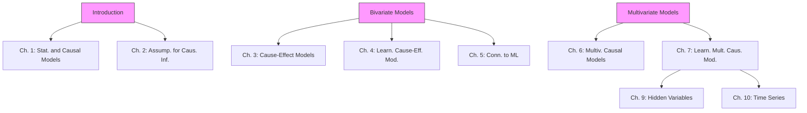

# Elements of Causal Inference

Foundations and Learning Algorithms

 Elements of Causal Inference

Foundations and Learning Algorithms

 Adaptive Computation and Machine Learning

Francis Bach, Editor

Christopher Bishop, David Heckerman, Michael Jordan, and Michael Kearns, Associate Editors

A complete list of books published in The Adaptive Computation and Machine Learning series appears at the back of this book.

 Elements of Causal Inference

Foundations and Learning Algorithms

Jonas Peters, Dominik Janzing, and Bernhard Scholkopf ¨

The MIT Press

Cambridge, Massachusetts

London, Englandc 2017 Massachusetts Institute of Technology

This work is licensed to the public under a Creative Commons Attribution- Non-Commercial-NoDerivatives 4.0 license (international):

http://creativecommons.org/licenses/by-nc-nd/4.0/

All rights reserved except as licensed pursuant to the Creative Commons license identified above. Any reproduction or other use not licensed as above, by any electronic or mechanical means (including but not limited to photocopying, public distribution, online display, and digital information storage and retrieval) requires permission in writing from the publisher.

This book was set in LaTeX by the authors.

Printed and bound in the United States of America.

Library of Congress Cataloging-in-Publication Data

Names: Peters, Jonas. | Janzing, Dominik. | Scholkopf, Bernhard. ¨

Title: Elements of causal inference : foundations and learning algorithms / Jonas Peters, Dominik Janzing, and Bernhard Scholkopf. ¨

Description: Cambridge, MA : MIT Press, 2017. | Series: Adaptive computation and machine learning series | Includes bibliographical references and index.

Identifiers: LCCN 2017020087 | ISBN 9780262037310 (hardcover : alk. paper)

Subjects: LCSH: Machine learning. | Logic, Symbolic and mathematical. | Causation. | Inference. | Computer algorithms.

Classification: LCC Q325.5 .P48 2017 | DDC 006.3/1–dc23

LC record available at https://lccn.loc.gov/2017020087To all those who enjoy the pursuit of causal insight

## Preface

Causality is a fascinating topic of research. Its mathematization has only relatively recently started, and many conceptual problems are still being debated — often with considerable intensity.

While this book summarizes the results of spending a decade assaying causality, others have studied this problem much longer than we have, and there already exist books about causality, including the comprehensive treatments of Pearl [2009], Spirtes et al. [2000], and Imbens and Rubin [2015]. We hope that our book is able to complement existing work in two ways.

First, the present book represents a bias toward a subproblem of causality that may be considered both the most fundamental and the least realistic. This is the cause-effect problem, where the system under analysis contains only two observables. We have studied this problem in some detail during the last decade. We report much of this work, and try to embed it into a larger context of what we consider fundamental for gaining a selective but profound understanding of the issues of causality. Although it might be instructive to study the bivariate case first, following the sequential chapter order, it is also possible to directly start reading the multivariate chapters; see Figure I.

And second, our treatment is motivated and influenced by the fields of machine learning and computational statistics. We are interested in how methods thereof can help with the inference of causal structures, and even more so whether causal reasoning can inform the way we should be doing machine learning. Indeed, we feel that some of the most profound open issues of machine learning are best understood if we do not take a random experiment described by a probability distribution as our starting point, but instead we consider causal structures underlying the distribution.

We try to provide a systematic introduction into the topic that is accessible to readers familiar with the basics of probability theory and statistics or machine learning (for completeness, the most important concepts are summarized in Appendices A.1 and A.2).

While we build on the graphical approach to causality as represented by the work of Pearl [2009] and Spirtes et al. [2000], our personal taste influenced the choice of topics. To keep the book accessible and focus on the conceptual issues, we were forced to devote regrettably little space to a number of significant issues in causality, be it advanced theoretical insights for particular settings or various methods of practical importance. We have tried to include references to the literature for some of the most glaring omissions, but we may have missed important topics.

Our book has a number of shortcomings. Some of them are inherited from the field, such as the tendency that theoretical results are often restricted to the case where we have infinite amounts of data. Although we do provide algorithms and methodology for the finite data case, we do not discuss statistical properties of such methods. Additionally, at some places we neglect measure theoretic issues, often by assuming the existence of densities. We find all of these questions both relevant and interesting but made these choices to keep the book short and accessible to a broad audience.

Another disclaimer is in order. Computational causality methods are still in their infancy, and in particular, learning causal structures from data is only doable in rather limited situations. We have tried to include concrete algorithms wherever possible, but we are acutely aware that many of the problems of causal inference are harder than typical machine learning problems, and we thus make no promises as to whether the algorithms will work on the reader’s problems. Please do not feel discouraged by this remark — causal learning is a fascinating topic and we hope that reading this book may convince you to start working on it.

We would have not been able to finish this book without the support of various people.

We gratefully acknowledge support for a Research in Pairs stay of the three authors at the Mathematisches Forschungsinstitut Oberwolfach, during which a substantial part of this book was written.

We thank Michel Besserve, Peter Buhlmann, Rune Christiansen, Frederick Eber- ¨ hardt, Jan Ernest, Philipp Geiger, Niels Richard Hansen, Alain Hauser, Biwei Huang, Marek Kaluba, Hansruedi Kunsch, Steffen Lauritzen, Jan Lemeire, David¨ Lopez-Paz, Marloes Maathuis, Nicolai Meinshausen, Søren Wengel Mogensen, Joris Mooij, Krikamol Muandet, Judea Pearl, Niklas Pfister, Thomas Richardson, Mateo Rojas-Carulla, Eleni Sgouritsa, Carl Johann Simon-Gabriel, Xiaohai Sun, Ilya Tolstikhin, Kun Zhang, and Jakob Zscheischler for many helpful comments and interesting discussions during the time this book was written. In particular,

hat the reader begins with Chapter 1, epicts the stronger dependences among the chapters (there exist many more less-prono

Joris and Kun were involved in much of the research that is presented here.

We thank various students at Karlsruhe Institute of Technology, Eidgenossische ¨ Technische Hochschule Zurich, and University of T ¨ ubingen for proofreading early ¨ versions of this book and for asking many inspiring questions.

Finally, we thank the anonymous reviewers and the copyediting team from Westchester Publishing Services for their helpful comments, and the staff from MIT Press, in particular Marie Lufkin Lee and Christine Bridget Savage, for providing kind support during the whole process.

København and Tubingen, August 2017 ¨

Jonas Peters

Dominik Janzing

Bernhard Scholkopf¨

## Notation and Terminology

| X,Y,Z | random variable; for noise variables, we use N, $N_X$ , $N_j$ ,... |
| --- | --- |
| x | value of a random variable X |
| P | probability measure |
| $P_X$ | probability distribution of X |
| $X^1, \ldots, X^n \stackrel{\text{iid}}{\sim} P_X$ | an i.i.d. sample of size n; sample index is usually i |
| $P_{Y\|X=x}$ | conditional distribution of Y given X = x |
| $P_{Y\|X}$ | collection of $P_{Y\|X=x}$ for all x; for short: conditional of Y given X |
| p | density (either probability mass function or probability density function) |
| $p_X$ | density of $P_X$ |
| $p(x)$ | density of $P_X$ evaluated at the point x |
| $p(y\|x)$ | (conditional) density of $P_{Y\|X=x}$ evaluated at y |
| $\mathbb{E}[X]$ | expectation of X |
| var[X] | variance of X |
| cov[X,Y] | covariance of X,Y |
| X ⊥ Y | independence between random variables X and Y |
| X ⊥ Y \| Z | conditional independence |
| $\mathbf{X} = (X_1, \ldots, X_d)$ | random vector of length d; dimension index is usually j |
| $\mathfrak{C}$ | structural causal model |
| $P_Y^{\mathfrak{C};do(X:=3)}$ | intervention distribution |
| $P_Y^{\mathfrak{C}\|Z=2,X=1;do(X:=3)}$ | counterfactual distribution |
| $\mathcal{G}$ | graph |
| $\mathbf{PA}_X^{\mathcal{G}}, \mathbf{DE}_X^{\mathcal{G}}, \mathbf{AN}_X^{\mathcal{G}}$ | parents, descendants, and ancestors of node X in graph G |
