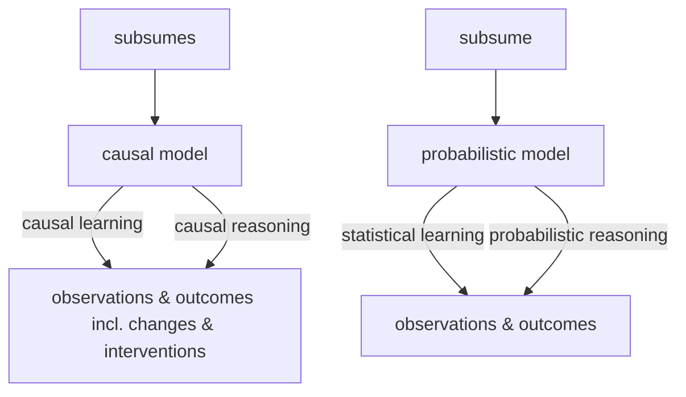
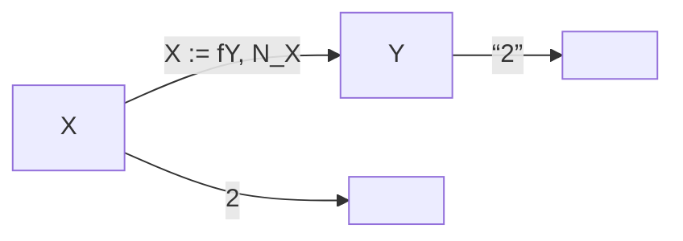
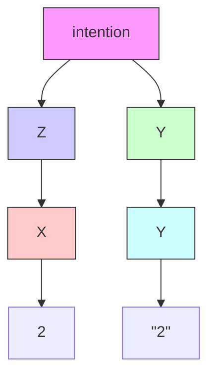

# Statistical and Causal Models

Using statistical learning, we try to infer properties of the dependence among random variables from observational data. For instance, based on a joint sample of observations of two random variables, we might build a predictor that, given new values of only one of them, will provide a good estimate of the other one. The theory underlying such predictions is well developed, and — although it applies to simple settings — already provides profound insights into learning from data. For two reasons, we will describe some of these insights in the present chapter. First, this will help us appreciate how much harder the problems of causal inference are, where the underlying model is no longer a fixed joint distribution of random variables, but a structure that implies multiple such distributions. Second, although finite sample results for causal estimation are scarce, it is important to keep in mind that the basic statistical estimation problems do not go away when moving to the more complex causal setting, even if they seem small compared to the causal problems that do not appear in purely statistical learning. Building on the preceding groundwork, the chapter also provides a gentle introduction to the basic notions of causality, using two examples, one of which is well known from machine learning.

## 1.1 Probability Theory and Statistics

Probability theory and statistics are based on the model of a random experiment or probability space $( \Omega , { \mathcal { F } } , P )$ . Here, $\Omega$ is a set (containing all possible outcomes), $\mathcal { F }$ is a collection of events $A \subseteq \Omega$ , and $P$ is a measure assigning a probability to each event. Probability theory allows us to reason about the outcomes of random experiments, given the preceding mathematical structure. Statistical learning, on the other hand, essentially deals with the inverse problem: We are given the outcomes of experiments, and from this we want to infer properties of the underlying mathematical structure. For instance, suppose that we have observed data

$$
(x _ {1}, y _ {1}), \dots , (x _ {n}, y _ {n}), \tag {1.1}
$$

where $x _ { i } \in { \mathcal { X } }$ are inputs (sometimes called covariates or cases) and $y _ { i } \in \mathcal { V }$ are outputs (sometimes called targets or labels). We may now assume that each $( x _ { i } , y _ { i } ) , i = 1 , \ldots , n $ , has been generated independently by the same unknown random experiment. More precisely, such a model assumes that the observations $( x _ { 1 } , y _ { 1 } ) , \ldots , ( x _ { n } , y _ { n } )$ are realizations of random variables $( X _ { 1 } , Y _ { 1 } ) , \ldots , ( X _ { n } , Y _ { n } )$ that are i.i.d. (independent and identically distributed) with joint distribution $P _ { X , Y }$ . Here, X and Y are random variables taking values in metric spaces $\mathcal { X }$ and $\mathcal { V } . ^ { 1 } \ \mathrm { A l - }$ most all of statistics and machine learning builds on i.i.d. data. In practice, the i.i.d. assumption can be violated in various ways, for instance if distributions shift or interventions in a system occur. As we shall see later, some of these are intricately linked to causality.

We may now be interested in certain properties of $P _ { X , Y }$ , such as:

(i) the expectation of the output given the input, $f ( x ) = \mathbb { E } [ Y | X = x ]$ , called regression, where often $\mathcal { V } = \mathbb { R }$ ,  
(ii) a binary classifier assigning each x to the class that is more likely, $f ( x ) =$ $\operatorname { a r g m a x } _ { y \in \mathcal { V } } P ( Y = y | X = x )$ , where $\mathcal { V } = \left\{ \pm 1 \right\}$ ,  
(iii) the density $p _ { X , Y }$ of $P _ { X , Y }$ (assuming it exists).

In practice, we seek to estimate these properties from finite data sets, that is, based on the sample (1.1), or equivalently an empirical distribution $P _ { X , Y } ^ { n }$ that puts a point mass of equal weight on each observation.

This constitutes an inverse problem: We want to estimate a property of an object we cannot observe (the underlying distribution), based on observations that are obtained by applying an operation (in the present case: sampling from the unknown distribution) to the underlying object.

## 1.2 Learning Theory

Now suppose that just like we can obtain f from $P _ { X , Y }$ , we use the empirical distribution to infer empirical estimates $f ^ { n }$ . This turns out to be an ill-posed problem [e.g., Vapnik, 1998], since for any values of x that we have not seen in the sample $( x _ { 1 } , y _ { 1 } ) , \ldots , ( x _ { n } , y _ { n } )$ , the conditional expectation is undefined. We may, however, define the function f on the observed sample and extend it according to any fixed rule (e.g., setting f to +1 outside the sample or by choosing a continuous piecewise linear $f )$ . But for any such choice, small changes in the input, that is, in the empirical distribution, can lead to large changes in the output. No matter how many observations we have, the empirical distribution will usually not perfectly approximate the true distribution, and small errors in this approximation can then lead to large errors in the estimates. This implies that without additional assumptions about the class of functions from which we choose our empirical estimates $f ^ { n }$ , we cannot guarantee that the estimates will approximate the optimal quantities f in a suitable sense. In statistical learning theory, these assumptions are formalized in terms of capacity measures. If we work with a function class that is so rich that it can fit most conceivable data sets, then it is not surprising if we can fit the data at hand. If, however, the function class is a priori restricted to have small capacity, then there are only a few data sets (out of the space of all possible data sets) that we can explain using a function from that class. If it turns out that nevertheless we can explain the data at hand, then we have reason to believe that we have found a regularity underlying the data. In that case, we can give probabilistic guarantees for the solution’s accuracy on future data sampled from the same distribution $P _ { X , Y }$ .

Another way to think of this is that our function class has incorporated a priori knowledge (such as smoothness of functions) consistent with the regularity underlying the observed data. Such knowledge can be incorporated in various ways, and different approaches to machine learning differ in how they handle the issue. In Bayesian approaches, we specify prior distributions over function classes and noise models. In regularization theory, we construct suitable regularizers and incorporate them into optimization problems to bias our solutions.

The complexity of statistical learning arises primarily from the fact that we are trying to solve an inverse problem based on empirical data — if we were given the full probabilistic model, then all these problems go away. When we discuss causal models, we will see that in a sense, the causal learning problem is harder in that it is ill-posed on two levels. In addition to the statistical ill-posed-ness, which is essentially because a finite sample of arbitrary size will never contain all information about the underlying distribution, there is an ill-posed-ness due to the fact that even complete knowledge of an observational distribution usually does not determine the underlying causal model.

Let us look at the statistical learning problem in more detail, focusing on the case of binary pattern recognition or classification [e.g., Vapnik, 1998], where $\mathcal { V } = \{ \pm 1 \}$ . We seek to learn $f : \mathcal { X }  \mathcal { V }$ based on observations (1.1), generated i.i.d. from an unknown $P _ { X , Y }$ . Our goal is to minimize the expected error or $\mathbf { r i s k } ^ { 2 }$

$$
R [ f ] = \int \frac {1}{2} | f (x) - y | d P _ {X, Y} (x, y) \tag {1.2}
$$

over some class of functions ${ \mathcal F } .$ Note that this is an integral with respect to the measure $P _ { X , Y }$ ; however, if $P _ { X , Y }$ allows for a density $p ( x , y )$ with respect to Lebesgue measure, the integral reduces to $\begin{array} { r } { \int { \frac { 1 } { 2 } } | f ( x ) - y | p ( x , y ) d x d y } \end{array}$ .

Since $P _ { X , Y }$ is unknown, we cannot compute (1.2), let alone minimize it. Instead, we appeal to an induction principle, such as empirical risk minimization. We return the function minimizing the training error or empirical risk

$$
R _ {\mathrm{emp}} ^ {n} [ f ] = \frac {1}{n} \sum_ {i = 1} ^ {n} \frac {1}{2} | f (x _ {i}) - y _ {i} | \tag {1.3}
$$

over $f \in { \mathcal { F } }$ . From the asymptotic point of view, it is important to ask whether such a procedure is consistent, which essentially means that it produces a sequence of functions whose risk converges towards the minimal possible within the given function class $\mathcal { F }$ (in probability) as n tends to infinity. In Appendix A.3, we show that this can only be the case if the function class is “small.” The Vapnik-Chervonenkis (VC) dimension [Vapnik, 1998] is one possibility of measuring the capacity or size of a function class. It also allows us to derive finite sample guarantees, stating that with high probability, the risk (1.2) is not larger than the empirical risk plus a term that grows with the size of the function class $\mathcal { F }$ .

Such a theory does not contradict the existing results on universal consistency, which refers to convergence of a learning algorithm to the lowest achievable risk with any function. There are learning algorithms that are universally consistent, for instance nearest neighbor classifiers and Support Vector Machines [Devroye et al., 1996, Vapnik, 1998, Scholkopf and Smola, 2002, Steinwart and Christmann, ¨ 2008]. While universal consistency essentially tells us everything can be learned in the limit of infinite data, it does not imply that every problem is learnable well from finite data, due to the phenomenon of slow rates. For any learning algorithm, there exist problems for which the learning rates are arbitrarily slow [Devroye et al., 1996]. It does tell us, however, that if we fix the distribution, and gather enough data, then we can get arbitrarily close to the lowest risk eventually.

In practice, recent successes of machine learning systems seem to suggest that we are indeed sometimes already in this asymptotic regime, often with spectacular results. A lot of thought has gone into designing the most data-efficient methods to obtain the best possible results from a given data set, and a lot of effort goes into building large data sets that enable us to train these methods. However, in all these settings, it is crucial that the underlying distribution does not differ between training and testing, be it by interventions or other changes. As we shall argue in this book, describing the underlying regularity as a probability distribution, without additional structure, does not provide us with the right means to describe what might change.

## 1.3 Causal Modeling and Learning

Causal modeling starts from another, arguably more fundamental, structure. A causal structure entails a probability model, but it contains additional information not contained in the latter (see the examples in Section 1.4). Causal reasoning, according to the terminology used in this book, denotes the process of drawing conclusions from a causal model, similar to the way probability theory allows us to reason about the outcomes of random experiments. However, since causal models contain more information than probabilistic ones do, causal reasoning is more powerful than probabilistic reasoning, because causal reasoning allows us to analyze the effect of interventions or distribution changes.

Just like statistical learning denotes the inverse problem to probability theory, we can think about how to infer causal structures from its empirical implications. The empirical implications can be purely observational, but they can also include data under interventions (e.g., randomized trials) or distribution changes. Researchers use various terms to refer to these problems, including structure learning and causal discovery. We refer to the closely related question of which parts of the causal structure can in principle be inferred from the joint distribution as structure identifiability. Unlike the standard problems of statistical learning described in Section 1.2, even full knowledge of P does not make the solution trivial, and we need additional assumptions (see Chapters 2, 4, and 7). This difficulty should not distract us from the fact, however, that the ill-posed-ness of the usual statistical problems is still there (and thus it is important to worry about the capacity of function classes also in causality, such as by using additive noise models — see Section 4.1.4 below), only confounded by an additional difficulty arising from the fact that we are trying to estimate a richer structure than just a probabilistic one. We will refer to this overall problem as causal learning. Figure 1.1 summarizes the relationships between the preceding problems and models.

Figure 1.1: Terminology used by the present book for various probabilistic inference problems (bottom) and causal inference problems (top); see Section 1.3. Note that we use the term “inference” to include both learning and reasoning.

To learn causal structures from observational distributions, we need to understand how causal models and statistical models relate to each other. We will come back to this issue in Chapters 4 and 7 but provide an example now. A well-known topos holds that correlation does not imply causation; in other words, statistical properties alone do not determine causal structures. It is less well known that one may postulate that while we cannot infer a concrete causal structure, we may at least infer the existence of causal links from statistical dependences. This was first understood by Reichenbach [1956]; we now formulate his insight (see also Figure 1.2).3

Figure 1.2: Reichenbach’s common cause principle establishes a link between statistical properties and causal structures. A statistical dependence between two observables X and Y indicates that they are caused by a variable Z, often referred to as a confounder (left). Here, Z may coincide with either X or Y , in which case the figure simplifies (middle/right). The principle further argues that X and Y are statistically independent, conditional on Z. In this figure, direct causation is indicated by arrows; see Chapters 3 and 6.

Principle 1.1 (Reichenbach’s common cause principle) If two random variables X and Y are statistically dependent (X 6⊥⊥ Y ), then there exists a third variable Z that causally influences both. (As a special case, Z may coincide with either X or Y .) Furthermore, this variable Z screens X and Y from each other in the sense that given Z, they become independent, X ⊥⊥ Y | Z.

In practice, dependences may also arise for a reason different from the ones mentioned in the common cause principle, for instance: (1) The random variables we observe are conditioned on others (often implicitly by a selection bias). We shall return to this issue; see Remark 6.29. (2) The random variables only appear to be dependent. For example, they may be the result of a search procedure over a large number of pairs of random variables that was run without a multiple testing correction. In this case, inferring a dependence between the variables does not satisfy the desired type I error control; see Appendix A.2. (3) Similarly, both random variables may inherit a time dependence and follow a simple physical law, such as exponential growth. The variables then look as if they depend on each other, but because the i.i.d. assumption is violated, there is no justification of applying a standard independence test. In particular, arguments (2) and (3) should be kept in mind when reporting “spurious correlations” between random variables, as it is done on many popular websites.

## 1.4 Two Examples

### 1.4.1 Pattern Recognition

As the first example, we consider optical character recognition, a well-studied problem in machine learning. This is not a run-of-the-mill example of a causal structure, but it may be instructive for readers familiar with machine learning. We describe two causal models giving rise to a dependence between two random variables, which we will assume to be handwritten digits X and class labels Y . The two models will lead to the same statistical structure, using distinct underlying causal structures.

Model (i) assumes we generate each pair of observations by providing a sequence of class labels y to a human writer, with the instruction to always produce a corresponding handwritten digit image x. We assume that the writer tries to do a good job, but there may be noise in perceiving the class label and executing the motor program to draw the image. We can model this process by writing the image X as a function (or mechanism) f of the class label Y (modeled as a random variable) and some independent noise $N _ { X }$ (see Figure 1.3, left). We can then compute $P _ { X , Y }$ from $P _ { Y } , P _ { N _ { X } }$ , and $f .$ This is referred to as the observational distribution, where the word “observational” refers to the fact that we are passively observing the system without intervening. X and Y will be dependent random variables, and we will be able to learn the mapping from x to y from observations and predict the correct label y from an image x better than chance.

There are two possible interventions in this causal structure, which lead to intervention distributions.4 If we intervene on the resulting image X (by manipulating it, or exchanging it for another image after it has been produced), then this has no effect on the class labels that were provided to the writer and recorded in the data set. Formally, changing X has no effect on Y since $Y : = N _ { Y }$ . Intervening on Y , on the other hand, amounts to changing the class labels provided to the writer. This will obviously have a strong effect on the produced images. Formally, changing Y has an effect on X since $X : = f ( Y , N _ { X } )$ . This directionality is visible in the arrow in the figure, and we think of this arrow as representing direct causation.

In alternative model (ii), we assume that we do not provide class labels to the writer. Rather, the writer is asked to decide himself or herself which digits to write, and to record the class labels alongside. In this case, both the image X and the recorded class label Y are functions of the writer’s intention (call it Z and think of it as a random variable). For generality, we assume that not only the process generating the image is noisy but also the one recording the class label, again with independent noise terms (see Figure 1.3, right). Note that if the functions and noise terms are chosen suitably, we can ensure that this model entails an observational distribution $P _ { X , Y }$ that is identical to the one entailed by model (i).5

Model (i); $Y , N _ { X }$ independent

Model (ii); $Z , M _ { X } , M _ { Y }$ independent  
Figure 1.3: Two structural causal models of handwritten digit data sets. In the left model (i), a human is provided with class labels Y and produces images X. In the right model (ii), the human decides which class to write (Z) and produces both images and class labels. For suitable functions $f , g , h$ and noise variables $N _ { X } , M _ { X } , M _ { Y } , Z ,$ , the two models produce the same observable distribution $P _ { X , Y }$ , yet they are interventionally different; see Section 1.4.1.

Let us now discuss possible interventions in model (ii). If we intervene on the image X, then things are as we just discussed and the class label Y is not affected. However, if we intervene on the class label Y (i.e., we change what the writer has recorded as the class label), then unlike before this will not affect the image.

In summary, without restricting the class of involved functions and distributions, the causal models described in (i) and (ii) induce the same observational distribution over X and Y , but different intervention distributions. This difference is not visible in a purely probabilistic description (where everything derives from $P _ { X , Y } )$ . However, we were able to discuss it by incorporating structural knowledge about how $P _ { X , Y }$ comes about, in particular graph structure, functions, and noise terms.

Models (i) and (ii) are examples of structural causal models (SCMs), sometimes referred to as structural equation models [e.g., Aldrich, 1989, Hoover, 2008, Pearl, 2009, Pearl et al., 2016]. In an SCM, all dependences are generated by functions that compute variables from other variables. Crucially, these functions are to be read as assignments, that is, as functions as in computer science rather than as mathematical equations. We usually think of them as modeling physical mechanisms. An SCM entails a joint distribution over all observables. We have seen that the same distribution can be generated by different SCMs, and thus information about the effect of interventions (and, as we shall see in Section 6.4, information about counterfactuals) may be lost when we make the transition from an SCM to the corresponding probability model. In this book, we take SCMs as our starting point and try to develop everything from there.

We conclude with two points connected to our example:

First, Figure 1.3 nicely illustrates Reichenbach’s common cause principle. The dependence between X and Y admits several causal explanations, and X and Y become independent if we condition on Z in the right-hand figure: The image and the label share no information that is not contained in the intention.

Second, it is sometimes said that causality can only be discussed when taking into account the notion of time. Indeed, time does play a role in the preceding example, for instance by ruling out that an intervention on X will affect the class label. However, this is perfectly fine, and indeed it is quite common that a statistical data set is generated by a process taking place in time. For instance, in model (i), the underlying reason for the statistical dependence between X and Y is a dynamical process. The writer reads the label and plans a movement, entailing complicated processes in the brain, and finally executes the movement using muscles and a pen. This process is only partly understood, but it is a physical, dynamical process taking place in time whose end result leads to a non-trivial joint distribution of X and Y . When we perform statistical learning, we only care about the end result. Thus, not only causal structures, but also purely probabilistic structures may arise through processes taking place in time — indeed, one could hold that this is ultimately the only way they can come about. However, in both cases, it is often instructive to disregard time. In statistics, time is often not necessary to discuss concepts such as statistical dependence. In causal models, time is often not necessary to discuss the effect of interventions. But both levels of description can be thought of as abstractions of an underlying more accurate physical model that describes reality more fully than either; see Table 1.1. Moreover, note that variables in a model may not necessarily refer to well-defined time instances. If, for instance, a psychologist investigates the statistical or causal relation between the motivation and the performance of students, both variables cannot easily be assigned to specific time instances. Measurements that refer to well-defined time instances are rather typical for “hard” sciences like physics and chemistry.

### 1.4.2 Gene Perturbation

We have seen in Section 1.4.1 that different causal structures lead to different intervention distributions. Sometimes, we are indeed interested in predicting the outcome of a random variable under such an intervention. Consider the following, in some ways oversimplified, example from genetics. Assume that we are given activity data from gene A and, correspondingly, measurements of a phenotype; see

**Table 1.1: A simple taxonomy of models. The most detailed model (top) is a mechanistic or physical one, usually involving sets of differential equations. At the other end of the spectrum (bottom), we have a purely statistical model; this model can be learned from data, but it often provides little insight beyond modeling associations between epiphenomena. Causal models can be seen as descriptions that lie in between, abstracting away from physical realism while retaining the power to answer certain interventional or counterfactual questions. See Mooij et al. [2013] for a discussion of the link between physical models and structural causal models, and Section 6.3 for a discussion of interventions.**

| Model | Predict in i.i.d. setting | Predict under changing distr. or intervention | Answer counterfactual questions | Obtain physical insight | Learn from data |
| --- | --- | --- | --- | --- | --- |
| Mechanistic/physical, e.g., Sec. 2.3 | yes | yes | yes | yes | ? |
| Structural causal model, e.g., Sec. 6.2 | yes | yes | yes | ? | ? |
| Causal graphi-cal model, e.g., Sec. 6.5.2 | yes | yes | no | ? | ? |
| Statistical model, e.g., Sec. 1.2 | yes | no | no | no | yes |

Figure 1.4 (top left) for a toy data set. Clearly, both variables are strongly correlated. This correlation can be exploited for classical prediction: If we observe that the activity of gene A lies around 6, we expect the phenotype to lie between 12 and 16 with high probability. Similarly, for a gene B (bottom left). On the other hand, we may also be interested in predicting the phenotype after deleting gene A, that is, after setting its activity to 0.6 Without any knowledge of the causal structure, however, it is impossible to provide a non-trivial answer. If gene A has a causal influence on the phenotype, we expect to see a drastic change after the intervention (see top right). In fact, we may still be able to use the same linear model that we have learned from the observational data. If, alternatively, there is a common cause, possibly a third gene C, influencing both the activity of gene B and the phenotype, the intervention on gene B will have no effect on the phenotype (see bottom right).

As in the pattern recognition example, the models are again chosen such that the joint distribution over gene A and the phenotype equals the joint distribution over gene B and the phenotype. Therefore, there is no way of telling between the top and bottom situation from just observational data, even if sample size goes to infinity. Summarizing, if we are not willing to employ concepts from causality, we have to answer “I do not know” to the question of predicting a phenotype after deletion of a gene.

# 2