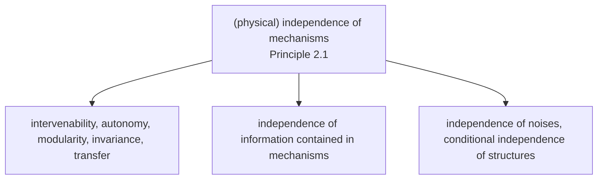
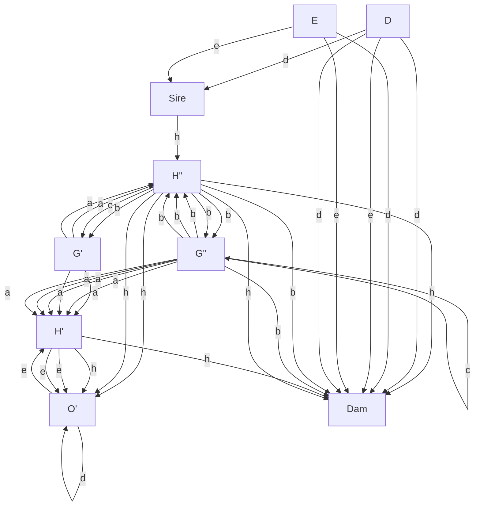

# Assumptions for Causal Inference

Now that we have encountered the basic components of SCMs, it is a good time to pause and consider some of the assumptions we have seen, as well as what these assumptions imply for the purpose of causal reasoning and learning.

A crucial notion in our discussion will be a form of independence, and we can informally introduce it using an optical illusion known as the Beuchet chair. When we see an object such as the one on the left of Figure 2.1, our brain makes the assumption that the object and the mechanism by which the information contained in its light reaches our brain are independent. We can violate this assumption by looking at the object from a very specific viewpoint. If we do that, perception goes wrong: We perceive the three-dimensional structure of a chair, which in reality is not there. Most of the time, however, the independence assumption does hold. If we look at an object, our brain assumes that the object is independent from our vantage point and the illumination. So there should be no unlikely coincidences, no separate 3D structures lining up in two dimensions, or shadow boundaries coinciding with texture boundaries. This is called the generic viewpoint assumption in vision [Freeman, 1994].

The independence assumption is more general than this, though. We will see in Section 2.1 below that the causal generative process is composed of autonomous modules that do not inform or influence each other. As we shall describe below, this means that while one module’s output may influence another module’s input, the modules themselves are independent of each other.

In the preceding example, while the overall percept is a function of object, lighting, and viewpoint, the object and the lighting are not affected by us moving about — in other words, some components of the overall causal generative model remain invariant, and we can infer three-dimensional information from this invariance.

Two identical metallic chair models on a textured floor, displayed side by side (no text or symbols visible)

Figure 2.1: The left panel shows a generic view of the (separate) parts comprising a Beuchet chair. The right panel shows the illusory percept of a chair if the parts are viewed from a single, very special vantage point. From this accidental viewpoint, we perceive a chair. (Image courtesy of Markus Elsholz.)

This is the basic idea of structure from motion [Ullman, 1979], which plays a central role in both biological vision and computer vision.

### 2.1 The Principle of Independent Mechanisms

We now describe a simple cause-effect problem and point out several observations. Subsequently, we shall try to provide a unified view of how these observation relate to each other, arguing that they derive from a common independence principle.

Suppose we have estimated the joint density $p ( \boldsymbol { a } , t )$ of the altitude A and the average annual temperature T of a sample of cities in some country (see Figure 4.6 on page 65). Consider the following ways of expressing $p ( { a } , t )$ :

$$
\begin{array}{l} p (a, t) = p (a | t) p (t) \\ = p (t | a) p (a) \tag {2.1} \\ \end{array}
$$

The first decomposition describes T and the conditional $A | T .$ . It corresponds to a factorization of $p ( \boldsymbol { a } , t )$ according to the graph $T  A . ^ { 1 }$ The second decomposition corresponds to a factorization according to $A  T$ (cf. Definition 6.21). Can we decide which of the two structures is the causal one $( \mathrm { i . e . }$ , in which case would we be able to think of the arrow as causal)?

A first idea (see Figure 2.2, left) is to consider the effect of interventions. Imagine we could change the altitude A of a city by some hypothetical mechanism that raises the grounds on which the city is built. Suppose that we find that the average temperature decreases. Let us next imagine that we devise another intervention experiment. This time, we do not change the altitude, but instead we build a massive heating system around the city that raises the average temperature by a few degrees. Suppose we find that the altitude of the city is unaffected. Intervening on A has changed T , but intervening on $T$ has not changed A. We would thus reasonably prefer $A  T$ as a description of the causal structure.

Why do we find this description of the effect of interventions plausible, even though the hypothetical intervention is hard or impossible to carry out in practice?

If we change the altitude A, then we assume that the physical mechanism $p ( t | a )$ responsible for producing an average temperature (e.g., the chemical composition of the atmosphere, the physics of how pressure decreases with altitude, the meteorological mechanisms of winds) is still in place and leads to a changed $T$ . This would hold true independent of the distribution from which we have sampled the cities, and thus independent of $p ( a )$ . Austrians may have founded their cities in locations subtly different from those of the Swiss, but the mechanism $p ( t | a )$ would apply in both cases.2

If, on the other hand, we change T , then we have a hard time thinking of $p ( a | t )$ as a mechanism that is still in place — we probably do not believe that such a mechanism exists in the first place. Given a set of different city distributions $p ( \boldsymbol { a } , t )$ , while we could write them all as $p ( a | t ) p ( t )$ , we would find that it is impossible to explain them all using an invariant $p ( a | t )$ .

Our intuition can be rephrased and postulated in two ways: $\operatorname { I f } A \to T$ is the correct causal structure, then

(i) it is in principle possible to perform a localized intervention on $A ,$ , in other words, to change $p ( a )$ without changing $p ( t | a )$ , and

(ii) $p ( a )$ and $p ( t | a )$ are autonomous, modular, or invariant mechanisms or objects in the world.

Interestingly, while we started off with a hypothetical intervention experiment to arrive at the causal structure, our reasoning ends up suggesting that actual interventions may not be the only way to arrive at causal structures. We may also be able to identify the causal structure by checking, for data sources $p ( { a } , t )$ , which of the two decompositions (2.1) leads to autonomous or invariant terms. Sticking with the preceding example, let us denote the joint distributions of altitude and temperature in Austria and Switzerland by $p ^ { \ddot { 0 } } ( \dot { a } , t )$ and $p ^ { \mathrm { S } } ( a , t )$ , respectively. These may be distinct since Austrians and Swiss founded their cities in different places (i.e., $p ^ { \ddot { 0 } } ( a )$ and $p ^ { \mathrm { { S } } } ( a )$ are distinct). The causal factorizations, however, may still use the same conditional, i.e. $p ^ { \ddot { 0 } } ( a , t ) = p ( t | a ) p ^ { \ddot { 0 } } ( a )$ and $p ^ { \mathrm { S } } ( a , t ) = p ( t | a ) p ^ { \mathrm { S } } ( a )$ .

We next describe an idea (see Figure 2.2, middle), closely related to the previous example, but different in that it also applies for individual distributions. In the causal factorization $p ( a , t ) = p ( t | a ) ~ p ( a )$ , we would expect that the conditional density $p ( t | a )$ (viewed as a function of t and $a )$ provides no information about the marginal density function $p ( a )$ . This holds true if $p ( t | a )$ is a model of a physical mechanism that does not care about what distribution $p ( a )$ we feed into it. In other words, the mechanism is not influenced by the ensemble of cities to which we apply it.

If, on the other hand, we write $p ( a , t ) = p ( a | t ) p ( t )$ , then the preceding independence of cause and mechanism does not apply. Instead, we will notice that to connect the observed $p ( t )$ and $p ( { a } , t )$ , the mechanism $p ( a | t )$ would need to take a rather peculiar shape constrained by the equation $p ( a , t ) = p ( a | t ) p ( t )$ . This could be empirically checked, given an ensemble of cities and temperatures.3

We have already seen several ideas connected to independence, autonomy, and invariance, all of which can inform causal inference. We now turn to a final one (see Figure 2.2, right), related to the independence of noise terms and thus best explained when rewriting (2.1) as a distribution entailed by an SCM with graph $A  T$ , realizing the effect T as a noisy function of the cause $A$ ,

$$
A := N _ {A},
$$

$$
T := f _ {T} (A, N _ {T}),
$$

where $N _ { T }$ and $N _ { A }$ are statistically independent noises $N _ { T }$ ⊥⊥ $N _ { A }$ . Making suitable restrictions on the functional form of $f _ { T }$ (see Sections 4.1.3–4.1.6 and 7.1.2) allows us to identify which of two causal structures $( A \to T$ or $T  A )$ has entailed the observed $p ( { a } , t )$ (without such restrictions though, we can always realize both decompositions (2.1)). Furthermore, in the multivariate setting and under suitable conditions, the assumption of jointly independent noises allows the identification of causal structures by conditional independence testing (see Section 7.1.1).

Figure 2.2: The principle of independent mechanisms and its implications for causal inference (Principle 2.1).

We like to view all these observations as closely connected instantiations of a general principle of (physically) independent mechanisms.

Principle 2.1 (Independent mechanisms) The causal generative process of a system’s variables is composed of autonomous modules that do not inform or influence each other.

In the probabilistic case, this means that the conditional distribution of each variable given its causes (i.e., its mechanism) does not inform or influence the other conditional distributions. In case we have only two variables, this reduces to an independence between the cause distribution and the mechanism producing the effect distribution.

The principle is plausible if we conceive our system as being composed of modules comprising (sets of) variables such that the modules represent physically independent mechanisms of the world. The special case of two variables has been referred to as independence of cause and mechanism (ICM) [Daniusis et al., 2010, ˇ Shajarisales et al., 2015]. It is obtained by thinking of the input as the result of a preparation that is done by a mechanism that is independent of the mechanism that turns the input into the output.

Before we discuss the principle in depth, we should state that not all systems will satisfy it. For instance, if the mechanisms that an overall system is composed of have been tuned to each other by design or evolution, this independence may be violated.

We will presently argue that the principle is sufficiently broad to cover the main aspects of causal reasoning and causal learning (see Figure 2.2). Let us address three aspects, corresponding, from left to right, to the three branches of the tree in Figure 2.2.

1. One way to think of these modules is as physical machines that incorporate an input-output behavior. This assumption implies that we can change one mechanism without affecting the others — or, in causal terminology, we can intervene on one mechanism without affecting the others. Changing a mechanism will change its input-output behavior, and thus the inputs other mechanisms downstream might receive, but we are assuming that the physical mechanisms themselves are unaffected by this change. An assumption such as this one is often implicit to justify the possibility of interventions in the first place, but one can also view it as a more general basis for causal reasoning and causal learning. If a system allows such localized interventions, there is no physical pathway that would connect the mechanisms to each other in a directed way by “meta-mechanisms.” The latter makes it plausible that we can also expect a tendency for mechanisms to remain invariant with respect to changes within the system under consideration and possibly also to some changes stemming from outside the system (see Section 7.1.6). This kind of autonomy of mechanisms can be expected to help with transfer of knowledge learned in one domain to a related one where some of the modules coincide with the source domain (see Sections 5.2 and 8.3).

2. While the discussion of the first aspect focused on the physical aspect of independence and its ramifications, there is also an information theoretic aspect that is implied by the above. A time evolution involving several coupled objects and mechanisms can generate statistical dependence. This is related to our discussion from page 10, where we considered the dependence between the class label and the image of a handwritten digit. Similarly, mechanisms that are physically coupled will tend to generate information that can be quantified in terms of statistical or algorithmic information measures (see Sections 4.1.9 and 6.10 below).

Here, it is important to distinguish between two levels of information: obviously, an effect contains information about its cause, but — according to the independence principle — the mechanism that generates the effect from its cause contains no information about the mechanism generating the cause. For a causal structure with more than two nodes, the independence principle states that the mechanism generating every node from its direct causes contain no information about each other.43. Finally, we should discuss how the assumption of independent noise terms, commonly made in structural equation modeling, is connected to the principle of independent mechanism. This connection is less obvious. To this end, consider a variable $E : = f ( C , N )$ where the noise N is discrete. For each value s taken by N, the assignment $E : = f ( C , N )$ reduces to a deterministic mechanism $E : = f ^ { s } ( C )$ that turns an input C into an output E. Effectively, this means that the noise randomly chooses between a number of mechanisms $f ^ { s }$ (where the number equals the cardinality of the range of the noise variable N). Now suppose the noise variables for two mechanisms at the vertices $X _ { j }$ and $X _ { k }$ were statistically dependent.5 Such a dependence could ensure, for instance, that whenever one mechanism $f _ { j } ^ { s }$ is active at node $j ,$ we know which mechanism $f _ { k } ^ { t }$ is active at node k. This would violate our principle of independent mechanisms.

The preceding paragraph uses the somewhat extreme view of noise variables as selectors between mechanisms (see also Section 3.4). In practice, the role of the noise might be less pronounced. For instance, if the noise is additive $( { \mathrm { i . e . , } } E : = f ( C ) + N )$ , then its influence on the mechanism is restricted. In this case, it can only shift the output of the mechanism up or down, so it selects between a set of mechanisms that are very similar to each other. This is consistent with a view of the noise variables as variables outside the system that we are trying to describe, representing the fact that a system can never be totally isolated from its environment. In such a view, one would think that a weak dependence of noises may be possible without invalidating the principle of independent mechanisms.

All of the above-mentioned aspects of Principle 2.1 may help for the problem of causal learning, in other words, they may provide information about causal structures. It is conceivable, however, that this information may in cases be conflicting, depending on which assumptions hold true in any given situation.

FIG.5.

### 2.2 Historical Notes

The idea of autonomy and invariance is deeply engrained in the concept of structural equation models (SEMs) or SCMs. We prefer the latter term, since the term SEM has been used in a number of contexts where the structural assignments are used as algebraic equations rather than assignments. The literature is wide ranging, with overviews provided by Aldrich [1989], Hoover [2008], and Pearl [2009].

An intellectual antecedent to SEMs is the concept of a path model pioneered by Wright [1918, 1920, 1921] (see Figure 2.3). Although Wright was a biologist, SEMs are nowadays most strongly associated with econometrics. Following Hoover [2008], pioneering work on structural econometric models was done in the1930s by Jan Tinbergen, and the conceptual foundations of probabilistic econometrics were laid in Trgyve Haavelmo’s work [Haavelmo, 1944]. Early economists were trying to conceptualize the fact that unlike correlation, regression has a natural direction. The regression of Y on X leads to a solution that usually is not the inverse of the regression of X on Y .6 But how would the data then tell us in which direction we should perform the regression? This is a problem of observational equivalence, and it is closely related to a problem econometricians call identification.

A number of early works saw a connection between what made a set of equations or relations structural [Frisch and Waugh, 1933], and properties of invariance and autonomy — according to Aldrich [1989], indeed the central notion in the pioneering work of Frisch et al. [1948]. Here, a structural relation was aiming for more than merely modeling an observed distribution of data — it was trying to capture an underlying structure connecting the variables of the model.

At the time, the Cowles Commission was a major economic research institute, instrumental in creating the field of econometrics. Its work related causality to the invariance properties of the structural econometric model [Hoover, 2008]. Pearl [2009] credits Marschak’s opening chapter of a 1950 Cowles monograph with the idea that structural equations remain invariant to certain changes in the system [Marschak, 1950]. A crucial distinction emphasized by the Cowles work was the one between endogenous and exogenous variables. Endogeneous variables are those that the modeler tries to understand, while exogenous ones are determined by factors outside the model, and are taken as given. Koopmans [1950] assayed two principles for determining what should be treated as exogeneous. The departmental principle considers variables outside of the scope of the discipline as exogeneous (e.g., weather is exogeneous to economics). The (preferred) causal principle calls those variables exogenous that influence the remaining (endogeneous) variables, but are (almost) not influenced thereby.

Haavelmo [1943] interpreted structural equations as statements about hypothetical controlled experiments. He considered cyclic stochastic equation models and discussed the role of invariance as well as policy interventions. Pearl [2015] gives an appraisal of Haavelmo’s role in the study of policy intervention questions and the development of the field of causal inference. In an account of causality in economics and econometrics, Hoover [2008] discusses a system of the form

$$
X ^ {i} := N _ {X} ^ {i}
$$

$$
Y ^ {i} := \theta X ^ {i} + N _ {Y} ^ {i},
$$

where the errors $N _ { X } ^ { i } , N _ { Y } ^ { i }$ are i.i.d., and $\theta$ is a parameter. He attributes to Simon [1953] the view (which does not require any temporal order) that $X ^ { i }$ may be referred to as causing $Y ^ { i }$ since one knows all about $X ^ { i }$ without knowing about $Y ^ { i } .$ , but not vice versa. The equations also allow us to predict the effect of interventions. Hoover goes on to argue that one can rewrite the system reversing the roles of $X ^ { i }$ and $Y ^ { i }$ while retaining the property that the error terms are uncorrelated.7 He thus points out that we cannot infer the correct causal direction on the basis of a single set of data (“observational equivalence”). Experiments, either controlled or natural, could help us decide. If, for example, an experiment can change the conditional distribution of $Y ^ { i }$ given $X ^ { i }$ , without altering the marginal distribution of $X ^ { i } .$ , then it must be that $X ^ { i }$ causes $Y ^ { i }$ . Hoover refers to this as Simon’s invariance criterion: the true causal order is the one that is invariant under the right sort of intervention.8 Hurwicz [1962] argues that an equation system becomes structural by virtue of invariance to a domain of modifications. Such a system then bears resemblance to a natural law. Hurwicz recognized that one can use such modifications to determine structure, and that while structure is necessary for causality, it is not for prediction.

Aldrich [1989] provides an account of the role of autonomy in structural equation modeling. He argues that autonomous relations are likely to be more stable than others. He equates Haavelmo’s autonomous variables with what subsequently became known as exogeneous variables. Autonomous variables are parameters fixed by external forces, or treated as stochastically independent.9 Following Aldrich [1989, page 30], “the use of the qualifier autonomous and the phrase forces external to the sector under consideration suggest that ... the parameters of that model would be invariant to changes in the sectoral parameters.” He also relates invariance to a notion termed super-exogeneity [Engle et al., 1983].

While the early proponents of structural equation modeling already had some profound insights in their causal underpinnings, the developments in computer science initially happened separately. Pearl [2009, p. 104] relates how he and his coworkers started connecting Bayesian networks and structural equation modeling: “It suddenly hit me that the century-old tension between economists and statisticians stems from simple semantic confusion: statisticians read structural equations as statements about $\mathbb { E } [ Y | x ]$ while economists read them as $\mathbb { E } [ Y | d o \left( x \right) ]$ . This would explain why statisticians claim that structural equations have no meaning and economists retort that statistics has no substance.” Pearl [2009, p. 22] formulates the independence principle as follows: “that each parent-child relationship in the network represents a stable and autonomous physical mechanism — in other words, that it is conceivable to change one such relationship without changing the others.”It is noteworthy, and indeed a motivation for writing the present book, that among the different implications of Principle 2.1, shown in Figure 2.2, most of the work using causal Bayesian networks only exploits the independence of noise terms.10 It leads to a rich structure of conditional independences [Pearl, 2009, Spirtes et al., 2000, Dawid, 1979, Spohn, 1980], ultimately deriving from Reichenbach’s Principle 1.1. The other aspects of independence received significantly less attention [Hausman and Woodward, 1999, Lemeire and Dirkx, 2006], but there is a recent thread of work aiming at formalizing and using them. A major motivation for this has been the cause-effect problem where conditional independence is useless since we have only two variables (see Sections 4.1.2 and 6.10). Janzing and Scholkopf ¨ [2010] formalize independence of mechanism in terms of algorithmic information theory (Section 4.1.9). They view the functions in an SCM as representing independent causal mechanisms that persist after manipulating the distribution of inputs or other mechanisms. More specifically, in the context of causal Bayesian networks, they postulate that the conditional distributions of all nodes given their parents are algorithmically independent. In particular, for the causal Bayesian network $X  Y , P _ { X }$ and $P _ { Y | X }$ contain no algorithmic information about each other — meaning that knowledge of one does not admit a shorter description of the other. The idea that unrelated mechanisms are algorithmically independent follows from the generalization of SCMs from random variables to individual objects where statistical dependences are replaced with algorithmic dependences.

Scholkopf et al. [2012, e.g., Section 2.1.1.] discuss the question of robustness ¨ with respect to changes in the distribution of the cause (in the two-variable setting), and connect it to problems of machine learning; see also Chapter 5. Within an SCM, they analyze invariance of either the function or of the noises, for different learning scenarios (e.g., transfer learning, concept drift). They employ a notion of independence of mechanism and input that subsumes both independence under changes and information-theoretic independence (we called this the “overlap” between the first and second independence in Figure 2.2 in the discussion of the boxes): ${ } ^ { \mathrm { 6 6 } } P _ { E | C }$ contains no information about $P _ { C }$ and vice versa; in particular, if $P _ { E | C }$ changes at some point in time, there is no reason to believe that $P _ { C }$ changes at the same time.”Further links to transfer and related machine learning problems are discussed by Bareinboim and Pearl [2016], Rojas-Carulla et al. [2016], Zhang et al. [2013] and Zhang et al. [2015]. Peters et al. [2016] exploited invariance across environments for learning parts of the graph structure underlying a multivariate SCM (Section 7.1.6).

### 2.3 Physical Structure Underlying Causal Models

We conclude this chapter with some notes on connections to physics. Readers whose interests are limited to mathematical and statistical structures may prefer to skip this part.

#### 2.3.1 The Role of Time

An aspect that is conspicuously missing in Section 2.1 is the role of time. Indeed, physics incorporates causality into its basic laws by excluding causation from future to past.11 This does not do away with all problems of causal inference, though. Already Simon [1953] recognized that while time ordering can provide a useful asymmetry, it is asymmetry that is important, not the temporal sequence.

Microscopically, the time evolution of both classical systems and quantum mechanical systems is widely believed to be invertible. This seems to contradict our intuition that the world evolves in a directed way — we believe we would be able to tell if time were to flow backward. The contradiction can be resolved in two ways. In one of them, suppose we have a complexity measure for states [Bennett, 1982, Zurek, 1989], and we start with a state whose complexity is very low. In that case, time evolution (assuming it is sufficiently ergodic) will tend to increase complexity. In the other way, we assume that we are considering open systems. Even if the time evolution for a closed system is invertible (e.g., in quantum mechanics, a unitary time evolution), the time evolution of an open subsystem (which interacts with its environment) in the generic case need not be invertible.

#### 2.3.2 Physical Laws

An often discussed causal question can be addressed with the following example. The ideal gas law stipulates that pressure p, volume V , amount of substance n, and absolute temperature T satisfy the equation

$$
p \cdot V = n \cdot R \cdot T, \tag {2.2}
$$

where R is the ideal gas constant. If we, for instance, change the volume V allocated to a given amount of gas, then pressure p and/or temperature T will change, and the specifics will depend on the exact setup of the intervention. If, on the other hand, we change T , then V and/or p will change. If we keep p constant, then we can, at least approximately, construct a cycle involving T and V . So what causes what? It is sometimes argued that such laws show that it does not make sense to talk about causality unless the system is temporal. In the next paragraph, we argue that this is misleading. The gas law (2.2) refers to an equilibrium state of an underlying dynamical system, and writing it as a simple equation does not provide enough information about what interventions are in principle possible and what is their effect. SCMs and their corresponding directed acyclic graphs do provide us with this information, but in the general case of non-equilibrium systems, it is a hard problem whether and how a given dynamical systems leads to an SCM.

#### 2.3.3 Cyclic Assignments

We think of SCMs as abstractions of underlying processes that take place in time. For these underlying processes, there is no problem with feedback loops, since at a sufficiently fast time scale, those loops will be unfolded in time, assuming there are no instantaneous interactions, which are arguably excluded by the finiteness of the speed of light.

Even though the time-dependent processes do not have cycles, it is possible that an SCM derived from such processes (for instance, by methods mentioned below in Remarks 6.5 and 6.7), involving only quantities that no longer depend on time, does have cycles. It becomes a little harder to define general interventions in such systems, but certain types of interventions should still be doable. For instance, a hard intervention where we set the value of one variable to a fixed value may be possible (and realizable physically by a forcing term in an underlying set of differential equations; see Remark 6.7). This cuts the cycle, and we can then derive the entailed intervention distribution.

However, it may be impossible to derive an entailed observational distribution from a cyclic set of structural assignments. Let us consider the two assignments

$$
X := f _ {X} (Y, N _ {X})
$$

$$
Y := f _ {Y} (X, N _ {Y})
$$

and noise variables $N X \perp \perp N _ { Y }$ . Just like in the case of acyclic models, we consider the noises and functions as given and seek to compute the entailed joint distribution of X and Y . To this end, let us start with the first assignment $X : = f _ { X } ( Y , N _ { X } )$ , and substitute some initial Y into it. This yields an X, which we can then substitute into the other assignment. Suppose we iterate the two assignments and converge to some fixed point. This point would then correspond to a joint distribution of X,Y simultaneously satisfying both structural assignments as equalities of random variables.12 Note that we have here assumed that the same $N _ { X } , N _ { Y }$ are used at every step, rather than independent copies thereof.

However, such an equilibrium for X,Y need not always exist, and even if it does, it need not be the case that it can be found using the iteration. In the linear case, this has been analyzed by Lacerda et al. [2008] and Hyttinen et al. [2012]; see also Lauritzen and Richardson [2002]. For further details see Remark 6.5.

This observation that one may not always be able to get an entailed distribution satisfying two cyclic structural assignments is consistent with the view of SCMs as abstractions of underlying physical processes — abstractions whose domain of validity as causal models is limited. If we want to understand general cyclic systems, it may be unavoidable to study systems of differential equations rather than SCMs. For certain restricted settings, on the other hand, it can still make sense to stay on the phenomenologically more superficial level of SCMs; see, for example, Mooij et al. [2013]. One may speculate that this difficulty inherent to SCMs (or SEMs) is part of the reason why the econometrics community started off viewing SEMs as causal models, but later on parts of the community decided to forgo this interpretation in favor of a view of structural equations as purely algebraic equations.

#### 2.3.4 Feasibility of Interventions

We have used the principle of independent mechanisms to motivate interventions that only affect one mechanism (or structural assignment) at a time. While real systems may admit such kind of interventions, there will also be interventions that replace several assignments at the same time. The former type of interventions may be considered more elementary in an intuitive physical sense. If multiple elementary interventions are combined, then this may in principle happen in a way such that they tuned to each other, and we would view this as violating a form of our independence Principle 2.1; see footnote 8 on page 24. One may hope that combined interventions that are “natural” will not violate independence. However, to tell whether an intervention is “natural” in this sense requires knowledge of the causal structure, which we do not have when trying to use such principles to perform causal learning in the first place. Ultimately, one can try to resort to physics to assay what is elementary or natural.

The questions of which operations on a physical system are elementary plays a crucial role in modern quantum information theory. There, the question is closely related to analyzing the structure of physical interactions.13 Likewise, we believe that understanding physical mechanisms underlying causal relations may sometimes explain why some interventions are natural and others are complex, which essentially defines the “modules” given by the different structural equations.

#### 2.3.5 Independence of Cause and Mechanism and the Thermodynamic Arrow of Time

We provide a discussion as well as a toy model illustrating how the principle of independent mechanisms can be viewed as a principle of physics. To this end, we consider the special case of two variables and postulate the following as a specialization of Principle 2.1:

Diagram showing a star with three black dots and two arrows pointing outward from it (no text or symbols)

Figure 2.4: Simple example of the independence of initial state and dynamical law: beam of particles that are scattered at an object. The outgoing particles contain information about the object while the incoming do not.

Principle 2.2 (Initial state and dynamical law) If s is the initial state of a physical system and M a map describing the effect of applying the system dynamics for some fixed time, then s and M are independent. Here, we assume that the initial state, by definition, is a state that has not interacted with the dynamics before.

Here, the “initial” state s and “final” state M(s) are considered as “cause” and “effect.” Accordingly, M is the mechanism relating cause and effect. The last sentence of Principle 2.2 requires some explanation to avoid erroneous conclusions. We now discuss its meaning for an intuitive example.

Figure 2.4 shows a scenario where the independence of initial state and dynamics is so natural that we take it for granted: a beam of n particles propagating in exactly the same direction are approaching some object, where they are scattered in various directions. The directions of the outgoing particles contain information about the object, while the beam of incoming particles does not contain information about it. The assumption that the particles initially propagate exactly in the same direction can certainly be weakened. Even if there is some disorder in the incoming beam, the outgoing beam can still contain information about the object. Indeed, vision and photography are only possible because photons contain information about the objects at which they were scattered.

We can easily time-reverse the scenario by “hand-designing” an incoming beam for which all particles propagate in the same direction after the scattering process. We now argue how to make sense of Principle 2.2 in this case. Certainly, such a beam can only be prepared by a machine or a subject that is aware of the object’s shape and then directs the particles accordingly. As a matter of fact, particles that have never been in contact with the object cannot a priori contain information about it. Then, Principle 2.2 can be maintained if we consider the process of directing the particles as part of the mechanism and reject the idea of calling the state of the hand-designed beam an initial state. Instead, the initial state then refers to the time instant before the particles have been given the fine-tuned momenta.

The fact that photographic images show what has happened in the past and not what will happen in the future is among the most evident asymmetries between past and future. The preceding discussion shows that this asymmetry can be seen as an implication of Principle 2.2. The principle thus links asymmetries between cause and effect with asymmetries between past and future that we take for granted.

After having explained the relation between Principle 2.1 and the asymmetry between past and future in physics on an informal level, we briefly mention that this link has been made more formally by Janzing et al. [2016] using algorithmic information theory. In the same way as Principle 4.13 formalizes independence of $P _ { C }$ and $P _ { E | C }$ as algorithmic independence, Principle 2.2 can also be interpreted as algorithmic independence of s and M. Janzing et al. [2016, Theorem 1] show that for any bijective M, Principle 2.2 then implies that the physical entropy of $M ( s )$ cannot be smaller than the entropy of s (up to an additive constant) provided that one is willing to accept Kolmogorov complexity (see Section 4.1.9) as the right formalization of physical entropy, as proposed by Bennett [1982] and Zurek [1989]. Principle 2.2 thus implies non-decrease of entropy in the sense of the standard arrow of time in physics.