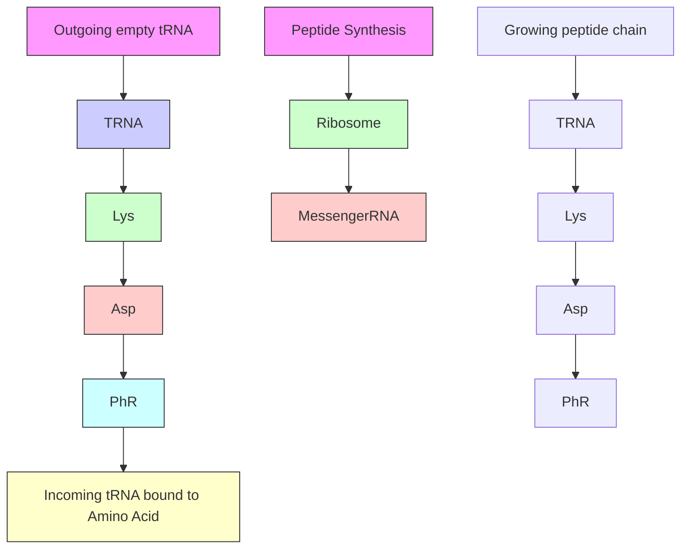
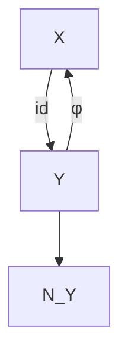
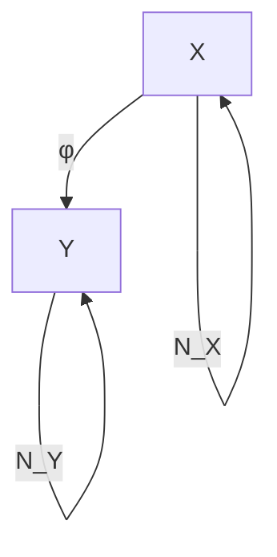

# Connections to Machine Learning, I

As argued in Chapter 1, standard machine learning rests on the same basis as statistics: we use data sampled i.i.d. from some unknown underlying distribution, and seek to infer properties of that distribution. In contrast, causal inference assumes a stronger underlying structure, including directed dependences. This makes it harder to learn about the structure from data, but it also allows novel statements once this is done, including statements about the effect of distribution shifts and interventions. If we view machine learning as the process of inferring regularities (or “laws of nature”) that go beyond pure statistical associations, then causality plays a crucial role. The present chapter presents some thoughts on this, focusing on the case of two variables only. Chapter 8 will revisit this topic and look at the multivariate case.

## 5.1 Semi-Supervised Learning

Let us consider a regression task, in which our goal is to predict a target variable Y from a d-dimensional predictor variable X. For many loss functions, knowing the conditional distribution $P _ { Y | \mathbf { X } }$ suffices to solve the problem. For instance, the regression function

$$
f ^ {0} (\mathbf {x}) := \mathbb {E} [ Y | \mathbf {X} = \mathbf {x} ]
$$

minimizes the $L _ { 2 }$ loss,

$$
f ^ {0} \in \underset {f: \mathbb {R} ^ {d} \to \mathbb {R}} {\operatorname{argmin}}   \mathbb {E} \left[ (Y - f (\mathbf {X})) ^ {2} \right].
$$

In supervised learning , we receive n i.i.d. data points from the joint distribution: $( \mathbf { X } _ { 1 } , Y _ { 1 } ) , \ldots , ( \mathbf { X } _ { n } , Y _ { n } ) \overset { \mathrm { i i d } } { \sim } P _ { \mathbf { X } , Y }$ . Regression estimation (with $L _ { 2 }$ loss) thus amounts to estimating the conditional mean from n data points of the joint distribution. In (inductive) semi-supervised learning (SSL), however, we receive m additional $\mathbf { X } _ { n + 1 } , . . . , \mathbf { X } _ { n + m } \overset { \mathrm { i i d } } { \sim } P _ { \mathbf { X } }$ points provide information about $P _ { \mathbf { X } }$ , which itself tells us something about $\mathbb { E } [ Y | \mathbf { X } ]$ or more generally about $P _ { Y | \mathbf { X } } .$ 1 Many assumptions underlying SSL techniques [see Chapelle et al., 2006, for an overview] concern relations between $R _ { \mathbf { X } }$ and $P _ { Y | \mathbf { X } }$ . The cluster assumption, for instance, stipulates that points lying in the same cluster of $P _ { \mathbf { X } }$ have the same or a similar $Y ;$ ; this is similar to the low-density separation assumption that states that the decision boundary of a classifier (i.e., points x where $P ( Y = 1 | \mathbf { X } = \mathbf { x } )$ crosses 0.5) should lie in a region where $P _ { \mathbf { X } }$ is small. The semisupervised smoothness assumption says that the conditional mean $\mathbf { x } \mapsto \mathbb { E } [ Y | \mathbf { X } = \mathbf { x } ]$ should be smooth in areas where $R _ { \mathbf { X } }$ is large.

### 5.1.1 SSL and Causal Direction

In the simplest setting, where the causal graph has only two variables (cause and effect), a machine learning problem can either be causal (if we predict effect from cause) or anticausal (if we predict cause from effect). Practitioners usually do not care about the causal structure underlying a given learning problem (see Figure 5.1). However, as we argue herein, the structure has implications for machine learning.

In Section 2.1, we have hypothesized that causal conditionals are independent of each other (Principle 2.1 and subsequent discussion). Scholkopf et al. [2012] ¨ realize that this principle has a direct implication for SSL. Since the latter relies on the relation between $R _ { \mathbf { X } }$ and $P _ { Y | \mathbf { X } }$ and the principle claims that $P _ { \mathrm { c a u s e } }$ and $P _ { \mathrm { e f f e c t | c a u s e } }$ do not contain information about one another, we can conclude that SSL will not work if X corresponds to the cause and Y corresponds to the effect (i.e., for a causal learning problem). In this case, additional x-values only tell us more about $P _ { \mathbf { X } }$ — which is irrelevant because the prediction requires information about the independent object $P _ { Y | \mathbf { X } }$ . On the other hand, if X is the effect and Y is the cause, information on $R _ { \mathbf { X } }$ may tell us something about $P _ { Y | \mathbf { X } }$ .

A meta-study that analyzed results in SSL supports our hypothesis. All cases where SSL helped were anticausal, or confounded, or examples where the causal structure was unclear (see Figure 5.2).

Figure 5.1: Top: a complicated mechanism ϕ called the ribosome translates mRNA information X into a protein chain $Y . ^ { 2 }$ Predicting the protein from the mRNA is an example of a causal learning problem, where the direction of prediction (green arrow) is aligned with the direction of causation (red). Bottom: In handwritten digit recognition, we try to infer the class label Y (i.e., the writer’s intention) from an image X produced by a writer. This is an anticausal problem.

Within the toy scenario of a bijective deterministic causal relation (see Section 4.1.7), Janzing and Scholkopf [2015] prove that whenever ¨ $P _ { \mathrm { c a u s e } }$ and $P _ { \mathrm { e f f e c t | c a u s e } }$ are independent in the sense of (4.10), then SSL indeed outperforms supervised learning in the anticausal direction but not in the causal direction. The idea is that SSL employs the dependence (4.11) for an improved interpolation algorithm.

Sgouritsa et al. [2015] have developed a causal learning method that exploits the fact that SSL can only work in the anti-causal direction.

Finally, note that SSL contains some versions of unsupervised learning as a special case (with no labeled data). In clustering, for example, Y is often a discrete value indicating the cluster index. Similarly to the preceding reasoning, we can argue that if X is the cause and Y the effect, clustering should not work well. In many applications of clustering on real data, however, the cluster index is rather the cause than the effect of the features.

While the empirical results in Figure 5.2 are promising, the statement that SSL does not work in the causal direction (always assuming independence of cause and mechanism, cf. Principle 2.1) needs to be made more precise. This will be done in the following section; it may be of interest to readers interested in SSL and covariate shift, but could be skipped at first reading by others.

### 5.1.2 A Remark on SSL in the Causal Direction

A more precise form of our prediction regarding SSL reads as follows: if the task is to predict y for some specific x, knowledge of $P _ { X }$ does not help when $X  Y$ is the causal direction. However, even if $P _ { X }$ does not tell us anything about $P _ { Y | X }$ (due to $X  Y )$ , knowing $P _ { X }$ can still help us for better estimating Y in the sense that weobtain lower risk in a learning scenario.

To see this, consider a toy example where the relation between X and Y is given by a deterministic function, that is, $Y = f ( X )$ , where f is known to be from some class $\mathcal { F }$ of functions. Let X take values in $\{ 1 , \ldots , m \}$ with $m \geq 3$ and let Y be a binary label attaining values in $\{ 0 , 1 \}$ . We define the function class $\mathcal { F } : = \{ f _ { 1 } , \ldots , f _ { m } \}$ by $f _ { j } ( j ) = 1$ and $f _ { j } ( k ) = 0$ for $k \neq j$ . In other words, $\mathcal { F }$ consists of the set of functions that attain the value one at exactly one point. Figure 5.3, top, shows the function $f _ { 3 }$ for $m = 4$ . Suppose that our learning algorithm infers $f _ { j }$ while the true function is $f _ { i }$ . For $i \neq j .$ , the risk, that is, the expected number of errors (see Equation (1.2)), equals

$$
R _ {i} (f _ {j}) := \sum_ {x = 1} ^ {m} | f _ {j} (x) - f _ {i} (x) | p (x) = p (j) + p (i), \tag {5.1}
$$

where $p$ denotes the probability mass function for X. We now average $R _ { i } ( f _ { j } )$ over the set $\mathcal { F }$ and assume that each $f _ { i }$ is equally likely. This yields the expected risk (where the expectation is taken with respect to a uniform prior over F )

$$
\begin{array}{l} \mathbb {E} [ R _ {i} (f _ {j}) ] = \frac {1}{m} \sum_ {i = 1} ^ {m} \sum_ {x = 1} ^ {m} | f _ {j} (x) - f _ {i} (x) | p (x) (5.2) \\ = \frac {1}{m} \sum_ {i \neq j} (p (j) + p (i)) = \frac {m - 2}{m} p (j) + \frac {1}{m}. (5.3) \\ \end{array}
$$

To minimize (5.3), we should thus choose $f _ { k }$ such that k minimizes the function $p .$ This makes sense because for any point $x = 1 , \ldots , m$ , the label $y = 0$ is more likely than $y = 1$ (probability $( m - 1 ) / m$ versus $1 / m )$ . Therefore, we would actually like to infer zero everywhere, but since the zero function is not contained in $\mathcal { F }$ , we are forced to select one x-value to which we assign the label zero. Hence, we choose one of the least likely x-values to obtain minimal expected loss (which is $x = 3$ for the distribution in Figure 5.3, bottom). Clearly, unlabeled observations help identify the least likely x-values, hence SSL can help. This example does not require any $( x , y )$ -pairs (labeled instances); unlabeled data x suffices. It is thus actually an example of unsupervised learning rather than being a typical SSL scenario. However, accounting for a small number of labeled instances in addition does not change the essential idea. Generically, these few instances will not contain any instance with $y = 1$ if $m$ is large enough. Hence, the observed $( x , y )$ -pairs only help because they slightly reduce $\mathcal { F }$ to a smaller class ${ \mathcal { F } } ^ { \prime }$ for which the analysis remains basically the same, and we still conclude that the unlabeled instances help.

Although we have not specified a supervised learning scenario as baseline (that is, one that does not employ knowledge of $P _ { X } )$ , we know that it must be worse than the best semi-supervised scenario because the optimal estimation depends on $P _ { X }$ , as we have just argued.

Here, the independence of mechanisms is not violated (and thus, X can be considered as a cause for Y ): $f$ is assumed to be chosen uniformly among $\mathcal { F }$ , and knowing $P _ { X }$ does not tell us anything about $f .$ Knowing $P _ { X }$ is only helpful for minimizing the loss because $p ( x )$ appears in (5.2) as a weighting factor.

The preceding example is close in spirit to a Bayesian analysis because it involved an average over functions in $\mathcal { F }$ . It can be modified, however, to apply to a worst case analysis, in which the true function $f$ is chosen by an adversarial to maximize (5.1) [see also Ka¨ari ¨ ainen, 2005]. Given a function ¨ $f _ { j }$ , the adversarial chooses $f _ { i }$ with i an x-value different from j with maximal probability mass. The worst case risk thus reads max $x \neq j  \{ p ( x ) \} + p ( j )$ , which is, again, minimized when $j$ is chosen to be an x-value that minimizes the probability mass function $p ( x )$ . Therefore, we conclude that optimal performance is attained only when $P _ { X }$ is taken into account.

Another example can be constructed on the basis of an argument that is given in a non-causality context by Urner et al. [2011, proof of Theorem 4]. They construct a case of model misspecification; where the true function $f _ { 0 }$ is not contained in the class $\mathcal { F }$ that is optimized over. In their example, additional information about the marginal $P _ { X }$ helps for reducing the risk, even though the conditional $P _ { Y | X }$ can be considered as being independent of the marginal. Our example above is not based on the same kind of model misspecification. Each possible (unknown) ground truth $f _ { i }$ is indeed contained in the class of functions; however, we would like to minimize the expectation of the risk over a prior, and our function class does not contain a function that has zero expected risk. Therefore, for the expected risk, this is akin to a situation of model misspecification.

Finally, we try to give some further intuition about the example by Urner et al. [2011]. Since $f _ { 0 }$ is not contained in the function class ${ \mathcal { F } } _ { : }$ , we need to find a function $\hat { f } \in \mathcal { F }$ that minimizes the distance $d ( f , f _ { 0 } )$ , defined as the risk of $f ,$ over $f \in { \mathcal { F } } ;$ ; we say $f _ { 0 }$ is projected onto ${ \mathcal F } .$ . Roughly speaking, additional information about $P _ { X }$ provides us with a better understanding of this projection.3

## 5.2 Covariate Shift

As explained in Section 2.1, the independence between $P _ { \mathrm { c a u s e } }$ and $P _ { \mathrm { e f f e c t | c a u s e } }$ (Principle 2.1) can be interpreted in two different ways: in Section 5.1 above, we argued that given a fixed joint distribution, these two objects contain no information about each other (see the middle box in Figure 2.2). Alternatively, suppose the joint distribution $P _ { \mathrm { c a u s e , e f f e c t } }$ changes across different data sets; then the change of $P _ { \mathrm { c a u s e } }$ does not tell us anything about the change of $P _ { \mathrm { e f f e c t | c a u s e } }$ (this corresponds to the left box in Figure 2.2). Knowing that X is the cause and Y the effect thus has important consequences for a prediction scenario where Y is predicted from X. Assume we have learned the statistical relation between X and Y using examples from one data set and we are supposed to employ this knowledge for predicting Y from X for a second data set. Further, assume that we observe that the x-values in the second data set follow a distribution $P _ { X } ^ { \prime }$ that differs from the distribution $P _ { X }$ of the first data set. How would we make use of this information? By the independence of mechanisms, the fact that $P _ { X } ^ { \prime }$ differs from $P _ { X }$ does not tell us anything about whether $P _ { Y | X }$ also changed across the data sets. Therefore, it might be the case that the conditional $P _ { Y | X }$ still holds true for the second data set. Second, even if the conditional did change to $P _ { Y | X } ^ { \prime } \neq P _ { Y | X }$ , it is natural to still use $P _ { Y | X }$ for our prediction. After all, the independence principle states that the new change of the marginal distribution from $P _ { X }$ to $P _ { X } ^ { \prime }$ does not tell us anything about how the conditional has changed. Therefore, we use $P _ { Y | X }$ in absence of any better candidate. Using the same conditional $P _ { Y | X }$ although $P _ { X }$ has changed is usually referred to as covariate shift. Meanwhile, this is a well-studied assumption in machine learning [Sugiyama and Kawanabe, 2012]. The argument that this is only justified in the causal scenario, in other words, if X is the cause and Y the effect, has been made by Scholkopf et al. [2012]. ¨To further illustrate this point, consider the following toy example of an anticausal scenario where X is the effect. Let Y be a binary variable influencing the real-valued variable X in an additive way:

$$
X = Y + N _ {X}, \tag {5.4}
$$

where we assume $N _ { X }$ to be Gaussian noise, independent of Y . Figure 5.4, left, shows the corresponding probability density $p _ { X }$ .

If its width is sufficiently small, the distribution $P _ { X }$ is bimodal. Even if one does not know anything about the generating model, $P _ { X }$ can be recognized as a mixture of two Gaussian distributions with equal width. In this case, one can therefore guess the joint distribution $P _ { X , Y }$ from $P _ { X }$ alone because it is natural to assume that the influence of Y consists only in shifting the mean of X. Under this assumption, we do not need any $( x , y )$ -pairs to learn the relation between X and Y . Assume now that in a second data set we observe the same mixture of two Gaussian distributions but with different weights (see Figure 5.4, right). Then, the most natural conclusion reads that the weights have changed because the same equation (5.4) still holds but only $P _ { Y }$ has changed. Accordingly, we would no longer use the same $P _ { Y | X }$ for our prediction and reconstruct $P _ { Y | X } ^ { \prime }$ from $P _ { X } ^ { \prime }$ . The example illustrates that in the anticausal scenario the changes of $\mathit { P } _ { X }$ and $P _ { Y | X }$ may be related and that this relation may be due to the fact that $P _ { Y }$ has changed and $P _ { X | Y }$ remained the same. In other words, $P _ { \mathrm { e f f e c t } }$ and $P _ { \mathrm { c a u s e | e f f e c t } }$ often change in a dependent way because $P _ { \mathrm { c a u s e } }$ and $P _ { \mathrm { e f f e c t | c a u s e } }$ change independently.

Figure 5.5: Example where X causes Y and, as a result, $P _ { Y }$ and $P _ { X | Y }$ contain information about each other. Left: $P _ { X }$ is a mixture of sharp peaks at the positions $s _ { 1 } , s _ { 2 } , s _ { 3 }$ . Right: $P _ { Y }$ is obtained from $P _ { X }$ by convolution with Gaussian noise with zero mean and thus consists of less sharp peaks at the same positions $s _ { 1 } , s _ { 2 } , s _ { 3 }$ . Then $P _ { X | Y }$ also contains information about $s _ { 1 } , s _ { 2 } , s _ { 3 }$ (see Problem 5.1).

The previous example elicits a specific scenario. Conceiving of general methods exploiting the fact that $P _ { \mathrm { e f f e c t } }$ and $P _ { \mathrm { c a u s e | e f f e c t } }$ change in a dependent way is a hard problem. This may be an interesting avenue for further research, and we believe that causality could play a major role in domain adaptation and transfer problems; see also Bareinboim and Pearl [2016], Rojas-Carulla et al. [2016], Zhang et al. [2013], and Zhang et al. [2015].

## 5.3 Problems

Problem 5.1 (Independence of mechanisms) Let $P _ { X }$ be the mixture of k sharp Gaussian peaks at positions $s _ { 1 } , \ldots , s _ { k }$ as shown in Figure 5.5, left. Let Y be obtained from X by adding some Gaussian noise N with zero mean and a width $\sigma _ { N }$ such that the separate peaks remain visible as in Figure 5.5, right.

a) Argue intuitively why $P _ { X | Y }$ also contains information about the positions $s _ { 1 } , \ldots , s _ { k }$ of the peaks and thus $P _ { X | Y }$ and PY share this information.  
b) The transition between PX and PY can be described by convolution (from $P _ { X }$ to $P _ { Y } )$ and deconvolution (from PY to $P _ { X } )$ . $I f P _ { Y | X }$ is considered as the linear map converting the input $P _ { X }$ to the output $P _ { Y }$ then $P _ { Y | X }$ coincides with the convolution map. Argue why $P _ { X | Y }$ does not coincide with the deconvolution map (as one may think at first glance).

# 6