# Multivariate Causal Models

In Chapter 3, we discussed causal models for two variables. While some of the basic notions can be more easily explained in the bivariate case, a lot of the structure of causal inference derives from multivariate relations, which involve at least three variables. We now consider causal models in the more general case of $d \geq 2$ variables.

Many of the concepts carry over directly and we hope that the reader, equipped with the intuition gained in Chapter 3, can easily follow the definitions of SCMs (Section 6.2), interventions (Section 6.3), and counterfactuals (Section 6.4). But there are fundamental differences to the bivariate case, too. In Section 6.5, we will see that the graph structure implies conditional independence statements that have been trivial in the bivariate case. Also, computing intervention distributions requires more thought in the multivariate setting: We will discuss adjustment formulas and do-calculus [Pearl, 2009] in Section 6.6.

We first introduce some graphical terminology. Most of the definitions are selfexplanatory and can be found in Spirtes et al. [2000], Koller and Friedman [2009], and Lauritzen [1996], for example. The reader who is already familiar with graphical models may want to skip this section. The most important terms for this book are directed acyclic graphs (DAGs), v-structures, and d-separation.

## 6.1 Graph Terminology

Consider finitely many random variables $\mathbf { X } = \left( X _ { 1 } , \ldots , X _ { d } \right)$ with index set $\mathbf { V } : =$ $\{ 1 , \ldots , d \}$ , joint distribution $P _ { \mathbf { X } }$ , and density $p ( \mathbf { x } )$ . A graph $\mathcal { G } = ( \mathbf { V } , \mathcal { E } )$ consists of (finitely many) nodes or vertices V and edges $\mathcal { E } \subseteq \mathbf { V } ^ { 2 }$ with $( \nu , \nu ) \not \in { \mathcal { E } }$ for any $\nu \in \mathbf { V }$ . We further have the following definitions:Let $\mathcal { G } = ( \mathbf { V } , \mathcal { E } )$ be a graph with $\mathbf { V } : = \{ 1 , \ldots , d \}$ and corresponding random variables $\mathbf { X } = \left( X _ { 1 } , \ldots , X _ { d } \right)$ . A graph $\mathcal { G } _ { 1 } = ( \mathbf { V } _ { 1 } , \mathcal { E } _ { 1 } )$ is called a subgraph of G if $\mathbf { V } _ { 1 } = \mathbf { V }$ and ${ \mathcal { E } } _ { 1 } \subseteq { \mathcal { E } }$ ; we then write $\mathcal { G } _ { 1 } \leq \mathcal { G }$ . If additionally, $\mathcal { E } _ { 1 } \neq \mathcal { E }$ , then $\mathcal { G } _ { 1 }$ is a proper subgraph of $\mathcal { G }$ .

A node i is called a parent of j if $( i , j ) \in \mathcal { E }$ and $( j , i ) \notin \mathcal { E }$ and a child if $( j , i ) \in \mathcal { E }$ and $( i , j ) \notin \mathcal { E }$ . The set of parents of j is denoted by $\mathbf { P A } _ { j } ^ { \mathcal { G } }$ , and the set of its children by $\mathbf { C H } _ { j } ^ { \mathcal { G } }$ . Two nodes i and $j$ are adjacent if either $( i , j ) \in \mathcal { E }$ or $( j , i ) \in \mathcal { E }$ . We call $\mathcal { G }$ fully connected if all pairs of nodes are adjacent. We say that there is an undirected edge between two adjacent nodes i and j if $( i , j ) \in \mathcal { E }$ and $( j , i ) \in \mathcal { E }$ . An edge between two adjacent nodes is directed if it is not undirected. We then write $i  j$ for $( i , j ) \in \mathcal { E }$ . We call $\mathcal { G }$ directed if all its edges are directed.1 Three nodes are called an immorality or a v-structure if one node is a child of the two others that themselves are not adjacent. The skeleton of $\mathcal { G }$ does not take the directions of the edges into account. It is the graph $( \mathbf { V } , { \tilde { \mathcal { E } } } )$ with $( i , j ) \in \tilde { \mathcal { E } }$ , if $( i , j ) \in \mathcal { E }$ or $( j , i ) \in \mathcal { E }$ .

A path in $\mathcal { G }$ is a sequence of (at least two) distinct vertices $i _ { 1 } , \ldots , i _ { m }$ , such that there is an edge between $i _ { k }$ and $i _ { k + 1 }$ for all $k = 1 , \ldots , m - 1$ . If $i _ { k - 1 } \to i _ { k }$ and $i _ { k + 1 }  i _ { k } , i _ { k }$ is called a collider relative to this path. If $i _ { k } \to i _ { k + 1 }$ for all k, we speak of a directed path from $i _ { 1 }$ to $i _ { m }$ and call $i _ { 1 }$ an ancestor of $i _ { m }$ and $i _ { m }$ a descendant of $i _ { 1 }$ . In this work, all ancestors of i are denoted by $\mathbf { A N } _ { i } ^ { \mathcal { G } }$ and i is not an ancestor of itself. Furthermore, i is neither a descendant nor a non-descendant of itself. We denote all descendants of i by $\mathbf { D } \mathbf { E } _ { i } ^ { \mathcal { G } }$ and all non-descendants of $i ,$ excluding i, by $\mathbf { N D } _ { i } ^ { \mathcal { G } }$ . In this book, $\mathbf { N D } _ { i } ^ { \mathcal { G } }$ include the parents of i in graph ${ \mathcal { G } } .$ . A node without parents is called a source node, a node without children a sink node. A permutation π, that is a bijective function $\pi : \{ 1 , \ldots , d \}  \{ 1 , \ldots , d \}$ is called a topological or causal ordering if it satisfies $\pi ( i ) < \pi ( j )$ if $j \in \mathbf { D } \mathbf { E } _ { i } ^ { \mathcal { G } }$ (see also Appendix B).

A graph $\mathcal { G }$ is called a partially directed acyclic graph (PDAG) if there is no directed cycle, that is, if there is no pair $( j , k )$ with directed paths from j to k and from k to j. $\mathcal { G }$ is called a directed acyclic graph (DAG) if it is a PDAG and all edges are directed.

Since we will use it at many places herein, we formulate the graphical concept of d-separation [Pearl, 1985, 1988] as a definition.

Definition 6.1 (Pearl’s d-separation) In a DAG G, a path between nodes $i _ { 1 }$ and $i _ { m }$ is blocked by a set S (with neither $i _ { 1 }$ nor $i _ { m }$ in S) whenever there is a node $i _ { k } ,$ , such that one of the following two possibilities holds:

(i) $i _ { k } \in \mathbf { S }$ and

$$
i _ {k - 1} \rightarrow i _ {k} \rightarrow i _ {k + 1}
$$

$$
o r i _ {k - 1} \leftarrow i _ {k} \leftarrow i _ {k + 1}
$$

$$
o r i _ {k - 1} \leftarrow i _ {k} \rightarrow i _ {k + 1}
$$

(ii) neither $i _ { k }$ nor any of its descendants is in S and

$$
i _ {k - 1} \rightarrow i _ {k} \leftarrow i _ {k + 1}.
$$

Furthermore, in a DAG G, we say that two disjoint subsets of vertices A and B are d-separated by a third (also disjoint) subset S if every path between nodes in A and B is blocked by S. We then write

$$
\mathbf {A} \perp \llcorner_ {\mathcal {G}} \mathbf {B} | \mathbf {S}.
$$

The reader may have a look at Figure 6.5 and be convinced that for this DAG, we have $C \bot \bot _ { \mathcal { G } } G | X$ but $C \not \to \mathcal { G } G | \left( X , H \right)$ .

## 6.2 Structural Causal Models

SCMs have been used for a long time in fields such as agriculture, social sciences, and econometrics [Wright, 1921, Haavelmo, 1944, Bollen, 1989]; see also Chapter 2. Model selection, for example, was done by fitting different structures that were considered as reasonable given the prior knowledge about the system. These candidate structures were then compared using goodness of fit tests. In this chapter, we introduce the semantics of SCMs and learn how to use them for computing intervention distributions, for example. Throughout the whole chapter we will assume that the SCM or at least its structure is given. We discuss the question of identifying the structure in Chapter 7.

Definition 6.2 (Structural causal models) A structural causal model (SCM) ${ \mathfrak { C } } : = ( \mathbf { S } , P _ { \mathbf { N } } )$ consists of a collection S of d (structural) assignments

$$
X _ {j} := f _ {j} (\mathbf {P A} _ {j}, N _ {j}), \quad j = 1, \dots , d, \tag {6.1}
$$

<!-- footnote -->

- In the literature, the notation $p ( c | d o \left( E : = 4 \right) )$ is also commonly used. We prefer $p ^ { d o ( E : = 4 ) }$ since interventions are conceptually different from conditioning, and $p ( c | d o \left( E : = 4 \right) )$ resembles the usual notation for the latter, $p ( c | E = 4 )$ .

<!-- footnote end -->

<!-- footnote -->

- This representation has been used in the literature in various places, for example, [Pearl, 2009] although we have not found the term “canonical representation.”

<!-- footnote end -->

<!-- footnote -->

- Note that this non-generic case should not be called “trivial” because non-trivial counterfactual influence can be consistent with X ⊥⊥ Y (see Section 3.4).
- We use the notation $P _ { E | C }$ as a shorthand for the collection $( P _ { E | C = c } ) _ { c }$ c of conditional distributions and implicitly assume the existence of a density, in other words, that $P _ { E , C }$ is absolutely continuous with respect to a product measure.

<!-- footnote end -->

<!-- footnote -->

- In a ring, we can perform addition and multiplication. The latter operation does not necessarily have an inverse, though.

<!-- footnote end -->

<!-- footnote -->

- Here, “rare” should not be mistaken as saying that there are only finitely many exceptions.

<!-- footnote end -->

<!-- footnote -->

- A function is called a diffeomorphism if it is differentiable and bijective and it has a differentiable inverse.
- This view may be unexpected, but recall that random variables are defined as measurable functions on a probability space. Here, both log $f ^ { \prime }$ and $p _ { X }$ are functions of $x \in [ 0 , 1 ] .$ , thus they are random variables on the common probability space [0, 1]. Therefore, any distribution on [0, 1] defines a joint distribution of these random variables.

<!-- footnote end -->

<!-- footnote -->

- The program is given by a binary word using prefix-free encoding; that is, no program code is the prefix of another one. Otherwise one would need an extra symbol indicating the end of the code.
- Note that conditioning on $t ^ { * }$ instead of t makes a difference since there is no algorithm that computes $t ^ { * }$ from t (but vice versa); $t ^ { * }$ can thus be more valuable as input than t. It turns out that $K ( s | t ^ { * } )$ shows closer analogies to conditional Shannon entropy than $K ( s | t )$ .

<!-- footnote end -->

<!-- footnote -->

- Checking whether the left-hand side of inequality (4.17) is smaller than the right-hand side is not the only option to test independence: whenever two strings are algorithmically independent, applying functions of complexity $\mathcal { O } ( 1 )$ to each of them generates again two (possibly simpler) algorithmically

<!-- footnote end -->

<!-- footnote -->

- independent strings [Janzing and Scholkopf, 2010, Lemma 6]. This way, one can in principle reject ¨ algorithmic independence without knowing the complexities of the strings to start with.

<!-- footnote end -->

<!-- footnote -->

- This can easily be seen using the following standard geometric picture: cov $[ . , . ]$ defines an inner product in the space of centred random variables with finite variance. Then the length of the vector Y − αX is minimal when it is orthogonal to X.
- This is pair001 in the database of cause-effect pairs https://webdav.tuebingen.mpg.de/ cause-effect/; see also [Mooij et al., 2016].

<!-- footnote end -->

<!-- footnote -->

- Again, we use the notation $P _ { Y | \mathbf { X } }$ as a shorthand for the collection $( P _ { Y | \mathbf { X } = \mathbf { X } } ) _ { \mathbf { X } }$ of conditional distributions.

<!-- footnote end -->

<!-- footnote -->

- By user “Boumphreyfr”, https://commons.wikimedia.org/wiki/File:Peptide\_syn. png, [CC BY-SA 3.0 (http://creativecommons.org/licenses/by-sa/3.0) or GFDL (http: //www.gnu.org/copyleft/fdl.html)]

<!-- footnote end -->

<!-- footnote -->

- We are grateful to several people who contributed to this discussion: Sebastian Nowozin, Ilya Tolstikhin, and Ruth Urner.

<!-- footnote end -->

<!-- footnote -->

- Note that this excludes cycles of length 2, but it does not excludes longer cycles.

<!-- footnote end -->

$$
X _ {1} := f _ {1} (X _ {3}, N _ {1})
$$

$$
X _ {2} := f _ {2} (X _ {1}, N _ {2})
$$

$$
X _ {3} := f _ {3} (N _ {3})
$$

$$
X _ {4} := f _ {4} (X _ {2}, X _ {3}, N _ {4})
$$

• $N _ { 1 } , \ldots , N _ { 4 }$ jointly independent
• G is acyclic


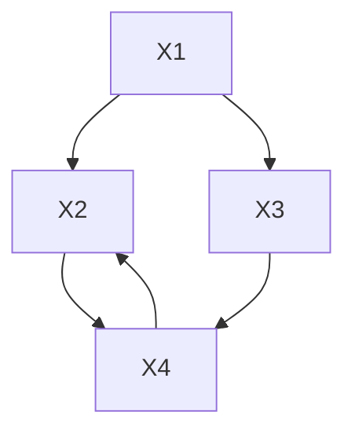

Figure 6.1: Example of an SCM (left) with corresponding graph (right). There is only one causal ordering π (that satisfies $3 \mapsto 1 , 1 \mapsto 2 , 2 \mapsto 3 , 4 \mapsto 4 )$ .

where $\mathbf { P A } _ { j } \subseteq \{ X _ { 1 } , \ldots , X _ { d } \} \setminus \{ X _ { j } \}$ are called parents of $\cdot X _ { j } ,$ and a joint distribution $P _ { \mathbf { N } } = P _ { N _ { 1 } , \dots , N _ { d } }$ over the noise variables, which we require to be jointly independent; that is, $R _ { \mathbf { N } }$ is a product distribution.

The graph G of an SCM is obtained by creating one vertex for each $X _ { j }$ and drawing directed edges from each parent in $\mathbf { P A } _ { j }$ to $X _ { j } ,$ , that is, from each variable $X _ { k }$ occurring on the right-hand side of equation (6.1) to $X _ { j }$ (see Figure 6.1). We henceforth assume this graph to be acyclic.

We sometimes call the elements of $\mathbf { P A } _ { j }$ not only parents but also direct causes of $X _ { j }$ , and we call $X _ { j }$ a direct effect of each of its direct causes. SCMs are also called (nonlinear) SEMs.

Although some of the terminology is causal (“direct cause” and “direct effect”), Definition 6.2 is purely mathematical. We discuss its role as a model for a real system in Section 6.8.

SCMs are the key for formalizing causal reasoning and causal learning. We first show that an SCM entails an observational distribution. But unlike usual probabilistic models, they additionally entail intervention distributions (Section 6.3) and counterfactuals (Section 6.4); see Figure 6.2.

Proposition 6.3 (Entailed distributions) An SCM C defines a unique distribution over the variables $\mathbf { X } = \left( X _ { 1 } , \ldots , X _ { d } \right)$ such that $X _ { j } = f _ { j } ( \mathbf { P A } _ { j } , N _ { j } )$ , in distribution, for $j = 1 , \ldots , d .$ . We refer to it as the entailed distribution $P _ { \mathbf { X } } ^ { \mathrm { g } }$ and sometimes write $P _ { \mathbf { X } }$ .

The proof can be found in Appendix C.2. It formalizes the procedure for how we sample n data points from the joint distribution (“ancestral sampling”): We first generate an i.i.d. sample $\mathbf { N } ^ { 1 } , \ldots , \mathbf { N } ^ { n } \sim P _ { \mathrm { N } }$ and then subsequently use the structural assignments (starting from source nodes, then nodes with at most one parent and so on) to generate i.i.d data points $\mathbf { X } ^ { 1 } , \ldots , \mathbf { X } ^ { n } \sim P _ { \mathbf { X } }$ . Structural assignments (6.1) should be thought of as a set of assignments or functions (rather than a set of mathematical equations) that tells us how certain variables determine others. This is the reason why we prefer to avoid the term structural equations, which is commonly used in the literature.


```mermaid
graph TD
  A["observational distribution P_X^c"] --> C["causal model e.g., SCM c"]
    B["intervention distributions P_X^{c;do(...)},..."]
  D["causal graph G"] <-- --> C
    E["counterfactuals P_X^c|X=x;do(...),..."]
  C --> F
    style C fill:#FFD700,stroke:#333
```

Figure 6.2: Causal models as SCMs do not only model an observational distribution P (Proposition 6.3) but also intervention distributions (Section 6.3) and counterfactuals (Section 6.4).

Code Snippet 6.4 The following code generates an i.i.d. sample from an SCM with the form shown in Figure 6.1: structural assignments $f _ { 1 } ( x _ { 3 } , n ) = 2 x _ { 3 } + n .$ , $f _ { 2 } ( x _ { 1 } , n ) = ( 0 . 5 x _ { 1 } ) ^ { 2 } + n , f _ { 3 } ( n ) = n ,$ , and $f _ { 4 } ( x _ { 2 } , x _ { 3 } , n ) = x _ { 2 } + 2 \sin ( x _ { 3 } + n )$ , and jointly independent noise variables with a normal, chi squared, uniform, and normal distribution, respectively.

```txt
# generate a sample from the distribution entailed by the SCM set.seed(1)
X3 <- runif(100) - 0.5
X1 <- 2 * X3 + rnorm(100)
X2 <- (0.5 * X1)^2 + rnorm(100)^2
X4 <- X2 + 2 * sin(X3 + rnorm(100))
```

Remark 6.5 (Linear cyclic assignments) In this book we focus mainly on acyclic structures. We now briefly discuss linear SCMs with assignments that lead to a cyclic structure; these are well understood [Lauritzen and Richardson, 2002, Lacerda et al., 2008, Hyttinen et al., 2012]. We focus on the intuition and do not provide a formal treatment. More details for the linear case are provided by Hyttinen et al. [2012], and the nonlinear case is discussed by Mooij et al. [2011] and Bongers et al. [2016].

Let us denote $\mathbf { X } = \left( X _ { 1 } , \ldots , X _ { d } \right)$ and consider the assignment

$$
\mathbf {X} := B \mathbf {X} + \mathbf {N},
$$

with a $d \times d$ matrix B that allows for a cyclic structure and some noise vector $\mathbf { N } = ( N _ { 1 } , \ldots , N _ { d } ) \sim P _ { \mathbf { N } }$ . Formally, if $I - B$ is invertible, for each value of N, the preceding equation induces a unique solution for X, namely

$$
\mathbf {X} = (I - B) ^ {- 1} \mathbf {N} \tag {6.2}
$$

(see also Problem 3.8). Equation (6.2) clearly defines a joint distribution over X. But what is its (causal) interpretation?

One possibility is to interpret it as a result of an equilibration process. Consider a sequence of random variables $\mathbf { X } ^ { t }$ that occur as solutions to the iteration

$$
\mathbf {X} ^ {t} := B \mathbf {X} ^ {t - 1} + \mathbf {N}, t = 1, 2, \dots . \tag {6.3}
$$

The sequence Xt converges if $B ^ { t } \to 0 \mathrm { a s } t \to \infty$ , which is equivalent to the eigenvalues of B lying within the unit circle. This is a strictly stronger condition than the invertibility of $I - B$ (see Problem 6.60). If satisfied, the distribution of the limit is identical to the distribution induced by Equation (6.2); see Problem 6.61.

In (6.3), we have added the same noise realization in each time step. The limiting distribution of $\mathbf { X } ^ { t }$ changes if we instead update the noise in each step:

$$
\mathbf {X} ^ {t} := B \mathbf {X} ^ {t - 1} + \mathbf {N} ^ {t - 1}, t = 1, 2, \dots \tag {6.4}
$$

with $\mathbf { N } ^ { 1 } , \mathbf { N } ^ { 2 } , \ldots$ . being i.i.d. copies of Nt . This can be regarded as a time series setting and will be discussed in Section 10.2. □

Proposition 6.3 shows that each SCM entails a distribution. What about the other direction? Is any distribution entailed by an SCM? Indeed, we will see later (Proposition 7.1) that each distribution can be induced by any SCM whose graph structure is a complete DAG (a DAG is called complete if any pair of vertices is connected). This means that the (observational) model class of SCMs, that is, the set of distributions that can be induced by an SCM, is the set of all distributions.

The definition of SCMs allows for the possibility that a variable appears on the right-hand side of the structural assignment without affecting the variable on the left-hand side. Even though such a parent-child relation is in some sense “inactive,” it still appears as an edge in the corresponding graph. Formally, we exclude this by the following remark:Remark 6.6 (Structural minimality of SCMs) Definition 6.2 can be read such that one distinguishes between the two SCMs

$$
\mathbf {S} _ {1}: X := N _ {X}, Y := 0 \cdot X + N _ {Y} \quad \text { and }
$$

$$
\mathbf {S} _ {2}: X := N _ {X}, Y := N _ {Y},
$$

even though clearly $0 \cdot X = 0$ . This contradicts our intuition. We therefore add the requirement that the functions $f _ { j }$ depend on all of their input arguments. Mathematically speaking, whenever there is a $k \in \{ 1 , \ldots , d \}$ and a function g such that

$$
f _ {k} (\mathbf {p a} _ {k}, n _ {k}) = g (\mathbf {p a} _ {k} ^ {*}, n _ {k}), \quad \forall \mathbf {p a} _ {k}, \forall n _ {k} \text {   with   } p (n _ {k}) > 0, \tag {6.5}
$$

where $\mathbf { P A } _ { k } ^ { * } \subsetneq \mathbf { P A } _ { k }$ , we choose the latter representation. In the preceding example, we would therefore choose the representation $\mathbf { S } _ { 2 }$ over $\mathbf { S } _ { 1 }$ . We will see later that these two SCMs can indeed be identified in that they entail the same observational distribution, intervention distribution,2 and counterfactuals (see Section 6.8).

Furthermore, there is a unique representation in which each function has a minimal number of inputs. Although this statement seems plausible, we formally prove it in Appendix C.3. We say that such an (least) SCM satisfies structural minimal-$\mathbf { i t y } . ^ { 3 }$ From now on, we assume that structural minimality holds. As opposed to faithfulness (Section 6.5), for example, this is not an assumption about the underlying world. It is a convention to avoid redundant descriptions. □

Remark 6.7 (Relationship to ordinary differential equations) In Remark 6.5, we have already seen a relation between SCMs and discrete time models, and we would now like to comment on continuous time models. In physical systems, we would often expect that causal relationships are governed by sets of coupled differential equations. A differential equation system ${ \dot { \mathbf { X } } } = f ( \mathbf { X } )$ can be represented approximately as an assignment $\mathbf { X } _ { t + \Delta t } : = \mathbf { X } _ { t } + \Delta t \cdot f ( \mathbf { X } _ { t } )$ with small $\Delta t > 0$ , and it thus contains information about the causal structure at a fine-grained time scale. An intervention can be implemented physically as a forcing term pulling a variable toward a desired value. Under certain stability assumptions, we can assay the effect of interventions in a time-independent manner by analyzing the behavior of the equilibrium state. This entails an SCM that describes how the equilibrium states of such a dynamical system will react to physical interventions on the observables [Mooij et al., 2013]. In the SCM, the variables no longer describe measurements at specific points in time. On this phenomenological level, the original time structure disappears. The framework is in principle also applicable to cyclic structures, but it does not yet address the stochastic case; the theory is restricted to deterministic relations. This shortcoming is significant, since uncertainty can arise from a number of sources, including incomplete knowledge of the parameters of the differential equations or of initial conditions, and — as always — confounding. We will not discuss further details on deriving phenomenological structural equations from differential equations and refer to some literature instead [see, e.g., Dash, 2005, Hansen and Sokol, 2014].

Our main motivation for this remark is to avoid a common misconception. It is sometimes argued that part of the task of causal inference becomes obsolete by specifying the exact time to which a variable refers. This view is particularly supported by physics where it is common that every measurement can be uniquely assigned to a point in space-time where it has been performed. These arguments show, however, that even variables in physics do not always refer to observations that are well-defined in time — for example, because they arise from an equilibrium scenario. □

## 6.3 Interventions

We are now ready to model interventions in a system. Intuitively, when we intervene on variable $X _ { 2 }$ , say, and set it to the binary outcome of a coin flip, we expect that this intervention changes the distribution of the system compared to its earlier behavior without intervention. Furthermore, even if the variable $X _ { 2 }$ was causally influenced by other variables before, it is now influenced by nothing else than the coin flip: its causal parents have changed.

Formally, we construct intervention distributions from an SCM C. They are obtained by making modifications to C and considering the new entailed distribution. In general, intervention distributions differ from the observational distribution.

Definition 6.8 (Intervention distribution) Consider an SCM ${ \mathfrak { C } } : = ( \mathbf { S } , P _ { \mathbf { N } } )$ and its entailed distribution $P _ { \mathbf { X } } ^ { \mathrm { g } }$ . We replace one (or several) of the structural assignments to obtain a new SCM C˜ . Assume that we replace the assignment for $X _ { k }$ by

$$
X _ {k} := \tilde {f} (\widetilde {\mathbf {P A}} _ {k}, \tilde {N} _ {k}).
$$

We then call the entailed distribution of the new SCM an intervention distribution and say that the variables whose structural assignment we have replaced have been intervened on. We denote the new distribution $b y ^ { 4 }$

$$
P _ {\mathbf {X}} ^ {\tilde {\mathfrak {C}}} =: P _ {\mathbf {X}} ^ {\mathfrak {C}; d o \left(X _ {k} := \tilde {f} (\widetilde {\mathbf {P A}} _ {k}, \tilde {N} _ {k})\right)}.
$$

The set of noise variables in $\tilde { \mathfrak { C } }$ now contains both some “new” N’s and some “old” ˜ N’s, all of which are required to be jointly independent.

$\widetilde { f } ( \widetilde { \mathbf { P A } } _ { k } , \widetilde { N } _ { k } )$ $P _ { \mathbf { X } } ^ { \mathfrak { C } ; d o ( X _ { k } : = a ) }$ and call this an atomic intervention.5 An intervention with $\widetilde { \mathbf { P } \mathbf { A } } _ { k } = \mathbf { P } \mathbf { A } _ { k } ,$ , that is, where direct causes remain direct causes, is called imperfect.6 This is a special case of a stochastic intervention [Korb et al., 2004], in which the marginal distribution of the intervened variable has positive variance.

We require that the new SCM C˜ have an acyclic graph; the set of allowed interventions thus depends on the graph induced by C.

Code Snippet 6.9 The following code samples from an intervention distribution. We consider the SCM C from Code Snippet 6.4 and perform the intervention $P _ { \mathbf { X } } ^ { \mathfrak { C } ; d o ( X _ { 2 } : = 3 ) }$

```txt
# generate a sample from the intervention distribution
set.seed(1)
X3 <- runif(100) - 0.5
X1 <- 2 * X3 + rnorm(100)
# old:
# X2 <- (0.5 * X1)^2 + rnorm(100)^2
X2 <- rep(3, 100)
X4 <- X2 + 2 * sin(X3 + rnorm(100))
```

It turns out that the concept of interventions is a powerful tool to model differences in distributions and to understand causal relationships. We try to illustrate this with some examples.

Example 6.10 (Predictors and intervention targets) This example considers prediction. It shows that even though some variables may be good predictors for a target variable Y , intervening on them may leave the target variable unaffected. Consider the SCM C

$$
X _ {1} := N _ {X _ {1}}
$$

$$
Y := X _ {1} + N _ {Y}
$$

$$
X _ {2} := Y + N _ {X _ {2}}
$$

$$
ⓧ X _ {1} \longrightarrow Ⓨ Y \longrightarrow ⓢ X _ {2}
$$

with $N _ { X _ { 1 } } , N _ { Y } \overset { \mathrm { i i d } } { \sim } \mathcal { N } ( 0 , 1 )$ and $N _ { X _ { 2 } } \sim \mathcal { N } ( 0 , 0 . 1 )$ being jointly independent. Assume that we are interested in predicting Y from $X _ { 1 }$ and $X _ { 2 }$ . Clearly, $X _ { 2 }$ is a better predictor for Y than $X _ { 1 }$ is; for example, a linear model without $X _ { 2 }$ leads to a (significantly) larger mean squared error than a linear model without $X _ { 1 }$ would. If we want to change Y , however, interventions on $X _ { 2 }$ are useless:

$$
P _ {Y} ^ {\mathfrak {C}; d o (X _ {2} := \tilde {N})} = P _ {Y} ^ {\mathfrak {C}} \quad \text {   for   all   variables   } \tilde {N};
$$

in other words, no matter how strongly we intervene on $X _ { 2 }$ , the distribution of Y remains unaffected. An intervention on $X _ { 1 }$ , however, does change the distribution of Y :

$$
P _ {Y} ^ {\mathfrak {C}; d o (X _ {1} := \tilde {N})} = \mathcal {N} \left(\mathbb {E} [ N _ {Y} ] + \mathbb {E} [ \tilde {N}, \operatorname{var} [ N _ {Y} ] + \operatorname{var} [ \tilde {N} ]\right) \neq P _ {Y} ^ {\mathfrak {C}}
$$

if PN˜ 6= PNX . $\mathrm { i f } P _ { \tilde { N } } \ne P _ { N _ { X _ { 1 } } } .$

This example can also be used to show that intervening is usually different from conditioning:

$$
p _ {Y} ^ {\mathfrak {C}; d o (X _ {2} := x)} (y) = p _ {Y} ^ {\mathfrak {C}} (y) \neq p _ {Y} ^ {\mathfrak {C}} (y | X _ {2} = x).
$$

Example 6.11 (Myopia) The following case study is one example (out of many), in which a statistical dependence is mistakenly interpreted as a direct causal relationship. Humans seem to be particularly susceptible for such a false causal conclusion when little background knowledge is available. A study established a dependence between the usage of a night light in a child’s room and the occurrence of myopia [Quinn et al., 1999, page 113]. While the authors are cautious enough to say that the study “does not establish a causal link,” they add that “the statistical strength of the association . . . does suggest that the absence of a daily period of darkness during early childhood is a potential precipitating factor in the development of myopia.” Based on these findings, a patent was filed [Peterson, 2005]. It suggests that if we intervene on the variable night light, this changes the probability to develop myopia.

Subsequently, Gwiazda et al. [2000] and Zadnik et al. [2000] found that the correlation is due to whether the child’s parents have myopia. They argue that myopic parents are more likely to put a night light in their child’s room, and at the same time, the child has an increased risk of inheriting the condition. Therefore, assume that the underlying (“correct”) SCM is of the form

$$
P M := N _ {P M}
$$

$$
\mathbf {S}: \quad N L := f (P M, N _ {N L})
$$

$$
C M := g (P M, N _ {C M})
$$

where PM stands for parent myopia, NL for night light, and CM for child myopia. The corresponding graph is


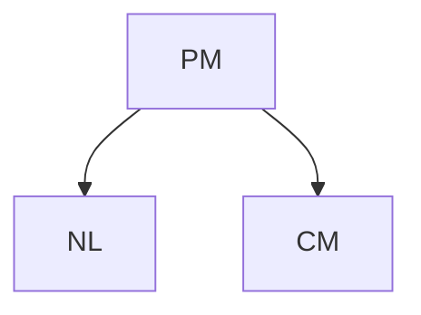

In their paper, Quinn et al. [1999] found that NL 6⊥⊥ CM, consistent with the model (assuming faithfulness — see Definition 6.33). Now we replace the structural assignment of NL with $N L : = \tilde { N } _ { N L }$ , where $\tilde { N } _ { N L }$ could randomly assign one out of the three night light conditions (“darkness,” “night light,” “room light”) with equal probability. In the corresponding intervention distribution

$$
P _ {N L, C M} ^ {\mathfrak {C}; d o \big (N L := \tilde {N} _ {N L} \big)},
$$

we would find NL ⊥⊥ CM since $C M : = g ( N _ { P M } , N _ { C M } )$ . This holds independently of the distribution of $\tilde { N } _ { N L }$ . We say there is no causal effect from NL to CM. □

Motivated by the last statement in Example 6.11, we define the existence of a total causal effect [cf. Pearl, 2009, “total causal effect”].

Definition 6.12 (Total causal effect) Given an SCM C, there is a total causal effect from X to Y if and only if

$$
X \not \perp Y \quad i n P _ {\mathbf {X}} ^ {\mathfrak {C}; d o (X := \tilde {N} _ {X})}
$$

for some random variable $\tilde { N } _ { X }$ .

There are concepts other than the one from Definition 6.12 that intuitively describe the existence of a total causal effect. It turns out, however, that most of the statements one may have thought about are equivalent. The following proposition is proved in Appendix C.4.

Proposition 6.13 (Total causal effects) Given an SCM C, the following statements are equivalent:

(i) There is a total causal effect from X to Y .  
(ii) There are $x ^ { \triangle }$ and $\begin{array}{c} x ^ { \boxed { \begin} { r } \end{array} }$ such that $P _ { Y } ^ { \mathfrak { C } ; d o \left( X : = x ^ { \triangle } \right) } \neq P _ { Y } ^ { \mathfrak { C } ; d o \left( X : = x ^ { \varOmega } \right) }$ 6= PC;Y  
(iii) There is $x ^ { \triangle }$ such that $P _ { Y } ^ { \mathfrak { C } ; d o \left( X : = x ^ { \triangle } \right) } \ne P _ { Y } ^ { \mathfrak { C } } .$  
(iv) X 6⊥⊥ Y in PX,Y $P _ { X , Y } ^ { \mathrm { g } ; d o \left( X : = \tilde { N } _ { X } \right) }$ for any $\tilde { N } _ { X }$ whose distribution has full support.

Not surprisingly, the existence of a total causal effect is related to the existence of a directed path in the corresponding graph. The correspondence, however, is not one-to-one. While a directed path is necessary for a total causal effect, it is not sufficient.

Proposition 6.14 (Graphical criteria for total causal effects) Assume we are given an SCM C with corresponding graph G.

(i) If there is no directed path from X to Y , then there is no total causal effect.  
(ii) Sometimes there is a directed path but no total causal effect.

The proof can be found in Appendix C.5.

Example 6.15 (Randomized trials) The definition of a causal effect is implemented in randomized trials. In those studies, one randomly assigns the treatment T according to $\tilde { N } _ { T }$ to a patient and, for example, observes the (binary) recovery variable R. Assume that T takes three possible values $( T = 0 \colon$ no medication, $T = 1$ : placebo, and $T = 2$ : drug of interest) and that $\tilde { N } _ { T }$ randomly chooses one of these three possibilities: $P ( \tilde { N } _ { T } = 0 ) = P ( \tilde { N } _ { T } = 1 ) = P ( \tilde { N } _ { T } = 2 ) = 1 / 3$ . In the SCM, such a randomization is modeled with observing data from the distribution

$$
P _ {\mathbf {X}} ^ {\mathfrak {C}; d o \left(T := \tilde {N} _ {T}\right)}.
$$

(Here, C denotes the original SCM without randomization.) If we then still find a dependence between the treatment and recovery, we conclude that T has a total causal effect on the recovery. It may turn out, however, that there is a total causal effect independently of the type of drug. A simplified description can be found in Figure 6.3. A patient’s psychology (P) changes, when taking a pill independently of its content, which then affects the recovery. Let us assume that this placebo effect is the same for the placebo and the drug of interest. That is, the structural assignment for P satisfies


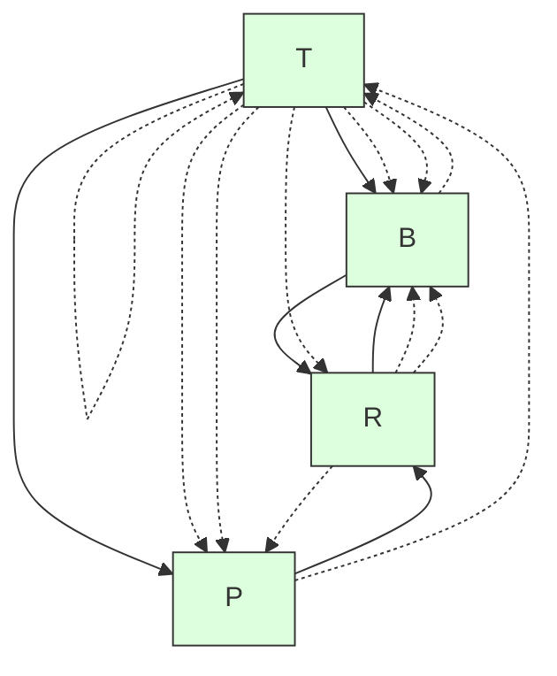

Figure 6.3: Simplified description of randomized studies. T denotes the treatment, P and B the patient’s psychology and some biochemical state, and R indicates whether the patient recovers. The randomization over T removes the influence of any other variable on T , and thus there cannot be any hidden common cause between T and R. We distinguish between two different effects: the placebo effect via P and the biochemical effect via B.

$$
f _ {P} (T = 0, N _ {P}) \neq f _ {P} (T = 1, N _ {P}) = f _ {P} (T = 2, N _ {P}).
$$

In pharmaceutical studies, we are more interested in the biochemical effect than the placebo effect. We therefore restrict the randomization to be supported on placebo and drug of interest, that is, $P ( \tilde { N } _ { T } = 0 ) = 0$ . If we then still see a dependence between treatment T and recovery R, this must be due to a biochemical effect.

The idea of using randomized trials for causal learning was described (using different mathematical language) by Peirce [1883] and Peirce and Jastrow [1885], and later by Neyman [see Splawa-Neyman et al., 1990, for a translated and edited version of the original article] and Fisher [1925]. Most of this work dealt with applications in agriculture.

An early example of a randomized trial was performed by James Lind. During the eighteenth century, Great Britain lost more soldiers from scurvy than from enemy action; vitamin C and its relation to scurvy was still unknown. The Scottish physician James Lind (1716–1794) worked as a surgeon on a ship and reports the trial as follows [cited after Bhatt, 2010]:

On the 20th of May 1747, I selected twelve patients in the scurvy, on board the Salisbury at sea. Their cases were as similar as I could have them. They all in general had putrid gums, the spots and lassitude, with weakness of the knees.... Two were ordered each a quart of cyder a day. Two others took twenty-five drops of elixir vitriol three times a day.... Two others took two spoonfuls of vinegar three times a day.... Two of the worst patients were put on a course of sea-water.... Two others had each two oranges and one lemon given them every day.... The two remaining patients, took ... an electary recommended by a hospital surgeon.... The consequence was, that the most sudden and visible good effects were perceived from the use of oranges and lemons; one of those who had taken them, being at the end of six days fit for duty.

The reader will notice that the trial was not fully randomized, but the historical curiosity makes up for it. □

Example 6.16 (Kidney stones) Table 6.1 shows a famous data set from kidney stone recovery [Charig et al., 1986]. Out of 700 patients, one half was treated with open surgery (treatment $T = a$ , 78% recovery rate) and the other half with percutaneous nephrolithotomy (T = b, 83% recovery rate), a surgical procedure to remove kidney stones by a small puncture wound. If we do not know anything else than the overall recovery rates, and neglect side effects, for example, many people would prefer treatment b if they had to decide. Observing the data in more detail, we can categorize kidney stones into small and large stones. We realize that the open surgery performs better in both categories. How do we deal with this inversion of conclusion?

We first give an intuitive explanation. Larger stones are more severe than small stones (see Table 6.1), and treatment a had to deal with many more of these difficult cases (even though the total number of patients assigned to a and b are equal). This is why treatment a can look worse than $^ b$ on the full population but better in both subgroups. The imbalance in assignment could, for example, arise if the medical doctors expect treatment a to be better than treatment b and therefore assign the difficult cases to treatment a with higher probability.

As an alternative point of view, we propose to use the language of interventions to formulate the precise question we are interested in. And this is not whether treatment $T = a$ or treatment $T = b$ was more successful in this particular study but how the treatments compare when we force all patients to take treatment a or treatment $^ { b , }$ respectively, or we compare the recovery rates, when each patient is assigned randomly to one of the treatments. These three situations concern an intervention distribution that is different from the observational distribution $P _ { \mathbf { X } }$ . In particular, they correspond to $P ^ { \mathfrak { C } ; d o ( T : = a ) } , P ^ { \mathfrak { C } ; d o ( T : = b ) } , \mathrm { o r } P ^ { \mathfrak { C } ; d o \left( T : = \tilde { N } _ { T } \right) }$ . We will compute these intervention distributions in Example 6.37, and we will see why we should prefer treatment a over treatment b. This data set is a famous example of Simpson’s paradox [Simpson, 1951] (Section 9.2). In fact, it is much less a paradox than the result of the influence of confounding, that is, a hidden common cause.

**Table 6.1: A classic example of Simpson’s paradox. The table reports the success rates of two treatments for kidney stones [Bottou et al., 2013, Charig et al., 1986, tables I and II]. Although the overall success rate of treatment b seems better (any bold number is largest in its column), treatment b performs worse than treatment a on both patients with small kidney stones and patients with large kidney stones (see Examples 6.37 and Section 9.2).**

|  | Overall | Patients with small stones | Patients with large stones |
| --- | --- | --- | --- |
| Treatment a: Open surgery | 78% (273/350) | 93% (81/87) | 73% (192/263) |
| Treatment b: Percutaneous nephrolithotomy | 83% (289/350) | 87% (234/270) | 69% (55/80) |

If you perform a significance test on the data (e.g., using a proportion test or $\chi ^ { 2 }$ independence test), it turns out that the difference in methods is not significant at 5% significance level. Note, however, this is not the point of this example. By multiplying each entry in Table 6.1 by a factor of 10, the results would become statistically significant. Also, we concentrate on the recovery R and ignore possible side effects that might influence our decision of treatment, too. □

Intervention variables We now describe an alternative approach to formalize interventions; see, for example, Dawid [2015] or Pearl [2009, Chapter 3.2.2]. One augments the SCM C and therefore its DAG with parentless nodes $I _ { 1 } , I _ { 2 } , \ldots , I _ { d } ,$ , called “intervention variables,” pointing at $X _ { 1 } , \ldots , X _ { d }$ , respectively. For simplicity, we only discuss interventions on single nodes here. Every $I _ { j }$ attains either the value idle or one of the possible values $x _ { j }$ that $X _ { j }$ can attain. Then $I _ { j } = x _ { j }$ means that $X _ { j }$ is set to the value $x _ { j } ,$ , while $I _ { j } = \mathtt { i d l e }$ denotes that $X _ { j }$ has not been intervened on. Accordingly, one replaces the structural assignments

$$
X _ {j} := f _ {j} (\mathbf {P A} _ {j}, N _ {j})
$$

with

$$
X _ {j} := \left\{ \begin{array}{c c} f _ {j} (\mathbf {P A} _ {j}, N _ {j}) & \text { if } I _ {j} = \text { idle } \\ I _ {j} & \text { otherwise } \end{array} \right.
$$

and adds assignments for $I _ { 1 } , \ldots , I _ { d }$ , all of which are determined only by noise variables. After assigning non-zero probability (or probability density) to all possible values of $I _ { j }$ , the intervention probabilities entailed by the original SCM C turn into usual conditional probabilities in the augmented SCM ${ \mathfrak { C } } ^ { * }$ :

$$
P _ {Y} ^ {\mathfrak {C}; d o (X _ {j} := x _ {j})} = P _ {Y | I _ {j} = x _ {j}} ^ {\mathfrak {C} ^ {*}},
$$

see Remark 6.40. Moreover, the statement on whether an intervention on a variable changes the distribution of a certain target variable turns into a usual statistical independence statement.

## 6.4 Counterfactuals

The definition and interpretation of counterfactuals has received a lot of attention in the literature. They deal with the following situation: Assume you are playing poker and as a starting hand you have ♣J and ♣3 (sometimes called a “lumberjack” — tree and a jack); you stop playing (“fold”) because you estimate the probability of winning to be too small and you do not want to lose even more money. Three more cards are dealt face-up to the board (“flop”). They are ♣4, ♣Q, and ♣2. The reaction is a typical counterfactual statement: “If I had stayed in the game, my chances would have been good.” (Five cards of the same suit is the fifthhighest hand and is called a “flush,” there are even chances for a “straight flush,” the second-highest hand.) This statement incorporates the observed data (cards in hand and flop) into the model and then analyzes an intervention distribution (stay in the game), in which the rest of the environment remains unchanged (same cards). Formally, this corresponds to updating the noise distributions of an SCM (by conditioning) and then performing an intervention.

Definition 6.17 (Counterfactuals) Consider an SCM ${ \mathfrak { C } } : = ( \mathbf { S } , P _ { \mathbf { N } } )$ over nodes X. Given some observations x, we define a counterfactual SCM by replacing the distribution of noise variables:

$$
\mathfrak {C} _ {\mathbf {X} = \mathbf {x}} := \left(\mathbf {S}, P _ {\mathbf {N}} ^ {\mathfrak {C} | \mathbf {X} = \mathbf {x}}\right),
$$

where $\begin{array} { r } { P _ { \mathbf { N } } ^ { \mathrm { g c } | \mathbf { X } = \mathbf { x } } : = P _ { \mathbf { N } | \mathbf { X } = \mathbf { x } } . ^ { 7 } } \end{array}$ pendent anymore. Counterfactual statements can now be seen as do-statements in the new counterfactual SCM.

This definition can be generalized such that we observe not the full vector $\mathbf { X } = \mathbf { x }$ but only some of the variables.

Example 6.18 (Computing counterfactuals) Consider the following SCM:

$$
\begin{array}{l} X := N _ {X} \\ Y := X ^ {2} + N _ {Y} \\ Z := 2 \cdot Y + X + N _ {Z} \\ \end{array}
$$

with $N _ { X } , N _ { Y } , N _ { Z } \overset { \mathrm { i i d } } { \sim } \mathrm { U } ( \{ - 5 , - 4 , . . . , 4 , 5 \} )$ ) that are uniformly distributed on the integers between −5 and 5. Now, assume that we observe $( X , Y , Z ) = ( 1 , 2 , 4 )$ . Then $P _ { \bf N } ^ { \mathrm { e } \mathrm { i } \mathrm { { \bf x } = \bf x } }$ puts a point mass on $\left( N _ { X } , N _ { Y } , N _ { Z } \right) = \left( 1 , 1 , - 1 \right)$ because here all noise terms can be uniquely reconstructed from the observations. We therefore have the counterfactual statement (in the context of $( X , Y , Z ) = ( 1 , 2 , 4 ) )$ : “Z would have been 11 had X been 2.” In this book, such a sentence is interpreted as: “Z would have been 11 had X been set to 2.” Mathematically, this means that PC|X=x;do(X:=2)Z $2 . \ '$ $P _ { Z } ^ { \mathfrak { C } | \mathbf { X } = \mathbf { x } ; d o ( X : = 2 ) }$ has a point mass on 11. In the same way, we obtain $^ { 6 6 } Y$ would have been 5, had X been $2 ; \cdot$ and $^ { 6 6 } Z$ would have been 10, had Y been 5.” □

Since the construction of counterfactuals involves several steps, its notation looks quite complicated.8 We hope that the following image provides further clarification.


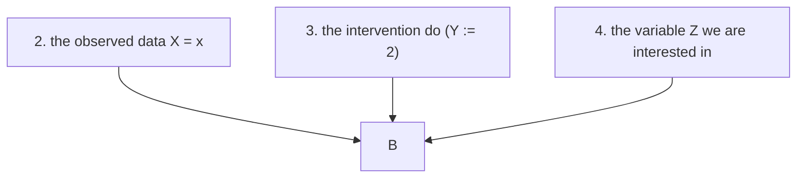

Counterfactual statements depend strongly on the structure of the SCM. Example 6.19 shows two SCMs that induce the same graph, observational distributions, and intervention distributions but entail different counterfactual statements. Later, we will call those SCMs “probabilistically and interventionally equivalent” but not “counterfactually equivalent” (see Definition 6.47).

Example 6.19 Let $N _ { 1 } , N _ { 2 } \sim \mathrm { B e r } ( 0 . 5 )$ , and $N _ { 3 } \sim \mathrm { U } ( \{ 0 , 1 , 2 \} )$ , such that the three variables are jointly independent. That is, $N _ { 1 } , N _ { 2 }$ have a Bernoulli distribution with parameter 0.5 and $N _ { 3 }$ is uniformly distributed on {0, 1, 2}. We define two different SCMs. First consider ${ \mathfrak { C } } _ { A }$ :

$$
\begin{array}{l} X _ {1} := N _ {1} \\ X _ {2} := N _ {2} \\ X _ {3} := \left(1 _ {N _ {3} > 0} \cdot X _ {1} + 1 _ {N _ {3} = 0} \cdot X _ {2}\right) \cdot 1 _ {X _ {1} \neq X _ {2}} + N _ {3} \cdot 1 _ {X _ {1} = X _ {2}}. \\ \end{array}
$$

If $X _ { 1 }$ and $X _ { 2 }$ have different values, depending on $N _ { 3 }$ we either choose $X _ { 3 } = X _ { 1 }$ or $X _ { 3 } = X _ { 2 }$ . Otherwise $X _ { 3 } = N _ { 3 }$ . Now, ${ \mathfrak { C } } _ { B }$ differs from ${ \mathfrak { C } } _ { A }$ only in the latter case:

$$
\begin{array}{l} X _ {1} := N _ {1} \\ X _ {2} := N _ {2} \\ X _ {3} := \left(1 _ {N _ {3} > 0} \cdot X _ {1} + 1 _ {N _ {3} = 0} \cdot X _ {2}\right) \cdot 1 _ {X _ {1} \neq X _ {2}} + (2 - N _ {3}) \cdot 1 _ {X _ {1} = X _ {2}}. \\ \end{array}
$$

Both SCMs entail the same observational distribution; and for any possible intervention they entail the same intervention distributions, $\mathrm { t o o . } ^ { 9 }$ But the two models differ in a counterfactual statement. Suppose, we have made an observation $( X _ { 1 } , X _ { 2 } , X _ { 3 } ) = ( 1 , 0 , 0 )$ and we are interested in the counterfactual question “what would $X _ { 3 }$ have been if $X _ { 1 }$ had been $0 ? ? ^ { \prime }$ From both SCMs, it follows that $N _ { 3 } = 0$ and thus the two SCMs ${ \mathfrak { C } } _ { A }$ and $\mathfrak { C } _ { B }$ “predict” different values for $X _ { 3 }$ under a counterfactual change of $X _ { 1 }$ (namely 0 and 2, respectively). □

The implications from the preceding example are twofold: (1) Both SCMs correspond to the same causal graphical model (see Section 6.5.2), and in this sense, causal graphical models are not rich enough to predict counterfactuals. (2) In Section 6.8, we relate intervention distributions to real-world randomized experiments.

For this example, we cannot use randomized trials or observational data to distinguish between ${ \mathfrak { C } } _ { A }$ or ${ \mathfrak { C } } _ { B }$ . Thus, if we are interested in counterfactual statements, we require additional assumptions that let us distinguish between ${ \mathfrak { C } } _ { A }$ or ${ \mathfrak { C } } _ { B }$ .

We now summarize some properties of counterfactuals.

Remark 6.20 (i) Counterfactual statements are not transitive. In Example 6.18 we found that given the observation $( X , Y , Z ) = ( 1 , 2 , 4 )$ ,

“Y would have been 5, had X been 2,”

$^ { 6 6 } Z$ would have been 10, had Y been $5 , \mathrm { ^ { \circ } }$ and

“Z would have not been 10, had X been $2 . \ '$

Therefore, we cannot simply introduce new variables $\tilde { X }$ and $\tilde { Y }$ , say, and interpret the statement $^ { 6 6 } Y$ would have been 5, had X been $2 ^ { \circ }$ as a logical implication of the form ${ } ^ {  } \tilde { X } = 2 \Rightarrow \tilde { Y } = 5 . { } ^ { , }$ In the preceding example, the non-transitivity is due to the direct link from X to $Z ,$ that is, the existence of a path from X to Z that does not pass Y . A similar counterexample holds for intervention distributions.

(ii) Humans often think in counterfactuals: “I should have taken the train.”, “Do you remember our flight to New York on September 11, 2000? Imagine if we would have taken the flight one year later!” or “We should have invested in CHF in December $2 0 1 4 ! ^ { \dag }$ are only a few examples. Interestingly, this sometimes even concerns situations in which we made optimal decisions — based on the available information. Assume someone offers you \$10, 000 if you predict the result of a coin flip; you guess “heads” and lose. Some people may then think, “Why did I not say ‘tails’?” even though there was no way they could have possibly known the outcome. Roese [1997], Byrne [2007], and others provide the psychological implications of counterfactual thinking. Discussing whether counterfactual statements contain any information that can help us make better decisions in the future is interesting but lies beyond this work; see also Pearl [2009, Chapter 4].

(iii) We do not discuss the role of counterfactuals in our legal system either; it is an interesting question whether and how counterfactuals should be taken as a basis of verdicts (see Example 3.4).

(iv) People have been thinking about counterfactuals for a long time; it is a popular tool of historians. Titus Livius, for example, discusses in 25 BC what would have happened if Alexander the Great had not died in Asia and had attacked Rome [Geradin and Girgenson, 2011]. Paul’s First Epistle to the Corinthians (7:29–7:31) states: “But I say this, brothers: the time is short, that from now on, both those who have wives may be as though they had none; / and those who weep, as though they didn’t weep; and those who rejoice, as though they didn’t rejoice; and those who buy, as though they didn’t possess; / and those who use the world, as not using it to the fullest.”(v) We can think of interventional statements as a mathematical construct for (randomized) experiments. For counterfactual statements, there is no comparable correspondence in the real world. One may speculate that many counterfactual statements cannot be falsified and should therefore not be used in scientific inquiry [cf. Popper, 2002]. Note, however, that sometimes we can make falsifiable counterfactual statements (for example, when the actual value of the noise terms for the respective instance in the sample becomes apparent in retrospect; see Example 3.4). Moreover, the counterfactuals we described above are consequences of positing an SCM. Another target of falsification can therefore also be the SCM rather than a given counterfactual statement. This may or may not be possible, for example, using methods from a scientific domain that the SCM refers to.10

These remarks can be considered as food for thought. We do not go into further depth regarding the interpretation of counterfactual statements and how they should or can be used in court cases, for example. Many of these deliberations lie outside our field of expertise. Instead, we refer to Halpern [2016] who discusses what it means that some event was an “actual cause” of some other event.

## 6.5 Markov Property, Faithfulness, and Causal Minimality

### 6.5.1 Markov Property

The Markov property is a commonly used assumption that forms the basis of graphical models. When a distribution is Markovian with respect to a graph, this graph encodes certain independences in the distribution that we can exploit for efficient computation or data storage. The Markov property exists for both directed and undirected graphs, and the two classes encode different sets of independences [Koller and Friedman, 2009]. In causal inference, however, we are mainly interested in directed graphs. Many introductions to causal inference start by postulating the Markov property. Instead, in this book, we assume the existence of an underlying SCM. We will see in Proposition 6.31 that this is sufficient for proving the Markov property. But first, let us define it.

Definition 6.21 (Markov property) Given a DAG G and a joint distribution $R _ { \mathbf { X } }$ , this distribution is said to satisfy

(i) the global Markov property with respect to the DAG G if

$$
\mathbf {A} \perp \llcorner_ {\mathcal {G}} \mathbf {B} | \mathbf {C} \Rightarrow \mathbf {A} \perp \llcorner \mathbf {B} | \mathbf {C}
$$

for all disjoint vertex sets A, B, C (the symbol ⊥⊥G denotes d-separation — see Definition 6.1),

(ii) the local Markov property with respect to the DAG G if each variable is independent of its non-descendants given its parents, and

(iii) the Markov factorization property with respect to the DAG G if

$$
p (\mathbf {x}) = p (x _ {1}, \dots , x _ {d}) = \prod_ {j = 1} ^ {d} p (x _ {j} | \mathbf {p a} _ {j} ^ {\mathcal {G}}).
$$

For this last property, we have to assume that $P _ { \mathbf { X } }$ has a density p; the factors in the product are referred to as causal Markov kernels describing the conditional distributions PX |PAG . $P _ { X _ { j } | \mathbf { P A } _ { j } ^ { \mathcal { G } } }$

It turns out that as long as the joint distribution has a density,11 these three definitions are equivalent.

Theorem 6.22 (Equivalence of Markov properties) $I f R$ has a density $p ,$ then all Markov properties in Definition 6.21 are equivalent.

The proof can be found as Theorem 3.27 in Lauritzen [1996], for example.

Example 6.23 A distribution $P _ { X _ { 1 } , X _ { 2 } , X _ { 3 } , X _ { 4 } }$ is Markovian with respect to the graph G shown in Figure 6.1 on page 84 if, according to (i) or (ii),

$$
X _ {2} \perp X _ {3} | X _ {1} \quad \text { and } \quad X _ {1} \perp X _ {4} | X _ {2}, X _ {3},
$$

or, according to (iii),

$$
p (x _ {1}, x _ {2}, x _ {3}, x _ {4}) = p (x _ {3}) p (x _ {1} | x _ {3}) p (x _ {2} | x _ {1}) p (x _ {4} | x _ {2}, x _ {3}).
$$

We will see later in Proposition 6.31 that a distribution entailed from an SCM is Markovian with respect to the graph of the SCM. Therefore, these conditions are indeed satisfied for a distribution $P _ { X _ { 1 } , X _ { 2 } , X _ { 3 } , X _ { 4 } }$ entailed by the SCM as in Figure 6.1, left. Intuitively, the statement $X _ { 2 } \perp \perp X _ { 3 } | X _ { 1 }$ is reasonable. Considering the path $X _ { 2 }  X _ { 1 }  X _ { 3 }$ , we have that $X _ { 3 }$ does not provide any new information about $X _ { 2 }$ if we already know $X _ { 1 }$ . In this sense, the graph structure of an SCM leaves some “traces” in the joint distribution. □

The Markov condition relates statements about graph separation to conditional independences. It is possible, however, that different graphs encode the exact same set of conditional independences.

Definition 6.24 (Markov equivalence of graphs) We denote by ${ \mathcal { M } } ( { \mathcal { G } } )$ the set of distributions that are Markovian with respect to ${ \mathcal { G } } .$ :

$\mathcal { M } ( \mathcal { G } ) : = \{ P : P$ satisfies the global (or local) Markov property with respect to $\mathcal { G } \}$ .

Two DAGs $\mathcal { G } _ { 1 }$ and $\mathcal { G } _ { 2 }$ are Markov equivalent if $\mathcal { M } ( \mathcal { G } _ { 1 } ) = \mathcal { M } ( \mathcal { G } _ { 2 } )$ . This is the case if and only $i f \mathcal { G } _ { 1 }$ and $\mathcal { G } _ { 2 }$ satisfy the same set of d-separations, which means the Markov condition entails the same set of (conditional) independence conditions.

The set of all DAGs that are Markov equivalent to some DAG is called Markov equivalence class of G. It can be represented by a completed PDAG that is denoted by $C P D A G ( { \mathcal { G } } ) = ( V , { \mathcal { E } } )$ ; it contains the (directed) edge $( i , j ) \in \mathcal { E }$ if and only if one member of the Markov equivalence class does; see Figure 6.4.

From this definition, determining whether two DAGs are Markov equivalent appears a non-trivial problem. Fortunately, Verma and Pearl [1991] provide a concise characterization, see also Frydenberg [1990].

Lemma 6.25 (Graphical criteria for Markov equivalence) Two DAGs $\mathcal { G } _ { 1 }$ and $\mathcal { G } _ { 2 }$ are Markov equivalent if and only if they have the same skeleton and the same immoralities.

Here, three nodes A, B, and C in a DAG form an immorality or v-structure if $A \right. B \left. C$ and A and C are not directly connected (see Section 6.1).

Figure 6.4 shows an example of two Markov equivalent graphs (center and left). The graphs share the same skeleton and both of them have only one immorality:


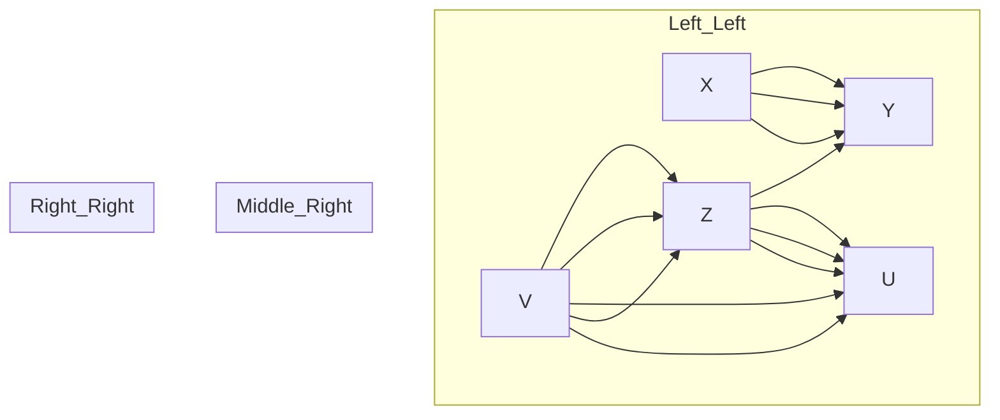

Figure 6.4: Two Markov equivalent DAGs (left and center); these are the only two DAGs in the corresponding Markov equivalence class that can be represented by the CPDAG on the right-hand side.

$X \right. Z \left. V$ . In the corresponding CPDAG (see Figure 6.4, right), not all directed edges are part of an immorality. The edge $Z \to Y$ , for example, is required to avoid a v-structure $Y \right. Z \left. V$ . Furthermore, X → Y prevents the existence of a directed cycle.

We now introduce the graphical concept of a Markov blanket [Pearl, 1988] that becomes relevant when one tries to predict the value of a target variable Y from the observed values of all the other variables. One may then wonder what would be the smallest set of variables whose knowledge renders the remaining ones irrelevant for the prediction task.

Definition 6.26 (Markov blanket) Consider a DAG $\mathcal { G } = ( \mathbf { V } , \mathcal { E } )$ and a target node Y . The Markov blanket of Y is the smallest set M such that

$$
Y \perp_ {\mathcal {G}} \mathbf {V} \backslash (\{Y \} \cup M) \text {   given   } M.
$$

If $P _ { \mathbf { X } }$ is Markovian with respect to $\mathcal { G }$ , then

$$
Y \perp \mathbf {V} \backslash (\{Y \} \cup M) \text {   given   } M.
$$

In other words, given M, the other variables do not provide any further information about Y . In an idealized regression setting, we thus only need to include the variables in M for predicting Y . This does not imply that in a finite sample setting, the other variables are useless. If the dependence from Y on its Markov blanket M is not well aligned with the prior or function class used by the given regression method, adding variables outside M may improve the prediction of Y .

For DAGs, we know what the Markov blanket looks like. It contains not only the parents, but also children and parents of children [Pearl, 1988].

Proposition 6.27 (Markov blanket) Consider a DAG G and a target node Y . Then, the Markov blanket M of Y includes its parents, its children, and the parents of its children

$$
M = \mathbf {P A} _ {Y} \cup \mathbf {C H} _ {Y} \cup \mathbf {P A} _ {\mathbf {C H} _ {Y}}.
$$

So far, we have discussed the Markov property as relating distributions and graphs. Now, we would like to discuss some of its causal implications. The Markov property can be used to justify Reichenbach’s common cause principle (Principle 1.1). Recall that it states that when the random variables X and Y are dependent, there must be a “causal explanation” for this dependence:

(i) X is (possibly indirectly) causing Y , or  
(ii) Y is (possibly indirectly) causing X , or  
(iii) there is a (possibly unobserved) common cause Z that (possibly indirectly) causes both X and Y .

Here, we have not further specified the meaning of the word “causing.” The following proposition justifies Reichenbach’s principle with respect to a weak notion of “causing,” namely the existence of a directed path.

Proposition 6.28 (Reichenbach’s common cause principle) Assume that any pair of variables X and Y can be embedded into a larger system in the following sense. There exists a correct SCM over the collection X of random variables that contains X and Y with graph G. Then Reichenbach’s common cause principle follows from the Markov property. If X and Y are (unconditionally) dependent, then there is

(i) either a directed path from X to Y , or  
(ii) from Y to X , or  
(iii) there is a node Z with a directed path from Z to X and from Z to Y .

Proof. Due to the Markov property, the dependence implies that G contains an unblocked path between X and Y . This path cannot contain a collider, for otherwise it would be blocked by the empty set. The statement follows since any path between X and Y without collider must be of the form $X \to \ldots \to Y , X  \ldots  Y .$ or $X \left. . . . \left. Z \right. . . . \right. Y$ . 

Remark 6.29 (Selection bias) In Reichenbach’s principle, we start with two dependent random variables and obtain a valid statement. In real applications, however, it might be that we have implicitly conditioned on a third variable (selection bias). As Example 6.30 shows, this may lead to a dependence between X and Y , although none of the three conditions hold (see also the discussion in the last paragraph of Section 1.3). □

Example 6.30 (Berkson’s paradox) The following example “Why are handsome men such jerks?” is taken from Ellenberg [2014] and is an instance of Berkson’s paradox [Berkson, 1946]. Let us assume that whether men are in a relationship $( R = 1 )$ is determined only by whether they are handsome $( H = 1 )$ and whether they are friendly $( F = 1 )$ . More precisely, assume that the correct SCM has the form:

$$
H := N _ {H},
$$

$$
F := N _ {F},
$$

$$
R := \min (H, F) \oplus N _ {R},
$$


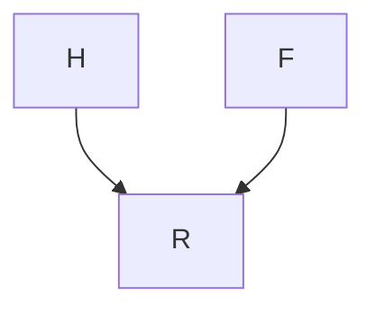

where $N _ { H } , N _ { F } \overset { \mathrm { i i d } } { \sim }$ Ber(0.5) and $N _ { R } \sim \mathrm { B e r } ( 0 . 1 )$ . The symbol ⊕ denotes addition modulo 2. In this model, a man is very likely to be in a relationship if he is handsome and friendly. Otherwise, he is likely to be single. As we can see from the SCM, H and F are assumed to be independent. If you consider men, however, that are not in a relationship, that is, you condition on $R = 0$ , the characteristics, whether a man is friendly or handsome, become anti-correlated. If someone is handsome, he is more likely to be unfriendly (otherwise he would be in a relationship). We have that

$$
F \not \perp H | R = 0
$$

and therefore F is not independent of H given R.

As we have mentioned before, Pearl [2009] shows in Theorem 1.4.1 that the law $R _ { \mathbf { X } }$ induced by an SCM is Markovian with respect to its graph [see also Verma and Pearl, 1988].

Proposition 6.31 (SCMs imply Markov property) Assume that $P _ { \mathbf { X } }$ is induced by an SCM with graph G. Then, PX is Markovian with respect to ${ \mathcal { G } } .$ .

The assumption that a distribution is Markovian with respect to the causal graph is sometimes called the causal Markov condition; this requires the notion of a causal graph. For us, causal graphs are induced by the underlying SCM. The concept of causal graphical models, on the other hand, uses them as a starting point for causal inference.

### 6.5.2 Causal Graphical Models

We will see in Section 6.6 that for defining intervention distributions, it usually suffices to have knowledge of the observational distribution and the graph structure. We therefore define a causal graphical model as a pair that consists of a graph and an observational distribution such that the distribution is Markovian with respect to the graph (causal Markov condition). There is a subtle technicality, however. Formally, we need to have access to the full conditionals. If $p ( x _ { 2 } | x _ { 1 } = 3 )$ is not defined, for example, because $p ( x _ { 1 } = 3 ) = 0$ , we may not be able to define $p ^ { d o ( X _ { 1 } : = 3 ) } ( x _ { 2 } )$ . This motivates the following definition:Definition 6.32 (Causal graphical model) A causal graphical model over random variables $\mathbf { X } = \left( X _ { 1 } , \ldots , X _ { d } \right)$ contains a graph $\mathcal { G }$ and a collection of functions $f _ { j } ( x _ { j } , x _ { \mathbf { P A } _ { j } ^ { \mathcal { G } } } )$ that integrate to 1:

$$
\int f _ {j} (x _ {j}, x _ {\mathbf {P A} _ {j} ^ {\mathcal {G}}}) d x _ {j} = 1.
$$

These functions induce a distribution $P _ { \mathbf { X } }$ over X via

$$
p (x _ {1}, \ldots , x _ {d}) = \prod_ {j = 1} ^ {d} f _ {j} (x _ {j}, x _ {\mathbf {P A} _ {j} ^ {\mathcal {G}}}),
$$

and thus play the role of conditionals: $f _ { j } ( x _ { j } , x _ { \mathbf { p } _ { \mathbf { A } _ { i } ^ { \mathcal { G } } } } ) = p ( x _ { j } | x _ { \mathbf { p } _ { \mathbf { A } _ { i } ^ { \mathcal { G } } } } )$ . A causal graphical model induces intervention distribution according to Equations (6.8) and (6.9) in Section 6.6. In the most general form, we can define

$$
p ^ {d o \left(X _ {k} := q (\cdot | x _ {\widetilde {\mathbf {P A}} _ {k}})\right)} (x _ {1}, \ldots , x _ {d}) = \prod_ {j \neq k} f _ {j} (x _ {j}, x _ {\widetilde {\mathbf {P A}} _ {j} ^ {\mathcal {G}}})   q (\cdot | x _ {\widetilde {\mathbf {P A}} _ {k}}),
$$

with $q ( \cdot | x _ { \widetilde { \mathbf { P A } _ { k } } } )$ integrating to 1 and the new parents not leading to a cycle.

If a distribution $P _ { \mathbf { X } }$ over X is Markovian with respect to a graph $\mathcal { G }$ and allows for a strictly positive, continuous density $p ,$ , the pair $( R _ { { \bf X } } , \mathcal { G } )$ defines a causal graphical model by $f _ { j } ( \boldsymbol { x } _ { j } , \boldsymbol { x } _ { \mathbf { p } _ { \mathbf { A } _ { i } ^ { \mathcal { G } } } } ) : = p ( \boldsymbol { x } _ { j } | \boldsymbol { x } _ { \mathbf { p } _ { \mathbf { A } _ { i } ^ { \mathcal { G } } } } )$ .

Why do we primarily work with SCMs and not just with graphs and the Markov condition, that is, causal graphical models? Formally, SCMs contain strictly more information than their corresponding graph and law (e.g., counterfactual statements) and hence also more information than the family of all intervention distributions together with the observational distribution. It is debatable, though, whether this additional information is useful. Maybe more importantly, restricting the function class in SCMs can lead to identifiability of the causal structure (see Sections 4.1.3–4.1.6 and 7.1.2). Those assumptions are easier to phrase in the language of SCMs than in the language of graphical models.

### 6.5.3 Faithfulness and Causal Minimality

In the previous subsection, we discussed the Markov assumption, which enables us to read off independences from the graph structure. Faithfulness allows us to infer dependences from the graph structure.

Definition 6.33 (Faithfulness and causal minimality) Consider a distribution $P _ { \mathbf { X } }$ and a DAG G.

(i) $P _ { \mathbf { X } }$ is faithful to the DAG G if

$$
\mathbf {A} \perp \mathbf {B} | \mathbf {C} \Rightarrow \mathbf {A} \perp_ {\mathcal {G}} \mathbf {B} | \mathbf {C}
$$

for all disjoint vertex sets A, B, C.

(ii) A distribution satisfies causal minimality with respect to $\mathcal { G }$ if it is Markovian with respect to ${ \mathcal { G } } ,$ but not to any proper subgraph of G.

Part (i) posits an implication that is the opposite of the global Markov condition

$$
\mathbf {A} \perp \llcorner_ {\mathcal {G}} \mathbf {B} | \mathbf {C} \Rightarrow \mathbf {A} \perp \llcorner \mathbf {B} | \mathbf {C},
$$

see Definition 6.21. Faithfulness is not very intuitive at first glance. We now give an example of a distribution that is Markovian but not faithful with respect to a given DAG $\mathcal { G } _ { 1 }$ . This is achieved by making two paths cancel each other and creating an independence that is not implied by the graph structure.

Example 6.34 (Violation of faithfulness) Consider the following figure.


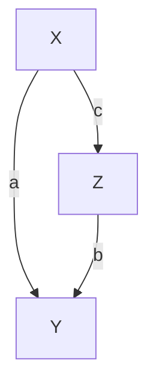

$\mathcal { G } _ { 1 }$


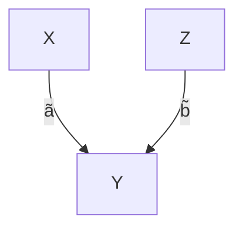

$\mathcal { G } _ { 2 }$


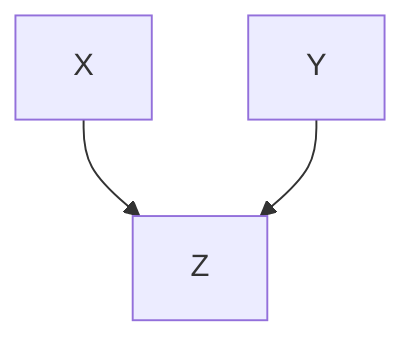

H

We first look at a linear Gaussian SCM that corresponds to the left graph $\mathcal { G } _ { 1 }$ .

$$
X := N _ {X},
$$

$$
Y := a X + N _ {Y},
$$

$$
Z := b Y + c X + N _ {Z},
$$

with normally distributed noise variables $N _ { X } \sim \mathcal { N } ( 0 , \sigma _ { X } ^ { 2 } ) , N _ { Y } \sim \mathcal { N } ( 0 , \sigma _ { Y } ^ { 2 } )$ , and $N _ { Z } \sim \mathcal { N } ( 0 , \sigma _ { Z } ^ { 2 } )$ that are jointly independent. This is an example of a linear Gaussian SCM with graph $\mathcal { G } _ { 1 }$ (see Definition 6.2). Now, if

$$
a \cdot b + c = 0, \tag {6.6}
$$

the distribution is not faithful with respect to $\mathcal { G } _ { 1 }$ since we obtain $X \perp \perp Z .$ , which is not implied by the graph structure.12 The reader can easily verify that there is an SCM with DAG $\mathcal { G } _ { 2 }$ inducing the same distribution. □

To obtain the extra independence in the preceding example, we had to “tune” the coefficients such that the two paths cancel each other out in (6.6). Spirtes et al. [2000, Theorem 3.2] show for linear models that this happens with zero probability if we assume that the coefficients are drawn randomly from positive densities.

The distribution from Example 6.34 is faithful with respect to $\mathcal { G } _ { 2 }$ , but not with respect to $\mathcal { G } _ { 1 }$ . Nevertheless, for both models, causal minimality is satisfied if none of the parameters vanishes. In other words, the distribution is not Markovian to any proper subgraph of $\mathcal { G } _ { 1 }$ or $\mathcal { G } _ { 2 }$ since removing any edge would correspond to a new (conditional) independence that does not hold in the distribution; note that $\mathcal { G } _ { 2 }$ is not a proper subgraph of $\mathcal { G } _ { 1 }$ . It is a proper subgraph of $\mathcal { H } ,$ , however, and therefore, the distribution does not satisfy causal minimality with respect to $\mathcal { H } .$ In general, causal minimality is weaker than faithfulness.

Proposition 6.35 (Faithfulness implies causal minimality) $I f R$ is faithful and Markovian with respect to ${ \mathcal { G } } ,$ then causal minimality is satisfied.

Proof. The argument is as follows: If $P _ { \mathbf { X } }$ is Markovian with respect to a proper subgraph $\tilde { \mathcal { G } }$ of ${ \mathcal { G } } _ { : }$ , there are two nodes that are directly connected in $\mathcal { G }$ but not in $\tilde { \mathcal { G } }$ . Thus, they can be d-separated in $\tilde { \mathcal { G } }$ but not in $\mathcal { G }$ (see Problem 6.62). The Markov condition implies the corresponding conditional independence statement in $P _ { \mathbf { X } }$ , and thus $R _ { \mathbf { X } }$ cannot be faithful with respect to $\mathcal { G }$ . 

The following formulation is equivalent to causal minimality and hopefully is of further help to understand the condition. A distribution is minimal with respect to $\mathcal { G }$ if and only if there is no node that is conditionally independent of any of its parents, given the remaining parents. In some sense, all the parents are “active.”Proposition 6.36 (Equivalence of causal minimality) Consider the random vector $\mathbf { X } = \left( X _ { 1 } , \ldots , X _ { d } \right)$ and assume that the joint distribution has a density with $r e \mathrm { - }$ spect to a product measure. Suppose that $R _ { \mathbf { X } }$ is Markovian with respect to $\mathcal { G }$ . Then $P _ { \mathbf { X } }$ satisfies causal minimality with respect to $\mathcal { G }$ if and only $i f \forall X _ { j } \forall Y \in \mathbf { P A } _ { j } ^ { \mathcal { G } }$ we have that $X _ { j } \ X \ Y | Y | \mathbf { P A } _ { j } ^ { \mathcal { G } } \setminus \{ Y \}$ .

Proof. See Appendix C.6.

We have seen that while faithfulness is a strong assumption that links conditional independence statements with causal semantics, causal minimality is a much weaker condition. Suppose we are given a causal graphical model, for example, in which causal minimality is violated. Then, one of the edges is “inactive” in the notion of Proposition 6.36. If we remove this edge, the two models do not need to be counterfactually or interventionally equivalent in the sense of Definition 6.47. They are interventionally equivalent, however, if all densities are strictly positive (or if we only allow for interventions on $X _ { k }$ that are supported on a subset of the support of $X _ { k } )$ ; see Problem 6.58. Then, causal minimality could be interpreted as the convention to avoid redundancies in the description of an interventional model. In most model classes, identifiability from observational data is impossible to obtain without causal minimality. We cannot distinguish between $Y : = f ( X ) + N _ { Y }$ and $Y : = c + N _ { Y }$ , for example, if $f$ is allowed to differ from $c$ only outside the support of $X ;$ see also Remark 6.6 and Proposition 6.49.

## 6.6 Calculating Intervention Distributions by Covariate Adjustment

In this section we will make use of a somewhat trivial but very powerful invariance statement. Given an SCM C, and writing $p a ( j ) : = \mathbf { P A } _ { j } ^ { \mathcal { G } }$ , we have

$$
p ^ {\tilde {\mathfrak {C}}} \left(x _ {j} \mid x _ {p a (j)}\right) = p ^ {\mathfrak {C}} \left(x _ {j} \mid x _ {p a (j)}\right) \tag {6.7}
$$

for any SCM $\tilde { \mathfrak { C } }$ that is constructed from C by intervening on (some) $X _ { k }$ but not on $X _ { j }$ . Equation (6.7) shows that causal relationships are autonomous under interventions; this property is therefore sometimes called “autonomy.” If we intervene on a variable, then the other mechanisms remain invariant (see the left box in Figure 2.2).

We deduce a formula from (6.7) that became known under three different names: truncated factorization [Pearl, 1993], G-computation formula [Robins, 1986], and manipulation theorem [Spirtes et al., 2000]. Its importance stems from the fact that it allows us to compute statements about intervention distributions even though we have never seen data from it.

Consider an SCM C with structural assignments

$$
X _ {j} := f _ {j} (X _ {p a (j)}, N _ {j}), \quad j = 1, \dots , d,
$$

and density $p ^ { \mathfrak { C } }$ . Because of the Markov property, we have13

$$
p ^ {\mathfrak {C}} (x _ {1}, \dots , x _ {d}) = \prod_ {j = 1} ^ {d} p ^ {\mathfrak {C}} (x _ {j} | x _ {p a (j)}).
$$

Now consider the SCM $\tilde { \mathfrak { C } }$ that evolves from C after do $\left( X _ { k } : = \tilde { N } _ { k } \right)$ , where $\tilde { N } _ { k }$ allows for the density ${ \tilde { p } } .$ Again, it follows from the Markov assumption that

$$
\begin{array}{l} p ^ {\mathfrak {C}; d o \left(X _ {k} := \tilde {N} _ {k}\right)} \left(x _ {1}, \dots , x _ {d}\right) = \prod_ {j \neq k} p ^ {\mathfrak {C}; d o \left(X _ {k} := \tilde {N} _ {k}\right)} \left(x _ {j} \mid x _ {p a (j)}\right) \cdot p ^ {\mathfrak {C}; d o \left(X _ {k} := \tilde {N} _ {k}\right)} \left(x _ {k}\right) \\ = \prod_ {j \neq k} p ^ {\mathfrak {C}} (x _ {j} | x _ {p a (j)}) \tilde {p} (x _ {k}). \tag {6.8} \\ \end{array}
$$

In the last step, we make use of the powerful invariance (6.7). Equation (6.8) allows us to compute an interventional statement (left-hand side) from observational quantities (right-hand side). As a special case, we obtain

$$
p ^ {\mathfrak {C}; d o (X _ {k} := a)} \left(x _ {1}, \dots , x _ {d}\right) = \left\{ \begin{array}{c l} \prod_ {j \neq k} p ^ {\mathfrak {C}} \left(x _ {j} \mid x _ {p a (j)}\right) & \text { if } x _ {k} = a \\ 0 & \text { otherwise. } \end{array} \right. \tag {6.9}
$$

Usually, conditioning and intervening with do () are different operations (see the discussion after Example 6.10). We are now able to show that these operations become identical for variables that do not have any parents. Without loss of generality, let us assume that $X _ { 1 }$ is such a source node. We then have

$$
\begin{array}{l} p ^ {\mathfrak {C}} \left(x _ {2}, \dots , x _ {d} \mid x _ {1} = a\right) = \frac {p \left(x _ {1} = a\right) \prod_ {j = 2} ^ {d} p ^ {\mathfrak {C}} \left(x _ {j} \mid x _ {p a (j)}\right)}{p \left(x _ {1} = a\right)} \\ = p ^ {\mathfrak {C}; d o (X _ {1} := a)} \left(x _ {2}, \dots , x _ {d}\right). \tag {6.10} \\ \end{array}
$$

Equations (6.8) and (6.9) are widely applicable but sometimes a bit cumbersome to use. We will now learn about some practical alternatives. Therefore, we first recall Example 6.16 (kidney stones) that we will then be able to generalize.

Example 6.37 (Kidney stones, continued) Assume that the true underlying SCM allows for the graph


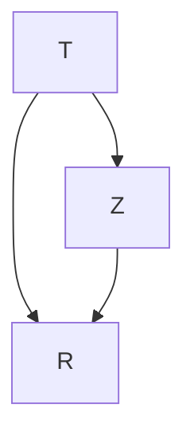

Here, Z is the size of the stone, T the treatment, and R the recovery (all binary). We see that the recovery is influenced by the treatment and the size of the stone. The treatment itself depends on the size, too. A large proportion of difficult cases was assigned to treatment A. Consider further the two SCMs ${ \mathfrak { C } } _ { A }$ and ${ \mathfrak { C } } _ { B }$ that we obtain after replacing the structural assignment for T with $T : = A$ and $T : = B ,$ , respectively. Let us call the corresponding resulting probability distributions $P ^ { \mathfrak { C } _ { A } }$ and $P ^ { \mathfrak { C } _ { B } }$ . Given that we are diagnosed with a kidney stone without knowing its size, we should base our choice of treatment on a comparison between

$$
\mathbb {E} ^ {\mathfrak {C} _ {A}} R = P ^ {\mathfrak {C} _ {A}} (R = 1) = P ^ {\mathfrak {C}; d o (T := A)} (R = 1)
$$

and

$$
\mathbb {E} ^ {\mathfrak {C} _ {B}} R = P ^ {\mathfrak {C} _ {B}} (R = 1) = P ^ {\mathfrak {C}; d o (T := B)} (R = 1).
$$

Given that we have observed data from C, how can we estimate these quantities? Consider the following computation:

$$
\begin{array}{l} P ^ {\mathfrak {C} _ {A}} (R = 1) \quad = \quad \sum_ {z = 0} ^ {1} P ^ {\mathfrak {C} _ {A}} (R = 1, T = A, Z = z) \\ = \sum_ {z = 0} ^ {1} P ^ {\mathfrak {C} _ {A}} (R = 1 | T = A, Z = z) P ^ {\mathfrak {C} _ {A}} (T = A, Z = z) \\ = \sum_ {z = 0} ^ {1} P ^ {\mathfrak {C} _ {A}} (R = 1 | T = A, Z = z) P ^ {\mathfrak {C} _ {A}} (Z = z) \\ \stackrel {(6. 7)} {=} \sum_ {z = 0} ^ {1} P ^ {\mathfrak {C}} (R = 1   |   T = A, Z = z)   P ^ {\mathfrak {C}} (Z = z). \tag {6.11} \\ \end{array}
$$

The last step contains the key idea. Again, we have made use of the invariance (6.7). We can estimate $P ^ { \mathfrak { C } _ { A } } ( R = 1 )$ from the empirical data shown in Table 6.1 and obtain

$$
P ^ {\mathfrak {C} _ {A}} (R = 1) \approx 0. 9 3 \cdot \frac {3 5 7}{7 0 0} + 0. 7 3 \cdot \frac {3 4 3}{7 0 0} = 0. 8 3 2.
$$

Analogously, we obtain

$$
P ^ {\mathfrak {C} _ {B}} (R = 1) \approx 0. 8 7 \cdot \frac {3 5 7}{7 0 0} + 0. 6 9 \cdot \frac {3 4 3}{7 0 0} \approx 0. 7 8 2,
$$

and we conclude that we would rather go for treatment A. (As stated before, we ignore the question of statistical significance, which seems justified if we need to decide between A and B.) The quantity

$$
P ^ {\mathfrak {C} _ {A}} (R = 1) - P ^ {\mathfrak {C} _ {B}} (R = 1) \approx 0. 8 3 2 - 0. 7 8 2 \tag {6.12}
$$

is sometimes called the average causal effect (ACE) for binary treatments. It is important to realize that this is different from simple conditioning:

$$
P ^ {\mathfrak {C}} (R = 1 \mid T = A) - P ^ {\mathfrak {C}} (R = 1 \mid T = B) = 0. 7 8 - 0. 8 3,
$$

which, in this example, has even the opposite sign of the ACE.

This three-node example nicely highlights the difference between intervening and conditioning. In terms of densities, it reads:

$$
p ^ {\mathfrak {C}; d o (T := t)} (r) = \sum_ {z} p ^ {\mathfrak {C}} (r | z, t) p ^ {\mathfrak {C}} (z) \neq \sum_ {z} p ^ {\mathfrak {C}} (r | z, t) p ^ {\mathfrak {C}} (z | t) = p ^ {\mathfrak {C}} (r | t).
$$

Equation (6.11) is called “adjusting” for the variable Z. It denotes an important concept that is often used in practice and that we formally define in Definition 6.38. It once more allows us to compute intervention statements from observed quantities. Note that the derivation of the adjustment formula (6.11) is sometimes based on the truncated factorization (6.9), but we will see in Proposition 6.41 that the alternative computation using the invariance (6.11) nicely carries over to more complicated settings.

Definition 6.38 (Valid adjustment set) Consider an SCM C over nodes V and let $Y \not \in \mathbf { P } \mathbf { A } _ { X }$ (otherwise we have $p ^ { \mathfrak { C } ; d o ( X : = x ) } ( y ) = p ^ { \mathfrak { C } } ( y ) )$ . We call a set $\mathbf { Z } \subseteq \mathbf { V } \setminus \{ X , Y \}$ a valid adjustment set for the ordered pair (X,Y ) if

$$
p ^ {\mathfrak {C}; d o (X := x)} (y) = \sum_ {\mathbf {z}} p ^ {\mathfrak {C}} (y | x, \mathbf {z}) p ^ {\mathfrak {C}} (\mathbf {z}). \tag {6.13}
$$

Here, the sum (could also be an integral) is over the range of Z, that is, over all values z that Z can take.

In Example 6.37, $\mathbf { Z } = \{ Z \}$ is a valid adjustment set for $( T , R )$ . Adjusting for Z was necessary to compute the average causal effect. We have seen that simple conditioning led to false conclusions. In other words, the empty set was not a valid adjustment set. In such a case, we say that the causal effect from T to R is confounded.

Definition 6.39 (Confounding) Consider an SCM C over nodes V with a directed path from X to $Y , X , Y \in \mathbf { V } .$ . The causal effect from X to Y is called confounded if

$$
p ^ {\mathfrak {C}; d o (X := x)} (y) \neq p ^ {\mathfrak {C}} (y | x). \tag {6.14}
$$

Otherwise, the causal effect is called “unconfounded.”

It is sometimes believed that one should make the adjustment set as large as possible to reduce the influence of potential confounders. This is, however, not always a good idea as demonstrated by Berkson’s paradox [Berkson, 1946] in Example 6.30. It shows that not all sets are valid adjustment sets and that sometimes it is better to not include a covariate in the adjustment set. Let us try to investigate which sets we can use for adjusting. We use the same idea as in Example 6.37 and write (for any set Z)

$$
\begin{array}{l} p ^ {\mathfrak {C}; d o (X := x)} (y) = \sum_ {\mathbf {z}} p ^ {\mathfrak {C}; d o (X := x)} (y, \mathbf {z}) \\ = \sum_ {\mathbf {z}} p ^ {\mathfrak {C}; d o (X := x)} (y | x, \mathbf {z}) p ^ {\mathfrak {C}; d o (X := x)} (\mathbf {z}). \\ \end{array}
$$

If we have

$$
p ^ {\mathfrak {C}; d o (X := x)} (y | x, \mathbf {z}) = p ^ {\mathfrak {C}} (y | x, \mathbf {z}) \text {   and   } p ^ {\mathfrak {C}; d o (X := x)} (\mathbf {z}) = p ^ {\mathfrak {C}} (\mathbf {z}), \tag {6.15}
$$

it follows (as before) that Z is a valid adjustment set. Property (6.15) states that the conditionals remain the same even after intervening on X; we say that they are invariant. We thus need to address the question of which conditionals remain invariant under the intervention do $( X : = x )$ .

Remark 6.40 (Characterization of invariant conditionals) Consider an SCM C with structural assignments

$$
X _ {j} := f _ {j} (\mathbf {P A} _ {j}, N _ {j})
$$

and an intervention $d o \left( X _ { k } : = x _ { k } \right)$ . Analogously to what is done in Pearl [2009, Chapter 3.2.2], for example, we can now construct a new SCM ${ \mathfrak { C } } ^ { * }$ that equals C but has one more variable I that indicates whether the intervention took place or not (see also the paragraph “Intervention Variables” in Section 6.3 on page 95). More precisely, I is a parent of $X _ { k }$ and does not have any other neighbors. The corresponding structural assignments are

$$
\begin{array}{l} I := N _ {I} \\ X _ {j} := f _ {j} \left(\mathbf {P A} _ {j}, N _ {j}\right) \quad \text { for } j \neq k \\ X _ {k} := \left\{ \begin{array}{c l} f _ {k} (\mathbf {P A} _ {k}, N _ {k}) & \text {if I = 0} \\ x _ {k} & \text {otherwise} \end{array} \right., \\ \end{array}
$$

where $N _ { I }$ has a Bernoulli distribution with $P ( I = 0 ) = P ( I = 1 ) = 0 . 5$ , for example (other distributions work, too). Thus, $I = 0$ corresponds to the observational setting and $I = 1$ to the interventional setting. More precisely, using Equation (6.10), we obtain

$$
\begin{array}{l} p ^ {\mathfrak {C} ^ {*}} (x _ {1}, \dots , x _ {d} | I = 0) = p ^ {\mathfrak {C} ^ {*}; d o (I := 0)} (x _ {1}, \dots , x _ {d}) \\ = p ^ {\mathfrak {C}} \left(x _ {1}, \dots , x _ {d}\right) \\ \end{array}
$$

and similarly

$$
p ^ {\mathfrak {C} ^ {*}} (x _ {1}, \dots , x _ {d} | I = 1) = p ^ {\mathfrak {C}; d o (X _ {k} := x _ {k})} (x _ {1}, \dots , x _ {d}). \tag {6.16}
$$

Using the Markov condition for ${ \mathfrak { C } } ^ { * }$ , it thus follows for variables A and a set of variables B that

$$
\begin{array}{l} A \perp \llcorner_ {\mathcal {G} ^ {*}} I | \mathbf {B} \quad \Longrightarrow \quad p ^ {\mathfrak {C} ^ {*}} (a | \mathbf {b}, I = 0) = p ^ {\mathfrak {C} ^ {*}} (a | \mathbf {b}, I = 1) \\ \implies p ^ {\mathfrak {C}} (a | \mathbf {b}) = p ^ {\mathfrak {C}; d o (X _ {k} := x _ {k})} (a | \mathbf {b}). \\ \end{array}
$$

The right-hand side states that the distribution $P _ { A | \mathbf { B } }$ of the conditional A given B remains invariant under an intervention on $X _ { k }$ . □

We are now able to continue the argument from before. Equation (6.15) is satisfied for sets Z, for which we have

$$
Y \perp \mathcal {G} ^ {*} I \mid X, \mathbf {Z} \quad \text { and } \quad \mathbf {Z} \perp \mathcal {G} ^ {*} I. \tag {6.17}
$$

The subscript $\mathcal { G } ^ { * }$ means that the d-separation statement is required to hold in $\mathcal { G } ^ { * }$ . Our deliberation immediately implies the first two statements of the following proposition:


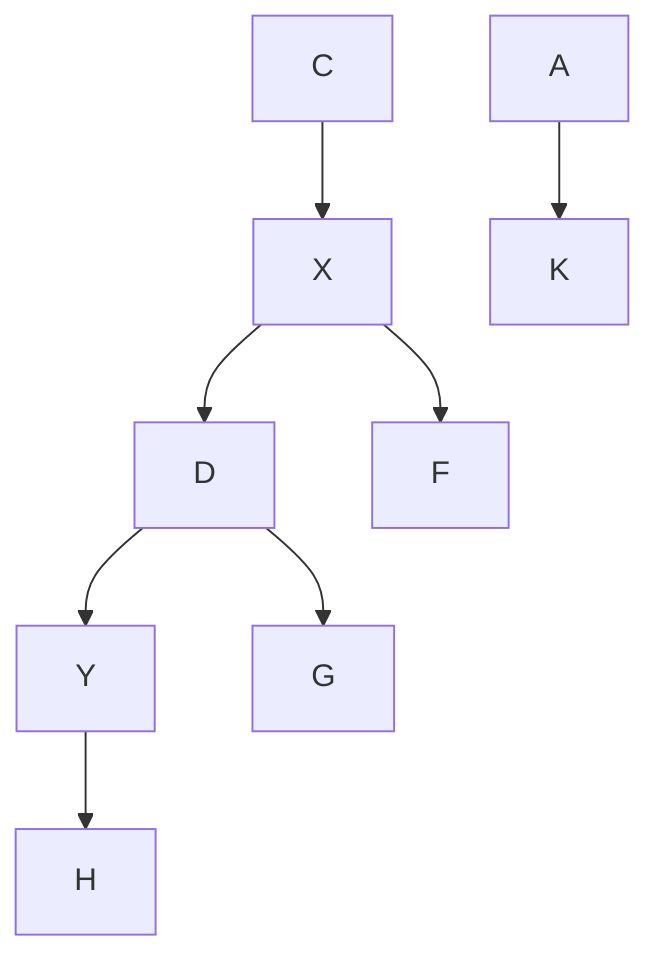

Figure 6.5: Only the path $X  A  K  Y$ is a “backdoor path” from X to Y . The set $\mathbf { Z } = \{ K \}$ satisfies the backdoor criterion (see Proposition 6.41 (ii)); but ${ \bf Z } = \{ F , C , K \}$ is also a valid adjustment set for $( X , Y )$ ; see Proposition 6.41 (iii).

Proposition 6.41 (Valid adjustment sets) Consider an SCM over variables X with X , $Y \in \mathbf { X }$ and Y ∈/ $\mathbf { P A } _ { X }$ . Then, the following three statements are true.

(i) “parent adjustment”:

$$
\mathbf {Z} := \mathbf {P A} _ {X}
$$

is a valid adjustment set for (X,Y ).

(ii) “backdoor criterion”: Any $\mathbf { Z } \subseteq \mathbf { X } \setminus \{ X , Y \}$ with

• Z contains no descendant of X AND  
Z blocks all paths from X to Y entering X through the backdoor (X ← . . . , see Figure 6.5)

is a valid adjustment set for (X,Y ).

(iii) “toward necessity”: Any $\mathbf { Z } \subseteq \mathbf { X } \setminus \{ X , Y \}$ with

Z contains no descendant of any node on a directed path from X to Y (except for descendants of X that are not on a directed path from X to Y ) AND

• Z blocks all non-directed paths from X to Y

is a valid adjustment set for (X,Y ).

Only the third statement [Shpitser et al., 2010, Perkovic et al., 2015] requires some explanation. Let us start with a valid adjustment set Z, for example, obtained via the backdoor criterion. We can then add any node $Z _ { 0 }$ to Z that satisfiesZ0 ⊥⊥ Y | X, Z because then

$$
\begin{array}{l} \sum_ {\mathbf {z}, z _ {0}} p (y \mid x, \mathbf {z}, z _ {0}) p (\mathbf {z}, z _ {0}) = \sum_ {\mathbf {z}} p (y \mid x, \mathbf {z}) \sum_ {z _ {0}} p (\mathbf {z}, z _ {0}) \\ = \sum_ {\mathbf {z}} p (y | x, \mathbf {z}) p (\mathbf {z}). \\ \end{array}
$$

In fact, Proposition 6.41 (iii) characterizes all valid adjustment sets [Shpitser et al., 2010].

Example 6.42 (Adjustment in linear Gaussian systems) Consider an SCM C over variables V with $\{ X , Y \} , \mathbf { Z } \subseteq \mathbf { V }$ . Sometimes, we want to summarize a causal effect from X to Y by a single real number instead of looking at $p ^ { \mathfrak { C } ; d o ( X : = x ) } ( y )$ for all x. We have seen an example in the case of binary treatments X (see Equation (6.12)). But what can be done in the case of continuous random variables? As a first approximation we may look at the expectation of this distribution and then take the derivative with respect to x:

$$
\frac {\partial}{\partial x} \mathbb {E} ^ {\mathfrak {C}; d o (X := x)} [ Y ]. \tag {6.18}
$$

In general, this is still a function of x. In linear Gaussian systems, however, this function turns out to be constant. Assume that Z is a valid adjustment set for $( X , Y )$ . If V has a Gaussian distribution, then the conditional $Y \left| X = x , \mathbf { Z } = \mathbf { z } \right.$ follows a Gaussian distribution, too; its mean is

$$
\mathbb {E} [ Y \mid X = x, \mathbf {Z} = \mathbf {z} ] = a x + \mathbf {b} ^ {t} \mathbf {z} \tag {6.19}
$$

for some a and b. It follows from (6.13) (see Problem 6.63) that

$$
\frac {\partial}{\partial x} \mathbb {E} ^ {\mathfrak {C}; d o (X := x)} [ Y ] = a. \tag {6.20}
$$

It is possible to obtain the value of a in (6.19) in two different ways. (1) One can use the method of path coefficients: if there is exactly one directed path from X to Y , then a equals the product of the path coefficients. If there is no directed path, then $a = 0$ and if there are different paths, a can be computed using Wright’s formula [Wright, 1934]. (2) One can directly compute the conditional mean (6.19). If we are not given the joint distribution but rather a sample from it, we can estimate (6.20) by regressing Y on X and Z and then reading off the regression coefficient for X (see also Code Snippet 6.43). □

Code Snippet 6.43 The following code generates an i.i.d. sample of size $n =$ 100 from an SCM with the structure shown in Figure 6.5 (see the code for the coefficients). Since we know the underlying SCM, the true value of quantity (6.20) can be obtained by multiplying the path coefficients of the path $X  D  Y ;$ ; in our example, it equals $\left( - 2 \right) \cdot \left( - 1 \right) = 2$ (see lines 8 and 10 in the code). We can now pretend that the precise form of the structural assignments; that is, the set of coefficients is unknown but we are given the data sample and the graph structure of the SCM (see Figure 6.5) instead. We can then estimate the value (6.20) by regressing Y on X and an adjustment set Z. If Z is a valid adjustment set, we obtain an unbiased estimator. In the code, the adjustment set $\mathbf { Z } = \varnothing$ leads to a biased estimator (see line 15); only the adjustment sets $\mathbf { Z } = \{ K \}$ and ${ \bf Z } = \{ F , C , K \}$ are valid (see lines 19 and 23, respectively).

```r
# generate a sample from the distribution entailed by the SCM
set.seed(1); n <- 100
C <- rnorm(n)
A <- 0.8*rnorm(n)
K <- A + 0.1*rnorm(n)
X <- C - 2*A + 0.2*rnorm(n)
F <- 3*X + 0.8*rnorm(n)
D <- -2*X + 0.5*rnorm(n)
G <- D + 0.5*rnorm(n)
Y <- 2*K - D + 0.2*rnorm(n)
H <- 0.5*Y + 0.1*rnorm(n)

#
lm(Y~X)$coefficients
# (Intercept)----X
# 0.09724282 1.27941073
#
lm(Y~X+K)$coefficients
# (Intercept)----X----
# 0.01428974 2.07038809 2.16964827
#
lm(Y~X+F+C+K)$coefficients
# (Intercept)----X----
# 0.01687018 1.90495456 0.05901385 -0.02260164 2.18276488
```

We now briefly comment on propensity score matching [Rosenbaum and Rubin, 1983]. The following remark repeats the argument given by Pearl [2009, 11.3.5].

Remark 6.44 (Propensity score matching) Consider an SCM over variables $\mathbf { X } =$ $( X , Y , \mathbf { Z } )$ , with $\mathbf { Z } = ( Z _ { 1 } , Z _ { 2 } , Z _ { 3 } )$ and the following graph.


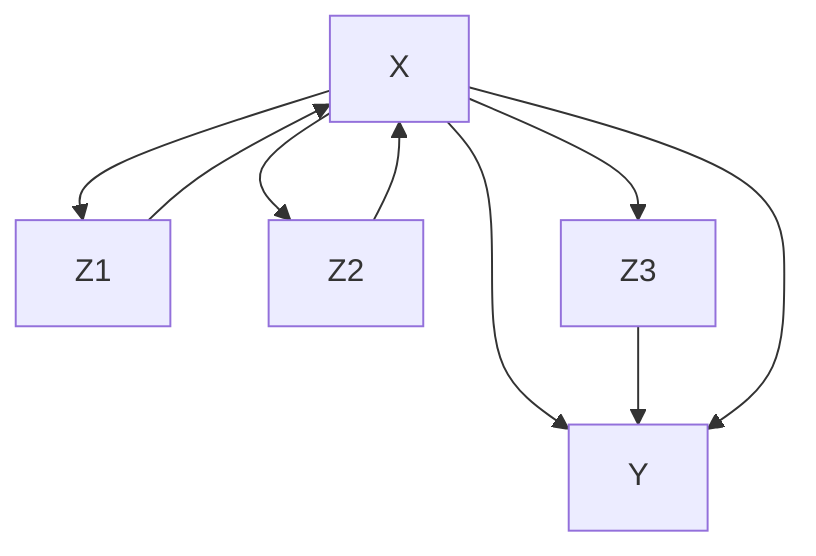

One can see that the set $\{ Z _ { 1 } , Z _ { 2 } , Z _ { 3 } \}$ is a valid adjustment set, for example, by parent adjustment (see Proposition 6.41). That is,

$$
p ^ {\mathfrak {C}; d o (X := x)} (y) = \sum_ {z _ {1}, z _ {2}, z _ {3}} p ^ {\mathfrak {C}} (y | x, z _ {1}, z _ {2}, z _ {3}) p ^ {\mathfrak {C}} (z _ {1}, z _ {2}, z _ {3}). \tag {6.21}
$$

Sometimes, however, the value of X does not depend on Z “directly” but only through a (real-valued) propensity score $L : = L ( \mathbf { Z } ) = L ( Z _ { 1 } , Z _ { 2 } , Z _ { 3 } )$ . This means ${ } ^ { 6 \epsilon } X \perp \perp \mathbf { Z } | L ( \mathbf { Z } ) , { } ^ { \prime }$ or, more formally, s we have for all z, x and $\ell = L ( \mathbf { z } )$ that

$$
p (\mathbf {z} | \ell , x) = p (\mathbf {z} | \ell).
$$

If X is a binary choice that indicates treatment or no treatment, one may choose $L ( \mathbf { z } ) = p ( x = 1 | \mathbf { Z } = \mathbf { z } )$ , for example. But then, it follows with (6.21)

$$
\begin{array}{l} p ^ {\mathfrak {C}; d o (X := x)} (y) = \sum_ {\mathbf {z}} p ^ {\mathfrak {C}} (y | x, \mathbf {z}) p ^ {\mathfrak {C}} (\mathbf {z}) = \sum_ {\mathbf {z}} \sum_ {\ell} p ^ {\mathfrak {C}} (y | x, \mathbf {z}) p ^ {\mathfrak {C}} (\ell) p ^ {\mathfrak {C}} (\mathbf {z} | \ell) \\ = \sum_ {\mathbf {z}} \sum_ {\ell} p ^ {\mathfrak {C}} (y | \ell , x, \mathbf {z}) p ^ {\mathfrak {C}} (\ell) p ^ {\mathfrak {C}} (\mathbf {z} | \ell , x) \\ = \sum_ {\ell} p ^ {\mathfrak {C}} (y | \ell , x) p ^ {\mathfrak {C}} (\ell). \tag {6.22} \\ \end{array}
$$

In the population setting, both computations (6.21) and (6.22) of the intervention distribution are correct. The point is, however, that for finite data, (6.22) may lead to a better estimate than (6.21) would: although one needs to estimate the function L, the resulting conditional $p ^ { \mathfrak { C } } ( y | x , \ell )$ is potentially lower dimensional than $p ^ { \mathfrak { C } } ( y | x , \mathbf { z } )$ . In practice, one often matches realizations with a “similar” value of \` to compute (6.22). Important practical details include estimating of the function L and the matching procedure. The idea works for any number of covariates.

In this sense, propensity score matching can be a nice and useful trick to gain statistical performance. It is irrelevant for population considerations.

## 6.7 Do-Calculus

Again, consider an SCM over variables V. Sometimes, we can compute intervention distributions $p ^ { { \mathfrak { C } } ; d o ( X : = x ) }$ in other ways than the adjustment formula (6.13). Let

## 6.7. Do-Calculus

us therefore call an intervention distribution $p ^ { \mathfrak { C } ; d o ( X : = x ) } ( y )$ identifiable if it can be computed from the observational distribution and the graph structure. If there is a valid adjustment set for (X,Y ), for example, $p ^ { \mathfrak { C } ; d o ( X : = x ) } ( y )$ is certainly identifiable. Pearl [2009, Theorem 3.4.1] has developed the so-called do-calculus that consists of three rules. Given a graph $\mathcal { G }$ and disjoint subsets X, Y, Z, and W, we have

1. “Insertion/deletion of observations”:

$$
p ^ {\mathfrak {C}; d o (\mathbf {X} := \mathbf {x})} (\mathbf {y} | \mathbf {z}, \mathbf {w}) = p ^ {\mathfrak {C}; d o (\mathbf {X} := \mathbf {x})} (\mathbf {y} | \mathbf {w})
$$

if Y and Z are d-separated by X, W in a graph where incoming edges in X have been removed.

2. “Action/observation exchange”:

$$
p ^ {\mathfrak {C}; d o (\mathbf {X} := \mathbf {x}, \mathbf {Z} = \mathbf {z})} (\mathbf {y} | \mathbf {w}) = p ^ {\mathfrak {C}; d o (\mathbf {X} := \mathbf {x})} (\mathbf {y} | \mathbf {z}, \mathbf {w})
$$

if Y and Z are d-separated by X, W in a graph where incoming edges in X and outgoing edges from Z have been removed.

3. “Insertion/deletion of actions”:

$$
p ^ {\mathfrak {C}; d o (\mathbf {X} := \mathbf {x}, \mathbf {Z} = \mathbf {z})} (\mathbf {y} | \mathbf {w}) = p ^ {\mathfrak {C}; d o (\mathbf {X} := \mathbf {x})} (\mathbf {y} | \mathbf {w})
$$

if Y and Z are d-separated by X, W in a graph where incoming edges in X and Z(W) have been removed. Here, Z(W) is the subset of nodes in Z that are not ancestors of any node in W in a graph that is obtained from G after removing all edges into X.

Theorem 6.45 (Do-calculus) The following statements hold.

(i) The rules are complete; that is, all identifiable intervention distributions can be computed by an iterative application of these three rules [Huang and Valtorta, 2006, Shpitser and Pearl, 2006].  
(ii) In fact, there is an algorithm, proposed by Tian [2002] that is guaranteed [Huang and Valtorta, 2006, Shpitser and Pearl, 2006] to find all identifiable intervention distributions.  
(iii) There is a necessary and sufficient graphical criterion for identifiability of intervention distributions [Shpitser and Pearl, 2006, Corollary 3], based on so-called hedges [see also Huang and Valtorta, 2006].

As a corollary of the do-calculus, we obtain the front-door adjustment (see Problem 6.65).

Example 6.46 (Front-door adjustment) Let C be an SCM with corresponding graph


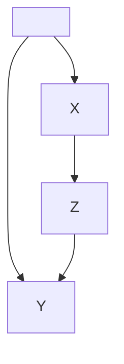

If we do not observe U, we cannot apply the backdoor criterion. In fact, there is no valid adjustment set. But still, provided that $p ^ { \mathfrak { C } } ( x , z ) > 0$ , the do-calculus provides us with

$$
p ^ {\mathfrak {C}; d o (X := x)} (y) = \sum_ {z} p ^ {\mathfrak {C}} (z | x) \sum_ {\tilde {x}} p ^ {\mathfrak {C}} (y | \tilde {x}, z) p ^ {\mathfrak {C}} (\tilde {x}). \tag {6.23}
$$

The fact that observing Z in addition to X and Y here reveals causal information nicely shows that causal relations can also be explored by observing the “channel” (here Z) that carries the “signal” from X to Y .

Bareinboim and Pearl [2014] consider the problem of transportability. They are also interested in intervention distributions, but they allow for the possibility to include knowledge (i.e., observational distributions and intervention distributions) that has been gained in SCMs that coincide with the target SCM in some structural assignments and differ in others.

## 6.8 Equivalence and Falsifiability of Causal Models

So far, SCMs have been mathematical objects. To link them to reality, we regard them as models for a data-generating process. It can be a complicated class of models, though. Instead of modeling “just” a joint distribution (as we can model a physical process with a Poisson process, for example), we can now model the system in an observational state and under perturbations at the same time. We have seen that it is even possible to regard SCMs as models for counterfactual statements.

More formally, consider a vector $\mathbf { X } = \left( X _ { 1 } , \ldots , X _ { d } \right)$ of random variables. A probabilistic model for X predicts an observational distribution $R _ { \mathbf { X } }$ . We call such a model an interventional model if it additionally predicts intervention distributions in which some variables $X _ { j }$ have been set to (independent) variables $\tilde { N } _ { j }$ . Finally, a counterfactual model additionally predicts the result of counterfactual statements. Traditional machine learning methods, for example, build probabilistic models;causal graphical models (Definition 6.32) can be used as interventional models, and SCMs can be used as counterfactual models. We call two models equivalent if they agree on the corresponding predictions [see Bongers et al., 2016] for a similar construction.

## Definition 6.47 (Equivalence of causal models) Two models are called

## {probabilistically / interventionally / counterfactually} equivalent

if they entail the same {obs. / obs. and int. / obs., int., and counterf.} distributions.

It is apparent that the notion of interventional equivalence applies only to interventional and counterfactual models, for example. Proposition 7.1 implies that for each probabilistic model, there is an observationally equivalent SCM.

If X has a strictly positive density, Proposition 6.48 shows that we can restrict the notion to interventions on single nodes, that is, interventions in which a variable $X _ { j }$ has been set to a variable $\tilde { N } _ { j }$ where the distribution of $\tilde { N } _ { j }$ has full support. If two models agree on this subclass of interventions, they agree on all other interventions, too. The rationale is that interventions on single nodes, correspond to the standard version of randomized experiments.

For a given data-generating process, we can now falsify a probabilistic or interventional model if the corresponding distributions do not agree with the data observed from the process. That is, if an interventional model predicts the observational distribution correctly but does not predict what happens in a randomized experiment, the model is still considered to be falsified. This notion includes the assumption that there is an agreement about what a randomized experiment should look like. One should be careful about writing down an SCM when it is unclear how to randomize over the involved variables in reality (or perform interventions on them). The notion of falsifiability further requires the concept of (statistical) significance, which is not discussed here. We do not include counterfactual models, since they are hard to falsify in general. We could falsify them based on their implications on observational distributions and intervention distributions (see Shpitser and Pearl [2008a] and references therein). In some specific experimental setups, it is furthermore possible to construct counterfactual statements that are falsifiable (see Example 3.4). Example 6.19, however, shows two SCMs that entail the same observational and intervention distributions but entail different counterfactual statements.

The above-mentioned restriction to a subclass of interventions (single variables are set to a noise variable) serves a practical purpose. To check the validity of the model we have to compare the outcome of randomized experiments with the model’s predictions. For more complex interventions, the corresponding experiments in reality seem more complicated to implement. The following proposition states that this comes without loss of generality: if causal models agree on all single-node interventions, they are interventionally equivalent. The proof can be found in Appendix C.7.

Proposition 6.48 (Interventional equivalence) Assume that two SCMs (or causal graphical models) ${ \mathfrak { C } } _ { 1 }$ and ${ \mathfrak { C } } _ { 2 }$ induce strictly positive, continuous conditional densities $p ( x _ { j } | x _ { p a ( j ) } )$ , where $p a ( j ) : = \mathbf { P } \mathbf { A } _ { X _ { j } }$ , and satisfy causal minimality. Assume further that they entail the same intervention distributions, in which some variable $X _ { j }$ has been set to a variable $\tilde { N } _ { j }$ with full support:

$$
P _ {\mathbf {X}} ^ {\mathfrak {C} _ {1}; d o (X _ {j} := \tilde {N} _ {j})} = P _ {\mathbf {X}} ^ {\mathfrak {C} _ {2}; d o (X _ {j} := \tilde {N} _ {j})} \quad \forall j \forall \tilde {N} _ {j} w i t h f u l l s u p p o r t.
$$

Then, ${ \mathfrak { C } } _ { 1 }$ and ${ \mathfrak { C } } _ { 2 }$ are interventionally equivalent; that is, they agree on any possible intervention, including atomic interventions or interventions in which the set of parents is altered (without creating a cycle).

If the density is not strictly positive, this is not necessarily the case. One may then have to consider simultaneous interventions on several nodes (e.g., double knockout gene experiments); see Problem 6.59.

Furthermore, we are now able to justify the notion of structural minimality of SCMs (see Remark 6.6). We have argued that if the function in a structural assignment of an SCM does not depend on one of the inputs, we can choose a sparser representation. The following proposition formalizes in what sense these representations are equivalent.

Proposition 6.49 (Counterfactual equivalence) Consider two SCMs C and ${ \mathfrak { C } } ^ { * }$ that share the same noise distribution $P _ { \mathbf { N } }$ and that differ only in the kth structural assignment:

$$
f _ {k} (\mathbf {p a} _ {k}, n _ {k}) = f _ {k} ^ {*} (\mathbf {p a} _ {k} ^ {*}, n _ {k}), \quad \forall \mathbf {p a} _ {k}, \forall n _ {k} \text {   with   } p (n _ {k}) > 0, \tag {6.24}
$$

with $\mathbf { P A } _ { k } ^ { * } \subseteq \mathbf { P A } _ { k }$ . Then, both SCMs are counterfactually equivalent.

The proof is provided in Appendix C.8.

## 6.9 Potential Outcomes

We now introduce an alternative approach to causal inference that is not based on SCMs. The framework is often referred to as potential outcomes or the Rubin causal model and is widely used in the social sciences. The ideas date back to Neyman [1923] and Fisher [1925] who mainly discussed randomized experiments. Rubin [1974] extended the ideas to observational studies. Rubin [2005], Morgan and Winship [2007], and Imbens and Rubin [2015] provide more elaborate introductions into the topic.

### 6.9.1 Definitions and Example

To explain potential outcomes, we revisit Example 3.4 (the eye doctor) and reformulate it in this framework. Rather than with random variables, we now start with a group of n patients (or units) $u = 1 , \ldots , n ,$ , each of which may or may not receive the treatment. We assign two potential outcomes to each patient u: $B _ { u } ( t = 1 )$ indicates whether the patient would go blind $( B = 1 )$ ) or get cured $( B = 0 )$ if she receives treatment $( T = 1 )$ . Analogously, $B _ { u } ( t = 0 )$ encodes what happens without treatment $( T = 0 )$ . Both of these potential outcomes are assumed to be deterministic. For each patient the treatment either helps or it does not help: there is no randomness involved. If $B _ { u } ( t = 1 ) = 0$ and $B _ { u } ( t = 0 ) = 1$ , we say that the treatment has a positive effect for unit u.

In practice, however, we are not able to check these conditions. The “fundamental problem of causal inference” [Holland, 1986] states that for each unit u we can observe either $B _ { u } ( t = 1 )$ or $B _ { u } ( t = 0 )$ and never both of them at the same time. The reason is that after we have chosen to treat a person, we cannot go back in time and undo the treatment. This even holds the other way around. If we decide to not give a treatment, we can still apply the treatment later in time but this cannot be interpreted as an outcome of the variable $B _ { u } ( t = 1 )$ anymore. The patient might have recovered in the meantime by herself, for example. Thus, we can observe only one of the potential outcomes; the unobserved quantity becomes a counterfactual.

Table 6.2 shows a (hypothetical) data set for the previous example. In fact, the data points are sampled according to the model described in Example 3.4. To justify the presentation in Table 6.2, we often implicitly assume the stable unit treatment value assumption (SUTVA) [Rubin, 2005]. It states that the units do not interfere (e.g., the potential outcome of a unit does not depend on which treatment any other unit received) [Cox, 1958]; furthermore it requires that the potential outcomes do not depend on how or why the treatment has been received. We will see in Section 6.9.2 that SUTVA is satisfied when the data are generated from an SCM (as was done for this example).

The potential outcomes tell us the effect of a treatment on an individual basis; we define the unit-level causal effect as $B _ { u } ( t = 1 ) - B _ { u } ( t = 0 )$ and an average causal

**Table 6.2: This table presents Example 3.4 using potential outcomes. For each patient (or unit), we observe only one of the two potential outcomes. The observed information has a gray background. The treatment T is helpful for almost all patients. Only in 2 of 200 cases, the treatment harms the patient and blinds him $B = 1$ . Although assigning the treatment $( T = 1 )$ is a good idea in most cases, for patient $u = 1 2 0$ it was exactly the wrong decision.**

| Unit u | Treatment T | Pot. Outcome Bu(t=0) | Pot. Outcome Bu(t=1) | Unit-Level Causal Effect Bu(t=1)-Bu(t=0) |
| --- | --- | --- | --- | --- |
| 1 | 1 | 1 | 0 | -1 |
| 2 | 0 | 1 | 0 | -1 |
| 3 | 1 | 1 | 0 | -1 |
| ⋮ |  |  |  |  |
| 43 | 1 | 1 | 0 | -1 |
| 44 | 0 | 0 | 1 | 1 |
| 45 | 0 | 1 | 0 | -1 |
| ⋮ |  |  |  |  |
| 119 | 1 | 1 | 0 | -1 |
| 120 | 1 | 0 | 1 | 1 |
| 121 | 0 | 1 | 0 | -1 |
| ⋮ |  |  |  |  |
| 200 | 0 | 1 | 0 | -1 |

effect

$$
C E = \frac {1}{n} \sum_ {u = 1} ^ {n} B _ {u} (t = 1) - B _ {u} (t = 0). \tag {6.25}
$$

The “fundamental problem of causal inference” prevents us from computing (6.25) directly. Assume that in a completely randomized experiment, units $u \in U _ { 0 } \subset$ $\{ 1 , \ldots , n \}$ received treatment $T = 0$ and units $u \in U _ { 1 } = U _ { 0 } ^ { C }$ treatment $T = 1$ . Neyman [1923] shows that

$$
\widehat {C E} := \frac {1}{\# U _ {0}} \sum_ {u \in U _ {0}} B _ {u} (t = 1) - \frac {1}{\# U _ {1}} \sum_ {u \in U _ {1}} B _ {u} (t = 0) \tag {6.26}
$$

is an unbiased estimator for (6.25). Here, the randomness in $\widehat { C E }$ comes from the random assignments that determine, which of the unit’s two potential outcomes we observe; the outcomes themselves are considered hidden, not random. Note that (6.26) contains only observed quantities and can therefore be computed after the study has been conducted.

There is an extensive debate about which of the two approaches is better suited for practical applications [see, e.g., Pearl, 1995, Imbens and Rubin, 1995, Rubin,2004, Lauritzen, 2004]. We do not plan to take an active part in this discussion but rather mention the following three results: (1) We describe how to represent potential outcomes as counterfactuals [Pearl, 2009, Section 3.6.3]; (2) there is a logical equivalence between both frameworks [Galles and Pearl, 1998, Halpern, 2000]; and (3), we comment on a recently proposed framework [Richardson and Robins, 2013] that brings both worlds closer together.

### 6.9.2 Relation between Potential Outcomes and SCMs

In SCMs, we can represent potential outcomes using the language of counterfactuals (Section 6.4). In the eye doctor example, the SCM C satisfies $T = N _ { T }$ and $B = T \cdot N _ { B } + \left( 1 - T \right) \cdot \left( 1 - N _ { B } \right)$ . We can therefore represent each patient by specific values for $N _ { B }$ and $N _ { T }$ . In Table 6.2, for example, patient 43 is characterized by ${ N _ { T } } = 1 , { N _ { B } } = 0$ , while patient 44 satisfies $N _ { T } = 0 , N _ { B } = 1$ . The two terms $t = 0$ and t = 1 then correspond to interventions on $T .$ . Summarizing, we have that

$$
\underbrace {B _ {u} (t = \tilde {t})} _ {\text { potential   outcome }} = \underbrace {B \text {   in   the   SCM   } \mathfrak {C} | \mathbf {N} = \mathbf {n} _ {u} ; d o (T : = \tilde {t})} _ {\text { counterfactual   SCM }}, \tag {6.27}
$$

where $\mathbf { n } _ { u }$ characterizes unit u [Pearl, 2009, Equation (3.51)]. Since in the counterfactual SCM all noise terms are deterministic, the entailed distribution of B is degenerate, too, and B is deterministic (as required). In the example shown in Table 6.2, we have sampled 200 i.i.d. units using Bernoulli distributions $N _ { T } \sim$ Ber(0.6) and $N _ { B } \sim \mathrm { B e r } ( 0 . 0 1 )$ . In this case, SUTVA is satisfied. The i.i.d. assumption implies that the units do not interfere with each other and modularity (intervening on $T$ changes only the structural assignment for T ) yields that the way the treatment is taken does not influence the result.

We now discuss a result that shows in what sense both representations in (6.27) are equivalent. For this, we mainly follow the presentation in Pearl [2009, 7.3.1] and Halpern [2000]. The main argumentation is based on the following steps:

1. Define the properties (axioms): (C0)–(C5) and (MP) [Halpern, 2000, Section 3]. Property (C4), for example, states that

$$
T _ {u} (t = \tilde {t}, w = \tilde {w}) = t;
$$

it postulates that setting variable T for unit u to t is “effective.”

2. These axioms are satisfied in both representations (“soundness”).  
3. It can be shown that these properties are complete for counterfactual SCMs. Any counterfactual statement follows from one of these axioms.

4. We can conclude that any theorem that holds for counterfactual SCMs holds in the world of potential outcomes and vice versa.14 Also, it follows from step 3. that any data set (like that in Table 6.2) satisfying the three axioms could be modeled with a counterfactual SCM.15

The two worlds differ, however, in their language. Even if every theorem holds true in both frameworks, some theorems might be “easier” to prove in one world than in the other. Similarly, any assumption that appears in a theorem imposes restrictions on the underlying data-generating process; depending on the application, one formulation might simplify the assessment of these restrictions. Working with settings, in which the average causal effect is zero but the individual causal effects are non-zero, seems to be easier for potential outcomes. The graphical representation of SCMs, on the other hand, might be beneficial to exploit assumptions on the causal relations between random variables.

Richardson and Robins [2013] propose to use single world intervention graphs. These graphs allow us to set variables to certain values and therefore construct graphical correspondences to counterfactual variables. These modified graphs allow us to read off conditional independence statements that involve both factual and counterfactual variables. We can therefore see these graphs as a useful tool to translate graphical assumptions into counterfactual statements that are often used by potential outcomes analysts.

## 6.10 Generalized Structural Causal Models Relating Single Objects

So far, we have studied causal relations among random variables $X _ { 1 } , \ldots , X _ { d }$ and focused only on a scenario where the data are i.i.d. observations drawn from $P _ { \mathbf { X } }$ . We now consider a set $\mathbf { v } = \{ x _ { 1 } , \ldots , x _ { d } \}$ of nodes of the causal DAG that consists of any mathematical objects $x _ { 1 } , \ldots , x _ { d }$ formalizing the idea of observations. For instance, after observing similarities among the texts $x _ { 1 } , \ldots , x _ { d }$ written by different authors, one may be interested in the causal relation in the sense of which author has been influenced by which one. Following Steudel et al. [2010], we now describe in which sense the underlying DAG also entails conditional independence statements, given an appropriate notion of information, without referring to statistical sampling. To this end, we assume that we are given some information function

$$
R: 2 ^ {\mathbf {V}} \to \mathbb {R} _ {0} ^ {+},
$$

which is monotone in the sense that a set of nodes cannot contain more information than any of its supersets. Then, for any two sets x, $\mathbf { y } \subseteq \mathbf { v }$ of nodes, the expression $R ( \mathbf { x } , \mathbf { y } ) - R ( \mathbf { y } )$ is non-negative and can be interpreted as measuring the conditional information of x, given y. Moreover, we assume that R is such that for any three disjoint sets $\mathbf { x } , \mathbf { y } , \mathbf { z }$ of nodes, the expression

$$
I (\mathbf {x}: \mathbf {y} | \mathbf {z}) := R (\mathbf {x}, \mathbf {z}) + R (\mathbf {y}, \mathbf {z}) - R (\mathbf {x}, \mathbf {y}, \mathbf {z}) - R (\mathbf {z}) \tag {6.28}
$$

is non-negative, which is the case if and only if R is submodular (see Section 9.5.2). Then, we can interpret (6.28) as generalized conditional mutual information between x and ${ \bf y } ,$ given z because $R ( \mathbf { x } , \mathbf { z } ) - R ( \mathbf { z } )$ measures the information of x, given z while $R ( \mathbf { x } , \mathbf { y } , \mathbf { z } ) - R ( \mathbf { y } , \mathbf { z } )$ is the information of x, given y and z. In the same way, conditional mutual information among random variables can be written as a difference of Shannon entropies [Cover and Thomas, 1991]. If (6.28) vanishes, we call x and y conditionally independent, given z.

To define generalized SCMs, one introduces unobserved noise objects $n _ { j }$ for each observed node $x _ { j }$ and postulates the following statement.

Principle 6.50 (No additional information) A node $x _ { j }$ contains no additional information on top of the information contained in its parent nodes $\mathbf { p } \mathbf { a } _ { j }$ and the unobserved node $n _ { j } ,$ , that $i s ,$ ,

$$
R (x _ {j}, \mathbf {p a} _ {j}, n _ {j}) = R (\mathbf {p a} _ {j}, n _ {j}).
$$

This generalizes the assumption that every random variable $X _ { j }$ is determined by its parents and its noise variable, which for discrete random variables amounts to saying that the Shannon entropy of $X _ { j } , \mathbf { P A } _ { j } , N _ { j }$ is the same as the one of $\mathbf { P A } _ { j } , N _ { j }$ .

The second crucial assumption of an SCM is the statistical independence of noise terms. The generalized version of this assumption reads as follows:

Principle 6.51 (Independence of unobserved objects) The unobserved nodes $n _ { j }$ do not contain information about each other, that is,

$$
R (n _ {1}, \dots , n _ {d}) = \sum_ {j = 1} ^ {d} R (n _ {j}).
$$

Steudel et al. [2010] prove the following theorem.

Theorem 6.52 (Generalized causal Markov condition) If both Principles 6.50 and 6.51 hold, then x and y are conditionally independent, given z for any three set of nodes for which x and y are d-separated by z.

To apply these concepts to the text example, let us consider a text as a collection of its meaningful words and let its information R be the number of different words. Assume that the influence among d texts $x _ { 1 } , \ldots , x _ { d }$ is given by the following simplified mechanism: the author of $x _ { j }$ takes some of the words from the parent texts of $x _ { j }$ and adds some words from his own ideas. These additional words are given by $n _ { j }$ . Then, Principle 6.50 is satisfied by definition of $n _ { j }$ . According to Principle 6.51, the words added by different authors are assumed to be different. Two texts are conditionally independent, given a third one, if they only have words in common that already appear in the latter. The example shows that reasonable notions of conditional independence can be defined for a much broader class of objects than random variables. To ensure that the causal Markov condition holds with respect to that particular notion of independence, the underlying information measure needs to be appropriate for the respective class of causal mechanisms under consideration in the sense of Principles 6.50 and 6.51.

Janzing and Scholkopf [2010] quantify the information between binary strings ¨ using Kolmogorov complexity K with respect to some fixed Turing machine T (see Section 4.1.9). The function K is approximately submodular up to terms of O(1), that is, an error that does not grow with the size of the considered strings. Then, Janzing and Scholkopf [2010] define an “algorithmic model of causality” ¨ where T computes each $x _ { j }$ from its parents and a noise string $n _ { j } .$ , which ensures Principle 6.50. Each $n _ { j }$ can also be interpreted as the program that computes $x _ { j }$ from its parents, that is, the mechanism that generates $x _ { j }$ from its direct causes. Then, Principle 6.51 amounts to the independence of the mechanisms (see Principle 2.1).16 Applying Theorem 6.52 to R = K yields the “algorithmic Markov condition” [Janzing and Scholkopf, 2010]: whenever ¨ x and y are d-separated by z, knowing y does not admit a shorter description of x with respect to a Turing machine that gets z as free background information.

On a higher level, this addresses a deep problem of causal reasoning: the statement “dependences between observations only occur if they are causally related”(a generalization of Principle 1.1) only holds if the dependence measure is appropriate for the class of observations and the class of potential causal mechanisms under consideration. For instance, after observing that the height of a child has increased during the past decade, and, at the same time, the value of some stock has increased, one would not infer them to be causally related because growth is a property that many time series share without being causally related. Only if two time series share more sophisticated patterns of different growth (and/or decrease), do we ask for the common reason behind the similarity. Since non-stationary time series are ubiquitous, it would be interesting to find information measures for which we believe dependences to indicate causal relations (after sufficiently accounting for multiple testing issues if the time series were found by searching over large databases). Speaking from a more applied machine learning perspective, the problem leads us to construct appropriate features for which similarities in feature space indicate causal relations.

## 6.11 Algorithmic Independence of Conditionals

Section 6.10 shows that causal structures not only imply statistical (conditional) independences, but also independences with respect to other (non-statistical) information measures. We have further seen that the Markov condition can also be stated for algorithmic information. Then the most elementary implication of the algorithmic Markov condition is an analogy of Reichenbach’s principle for algorithmic dependences. Two objects can only be algorithmically dependent when they have a common cause or when one of it influences the other [Janzing and Scholkopf, 2010]. This is because they are otherwise ¨ d-separated by the empty set and thus independent. Likewise, d objects $x _ { 1 } , \ldots , x _ { d }$ that are causally unrelated are jointly algorithmically independent, that is,

$$
K (x _ {1}, \dots , x _ {d}) \stackrel {+} {=} \sum_ {j = 1} ^ {d} K (x _ {j}). \tag {6.29}
$$

One can also call the difference between the left- and right-hand sides multiinformation (in analogy to the corresponding terminology in statistical information theory) and write the joint independence as

$$
I (x _ {1}, x _ {2}, \dots , x _ {d}) \stackrel {\pm} {=} 0. \tag {6.30}
$$

Then, joint independence implies also independence of every subset. For instance, if the joint description of $x _ { 1 } , x _ { 2 }$ is shorter than the separate description of $x _ { 1 }$ and $x _ { 2 }$ , then the joint description of $x _ { 1 } , \ldots , x _ { d }$ is automatically shorter than the separate descriptions of all $x _ { j }$ and thus (6.30) implies

$$
I (x _ {1}: x _ {2}) \stackrel {+} {=} 0.
$$

If we assume now that the conditionals17 $P _ { X _ { j } | \mathbf { P A } _ { j } }$ j in a causal graphical model are “independently chosen by nature,” then we conclude that they are jointly algorithmically independent [Janzing and Scholkopf, 2010, Lemeire and Janzing, 2013] ¨ and state the multivariate version of Principle 4.13.

Principle 6.53 (Algorithmic independence of conditionals (AIC)) The causal conditionals described by the Markov kernels in a causal Bayesian network as in Definition 6.21 (iii) are algorithmically independent, that is,

$$
I (P _ {X _ {1} | \mathbf {P A} _ {1}}, P _ {X _ {2} | \mathbf {P A} _ {2}}, \dots , P _ {X _ {d} | \mathbf {P A} _ {d}}) \stackrel {\pm} {=} 0, \tag {6.31}
$$

or equivalently,

$$
K (P _ {X _ {1}, \ldots , X _ {d}}) \stackrel {+} {=} \sum_ {j = 1} ^ {d} K (P _ {X _ {j} | P A _ {j}}). \tag {6.32}
$$

Note that Principle 6.53 must not be confused with the algorithmic Markov condition discussed in Section 6.10. While the latter refers to causal relations among n single objects without referring to statistical sampling, the former still assumes the traditional i.i.d. setting with n random variables and only states an additional inference principle.

As for the bivariate case, the equivalence of (6.31) and (6.32) is immediate because describing the joint distribution is equivalent to describing all the causal Markov kernels. In other words, AIC states that the shortest description of the joint distribution is given by separate descriptions of the causal Markov kernels.

Causal faithfulness and AIC are related in spirit and often yield similar conclusions. To discuss similarities and differences, we revisit Example 6.34. Since the parameter a describes $P _ { Y | X }$ and the parameters $( b , c )$ describe the conditionals $P _ { Z | X , Y }$ , we have

$$
I (P _ {Y | X}: P _ {Z | X, Y}) \overset {+} {\geq} I (a: (b, c)). \tag {6.33}
$$

This is because the algorithmic mutual information between two objects cannot be increased by restricting the attention to some of their “aspects;” see, for example,Janzing and Scholkopf [2010, Lemma 6]. The “non-generic” independence¨ $X \perp \perp Z$ occurs when the structure coefficients of the linear model satisfy

$$
a \cdot b + c = 0. \tag {6.34}
$$

Then $K ( a | b , c ) \overset { + } { = } 0$ because a can be computed from $b , c$ via a program of length $\mathcal { O } ( 1 )$ . Thus,

$$
I (a: (b, c)) \stackrel {+} {=} K (a) - K (a | (b, c) ^ {*}) \stackrel {+} {=} K (a).
$$

We conclude that AIC is violated whenever $K ( a )$ is significantly larger than 0. For a generic real number a, $K ( a )$ grows logarithmically with the desired (relative) accuracy. Then AIC rejects the corresponding causal DAG because (6.34) is considered an unlikely coincidence.

We have to explain the phrase “whenever $K ( a )$ is significantly larger than $0 ^ { \circ }$ because it amounts to a conceptual difference between AIC and faithfulness. Assume, for instance, that $b = c$ and $a = - 1$ . Then (6.34) is satisfied, yet the description of $a$ does not get shorter when b and c are known because $K ( a )$ is already negligible. Therefore, that AIC is not violated despite (6.34) seems to indicate fine-tuning of parameters. Following Lemeire and Janzing [2013], we now argue why we consider not rejecting this kind of tuning as a feature of AIC rather than as a flaw. The idea is that structure coefficients ±1 (up to some given precision) occur much more often in nature than some “more generic” value such as 2.36724 ... . For instance, spending some money S decreases the amount A of available money by $- S .$ . The causal relation between S and A is thus described $\mathsf { b y } ^ { 1 8 }$ the structure coefficient −1. Implicitly, AIC and our argument are based on a prior that considers values with short description length as more likely (in agreement with Solomonoff’s theory of inductive inference [Solomonoff, 1964]).

Another feature of AIC is that it also rejects almost cancellation of different paths: assume, for instance, that a is very close to $- c / b$ . To estimate $I ( a : ( b , c ) )$ in this case, we observe

$$
I (a: (b, c)) \stackrel {+} {\geq} I (a: (c / b))
$$

and use the following idea. The algorithmic mutual information of two integers n, m that are close to each other is typically about log $n / | m - n |$ because describing n after m is known requires about log $\left| n - m \right|$ bits, while it requires about log n bits otherwise. After arbitrarily fine discretization, we may then represent a and $c / b$ by integers and take log $[ a / ( a + c / b ) ]$ as a rough estimation for the algorithmic mutual information between $P _ { Y | X }$ and $P _ { Z | X , Y }$ .

## 6.12 Problems

Problem 6.54 (DAGs) Table B.1 on page 223 states that for three nodes there are 25 DAGs. Why is this the case?

Problem 6.55 (Multivariate SCMs) Consider the following SCM C

$$
V := N _ {V}
$$

$$
W := - 2 V + 3 Y + 5 Z + N _ {W}
$$

$$
X := 2 V + N _ {X}
$$

$$
Y := - X + N _ {Y}
$$

$$
Z := \alpha X + N _ {Z}
$$

with $N _ { V } , N _ { W } , N _ { X } , N _ { Y } , N _ { Z } \stackrel { i i d } { \sim } \mathcal { N } ( 0 , 1 )$

a) Draw the graph corresponding to the SCM.  
b) Set $\alpha = 2$ and simulate 200 i.i.d. data points from the joint distribution; plot the values of X and W to visualize the distribution $P _ { X , W } ^ { \mathfrak { C } }$ .  
c) Again, set $\alpha = 2$ and sample 200 i.i.d. data points from the intervention distribution

$$
P _ {X, W} ^ {\mathfrak {C}; d o (X := 3)}
$$

in which we have intervened on X. Again, plot the sample and compare with the plot from part b.

d) A directed path from one node to another does not necessarily imply that the former node has a causal effect on the latter. Choose a value of α and prove that for this value X, has no causal effect on W .

e) For any given α, compute

$$
\frac {\partial}{\partial x} \mathbb {E} ^ {\mathfrak {C}; d o (X := x)} [ W ].
$$

Problem 6.56 (Interventions) Consider the SCM

$$
\begin{array}{l} X := N _ {X} \\ Y := (X - 4) ^ {2} + N _ {Y} \\ Z := X ^ {2} + Y ^ {2} + N _ {Z} \\ \end{array}
$$

with $N _ { X } , N _ { Y } , N _ { Z } \stackrel { i i d } { \sim } \mathcal { N } ( 0 , 1 )$ . You may intervene on either X or Y . Which hard intervention yields the smallest expected value of Z?

Problem 6.57 (Minimality) We have stated in Remark 6.6 that causal minimality (Definition 6.33) implies structural minimality.

a) Convince yourself that this is shown by Proposition 6.49.  
b) Provide an example of an SCM that satisfies structural minimality but violates causal minimality.

Problem 6.58 (Causal Minimality) Consider a causal graphical model with a distribution that has a strictly positive, continuous density and for which causal minimality is violated. According to Proposition 6.36, we can then remove an “inactive” edge from the graph and obtain a new causal graphical model. Prove that the two models are interventionally equivalent.

Problem 6.59 (Interventional equivalence) Consider two SCMs ${ \mathfrak { C } } _ { 1 }$ and ${ \mathfrak { C } } _ { 2 }$ of the form

$$
\begin{array}{l} X := N _ {X} \\ Y := X + N _ {Y} \\ Z := f _ {j} (X, Y) + N _ {Z} \\ \end{array}
$$

with $N _ { X } , N _ { Y } , N _ { Z } \stackrel { i i d } { \sim } \mathcal { U } ( - 1 , 1 )$ , a continuous uniform distribution between −1 and 1. Choose the functions $f _ { 1 }$ and $f _ { 2 }$ such that ${ \mathfrak { C } } _ { 1 }$ and ${ \mathfrak { C } } _ { 2 }$ are observationally equivalent, and agree on all single node interventions, but disagree on simultaneous interventions on several nodes. This problem shows that Proposition 6.48 does not need to be true if the density is not strictly positive.

Problem 6.60 (Cyclic SCMs) Prove that whenever the absolute values of the eigenvalues of a square matrix B are strictly smaller than 1 (i.e., the spectral radius of B is strictly smaller than 1), then I − B is invertible.

<!-- footnote -->

- We do not allow for interventions that keep the function in the structural assignment fixed and change only the noise distribution; see (6.5).
- This term does not coincide with causal minimality (Definition 6.33). Causal minimality implies structural minimality (Proposition 6.49) but not vice versa; see Problem 6.57.

<!-- footnote end -->

<!-- footnote -->

- Although the set of parents can change arbitrarily as long as they are not introducing cycles, we mainly consider interventions, for which the new set of parents $\bar { \mathbf { P A } } _ { k }$ is either empty or equals $\mathbf { P A } _ { k }$ .
- This is also referred to as an ideal, structural [Eberhardt and Scheines, 2007], surgical [Pearl, 2009], independent, or deterministic [Korb et al., 2004] intervention.
- This is also referred to as a parametric [Eberhardt and Scheines, 2007] or dependent intervention [Korb et al., 2004] or simply as a mechanism change [Tian and Pearl, 2001]. For the term soft intervention, see Eberhardt and Scheines [2007] , Eaton and Murphy [2007], and Markowetz et al. [2005].

<!-- footnote end -->

<!-- footnote -->

- In the continuous case, this definition comes with measure theoretic problems since usually the

<!-- footnote end -->

<!-- footnote -->

- conditional distribution is only defined up to null sets. To make our life easier, we restrict counterfactuals to the discrete case, that is, when the noise distribution has a probability mass function. In the case of continuous variables with density, we condition not on $\mathbf { X } = \mathbf { x }$ but on $\mathbf { X } \in A$ with $P ( \mathbf { X } \in A ) > 0$ instead.
- Pearl [2009] uses the somewhat simpler notation $Z _ { y } ( \mathbf { u } )$ , where the subscript y denotes the intervention do $( Y : = y )$ and u represents the additional information about the error terms, which he calls u, that may be implied by $\mathbf { X } = \mathbf { X } ,$ , for example.

<!-- footnote end -->

<!-- footnote -->

- In this example, the observational distribution satisfies causal minimality with respect to the underlying graph (here $X _ { 1 } \right. X _ { 3 } \left. X _ { 2 } )$ ; see Definition 6.33. Another example can be found in Section 3.4; it is less complex but violates causal minimality.

<!-- footnote end -->

<!-- footnote -->

- Note that the freedom of reparametrization, as described in Section 3.4, always remains.

<!-- footnote end -->

<!-- footnote -->

- In this book, we always consider densities with respect to a product measure.

<!-- footnote end -->

<!-- footnote -->

- More precisely, it is not triangle-faithful [Zhang and Spirtes, 2008].

<!-- footnote end -->

<!-- footnote -->

- Note that the conditionals $p ^ { \mathfrak { C } } ( x _ { j } | x _ { p a ( j ) } )$ can be defined even for values $x _ { p a ( j ) }$ s.t. $p ^ { \mathfrak { C } } ( x _ { p a ( j ) } ) = 0$

<!-- footnote end -->

<!-- footnote -->

- Strictly speaking, the “vice versa” requires that the potential outcome framework does not assume more than the axioms mentioned.
- If no SCM could possibly generate this data set, this would mean that counterfactuals from SCMs would satisfy another property not implied by the three axioms, namely the property that this data set cannot be generated.

<!-- footnote end -->

<!-- footnote -->

- This way, the second and the third branch of Figure 2.2 can be seen to coincide. The string $n _ { j }$ encodes the mechanism (i.e., the program running on the Turing machine), and at the same time it is the analog of the noise term in the statistical setting.

<!-- footnote end -->

<!-- footnote -->

- As stated before, we use the notation $P _ { Y | \mathbf { X } }$ as a shorthand for the collection $( P _ { Y | \mathbf { X } = \mathbf { X } } ) _ { \mathbf { X } }$ of conditional distributions.

<!-- footnote end -->

<!-- footnote -->

- The example suggests that structure coefficients being simple is often a result of how we define variables rather than being a property of “nature.” In general, one may wonder to what extent we define variables in a way that yields simple causal relations.

<!-- footnote end -->

Problem 6.61 (Cyclic SCMs) Consider the assignment $\begin{array} { r } { \mathbf { X } : = B \mathbf { X } + \mathbf { N } , } \end{array}$ as described in Remark 6.5. Prove that if the spectral radius of B is strictly smaller than 1, then Xt defined by $\mathbf { X } ^ { t } : = B \mathbf { X } ^ { t - 1 } + \mathbf { N }$ in Equation (6.3) converges in distribution against $\mathbf { X } : = ( I - B ) ^ { - 1 } \mathbf { N }$ as defined in Equation (6.2).

Problem 6.62 (d-separation) Prove that one can d-separate any two nodes in a DAG G that are not directly connected by an edge. Use this statement to prove Proposition 6.35.

Problem 6.63 (Covariate adjustment) Assume that Z is a valid adjustment set for the causal effect from X to Y and that (Y, X, Z) has a (zero mean) Gaussian distribution with

$$
\mathbb {E} [ Y \mid X = x, \mathbf {Z} = \mathbf {z} ] = a x + \mathbf {b} ^ {t} \mathbf {z}.
$$

Prove that

$$
\frac {\partial}{\partial x} \mathbb {E} ^ {\mathfrak {C}; d o (X := x)} [ Y ] = a;
$$

in other words, prove Equation (6.20) using Equations (6.19) and (6.13). This result allows us to consistently estimate the causal effect a by regressing Y on X and Z.

Problem 6.64 (Covariate adjustment) Prove the parent adjustment and the backdoor criterion Proposition 6.41 (i) and (ii) using Equation (6.17).

Problem 6.65 (Covariate adjustment) Prove the frontdoor criterion (6.23) starting with

$$
p ^ {\mathfrak {C}; d o (X := x)} (y) = \sum_ {z} p ^ {\mathfrak {C}; d o (X := x)} (y | z, x) p ^ {\mathfrak {C}; d o (X := x)} (z)
$$

and then using rules 2 and 3 from do-calculus (Section 6.7).