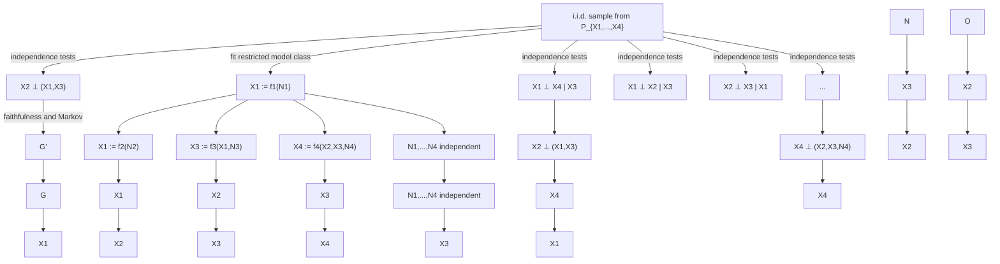

# Learning Multivariate Causal Models

As in Chapter 4, we now turn to the problem of learning causal models. We first discuss different assumptions under which (parts of) the graph structure can be recovered from the joint distribution in Section 7.1 (“structure identifiability”). Some of these results carry over from the bivariate setting discussed earlier. As in the bivariate case, there is no complete characterization of identifiability assumptions, and future research may reveal promising alternatives. In Section 7.2, we then introduce methods and algorithms, such as independence-based and score-based methods, that estimate the graph from a finite data set (“structure identification”).

As in the bivariate setting, we are again facing the problem that the class of SCMs is too flexible. Given a distribution $P _ { \mathbf { X } }$ over random variables $\mathbf { X } = \left( X _ { 1 } , \ldots , X _ { d } \right)$ , can different SCMs entail this distribution? This question is answered by the following proposition: indeed, usually for many different graph structures, there is an SCM that induces the distribution $R _ { \mathbf { X } } .$ .1

Proposition 7.1 (Non-uniqueness of graph structures) Consider a random vector $\mathbf { X } = \left( X _ { 1 } , \ldots , X _ { d } \right)$ with distribution PX that has a density with respect to Lebesgue measure and assume it is Markovian with respect to ${ \mathcal { G } } .$ . Then there exists an SCM ${ \mathfrak { C } } = ( \mathbf { S } , R _ { \mathbf { N } } )$ with graph G that entails the distribution $P _ { \mathbf { X } }$ .

Proof. See Appendix C.9.

In particular, given any complete DAG, we can find a corresponding SCM that entails the distribution at hand. As in the bivariate case, it is therefore apparent that we require further assumptions to obtain identifiability results. The following section discusses some of those assumptions.

## 7.1 Structure Identifiability

### 7.1.1 Faithfulness

If the distribution $P _ { \mathbf { X } }$ is Markovian and faithful with respect to the underlying DAG $\mathcal { G } ^ { 0 }$ , we have a one-to-one correspondence between d-separation statements in the graph $\mathcal { G } ^ { 0 }$ and the corresponding conditional independence statements in the distribution. All graphs outside the correct Markov equivalence class of $\mathcal { G } ^ { 0 }$ can therefore be rejected because they impose a set of d-separations that does not equal the set of conditional independences in $P _ { \mathbf { X } }$ . Since both the Markov condition and faithfulness put restrictions $o n l y$ on the conditional independences in the joint distribution, it is also clear that we are not able to distinguish between two Markov equivalent graphs, that is, between two graphs that entail exactly the same set of conditional independences (see for example Figure 6.4 on page 103). Summarizing, under the Markov condition and faithfulness, the Markov equivalence class of $\mathcal { G } ^ { 0 }$ , represented by $\mathrm { C P D A G } ( \mathcal { G } ^ { 0 } )$ , is identifiable from $P _ { \mathbf { X } }$ [e.g., Spirtes et al., 2000].

Lemma 7.2 (Identifiability of Markov equivalence class) Assume that $P _ { \mathbf { X } }$ is Markovian and faithful with respect to $\mathcal { G } ^ { 0 }$ . Then, for each graph $\mathcal { G } \in C P D A G ( \mathcal { G } ^ { 0 } )$ , we find an SCM that entails the distribution $R _ { \mathbf { X } }$ . Furthermore, there is no graph $\mathcal { G }$ with $\mathcal { G } \notin C P D A G ( \mathcal { G } ^ { 0 } )$ , such that $P _ { \mathbf { X } }$ is Markovian and faithful with respect to $\mathcal { G }$ .

Proof. The first statement is a direct implication from Proposition 7.1, and the second statement follows from the definitions of Markov equivalence, seen in Definition 6.24. 

Independence-based methods (also called constraint-based methods) assume that the distribution is Markovian and faithful with respect to the underlying graph and then estimate the correct Markov equivalence class; see Section 7.2.1.

We have seen in Example 6.42 that for Gaussian distributions the causal effect can be summarized by a single number (6.20). If instead of the correct graph, we only know the Markov equivalence class of that graph, this quantity is not identifiable anymore. It is possible, however, to provide bounds [Maathuis et al., 2009].

### 7.1.2 Additive Noise Models

Proposition 7.1 shows that a given distribution could have been entailed from several SCMs with different graphs. For many of these graph structures, however, the functions $f _ { j }$ appearing in the structural assignments are rather complicated. It turns out that we obtain non-trivial identifiability results if we do not allow for arbitrarily complex functions, that is, if we restrict the function class. As we have already seen in Chapter 4, we will assume in the following Sections 7.1.4 and 7.1.5 that the noise acts in an additive way.

Definition 7.3 (ANMs) We call an SCM C an ANM if the structural assignments are of the form

$$
X _ {j} := f _ {j} (\mathbf {P A} _ {j}) + N _ {j}, \quad j = 1, \dots , d, \tag {7.1}
$$

that is, if the noise is additive. For simplicity, we further assume that the functions $f _ { j }$ are differentiable and the noise variables $N _ { j }$ have a strictly positive density.2

Some of the following identifiability results assume causal minimality (Definition 6.33). For ANMs, this means that each function $f _ { j }$ is not constant in any of its arguments. Intuitively, the function should really “depend” on its arguments. The proof of the following proposition is provided in Appendix C.10.

Proposition 7.4 (Causal minimality and ANMs) Consider a distribution induced by a model (7.1) and assume that the functions $f _ { j }$ are not constant in any of its arguments, that is, for all j and $i \in \mathbf { P } \mathbf { A } _ { j }$ there is some value $\mathbf { p } \mathbf { a } _ { j , - i }$ of the variables $\mathbf { P A } _ { j } \backslash \{ i \}$ and some $x _ { i } \neq x _ { i } ^ { \prime }$ such that

$$
f _ {j} (\mathbf {p a} _ {j, - i}, x _ {i}) \neq f _ {j} (\mathbf {p a} _ {j, - i}, x _ {i} ^ {\prime}).
$$

Then the joint distribution satisfies causal minimality with respect to the corresponding graph. Conversely, if there are nodes j and i such that for all $\mathbf { p } \mathbf { a } _ { j , - i }$ the function $f _ { j } ( \mathbf { p a } _ { j , - i } , \cdot )$ is constant, causal minimality is violated.

We have argued in Remark 6.6 that we can restrict ourselves to functions that are not constant in one of their arguments; see Proposition 6.49. We have now seen that for ANMs with fully supported noise, this restriction implies causal minimality.

Given the restricted class of SCMs described in (7.1), do we obtain full structure identifiability? Again, the answer is negative. Theorem 4.2 and Problem 7.13 show that if the distribution is induced by a linear Gaussian SCM, for example, we cannot necessarily recover the correct graph. It turns out, however, that this case is exceptional in the following sense. For almost all other combinations of functions and distributions, we obtain identifiability. All the nonidentifiable cases have been characterized [Zhang and Hyvarinen, 2009, Peters et al., 2014]. Another ¨ non-identifiable example different from the linear Gaussian case is shown in the right plot in Figure 4.2. Its details can be found in Peters et al. [2014, Example 25]. Table 7.1 shows some of the known identifiability results.

**Table 7.1: Summary of some known identifiability results for Gaussian noise. Results for non-Gaussian noise identifiability results are available, too, but they are more technical.**

| Type of structural assignment | Type of structural assignment | Condition on funct. | DAG identif. | See |
| --- | --- | --- | --- | --- |
| (General) SCM: | $X_{j} := f_{j}(X_{\mathbf{PA}_{j}}, N_{j})$ | — | ✗ | Prop. 7.1 |
| ANM: | $X_{j} := f_{j}(X_{\mathbf{PA}_{j}}) + N_{j}$ | nonlinear | √ | Thm. 7.7(i) |
| CAM: | $X_{j} := \sum_{k \in \mathbf{PA}_{j}} f_{jk}(X_{k}) + N_{j}$ | nonlinear | √ | Thm. 7.7(ii) |
| Linear Gaussian: | $X_{j} := \sum_{k \in \mathbf{PA}_{j}} \beta_{jk} X_{k} + N_{j}$ | linear | ✗ | Problem 7.13 |
| Lin. G., eq. error var.: | $X_{j} := \sum_{k \in \mathbf{PA}_{j}} \beta_{jk} X_{k} + N_{j}$ | linear | √ | Prop. 7.5 |

Let us mention again that there are several extensions to the framework of ANMs. For example, Zhang and Hyvarinen [2009] allow for a post-nonlinear transforma- ¨ tion of the variables and Peters et al. [2011a] consider ANMs for discrete variables.

In general, nonlinear ANMs are not closed under marginalization. That is, if $P _ { X , Y , Z }$ allows for ANMs from X to Y and from Y to Z, $P _ { X , Z }$ does not necessarily allow for an ANM from X to Z. This may restrict the applicability of ANMs in practice, since one may not observe intermediate variables on a causal path. For experiments in physics, one could argue that every influence is propagated via infinitely many intermediate variables. Thus, there is no absolute notion of direct or indirect effect (instead, it must always be relative to the observed set). In this sense, ANMs can only be taken as good approximations.

In the following three subsections, we will look at three specific identifiable examples in more detail: the linear Gaussian case with equal error variances (Section 7.1.3), the linear non-Gaussian case (Section 7.1.4), and the nonlinear Gaussian case (Section 7.1.5). Although more general results are available [Peters et al., 2014], we concentrate on those two examples because for them precise conditions can be stated easily. We omit proofs and concentrate on the statements. Most of the proofs can be based on the techniques developed in Peters et al. [2011b]. They allow many of the bivariate identifiability results that we developed in Chapter 4 to carry over to the multivariate setting.

### 7.1.3 Linear Gaussian Models with Equal Error Variances

There is another deviation from linear Gaussian SEMs that makes the graph identifiable. Peters and Buhlmann [2014] show that restricting the noise variables to ¨ have the same variance is sufficient to recover the graph structure. The proof can be found in Peters and Buhlmann [2014]. ¨

Proposition 7.5 (Identifiability with equal error variances) Consider an SCM with graph G0 and assignments

$$
X _ {j} := \sum_ {k \in \mathbf {P A} _ {j} ^ {\mathcal {G} _ {0}}} \beta_ {j k} X _ {k} + N _ {j}, \qquad j = 1, \ldots , d,
$$

where all $N _ { j }$ are i.i.d. and follow a Gaussian distribution. In particular, the noise variance $\sigma ^ { \dot { 2 } }$ does not depend on j. Additionally, for each $j \in \{ 1 , \dotsc , p \}$ we require $\beta _ { j k } \neq 0$ for all $k \in \mathbf { P A } _ { j } ^ { \mathcal { G } _ { 0 } }$ . Then, the graph $\mathcal { G } _ { 0 }$ is identifiable from the joint distribution.

For estimating the coefficients $\beta _ { j k }$ (and therefore the graph structure) Peters and Buhlmann [2014] propose to use a penalized maximum likelihood score based ¨ on the Bayesian information criterion (BIC); see also Section 7.2.2, and a greedy search algorithm in the space of DAGs. Rescaling the variables changes the variance of the error terms. Therefore, in many applications, model (7.2) cannot be sensibly applied. The BIC, however, allows us to compare the method’s score with the score of a linear Gaussian SCM that uses more parameters and does not make the assumption of equal error variances.

### 7.1.4 Linear Non-Gaussian Acyclic Models

Shimizu et al. [2006] prove the following statement using independent component analysis (ICA) [Comon, 1994, Theorem 11], which itself is proved using the Darmois-Skitovic theorem. ˇ

Theorem 7.6 (Identifiability of LiNGAMs) Consider an SCM with graph $\mathcal { G } _ { 0 }$ and assignments

$$
X _ {j} := \sum_ {k \in \mathbf {P A} _ {j} ^ {\mathcal {G} _ {0}}} \beta_ {j k} X _ {k} + N _ {j}, \quad j = 1, \dots , d, \tag {7.2}
$$

where all Nj are jointly independent and non-Gaussian distributed with strictly positive density.3 Additionally, for each $j \in \{ 1 , \dotsc , p \}$ , we require $\beta _ { j k } \neq 0$ for all $k \in \mathbf { P A } _ { j } ^ { \mathcal { G } _ { 0 } }$ . Then, the graph $\mathcal { G } _ { 0 }$ is identifiable from the joint distribution.

The authors call this model a LiNGAM. As mentioned in Section 4.1.3, there is an alternative proof for Theorem 7.6: Theorem 28 in Peters et al. [2014] extends bivariate identifiability results such as Theorem 4.2 to the multivariate case. This trick is also used for nonlinear additive models (by extending Theorem 4.5).

### 7.1.5 Nonlinear Gaussian Additive Noise Models

We have seen that the graph structure of an ANM becomes identifiable if the assignments are linear and the noise variables are non-Gaussian. Alternatively, we can also exploit nonlinearity. The result is easiest to state with Gaussian noise:

### Theorem 7.7 (Identifiability of nonlinear Gaussian ANMs)

(i) Let $P _ { \mathbf { X } } = P _ { X _ { 1 } , \dots , X _ { d } }$ be induced by an SCM with

$$
X _ {j} := f _ {j} (\mathbf {P A} _ {j}) + N _ {j},
$$

with normally distributed noise variables $N _ { j } \sim \mathcal { N } ( 0 , \sigma _ { j } ^ { 2 } )$ and three times differentiable functions $f _ { j }$ that are not linear in any component in the following sense. Denote the parents $\mathbf { P A } _ { j }$ of Xj by $X _ { k _ { 1 } } , \ldots , X _ { k _ { \ell } }$ , then the function $f _ { j } ( x _ { k _ { 1 } } , \ldots , x _ { k _ { a - 1 } } , \cdot , x _ { k _ { a + 1 } } , \ldots , x _ { k _ { \ell } } )$ is assumed to be nonlinear for all a and some xk1 , . . . , xka−1 , xka+1 , . . . , xk\` ∈ R\`−1. $x _ { k _ { 1 } } , \hdots , x _ { k _ { a - 1 } } , x _ { k _ { a + 1 } } , \hdots , x _ { k _ { \ell } } \in \mathbb { R } ^ { \ell - 1 } ,$

(ii) As a special case, let $P _ { \mathbf { X } } = P _ { X _ { 1 } , \dots , X _ { d } }$ be induced by an SCM with

$$
X _ {j} := \sum_ {k \in \mathbf {P A} _ {j}} f _ {j, k} (X _ {k}) + N _ {j}, \tag {7.3}
$$

with normally distributed noise variables $N _ { j } \sim \mathcal { N } ( 0 , \sigma _ { j } ^ { 2 } )$ and three times differentiable, nonlinear functions $f _ { j , k } .$ . This model is known as a causal additive model (CAM).

In both cases (i) and (ii), we can identify the corresponding graph G0 from the distribution $P _ { \mathbf { X } }$ . The statements remain true if the noise distributions for source nodes, that is, nodes without parents, are allowed to have a non-Gaussian density with full support on the real line R (the proof remains identical).

The proof can be found in Peters et al. [2014, Corollary 31].

### 7.1.6 Observational and Experimental Data

We have already seen in Section 6.3 that knowing causal relations can help improve predictions when the underlying distribution changes. We will now turn this idea around and show how observing the system in different environments can be used to learn causal relations. We therefore turn to the following setup, in which we observe data from different environments $e \in { \mathcal { E } }$ . The corresponding model reads

$$
\mathbf {X} ^ {e} = (X _ {1} ^ {e}, \ldots , X _ {d} ^ {e}) \sim P ^ {e},
$$

where each variable $X _ { j } ^ { e }$ denotes the same (physical) quantity, measured in environment $e \in \mathcal { E }$ . We will talk about a variable $X _ { j }$ in different environments, which is a slight abuse of notation.

Known Intervention Targets A first type of method assumes that the different environments stem from different interventional settings. In the case that the intervention targets ${ \mathcal { Z } } ^ { e } \subseteq \{ 1 , \ldots , d \}$ are known, several methods have been proposed. Tian and Pearl [2001] and Hauser and Buhlmann [2012], for example, ¨ assume faithfulness and consider mechanism changes and stochastic interventions, respectively. They define and characterize the interventional equivalence classes of graphs: that is, the class of graphs that can explain the given distributions. For mechanism changes, for example, we can include an intervention node into the model whose children are the variables that are intervened on. This way we increase the number of v-structures and two graphs become intervention equivalent (with respect to the given distributions) if they have the same skeletons and vstructures, and the nodes that are intervened on have the same parents [cf. Tian and Pearl, 2001, Theorem 2]. Eberhardt et al. [2010] allow for hard and stochastic interventions even in the presence of cycles.

Hyttinen et al. [2012] analyze conditions on the interventions under which the graph becomes identifiable. Eberhardt et al. [2005] and Hauser and Buhlmann ¨ [2014] investigate how many intervention experiments are necessary in the worst case to identify the graph.

Different Environments Let us now turn to a slightly different setting, in which we do not try to learn the whole causal structure. Instead, we consider a target variable Y with a set of d predictors X and try to learn which of the predictors are the causal parents of Y . Both X and Y are observed in different environments $e \in \mathcal { E }$ (which could be intervention settings with unknown targets). That is, we have

$$
\left(\mathbf {X} ^ {e}, Y ^ {e}\right) \sim P _ {\mathbf {X} ^ {e}, Y ^ {e}} =: P ^ {e}
$$

for $e \in \mathcal { E }$ . The key assumption is the existence of an unknown set $\mathbf { P A } _ { Y } \subseteq \{ 1 , \dots , d \}$ (one may think of the direct causes of Y ) such that the conditional Y given $\mathbf { P A } _ { Y }$ is invariant over all environments, that is, for all $e , f \in { \mathcal { E } }$ we have

$$
P _ {Y ^ {e} \mid \mathbf {P A} _ {Y} ^ {e}} = P _ {Y ^ {f} \mid \mathbf {P A} _ {Y} ^ {f}}.
$$

This assumption is satisfied if the distributions are induced by an underlying SCM and the different environments correspond to different intervention distributions, for which Y has not been intervened on [Peters et al., 2016] (see Code Snippet 7.11 for an example). Having said that, the setting is more general and the environments do not need to correspond to interventions; one does not even require an underlying SCM. One can consider the collection S of all sets $S \subseteq \{ 1 , \ldots , d \}$ of variables that lead to “invariant prediction,” that is, for all $e , f \in { \mathcal { E } }$ and for all $S \in { \mathcal { S } }$ , we have

$$
P _ {Y ^ {e} \mid S ^ {e}} = P _ {Y ^ {f} \mid S ^ {f}}. \tag {7.4}
$$

Here, $Y ^ { e } \mid S ^ { e }$ is shorthand notation for $Y ^ { e } | \mathbf { X } _ { S } ^ { e }$ . It is not difficult to see (Problem 7.15) that the variables appearing in all those sets $S \in { \mathcal { S } }$ must be direct causes of Y :

$$
\bigcap_ {S \in \mathcal {S}} S \subseteq \mathbf {P A} _ {Y}, \tag {7.5}
$$

where we define the intersection over an empty index set as the empty set. Peters et al. [2016] consider the left-hand side of (7.5) as an estimate for $\mathbf { P A } _ { Y } . \ ( 7 . 5 )$ then guarantees that any variable contained in the output of this method is indeed in ${ \bf P } { \bf A } _ { Y }$ . In the special case of SCMs and interventions, there are sufficient conditions [Peters et al., 2016] under which $\mathbf { P A } _ { Y }$ becomes identifiable, in other words, (7.5) is an equality. Interestingly, the method we present in Section 7.2.5 realizes whether the data come from such an identifiable case, it does not need to assume it.

Tian and Pearl [2001] also address the question of identifiability with unknown intervention targets. They do not specify a target variable and focus on changes in marginal distributions rather than conditionals.

## 7.2 Methods for Structure Identification

We have seen several assumptions that lead to (partial) identifiability of the causal structure. The purpose of this section is to show how these assumptions can be exploited to provide estimators of the underlying graph from a finite amount of data (see Figure 7.1 for two examples). We provide an overview of methods and try to focus on their ideas. There is a large pool of methods, and we believe that future research needs to show which of these methods will prove to be most useful in practice. We nevertheless try to highlight some of the methods’ potential problems and most crucial assumptions. Although some papers study the consistency of the presented methodology, we omit most of those results and present ideas only. Subtleties of algorithmic implementation will not be discussed either, and we would like to refer the interested reader to the references we provide. Kalisch et al. [2012] maintain the software package pcalg for R [R Core Team, 2016] that contains code not only for the PC (for the inventors Peter Spirtes and Clark Glymour) algorithm (see Section 7.2.1), but also for many of the described methods.

Before providing more details about the existing methodology, we would like to add two comments first: (1) While there are several simulation studies available, a topic that receives little attention is the question of a loss function. Given the true underlying causal structure, how “good” is an estimated causal graph? In practice, one often uses variants of the structural Hamming distance [Acid and de Campos, 2003, Tsamardinos et al., 2006], which counts the number of misspecified edges. As an alternative, Peters and Buhlmann [2015] suggest evaluating the graph based ¨ on its ability to predict intervention distributions. (2) Some of the methods that we present assume that the structural assignments (6.1) and the corresponding functions $f _ { j }$ in particular are simple. Often, those methods do provide estimates not only for the causal structure but also for the corresponding assignments, which can usually be used to compute residuals, too. In principle, and under this model, we can then test the strong assumption of mutually independent noise variables (Definition 3.1), for example, by applying a mutual independence test [e.g., Pfister et al., 2017]; see Section 4.2.1 for statistical subtleties of such a procedure.

### 7.2.1 Independence-Based Methods

Independence-based methods such as the inductive causation (IC) algorithm, the SGS (for the inventors Spirtes, Glymour, and Scheines) algorithm, and the PC algorithm assume that the distribution is faithful to the underlying DAG. This renders the Markov equivalence class, that is, the corresponding CPDAG, identifiable (see Section 7.1.1). There is a one-to-one correspondence between d-separations in the graph and conditional independences in PX. Any query of a d-separation statement can therefore be answered by checking the corresponding conditional independence test. We first assume that an oracle provides us with the correct answers to the conditional independence questions and discuss some finite sample issues in the paragraph “Conditional Independence Tests.”




Figure 7.1: The figure summarizes two approaches for the identification of causal structures. Independence-based methods (top) test for conditional independences in the data; these properties are related to the graph structure by the Markov condition and faithfulness. Often, the graph is not uniquely identifiable; the method may therefore output different graphs $\mathcal { G }$ and $\mathcal { G } ^ { \prime }$ . Alternatively, one may restrict the model class and fit the SCM directly (bottom).

Estimation of Skeleton Most independence-based methods first estimate the skeleton, that is, the undirected edges, and orient as many edges as possible afterward. For the skeleton search, the following lemma is useful to know [see Verma and Pearl, 1991, Lemma 1].

### Lemma 7.8 The following two statements hold.

(i) Two nodes X,Y in a DAG (X, E) are adjacent if and only if they cannot be d-separated by any subset $S \subseteq \mathbf { V } \backslash \{ X , Y \}$ .  
(ii) If two nodes X,Y in a DAG (X, E) are not adjacent, then they are d-separated by either $\mathbf { P A } _ { X } o r \mathbf { P A } _ { Y }$ .

Using Lemma 7.8(i), we have that if two variables are always dependent, no matter what other variables one conditions on, these two variables must be adjacent. This result is used in the IC algorithm [Pearl, 2009] and in the SGS algorithm [Spirtes et al., 2000]. For each pair of nodes (X,Y ), these methods search through all possible subsets $\mathbf { A } \subseteq \mathbf { X } \setminus \{ X , Y \}$ of variables neither containing X nor Y and check whether X and Y are d-separated given A. After all those tests, X and Y are adjacent if and only if no set A was found that d-separates X and Y .

Searching through all possible subsets A does not seem optimal, especially if the graph is sparse. The PC algorithm [Spirtes et al., 2000] starts with a fully connected undirected graph and step-by-step increases the size of the conditioning set A, starting with #A = 0. At iteration k, it considers sets A of size #A = k, using the following neat trick: to test whether X and Y can be d-separated, one only has to go through sets A that are subsets either of the neighbors of X or of the neighbors of Y ; this idea is based on Lemma 7.8(ii) and clearly improves the computation time, especially for sparse graphs.

Orientation of Edges Lemma 6.25 suggests that we should be able to orient the immoralities (or v-structures) in the graph. If two nodes are not directly connected in the obtained skeleton, there is a set that d-separates these nodes. Suppose that the skeleton contains the structure X − Z −Y with no direct edge between X and Y ; further, let A be a set that d-separates X and Y . The structure X − Z − Y is an immorality and can therefore be oriented as $X \right. Z \left. Y$ if and only if Z ∈/ A. After the orientation of immoralities, we may be able to orient some further edges in order to avoid cycles, for example. There is a set of such orientation rules that has been shown to be complete and is known as Meek’s orientation rules [Meek, 1995].

Satisfiability Methods An alternative to the graphical approach just described is to formulate causal learning as a satisfiability (SAT) problem [Triantafillou et al., 2010]. First, one formulates graphical relations as Boolean variables, such as A := “There is a direct edge from X to Y .” The non-trivial part is then to translate the independence statements (we still assume that they are provided by an independence oracle), as d-separation statements into “formulas” that involve Boolean variables and the operators “and” and “or.” The SAT question then asks whether we can assign a value “true” or “false” to each of the Boolean variables to make the overall formula true. SAT solvers not only check whether this is the case but also provide us with the information as to whether in all of the assignments that make the overall formula true, certain variables are always assigned to the same value. For example, the d-separation statements may be satisfied by different graph structures that correspond to different assignments, but if in all such assignments the Boolean variable A from above takes the value “true,” we can infer that in the underlying graph, X must be a parent of Y . Even though the Boolean SAT problem is known to be nondeterministic polynomial time (NP)-complete [Cook, 1971, Levin, 1973], that is, it is NP and NP-hard, there are heuristic algorithms that can solve instances of large problems, involving millions of variables. SAT methods in causal learning allow us to query specific statements as an ancestral relation rather than estimating the full graph. They let us incorporate different kinds of prior knowledge and furthermore, we can put weights on the independence constraints if we believe that some of the (statistical) findings contradict each other. These approaches have been extended to cycles, latent variables, and overlapping data sets [Hyttinen et al., 2013, Triantafillou and Tsamardinos, 2015].

Conditional Independence Tests In the three preceding paragraphs we have assumed the existence of an independence oracle that tells us whether a specific (conditional) independence is or is not present in the distribution. In practice, however, we have to infer this statement from a finite amount of data. This comes with two major challenges: (1) All causal discovery methods that are based on conditional independence tests draw conclusions both from dependences and independences. In practice, however, one most often uses statistical significance tests, which are inherently asymmetric. One therefore usually forgets about the original meaning of the significance level and treats it as a tuning parameter. Furthermore, due to finite samples, the testing results might even contradict each other in the sense that there is no graph structure that encodes the exact set of inferred conditional independences. (2) Although there is some recent work on kernel-based tests [Fukumizu et al., 2008, Tillman et al., 2009, Zhang et al., 2011], nonparametric conditional independence tests are difficult to perform with a finite amount of data. One therefore often restricts oneself to a subclass of possible dependences, some of which we now briefly review.

If the variables are assumed to follow a Gaussian distribution, we can test for vanishing partial correlation (see Appendices A.1 and A.2). Under faithfulness, the Markov equivalence class of the underlying DAG becomes identifiable (Lemma 7.2) and indeed, in the Gaussian setting, the PC algorithm with a test for vanishing partial correlation provides a consistent estimator for the correct CPDAG [Kalisch and Buhlmann, 2007]. Additionally assuming a condition called strong ¨ faithfulness [Zhang and Spirtes, 2003, Uhler et al., 2013] even yields uniform consistency [Kalisch and Buhlmann, 2007]; see also the discussion in Robins et al.¨ [2003].

Non-parametric conditional independence testing is a difficult problem in theory and practice. For non-Gaussian distributions, vanishing partial correlation is neither necessary nor sufficient for conditional independence, as shown by the following example.

### Example 7.9 (Conditional independence and partial correlation)

(i) If the distribution $P _ { X , Y , Z }$ is entailed by the SCM

$$
Z := N _ {Z}, \quad X := Z ^ {2} + N _ {X}, \quad Y := Z ^ {2} + N _ {Y},
$$

where $N _ { X } , N _ { Y } , N _ { Z } \overset { \mathrm { i i d } } { \sim } \mathcal { N } ( 0 , 1 )$ , it satisfies

$$
X \perp Y | Z \quad \text { and } \quad \rho_ {X, Y | Z} \neq 0.
$$

The partial correlation coefficient $\rho _ { X , Y \mid Z }$ equals the correlation of $X - \alpha Z$ and $Y - \beta Z$ where α and $\beta$ are the regression coefficients when regressing X and Y on $Z ,$ respectively. In this example, $\alpha = \beta = 0$ because X and Y do not correlate with Z.

(ii) The distribution $P _ { X , Y , Z }$ entailed by the SCM

$$
Z := N _ {Z}, \quad X := Z + N _ {X}, \quad Y := Z + N _ {Y},
$$

where $( N _ { X } , N _ { Y } )$ ⊥⊥ $N _ { Z }$ and $( N _ { X } , N _ { Y } )$ are uncorrelated but not independent, satisfies

$$
X \not \perp Y | Z \quad \text { and } \quad \rho_ {X, Y | Z} = 0
$$

since here, $\rho _ { X , Y \mid Z }$ is the correlation between $N _ { X }$ and $N _ { Y }$ .

Therefore, vanishing partial correlation does not imply and is not implied by conditional independence. □

The following procedure for testing whether X and Y are conditionally independent given Z provides a natural nonlinear extension of partial correlation [e.g., Ramsey, 2014]: (1) (nonlinearly) regress X on Z and test whether the residuals are independent of Y ; (2) (nonlinearly) regress Y on Z and test whether the residuals are independent of X; (3) if one of those two independences hold, conclude that $X \perp \perp Y \mid Z .$ . This seems to be the correct test in the case of ANMs; see Section 7.1.2. For three variables, for example, we have the following result.

Proposition 7.10 Consider a distribution $P _ { X , Y , Z }$ induced by an ANM (Definition 7.3) with all variables having strictly positive densities. If X and Y are dseparated given $Z ,$ then the procedure just described outputs the corresponding conditional independence in the sense that either $X - \mathbb { E } [ X | Z ]$ is independent of Y or $Y - \mathbb { E } [ Y | Z ]$ is independent of X.

Proof. Assume that $X : = h ( Z ) + N _ { X }$ and $Y : = f ( Z ) + N _ { Y }$ , with $Z , N _ { X }$ , and $N _ { Y }$ being mutually independent. Then, $X - \mathbb { E } [ X | Z ] = N _ { X }$ is independent of Y . The statement follows analogously for the other possible structures, for example, $X $ $Z \to Y \ \mathrm { o r } X  Z  Y$ . 

The proposition shows that (in a population sense) the test described is appropriate for ANMs with three variables. Considering four variables $X , Y , Z , V$ , however, may already lead to problems. Clearly, the graphs $X  Z  W  Y$ and $X  Z  W  Y$ are Markov equivalent. But while the test outputs $X \perp \perp Y \mid Z$ for the first graph, there is no such guarantee for the second graph. Thus, the abovementioned restriction of the dependence model between random variables that can be used to construct feasible conditional independence tests leads to asymmetric treatment of graphs within a Markov equivalence class. This effect may be the same for many other types of methods for conditional independence testing. This asymmetry does not necessarily need to be a drawback since, as we have seen, restricted function classes may lead to identifiability within the Markov equivalence class (see Section 7.1). It certainly requires consideration, though.

### 7.2.2 Score-Based Methods

In the preceding section we have directly used the independence statements to infer the graph. Alternatively, we can test different graph structures in their ability to fit the data. The rationale is that graph structures encoding the wrong conditional independences, for example, will yield bad model fits. Although the roots for score-based methods for causal learning may date back even further, we mainly refer to Geiger and Heckerman [1994a], Heckerman et al. [1999], Chickering [2002], and references therein. The Max-Min Hill-Climbing algorithm [Tsamardinos et al., 2006] combines score-based and independence-based techniques.

Best Scoring Graph Given data $\mathcal { D } = ( \mathbf { X } ^ { 1 } , \ldots , \mathbf { X } ^ { n } )$ from a vector X of variables, that is, a sample containing n i.i.d. observations, the idea is to assign a score $S ( \mathcal { D } , \mathcal { G } )$ to each graph $\mathcal { G }$ and search over the space of DAGs to find the graph with the highest score:

$$
\hat {\mathcal {G}} := \underset {\mathcal {G} \text {   DAG   over   } \mathbf {X}} {\operatorname{argmax}} S (\mathcal {D}, \mathcal {G}). \tag {7.6}
$$

There are several possibilities to define such a scoring function S. Often a parametric model is assumed $( \mathrm { e . g . }$ , linear Gaussian equations or multinomial distributions), which introduces a set of parameters $\theta \in \Theta$ .

(Penalized) Likelihood For each graph we may consider the maximum likelihood estimator $\hat { \theta }$ for $\theta$ and then define a score function by the BIC

$$
S (\mathcal {D}, \mathcal {G}) = \log p (\mathcal {D} | \hat {\theta}, \mathcal {G}) - \frac {\# \text { parameters }}{2} \log n, \tag {7.7}
$$

where log $p ( \mathcal { D } | \hat { \theta } , \mathcal { G } )$ is the log likelihood and n is the sample size. Estimators that output the graph with the largest (penalized) likelihood are often consistent. This follows from the consistency of BIC [Haughton, 1988], and identifiability of the model class. To guarantee rates of convergence, however, one usually relies on a “degree of identifiability” [e.g., Buhlmann et al., 2014]. In practice, finding the best ¨ scoring graph among all possible graphs may not be feasible and search techniques over the space of graphs are required (e.g., see the paragraph “Greedy Search Techniques”). Regularization different from BIC is possible, too. Roos et al. [2008] base their score on the minimum description length principle [Grunwald, 2007], ¨ for example. Using work by Haughton [1988], Chickering [2002] discusses how the BIC approach relates to a Bayesian formulation that we discuss next.

Bayesian Scoring Functions We define priors $p _ { p r } ( \mathcal G )$ and $p _ { p r } ( \theta )$ over DAGs and parameters, respectively, and consider the log posterior as a score function (note that $p ( \mathcal { D } )$ is constant over all DAGs):

$$
S (\mathcal {D}, \mathcal {G}) := \log p (\mathcal {G} | \mathcal {D}) \propto \log p _ {p r} (\mathcal {G}) + \log p (\mathcal {D} | \mathcal {G}),
$$

where $p ( \mathcal { D } | \mathcal { G } )$ is the marginal likelihood

$$
p (\mathcal {D} | \mathcal {G}) = \int_ {\theta \in \Theta} p (\mathcal {D} | \mathcal {G}, \theta)   p _ {p r} (\theta   |   \mathcal {G})   d \theta .
$$

Here, the resulting estimator $\hat { \mathcal G }$ from Equation (7.6) is the mode of the posterior distribution, which is usually called a maximum a posteriori (MAP) estimator. Alternatively, one may output the full posterior distribution over DAGs, and, in principle, even more detailed information is available. For instance, one can average over all graphs to get a posterior probability of the existence of a specific edge.

As an example, consider random variables that take only finitely many values. For a given structure $\mathcal { G } _ { : }$ , one may then assume that for each parent configuration the probability distribution of a random variable $X _ { j }$ follows a multinomial distribution. If we put a Dirichlet prior on its parameters (together with some further conditions on parameter independence and modularity), this leads to the Bayesian Dirichlet (BD) score [Geiger and Heckerman, 1994b].

In the case of parametric models, we call two graphs $\mathcal { G } _ { 1 }$ and $\mathcal { G } _ { 2 }$ distribution equivalent if for each parameter $\theta _ { 1 }$ there is a corresponding parameter $\theta _ { 2 }$ , such that the distribution obtained from $\mathcal { G } _ { 1 }$ in combination with $\theta _ { 1 }$ is the same as the distribution obtained from graph $\mathcal { G } _ { 2 }$ with $\theta _ { 2 }$ , and vice versa. It can be shown (see Problem 7.12) that in the linear Gaussian case, for example, two graphs are distribution equivalent if and only if they are Markov equivalent. It has therefore been argued that $p ( \mathcal { D } | \mathcal { G } _ { 1 } )$ and $p ( \mathcal { D } | \mathcal { G } _ { 2 } )$ should be the same for Markov equivalent graphs $\mathcal { G } _ { 1 }$ and $\mathcal { G } _ { 2 }$ . The BD score can be adapted to satisfy this property. It is usually referred to as the Bayesian Dirichlet equivalence (BDe) score [Geiger and Heckerman, 1994b]. Buntine [1991] proposes a specific version of this score with even fewer hyperparameters.

Greedy Search Techniques The search space of all DAGs is growing superexponentially in the number of variables [e.g., Chickering, 2002], the numbers of DAGs for 2, 3, 4, and 10 variables are 3, 25, 543, and 4175098976430598143, respectively (see Table B.1). Therefore, computing a solution to Equation (7.6) by searching over all graphs is often infeasible. Instead, greedy search algorithms can be applied to solve (7.6). At each step there is a candidate graph and a set of neighboring graphs. For all these neighbors, one computes the score and considers the best-scoring graph as the new candidate. If none of the neighbors obtains a better score, the search procedure terminates (not knowing whether one obtained only a local optimum). Clearly, one therefore has to define a neighborhood relation. Starting from a graph ${ \mathcal { G } } _ { : }$ we may define all graphs as neighbors from $\mathcal { G }$ that can be obtained by removing, adding, or reversing one edge, for example.

In the case of a linear Gaussian SCM, one cannot distinguish between Markov equivalent graphs. It turns out that then it is beneficial to change the search space to Markov equivalence classes instead of DAGs. The greedy equivalence search (GES) [Chickering, 2002] optimizes the BIC criterion (7.7) and starts with the empty graph. It consists of two-phases: in the first phase, edges are added until a local maximum is reached; in the second phase, edges are removed until a local maximum is reached, which is then given as an output of the algorithm.

Exact Methods In general, finding the optimal scoring DAG is NP-hard [Chickering, 1996] but still there is a lot of interesting research that tries to scale up exact methods. Here, “exact” means that they aim at finding (one of) the best scoring graphs for a given finite data set. Greedy search techniques are often heuristic and have guarantees — if at all — only in the limit of infinite data.

One line of research is based on dynamic programming [Silander and Myllymak, 2006, Koivisto and Sood, 2004, Koivisto, 2006]. These approaches exploit the decomposability of many scores that are used in practice: due to the Markov factorization, we have for $\mathcal { D } = ( \mathbf { X } ^ { 1 } , \ldots , \mathbf { X } ^ { n } )$ that

$$
\log p (\mathcal {D} | \hat {\boldsymbol {\theta}}, \mathcal {G}) = \sum_ {j = 1} ^ {d} \sum_ {i = 1} ^ {n} \log p (X _ {j} ^ {i} | X _ {\mathbf {P A} _ {j} ^ {\mathcal {G}}} ^ {i}, \hat {\boldsymbol {\theta}}),
$$

which is a sum of $d$ “local” scores. Methods based on dynamic programming exploit this decomposability, and despite their exponential complexity they can find the best scoring graph $\mathrm { f o r } \geq 3 0$ variables, even if one does not restrict the number of parents. This is a remarkable result given the enormous number of different DAGs over this number of variables (see Table B.1).

The integer linear programming (ILP) framework assumes not only decomposability but also that the scoring function gives the same score to Markov equivalent graphs. The idea is then to represent graphical structures as vectors, such that the scoring function becomes an affine function in this vector representation. Studeny´ and Haws [2014] describe how Hemmecke et al. [2012] base their representation on characteristic imsets, while Jaakkola et al. [2010] and Cussens [2011] use (exponentially long) zero-one codes instead that indicate parent-child-relationships between nodes and reduce the search space exploiting work by De Campos and Ji [2011]. Having formulated the problem as an ILP problem, the problem is still NPhard, but one may now use off-the-shelf methods for ILP. Restricting the number of parents leads to further advances, for example, in “pedigree learning” each node has at most two parents [Sheehan et al., 2014].

### 7.2.3 Additive Noise Models

ANMs can be learned with score-based methods that are combined with a greedy search technique. This has been proposed for linear Gaussian models with equal error variances (Section 7.1.3) or nonlinear Gaussian ANMs (Section 7.1.5) [see Peters and Buhlmann, 2014, B¨ uhlmann et al., 2014]. In the nonlinear Gaussian¨ case, for example, we can proceed analogously to the bivariate case (see Equations (4.18) and (4.19)). For a given graph structure ${ \mathcal { G } } .$ , we regress each variable on its parents and obtain the score

$$
\log p (\mathcal {D} | \mathcal {G}) = \sum_ {j = 1} ^ {d} - \log \widehat {\mathrm{var}} [ R _ {j} ];
$$

here, $\widehat { \mathrm { v a r } } [ R _ { j } ]$ is the empirical variance of the residuals $R _ { j }$ obtained from the regression of variable $X _ { j }$ on its parents. Intuitively, the better the model fits the data, the smaller the variance of the residuals and thus the larger our score. Formally, the procedure is an instance of maximum likelihood and can be shown to be consistent [Buhlmann et al., 2014]. Computationally, we can again exploit the property ¨ that the score decomposes over the different nodes. When computing the score for a neighboring graph that changes the parent set of only one variable, we need to update only the corresponding summand. If the noise cannot be assumed to have a Gaussian distribution, for example, one can estimate the noise distribution [Nowzohour and Buhlmann, 2016] and obtain an entropy-like score. ¨

Alternatively, one can estimate the structure in an iterative way using independence tests. Mooij et al. [2009] and Peters et al. [2014] propose a regression with subsequent independence test (RESIT). The method is based on the property that the noise variables are independent of all preceding variables. For linear non-Gaussian models (Section 7.1.4), Shimizu et al. [2006] provide a practical method based on ICA [Comon, 1994, Hyvarinen et al., 2001] that can be applied to a finite ¨ amount of data. Later, an improved version of this method has been proposed in Shimizu et al. [2011].

### 7.2.4 Known Causal Ordering

It is often difficult to find the causal ordering (see Appendix B) of the underlying causal model. Given the causal ordering, however, estimating the graph reduces to “classical” variable selection. Assume, for example, that

$$
X := N _ {X}
$$

$$
Y := f (X, N _ {Y})
$$

$$
Z := g (X, Y, N _ {Z})
$$

with unknown $f , g , N _ { X } , N _ { Y } , N _ { Z }$ . Deciding whether f depends on X, and g depends on X and/or Y (see the assumption of structural minimality in Remark 6.6) is then a well-studied significance problem in “traditional” statistics. Standard methods can be used, especially if further structural assumptions are made, such as linearity [e.g., Hastie et al., 2009, Buhlmann and van de Geer, 2011]. This observation ¨ has been made before [e.g., Teyssier and Koller, 2005, Shojaie and Michailidis, 2010] and it has been suggested that instead of searching over the space of directed acyclic graphs, it might be beneficial to search over the causal order first and then perform variable selection [e.g., Teyssier and Koller, 2005, Buhlmann et al., 2014]. ¨

### 7.2.5 Observational and Experimental Data

Section 7.1.6 describes how causal structures may become identifiable when we observe the system under different conditions (“environments”). We now discuss how these results can be exploited in practice, that is, given only finitely many data. Let us therefore assume that we obtain one sample ${ \bf X } _ { n _ { e } } ^ { e }$ for each environment $e \in \mathcal { E }$ ; that is, for each of the environments, we observe ne i.i.d. data points.

Known Intervention Targets Here, each setting corresponds to an interventional experiment, and we have additional knowledge of the intervention targets ${ \mathcal { Z } } ^ { e } \subseteq \{ 1 , \ldots , p \}$ . Cooper and Yoo [1999] incorporate the intervention effects as mechanism changes into a Bayesian framework. For perfect interventions, Hauser and Buhlmann [2015] consider linear Gaussian SCMs and propose a greedy inter- ¨ ventional equivalence search (GIES), a modified version of the GES algorithm that we briefly described in Section 7.2.2.

Sometimes, one is not able to measure all variables in each experiment (this can even be the case when all experiments are observational) but nevertheless wants to combine the information from the available data; this problem has been addressed by SAT-based approaches [see, e.g., Triantafillou and Tsamardinos, 2015, Tillman and Eberhardt, 2014, references therein].

Unknown Intervention Targets Eaton and Murphy [2007] do not assume that the targets of the different interventions are known. Instead, they introduce for each environment $e \in \mathcal { E }$ an intervention node $I _ { e }$ with no incoming edges (see “Intervention Variables” on page 95); for each data point only one intervention node is active. Then, they apply standard methods to the enlarged model with $d + \# { \mathcal { E } }$ variables, subject to the constraint that intervention nodes do not have any parents.

Tian and Pearl [2001] propose to test whether the marginal distributions change in the different settings and use this information to infer parts of the graph structure. They even combine this method with an independence-based method.

Different Environments In Section 7.1.6, we have also considered the problem of estimating the causal parents of a target variable Y among the set X of d predictors. Therefore, we have defined the set S as the collection of all sets $S \subseteq \{ 1 , \ldots , d \}$ that satisfy invariant prediction, that is, for which $P _ { Y ^ { e } \mid S ^ { e } }$ remains invariant over all environments $e \in \mathcal { E } ;$ see (7.4). In practice, we can test the hypothesis of invariant prediction at level α and collect all sets S that pass the test as an estimate $\hat { S }$ for the set S. Because the true set of parents $\mathbf { P } \mathbf { A } _ { Y } \subseteq \mathbf { X }$ is a member of $\hat { S }$ with high probability (1 − α), we obtain the coverage statement

$$
\bigcap_ {S \in \hat {\mathcal {S}}} S \subseteq \mathbf {P A} _ {Y} \tag {7.8}
$$

with high probability (1 − α). The left-hand side of (7.8) is the output of a method called “invariant causal prediction” [Peters et al., 2016]. Code Snippet 7.11 shows an example for which the environments correspond to different interventions (this is not required by the method). To obtain correct coverage in the sense of (7.8), one only needs to model the conditional Y given $\mathbf { P A } _ { Y } \mathbf { ; }$ ; in particular, one does not assume anything on the distribution of the $d$ predictors X. This is different for the method proposed by Eaton and Murphy [2007] (see the paragraph “Unknown Intervention Targets”), which additionally tries to estimate the full causal structure.

Code Snippet 7.11 The following code shows an example of a causal system in two environments. In the true underlying structure we have that $X _ { 1 }$ and $X _ { 2 }$ are causing Y , which itself is causing $X _ { 3 }$ . In a linear model on the pooled data (line 13), all variables $X _ { 1 } , X _ { 2 }$ , and $X _ { 3 }$ are highly significant since all of them are good predictors for Y . Such a model is not invariant, however. In the two environments a regression from Y on $X _ { 1 } , X _ { 2 } , X _ { 3 }$ yields coefficients −0.15, 1.09, −0.39, and −0.32, 1.62, −0.54, respectively. The method of invariant causal prediction outputs only the causal parents of Y , that is, $X _ { 1 }$ and $X _ { 2 }$ . In this example, {1, 2} is the only set yielding an invariant model, that is, $\hat { S } = \{ \{ 1 , 2 \} \}$ .

```r
library(InvariantCausalPrediction)
#
# generate data from two environments
env <- c(rep(1,400),rep(2,700))
n <- length(env)
set.seed(1)
X1 <- rnorm(n)
X2 <- 1*X1 + c(rep(0.1,400), rep(1.0,700))*rnorm(n)
Y <- -0.7*X1 + 0.6*X2 + 0.1*rnorm(n)
X3 <- c(rep(-2,400), rep(-1,700))*Y + 2.5*X2 + 0.1*rnorm(n)
#
summary(lm(Y~-1+X1+X2+X3))
# Coefficients:
# ----Estimate Std.Error t.val. Pr(>|t|)
# X1 -0.396212 0.008667 -45.71 <2e-16 ***
# X2 +1.381497 0.021377 +64.63 <2e-16 ***
# X3 -0.410647 0.011152 -36.82 <2e-16 ***
#
ICP(cbind(X1,X2,X3), Y, env)
#lower bd upper bd p-value
# X1 -0.71 -0.68 3.7e-06 ***
# X2 +0.59 +0.61 0.0092 **
# X3 -0.00 +0.00 0.2972
```

### 7.3. Problems

### 7.3 Problems

Problem 7.12 (Gaussian SCMs) Prove that for linear Gaussian SCMs, two graphs $\mathcal { G } _ { 1 }$ and $\mathcal { G } _ { 2 }$ are distribution equivalent if and only if they are Markov equivalent. Here, we allow for zero coefficients.

Problem 7.13 (Gaussian SCMs) Consider a distribution PX of $\mathbf { X } = \left( X _ { 1 } , \ldots , X _ { d } \right)$ with density $p$ induced from a linear Gaussian SCM C. Prove that for any DAG $\mathcal { G }$ such that $R _ { \mathbf { X } }$ is Markovian with respect to ${ \mathcal { G } } ,$ , there is a corresponding linear Gaussian SCM ${ \mathfrak { C } } _ { { \mathcal { G } } }$ entailing $R _ { \mathbf { X } }$ .

Problem 7.14 (ANMs) Prove that ANMs over $\mathbf { X } = \left( X _ { 1 } , \ldots , X _ { d } \right)$ with differentiable functions $f _ { j }$ and noise variables that have a strictly positive density entail a distribution over X that has a strictly positive density, too (see Definition 7.3).

Problem 7.15 (Invariant causal prediction) Prove Equation (7.5).

# 8