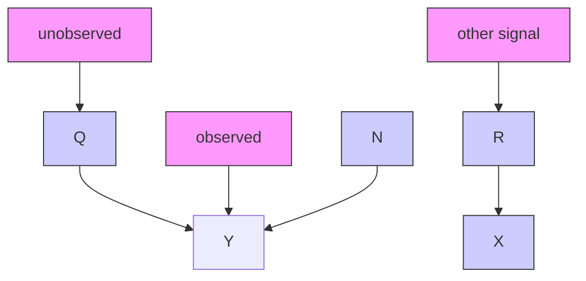
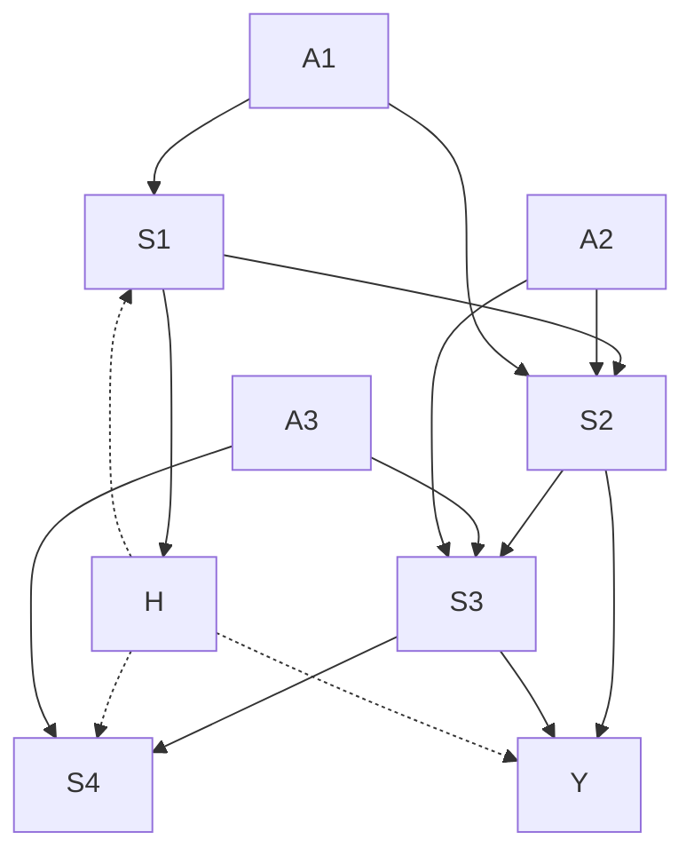
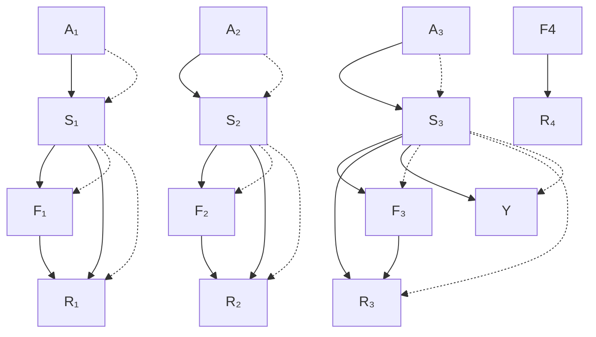
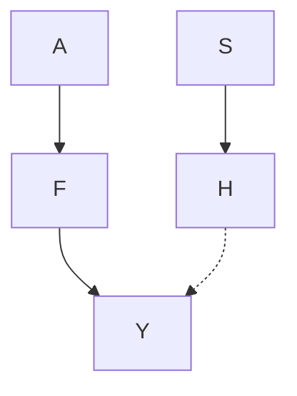

# Connections to Machine Learning, II

As argued in Chapter 5, the causal structure that underlies a statistical model can have strong implications for machine learning tasks such as semi-supervised learning or domain adaptation. We now revisit this general topic, focusing on the multivariate case. We begin with a method that uses machine learning to model systematic errors for a given causal structure, followed by some thoughts on reinforcement learning (with an application in computational advertising), and finally we comment on the topic of domain adaptation.

## 8.1 Half-Sibling Regression

This method exploits a given causal structure (see Figure 8.1) to reduce systematic noise in a prediction task. The goal is to reconstruct the unobserved signal Q. Scholkopf et al. [2015] suggest that we can denoise the signal ¨ Y by removing all information that can be explained by other measurements X that have been corrupted with the same source of noise. Here, X are measurements of some signals R that are independent of Q. Intuitively, everything in Y that can be explained by X must be due to the systematic noise N and should therefore be removed. More precisely, we consider

$$
\hat {Q} := Y - \mathbb {E} [ Y | X ]
$$

as an estimate for Q. Here, $\mathbb { E } [ Y | X ]$ is the regression of Y on its half-siblings X (note that X and Y share the parent N; see Figure 8.1).

One can show that for any random variables $Q , X , Y$ that satisfy $Q \perp \perp X$ , we have

Figure 8.1: The causal structure that applies to the exoplanet search problem. The underlying signal of interest $Q$ can only be measured as a noisy version Y . If the same noise source also corrupts measurements of other signals that are independent of $Q ,$ those measurements can be used for denoising. In our example, the telescope N constitutes systematic noise that affects measurements X and Y of independent light curves.

[Scholkopf et al., 2016, Proposition 1]: ¨

$$
\mathbb {E} \left[ (Q - E [ Q ] - \hat {Q}) ^ {2} \right] \leq \mathbb {E} \left[ (Q - E [ Q ] - (Y - E [ Y ])) ^ {2} \right],
$$

that is, the method is never worse than taking the measurement Y . If, moreover, the systematic noise acts in an additive manner, that is, $Y = Q + f ( N )$ for some (unknown) function $f ,$ we have [Scholkopf et al., 2016, Proposition 3]: ¨

$$
\mathbb {E} \left[ (Q - E [ Q ] - \hat {Q}) ^ {2} \right] = \mathbb {E} [ \operatorname{var} [ f (N) | X ] ]. \tag {8.1}
$$

If the additive noise is a function of X , that is, $f ( N ) = \psi ( X )$ for some (unknown) function ψ, then the right-hand side of (8.1) vanishes and hence $\hat { Q }$ recovers Q up to an additive shift; see Scholkopf et al. [2016] for other sufficient conditions. ¨

As an example, consider the search for exoplanets. The Kepler space observatory, launched in 2009, observed a small fraction of the Milky Way during its search for exoplanets, monitoring the brightness of approximately 150,000 stars.1 Those stars that are surrounded by a planet with a suitable orbit to allow for partial occlusions of the star will exhibit light curves that show a periodic decrease of light intensity; see Figure 8.2. These measurements are corrupted with systematic noise that is due to the telescope and that makes the signal from possible planets hard to detect.

Fortunately, the telescope measures many stars at the same time. These stars can be assumed to be causally and therefore statistically independent since they are light-years apart from each other. Thus, the causal structure depicted in Figure 8.1 fits very well to this problem and we may apply the half-sibling regression. This simple method performs surprisingly well [Scholkopf et al., 2015]. ¨

Star
Planet
Brightness
Light curve
Time

Figure 8.2: Every time a planet occludes a part of the star, the light intensity decreases. If the planet orbits the star, this phenomenon occurs periodically. (Image courtesy of Nikola Smolenski, https://en.wikipedia.org/wiki/File:Planetary\_transit. svg, [CC BY-SA 3.0]. Image has been edited for clarity and style.)

Related approaches have been used in other application fields without reference to causal modeling [Gagnon-Bartsch and Speed, 2012, Jacob et al., 2016]. Considering the causal structure of the problem (Figure 8.1) immediately suggests the proposed methodology and leads to theoretical arguments justifying the approach.

## 8.2 Causal Inference and Episodic Reinforcement Learning

We now describe a class of problems in reinforcement learning from a causal perspective. Roughly speaking, in reinforcement learning, an agent is embedded in a world and chooses among a set of different actions. Depending on the current state of the world, these actions yield some reward and change the state of the world. The goal of the agent is to maximize the expected cumulated reward (see Section 8.2.2 for more details). We first introduce the concept of inverse probability weighting that has been applied in different contexts throughout machine learning and statistics and then relate it to episodic reinforcement learning. Drawing this connection is a first small step toward relating causality and reinforcement learning. The causal point of view enables us to exploit conditional independences that directly follow from the causal structure. We briefly mention two applications — blackjack and the placement of advertisement — and show how they benefit from causal knowledge. The causal formulation leads to these improvements of methodology very naturally but it is certainly possible to formulate these problems and corresponding algorithms without causal language. This section does not prove that reinforcement learning benefits from causality. Instead, we regard it as a step toward establishing a formal link between these two fields that may lead to fruitful research in future [see also Bareinboim et al., 2015, for example]. More concretely, we believe that causality could play a role when transferring knowledge between different tasks in reinforcement learning (e.g., when progressing to the next level in a computer game or when changing the opponent in table tennis); however, we are not aware of any such result.

### 8.2.1 Inverse Probability Weighting

Inverse probability weighting is a well-known technique that is used to estimate properties of a distribution from a sample that follows a different distribution. It therefore naturally relates to causal inference. Consider the kidney stone example (Example 6.37). We defined the binary variables size S, treatment $T ,$ , and recovery R, and after obtaining observational data, we were interested in the expected recovery rate $\tilde { \mathbb { E } } [ R ]$ in a hypothetical study in which everyone received treatment A, that is under a different distribution. Formally, consider an SCM C entailing the distribution $P _ { \mathbf { X } } ^ { \mathrm { g } }$ over variables $\mathbf { X } = \left( X _ { 1 } , \ldots , X _ { d } \right)$ . We have argued that one often observes a sample from the observational distribution $P _ { \mathbf { X } } ^ { \mathrm { g } }$ , but one is interested in some intervention distribution $P _ { \mathbf { X } } ^ { \tilde { \mathbf { g } } }$ . Here, the new SCM $\tilde { \mathfrak { C } }$ is constructed from the original C by intervening on a node $X _ { k }$ , say,

$$
d o \left(X _ {k} := \tilde {f} (X _ {\widetilde {\mathbf {P A}} _ {k}, \tilde {N} _ {k}})\right);
$$

see Section 6.3. In particular, we might want to estimate a certain property

$$
\tilde {\mathbb {E}} \ell (\mathbf {X}) := \mathbb {E} _ {P _ {\mathbf {X}} ^ {\tilde {\mathfrak {C}}}} \ell (\mathbf {X})
$$

of the new distribution $P _ { \mathbf { X } } ^ { \tilde { \mathbf { g } } }$ (in the kidney stone example, this is $\tilde { \mathbb { E } } [ R ] )$ . If densities exist, we have seen in Section 6.3 that the densities of C and $\tilde { \mathfrak { C } }$ factorize in a similar way:

$$
\begin{array}{l} p \left(x _ {1}, \dots , x _ {d}\right) := p ^ {\mathfrak {C}} \left(x _ {1}, \dots , x _ {d}\right) = \prod_ {j = 1} ^ {d} p ^ {\mathfrak {C}} \left(x _ {j} \mid x _ {p a (j)}\right) \quad \text { and } \\ \tilde {p} (x _ {1}, \dots , x _ {d}) := p ^ {\tilde {\mathfrak {C}}} (x _ {1}, \dots , x _ {d}) = \prod_ {j \neq k} p ^ {\mathfrak {C}} \left(x _ {j} \mid x _ {p a (j)}\right) \tilde {p} \left(x _ {k} \mid x _ {\widetilde {p a} (k)}\right). \\ \end{array}
$$

The factorizations agree except for the term of the intervened variable. We therefore have

$$
\begin{array}{l} \xi := \tilde {\mathbb {E}} \ell (\mathbf {X}) = \int \ell (\mathbf {x}) \tilde {p} (\mathbf {x}) d \mathbf {x} = \int \ell (\mathbf {x}) \frac {\tilde {p} (\mathbf {x})}{p (\mathbf {x})} p (\mathbf {x}) d \mathbf {x} \\ = \int \ell (\mathbf {x}) \frac {\tilde {p} \left(x _ {k} \mid x _ {\widetilde {p a} (k)}\right)}{p \left(x _ {k} \mid x _ {p a (k)}\right)} p (\mathbf {x}) d \mathbf {x}. \\ \end{array}
$$

(For simplicity, we assume throughout the whole section that the densities are strictly positive.) Given a sample $\mathbf { X } ^ { 1 } , \ldots , \mathbf { X } ^ { n }$ drawn from the distribution $P _ { \mathbf { X } } ^ { \mathrm { g } }$ , w e can thus construct an estimator

$$
\hat {\xi} _ {n} := \frac {1}{n} \sum_ {i = 1} ^ {n} \ell (\mathbf {X} ^ {i}) \frac {\tilde {p} \left(X _ {k} ^ {i} \mid \mathbf {X} _ {\widetilde {p a} (k)} ^ {i}\right)}{p \left(X _ {k} ^ {i} \mid \mathbf {X} _ {p a (k)} ^ {i}\right)} = \frac {1}{n} \sum_ {i = 1} ^ {n} \ell (\mathbf {X} ^ {i}) w _ {i} \tag {8.2}
$$

for $\pmb { \xi } = \tilde { \mathbb { E } } \ell ( \mathbf { X } )$ by reweighting the observations; here, the weights $w _ { i }$ are defined as the ratio of the conditional densities. The data points, that have a high likelihood under $P _ { \mathbf { X } } ^ { \tilde { \mathbf { g } } }$ (they “could have been drawn” from the new distribution of interest) receive a large weight and contribute more to the estimate $\hat { \xi } _ { n }$ than those with a small weight. This kind of estimator appears in the following three situations, for example.

(i) Suppose that $\mathbf { X } = \left( Y , Z \right)$ contains only a target variable Y and a causal covariate $Z ,$ that is, $Z \to Y$ . Let us consider an intervention in $Z$ and the function $\ell ( { \mathbf { X } } ) = \ell ( ( Z , Y ) ) = Y$ . Then, the estimator (8.2) reduces to

$$
\hat {\xi} _ {n} := \frac {1}{n} \sum_ {i = 1} ^ {n} Y ^ {i} \frac {\tilde {p} (Z ^ {i})}{p (Z ^ {i})}, \tag {8.3}
$$

which is known as the Horvitz-Thompson estimator [Horvitz and Thompson, 1952]. This setting corresponds to the assumption of covariate shift [e.g., Shimodaira, 2000, Quionero-Candela et al., 2009, Ben-David et al., 2010]; see also Sections 5.2 and 8.3. The estimator (8.3) is an example of a weighted likelihood estimator.

(ii) For $\mathbf { X } = Z ,$ , we may estimate the expectation $\tilde { \mathbb { E } } \left[ \ell ( Z ) \right]$ under $\tilde { p }$ using data sampled from $p$ . Thus, Equation (8.2) reduces to

$$
\hat {\xi} _ {n} := \frac {1}{n} \sum_ {i = 1} ^ {n} \ell (Z ^ {i}) \frac {\tilde {p} (Z ^ {i})}{p (Z ^ {i})},
$$

a formula that is known as importance sampling [e.g., MacKay, 2002, Chapter 29.2]. The formula can be adapted if $p$ and $\tilde { p }$ are known only up to constants.

(iii) We will make use of Equation (8.2) in the context of episodic reinforcement learning. We describe this application in a bit more detail next.

### 8.2.2 Episodic Reinforcement Learning

Reinforcement learning [e.g Sutton and Barto, 2015] models the behavior of agents taking actions in a world. Depending on the current state $S _ { t }$ of the world and the action $A _ { t }$ , the state of the world changes according to a Markov decision process, for example [e.g., Bellman, 1957]; that is, the probability $P ( S _ { t + 1 } = s )$ of entering a new state s depends only on the current state $S _ { t }$ and action $A _ { t }$ . Furthermore, the agent will receive some reward $R _ { t + 1 }$ that depends on $S _ { t } , A _ { t }$ , and $S _ { t + 1 } \mathrm { { i } }$ ; the sum over all rewards is sometimes called the return, which we write as $Y : = \textstyle \sum _ { t } R _ { t }$ . The way the return Y depends on states and action is unknown to the agent who tries to improve his strategy $( a , s ) \mapsto \pi ( a | s ) : = P ( A _ { t } = a | S _ { t } = s )$ , that is, the conditional of the action he chooses depending on the observational part of the state of the world. In episodic reinforcement learning, the state is reset after a finite number of actions (see Figure 8.3). In Section 8.2.3, we consider the example of blackjack. In the example of Figure 8.3, the player makes $K = 3$ decisions, after which the cards are reshuffled. Then, a new episode starts.

Figure 8.3: The graph describes an episodic reinforcement learning problem. The action variables $A _ { i }$ influence the system’s next state $S _ { i + 1 }$ . The variable Y describes the output or return that we receive after one episode. This return Y may depend on the actions, too (edges omitted for clarity); it is often modelled as the (possibly weighted) sum of rewards that are received after each decision; see Section 8.2.3. The whole system can be confounded by an unobserved variable H. The bold, red edges indicate the conditionals that the player can influence, that is, the strategy. Equation (8.4) estimates the expected outcome $\mathbb { E } [ Y ]$ under a strategy π˜ from data obtained using strategy π. The equation still holds, when there are additional edges from the actions A to H and/or Y .

Suppose that we play n games under a certain strategy $( a , s ) \mapsto \pi ( a | s )$ , and each game is an episode. This function π does not depend on the number of “moves” we have played so far but just on the value of the state. As long as this strategy assigns a positive probability to any action, Equation (8.2) allows us to estimate the performance of a different strategy $( a , s ) \mapsto { \tilde { \pi } } ( a | s )$ .

$$
\hat {\xi} _ {n, \mathrm{ERL}} := \frac {1}{n} \sum_ {i = 1} ^ {n} Y ^ {i} \frac {\prod_ {j = 1} ^ {K} \tilde {\pi} (A _ {j} ^ {i} \mid S _ {j} ^ {i})}{\prod_ {j = 1} ^ {K} \pi (A _ {j} ^ {i} \mid S _ {j} ^ {i})}. \tag {8.4}
$$

This can be seen as a Monte Carlo method for off-policy evaluation [Sutton and Barto, 2015, Chapter 5.5]. In practice, the estimator (8.4) often has large variance; in continuous settings the variance may even be infinite. It has been suggested to reweight [Sutton and Barto, 2015] or to disregard the (five) largest weights [Bottou et al., 2013] to trade off variance for bias. Bottou et al. [2013] additionally compute confidence intervals and gradients in the case of parametrized densities. The latter are important if one wants to search for optimal strategies.

We now briefly discuss two examples, in which exploiting the causal structure leads to an improved statistical performance of the learning procedure. We regard them as interesting examples that shed some light on the relationship between reinforcement learning and causality.

### 8.2.3 State Simplification in Blackjack

The methodology proposed in Section 8.2.2 can be used to learn how to play blackjack (a card game). We pretend that a player enters a casino and starts playing blackjack knowing neither the objective of the game nor the optimal strategy; instead, he applies a random strategy. At each point in the game, the player is asked which of the legal actions he wants to take, and after the game has finished the dealer reveals how much money the player won or lost. After a while the player may update his strategy toward decisions that proved to be successful and continue playing. From a mathematical point of view, blackjack is solved. The optimal strategy (for infinitely many decks) was discovered by Baldwin et al. [1956] and leads to an expectation of ${ \mathbb E } [ Y ] \approx - 0 . 0 0 6 \notin$ for a player betting 1e.

How does causality come into play? We have assumed that the player is unaware of the precise rules of blackjack; maybe he knows, however, that the win or loss is determined only by the values of the cards and not their suits; that is, the rules do not distinguish between a queen of clubs and a queen of hearts. The player can then immediately conclude that the optimal strategy does not depend on the suit. This comes with an obvious advantage when searching for the optimal strategy: the number of relevant state spaces and therefore the space of possible strategies reduces significantly. Figure 8.4 depicts this argument: the variables $S _ { t }$ contain all information, whereas the variables $F _ { t }$ do not contain suits. For example,

Figure 8.4: Here, there exist variables $F _ { 1 } , \ldots , F _ { 4 }$ that contain all relevant information about the states $S _ { 1 } , \ldots , S _ { 4 }$ in the sense that Equations (8.5) and (8.6) hold. Equation (8.6) is not represented in the graph. Then, it suffices if the actions $A _ { j }$ depend on $F _ { j - 1 }$ (red, solid lines) rather than $S _ { j - 1 }$ (red, dashed lines). In the blackjack example, the $S _ { j } \mathrm { ' s }$ encode the dealer’s hand and player’s hand including suits, while the $F _ { j }$ encode the same information except for suits (suits do not have an influence on the outcome of blackjack). Since $F _ { j }$ take fewer values than $S _ { j }$ , the optimal strategy becomes easier to learn.

$$
S _ {3} = (\text { Player: } \heartsuit K, \spadesuit 5, \diamondsuit 4; \quad \text { Dealer: } \diamondsuit K)
$$

$$
F _ {3} = (\text { Player: } \quad K, \quad 5, \quad 4; \quad \text { Dealer: } \quad K).
$$

Since the final result Y depends only on $( F _ { 1 } , \ldots , F _ { 4 } )$ and not on the “full state” $( S _ { 1 } , \ldots , S _ { 4 } )$ , the actions may be chosen to depend on the F variables. Similarly, one may exploit that the order of the cards does not matter either. More formally, we have the following result:

Proposition 8.1 (State simplification) Suppose that we are interested in the $r e \mathrm { - }$ turn $\begin{array} { r } { Y : = \sum _ { j } R _ { j } , } \end{array}$ , and all variables are discrete. Assume that there is a function f such that for all j and for $F _ { j } : = f ( S _ { j } )$ , we have

$$
R _ {j} \perp S _ {j} | F _ {j}, A _ {j}, \tag {8.5}
$$

and the full states do not matter for the change of states in the following sense: for all $s _ { j }$ and for all $s _ { j - 1 } , s _ { j - 1 } ^ { \circ }$ with $f ( s _ { j - 1 } ) = f ( s _ { j - 1 } ^ { \circ } )$

$$
p (f (s _ {j}) \mid s _ {j - 1}) = p (f (s _ {j}) \mid s _ {j - 1} ^ {\circ}). \tag {8.6}
$$

Then the optimal strategy $( a , s ) \mapsto \pi _ { o p t } ( a | s )$ depends only on $F _ { j }$ and not on $S _ { j }$ . There exists

$$
\pi_ {o p t} \in \underset {\pi} {\operatorname{argmax}} \mathbb {E} [ Y ],
$$

such that

$$
\pi_ {o p t} (a _ {j} | s _ {j - 1}) = \pi_ {o p t} (a _ {j} | s _ {j - 1} ^ {\circ}) \quad \forall s _ {j - 1}, s _ {j - 1} ^ {\circ}: f (s _ {j - 1}) = f (s _ {j - 1} ^ {\circ}).
$$

This result is particularly helpful if $F _ { j }$ takes fewer values than $S _ { j }$ . The proof is provided in Appendix C.11. In the blackjack example, Equation (8.6) states that the probability of drawing another king depends only on the values of the cards drawn before (the number of kings in particular), not their suits.

### 8.2.4 Improved Weighting in Advertisement Placement

A related argument is used by Bottou et al. [2013] for the optimal placement of advertisements. Consider the following simplified description of the system. A company, which we will refer to as the publisher, runs a search engine and may want to display advertisements in the space above the search results, the mainline. Only if a user clicks on an ad does the publisher receive money from the corresponding company. Before displaying the ads, the publisher sets the mainline reserve A, a real-valued parameter that determines how many ads are shown in the mainline. In most systems, the number of mainline ads F varies between 0 and 4, that is, $F \in \{ 0 , 1 , 2 , 3 , 4 \}$ . The mainline reserve A usually depends on many variables (e.g., search query, date and time of the query, location), that we call the state S. If the search query indicates that the user intends to buy new shoes, for example, one may want to show more ads compared to when a user is looking for the time of the next service at church. We can model the system as episodic reinforcement learning with episodes of length 1.2 The return Y equals the number of clicks per episode; its value is either 0 or 1. The question how to choose an optimal mainline reserve A then corresponds to finding the optimal strategy $( a , s ) \mapsto \pi _ { \mathrm { o p t } } ( a | s )$ . Figure 8.5 shows a picture of the simplified problem. The state S contains information about the user that is available to the publisher. The hidden variable H contains unknown user information (e.g., his intention), the action A is the mainline reserve, and Y is the event whether or not a person clicks on one of the ads. Finally, F is the discrete variable that says, how many ads are shown. Evaluating new strategies $( a , s ) \mapsto { \tilde { p } } ( a | s )$ , corresponds to applying Equation (8.4):

Figure 8.5: Example for the placement of advertisements. The target variable Y indicates whether a user has clicked on one of the shown ads. H (unknown) and S (known) are state variables and the action A corresponds to the mainline reserve, a real-valued parameter that determines how many ads are shown in the mainline. F is a discrete variable indicating the (known) number of ads placed in the mainline. Although the conditional $p ( a | s )$ is randomized over, we may use $p ( f | s )$ for the reweighting (see Proposition 8.2).

$$
\hat {\xi} _ {n, \mathrm{ERL}} := \frac {1}{n} \sum_ {i = 1} ^ {n} Y ^ {i} \frac {\tilde {p} (A ^ {i} | S ^ {i})}{p (A ^ {i} | S ^ {i})}.
$$

(Here, we write $p ( a | s )$ rather than $\pi ( a | s )$ for notational convenience.) We can now benefit from the following key insight. Whether a person clicks on an ad depends on the mainline reserve A but only via the value of F. The user never sees the real-valued parameter A. This is a somewhat trivial observation, when we think about the causal structure of the system (see Figure 8.5). Exploiting this fact, however, we can use a different estimator

$$
\frac {1}{n} \sum_ {i = 1} ^ {n} Y ^ {i} \frac {\tilde {p} (F ^ {i} | S ^ {i})}{p (F ^ {i} | S ^ {i})};
$$

see Proposition 8.2. And since F is a discrete variable taking values between 0 and 4, say, this usually leads to weights that are much better behaved. In practice, the modification may reduce the size of confidence intervals considerably [Bottou et al., 2013, Section 5.1]. As in Section 8.1, we can exploit our knowledge of the causal structure to improve statistical performance. More formally, the procedure is justified by the following proposition:

**Table 8.1: In domain generalization, the test data come from an unseen domain, whereas in multi-task learning, some data in the test domain(s) are available.**

| Method | Training data from | Test domain |
| --- | --- | --- |
| Domain generalization | $ (\mathbf{X}^{1}, Y^{1}), \ldots, (\mathbf{X}^{D}, Y^{D}) $ | $ T := D + 1 $ |
| Multi-task learning | $ (\mathbf{X}^{1}, Y^{1}), \ldots, (\mathbf{X}^{D}, Y^{D}) $ | $ T \in \{1, \ldots, D\} $ |
| Asymmetric multi-task learning | $ (\mathbf{X}^{1}, Y^{1}), \ldots, (\mathbf{X}^{D}, Y^{D}) $ | $ T := D $ |

Proposition 8.2 (Improved weighting) Suppose there is a density p over $\mathbf { X } =$ $( A , F , H , S , Y )$ that is entailed by an SCM C with graph shown in Figure 8.5. Assume further that the density $\tilde { p }$ is entailed by an SCM $\tilde { \mathfrak { C } }$ that corresponds to an intervention in A of the form do $\big ( A : = \tilde { f } ( S , \tilde { N } _ { A } ) \big )$ and satisfies $\tilde { p } ( f | s ) = 0 i f p ( f | s ) = 0$ and $\tilde { p } ( a | s ) = 0 i f p ( a | s ) = 0$ . We then have

$$
\tilde {\mathbb {E}} Y = \int y \frac {\tilde {p} (a | s)}{p (a | s)} p (\mathbf {x}) d \mathbf {x} = \int y \frac {\tilde {p} (f | s)}{p (f | s)} p (\mathbf {x}) d \mathbf {x}.
$$

The proof can be found in Appendix C.12. In general, the condition of the nonvanishing densities is indeed necessary: if there is a set of $a$ and s values (with non-vanishing Lebesgue measure) that belong to the support of $\tilde { p }$ and contribute to the expectation of Y , there must be a non-vanishing probability under $p$ to sample data in this area.

## 8.3 Domain Adaptation

Domain adaptation is another machine learning problem that is naturally related to causality [Scholkopf et al., 2012]. Here, we will relate domain adapation to what ¨ we called invariant prediction in “Different Environments” in Section 7.2.5. We do not claim that this connection, in its current form, yields major improvements, but we believe that it could prove to be useful for developing a novel methodology in domain adaptation.

Let us assume that we obtain data from a target variable $Y ^ { e }$ and $d$ possible predictors $\mathbf { X } ^ { e } = ( X _ { 1 } ^ { e } , \ldots , X _ { d } ^ { e } )$ in different domains $e \in \mathcal { E } = \{ 1 , . . . , D \}$ and that we are interested in predicting Y . Adapting to widely used notation, we use the terms “domain” or “task.” Table 8.1 describes a taxonomy of three problems in domain adaptation that we consider here.

Our main assumption is that there exists a set $S ^ { * } \subseteq \{ 1 , \ldots , d \}$ such that the conditional $Y ^ { e } \mid \mathbf { X } _ { S ^ { * } } ^ { e }$ is the same for all domains $e \in { \mathcal { E } }$ , including the test domain, that is, for all $e , f \in { \mathcal { E } }$ and for all $\mathbf { X } { S ^ { * } }$

$$
Y ^ {e} \left| \mathbf {X} _ {S ^ {*}} ^ {e} = \mathbf {x} _ {S ^ {*}} \quad \text { and } \quad Y ^ {f} \right| \mathbf {X} _ {S ^ {*}} ^ {f} = \mathbf {x} _ {S ^ {*}} \quad \text { have   the   same   distribution. } \tag {8.7}
$$

In Sections 7.1.6 and 7.2.5 we have considered a similar setup, where we used the term “environments” rather than “domains” and called the property (8.7) “invariant prediction.” We have argued that if there is an underlying SCM and if the environments correspond to interventions on nodes other than the target $Y ,$ property (8.7) is satisfied for $S ^ { * } = \mathbf { P } \mathbf { A } _ { Y }$ (cf. also our discussion of Simon’s invariance criterion in Section 2.2). Property (8.7) may also hold, however, for sets other than the causal parents. Since our goal is prediction, we are most interested in sets $S ^ { * }$ that satisfy (8.7) and additionally predict Y as accurately as possible. Let us for now assume, that we are given such a set $S ^ { * }$ (we will return to this issue later) and point at how the assumption (8.7) relates to domain adaptation.

In settings of covariate shift [e.g., Shimodaira, 2000, Quionero-Candela et al., 2009, Ben-David et al., 2010], one usually assumes that the conditional $Y ^ { e } \left| \mathbf { X } ^ { e } = \mathbf { x } \right.$ remains invariant over all tasks e. Assumption (8.7) means that covariate shift holds for some subset $S ^ { * }$ of the variables and thus constitutes a generalization of the covariate shift assumption.

For domain generalization, and if the set $S ^ { * }$ is known, we can then apply traditional methods for covariate shift for this subset $S ^ { * }$ . For example, if the supports of the data in input space are overlapping (or the system is linear), we may use the estimator $f _ { S ^ { * } } ( \mathbf { X } _ { S ^ { * } } ^ { T } )$ with $f _ { S ^ { \ast } } ( \mathbf { x } ) : = \mathbb { E } \left[ Y ^ { 1 } | \mathbf { X } _ { S ^ { \ast } } ^ { 1 } = \mathbf { x } \right]$ in test domain $T$ . One can prove that this approach is optimal in an adversarial setting, where the distributions in the test domain may be arbitrarily different from the training domains, except for the conditional distribution (8.7) that we require to remain invariant [Rojas-Carulla et al., 2016, Theorem 1]. In multi-task learning, it is less obvious how to exploit the knowledge of such a set $S ^ { * }$ . In practice, one needs to combine information gained from pooling the tasks and regressing Y on $S ^ { * }$ with knowledge obtained from considering the test task separately [Rojas-Carulla et al., 2016].

If the set $S ^ { * }$ is unknown, we again propose to search for sets S that satisfy (8.7) over available domains. When learning the causal predictors, one prefers to stay conservative, and the method of invariant causal prediction [Peters et al., 2016] therefore outputs the intersection of all sets S satisfying (8.7); see Equation (7.5). Here, we are interested in prediction instead. Among all sets that lead to invariant prediction, one may therefore choose the set S that leads to the best predictive performance, which is usually one of the larger of those sets. The same applies if there are different known sets S that all satisfy (8.7). If the data are generated by an SCM and the domains correspond to different interventions, the set S with the best predictive power that satisfies (8.7) can, in the limit of infinite data, be shown to be a subset of the Markov blanket of Y (see Problem 8.5).

## 8.4. Problems

## 8.4 Problems

Problem 8.3 (Half-sibling regression) Consider the DAG in Figure 8.1. The fact that X provides additional information about Q on top of the one provided by Y follows from causal faithfulness. Why?

Problem 8.4 (Inverse probability weighting) Consider an SCM C of the form

$$
\begin{array}{l} Z := N _ {Z} \\ Y := Z ^ {2} + N _ {Y}, \\ \end{array}
$$

with $N _ { Y } , N _ { Z } \stackrel { i i d } { \sim } \mathcal { N } ( 0 , 1 )$ and an intervened version $\tilde { \mathfrak { C } }$ with

$$
d o \left(Z := \tilde {N} _ {Z}\right),
$$

where $\tilde { N } _ { Z } \sim \mathcal { N } ( 2 , 1 )$ .

a) (optional) Compute $\mathbb { E } [ Y ] : = \mathbb { E } _ { P ^ { \mathrm { c } } } [ Y ]$ and $\tilde { \mathbb { E } } [ Y ] : = \mathbb { E } _ { P ^ { \tilde { \mathfrak { c } } } } [ Y ]$ .  
b) Draw $n = 2 0 0$ i.i.d. data points from the SCM C and implement the estimator (8.3) for estimating $\tilde { \mathbb { E } } [ Y ]$ .  
c) Compute the estimate in b) and the empirical variance of the weights appearing in (8.3) for increasing sample size n between $n = 5$ and $n = 5 0 , 0 0 0$ What do you conclude?

Problem 8.5 (Invariant predictors) We want to justify the last sentence in Section 8.3. Consider a DAG over variables Y , E, and $X _ { 1 } , \ldots , X _ { d } ,$ , in which E (for “environment”) is not a parent of Y and does not have any parents itself. Denote the Markov blanket of Y by M. Prove that for any set $S \subseteq \{ X _ { 1 } , \ldots , X _ { d } \}$ with

$$
Y \perp E | S
$$

there is another set $S _ { n e w } \subseteq M$ such that

$$
Y \perp E | S _ {n e w} \quad a n d \quad Y \perp (S \backslash S _ {n e w}) | S _ {n e w}.
$$