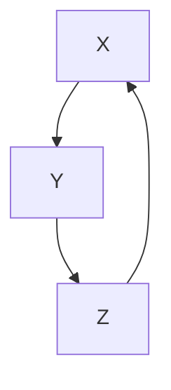
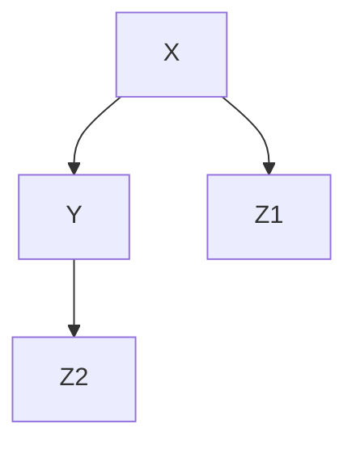
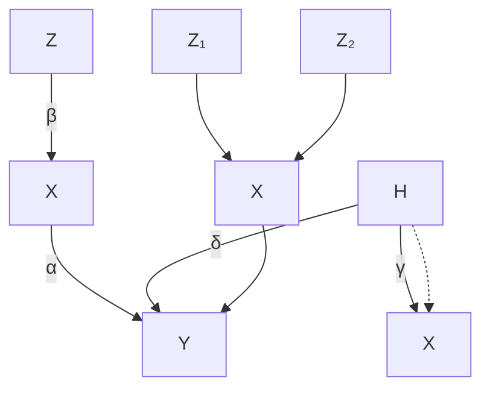
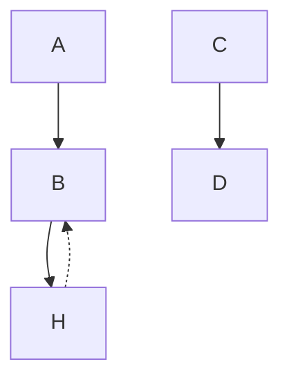
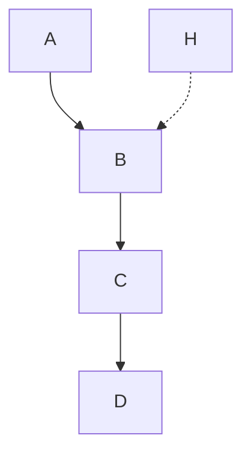
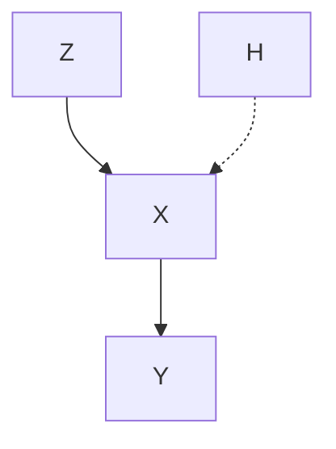
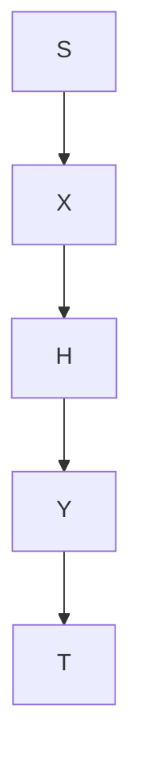
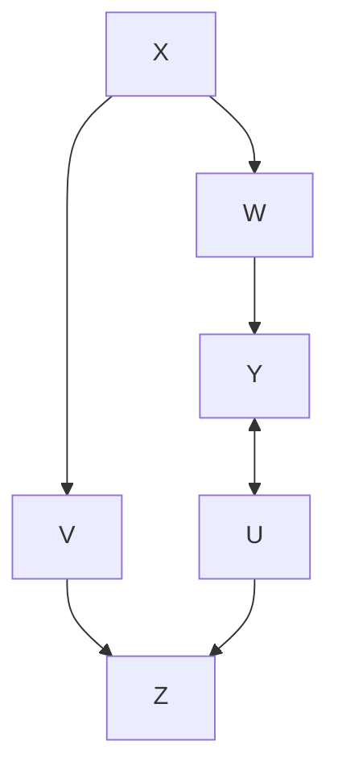
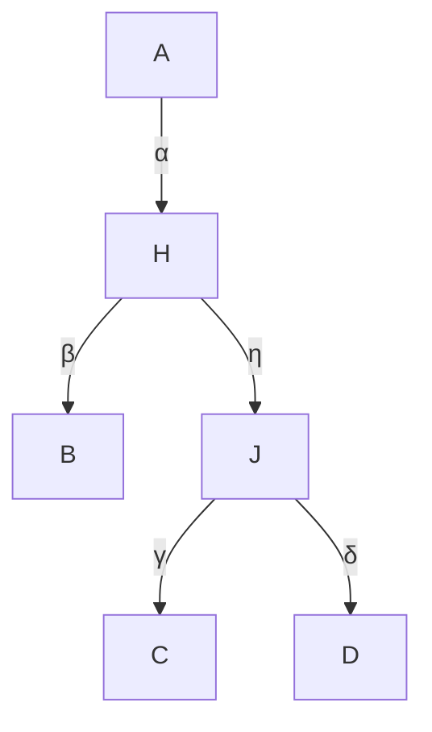

# Hidden Variables

So far, we assumed that all variables from the model have been measured (except for the noises). Since in practice, we are choosing the set of random variables ourselves, we need to define a concept of “causally relevant” variables. In Section 9.1 we therefore introduce the terms “causal sufficiency” and “interventional sufficiency.” But even if we leave aside the details of the precise definition, it is apparent that in most practical applications many causally relevant variables will be unobserved. Simpson’s paradox (Section 9.2) describes how ignoring hidden confounding can lead to wrong causal conclusions. In linear settings, a structure that is often referred to as an instrumental variable can make the regression coefficient, which corresponds to the causal effect (see Example 6.42), identifiable (Section 9.3). It is an active field of research to find good graphical representations for SCMs with hidden variables, in particular those that encode the conditional independence structure; we will present some of the solutions in Section 9.4. Finally, hidden variables lead to constraints appearing in the observed distribution that go beyond conditional independences (Section 9.5). We briefly discuss how these constraints could be used for structure learning but do not provide any methodological details. For more historical notes on the treatment of hidden variables, we refer to Spirtes et al. [2000, Section 6.1].

## 9.1 Interventional Sufficiency

A set of variables X is usually said to be causally sufficient if there is no hidden common cause C ∈/ X that is causing more than one variable in X [e.g., Spirtes, 2010]. While this definition matches the intuitive meaning of the set of “relevant”variables, it uses the concept of a “common cause” and should therefore be understood relative to a larger set of variables $\tilde { \mathbf { X } } \supseteq \mathbf { X }$ (for which, again, we might want to define causal sufficiency). In the structural causal model corresponding to this larger set $\tilde { \mathbf { X } } ,$ a variable C is a common cause of X and Y if there is a directed path from C to X and Y that does not include Y and X, respectively. Common causes are also called confounders and we use these terms interchangeably.

We propose a small modification of causal sufficiency that we call interventional sufficiency, a concept that is based on falsifiability of SCMs; see Section 6.8.

Definition 9.1 (Interventional sufficiency) We call a set X of variables interventionally sufficient if there exists an SCM over X that cannot be falsified as an interventional model; that is, it induces observational and intervention distributions that coincide with what we observe in practice.

We believe that this concept is intuitively appealing since it describes when a set of variables is large enough to perform causal reasoning, in the sense of computing observational and intervention distributions.

It should be intuitive that considering two variables is usually not sufficient if there exists a latent common cause. The two variables are causally insufficient by definition, and Simpson’s paradox in Section 9.2 (see also Example 6.37) shows that in general these two variables are not interventionally sufficient either. In fact, the paradox drives the statement to an extreme: an SCM over the two observed variables that ignores confounding does not only entail the wrong intervention distributions, it can even reverse the sign of the causal effect: a treatment can look beneficial although it is harmful; see (9.2).

Sometimes, however, we can still compute the correct intervention distributions even in the presence of latent confounding. The set of variables in the following example is interventionally sufficient but causally insufficient.

## Example 9.2 Consider the following SCM

$$
\begin{array}{l} Z := N _ {Z} \\ X := \mathbf {1} _ {Z \geq 2} + N _ {X} \\ Y := Z \bmod 2 + X + N _ {Y} \\ \end{array}
$$

with $N _ { Z } \sim \mathcal { U } ( \{ 0 , 1 , 2 , 3 \} )$ ) being uniformly distributed over {0, 1, 2, 3} and $N _ { X } , N _ { Y }$ iid∼ $\mathcal { N } ( 0 , 1 )$ ; see Figure 9.1 (left). While variables X and Y are clearly causally insufficient,1 one can show that the two variables X and Y are interventionally sufficient. The reason is that the “confounder” Z consists of two independent parts: $Z _ { 1 } : = \mathbf { 1 } _ { Z \geq 2 }$ is the first bit of the binary representation of Z, and $Z _ { 2 } : = Z { \bmod { 2 } }$ is the second bit. In this sense, we can separate the “confounder” into the independent variables $Z _ { 1 }$ and $Z _ { 2 }$ , with $Z _ { 1 }$ influencing X, and $Z _ { 2 }$ influencing $Y ;$ see Figure 9.1. □







Figure 9.1: Both graphs represent interventionally equivalent SCMs for the model described in Example 9.2. While only the second representation renders X and Y causally sufficient, X and Y are interventionally sufficient independently of the representation.

In general, we have the following relationship between causal and interventional sufficiency (see Appendix C.13 for a proof):

## Proposition 9.3 (Interventional sufficiency and causal sufficiency) Let C be an SCM for the variables X that cannot be falsified as an interventional model.

(i) If a subset $\mathbf { O } \subseteq \mathbf { X }$ is causally sufficient, then it is interventionally sufficient.  
(ii) In general, the converse is false; that is, there are examples of interventionally sufficient sets $\mathbf { O } \subseteq \mathbf { X }$ that are not causally sufficient.

Furthermore, Example 9.2 shows that there cannot be a solely graphical criterion for determining whether a subset of the variables are interventionally sufficient. For many SCMs with a structure similar to Figure 9.1 (left), X and Y are interventionally insufficient. However, the following remark shows that omitting an “intermediate” variable preserves interventional sufficiency.

## Remark 9.4 We have the following three statements.

(i) Assume that there is an SCM over X,Y, Z with graph $X  Y  Z$ and X 6⊥⊥ Z that induces the correct interventions. Then X and Z are interventionally sufficient due to the SCM over X, Z satisfying $X  Z$ .

(ii) Assume that there is an SCM C over X,Y, Z that induces the correct interventions with graph $X  Y  Z$ and additional $X  Z$ and assume further that $P _ { X , Y , Z } ^ { \mathfrak { C } }$ Z are interventionally sufficient due to the SCM over X, Z satisfying $X  Z$ .  
(iii) If the situation is the same as in (ii) with the difference that

$$
P _ {Z | X = x} ^ {\mathfrak {C}} = P _ {Z} ^ {\mathfrak {C}; d o (X := x)} = P _ {Z} ^ {\mathfrak {C}}
$$

for all x (in particular, $P _ { X , Y , Z } ^ { \mathfrak { C } }$ is not faithful with respect to the graph). Then, X and Z are interventionally sufficient due to the SCM over X, Z with the empty graph. Note that the counterfactuals may not be represented correctly.

The proof of these statements is left to the reader (see Problem 9.10).

Whenever we find an SCM over the observed variables that is interventionally equivalent to the original SCM over all variables, we may want to call the former one a marginalized SCM. We have seen that there is no solely graphical criteria for determining the structure of a marginalized SCM. Instead, some information about the causal mechanisms, that is, the specific form of the assignments, is needed. Bongers et al. [2016] studies marginalizations of SCMs in more detail. The key idea is to start with the original SCM and to consider only the structural assignments of the observed variables. One then repeatedly plugs in the assignments of the hidden variables whenever they appear on the right-hand side. This yields an SCM with multivariate, possibly dependent noise variables. In some cases, it is then possible to choose an interventionally equivalent SCM with univariate noise variables.

## 9.2 Simpson’s Paradox

The kidney stone data set in Example 6.16 is well known for the following reason. We have

$$
P ^ {\mathfrak {C}} (R = 1 \mid T = A) <   P ^ {\mathfrak {C}} (R = 1 \mid T = B) \quad \text { but }
$$

$$
P ^ {\mathfrak {C}; d o (T := A)} (R = 1) > P ^ {\mathfrak {C}; d o (T := B)} (R = 1); \tag {9.1}
$$

see Example 6.37. Suppose that we have not measured the variable Z (size of the stone) and furthermore that we do not even know about its existence. We might then hypothesize that T → R is the correct graph. If we denote this (wrong) SCM by $\tilde { \mathfrak { C } } ,$ we can rewrite (9.1) as

$$
P ^ {\tilde {\mathfrak {C}}; d o (T := A)} (R = 1) <   P ^ {\tilde {\mathfrak {C}}; d o (T := B)} (R = 1) \text {   but   }
$$

$$
P ^ {\mathfrak {C}; d o (T := A)} (R = 1) > P ^ {\mathfrak {C}; d o (T := B)} (R = 1). \tag {9.2}
$$

Due to the model misspecification, the causal statement gets reversed. Although A is the more effective drug, we propose to use B. But even if we knew about the common cause Z, is it possible that there is yet another confounding variable that we did not correct for? If we are unlucky, this is indeed the case and we have to reverse the conclusion once more if we include this variable. In principle, this could lead to an arbitrarily long sequence of reversed causal conclusions (see Problem 9.11).

This example shows how careful we have to be when writing down the underlying causal graph. In some situations, we can infer the DAG from the protocol describing the acquisition of the data. If the medical doctors assigning the treatments, for example, did not have any knowledge about the patient other than the size of the kidney stone, there cannot be any confounding factor other than the size of the stone.

Summarizing, the Simpson’s paradox is not so much of a paradox but rather a warning of how sensitive causal reasoning can be with respect to model misspecifications. Although we have phrased the example in a setting with confounding, it can also occur as a result of selection bias (Example 6.30) that has not been accounted for.

## 9.3 Instrumental Variables

Instrumental variables date back to the 1920s [Wright, 1928] and are widely used in practice [see, e.g., Imbens and Angrist, 1994, Bowden and Turkington, 1990, Didelez et al., 2010]. There exist numerous extensions and alternative methods; we focus on the essential idea. Consider a linear Gaussian SCM with the graph shown in Figure 9.2 (left). Here, the coefficient α in the structural assignment

$$
Y := \alpha X + \delta H + N _ {Y}
$$

is the quantity of interest (see Equation (6.18) in Example 6.42); it is sometimes called the average causal effect (ACE). It is not directly accessible, however, because of the hidden common cause H. Simply regressing Y on X and taking the regression coefficient generally results in a biased estimator for α:

$$
\frac {\operatorname{cov} [ X , Y ]}{\operatorname{var} [ X ]} = \frac {\alpha \operatorname{var} [ X ] + \delta \gamma \operatorname{var} [ H ]}{\operatorname{var} [ X ]} = \alpha + \frac {\delta \gamma \operatorname{var} [ H ]}{\operatorname{var} [ X ]}.
$$

Instead, we may be able to exploit an instrumental variable — if it exists. Formally, we call a variable Z in an SCM an instrumental variable for (X,Y ) if (a) $Z$ is independent of H, (b) Z is not independent of X (“relevance”), and (c) Z effects Y only through X (“exclusion restriction”). For our purposes, it suffices to consider the example graph shown in Figure 9.2 (left) that satisfies all of these assumptions. Note, however, that other structures do, too. For example, one can allow for a hidden common cause between Z and X. In practice, one usually uses domain knowledge to argue why conditions (a), (b), and (c) hold.

In the linear case, we can exploit the existence of Z in the following way. Because $( H , N _ { X } )$ is independent of Z, we can regard $\gamma H + N _ { X }$ in

$$
X := \beta Z + \gamma H + N _ {X}
$$

as noise. It becomes apparent that we can therefore consistently estimate the coefficient $\beta$ and therefore have access to $\beta Z$ (which, in the case of finitely many data, is approximated by fitted values of Z). Because of

$$
Y := \alpha X + \delta H + N _ {Y} = \alpha (\beta Z) + (\alpha \gamma + \delta) H + N _ {Y},
$$

we can then consistently estimate α by regressing Y on $\beta Z .$ Summarizing, we first regress X on $Z$ and then regress Y on the predicted values $\hat { \beta } Z$ (predicted from the first regression). The average causal effect α becomes identifiable in the limit of infinite data. This method is commonly referred to as “two-stage least squares.” It makes use of linear SCMs, and the above-mentioned assumptions: (a) independence between H and Z, (b) non-zero $\beta$ (in the case of small or vanishing $\beta$ , Z is called a “weak instrument”), and (c) the absence of a direct influence from Z to Y .

Identifiability is not restricted to the linear setting, however. We now mention only four such results, even though there are many more [e.g., Hernan and Robins, ´ 2006].

(i) It is not difficult to see that the method of two-stage least squares still works if X depends on Z and H in a nonlinear but additive way; see Problem 9.12.

(ii) If the variables Z, X, and Y are binary, the ACE is defined as

$$
P ^ {\mathfrak {C}; d o (X := 1)} (Y = 1) - P ^ {\mathfrak {C}; d o (X := 0)} (Y = 1).
$$




Figure 9.2: Left: setting of an instrumental variable (Section 9.3). A famous example is a randomized clinical trial with non-compliance: Z is the treatment assignment, X the treatment and Y the outcome. Right: Y-structure; see Section 9.4.1.

Balke and Pearl [1997] provide (tight) lower and upper bounds for the ACE without further assumptions on the relation between Y on X and H, for example. These bounds can be rather uninformative or they can collapse to a single point. In the latter case, we call the ACE identifiable.

(iii) Wang and Tchetgen Tchetgen [2016] show that, still in the case of binary treatment, the ACE becomes identifiable if the structural assignment for Y is additive in X and H [Wang and Tchetgen Tchetgen, 2016, Theorem 1].  
(iv) For identifiability in the continuous case, see Newey [2013] and references therein.

Most concepts involving instrumental variables, such as the linear setting described previously, extend to situations, in which observed covariates W cause some (or all) relevant variables. For example, in Figure 9.2 (left) we can allow for a variable W pointing at Z, X, and Y . The assumptions (a), (b), and (c), as well as the procedures, are then modified and always include conditioning on W . Brito and Pearl [2002b] extend the idea to multivariate Z and X (“generalized instrumental variables”).

## 9.4 Conditional Independences and Graphical Representations

In causal learning, we are trying to reconstruct the causal model from observational data. We have seen several identifiability results that allow us to identify the graph structure of an SCM over variables X from the observational distribution $P _ { \mathbf { X } }$ . Let us now turn to an SCM C over variables $\mathbf { X } = ( \mathbf { O } , \mathbf { H } )$ that includes observed variables O and hidden variables H. We may then still ask whether the graph structure of C becomes identifiable from the distribution $P _ { \mathbf { 0 } }$ over the observed variables, and if so, how we can identify it.

In the case without hidden variables, we discussed in Section 7.2.1 how one can learn (parts of) the causal structure under the Markov condition and faithfulness. These assumptions guarantee a one-to-one correspondence between $d -$ separation and conditional independence, and we can therefore test for conditional independence in $P _ { \mathbf { X } }$ and reconstruct properties of the underlying graph. Recall that independence-based methods, in principle, search over the space of DAGs and output a graph (or an equivalence class of graphs) representing exactly the set of conditional independences found in the data.

For causal learning with hidden variables, we would in principle like to search over the space of DAGs with latent variables. This comes with additional difficulties, however. We do not know the size of H and if we therefore do not restrict the number of hidden variables, there is an infinite number of graphical candidates that we have to search over. Furthermore, there is a statistical argument against this approach: the set of distributions that are Markovian and faithful with respect to a DAG forms a curved exponential family, which justifies the use of the BIC, for example [Haughton, 1988]; the set of distributions that are Markovian and faithful with respect to a DAG with latent variables, however, does not [Geiger and Meek, 1998]. If searching over DAGs with latent variables is infeasible, can we instead represent each DAG with latent variables by a marginalized graph over the observed variables, possibly using more than one type of edge, and then search over those structures? We have seen in Section 9.1 that such an approach also comes with a difficulty: the marginalized graph should depend on the original underlying SCM, and it is not sufficient to consider the information contained in the original graph. As mentioned previously, Bongers et al. [2016] studies marginalizations of SCMs in more detail.

For these reasons, we consider in the remainder of this section a slightly shifted problem: instead of checking whether a full distribution could have been induced by a certain DAG structure with latent variables, we restrict ourselves on certain types of constraints. For example, we consider all distributions that satisfy the same set of conditional independence statements over the observed variables O (implicitly assuming the Markov condition and faithfulness). We then ask how we can represent this set of conditional independences.

A straightforward solution would be to assume that the entailed distribution $P _ { \mathbf { 0 } }$ is Markovian and faithful with respect to a DAG without hidden variables, and, similarly as before, then output a class of DAGs that represents the conditional independence in the distribution of the observed variables. Representing the conditional independence structure $P _ { 0 }$ with a DAG has two well-known drawbacks: (1) Representing the set of conditional independences with a DAG over the observed variables can lead to causal misinterpretations, and (2), the set of distributions whose pattern of independences correspond to the d-separation statements in a DAG is not closed under marginalization [Richardson and Spirtes, 2002].


```mermaid
graph TD
    subgraph true_DAG["\"true DAG\""]
  A1["A"] --> B1["B"]
  B1 --> C1["C"]
        H["H"] -.-> B1
    end
    subgraph DAG_PC_output["\"DAG (PC output)\""]
  A2["A"] --> B2["B"]
        B2 <--> C2["C"]
    end
    subgraph MAG["\"MAG\""]
  A3["A"] --> B3["B"]
        B3 <--> C3["C"]
    end
    subgraph PAG_mod_PC_FCI_output["\"PAG (mod. PC/FCI output)\""]
  A4["A"] --> B4["B"]
        B4 <--> C4["C"]
    end
```

Figure 9.3: Starting with an SCM on the left-hand side, the three graphs on the right encode the set of conditional independences $( A \perp \perp C )$ . Due to an erroneous causal interpretation, the DAG is not desirable as an output of a causal learning method. In this example, the IPG and the latent projection (ADMG) are equal to the MAG.




Figure 9.4: This example is taken from Richardson and Spirtes [2002, Figure 2(i)]. It shows that DAGs are not closed under marginalization. There is no DAG over nodes $\mathbf { O } = \{ A , B , C , D \}$ that encodes all conditional independences from the graph including H.

For (1), consider an SCM that entails a distribution $P _ { A , B , C , H }$ that is Markovian and faithful with respect to the corresponding DAG shown in Figure 9.3 (left). The only (conditional) independence relation that can be found in the observed distribution $P _ { A , B , C }$ is $A \perp \perp C$ and therefore the DAG in Figure 9.3 (second from left) represents this conditional independence perfectly; in this sense, it could be seen as the output of PC. The causal interpretation, however, is erroneous. While in the original SCM an intervention on C does not have any effect on B, the output of PC suggests that there is a causal effect from C to B. Regarding (2), Figure 9.4 (it shows a graph that is taken from Richardson and Spirtes [2002]) shows the structure of an SCM over variables $\mathbf { X } = ( \mathbf { O } , \mathbf { H } )$ whose distribution is Markovian and faithful with respect to a DAG G (G represents all conditional independences in X), that satisfies the following property. There are no DAGs over O representing the conditional independences that can be found in $P _ { \mathbf { 0 } }$ . In this sense, DAGs are not closed under marginalization.

The following subsection discusses some ideas that suggest graphs (over O) for representing conditional independences. Note, however, that they do not necessarily come with an intuitive causal meaning. It may be difficult to infer properties of the structure of the underlying SCM over X = (O, H) from the graphical objects. Graphical criteria for adjustment, as in Section 6.6, for example, need to be developed and proved for each type of graph again.

### 9.4.1 Graphs

Before, we have used graphs to represent the structural relationships of SCMs; see Definitions 3.1 and 6.2. The goal of this section is different: here, the aim is to use graphs to represent constraints in the distribution induced by the SCM. In this Section 9.4, we mainly consider conditional independence relations and discuss other constraints in more detail in Section 9.5. We have seen that in the presence of hidden variables, DAGs are a poor choice for representing conditional independences. These shortcomings of DAGs initiated the development of new graphical representations in causal inference. Richardson and Spirtes [2002] introduce maximal ancestral graphs (MAGs), for example, and show that they form the smallest superclass of DAGs that is closed under marginalization (see the preceding discussion). These are mixed graphs and contain directed and bidirected edges.2 MAGs come with a slightly different separation criterion: instead of d-separation, one now looks at m-separation [Richardson and Spirtes, 2002]. Then, for each DAG with hidden variables there is a unique MAG over the observed variables that represents the same set of conditional independences (by m-separation); a simple construction protocol is provided in Richardson and Spirtes [2002, Section 4.2.1], for an example see Figure 9.3. This mapping is not one-to-one. Each MAG can be constructed by infinitely many different DAGs (containing an arbitrary number of hidden variables). As for DAGs, the Markov condition relates graphical separation statements in a MAG with conditional independences. Different MAGs representing the same set of m-separation, are summarized within a Markov equivalence class [Zhang, 2008b]; this equivalence class itself is often represented by a partially ancestral graph (PAG); see Table 9.1 for an overview. In PAGs, edges can end with a circle, which represents both possibilities of an arrow’s head and tail; see Figure 9.3. Ali et al. [2009] provide graphical criteria that determine whether two MAGs are Markov equivalent.

| Graphical object | DAG (without hiddens) | MAG | IPG | ADMG (with nested Markov) |
| --- | --- | --- | --- | --- |
| Type of edges directed / undir. / bidir. / combination | ✓/ - / - / - | ✓/ ✓/ ✓/ - | ✓/ - / ✓/ - | ✓/ - / ✓/ ✓ |
| Correct causal interpretation | ✗ | ✓ | ✓ | ✓ |
| Graphical separation for global Markov | d-seperation | m-seperation | m-seperation | m-seperation |
| Criterion for valid adjustment sets | ✓ | ✓ | ? | ✓ |
| Algorithm for identification of intervention distribution | ✓ | ? | ? | ✓ |
| Representation of equivalence class | CPDAG (Markov) | PAG (Markov) | POIPG (Markov) | ? (nested Markov) |
| Independence-based method for learning | PC, IC, SGS | FCI | FCI | - |
| Score-based method for learning | GDS, GES | for linear/binary/discrete SCMs | ? | for binary/discrete SCMs |
| Can encode all equality constraints | ✗ | ✗ | ✗ | ✓ (if obs. var. are discrete) |
| Can encode all constraints | ✗ | ✗ | ✗ | ✗ |

Example 9.5 (Y-structure) Given that even a single MAG can represent an arbitrary number of hidden variables, one may be wondering, whether a PAG, constructed from a DAG with hidden variables, ever contains non-trivial causal information. In Figure 9.3, for example, the PAG does not specify whether there is a directed path between C and B or a hidden variable with directed path both into C and B. Figure 9.2 (right) shows the example of a Y-structure (Z1, Z2, and Y are not directly connected). Consider now an SCM over an arbitrary number of variables that contains four variables $X , Z _ { 1 } , Z _ { 2 } .$ , and Y over which it induces the same conditional independences as the Y-structure does. We can then conclude that the corresponding PAG contains a directed edge from X → Y . In addition, the causal relation between X and Y has to be unconfounded [e.g., Mani et al., 2006, Spirtes et al., 2000, Figure 7.23]. Any SCM, in which X and Y are confounded or in which X is not an ancestor of Y , leads to a different set of conditional independences.

We have mentioned that graphical objects such as MAGs are primarily constructed to represent conditional independences and not to visualize SCMs (this is how we have introduced graphs in Definition 3.1). Thus, causal semantics becomes more complicated. In a MAG, for example, an edge A → B means that in the underlying DAG (including the hidden variables), A is an ancestor of B and B is not an ancestor of A; that is, the ancestral relationships are preserved. The PAG in Figure 9.3, for example, should be interpreted as follows: “In the underlying DAG, there could be a directed path from C to B, a hidden common cause, or a combination of both.” As a consequence, causal reasoning in such graphs, that is, computing intervention distribution, becomes more involved, too [e.g., Spirtes et al., 2000, Zhang, 2008b]. Perkovic et al. [2015] characterize valid adjustment sets (Section 6.6) that work not only for DAGs but also for MAGs.

As an alternative to MAGs and PAGs, one may consider induced path graphs (IPGs) and (completed) partially oriented induced path graphs (POIPGs) that can be used for representing sets of IPGs [Spirtes et al., 2000, Section 6.6]. These graphs have initially been used to represent the output of the fast causal inference (FCI) algorithm; see Section 9.4.2. Consider a distribution that is Markovian and faithful with respect to a MAG. Since every MAG is an IPG but not vice versa, the Markov equivalence class of the MAG is contained in the Markov equivalence class of the corresponding IPG, and thus a PAG usually contains more causal information than a POIPG [Zhang, 2008b, Appendix A].

Even yet another possibility is to start with the original DAG containing hidden variables and then apply a latent projection [see Pearl, 2009, Verma and Pearl, 1991, Definition 2.6.1 and “embedded patterns”, respectively]. This operation takes a graph $\mathcal { G }$ with observed and hidden variables and constructs a new graphical object $\tilde { \mathcal { G } }$ over the observed variables. The precise definition can be found in Shpitser et al. [2014, Definition 4], for example. The resulting graph structure is called an acyclic directed mixed graph (ADMG) and contains both directed and bidirected edges. Again, the m-separation leads to a Markov property [Richardson, 2003]. Instead of searching over DAGs with latent variables, we may now search over ADMGs.

We will see in Section 9.5 that distributions over the observed variables from a DAG with latent variables satisfy constraints other than conditional independences. ADMGs obey the possibility to take some of those constraints into account in the following way. The idea is to define a nested Markov property [Richardson et al., 2012, 2017, Shpitser et al., 2014], such that a distribution is nested Markovian with respect to an ADMG if not only some conditional independences hold that are implied by the graph structure but also other constraints; see Section 9.5.1, for example. It turns out that even the nested Markov property does not encode all constraints (in the discrete case they do encode all equality constraints, though [Evans, 2015]). We therefore have [Shpitser et al., 2014]:

$\{ P _ { \bf 0 } : P _ { \bf 0 , V }$ induced by a DAG $\mathcal { G }$ with latent variables}

$\subseteq \{ P _ { 0 } : P _ { 0 }$ is nested Markovian with respect to corresponding ADMG}  
$\subseteq \{ P _ { 0 } : P _ { 0 }$ is Markovian with respect to corresponding ADMG}.

For ADMGs with discrete data and the ordinary Markov property, Evans and Richardson [2014] provide a parametrization. This parametrization can be extended to nested Markov models and it can be used to compute (constraint) maximum likelihood estimators [Shpitser et al., 2012]. ADMGs are called bow-free if between each pair of nodes there is only one kind of edge. For linear Gaussian models, this subclass of models allows for parameter identifiability [Brito and Pearl, 2002a]; additionally, there are algorithms that compute maximum likelihood estimates [Drton et al., 2009a] or perform causal learning [Nowzohour et al., 2015].

Chain graphs consist of directed and undirected edges and do not allow for partially directed cycles [Lauritzen, 1996, Section 2.1.1]. There is an extensive body of work on chain graphs; see, for example, Lauritzen [1996] for an overview and Lauritzen and Richardson [2002] for a causal interpretation. Note that for chain graphs, different Markov properties have been suggested [Lauritzen and Wermuth, 1989, Frydenberg, 1990, Andersson et al., 2001].

Summarizing, the representation of constraints (so far, we have mainly talked about conditional independences) using graphs, in particular in the case of hidden

<!-- footnote -->

- Statements similar to Proposition 7.1 can be found in Druzdzel and Simon [1993] and Druzdzel and van Leijen [2001].

<!-- footnote end -->

<!-- footnote -->

- These two conditions guarantee that the joint distribution over $X _ { 1 } , \ldots , X _ { d }$ allows for a strictly positive density, for example.

<!-- footnote end -->

<!-- footnote -->

- The condition of a strictly positive density can be weakened (see details of the proof of ICA), but it is certainly necessary to assume that the noise variables are non-degenerate, for example.

<!-- footnote end -->

<!-- footnote -->

- https://en.wikipedia.org/wiki/Kepler\_(spacecraft), accessed 13.07.2016.

<!-- footnote end -->

<!-- footnote -->

- In reality, the systems are usually more complicated. For example, in an auction-like procedure, the advertisers place bids on certain search queries, which then influence the price for a click.

<!-- footnote end -->

<!-- footnote -->

- Here, the hidden common cause Z not only points into X and Y but also has a total causal effect on both of them; see Definition 6.12.

<!-- footnote end -->

<!-- footnote -->

- In fact, they may even contain undirected edges and can therefore model selection bias. We refer to Richardson and Spirtes [2002] for details.

<!-- footnote end -->

variables, is a non-trivial task that is still an active field of research; Sadeghi and Lauritzen [2014] relate several types of mixed graphs and discuss their Markov properties. Usually, the graphical objects and their corresponding separation criteria are complicated, and it is not trivial to relate the edges to the existence of causal effects (one may argue that nested Markov models are a step toward simplification though). It is surprising that despite all the difficulties in some situations (see the Y-structure in Example 9.5) we are still able to learn causal ancestral relationships.

### 9.4.2 Fast Causal Inference

We have seen that for structure learning a PAG might be a more sensible output than a CPDAG. Indeed, it is possible to modify the PC algorithm such that it outputs a PAG [Spirtes et al., 2000, Section 6.2]. While this simple modification of PC works fine for many examples, it is not correct in general. At each iteration, the PC algorithm considers a pair of (currently) adjacent nodes A and B, say, and searches for a set that d-separates them. To achieve considerable speedups, it searches only through subsets of the current neighbors of nodes A and B, based on Lemma 7.8(ii) in Section 7.2.1. In the presence of hidden variables, however, restricting the search space to subsets of the set of neighbors is not sufficient anymore [Verma and Pearl, 1991, Lemma 3]; Spirtes et al. [2000, Section 6.3] provide an example, for which the modified PC algorithm fails to find a d-separating set.

The FCI algorithm [Spirtes et al., 2000] resolves this issue. It outputs a PAG representing several MAGs. Zhang and Spirtes [2005] and Zhang [2008a] prove that a slight modification of the original FCI algorithm is complete. That is, its output is maximally informative. If the conditional independences originate from a DAG with hidden variables, the output indeed represents the correct corresponding PAG.

Several modifications of FCI lead to significant speedups. Spirtes [2001] suggests to restrict the size of the conditioning set (anytime FCI), and Colombo et al. [2012] reduce both the number of conditional independence tests and the size of the conditioning sets (really fast causal inference). Both algorithms can be slightly less informative than FCI. They are succeeded by FCI+, which is fast and complete [Claassen et al., 2013].

As an alternative, one might consider to score MAGs or equivalence classes of MAGs. Such scoring functions exist only for some classes of SCMs, such as linear SCMs [Richardson and Spirtes, 2002]; also, we are not aware of any efficient way of searching over this space of MAGs [Mani et al., 2006]. Silva and Ghahramani [2009] discuss a Bayesian approach for learning mixed graphs.




Figure 9.5: Any distribution that is Markovian with respect to this graph satisfies the Verma constraint (9.3), a non-independence constraint that appears in the marginal distribution over A, B, C, and D; the dashed variable H is unobserved [Verma and Pearl, 1991].

## 9.5 Constraints beyond Conditional Independence

We have mentioned that models with hidden variables can lead to constraints that are different from conditional independence constraints. We will mention a few of them to develop an intuition what kind of constraints we can expect, but we mainly point to the literature for details; see also Kela et al. [2017] for recent work and references to much of the earlier work.

### 9.5.1 Verma Constraints

Verma and Pearl [1991] provide the example shown in Figure 9.5. Any distribution that is Markovian with respect to the corresponding graph allows for the following Verma constraint [e.g., Spirtes et al., 2000, Chapter 6.9]. For some function f we have

$$
\sum_ {b} p (b \mid a) p (d \mid a, b, c) = f (c, d). \tag {9.3}
$$

Unlike conditional independence constraints, (9.3) lets us decide whether or not there is a directed edge from A to D (note that in Figure 9.5 A and D cannot be d-separated). Although many open questions regarding those algebraic constraints remain, there has been progress in understanding when such constraints appear [Tian and Pearl, 2002]. Shpitser and Pearl [2008b] investigate the special subclass of dormant independences; these are constraints that appear as indepedendence constraints in intervention distributions.

The question remains how one can exploit those constraints for causal learning. In the case of binary variables, for example, Richardson et al. [2012, 2017] and Shpitser et al. [2012] use nested Markov models for the parametrization of such models and provide a method for computing (constraint) maximum likelihood estimators; see also Section 9.4.1. However, nested Markov models do not include all inequality constraints, which we discuss in the following section.




(a) Causal structure where Z is called an instrument for X and enables some causal statements about the effect of X on Y .




(b) Causal structure of a famous experiment used by quantum physicists to falsify assumptions of classical physics; see Section 9.5.2.  
Figure 9.6: Two important examples of latent structures that entail inequality constraints.

### 9.5.2 Inequality Constraints

Marginalizing a graphical model over some of its variables induces a large set of inequality constraints [see, e.g., Kang and Tian, 2006, Evans, 2012, and references therein]. It would go beyond the scope of this book to mention all the known ones. Instead, we would like to point out the diversity of fields in which they have been applied. To this end, we consider two example DAGs containing observed and unobserved variables that appear in completely different contexts. Note that this section discusses only inequalities that refer to the observational distributions of observable variables while the literature contains also inequalities that relate observational and intervention distribution of observable variables [see, e.g., Balke, 1995, Pearl, 2009, Chapter 8], sometimes also under additional assumptions [Silva and Evans, 2014, Geiger et al., 2014]. While the former task aims at falsifying a hypothetical latent structure, the latter one admits statements about interventions given that the respective DAG is true. To show some inequalities concerning only observational probabilities, the causal structure in Figure 9.6(a) with binary variables entails, for instance, that

$$
P (X = 0, Y = 0 | Z = 0) + P (X = 1, Y = 1 | Z = 1) \leq 1. \tag {9.4}
$$

Inequalities like this have been provided in the literature [Bonet, 2001, eq. (3)] to test whether a variable is instrumental. This DAG plays a crucial role in analyzing randomized clinical trials with imperfect compliance, where Z is the instruction to take a medical drug, X describes whether the patient takes the drug (assume this can be inferred from a blood test, for example), and Y whether the patient recovers [see, e.g., Pearl, 2009].

The causal structure shown in Figure 9.6(b) is known to entail, for instance, theClauser-Horne-Shimony-Holt (CHSH) inequality [Clauser et al., 1969]:

$$
\begin{array}{l} \mathbb {E} [ X Y | S = - 1, T = - 1 ] + \mathbb {E} [ X Y | S = - 1, T = 1 ] \\ + \mathbb {E} [ X Y | S = 1, T = - 1 ] + \mathbb {E} [ X Y | S = 1, T = 1 ] \leq 2 \tag {9.5} \\ \end{array}
$$

if X,Y, S, T take values in {−1, 1}. Equation (9.5) is a generalization of Bell’s inequality [Bell, 1964]. The latent common cause may attain arbitrarily many values, just as the existence of a variable that d-separates {X, S} from $\{ Y , T \}$ implies (9.5). Remarkably, the CHSH inequality is violated in quantum physics in a scenario where one would intuitively agree that the underlying causal structure is the one in Figure 9.6(b). Two physicists A and B at different locations receive particles from a common source described by H. Variables X and Y describe the results of dichotomous measurements performed on the particles received by A and B, respectively. S is a coin flip that determines which measurement out of two possible options is performed by A. Likewise, T is a coin flip determining the measurement performed by B. The unobserved common cause of X and Y is the common source of the particles received by A and B. According to a widely accepted interpretation, the violation of (9.5) observed in experiments [Aspect et al., 1981], shows that there is no classical random variable H describing the joint state of the incoming particles such that {S, X} and $\{ T , Y \}$ are conditionally independent, given H. This is because the state of quantum physical systems cannot be described by values of random variables. Instead, they are density operators on a Hilbert space.

Information-theoretic inequalities for latent structures have gained interest since they are sometimes easier to handle than inequalities that refer directly to probabilities [see, e.g., Steudel and Ay, 2015]. Chaves et al. [2014] describe a family of inequalities for the case of discrete variables that is not complete but can be generated by the following systematic approach.

First, one starts with a distribution entailed by an SCM over d discrete variables $\mathbf { X } : = \left( X _ { 1 } , \ldots , X _ { d } \right)$ . For a given joint distribution $P _ { X _ { 1 } , \ldots , X _ { d } }$ we can define a function

$$
H: 2 ^ {\mathbf {X}} \to \mathbb {R} _ {0} ^ {+}
$$

such that $H ( X _ { j _ { 1 } } , \dots , X _ { j _ { k } } )$ is the Shannon entropy3 of $( X _ { j _ { 1 } } , \ldots , X _ { j _ { k } } )$ . Well-knownproperties of H are the elementary inequalities

$$
H (S \cup \{X _ {j} \}) \geq H (S) \tag {9.6}
$$

$$
H (S \cup \{X _ {j}, X _ {k} \}) \leq H (S \cup \{X _ {j} \}) + H (S \cup \{X _ {k} \}) \tag {9.7}
$$

$$
H (\emptyset) = 0, \tag {9.8}
$$

where S denotes a subset of X. Inequalities (9.6) and (9.7) are known as monotonicity and submodularity conditions, respectively; see also Section 6.10. Furthermore, inequalities (9.6)–(9.8) are known as polymatroid axioms in combinatorial optimization, too.

To employ the causal structure, we now recall that $S \perp T \perp R$ for all three disjoint subsets S, T , and R of nodes, for which S and T are d-separated by R. This can be rephrased in terms of Shannon mutual information [Cover and Thomas, 1991] by

$$
I (S: T \mid R) = 0, \tag {9.9}
$$

which is equivalent to

$$
H (S \cup R) + H (T \cup R) = H (S \cup T \cup R) + H (R). \tag {9.10}
$$

Remarkably, (9.10) is a linear equation. Since conditional independences define nonlinear constraints on the space of probability vectors, it is more convenient to consider the constraints on the space of entropy vectors.

These elementary inequalities together with Equation (9.9) imply further inequalities. To derive them in an algorithmic way, Chaves et al. [2014] use a technique from linear programing, the Fourier-Motzkin elimination [Williams, 1986]. Given some subset $\mathbf { O } \subset \mathbf { X }$ of observed variables, this procedure often yields inequalities containing only entropies of variables in O although there may be no conditional independence constraints that contain only the observed ones. One example is given in Figure 9.7, for which Chaves et al. [2014, Theorem 1] obtain

$$
I (X: Z) + I (Y: Z) \leq H (Z), \tag {9.11}
$$

and likewise for cyclic permutations of the variable names. A joint distribution violating (9.11) is, for instance, the one where all observed variables are 0 or all variables are 1 with probability $1 / 2$ each because then $H ( Z ) = 1$ bit and $I ( X : Z ) =$ $I ( Y : Z ) = 1 { \mathrm { b i t } }$ . To understand this intuitively, note that in this example, we require for each observed node, say Z, a deterministic relationship with both X and Y and therefore with U and V . But there is a trade-off between the extent to which Z can be determined by its unobserved cause U or by V . Z cannot perfectly follow the “instructions” of both U and V simultaneously (which, themselves, are independent).




Figure 9.7: DAG that is not able to generate a joint distribution over $X , Y ,$ , and Z, for which all three observed variables attain simultaneously 0 or 1 with probability $1 / 2$ each.




Figure 9.8: If the graph corresponds to a linear SCM, the entailed distribution will satisfy the tetrad constraints (9.12)–(9.14).

### 9.5.3 Covariance-Based Constraints

Another type of constraint appears in linear models with hidden variables. For example, in Figure 9.8 we obtain the tetrad constraints [Spirtes et al., 2000, Spearman, 1904]:

$$
\rho_ {A C} \rho_ {B D} - \rho_ {A D} \rho_ {B C} = 0 \tag {9.12}
$$

$$
\rho_ {A B} \rho_ {C D} - \rho_ {A D} \rho_ {B C} = 0 \tag {9.13}
$$

$$
\rho_ {A C} \rho_ {B D} - \rho_ {A B} \rho_ {C D} = 0, \tag {9.14}
$$

where $\rho _ { A C }$ is the correlation coefficient between variables A and C. The first constraint (9.12), for example, can be verified easily from Figure 9.8:

$$
\begin{array}{l} \operatorname{cov} [ A, C ] \cdot \operatorname{cov} [ B, D ] = \alpha \gamma \eta \operatorname{var} [ H ] \cdot \beta \delta \eta \operatorname{var} [ H ] \\ = \alpha \delta \eta \operatorname{var} [ H ] \cdot \beta \gamma \eta \operatorname{var} [ H ] = \operatorname{cov} [ A, D ] \cdot \operatorname{cov} [ B, C ]. \\ \end{array}
$$

It is possible to characterize the occurrence of vanishing tetrad constraints graphically using the language of treks and choke points [Spirtes et al., 2000, Theorem 6.10]. Again, these constraints allow us to distinguish between different causal structures, just from observational data. Bollen [1989] and Wishart [1928] constructed statistical tests to test for vanishing tetrad differences. These can be turned into a score that can be exploited for causal learning; this has been investigated by Spirtes et al. [2000, Chapter 11.2] and Silva et al. [2006], for example.

Kela et al. [2017] consider latent structures where all dependences between observed variables are due to a collection of independent common causes and describe constraints on the possible covariance matrix of the observed variables. They emphasize that resorting to covariance matrices instead of the full distribution is advantageous both regarding statistical feasibility and computational tractability. Using functions of the observed variables (i.e., by mapping them into a feature space like in methods based on reproducing kernel Hilbert spaces), the method is also able to account for higher-order dependences.

### 9.5.4 Additive Noise Models

We have mentioned in Section 7.2.3 that learning the structure of LiNGAMs can be based on ICA. Hoyer et al. [2008b] show that both identifiability statements and methods can be extended to linear non-Gaussian structures with hidden variables by exploiting what is known under overcomplete ICA.

For nonlinear ANMs (Section 4.1.4), we have seen that in the generic case, we cannot have both $Y = f ( X ) + N _ { Y }$ with $N Y \perp \perp X$ and $X = g ( Y ) + M _ { X }$ with $M _ { X } \perp \perp Y$ . We expect that a similar identifiability holds for hidden variables. The following ANM describes the influence of a hidden variable H on the observables X and Y :

$$
H := N _ {H} \tag {9.15}
$$

$$
X := f (H) + N _ {X} \tag {9.16}
$$

$$
Y := g (H) + N _ {Y}. \tag {9.17}
$$

For the regime of sufficiently low noise, Janzing et al. [2009a] prove that the joint distribution $P _ { H , X , Y }$ can be reconstructed from $P _ { X , Y }$ up to reparametrizations of H. It is plausible that the restriction to low noise is not necessary but just a weakness of the proof. Setting $f ( H ) = H$ and $N _ { X } = 0$ yields an ANM from X to Y (and likewise, we can obtain an ANM from Y to X); this suggests that the additive noise assumption renders the three cases $X \to Y , X \gets Y$ , and $X \left. * \right. Y$ distinguishable from $P _ { X , Y }$ alone. A relation to dimensionality reduction helps us to understand how we can fit the model (9.15)–(9.17) from data: data points $( x , y )$ from the distribution $P _ { X , Y }$ can be drawn using the following procedure (see Figure 9.9):

1. Draw h according to $P _ { H }$ .  
2. Consider the corresponding point $\left( f ( h ) , g ( h ) \right)$ on the manifold

$$
M := \left\{\left(f (h), g (h)\right) \in \mathbb {R} ^ {2}: h \in \mathbb {R} \right\}. \tag {9.18}
$$

3. Add some independent noise $\left( n _ { X } , n _ { Y } \right)$ in each dimension.

To fit model (9.15)–(9.17) to a data sample from $P _ { X , Y }$ , we may therefore apply a dimensionality reduction technique to the sample to obtain the estimate $\hat { M }$ . For recovering the corresponding value of h from a given point $( x , y )$ , this point $( x , y )$ should not be projected onto the manifold M because this usually leads to residuals that will be dependent on H. Instead of small residuals $\left( n _ { X } , n _ { Y } \right)$ , we require the residuals to be as independent as possible from H [Janzing et al., 2009a].

There are many remaining open questions regarding the identifiability of ANMs with hidden variables. Such results could have an important implication, however: whenever we find an ANM from X to Y but not from Y to X, these identifiability results would show that the effect is not confounded (within the model class of additive noise).

### 9.5.5 Detecting Low-Complexity Confounders

Here we explain two methods by Janzing et al. [2011] that infer whether the path between two observed variables X and Y is intermediated by some variable that attains only a few values; see Figure 9.10. The scenario is the following: X is causally linked to Y via a DAG that has an arrowhead at Y . The question is whether the path between X and Y is intermediated by a variable U that has only a few values. Here, the direction of the arrow that connects X and U does not matter, but the typical application of the method would be to detect confounding if the confounding path is intermediated by a variable U of this simple type. Janzing et al. [2011] consider, for instance, two binary variables X and U describing genetic variants (single-nucleotide polymorphisms) of an animal or plant and a variable Y corresponding to some phenotype. Whenever the statistical dependence between X and Y is only due to the fact that U has an influence on Y and U is statistically related to X, then U would play the role of such an intermediate variable. Here, neither U nor X is a cause of the other, but there are variables like “ethnic group” that influence both. Therefore, U is not the common cause itself, but it lies on the confounding path.


```mermaid
graph LR
  X["X"] <--_U["U"] --> Y["Y"]
  Y --> X2["X"]
  X2 --> U2["U"]
  U2 --> Y2["Y"]
```

Figure 9.10: Detecting low-complexity intermediate variables: if the path between X and Y is blocked by some variable U that attains only a few values, $P _ { Y | X }$ often shows typically properties as a “fingerprint” of U.

The idea of detecting this type of confounding is that U changes the conditional $P _ { Y | X }$ in a characteristic way. To discuss this, we first define a class of conditionals of which we will later show that it will usually occur only if the path between X and Y is not intermediated by such a U.

Definition 9.6 (Pairwise pure conditionals) The conditional distribution $P _ { Y | X }$ is said to be pairwise pure if for any two $x _ { 1 } , x _ { 2 } \in { \mathcal { X } }$ the following condition holds. There is no $\lambda < 0$ or $\lambda > 1$ for which

$$
\lambda P _ {Y \mid X = x _ {1}} + (1 - \lambda) P _ {Y \mid X = x _ {2}} \tag {9.19}
$$

is a probability distribution.

To understand Definition 9.6, note that (9.19) is always a probability distribution for $\lambda \in [ 0 , 1 ]$ because it is then a convex sum of two distributions. On the other hand, for $\lambda \notin [ 0 , 1 ]$ , (9.19) may no longer be a non-negative measure: consider the case where Y attains finitely many values $\mathcal { V } : = \{ y _ { 1 } , \ldots , y _ { k } \}$ . Then the space of distributions of Y is the simplex whose k vertices are given by the point masses on $y _ { 1 } , \ldots , y _ { k }$ . Figure 9.11 shows this for the case $k = 3$ , where the space of probability distributions on Y is a triangle. Figure 9.11(a) shows an example of a pure conditional: extending the connecting line between $P _ { Y | X = x _ { 1 } }$ and $P _ { Y | X = x _ { 2 } }$ leaves the triangle, while such an extension within the space of distributions is possible in Figure 9.11(b). Figure 9.12 shows, however, that purity is stronger than the condition that the points $P _ { Y \mid X = x }$ lie in the interior of the simplex. Here, they are on the edges of the triangle and yet allow for an extension within the triangle.


P_{Y|X=x_1}\nP_{Y|X=x_2}

(a) Example of a pure conditional: extending the line connecting the two points $P _ { Y \mid X = x _ { 1 } }$ and $P _ { Y | X = x _ { 2 } }$ would leave the simplex of probability distributions.


P_{Y|X=x_1}\nP_{Y|X=x_2}

(b) Example of a non-pure conditional: the line connecting $P _ { Y | X = x _ { 1 } }$ and $P _ { Y | X = x _ { 2 } }$ can be slightly extended without leaving the simplex.  
Figure 9.11: Visualization of a pure and a non-pure conditional.

If $P _ { Y | X }$ has a density $( x , y ) \mapsto p ( y | x )$ purity can be defined by the following intuitive condition:

$$
\inf _ {y \in \mathcal {Y}} \frac {p (y | x _ {1})}{p (y | x _ {2})} = 0 \quad \forall x _ {1}, x _ {2} \in \mathcal {X}.
$$

To explore to what extent causal conditionals corresponding to $X  Y$ in nature are pure has to be left to future research. To give an example of an interesting class of pure conditionals, we want to mention that $P _ { Y | X }$ is pairwise pure if it admits an ANM with bijective function $f _ { Y }$ [Janzing et al., 2011, Lemma 4] and the density of the noise satisfies a certain decay condition.

The following result shows that a pure conditional strongly suggests that the causal path between X and Y is not intermediated by a variable that attains only a few values.

Theorem 9.7 (Strictly positive conditionals and non-purity) Assume there is a variable U such that $X \perp \perp Y | U$ . Further, assume that the range U of U is finite and that the conditional density $p ( u | x )$ is strictly positive for all $u \in \mathcal { U }$ and for all x such that $P _ { Y \mid X = x }$ is defined. Then, $P _ { Y | X }$ is not pairwise pure.

Proof. It is easy to see that the conditional $P _ { U | X }$ is not pairwise pure because $\mathrm { i n f } _ { u \in \mathcal { U } } p ( u | x _ { 1 } ) / p ( u | x _ { 2 } ) \neq 0$ for all $x _ { 1 } , x _ { 2 }$ for which $P _ { Y \mid X = x _ { i } }$ is defined. Due to $\begin{array} { r } { p ( y | x ) = \sum _ { u } p ( y | u ) p ( u | x ) } \end{array}$ , the conditional $P _ { Y | X }$ is a concatenation of $P _ { Y | U }$ and $P _ { U | X }$ and therefore also not pure because $P _ { U | X }$ is not pure [see Janzing et al., 2011, Lemma 8]. 

Although the theorem holds for all finite variables, the second assumption of strict positivity of the conditional $P _ { U | X }$ is much more plausible if U attains only a few values. Otherwise, it may happen that there exist values u for which $p ( u | x )$ is so close to 0 that this may result in $P _ { Y | X }$ being almost pure.


P_{Y|X=x_1}
P_{Y|X=x_2}

Figure 9.12: Another example of a non-pure conditional: the line connecting $P _ { Y \mid X = x _ { 1 } }$ and $P _ { Y | X = x _ { 2 } }$ can be extended without leaving the simplex.

To see an instructive example showing how the intermediate node typically spoils purity, assume that U and X are binary with $p ( u | x ) = 1 - \varepsilon$ for $u = x .$ . We then have

$$
\begin{array}{l} P _ {Y \mid X = 0} = P (U = 0 \mid X = 0) P _ {Y \mid U = 0} + P (U = 1 \mid X = 0) P _ {Y \mid U = 1} \\ = (1 - \varepsilon) P _ {Y | U = 0} + \varepsilon P _ {Y | U = 1}. \\ \end{array}
$$

Hence, $P _ { Y \mid X = 0 }$ lies on the interior of the line connecting $P _ { Y | U = 0 }$ and $P _ { Y | U = 1 }$ (and likewise for $P _ { Y \mid X = 1 } )$ . Thus, $P _ { Y | X }$ is not pure.

Another example of how intermediate variables can leave characteristic “fingerprints” in the distribution of $P _ { X , Y }$ will be formulated using the following property of a conditional [Allman et al., 2009, Janzing et al., 2011]:

Definition 9.8 (Rank of a conditional) The rank of $P _ { Y | X }$ is the dimension of the vector space spanned by all vectors $P _ { Y \mid X \in \mathcal { A } }$ in the space of measures, where A runs over all measurable subsets of the range of X with non-zero probability.

Janzing et al. [2011] does not provide an algorithm for estimating the rank, however. If Y has finite range, $P _ { Y | X }$ defines a stochastic matrix whose rank coincides with the rank of $P _ { Y | X }$ . The following result is a simple observation [Allman et al., 2009]:

Theorem 9.9 (Rank and the range of U) $I f X \perp \perp Y | U$ and U attains k values, then the rank of $P _ { Y | X }$ is at most k.

It is easy to show that under the conditions of Theorem 9.9, $P _ { X , Y }$ can be decomposed into a mixture of k product distributions. This observation generalizes to the multivariate case: whenever there is a variable U attaining k values such that conditioning on U renders $X _ { 1 } , \ldots , X _ { d }$ jointly independent, then $P _ { X _ { 1 } , \ldots , X _ { d } }$ decomposes

## 9.6. Problems

into a mixture of d product distributions. Sgouritsa et al. [2013] and Levine et al. [2011] describe methods to find this decomposition with the goal of detecting the “confounder” U via identifying the product distributions.

### 9.5.6 Different Environments

The invariant causal prediction approach we describe in Sections 7.1.6 and 7.2.5 can be modified to deal with hidden variables [Peters et al., 2016, Section 5.2], as long as the hidden variables are not affected by interventions. Furthermore, Rothenhausler et al. [2015, “backShift”] consider the special case of linear SCMs. ¨ Assume that we observe a vector $\mathbf { X } ^ { e }$ of $d$ random variables in different environments $e \in { \mathcal { E } }$ . Here, the environments are generated by (unknown) shift variables $\mathbf { C } ^ { e } = ( C _ { 1 } ^ { e } , \ldots , C _ { d } ^ { e } )$ that are required to be independent of each other and of the noise variables. That is, for each environment e we have

$$
\mathbf {X} ^ {e} = \mathbf {B} \mathbf {X} ^ {e} + \mathbf {C} ^ {e} + \mathbf {N} ^ {e},
$$

where the distribution of $\mathbf { N } ^ { e }$ does not depend on e. We can allow for hidden variables by assuming non-zero covariance between the different components of the noise variables. It still follows that

$$
(\mathbf {I} - \mathbf {B}) \Sigma_ {\mathbf {X}, e} (\mathbf {I} - \mathbf {B}) ^ {T} = \Sigma_ {\mathbf {C}, e} + \Sigma_ {\mathbf {N}}
$$

with $\Sigma _ { \mathbf { X } , e } , \Sigma _ { \mathbf { C } , e } ,$ , and $\Sigma _ { \mathbf { N } }$ being the covariance matrices of $\mathbf { X } ^ { e } , \mathbf { C } ^ { e }$ , and ${ \bf N } ^ { e }$ , respectively. Ergo,

$$
\left(\mathbf {I} - \mathbf {B}\right) \left(\Sigma_ {\mathbf {X}, e} - \Sigma_ {\mathbf {X}, f}\right) \left(\mathbf {I} - \mathbf {B}\right) ^ {T} = \Sigma_ {\mathbf {C}, e} - \Sigma_ {\mathbf {C}, f}. \tag {9.20}
$$

(Note that for each environment e, one may pool all other environments to obtain the “environment” f .) By assumption, for all choices of e and $f ,$ the right-hand side of Equation (9.20) is diagonal, which allows us to reconstruct the causal structure B by joint diagonalization of $\Sigma _ { \mathbf { X } , e } - \Sigma _ { \mathbf { X } , f }$ . If there are at least three environments, this procedure allows us to identify B under weak assumptions [Rothenhausler et al., ¨ 2015, Theorem 1].

The latter example shows how imposing regularity conditions (as linear models and independent shift interventions) among different environments, allows us to reconstruct the underlying causal structure even in the presence of hidden variables.

## 9.6 Problems

Problem 9.10 (Sufficiency) Prove Remark 9.4.

Problem 9.11 (Simpson’s paradox) Construct an SCM C with binary random variables X, Y and a sequence $Z _ { 1 } , Z _ { 2 } , \dots$ of variables, such that for all even $d \geq 0$ and all z1, . . . , zd+1, $z _ { 1 } , \dotsc , z _ { d + 1 }$

$$
P ^ {\mathfrak {C}} (Y = 1 \mid X = 1, Z _ {1} = z _ {1}, \dots , Z _ {d} = z _ {d})
$$

$$
> P ^ {\mathfrak {C}} (Y = 1 \mid X = 0, Z _ {1} = z _ {1}, \dots , Z _ {d} = z _ {d})
$$

but

$$
P ^ {\mathfrak {C}} (Y = 1 \mid X = 1, Z _ {1} = z _ {1}, \dots , Z _ {d} = z _ {d}, Z _ {d + 1} = z _ {d + 1})
$$

$$
<   P ^ {\mathfrak {C}} (Y = 1 \mid X = 0, Z _ {1} = z _ {1}, \dots , Z _ {d} = z _ {d}, Z _ {d + 1} = z _ {d + 1}).
$$

This example drives the Simpson’s paradox to an extreme. If X indicates treatment, Y recovery, and $Z _ { 1 } , Z _ { 2 } , \ldots$ . some confounding factors, then, by the adjustment formula (6.13), adjusting for more and more variables always turns around the causal conclusion whether the treatment is helpful or harmful.

Problem 9.12 (Instrumental variables) Consider the SCM

$$
H := N _ {H}
$$

$$
Z := N _ {Z}
$$

$$
X := f (Z) + g (H) + N _ {X}
$$

$$
Y := \alpha X + j (H) + N _ {Y}
$$

and assume that we observe the joint distribution over Z, X, and Y . Given the distribution rather than a finite sample, regressing X on Z non-parametrically yields the conditional mean $\mathbb { E } [ X | Z = z ]$ as regression function. Write down the two-stage least square method and prove that it identifies α.