# Time Series

Reasoning about causal relations among variables that refer to different time instances is easier than causal reasoning without time structure. Causal structures have to be consistent with the time order. We have seen in Section 7.2.4 that, after knowing a causal ordering of nodes and assuming that there are no hidden variables, finding the causal DAG does not require assumptions other than the Markov condition and minimality (more debatable conditions such as faithfulness or restricted function classes, for instance, are not necessary). Given the time order, three main issues remain. First, the set of variables under consideration may not be causally sufficient; second, there may be variables that refer to the same time instant (within the given measurement accuracy) that cannot be causally ordered a priori; third, in practice, we are often given only one repetition of the time series — this differs from the usual i.i.d. setting, in which we observe every variable several times. Accordingly, all these issues play a crucial role for causal reasoning in time series.

## 10.1 Preliminaries and Terminology

So far, we have considered a setting where samples are i.i.d. drawn from the joint distribution $P _ { X _ { 1 } , \ldots , X _ { d } }$ . Here, we discuss causal inference in time series, that is, we have a d-variate time series $( \mathbf { X } _ { t } ) _ { t \in \mathbb { Z } }$ , where each $\mathbf { X } _ { t }$ for fixed t is the vector $( X _ { t } ^ { 1 } , \ldots , X _ { t } ^ { d } )$ . We assume that it describes a strictly stationary stochastic process [e.g., Brockwell and Davis, 1991]. Each variable $X _ { t } ^ { j }$ represents a measurement of the jth observable of some system at time t. Since causal influence can never go from the future to the past, we distinguish between two types of causal relations in multivariate time series.

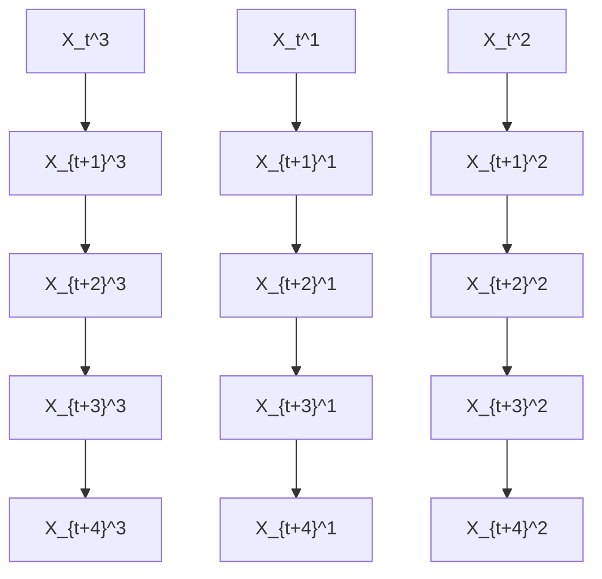

Figure 10.1: Example of a time series with no instantaneous effects.

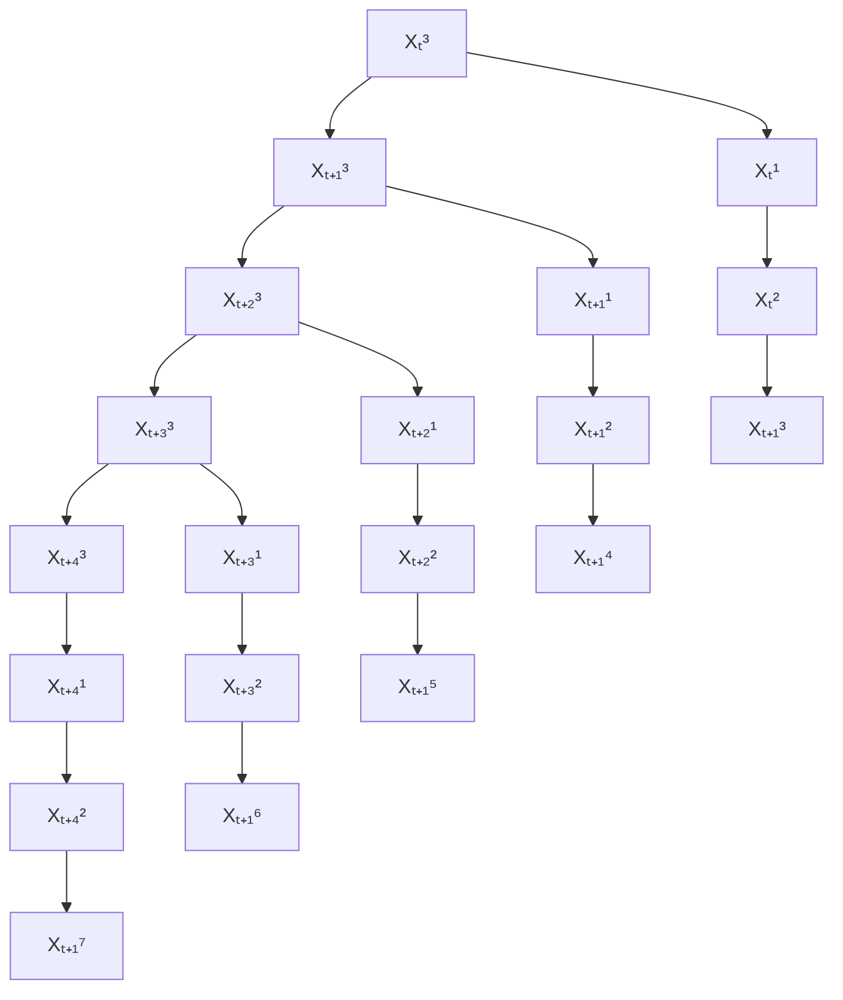

Figure 10.2: Example of a time series with instantaneous effects.

First, the causal graph1 with nodes $X _ { t } ^ { j }$ for $( j , t ) \in \{ 1 , \ldots , d \} \times \mathbb { Z }$ contains only arrows from $X _ { t } ^ { j }$ to $X _ { s } ^ { k }$ for $t < s$ but not for $t = s ;$ see Figure 10.1. Then we say there are no instantaneous effects. Second, the causal graph contains instantaneous effects, that is, arrows from $X _ { t } ^ { j }$ to $X _ { t } ^ { k }$ for some $j$ and k in addition to arrows going from $X _ { t } ^ { m }$ to $X _ { s } ^ { \ell }$ for $t < s$ and some m and $\ell ,$ as shown in Figure 10.2. We call the causal structure purely instantaneous if for any $j \neq k$ and $h > 0$ the variable $X _ { t } ^ { j }$ $X _ { t } ^ { k }$ $X _ { t + h } ^ { j }$ $X _ { t + h } ^ { k } ;$ where each $X _ { t } ^ { j }$ is not influenced by any previous variable (including its own past), can be ignored because it need not be described as time series. Instead, the index t may then be considered as labeling indices of independent instances of a statistical sample in the i.i.d. setting of previous chapters.

We define the full time graph as the DAG having $X _ { t } ^ { i }$ as nodes, as visualized in

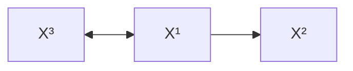

Figure 10.3: Summary graph of the full time graphs shown in Figures 10.1 and 10.2.

Figures 10.1 and 10.2. In contrast to previous chapters, the full time graph is a DAG with infinitely many nodes. The summary graph is the directed graph with nodes $X ^ { 1 } , \ldots , X ^ { d }$ containing an arrow from $X ^ { j }$ to $X ^ { k }$ for $j \neq k$ whenever there is an arrow from $X _ { t } ^ { j }$ to $X _ { s } ^ { k }$ for some $t \leq s \in \mathbb { Z }$ . Note that the summary graph is a directed graph that may contain cycles, although we will assume that the full time graph is acyclic. Figure 10.3 shows the summary graph corresponding to the full time graphs depicted in Figures 10.1 and 10.2. For any $t \in \mathbb { Z }$ , we denote by $\mathbf { X } _ { \mathrm { p a s t } ( t ) }$ the set of of all Xs with s < t and use X j $\mathbf { X } _ { s }$ $s < t$ $X _ { \mathrm { p a s t } ( t ) } ^ { j }$ for the past of a specific component $X ^ { j }$ . past(t) We also write $X _ { \mathrm { p a s t } } ^ { j }$ if t is some fixed time instant of reference. Moreover, $( \mathbf { X } _ { t } ^ { - j } ) _ { t \in \mathbb { Z } }$ denotes the collection of time series $( \mathbf { X } _ { t } ^ { k } ) _ { t \in \mathbb { Z } }$ for all $k \neq j$ .

## 10.2 Structural Causal Models and Interventions

We assume that the stochastic process $( \mathbf { X } _ { t } ) _ { t \in \mathbb { Z } }$ admits a description by an SCM in which at most the past q values (for some q) of all variables occur:

$$
X _ {t} ^ {j} := f ^ {j} \left((\mathbf {P A} _ {q} ^ {j}) _ {t - q}, \dots , (\mathbf {P A} _ {1} ^ {j}) _ {t - 1}, (\mathbf {P A} _ {0} ^ {j}) _ {t}, N _ {t} ^ {j}\right), \tag {10.1}
$$

where

$$
\ldots , N _ {t - 1} ^ {1}, \ldots , N _ {t - 1} ^ {d}, N _ {t} ^ {1}, \ldots , N _ {t} ^ {d}, N _ {t + 1} ^ {1}, \ldots , N _ {t + 1} ^ {d}, \ldots
$$

are jointly independent noise terms. Here, for each $s \in \mathbb { Z }$ , the symbol $( \mathbf { P A } _ { s } ^ { j } ) _ { t - s }$ denotes the set of variables $X _ { t - s } ^ { k } , k = 1 , \ldots , d ,$ that influence $X _ { t } ^ { j }$ . Note that $\mathbf { P A } _ { t - s } ^ { J }$ may contain $X _ { t - s } ^ { j }$ for all $s > 0$ , but not for $s = 0$ . We assume the corresponding full time graph to be acyclic.

A popular special case of (10.1) is the class of vector autoregressive models (VAR) [Lutkepohl, 2007]: ¨

$$
X _ {t} ^ {j} := \sum_ {i = 1} ^ {q} A _ {i} ^ {j} \mathbf {X} _ {t - i} + N _ {t} ^ {j}, \tag {10.2}
$$

where each $A _ { i } ^ { j }$ is a $1 \times d .$ -matrix; see also Remark 6.5 on linear cyclic models, especially Equation (6.4).

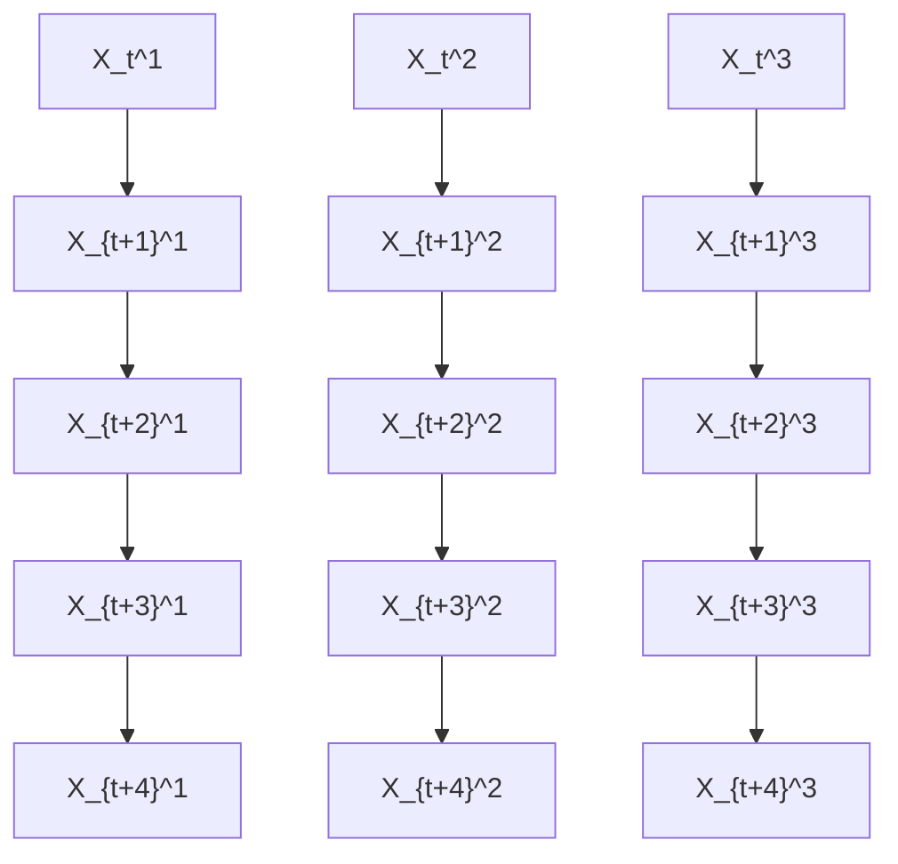

Figure 10.4: Example of a subsampled time series: only the variables in the shaded areas are observed.

As in the i.i.d. setting, SCMs formalize the effect of interventions; more precisely, an intervention corresponds to replacing some of the structural assignments. Interventions may, for instance, consist in setting all values $\{ X _ { t } ^ { j } \} _ { t \in \mathbb { Z } }$ for some j to certain values. Alternatively, one could also intervene on $X _ { t } ^ { j }$ only at one specific time instant t.

### 10.2.1 Subsampling

In many applications, the sampling process may be slower than the time scale of the causal processes. Figure 10.4 shows an example, in which only every second time instance is observed. The summary graph of the original full system contains the edges $X ^ { 1 }  X ^ { 2 }  X ^ { 3 }$ . We may now want to construct a causal model for the observed, subsampled processes. It is therefore important to define which interventions we want to allow for. First, if we constrain ourselves to interventions on observed time points, there should be no causal influence from $X ^ { 1 }$ to $X ^ { 2 }$ . Intervening on an observed instance of $X ^ { 1 }$ does not have any effect on the observable part of $X ^ { 2 }$ (note that the time series $X ^ { 1 }$ has only lag two effects $X _ { t } ^ { 1 } \to X _ { t + 2 } ^ { 1 } )$ . Furthermore, in this setting, subsampling cannot create spurious instantaneous effects if these have not been there before. For the case of an SCM, Bongers et al. [2016, Chapter 3] describe a formal process of how to marginalize the model by substituting the causal mechanisms of the hidden time steps into the other mechanisms. The resulting model describes the effect of interventions correctly if these are restricted to the observed time points. Second, if we do consider interventions on hidden variables, however, we may be interested in recovering the original summary graph, a problem that is addressed by Danks and Plis [2013] and Hyttinen et al. [2016], for example.

There are situations in which subsampling is not a good model for the datagenerating process. For many physical measurements, for example, one may want to model the observations as averages of consecutive time points rather than as a sparse subset of those. The former is a useful but also complicated model assumption: the averaging process might change the model class, and one furthermore needs to be careful about modeling interventions.

## 10.3 Learning Causal Time Series Models

Currently, Granger causality and its variations is among the most popular approaches to causal time series analysis. To provide a better link among the chapters, we nevertheless first explain the conclusions that can be drawn using a conditional independence-based approach. The order should by no means be mistaken as a judgment about the approaches.

Sections 10.3.1 and 10.3.2 contain mostly identifiability results. The remaining three Sections, 10.3.3, 10.3.4, and 10.3.5, contain more concrete causal learning methods for time series. They can be applied if the multivariate time series has been sampled once, at finitely many time points. Most of the ideas, however, transfer to situations, where we receive several i.i.d. repetitions of the same time series.

### 10.3.1 Markov Condition and Faithfulness

Lemma 6.25 states that two DAGs are Markov equivalent if and only if their skeleton and their set of v-structures coincide. If there are no instantaneous effects, the full time graph is therefore already determined by knowing its skeleton. The arrow can only be directed forward in time. We thus conclude [Peters et al., 2013, Proof of Theorem 1]:

Theorem 10.1 (Identifiabilty in absence of instantaneous effects) Assume that two full time graphs are induced by SCMs without instantaneous effects. If the full time graphs are Markov equivalent, then they are equal.

Hence, we can uniquely identify the full time graph from conditional independences provided that Markov condition and faithfulness holds (to deal with infinitely large DAGs, one sometimes assumes that the time series start at t = 0).

In the presence of instantaneous effects, Markov equivalent graphs can at most differ by the direction of those effects. However, there are many cases where even that direction can be identified because different directions of instantaneous effects induce different sets of v-structures. A simple example is shown in Figure 10.5. The direction of the instantaneous effect can still be inferred even if arrows from $X _ { t }$ to $Y _ { t + 1 }$ for all $t \in \mathbb { Z }$ are added to Figure 10.5, and likewise if arrows from $Y _ { t }$ to $X _ { t + 1 }$ are added; we cannot add both, however, because this would remove all vstructures. The following sufficient condition for the identifiability of the direction of instantaneous effects has been given by Peters et al. [2013, Theorem 1]:

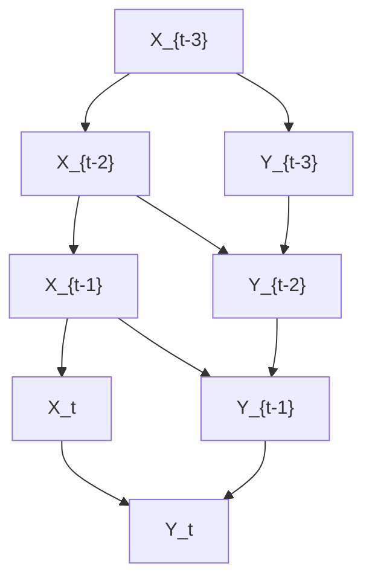

(a) There are v-structures at all nodes of $( Y _ { t } ) _ { t \in \mathbb { Z } }$ .

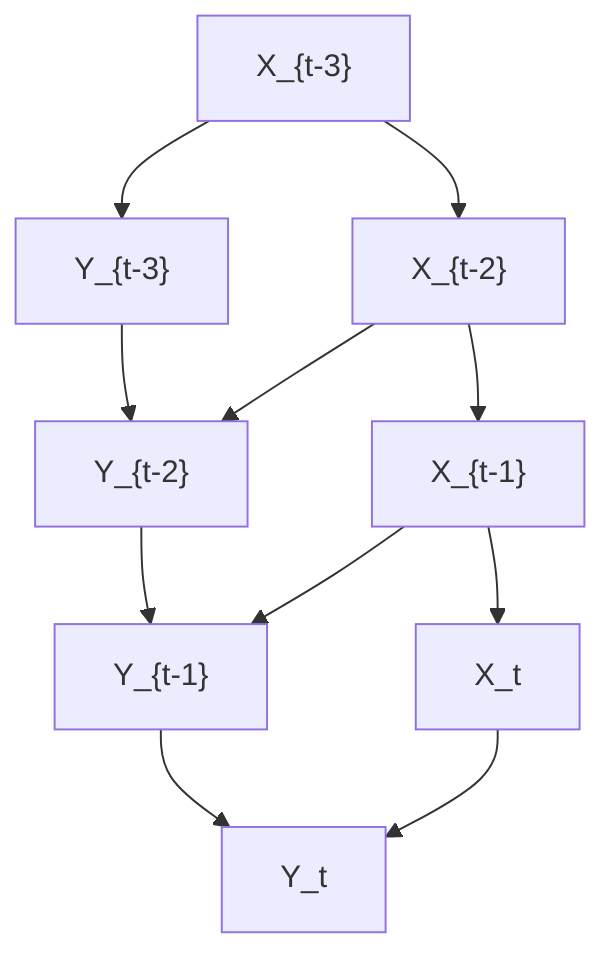

(b) There are v-structures at all nodes of $( X _ { t } ) _ { t \in \mathbb { Z } }$ .  
Figure 10.5: Two DAGs that are not Markov equivalent although they coincide up to instantaneous effects.

Theorem 10.2 (Identifiability for acyclic summary graphs) Assume that two full time graphs are induced by SCMs, and that in both cases for each j, $X _ { t } ^ { j }$ is influenced by $X _ { t - s } ^ { j }$ for some $s \geq 1$ . Assume further that the summary graphs are acyclic. If the full time graphs are Markov equivalent, then they are equal.

The following result shows that the presence of any arrow in the summary graph can in principle be decided from a single conditional independence test.

Theorem 10.3 (Justification of Granger causality) Consider an SCM without instantaneous effects for the time series $( \mathbf { X } _ { t } ) _ { t \in \mathbb { Z } }$ such that the induced joint distribution is faithful with respect to the corresponding full time graph. Then the summary graph has an arrow from $X ^ { j }$ to $X ^ { k }$ if and only if there exists a $t \in \mathbb { Z }$ such that

$$
X _ {t} ^ {k} \not \perp X _ {\text { past } (t)} ^ {j} | \mathbf {X} _ {\text { past } (t)} ^ {- j}. \tag {10.3}
$$

For completeness, we have included the proof in Appendix C.14. Similar results can be found in White and Lu [2010] and Eichler [2011, 2012]. As already suggested by the headline of Theorem 10.3, this is the basis of Granger causality that we discuss in more detail in Section 10.3.3.

### 10.3.2 Some Causal Conclusions Do Not Require Faithfulness

Remarkably, interesting causal conclusions can even be made from conditional dependences without using faithfulness. This is in contrast to the i.i.d. case where any distribution is Markovian with respect to the complete DAG for any ordering of nodes. Since there are no arrows backward in time, the Markov condition for time series is sufficient to infer whether the summary graph is X → Y or $Y  X$ , given that one of the two alternatives is true.

Theorem 10.4 (Detection of arrow $X  Y )$ Consider an SCM for the bivariate time series $( X _ { t } , Y _ { t } ) _ { t \in \mathbb { Z } }$ .

(i) If there is $a t \in \mathbb { Z }$ such that

$$
Y _ {t} \not \perp X _ {\text { past } (t)} \mid Y _ {\text { past } (t)}, \tag {10.4}
$$

then the summary graph contains an arrow from X to Y .

(ii) Assume further that there are no instantaneous effects and the joint density of any finite subset of variables is strictly positive. If for all $t \in \mathbb { Z }$ , we have

$$
Y _ {t} \perp X _ {\text { past } (t)} \mid Y _ {\text { past } (t)}, \tag {10.5}
$$

then the summary graph contains no arrow from X to Y .

Again, this proof may have appeared elsewhere, but we include it for completeness in Appendix C.15. Proving (ii) requires causal minimality, which is strictly weaker than faithfulness.

In the next subsection we will see that Theorem 10.4 and various variations [e.g., White and Lu, 2010, Eichler, 2011, 2012] link conditional independence-based approaches to causal discovery to Granger causality.

### 10.3.3 Granger Causality

For simplicity, we start with the bivariate version of Granger causality.

Bivariate Granger Causality Theorem 10.4 shows (subject to excluding instantaneous effects together with mild technical conditions) that the presence or absence of an arrow in the summary graph can be inferred by testing (10.5) and the analogous statement when exchanging the roles of X and Y . We can then distinguish between the possible summary graphs X Y , X → Y , X ← Y , X  Y . One infers that X influences Y whenever the past values of X help in predicting Y from its own past. Formally, we write

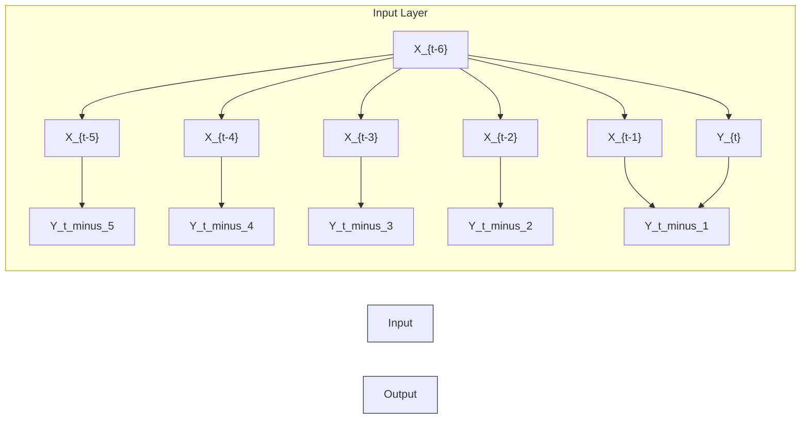

Figure 10.6: Typical scenario, in which Granger causality works: if all arrows from X to Y were missing, Yt would be conditionally independent of the past values of X, given its own past. Here, $Y _ { t }$ does depend on the past values of X, given its own past. Thus, condition (10.4) proves the existence of an influence from X to Y .

$$
X \text {   Granger - causes   } Y \quad : \Longleftrightarrow \quad Y _ {t} \not \perp X _ {\text { past } (t)} \mid Y _ {\text { past } (t)}. \tag {10.6}
$$

This idea already goes back to Wiener [1956, pages 189–190], who argued that X has a causal influence on Y if the prediction of Y from its own past is improved by additionally accounting for X. The typical scenario, in which Theorem 10.4 holds is depicted in Figure 10.6.

Often Granger causality refers to linear prediction. Then, one compares the following two linear regression models:

$$
Y _ {t} = \sum_ {i = 1} ^ {q} a _ {i} Y _ {t - i} + N _ {t} \tag {10.7}
$$

$$
Y _ {t} = \sum_ {i = 1} ^ {q} a _ {i} Y _ {t - i} + \sum_ {i = 1} ^ {q} b _ {i} X _ {t - i} + \tilde {N} _ {t}, \tag {10.8}
$$

where $( N _ { t } ) _ { t \in \mathbb { Z } }$ and $( \tilde { N } _ { t } ) _ { t \in \mathbb { Z } }$ are assumed to be i.i.d. time series, respectively. X is inferred to Granger-cause Y whenever the noise term $\tilde { N } _ { t }$ (for predictions including X) has significantly smaller variance than the noise term $N _ { t }$ obtained without X. This amounts to saying that $Y _ { t }$ has non-vanishing partial correlations to $X _ { \mathrm { p a s t } ( t ) }$ , given $Y _ { \mathrm { p a s t } ( t ) }$ . For multivariate Gaussian distributions, this is equivalent to the dependence statement (10.4). Modifications of this idea that use nonlinear regression have been extensively studied, too [e.g., Ancona et al., 2004, Marinazzo et al., 2008]. For non-parametric testing of (10.5) see, for instance, Diks and Panchenko [2006] and references therein.

An information theoretic quantity measuring the dependence between $Y _ { t }$ and thepast of X, given the past of Y , is given by transfer entropy [Schreiber, 2000]:

$$
T E (X \rightarrow Y) := I (Y _ {t}: X _ {\text { past } (t)} | Y _ {\text { past } (t)}), \tag {10.9}
$$

where $I ( \mathbf { A } : \mathbf { B } | \mathbf { C } )$ denotes the conditional mutual information [Cover and Thomas, 1991] for any three sets A, B, C of variables; see also Appendix A. Estimating transfer entropy and inferring that X causes Y whenever it is significantly greater than 0 can thus be considered as an information theoretic implementation of Granger causality that accounts for arbitrary nonlinear influences. It is therefore tempting to consider transfer entropy as a measure of the strength of the influence of X on Y , but “Limitations of Granger Causality” will explain why this is not appropriate.

Multivariate Granger Causality The assumption of causal sufficiency of a bivariate time series as in Theorem 10.4 is often inappropriate. This has already been addressed by Granger [1980]. We therefore say $X ^ { j }$ Granger causes $X ^ { k }$ if

$$
X _ {t} ^ {k} \not \perp X _ {\text { past } (t)} ^ {j} | \mathbf {X} _ {\text { past } (t)} ^ {- j}.
$$

Granger already emphasized that proper use of Granger causality would actually require to condition on all relevant variables in the world. Nevertheless, Granger causality is often used in its bivariate version or in situations, in which clearly important variables are unobserved. Such a use can yield misleading statements when interpreting the results causally.

Limitations of Granger Causality Violation of causal sufficiency is — as in the i.i.d. scenario of the previous chapters — a serious issue in causal time series analysis. To explain why Granger causality is misleading in a causally insufficient multivariate time series, we restrict the attention to the case where only a bivariate time series $( X _ { t } , Y _ { t } ) _ { t \in \mathbb { Z } }$ is observed. Assume that both $X _ { t }$ and $Y _ { t }$ are influenced by previous instances of a hidden time series $( Z _ { t } ) _ { t \in \mathbb { Z } }$ . This is depicted in Figure 10.7(a) where Z influences X with a delay of 1, and Y with a delay of 2. Assuming faithfulness, the d-separation criterion tells us

$$
Y _ {t} \not \perp X _ {\text { past } (t)} \mid Y _ {\text { past } (t)},
$$

while we have

$$
X _ {t} \perp       \perp Y _ {\text { past } (t)}   | X _ {\text { past } (t)}.
$$

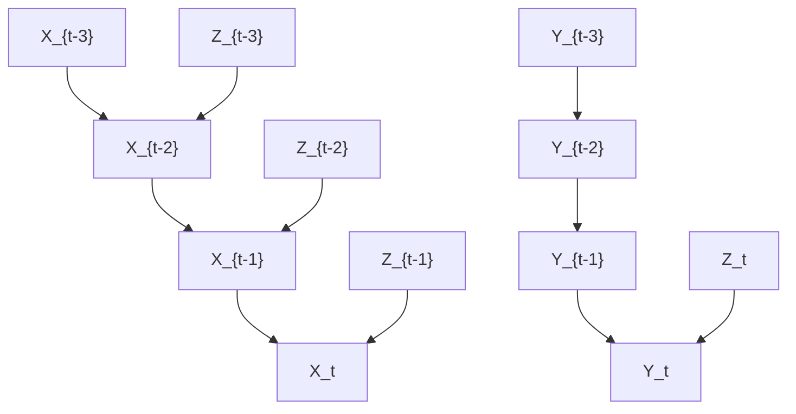

(a) Due to the hidden common cause $Z ,$ Granger causality erroneously infers causal influence from X to Y .

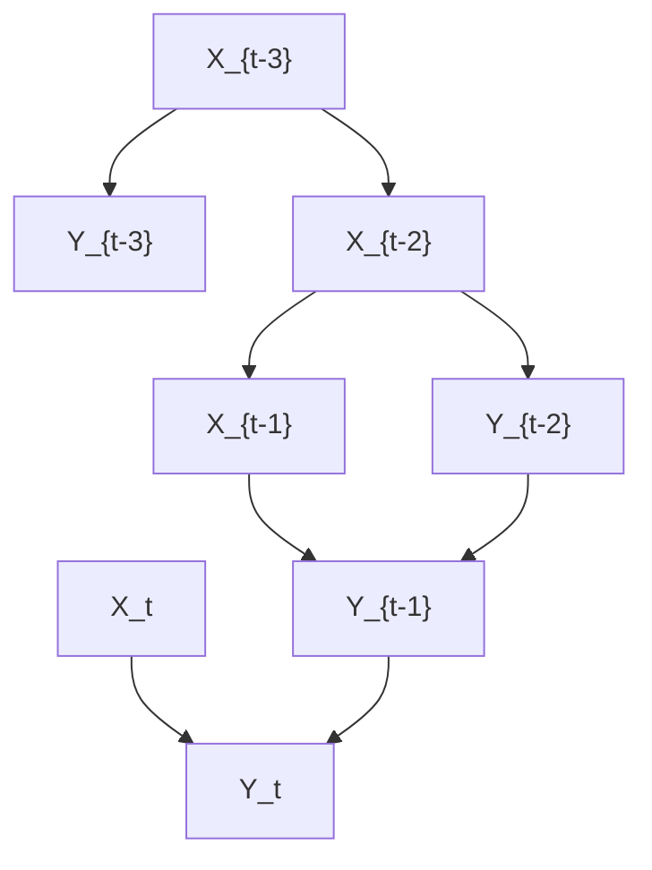

(b) Granger causality erroneously infers neither causal influence from X to Y nor from Y to X if the influence from $X _ { t }$ on $Y _ { t + 1 }$ and the one from $Y _ { t }$ to $X _ { t + 1 }$ are deterministic.  
Figure 10.7: In these examples, Granger causality infers an incorrect graph structure.

Thus, naive application of Granger causality infers that X causes Y and Y does not cause X. This effect has been observed, for instance, for the relation between the price of butter and the price of cheese. Both prices are strongly influenced by the price of milk, but the production of cheese takes much longer than the production of butter, which causes a larger delay between the prices of milk and cheese [Peters et al., 2013, Experiment 10]. This failure of Granger causality, however, is only possible because not all relevant variables are observed, which was stated as a requirement by Granger himself.

A second example for a scenario where Granger fails has been provided by Ay and Polani [2008] and is depicted in Figure 10.7(b). Assume that $X _ { t - 1 }$ influences $Y _ { t }$ deterministically via a copy operation, that is, $Y _ { t } : = X _ { t - 1 }$ . Likewise, the value of $Y _ { t - 1 }$ is copied to $X _ { t }$ . Then it is intuitively obvious that X and Y strongly influence each other in the sense that intervening on the value $X _ { t }$ changes all the values $Y _ { t + 1 + 2 k }$ for $k \in  { \mathbb { N } } _ { 0 }$ . Likewise, intervening on $Y _ { t }$ changes all values $X _ { t + 1 + 2 k }$ . Nevertheless, the past of X is useless for predicting $Y _ { t }$ from its past, because $Y _ { t }$ can already be predicted perfectly from its own past. Certainly, deterministic relations are in general problematic for conditional independence-based causal inference since determinism induces additional independences. For instance, if Y is a function of X in the causal chain $X  Y  Z .$ , we get $Y \perp \perp Z | X$ , which is not typical for this causal structure. One may therefore argue that this example is artificial and a more natural version would be a noisy copy operation. For the case where $X _ { t }$ and $Y _ { t }$ are binary variables, Janzing et al. [2013, Example 7] show that the transfer entropy converges to 0 when the noise level of the copy operation tends to 0. Then, Granger causality would indeed infer that X causes Y and Y causes X, but for small noise the tiny amount by which the past of X improves the prediction of $Y _ { t }$ does not properly account for the mutual influence between the time series (which is still strong in an intuitive sense). In this sense, transfer entropy is not an adequate measure for the strength of causal influence of one time series on another one. Janzing et al. [2013] discuss the limitations of different proposals to quantify causal influence (both for time series and the i.i.d. setting) and propose another information theoretic measure of causal strength. To summarize this paragraph, we emphasize that the qualitative statement about presence or absence of causal influence in the case of two causally sufficient time series only fails for a rather artificial scenario, while quantifying the causal influence via transfer entropy (which is suggested by interpreting “improvement of prediction” in information theoretic terms) can be problematic also in less artificial scenarios.

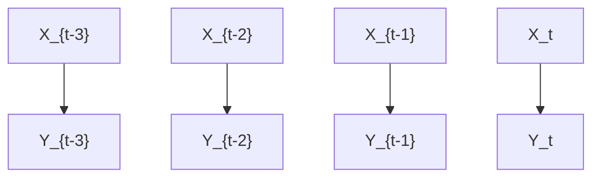

(a) Granger causality cannot detect the influence of X on Y because the past of X influences $Y _ { t }$ only via the past of Y .

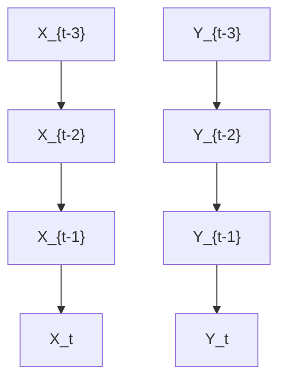

(b) Here, the past of X is still helpful for predicting $Y _ { t }$ since $X _ { t - 1 }$ influences $Y _ { t }$ indirectly via $X _ { t }$ . Thus, Granger causality is still able to detect the influence of X on Y .  
Figure 10.8: Two scenarios with instantaneous effects, one where Granger causality fails to detect them (a) and one where it does not (b).

There is another scenario where Granger causality is quantitatively misleading but its qualitative statement remains correct unless faithfulness is violated (it uses, however, instantaneous effects, for which one may argue that they disappear for sufficiently fine time resolution [Granger, 1988]). For Figure 10.8(a), d-separation yields

$$
Y _ {t} \perp       \perp X _ {\text { past } (t)}   |   Y _ {\text { past } (t)}.
$$

Intuitively speaking, only the present value $X _ { t }$ would help for better predicting $Y _ { t } .$ , but the past values $X _ { t - 1 } , X _ { t - 2 } , \dots$ . are useless and thus, Granger causality does not propose a link from X to Y . In Figure 10.8(b), however, Granger causality does detect the influence of X on Y (if we assume faithfulness) although it is still purely instantaneous, but the slight amount of improvement of the prediction does not properly account for the potentially strong influence of $X _ { t }$ on $Y _ { t }$ . To account for instantaneous effects, modifications of Granger causality have been proposed that add instantaneous terms in the corresponding SCM, but then identifiability may break down [e.g., Lutkepohl, 2007, (2.3.20) and (2.3.21)]. Knowing that a ¨ system contains instantaneous effects may suggest modifying Granger causality by regressing $Y _ { t }$ in (10.8) not only on $X _ { \mathrm { p a s t } ( t ) }$ but on $X _ { t } \cup X _ { \mathrm { p a s t } ( t ) }$ instead. However, as already noted by Granger [1988], this may yield wrong conclusions: if $X _ { t }$ helps in predicting $Y _ { t } .$ , this could equally well mean that $Y _ { t }$ influences $X _ { t }$ instead of indicating an influence from $X _ { t }$ to $Y _ { t }$ .

Remark 10.5 (Model misspecification may help) There is a paradox message of this insight: even in the case in which variables influence other variables instantaneously, for inferring causal statements it is more conclusive to check whether the past of a variable helps for the prediction rather than to check whether the past and the present value help. Condition (i) of Theorem 10.4 does not exclude instantaneous effects. Therefore (subject to causal sufficiency), we can still conclude that every benefit of $X _ { \mathrm { p a s t } ( t ) }$ for predicting $Y _ { t }$ from $Y _ { \mathrm { p a s t } ( t ) }$ is due to an influence of X on $Y .$ . Moreover, whenever there is any influence of X on $Y _ { \ast }$ , no matter whether it is purely instantaneous or not, $X _ { \mathrm { p a s t } ( t ) }$ will in the generic case improve our prediction of Yt , given Ypast(t). $Y _ { t }$ $Y _ { \mathrm { p a s t } ( t ) }$ □

### 10.3.4 Models with Restricted Function Classes

To address the limitations of Granger causality, Hyvarinen et al. [2008] describe ¨ linear non-Gaussian autoregressive models that render causal structures with instantaneous effects identifiable. Peters et al. [2013] describe how to address this task using less restrictive function classes $f ^ { j }$ in (10.1). One example is given by adapting ANMs to time series, that is, to use the SCM

$$
X _ {t} ^ {j} := f ^ {j} \left((\mathbf {P A} _ {q} ^ {j}) _ {t - q}, \dots , (\mathbf {P A} _ {1} ^ {j}) _ {t - 1}, (\mathbf {P A} _ {0} ^ {j}) _ {t}\right) + N _ {t} ^ {j},
$$

for $j \in \{ 1 , \dotsc , d \}$ . Apart from identifiability of causal structures within Markov equivalence classes, there is a second motivation using restricted function classes: using simulated time series, Peters et al. [2013] provide some empirical evidence for the belief that time series that admit models from a restricted function class are less likely to be confounded.

### 10.3.5 Spectral Independence Criterion

The spectral independence criterion (SIC) is a method that is based on the idea of independence between cause and mechanism described in Shajarisales et al. [2015]. Assume we are given a weakly stationary bivariate time series $( X _ { t } , Y _ { t } ) _ { t \in \mathbb { Z } }$ where either X influences Y or Y influences X via a linear time invariant filter. More explicitly, for the case that X influences Y , Y is then obtained from X by convolution with a function h:

$$
Y _ {t} = \sum_ {k = 1} ^ {\infty} h (k) X _ {t - k}. \tag {10.10}
$$

For technical details, such as the decay conditions for h that ensure that (10.10) and expressions below are well-defined, we refer to Shajarisales et al. [2015]. To formalize an independence condition between X and h, we consider the action of the filter in the frequency domain: for all $\nu \in \left[ - 1 / 2 , 1 / 2 \right]$ , let $S _ { X X } ( \nu )$ denote the power spectral density for the frequency ν; the latter is explicitly given by the Fourier transform of the auto-covariance function

$$
C _ {X X} (\tau) := \mathbb {E} \left[ X _ {t} X _ {t + \tau} \right], \quad \text { with } \tau \in \mathbb {Z}.
$$

Then, (10.10) yields

$$
S _ {Y Y} (\nu) = | \tilde {h} (\nu) | ^ {2} \cdot S _ {X X} (\nu), \tag {10.11}
$$

where $\begin{array} { r } { \tilde { h } ( \nu ) = \sum _ { k \in \mathbb { Z } } e ^ { - i 2 \pi k \nu } h ( k ) } \end{array}$ denotes the Fourier transform of h. In other words, multiplying the power spectrum of the input time series with the squared transfer function of the filter yields the power spectrum of the output. Whenever $\tilde { h }$ is invertible, in addition to (10.11) we have

$$
S _ {X X} (\nu) = \left| \frac {1}{\tilde {h} (\nu)} \right| ^ {2} \cdot S _ {Y Y} (\nu). \tag {10.12}
$$

While both equations (10.11) and (10.12) are valid, the question is which one describes the causal model. The idea is that for the causal direction, the power spectrum of the input time series carries no information about the transfer function of the filter. To formalize this, Shajarisales et al. [2015] state the following independence condition:

Definition 10.6 (SIC) The time series X and the filter h are said to satisfy the SIC $i f S _ { X X }$ and $\tilde { h }$ are uncorrelated, that $i s ,$ ,

$$
\langle S _ {X X} \cdot | \tilde {h} | ^ {2} \rangle = \langle S _ {X X} \rangle \cdot \langle | \tilde {h} | ^ {2} \rangle , \tag {10.13}
$$

where $\textstyle \langle f \rangle : = \int _ { - 1 / 2 } ^ { 1 / 2 } f ( \nu ) d \nu$ denote the average of any function on the frequency interval $[ - 1 / 2 , 1 / 2 ]$ .

Shajarisales et al. [2015] show that (10.13) implies that the analogue independence condition for the backward direction does not hold, except for the nongeneric case where $| { \tilde { h } } |$ is constant over the whole interval of frequencies.

Theorem 10.7 (Identifiability via SIC) If (10.13) holds and $| { \hat { h } } |$ is not constant in ν then $S _ { Y Y }$ is negatively correlated with $1 / | { \tilde { h } } | ,$ , that $i s ,$

$$
\langle S _ {Y Y} \cdot 1 / | \tilde {h} | ^ {2} \rangle <   \langle S _ {Y Y} \rangle \cdot \langle 1 / | \tilde {h} | ^ {2} \rangle . \tag {10.14}
$$

Proof. The left-hand sides of (10.13) and (10.14) are given by $\langle S _ { Y Y } \rangle$ and $\langle S _ { X X } \rangle$ , respectively. Jensen’s inequality states $1 / \langle | \tilde { h } | ^ { 2 } \rangle < \langle 1 / | \tilde { h } | ^ { 2 } \rangle$ , which implies the statement. 

Shajarisales et al. [2015] propose a simple causal inference algorithm that checks which direction is closer to satisfying SIC. They report some encouraging results using SIC for experiments with various simulated and real-world data sets.

## 10.4 Dynamic Causal Modeling

Dynamic causal modeling (DCM) is a technique that has been developed particularly for inferring causal relations between the activities of different brain regions [Friston et al., 2003]. If the vector $z \in \mathbb { R } ^ { n }$ encodes the activity of n brain regions and $u \in \mathbb { R } ^ { m }$ a vector of perturbations, the dynamics of $z$ is given by a differential equation of the form

$$
\frac {d}{d t} z = F (z, u, \theta), \tag {10.15}
$$

where F is a known function, $u \in \mathbb { R } ^ { m }$ is a vector of external stimulations, and θ parametrizes the model class describing the causal links between the different brain regions. One often considers the following bilinear approximation of (10.15):

$$
\frac {d}{d t} z = \left(A + \sum_ {j = 1} ^ {m} u _ {j} B ^ {j}\right) z + C u, \tag {10.16}
$$

where $A , B ^ { 1 } , \ldots , B ^ { m }$ are $n \times n$ matrices and C has the size $n \times m$ . While A describes the mutual influence of the activities $z _ { j }$ in different regions, the matrices $B ^ { j }$ describe how u changes their mutual influence. C encodes the direct influence of u on z.

Here, z is not directly observable, but one can detect the hemodynamic response. The blood flow provides an increased amount of nutrients (such as oxygen and glucose) to compensate for the increased demand of energy. Functional magnetic resonance imaging (fMRI) is able to detect this increase via the blood-oxygenlevel–dependent (BOLD) signal. Defining a state vector x that includes both the brain activity and some hemodynamic state variables, one ends up with a differential equation for x

$$
\frac {d}{d t} x = f (x, u, \theta) \tag {10.17}
$$

by combining (10.16) with a dynamical model of the hemodynamic response. The high-dimensional parameter θ consists of all free parameters of (10.16) and parameters from modeling the hemodynamic response. Then, one uses a model of how x determines the measured BOLD signal y:

$$
y = \lambda (x). \tag {10.18}
$$

Finally, as data, we obtain an observed time series of y-vectors. DCM then infers the matrices in (10.16) from these data using various known techniques for learning models with latent variables, for example, expectation maximization (EM).

Lohmann et al. [2012a] criticize DCM mainly because the number of model parameters explodes with growing n and m, which renders their identification impossible from empirical data. According to their experiments with simulated brain connections, a large fraction of wrong models obtained higher evidence by DCM than the true model. These findings triggered a debate about DCM; see also Friston et al. [2013] for a response to Lohmann et al. [2012a] and Lohmann et al. [2012b] for a response to Friston et al. [2013].

## 10.5 Problems

Problem 10.8 (Acyclic summary graphs) Prove Theorem 10.2.

Problem 10.9 (Instantaneous effects) Consider an SCM over a multivariate time series, in which each variable $X _ { t } ^ { j }$ is influenced by all past values of all components $X ^ { k } ,$ . Additionally, assume that the instantaneous effects form a DAG and that the distribution is Markovian and faithful with respect to the full time graph. To which extent can one identify the instantaneous DAG structure from the distribution?

Problem 10.10 (Granger causality) Argue why Granger causality results in $^ { * } X$ G causes $Y ^ { \prime \prime }$ and “Y G causes $X ^ { \dprime }$ if one adds arrows $Z _ { t } \to Z _ { t + 1 }$ for $t \in \mathbb { Z }$ in Figure $I O . 7 ( a )$ .

### A