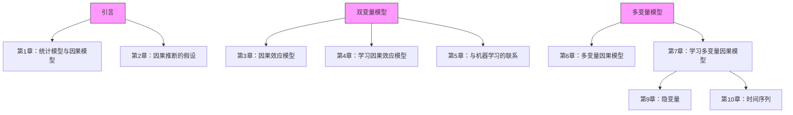

# 因果推断要素（Elements of Causal Inference）

基础与学习算法（Foundations and Learning Algorithms）

Jonas Peters、Dominik Janzing 和 Bernhard Schölkopf

麻省理工学院出版社（The MIT Press）

马萨诸塞州剑桥市

英国伦敦

© 2017 麻省理工学院（Massachusetts Institute of Technology）

本作品根据知识共享署名-非商业性-禁止演绎 4.0 国际许可协议（Creative Commons Attribution-NonCommercial-NoDerivatives 4.0 license）向公众授权：

http://creativecommons.org/licenses/by-nc-nd/4.0/

除上述知识共享许可协议授权的范围外，保留所有权利。任何未经上述许可授权的复制或其他使用行为，无论通过何种电子或机械方式（包括但不限于影印、公开传播、在线展示以及数字信息存储与检索），均需获得出版方的书面许可。

本书由作者使用 LaTeX 排版。

在美国印刷并装订。

美国国会图书馆出版编目数据（Library of Congress Cataloging-in-Publication Data）

姓名：Peters, Jonas. | Janzing, Dominik. | Schölkopf, Bernhard.

书名：因果推断要素：基础与学习算法（Elements of causal inference : foundations and learning algorithms）

描述：剑桥，马萨诸塞州：麻省理工学院出版社，2017年。| 丛书：自适应计算与机器学习系列（Adaptive computation and machine learning series）| 含参考文献与索引。

标识符：LCCN 2017020087 | ISBN 9780262037310（精装：碱性纸张）

主题：LCSH：机器学习（Machine learning）。| 逻辑，符号与数学（Logic, Symbolic and mathematical）。| 因果关系（Causation）。| 推断（Inference）。| 计算机算法（Computer algorithms）。

分类：LCC Q325.5 .P48 2017 | DDC 006.3/1–dc23

LC 记录可访问：https://lccn.loc.gov/2017020087

谨以此书献给所有乐于追求因果洞见的人们

## 前言（Preface）

**因果关系（Causality）** 是一个引人入胜的研究课题。其数学化进程直到最近才真正开始，许多概念性问题仍在被激烈争论——其激烈程度往往相当可观。

虽然本书总结了我们在因果关系领域耗费十年探索的成果，但其他研究者研究这一问题的时间远比我们更长，并且已有关于因果关系的著作问世，包括 Pearl [2009]、Spirtes 等人 [2000] 以及 Imbens 和 Rubin [2015] 的综合性论述。我们希望本书能够在两个方面对现有工作起到补充作用。

首先，本书倾向于关注因果关系的某个子问题，该问题可能被认为既是最基础的，也是最不现实的。这就是**因果效应问题（cause-effect problem）**，其中所分析的系统仅包含两个可观测变量。我们在过去十年中对这一问题进行了较为详细的研究。我们在此报告了其中的大部分工作，并试图将其置于一个更大的背景之下，我们认为这对于获得对因果关系问题选择性但深入的理解至关重要。虽然按照章节顺序首先研究双变量情形可能具有启发意义，但直接开始阅读多变量章节也是可行的；参见图 I。

其次，我们的论述受到**机器学习（machine learning）** 和**计算统计学（computational statistics）** 领域的启发和影响。我们感兴趣的是这些领域的方法如何帮助推断因果结构，更重要的是，因果推理是否能够指导我们进行机器学习的方式。事实上，我们感到，如果我们将因果结构（而非由概率分布描述的随机实验）作为出发点，那么机器学习中一些最深层次的未解决问题将能得到最好的理解。

我们试图提供一个系统性的主题导论，面向熟悉概率论与统计学或机器学习基础知识的读者（为完整起见，最重要的概念在附录 A.1 和 A.2 中进行了总结）。

虽然我们建立在 Pearl [2009] 和 Spirtes 等人 [2000] 所代表的因果关系图形化方法之上，但我们个人的品味影响了主题的选择。为了使本书易于理解并聚焦于概念性问题，我们不得不遗憾地将大量关于因果关系的重要问题——无论是特定情境下的高级理论洞见，还是各种具有实际重要性的方法——压缩到极少的篇幅。我们已尝试为一些最明显的遗漏之处纳入文献引用，但可能仍遗漏了重要主题。

本书存在一些不足之处。其中部分源于该领域本身，例如理论结果通常局限于拥有无限数据量的情形。虽然我们确实提供了针对有限数据情形的算法和方法论，但我们并未讨论此类方法的统计性质。此外，在某些地方，我们忽略了测度论问题，通常通过假设密度的存在性来处理。我们认为所有这些问题既相关又有趣，但做出这些选择是为了保持本书篇幅简短且面向广泛的读者群体。

还有一点需要声明。**计算因果关系方法（Computational causality methods）** 仍处于起步阶段，特别是从数据中学习因果结构仅在相当有限的条件下才可实现。我们已尽可能在适当之处纳入具体算法，但我们清楚地认识到，许多因果推断问题比典型的机器学习问题更为困难，因此我们无法保证这些算法能够在读者的问题上奏效。请不要因这一评论而感到气馁——因果学习是一个引人入胜的课题，我们希望阅读本书能够说服您开始从事这方面的研究。

没有众多人士的支持，我们无法完成本书。

我们衷心感谢三位作者在奥伯沃尔法赫数学研究所（Mathematisches Forschungsinstitut Oberwolfach）开展“合作研究”（Research in Pairs）期间所获得的支持，本书的相当一部分内容是在此期间完成的。

我们感谢 Michel Besserve、Peter Bühlmann、Rune Christiansen、Frederick Eberhardt、Jan Ernest、Philipp Geiger、Niels Richard Hansen、Alain Hauser、Biwei Huang、Marek Kaluba、Hansruedi Künsch、Steffen Lauritzen、Jan Lemeire、David López-Paz、Marloes Maathuis、Nicolai Meinshausen、Søren Wengel Mogensen、Joris Mooij、Krikamol Muandet、Judea Pearl、Niklas Pfister、Thomas Richardson、Mateo Rojas-Carulla、Eleni Sgouritsa、Carl Johann Simon-Gabriel、Xiaohai Sun、Ilya Tolstikhin、Kun Zhang 和 Jakob Zscheischler，感谢他们在本书撰写期间提供的许多有益评论和有趣讨论。特别是，

建议读者从第1章开始，该图描绘了各章节之间较强的依赖关系（实际上还存在许多不太显著的依赖关系）。

Joris 和 Kun 参与了本书所呈现的许多研究工作。

我们感谢卡尔斯鲁厄理工学院（Karlsruhe Institute of Technology）、苏黎世联邦理工学院（Eidgenössische Technische Hochschule Zürich）和图宾根大学（University of Tübingen）的众多学生，他们审阅了本书的早期版本并提出了许多启发性的问题。

最后，我们感谢匿名审稿人以及 Westchester Publishing Services 的编辑团队提出的有益意见，感谢麻省理工学院出版社（MIT Press）的工作人员，特别是 Marie Lufkin Lee 和 Christine Bridget Savage，在整个过程中提供的亲切支持。

哥本哈根与图宾根，2017年8月

Jonas Peters

Dominik Janzing

Bernhard Schölkopf

## 符号与术语（Notation and Terminology）

| $X,Y,Z$ | 随机变量；对于噪声变量，我们使用 $N$, $N_X$, $N_j$, ... |
| :--- | :--- |
| $x$ | 随机变量 $X$ 的一个取值 |
| $P$ | 概率测度 |
| $P_X$ | $X$ 的概率分布 |
| $X^1, \ldots, X^n \stackrel{\text{iid}}{\sim} P_X$ | 大小为 $n$ 的独立同分布样本；样本索引通常为 $i$ |
| $P_{Y\|X=x}$ | 给定 $X = x$ 时 $Y$ 的条件分布 |
| $P_{Y\|X}$ | 所有 $x$ 对应的 $P_{Y\|X=x}$ 的集合；简写：给定 $X$ 时 $Y$ 的条件分布 |
| $p$ | 密度（概率质量函数或概率密度函数） |
| $p_X$ | $P_X$ 的密度 |
| $p(x)$ | 在点 $x$ 处评估的 $P_X$ 的密度 |
| $p(y\|x)$ | 在 $y$ 处评估的 $P_{Y\|X=x}$ 的（条件）密度 |
| $\mathbb{E}[X]$ | $X$ 的期望 |
| $\text{var}[X]$ | $X$ 的方差 |
| $\text{cov}[X,Y]$ | $X,Y$ 的协方差 |
| $X \perp Y$ | 随机变量 $X$ 和 $Y$ 之间的独立性 |
| $X \perp Y \mid Z$ | 条件独立性 |
| $\mathbf{X} = (X_1, \ldots, X_d)$ | 长度为 $d$ 的随机向量；维度索引通常为 $j$ |
| $\mathfrak{C}$ | 结构因果模型 |
| $P_Y^{\mathfrak{C};\text{do}(X:=3)}$ | 干预分布 |
| $P_Y^{\mathfrak{C}\mid Z=2,X=1;\text{do}(X:=3)}$ | 反事实分布 |
| $\mathcal{G}$ | 图 |
| $\mathbf{PA}_X^{\mathcal{G}}, \mathbf{DE}_X^{\mathcal{G}}, \mathbf{AN}_X^{\mathcal{G}}$ | 在图 $\mathcal{G}$ 中节点 $X$ 的父节点、后代节点和祖先节点 |