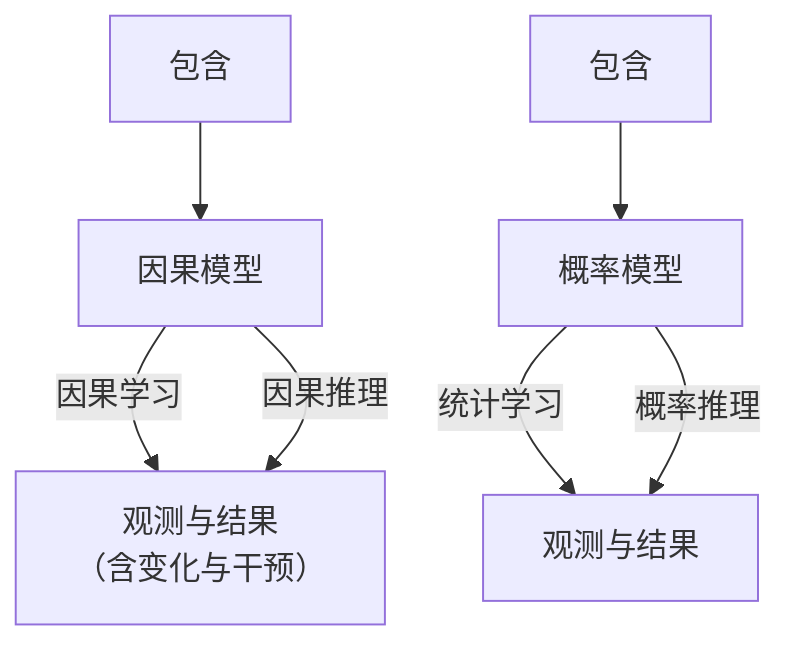
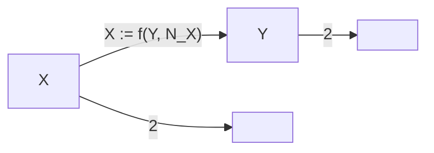

# 统计模型与因果模型（Statistical and Causal Models）

利用**统计学习（statistical learning）**，我们试图从观测数据中推断随机变量之间依赖关系的性质。例如，基于两个随机变量的联合观测样本，我们可能构建一个预测器，当只给出其中一个变量的新值时，该预测器能够对另一个变量提供良好的估计。支撑此类预测的理论已经相当完善，并且——尽管它适用于简单场景——已经为从数据中学习提供了深刻的见解。出于两个原因，我们将在本章中描述其中一些见解。首先，这将有助于我们理解**因果推断（causal inference）**问题要困难得多，因为其底层模型不再是随机变量的固定联合分布，而是一个蕴含多种此类分布的结构。其次，尽管用于因果估计的有限样本结果很少，但重要的是要记住，当转向更复杂的因果场景时，基本的统计估计问题并不会消失，即使它们与纯粹统计学习中不出现的因果问题相比显得微不足道。在前述基础之上，本章还通过两个例子（其中一个在机器学习中广为人知）对**因果关系（causality）**的基本概念进行了初步介绍。

## 1.1 概率论与统计学（Probability Theory and Statistics）

**概率论（Probability theory）**和**统计学（statistics）**建立在**随机实验（random experiment）**或**概率空间（probability space）** $(\Omega, \mathcal{F}, P)$ 的模型之上。这里， $\Omega$ 是一个集合（包含所有可能的结果）， $\mathcal{F}$ 是事件 $A \subseteq \Omega$ 的集合， $P$ 是一个为每个事件分配概率的测度。给定上述数学结构，概率论使我们能够推理随机实验的结果。另一方面，**统计学习（Statistical learning）**本质上处理的是逆问题：我们得到实验的结果，并希望从中推断底层数学结构的性质。例如，假设我们观测到了数据

$$
(x_1, y_1), \dots, (x_n, y_n), \tag{1.1}
$$

其中 $x_i \in \mathcal{X}$ 是**输入（inputs）**（有时称为**协变量（covariates）**或**案例（cases）**）， $y_i \in \mathcal{V}$ 是**输出（outputs）**（有时称为**目标（targets）**或**标签（labels）**）。我们现在可以假设每个 $(x_i, y_i), i=1,\ldots,n$ 都是由同一个未知的随机实验独立生成的。更精确地说，这样的模型假设观测值 $(x_1, y_1), \ldots, (x_n, y_n)$ 是随机变量 $(X_1, Y_1), \ldots, (X_n, Y_n)$ 的实现，这些随机变量是**独立同分布（i.i.d.）**的，其联合分布为 $P_{X,Y}$ 。这里， $X$ 和 $Y$ 是在度量空间 $\mathcal{X}$ 和 $\mathcal{V}$ 中取值的随机变量。¹ 几乎所有的统计学和机器学习都建立在独立同分布数据的基础上。在实践中，独立同分布假设可能以各种方式被违反，例如当分布发生偏移或系统中发生**干预（interventions）**时。正如我们稍后将看到的，其中一些与因果关系密切相关。

我们可能对 $P_{X,Y}$ 的某些性质感兴趣，例如：

(i) 给定输入时的输出期望， $f(x) = \mathbb{E}[Y | X = x]$ ，称为**回归（regression）**，通常 $\mathcal{V} = \mathbb{R}$ ，
(ii) 一个**二分类器（binary classifier）**，将每个 $x$ 分配给可能性更大的类别， $f(x) = \operatorname{argmax}_{y \in \mathcal{V}} P(Y = y | X = x)$ ，其中 $\mathcal{V} = \{\pm 1\}$ ，
(iii) $P_{X,Y}$ 的密度 $p_{X,Y}$ （假设其存在）。

在实践中，我们试图根据有限的数据集来估计这些性质，即基于样本 (1.1)，或者等价地基于一个**经验分布（empirical distribution）** $P_{X,Y}^n$ ，该分布在每个观测值上放置等权重的点质量。

这构成了一个**逆问题（inverse problem）**：我们想要估计一个我们无法观测的对象（底层分布）的性质，而我们的依据是通过对该底层对象应用一个操作（在当前情况下：从未知分布中采样）所获得的观测值。

## 1.2 学习理论（Learning Theory）

现在假设，就像我们可以从 $P_{X,Y}$ 得到 $f$ 一样，我们使用经验分布来推断经验估计值 $f^n$ 。事实证明这是一个**不适定问题（ill-posed problem）** [例如，Vapnik, 1998]，因为对于样本 $(x_1, y_1), \ldots, (x_n, y_n)$ 中未曾出现的任何 $x$ 值，条件期望是未定义的。然而，我们可以在观测样本上定义函数 $f$ ，并根据某个固定规则对其进行扩展（例如，在样本外将 $f$ 设为 +1，或者选择一个连续的分段线性 $f$ ）。但对于任何此类选择，输入的微小变化，即经验分布的变化，都可能导致输出的巨大变化。无论我们有多少观测值，经验分布通常不会完美地近似真实分布，而近似中的微小误差可能导致估计值中的巨大误差。这意味着，如果没有关于我们从中选择经验估计值 $f^n$ 的函数类别的额外假设，我们就无法保证这些估计值会在适当意义上逼近最优量 $f$ 。在**统计学习理论（statistical learning theory）**中，这些假设用**容量度量（capacity measures）**来形式化。如果我们使用的函数类非常丰富，以至于能够拟合大多数可以想象的数据集，那么我们能拟合手头的数据也就不足为奇了。然而，如果函数类先验地被限制为具有小容量，那么只有少数数据集（在所有可能的数据集空间中）可以用该函数类中的函数来解释。如果事实证明我们仍然能够解释手头的数据，那么我们就有理由相信我们找到了数据背后的某种规律性。在这种情况下，我们可以为将来从同一分布 $P_{X,Y}$ 中采样的数据的解精度提供概率保证。

另一种思考方式是，我们的函数类已经融入了与观测数据背后的规律性相一致的**先验知识（a priori knowledge）**（例如函数的平滑性）。这种知识可以通过多种方式融入，而不同的机器学习方法在处理这个问题上的方式也各不相同。在**贝叶斯方法（Bayesian approaches）**中，我们为函数类和噪声模型指定先验分布。在**正则化理论（regularization theory）**中，我们构造合适的正则化器并将其纳入优化问题，以使我们的解产生偏差。

统计学习的复杂性主要源于我们试图基于经验数据解决一个逆问题——如果我们拥有完整的概率模型，那么所有这些问题都会消失。当我们讨论因果模型时，我们将看到，从某种意义上说，因果学习问题更难，因为它在两个层面上都是不适定的。除了统计上的不适定性（这本质上是因为任意大小的有限样本永远不会包含关于底层分布的所有信息）之外，还存在一种不适定性，即通常即使完全了解观测分布也无法确定底层的因果模型。

让我们更详细地研究统计学习问题，重点关注**二值模式识别（binary pattern recognition）**或**分类（classification）**的情况 [例如，Vapnik, 1998]，其中 $\mathcal{V} = \{\pm 1\}$ 。我们试图基于从未知的 $P_{X,Y}$ 独立同分布生成的观测值 (1.1) 来学习 $f: \mathcal{X} \to \mathcal{V}$ 。我们的目标是在某个函数类 $\mathcal{F}$ 上最小化**期望误差（expected error）**或**风险（risk）** ²

$$
R[f] = \int \frac{1}{2} |f(x) - y| dP_{X,Y}(x, y) \tag{1.2}
$$

注意，这是关于测度 $P_{X,Y}$ 的积分；然而，如果 $P_{X,Y}$ 允许关于勒贝格测度的密度 $p(x, y)$ ，则该积分简化为 $\int \frac{1}{2} |f(x) - y| p(x, y) dx dy$ 。

由于 $P_{X,Y}$ 是未知的，我们无法计算 (1.2)，更不用说最小化它了。相反，我们诉诸于一个**归纳原则（induction principle）**，例如**经验风险最小化（empirical risk minimization, ERM）**。我们返回在 $f \in \mathcal{F}$ 上最小化**训练误差（training error）**或**经验风险（empirical risk）**的函数

$$
R_{\mathrm{emp}}^n[f] = \frac{1}{n} \sum_{i=1}^{n} \frac{1}{2} |f(x_i) - y_i| \tag{1.3}
$$

从渐近的角度来看，重要的是要问这样的过程是否**一致（consistent）**，这基本上意味着当 $n$ 趋于无穷时，它产生一个函数序列，其风险（依概率）收敛到给定函数类 $\mathcal{F}$ 内的最小可能值。在附录 A.3 中，我们表明只有当函数类“小”时，这才可能成立。**Vapnik-Chervonenkis (VC) 维数（Vapnik-Chervonenkis (VC) dimension）** [Vapnik, 1998] 是衡量函数类容量或大小的一种可能方法。它还允许我们推导出有限样本保证，即风险 (1.2) 以高概率不大于经验风险加上一个随函数类 $\mathcal{F}$ 的大小增长的项。

这样的理论与关于**普遍一致性（universal consistency）**的现有结果并不矛盾，普遍一致性指的是学习算法收敛到任何函数都能达到的最低可实现风险。存在普遍一致的学习算法，例如**最近邻分类器（nearest neighbor classifiers）**和**支持向量机（Support Vector Machines）** [Devroye et al., 1996, Vapnik, 1998, Scholkopf and Smola, 2002, Steinwart and ¨ Christmann, 2008]。虽然普遍一致性基本上告诉我们，在无限数据的极限下，一切都可以被学习，但由于**慢速率（slow rates）**现象，它并不意味着每个问题都能从有限数据中很好地学习。对于任何学习算法，都存在学习速率任意慢的问题 [Devroye et al., 1996]。然而，它确实告诉我们，如果我们固定分布，并收集足够多的数据，那么我们最终可以任意接近最低风险。

在实践中，机器学习系统最近的成功似乎表明，我们有时确实已经处于这种渐近状态，并且常常取得惊人的成果。大量思考投入到了设计最数据高效的方法，以从给定的数据集中获得尽可能好的结果，同时也有大量努力投入到构建能够训练这些方法的大规模数据集中。然而，在所有这些场景中，至关重要的是底层分布在训练和测试之间不能有差异，无论是由于干预还是其他变化。正如我们将在本书中论证的那样，将底层规律性描述为概率分布，如果没有额外的结构，并不能为我们提供描述可能变化之处的正确手段。

## 1.3 因果建模与学习（Causal Modeling and Learning）

**因果建模（Causal modeling）**始于另一种，可以说是更基本的结构。一个**因果结构（causal structure）**蕴含一个概率模型，但它包含后者所不包含的额外信息（参见第 1.4 节的例子）。根据本书使用的术语，**因果推理（Causal reasoning）**表示从因果模型中得出结论的过程，类似于概率论允许我们推理随机实验的结果。然而，由于因果模型包含比概率模型更多的信息，因果推理比概率推理更强大，因为因果推理允许我们分析干预或分布变化的影响。

正如统计学习表示概率论的逆问题一样，我们可以思考如何从其经验含义中推断因果结构。经验含义可以是纯观测性的，但也可能包括干预（例如，随机试验）或分布变化下的数据。研究人员使用各种术语来指代这些问题，包括**结构学习（structure learning）**和**因果发现（causal discovery）**。我们将因果结构中哪些部分原则上可以从联合分布中推断出来的密切相关问题称为**结构可识别性（structure identifiability）**。与第 1.2 节中描述的统计学习标准问题不同，即使完全了解 $P$ 也不会使问题变得简单，我们需要额外的假设（参见第 2、4 和 7 章）。然而，这种困难不应分散我们对以下事实的注意力：通常统计问题的不适定性仍然存在（因此，在因果关系中担心函数类的容量也很重要，例如通过使用**加性噪声模型（additive noise models）**——参见下面的第 4.1.4 节），只是它被一个额外的困难所混淆，即我们试图估计一个比纯概率结构更丰富的结构。我们将把这个整体问题称为**因果学习（causal learning）**。图 1.1 总结了上述问题与模型之间的关系。




图 1.1：本书用于各种概率推断问题（底部）和因果推断问题（顶部）的术语；参见第 1.3 节。注意，我们使用术语“推断”来同时涵盖学习和推理。

为了从观测分布中学习因果结构，我们需要理解因果模型和统计模型之间的关系。我们将在第 4 章和第 7 章回到这个问题，但现在先提供一个例子。一个众所周知的论点是**相关性并不意味着因果关系（correlation does not imply causation）**；换句话说，仅凭统计属性并不能确定因果结构。鲜为人知的是，人们可以假设，虽然我们无法推断出一个具体的因果结构，但我们至少可以从统计相关性中推断出因果联系的存在。这最早由 Reichenbach [1956] 理解；我们现在阐述他的见解（另见图 1.2）³。


**图 1.2：赖兴巴赫的共同原因原理（Reichenbach's common cause principle）** 建立了统计属性与因果结构之间的联系。两个可观测变量 $X$ 和 $Y$ 之间的统计依赖性表明它们是由一个变量 $Z$ 引起的，该变量通常被称为混杂因子（confounder）（左图）。在这里，$Z$ 可能与 $X$ 或 $Y$ 重合，在这种情况下，该图得到简化（中图/右图）。该原理进一步论证，在给定 $Z$ 的条件下，$X$ 和 $Y$ 是统计独立的。在此图中，直接因果关系由箭头表示；参见第 3 章和第 6 章。

**原理 1.1（赖兴巴赫的共同原因原理）** 如果两个随机变量 $X$ 和 $Y$ 是统计依赖的（$X 6⊥⊥ Y$），那么存在第三个变量 $Z$ 对两者都有因果影响。（作为一种特殊情况，$Z$ 可能与 $X$ 或 $Y$ 重合。）此外，该变量 $Z$ 将 $X$ 和 $Y$ 彼此屏蔽，其意义在于，给定 $Z$，它们变得独立，即 $X ⊥⊥ Y | Z$。

在实践中，依赖性也可能由不同于共同原因原理中提到的原因而产生，例如：
(1) 我们观测到的随机变量是以其他变量为条件的（通常是由于**选择偏差（selection bias）**）。我们将回到这个问题；参见**备注 6.29**。
(2) 随机变量只是看起来是依赖的。例如，它们可能是在大量随机变量对上运行搜索过程的结果，而该过程没有进行**多重检验校正（multiple testing correction）**。在这种情况下，推断变量之间的依赖性不能满足期望的**第一类错误（type I error）**控制；参见**附录 A.2**。
(3) 类似地，两个随机变量可能继承一个时间依赖性，并遵循一个简单的物理定律，例如指数增长。这些变量看起来像是相互依赖，但由于违反了**独立同分布（i.i.d.）** 假设，应用标准独立性检验是没有依据的。特别是，在报告随机变量之间的“**虚假相关性（spurious correlations）**”时（正如许多流行网站上所做的那样），应牢记论点 (2) 和 (3)。

## 1.4 两个例子（Two Examples）

### 1.4.1 模式识别（Pattern Recognition）

作为第一个例子，我们考虑**光学字符识别（optical character recognition）**，这是机器学习中一个研究充分的问题。这不是一个因果结构的常规例子，但对于熟悉机器学习的读者来说可能具有启发性。我们描述了两种因果模型，它们产生两个随机变量之间的依赖性，我们假设这两个变量是手写数字 $X$ 和类别标签 $Y$。这两个模型将使用不同的底层因果结构导致相同的统计结构。

**模型 (i)** 假设我们通过向人类书写者提供一系列类别标签 $y$，并指示其始终生成相应的手写数字图像 $x$ 来生成每对观测值。我们假设书写者尽力做好，但在感知类别标签和执行绘制图像的运动程序时可能存在噪声。我们可以通过将图像 $X$ 写为类别标签 $Y$（建模为随机变量）和某些独立噪声 $N _ { X }$ 的函数（或机制）$f$ 来建模这个过程（参见图 1.3 左图）。然后我们可以从 $P _ { Y } , P _ { N _ { X } }$ 和 $f$ 计算出 $P _ { X , Y }$。这被称为**观测分布（observational distribution）**，其中“观测”一词指的是我们被动地观察系统而不进行干预。$X$ 和 $Y$ 将是依赖的随机变量，我们将能够从观测中学习从 $x$ 到 $y$ 的映射，并且比随机猜测更好地从图像 $x$ 预测正确的标签 $y$。

在这种因果结构中有两种可能的干预，它们会导致**干预分布（intervention distributions）**。¹ 如果我们干预生成的图像 $X$（通过操纵它，或者在生成后将其替换为另一张图像），那么这对提供给书写者并记录在数据集中的类别标签没有影响。形式上，改变 $X$ 对 $Y$ 没有影响，因为 $Y : = N _ { Y }$。另一方面，干预 $Y$ 相当于改变提供给书写者的类别标签。这显然会对生成的图像产生强烈影响。形式上，改变 $Y$ 对 $X$ 有影响，因为 $X : = f ( Y , N _ { X } )$。这种方向性在图中由箭头可见，我们认为这个箭头代表直接因果关系。

在替代模型 **(ii)** 中，我们假设不向书写者提供类别标签。相反，要求书写者自己决定写哪些数字，并同时记录类别标签。在这种情况下，图像 $X$ 和记录的类别标签 $Y$ 都是书写者意图（称之为 $Z$ 并将其视为一个随机变量）的函数。为了通用性，我们假设不仅生成图像的过程是有噪声的，记录类别标签的过程也是有噪声的，同样使用独立的噪声项（参见图 1.3 右图）。注意，如果函数和噪声项选择得当，我们可以确保该模型蕴含的观测分布 $P _ { X , Y }$ 与模型 (i) 所蕴含的观测分布相同。²




模型 (i)；$Y , N _ { X }$ 独立


```mermaid
graph TD
  A[" 意图 "] --> B[" Z "]
  A --> C[" Y "]
  B --> D["X"]
  C --> E["Y"]
  D --> F[" 2 "]
  E --> G[" ""2"" "]
    style A fill:#f9f,stroke:#333
    style B fill:#ccf,stroke:#333
    style C fill:#cfc,stroke:#333
    style D fill:#fcc,stroke:#333
    style E fill:#cff,stroke:#333
```

模型 (ii)；$Z , M _ { X } , M _ { Y }$ 独立  
**图 1.3：手写数字数据集的两个结构因果模型。** 在左侧模型 (i) 中，向人类提供类别标签 $Y$ 并生成图像 $X$。在右侧模型 (ii) 中，人类决定写哪个类别 ($Z$) 并同时生成图像和类别标签。对于合适的函数 $f , g , h$ 和噪声变量 $N _ { X } , M _ { X } , M _ { Y } , Z$，这两个模型产生相同的可观测分布 $P _ { X , Y }$，但它们在干预上有所不同；参见第 1.4.1 节。

现在让我们讨论模型 (ii) 中可能的干预。如果我们干预图像 $X$，情况正如我们刚才讨论的那样，类别标签 $Y$ 不受影响。然而，如果我们干预类别标签 $Y$（即，我们更改书写者记录的类别标签），那么与之前不同，这将不会影响图像。

总之，在不限制所涉及的函数和分布类别的情况下，模型 (i) 和 (ii) 中描述的因果模型在 $X$ 和 $Y$ 上诱导出相同的观测分布，但不同的干预分布。这种差异在纯概率描述（其中一切都源自 $P _ { X , Y }$）中是不可见的。然而，通过纳入关于 $P _ { X , Y }$ 如何产生的结构知识，特别是图结构、函数和噪声项，我们能够讨论这种差异。

模型 (i) 和 (ii) 是**结构因果模型（Structural Causal Models, SCMs）** 的例子，有时被称为**结构方程模型（structural equation models）** [例如，Aldrich, 1989, Hoover, 2008, Pearl, 2009, Pearl et al., 2016]。在 SCM 中，所有依赖性都是由根据其他变量计算变量的函数生成的。至关重要的是，这些函数应被解读为赋值，即如同计算机科学中的函数，而不是数学等式。我们通常将它们视为对物理机制进行建模。一个 SCM 蕴含了所有可观测变量的联合分布。我们已经看到，相同的分布可以由不同的 SCM 生成，因此，当我们从 SCM 过渡到相应的概率模型时，关于干预效果（以及，我们将在第 6.4 节中看到，关于反事实的信息）的信息可能会丢失。在本书中，我们以 SCM 为起点，并尝试在此基础上发展一切。

我们以与我们的例子相关的两点作为结束：

首先，图 1.3 很好地说明了赖兴巴赫的共同原因原理。$X$ 和 $Y$ 之间的依赖性允许几种因果解释，并且如果在右图中以 $Z$ 为条件，$X$ 和 $Y$ 变得独立：图像和标签共享的信息不超过意图中包含的信息。

其次，有时有人说，只有在考虑时间概念时才能讨论因果关系。确实，时间在前面的例子中确实起作用，例如排除了对 $X$ 的干预会影响类别标签的可能。然而，这完全没问题，事实上，一个统计数据集由随时间发生的过程生成是很常见的。例如，在模型 (i) 中，$X$ 和 $Y$ 之间统计依赖性的根本原因是一个动态过程。书写者阅读标签并计划动作，涉及大脑中的复杂过程，最后使用肌肉和笔执行动作。这个过程仅被部分理解，但它是一个随时间发生的物理、动态过程，其最终结果导致了 $X$ 和 $Y$ 的非平凡联合分布。当我们进行统计学习时，我们只关心最终结果。因此，不仅因果结构，而且纯概率结构也可能通过随时间发生的过程产生——事实上，可以认为这最终是它们能够产生的唯一途径。然而，在这两种情况下，忽略时间通常是有启发性的。在统计学中，时间对于讨论统计依赖性等概念通常不是必需的。在因果模型中，时间对于讨论干预的效果通常也不是必需的。但这两个层次的描述都可以被视为对更准确地描述现实的底层物理模型的抽象，其抽象程度超过任何一个层次；参见表 1.1。此外，请注意，模型中的变量不一定指代明确的时间点。例如，如果心理学家调查学生动机与表现之间的统计或因果关系，这两个变量很难被分配到特定的时间点。指代明确时间点的测量在物理和化学等“硬”科学中更为典型。

### 1.4.2 基因扰动（Gene Perturbation）

我们在第 1.4.1 节中看到，不同的因果结构导致不同的干预分布。有时，我们确实对预测在这种干预下随机变量的结果感兴趣。考虑以下来自遗传学的例子（在某些方面过于简化）。假设我们获得了基因 A 的活性数据，以及相应的表型测量值；参见

**表 1.1：一个简单的模型分类。** 最详细的模型（顶部）是机械或物理模型，通常涉及一组微分方程。在谱系的另一端（底部），我们有一个纯统计模型；该模型可以从数据中学习，但通常除了对附带现象之间的关联进行建模外，提供的洞察力有限。因果模型可以被视为介于两者之间的描述，它抽象了物理现实，同时保留了回答某些干预性或反事实问题的能力。关于物理模型与结构因果模型之间联系的讨论，请参见 Mooij 等人 [2013]，关于干预的讨论，请参见第 6.3 节。

| 模型 | 在 i.i.d. 设置中预测 | 在变化分布或干预下预测 | 回答反事实问题 | 获得物理洞察 | 从数据中学习 |
| --- | --- | --- | --- | --- | --- |
| 机械/物理模型，例如第 2.3 节 | 是 | 是 | 是 | 是 | ? |
| 结构因果模型，例如第 6.2 节 | 是 | 是 | 是 | ? | ? |
| 因果图模型，例如第 6.5.2 节 | 是 | 是 | 否 | ? | ? |
| 统计模型，例如第 1.2 节 | 是 | 否 | 否 | 否 | 是 |

图 1.4（左上角）显示了一个玩具数据集。显然，两个变量是强相关的。这种相关性可以用于经典的预测：如果我们观察到基因 A 的活性大约在 6 左右，我们以高概率预期表型在 12 到 16 之间。类似地，对于基因 B（左下角）。另一方面，我们可能也有兴趣在删除基因 A 后（即将其活性设置为 0）³ 预测表型。然而，在没有任何因果结构知识的情况下，不可能提供一个非平凡的答案。如果基因 A 对表型有因果影响，我们预期在干预后会看到剧烈的变化（见右上角）。事实上，我们可能仍然能够使用从观测数据中学到的相同线性模型。如果，另一种情况，存在一个共同原因，可能是第三个基因 C，同时影响基因 B 的活性和表型，那么对基因 B 的干预将不会对表型产生影响（见右下角）。

与模式识别示例一样，模型再次被选择为使得基因 A 和表型之间的联合分布等于基因 B 和表型之间的联合分布。因此，仅从观测数据（即使样本量趋于无穷大）无法区分顶部和底部的情况。总之，如果我们不愿意采用因果关系的概念，那么在回答关于删除某个基因后预测表型的问题时，我们只能回答“我不知道”。

---
¹ 干预的概念将在第 6 章中正式定义。目前，直观理解就足够了。
² 我们可以在模型 (i) 中设置 $Y = Z$ 和 $N_X = M_X$，在模型 (ii) 中设置 $g(Z, M_X) = f(Z, M_X)$ 和 $h(Z, M_Y) = Z$。
³ 这个操作是第 6 章中讨论的“do-操作”的一个例子。