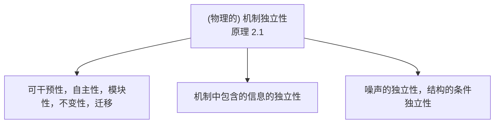
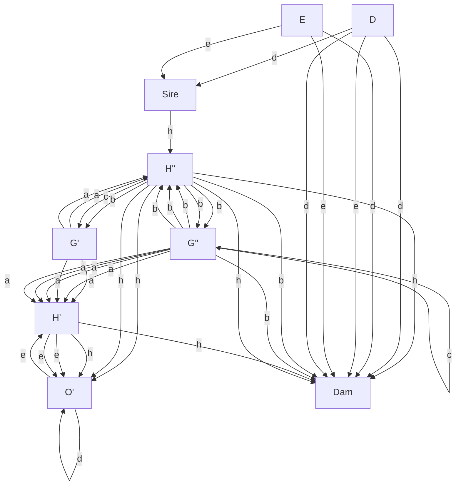

# 因果推断的假设（Assumptions for Causal Inference）

既然我们已经了解了**结构因果模型（Structural Causal Models, SCMs）**的基本组成部分，现在正是一个好时机来回顾我们所见过的某些假设，以及这些假设对于因果推理和学习的目的意味着什么。

我们讨论中的一个关键概念将是一种**独立性**形式，我们可以使用一种称为**布歇椅（Beuchet chair）**的光学错觉来非正式地介绍它。当我们看到像图2.1左侧那样的物体时，我们的大脑会做出一个假设，即该物体与包含在其光线中的信息到达我们大脑的机制是独立的。我们可以通过从一个非常特定的视角观察该物体来违反这个假设。如果我们这样做，感知就会出错：我们感知到一个椅子的三维结构，而实际上它并不存在。然而，在大多数情况下，这种独立性假设是成立的。如果我们观察一个物体，我们的大脑会假设该物体独立于我们的观察点和光照。因此，不应该存在不可能的巧合，没有独立的三维结构在二维上对齐，也没有阴影边界与纹理边界重合。这在视觉中被称为**一般视点假设（generic viewpoint assumption）** [Freeman, 1994]。

然而，这种独立性假设比这更普遍。我们将在下面的第2.1节中看到，因果生成过程由**自主模块（autonomous modules）**组成，这些模块互不告知或影响。正如我们将在下面描述的，这意味着虽然一个模块的输出可能影响另一个模块的输入，但模块本身是相互独立的。

在前面的例子中，虽然整体感知是物体、光照和视点的函数，但物体和光照不会因为我们四处移动而受到影响——换句话说，整体因果生成模型的某些组成部分保持不变，我们可以从这种不变性中推断出三维信息。

纹理地板上的两个相同的金属椅子模型，并排显示（无可见文字或符号）

**图2.1：** 左图显示了构成布歇椅的（分离）部件的一般视图。右图显示了如果从一个单一的、非常特殊的视点观察这些部件时所产生的椅子幻觉感知。从这个偶然的视点，我们感知到一把椅子。（图片由 Markus Elsholz 提供。）

这是**从运动恢复结构（structure from motion）** [Ullman, 1979] 的基本思想，它在生物视觉和计算机视觉中都扮演着核心角色。

## 2.1 独立机制原理（The Principle of Independent Mechanisms）

我们现在描述一个简单的因果效应问题，并指出几个观察结果。随后，我们将尝试提供一个统一的观点，说明这些观察结果如何相互关联，并论证它们源自一个共同的独立性原理。

假设我们已经估计了某个国家城市样本的海拔 $A$ 和年平均气温 $T$ 的联合密度 $p ( \boldsymbol { a } , t )$ （参见第65页图4.6）。考虑以下表示 $p ( { a } , t )$ 的方式：

$$
\begin{array}{l} p (a, t) = p (a | t) p (t) \\ = p (t | a) p (a) \tag {2.1} \\ \end{array}
$$

第一种分解根据图 $T \to A$ 描述了 $T$ 和条件分布 $A | T$。¹ 第二种分解对应于根据 $A \to T$ 的分解（参见定义6.21）。我们能否判断这两种结构中的哪一种是因果结构（即，在哪种情况下我们可以将箭头视为因果的）？

第一个想法（见图2.2左图）是考虑**干预（interventions）**的效果。想象我们可以通过某种假设机制改变一个城市的海拔 $A$，该机制抬升了城市所在的地面。假设我们发现平均气温下降。接下来，让我们想象我们设计了另一个干预实验。这次，我们不改变海拔，而是在城市周围建造一个巨大的供暖系统，将平均气温提高几度。假设我们发现城市的海拔不受影响。对 $A$ 的干预改变了 $T$，但对 $T$ 的干预没有改变 $A$。因此，我们自然会倾向于选择 $A \to T$ 作为因果结构的描述。

为什么我们发现这种对干预效果的解释是合理的，即使这种假设的干预在实践中很难或不可能实施？

如果我们改变海拔 $A$，那么我们认为负责产生平均气温的物理机制 $p ( t | a )$（例如，大气的化学成分、压力随海拔降低的物理学原理、风的气象机制）仍然存在，并导致 $T$ 发生变化。这将独立于我们从中抽样城市的分布，因此独立于 $p ( a )$。奥地利人可能在其城市选址上与瑞士人有细微差别，但机制 $p ( t | a )$ 在两种情况下都适用。²

另一方面，如果我们改变 $T$，那么我们很难认为 $p ( a | t )$ 是一个仍然存在的机制——我们可能首先就不相信存在这样的机制。给定一组不同的城市分布 $p ( \boldsymbol { a } , t )$，虽然我们可以将它们全部写成 $p ( a | t ) p ( t )$，但我们会发现，不可能用一个不变的 $p ( a | t )$ 来解释所有分布。

我们的直觉可以用两种方式重新表述和假设：如果 $A \to T$ 是正确的因果结构，那么

(i) 原则上可以对 $A$ 进行**局部干预（localized intervention）**，换句话说，在不改变 $p ( t | a )$ 的情况下改变 $p ( a )$，并且

(ii) $p ( a )$ 和 $p ( t | a )$ 是自主的、模块化的或不变的机制或世界中的对象。

有趣的是，虽然我们从假设的干预实验出发来推导因果结构，但我们的推理最终表明，实际干预可能不是推导因果结构的唯一途径。我们也可以通过检查数据源 $p ( { a } , t )$ 的两种分解（2.1）中哪一种导致自主或不变的项来识别因果结构。继续前面的例子，让我们将奥地利和瑞士的海拔与气温的联合分布分别记为 $p ^ { \ddot { 0 } } ( \dot { a } , t )$ 和 $p ^ { \mathrm { S } } ( a , t )$。这些分布可能不同，因为奥地利人和瑞士人在不同的地方建立了城市（即 $p ^ { \ddot { 0 } } ( a )$ 和 $p ^ { \mathrm { { S } } } ( a )$ 不同）。然而，因果分解可能仍然使用相同的条件分布，即 $p ^ { \ddot { 0 } } ( a , t ) = p ( t | a ) p ^ { \ddot { 0 } } ( a )$ 和 $p ^ { \mathrm { S } } ( a , t ) = p ( t | a ) p ^ { \mathrm { S } } ( a )$。

接下来，我们描述一个想法（见图2.2中图），它与前面的例子密切相关，但不同之处在于它也适用于单个分布。在因果分解 $p ( a , t ) = p ( t | a ) ~ p ( a )$ 中，我们会期望条件密度 $p ( t | a )$（视为 $t$ 和 $a$ 的函数）不提供关于边际密度函数 $p ( a )$ 的信息。如果 $p ( t | a )$ 是一个物理机制的模型，该机制不关心我们输入什么分布 $p ( a )$，那么这就成立。换句话说，该机制不受我们应用它的城市集合的影响。

另一方面，如果我们写成 $p ( a , t ) = p ( a | t ) p ( t )$，那么前述的**原因与机制的独立性（independence of cause and mechanism）**就不适用了。相反，我们会注意到，为了连接观察到的 $p ( t )$ 和 $p ( { a } , t )$，机制 $p ( a | t )$ 需要采取一种相当奇特的形式，受到方程 $p ( a , t ) = p ( a | t ) p ( t )$ 的约束。给定一组城市和气温，这可以通过经验检验。³

我们已经看到了几个与独立性、自主性和不变性相关的想法，所有这些都可以为因果推断提供信息。我们现在转向最后一个想法（见图2.2右图），它与**噪声项（noise terms）**的独立性有关，因此在将（2.1）重写为具有图 $A \to T$ 的SCM所产生的分布时可以得到最好的解释，该SCM将效应 T 实现为原因 $A$ 的带噪声函数：

$$
A := N _ {A},
$$

$$
T := f _ {T} (A, N _ {T}),
$$

其中 $N _ { T }$ 和 $N _ { A }$ 是统计独立的噪声，即 $N _ { T } \perp\!\!\!\perp N _ { A }$。对函数形式 $f _ { T }$ 施加适当的限制（参见第4.1.3–4.1.6节和第7.1.2节）使我们能够识别两种因果结构 $( A \to T$ 或 $T \to A )$ 中的哪一种产生了观察到的 $p ( { a } , t )$（不过，如果没有这样的限制，我们总是可以实现两种分解（2.1））。此外，在多变量设置下，在适当条件下，联合独立噪声的假设允许通过条件独立性检验来识别因果结构（参见第7.1.1节）。

**图2.2：** 独立机制原理及其对因果推断的影响（原理2.1）。

我们倾向于将所有这些观察结果视为一个（物理上）独立机制的一般原理的紧密相关的实例化。

**原理 2.1 (独立机制，Independent mechanisms)** 系统变量的因果生成过程由**自主模块（autonomous modules）**组成，这些模块互不告知或影响。

在概率情况下，这意味着每个变量给定其原因的条件分布（即其机制）不告知或影响其他条件分布。在我们只有两个变量的情况下，这简化为原因分布与产生效应分布的机制之间的独立性。

如果我们认为我们的系统是由包含（若干组）变量的模块组成的，并且这些模块代表了世界中物理上独立的机制，那么这个原理是合理的。两个变量的特殊情况被称为**原因与机制独立性（Independence of Cause and Mechanism, ICM）** [Daniusis et al., 2010, ˇ Shajarisales et al., 2015]。它是通过将输入视为由一种机制完成的准备工作的结果，而这种机制独立于将输入转化为输出的机制。

在我们深入讨论这个原理之前，应该说明并非所有系统都满足它。例如，如果整个系统所组成的机制通过设计或演化相互调谐，这种独立性可能会被违反。

我们现在将论证，这个原理足够广泛，可以涵盖因果推理和因果学习的主要方面（见图2.2）。让我们讨论三个方面，从左到右对应图2.2中树的三个分支。

1. 将这些模块视为体现输入-输出行为的物理机器是一种思考方式。这个假设意味着我们可以改变一个机制而不影响其他机制——或者，用因果术语来说，我们可以**干预（intervene on）**一个机制而不影响其他机制。改变一个机制会改变其输入-输出行为，从而可能改变下游其他机制接收到的输入，但我们假设物理机制本身不受这种变化的影响。这样的假设通常是隐含的，首先是为了证明干预的可能性，但也可以将其视为因果推理和因果学习的更一般基础。如果一个系统允许这种局部干预，那么就不存在通过“元机制”以有向方式将机制相互连接的物理路径。后者使得我们有理由预期机制在考虑的系统内部发生变化时，甚至可能在某些源自系统外部的变化时（参见第7.1.6节），倾向于保持**不变性（invariance）**。这种机制的**自主性（autonomy）**有望帮助将在某个领域学到的知识迁移到相关领域，其中一些模块与源领域重合（参见第5.2节和第8.3节）。

2. 虽然第一个方面的讨论侧重于独立性的物理方面及其影响，但也存在上述内容所隐含的**信息论（information theoretic）**方面。涉及多个耦合对象和机制的时间演化可以产生统计依赖性。这与我们在第10页的讨论有关，当时我们考虑了手写数字的类别标签与图像之间的依赖性。类似地，物理上耦合的机制将倾向于产生可以用统计或算法信息度量来量化的信息（参见下文第4.1.9节和第6.10节）。

在这里，区分两个层次的信息很重要：显然，效应包含关于其原因的信息，但——根据独立性原理——从原因生成效应的机制不包含关于生成原因的机制的信息。对于具有两个以上节点的因果结构，独立性原理指出，从每个节点的直接原因生成该节点的机制互不包含彼此的信息。⁴

3. 最后，我们应该讨论在结构方程建模中通常做出的**独立噪声项（independent noise terms）**的假设是如何与独立机制原理联系起来的。这种联系不太明显。为此，考虑一个变量 $E := f ( C , N )$，其中噪声 $N$ 是离散的。对于 $N$ 取的每个值 $s$，赋值 $E := f ( C , N )$ 简化为一个确定性机制 $E := f ^ { s } ( C )$，它将输入 $C$ 转化为输出 $E$。实际上，这意味着噪声在若干机制 $f ^ { s }$ 之间随机选择（其中数量等于噪声变量 $N$ 取值范围的基数）。现在假设在顶点 $X _ { j }$ 和 $X _ { k }$ 处的两个机制的噪声变量在统计上是依赖的。⁵ 这种依赖性可以确保，例如，每当一个机制 $f _ { j } ^ { s }$ 在节点 $j$ 处处于活动状态时，我们就知道哪个机制 $f _ { k } ^ { t }$ 在节点 $k$ 处处于活动状态。这将违反我们的独立机制原理。

前一段落采用了将噪声变量视为机制之间选择器的某种极端观点（另见第3.4节）。在实践中，噪声的作用可能不那么显著。例如，如果噪声是加性的 $(\mathrm{i.e.}, E := f ( C ) + N )$，那么它对机制的影响是有限的。在这种情况下，它只能上下移动机制的输出，因此它在一组彼此非常相似的机制之间进行选择。这与将噪声变量视为我们试图描述的系统外部的变量、代表系统永远无法完全与其环境隔离这一事实的观点是一致的。在这种观点下，人们会认为，在不使独立机制原理失效的情况下，噪声的弱依赖可能是可能的。

原理2.1的所有上述方面都可能有助于因果学习的问题，换句话说，它们可能提供关于因果结构的信息。然而，可以想象，这些信息在某些情况下可能是冲突的，这取决于在任何给定情况下哪些假设成立。

**图5.**

### 2.2 历史注记（Historical Notes）

**自主性（autonomy）**和**不变性（invariance）**的思想深深植根于**结构方程模型（Structural Equation Models, SEMs）**或**结构因果模型（Structural Causal Models, SCMs）**的概念中。我们更倾向于使用后一个术语，因为术语 SEM 在许多语境中被用来指代将结构赋值用作代数方程而非赋值的情况。相关文献范围广泛，Aldrich [1989]、Hoover [2008] 和 Pearl [2009] 提供了综述。

SEM 的一个思想先驱是 Wright [1918, 1920, 1921] 开创的**路径模型（path model）**概念（见图 2.3）。尽管 Wright 是一位生物学家，但如今 SEM 与计量经济学的关联最为紧密。根据 Hoover [2008] 的论述，Jan Tinbergen 在 20 世纪 30 年代完成了结构计量经济模型的开创性工作，而 Trygve Haavelmo 的工作 [Haavelmo, 1944] 则奠定了概率计量经济学的概念基础。早期的经济学家试图概念化这样一个事实：与相关性不同，回归具有一个自然的方向。Y 对 X 的回归得到的解通常不是 X 对 Y 的回归的逆。⁶ 但是，数据如何告诉我们应该朝哪个方向进行回归呢？这是一个**观测等价性（observational equivalence）**问题，它与计量经济学家称之为**识别（identification）**的问题密切相关。

一些早期工作发现了使一组方程或关系成为**结构性（structural）**的因素 [Frisch and Waugh, 1933] 与**不变性（invariance）**和**自主性（autonomy）**性质之间的联系——根据 Aldrich [1989] 的说法，这实际上是 Frisch 等人 [1948] 开创性工作的核心概念。在这里，一个结构关系旨在超越仅仅对观测到的数据分布进行建模——它试图捕捉连接模型变量的潜在结构。

当时，**考尔斯委员会（Cowles Commission）**是一个主要的经济研究机构，在创建计量经济学领域方面发挥了重要作用。其工作将因果关系与结构计量经济模型的不变性性质联系起来 [Hoover, 2008]。Pearl [2009] 认为，Marschak 在一本 1950 年考尔斯专著的开篇章节中提出了结构方程对系统中的某些变化保持不变的这一思想 [Marschak, 1950]。考尔斯工作强调的一个关键区别是**内生变量（endogenous variables）**和**外生变量（exogenous variables）**之间的区别。内生变量是建模者试图理解的变量，而外生变量则由模型外部的因素决定，并被视为给定。Koopmans [1950] 尝试了两个原则来确定什么应该被视为外生的。**部门原则（departmental principle）**将学科范围之外的变量视为外生的（例如，天气对经济学来说是外生的）。（更受青睐的）**因果原则（causal principle）**则称那些影响其余（内生）变量但（几乎）不受其影响的变量为外生变量。

Haavelmo [1943] 将结构方程解释为关于假设性受控实验的陈述。他考虑了循环随机方程模型，并讨论了不变性以及政策干预的作用。Pearl [2015] 对 Haavelmo 在政策干预问题研究以及因果推断领域发展中的作用进行了评价。在一篇关于经济学和计量经济学中因果关系的论述中，Hoover [2008] 讨论了一个如下形式的系统：

$$
X ^ {i} := N _ {X} ^ {i}
$$

$$
Y ^ {i} := \theta X ^ {i} + N _ {Y} ^ {i},
$$

其中误差项 $N _ { X } ^ { i } , N _ { Y } ^ { i }$ 是独立同分布的，并且 $\theta$ 是一个参数。他将以下观点归功于 Simon [1953]（该观点不要求任何时间顺序）：$X ^ { i }$ 可以被认为是导致 $Y ^ { i }$ 的原因，因为人们可以在不了解 $Y ^ { i }$ 的情况下了解 $X ^ { i }$ 的一切，但反之则不然。这些方程也允许我们预测干预的效果。Hoover 进而论证，我们可以重写该系统，交换 $X ^ { i }$ 和 $Y ^ { i }$ 的角色，同时保留误差项不相关的性质。⁷ 因此，他指出，我们无法基于单一数据集推断出正确的因果方向（“观测等价性”）。实验，无论是受控的还是自然的，可以帮助我们做出决定。例如，如果一个实验可以在不改变 $X ^ { i }$ 边际分布的情况下改变给定 $X ^ { i }$ 时 $Y ^ { i }$ 的条件分布，那么必定是 $X ^ { i }$ 导致了 $Y ^ { i }$ 。Hoover 将此称为**西蒙不变性准则（Simon's invariance criterion）**：真正的因果顺序是在正确类型的干预下保持不变的那个。⁸ Hurwicz [1962] 认为，一个方程系统通过其对某个修改领域的**不变性（invariance）**而成为结构性的。这样的系统因此类似于一条自然法则。Hurwicz 认识到，人们可以利用这种修改来确定结构，并且虽然结构对于因果关系是必要的，但对于预测则不是。

Aldrich [1989] 描述了自主性在结构方程建模中的作用。他认为**自主关系（autonomous relations）**可能比其他关系更稳定。他将 Haavelmo 的**自主变量（autonomous variables）**等同于后来被称为外生变量的东西。自主变量是由外部力量固定的参数，或者被视为随机独立的参数。⁹ 根据 Aldrich [1989, 第 30 页] 的说法，“使用限定词‘自主的’和短语‘所考虑部门外部的力量’表明……该模型的参数对于部门参数的变化是不变的。”他还将不变性与一个称为**超外生性（super-exogeneity）**的概念联系起来 [Engle et al., 1983]。

尽管结构方程建模的早期支持者已经对其因果基础有了一些深刻的见解，但计算机科学的发展最初是独立进行的。Pearl [2009, p. 104] 讲述了他和他的同事是如何开始将贝叶斯网络和结构方程建模联系起来的：“我突然意识到，经济学家和统计学家之间长达一个世纪的紧张关系源于简单的语义混淆：统计学家将结构方程解读为关于 $\mathbb { E } [ Y | x ]$ 的陈述，而经济学家则将其解读为关于 $\mathbb { E } [ Y | d o \left( x \right) ]$ 的陈述。这将解释为什么统计学家声称结构方程没有意义，而经济学家反驳说统计学没有实质内容。”Pearl [2009, p. 22] 将独立性原则表述如下：“网络中每个父-子关系代表一个稳定且自主的物理机制——换句话说，可以设想改变其中一个关系而不改变其他关系。”值得注意的是，并且这也确实是撰写本书的一个动机，在图 2.2 所示的原则 2.1 的不同含义中，大多数使用因果贝叶斯网络的工作仅利用了噪声项的独立性。¹⁰ 它导致了丰富的条件独立结构 [Pearl, 2009, Spirtes et al., 2000, Dawid, 1979, Spohn, 1980]，最终源于赖兴巴赫原则 1.1。独立性的其他方面受到的关注要少得多 [Hausman and Woodward, 1999, Lemeire and Dirkx, 2006]，但最近有一系列工作旨在形式化并利用它们。其主要动机之一是因果-效应问题，其中条件独立性是无用的，因为我们只有两个变量（见第 4.1.2 节和第 6.10 节）。Janzing 和 Schölkopf [2010] 用算法信息论（第 4.1.9 节）形式化了机制的独立性。他们将 SCM 中的函数视为代表独立的因果机制，这些机制在操纵输入分布或其他机制后仍然存在。更具体地说，在因果贝叶斯网络的背景下，他们假设所有节点给定其父节点的条件分布在算法上是独立的。特别地，对于因果贝叶斯网络 $X \rightarrow Y$，$P _ { X }$ 和 $P _ { Y | X }$ 不包含关于彼此的算法信息——这意味着对其中一个的了解并不能导致对另一个的更短描述。不相关机制在算法上独立的思想源于将 SCM 从随机变量推广到个体对象，其中统计依赖性被算法依赖性所取代。

Schölkopf 等人 [2012, e.g., Section 2.1.1.] 讨论了关于原因分布变化（在两变量设定中）的**鲁棒性（robustness）**问题，并将其与机器学习问题联系起来；另见第 5 章。在 SCM 内部，他们针对不同的学习场景（例如，迁移学习、概念漂移）分析了函数或噪声的不变性。他们采用了一种机制和输入独立性的概念，该概念涵盖了变化下的独立性和信息论独立性（我们在讨论框时称之为图 2.2 中第一个和第二个独立性之间的“重叠”）：“${ } ^ { \mathrm { 6 6 } } P _ { E | C }$ 不包含关于 $P _ { C }$ 的信息，反之亦然；特别是，如果 $P _ { E | C }$ 在某个时间点发生变化，则没有理由相信 $P _ { C }$ 会同时发生变化。”与迁移和相关的机器学习问题的进一步联系由 Bareinboim 和 Pearl [2016], Rojas-Carulla 等人 [2016], Zhang 等人 [2013] 和 Zhang 等人 [2015] 讨论。Peters 等人 [2016] 利用跨环境的**不变性（invariance）**来学习多元 SCM 的图结构部分（第 7.1.6 节）。

### 2.3 因果模型背后的物理结构（Physical Structure Underlying Causal Models）

我们以一些关于与物理学联系的注记来结束本章。兴趣仅限于数学和统计结构的读者可以跳过这部分。

#### 2.3.1 时间的作用（The Role of Time）

在第 2.1 节中明显缺失的一个方面是时间的作用。确实，物理学通过排除从未来到过去的因果关系，将因果性纳入其基本定律之中。¹¹ 然而，这并没有解决所有因果推断的问题。Simon [1953] 早已认识到，虽然时间排序可以提供有用的不对称性，但重要的是不对称性本身，而不是时间顺序。

在微观层面上，经典系统和量子系统的时间演化被广泛认为是可逆的。这似乎与我们关于世界以定向方式演化的直觉相矛盾——我们相信如果时间倒流，我们能够分辨出来。这种矛盾可以通过两种方式解决。其中一种，假设我们有一个状态的**复杂度度量（complexity measure）** [Bennett, 1982, Zurek, 1989]，并且我们从一个复杂度非常低的状态开始。在这种情况下，时间演化（假设其足够各态历经）将倾向于增加复杂度。另一种方式，我们假设我们正在考虑**开放系统（open systems）**。即使封闭系统的时间演化是可逆的（例如，在量子力学中，一个酉时间演化），一个开放子系统（与其环境相互作用）在一般情况下时间演化不一定是可逆的。

#### 2.3.2 物理定律（Physical Laws）

一个经常讨论的因果问题可以通过以下例子来说明。理想气体定律规定，压强 $p$、体积 $V$、物质的量 $n$ 和绝对温度 $T$ 满足方程

$$
p \cdot V = n \cdot R \cdot T, \tag {2.2}
$$

其中 $R$ 是理想气体常数。例如，如果我们改变分配给一定量气体的体积 $V$，那么压强 $p$ 和/或温度 $T$ 将会改变，具体情况取决于干预的确切设置。另一方面，如果我们改变 $T$，那么 $V$ 和/或 $p$ 将会改变。如果我们保持 $p$ 恒定，那么我们可以（至少近似地）构建一个涉及 $T$ 和 $V$ 的循环。那么是什么导致了什么呢？有时有人认为，这样的定律表明，除非系统是时间性的，否则谈论因果关系是没有意义的。在下一段中，我们认为这是一种误导。气体定律 (2.2) 指的是一个潜在动力系统的平衡状态，将其写成一个简单的方程并不能提供足够的信息，说明原则上可能进行哪些干预以及它们的效应是什么。SCM 及其相应的有向无环图确实为我们提供了这些信息，但在非平衡系统的一般情况下，一个给定的动力系统是否以及如何导致一个 SCM 是一个难题。

#### 2.3.3 循环赋值（Cyclic Assignments）

我们认为 SCM 是对发生在时间中的潜在过程的抽象。对于这些潜在过程，反馈回路没有问题，因为在足够快的时间尺度上，假设没有瞬时相互作用（这可以被光速的有限性所排除），这些回路将在时间上展开。

尽管依赖于时间的过程没有循环，但从这些过程导出的 SCM（例如，通过下面注记 6.5 和 6.7 中提到的方法），只涉及不再依赖于时间的量，却可能有循环。在这样的系统中定义一般干预变得稍微困难一些，但某些类型的干预应该仍然是可行的。例如，将一个变量的值设置为一个固定值的**硬干预（hard intervention）**可能是可行的（并且可以通过潜在微分方程组中的强迫项在物理上实现；见注记 6.7）。这切断了循环，然后我们可以推导出蕴含的干预分布。

然而，从一组循环的结构赋值中推导出蕴含的观测分布可能是不可能的。让我们考虑两个赋值

$$
X := f _ {X} (Y, N _ {X})
$$

$$
Y := f _ {Y} (X, N _ {Y})
$$

和噪声变量 $N_X \perp \perp N_Y$。就像在非循环模型的情况下一样，我们将噪声和函数视为给定的，并寻求计算 $X$ 和 $Y$ 的蕴含联合分布。为此，让我们从第一个赋值 $X := f_X(Y, N_X)$ 开始，并将某个初始的 $Y$ 代入其中。这产生了一个 $X$，然后我们可以将其代入另一个赋值。假设我们迭代这两个赋值并收敛到某个不动点。这个点将对应于一个同时满足两个结构赋值为随机变量等式的 $X,Y$ 的联合分布。¹² 注意，我们在这里假设每一步都使用相同的 $N_X, N_Y$，而不是它们的独立副本。

然而，这样的 $X,Y$ 均衡不一定总是存在，即使存在，也不一定可以通过迭代找到。在线性情况下，Lacerda 等人 [2008] 和 Hyttinen 等人 [2012] 对此进行了分析；另见 Lauritzen 和 Richardson [2002]。更多细节见注记 6.5。

这种不一定总能得到满足两个循环结构赋值的蕴含分布的观察，与将 SCM 视为潜在物理过程的抽象——其作为因果模型的有效性领域是有限的——的观点是一致的。如果我们想理解一般的循环系统，研究微分方程组而不是 SCM 可能是不可避免的。另一方面，对于某些受限设置，停留在 SCM 的现象学更浅的层面上仍然是有意义的；例如，见 Mooij 等人 [2013]。人们可以推测，SCM（或 SEM）固有的这种困难是计量经济学界最初将 SEM 视为因果模型，但后来部分学界决定放弃这种解释，转而将结构方程视为纯代数方程的部分原因。

#### 2.3.4 干预的可行性（Feasibility of Interventions）

我们使用**独立机制原则（principle of independent mechanisms）**来激励一次只影响一个机制（或结构赋值）的干预。虽然真实系统可能允许这种类型的干预，但也存在同时替换多个赋值的干预。前一种类型的干预在直观的物理意义上可能被认为是更基本的。如果多个基本干预被组合起来，那么原则上这可能以一种它们相互调谐的方式发生，我们会认为这违反了我们的独立性原则 2.1 的一种形式；见第 24 页脚注 8。人们可能希望“自然的”组合干预不会违反独立性。然而，判断一个干预在这个意义上是否“自然”需要了解因果结构，而当我们试图首先使用这些原则进行因果学习时，我们并不具备这种了解。最终，人们可以尝试诉诸物理学来评估什么是基本的或自然的。

对物理系统的哪些操作是基本的问题在现代量子信息论中起着至关重要的作用。在那里，这个问题与物理相互作用结构的分析密切相关。¹³ 同样，我们相信理解因果关系背后的物理机制有时可以解释为什么一些干预是自然的而其他的是复杂的，这实质上定义了由不同结构方程给出的“模块”。

#### 2.3.5 原因与机制的独立性及热力学时间箭头（Independence of Cause and Mechanism and the Thermodynamic Arrow of Time）

我们提供一个讨论以及一个玩具模型，说明独立机制原则如何被视为一个物理学原理。为此，我们考虑两变量的特殊情况，并将以下内容作为原则 2.1 的一个特例提出：

图 2.4：初始状态与动力学定律独立性的简单示例：粒子束被一个物体散射。出射粒子包含关于物体的信息，而入射粒子则不包含。

**原则 2.2（初始状态与动力学定律）** 如果 $s$ 是一个物理系统的初始状态，而 $M$ 是描述在某个固定时间内应用系统动力学效应的映射，那么 $s$ 和 $M$ 是独立的。这里，我们假设初始状态，根据定义，是一个先前未曾与动力学相互作用过的状态。

这里，“初始”状态 $s$ 和“最终”状态 $M(s)$ 被视为“原因”和“效应”。相应地，$M$ 是连接原因和效应的机制。原则 2.2 的最后一句需要一些解释以避免错误的结论。我们现在针对一个直观的例子讨论其含义。

图 2.4 展示了一个场景，其中初始状态与动力学的独立性是如此自然，以至于我们认为理所当然：一束 $n$ 个粒子以完全相同方向传播，接近某个物体，在那里它们向各个方向散射。出射粒子的方向包含关于物体的信息，而入射粒子束则不包含关于它的信息。粒子最初完全以相同方向传播的假设当然可以放宽。即使入射光束中存在一些无序，出射光束仍然可以包含关于物体的信息。事实上，视觉和摄影之所以可能，正是因为光子包含了它们被散射的物体的信息。

我们可以通过“手工设计”一束入射光束来轻松地时间反转这个场景，使得所有粒子在散射过程后都朝同一方向传播。我们现在论证在这种情况下如何理解原则 2.2。当然，这样的光束只能由一台了解物体形状的机器或主体制备，然后相应地引导粒子。事实上，从未与物体接触过的粒子，先验地不能包含关于它的信息。那么，如果我们将引导粒子的过程视为机制的一部分，并拒绝将手工设计光束的状态称为初始状态，原则 2.2 就可以得以维持。相反，初始状态此时指的是粒子被赋予精细调谐动量之前的时间点。

摄影图像显示的是过去发生了什么，而不是未来将发生什么，这是过去与未来之间最明显的不对称性之一。前面的讨论表明，这种不对称性可以被视为原则 2.2 的一个推论。因此，该原则将原因与效应之间的不对称性与我们认为理所当然的过去与未来之间的不对称性联系起来。

在非正式层面解释了原则 2.1 与物理学中过去和未来之间不对称性的关系之后，我们简要提及 Janzing 等人 [2016] 使用算法信息论更形式化地建立了这种联系。正如原则 4.13 将 $P_C$ 和 $P_{E|C}$ 的独立性形式化为算法独立性一样，原则 2.2 也可以被解释为 $s$ 和 $M$ 的算法独立性。Janzing 等人 [2016, Theorem 1] 表明，对于任何双射的 $M$，原则 2.2 意味着 $M(s)$ 的物理熵不能小于 $s$ 的熵（相差一个可加常数），前提是人们愿意接受由 Bennett [1982] 和 Zurek [1989] 提出的**柯尔莫哥洛夫复杂度（Kolmogorov complexity）**（见第 4.1.9 节）作为物理熵的正确形式化。因此，原则 2.2 意味着在物理学中标准时间箭头的意义上熵不减少。