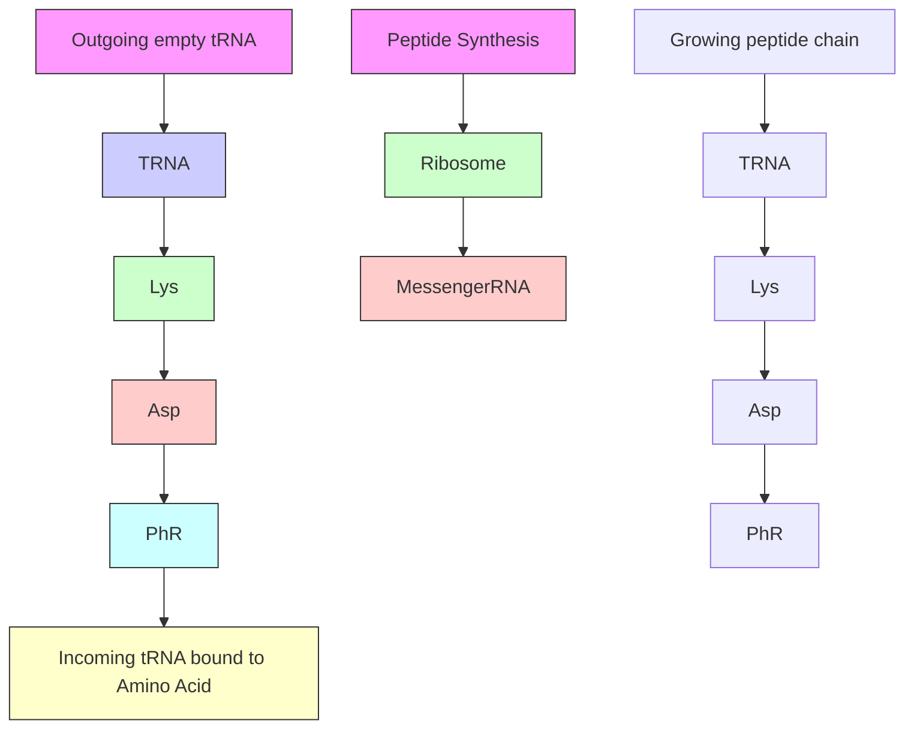
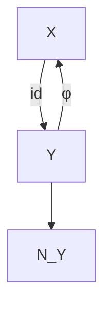
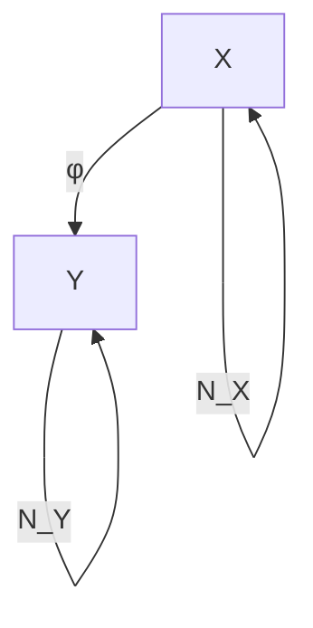

# 与机器学习的联系，I（Connections to Machine Learning, I）

如第1章所述，标准机器学习与统计学基于相同的基础：我们使用从某个未知的潜在分布中独立同分布采样的数据，并试图推断该分布的性质。相比之下，因果推断假设了更强的底层结构，包括有向依赖关系。这使得从数据中学习结构变得更加困难，但一旦完成，也允许做出新的陈述，包括关于分布偏移和干预效应的陈述。如果我们将机器学习视为推断超越纯统计关联的规律性（或“自然法则”）的过程，那么因果关系就扮演了关键角色。本章提出了一些关于此的思考，重点关注仅有两个变量的情况。第8章将重新审视这一主题，并考察多变量情况。

## 5.1 半监督学习（Semi-Supervised Learning）

让我们考虑一个回归任务，其中我们的目标是从一个 $d$ 维的预测变量 $\mathbf{X}$ 预测目标变量 $Y$ 。对于许多损失函数而言，知道条件分布 $P _ { Y | \mathbf { X } }$ 就足以解决问题。例如，**回归函数**

$$
f ^ {0} (\mathbf {x}) := \mathbb {E} [ Y | \mathbf {X} = \mathbf {x} ]
$$

最小化 $L _ { 2 }$ 损失，

$$
f ^ {0} \in \underset {f: \mathbb {R} ^ {d} \to \mathbb {R}} {\operatorname{argmin}}   \mathbb {E} \left[ (Y - f (\mathbf {X})) ^ {2} \right].
$$

在**监督学习（supervised learning）**中，我们从联合分布中接收 $n$ 个独立同分布的数据点： $( \mathbf { X } _ { 1 } , Y _ { 1 } ) , \ldots , ( \mathbf { X } _ { n } , Y _ { n } ) \overset { \mathrm { i i d } } { \sim } P _ { \mathbf { X } , Y }$ 。因此，回归估计（使用 $L _ { 2 }$ 损失）相当于从联合分布的 $n$ 个数据点估计条件均值。然而，在（归纳式）**半监督学习（semi-supervised learning, SSL）**中，我们额外接收 $m$ 个 $\mathbf { X } _ { n + 1 } , . . . , \mathbf { X } _ { n + m } \overset { \mathrm { i i d } } { \sim } P _ { \mathbf { X } }$ 点，这些点提供了关于 $P _ { \mathbf { X } }$ 的信息，而 $P _ { \mathbf { X } }$ 本身又告诉我们一些关于 $\mathbb { E } [ Y | \mathbf { X } ]$ 或更一般地关于 $P _ { Y | \mathbf { X } }$ 的信息。¹ SSL 技术的许多假设 [参见 Chapelle 等人，2006，以获取概述] 都涉及 $P _ { \mathbf { X } }$ 和 $P _ { Y | \mathbf { X } }$ 之间的关系。例如，**簇假设（cluster assumption）**规定，位于 $P _ { \mathbf { X } }$ 同一簇中的点具有相同或相似的 $Y$ ；这与**低密度分离假设（low-density separation assumption）**类似，后者指出分类器的决策边界（即 $x$ 点，其中 $P ( Y = 1 | \mathbf { X } = \mathbf { x } )$ 穿过 0.5）应位于 $P _ { \mathbf { X } }$ 较小的区域。**半监督平滑性假设（semisupervised smoothness assumption）**指出，条件均值 $\mathbf { x } \mapsto \mathbb { E } [ Y | \mathbf { X } = \mathbf { x } ]$ 应在 $P _ { \mathbf { X } }$ 较大的区域保持平滑。

### 5.1.1 SSL 与因果方向（SSL and Causal Direction）

在最简单的情况下，因果图只有两个变量（原因和效应），机器学习问题要么是**因果的（causal）**（如果我们从原因预测效应），要么是**反因果的（anticausal）**（如果我们从效应预测原因）。从业者通常不关心给定学习问题背后的因果结构（见图 5.1）。然而，正如我们在此论证的，这种结构对机器学习有影响。

在第 2.1 节中，我们假设因果条件分布彼此独立（原则 2.1 及随后的讨论）。Scholkopf 等人 [2012] 意识到这一原则对 SSL 有直接影响。由于 SSL 依赖于 $P _ { \mathbf { X } }$ 和 $P _ { Y | \mathbf { X } }$ 之间的关系，而该原则声称 $P _ { \mathrm { c a u s e } }$ 和 $P _ { \mathrm { e f f e c t | c a u s e } }$ 不包含关于彼此的信息，我们可以得出结论：如果 $\mathbf{X}$ 对应于原因而 $Y$ 对应于效应（即对于一个因果学习问题），SSL 将不起作用。在这种情况下，额外的 $x$ 值只会告诉我们更多关于 $P _ { \mathbf { X } }$ 的信息——这无关紧要，因为预测需要关于独立对象 $P _ { Y | \mathbf { X } }$ 的信息。另一方面，如果 $\mathbf{X}$ 是效应而 $Y$ 是原因，关于 $P _ { \mathbf { X } }$ 的信息可能会告诉我们一些关于 $P _ { Y | \mathbf { X } }$ 的信息。

一项分析 SSL 结果的元研究支持我们的假设。所有 SSL 有帮助的情况都是反因果的、或混杂的、或因果结构不明确的例子（见图 5.2）。

图 5.1：顶部：一个称为核糖体的复杂机制 $\phi$ 将 mRNA 信息 X 翻译成蛋白质链 $Y$ 。² 从 mRNA 预测蛋白质是一个因果学习问题的例子，其中预测方向（绿色箭头）与因果方向（红色箭头）一致。底部：在手写数字识别中，我们试图从由书写者产生的图像 X 推断类别标签 Y（即书写者的意图）。这是一个反因果问题。

在双射确定性因果关系的玩具场景中（见第 4.1.7 节），Janzing 和 Scholkopf [2015] 证明，只要 $P _ { \mathrm { c a u s e } }$ 和 $P _ { \mathrm { e f f e c t | c a u s e } }$ 在 (4.10) 的意义上独立，那么 SSL 确实在反因果方向上优于监督学习，但在因果方向上则不然。其思想是 SSL 利用依赖关系 (4.11) 来实现改进的插值算法。

Sgouritsa 等人 [2015] 开发了一种因果学习方法，利用了 SSL 只能在反因果方向上工作这一事实。

最后，请注意 SSL 包含一些无监督学习（unsupervised learning）的版本作为特例（没有标记数据）。例如，在聚类中，$Y$ 通常是一个指示聚类索引的离散值。类似于前面的推理，我们可以论证，如果 $X$ 是原因而 $Y$ 是效应，聚类应该效果不佳。然而，在真实数据的许多聚类应用中，聚类索引更像是特征的原因而非效应。

虽然图 5.2 中的实证结果很有希望，但关于 SSL 在因果方向上不起作用（始终假设原因和机制独立，参见原则 2.1）的陈述需要更加精确。这将在下一节中完成；这可能对 SSL 和协变量偏移感兴趣的读者有用，但其他读者可以在初读时跳过。

### 5.1.2 关于因果方向上 SSL 的评述（A Remark on SSL in the Causal Direction）

我们对 SSL 预测的一个更精确的形式如下：如果任务是为特定的 $x$ 预测 $y$ ，那么当 $X  Y$ 是因果方向时，关于 $P _ { X }$ 的知识没有帮助。然而，即使 $P _ { X }$ 没有告诉我们关于 $P _ { Y | X }$ 的任何信息（由于 $X  Y$ ），知道 $P _ { X }$ 仍然可以帮助我们更好地估计 $Y$ ，其意义在于我们在学习场景中获得更低的**风险（risk）**。

为了理解这一点，考虑一个玩具示例，其中 $X$ 和 $Y$ 之间的关系由一个确定性函数给出，即 $Y = f ( X )$ ，其中 $f$ 已知来自某个函数类 $\mathcal { F }$ 。令 $X$ 取值于 $\{ 1 , \ldots , m \}$ ，其中 $m \geq 3$ ，并令 $Y$ 是一个取值于 $\{ 0 , 1 \}$ 的二元标签。我们定义函数类 $\mathcal { F } : = \{ f _ { 1 } , \ldots , f _ { m } \}$ ，通过 $f _ { j } ( j ) = 1$ 和 $f _ { j } ( k ) = 0$ 对于 $k \neq j$ 。换句话说，$\mathcal { F }$ 由恰好在一个点上取值为一的函数集合组成。图 5.3 顶部显示了 $m = 4$ 时的函数 $f _ { 3 }$ 。假设我们的学习算法推断出 $f _ { j }$ ，而真实函数是 $f _ { i }$ ，对于 $i \neq j$ 。风险，即期望的误差数（见方程 (1.2)），等于

$$
R _ {i} (f _ {j}) := \sum_ {x = 1} ^ {m} | f _ {j} (x) - f _ {i} (x) | p (x) = p (j) + p (i), \tag {5.1}
$$

其中 $p$ 表示 $X$ 的概率质量函数。我们现在对集合 $\mathcal { F }$ 上的 $R _ { i } ( f _ { j } )$ 取平均，并假设每个 $f _ { i }$ 是等可能的。这产生了期望风险（其中期望是关于 $\mathcal {F}$ 上的均匀先验取的）

$$
\begin{array}{l} \mathbb {E} [ R _ {i} (f _ {j}) ] = \frac {1}{m} \sum_ {i = 1} ^ {m} \sum_ {x = 1} ^ {m} | f _ {j} (x) - f _ {i} (x) | p (x) (5.2) \\ = \frac {1}{m} \sum_ {i \neq j} (p (j) + p (i)) = \frac {m - 2}{m} p (j) + \frac {1}{m}. (5.3) \\ \end{array}
$$

为了最小化 (5.3)，我们应该选择 $f _ { k }$ ，使得 $k$ 最小化函数 $p$ 。这是有道理的，因为对于任何点 $x = 1 , \ldots , m$ ，标签 $y = 0$ 比 $y = 1$ 更可能（概率 $( m - 1 ) / m$ 对比 $1 / m$）。因此，我们实际上希望到处推断为零，但由于零函数不包含在 $\mathcal { F }$ 中，我们被迫选择一个 $x$ 值，并为其分配标签 1。因此，我们选择最不可能的 $x$ 值之一以获得最小的期望损失（对于图 5.3 底部的分布，这是 $x = 3$）。显然，未标记的观测有助于识别最不可能的 $x$ 值，因此 SSL 可以有所帮助。这个例子不需要任何 $( x , y )$ 对（标记实例）；未标记的数据 $x$ 就足够了。因此，它实际上是一个无监督学习的例子，而不是典型的 SSL 场景。然而，额外考虑少量标记实例并不会改变基本思想。通常，如果 $m$ 足够大，这些少量实例将不会包含任何 $y = 1$ 的实例。因此，观察到的 $( x , y )$ 对之所以有帮助，仅仅是因为它们将 $\mathcal { F }$ 略微缩小到一个更小的类 ${ \mathcal { F } } ^ { \prime }$ ，对此分析基本保持不变，并且我们仍然得出结论，未标记的实例有帮助。

尽管我们没有指定一个监督学习场景作为基线（即，不利用 $P _ { X }$ 知识的场景），但我们知道它一定比最佳的半监督场景更差，因为最优估计依赖于 $P _ { X }$ ，正如我们刚刚论证的。

在这里，机制的独立性没有被违反（因此，$X$ 可以被视为 $Y$ 的原因）：$f$ 被假设为从 $\mathcal { F }$ 中均匀选择，并且知道 $P _ { X }$ 并没有告诉我们关于 $f$ 的任何信息。知道 $P _ { X }$ 只对最小化损失有帮助，因为 $p ( x )$ 在 (5.2) 中作为加权因子出现。

前面的例子在精神上接近于贝叶斯分析，因为它涉及对 $\mathcal { F }$ 中函数的平均。然而，它可以被修改以适用于最坏情况分析，其中真实函数 $f$ 由对手选择以最大化 (5.1) [另见 Ka¨ari ¨ ainen, 2005]。给定一个函数 $f _ { j }$ ，对手选择 $f _ { i }$ ，其中 $i$ 是一个不同于 $j$ 且具有最大概率质量的 $x$ 值。因此，最坏情况风险为 max $x \neq j  \{ p ( x ) \} + p ( j )$ ，同样，当选择 $j$ 为最小化概率质量函数 $p ( x )$ 的 $x$ 值时，该风险被最小化。因此，我们得出结论，只有当考虑 $P _ { X }$ 时才能达到最优性能。

另一个例子可以基于 Urner 等人 [2011，定理 4 的证明] 在非因果关系背景下给出的论证来构建。他们构建了一个**模型错误设定（model misspecification）**的案例；其中真实函数 $f _ { 0 }$ 不包含在被优化的类 $\mathcal { F }$ 中。在他们的例子中，关于边际分布 $P _ { X }$ 的额外信息有助于降低风险，即使条件分布 $P _ { Y | X }$ 可以被视为独立于边际分布。我们上面的例子并非基于同一种模型错误设定。每个可能的（未知的）真实情况 $f _ { i }$ 确实包含在函数类中；然而，我们希望最小化先验上的期望风险，并且我们的函数类不包含具有零期望风险的函数。因此，对于期望风险，这类似于模型错误设定的情况。

最后，我们尝试对 Urner 等人 [2011] 的例子给出一些进一步的直觉。由于 $f _ { 0 }$ 不包含在函数类 ${ \mathcal { F } } _ { : }$ 中，我们需要找到一个函数 $\hat { f } \in \mathcal { F }$ ，它最小化距离 $d ( f , f _ { 0 } )$ ，该距离定义为 $f$ 的风险，在 $f \in { \mathcal { F } } ;$ 上取最小值；我们说 $f _ { 0 }$ 被投影到 ${ \mathcal F }$ 上。粗略地说，关于 $P _ { X }$ 的额外信息使我们更好地理解这个投影。³

## 5.2 协变量偏移（Covariate Shift）

如第 2.1 节所述，$P _ { \mathrm { c a u s e } }$ 和 $P _ { \mathrm { e f f e c t | c a u s e } }$ 之间的独立性（原则 2.1）可以用两种不同的方式解释：在上面的第 5.1 节中，我们论证了给定一个固定的联合分布，这两个对象不包含关于彼此的信息（见图 2.2 中的中间框）。或者，假设联合分布 $P _ { \mathrm { c a u s e , e f f e c t } }$ 在不同的数据集之间发生变化；那么 $P _ { \mathrm { c a u s e } }$ 的变化并不能告诉我们关于 $P _ { \mathrm { e f f e c t | c a u s e } }$ 变化的任何信息（这对应于图 2.2 中的左侧框）。因此，知道 $X$ 是原因而 $Y$ 是效应，对于从 $X$ 预测 $Y$ 的预测场景具有重要影响。假设我们使用来自一个数据集的例子学习了 $X$ 和 $Y$ 之间的统计关系，并且我们应该利用这些知识从 $X$ 预测第二个数据集的 $Y$ 。进一步，假设我们观察到第二个数据集中的 $x$ 值遵循分布 $P _ { X } ^ { \prime }$ ，该分布不同于第一个数据集的分布 $P _ { X }$ 。我们将如何利用这个信息？根据机制的独立性，$P _ { X } ^ { \prime }$ 不同于 $P _ { X }$ 这一事实并不能告诉我们 $P _ { Y | X }$ 是否也在数据集之间发生了变化。因此，可能存在这样的情况：条件分布 $P _ { Y | X }$ 对于第二个数据集仍然成立。其次，即使条件分布确实变为 $P _ { Y | X } ^ { \prime } \neq P _ { Y | X }$ ，仍然使用 $P _ { Y | X }$ 进行预测也是很自然的。毕竟，独立性原则指出，边际分布从 $P _ { X }$ 到 $P _ { X } ^ { \prime }$ 的新变化并不能告诉我们条件分布是如何变化的。因此，在没有任何更好候选的情况下，我们使用 $P _ { Y | X }$ 。尽管 $P _ { X }$ 发生了变化，但仍使用相同的条件分布 $P _ { Y | X }$ ，这通常被称为**协变量偏移（covariate shift）**。同时，这是机器学习中一个被充分研究的假设 [Sugiyama and Kawanabe, 2012]。Scholkopf 等人 [2012] 提出了论证，认为这个假设只有在因果场景中才是合理的，换句话说，如果 $X$ 是原因而 $Y$ 是效应。为了进一步说明这一点，考虑以下反因果场景的玩具示例，其中 $X$ 是效应。令 $Y$ 是一个二元变量，以加法方式影响实值变量 $X$ ：

$$
X = Y + N _ {X}, \tag {5.4}
$$

其中我们假设 $N _ { X }$ 是高斯噪声，独立于 $Y$ 。图 5.4 左侧显示了相应的概率密度 $p _ { X }$ 。

如果其宽度足够小，分布 $P _ { X }$ 是双峰的。即使对生成模型一无所知，$P _ { X }$ 也可以被识别为两个具有相同宽度的高斯分布的混合。在这种情况下，人们可以仅从 $P _ { X }$ 猜测联合分布 $P _ { X , Y }$ ，因为很自然地假设 $Y$ 的影响仅在于移动 $X$ 的均值。在此假设下，我们不需要任何 $( x , y )$ 对来学习 $X$ 和 $Y$ 之间的关系。现在假设在第二个数据集中，我们观察到相同的两个高斯分布的混合，但具有不同的权重（见图 5.4 右侧）。那么，最自然的结论是权重发生了变化，因为相同的方程 (5.4) 仍然成立，但只有 $P _ { Y }$ 发生了变化。因此，我们将不再使用相同的 $P _ { Y | X }$ 进行预测，而是从 $P _ { X } ^ { \prime }$ 重建 $P _ { Y | X } ^ { \prime }$ 。这个例子说明，在反因果场景中，$P _ { X }$ 和 $P _ { Y | X }$ 的变化可能是相关的，并且这种关系可能是由于 $P _ { Y }$ 发生了变化而 $P _ { X | Y }$ 保持不变。换句话说，$P _ { \mathrm { e f f e c t } }$ 和 $P _ { \mathrm { c a u s e | e f f e c t } }$ 经常以依赖的方式变化，因为 $P _ { \mathrm { c a u s e } }$ 和 $P _ { \mathrm { e f f e c t | c a u s e } }$ 是独立变化的。

图 5.5：$X$ 导致 $Y$ 的例子，结果，$P _ { Y }$ 和 $P _ { X | Y }$ 包含关于彼此的信息。左侧：$P _ { X }$ 是在位置 $s _ { 1 } , s _ { 2 } , s _ { 3 }$ 处的尖锐峰值的混合。右侧：$P _ { Y }$ 是通过用均值为零的高斯噪声对 $P _ { X }$ 进行卷积得到的，因此由相同位置 $s _ { 1 } , s _ { 2 } , s _ { 3 }$ 处不那么尖锐的峰值组成。那么 $P _ { X | Y }$ 也包含关于 $s _ { 1 } , s _ { 2 } , s _ { 3 }$ 的信息（见问题 5.1）。

前面的例子引出了一个特定的场景。构想利用 $P _ { \mathrm { e f f e c t } }$ 和 $P _ { \mathrm { c a u s e | e f f e c t } }$ 以依赖方式变化这一事实的通用方法是一个难题。这可能是一个有趣的研究方向，我们相信因果关系可能在领域自适应（domain adaptation）和迁移问题（transfer problems）中发挥重要作用；另见 Bareinboim 和 Pearl [2016]，Rojas-Carulla 等人 [2016]，Zhang 等人 [2013]，以及 Zhang 等人 [2015]。

## 5.3 问题（Problems）

**问题 5.1（机制的独立性）** 令 $P _ { X }$ 是如图 5.5 左侧所示的在位置 $s _ { 1 } , \ldots , s _ { k }$ 处的 $k$ 个尖锐高斯峰的混合。令 $Y$ 是通过向 $X$ 添加一些均值为零、宽度为 $\sigma _ { N }$ 的高斯噪声 $N$ 得到的，使得各个峰仍然可见，如图 5.5 右侧所示。

a) 直观地论证为什么 $P _ { X | Y }$ 也包含关于峰的位置 $s _ { 1 } , \ldots , s _ { k }$ 的信息，因此 $P _ { X | Y }$ 和 $P_Y$ 共享此信息。  
b) $P_X$ 和 $P_Y$ 之间的转换可以通过卷积（从 $P _ { X }$ 到 $P _ { Y }$ ）和反卷积（从 $P_Y$ 到 $P _ { X }$ ）来描述。如果 $P _ { Y | X }$ 被视为将输入 $P _ { X }$ 转换为输出 $P _ { Y }$ 的线性映射，那么 $P _ { Y | X }$ 与卷积映射一致。论证为什么 $P _ { X | Y }$ 与反卷积映射不一致（正如人们乍一看可能认为的那样）。

# 6