# 多元因果模型（Multivariate Causal Models）

在第3章中，我们讨论了两个变量的因果模型。虽然某些基本概念在双变量情形下更容易解释，但因果推断的许多结构源自于涉及至少三个变量的多元关系。现在我们考虑更一般的 $d \geq 2$ 变量情形下的因果模型。

许多概念可以直接沿用，我们希望读者借助在第3章中获得的直觉，能够轻松理解**结构因果模型（Structural Causal Models, SCMs）**（第6.2节）、**干预（interventions）**（第6.3节）和**反事实（counterfactuals）**（第6.4节）的定义。但与双变量情形也存在根本性差异。在第6.5节中，我们将看到图结构蕴含了在双变量情形中微不足道的条件独立性陈述。此外，在多元设定中计算干预分布需要更多思考：我们将在第6.6节中讨论调整公式和 **do-演算（do-calculus）** [Pearl, 2009]。

我们首先介绍一些图论术语。大多数定义都是不言自明的，例如可以在 Spirtes 等人 [2000]、Koller 和 Friedman [2009] 以及 Lauritzen [1996] 中找到。已经熟悉图模型的读者可以跳过本节。本书最重要的术语是**有向无环图（Directed Acyclic Graphs, DAGs）**、**v-结构（v-structures）** 和 **d-分离（d-separation）**。

## 6.1 图术语（Graph Terminology）

考虑有限多个随机变量 $\mathbf { X } = \left( X _ { 1 } , \ldots , X _ { d } \right)$，其索引集为 $\mathbf { V } : = \{ 1 , \ldots , d \}$，联合分布为 $P _ { \mathbf { X } }$，密度为 $p ( \mathbf { x } )$。一个图 $\mathcal { G } = ( \mathbf { V } , \mathcal { E } )$ 由（有限多个）节点或顶点 **V** 和边 $\mathcal { E } \subseteq \mathbf { V } ^ { 2 }$ 组成，并且对于任意 $\nu \in \mathbf { V }$，有 $( \nu , \nu ) \not \in { \mathcal { E } }$。我们还有以下定义：

设 $\mathcal { G } = ( \mathbf { V } , \mathcal { E } )$ 是一个图，其中 $\mathbf { V } : = \{ 1 , \ldots , d \}$，对应的随机变量为 $\mathbf { X } = \left( X _ { 1 } , \ldots , X _ { d } \right)$。如果 $\mathbf { V } _ { 1 } = \mathbf { V }$ 且 ${ \mathcal { E } } _ { 1 } \subseteq { \mathcal { E } }$，则图 $\mathcal { G } _ { 1 } = ( \mathbf { V } _ { 1 } , \mathcal { E } _ { 1 } )$ 被称为 **G** 的子图；此时我们记作 $\mathcal { G } _ { 1 } \leq \mathcal { G }$。此外，如果 $\mathcal { E } _ { 1 } \neq \mathcal { E }$，则 $\mathcal { G } _ { 1 }$ 是 $\mathcal { G }$ 的真子图。

如果 $( i , j ) \in \mathcal { E }$ 且 $( j , i ) \notin \mathcal { E }$，则节点 **i** 被称为 **j** 的**父节点（parent）**；如果 $( j , i ) \in \mathcal { E }$ 且 $( i , j ) \notin \mathcal { E }$，则节点 **i** 被称为 **j** 的**子节点（child）**。**j** 的父节点集记为 $\mathbf { P A } _ { j } ^ { \mathcal { G } }$，其子节点集记为 $\mathbf { C H } _ { j } ^ { \mathcal { G } }$。如果 $( i , j ) \in \mathcal { E }$ 或 $( j , i ) \in \mathcal { E }$，则两个节点 **i** 和 **j** 是**相邻的（adjacent）**。如果所有节点对都是相邻的，我们称 $\mathcal { G }$ 是**完全连通的（fully connected）**。如果对于两个相邻节点 **i** 和 **j**，有 $( i , j ) \in \mathcal { E }$ 且 $( j , i ) \in \mathcal { E }$，我们说它们之间存在一条**无向边（undirected edge）**。如果两个相邻节点之间的边不是无向的，则它是**有向的（directed）**。此时对于 $( i , j ) \in \mathcal { E }$，我们记作 $i \to j$。如果 $\mathcal { G }$ 的所有边都是有向的，我们称其为**有向图（directed graph）**¹。如果三个节点中，一个节点是另外两个节点的子节点，而这两个节点本身不相邻，则称这三个节点为一个**不道德结构（immorality）**或**v-结构（v-structure）**。$\mathcal { G }$ 的**骨架（skeleton）**不考虑边的方向，它是图 $( \mathbf { V } , { \tilde { \mathcal { E } } } )$，其中 $( i , j ) \in \tilde { \mathcal { E } }$ 当且仅当 $( i , j ) \in \mathcal { E }$ 或 $( j , i ) \in \mathcal { E }$。

$\mathcal { G }$ 中的一条**路径（path）**是一个由（至少两个）不同顶点 $i _ { 1 } , \ldots , i _ { m }$ 组成的序列，使得对于所有 $k = 1 , \ldots , m - 1$，在 $i _ { k }$ 和 $i _ { k + 1 }$ 之间都存在一条边。如果 $i _ { k - 1 } \to i _ { k }$ 且 $i _ { k + 1 } \to i _ { k }$，则 $i _ { k }$ 被称为相对于该路径的**碰撞子（collider）**。如果对于所有 **k** 都有 $i _ { k } \to i _ { k + 1 }$，我们称之为从 $i _ { 1 }$ 到 $i _ { m }$ 的**有向路径（directed path）**，并称 $i _ { 1 }$ 是 $i _ { m }$ 的**祖先（ancestor）**，$i _ { m }$ 是 $i _ { 1 }$ 的**后代（descendant）**。在本书中，**i** 的所有祖先记为 $\mathbf { A N } _ { i } ^ { \mathcal { G } }$，且 **i** 不是自身的祖先。此外，**i** 既不是自身的后代也不是自身的非后代。我们将 **i** 的所有后代记为 $\mathbf { D } \mathbf { E } _ { i } ^ { \mathcal { G } }$，所有 **i** 的非后代（不包括 **i** 本身）记为 $\mathbf { N D } _ { i } ^ { \mathcal { G } }$。在本书中，$\mathbf { N D } _ { i } ^ { \mathcal { G } }$ 包括图 ${ \mathcal { G } }$ 中 **i** 的父节点。没有父节点的节点称为**源节点（source node）**，没有子节点的节点称为**汇节点（sink node）**。一个排列 **π**，即一个双射函数 $\pi : \{ 1 , \ldots , d \} \to \{ 1 , \ldots , d \}$，如果满足当 $j \in \mathbf { D } \mathbf { E } _ { i } ^ { \mathcal { G } }$ 时有 $\pi ( i ) < \pi ( j )$，则被称为**拓扑序（topological ordering）**或**因果序（causal ordering）**（另见附录B）。

如果图 $\mathcal { G }$ 中没有有向环，即不存在一对 $( j , k )$ 使得从 **j** 到 **k** 和从 **k** 到 **j** 都有有向路径，则称该图为**部分有向无环图（Partially Directed Acyclic Graph, PDAG）**。如果 $\mathcal { G }$ 是 PDAG 且所有边都是有向的，则称其为**有向无环图（Directed Acyclic Graph, DAG）**。

由于我们将在本书多处用到 **d-分离（d-separation）** [Pearl, 1985, 1988] 这一图论概念，现将其作为定义给出。

**定义 6.1（Pearl 的 d-分离）** 在 DAG **G** 中，如果存在一个节点 $i _ { k }$ 满足以下两种情况之一，则节点 $i _ { 1 }$ 和 $i _ { m }$ 之间的路径被集合 **S**（**S** 中不包含 $i _ { 1 }$ 和 $i _ { m }$）**阻塞（blocked）**：

(i) $i _ { k } \in \mathbf { S }$ 且

$$
i _ {k - 1} \rightarrow i _ {k} \rightarrow i _ {k + 1}
$$

$$
或 \ i _ {k - 1} \leftarrow i _ {k} \leftarrow i _ {k + 1}
$$

$$
或 \ i _ {k - 1} \leftarrow i _ {k} \rightarrow i _ {k + 1}
$$

(ii) $i _ { k }$ 及其任何后代都不在 **S** 中，且

$$
i _ {k - 1} \rightarrow i _ {k} \leftarrow i _ {k + 1}.
$$

此外，在 DAG **G** 中，如果 **A** 和 **B** 中节点之间的每条路径都被 **S** 阻塞，则称两个不相交的顶点子集 **A** 和 **B** 被第三个（也是不相交的）子集 **S** **d-分离**。此时我们记作

$$
\mathbf {A} \perp \!\!\! \perp _ {\mathcal {G}} \mathbf {B} | \mathbf {S}.
$$

读者可以查看图 6.5，并确信对于该 DAG，我们有 $C \bot \!\!\! \bot _ { \mathcal { G } } G | X$ 但 $C \not\bot \!\!\! \bot _ { \mathcal { G } } G | \left( X , H \right)$。

## 6.2 结构因果模型（Structural Causal Models）

**结构因果模型（Structural Causal Models, SCMs）** 在农业、社会科学和计量经济学等领域已有很长的使用历史 [Wright, 1921, Haavelmo, 1944, Bollen, 1989]；另见第2章。例如，模型选择是通过拟合不同的结构来完成的，这些结构根据对系统的先验知识被认为是合理的。然后使用拟合优度检验来比较这些候选结构。在本章中，我们将介绍 SCM 的语义，并学习如何利用它们来计算干预分布等。贯穿整章，我们将假设 SCM 或其至少其结构是已知的。我们将在第7章讨论识别结构的问题。

**定义 6.2（结构因果模型）** 一个结构因果模型（SCM）${ \mathfrak { C } } : = ( \mathbf { S } , P _ { \mathbf { N } } )$ 由一组 **S** 的 **d** 个（结构）赋值组成

$$
X _ {j} := f _ {j} (\mathbf {P A} _ {j}, N _ {j}), \quad j = 1, \dots , d, \tag {6.1}
$$

其中 $\mathbf { P A } _ { j } \subseteq \{ X _ { 1 } , \ldots , X _ { d } \} \setminus \{ X _ { j } \}$ 被称为 $\cdot X _ { j }$ 的**父节点（parents）**，以及噪声变量上的联合分布 $P _ { \mathbf { N } } = P _ { N _ { 1 } , \dots , N _ { d } }$，我们要求噪声变量是联合独立的；也就是说，$R _ { \mathbf { N } }$ 是一个乘积分布。

SCM 的图 **G** 是通过为每个 $X _ { j }$ 创建一个顶点，并从 $\mathbf { P A } _ { j }$ 中的每个父节点（即从方程 (6.1) 右侧出现的每个变量 $X _ { k }$）向 $X _ { j }$ 绘制有向边而得到的（见图 6.1）。我们此后假设该图是无环的。

我们有时将 $\mathbf { P A } _ { j }$ 中的元素不仅称为父节点，也称为 $X _ { j }$ 的**直接原因（direct causes）**，并称 $X _ { j }$ 为其每个直接原因的**直接效应（direct effect）**。SCMs 也被称为（非线性）**结构方程模型（Structural Equation Models, SEMs）**。

尽管某些术语是因果性的（“直接原因”和“直接效应”），但定义 6.2 纯粹是数学上的。我们将在第 6.8 节讨论其作为真实系统模型的作用。

SCMs 是形式化因果推理和因果学习的关键。我们首先展示一个 SCM 蕴含了一个观测分布。但与通常的概率模型不同，它们还额外蕴含了干预分布（第 6.3 节）和反事实（第 6.4 节）；见图 6.2。

**命题 6.3（蕴含的分布）** 一个 SCM **C** 在变量 $\mathbf { X } = \left( X _ { 1 } , \ldots , X _ { d } \right)$ 上定义了一个唯一的分布，使得对于 $j = 1 , \ldots , d$，在分布意义上满足 $X _ { j } = f _ { j } ( \mathbf { P A } _ { j } , N _ { j } )$。我们称之为蕴含分布 $P _ { \mathbf { X } } ^ { \mathrm { g } }$，有时简写为 $P _ { \mathbf { X } }$。

证明见附录 C.2。它形式化了我们从联合分布中采样 **n** 个数据点的过程（“祖先采样”）：我们首先生成一个独立同分布样本 $\mathbf { N } ^ { 1 } , \ldots , \mathbf { N } ^ { n } \sim P _ { \mathrm { N } }$，然后依次使用结构赋值（从源节点开始，然后是至多有一个父节点的节点，依此类推）生成独立同分布数据点 $\mathbf { X } ^ { 1 } , \ldots , \mathbf { X } ^ { n } \sim P _ { \mathbf { X } }$。结构赋值 (6.1) 应被视为一组赋值或函数（而非一组数学方程），它告诉我们某些变量如何决定其他变量。这就是我们倾向于避免使用文献中常用的术语“结构方程”的原因。


```mermaid
graph TD
  A["观测分布 P_X^c"] --> C["因果模型 e.g., SCM c"]
    B["干预分布 P_X^{c;do(...)},..."]
  D["因果图 G"] <-- --> C
    E["反事实 P_X^c|X=x;do(...),..."]
  C --> F
    style C fill:#FFD700,stroke:#333
```

**图 6.2：** 作为 SCM 的因果模型不仅模拟了观测分布 **P**（命题 6.3），还模拟了干预分布（第 6.3 节）和反事实（第 6.4 节）。

**代码片段 6.4** 以下代码从具有图 6.1 所示形式的 SCM 生成独立同分布样本：结构赋值 $f _ { 1 } ( x _ { 3 } , n ) = 2 x _ { 3 } + n .$，$f _ { 2 } ( x _ { 1 } , n ) = ( 0 . 5 x _ { 1 } ) ^ { 2 } + n , f _ { 3 } ( n ) = n ,$ 和 $f _ { 4 } ( x _ { 2 } , x _ { 3 } , n ) = x _ { 2 } + 2 \sin ( x _ { 3 } + n )$，以及分别服从正态分布、卡方分布、均匀分布和正态分布的联合独立噪声变量。

```txt
```

好的，这是根据您的要求翻译的中文版本。

# 从 SCM 蕴含的分布中生成一个样本 set.seed(1)
X3 <- runif(100) - 0.5
X1 <- 2 * X3 + rnorm(100)
X2 <- (0.5 * X1)^2 + rnorm(100)^2
X4 <- X2 + 2 * sin(X3 + rnorm(100))
```

**注记 6.5（线性循环赋值）** 本书主要关注非循环结构。我们现在简要讨论一下导致循环结构的线性**结构因果模型（Structural Causal Models, SCMs）**；这些模型已被充分理解 [Lauritzen and Richardson, 2002, Lacerda et al., 2008, Hyttinen et al., 2012]。我们侧重于直观理解，不提供形式化处理。线性情况的更多细节由 Hyttinen 等人 [2012] 提供，非线性情况则由 Mooij 等人 [2011] 和 Bongers 等人 [2016] 讨论。

令 $\mathbf { X } = \left( X _ { 1 } , \ldots , X _ { d } \right)$ 并考虑赋值

$$
\mathbf {X} := B \mathbf {X} + \mathbf {N},
$$

其中 $d \times d$ 矩阵 $B$ 允许循环结构，而噪声向量 $\mathbf { N } = ( N _ { 1 } , \ldots , N _ { d } ) \sim P _ { \mathbf { N } }$ 。形式上，如果 $I - B$ 可逆，则对于每个 $N$ 值，上述方程对 $X$ 产生唯一解，即

$$
\mathbf {X} = (I - B) ^ {- 1} \mathbf {N} \tag {6.2}
$$

（另见问题 3.8）。方程 (6.2) 明确地定义了 $X$ 上的一个联合分布。但其（因果）解释是什么？

一种可能性是将其解释为均衡过程的结果。考虑一个随机变量序列 $\mathbf { X } ^ { t }$ ，它们是迭代方程的解：

$$
\mathbf {X} ^ {t} := B \mathbf {X} ^ {t - 1} + \mathbf {N}, t = 1, 2, \dots . \tag {6.3}
$$

如果 $B ^ { t } \to 0 \mathrm { a s } t \to \infty$ ，即 $B$ 的特征值位于单位圆内，则序列 $X^t$ 收敛。这是一个比 $I - B$ 可逆严格更强的条件（见问题 6.60）。如果满足该条件，极限的分布与由方程 (6.2) 诱导的分布相同；见问题 6.61。

在 (6.3) 中，我们在每个时间步添加了相同的噪声实现。如果我们改为在每一步更新噪声，则 $\mathbf { X } ^ { t }$ 的极限分布会改变：

$$
\mathbf {X} ^ {t} := B \mathbf {X} ^ {t - 1} + \mathbf {N} ^ {t - 1}, t = 1, 2, \dots \tag {6.4}
$$

其中 $\mathbf { N } ^ { 1 } , \mathbf { N } ^ { 2 } , \ldots$ 是 $N^t$ 的独立同分布副本。这可以视为一个时间序列设定，将在第 10.2 节讨论。□

**命题 6.3** 表明每个 SCM 都蕴含一个分布。那么另一个方向呢？是否每个分布都由某个 SCM 蕴含？确实，我们稍后会看到（命题 7.1），每个分布都可以由任何图结构为完全有向无环图（DAG）的 SCM 诱导（如果任意一对顶点都相连，则该 DAG 称为完全的）。这意味着 SCM 的（观测）模型类，即可以由 SCM 诱导的分布集合，是所有分布的集合。

SCM 的定义允许一个变量出现在结构赋值的右侧而不影响左侧的变量。尽管这种父子关系在某种意义上“不活跃”，但它仍然作为一条边出现在相应的图中。形式上，我们通过以下注记排除这种情况：

**注记 6.6（SCM 的结构最小性）** 定义 6.2 可以被解读为区分两个 SCM：

$$
\mathbf {S} _ {1}: X := N _ {X}, Y := 0 \cdot X + N _ {Y} \quad \text { 和 }
$$

$$
\mathbf {S} _ {2}: X := N _ {X}, Y := N _ {Y},
$$

尽管显然 $0 \cdot X = 0$ 。这与我们的直觉相矛盾。因此我们增加一个要求，即函数 $f _ { j }$ 依赖于它们的所有输入参数。从数学上讲，每当存在一个 $k \in \{ 1 , \ldots , d \}$ 和一个函数 $g$ 使得

$$
f _ {k} (\mathbf {p a} _ {k}, n _ {k}) = g (\mathbf {p a} _ {k} ^ {*}, n _ {k}), \quad \forall \mathbf {p a} _ {k}, \forall n _ {k} \text {  且满足 } p (n _ {k}) > 0, \tag {6.5}
$$

其中 $\mathbf { P A } _ { k } ^ { * } \subsetneq \mathbf { P A } _ { k }$ ，我们选择后一种表示。在前面的例子中，我们会选择表示 $\mathbf { S } _ { 2 }$ 而不是 $\mathbf { S } _ { 1 }$ 。我们稍后会看到，这两个 SCM 确实可以被识别为蕴含相同的观测分布、干预分布、和反事实（见第 6.8 节）。

此外，存在一个唯一的表示，其中每个函数具有最少数量的输入。虽然这个陈述看似合理，但我们将在附录 C.3 中正式证明它。我们说这样一个（最简）SCM 满足**结构最小性**。从现在开始，我们假设结构最小性成立。例如，与**忠实性（faithfulness）**（第 6.5 节）不同，这不是关于底层世界的假设。这是一种避免冗余描述的约定。□

**注记 6.7（与常微分方程的关系）** 在注记 6.5 中，我们已经看到了 SCM 与离散时间模型之间的关系，现在我们想评论一下连续时间模型。在物理系统中，我们通常期望因果关系由一组耦合的微分方程支配。一个微分方程组 ${ \dot { \mathbf { X } } } = f ( \mathbf { X } )$ 可以近似表示为赋值 $\mathbf { X } _ { t + \Delta t } : = \mathbf { X } _ { t } + \Delta t \cdot f ( \mathbf { X } _ { t } )$ ，其中 $\Delta t > 0$ 很小，因此它包含了在细粒度时间尺度上的因果结构信息。干预可以在物理上实现为一个将变量拉向期望值的强迫项。在某些稳定性假设下，我们可以通过分析均衡状态的行为，以与时间无关的方式来评估干预的效果。这蕴含了一个 SCM，该 SCM 描述了这样一个动力系统的均衡状态将如何对可观测量的物理干预做出反应 [Mooij et al., 2013]。在 SCM 中，变量不再描述特定时间点的测量值。在这个现象学层面上，原始的时间结构消失了。该框架原则上也适用于循环结构，但它尚未解决随机情况；该理论仅限于确定性关系。这个缺陷是显著的，因为不确定性可能来源于多个方面，包括对微分方程参数或初始条件的不完全了解，以及——一如既往地——混杂。我们将不讨论从微分方程推导现象学结构方程的更多细节，而是参考一些文献 [例如，Dash, 2005, Hansen and Sokol, 2014]。

我们做这个注记的主要动机是为了避免一个常见的误解。有时有人认为，通过指定变量所指的确切时间，因果推断的部分任务就变得过时了。这种观点尤其受到物理学的支持，在物理学中，通常每个测量都可以唯一地分配给执行测量的时空点。然而，这些论证表明，即使是物理学中的变量也并不总是指时间上定义明确的观测——例如，因为它们源于一个均衡场景。□

## 6.3 干预（Interventions）

我们现在准备对一个系统中的干预进行建模。直观地说，当我们对变量 $X _ { 2 }$ 进行干预，例如，将其设置为一次硬币抛掷的二元结果，我们期望这种干预会改变系统相对于之前无干预行为时的分布。此外，即使变量 $X _ { 2 }$ 之前受到其他变量的因果影响，现在它除了硬币抛掷之外不受任何其他因素影响：它的因果父变量已经改变。

形式上，我们从 SCM $\mathfrak{C}$ 构造干预分布。它们是通过对 $\mathfrak{C}$ 进行修改并考虑新的蕴含分布而得到的。一般来说，干预分布不同于观测分布。

**定义 6.8（干预分布）** 考虑一个 SCM ${ \mathfrak { C } } : = ( \mathbf { S } , P _ { \mathbf { N } } )$ 及其蕴含的分布 $P _ { \mathbf { X } } ^ { \mathrm { g } }$ 。我们替换一个（或多个）结构赋值以获得一个新的 SCM $\tilde{\mathfrak{C}}$ 。假设我们将 $X _ { k }$ 的赋值替换为

$$
X _ {k} := \tilde {f} (\widetilde {\mathbf {P A}} _ {k}, \tilde {N} _ {k}).
$$

那么，我们将新 SCM 的蕴含分布称为**干预分布**，并称那些结构赋值被替换的变量被**干预**了。我们将新分布记为

$$
P _ {\mathbf {X}} ^ {\tilde {\mathfrak {C}}} =: P _ {\mathbf {X}} ^ {\mathfrak {C}; d o \left(X _ {k} := \tilde {f} (\widetilde {\mathbf {P A}} _ {k}, \tilde {N} _ {k})\right)}.
$$

$\tilde { \mathfrak { C } }$ 中的噪声变量集合现在既包含一些“新”的 $N$ 也包含一些“旧”的 $\tilde{N}$，所有这些变量都要求是联合独立的。

如果 $\widetilde { \mathbf { P } \mathbf { A } } _ { k }$ 为空集且 $\tilde { N } _ { k }$ 具有退化的分布（即，以概率 1 取某个常数值 $a$），则干预分布简化为一个点质量。在这种情况下，我们简写为 $P _ { \mathbf { X } } ^ { \mathfrak { C } ; d o ( X _ { k } : = a ) }$ ，并称之为**原子干预（atomic intervention）**。一种干预，如果 $\widetilde { \mathbf { P } \mathbf { A } } _ { k } = \mathbf { P } \mathbf { A } _ { k }$ ，即直接原因仍然是直接原因，则称为**不完美干预（imperfect intervention）**。这是**随机干预（stochastic intervention）** [Korb et al., 2004] 的一个特例，其中被干预变量的边缘分布具有正方差。

我们要求新的 SCM $\tilde{\mathfrak{C}}$ 具有非循环图；因此允许的干预集合取决于由 $\mathfrak{C}$ 诱导的图。

**代码片段 6.9** 以下代码从一个干预分布中采样。我们考虑代码片段 6.4 中的 SCM $\mathfrak{C}$ 并执行干预 $P _ { \mathbf { X } } ^ { \mathfrak { C } ; d o ( X _ { 2 } : = 3 ) }$ 。

```txt
# generate a sample from the intervention distribution
set.seed(1)
X3 <- runif(100) - 0.5
X1 <- 2 * X3 + rnorm(100)

# old: # 旧代码：
X2 <- (0.5 * X1)^2 + rnorm(100)^2
# new:
X2 <- rep(3, 100)
X4 <- X2 + 2 * sin(X3 + rnorm(100))
```

# X2 <- (0.5 * X1)^2 + rnorm(100)^2
X2 <- rep(3, 100)
X4 <- X2 + 2 * sin(X3 + rnorm(100))

事实证明，**干预（interventions）** 的概念是建模分布差异和理解因果关系的强大工具。我们尝试通过一些例子来说明这一点。

**示例 6.10（预测变量与干预目标）** 本例考虑预测问题。它表明，即使某些变量可能是目标变量 Y 的良好预测变量，对它们进行干预也可能不会影响目标变量。考虑 **结构因果模型（Structural Causal Model, SCM）** C

$$
X _ {1} := N _ {X _ {1}}
$$

$$
Y := X _ {1} + N _ {Y}
$$

$$
X _ {2} := Y + N _ {X _ {2}}
$$

$$
ⓧ X _ {1} \longrightarrow Ⓨ Y \longrightarrow ⓢ X _ {2}
$$

其中 $N _ { X _ { 1 } } , N _ { Y } \overset { \mathrm { i i d } } { \sim } \mathcal { N } ( 0 , 1 )$ 且 $N _ { X _ { 2 } } \sim \mathcal { N } ( 0 , 0 . 1 )$ 是联合独立的。假设我们感兴趣的是根据 $X _ { 1 }$ 和 $X _ { 2 }$ 预测 Y 。显然，$X _ { 2 }$ 是比 $X _ { 1 }$ 更好的预测变量；例如，不包含 $X _ { 2 }$ 的线性模型导致的**均方误差（mean squared error）** 比不包含 $X _ { 1 }$ 的线性模型（显著）更大。然而，如果我们想要改变 Y ，对 $X _ { 2 }$ 的干预是无用的：

$$
P _ {Y} ^ {\mathfrak {C}; d o (X _ {2} := \tilde {N})} = P _ {Y} ^ {\mathfrak {C}} \quad \text {  对于所有变量   } \tilde {N};
$$

换句话说，无论我们如何强烈地干预 $X _ { 2 }$ ，Y 的分布都保持不变。然而，对 $X _ { 1 }$ 的干预确实会改变 Y 的分布：

$$
P _ {Y} ^ {\mathfrak {C}; d o (X _ {1} := \tilde {N})} = \mathcal {N} \left(\mathbb {E} [ N _ {Y} ] + \mathbb {E} [ \tilde {N}, \operatorname{var} [ N _ {Y} ] + \operatorname{var} [ \tilde {N} ]\right) \neq P _ {Y} ^ {\mathfrak {C}}
$$

如果 $P _ { \tilde { N } } \ne P _ { N _ { X _ { 1 } } } .$

这个例子也可以用来表明干预通常不同于条件作用：

$$
p _ {Y} ^ {\mathfrak {C}; d o (X _ {2} := x)} (y) = p _ {Y} ^ {\mathfrak {C}} (y) \neq p _ {Y} ^ {\mathfrak {C}} (y | X _ {2} = x).
$$

**示例 6.11（近视）** 以下案例研究是许多例子中的一个，其中统计依赖被错误地解释为直接的因果关系。当背景知识很少时，人类似乎特别容易得出这种错误的因果结论。一项研究建立了儿童房间使用夜灯与近视发生之间的依赖关系 [Quinn et al., 1999, 第 113 页]。虽然作者足够谨慎地表示该研究“并未建立因果关系”，但他们补充说，“关联的统计强度……确实表明，童年早期缺乏每日黑暗期是近视发展的潜在诱发因素。”基于这些发现，一项专利被提交 [Peterson, 2005]。该专利表明，如果我们干预夜灯变量，这会改变患近视的概率。

随后，Gwiazda et al. [2000] 和 Zadnik et al. [2000] 发现，这种相关性是由于孩子的父母是否近视造成的。他们认为，近视的父母更可能在孩子的房间里放置夜灯，同时，孩子患近视的风险也更高。因此，假设潜在的（“正确的”）SCM 形式为：

$$
P M := N _ {P M}
$$

$$
\mathbf {S}: \quad N L := f (P M, N _ {N L})
$$

$$
C M := g (P M, N _ {C M})
$$

其中 PM 代表父母近视（parent myopia），NL 代表夜灯（night light），CM 代表儿童近视（child myopia）。对应的图为：


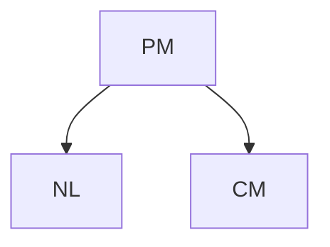

在他们的论文中，Quinn et al. [1999] 发现 NL 与 CM 不独立，这与模型一致（假设忠实性——参见定义 6.33）。现在，我们将 NL 的结构分配替换为 $N L : = \tilde { N } _ { N L }$ ，其中 $\tilde { N } _ { N L }$ 可以以相等的概率随机分配三种夜灯条件（“黑暗”、“夜灯”、“房间灯”）中的一种。在相应的干预分布中

$$
P _ {N L, C M} ^ {\mathfrak {C}; d o \big (N L := \tilde {N} _ {N L} \big)},
$$

我们会发现 NL 与 CM 独立，因为 $C M : = g ( N _ { P M } , N _ { C M } )$ 。这独立于 $\tilde { N } _ { N L }$ 的分布。我们说从 NL 到 CM 不存在因果效应。□

受示例 6.11 中最后陈述的启发，我们定义了**总因果效应（total causal effect）** 的存在性 [参见 Pearl, 2009, “total causal effect”]。

**定义 6.12（总因果效应）** 给定一个 SCM C，当且仅当对于某个随机变量 $\tilde { N } _ { X }$ ，有

$$
X \not \perp Y \quad 在 \quad P _ {\mathbf {X}} ^ {\mathfrak {C}; d o (X := \tilde {N} _ {X})} 中
$$

时，存在从 X 到 Y 的总因果效应。

除了定义 6.12 中的概念外，还有其他概念直观地描述了总因果效应的存在。然而，事实证明，人们可能想到的大多数陈述都是等价的。以下命题在附录 C.4 中得到了证明。

**命题 6.13（总因果效应）** 给定一个 SCM C，以下陈述是等价的：

(i) 存在从 X 到 Y 的总因果效应。  
(ii) 存在 $x ^ { \triangle }$ 和 $x ^ { \boxed { \begin} { r } \end} }$ 使得 $P _ { Y } ^ { \mathfrak { C } ; d o \left( X : = x ^ { \triangle } \right) } \neq P _ { Y } ^ { \mathfrak { C } ; d o \left( X : = x ^ { \varOmega } \right) }$  
(iii) 存在 $x ^ { \triangle }$ 使得 $P _ { Y } ^ { \mathfrak { C } ; d o \left( X : = x ^ { \triangle } \right) } \ne P _ { Y } ^ { \mathfrak { C } } .$  
(iv) 对于任何分布具有全支撑的 $\tilde { N } _ { X }$ ，X 与 Y 在 $P _ { X , Y } ^ { \mathrm { g } ; d o \left( X : = \tilde { N } _ { X } \right) }$ 中不独立。

毫不奇怪，总因果效应的存在与图中**有向路径（directed path）** 的存在有关。然而，这种对应关系并非一一对应。虽然存在有向路径是总因果效应的必要条件，但并非充分条件。

**命题 6.14（总因果效应的图标准则）** 假设我们给定一个 SCM C 及其对应的图 G。

(i) 如果从 X 到 Y 没有有向路径，则不存在总因果效应。  
(ii) 有时存在有向路径，但不存在总因果效应。

证明见附录 C.5。

**示例 6.15（随机试验）** 因果效应的定义在随机试验中得以实现。在这些研究中，我们根据 $\tilde { N } _ { T }$ 随机分配治疗 T 给患者，并观察（例如）**二值恢复变量（binary recovery）** R。假设 T 取三个可能值（$T = 0$：无药物，$T = 1$：安慰剂，$T = 2$：目标药物），并且 $\tilde { N } _ { T }$ 随机选择这三种可能性之一：$P ( \tilde { N } _ { T } = 0 ) = P ( \tilde { N } _ { T } = 1 ) = P ( \tilde { N } _ { T } = 2 ) = 1 / 3$ 。在 SCM 中，这种随机化通过观察来自分布

$$
P _ {\mathbf {X}} ^ {\mathfrak {C}; d o \left(T := \tilde {N} _ {T}\right)}.
$$

的数据来建模。（这里，C 表示没有随机化的原始 SCM。）如果我们仍然发现治疗与恢复之间存在依赖关系，我们得出结论，T 对恢复有总因果效应。然而，可能事实证明，无论药物类型如何，都存在总因果效应。图 6.3 给出了简化描述。当患者服用一粒药丸（无论其内容如何）时，患者的心理状态（P）会发生变化，进而影响恢复。让我们假设这种安慰剂效应对安慰剂和目标药物是相同的。也就是说，P 的结构分配满足


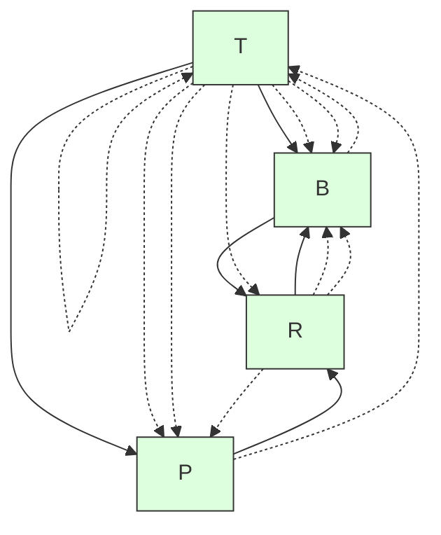

**图 6.3：** 随机化研究的简化描述。T 表示治疗，P 和 B 分别表示患者的心理状态和某些生化状态，R 表示患者是否康复。对 T 的随机化消除了任何其他变量对 T 的影响，因此 T 和 R 之间不可能存在隐藏的共同原因。我们区分两种不同的效应：通过 P 的安慰剂效应和通过 B 的生化效应。

$$
f _ {P} (T = 0, N _ {P}) \neq f _ {P} (T = 1, N _ {P}) = f _ {P} (T = 2, N _ {P}).
$$

在药物研究中，我们对生化效应比对安慰剂效应更感兴趣。因此，我们将随机化限制在安慰剂和目标药物上，即 $P ( \tilde { N } _ { T } = 0 ) = 0$ 。如果我们仍然看到治疗 T 与恢复 R 之间存在依赖关系，那么这一定是由于生化效应所致。

使用随机试验进行因果学习的想法由 Peirce [1883] 和 Peirce 与 Jastrow [1885] 描述（使用不同的数学语言），后来由 Neyman [参见 Splawa-Neyman et al., 1990，原始文章的翻译和编辑版本] 和 Fisher [1925] 进一步发展。这些工作大部分涉及农业应用。

一个早期的随机试验例子是由 James Lind 进行的。在 18 世纪，英国因坏血病损失的士兵比因敌方行动损失的还要多；维生素 C 及其与坏血病的关系尚不为人知。苏格兰医生 James Lind（1716–1794）在一艘船上担任外科医生，他这样描述试验 [引自 Bhatt, 2010]：

> 1747 年 5 月 20 日，我在 Salisbury 号船上挑选了十二名坏血病患者。他们的病情尽可能相似。他们普遍有牙龈腐烂、斑点和倦怠，以及膝盖无力……两名患者每天被吩咐喝一夸脱苹果酒。另外两名患者每天三次服用二十五滴硫酸酏剂……另外两名患者每天三次服用两汤匙醋……两名最严重的患者被安排进行海水疗程……另外两名患者每天各得到两个橙子和一个柠檬……剩下的两名患者服用了……一位医院外科医生推荐的一种糖浆……结果是，使用橙子和柠檬的患者产生了最迅速和最明显的良好效果；其中一名服用者在六天结束时已适合执勤。

读者会注意到，该试验并非完全随机化，但其历史趣味性弥补了这一点。□

**示例 6.16（肾结石）** 表 6.1 显示了一个著名的肾结石康复数据集 [Charig et al., 1986]。在 700 名患者中，一半接受了**开放手术（open surgery）**（治疗 $T = a$，78% 康复率），另一半接受了**经皮肾镜取石术（percutaneous nephrolithotomy）**（T = b，83% 康复率），这是一种通过小穿刺伤口去除肾结石的手术方法。如果我们除了总体康复率之外什么都不知道，并且忽略副作用，例如，如果必须决定，许多人可能会选择治疗 b。更详细地观察数据，我们可以将肾结石分为小结石和大结石。我们发现，开放手术在两类患者中表现都更好。我们如何处理这种结论的逆转？

我们首先给出一个直观的解释。较大的结石比较小的结石更严重（见表 6.1），而治疗 a 不得不处理更多这些困难病例（尽管分配给 a 和 b 的患者总数相等）。这就是为什么治疗 a 在整个人群中看起来比治疗 b 更差，但在两个亚组中却更好的原因。这种分配的不平衡可能是由于医生认为治疗 a 比治疗 b 更好，因此以更高的概率将困难病例分配给治疗 a。

作为另一种观点，我们建议使用干预的语言来表述我们感兴趣的确切问题。这不是关于在这个特定研究中治疗 $T = a$ 或治疗 $T = b$ 哪个更成功，而是当我们强制所有患者分别接受治疗 a 或治疗 b 时，两种治疗方法如何比较，或者当我们随机将每位患者分配到其中一种治疗时，我们比较康复率。这三种情况涉及一种与观测分布 $P _ { \mathbf { X } }$ 不同的干预分布。特别地，它们对应于 $P ^ { \mathfrak { C } ; d o ( T : = a ) } , P ^ { \mathfrak { C } ; d o ( T : = b ) } , \mathrm { o r } P ^ { \mathfrak { C } ; d o \left( T : = \tilde { N } _ { T } \right) }$ 。我们将在示例 6.37 中计算这些干预分布，并了解为什么我们应该优先选择治疗 a 而非治疗 b。这个数据集是**辛普森悖论（Simpson's paradox）** [Simpson, 1951]（第 9.2 节）的一个著名例子。事实上，与其说它是一个悖论，不如说是混杂（confounding）影响的结果，即隐藏的共同原因。

**表 6.1：辛普森悖论的经典例子。该表报告了两种肾结石治疗方法的成功率 [Bottou et al., 2013, Charig et al., 1986, 表 I 和 II]。尽管治疗 b 的总体成功率似乎更好（任一列的粗体数字最大），但治疗 b 在患有小结石和患有大量结石的患者中表现均逊于治疗 a（参见示例 6.37 和第 9.2 节）。**

|  | 总体 | 小结石患者 | 大量结石患者 |
| --- | --- | --- | --- |
| 治疗 a: 开放手术 | 78% (273/350) | 93% (81/87) | 73% (192/263) |
| 治疗 b: 经皮肾镜取石术 | 83% (289/350) | 87% (234/270) | 69% (55/80) |

如果您对数据进行显著性检验（例如，使用比例检验或 $\chi ^ { 2 }$ 独立性检验），结果发现，在 5% 显著性水平下，方法之间的差异并不显著。但请注意，这不是本例的重点。如果将表 6.1 中的每个条目乘以 10 倍，结果将变得具有统计显著性。此外，我们专注于恢复 R，并忽略可能影响我们治疗决策的潜在副作用。□

**干预变量（Intervention variables）** 我们现在描述另一种形式化干预的方法；参见，例如，Dawid [2015] 或 Pearl [2009, 第 3.2.2 章]。我们将 SCM C 及其 DAG 扩展为包含无父节点 $I _ { 1 } , I _ { 2 } , \ldots , I _ { d }$ ，称为“干预变量”，分别指向 $X _ { 1 } , \ldots , X _ { d }$ 。为简单起见，我们这里只讨论对单个节点的干预。每个 $I _ { j }$ 要么取值为空闲（idle），要么取值为 $X _ { j }$ 可能达到的某个值 $x _ { j }$ 。那么 $I _ { j } = x _ { j }$ 意味着 $X _ { j }$ 被设置为值 $x _ { j }$ ，而 $I _ { j } = \mathtt { i d l e }$ 表示 $X _ { j }$ 未被干预。相应地，我们将结构分配

$$
X _ {j} := f _ {j} (\mathbf {P A} _ {j}, N _ {j})
$$

替换为

$$
X _ {j} := \left\{ \begin{array}{c c} f _ {j} (\mathbf {P A} _ {j}, N _ {j}) & \text { 如果 } I _ {j} = \text { idle } \\ I _ {j} & \text { 否则 } \end{array} \right.
$$

并添加 $I _ { 1 } , \ldots , I _ { d }$ 的分配，所有这些分配仅由噪声变量决定。在为 $I _ { j }$ 的所有可能值分配非零概率（或概率密度）后，原始 SCM C 所蕴含的干预概率变为扩展 SCM ${ \mathfrak { C } } ^ { * }$ 中的通常条件概率：

$$
P _ {Y} ^ {\mathfrak {C}; d o (X _ {j} := x _ {j})} = P _ {Y | I _ {j} = x _ {j}} ^ {\mathfrak {C} ^ {*}},
$$

参见注释 6.40。此外，关于对某个变量的干预是否改变某个目标变量分布的陈述，变成了一个通常的统计独立性陈述。

## 6.4 反事实（Counterfactuals）

反事实的定义和解释在文献中受到了广泛关注。它们处理以下情况：假设你在打扑克，起始手牌是 ♣J 和 ♣3（有时被称为“伐木工”——树和杰克）；你停止游戏（“弃牌”），因为你估计获胜概率太小，不想输掉更多钱。又有三张牌面朝上发给公共牌区（“翻牌”）。它们是 ♣4、♣Q 和 ♣2。反应是一个典型的反事实陈述：“如果我当时继续留在游戏中，我的机会本来会很好。”（五张同花色的牌是第五高的牌型，称为“同花”，甚至有机会组成“同花顺”，即第二高的牌型。）这个陈述将观测到的数据（手牌和翻牌）纳入模型，然后分析一个干预分布（继续留在游戏中），其中环境的其余部分保持不变（相同的牌）。形式上，这对应于更新 SCM 的噪声分布（通过条件作用），然后执行干预。

**定义 6.17（反事实）** 考虑一个定义在节点 X 上的 SCM ${ \mathfrak { C } } : = ( \mathbf { S } , P _ { \mathbf { N } } )$ 。给定一些观测值 x，我们通过替换噪声变量的分布来定义一个反事实 SCM：

$$
\mathfrak {C} _ {\mathbf {X} = \mathbf {x}} := \left(\mathbf {S}, P _ {\mathbf {N}} ^ {\mathfrak {C} | \mathbf {X} = \mathbf {x}}\right),
$$

其中 $P _ { \mathbf { N } } ^ { \mathrm { g c } | \mathbf { X } = \mathbf { x } } : = P _ { \mathbf { N } | \mathbf { X } = \mathbf { x } } . ^ { 7 }$ 不再独立。反事实陈述现在可以被视为新反事实 SCM 中的 do-陈述。

这个定义可以推广，使得我们观测到的不是完整的向量 $\mathbf { X } = \mathbf { x }$ ，而只是部分变量。

**示例 6.18（计算反事实）** 考虑以下 SCM：

$$
\begin{array}{l} X := N _ {X} \\ Y := X ^ {2} + N _ {Y} \\ Z := 2 \cdot Y + X + N _ {Z} \\ \end{array}
$$

其中 $N _ { X } , N _ { Y } , N _ { Z } \overset { \mathrm { i i d } } { \sim } \mathrm { U } ( \{ - 5 , - 4 , . . . , 4 , 5 \} )$ 均匀分布在 −5 到 5 之间的整数上。现在，假设我们观测到 $( X , Y , Z ) = ( 1 , 2 , 4 )$ 。那么 $P _ { \bf N } ^ { \mathrm { e } \mathrm { i } \mathrm { { \bf x } = \bf x } }$ 将点质量置于 $\left( N _ { X } , N _ { Y } , N _ { Z } \right) = \left( 1 , 1 , - 1 \right)$ 上，因为这里所有噪声项都可以从观测值中唯一重构。因此，我们得到反事实陈述（在 $( X , Y , Z ) = ( 1 , 2 , 4 )$ 的背景下）：“如果 X 本是 2，那么 Z 本会是 11。”在本书中，这样的句子被解释为：“如果 X 被设置为 2，那么 Z 本会是 11。”数学上，这意味着 $P _ { Z } ^ { \mathfrak { C } | \mathbf { X } = \mathbf { x } ; d o ( X : = 2 ) }$ 在 11 处有一个点质量。同样地，我们得到“如果 X 本是 2，那么 Y 本会是 5”；以及“如果 Y 本是 5，那么 Z 本会是 10。”□

由于反事实的构造涉及几个步骤，其符号看起来相当复杂。8 我们希望以下图示能提供进一步澄清。


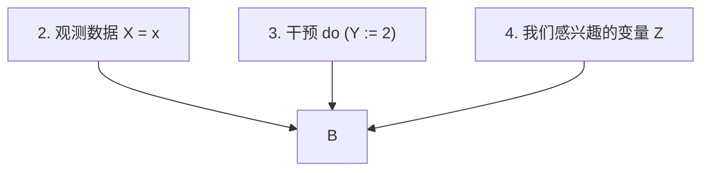

**反事实语句（Counterfactual statements）** 强烈依赖于 **结构因果模型（Structural Causal Model, SCM）** 的结构。示例 6.19 展示了两个 SCM，它们诱导出相同的图、观测分布和干预分布，但却蕴含不同的反事实语句。稍后，我们将这些 SCM 称为“概率等价且干预等价”，但并非“反事实等价”（参见定义 6.47）。

**示例 6.19** 设 $N _ { 1 } , N _ { 2 } \sim \mathrm { B e r } ( 0 . 5 )$ ，且 $N _ { 3 } \sim \mathrm { U } ( \{ 0 , 1 , 2 \} )$ ，这三个变量联合独立。即 $N _ { 1 } , N _ { 2 }$ 服从参数为 0.5 的伯努利分布（Bernoulli distribution），$N _ { 3 }$ 在 {0, 1, 2} 上均匀分布。我们定义两个不同的 SCM。首先考虑 ${ \mathfrak { C } } _ { A }$ ：

$$
\begin{array}{l} X _ {1} := N _ {1} \\ X _ {2} := N _ {2} \\ X _ {3} := \left(1 _ {N _ {3} > 0} \cdot X _ {1} + 1 _ {N _ {3} = 0} \cdot X _ {2}\right) \cdot 1 _ {X _ {1} \neq X _ {2}} + N _ {3} \cdot 1 _ {X _ {1} = X _ {2}}. \\ \end{array}
$$

如果 $X _ { 1 }$ 和 $X _ { 2 }$ 取值不同，则根据 $N _ { 3 }$ 我们要么选择 $X _ { 3 } = X _ { 1 }$ ，要么选择 $X _ { 3 } = X _ { 2 }$ 。否则 $X _ { 3 } = N _ { 3 }$ 。现在，${ \mathfrak { C } } _ { B }$ 与 ${ \mathfrak { C } } _ { A }$ 仅在后者情况下不同：

$$
\begin{array}{l} X _ {1} := N _ {1} \\ X _ {2} := N _ {2} \\ X _ {3} := \left(1 _ {N _ {3} > 0} \cdot X _ {1} + 1 _ {N _ {3} = 0} \cdot X _ {2}\right) \cdot 1 _ {X _ {1} \neq X _ {2}} + (2 - N _ {3}) \cdot 1 _ {X _ {1} = X _ {2}}. \\ \end{array}
$$

两个 SCM 蕴含相同的观测分布；并且对于任何可能的干预，它们也蕴含相同的**干预分布（intervention distributions）**，$^9$ 但这两个模型在一个反事实语句上存在差异。假设我们观测到 $( X _ { 1 } , X _ { 2 } , X _ { 3 } ) = ( 1 , 0 , 0 )$ ，并且我们感兴趣的反事实问题是：“如果 $X _ { 1 }$ 曾是 $0$ ，那么 $X _ { 3 }$ 会是多少？”根据两个 SCM，都推出 $N _ { 3 } = 0$ ，因此在 $X _ { 1 }$ 的反事实变化下，两个 SCM ${ \mathfrak { C } } _ { A }$ 和 $\mathfrak { C } _ { B }$ 对 $X _ { 3 }$ 的“预测”值不同（分别为 0 和 2）。□

上述示例的启示有两点：(1) 两个 SCM 对应于相同的**因果图模型（causal graphical model）**（参见第 6.5.2 节），在这个意义上，因果图模型不足以预测反事实。(2) 在第 6.8 节中，我们将干预分布与现实世界的**随机实验（randomized experiments）** 联系起来。

对于这个示例，我们无法使用随机试验或观测数据来区分 ${ \mathfrak { C } } _ { A }$ 或 ${ \mathfrak { C } } _ { B }$。因此，如果我们对反事实语句感兴趣，就需要额外的假设来区分 ${ \mathfrak { C } } _ { A }$ 或 ${ \mathfrak { C } } _ { B }$。

我们现在总结反事实的一些性质。

**注释 6.20** (i) 反事实语句不具有**传递性（transitive）**。在示例 6.18 中，我们发现给定观测 $( X , Y , Z ) = ( 1 , 2 , 4 )$ 时，

“如果 X 是 2，Y 会是 5，”

“如果 Y 是 5，Z 会是 10，” 以及

“如果 X 是 2，Z 不会是 10。”

因此，我们不能简单地引入新变量 $\tilde { X }$ 和 $\tilde { Y }$ ，并将语句“如果 X 是 2，Y 会是 5”解释为 $\tilde { X } = 2 \Rightarrow \tilde { Y } = 5$ 形式的逻辑蕴含。在前面的示例中，非传递性是由于从 X 到 $Z$ 的直接链接，即存在一条从 X 到 Z 但不经过 Y 的路径。对于干预分布也有类似的例子。

(ii) 人类常常以反事实的方式思考：“我本该坐火车的。”、“你还记得我们 2000 年 9 月 11 日去纽约的航班吗？想象一下，如果我们一年后乘坐那趟航班会怎样！”或者“我们本该在 2014 年 12 月投资瑞士法郎的！” 这些只是几个例子。有趣的是，这有时甚至涉及我们基于可用信息做出最优决策的情况。假设有人给你 10，000 美元，让你预测一次硬币抛掷的结果；你猜“正面”并输了。有些人可能会想，“我为什么不说‘反面’呢？”尽管他们根本不可能知道结果。Roese [1997]、Byrne [2007] 等人提供了反事实思维的心理意义。讨论反事实语句是否包含有助于我们未来做出更好决策的信息是很有趣的，但这超出了本书的范围；另见 Pearl [2009, 第 4 章]。

(iii) 我们也不讨论反事实在我们的法律体系中的作用；反事实是否以及如何作为判决的依据是一个有趣的问题（参见示例 3.4）。

(iv) 人们对反事实的思考由来已久；这是历史学家常用的工具。例如，提图斯·李维（Titus Livius）在公元前 25 年讨论过，如果亚历山大大帝没有死于亚洲并进攻罗马，会发生什么 [Geradin and Girgenson, 2011]。保罗在《哥林多前书》（7:29–7:31）中写道：“弟兄们，我对你们说，时候减少了。从此以后，那有妻子的，要像没有妻子；/ 哀哭的，要像不哀哭；快乐的，要像不快乐；置买的，要像无有所得；/ 用世物的，要像不用世物。”(v) 我们可以将干预语句视为（随机）实验的数学构造。对于反事实语句，现实世界中并没有可比的对应物。人们可能会推测，许多反事实语句无法被证伪，因此不应在科学探究中使用 [参见 Popper, 2002]。但请注意，有时我们可以做出可证伪的反事实语句（例如，当样本中特定实例的噪声项的实际值事后变得明显时；参见示例 3.4）。此外，我们上面描述的反事实是假设一个 SCM 的结果。因此，证伪的另一个目标也可以是 SCM 本身，而不是给定的反事实语句。这可能是也可能不是可行的，例如，使用 SCM 所涉及的科学领域的方法。10

这些注释可以视为引发思考的材料。我们不会进一步深入探讨反事实语句的解释，以及例如在法庭案件中应如何或能否使用它们。许多这类讨论超出了我们的专业领域。相反，我们参考 Halpern [2016]，他讨论了某个事件是另一个事件的“实际原因（actual cause）”意味着什么。

## 6.5 马尔可夫性质、忠实性与因果最小性（Markov Property, Faithfulness, and Causal Minimality）

### 6.5.1 马尔可夫性质（Markov Property）

**马尔可夫性质（Markov property）** 是一种常用的假设，构成了**图模型（graphical models）** 的基础。当一个分布相对于一个图是**马尔可夫的（Markovian）** 时，该图编码了分布中的某些**独立性（independences）**，我们可以利用这些独立性进行高效计算或数据存储。马尔可夫性质同时存在于有向图和无向图中，这两类图编码了不同的独立性集合 [Koller and Friedman, 2009]。然而，在**因果推断（causal inference）** 中，我们主要关注有向图。许多因果推断的介绍从假设马尔可夫性质开始。相反，在本书中，我们假设存在一个底层的 SCM。我们将在命题 6.31 中看到，这足以证明马尔可夫性质。但首先，让我们定义它。

**定义 6.21（马尔可夫性质）** 给定一个**有向无环图（Directed Acyclic Graph, DAG）** G 和一个联合分布 $R _ { \mathbf { X } }$ ，称该分布满足

(i) 相对于 DAG G 的**全局马尔可夫性质（global Markov property）**，如果对于所有不相交的顶点集 A、B、C，有

$$
\mathbf {A} \perp \llcorner_ {\mathcal {G}} \mathbf {B} | \mathbf {C} \Rightarrow \mathbf {A} \perp \llcorner \mathbf {B} | \mathbf {C}
$$

（符号 ⊥⊥G 表示 **d-分离（d-separation）**——参见定义 6.1），

(ii) 相对于 DAG G 的**局部马尔可夫性质（local Markov property）**，如果每个变量在给定其父节点的情况下独立于其非后代节点，以及

(iii) 相对于 DAG G 的**马尔可夫分解性质（Markov factorization property）**，如果

$$
p (\mathbf {x}) = p (x _ {1}, \dots , x _ {d}) = \prod_ {j = 1} ^ {d} p (x _ {j} | \mathbf {p a} _ {j} ^ {\mathcal {G}}).
$$

对于最后一个性质，我们必须假设 $P _ { \mathbf { X } }$ 具有密度 p；乘积中的因子称为**因果马尔可夫核（causal Markov kernels）**，描述条件分布 $P _ { X _ { j } | \mathbf { P A } _ { j } ^ { \mathcal { G } } }$ 。

事实证明，只要联合分布具有密度，11 这三个定义是等价的。

**定理 6.22（马尔可夫性质的等价性）** 如果 $R$ 具有密度 $p$ ，则定义 6.21 中的所有马尔可夫性质都是等价的。

证明可见，例如，Lauritzen [1996] 的定理 3.27。

**示例 6.23** 一个分布 $P _ { X _ { 1 } , X _ { 2 } , X _ { 3 } , X _ { 4 } }$ 相对于图 6.1（第 84 页）所示的图 G 是马尔可夫的，如果根据 (i) 或 (ii)，

$$
X _ {2} \perp X _ {3} | X _ {1} \quad \text { 且 } \quad X _ {1} \perp X _ {4} | X _ {2}, X _ {3},
$$

或者，根据 (iii)，

$$
p (x _ {1}, x _ {2}, x _ {3}, x _ {4}) = p (x _ {3}) p (x _ {1} | x _ {3}) p (x _ {2} | x _ {1}) p (x _ {4} | x _ {2}, x _ {3}).
$$

我们稍后将在命题 6.31 中看到，从 SCM 蕴含的分布相对于该 SCM 的图是马尔可夫的。因此，对于如图 6.1 左侧 SCM 所蕴含的分布 $P _ { X _ { 1 } , X _ { 2 } , X _ { 3 } , X _ { 4 } }$ ，这些条件确实成立。直观上，陈述 $X _ { 2 } \perp \perp X _ { 3 } | X _ { 1 }$ 是合理的。考虑路径 $X _ { 2 } \leftarrow X _ { 1 } \rightarrow X _ { 3}$ ，如果我们已经知道 $X _ { 1 }$ ，那么 $X _ { 3 }$ 不会提供关于 $X _ { 2 }$ 的任何新信息。在这个意义上，SCM 的图结构在联合分布中留下了一些“痕迹”。□

马尔可夫条件将关于图分离的陈述与**条件独立性（conditional independences）** 联系起来。然而，不同的图可能编码完全相同的条件独立性集合。

**定义 6.24（图的马尔可夫等价性）** 我们用 ${ \mathcal { M } } ( { \mathcal { G } } )$ 表示相对于 ${ \mathcal { G } }$ 是马尔可夫的分布的集合：

$\mathcal { M } ( \mathcal { G } ) : = \{ P : P$ 满足相对于 $\mathcal { G }$ 的全局（或局部）马尔可夫性质 $\}$ 。

两个 DAG $\mathcal { G } _ { 1 }$ 和 $\mathcal { G } _ { 2 }$ 是**马尔可夫等价的（Markov equivalent）**，如果 $\mathcal { M } ( \mathcal { G } _ { 1 } ) = \mathcal { M } ( \mathcal { G } _ { 2 } )$ 。当且仅当 $\mathcal { G } _ { 1 }$ 和 $\mathcal { G } _ { 2 }$ 满足相同的 d-分离集合时，这是成立的，这意味着马尔可夫条件蕴含相同的（条件）独立性条件集合。

与某个 DAG 马尔可夫等价的所有 DAG 的集合称为 G 的**马尔可夫等价类（Markov equivalence class）**。它可以用一个**完全的部分有向无环图（completed Partially Directed Acyclic Graph, CPDAG）** 来表示，记为 $C P D A G ( { \mathcal { G } } ) = ( V , { \mathcal { E } } )$ ；当且仅当马尔可夫等价类中的一个成员包含该（有向）边 $( i , j ) \in \mathcal { E }$ 时，该边才存在；参见图 6.4。

根据这个定义，确定两个 DAG 是否马尔可夫等价似乎是一个非平凡的问题。幸运的是，Verma 和 Pearl [1991] 提供了一个简洁的刻画，另见 Frydenberg [1990]。

**引理 6.25（马尔可夫等价的图论准则）** 两个 DAG $\mathcal { G } _ { 1 }$ 和 $\mathcal { G } _ { 2 }$ 是马尔可夫等价的，当且仅当它们具有相同的**骨架（skeleton）** 和相同的**不当结构（immoralities）**。

这里，DAG 中的三个节点 A、B 和 C 形成一个**不当结构（immorality）** 或 **v-结构（v-structure）**，如果 $A \rightarrow B \leftarrow C$ 且 A 和 C 没有直接连接（参见第 6.1 节）。

图 6.4 展示了两个马尔可夫等价图（中间和左侧）的示例。这些图共享相同的骨架，并且都只有一个不当结构：


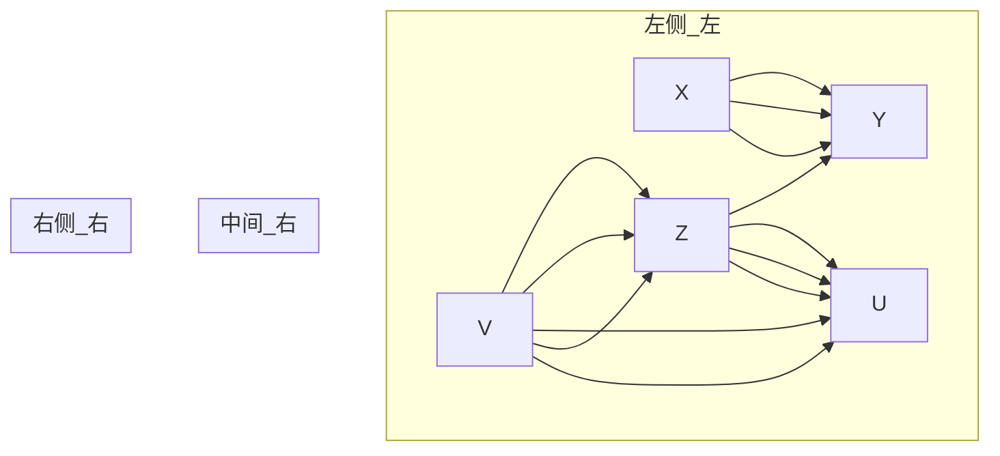

图 6.4：两个马尔可夫等价的 DAG（左侧和中间）；这是相应马尔可夫等价类中仅有的两个 DAG，可以由右侧的 CPDAG 表示。

$X \rightarrow Z \leftarrow V$ 。在相应的 CPDAG（参见图 6.4，右侧）中，并非所有有向边都是不当结构的一部分。例如，边 $Z \to Y$ 是为了避免形成 v-结构 $Y \rightarrow Z \leftarrow V$ 。此外，X → Y 防止了有向环的存在。

我们现在介绍**马尔可夫毯（Markov blanket）** [Pearl, 1988] 的图论概念，当试图根据所有其他变量的观测值来预测目标变量 Y 的值时，这个概念变得相关。人们可能会想知道，哪一组最小的变量，在已知它们的情况下，会使得其余变量对于预测任务无关紧要。

**定义 6.26（马尔可夫毯）** 考虑一个 DAG $\mathcal { G } = ( \mathbf { V } , \mathcal { E } )$ 和一个目标节点 Y 。Y 的马尔可夫毯是满足以下条件的最小集合 M：

$$
Y \perp_ {\mathcal {G}} \mathbf {V} \backslash (\{Y \} \cup M) \text {  给定  } M.
$$

如果 $P _ { \mathbf { X } }$ 相对于 $\mathcal { G }$ 是马尔可夫的，那么

$$
Y \perp \mathbf {V} \backslash (\{Y \} \cup M) \text {  给定  } M.
$$

换句话说，给定 M，其他变量不提供关于 Y 的任何进一步信息。在理想化的回归设置中，我们因此只需要将 M 中的变量包含进来以预测 Y 。这并不意味着在有限样本设置中，其他变量是无用的。如果 Y 对其马尔可夫毯 M 的依赖性与给定回归方法使用的先验或函数类不完全一致，那么在 M 之外添加变量可能会改善 Y 的预测。

对于 DAG，我们知道马尔可夫毯是什么样子。它不仅包含父节点，还包含子节点和子节点的父节点 [Pearl, 1988]。

**命题 6.27（马尔可夫毯）** 考虑一个 DAG G 和一个目标节点 Y 。那么，Y 的马尔可夫毯 M 包括其父节点、其子节点以及其子节点的父节点：

$$
M = \mathbf {P A} _ {Y} \cup \mathbf {C H} _ {Y} \cup \mathbf {P A} _ {\mathbf {C H} _ {Y}}.
$$

到目前为止，我们已经讨论了将分布与图联系起来的马尔可夫性质。现在，我们想讨论它的一些因果含义。马尔可夫性质可用于证明**赖兴巴赫的共同原因原则（Reichenbach's common cause principle）**（原则 1.1）。回顾一下，它指出当随机变量 X 和 Y 相关时，这种相关性必定存在一个“因果解释”：

(i) X（可能间接地）导致 Y，或者  
(ii) Y（可能间接地）导致 X，或者  
(iii) 存在一个（可能未观测到的）共同原因 Z（可能间接地）同时导致 X 和 Y。

这里，我们尚未进一步指定“导致（causing）”一词的含义。以下命题从“导致”的弱概念（即存在一条有向路径）证明了赖兴巴赫原则的合理性。

**命题 6.28（赖欣巴哈的共同原因原则）** 假设任意一对变量 $X$ 和 $Y$ 都可以按以下意义嵌入到一个更大的系统中。存在一个包含 $X$ 和 $Y$ 的随机变量集合 $\mathbf{X}$ 上的正确 **结构因果模型（Structural Causal Model, SCM）**，其图结构为 $\mathcal{G}$。那么，**赖欣巴哈的共同原因原则（Reichenbach’s common cause principle）** 可以从 **马尔可夫性质（Markov property）** 推导出来。如果 $X$ 和 $Y$ 是（无条件）依赖的，那么存在：

(i) 要么从 $X$ 到 $Y$ 的一条有向路径，或者  
(ii) 从 $Y$ 到 $X$ 的一条有向路径，或者  
(iii) 存在一个节点 $Z$，它有一条从 $Z$ 到 $X$ 的有向路径和一条从 $Z$ 到 $Y$ 的有向路径。

**证明。** 根据马尔可夫性质，依赖性意味着 $\mathcal{G}$ 包含一条 $X$ 和 $Y$ 之间的未阻塞路径。该路径不能包含对撞节点，否则它会被空集阻塞。由于 $X$ 和 $Y$ 之间任何不包含对撞节点的路径必须具有形式 $X \to \ldots \to Y$，$X \leftarrow \ldots \leftarrow Y$ 或 $X \leftarrow \ldots \leftarrow Z \to \ldots \to Y$，因此结论成立。 

**注 6.29（选择偏差）** 在赖欣巴哈原则中，我们从两个依赖的随机变量出发，并得出一个有效的结论。然而，在实际应用中，我们可能隐式地以第三个变量为条件（**选择偏差（selection bias）**）。如例 6.30 所示，这可能导致 $X$ 和 $Y$ 之间出现依赖性，尽管上述三个条件均不成立（另见第 1.3 节最后一段的讨论）。□

**例 6.30（伯克森悖论）** 以下例子“为什么英俊的男人都是混蛋？”取自 Ellenberg [2014]，是 **伯克森悖论（Berkson’s paradox）** [Berkson, 1946] 的一个实例。让我们假设一个男人是否处于恋爱关系 $( R = 1 )$ 仅由他是否英俊 $( H = 1 )$ 和是否友善 $( F = 1 )$ 决定。更精确地说，假设正确的 SCM 具有以下形式：

$$
H := N _ {H},
$$

$$
F := N _ {F},
$$

$$
R := \min (H, F) \oplus N _ {R},
$$


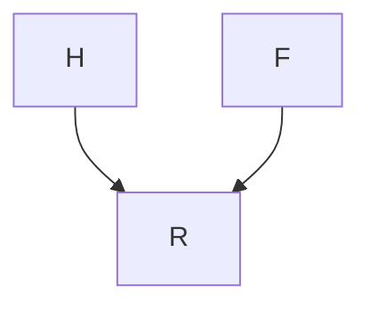

其中 $N _ { H } , N _ { F } \overset { \mathrm { i i d } } { \sim }$ Ber(0.5) 且 $N _ { R } \sim \mathrm { B e r } ( 0 . 1 )$ 。符号 $\oplus$ 表示模 2 加法。在这个模型中，如果一个男人既英俊又友善，他极有可能处于恋爱关系中。否则，他很可能单身。从 SCM 可以看出，$H$ 和 $F$ 被假设为独立的。然而，如果你考虑那些没有处于恋爱关系中的男人，即你以 $R = 0$ 为条件，那么这些特征（一个男人是否友善或英俊）就会变得反相关。如果一个人英俊，他更可能不友善（否则他会处于恋爱关系中）。我们有：

$$
F \not \perp H | R = 0
$$

因此，在给定 $R$ 的条件下，$F$ 并不独立于 $H$。

正如我们之前提到的，Pearl [2009] 在定理 1.4.1 中证明，由 SCM 诱导的分布 $P _ { \mathbf { X } }$ 相对于其图结构是马尔可夫的 [另见 Verma 和 Pearl, 1988]。

**命题 6.31（SCM 蕴含马尔可夫性质）** 假设 $P _ { \mathbf { X } }$ 是由图结构为 $\mathcal{G}$ 的 SCM 诱导的。那么，$P_\mathbf{X}$ 相对于 ${ \mathcal { G } }$ 是马尔可夫的。

分布相对于因果图是马尔可夫的这一假设有时被称为 **因果马尔可夫条件（causal Markov condition）**；这需要 **因果图（causal graph）** 的概念。对我们来说，因果图是由底层的 SCM 诱导的。另一方面，**因果图模型（causal graphical models）** 的概念则将它们作为因果推理的起点。

### 6.5.2 因果图模型（Causal Graphical Models）

我们将在第 6.6 节看到，为了定义干预分布，通常只需要知道观测分布和图结构即可。因此，我们将因果图模型定义为一个对，包含一个图和一个观测分布，使得该分布相对于该图是马尔可夫的（因果马尔可夫条件）。然而，这里有一个微妙的技术细节。形式上，我们需要能够访问完整的条件分布。如果 $p ( x _ { 2 } | x _ { 1 } = 3 )$ 未定义，例如因为 $p ( x _ { 1 } = 3 ) = 0$，我们可能无法定义 $p ^ { d o ( X _ { 1 } : = 3 ) } ( x _ { 2 } )$ 。这引出了以下定义：

**定义 6.32（因果图模型）** 一个关于随机变量 $\mathbf { X } = \left( X _ { 1 } , \ldots , X _ { d } \right)$ 的因果图模型包含一个图 $\mathcal { G }$ 和一个函数集合 $f _ { j } ( x _ { j } , x _ { \mathbf { P A } _ { j } ^ { \mathcal { G } } } )$，这些函数积分为 1：

$$
\int f _ {j} (x _ {j}, x _ {\mathbf {P A} _ {j} ^ {\mathcal {G}}}) d x _ {j} = 1.
$$

这些函数通过下式在 $\mathbf{X}$ 上诱导出一个分布 $P _ { \mathbf { X } }$：

$$
p (x _ {1}, \ldots , x _ {d}) = \prod_ {j = 1} ^ {d} f _ {j} (x _ {j}, x _ {\mathbf {P A} _ {j} ^ {\mathcal {G}}}),
$$

因此它们扮演了条件分布的角色：$f _ { j } ( x _ { j } , x _ { \mathbf { p } _ { \mathbf { A } _ { i } ^ { \mathcal { G } } } } ) = p ( x _ { j } | x _ { \mathbf { p } _ { \mathbf { A } _ { i } ^ { \mathcal { G } } } } )$ 。因果图模型根据第 6.6 节的方程 (6.8) 和 (6.9) 诱导出干预分布。在最一般的形式中，我们可以定义：

$$
p ^ {d o \left(X _ {k} := q (\cdot | x _ {\widetilde {\mathbf {P A}} _ {k}})\right)} (x _ {1}, \ldots , x _ {d}) = \prod_ {j \neq k} f _ {j} (x _ {j}, x _ {\widetilde {\mathbf {P A}} _ {j} ^ {\mathcal {G}}})   q (\cdot | x _ {\widetilde {\mathbf {P A}} _ {k}}),
$$

其中 $q ( \cdot | x _ { \widetilde { \mathbf { P A } _ { k } } } )$ 积分为 1，并且新的父节点集不会导致环路。

如果 $\mathbf{X}$ 上的一个分布 $P _ { \mathbf { X } }$ 相对于图 $\mathcal { G }$ 是马尔可夫的，并且允许一个严格正、连续的密度 $p$，那么通过设置 $f _ { j } ( \boldsymbol { x } _ { j } , \boldsymbol { x } _ { \mathbf { p } _ { \mathbf { A } _ { i } ^ { \mathcal { G } } } } ) : = p ( \boldsymbol { x } _ { j } | \boldsymbol { x } _ { \mathbf { p } _ { \mathbf { A } _ { i } ^ { \mathcal { G } } } } )$，该对 $( P _ { \mathbf { X } } , \mathcal { G } )$ 定义了一个因果图模型。

为什么我们主要使用 SCM，而不仅仅是图结构和马尔可夫条件，即因果图模型？形式上，SCM 包含的信息严格多于它们对应的图结构和分布（例如，反事实陈述），因此也多于所有干预分布族加上观测分布所包含的信息。然而，这种额外信息是否有用是有争议的。也许更重要的是，在 SCM 中限制函数类可以导致因果结构的可识别性（见第 4.1.3–4.1.6 节和第 7.1.2 节）。这些假设用 SCM 的语言比用图模型的语言更容易表述。

### 6.5.3 忠实性与因果极小性（Faithfulness and Causal Minimality）

在上一小节中，我们讨论了马尔可夫假设，它使我们能够从图结构中读出独立性。**忠实性（Faithfulness）** 则使我们能够从图结构中推断出依赖性。

**定义 6.33（忠实性与因果极小性）** 考虑一个分布 $P _ { \mathbf { X } }$ 和一个有向无环图（DAG）$\mathcal{G}$。

(i) 如果对于所有不相交的顶点集 $\mathbf{A}$、$\mathbf{B}$、$\mathbf{C}$，有
$$
\mathbf{A} \perp \mathbf{B} | \mathbf{C} \Rightarrow \mathbf{A} \perp_ {\mathcal{G}} \mathbf{B} | \mathbf{C}
$$
则称 $P _ { \mathbf { X } }$ 对 DAG $\mathcal{G}$ 是 **忠实（faithful）** 的。

(ii) 如果一个分布相对于 ${ \mathcal { G } }$ 是马尔可夫的，但相对于 $\mathcal{G}$ 的任何真子图都不是马尔可夫的，则该分布满足相对于 $\mathcal { G }$ 的 **因果极小性（causal minimality）**。

第 (i) 部分提出的蕴含关系是全局马尔可夫条件（见定义 6.21）
$$
\mathbf{A} \perp \llcorner_ {\mathcal{G}} \mathbf{B} | \mathbf{C} \Rightarrow \mathbf{A} \perp \llcorner \mathbf{B} | \mathbf{C}
$$
的逆命题。忠实性乍看之下并不直观。我们现在给出一个分布的例子，该分布相对于给定的 DAG $\mathcal { G } _ { 1 }$ 是马尔可夫的，但不忠实。这是通过使两条路径相互抵消，从而产生一个图结构并未蕴含的独立性来实现的。

**例 6.34（忠实性的违反）** 考虑下图。


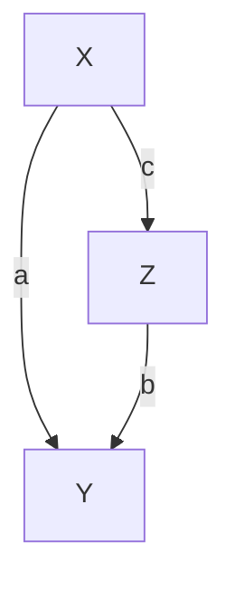

$\mathcal { G } _ { 1 }$


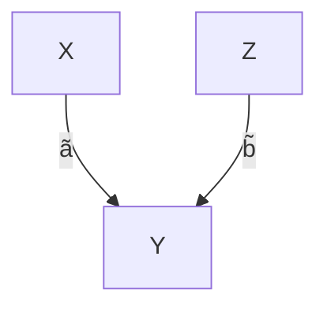

$\mathcal { G } _ { 2 }$


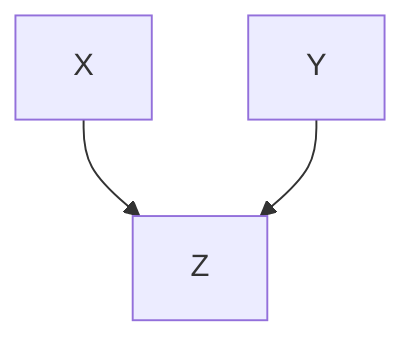

$\mathcal{H}$

我们首先看一个对应于左侧图 $\mathcal { G } _ { 1 }$ 的线性高斯 SCM。

$$
X := N _ {X},
$$

$$
Y := a X + N _ {Y},
$$

$$
Z := b Y + c X + N _ {Z},
$$

其中噪声变量 $N _ { X } \sim \mathcal { N } ( 0 , \sigma _ { X } ^ { 2 } )$、$N _ { Y } \sim \mathcal { N } ( 0 , \sigma _ { Y } ^ { 2 } )$ 和 $N _ { Z } \sim \mathcal { N } ( 0 , \sigma _ { Z } ^ { 2 } )$ 是联合独立的。这是一个图结构为 $\mathcal { G } _ { 1 }$ 的线性高斯 SCM 的例子（见定义 6.2）。现在，如果
$$
a \cdot b + c = 0, \tag {6.6}
$$
则该分布相对于 $\mathcal { G } _ { 1 }$ 是不忠实的，因为我们得到 $X \perp \perp Z$，而这是图结构未蕴含的¹²。读者可以很容易地验证，存在一个 DAG 为 $\mathcal { G } _ { 2 }$ 的 SCM 能诱导出相同的分布。□

为了在上述例子中获得额外的独立性，我们必须“调整”系数，使得两条路径在 (6.6) 中相互抵消。Spirtes 等人 [2000, 定理 3.2] 证明，对于线性模型，如果我们假设系数是从正密度中随机抽取的，那么这种情况发生的概率为零。

例 6.34 中的分布相对于 $\mathcal { G } _ { 2 }$ 是忠实的，但相对于 $\mathcal { G } _ { 1 }$ 是不忠实的。然而，对于这两个模型，如果没有任何参数为零，则因果极小性都得到满足。换句话说，该分布相对于 $\mathcal { G } _ { 1 }$ 或 $\mathcal { G } _ { 2 }$ 的任何真子图都不是马尔可夫的，因为移除任何一条边都对应着一个在分布中不成立的新的（条件）独立性；注意 $\mathcal { G } _ { 2 }$ 不是 $\mathcal { G } _ { 1 }$ 的真子图。然而，它是 $\mathcal { H }$ 的真子图，因此该分布不满足相对于 $\mathcal { H }$ 的因果极小性。一般来说，因果极小性比忠实性更弱。

**命题 6.35（忠实性蕴含因果极小性）** 如果 $P _ { \mathbf { X } }$ 相对于 ${ \mathcal { G } }$ 是忠实且马尔可夫的，则因果极小性得到满足。

**证明。** 论证如下：如果 $P _ { \mathbf { X } }$ 相对于 ${ \mathcal { G } }$ 的一个真子图 $\tilde { \mathcal { G } }$ 是马尔可夫的，那么在 $\mathcal { G }$ 中直接相连的两个节点在 $\tilde { \mathcal { G } }$ 中则不是直接相连的。因此，它们可以在 $\tilde { \mathcal { G } }$ 中被 d-分离，但在 $\mathcal { G }$ 中则不能（见问题 6.62）。马尔可夫条件蕴含了 $P _ { \mathbf { X } }$ 中相应的条件独立性陈述，因此 $P _ { \mathbf { X } }$ 不可能相对于 $\mathcal { G }$ 是忠实的。 

以下表述等价于因果极小性，希望能进一步帮助理解该条件。一个分布相对于 $\mathcal { G }$ 是极小的，当且仅当不存在这样的节点：在给定其剩余父节点的情况下，该节点与其任何一个父节点条件独立。在某种意义上，所有的父节点都是“活跃的”。

**命题 6.36（因果极小性的等价形式）** 考虑随机向量 $\mathbf { X } = \left( X _ { 1 } , \ldots , X _ { d } \right)$，并假设联合分布相对于某个乘积测度具有密度。假设 $P _ { \mathbf { X } }$ 相对于 $\mathcal { G }$ 是马尔可夫的。那么，$P _ { \mathbf { X } }$ 满足相对于 $\mathcal { G }$ 的因果极小性，当且仅当 $\forall X _ { j } \forall Y \in \mathbf { P A } _ { j } ^ { \mathcal { G } }$ 我们有 $X _ { j } \not \perp Y | \mathbf { P A } _ { j } ^ { \mathcal { G } } \setminus \{ Y \}$。

**证明。** 见附录 C.6。

我们已经看到，虽然忠实性是一个将条件独立性陈述与因果语义联系起来的强假设，但因果极小性是一个弱得多的条件。假设我们有一个因果图模型，其中因果极小性被违反了。那么，根据命题 6.36 的概念，其中一条边是“不活跃的”。如果我们移除这条边，这两个模型在定义 6.47 的意义上不一定在反事实或干预上等价。然而，如果所有密度都是严格正的（或者如果我们只允许对 $X _ { k }$ 进行干预，且干预的支持集是 $X _ { k }$ 支持集的子集），则它们在干预上是等价的；见问题 6.58。那么，因果极小性可以解释为一种约定，即避免在干预模型的描述中出现冗余。在大多数模型类中，没有因果极小性，从观测数据中实现可识别性是不可能的。例如，如果允许 $f$ 仅在 $X$ 的支持集之外与 $c$ 不同，我们就无法区分 $Y := f(X) + N_Y$ 和 $Y := c + N_Y$；另见注 6.6 和命题 6.49。

## 6.6 通过协变量调整计算干预分布（Calculating Intervention Distributions by Covariate Adjustment）

在本节中，我们将利用一个有些琐碎但非常强大的不变性陈述。给定一个 SCM $\mathfrak{C}$，并记 $pa(j) := \mathbf{PA}_j^{\mathcal{G}}$，我们有：

$$
p^{\tilde{\mathfrak{C}}}\left(x_j \mid x_{pa(j)}\right) = p^{\mathfrak{C}}\left(x_j \mid x_{pa(j)}\right) \tag{6.7}
$$

对于任何通过干预（某些）$X_k$ 但不干预 $X_j$ 而从 $\mathfrak{C}$ 构建的 SCM $\tilde{\mathfrak{C}}$。方程 (6.7) 表明因果关系在干预下是自主的；因此，这个性质有时被称为“自主性”。如果我们干预一个变量，那么其他机制保持不变（见图 2.2 左侧方框）。

我们从 (6.7) 推导出一个公式，该公式以三个不同的名称而闻名：**截断因子分解（truncated factorization）** [Pearl, 1993]、**G-计算公式（G-computation formula）** [Robins, 1986] 和 **操作定理（manipulation theorem）** [Spirtes et al., 2000]。其重要性源于这样一个事实：它允许我们计算关于干预分布的陈述，即使我们从未见过来自该分布的数据。

考虑一个具有结构赋值的 SCM $\mathfrak{C}$：

$$
X_j := f_j(X_{pa(j)}, N_j), \quad j = 1, \dots, d,
$$

以及密度 $p^{\mathfrak{C}}$。由于马尔可夫性质，我们有¹³：

$$
p^{\mathfrak{C}}(x_1, \dots, x_d) = \prod_{j=1}^{d} p^{\mathfrak{C}}(x_j | x_{pa(j)}).
$$

现在考虑从 $\mathfrak{C}$ 经过干预 $do\left( X_k := \tilde{N}_k \right)$ 演化而来的**结构因果模型（Structural Causal Model, SCM）** $\tilde{\mathfrak{C}}$，其中 $\tilde{N}_k$ 允许密度 $\tilde{p}$。同样，根据马尔可夫假设，可得：

$$
\begin{array}{l} p^{\mathfrak{C}; do\left(X_k := \tilde{N}_k\right)} \left(x_1, \dots, x_d\right) = \prod_{j \neq k} p^{\mathfrak{C}; do\left(X_k := \tilde{N}_k\right)} \left(x_j \mid x_{pa(j)}\right) \cdot p^{\mathfrak{C}; do\left(X_k := \tilde{N}_k\right)} \left(x_k\right) \\ = \prod_{j \neq k} p^{\mathfrak{C}} (x_j | x_{pa(j)}) \tilde{p} (x_k). \tag {6.8} \\ \end{array}
$$

在最后一步中，我们利用了强大的**不变性（invariance）** (6.7)。方程 (6.8) 使我们能够从观测数量（右侧）计算出干预性陈述（左侧）。作为一种特殊情况，我们得到：

$$
p^{\mathfrak{C}; do (X_k := a)} \left(x_1, \dots, x_d\right) = \left\{ \begin{array}{c l} \prod_{j \neq k} p^{\mathfrak{C}} \left(x_j \mid x_{pa(j)}\right) & \text { 如果 } x_k = a \\ 0 & \text { 否则。 } \end{array} \right. \tag {6.9}
$$

通常，**条件作用（conditioning）** 和通过 $do()$ 进行干预是不同的操作（参见例 6.10 后的讨论）。我们现在能够证明，对于没有任何父节点的变量，这些操作变得相同。不失一般性，假设 $X_1$ 是这样一个源节点。于是我们有：

$$
\begin{array}{l} p^{\mathfrak{C}} \left(x_2, \dots, x_d \mid x_1 = a\right) = \frac {p \left(x_1 = a\right) \prod_{j = 2}^{d} p^{\mathfrak{C}} \left(x_j \mid x_{pa(j)}\right)}{p \left(x_1 = a\right)} \\ = p^{\mathfrak{C}; do (X_1 := a)} \left(x_2, \dots, x_d\right). \tag {6.10} \\ \end{array}
$$

方程 (6.8) 和 (6.9) 应用广泛，但有时使用起来略显繁琐。我们现在将学习一些实用的替代方法。为此，我们首先回顾例 6.16（肾结石），然后将其推广。

**例 6.37（肾结石，续）** 假设真实的底层 SCM 允许以下图结构：


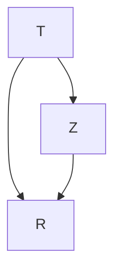

这里，$Z$ 是结石的大小，$T$ 是治疗方式，$R$ 是康复情况（均为二值变量）。我们看到康复情况受治疗方式和结石大小的影响。治疗方式本身也取决于结石大小。大部分复杂病例被分配给了治疗 A。进一步考虑两个 SCM $\mathfrak{C}_A$ 和 $\mathfrak{C}_B$，它们是通过将 $T$ 的结构性赋值分别替换为 $T := A$ 和 $T := B$ 而得到的。我们将相应的结果概率分布称为 $P^{\mathfrak{C}_A}$ 和 $P^{\mathfrak{C}_B}$。假设我们被诊断出患有肾结石，但不知道其大小，那么我们应该基于以下两者的比较来选择治疗方式：

$$
\mathbb{E}^{\mathfrak{C}_A} R = P^{\mathfrak{C}_A} (R = 1) = P^{\mathfrak{C}; do (T := A)} (R = 1)
$$

和

$$
\mathbb{E}^{\mathfrak{C}_B} R = P^{\mathfrak{C}_B} (R = 1) = P^{\mathfrak{C}; do (T := B)} (R = 1).
$$

假设我们已经观测到了来自 $\mathfrak{C}$ 的数据，我们如何估计这些量？考虑以下计算：

$$
\begin{array}{l} P^{\mathfrak{C}_A} (R = 1) \quad = \quad \sum_{z = 0}^{1} P^{\mathfrak{C}_A} (R = 1, T = A, Z = z) \\ = \sum_{z = 0}^{1} P^{\mathfrak{C}_A} (R = 1 | T = A, Z = z) P^{\mathfrak{C}_A} (T = A, Z = z) \\ = \sum_{z = 0}^{1} P^{\mathfrak{C}_A} (R = 1 | T = A, Z = z) P^{\mathfrak{C}_A} (Z = z) \\ \stackrel {(6. 7)} {=} \sum_{z = 0}^{1} P^{\mathfrak{C}} (R = 1   |   T = A, Z = z)   P^{\mathfrak{C}} (Z = z). \tag {6.11} \\ \end{array}
$$

最后一步包含了关键思想。再次，我们利用了不变性 (6.7)。我们可以根据表 6.1 所示的经验数据估计 $P^{\mathfrak{C}_A}(R=1)$，并得到：

$$
P^{\mathfrak{C}_A} (R = 1) \approx 0.93 \cdot \frac {357}{700} + 0.73 \cdot \frac {343}{700} = 0.832.
$$

类似地，我们得到：

$$
P^{\mathfrak{C}_B} (R = 1) \approx 0.87 \cdot \frac {357}{700} + 0.69 \cdot \frac {343}{700} \approx 0.782,
$$

并且我们得出结论，我们更倾向于选择治疗 A。（如前所述，我们忽略了统计显著性的问题，如果我们需要在 A 和 B 之间做出决定，这似乎是合理的。）量

$$
P^{\mathfrak{C}_A} (R = 1) - P^{\mathfrak{C}_B} (R = 1) \approx 0.832 - 0.782 \tag {6.12}
$$

有时被称为二值治疗情况下的**平均因果效应（Average Causal Effect, ACE）**。重要的是要认识到这与简单的条件作用不同：

$$
P^{\mathfrak{C}} (R = 1 \mid T = A) - P^{\mathfrak{C}} (R = 1 \mid T = B) = 0.78 - 0.83,
$$

在这个例子中，它甚至与 ACE 的符号相反。

这个三节点的例子很好地突出了干预和条件作用之间的区别。用密度表示，即为：

$$
p^{\mathfrak{C}; do (T := t)} (r) = \sum_{z} p^{\mathfrak{C}} (r | z, t) p^{\mathfrak{C}} (z) \neq \sum_{z} p^{\mathfrak{C}} (r | z, t) p^{\mathfrak{C}} (z | t) = p^{\mathfrak{C}} (r | t).
$$

方程 (6.11) 被称为对变量 $Z$ 进行“**调整（adjusting）**”。它表示一个重要的概念，在实践中经常使用，我们在定义 6.38 中正式定义它。它再次使我们能够根据观测到的量计算干预性陈述。注意，调整公式 (6.11) 的推导有时基于截断因子分解 (6.9)，但我们将在命题 6.41 中看到，使用不变性 (6.11) 的替代计算可以很好地推广到更复杂的情况。

**定义 6.38（有效调整集（Valid adjustment set））** 考虑一个在节点集 $\mathbf{V}$ 上的 SCM $\mathfrak{C}$，并且令 $Y \notin \mathbf{PA}_X$（否则我们有 $p^{\mathfrak{C}; do(X := x)}(y) = p^{\mathfrak{C}}(y)$）。如果对于有序对 $(X,Y)$ 有

$$
p^{\mathfrak{C}; do(X := x)} (y) = \sum_{\mathbf{z}} p^{\mathfrak{C}} (y | x, \mathbf{z}) p^{\mathfrak{C}} (\mathbf{z}). \tag {6.13}
$$

则称集合 $\mathbf{Z} \subseteq \mathbf{V} \setminus \{X, Y\}$ 是一个有效调整集。这里，求和（也可以是积分）是在 $\mathbf{Z}$ 的取值范围上进行的，即 $\mathbf{Z}$ 可以取的所有值 $\mathbf{z}$。

在例 6.37 中，$\mathbf{Z} = \{Z\}$ 是 $(T, R)$ 的一个有效调整集。为了计算平均因果效应，必须对 $Z$ 进行调整。我们已经看到，简单的条件作用导致了错误的结论。换句话说，空集不是一个有效的调整集。在这种情况下，我们说从 $T$ 到 $R$ 的因果效应是**混杂的（confounded）**。

**定义 6.39（混杂（Confounding））** 考虑一个在节点集 $\mathbf{V}$ 上的 SCM $\mathfrak{C}$，其中存在一条从 $X$ 到 $Y$ 的有向路径，$X, Y \in \mathbf{V}$。如果

$$
p^{\mathfrak{C}; do(X := x)} (y) \neq p^{\mathfrak{C}} (y | x). \tag {6.14}
$$

则称从 $X$ 到 $Y$ 的因果效应是混杂的。否则，称该因果效应是“无混杂的”。

有时人们认为应该使调整集尽可能大，以减少潜在混杂因素的影响。然而，正如例 6.30 中伯克森悖论 [Berkson, 1946] 所证明的那样，这并不总是一个好主意。这表明并非所有集合都是有效的调整集，有时最好不将某个协变量包含在调整集中。让我们尝试研究哪些集合可以用来进行调整。我们使用与例 6.37 相同的思路，并写出（对于任何集合 $\mathbf{Z}$）：

$$
\begin{array}{l} p^{\mathfrak{C}; do(X := x)} (y) = \sum_{\mathbf{z}} p^{\mathfrak{C}; do(X := x)} (y, \mathbf{z}) \\ = \sum_{\mathbf{z}} p^{\mathfrak{C}; do(X := x)} (y | x, \mathbf{z}) p^{\mathfrak{C}; do(X := x)} (\mathbf{z}). \\ \end{array}
$$

如果我们有

$$
p^{\mathfrak{C}; do(X := x)} (y | x, \mathbf{z}) = p^{\mathfrak{C}} (y | x, \mathbf{z}) \text {   and   } p^{\mathfrak{C}; do(X := x)} (\mathbf{z}) = p^{\mathfrak{C}} (\mathbf{z}), \tag {6.15}
$$

那么（如前所述）可以得出 $\mathbf{Z}$ 是一个有效的调整集。性质 (6.15) 表明，即使在干预 $X$ 之后，条件分布仍然保持不变；我们说它们是**不变的（invariant）**。因此，我们需要解决在干预 $do(X := x)$ 下哪些条件分布保持不变的问题。

**注 6.40（不变条件分布的表征）** 考虑一个具有结构性赋值的 SCM $\mathfrak{C}$：

$$
X_j := f_j (\mathbf{PA}_j, N_j)
$$

以及一个干预 $do\left( X_k := x_k \right)$。类似于 Pearl [2009, 第 3.2.2 章] 中的做法，我们现在可以构造一个新的 SCM $\mathfrak{C}^*$，它与 $\mathfrak{C}$ 相同，但多了一个变量 $I$，用于指示是否发生了干预（另见第 95 页第 6.3 节中的“干预变量”段落）。更精确地说，$I$ 是 $X_k$ 的一个父节点，并且没有任何其他邻居。相应的结构性赋值为：

$$
\begin{array}{l} I := N_I \\ X_j := f_j \left(\mathbf{PA}_j, N_j\right) \quad \text { 对于 } j \neq k \\ X_k := \left\{ \begin{array}{c l} f_k (\mathbf{PA}_k, N_k) & \text {如果 I = 0} \\ x_k & \text {否则} \end{array} \right., \\ \end{array}
$$

其中 $N_I$ 服从伯努利分布，例如 $P(I=0) = P(I=1) = 0.5$（其他分布同样有效）。因此，$I=0$ 对应于观测设置，$I=1$ 对应于干预设置。更精确地说，使用方程 (6.10)，我们得到：

$$
\begin{array}{l} p^{\mathfrak{C}^*} (x_1, \dots, x_d | I = 0) = p^{\mathfrak{C}^*; do(I := 0)} (x_1, \dots, x_d) \\ = p^{\mathfrak{C}} \left(x_1, \dots, x_d\right) \\ \end{array}
$$

并且类似地：

$$
p^{\mathfrak{C}^*} (x_1, \dots, x_d | I = 1) = p^{\mathfrak{C}; do(X_k := x_k)} (x_1, \dots, x_d). \tag {6.16}
$$

利用 $\mathfrak{C}^*$ 的马尔可夫条件，对于变量 $A$ 和一组变量 $\mathbf{B}$，可以得到：

$$
\begin{array}{l} A \perp_{\mathcal{G}^*} I | \mathbf{B} \quad \Longrightarrow \quad p^{\mathfrak{C}^*} (a | \mathbf{b}, I = 0) = p^{\mathfrak{C}^*} (a | \mathbf{b}, I = 1) \\ \implies p^{\mathfrak{C}} (a | \mathbf{b}) = p^{\mathfrak{C}; do(X_k := x_k)} (a | \mathbf{b}). \\ \end{array}
$$

右侧表明，在干预 $X_k$ 下，条件变量 $A$ 给定 $\mathbf{B}$ 的分布 $P_{A|\mathbf{B}}$ 保持不变。□

我们现在能够继续之前的论证。对于满足以下条件的集合 $\mathbf{Z}$，方程 (6.15) 成立：

$$
Y \perp_{\mathcal{G}^*} I \mid X, \mathbf{Z} \quad \text { 且 } \quad \mathbf{Z} \perp_{\mathcal{G}^*} I. \tag {6.17}
$$

下标 $\mathcal{G}^*$ 表示需要 $d$-分离陈述在 $\mathcal{G}^*$ 中成立。我们的推理立即蕴含了以下命题的前两个陈述：


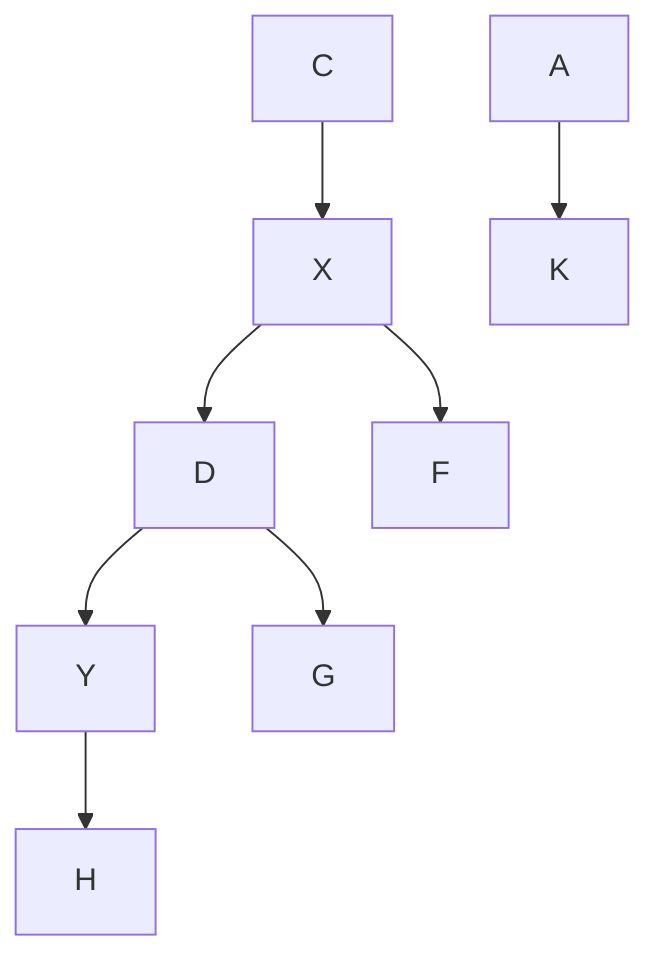

**图 6.5**：只有路径 $X \leftarrow A \rightarrow K \rightarrow Y$ 是从 $X$ 到 $Y$ 的一条“后门路径”。集合 $\mathbf{Z} = \{K\}$ 满足后门准则（见命题 6.41 (ii)）；但 $\mathbf{Z} = \{F, C, K\}$ 也是 $(X, Y)$ 的一个有效调整集；见命题 6.41 (iii)。

**命题 6.41（有效调整集）** 考虑一个在变量集 $\mathbf{X}$ 上的 SCM，其中 $X, Y \in \mathbf{X}$ 且 $Y \notin \mathbf{PA}_X$。那么，以下三个陈述成立。

(i) “父节点调整”：

$$
\mathbf{Z} := \mathbf{PA}_X
$$

是 $(X,Y)$ 的一个有效调整集。

(ii) “后门准则”：任何满足以下条件的 $\mathbf{Z} \subseteq \mathbf{X} \setminus \{X, Y\}$：
* $\mathbf{Z}$ 不包含 $X$ 的后代节点，且
* $\mathbf{Z}$ 阻断所有从 $X$ 到 $Y$ 的、通过后门进入 $X$ 的路径（$X \leftarrow \dots$，见图 6.5）

是 $(X,Y)$ 的一个有效调整集。

(iii) “走向必要性”：任何满足以下条件的 $\mathbf{Z} \subseteq \mathbf{X} \setminus \{X, Y\}$：
* $\mathbf{Z}$ 不包含从 $X$ 到 $Y$ 的有向路径上任何节点的后代（除了那些不在从 $X$ 到 $Y$ 的有向路径上的 $X$ 的后代），且
* $\mathbf{Z}$ 阻断所有从 $X$ 到 $Y$ 的非有向路径

是 $(X,Y)$ 的一个有效调整集。

只有第三个陈述 [Shpitser et al., 2010, Perkovic et al., 2015] 需要一些解释。让我们从一个有效的调整集 $\mathbf{Z}$ 开始，例如通过后门准则获得的。然后，我们可以将任何满足 $Z_0 \perp_{\mathcal{G}} Y \mid X, \mathbf{Z}$ 的节点 $Z_0$ 添加到 $\mathbf{Z}$ 中，因为：

$$
\begin{array}{l} \sum_{\mathbf{z}, z_0} p (y \mid x, \mathbf{z}, z_0) p (\mathbf{z}, z_0) = \sum_{\mathbf{z}} p (y \mid x, \mathbf{z}) \sum_{z_0} p (\mathbf{z}, z_0) \\ = \sum_{\mathbf{z}} p (y | x, \mathbf{z}) p (\mathbf{z}). \\ \end{array}
$$

事实上，命题 6.41 (iii) 刻画了所有有效的调整集 [Shpitser et al., 2010]。

**例 6.42（线性高斯系统中的调整）** 考虑一个在变量集 $\mathbf{V}$ 上的 SCM $\mathfrak{C}$，其中 $\{X, Y\}, \mathbf{Z} \subseteq \mathbf{V}$。有时，我们希望用一个实数来概括从 $X$ 到 $Y$ 的因果效应，而不是对所有 $x$ 考察 $p^{\mathfrak{C}; do(X := x)}(y)$。我们在二值治疗变量 $X$ 的情况下看到了一个例子（见方程 (6.12)）。但在连续随机变量的情况下该怎么办呢？作为一阶近似，我们可以考察该分布的期望，然后对 $x$ 求导：

$$
\frac {\partial}{\partial x} \mathbb{E}^{\mathfrak{C}; do(X := x)} [ Y ]. \tag {6.18}
$$

一般来说，这仍然是 $x$ 的函数。然而，在线性高斯系统中，这个函数是常数。假设 $\mathbf{Z}$ 是 $(X, Y)$ 的一个有效调整集。如果 $\mathbf{V}$ 服从高斯分布，那么条件分布 $Y \mid X = x, \mathbf{Z} = \mathbf{z}$ 也服从高斯分布；其均值为：

$$
\mathbb{E} [ Y \mid X = x, \mathbf{Z} = \mathbf{z} ] = a x + \mathbf{b}^t \mathbf{z} \tag {6.19}
$$

对于某些 $a$ 和 $\mathbf{b}$。根据 (6.13)（见问题 6.63），可得：

$$
\frac {\partial}{\partial x} \mathbb{E}^{\mathfrak{C}; do(X := x)} [ Y ] = a. \tag {6.20}
$$

可以通过两种不同的方式得到 (6.19) 中 $a$ 的值。(1) 可以使用**路径系数法（method of path coefficients）**：如果从 $X$ 到 $Y$ 恰好有一条有向路径，那么 $a$ 等于路径系数的乘积。如果没有有向路径，则 $a = 0$，如果存在多条不同的路径，则可以使用赖特公式 [Wright, 1934] 计算 $a$。(2) 可以直接计算条件均值 (6.19)。如果我们没有联合分布，而是拥有一个来自该分布的样本，我们可以通过将 $Y$ 对 $X$ 和 $\mathbf{Z}$ 进行回归，然后读取 $X$ 的回归系数来估计 (6.20)（另见代码片段 6.43）。□

**代码片段 6.43** 以下代码从一个 SCM 生成大小为 $n=100$ 的独立同分布样本，其结构如图 6.5 所示（系数见代码）。由于我们知道底层的 SCM，量 (6.20) 的真实值可以通过将路径 $X \rightarrow D \rightarrow Y$ 的路径系数相乘得到；在我们的例子中，它等于 $(-2) \cdot (-1) = 2$（见代码中的第 8 行和第 10 行）。我们现在可以假设结构性赋值的确切形式，即系数集是未知的，但我们拥有数据样本和 SCM 的图结构（见图 6.5）。然后，我们可以通过将 $Y$ 对 $X$ 和一个调整集 $\mathbf{Z}$ 进行回归来估计值 (6.20)。如果 $\mathbf{Z}$ 是一个有效的调整集，我们将得到一个无偏估计量。在代码中，调整集 $\mathbf{Z} = \varnothing$ 导致有偏估计量（见第 15 行）；只有调整集 $\mathbf{Z} = \{K\}$ 和 $\mathbf{Z} = \{F, C, K\}$ 是有效的（分别见第 19 行和第 23 行）。

```r

# generate a sample from the distribution entailed by the SCM
set.seed(1); n <- 100
C <- rnorm(n)
A <- 0.8*rnorm(n)
K <- A + 0.1*rnorm(n)
X <- C - 2*A + 0.2*rnorm(n)
F <- 3*X + 0.8*rnorm(n)
D <- -2*X + 0.5*rnorm(n)
G <- D + 0.5*rnorm(n)
Y <- 2*K - D + 0.2*rnorm(n)
H <- 0.5*Y + 0.1*rnorm(n)

#
lm(Y~X)$coefficients

# (Intercept)----X
# 0.09724282 1.27941073
#
lm(Y~X+K)$coefficients
# (Intercept)----X----

# 0.01428974 2.07038809 2.16964827
#
lm(Y~X+F+C+K)$coefficients

# (Intercept)----X----
```

# 0.01687018 1.90495456 0.05901385 -0.02260164 2.18276488

现在我们简要评述**倾向性得分匹配（propensity score matching）**[Rosenbaum and Rubin, 1983]。以下注释重复了 Pearl [2009, 11.3.5] 给出的论证。

**注释 6.44（倾向性得分匹配）** 考虑一个变量 $\mathbf { X } = ( X , Y , \mathbf { Z } )$ 上的**结构因果模型（SCM）**，其中 $\mathbf { Z } = ( Z _ { 1 } , Z _ { 2 } , Z _ { 3 } )$ ，其图结构如下。


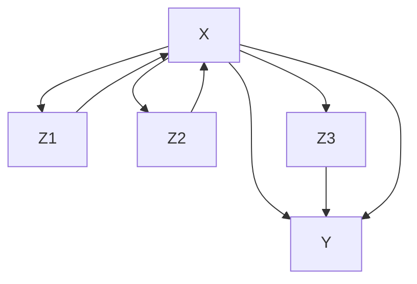

可以看出，集合 $\{ Z _ { 1 } , Z _ { 2 } , Z _ { 3 } \}$ 是一个有效的**调整集（adjustment set）**，例如通过父节点调整（见命题 6.41）。即：

$$
p ^ {\mathfrak {C}; d o (X := x)} (y) = \sum_ {z _ {1}, z _ {2}, z _ {3}} p ^ {\mathfrak {C}} (y | x, z _ {1}, z _ {2}, z _ {3}) p ^ {\mathfrak {C}} (z _ {1}, z _ {2}, z _ {3}). \tag {6.21}
$$

然而，有时 $X$ 的值并不“直接”依赖于 $Z$ ，而仅通过一个（实值）**倾向性得分（propensity score）** $L : = L ( \mathbf { Z } ) = L ( Z _ { 1 } , Z _ { 2 } , Z _ { 3 } )$ 来依赖。这意味着 ${ } ^ { 6 \epsilon } X \perp \perp \mathbf { Z } | L ( \mathbf { Z } )$ ，或者更正式地说，对于所有 $z$ 、 $x$ 和 $\ell = L ( \mathbf { z } )$ ，我们有：

$$
p (\mathbf {z} | \ell , x) = p (\mathbf {z} | \ell).
$$

如果 $X$ 是一个指示是否接受治疗的二元选择，我们可以选择 $L ( \mathbf { z } ) = p ( x = 1 | \mathbf { Z } = \mathbf { z } )$ 作为例子。但随后，由 (6.21) 可得：

$$
\begin{array}{l} p ^ {\mathfrak {C}; d o (X := x)} (y) = \sum_ {\mathbf {z}} p ^ {\mathfrak {C}} (y | x, \mathbf {z}) p ^ {\mathfrak {C}} (\mathbf {z}) = \sum_ {\mathbf {z}} \sum_ {\ell} p ^ {\mathfrak {C}} (y | x, \mathbf {z}) p ^ {\mathfrak {C}} (\ell) p ^ {\mathfrak {C}} (\mathbf {z} | \ell) \\ = \sum_ {\mathbf {z}} \sum_ {\ell} p ^ {\mathfrak {C}} (y | \ell , x, \mathbf {z}) p ^ {\mathfrak {C}} (\ell) p ^ {\mathfrak {C}} (\mathbf {z} | \ell , x) \\ = \sum_ {\ell} p ^ {\mathfrak {C}} (y | \ell , x) p ^ {\mathfrak {C}} (\ell). \tag {6.22} \\ \end{array}
$$

在总体设定中，干预分布的两种计算方式 (6.21) 和 (6.22) 都是正确的。然而，关键在于，对于有限数据，(6.22) 可能比 (6.21) 产生更好的估计：尽管需要估计函数 $L$ ，但得到的条件分布 $p ^ { \mathfrak { C } } ( y | x , \ell )$ 的维度可能低于 $p ^ { \mathfrak { C } } ( y | x , \mathbf { z } )$ 。在实践中，人们通常将具有“相似” $\ell$ 值的实现进行匹配，以计算 (6.22)。重要的实践细节包括估计函数 $L$ 和匹配过程。该思想适用于任意数量的协变量。

在这个意义上，**倾向性得分匹配**可以是一种获得统计性能提升的有效技巧。它对于总体层面的考量无关紧要。

## 6.7 Do-演算（Do-Calculus）

再次考虑变量 $V$ 上的 SCM。有时，我们可以通过除调整公式 (6.13) 之外的其他方式计算干预分布 $p ^ { { \mathfrak { C } } ; d o ( X : = x ) }$ 。让我们

## 6.7 Do-演算

因此称一个干预分布 $p ^ { \mathfrak { C } ; d o ( X : = x ) } ( y )$ 是**可识别的（identifiable）**，如果它可以从观测分布和图结构中计算得到。例如，如果存在 $(X,Y)$ 的一个有效调整集，那么 $p ^ { \mathfrak { C } ; d o ( X : = x ) } ( y )$ 显然是可识别的。Pearl [2009, 定理 3.4.1] 发展了所谓的 **do-演算（do-calculus）**，它由三个规则组成。给定一个图 $\mathcal { G }$ 和不相交的子集 $X$ 、 $Y$ 、 $Z$ 和 $W$ ，我们有：

1. **“观测的插入/删除”**：

$$
p ^ {\mathfrak {C}; d o (\mathbf {X} := \mathbf {x})} (\mathbf {y} | \mathbf {z}, \mathbf {w}) = p ^ {\mathfrak {C}; d o (\mathbf {X} := \mathbf {x})} (\mathbf {y} | \mathbf {w})
$$

如果在删除了 $X$ 中入边的图中， $Y$ 和 $Z$ 被 $X$ 、 $W$ **d-分离（d-separated）**。

2. **“动作/观测交换”**：

$$
p ^ {\mathfrak {C}; d o (\mathbf {X} := \mathbf {x}, \mathbf {Z} = \mathbf {z})} (\mathbf {y} | \mathbf {w}) = p ^ {\mathfrak {C}; d o (\mathbf {X} := \mathbf {x})} (\mathbf {y} | \mathbf {z}, \mathbf {w})
$$

如果在删除了 $X$ 中入边和 $Z$ 中出边的图中， $Y$ 和 $Z$ 被 $X$ 、 $W$ d-分离。

3. **“动作的插入/删除”**：

$$
p ^ {\mathfrak {C}; d o (\mathbf {X} := \mathbf {x}, \mathbf {Z} = \mathbf {z})} (\mathbf {y} | \mathbf {w}) = p ^ {\mathfrak {C}; d o (\mathbf {X} := \mathbf {x})} (\mathbf {y} | \mathbf {w})
$$

如果在删除了 $X$ 和 $Z(W)$ 中入边的图中， $Y$ 和 $Z$ 被 $X$ 、 $W$ d-分离。这里， $Z(W)$ 是在从 $G$ 删除所有进入 $X$ 的边后得到的图中， $Z$ 中不属于 $W$ 中任何节点的祖先节点的子集。

**定理 6.45（Do-演算）** 以下结论成立。

(i) 这些规则是完备的；即所有可识别的干预分布都可以通过迭代应用这三个规则来计算 [Huang and Valtorta, 2006, Shpitser and Pearl, 2006]。  
(ii) 事实上，存在一种由 Tian [2002] 提出的算法，该算法保证 [Huang and Valtorta, 2006, Shpitser and Pearl, 2006] 能找出所有可识别的干预分布。  
(iii) 存在一个必要且充分的图论准则用于判定干预分布的可识别性 [Shpitser and Pearl, 2006, 推论 3]，该准则基于所谓的**篱笆（hedges）**[另见 Huang and Valtorta, 2006]。

作为 do-演算的一个推论，我们得到了**前门调整（front-door adjustment）**（见问题 6.65）。

**示例 6.46（前门调整）** 设 $C$ 是一个 SCM，其对应的图如下：


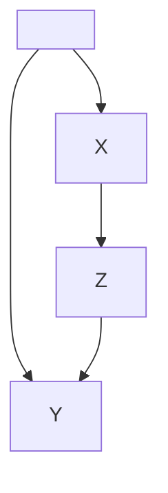

如果我们无法观测到 $U$ ，就不能应用**后门准则（backdoor criterion）**。事实上，不存在有效的调整集。但是，只要 $p ^ { \mathfrak { C } } ( x , z ) > 0$ ，do-演算就为我们提供了：

$$
p ^ {\mathfrak {C}; d o (X := x)} (y) = \sum_ {z} p ^ {\mathfrak {C}} (z | x) \sum_ {\tilde {x}} p ^ {\mathfrak {C}} (y | \tilde {x}, z) p ^ {\mathfrak {C}} (\tilde {x}). \tag {6.23}
$$

除了 $X$ 和 $Y$ 之外还观测 $Z$ 能揭示因果信息这一事实，很好地表明可以通过观测承载从 $X$ 到 $Y$ 的“信号”的“通道”（此处为 $Z$ ）来探索因果关系。

Bareinboim and Pearl [2014] 考虑了**可迁移性（transportability）**问题。他们也对干预分布感兴趣，但允许纳入在目标 SCM 的某些结构赋值上一致、在其他结构赋值上不同的 SCM 中获得的知识（即观测分布和干预分布）。

## 6.8 因果模型的等价性与可证伪性（Equivalence and Falsifiability of Causal Models）

到目前为止，SCM 一直是数学对象。为了将它们与现实联系起来，我们将其视为**数据生成过程（data-generating process）**的模型。然而，它可能是一类复杂的模型。与其仅仅建模一个联合分布（例如我们可以用泊松过程建模一个物理过程），我们现在可以同时建模系统在观测状态和受扰动下的状态。我们已经看到，甚至可以将 SCM 视为反事实陈述的模型。

更正式地说，考虑一个随机变量向量 $\mathbf { X } = \left( X _ { 1 } , \ldots , X _ { d } \right)$ 。一个关于 $X$ 的概率模型预测一个观测分布 $R _ { \mathbf { X } }$ 。我们称这样的模型为**干预模型（interventional model）**，如果它额外预测了某些变量 $X _ { j }$ 被设置为（独立的）变量 $\tilde { N } _ { j }$ 时的干预分布。最后，**反事实模型（counterfactual model）**额外预测反事实陈述的结果。例如，传统的机器学习方法构建概率模型；**因果图模型（causal graphical models）**（定义 6.32）可以用作干预模型，而 SCM 可以用作反事实模型。如果两个模型在相应的预测上一致，我们称它们是等价的 [见 Bongers et al., 2016，类似构造]。

## 定义 6.47（因果模型的等价性） 如果两个模型蕴含相同的

## {概率 / 干预 / 反事实}

分布，则分别称它们为

## {概率等价 / 干预等价 / 反事实等价}

显然，干预等价的概念仅适用于干预模型和反事实模型等。命题 7.1 表明，对于每个概率模型，存在一个观测等价的 SCM。

如果 $X$ 具有严格正密度，命题 6.48 表明我们可以将概念限制在**单节点干预（interventions on single nodes）**上，即某个变量 $X _ { j }$ 被设置为一个分布具有全支撑的变量 $\tilde { N } _ { j }$ 的干预。如果两个模型在这一类干预上一致，那么它们在所有其他干预上也一致。其原理是，单节点干预对应于随机化实验的标准形式。

对于给定的数据生成过程，如果对应的分布与从该过程中观测到的数据不一致，我们就可以证伪一个概率模型或干预模型。也就是说，如果一个干预模型正确预测了观测分布，但没有预测随机化实验中会发生什么，该模型仍然被认为是证伪的。这一概念包含了一个假设，即对于随机化实验应该是什么样子存在共识。当现实中不清楚如何对涉及的变量进行随机化（或对其执行干预）时，应当谨慎地写出 SCM。可证伪性的概念还需要（统计）显著性的概念，此处不讨论。我们不包含反事实模型，因为它们通常很难被证伪。我们可以基于它们对观测分布和干预分布的蕴含来证伪它们（见 Shpitser and Pearl [2008a] 及其参考文献）。然而，在某些特定的实验设置中，有可能构造出可证伪的反事实陈述（见示例 3.4）。然而，示例 6.19 展示了两个 SCM 蕴含相同的观测分布和干预分布，却蕴含不同的反事实陈述。

上述对干预子类（单变量被设置为噪声变量）的限制服务于一个实际目的。为了检验模型的有效性，我们必须将随机化实验的结果与模型的预测进行比较。对于更复杂的干预，现实中相应的实验似乎更难实施。以下命题表明这并不失一般性：如果因果模型在所有单节点干预上一致，则它们是干预等价的。证明见附录 C.7。

**命题 6.48（干预等价性）** 假设两个 SCM（或因果图模型） ${ \mathfrak { C } } _ { 1 }$ 和 ${ \mathfrak { C } } _ { 2 }$ 诱导严格正的、连续的条件密度 $p ( x _ { j } | x _ { p a ( j ) } )$ ，其中 $p a ( j ) : = \mathbf { P } \mathbf { A } _ { X _ { j } }$ ，并且满足**因果最小性（causal minimality）**。进一步假设它们蕴含相同的干预分布，其中某个变量 $X _ { j }$ 被设置为一个具有全支撑的变量 $\tilde { N } _ { j }$ ：

$$
P _ {\mathbf {X}} ^ {\mathfrak {C} _ {1}; d o (X _ {j} := \tilde {N} _ {j})} = P _ {\mathbf {X}} ^ {\mathfrak {C} _ {2}; d o (X _ {j} := \tilde {N} _ {j})} \quad \forall j \forall \tilde {N} _ {j} \text{ 具有全支撑}.
$$

那么，${ \mathfrak { C } } _ { 1 }$ 和 ${ \mathfrak { C } } _ { 2 }$ 在干预上是等价的；也就是说，它们对任何可能的干预都达成一致，包括原子干预或改变父节点集（但不产生环）的干预。

如果密度不是严格正的，情况就不一定如此。此时可能需要对多个节点进行同时干预（例如，双敲除基因实验）；参见问题 6.59。

此外，我们现在能够证明**结构因果模型（Structural Causal Models, SCMs）**结构极小性（structural minimality）这一概念的合理性（见注释 6.6）。我们已经论证，如果 SCM 结构赋值中的函数不依赖于其中一个输入，我们可以选择更稀疏的表示。以下命题形式化了这些表示在何种意义上是等价的。

**命题 6.49（反事实等价性）** 考虑两个 SCM C 和 ${ \mathfrak { C } } ^ { * }$，它们共享相同的噪声分布 $P _ { \mathbf { N } }$，并且仅在**第 k 个结构赋值**上不同：

$$
f _ {k} (\mathbf {p a} _ {k}, n _ {k}) = f _ {k} ^ {*} (\mathbf {p a} _ {k} ^ {*}, n _ {k}), \quad \forall \mathbf {p a} _ {k}, \forall n _ {k} \text {  满足   } p (n _ {k}) > 0, \tag {6.24}
$$

其中 $\mathbf { P A } _ { k } ^ { * } \subseteq \mathbf { P A } _ { k }$ 。那么，这两个 SCM 是反事实等价的。

证明见附录 C.8。

## 6.9 潜在结果（Potential Outcomes）

我们现在介绍一种不基于 SCM 的因果推断替代方法。该框架通常被称为**潜在结果（Potential Outcomes）**或**鲁宾因果模型（Rubin causal model）**，并在社会科学中广泛使用。其思想可追溯到主要讨论随机化实验的 Neyman [1923] 和 Fisher [1925]。Rubin [1974] 将这些思想扩展到观察性研究。Rubin [2005]、Morgan 和 Winship [2007] 以及 Imbens 和 Rubin [2015] 对该主题提供了更详尽的介绍。

### 6.9.1 定义与示例

为了解释潜在结果，我们重新审视示例 3.4（眼科医生）并在此框架中重新表述。我们现在从一组 n 个患者（或单元）$u = 1 , \ldots , n$ 开始，每个患者可能接受治疗，也可能不接受治疗。我们为每个患者 u 分配两个潜在结果：$B _ { u } ( t = 1 )$ 表示如果她接受治疗 $( T = 1 )$ ，患者是否会失明 $( B = 1 )$ 或被治愈 $( B = 0 )$ 。类似地，$B _ { u } ( t = 0 )$ 编码了不接受治疗 $( T = 0 )$ 时会发生什么。这两个潜在结果都被假定为确定性的。对于每个患者，治疗要么有帮助，要么没有帮助：不涉及随机性。如果 $B _ { u } ( t = 1 ) = 0$ 且 $B _ { u } ( t = 0 ) = 1$ ，我们说治疗对单元 u 有正向效果。

然而，在实践中，我们无法检验这些条件。“**因果推断的基本问题（fundamental problem of causal inference）**”[Holland, 1986] 指出，对于每个单元 u，我们只能观察到 $B _ { u } ( t = 1 )$ 或 $B _ { u } ( t = 0 )$ 中的一个，而永远无法同时观察到两者。原因在于，在我们选择治疗一个人后，我们无法回到过去并撤销治疗。反过来也是如此。如果我们决定不给予治疗，我们仍然可以在以后的时间点应用治疗，但这不能再被解释为变量 $B _ { u } ( t = 1 )$ 的一个结果。例如，患者可能在此期间自行康复。因此，我们只能观察到其中一个潜在结果；未观察到的量变成了一个**反事实（counterfactual）**。

表 6.2 显示了前一个示例的一个（假设的）数据集。实际上，这些数据点是根据示例 3.4 中描述的模型采样的。为了证明表 6.2 中呈现的合理性，我们通常隐含地假设**稳定单元处理值假设（Stable Unit Treatment Value Assumption, SUTVA）**[Rubin, 2005]。它指出各单元之间不相互干扰（例如，一个单元的潜在结果不依赖于任何其他单元接受了何种处理）[Cox, 1958]；此外，它还要求潜在结果不依赖于治疗是如何或为何被接受的。我们将在第 6.9.2 节中看到，当数据由 SCM 生成时（正如本例所做的那样），SUTVA 是满足的。

潜在结果告诉我们治疗对个体的影响；我们将**单元级因果效应（unit-level causal effect）**定义为 $B _ { u } ( t = 1 ) - B _ { u } ( t = 0 )$ ，以及**平均因果

**表 6.2：此表使用潜在结果呈现示例 3.4。对于每个患者（或单元），我们只观察到两个潜在结果中的一个。观察到的信息有灰色背景。治疗 T 对几乎所有患者都有帮助。仅在 200 例中有 2 例，治疗对患者有害并导致其失明 $B = 1$ 。虽然在大多数情况下分配治疗 $( T = 1 )$ 是个好主意，但对于患者 $u = 1 2 0$ 来说，这恰恰是个错误的决定。**

| 单元 u | 治疗 T | 潜在结果 Bu(t=0) | 潜在结果 Bu(t=1) | 单元级因果效应 Bu(t=1)-Bu(t=0) |
| --- | --- | --- | --- | --- |
| 1 | 1 | 1 | 0 | -1 |
| 2 | 0 | 1 | 0 | -1 |
| 3 | 1 | 1 | 0 | -1 |
| ⋮ |  |  |  |  |
| 43 | 1 | 1 | 0 | -1 |
| 44 | 0 | 0 | 1 | 1 |
| 45 | 0 | 1 | 0 | -1 |
| ⋮ |  |  |  |  |
| 119 | 1 | 1 | 0 | -1 |
| 120 | 1 | 0 | 1 | 1 |
| 121 | 0 | 1 | 0 | -1 |
| ⋮ |  |  |  |  |
| 200 | 0 | 1 | 0 | -1 |

效应

$$
C E = \frac {1}{n} \sum_ {u = 1} ^ {n} B _ {u} (t = 1) - B _ {u} (t = 0). \tag {6.25}
$$

“因果推断的基本问题”阻止我们直接计算 (6.25)。假设在一个完全随机化实验中，单元 $u \in U _ { 0 } \subset$ $\{ 1 , \ldots , n \}$ 接受了治疗 $T = 0$ ，而单元 $u \in U _ { 1 } = U _ { 0 } ^ { C }$ 接受了治疗 $T = 1$ 。Neyman [1923] 表明

$$
\widehat {C E} := \frac {1}{\# U _ {0}} \sum_ {u \in U _ {0}} B _ {u} (t = 1) - \frac {1}{\# U _ {1}} \sum_ {u \in U _ {1}} B _ {u} (t = 0) \tag {6.26}
$$

是 (6.25) 的一个无偏估计量。这里，$\widehat { C E }$ 中的随机性来自于决定我们观察到单元两个潜在结果中哪一个的随机分配；结果本身被认为是隐藏的，而不是随机的。注意，(6.26) 仅包含可观察的量，因此可以在研究进行后计算。

关于这两种方法中哪一种更适合实际应用，存在广泛的争论 [参见，例如，Pearl, 1995, Imbens and Rubin, 1995, Rubin,2004, Lauritzen, 2004]。我们不打算积极参与这场讨论，而是提及以下三个结果：(1) 我们描述如何将潜在结果表示为反事实 [Pearl, 2009, Section 3.6.3]；(2) 两个框架之间存在逻辑等价性 [Galles and Pearl, 1998, Halpern, 2000]；(3) 我们评论一个最近提出的框架 [Richardson and Robins, 2013]，该框架使两个世界更加接近。

### 6.9.2 潜在结果与 SCM 的关系

在 SCM 中，我们可以使用反事实的语言（第 6.4 节）来表示潜在结果。在眼科医生的例子中，SCM C 满足 $T = N _ { T }$ 和 $B = T \cdot N _ { B } + \left( 1 - T \right) \cdot \left( 1 - N _ { B } \right)$ 。因此，我们可以通过 $N _ { B }$ 和 $N _ { T }$ 的具体值来表示每个患者。例如，在表 6.2 中，患者 43 的特征是 ${ N _ { T } } = 1 , { N _ { B } } = 0$ ，而患者 44 满足 $N _ { T } = 0 , N _ { B } = 1$ 。两个项 $t = 0$ 和 $t = 1$ 对应于对 $T$ 的干预。总结来说，我们有

$$
\underbrace {B _ {u} (t = \tilde {t})} _ {\text { 潜在结果 }} = \underbrace {B \text { 在 SCM } \mathfrak {C} | \mathbf {N} = \mathbf {n} _ {u} ; d o (T : = \tilde {t}) \text { 中 }} _ {\text { 反事实 SCM }}, \tag {6.27}
$$

其中 $\mathbf { n } _ { u }$ 表征单元 u [Pearl, 2009, Equation (3.51)]。由于在反事实 SCM 中，所有噪声项都是确定性的，因此 B 的导出分布也是退化的，并且 B 是确定性的（如所要求的那样）。在表 6.2 所示的示例中，我们使用伯努利分布 $N _ { T } \sim$ Ber(0.6) 和 $N _ { B } \sim \mathrm { B e r } ( 0 . 0 1 )$ 采样了 200 个独立同分布（i.i.d.）的单元。在这种情况下，SUTVA 是满足的。独立同分布假设意味着各单元之间互不干扰，而模块性（对 $T$ 的干预仅改变 T 的结构赋值）意味着治疗方式不影响结果。

我们现在讨论一个结果，该结果显示了 (6.27) 中两种表示在何种意义上是等价的。为此，我们主要遵循 Pearl [2009, 7.3.1] 和 Halpern [2000] 的表述。主要论证基于以下步骤：

1. 定义性质（公理）：(C0)–(C5) 和 (MP) [Halpern, 2000, Section 3]。例如，性质 (C4) 指出

$$
T _ {u} (t = \tilde {t}, w = \tilde {w}) = t;
$$

它假设将单元 u 的变量 T 设为 t 是“有效的”。

2. 这些公理在两种表示中都得到满足（“可靠性”）。  
3. 可以证明这些性质对于反事实 SCM 是完备的。任何反事实陈述都遵循这些公理之一。

4. 我们可以得出结论：任何适用于反事实 SCM 的定理也适用于潜在结果的世界，反之亦然。14 此外，从步骤 3 可以得出，任何满足这三个公理的数据集（如表 6.2 所示）都可以用反事实 SCM 建模。15

然而，这两个世界在语言上有所不同。即使每个定理在两个框架中都成立，某些定理在一个世界中可能比在另一个世界中“更容易”证明。类似地，出现在定理中的任何假设都对底层数据生成过程施加了限制；根据应用的不同，一种表述可能简化对这些限制的评估。处理平均因果效应为零但个体因果效应非零的情况，对于潜在结果框架似乎更容易。另一方面，SCM 的图形表示可能有利于利用关于随机变量之间因果关系的假设。

Richardson 和 Robins [2013] 提出使用**单世界干预图（Single World Intervention Graphs, SWIGs）**。这些图允许我们将变量设置为特定值，从而构建与反事实变量对应的图形关系。这些修改后的图使我们能够读出涉及事实变量和反事实变量的条件独立性陈述。因此，我们可以将这些图视为一个有用的工具，将图形假设转化为潜在结果分析者经常使用的反事实陈述。

## 6.10 关联单一对象的广义结构因果模型

到目前为止，我们研究了随机变量 $X _ { 1 } , \ldots , X _ { d }$ 之间的因果关系，并且只关注数据是从 $P _ { \mathbf { X } }$ 中独立同分布观测的场景。我们现在考虑因果 DAG 的一组节点 $\mathbf { v } = \{ x _ { 1 } , \ldots , x _ { d } \}$，这些节点由任意数学对象 $x _ { 1 } , \ldots , x _ { d }$ 组成，形式化了观测的概念。例如，在观察到不同作者所写文本 $x _ { 1 } , \ldots , x _ { d }$ 之间的相似性后，人们可能会对因果关系感兴趣，即哪位作者影响了哪位作者。遵循 Steudel 等人 [2010] 的工作，我们现在描述，在给定适当的信息概念时，底层 DAG 如何也在不涉及统计抽样的意义上蕴含条件独立性陈述。为此，我们假设给定某个**信息函数**

$$
R: 2 ^ {\mathbf {V}} \to \mathbb {R} _ {0} ^ {+},
$$

该函数是单调的，即一个节点集包含的信息不会超过其任何超集。那么，对于任意两个节点集 $\mathbf { x } , \mathbf { y } \subseteq \mathbf { v }$ ，表达式 $R ( \mathbf { x } , \mathbf { y } ) - R ( \mathbf { y } )$ 是非负的，并且可以解释为在给定 $\mathbf { y }$ 条件下 $\mathbf { x }$ 的条件信息。此外，我们假设 R 使得对于任意三个不相交的节点集 $\mathbf { x } , \mathbf { y } , \mathbf { z }$ ，表达式

$$
I (\mathbf {x}: \mathbf {y} | \mathbf {z}) := R (\mathbf {x}, \mathbf {z}) + R (\mathbf {y}, \mathbf {z}) - R (\mathbf {x}, \mathbf {y}, \mathbf {z}) - R (\mathbf {z}) \tag {6.28}
$$

是非负的，当且仅当 R 是**子模（submodular）**时成立（见第 9.5.2 节）。那么，我们可以将 (6.28) 解释为在给定 $\mathbf { z }$ 条件下 $\mathbf { x }$ 和 ${ \bf y }$ 之间的广义条件互信息，因为 $R ( \mathbf { x } , \mathbf { z } ) - R ( \mathbf { z } )$ 测量了在给定 $\mathbf { z }$ 条件下 $\mathbf { x }$ 的信息，而 $R ( \mathbf { x } , \mathbf { y } , \mathbf { z } ) - R ( \mathbf { y } , \mathbf { z } )$ 是在给定 $\mathbf { y }$ 和 $\mathbf { z }$ 条件下 $\mathbf { x }$ 的信息。同样地，随机变量之间的条件互信息可以写成香农熵的差 [Cover and Thomas, 1991]。如果 (6.28) 为零，我们称在给定 $\mathbf { z }$ 条件下 $\mathbf { x }$ 和 $\mathbf { y }$ 条件独立。

为了定义广义 SCM，我们为每个观测节点 $x _ { j }$ 引入一个未观测的噪声对象 $n _ { j }$ ，并假设以下陈述。

**原则 6.50（无额外信息）** 节点 $x _ { j }$ 在其父节点集 $\mathbf { p } \mathbf { a } _ { j }$ 和未观测节点 $n _ { j }$ 所包含的信息之上不包含额外信息，即

$$
R (x _ {j}, \mathbf {p a} _ {j}, n _ {j}) = R (\mathbf {p a} _ {j}, n _ {j}).
$$

这推广了每个随机变量 $X _ { j }$ 由其父变量和噪声变量决定的假设，对于离散随机变量，这相当于说 $X _ { j } , \mathbf { P A } _ { j } , N _ { j }$ 的香农熵与 $\mathbf { P A } _ { j } , N _ { j }$ 的熵相同。

SCM 的第二个关键假设是噪声项的统计独立性。该假设的广义版本如下：

**原则 6.51（未观测对象的独立性）** 未观测节点 $n _ { j }$ 彼此之间不包含信息，即

$$
R (n _ {1}, \dots , n _ {d}) = \sum_ {j = 1} ^ {d} R (n _ {j}).
$$

Steudel 等人 [2010] 证明了以下定理。

**定理 6.52（广义因果马尔可夫条件）** 如果原则 6.50 和 6.51 同时成立，那么对于任意三个节点集，如果 $\mathbf { x }$ 和 $\mathbf { y }$ 被 $\mathbf { z }$ d-分离（d-separated），则在给定 $\mathbf { z }$ 的条件下 $\mathbf { x }$ 和 $\mathbf { y }$ 条件独立。

为了将这些概念应用于文本示例，让我们将文本视为其有意义单词的集合，并令其信息 R 为不同单词的数量。假设 d 个文本 $x _ { 1 } , \ldots , x _ { d }$ 之间的影响由以下简化机制给出：$x _ { j }$ 的作者从 $x _ { j }$ 的父文本中取一些单词，并从自己的思想中添加一些单词。这些额外单词由 $n _ { j }$ 给出。那么，根据 $n _ { j }$ 的定义，原则 6.50 得到满足。根据原则 6.51，不同作者添加的单词被假定为不同的。如果两个文本共有的单词都已出现在第三个文本中，则它们在给定第三个文本的条件下条件独立。该示例表明，对于比随机变量更广泛的对象类别，可以定义合理的条件独立性概念。为了确保因果马尔可夫条件相对于该特定的独立性概念成立，底层的信息度量需要根据原则 6.50 和 6.51 的意义，适合于所考虑的特定因果机制类别。

Janzing 和 Scholkopf [2010] 使用 **柯尔莫哥洛夫复杂度（Kolmogorov complexity）** $K$（相对于某个固定的图灵机 $T$，参见第 4.1.9 节）来量化二进制字符串之间的信息。函数 $K$ 在 $O(1)$ 项内是近似**子模（submodular）**的，即误差不会随所考虑字符串的大小而增长。然后，Janzing 和 Scholkopf [2010] 定义了一个“因果的算法模型”，其中 $T$ 从每个 $x _ { j }$ 的父节点和一个噪声字符串 $n _ { j }$ 计算出 $x _ { j }$，这确保了**原则 6.50**。每个 $n _ { j }$ 也可以被解释为从其父节点计算 $x _ { j }$ 的程序，即从其直接原因生成 $x _ { j }$ 的机制。那么，**原则 6.51** 就相当于机制的独立性（参见**原则 2.1**）。16 将**定理 6.52** 应用于 $R = K$ 得到了“**算法马尔可夫条件（algorithmic Markov condition）**” [Janzing 和 Scholkopf, 2010]：每当 $x$ 和 $y$ 被 $z$ **d-分离（d-separated）**时，知道 $y$ 并不能使得相对于一台将 $z$ 作为自由背景信息的图灵机而言，对 $x$ 有更短的描述。

在更高的层面上，这涉及因果推理的一个深层问题：“观察之间的依赖关系仅当它们存在因果关联时才发生”（**原则 1.1** 的推广）这一陈述，仅当依赖度量对于所考虑的观测类别和潜在因果机制类别是恰当的时才成立。例如，在观察到过去十年中一个孩子的身高增加了，同时某只股票的价值也上涨了之后，人们不会推断它们之间存在因果关系，因为增长是许多时间序列共有的属性，而它们之间并无因果关系。只有当两个时间序列共享更复杂的增长（和/或下降）模式时，我们才会探寻这种相似性背后的共同原因。由于非平稳时间序列无处不在，寻找那些我们认为其依赖关系能指示因果关系的信息度量（如果在通过搜索大型数据库发现时间序列后充分考虑了多重检验问题）将是非常有趣的。从更应用性的机器学习角度来看，这个问题引导我们构建合适的特征，使得特征空间中的相似性能够指示因果关系。

## 6.11 条件分布的算法独立性（Algorithmic Independence of Conditionals）

第 6.10 节表明，因果结构不仅蕴含统计（条件）独立性，也蕴含关于其他（非统计）信息度量的独立性。我们进一步看到，马尔可夫条件也可以针对算法信息来表述。那么，算法马尔可夫条件最基本的含义是**赖兴巴赫原理（Reichenbach’s principle）**在算法依赖关系上的类比。两个对象只有在具有共同原因或其中一个影响另一个时，才可能算法上依赖 [Janzing 和 Scholkopf, 2010]。这是因为否则它们会被空集 d-分离，因此是独立的。同样，因果上不相关的 $d$ 个对象 $x _ { 1 } , \ldots , x _ { d }$ 是联合算法独立的，即：

$$
K (x _ {1}, \dots , x _ {d}) \stackrel {+} {=} \sum_ {j = 1} ^ {d} K (x _ {j}). \tag {6.29}
$$

也可以将左侧和右侧的差称为**多信息（multiinformation）**（类比统计信息论中的相应术语），并将联合独立性写为：

$$
I (x _ {1}, x _ {2}, \dots , x _ {d}) \stackrel {\pm} {=} 0. \tag {6.30}
$$

那么，联合独立性也蕴含每个子集的独立性。例如，如果对 $x _ { 1 } , x _ { 2 }$ 的联合描述比分别描述 $x _ { 1 }$ 和 $x _ { 2 }$ 更短，那么对 $x _ { 1 } , \ldots , x _ { d }$ 的联合描述自动比分别描述所有 $x _ { j }$ 更短，因此 (6.30) 蕴含：

$$
I (x _ {1}: x _ {2}) \stackrel {+} {=} 0.
$$

如果现在我们假设因果图模型中的条件分布17 $P _ { X _ { j } | \mathbf { P A } _ { j } }$ 是“由自然独立选择的”，那么我们得出结论，它们是联合算法独立的 [Janzing 和 Scholkopf, 2010, Lemeire 和 Janzing, 2013]，并陈述**原则 4.13** 的多变量版本。

**原则 6.53（条件分布的算法独立性，Algorithmic Independence of Conditionals, AIC）** 由**定义 6.21 (iii)** 中因果贝叶斯网络中的马尔可夫核所描述的因果条件分布是算法独立的，即：

$$
I (P _ {X _ {1} | \mathbf {P A} _ {1}}, P _ {X _ {2} | \mathbf {P A} _ {2}}, \dots , P _ {X _ {d} | \mathbf {P A} _ {d}}) \stackrel {\pm} {=} 0, \tag {6.31}
$$

或者等价地：

$$
K (P _ {X _ {1}, \ldots , X _ {d}}) \stackrel {+} {=} \sum_ {j = 1} ^ {d} K (P _ {X _ {j} | P A _ {j}}). \tag {6.32}
$$

注意，**原则 6.53** 不得与第 6.10 节讨论的算法马尔可夫条件混淆。后者涉及 $n$ 个单一对象之间的因果关系，而不涉及统计抽样，而前者仍然假设传统的具有 $n$ 个随机变量的独立同分布（i.i.d.）设定，并且仅陈述了一个额外的推理原则。

对于双变量情况，(6.31) 和 (6.32) 的等价性是直接的，因为描述联合分布等价于描述所有因果马尔可夫核。换句话说，AIC 指出，联合分布的最短描述是通过分别描述因果马尔可夫核给出的。

**因果忠实性（Causal faithfulness）** 和 AIC 在精神上是相关的，并且常常得出相似的结论。为了讨论异同，我们重新审视**示例 6.34**。由于参数 $a$ 描述了 $P _ { Y | X }$，而参数 $( b , c )$ 描述了条件分布 $P _ { Z | X , Y }$，我们有：

$$
I (P _ {Y | X}: P _ {Z | X, Y}) \overset {+} {\geq} I (a: (b, c)). \tag {6.33}
$$

这是因为两个对象之间的算法互信息不能通过将注意力限制在它们的某些“方面”而增加；例如，参见 Janzing 和 Scholkopf [2010, Lemma 6]。当线性模型的结构系数满足：

$$
a \cdot b + c = 0. \tag {6.34}
$$

时，会出现“非泛型”独立性 $X \perp \perp Z$。那么 $K ( a | b , c ) \overset { + } { = } 0$，因为可以通过一个长度为 $\mathcal { O } ( 1 )$ 的程序从 $b , c$ 计算出 $a$。因此：

$$
I (a: (b, c)) \stackrel {+} {=} K (a) - K (a | (b, c) ^ {*}) \stackrel {+} {=} K (a).
$$

我们得出结论，只要 $K ( a )$ 显著大于 0，AIC 就被违反。对于一个泛型的实数 $a$，$K ( a )$ 随所需的（相对）精度对数增长。那么 AIC 会拒绝相应的因果有向无环图（DAG），因为 (6.34) 被认为是一个不太可能的巧合。

我们必须解释“只要 $K ( a )$ 显著大于 $0$”这个短语，因为它体现了 AIC 和忠实性之间的概念差异。例如，假设 $b = c$ 且 $a = - 1$。那么 (6.34) 满足，然而当 $b$ 和 $c$ 已知时，对 $a$ 的描述并未变短，因为 $K ( a )$ 已经可以忽略不计。因此，尽管满足 (6.34)，AIC 并未被违反，这似乎表明了参数的精细调整。遵循 Lemeire 和 Janzing [2013] 的观点，我们现在论证为什么我们认为不拒绝这种调整是 AIC 的一个特性而非缺陷。其思想是，结构系数 ±1（达到给定的精度）在自然界中发生的频率远高于某个“更泛型”的值，例如 2.36724...。例如，花费一些钱 $S$ 会使可用金额 $A$ 减少 $-S$。因此，$S$ 和 $A$ 之间的因果关系由18结构系数 −1 描述。隐含地，AIC 和我们的论证基于一个先验，该先验认为具有短描述长度的值更可能（与 Solomonoff 的归纳推理理论一致 [Solomonoff, 1964]）。

AIC 的另一个特点是它也拒绝不同路径的几乎抵消：例如，假设 $a$ 非常接近 $- c / b$。为了在这种情况下估计 $I ( a : ( b , c ) )$，我们观察到：

$$
I (a: (b, c)) \stackrel {+} {\geq} I (a: (c / b))
$$

并使用以下思想。两个彼此接近的整数 $n, m$ 的算法互信息通常约为 $\log n / | m - n |$，因为在已知 $m$ 后描述 $n$ 需要大约 $\log \left| n - m \right|$ 比特，而否则需要大约 $\log n$ 比特。在任意精细离散化之后，我们可以将 $a$ 和 $c / b$ 表示为整数，并将 $\log [ a / ( a + c / b ) ]$ 作为 $P _ { Y | X }$ 和 $P _ { Z | X , Y }$ 之间算法互信息的粗略估计。

## 6.12 习题（Problems）

**习题 6.54（有向无环图）** 第 223 页的表 B.1 指出，对于三个节点，有 25 个 DAG。为什么会这样？

**习题 6.55（多变量结构因果模型）** 考虑以下结构因果模型 $\mathfrak{C}$：

$$
V := N _ {V}
$$

$$
W := - 2 V + 3 Y + 5 Z + N _ {W}
$$

$$
X := 2 V + N _ {X}
$$

$$
Y := - X + N _ {Y}
$$

$$
Z := \alpha X + N _ {Z}
$$

其中 $N _ { V } , N _ { W } , N _ { X } , N _ { Y } , N _ { Z } \stackrel { i i d } { \sim } \mathcal { N } ( 0 , 1 )$。

a) 画出与该 SCM 对应的图。
b) 设置 $\alpha = 2$ 并从联合分布中模拟 200 个 i.i.d. 数据点；绘制 $X$ 和 $W$ 的值以可视化分布 $P _ { X , W } ^ { \mathfrak { C } }$。
c) 再次设置 $\alpha = 2$，并从干预分布中采样 200 个 i.i.d. 数据点：

$$
P _ {X, W} ^ {\mathfrak {C}; d o (X := 3)}
$$

其中我们对 $X$ 进行了干预。再次绘制样本并与 b) 部分的图进行比较。
d) 从一个节点到另一个节点的有向路径并不一定意味着前一个节点对后一个节点有因果效应。选择一个 $\alpha$ 值，并证明对于该值，$X$ 对 $W$ 没有因果效应。
e) 对于任意给定的 $\alpha$，计算：

$$
\frac {\partial}{\partial x} \mathbb {E} ^ {\mathfrak {C}; d o (X := x)} [ W ].
$$

**习题 6.56（干预）** 考虑 SCM：

$$
\begin{array}{l} X := N _ {X} \\ Y := (X - 4) ^ {2} + N _ {Y} \\ Z := X ^ {2} + Y ^ {2} + N _ {Z} \\ \end{array}
$$

其中 $N _ { X } , N _ { Y } , N _ { Z } \stackrel { i i d } { \sim } \mathcal { N } ( 0 , 1 )$。你可以对 $X$ 或 $Y$ 进行干预。哪种硬干预（hard intervention）能使 $Z$ 的期望值最小？

**习题 6.57（最小性）** 我们在**注释 6.6** 中指出，**因果最小性（causal minimality）**（**定义 6.33**）蕴含**结构最小性（structural minimality）**。

a) 请自行确认这一点已由**命题 6.49** 证明。
b) 给出一个满足结构最小性但违反因果最小性的 SCM 示例。

**习题 6.58（因果最小性）** 考虑一个因果图模型，其分布具有严格正、连续的密度，并且违反了因果最小性。根据**命题 6.36**，我们可以从图中移除一条“非活跃”边，并获得一个新的因果图模型。证明这两个模型在干预上是等价的。

**习题 6.59（干预等价性）** 考虑两个 SCM ${\mathfrak {C}} _ {1}$ 和 ${\mathfrak {C}} _ {2}$，形式如下：

$$
\begin{array}{l} X := N _ {X} \\ Y := X + N _ {Y} \\ Z := f _ {j} (X, Y) + N _ {Z} \\ \end{array}
$$

其中 $N _ { X } , N _ { Y } , N _ { Z } \stackrel { i i d } { \sim } \mathcal { U } ( - 1 , 1 )$，这是一个介于 −1 和 1 之间的连续均匀分布。选择函数 $f _ { 1 }$ 和 $f _ { 2 }$，使得 ${\mathfrak {C}} _ {1}$ 和 ${\mathfrak {C}} _ {2}$ 在观测上等价，并且在所有单节点干预上一致，但在同时对多个节点进行干预时不一致。该问题表明，如果密度不是严格正的，**命题 6.48** 不一定成立。

**习题 6.60（循环 SCM）** 证明：只要方阵 $B$ 的特征值的绝对值严格小于 1（即 $B$ 的谱半径严格小于 1），那么 $I - B$ 是可逆的。

<!-- footnote -->

- 我们不允许多次干预保持结构方程中的函数固定而只改变噪声分布；参见 (6.5)。
- 该术语与因果最小性（**定义 6.33**）不一致。因果最小性蕴含结构最小性（**命题 6.49**），但反之不成立；参见**习题 6.57**。

<!-- footnote end -->

<!-- footnote -->

- 尽管只要不引入循环，父节点集可以任意改变，但我们主要考虑干预，其中新的父节点集 $\bar { \mathbf { P A } } _ { k }$ 要么为空，要么等于 $\mathbf { P A } _ { k }$。
- 这也被称为理想的（ideal）、结构的（structural）[Eberhardt 和 Scheines, 2007]、外科手术式的（surgical）[Pearl, 2009]、独立的（independent）或确定性的（deterministic）[Korb et al., 2004] 干预。
- 这也被称为参数的（parametric）[Eberhardt 和 Scheines, 2007] 或依赖的（dependent）干预 [Korb et al., 2004]，或简称为机制改变（mechanism change）[Tian 和 Pearl, 2001]。关于软干预（soft intervention）这一术语，参见 Eberhardt 和 Scheines [2007]、Eaton 和 Murphy [2007] 以及 Markowetz et al. [2005]。

<!-- footnote end -->

<!-- footnote -->

- 在连续情况下，该定义会带来测度论问题，因为通常……

<!-- footnote end -->

<!-- footnote -->

- ……条件分布仅在零测集意义下定义。为简化处理，我们将反事实限制在离散情况，即噪声分布具有概率质量函数的情况。在具有密度的连续变量情况下，我们不条件于 $\mathbf { X } = \mathbf { x }$，而是条件于 $P ( \mathbf { X } \in A ) > 0$ 的 $\mathbf { X } \in A$。
- Pearl [2009] 使用了更简单的记号 $Z _ { y } ( \mathbf { u } )$，其中下标 $y$ 表示干预 $do ( Y : = y )$，而 $u$ 表示关于误差项的额外信息，他称之为 $u$，这些信息可能由 $\mathbf { X } = \mathbf { X }$ 等隐含给出。

<!-- footnote end -->

<!-- footnote -->

- 在此示例中，观测分布相对于底层图（此处为 $X _ { 1 } \right. X _ { 3 } \left. X _ { 2 } )$）满足因果最小性；参见**定义 6.33**。另一个示例可以在第 3.4 节中找到；它不那么复杂，但违反了因果最小性。

<!-- footnote end -->

<!-- footnote -->

- 注意，第 3.4 节中描述的参数化自由度始终存在。

<!-- footnote end -->

<!-- footnote -->

- 在本书中，我们总是考虑相对于乘积测度的密度。

<!-- footnote end -->

<!-- footnote -->

- 更准确地说，它不是三角忠实（triangle-faithful）的 [Zhang 和 Spirtes, 2008]。

<!-- footnote end -->

<!-- footnote -->

- 注意，条件分布 $p ^ { \mathfrak { C } } ( x _ { j } | x _ { p a ( j ) } )$ 甚至可以针对 $p ^ { \mathfrak { C } } ( x _ { p a ( j ) } ) = 0$ 的值 $x _ { p a ( j ) }$ 来定义。

<!-- footnote end -->

<!-- footnote -->

- 严格来说，“反之亦然”要求潜在结果框架不假设超出所提及公理的内容。
- 如果没有 SCM 可能生成该数据集，这意味着来自 SCM 的反事实将满足另一个不被这三个公理蕴含的性质，即该数据集无法被生成的性质。

<!-- footnote end -->

<!-- footnote -->

- 这样，图 2.2 的第二和第三分支可以被视为重合。字符串 $n _ { j }$ 对机制（即在图灵机上运行的程序）进行编码，同时它也是统计设定中噪声项的类比。

<!-- footnote end -->

<!-- footnote -->

- 如前所述，我们使用记号 $P _ { Y | \mathbf { X } }$ 作为条件分布集合 $( P _ { Y | \mathbf { X } = \mathbf { X } } ) _ { \mathbf { X } }$ 的简写。

<!-- footnote end -->

<!-- footnote -->

- 该示例表明，结构系数简单通常是我们定义变量的方式的结果，而不是“自然”的属性。总的来说，人们可能会思考我们在多大程度上以产生简单因果关系的方式来定义变量。

<!-- footnote end -->

**习题 6.61（循环 SCM）** 考虑**注释 6.5** 中描述的赋值 $\begin{array} { r } { \mathbf { X } : = B \mathbf { X } + \mathbf { N } , } \end{array}$。证明：如果 $B$ 的谱半径严格小于 1，那么由方程 (6.3) 中 $\mathbf { X } ^ { t } : = B \mathbf { X } ^ { t - 1 } + \mathbf { N }$ 定义的 $X_t$ 在分布上收敛于方程 (6.2) 中定义的 $\mathbf { X } : = ( I - B ) ^ { - 1 } \mathbf { N }$。

**习题 6.62（d-分离）** 证明：在 DAG $G$ 中，可以 d-分离任何两个没有直接边相连的节点。使用此陈述证明**命题 6.35**。

**习题 6.63（协变量调整）** 假设 $Z$ 是从 $X$ 到 $Y$ 的因果效应的一个有效调整集，并且 $(Y, X, Z)$ 具有（零均值）高斯分布，其中：

$$
\mathbb {E} [ Y \mid X = x, \mathbf {Z} = \mathbf {z} ] = a x + \mathbf {b} ^ {t} \mathbf {z}.
$$

证明：

$$
\frac {\partial}{\partial x} \mathbb {E} ^ {\mathfrak {C}; d o (X := x)} [ Y ] = a;
$$

换句话说，使用方程 (6.19) 和 (6.13) 证明方程 (6.20)。该结果允许我们通过将 $Y$ 对 $X$ 和 $Z$ 进行回归来一致地估计因果效应 $a$。

**习题 6.64（协变量调整）** 使用方程 (6.17) 证明**命题 6.41** 中的父节点调整准则和后门准则 (i) 和 (ii)。

**习题 6.65（协变量调整）** 从下式开始证明前门准则 (6.23)：

$$
p ^ {\mathfrak {C}; d o (X := x)} (y) = \sum_ {z} p ^ {\mathfrak {C}; d o (X := x)} (y | z, x) p ^ {\mathfrak {C}; d o (X := x)} (z)
$$

然后使用 do-演算（第 6.7 节）中的规则 2 和规则 3。