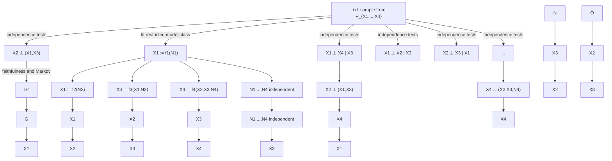

# 学习多变量因果模型（Learning Multivariate Causal Models）

与第4章类似，我们现在转向**学习因果模型（learning causal models）**的问题。我们首先在7.1节（"结构可识别性"）讨论不同的假设，在这些假设下（部分）图结构可以从联合分布中恢复。其中一些结果从之前讨论的双变量情形中延续而来。与双变量情形一样，目前尚无对可识别性假设的完整刻画，未来的研究可能会揭示有前景的替代方案。在7.2节中，我们随后介绍从有限数据集中估计图结构的方法和算法，例如基于独立性的方法和基于评分的方法（"结构识别"）。

与双变量情形一样，我们再次面临**结构因果模型（Structural Causal Models, SCMs）**类别过于灵活的问题。给定随机变量 $\mathbf { X } = \left( X _ { 1 } , \ldots , X _ { d } \right)$ 上的分布 $P _ { \mathbf { X } }$ ，不同的SCM能否蕴含该分布？以下命题回答了这个问题：实际上，通常对于许多不同的图结构，都存在一个SCM能够诱导出分布 $R _ { \mathbf { X } }$ 。1

**命题7.1（图结构的非唯一性）** 考虑一个随机向量 $\mathbf { X } = \left( X _ { 1 } , \ldots , X _ { d } \right)$ ，其分布 $P_X$ 相对于**勒贝格测度（Lebesgue measure）**具有密度，并假设该分布相对于 ${ \mathcal { G } }$ 是**马尔可夫性（Markovian）**的。那么存在一个具有图 $G$ 的SCM ${ \mathfrak { C } } = ( \mathbf { S } , R _ { \mathbf { N } } )$ ，它蕴含分布 $P _ { \mathbf { X } }$ 。

**证明**：见附录C.9。

特别地，给定任意一个**完全有向无环图（complete DAG）**，我们都可以找到一个对应的SCM来蕴含当前分布。与双变量情形一样，显然我们需要进一步的假设才能获得可识别性结果。以下部分讨论其中一些假设。

## 7.1 结构可识别性（Structure Identifiability）

### 7.1.1 忠实性（Faithfulness）

如果分布 $P _ { \mathbf { X } }$ 相对于底层**有向无环图（DAG）** $\mathcal { G } ^ { 0 }$ 既是马尔可夫性的又是**忠实性（faithful）**的，那么图 $\mathcal { G } ^ { 0 }$ 中的**d-分离（d-separation）**陈述与分布中相应的**条件独立性（conditional independence）**陈述之间存在一一对应关系。因此，所有位于 $\mathcal { G } ^ { 0 }$ 的正确**马尔可夫等价类（Markov equivalence class）**之外的图都可以被拒绝，因为它们施加了一组不等于 $P _ { \mathbf { X } }$ 中条件独立性集合的d-分离集合。由于**马尔可夫条件（Markov condition）**和忠实性都仅对联合分布中的条件独立性施加限制，因此我们显然无法区分两个**马尔可夫等价（Markov equivalent）**的图，即两个蕴含完全相同条件独立性集合的图（例如，参见第103页图6.4）。总之，在马尔可夫条件和忠实性假设下，由 $\mathrm { C P D A G } ( \mathcal { G } ^ { 0 } )$ 表示的 $\mathcal { G } ^ { 0 }$ 的**马尔可夫等价类（Markov equivalence class）**可以从 $P _ { \mathbf { X } }$ 中识别出来 [例如，Spirtes et al., 2000]。

**引理7.2（马尔可夫等价类的可识别性）** 假设 $P _ { \mathbf { X } }$ 相对于 $\mathcal { G } ^ { 0 }$ 既是马尔可夫性的又是忠实性的。那么，对于每个图 $\mathcal { G } \in C P D A G ( \mathcal { G } ^ { 0 } )$ ，我们都能找到一个蕴含分布 $R _ { \mathbf { X } }$ 的SCM。此外，不存在任何图 $\mathcal { G }$ 使得 $\mathcal { G } \notin C P D A G ( \mathcal { G } ^ { 0 } )$ 且 $P _ { \mathbf { X } }$ 相对于 $\mathcal { G }$ 既是马尔可夫性的又是忠实性的。

**证明**：第一个陈述是命题7.1的直接推论，第二个陈述来自定义6.24中马尔可夫等价的定义。

**基于独立性的方法（Independence-based methods）**（也称为**基于约束的方法（constraint-based methods）**）假设分布相对于底层图既是马尔可夫性的又是忠实性的，然后估计正确的马尔可夫等价类；参见7.2.1节。

我们在例6.42中看到，对于**高斯分布（Gaussian distributions）**，因果效应可以归纳为一个单一数字（6.20）。如果我们不是知道正确的图，而只知道该图的马尔可夫等价类，那么这个量就不再是可识别的。然而，可以提供其界限 [Maathuis et al., 2009]。

### 7.1.2 加性噪声模型（Additive Noise Models）

命题7.1表明，一个给定的分布可能由多个具有不同图的SCM所蕴含。然而，对于其中许多图结构，结构方程中出现的函数 $f _ { j }$ 相当复杂。事实证明，如果我们不允许任意复杂的函数，即如果我们限制函数类，就能获得非平凡的可识别性结果。正如我们在第4章中已经看到的，在以下7.1.4节和7.1.5节中，我们将假设噪声以**加性（additive）**方式作用。

**定义7.3（ANMs）** 如果结构方程具有以下形式，我们称SCM C为**加性噪声模型（ANM）**：

$$
X _ {j} := f _ {j} (\mathbf {P A} _ {j}) + N _ {j}, \quad j = 1, \dots , d, \tag {7.1}
$$

即噪声是加性的。为简单起见，我们进一步假设函数 $f _ { j }$ 是可微的，且噪声变量 $N _ { j }$ 具有严格正的概率密度。2

以下一些可识别性结果假设**因果极小性（causal minimality）**（定义6.33）。对于ANM，这意味着每个函数 $f _ { j }$ 在其任何参数上都不是常数。直观上，函数应该真正"依赖"于其参数。以下命题的证明见附录C.10。

**命题7.4（因果极小性与ANMs）** 考虑由模型（7.1）诱导的分布，并假设函数 $f _ { j }$ 在其任何参数上都不是常数，即对于所有 $j$ 和 $i \in \mathbf { P } \mathbf { A } _ { j }$ ，存在变量 $\mathbf { P A } _ { j } \backslash \{ i \}$ 的某个值 $\mathbf { p } \mathbf { a } _ { j , - i }$ 以及某些 $x _ { i } \neq x _ { i } ^ { \prime }$ ，使得

$$
f _ {j} (\mathbf {p a} _ {j, - i}, x _ {i}) \neq f _ {j} (\mathbf {p a} _ {j, - i}, x _ {i} ^ {\prime}).
$$

那么联合分布相对于相应的图满足因果极小性。反之，如果存在节点 $j$ 和 $i$ 使得对于所有 $\mathbf { p } \mathbf { a } _ { j , - i }$ ，函数 $f _ { j } ( \mathbf { p a } _ { j , - i } , \cdot )$ 是常数，则违反了因果极小性。

我们在注6.6中已经论证过，我们可以将自身限制在其某个参数上不是常数的函数；参见命题6.49。现在我们已经看到，对于具有全支撑噪声的ANM，这一限制意味着因果极小性。

给定（7.1）中描述的受限SCM类别，我们能否获得完全的结构可识别性？答案仍然是否定的。定理4.2和问题7.13表明，如果分布是由线性高斯SCM诱导的，例如，我们不一定能恢复正确的图。然而，事实证明，这种情况在以下意义上是例外的。对于几乎所有的其他函数和分布组合，我们都能获得可识别性。所有不可识别的情况都已被刻画 [Zhang and Hyvarinen, 2009; Peters et al., 2014]。另一个不同于线性高斯情形的不可识别例子如图4.2右侧图所示。其细节可在Peters et al. [2014, 例25]中找到。表7.1显示了一些已知的可识别性结果。

**表7.1：高斯噪声下一些已知可识别性结果的总结。非高斯噪声下的可识别性结果也存在，但更具技术性。**

| 结构方程类型 | 结构方程类型 | 函数条件 | DAG可识别性 | 参见 |
| --- | --- | --- | --- | --- |
| (一般) SCM: | $X_{j} := f_{j}(X_{\mathbf{PA}_{j}}, N_{j})$ | — | ✗ | 命题7.1 |
| ANM: | $X_{j} := f_{j}(X_{\mathbf{PA}_{j}}) + N_{j}$ | 非线性 | √ | 定理7.7(i) |
| CAM: | $X_{j} := \sum_{k \in \mathbf{PA}_{j}} f_{jk}(X_{k}) + N_{j}$ | 非线性 | √ | 定理7.7(ii) |
| 线性高斯: | $X_{j} := \sum_{k \in \mathbf{PA}_{j}} \beta_{jk} X_{k} + N_{j}$ | 线性 | ✗ | 问题7.13 |
| 线性高斯，等误差方差: | $X_{j} := \sum_{k \in \mathbf{PA}_{j}} \beta_{jk} X_{k} + N_{j}$ | 线性 | √ | 命题7.5 |

让我们再次提到，ANM框架有若干扩展。例如，Zhang and Hyvarinen [2009] 允许变量的**后非线性变换（post-nonlinear transformation）**，而Peters et al. [2011a] 考虑了针对离散变量的ANM。

一般来说，非线性ANM在**边缘化（marginalization）**下不是封闭的。也就是说，如果 $P _ { X , Y , Z }$ 允许从 $X$ 到 $Y$ 以及从 $Y$ 到 $Z$ 的ANM，那么 $P _ { X , Z }$ 不一定允许从 $X$ 到 $Z$ 的ANM。这可能限制了ANM在实践中的适用性，因为人们可能无法观测到因果路径上的中间变量。对于物理实验，可以认为每一种影响都是通过无限多个中间变量传播的。因此，不存在绝对意义上的直接或间接效应（相反，它必须始终相对于观测集而言）。在这个意义上，ANM只能被视为良好的近似。

在以下三个小节中，我们将更详细地研究三个具体的可识别例子：等误差方差的线性高斯情形（7.1.3节）、线性非高斯情形（7.1.4节）和非线性高斯情形（7.1.5节）。尽管存在更一般的结果 [Peters et al., 2014]，但我们集中讨论这两个例子，因为对于它们可以容易地陈述精确条件。我们省略证明，专注于陈述。大多数证明可以基于Peters et al. [2011b] 中发展的技术。这些技术使得我们在第4章中发展的许多双变量可识别性结果能够推广到多变量情形。

### 7.1.3 等误差方差的线性高斯模型（Linear Gaussian Models with Equal Error Variances）

还有另一种偏离线性高斯**结构方程模型（Structural Equation Models, SEMs）**的方式使得图可识别。Peters and Buhlmann [2014] 表明，限制噪声变量具有相同方差足以恢复图结构。证明可见Peters and Buhlmann [2014]。

**命题7.5（等误差方差的可识别性）** 考虑一个具有图 $G_0$ 和以下方程的SCM：

$$
X _ {j} := \sum_ {k \in \mathbf {P A} _ {j} ^ {\mathcal {G} _ {0}}} \beta_ {j k} X _ {k} + N _ {j}, \qquad j = 1, \ldots , d,
$$

其中所有 $N _ { j }$ 是独立同分布的，且服从高斯分布。特别地，**噪声方差** $\sigma ^ { \dot { 2 } }$ 不依赖于 $j$。此外，对于每个 $j \in \{ 1 , \dotsc , p \}$，我们要求对于所有 $k \in \mathbf { P A } _ { j } ^ { \mathcal { G } _ { 0 } }$ 都有 $\beta _ { j k } \neq 0$。那么，**图** $\mathcal { G } _ { 0 }$ 可以从联合分布中**可识别（identifiable）**。

为了估计系数 $\beta _ { j k }$（以及图结构），Peters 和 Buhlmann [2014] 提出使用基于**贝叶斯信息准则（Bayesian Information Criterion, BIC）**的惩罚最大似然评分（见第 7.2.2 节），以及一种在有向无环图（DAG）空间中的贪婪搜索算法。对变量进行重新缩放会改变误差项的方差。因此，在许多应用中，模型 (7.2) 无法合理应用。然而，BIC 允许我们将该方法的评分与使用更多参数且不假设误差方差相等的**线性高斯结构因果模型（linear Gaussian SCM）**的评分进行比较。

### 7.1.4 线性非高斯无环模型（Linear Non-Gaussian Acyclic Models）

Shimizu 等人 [2006] 使用**独立成分分析（Independent Component Analysis, ICA）**[Comon, 1994，定理 11] 证明了以下命题，而 ICA 本身是利用 **Darmois-Skitovic 定理**证明的。

**定理 7.6（LiNGAM 的可识别性）** 考虑一个具有图 $\mathcal { G } _ { 0 }$ 和赋值方程的 SCM：

$$
X _ {j} := \sum_ {k \in \mathbf {P A} _ {j} ^ {\mathcal {G} _ {0}}} \beta_ {j k} X _ {k} + N _ {j}, \quad j = 1, \dots , d, \tag {7.2}
$$

其中所有 $N_j$ 是联合独立的，且服从具有严格正密度的非高斯分布。此外，对于每个 $j \in \{ 1 , \dotsc , p \}$，我们要求对于所有 $k \in \mathbf { P A } _ { j } ^ { \mathcal { G } _ { 0 } }$ 都有 $\beta _ { j k } \neq 0$。那么，**图** $\mathcal { G } _ { 0 }$ 可以从联合分布中可识别。

作者将此模型称为 **LiNGAM**。如第 4.1.3 节所述，存在定理 7.6 的另一种证明：Peters 等人 [2014] 的定理 28 将诸如定理 4.2 的双变量可识别性结果推广到了多变量情形。这一技巧也用于非线性加性模型（通过推广定理 4.5）。

### 7.1.5 非线性高斯加性噪声模型（Nonlinear Gaussian Additive Noise Models）

我们已经看到，如果赋值是线性的且噪声变量是非高斯的，则**加性噪声模型（ANM）**的图结构变得可识别。另一种方式是，我们也可以利用非线性。对于高斯噪声，该结果最容易表述：

### 定理 7.7（非线性高斯 ANM 的可识别性）

(i) 设 $P _ { \mathbf { X } } = P _ { X _ { 1 } , \dots , X _ { d } }$ 由以下 SCM 诱导产生：

$$
X _ {j} := f _ {j} (\mathbf {P A} _ {j}) + N _ {j},
$$

其中噪声变量服从正态分布 $N _ { j } \sim \mathcal { N } ( 0 , \sigma _ { j } ^ { 2 } )$，且函数 $f _ { j }$ 三阶可微，并且在以下意义上不在任何分量上是线性的。将 $X_j$ 的父节点集 $\mathbf { P A } _ { j }$ 记为 $X _ { k _ { 1 } } , \ldots , X _ { k _ { \ell } }$，则对于所有 $a$ 以及某些 $x_{k_1}, \ldots, x_{k_{a-1}}, x_{k_{a+1}}, \ldots, x_{k_\ell} \in \mathbb{R}^{\ell-1}$，函数 $f _ { j } ( x _ { k _ { 1 } } , \ldots , x _ { k _ { a - 1 } } , \cdot , x _ { k _ { a + 1 } } , \ldots , x _ { k _ { \ell } } )$ 被假定为非线性。

(ii) 作为特例，设 $P _ { \mathbf { X } } = P _ { X _ { 1 } , \dots , X _ { d } }$ 由以下 SCM 诱导产生：

$$
X _ {j} := \sum_ {k \in \mathbf {P A} _ {j}} f _ {j, k} (X _ {k}) + N _ {j}, \tag {7.3}
$$

其中噪声变量服从正态分布 $N _ { j } \sim \mathcal { N } ( 0 , \sigma _ { j } ^ { 2 } )$，且函数 $f _ { j , k }$ 三阶可微且非线性。该模型被称为**因果加性模型（Causal Additive Model, CAM）**。

在 (i) 和 (ii) 两种情况下，我们都可以从分布 $P _ { \mathbf { X } }$ 中识别对应的图 $G_0$。如果允许源节点（即没有父节点的节点）的噪声分布具有在全实数轴 $\mathbb{R}$ 上支撑的非高斯密度，则该结论仍然成立（证明保持不变）。

证明可在 Peters 等人 [2014，推论 31] 中找到。

### 7.1.6 观测数据与实验数据（Observational and Experimental Data）

我们已经在第 6.3 节中看到，当底层分布发生变化时，了解因果关系有助于改进预测。现在我们将反转这一思路，展示如何通过在不同环境中观测系统来学习因果关系。因此，我们转向以下设置，其中我们观测来自不同环境 $e \in { \mathcal { E } }$ 的数据。相应的模型为：

$$
\mathbf {X} ^ {e} = (X _ {1} ^ {e}, \ldots , X _ {d} ^ {e}) \sim P ^ {e},
$$

其中每个变量 $X _ { j } ^ { e }$ 表示在环境 $e \in \mathcal { E }$ 中测量的同一个（物理）量。我们将讨论不同环境中的变量 $X _ { j }$，这是一种轻微的符号滥用。

**已知干预目标（Known Intervention Targets）** 第一类方法假设不同环境源于不同的干预设置。在干预目标 ${ \mathcal { Z } } ^ { e } \subseteq \{ 1 , \ldots , d \}$ 已知的情况下，已有多种方法被提出。例如，Tian 和 Pearl [2001] 以及 Hauser 和 Buhlmann [2012] 分别假设**忠实性（faithfulness）**，并考虑机制变化和随机干预。他们定义并刻画了图的干预等价类：即能够解释给定分布的图类。例如，对于机制变化，我们可以在模型中包含一个干预节点，其子节点是被干预的变量。通过这种方式，我们增加了 **v-结构（v-structures）** 的数量，如果两个图具有相同的骨架和 v-结构，并且被干预的节点具有相同的父节点，则它们在干预意义下等价 [cf. Tian and Pearl, 2001，定理 2]。Eberhardt 等人 [2010] 的方法允许存在循环的情况下的硬干预和随机干预。

Hyttinen 等人 [2012] 分析了使图变得可识别的干预条件。Eberhardt 等人 [2005] 和 Hauser 与 Buhlmann [2014] 研究了在最坏情况下，识别图结构需要多少次干预实验。

**不同环境（Different Environments）** 现在让我们转向一个略有不同的设置，在此我们不试图学习整个因果结构。相反，我们考虑一个目标变量 $Y$ 和一组 $d$ 个预测变量 $X$，并尝试找出哪些预测变量是 $Y$ 的因果父节点。$X$ 和 $Y$ 都在不同环境 $e \in \mathcal { E }$ 中被观测（这些环境可能是目标未知的干预设置）。即，我们有：

$$
\left(\mathbf {X} ^ {e}, Y ^ {e}\right) \sim P _ {\mathbf {X} ^ {e}, Y ^ {e}} =: P ^ {e}
$$

对于 $e \in \mathcal { E }$ 成立。关键假设是存在一个未知集合 $\mathbf { P A } _ { Y } \subseteq \{ 1 , \dots , d \}$（可视为 $Y$ 的直接原因），使得给定 $\mathbf { P A } _ { Y }$ 时 $Y$ 的条件分布在所有环境中保持不变，即对于所有 $e , f \in { \mathcal { E } }$，我们有：

$$
P _ {Y ^ {e} \mid \mathbf {P A} _ {Y} ^ {e}} = P _ {Y ^ {f} \mid \mathbf {P A} _ {Y} ^ {f}}.
$$

如果分布是由底层 SCM 诱导产生的，并且不同环境对应于不同的干预分布，且 $Y$ 未被干预，则该假设成立 [Peters et al., 2016]（参见代码片段 7.11 的示例）。话虽如此，该设置更为一般，环境不必对应于干预；甚至不需要存在底层 SCM。我们可以考虑所有变量集合 $S \subseteq \{ 1 , \ldots , d \}$ 的集合 $\mathcal{S}$，这些集合导致“不变预测”，即对于所有 $e , f \in { \mathcal { E } }$ 和所有 $S \in { \mathcal { S } }$，我们有：

$$
P _ {Y ^ {e} \mid S ^ {e}} = P _ {Y ^ {f} \mid S ^ {f}}. \tag {7.4}
$$

这里，$Y ^ { e } \mid S ^ { e }$ 是 $Y ^ { e } | \mathbf { X } _ { S } ^ { e }$ 的简写。不难看出（问题 7.15），出现在所有这些集合 $S \in { \mathcal { S } }$ 中的变量必须是 $Y$ 的直接原因：

$$
\bigcap_ {S \in \mathcal {S}} S \subseteq \mathbf {P A} _ {Y}, \tag {7.5}
$$

其中我们将空索引集的交集定义为空集。Peters 等人 [2016] 将 (7.5) 的左边视为 $\mathbf { P A } _ { Y }$ 的估计。那么 (7.5) 保证了该方法输出中包含的任何变量确实属于 ${ \bf P } { \bf A } _ { Y }$。在 SCM 和干预的特殊情况下，存在充分条件 [Peters et al., 2016]，使得 $\mathbf { P A } _ { Y }$ 可识别，换言之，(7.5) 是一个等式。有趣的是，我们在第 7.2.5 节中介绍的方法能够判断数据是否来自这种可识别的情况，而无需事先假设。

Tian 和 Pearl [2001] 也讨论了干预目标未知时的可识别性问题。他们没有指定目标变量，而是关注边际分布而非条件分布的变化。

## 7.2 结构识别方法（Methods for Structure Identification）

我们已经看到了几个导致因果结构（部分）可识别的假设。本节旨在展示如何利用这些假设，从有限的数据量中提供底层图的估计量（见图 7.1 的两个示例）。我们概述了各种方法，并试图聚焦于它们的核心思想。存在大量的方法，我们相信未来的研究需要指出哪些方法在实践中被证明最有用。尽管如此，我们仍试图强调其中一些方法的潜在问题和最关键的假设。尽管一些论文研究了所提出方法的一致性，但我们省略了大部分此类结果，仅呈现核心思想。算法的实现细节也将不予讨论，感兴趣的读者可参考我们提供的参考文献。Kalisch 等人 [2012] 维护了 R 语言的软件包 **pcalg** [R Core Team, 2016]，其中不仅包含 **PC 算法**（以发明者 Peter Spirtes 和 Clark Glymour 命名，见第 7.2.1 节）的代码，还包含许多其他所述方法的代码。

在详细介绍现有方法之前，我们想先补充两点说明：(1) 尽管已有一些模拟研究，但**损失函数（loss function）** 的问题却很少受到关注。给定真实的底层因果结构，一个估计的因果图有多“好”？在实践中，人们经常使用**结构汉明距离（structural Hamming distance）** 的变体 [Acid and de Campos, 2003, Tsamardinos et al., 2006]，它计算被错误指定的边的数量。作为替代方案，Peters 和 Buhlmann [2015] 建议根据图预测干预分布的能力来评估图。(2) 我们介绍的一些方法假设结构赋值方程 (6.1) 以及相应的函数 $f _ { j }$ 是简单的。通常，这些方法不仅提供因果结构的估计，还提供相应赋值方程的估计，这些估计通常也可用于计算残差。原则上，在该模型下，我们可以检验噪声变量相互独立这一强假设（定义 3.1），例如，通过应用**相互独立性检验（mutual independence test）**[例如，Pfister et al., 2017]；关于此类过程的统计细微差别，请参见第 4.2.1 节。

### 7.2.1 基于独立性的方法（Independence-Based Methods）

基于独立性的方法，如**归纳因果（Inductive Causation, IC）算法**、**SGS算法**（以发明者 Spirtes、Glymour 和 Scheines 命名）以及 **PC算法**，均假设分布忠实于底层的有向无环图（DAG）。这使得**马尔可夫等价类（Markov equivalence class）**，即对应的**条件部分有向图（CPDAG）**，变得可识别（参见第 7.1.1 节）。图中的 **d-分离（d-separation）** 与 $P_X$ 中的**条件独立性（conditional independence）**之间存在一一对应关系。因此，任何关于 d-分离的查询都可以通过检查相应的条件独立性检验来回答。我们首先假设存在一个**预言机（oracle）**能够为我们提供条件独立性问题的正确答案，并在“条件独立性检验”段落中讨论一些有限样本问题。




**图 7.1**：该图总结了识别因果结构的两种方法。**基于独立性的方法**（顶部）检验数据中的条件独立性；这些性质通过**马尔可夫条件（Markov condition）**和**忠实性（faithfulness）**与图结构相关联。通常，图并非唯一可识别；因此该方法可能输出不同的图 $\mathcal { G }$ 和 $\mathcal { G } ^ { \prime }$ 。另一种方法是限制模型类并直接拟合**结构因果模型（SCM）**（底部）。

**骨架（Skeleton）的估计** 大多数基于独立性的方法首先估计骨架，即无向边，然后尽可能多地确定边的方向。对于骨架搜索，了解以下引理是有用的 [参见 Verma 和 Pearl, 1991, 引理 1]。

### 引理 7.8 以下两个陈述成立。

(i) 在 DAG $(\mathbf {V}, \mathbf {E})$ 中，两个节点 $X, Y$ 相邻当且仅当它们不能被任何子集 $S \subseteq \mathbf { V } \backslash \{ X , Y \}$ 所 d-分离。  
(ii) 如果 DAG $(\mathbf {V}, \mathbf {E})$ 中的两个节点 $X, Y$ 不相邻，则它们要么被 $\mathbf { P A } _ { X }$ 所 d-分离，要么被 $\mathbf { P A } _ { Y }$ 所 d-分离。

利用引理 7.8(i)，我们可以得出：如果两个变量无论以其他什么变量为条件总是相关的，那么这两个变量必定相邻。这一结果用于 **IC 算法** [Pearl, 2009] 和 **SGS 算法** [Spirtes 等人, 2000]。对于每一对节点 $(X, Y)$，这些方法会搜索所有既不包含 $X$ 也不包含 $Y$ 的变量子集 $\mathbf { A } \subseteq \mathbf { X } \setminus \{ X , Y \}$，并检验在给定 $\mathbf {A}$ 的条件下 $X$ 和 $Y$ 是否被 d-分离。在所有此类检验之后，当且仅当没有找到任何能 d-分离 $X$ 和 $Y$ 的集合 $\mathbf {A}$ 时，$X$ 和 $Y$ 才相邻。

搜索所有可能的子集 $\mathbf {A}$ 似乎并非最优，尤其是在图稀疏的情况下。**PC 算法** [Spirtes 等人, 2000] 从一个全连接的无向图开始，并逐步增加条件集 $\mathbf {A}$ 的大小，从 $\#\mathbf {A} = 0$ 开始。在第 $k$ 次迭代中，它考虑大小为 $\#\mathbf {A} = k$ 的集合 $\mathbf {A}$，并采用一个巧妙的方法：为了检验 $X$ 和 $Y$ 是否可以被 d-分离，只需遍历那些是 $X$ 的邻居或 $Y$ 的邻居的子集的集合 $\mathbf {A}$；这一想法基于引理 7.8(ii)，并显著改善了计算时间，尤其是对于稀疏图。

**边的定向** 引理 6.25 表明，我们应该能够确定图中**非道德结构（immoralities）**（或 v-结构）的方向。如果两个节点在获得的骨架中没有直接连接，则存在一个能 d-分离这些节点的集合。假设骨架包含结构 $X - Z - Y$，且 $X$ 和 $Y$ 之间没有直接边；进一步，令 $\mathbf {A}$ 为能 d-分离 $X$ 和 $Y$ 的集合。结构 $X - Z - Y$ 是一个非道德结构，因此可以定向为 $X \right. Z \left. Y$ 当且仅当 $Z \notin \mathbf {A}$。在对非道德结构进行定向之后，我们可能能够进一步定向一些边，例如，为了避免环。存在一组这样的定向规则，已被证明是完备的，称为 **Meek 定向规则** [Meek, 1995]。

**可满足性方法** 刚刚描述的图形化方法的一个替代方案是将因果学习表述为一个**可满足性（Satisfiability, SAT）问题** [Triantafillou 等人, 2010]。首先，将图形关系表述为布尔变量，例如 $A := \text{“存在一条从 } X \text{ 到 } Y \text{ 的直接边”}$。然后，非平凡的部分是将独立性陈述（我们仍然假设它们由独立性预言机提供）作为 d-分离陈述，翻译成涉及布尔变量以及“与”和“或”运算符的“公式”。SAT 问题随后询问我们是否可以为每个布尔变量分配一个值“真”或“假”，以使整个公式为真。SAT 求解器不仅检查是否存在这种情况，还提供信息，说明在使整个公式为真的所有赋值中，某些变量是否总是被赋值为相同的值。例如，d-分离陈述可能由不同的图结构满足，这些结构对应于不同的赋值，但如果在所有这些赋值中，上述布尔变量 $A$ 都取值为“真”，那么我们可以推断在底层图中，$X$ 必须是 $Y$ 的一个父节点。尽管布尔 SAT 问题已知是**非确定性多项式时间（NP）完全**的 [Cook, 1971, Levin, 1973]，即它是 NP 且 NP 难的，但存在启发式算法可以解决涉及数百万个变量的大型问题实例。因果学习中的 SAT 方法允许我们查询特定的陈述（例如祖先关系），而不是估计完整的图。它们让我们能够整合不同类型的先验知识，此外，如果我们认为某些（统计）发现相互矛盾，我们还可以对独立性约束赋予权重。这些方法已被扩展到处理环、潜在变量和重叠数据集 [Hyttinen 等人, 2013, Triantafillou 和 Tsamardinos, 2015]。

**条件独立性检验** 在前三段中，我们假设存在一个独立性预言机，它能告诉我们分布中是否存在特定的（条件）独立性。然而在实践中，我们必须从有限的数据量中推断出这一陈述。这带来了两个主要挑战：(1) 所有基于条件独立性检验的因果发现方法都从依赖性和独立性中得出结论。然而在实践中，最常用的是统计显著性检验，这些检验本质上是不对称的。因此，人们通常会忘记显著性水平的原始含义，而将其视为一个调优参数。此外，由于有限样本，检验结果甚至可能相互矛盾，即不存在能够编码推断出的条件独立性精确集合的图结构。(2) 尽管最近有一些关于核方法检验的研究 [Fukumizu 等人, 2008, Tillman 等人, 2009, Zhang 等人, 2011]，但使用有限数据进行非参数条件独立性检验是困难的。因此，人们常常将自己限制在可能的依赖性子类中，我们现在简要回顾其中一些。

如果假设变量服从高斯分布，我们可以检验**偏相关系数（partial correlation）**是否为零（参见附录 A.1 和 A.2）。在忠实性假设下，底层 DAG 的马尔可夫等价类变得可识别（引理 7.2），并且实际上，在高斯设定中，使用零偏相关检验的 PC 算法为正确的 CPDAG 提供了一致估计量 [Kalisch 和 Buhlmann, 2007]。额外假设一个称为**强忠实性（strong faithfulness）**的条件 [Zhang 和 Spirtes, 2003, Uhler 等人, 2013] 甚至能产生一致估计量 [Kalisch 和 Buhlmann, 2007]；另请参见 Robins 等人 [2003] 中的讨论。

非参数条件独立性检验在理论和实践中都是一个难题。对于非高斯分布，如下例所示，零偏相关既不是条件独立性的必要条件也不是充分条件。

### 例 7.9（条件独立性与偏相关）

(i) 如果分布 $P _ { X , Y , Z }$ 由以下 SCM 蕴含

$$
Z := N _ {Z}, \quad X := Z ^ {2} + N _ {X}, \quad Y := Z ^ {2} + N _ {Y},
$$

其中 $N _ { X } , N _ { Y } , N _ { Z } \overset { \mathrm { i i d } } { \sim } \mathcal { N } ( 0 , 1 )$ ，则该分布满足

$$
X \perp Y | Z \quad \text { 且 } \quad \rho_ {X, Y | Z} \neq 0.
$$

偏相关系数 $\rho _ { X , Y \mid Z }$ 等于 $X - \alpha Z$ 和 $Y - \beta Z$ 的相关系数，其中 $\alpha$ 和 $\beta$ 分别是将 $X$ 和 $Y$ 对 $Z$ 进行回归时的回归系数。在此例中，$\alpha = \beta = 0$，因为 $X$ 和 $Y$ 与 $Z$ 不相关。

(ii) 分布 $P _ { X , Y , Z }$ 由以下 SCM 蕴含

$$
Z := N _ {Z}, \quad X := Z + N _ {X}, \quad Y := Z + N _ {Y},
$$

其中 $( N _ { X } , N _ { Y } )$ ⊥⊥ $N _ { Z }$ 且 $( N _ { X } , N _ { Y } )$ 不相关但不独立，则该分布满足

$$
X \not \perp Y | Z \quad \text { 且 } \quad \rho_ {X, Y | Z} = 0
$$

因为在此例中，$\rho _ { X , Y \mid Z }$ 是 $N _ { X }$ 和 $N _ { Y }$ 之间的相关系数。

因此，零偏相关既不蕴含条件独立性，也不被条件独立性所蕴含。□

以下用于检验在给定 $Z$ 的条件下 $X$ 和 $Y$ 是否条件独立的程序，提供了偏相关的一个自然非线性扩展 [例如，Ramsey, 2014]：(1)（非线性地）将 $X$ 对 $Z$ 进行回归，并检验残差是否与 $Y$ 独立；(2)（非线性地）将 $Y$ 对 $Z$ 进行回归，并检验残差是否与 $X$ 独立；(3) 如果这两个独立性中有一个成立，则得出结论 $X \perp \perp Y \mid Z$ 。在**加性噪声模型（ANM）**的情况下，这似乎是正确的检验；参见第 7.1.2 节。例如，对于三个变量，我们有以下结果。

**命题 7.10** 考虑由 **ANM**（定义 7.3）诱导的分布 $P _ { X , Y , Z }$，其中所有变量都具有严格正的密度。如果 $X$ 和 $Y$ 在给定 $Z$ 的条件下是 d-分离的，那么刚刚描述的程序会输出相应的条件独立性，即要么 $X - \mathbb { E } [ X | Z ]$ 与 $Y$ 独立，要么 $Y - \mathbb { E } [ Y | Z ]$ 与 $X$ 独立。

*证明*。假设 $X : = h ( Z ) + N _ { X }$ 且 $Y : = f ( Z ) + N _ { Y }$，其中 $Z , N _ { X }$ 和 $N _ { Y }$ 相互独立。那么，$X - \mathbb { E } [ X | Z ] = N _ { X }$ 与 $Y$ 独立。对于其他可能的结构，例如 $X $ $Z \to Y \ \mathrm { o r } X  Z  Y$ ，该陈述可类似地得出。

该命题表明（在总体意义上），所描述的检验对于具有三个变量的 ANM 是合适的。然而，考虑四个变量 $X , Y , Z , V$ 可能已经会导致问题。显然，图 $X  Z  W  Y$ 和 $X  Z  W  Y$ 是马尔可夫等价的。但是，尽管检验为第一个图输出 $X \perp \perp Y \mid Z$，但对于第二个图却没有这样的保证。因此，上述对可用于构建可行条件独立性检验的随机变量之间依赖模型的限制，导致了马尔可夫等价类内图的不对称处理。这种效应对于许多其他类型的条件独立性检验方法可能是相同的。这种不对称性不一定是缺点，因为正如我们所看到的，受限的函数类可能导致在马尔可夫等价类内的可识别性（参见第 7.1 节）。然而，这确实需要考虑。

### 7.2.2 基于评分的方法（Score-Based Methods）

在前一节中，我们直接使用独立性陈述来推断图。或者，我们可以测试不同图结构拟合数据的能力。其基本原理是，例如，编码了错误条件独立性的图结构会产生较差的模型拟合。尽管基于评分的因果学习方法可能起源更早，我们主要参考 Geiger 和 Heckerman [1994a]、Heckerman 等人 [1999]、Chickering [2002] 及其参考文献。**最大最小爬山算法（Max-Min Hill-Climbing algorithm）** [Tsamardinos 等人, 2006] 结合了基于评分和基于独立性的技术。

**最佳评分图** 给定来自变量向量 $\mathbf{X}$ 的数据 $\mathcal { D } = ( \mathbf { X } ^ { 1 } , \ldots , \mathbf { X } ^ { n } )$，即包含 $n$ 个独立同分布观测值的样本，其思想是为每个图 $\mathcal { G }$ 分配一个评分 $S ( \mathcal { D } , \mathcal { G } )$，并在 DAG 空间中进行搜索，以找到评分最高的图：

$$
\hat {\mathcal {G}} := \underset {\mathcal {G} \text {   DAG   over   } \mathbf {X}} {\operatorname{argmax}} S (\mathcal {D}, \mathcal {G}). \tag {7.6}
$$

以下是您要求的科技论文中文翻译，严格遵循了所有格式和风格规范。

---

有几种可能性来定义这样一个评分函数 $S$。通常假设一个**参数化模型**（例如，线性高斯方程或多项分布），这会引入一组参数 $\theta \in \Theta$ 。

**（惩罚）似然** 对于每个图，我们可以考虑 $\theta$ 的**最大似然估计量** $\hat { \theta }$，然后通过 **BIC** 定义评分函数

$$
S (\mathcal {D}, \mathcal {G}) = \log p (\mathcal {D} | \hat {\theta}, \mathcal {G}) - \frac {\# \text { parameters }}{2} \log n, \tag {7.7}
$$

其中 $\log p ( \mathcal { D } | \hat { \theta } , \mathcal { G } )$ 是对数似然，$n$ 是样本量。输出具有最大（惩罚）似然的图的估计量通常是**相合的**。这源于 BIC 的相合性 [Haughton, 1988] 以及模型类的**可识别性**。然而，为了保证收敛速度，通常需要依赖“可识别性程度”[例如，Buhlmann et al., 2014]。在实践中，在所有可能的图中找到最佳的评分图可能不可行，因此需要图空间上的搜索技术（例如，参见“贪婪搜索技术”段落）。不同于 BIC 的正则化也是可能的。例如，Roos et al. [2008] 将他们的评分基于**最小描述长度原则** [Grunwald, 2007]。利用 Haughton [1988] 的工作，Chickering [2002] 讨论了 BIC 方法如何与我们接下来要讨论的贝叶斯公式相关联。

**贝叶斯评分函数** 我们分别在 DAG 和参数上定义先验 $p _ { p r } ( \mathcal G )$ 和 $p _ { p r } ( \theta )$，并将对数后验视为评分函数（注意 $p ( \mathcal { D } )$ 对所有 DAG 来说是常数）：

$$
S (\mathcal {D}, \mathcal {G}) := \log p (\mathcal {G} | \mathcal {D}) \propto \log p _ {p r} (\mathcal {G}) + \log p (\mathcal {D} | \mathcal {G}),
$$

其中 $p ( \mathcal { D } | \mathcal { G } )$ 是**边际似然**

$$
p (\mathcal {D} | \mathcal {G}) = \int_ {\theta \in \Theta} p (\mathcal {D} | \mathcal {G}, \theta)   p _ {p r} (\theta   |   \mathcal {G})   d \theta .
$$

这里，从方程 (7.6) 得到的估计量 $\hat { \mathcal G }$ 是后验分布的众数，通常称为**最大后验（MAP）估计量**。或者，可以输出 DAG 的完整后验分布，并且原则上可以获得更详细的信息。例如，可以对所有图进行平均，以获得特定边存在的后验概率。

作为一个例子，考虑只取有限多值的随机变量。对于给定的结构 $\mathcal { G } _ { : }$，可以假设对于每个父节点配置，随机变量 $X _ { j }$ 的概率分布遵循多项分布。如果我们对其参数施加 Dirichlet 先验（连同关于参数独立性和模块化的一些进一步条件），这将导致**贝叶斯 Dirichlet（BD）评分** [Geiger and Heckerman, 1994b]。

在参数模型的情况下，如果对于每个参数 $\theta _ { 1 }$ 都存在一个对应的参数 $\theta _ { 2 }$，使得从 $\mathcal { G } _ { 1 }$ 结合 $\theta _ { 1 }$ 得到的分布与从图 $\mathcal { G } _ { 2 }$ 结合 $\theta _ { 2 }$ 得到的分布相同，反之亦然，则我们称两个图 $\mathcal { G } _ { 1 }$ 和 $\mathcal { G } _ { 2 }$ 是**分布等价的**。可以证明（见问题 7.12），例如在线性高斯情况下，两个图是分布等价的当且仅当它们是**马尔可夫等价的**。因此，有人认为对于马尔可夫等价的图 $\mathcal { G } _ { 1 }$ 和 $\mathcal { G } _ { 2 }$，$p ( \mathcal { D } | \mathcal { G } _ { 1 } )$ 和 $p ( \mathcal { D } | \mathcal { G } _ { 2 } )$ 应该是相同的。BD 评分可以被调整以满足这一性质。它通常被称为**贝叶斯 Dirichlet 等价（BDe）评分** [Geiger and Heckerman, 1994b]。Buntine [1991] 提出了该评分的一个特定版本，其超参数更少。

**贪婪搜索技术** 所有 DAG 的搜索空间随变量数量呈超指数增长 [例如，Chickering, 2002]，2、3、4 和 10 个变量的 DAG 数量分别为 3、25、543 和 4175098976430598143（见表 B.1）。因此，通过搜索所有图来计算方程 (7.6) 的解通常是不可行的。相反，可以应用**贪婪搜索算法**来求解 (7.6)。在每一步，都有一个候选图和一个相邻图的集合。对于所有这些邻居，计算其评分，并将评分最高的图视为新的候选图。如果没有邻居获得更好的评分，搜索过程终止（不知道是否只得到了局部最优）。显然，必须定义一个**邻域关系**。从一个图 ${ \mathcal { G } } _ { : }$ 开始，我们可以将那些可以通过例如删除、添加或反转一条边从 $\mathcal { G }$ 获得的所有图定义为邻居。

在线性高斯 SCM 的情况下，无法区分马尔可夫等价的图。事实证明，将搜索空间改为**马尔可夫等价类**而不是 DAG 是有益的。**贪婪等价搜索（GES）** [Chickering, 2002] 优化了 BIC 准则 (7.7)，并从空图开始。它包含两个阶段：在第一阶段，添加边直到达到局部最大值；在第二阶段，删除边直到达到局部最大值，然后将其作为算法的输出。

**精确方法** 通常，找到最优评分的 DAG 是 **NP-困难**的 [Chickering, 1996]，但仍然有许多有趣的研究试图扩展精确方法的规模。在这里，“精确”意味着它们旨在为给定的有限数据集找到（其中一个）最佳评分图。贪婪搜索技术通常是启发式的，并且如果有保证的话，也仅在无限数据极限下才有保证。

一条研究路线基于**动态规划** [Silander and Myllymak, 2006, Koivisto and Sood, 2004, Koivisto, 2006]。这些方法利用了实践中使用的许多评分的**可分解性**：由于马尔可夫分解，对于 $\mathcal { D } = ( \mathbf { X } ^ { 1 } , \ldots , \mathbf { X } ^ { n } )$ 有

$$
\log p (\mathcal {D} | \hat {\boldsymbol {\theta}}, \mathcal {G}) = \sum_ {j = 1} ^ {d} \sum_ {i = 1} ^ {n} \log p (X _ {j} ^ {i} | X _ {\mathbf {P A} _ {j} ^ {\mathcal {G}}} ^ {i}, \hat {\boldsymbol {\theta}}),
$$

这是 $d$ 个“局部”评分的总和。基于动态规划的方法利用了这种可分解性，尽管其复杂度是指数级的，但它们可以找到 $\mathrm { f o r } \geq 3 0$ 个变量的最佳评分图，即使不限制父节点的数量。考虑到在这个变量数量上不同 DAG 的庞大数量（见表 B.1），这是一个非凡的结果。

**整数线性规划（ILP）** 框架不仅假设可分解性，还假设评分函数对马尔可夫等价的图给出相同的评分。其思想是将图形结构表示为向量，使得评分函数成为该向量表示中的仿射函数。Studeny´ 和 Haws [2014] 描述了 Hemmecke et al. [2012] 如何基于**特征 imset** 进行表示，而 Jaakkola et al. [2010] 和 Cussens [2011] 则使用（指数级长的）**零一编码**来代替，该编码指示节点之间的父子关系，并利用 De Campos 和 Ji [2011] 的工作来减少搜索空间。将问题表述为 ILP 问题后，问题仍然是 NP-困难的，但现在可以使用现成的 ILP 方法。限制父节点数量会带来进一步的进展，例如，在“谱系学习”中，每个节点最多有两个父节点 [Sheehan et al., 2014]。

### 7.2.3 加性噪声模型

ANM 可以通过与贪婪搜索技术相结合的基于评分的方法来学习。这已被提出用于具有相等误差方差的线性高斯模型（第 7.1.3 节）或非线性高斯 ANM（第 7.1.5 节）[参见 Peters and Buhlmann, 2014, B¨ uhlmann et al., 2014]。例如，在非线性高斯情况下，我们可以类似于双变量情况（见方程 (4.18) 和 (4.19)）进行。对于给定的图结构 ${ \mathcal { G } } .$，我们将每个变量对其父节点进行回归，并得到评分

$$
\log p (\mathcal {D} | \mathcal {G}) = \sum_ {j = 1} ^ {d} - \log \widehat {\mathrm{var}} [ R _ {j} ];
$$

这里，$\widehat { \mathrm { v a r } } [ R _ { j } ]$ 是从变量 $X _ { j }$ 对其父节点的回归中获得的残差 $R _ { j }$ 的**经验方差**。直观上，模型对数据拟合得越好，残差的方差就越小，因此我们的评分就越大。形式上，该过程是最大似然的一个实例，并且可以证明是相合的 [Buhlmann et al., 2014]。在计算上，我们可以再次利用评分在不同节点上分解的性质。当计算一个仅改变一个变量父节点集的相邻图的评分时，我们只需要更新相应的和项。如果不能假设噪声具有高斯分布，例如，可以估计噪声分布 [Nowzohour and Buhlmann, 2016] 并获得类似熵的评分。

或者，可以使用**独立性检验**以迭代方式估计结构。Mooij et al. [2009] 和 Peters et al. [2014] 提出了**回归后接独立性检验（RESIT）**。该方法基于噪声变量独立于所有前驱变量的性质。对于线性非高斯模型（第 7.1.4 节），Shimizu et al. [2006] 提供了一种基于 **ICA** [Comon, 1994, Hyvarinen et al., 2001] 的实用方法，该方法可应用于有限量的数据。后来，Shimizu et al. [2011] 提出了该方法的改进版本。

### 7.2.4 已知因果序

通常很难找到潜在因果模型的**因果序**（见附录 B）。然而，给定因果序，估计图就简化为“经典的”**变量选择**。例如，假设

$$
X := N _ {X}
$$

$$
Y := f (X, N _ {Y})
$$

$$
Z := g (X, Y, N _ {Z})
$$

其中 $f , g , N _ { X } , N _ { Y } , N _ { Z }$ 未知。判断 $f$ 是否依赖于 $X$，以及 $g$ 是否依赖于 $X$ 和/或 $Y$（参见注释 6.6 中的结构最小性假设）是“传统”统计学中一个经过充分研究的显著性检验问题。可以使用标准方法，特别是在做出进一步结构假设（例如线性）时 [例如，Hastie et al., 2009, Buhlmann and van de Geer, 2011]。这一观察之前已被提出 [例如，Teyssier and Koller, 2005, Shojaie and Michailidis, 2010]，并且有人建议，与其在**有向无环图**空间上搜索，不如先搜索因果序，然后执行变量选择 [例如，Teyssier and Koller, 2005, Buhlmann et al., 2014]。

### 7.2.5 观测数据与实验数据

第 7.1.6 节描述了当我们在不同条件（“环境”）下观察系统时，因果结构如何变得可识别。我们现在讨论如何在实践中利用这些结果，即仅给定有限的数据。因此，我们假设对于每个环境 $e \in \mathcal { E }$ 获得一个样本 ${ \bf X } _ { n _ { e } } ^ { e }$；也就是说，对于每个环境，我们观察到 $n_e$ 个独立同分布的数据点。

**已知干预目标** 在这里，每个设置对应于一个干预实验，并且我们拥有关于干预目标 ${ \mathcal { Z } } ^ { e } \subseteq \{ 1 , \ldots , p \}$ 的额外知识。Cooper 和 Yoo [1999] 将干预效应作为机制变化纳入贝叶斯框架。对于完美干预，Hauser 和 Buhlmann [2015] 考虑了线性高斯 SCM，并提出了**贪婪干预等价搜索（GIES）**，这是我们在第 7.2.2 节中简要描述的 GES 算法的修改版本。

有时，人们无法在每次实验中测量所有变量（即使所有实验都是观测实验，也可能出现这种情况），但仍然希望结合来自可用数据的信息；这个问题已通过基于 SAT 的方法得到解决 [参见，例如，Triantafillou and Tsamardinos, 2015, Tillman and Eberhardt, 2014，及其参考文献]。

**未知干预目标** Eaton 和 Murphy [2007] 并不假设不同干预的目标是已知的。相反，他们为每个环境 $e \in \mathcal { E }$ 引入一个没有入边的**干预节点** $I _ { e }$（参见第 95 页的“干预变量”）；对于每个数据点，只有一个干预节点是活跃的。然后，他们对具有 $d + \# { \mathcal { E } }$ 个变量的扩展模型应用标准方法，并受到干预节点没有任何父节点的约束。

Tian 和 Pearl [2001] 提出检验边际分布在不同的设置中是否发生变化，并利用这些信息推断图结构的部分信息。他们甚至将此方法与基于独立性的方法相结合。

**不同环境** 在第 7.1.6 节中，我们还考虑了从 $d$ 个预测变量集 $X$ 中估计目标变量 $Y$ 的因果父节点的问题。因此，我们将集合 $S$ 定义为所有满足**不变预测**的集合 $S \subseteq \{ 1 , \ldots , d \}$ 的集合，即对于这些集合，$P _ { Y ^ { e } \mid S ^ { e } }$ 在所有环境 $e \in \mathcal { E }$ 中保持不变；见 (7.4)。在实践中，我们可以在显著性水平 $\alpha$ 下检验不变预测的假设，并收集所有通过检验的集合 $S$ 作为集合 $S$ 的估计 $\hat { S }$。由于真实的父节点集 $\mathbf { P } \mathbf { A } _ { Y } \subseteq \mathbf { X }$ 是 $\hat { S }$ 的一个成员，其概率很高 (1 − α)，我们得到覆盖性陈述

$$
\bigcap_ {S \in \hat {\mathcal {S}}} S \subseteq \mathbf {P A} _ {Y} \tag {7.8}
$$

其概率很高 (1 − α)。(7.8) 的左边是一种称为“**不变因果预测**”的方法的输出 [Peters et al., 2016]。代码片段 7.11 显示了一个示例，其中环境对应于不同的干预（该方法不要求这一点）。为了在 (7.8) 的意义上获得正确的覆盖性，只需要对给定 $\mathbf { P A } _ { Y } \mathbf { ; }$ 的条件 $Y$ 进行建模；特别地，不对 $d$ 个预测变量 $X$ 的分布做任何假设。这与 Eaton 和 Murphy [2007] 提出的方法（参见“未知干预目标”段落）不同，后者还试图估计完整的因果结构。

**代码片段 7.11** 以下代码显示了两个环境中因果系统的一个示例。在真实的底层结构中，$X _ { 1 }$ 和 $X _ { 2 }$ 导致 $Y$，而 $Y$ 本身导致 $X _ { 3 }$。在合并数据的线性模型（第 13 行）中，所有变量 $X _ { 1 } , X _ { 2 }$ 和 $X _ { 3 }$ 都是高度显著的，因为它们都是 $Y$ 的良好预测因子。然而，这样的模型不是不变的。在两个环境中，从 $Y$ 对 $X _ { 1 } , X _ { 2 } , X _ { 3 }$ 的回归分别产生了系数 −0.15, 1.09, −0.39 和 −0.32, 1.62, −0.54。不变因果预测方法仅输出 $Y$ 的因果父节点，即 $X _ { 1 }$ 和 $X _ { 2 }$。在这个例子中，{1, 2} 是唯一产生不变模型的集合，即 $\hat { S } = \{ \{ 1 , 2 \} \}$ 。

```r
library(InvariantCausalPrediction)

#
# generate data from two environments
env <- c(rep(1,400),rep(2,700))
n <- length(env)
set.seed(1)
X1 <- rnorm(n)
X2 <- 1*X1 + c(rep(0.1,400), rep(1.0,700))*rnorm(n)
Y <- -0.7*X1 + 0.6*X2 + 0.1*rnorm(n)
X3 <- c(rep(-2,400), rep(-1,700))*Y + 2.5*X2 + 0.1*rnorm(n)
#
summary(lm(Y~-1+X1+X2+X3))

# Coefficients:
# ----Estimate Std.Error t.val. Pr(>|t|)
# X1 -0.396212 0.008667 -45.71 <2e-16 ***

# X2 +1.381497 0.021377 +64.63 <2e-16 ***
# X3 -0.410647 0.011152 -36.82 <2e-16 ***
#
ICP(cbind(X1,X2,X3), Y, env)
#lower bd upper bd p-value
# X1 -0.71 -0.68 3.7e-06 ***
# X2 +0.59 +0.61 0.0092 **
# X3 -0.00 +0.00 0.2972
```

### 7.3. 问题

### 7.3 问题

**问题 7.12（高斯 SCM）** 证明对于线性高斯 SCM，两个图 $\mathcal { G } _ { 1 }$ 和 $\mathcal { G } _ { 2 }$ 是分布等价的当且仅当它们是马尔可夫等价的。这里，我们允许系数为零。

**问题 7.13（高斯 SCM）** 考虑由线性高斯 SCM C 诱导的 $\mathbf { X } = \left( X _ { 1 } , \ldots , X _ { d } \right)$ 的分布 $P_X$，其密度为 $p$。证明对于任意 DAG $\mathcal { G }$，使得 $R _ { \mathbf { X } }$ 是关于 ${ \mathcal { G } }$ 的马尔可夫分布，存在一个对应的线性高斯 SCM ${ \mathfrak { C } } _ { { \mathcal { G } } }$ 蕴含着 $R _ { \mathbf { X } }$。

**问题 7.14（ANM）** 证明在 $\mathbf { X } = \left( X _ { 1 } , \ldots , X _ { d } \right)$ 上具有可微函数 $f _ { j }$ 和具有严格正密度的噪声变量的 ANM 蕴含着 $X$ 上的分布也具有严格正的密度（参见定义 7.3）。

**问题 7.15（不变因果预测）** 证明方程 (7.5)。

# 8