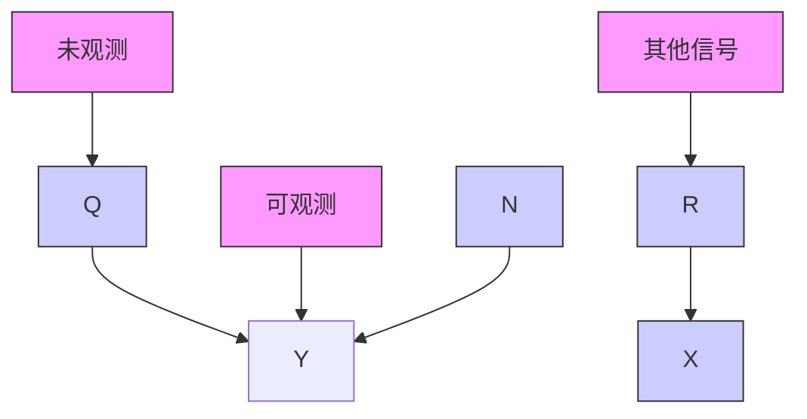
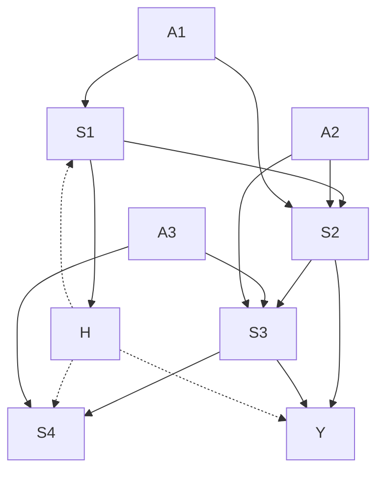
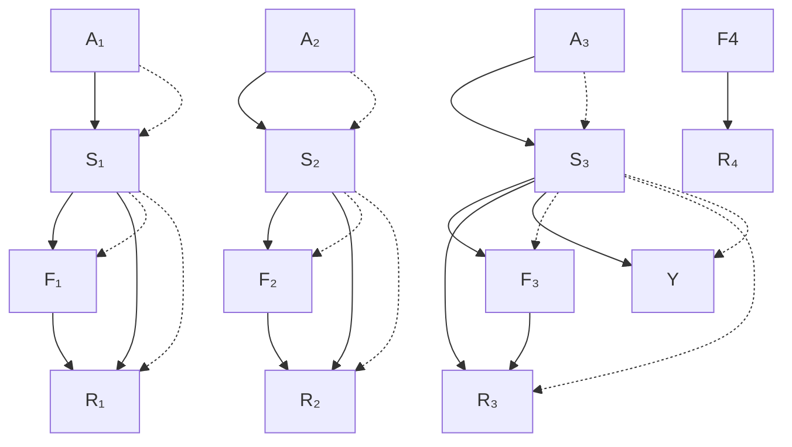
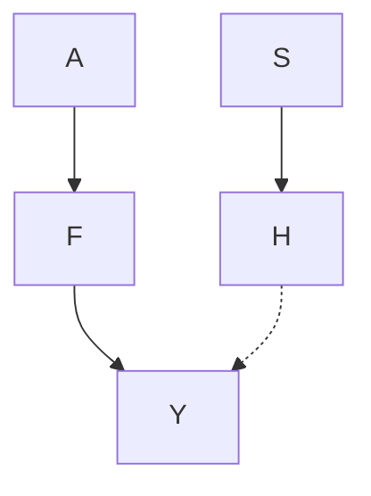

# 与机器学习的联系，II（Connections to Machine Learning, II）

正如第 5 章所论证的，统计模型背后的**因果结构（causal structure）** 可以对机器学习任务（如半监督学习或领域自适应）产生重要影响。我们现在重新讨论这个一般性主题，重点关注多变量情况。我们首先介绍一种利用机器学习为给定因果结构建模系统误差的方法，然后讨论一些关于强化学习（reinforcement learning）的思考（并应用于计算广告领域），最后评述领域自适应（domain adaptation）这一主题。

## 8.1 半同胞回归（Half-Sibling Regression）

该方法利用给定的因果结构（见图 8.1）来减少预测任务中的系统噪声。目标是重建未观测到的信号 $Q$ 。Scholkopf 等人 [2015] 提出，我们可以通过移除所有可以被其他与被相同噪声源污染的测量值 $X$ 所解释的信息来对信号 $Y$ 进行去噪。这里，$X$ 是一些与 $Q$ 独立的信号 $R$ 的测量值。直观地说，$Y$ 中所有能被 $X$ 解释的部分必然是由系统噪声 $N$ 引起的，因此应该被移除。更精确地说，我们考虑

$$
\hat {Q} := Y - \mathbb {E} [ Y | X ]
$$

作为 $Q$ 的估计量。这里，$\mathbb { E } [ Y | X ]$ 是 $Y$ 对其半同胞 $X$ 的回归（注意 $X$ 和 $Y$ 共享父节点 $N$ ；见图 8.1）。

可以证明，对于任何满足 $Q \perp \perp X$ 的随机变量 $Q , X , Y$ ，我们有

**图 8.1：** 适用于系外行星搜索问题的因果结构。感兴趣的潜在信号 $Q$ 只能被测量为带噪声的版本 $Y$ 。如果相同的噪声源也污染了与 $Q$ 独立的其他信号的测量值，那么这些测量值可以用于去噪。在我们的示例中，望远镜 $N$ 构成了影响独立光变曲线测量值 $X$ 和 $Y$ 的系统噪声。

[Scholkopf 等人，2016，命题 1]：

$$
\mathbb {E} \left[ (Q - E [ Q ] - \hat {Q}) ^ {2} \right] \leq \mathbb {E} \left[ (Q - E [ Q ] - (Y - E [ Y ])) ^ {2} \right],
$$

也就是说，该方法永远不会比直接使用测量值 $Y$ 更差。此外，如果系统噪声以加性方式作用，即对于某个（未知）函数 $f$ ，有 $Y = Q + f ( N )$ ，那么我们有 [Scholkopf 等人，2016，命题 3]：

$$
\mathbb {E} \left[ (Q - E [ Q ] - \hat {Q}) ^ {2} \right] = \mathbb {E} [ \operatorname{var} [ f (N) | X ] ]. \tag {8.1}
$$

如果加性噪声是 $X$ 的函数，即对于某个（未知）函数 $\psi$ ，有 $f ( N ) = \psi ( X )$ ，那么 (8.1) 的右侧消失，因此 $\hat { Q }$ 能够恢复 $Q$ 直至一个加性位移；其他充分条件见 Scholkopf 等人 [2016]。

作为一个例子，考虑系外行星搜索。2009 年发射的开普勒太空望远镜在搜索系外行星期间观测了银河系的一小部分，监测了大约 150,000 颗恒星的亮度。1 那些被具有合适轨道以允许部分遮挡恒星的的行星所环绕的恒星，会呈现出显示光强度周期性下降的光变曲线；见图 8.2。这些测量值受到由望远镜引起的系统噪声的污染，使得来自可能存在行星的信号难以检测。

幸运的是，望远镜同时测量了许多恒星。由于这些恒星彼此相距数光年，可以假设它们在因果上（因此也在统计上）是独立的。因此，图 8.1 中描绘的因果结构非常适合这个问题，我们可以应用半同胞回归。这种简单方法表现得出奇地好 [Scholkopf 等人，2015]。

恒星
行星
亮度
光变曲线
时间

**图 8.2：** 每当行星遮挡恒星的一部分时，光强度就会下降。如果行星绕恒星运行，这种现象会周期性发生。（图片由 Nikola Smolenski 提供，https://en.wikipedia.org/wiki/File:Planetary_transit.svg，[CC BY-SA 3.0]。为清晰和风格对图片进行了编辑。）

相关方法已在其他应用领域中使用，但未参考因果建模 [Gagnon-Bartsch 和 Speed, 2012, Jacob 等人, 2016]。考虑问题的因果结构（图 8.1）立即提出了所建议的方法论，并提供了证明该方法合理性的理论依据。

## 8.2 因果推断与情节式强化学习（Causal Inference and Episodic Reinforcement Learning）

我们现在从因果角度描述一类强化学习问题。粗略地说，在强化学习中，一个智能体（agent）嵌入在一个世界中，并从一组不同的动作中进行选择。根据世界的当前状态，这些动作会产生一些奖励并改变世界的状态。智能体的目标是最大化期望累积奖励（更多细节见第 8.2.2 节）。我们首先介绍**逆概率加权（inverse probability weighting）** 的概念，该概念已在机器学习和统计学的不同背景中得到应用，然后将其与情节式强化学习联系起来。建立这种联系是朝着关联因果关系和强化学习迈出的第一步。因果视角使我们能够利用直接由因果结构产生的条件独立性。我们简要提及两个应用——二十一点和广告投放——并展示它们如何从因果知识中受益。因果公式非常自然地导致了这些方法论上的改进，但当然，不使用因果语言也可以表述这些问题和相应的算法。本节并不证明强化学习从因果关系中受益。相反，我们将其视为在这两个领域之间建立正式联系的一步，这可能会在未来带来富有成果的研究 [另见例如 Bareinboim 等人, 2015]。更具体地说，我们相信因果关系在强化学习中的不同任务之间转移知识时可能发挥作用（例如，在电脑游戏中进入下一关或更换乒乓球对手时）；然而，我们尚未知悉任何此类结果。

### 8.2.1 逆概率加权

**逆概率加权（Inverse probability weighting）** 是一种众所周知的技术，用于从遵循不同分布的样本中估计某个分布的属性。因此，它自然地与因果推断相关联。考虑肾结石示例（示例 6.37）。我们定义了二元变量：大小 $S$、治疗 $T$ 和康复 $R$，并且在获得观测数据后，我们感兴趣的是在一个假设性研究中的期望康复率 $\tilde { \mathbb { E } } [ R ]$ ，在该研究中每个人都接受了治疗 A，即处于不同的分布下。形式上，考虑一个**结构因果模型（Structural Causal Model, SCM）** $\mathfrak{C}$，它蕴含了变量 $\mathbf { X } = \left( X _ { 1 } , \ldots , X _ { d } \right)$ 上的分布 $P _ { \mathbf { X } } ^ { \mathfrak { C } }$ 。我们已经论证，人们通常观察来自观测分布 $P _ { \mathbf { X } } ^ { \mathfrak { C } }$ 的样本，但感兴趣的是某个干预分布 $P _ { \mathbf { X } } ^ { \tilde { \mathfrak { C } } }$ 。这里，新的 SCM $\tilde { \mathfrak { C } }$ 是通过对原始 SCM $\mathfrak{C}$ 中的一个节点 $X _ { k }$ 进行干预而构建的，例如，

$$
d o \left(X _ {k} := \tilde {f} (X _ {\widetilde {\mathbf {P A}} _ {k}, \tilde {N} _ {k}})\right);
$$

见第 6.3 节。特别地，我们可能想要估计新分布 $P _ { \mathbf { X } } ^ { \tilde { \mathfrak { C } } }$ 的某个性质

$$
\tilde {\mathbb {E}} \ell (\mathbf {X}) := \mathbb {E} _ {P _ {\mathbf {X}} ^ {\tilde {\mathfrak {C}}}} \ell (\mathbf {X})
$$

（在肾结石示例中，这是 $\tilde { \mathbb { E } } [ R ] )$ ）。如果密度存在，我们在第 6.3 节中已经看到，$\mathfrak{C}$ 和 $\tilde { \mathfrak { C } }$ 的密度以类似方式分解：

$$
\begin{array}{l} p \left(x _ {1}, \dots , x _ {d}\right) := p ^ {\mathfrak {C}} \left(x _ {1}, \dots , x _ {d}\right) = \prod_ {j = 1} ^ {d} p ^ {\mathfrak {C}} \left(x _ {j} \mid x _ {p a (j)}\right) \quad \text { and } \\ \tilde {p} (x _ {1}, \dots , x _ {d}) := p ^ {\tilde {\mathfrak {C}}} (x _ {1}, \dots , x _ {d}) = \prod_ {j \neq k} p ^ {\mathfrak {C}} \left(x _ {j} \mid x _ {p a (j)}\right) \tilde {p} \left(x _ {k} \mid x _ {\widetilde {p a} (k)}\right). \\ \end{array}
$$

这些分解除了被干预变量的项之外是一致的。因此，我们有

$$
\begin{array}{l} \xi := \tilde {\mathbb {E}} \ell (\mathbf {X}) = \int \ell (\mathbf {x}) \tilde {p} (\mathbf {x}) d \mathbf {x} = \int \ell (\mathbf {x}) \frac {\tilde {p} (\mathbf {x})}{p (\mathbf {x})} p (\mathbf {x}) d \mathbf {x} \\ = \int \ell (\mathbf {x}) \frac {\tilde {p} \left(x _ {k} \mid x _ {\widetilde {p a} (k)}\right)}{p \left(x _ {k} \mid x _ {p a (k)}\right)} p (\mathbf {x}) d \mathbf {x}. \\ \end{array}
$$

（为简单起见，我们在整个章节中假设密度严格为正。）给定从分布 $P _ { \mathbf { X } } ^ { \mathfrak { C } }$ 中抽取的样本 $\mathbf { X } ^ { 1 } , \ldots , \mathbf { X } ^ { n }$ ，我们可以通过重新加权观测值来构建 $\pmb { \xi } = \tilde { \mathbb { E } } \ell ( \mathbf { X } )$ 的估计量

$$
\hat {\xi} _ {n} := \frac {1}{n} \sum_ {i = 1} ^ {n} \ell (\mathbf {X} ^ {i}) \frac {\tilde {p} \left(X _ {k} ^ {i} \mid \mathbf {X} _ {\widetilde {p a} (k)} ^ {i}\right)}{p \left(X _ {k} ^ {i} \mid \mathbf {X} _ {p a (k)} ^ {i}\right)} = \frac {1}{n} \sum_ {i = 1} ^ {n} \ell (\mathbf {X} ^ {i}) w _ {i} \tag {8.2}
$$

这里，权重 $w _ { i }$ 被定义为条件密度的比值。那些在 $P _ { \mathbf { X } } ^ { \tilde { \mathfrak { C } } }$ 下具有高似然性（它们“可能被从”感兴趣的新分布中“抽取出来”）的数据点会获得较大的权重，并且对估计量 $\hat { \xi } _ { n }$ 的贡献比权重小的点更多。这种估计量出现在以下三种情况中，例如。

(i) 假设 $\mathbf { X } = \left( Y , Z \right)$ 仅包含一个目标变量 $Y$ 和一个因果协变量 $Z$ ，即 $Z \to Y$ 。让我们考虑对 $Z$ 的干预以及函数 $\ell ( { \mathbf { X } } ) = \ell ( ( Z , Y ) ) = Y$ 。那么，估计量 (8.2) 简化为

$$
\hat {\xi} _ {n} := \frac {1}{n} \sum_ {i = 1} ^ {n} Y ^ {i} \frac {\tilde {p} (Z ^ {i})}{p (Z ^ {i})}, \tag {8.3}
$$

这被称为**霍维茨-汤普森估计量（Horvitz-Thompson estimator）** [Horvitz 和 Thompson, 1952]。这种设定对应于**协变量偏移（covariate shift）** 的假设 [例如，Shimodaira, 2000, Quionero-Candela 等人, 2009, Ben-David 等人, 2010]；另见第 5.2 节和第 8.3 节。估计量 (8.3) 是**加权似然估计量（weighted likelihood estimator）** 的一个例子。

(ii) 对于 $\mathbf { X } = Z$ ，我们可以使用从 $p$ 采样的数据来估计在 $\tilde { p }$ 下的期望 $\tilde { \mathbb { E } } \left[ \ell ( Z ) \right]$ 。因此，方程 (8.2) 简化为

$$
\hat {\xi} _ {n} := \frac {1}{n} \sum_ {i = 1} ^ {n} \ell (Z ^ {i}) \frac {\tilde {p} (Z ^ {i})}{p (Z ^ {i})},
$$

这个公式被称为**重要性采样（importance sampling）** [例如，MacKay, 2002, 第 29.2 章]。如果 $p$ 和 $\tilde { p }$ 仅已知至常数项，则该公式可以进行调整。

(iii) 我们将在情节式强化学习的背景下使用方程 (8.2)。接下来我们将更详细地描述这个应用。

### 8.2.2 情节式强化学习

**强化学习（Reinforcement learning）** [例如 Sutton 和 Barto, 2015] 对智能体在世界中采取行动的行为进行建模。根据世界的当前状态 $S _ { t }$ 和动作 $A _ { t }$ ，世界的状态会按照例如**马尔可夫决策过程（Markov decision process）** [例如，Bellman, 1957] 发生变化；也就是说，进入新状态 $s$ 的概率 $P ( S _ { t + 1 } = s )$ 仅取决于当前状态 $S _ { t }$ 和动作 $A _ { t }$ 。此外，智能体将收到一些取决于 $S _ { t } , A _ { t }$ 和 $S _ { t + 1 }$ 的奖励 $R _ { t + 1 }$ ；所有奖励的总和有时被称为回报（return），我们将其记为 $Y : = \textstyle \sum _ { t } R _ { t }$ 。回报 $Y$ 依赖于状态和动作的方式对智能体来说是未知的，智能体试图改进其策略 $( a , s ) \mapsto \pi ( a | s ) : = P ( A _ { t } = a | S _ { t } = s )$ ，即根据世界状态的可观测部分选择动作的条件概率。在**情节式强化学习（episodic reinforcement learning）** 中，状态在有限数量的动作后被重置（见图 8.3）。在第 8.2.3 节中，我们考虑二十一点的例子。在图 8.3 的例子中，玩家做出 $K = 3$ 次决策，之后牌被重新洗牌。然后，一个新的情节开始。

**图 8.3：** 该图描述了一个情节式强化学习问题。动作变量 $A _ { i }$ 影响系统的下一个状态 $S _ { i + 1 }$ 。变量 $Y$ 描述了一个情节结束后我们收到的输出或回报。这个回报 $Y$ 也可能依赖于动作（为清晰起见省略了边）；它通常被建模为每次决策后收到的奖励的（可能加权）总和；见第 8.2.3 节。整个系统可能被一个未观测变量 $H$ 混淆。粗体的红色边表示玩家可以影响的条件概率，即策略。方程 (8.4) 使用从策略 $\pi$ 获得的数据估计在策略 $\tilde{\pi}$ 下的期望结果 $\mathbb { E } [ Y ]$ 。当存在从动作 $A$ 到 $H$ 和/或 $Y$ 的额外边时，该方程仍然成立。

假设我们在某个策略 $( a , s ) \mapsto \pi ( a | s )$ 下进行 $n$ 局游戏，每局游戏就是一个情节。这个函数 $\pi$ 不依赖于我们到目前为止已经进行的“移动”次数，而只依赖于状态的值。只要这个策略为任何动作分配正概率，方程 (8.2) 就允许我们估计不同策略 $( a , s ) \mapsto { \tilde { \pi } } ( a | s )$ 的性能。

$$
\hat {\xi} _ {n, \mathrm{ERL}} := \frac {1}{n} \sum_ {i = 1} ^ {n} Y ^ {i} \frac {\prod_ {j = 1} ^ {K} \tilde {\pi} (A _ {j} ^ {i} \mid S _ {j} ^ {i})}{\prod_ {j = 1} ^ {K} \pi (A _ {j} ^ {i} \mid S _ {j} ^ {i})}. \tag {8.4}
$$

这可以被视为一种用于**离策略评估（off-policy evaluation）** 的**蒙特卡洛方法（Monte Carlo method）** [Sutton 和 Barto, 2015, 第 5.5 章]。在实践中，估计量 (8.4) 通常具有较大的方差；在连续设定中方差甚至可能是无限的。有人建议重新加权 [Sutton 和 Barto, 2015] 或忽略（五个）最大的权重 [Bottou 等人, 2013]，以在方差和偏差之间进行权衡。Bottou 等人 [2013] 还计算了参数化密度情况下的置信区间和梯度。如果人们想要搜索最优策略，后者很重要。

我们现在简要讨论两个例子，其中利用因果结构可以改进学习过程的统计性能。我们视其为有趣的例子，它们揭示了强化学习与因果关系之间的关系。

### 8.2.3 二十一点中的状态简化（State Simplification in Blackjack）

第 8.2.2 节提出的方法可用于学习如何玩二十一点（一种纸牌游戏）。我们假设一位玩家进入赌场并开始玩二十一点，既不知道游戏目标也不知道最优策略；相反，他采用一种随机策略。在游戏的每个时刻，玩家会被询问希望采取哪种合法行动，游戏结束后，庄家会揭示玩家赢或输了多少金额。一段时间后，玩家可以将其策略更新为那些被证明是成功的决策，并继续游戏。从数学角度来看，二十一点问题已被解决。最优策略（针对无限副牌）由 Baldwin 等人 [1956] 发现，对于下注 1 单位的玩家，其期望收益为 ${ \mathbb E } [ Y ] \approx - 0 . 0 0 6 \notin$。

因果关系是如何发挥作用的？我们假设玩家不了解二十一点的具体规则；然而，他可能知道输赢仅由牌的点数决定，而与花色无关；也就是说，规则不区分梅花皇后和红心皇后。那么玩家可以立即得出结论：最优策略不依赖于花色。这在搜索最优策略时具有明显的优势：相关状态空间的数量，以及因此可能的策略空间，都显著减少了。图 8.4 描绘了这一论点：变量 $S _ { t }$ 包含所有信息，而变量 $F _ { t }$ 不包含花色。例如，

图 8.4：这里，存在变量 $F _ { 1 } , \ldots , F _ { 4 }$，它们包含关于状态 $S _ { 1 } , \ldots , S _ { 4 }$ 的所有相关信息，其意义在于方程 (8.5) 和 (8.6) 成立。方程 (8.6) 未在图中表示。那么，行动 $A _ { j }$ 依赖于 $F _ { j - 1 }$（红色实线）而非 $S _ { j - 1 }$（红色虚线）就足够了。在二十一点的例子中，$S _ { j } \mathrm { ' s }$ 编码了庄家的手牌和玩家的手牌（包括花色），而 $F _ { j }$ 编码了除花色之外的相同信息（花色对二十一点的结果没有影响）。由于 $F _ { j }$ 取值的数量少于 $S _ { j }$，最优策略变得更容易学习。

$$
S _ {3} = (\text { 玩家: } \heartsuit K, \spadesuit 5, \diamondsuit 4; \quad \text { 庄家: } \diamondsuit K)
$$

$$
F _ {3} = (\text { 玩家: } \quad K, \quad 5, \quad 4; \quad \text { 庄家: } \quad K).
$$

由于最终结果 $Y$ 仅依赖于 $( F _ { 1 } , \ldots , F _ { 4 } )$ 而非“完整状态” $( S _ { 1 } , \ldots , S _ { 4 } )$，行动可以选择依赖于 $F$ 变量。类似地，我们可以利用卡片的顺序也不重要的特性。更正式地，我们有以下结论：

**命题 8.1（状态简化）** 假设我们关注收益 $Y : = \sum _ { j } R _ { j }$，且所有变量都是离散的。假设存在一个函数 $f$，使得对于所有 $j$ 以及 $F _ { j } : = f ( S _ { j } )$，我们有

$$
R _ {j} \perp S _ {j} | F _ {j}, A _ {j}, \tag {8.5}
$$

并且完整状态对状态变化不重要，其意义如下：对于所有 $s _ { j }$ 以及所有满足 $f ( s _ { j - 1 } ) = f ( s _ { j - 1 } ^ { \circ } )$ 的 $s _ { j - 1 } , s _ { j - 1 } ^ { \circ }$，有

$$
p (f (s _ {j}) \mid s _ {j - 1}) = p (f (s _ {j}) \mid s _ {j - 1} ^ {\circ}). \tag {8.6}
$$

那么最优策略 $( a , s ) \mapsto \pi _ { o p t } ( a | s )$ 仅依赖于 $F _ { j }$ 而不依赖于 $S _ { j }$。存在

$$
\pi_ {o p t} \in \underset {\pi} {\operatorname{argmax}} \mathbb {E} [ Y ],
$$

使得

$$
\pi_ {o p t} (a _ {j} | s _ {j - 1}) = \pi_ {o p t} (a _ {j} | s _ {j - 1} ^ {\circ}) \quad \forall s _ {j - 1}, s _ {j - 1} ^ {\circ}: f (s _ {j - 1}) = f (s _ {j - 1} ^ {\circ}).
$$

当 $F _ { j }$ 取值的数量少于 $S _ { j }$ 时，这个结论尤其有用。证明见附录 C.11。在二十一点的例子中，方程 (8.6) 表明抽到另一张老K的概率仅取决于之前抽到的牌的点数（特别是老K的数量），而不是它们的花色。

### 8.2.4 广告投放中的改进加权（Improved Weighting in Advertisement Placement）

Bottou 等人 [2013] 在广告最优投放中使用了相关的论证。考虑以下系统的简化描述。一家公司（我们称之为发布商）运营一个搜索引擎，并可能希望在搜索结果上方的区域（即主广告位）展示广告。只有当用户点击广告时，发布商才能从相应的公司获得收入。在展示广告之前，发布商会设置主广告位保留价 $A$，这是一个实值参数，决定了主广告位中展示的广告数量。在大多数系统中，主广告位的广告数量 $F$ 在 0 到 4 之间变化，即 $F \in \{ 0 , 1 , 2 , 3 , 4 \}$。主广告位保留价 $A$ 通常依赖于许多变量（例如搜索查询、查询的日期和时间、地点），我们称之为状态 $S$。例如，如果搜索查询表明用户打算购买新鞋，则可能希望比用户查找教堂下一次礼拜时间时展示更多的广告。我们可以将该系统建模为回合长度为 1 的回合制强化学习。收益 $Y$ 等于每回合的点击次数；其值为 0 或 1。如何选择最优主广告位保留价 $A$ 的问题，就对应于寻找最优策略 $( a , s ) \mapsto \pi _ { \mathrm { o p t } } ( a | s )$。图 8.5 展示了简化后的问题。状态 $S$ 包含发布商可获得的关于用户的信息。隐藏变量 $H$ 包含未知的用户信息（例如其意图），行动 $A$ 是主广告位保留价，$Y$ 是用户是否点击其中一个广告的事件。最后，$F$ 是离散变量，表示展示了多少个广告。评估新策略 $( a , s ) \mapsto { \tilde { p } } ( a | s )$ 对应于应用方程 (8.4)：

图 8.5：广告投放示例。目标变量 $Y$ 表示用户是否点击了展示的广告之一。$H$（未知）和 $S$（已知）是状态变量，行动 $A$ 对应于主广告位保留价，这是一个实值参数，决定了主广告位中展示的广告数量。$F$ 是一个离散变量，表示主广告位中放置的（已知）广告数量。尽管条件 $p ( a | s )$ 是随机化的，但我们可以使用 $p ( f | s )$ 进行重新加权（见命题 8.2）。

$$
\hat {\xi} _ {n, \mathrm{ERL}} := \frac {1}{n} \sum_ {i = 1} ^ {n} Y ^ {i} \frac {\tilde {p} (A ^ {i} | S ^ {i})}{p (A ^ {i} | S ^ {i})}.
$$

（这里，为方便记法，我们写作 $p ( a | s )$ 而非 $\pi ( a | s )$。）我们现在可以从以下关键见解中受益。用户是否点击广告依赖于主广告位保留价 $A$，但仅通过 $F$ 的值来体现。用户从未看到实值参数 $A$。当我们思考系统的因果结构时（见图 8.5），这是一个有些显而易见的观察。然而，利用这一事实，我们可以使用不同的估计量

$$
\frac {1}{n} \sum_ {i = 1} ^ {n} Y ^ {i} \frac {\tilde {p} (F ^ {i} | S ^ {i})}{p (F ^ {i} | S ^ {i})};
$$

见命题 8.2。由于 $F$ 是一个取值在 0 到 4 之间的离散变量，这通常会导致权重表现得更好。在实践中，这种修改可以显著缩小置信区间的范围 [Bottou et al., 2013, Section 5.1]。如同第 8.1 节，我们可以利用对因果结构的了解来提升统计性能。更正式地，该过程由以下命题证明是合理的：

**表 8.1：在领域泛化中，测试数据来自未见过的领域，而在多任务学习中，测试领域中有一些数据可用。**
| 方法 | 训练数据来自 | 测试领域 |
| --- | --- | --- |
| 领域泛化（Domain generalization） | $ (\mathbf{X}^{1}, Y^{1}), \ldots, (\mathbf{X}^{D}, Y^{D}) $ | $ T := D + 1 $ |
| 多任务学习（Multi-task learning） | $ (\mathbf{X}^{1}, Y^{1}), \ldots, (\mathbf{X}^{D}, Y^{D}) $ | $ T \in \{1, \ldots, D\} $ |
| 非对称多任务学习（Asymmetric multi-task learning） | $ (\mathbf{X}^{1}, Y^{1}), \ldots, (\mathbf{X}^{D}, Y^{D}) $ | $ T := D $ |

**命题 8.2（改进加权）** 假设存在一个关于 $\mathbf { X } = ( A , F , H , S , Y )$ 的密度 $p$，它由因果结构模型（SCM）$\mathfrak { C }$ 蕴含，其图结构如图 8.5 所示。进一步假设密度 $\tilde { p }$ 由 SCM $\tilde { \mathfrak { C } }$ 蕴含，该 SCM 对应于对 $A$ 进行形如 do $\big ( A : = \tilde { f } ( S , \tilde { N } _ { A } ) \big )$ 的干预，并且满足若 $p ( f | s ) = 0$ 则 $\tilde { p } ( f | s ) = 0$，若 $p ( a | s ) = 0$ 则 $\tilde { p } ( a | s ) = 0$。那么我们有

$$
\tilde {\mathbb {E}} Y = \int y \frac {\tilde {p} (a | s)}{p (a | s)} p (\mathbf {x}) d \mathbf {x} = \int y \frac {\tilde {p} (f | s)}{p (f | s)} p (\mathbf {x}) d \mathbf {x}.
$$

证明见附录 C.12。一般来说，密度非零的条件确实是必要的：如果存在一组 $a$ 和 $s$ 值（具有非零勒贝格测度）属于 $\tilde { p }$ 的支撑集并对 $Y$ 的期望有贡献，那么在 $p$ 下必须有非零概率在该区域采样到数据。

## 8.3 领域自适应（Domain Adaptation）

**领域自适应（Domain adaptation）** 是另一个与因果关系自然相关的机器学习问题 [Scholkopf et al., 2012]。在这里，我们将领域自适应与我们在第 7.2.5 节“不同环境”中称之为**不变预测（invariant prediction）** 的内容联系起来。我们并不声称这种联系在当前形式下能带来重大改进，但我们相信它可能有助于在领域自适应中发展新的方法论。

让我们假设我们从目标变量 $Y ^ { e }$ 和 $d$ 个可能的预测变量 $\mathbf { X } ^ { e } = ( X _ { 1 } ^ { e } , \ldots , X _ { d } ^ { e } )$ 中获取数据，这些数据来自不同的领域 $e \in \mathcal { E } = \{ 1 , . . . , D \}$，并且我们感兴趣的是预测 $Y$。为了适应广泛使用的记号，我们使用术语“领域”或“任务”。表 8.1 描述了我们在此考虑的领域自适应中三个问题的分类。

我们的主要假设是存在一个集合 $S ^ { * } \subseteq \{ 1 , \ldots , d \}$，使得条件分布 $Y ^ { e } \mid \mathbf { X } _ { S ^ { * } } ^ { e }$ 对于所有领域 $e \in { \mathcal { E } }$（包括测试领域）都是相同的，即对于所有 $e , f \in { \mathcal { E } }$ 和所有 $\mathbf { X } { S ^ { * } }$，有

$$
Y ^ {e} \left| \mathbf {X} _ {S ^ {*}} ^ {e} = \mathbf {x} _ {S ^ {*}} \quad \text { 和 } \quad Y ^ {f} \right| \mathbf {X} _ {S ^ {*}} ^ {f} = \mathbf {x} _ {S ^ {*}} \quad \text { 具有相同的分布。 } \tag {8.7}
$$

在第 7.1.6 节和第 7.2.5 节中，我们考虑过类似的设定，当时我们使用术语“环境”而非“领域”，并将性质 (8.7) 称为“不变预测”。我们论证过，如果存在一个潜在的 SCM，并且如果环境对应于对目标 $Y$ 之外的其他节点进行的干预，那么性质 (8.7) 对于 $S ^ { * } = \mathbf { P } \mathbf { A } _ { Y }$ 是成立的（同时参见我们在第 2.2 节对西蒙不变性准则的讨论）。然而，性质 (8.7) 也可能对除了因果父节点之外的集合成立。由于我们的目标是预测，我们最感兴趣的是那些满足 (8.7) 并且能尽可能准确地预测 $Y$ 的集合 $S ^ { * }$。现在让我们假设我们已知这样一个集合 $S ^ { * }$（我们稍后会回到这个问题），并指出假设 (8.7) 如何与领域自适应相关联。

在**协变量偏移（covariate shift）** 的设定中 [例如 Shimodaira, 2000, Quionero-Candela et al., 2009, Ben-David et al., 2010]，通常假设条件分布 $Y ^ { e } \left| \mathbf { X } ^ { e } = \mathbf { x } \right.$ 在所有任务 $e$ 中保持不变。假设 (8.7) 意味着协变量偏移对变量的某个子集 $S ^ { * }$ 成立，因此构成了对协变量偏移假设的推广。

对于**领域泛化（domain generalization）**，如果集合 $S ^ { * }$ 已知，那么我们可以对这个子集 $S ^ { * }$ 应用传统的协变量偏移方法。例如，如果输入空间中数据的支撑集是重叠的（或者系统是线性的），我们可以在测试领域 $T$ 中使用估计量 $f _ { S ^ { * } } ( \mathbf { X } _ { S ^ { * } } ^ { T } )$，其中 $f _ { S ^ { \ast } } ( \mathbf { x } ) : = \mathbb { E } \left[ Y ^ { 1 } | \mathbf { X } _ { S ^ { \ast } } ^ { 1 } = \mathbf { x } \right]$。可以证明，在对抗性设定中，这种方法是最优的，在该设定中，测试领域的分布可能与训练领域任意不同，除了我们要求保持不变的条件分布 (8.7) [Rojas-Carulla et al., 2016, Theorem 1]。在**多任务学习（multi-task learning）** 中，如何利用这样一个集合 $S ^ { * }$ 的知识则不那么明显。在实践中，需要将从合并所有任务并对 $Y$ 关于 $S ^ { * }$ 进行回归中获得的信息，与从单独考虑测试任务中获得的知识结合起来 [Rojas-Carulla et al., 2016]。

如果集合 $S ^ { * }$ 未知，我们再次建议在可用领域上搜索满足 (8.7) 的集合 $S$。在学习因果预测变量时，倾向于保持保守，因此**不变因果预测（invariant causal prediction）** 方法 [Peters et al., 2016] 输出所有满足 (8.7) 的集合 $S$ 的交集；见方程 (7.5)。在这里，我们感兴趣的是预测。因此，在所有能产生不变预测的集合中，可以选择能带来最佳预测性能的集合 $S$，这通常是那些较大的集合之一。同样的情况也适用于存在多个不同的已知集合 $S$ 都满足 (8.7) 时。如果数据由 SCM 生成，并且领域对应于不同的干预，那么在无限数据的极限下，可以证明满足 (8.7) 且具有最佳预测能力的集合 $S$ 是 $Y$ 的**马尔可夫毯（Markov blanket）** 的一个子集（见问题 8.5）。

## 8.4. 问题（Problems）

## 8.4 问题（Problems）

**问题 8.3（半同胞回归）** 考虑图 8.1 中的有向无环图（DAG）。$X$ 在 $Y$ 提供的信息之外提供了关于 $Q$ 的额外信息，这一事实源于因果忠实性。为什么？

**问题 8.4（逆概率加权）** 考虑如下形式的 SCM $\mathfrak { C }$

$$
\begin{array}{l} Z := N _ {Z} \\ Y := Z ^ {2} + N _ {Y}, \\ \end{array}
$$

其中 $N _ { Y } , N _ { Z } \stackrel { i i d } { \sim } \mathcal { N } ( 0 , 1 )$，以及一个干预版本 $\tilde { \mathfrak { C } }$，其形式为

$$
d o \left(Z := \tilde {N} _ {Z}\right),
$$

其中 $\tilde { N } _ { Z } \sim \mathcal { N } ( 2 , 1 )$。

a) （可选）计算 $\mathbb { E } [ Y ] : = \mathbb { E } _ { P ^ { \mathrm { c } } } [ Y ]$ 和 $\tilde { \mathbb { E } } [ Y ] : = \mathbb { E } _ { P ^ { \tilde { \mathfrak { c } } } } [ Y ]$。  
b) 从 SCM $\mathfrak { C }$ 中抽取 $n = 2 0 0$ 个独立同分布数据点，并实现估计量 (8.3) 以估计 $\tilde { \mathbb { E } } [ Y ]$。  
c) 计算 b) 中的估计值，并计算对于从 $n = 5$ 到 $n = 5 0 , 0 0 0$ 的递增样本量 $n$， (8.3) 中出现的权重的经验方差。你得出了什么结论？

**问题 8.5（不变预测变量）** 我们希望证明第 8.3 节最后一句话的合理性。考虑一个关于变量 $Y$、$E$ 和 $X _ { 1 } , \ldots , X _ { d }$ 的有向无环图（DAG），其中 $E$（代表“环境”）不是 $Y$ 的父节点，并且自身也没有任何父节点。将 $Y$ 的马尔可夫毯记为 $M$。证明：对于任何满足

$$
Y \perp E | S
$$

的集合 $S \subseteq \{ X _ { 1 } , \ldots , X _ { d } \}$，存在另一个集合 $S _ { n e w } \subseteq M$，使得

$$
Y \perp E | S _ {n e w} \quad \text{且} \quad Y \perp (S \backslash S _ {n e w}) | S _ {n e w}.
$$