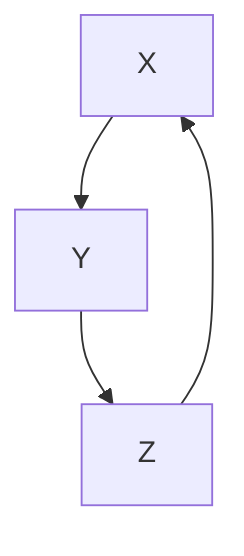
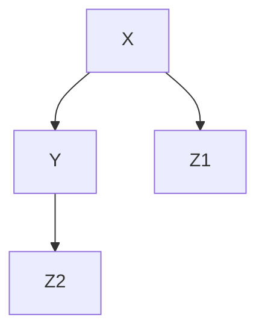
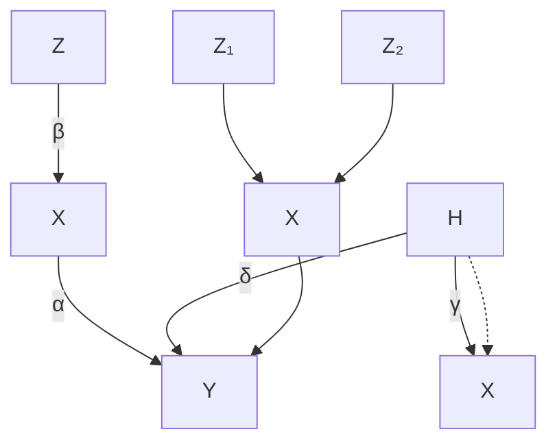
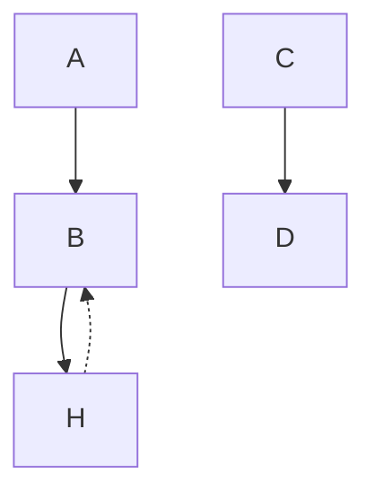
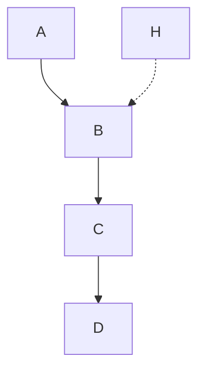
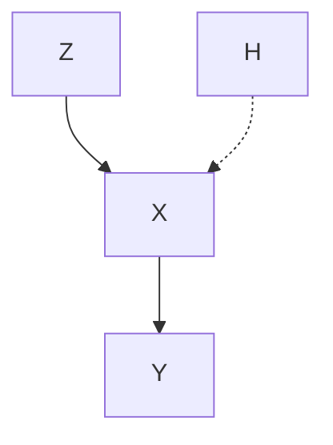
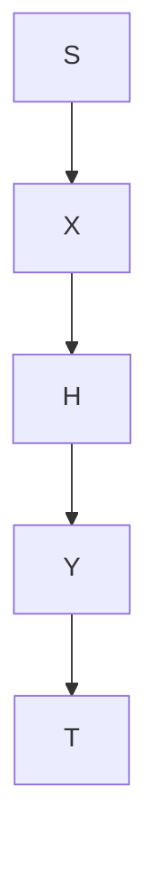
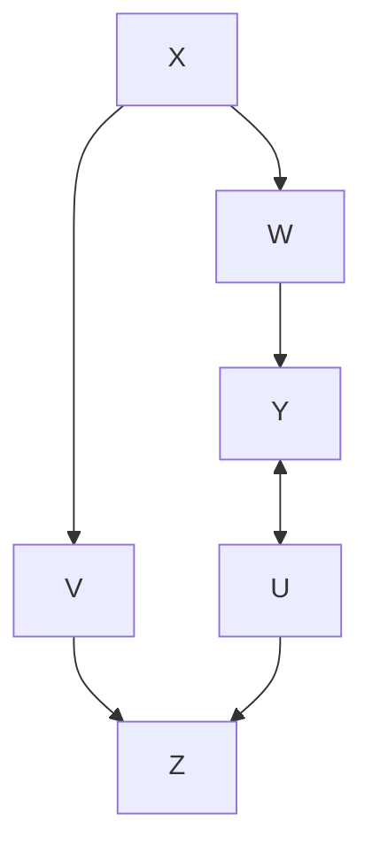
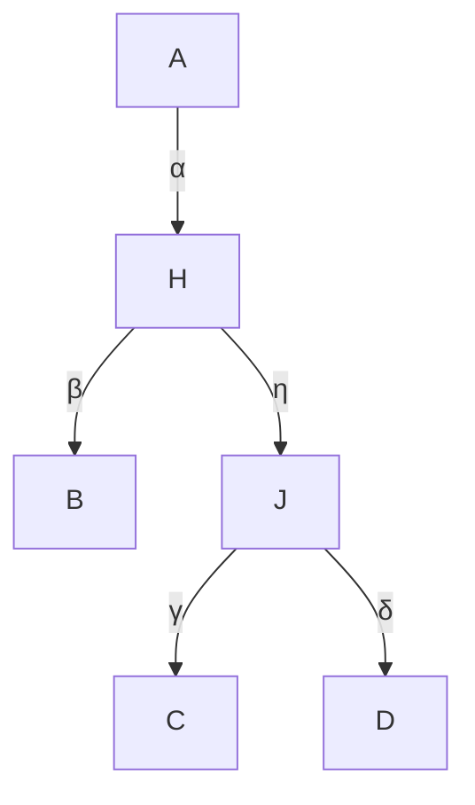

# 隐变量（Hidden Variables）

到目前为止，我们假设模型中的所有变量（除噪声外）都已被测量。由于在实践中，我们自行选择随机变量集合，因此需要定义"因果相关"变量的概念。因此，在 **第9.1节** 中，我们引入了 **因果充分性（causal sufficiency）** 和 **干预充分性（interventional sufficiency）** 这两个术语。但即使我们搁置精确定义的细节，显然在大多数实际应用中，许多因果相关变量将是未被观测到的。**辛普森悖论（Simpson's paradox）**（第9.2节）描述了忽略隐藏混杂因素如何导致错误的因果结论。在线性设置中，一种常被称为 **工具变量（instrumental variable）** 的结构可以使对应于因果效应的回归系数（见 **例6.42**）变得可识别（第9.3节）。寻找具有隐变量的 **结构因果模型（Structural Causal Models, SCMs）** 的良好图形表示，特别是那些编码条件独立结构的表示，是一个活跃的研究领域；我们将在 **第9.4节** 中介绍一些解决方案。最后，隐变量会导致观测分布中出现超越条件独立性的约束（第9.5节）。我们简要讨论了这些约束如何用于结构学习，但未提供任何方法论细节。关于隐变量处理的历史注释，请参考 Spirtes 等人 [2000, 第6.1节]。

## 9.1 干预充分性（Interventional Sufficiency）

一组变量 $\mathbf{X}$ 通常被称为 **因果充分（causally sufficient）** 的，如果不存在隐藏的公共原因 $C \notin \mathbf{X}$ 导致 $\mathbf{X}$ 中的多个变量发生变化 [例如，Spirtes, 2010]。虽然这个定义符合"相关"变量集合的直观含义，但它使用了"公共原因"的概念，因此应相对于一个更大的变量集合 $\tilde{\mathbf{X}} \supseteq \mathbf{X}$ 来理解（对于这个更大的集合，我们可能也想定义因果充分性）。在对应于这个更大集合 $\tilde{\mathbf{X}}$ 的结构因果模型中，如果存在一条从 $C$ 到 $X$ 和 $Y$ 的有向路径，且该路径分别不包含 $Y$ 和 $X$，则变量 $C$ 是 $X$ 和 $Y$ 的公共原因。公共原因也被称为 **混杂因素（confounders）**，我们互换使用这些术语。

我们提出对因果充分性的一个小修改，称之为 **干预充分性（interventional sufficiency）**，这是一个基于 SCM 可证伪性的概念；见 **第6.8节**。

**定义 9.1（干预充分性）** 如果存在一个关于 $\mathbf{X}$ 的 SCM 不能被证伪为干预模型，即它产生的观测分布和干预分布与我们在实践中观测到的结果一致，则称变量集合 $\mathbf{X}$ 是 **干预充分** 的。

我们相信这个概念在直觉上很有吸引力，因为它描述了一组变量何时足够大以执行因果推理，即计算观测分布和干预分布的意义上。

直观上，如果存在潜在的公共原因，考虑两个变量通常是不够的。这两个变量根据定义是因果不充分的，而 **第9.2节** 中的辛普森悖论（另见 **例6.37**）表明，一般来说，这两个变量也不是干预充分的。事实上，这个悖论将陈述推向了极端：忽略混杂因素的两个观测变量上的 SCM 不仅会得出错误的干预分布，甚至可能反转因果效应的符号：一种治疗可能看起来有益，尽管它是有害的；见 (9.2)。

然而，有时即使在存在潜在混杂的情况下，我们仍然可以计算出正确的干预分布。以下例子中的变量集合是干预充分的，但因果不充分。

## 例 9.2 考虑以下 SCM

$$
\begin{array}{l} Z := N _ {Z} \\ X := \mathbf {1} _ {Z \geq 2} + N _ {X} \\ Y := Z \bmod 2 + X + N _ {Y} \\ \end{array}
$$

其中 $N _ { Z } \sim \mathcal { U } ( \{ 0 , 1 , 2 , 3 \} )$ 在 {0, 1, 2, 3} 上均匀分布，$N _ { X } , N _ { Y }$ 独立同分布 $\sim \mathcal { N } ( 0 , 1 )$；见图 9.1（左）。虽然变量 $X$ 和 $Y$ 显然是因果不充分的，1 但可以证明这两个变量 $X$ 和 $Y$ 是干预充分的。原因是"混杂因素" $Z$ 由两个独立部分组成：$Z _ { 1 } : = \mathbf { 1 } _ { Z \geq 2 }$ 是 $Z$ 二进制表示的第一位，$Z _ { 2 } : = Z { \bmod { 2 } }$ 是第二位。在这个意义上，我们可以将"混杂因素"分解为独立变量 $Z _ { 1 }$ 和 $Z _ { 2 }$，其中 $Z _ { 1 }$ 影响 $X$，$Z _ { 2 }$ 影响 $Y$；见图 9.1。□







**图 9.1：** 两个图都表示 **例 9.2** 中描述的模型的干预等价 SCM。虽然只有第二个表示使 $X$ 和 $Y$ 因果充分，但 $X$ 和 $Y$ 独立于表示形式而干预充分。

一般来说，因果充分性和干预充分性之间存在以下关系（证明见 **附录 C.13**）：

## 命题 9.3（干预充分性与因果充分性） 令 $\mathfrak{C}$ 为变量 $\mathbf{X}$ 上的一个 SCM，且不能被证伪为干预模型。

(i) 如果子集 $\mathbf { O } \subseteq \mathbf { X }$ 是因果充分的，那么它是干预充分的。  
(ii) 一般来说，其逆命题不成立；即存在干预充分的集合 $\mathbf { O } \subseteq \mathbf { X }$ 的例子，但它们不是因果充分的。

此外，**例 9.2** 表明，不存在纯粹的图形标准来确定变量的一个子集是否干预充分。对于许多具有类似于图 9.1（左）结构的 SCM，$X$ 和 $Y$ 是干预不充分的。然而，以下注释表明，省略一个"中间"变量可以保持干预充分性。

## 注释 9.4 我们有以下三个陈述。

(i) 假设存在一个关于 $X, Y, Z$ 的 SCM，其图为 $X \rightarrow Y \rightarrow Z$ 且 $X \not\!\perp\!\!\!\perp Z$，该 SCM 产生正确的干预分布。那么，由于存在一个满足 $X \leftarrow Z$ 的关于 $X, Z$ 的 SCM，$X$ 和 $Z$ 是干预充分的。  
(ii) 假设存在一个关于 $X, Y, Z$ 的 SCM $\mathfrak{C}$，其图为 $X \rightarrow Y \rightarrow Z$ 且附加 $X \leftarrow Z$，该 SCM 产生正确的干预分布，并进一步假设 $P _ { X , Y , Z } ^ { \mathfrak { C } }$ 对于该图是忠实的。那么，由于存在一个满足 $X \leftarrow Z$ 的关于 $X, Z$ 的 SCM，$X$ 和 $Z$ 是干预充分的。  
(iii) 如果情况与 (ii) 相同，但区别在于对于所有 $x$，有

$$
P _ {Z | X = x} ^ {\mathfrak {C}} = P _ {Z} ^ {\mathfrak {C}; d o (X := x)} = P _ {Z} ^ {\mathfrak {C}}
$$

（特别地，$P _ { X , Y , Z } ^ { \mathfrak { C } }$ 对于该图不是忠实的）。那么，由于存在一个具有空图的关于 $X, Z$ 的 SCM，$X$ 和 $Z$ 是干预充分的。注意，反事实可能无法正确表示。

这些陈述的证明留给读者（见 **问题 9.10**）。

每当我们找到一个关于观测变量的 SCM，且它与关于所有变量的原始 SCM 是干预等价的，我们可能想称前者为 **边际化 SCM（marginalized SCM）**。我们已经看到，没有纯粹的图形标准来确定边际化 SCM 的结构。相反，需要一些关于因果机制的信息，即赋值函数的具体形式。Bongers 等人 [2016] 更详细地研究了 SCM 的边际化。关键思想是从原始 SCM 开始，只考虑观测变量的结构赋值。然后，每当隐变量出现在右侧时，就反复代入隐变量的赋值。这产生了一个具有多元、可能相关的噪声变量的 SCM。在某些情况下，可以选择一个具有单变量噪声变量的干预等价 SCM。

## 9.2 辛普森悖论（Simpson's Paradox）

**例 6.16** 中的肾结石数据集因以下原因而闻名。我们有

$$
P ^ {\mathfrak {C}} (R = 1 \mid T = A) < P ^ {\mathfrak {C}} (R = 1 \mid T = B) \quad \text { 但 }
$$

$$
P ^ {\mathfrak {C}; d o (T := A)} (R = 1) > P ^ {\mathfrak {C}; d o (T := B)} (R = 1); \tag {9.1}
$$

见 **例 6.37**。假设我们没有测量变量 $Z$（结石大小），而且甚至不知道它的存在。那么我们可能会假设 $T \rightarrow R$ 是正确的图。如果我们用 $\tilde { \mathfrak { C } }$ 表示这个（错误的）SCM，我们可以将 (9.1) 重写为

$$
P ^ {\tilde {\mathfrak {C}}; d o (T := A)} (R = 1) < P ^ {\tilde {\mathfrak {C}}; d o (T := B)} (R = 1) \text {  但   }
$$

$$
P ^ {\mathfrak {C}; d o (T := A)} (R = 1) > P ^ {\mathfrak {C}; d o (T := B)} (R = 1). \tag {9.2}
$$

由于模型设定错误，因果陈述被反转了。尽管 $A$ 是更有效的药物，但我们建议使用 $B$。但即使我们知道公共原因 $Z$，是否可能存在另一个我们没有纠正的混杂变量？如果我们运气不好，情况确实如此，并且如果我们包含这个变量，我们必须再次反转结论。原则上，这可能导致一个任意长的反转因果结论序列（见 **问题 9.11**）。

这个例子表明，在写下底层因果图时必须多么小心。在某些情况下，我们可以从描述数据采集过程的协议中推断出 **有向无环图（Directed Acyclic Graph, DAG）**。例如，如果分配治疗的医生除了肾结石大小之外没有关于患者的任何其他知识，那么除了结石大小之外，不可能存在任何其他混杂因素。

总结来说，辛普森悖论与其说是一个悖论，不如说是一个警告，提醒我们因果推理对模型设定错误有多么敏感。虽然我们是在混杂因素的背景下阐述这个例子，但它也可能由于未考虑到的 **选择偏差（selection bias）**（**例 6.30**）而发生。

## 9.3 工具变量（Instrumental Variables）

工具变量的概念可以追溯到 20 世纪 20 年代 [Wright, 1928]，并在实践中被广泛使用 [例如，Imbens and Angrist, 1994, Bowden and Turkington, 1990, Didelez et al., 2010]。存在大量的扩展和替代方法；我们专注于核心思想。考虑一个线性高斯 SCM，其图如图 9.2（左）所示。这里，结构赋值中的系数 $\alpha$

$$
Y := \alpha X + \delta H + N _ {Y}
$$

是我们感兴趣的量（见 **例 6.42** 中的方程 (6.18)）；有时被称为 **平均因果效应（Average Causal Effect, ACE）**。然而，由于隐藏的公共原因 $H$，它不能直接获得。简单地将 $Y$ 对 $X$ 进行回归并取回归系数，通常会导致 $\alpha$ 的有偏估计：

$$
\frac {\operatorname{cov} [ X , Y ]}{\operatorname{var} [ X ]} = \frac {\alpha \operatorname{var} [ X ] + \delta \gamma \operatorname{var} [ H ]}{\operatorname{var} [ X ]} = \alpha + \frac {\delta \gamma \operatorname{var} [ H ]}{\operatorname{var} [ X ]}.
$$

相反，我们可以利用一个工具变量——如果存在的话。形式上，如果在一个 SCM 中，变量 $Z$ 满足 (a) $Z$ 独立于 $H$，(b) $Z$ 不独立于 $X$（"相关性"），以及 (c) $Z$ 仅通过 $X$ 影响 $Y$（"排他性限制"），则称 $Z$ 为 $(X, Y)$ 的 **工具变量（instrumental variable）**。出于我们的目的，考虑图 9.2（左）所示的示例图就足够了，该图满足所有这些假设。但请注意，其他结构也可以满足。例如，可以允许 $Z$ 和 $X$ 之间存在隐藏的公共原因。在实践中，通常使用领域知识来论证条件 (a)、(b) 和 (c) 为何成立。

在线性情况下，我们可以利用 $Z$ 的存在，方式如下。由于 $(H, N_X)$ 独立于 $Z$，我们可以将

$$
X := \beta Z + \gamma H + N _ {X}
$$

中的 $\gamma H + N_X$ 视为噪声。很明显，我们可以因此一致地估计系数 $\beta$，从而获得 $\beta Z$（在有限数据的情况下，由 $Z$ 的拟合值近似）。由于

$$
Y := \alpha X + \delta H + N _ {Y} = \alpha (\beta Z) + (\alpha \gamma + \delta) H + N _ {Y},
$$

我们可以通过将 $Y$ 对 $\beta Z$ 进行回归来一致地估计 $\alpha$。总结来说，我们首先将 $X$ 对 $Z$ 进行回归，然后将 $Y$ 对预测值 $\hat{\beta} Z$（从第一次回归中预测得到）进行回归。在无限数据的极限下，平均因果效应 $\alpha$ 变得可识别。这种方法通常被称为 **"两阶段最小二乘法（two-stage least squares）"**。它利用了线性 SCM 和上述假设：(a) $H$ 与 $Z$ 之间的独立性，(b) 非零的 $\beta$（在 $\beta$ 很小或为零的情况下，$Z$ 被称为"弱工具变量"），以及 (c) 不存在从 $Z$ 到 $Y$ 的直接影响。

然而，可识别性并不仅限于线性设置。我们现在仅提及四个这样的结果，尽管还有更多 [例如，Hernan and Robins, 2006]。

(i) 不难看出，如果 $X$ 以非线性但可加的方式依赖于 $Z$ 和 $H$，两阶段最小二乘法仍然有效；见 **问题 9.12**。

(ii) 如果变量 $Z$、$X$ 和 $Y$ 是二值的，则 **平均因果效应（ACE）** 定义为

$$
P ^ {\mathfrak {C}; d o (X := 1)} (Y = 1) - P ^ {\mathfrak {C}; d o (X := 0)} (Y = 1).
$$




**图 9.2：** 左：工具变量的设置（**第 9.3 节**）。一个著名的例子是具有不依从性的随机临床试验：$Z$ 是治疗分配，$X$ 是治疗，$Y$ 是结果。右：Y-结构；见 **第 9.4.1 节**。

Balke 和 Pearl [1997] 在不对 $Y$ 与 $X$ 和 $H$ 的关系做进一步假设的情况下，提供了 ACE 的（紧的）下界和上界。这些界限可能信息量不大，也可能坍缩为一个点。在后一种情况下，我们称 ACE 是可识别的。

(iii) Wang 和 Tchetgen Tchetgen [2016] 表明，在二值治疗的情况下，如果 $Y$ 的结构赋值在 $X$ 和 $H$ 上是可加的，则 ACE 变得可识别 [Wang and Tchetgen Tchetgen, 2016, 定理 1]。  
(iv) 关于连续情况下的可识别性，见 Newey [2013] 及其参考文献。

大多数涉及工具变量的概念，例如前面描述的线性设置，都可以扩展到存在观测到的协变量 $W$ 导致某些（或全部）相关变量的情况。例如，在图 9.2（左）中，我们可以允许一个指向 $Z$、$X$ 和 $Y$ 的变量 $W$。那么，假设 (a)、(b) 和 (c) 以及相关过程都会被修改，并且总是包括以 $W$ 为条件。Brito 和 Pearl [2002b] 将这个想法扩展到多元 $Z$ 和 $X$（"广义工具变量"）。

## 9.4 条件独立性与图表示（Conditional Independences and Graphical Representations）

在因果学习中，我们试图从观测数据中重建因果模型。我们已经看到一些可识别性结果，使我们能够从观测分布 $P _ { \mathbf { X } }$ 中识别出关于变量 X 的结构因果模型（SCM）的图结构。现在让我们考虑一个包含观测变量 O 和隐藏变量 H 的变量 $\mathbf { X } = ( \mathbf { O } , \mathbf { H } )$ 上的 SCM C。我们可能仍然会问，C 的图结构是否可以从观测变量上的分布 $P _ { \mathbf { 0 } }$ 中识别出来，如果可以，我们如何识别它。

在没有隐藏变量的情况下，我们在第 7.2.1 节讨论了如何在**马尔可夫条件（Markov condition）**和**忠实性（faithfulness）**假设下学习因果结构的（部分）。这些假设保证了 $d -$ **分离（d-separation）**与条件独立性之间的一一对应关系，因此我们可以在 $P _ { \mathbf { X } }$ 中测试条件独立性，并重建底层图的属性。回想一下，基于独立性的方法原则上是在有向无环图（DAG）空间中搜索，并输出一个精确表示数据中发现的条件独立性集合的图（或一个图的等价类）。

对于带有隐藏变量的因果学习，我们原则上希望在有潜在变量的 DAG 空间中搜索。然而，这带来了额外的困难。我们不知道 H 的大小，因此如果我们不限制隐藏变量的数量，就会有无穷多个图候选者需要搜索。此外，反对这种方法的统计论据是：相对于 DAG 是马尔可夫且忠实的分布集合形成一个弯曲指数族，这证明了例如 BIC 的使用是合理的 [Haughton, 1988]；然而，相对于带有潜在变量的 DAG 是马尔可夫且忠实的分布集合则不然 [Geiger and Meek, 1998]。如果搜索带有潜在变量的 DAG 是不可行的，我们能否通过一个在观测变量上的**边缘化图（marginalized graph）**（可能使用多于一种类型的边）来表示每个带有潜在变量的 DAG，然后在这些结构上进行搜索？我们在第 9.1 节中看到，这种方法也带来了困难：边缘化图应依赖于原始的底层 SCM，并且仅考虑原始图中包含的信息是不够的。如前所述，Bongers 等人 [2016] 更详细地研究了 SCM 的边缘化。

由于这些原因，我们在本节的剩余部分考虑一个略有不同的问题：我们不检查一个完整的分布是否可能由某个带有潜在变量的 DAG 结构诱导产生，而是将我们限制在特定类型的约束上。例如，我们考虑所有在观测变量 O 上满足相同条件独立性陈述集合的分布（隐式地假设马尔可夫条件和忠实性）。然后我们问如何表示这组条件独立性。

一个直接的解决方案是假设蕴含的分布 $P _ { \mathbf { 0 } }$ 相对于一个没有隐藏变量的 DAG 是马尔可夫且忠实的，然后像之前一样，输出一个表示观测变量分布中条件独立性的 DAG 类。用 DAG 表示条件独立性结构 $P _ { 0 }$ 有两个众所周知的缺点：(1) 用观测变量上的 DAG 表示条件独立性集合可能导致因果误解，以及 (2)，其独立性模式对应于 DAG 中 d-分离陈述的分布集合在边缘化下不是封闭的 [Richardson and Spirtes, 2002]。


```mermaid
graph TD
    subgraph true_DAG["\"真实 DAG\""]
  A1["A"] --> B1["B"]
  B1 --> C1["C"]
        H["H"] -.-> B1
    end
    subgraph DAG_PC_output["\"DAG (PC 输出)\""]
  A2["A"] --> B2["B"]
        B2 <--> C2["C"]
    end
    subgraph MAG["\"MAG\""]
  A3["A"] --> B3["B"]
        B3 <--> C3["C"]
    end
    subgraph PAG_mod_PC_FCI_output["\"PAG (修改版 PC/FCI 输出)\""]
  A4["A"] --> B4["B"]
        B4 <--> C4["C"]
    end
```

图 9.3：从左边的 SCM 开始，右边的三个图编码了条件独立性集合 $( A \perp \perp C )$ 。由于错误的因果解释，DAG 作为因果学习方法的输出是不可取的。在这个例子中，**诱导路径图（Induced Path Graph, IPG）**和**潜在投影（latent projection）（**无环有向混合图（Acyclic Directed Mixed Graph, ADMG）**）**等于极大祖先图（MAG）。




图 9.4：此示例来自 Richardson 和 Spirtes [2002, Figure 2(i)]。它表明 DAG 在边缘化下不是封闭的。不存在一个关于节点 $\mathbf { O } = \{ A , B , C , D \}$ 的 DAG 能够编码来自包含 H 的图的所有条件独立性。

对于 (1)，考虑一个蕴含分布 $P _ { A , B , C , H }$ 的 SCM，该分布相对于图 9.3（左）中所示的相应 DAG 是马尔可夫且忠实的。在观测分布 $P _ { A , B , C }$ 中可以找到的唯一（条件）独立性关系是 $A \perp \perp C$ ，因此图 9.3（左数第二个）中的 DAG 完美地表示了这种条件独立性；在这个意义上，它可以被视为 PC 算法的输出。然而，因果解释是错误的。虽然在原始 SCM 中对 C 的干预对 B 没有任何影响，但 PC 的输出表明存在从 C 到 B 的因果效应。关于 (2)，图 9.4（它显示了一个取自 Richardson 和 Spirtes [2002] 的图）展示了一个关于变量 $\mathbf { X } = ( \mathbf { O } , \mathbf { H } )$ 的 SCM 结构，其分布相对于一个 DAG G 是马尔可夫且忠实的（G 表示 X 中的所有条件独立性），该结构满足以下性质。不存在关于 O 的 DAG 能够表示在 $P _ { \mathbf { 0 } }$ 中可以找到的条件独立性。在这个意义上，DAG 在边缘化下不是封闭的。

下面的小节讨论了一些建议用图（关于 O）来表示条件独立性的想法。然而，请注意，它们不一定具有直观的因果含义。从图形对象推断底层 SCM（关于 X = (O, H)）结构的属性可能很困难。例如，像第 6.6 节中那样的调整的图形准则，需要针对每种图类型重新开发和证明。

### 9.4.1 图（Graphs）

之前，我们使用图来表示 SCM 的结构关系；参见定义 3.1 和 6.2。本节的目标不同：这里的目标是使用图来表示由 SCM 诱导的分布中的约束。在本节 9.4 中，我们主要考虑条件独立性关系，并在第 9.5 节中更详细地讨论其他约束。我们已经看到，在存在隐藏变量的情况下，DAG 是表示条件独立性的一个糟糕选择。DAG 的这些缺点引发了因果推断中新图形表示的发展。例如，Richardson 和 Spirtes [2002] 引入了**极大祖先图（Maximal Ancestral Graphs, MAGs）**，并证明它们形成了在边缘化下封闭的 DAG 的最小超类（参见前面的讨论）。这些是**混合图（mixed graphs）**，包含有向边和双向边。² MAG 带有一个略有不同的分离准则：现在不再使用 d-分离，而是使用 **m-分离（m-separation）** [Richardson and Spirtes, 2002]。然后，对于每个带有隐藏变量的 DAG，在观测变量上存在一个唯一的 MAG，它表示（通过 m-分离）相同的条件独立性集合；Richardson 和 Spirtes [2002, Section 4.2.1] 提供了一个简单的构造协议，示例见图 9.3。这个映射不是一对一的。每个 MAG 可以由无限多个不同的 DAG（包含任意数量的隐藏变量）构造。对于 DAG，**马尔可夫条件（Markov condition）**将 MAG 中的图形分离陈述与条件独立性联系起来。表示相同 m-分离集合的不同 MAG 被总结在一个**马尔可夫等价类（Markov equivalence class）**中 [Zhang, 2008b]；这个等价类本身通常由一个**部分祖先图（Partially Ancestral Graph, PAG）**表示；概述见表 9.1。在 PAG 中，边可以以圆圈结束，这表示箭头的头和尾两种可能性；参见图 9.3。Ali 等人 [2009] 提供了确定两个 MAG 是否为马尔可夫等价的图形准则。

| 图形对象 | DAG (无隐藏变量) | MAG | IPG | ADMG (带嵌套马尔可夫) |
| --- | --- | --- | --- | --- |
| 边的类型 有向 / 无向 / 双向 / 组合 | ✓/ - / - / - | ✓/ ✓/ ✓/ - | ✓/ - / ✓/ - | ✓/ - / ✓/ ✓ |
| 正确的因果解释 | ✗ | ✓ | ✓ | ✓ |
| 全局马尔可夫的图形分离 | d-分离 | m-分离 | m-分离 | m-分离 |
| 有效调整集的准则 | ✓ | ✓ | ? | ✓ |
| 干预分布识别算法 | ✓ | ? | ? | ✓ |
| 等价类的表示 | CPDAG (马尔可夫) | PAG (马尔可夫) | POIPG (马尔可夫) | ? (嵌套马尔可夫) |
| 基于独立性的学习方法 | PC, IC, SGS | FCI | FCI | - |
| 基于评分的学习方法 | GDS, GES | 用于线性/二值/离散 SCM | ? | 用于二值/离散 SCM |
| 能编码所有等式约束 | ✗ | ✗ | ✗ | ✓ (如果观测变量是离散的) |
| 能编码所有约束 | ✗ | ✗ | ✗ | ✗ |

**示例 9.5 (Y-结构)** 鉴于即使单个 MAG 也可以表示任意数量的隐藏变量，人们可能会想知道，从一个带有隐藏变量的 DAG 构建的 PAG，是否曾经包含非平凡因果信息。例如，在图 9.3 中，PAG 没有指定 C 和 B 之间是否存在有向路径，或者是否存在一个隐藏变量具有指向 C 和 B 的有向路径。图 9.2（右）展示了一个 Y-结构的例子（Z1、Z2 和 Y 没有直接连接）。现在考虑一个包含四个变量 $X , Z _ { 1 } , Z _ { 2 }$ 和 Y 的、变量数量任意的 SCM，它在该四个变量上诱导出与 Y-结构相同的条件独立性。然后我们可以得出结论，相应的 PAG 包含一条从 X → Y 的有向边。此外，X 和 Y 之间的因果关系必须是无混杂的 [例如，Mani et al., 2006, Spirtes et al., 2000, Figure 7.23]。任何 X 和 Y 混杂或 X 不是 Y 祖先的 SCM，都会导致不同的条件独立性集合。

我们已经提到，像 MAG 这样的图形对象主要是为了表示条件独立性而构建的，而不是为了可视化 SCM（这就是我们在定义 3.1 中引入图的方式）。因此，因果语义变得更加复杂。例如，在 MAG 中，边 A → B 意味着在底层 DAG（包括隐藏变量）中，A 是 B 的祖先，而 B 不是 A 的祖先；也就是说，祖先关系被保留。例如，图 9.3 中的 PAG 应解释如下：“在底层 DAG 中，可能存在从 C 到 B 的有向路径、一个隐藏的共同原因、或两者的组合。” 因此，在此类图中进行因果推理，即计算干预分布，也变得更加复杂 [例如，Spirtes et al., 2000, Zhang, 2008b]。Perkovic 等人 [2015] 描述了不仅适用于 DAG 也适用于 MAG 的有效调整集（第 6.6 节）。

作为 MAG 和 PAG 的替代方案，可以考虑**诱导路径图（Induced Path Graphs, IPGs）**和**（完成的）部分定向诱导路径图（(completed) Partially Oriented Induced Path Graphs, POIPGs）**，它们可用于表示 IPG 集合 [Spirtes et al., 2000, Section 6.6]。这些图最初用于表示**快速因果推断（Fast Causal Inference, FCI）**算法的输出；参见第 9.4.2 节。考虑一个相对于 MAG 是马尔可夫且忠实的分布。由于每个 MAG 都是一个 IPG，但反之不然，MAG 的马尔可夫等价类包含在相应 IPG 的马尔可夫等价类中，因此 PAG 通常比 POIPG 包含更多的因果信息 [Zhang, 2008b, Appendix A]。

还有另一种可能性，即从包含隐藏变量的原始 DAG 开始，然后应用**潜在投影（latent projection）** [参见 Pearl, 2009, Verma and Pearl, 1991, 定义 2.6.1 和“嵌入模式”]。这个操作取一个包含观测变量和隐藏变量的图 $\mathcal { G }$ ，并在观测变量上构建一个新的图形对象 $\tilde { \mathcal { G } }$ 。精确的定义可以在例如 Shpitser 等人 [2014, 定义 4] 中找到。生成的图结构称为**无环有向混合图（Acyclic Directed Mixed Graph, ADMG）**，包含有向边和双向边。同样，m-分离导致了一个**马尔可夫性质（Markov property）** [Richardson, 2003]。我们现在可以搜索 ADMG，而不是搜索带有潜在变量的 DAG。

我们将在第 9.5 节中看到，来自带有潜在变量的 DAG 的观测变量上的分布满足除了条件独立性之外的其他约束。ADMG 可以通过以下方式考虑其中一些约束。其思想是定义一个**嵌套马尔可夫性质（nested Markov property）** [Richardson et al., 2012, 2017, Shpitser et al., 2014]，使得一个分布相对于一个 ADMG 是嵌套马尔可夫的，如果不仅某些由图结构隐含的条件独立性成立，而且其他约束也成立；参见例如第 9.5.1 节。事实证明，即使是嵌套马尔可夫性质也不能编码所有约束（尽管在离散情况下它们确实编码了所有等式约束 [Evans, 2015]）。因此我们有 [Shpitser et al., 2014]：

$\{ P _ { \bf 0 } : P _ { \bf 0 , V }$ 由带有潜在变量的 DAG $\mathcal { G }$ 诱导产生}

$\subseteq \{ P _ { 0 } : P _ { 0 }$ 相对于相应的 ADMG 是嵌套马尔可夫的}  
$\subseteq \{ P _ { 0 } : P _ { 0 }$ 相对于相应的 ADMG 是马尔可夫的}。

对于具有离散数据和普通马尔可夫性质的 ADMG，Evans 和 Richardson [2014] 提供了一个参数化。这个参数化可以扩展到嵌套马尔可夫模型，并且可以用于计算（约束）最大似然估计 [Shpitser et al., 2012]。如果在每对节点之间只有一种边，则 ADMG 被称为**无弓（bow-free）**。对于线性高斯模型，这个模型子类允许参数可识别性 [Brito and Pearl, 2002a]；此外，存在计算最大似然估计 [Drton et al., 2009a] 或执行因果学习 [Nowzohour et al., 2015] 的算法。

**链图（Chain graphs）**由有向边和无向边组成，不允许部分有向环 [Lauritzen, 1996, Section 2.1.1]。关于链图有大量的研究工作；参见例如 Lauritzen [1996] 的概述和 Lauritzen and Richardson [2002] 的因果解释。注意，对于链图，已经提出了不同的马尔可夫性质 [Lauritzen and Wermuth, 1989, Frydenberg, 1990, Andersson et al., 2001]。

总之，使用图来表示约束（到目前为止，我们主要讨论条件独立性），特别是在存在隐藏变量的情况下，是一项仍然活跃在研究领域的非平凡任务；Sadeghi 和 Lauritzen [2014] 关联了几种类型的混合图并讨论了它们的马尔可夫性质。通常，图形对象及其相应的分离准则是复杂的，并且将边与因果效应的存在联系起来并非易事（尽管有人可能认为嵌套马尔可夫模型是朝着简化迈出的一步）。令人惊讶的是，尽管在某些情况下存在所有困难（参见示例 9.5 中的 Y-结构），我们仍然能够学习因果祖先关系。

### 9.4.2 快速因果推断（Fast Causal Inference）

我们已经看到，对于结构学习，PAG 可能是比 CPDAG 更明智的输出。实际上，可以修改 PC 算法使其输出一个 PAG [Spirtes et al., 2000, Section 6.2]。虽然这种对 PC 的简单修改在许多例子中效果很好，但一般来说并不正确。在每次迭代中，PC 算法考虑一对（当前）相邻的节点 A 和 B，并搜索一个能使它们 d-分离的集合。为了实现显著的加速，它仅基于第 7.2.1 节中的引理 7.8(ii) 搜索节点 A 和 B 当前邻居的子集。然而，在存在隐藏变量的情况下，将搜索空间限制在邻居集合的子集已不再足够 [Verma and Pearl, 1991, Lemma 3]；Spirtes 等人 [2000, Section 6.3] 提供了一个例子，其中修改后的 PC 算法未能找到一个 d-分离集。

**FCI 算法** [Spirtes et al., 2000] 解决了这个问题。它输出一个代表多个 MAG 的 PAG。Zhang 和 Spirtes [2005] 以及 Zhang [2008a] 证明了对原始 FCI 算法的轻微修改是完备的。也就是说，它的输出是信息量最大的。如果条件独立性源于一个带有隐藏变量的 DAG，那么输出确实代表了正确的相应 PAG。

对 FCI 的几种修改导致了显著的加速。Spirtes [2001] 建议限制条件集的大小（随时 FCI），Colombo 等人 [2012] 减少了条件独立性测试的数量和条件集的大小（真正快速因果推断）。这两种算法的信息量可能略低于 FCI。随后出现了 FCI+，它速度快且完备 [Claassen et al., 2013]。

作为替代方案，可以考虑对 MAG 或 MAG 的等价类进行评分。这样的评分函数仅存在于某些类别的 SCM，例如线性 SCM [Richardson and Spirtes, 2002]；此外，我们不知道有任何有效的方法来搜索这个 MAG 空间 [Mani et al., 2006]。Silva 和 Ghahramani [2009] 讨论了一种用于学习混合图的贝叶斯方法。




图 9.5：任何相对于该图是马尔可夫的分布都满足 Verma 约束 (9.3)，这是一个出现在 A、B、C 和 D 边缘分布中的非独立性约束；虚线变量 H 是未观测的 [Verma and Pearl, 1991]。

<!-- 脚注 -->

- 类似于命题 7.1 的陈述可以在 Druzdzel 和 Simon [1993] 以及 Druzdzel 和 van Leijen [2001] 中找到。

<!-- 脚注结束 -->

<!-- 脚注 -->

- 这两个条件保证了 $X _ { 1 } , \ldots , X _ { d }$ 上的联合分布允许一个严格正密度，例如。

<!-- 脚注结束 -->

<!-- 脚注 -->

- 严格正密度的条件可以放宽（参见 ICA 证明的细节），但例如假设噪声变量是非退化的肯定是必要的。

<!-- 脚注结束 -->

<!-- 脚注 -->

- https://en.wikipedia.org/wiki/Kepler\_(spacecraft), 访问于 2016年7月13日。

<!-- 脚注结束 -->

<!-- 脚注 -->

- 在现实中，系统通常更复杂。例如，在类似拍卖的过程中，广告商对某些搜索查询出价，这随后会影响点击价格。

<!-- 脚注结束 -->

<!-- 脚注 -->

- 这里，隐藏的共同原因 Z 不仅指向 X 和 Y，而且对它们都有总因果效应；参见定义 6.12。

<!-- 脚注结束 -->

<!-- 脚注 -->

- 事实上，它们甚至可能包含无向边，因此可以对选择偏差进行建模。详情请参考 Richardson 和 Spirtes [2002]。

<!-- 脚注结束 -->

## 9.5 超越条件独立性的约束

我们已提到，具有隐变量的模型可能导致不同于条件独立性约束的约束。我们将提及其中几种，以培养对可能出现的约束类型的直觉，但主要将详细信息指向文献；另请参见 Kela 等人 [2017] 的最新工作及对早期大量工作的引用。

### 9.5.1 Verma 约束

Verma 和 Pearl [1991] 提供了图 9.5 所示的示例。任何相对于相应图是马尔可夫（Markovian）的分布都允许以下 **Verma 约束（Verma constraint）** [例如，Spirtes 等人，2000，第 6.9 章]。对于某个函数 $f$，我们有

$$
\sum_ {b} p (b \mid a) p (d \mid a, b, c) = f (c, d). \tag {9.3}
$$

与条件独立性约束不同，(9.3) 让我们能够判断是否存在从 A 到 D 的有向边（注意在图 9.5 中，A 和 D 不能通过 d-分离（d-separated））。尽管关于这些代数约束的许多问题仍未解决，但在理解这些约束何时出现方面已取得进展 [Tian 和 Pearl, 2002]。**Shpitser 和 Pearl [2008b]** 研究了 **休眠独立性（dormant independences）** 的特殊子类；这些是在干预分布中作为独立性约束出现的约束。

问题仍然是如何利用这些约束进行因果学习。例如，在二元变量的情况下，Richardson 等人 [2012, 2017] 和 Shpitser 等人 [2012] 使用 **嵌套马尔可夫模型（nested Markov models）** 对此类模型进行参数化，并提供了一种计算（约束）最大似然估计的方法；另请参见第 9.4.1 节。然而，嵌套马尔可夫模型并不包含所有不等式约束，我们将在下一节讨论这些约束。




(a) 因果结构，其中 Z 被称为 X 的工具变量（instrument），并允许对 X 对 Y 的影响做出一些因果陈述。




(b) 量子物理学家用于证伪经典物理学假设的著名实验的因果结构；参见第 9.5.2 节。  
图 9.6：蕴含不等式约束的潜在结构的两个重要示例。

### 9.5.2 不等式约束

对图模型（graphical model）的某些变量进行边缘化（Marginalizing）会导出一大组不等式约束 [参见，例如，Kang 和 Tian, 2006, Evans, 2012 及其中的参考文献]。提及所有已知的约束将超出本书的范围。相反，我们想指出它们已被应用的领域的多样性。为此，我们考虑两个包含观测变量和未观测变量的示例有向无环图（DAG），它们出现在完全不同的背景下。请注意，本节仅讨论涉及可观测变量观测分布的不等式，而文献中还包含涉及可观测变量观测分布和干预分布的不等式 [参见，例如，Balke, 1995, Pearl, 2009, 第 8 章]，有时还在附加假设下 [Silva 和 Evans, 2014, Geiger 等人, 2014]。虽然前者的任务旨在证伪一个假设的潜在结构，但后者的任务允许在给定相应 DAG 为真的情况下对干预做出陈述。为了展示一些仅涉及观测概率的不等式，图 9.6(a) 中具有二元变量的因果结构蕴含，例如，

$$
P (X = 0, Y = 0 | Z = 0) + P (X = 1, Y = 1 | Z = 1) \leq 1. \tag {9.4}
$$

文献中已提供类似这样的不等式 [Bonet, 2001, 公式 (3)]，用于检验变量是否是工具变量。该 DAG 在分析具有不完全依从性的随机临床试验中起着关键作用，其中 Z 是服用某种药物的指令，X 描述患者是否服用了该药物（假设这可以通过例如血液检测推断出来），Y 描述患者是否康复 [参见，例如，Pearl, 2009]。

已知图 9.6(b) 所示的因果结构蕴含，例如，**Clauser-Horne-Shimony-Holt (CHSH) 不等式** [Clauser 等人, 1969]：

$$
\begin{array}{l} \mathbb {E} [ X Y | S = - 1, T = - 1 ] + \mathbb {E} [ X Y | S = - 1, T = 1 ] \\ + \mathbb {E} [ X Y | S = 1, T = - 1 ] + \mathbb {E} [ X Y | S = 1, T = 1 ] \leq 2 \tag {9.5} \\ \end{array}
$$

如果 X, Y, S, T 取值于 $\{-1, 1\}$。方程 (9.5) 是 **贝尔不等式（Bell's inequality）** [Bell, 1964] 的推广。潜在共同原因可能取任意多个值，正如存在一个将 $\{X, S\}$ 与 $\{Y, T\}$ d-分离的变量蕴含了 (9.5)。值得注意的是，在量子物理学中，在一个人们直觉上会认为底层因果结构就是图 9.6(b) 的场景中，CHSH 不等式被违反了。处于不同位置的两个物理学家 A 和 B 从一个由 H 描述的公共源接收粒子。变量 X 和 Y 分别描述了 A 和 B 对接收到的粒子进行的二分测量（dichotomous measurements）的结果。S 是一个抛硬币的结果，决定了 A 从两个可能的测量选项中选择哪一个。同样，T 是一个抛硬币的结果，决定了 B 进行的测量。X 和 Y 的未观测共同原因是 A 和 B 接收到的粒子的公共源。根据一种被广泛接受的解释，在实验中观察到的对 (9.5) 的违反 [Aspect 等人, 1981] 表明，不存在一个经典的随机变量 H 来描述入射粒子的联合状态，使得 $\{S, X\}$ 和 $\{T, Y\}$ 在给定 H 的条件下是条件独立的。这是因为量子物理系统的状态不能用随机变量的值来描述。相反，它们是希尔伯特空间（Hilbert space）上的密度算子（density operators）。

潜在结构的信息论不等式已引起关注，因为它们有时比直接涉及概率的不等式更容易处理 [参见，例如，Steudel 和 Ay, 2015]。Chaves 等人 [2014] 描述了针对离散变量情况的一族不等式，这族不等式并不完备，但可以通过以下系统方法生成。

首先，从一个由作用于 $d$ 个离散变量 $\mathbf { X } : = \left( X _ { 1 } , \ldots , X _ { d } \right)$ 的 **结构因果模型（Structural Causal Model, SCM）** 蕴含的分布开始。对于给定的联合分布 $P _ { X _ { 1 } , \ldots , X _ { d } }$，我们可以定义一个函数

$$
H: 2 ^ {\mathbf {X}} \to \mathbb {R} _ {0} ^ {+}
$$

使得 $H ( X _ { j _ { 1 } } , \dots , X _ { j _ { k } } )$ 是 $( X _ { j _ { 1 } } , \ldots , X _ { j _ { k } } )$ 的 **香农熵（Shannon entropy）**3。H 的众所周知的属性是基本不等式

$$
H (S \cup \{X _ {j} \}) \geq H (S) \tag {9.6}
$$

$$
H (S \cup \{X _ {j}, X _ {k} \}) \leq H (S \cup \{X _ {j} \}) + H (S \cup \{X _ {k} \}) \tag {9.7}
$$

$$
H (\emptyset) = 0, \tag {9.8}
$$

其中 S 表示 X 的一个子集。不等式 (9.6) 和 (9.7) 分别被称为 **单调性（monotonicity）** 和 **次模性（submodularity）** 条件；另请参见第 6.10 节。此外，不等式 (9.6)–(9.8) 在组合优化中也被称为 **多拟阵公理（polymatroid axioms）**。

为了利用因果结构，我们现在回想一下，对于所有三个互不相交的节点子集 S、T 和 R，如果 S 和 T 被 R d-分离，则 $S \perp T \perp R$。这可以用 **香农互信息（Shannon mutual information）** [Cover 和 Thomas, 1991] 重新表述为

$$
I (S: T \mid R) = 0, \tag {9.9}
$$

这等价于

$$
H (S \cup R) + H (T \cup R) = H (S \cup T \cup R) + H (R). \tag {9.10}
$$

值得注意的是，(9.10) 是一个线性方程。由于条件独立性在概率向量空间上定义了非线性约束，考虑熵向量空间上的约束更为方便。

这些基本不等式与方程 (9.9) 一起蕴含了进一步的不等式。为了以算法方式推导它们，Chaves 等人 [2014] 使用了一种来自线性规划的技术，即 **傅里叶-莫茨金消元法（Fourier-Motzkin elimination）** [Williams, 1986]。给定一个观测变量的子集 $\mathbf { O } \subset \mathbf { X }$，这个过程通常会产生仅包含 O 中变量熵的不等式，尽管可能没有仅包含观测变量的条件独立性约束。图 9.7 给出了一个示例，Chaves 等人 [2014, 定理 1] 为此得到

$$
I (X: Z) + I (Y: Z) \leq H (Z), \tag {9.11}
$$

以及变量名称的循环置换类似。违反 (9.11) 的一个联合分布是，例如，所有观测变量都为 0 或所有变量都为 1，每个概率均为 $1 / 2$，因为此时 $H ( Z ) = 1$ 比特，且 $I ( X : Z ) =$ $I ( Y : Z ) = 1 { \mathrm { b i t } }$。为了直观理解这一点，请注意在此示例中，我们需要每个观测节点（例如 Z）与 X 和 Y 都存在确定性关系，因此也与 U 和 V 存在确定性关系。但是，Z 被其未观测原因 U 或 V 决定的程度之间存在权衡。Z 不能同时完美地遵循 U 和 V（它们本身是独立的）的“指令”。




图 9.7：该 DAG 无法生成关于 $X , Y ,$ 和 Z 的联合分布，使得所有三个观测变量同时以概率 $1 / 2$ 取值为 0 或 1。




图 9.8：如果该图对应于一个线性 SCM，则蕴含的分布将满足四元组约束（tetrad constraints）(9.12)–(9.14)。

### 9.5.3 基于协方差的约束

另一类约束出现在具有隐变量的线性模型中。例如，在图 9.8 中，我们得到 **四元组约束（tetrad constraints）** [Spirtes 等人, 2000, Spearman, 1904]：

$$
\rho_ {A C} \rho_ {B D} - \rho_ {A D} \rho_ {B C} = 0 \tag {9.12}
$$

$$
\rho_ {A B} \rho_ {C D} - \rho_ {A D} \rho_ {B C} = 0 \tag {9.13}
$$

$$
\rho_ {A C} \rho_ {B D} - \rho_ {A B} \rho_ {C D} = 0, \tag {9.14}
$$

其中 $\rho _ { A C }$ 是变量 A 和 C 之间的 **相关系数（correlation coefficient）**。例如，第一个约束 (9.12) 可以从图 9.8 轻松验证：

$$
\begin{array}{l} \operatorname{cov} [ A, C ] \cdot \operatorname{cov} [ B, D ] = \alpha \gamma \eta \operatorname{var} [ H ] \cdot \beta \delta \eta \operatorname{var} [ H ] \\ = \alpha \delta \eta \operatorname{var} [ H ] \cdot \beta \gamma \eta \operatorname{var} [ H ] = \operatorname{cov} [ A, D ] \cdot \operatorname{cov} [ B, C ]. \\ \end{array}
$$

可以使用 **路径（trek）** 和 **阻塞点（choke point）** 的语言 [Spirtes 等人, 2000, 定理 6.10] 来刻画消失的四元组约束的出现。同样，这些约束允许我们仅从观测数据中区分不同的因果结构。Bollen [1989] 和 Wishart [1928] 构建了统计检验来检验消失的四元组差异。这些可以转化为可用于因果学习的得分；例如，Spirtes 等人 [2000, 第 11.2 章] 和 Silva 等人 [2006] 对此进行了研究。

Kela 等人 [2017] 考虑了所有观测变量之间的依赖关系都是由一组独立的共同原因引起的潜在结构，并描述了观测变量可能的协方差矩阵上的约束。他们强调，使用协方差矩阵而不是完整分布，在统计可行性和计算可处理性方面都具有优势。通过使用观测变量的函数（即，将它们映射到特征空间，如基于再生核希尔伯特空间（reproducing kernel Hilbert spaces）的方法），该方法还能够处理高阶依赖关系。

### 9.5.4 加性噪声模型

我们在第7.2.3节中提到，学习LiNGAMs的结构可以基于ICA。Hoyer等人 [2008b] 表明，通过利用**过完备独立成分分析（overcomplete ICA）**中的已知结果，可识别性声明和方法都可以扩展到带有隐变量的线性非高斯结构。

对于**非线性加性噪声模型（ANMs）**（第4.1.4节），我们已经看到，在一般情况下，我们不可能同时拥有 $Y = f ( X ) + N _ { Y }$ 且 $N Y \perp \perp X$ 以及 $X = g ( Y ) + M _ { X }$ 且 $M _ { X } \perp \perp Y$ 。我们预期对于隐变量也存在类似的可识别性。以下ANM描述了隐变量H对可观测变量X和Y的影响：

$$
H := N _ {H} \tag {9.15}
$$

$$
X := f (H) + N _ {X} \tag {9.16}
$$

$$
Y := g (H) + N _ {Y}. \tag {9.17}
$$

对于噪声足够低的情况，Janzing等人 [2009a] 证明，联合分布 $P _ { H , X , Y }$ 可以从 $P _ { X , Y }$ 重建，直到H的重新参数化。低噪声的限制很可能并非必要，而只是证明的一个弱点。设 $f ( H ) = H$ 和 $N _ { X } = 0$ 会得到一个从X到Y的ANM（同样地，我们可以得到一个从Y到X的ANM）；这表明**加性噪声假设（additive noise assumption）**使得 $X \to Y , X \gets Y$ 和 $X \left. * \right. Y$ 这三种情况能够仅从 $P _ { X , Y }$ 区分开来。与降维的联系有助于我们理解如何从数据中拟合模型(9.15)–(9.17)：来自分布 $P _ { X , Y }$ 的数据点 $( x , y )$ 可以使用以下过程生成（见图9.9）：

1. 根据 $P _ { H }$ 抽取h。  
2. 考虑流形上的对应点 $\left( f ( h ) , g ( h ) \right)$

$$
M := \left\{\left(f (h), g (h)\right) \in \mathbb {R} ^ {2}: h \in \mathbb {R} \right\}. \tag {9.18}
$$

3. 在每个维度上添加一些独立的噪声 $\left( n _ { X } , n _ { Y } \right)$。

为了将模型(9.15)–(9.17)拟合到来自 $P _ { X , Y }$ 的数据样本，我们可以对样本应用降维技术以获得估计 $\hat { M }$ 。为了从给定点 $( x , y )$ 恢复相应的h值，不应将该点 $( x , y )$ 投影到流形M上，因为这通常会导致依赖于H的残差。我们不是要求小的残差 $\left( n _ { X } , n _ { Y } \right)$，而是要求残差尽可能独立于H [Janzing等人, 2009a]。

关于带有隐变量的ANMs的可识别性，还有许多未解决的问题。然而，这样的结果可能具有重要的含义：每当我们发现一个从X到Y的ANM，但没有发现从Y到X的ANM时，这些可识别性结果将表明该效应（在加性噪声模型类中）未被混杂。

### 9.5.5 检测低复杂度混杂因子

这里我们解释Janzing等人 [2011] 的两种方法，它们推断两个观测变量X和Y之间的路径是否由某个仅取少量值的变量作为中介；见图9.10。场景如下：X通过一个有向无环图（DAG）与Y因果相连，该图在Y处有一个箭头。问题是X和Y之间的路径是否由一个仅取少量值的变量U作为中介。这里，连接X和U的箭头的方向并不重要，但该方法的一个典型应用是，如果混杂路径由这种简单类型的变量U作为中介，则用于检测混杂。Janzing等人 [2011] 考虑，例如，两个二元变量X和U描述动物或植物的遗传变异（单核苷酸多态性），以及一个对应于某种表型的变量Y。每当X和Y之间的统计依赖仅仅是由于U对Y有影响且U与X统计相关时，那么U将扮演这样一个中介变量的角色。这里，U和X都不是对方的原因，但存在像“族群”这样的变量影响两者。因此，U本身不是共同原因，但它位于混杂路径上。


```mermaid
graph LR
  X["X"] <--_U["U"] --> Y["Y"]
  Y --> X2["X"]
  X2 --> U2["U"]
  U2 --> Y2["Y"]
```

图9.10：检测低复杂度中介变量：如果X和Y之间的路径被某个仅取少量值的变量U阻断，则 $P _ { Y | X }$ 通常表现出作为U“指纹”的典型性质。

检测这种类型混杂的想法是，U以特征性的方式改变了条件分布 $P _ { Y | X }$ 。为了讨论这一点，我们首先定义一类条件分布，稍后将证明，只有当X和Y之间的路径不被这样的U作为中介时，这类条件分布通常才会出现。

定义 9.6（成对纯条件分布） 如果对于任意两个 $x _ { 1 } , x _ { 2 } \in { \mathcal { X } }$ ，以下条件成立，则称条件分布 $P _ { Y | X }$ 是**成对纯的（pairwise pure）**。不存在 $\lambda < 0$ 或 $\lambda > 1$ 使得

$$
\lambda P _ {Y \mid X = x _ {1}} + (1 - \lambda) P _ {Y \mid X = x _ {2}} \tag {9.19}
$$

是一个概率分布。

为了理解定义9.6，请注意，对于 $\lambda \in [ 0 , 1 ]$ ，(9.19) 总是一个概率分布，因为它是两个分布的凸组合。另一方面，对于 $\lambda \notin [ 0 , 1 ]$ ，(9.19) 可能不再是一个非负测度：考虑Y取有限个值 $\mathcal { V } : = \{ y _ { 1 } , \ldots , y _ { k } \}$ 的情况。那么Y的分布空间是一个单纯形，其k个顶点由 $y _ { 1 } , \ldots , y _ { k }$ 上的点质量给出。图9.11展示了 $k = 3$ 的情况，其中Y上的概率分布空间是一个三角形。图9.11(a)展示了一个纯条件分布的例子：延长连接 $P _ { Y | X = x _ { 1 } }$ 和 $P _ { Y | X = x _ { 2 } }$ 的线会离开三角形，而在图9.11(b)中，这种在分布空间内的延长是可能的。然而，图9.12显示，纯度比点 $P _ { Y \mid X = x }$ 位于单纯形内部的条件更强。在这里，它们位于三角形的边上，却允许在三角形内进行延长。


P_{Y|X=x_1}\nP_{Y|X=x_2}

(a) 纯条件分布的例子：延长连接两点 $P _ { Y \mid X = x _ { 1 } }$ 和 $P _ { Y | X = x _ { 2 } }$ 的线会离开概率分布的单纯形。


P_{Y|X=x_1}\nP_{Y|X=x_2}

(b) 非纯条件分布的例子：连接 $P _ { Y | X = x _ { 1 } }$ 和 $P _ { Y | X = x _ { 2 } }$ 的线可以稍微延长而不离开单纯形。  
图9.11：纯与非纯条件分布的可视化。

如果 $P _ { Y | X }$ 具有密度 $( x , y ) \mapsto p ( y | x )$ ，则纯度可以由以下直观条件定义：

$$
\inf _ {y \in \mathcal {Y}} \frac {p (y | x _ {1})}{p (y | x _ {2})} = 0 \quad \forall x _ {1}, x _ {2} \in \mathcal {X}.
$$

探索对应于自然界中 $X \to Y$ 的因果条件分布在多大程度上是纯的，这有待未来的研究。为了给出一个有趣的纯条件分布类的例子，我们想指出，如果 $P _ { Y | X }$ 允许一个具有双射函数 $f _ { Y }$ 的ANM [Janzing等人, 2011, 引理4] 且噪声的密度满足一定的衰减条件，那么它是成对纯的。

以下结果表明，一个纯条件分布强烈暗示X和Y之间的因果路径并非由仅取少量值的变量作为中介。

定理 9.7（严格正条件分布与非纯度） 假设存在一个变量U使得 $X \perp \perp Y | U$ 。进一步，假设U的取值范围 $\mathcal{U}$ 是有限的，并且对于所有 $u \in \mathcal { U }$ 以及所有使得 $P _ { Y \mid X = x }$ 有定义的x，条件密度 $p ( u | x )$ 是严格正的。那么，$P _ { Y | X }$ 不是成对纯的。

证明。容易看出条件分布 $P _ { U | X }$ 不是成对纯的，因为对于所有使得 $P _ { Y \mid X = x _ { i } }$ 有定义的 $x _ { 1 } , x _ { 2 }$ ，有 $\mathrm { i n f } _ { u \in \mathcal { U } } p ( u | x _ { 1 } ) / p ( u | x _ { 2 } ) \neq 0$ 。由于 $\begin{array} { r } { p ( y | x ) = \sum _ { u } p ( y | u ) p ( u | x ) } \end{array}$ ，条件分布 $P _ { Y | X }$ 是 $P _ { Y | U }$ 和 $P _ { U | X }$ 的串联，因此也不是纯的，因为 $P _ { U | X }$ 不是纯的 [见 Janzing等人, 2011, 引理8]。 

虽然该定理对所有有限变量成立，但条件分布 $P _ { U | X }$ 严格正的第二个假设在U仅取少量值时更为合理。否则，可能存在某些u值，使得 $p ( u | x )$ 非常接近0，这可能导致 $P _ { Y | X }$ 几乎是纯的。


P_{Y|X=x_1}
P_{Y|X=x_2}

图9.12：非纯条件分布的另一个例子：连接 $P _ { Y \mid X = x _ { 1 } }$ 和 $P _ { Y | X = x _ { 2 } }$ 的线可以在不离开单纯形的情况下延长。

为了看到一个说明性的例子，展示中介节点如何通常破坏纯度，假设U和X是二元的，且 $p ( u | x ) = 1 - \varepsilon$ 对于 $u = x$ 成立。那么我们有

$$
\begin{array}{l} P _ {Y \mid X = 0} = P (U = 0 \mid X = 0) P _ {Y \mid U = 0} + P (U = 1 \mid X = 0) P _ {Y \mid U = 1} \\ = (1 - \varepsilon) P _ {Y | U = 0} + \varepsilon P _ {Y | U = 1}. \\ \end{array}
$$

因此，$P _ { Y \mid X = 0 }$ 位于连接 $P _ { Y | U = 0 }$ 和 $P _ { Y | U = 1 }$ 的线段内部（$P _ { Y \mid X = 1 }$ 同理）。因此，$P _ { Y | X }$ 不是纯的。

中介变量如何在 $P _ { X , Y }$ 的分布中留下特征性“指纹”的另一个例子，将使用条件分布的以下性质来表述 [Allman等人, 2009, Janzing等人, 2011]：

定义 9.8（条件分布的秩） $P _ { Y | X }$ 的**秩（rank）**是由所有向量 $P _ { Y \mid X \in \mathcal { A } }$ 在测度空间中张成的向量空间的维数，其中A遍历X取值范围中所有概率非零的可测子集。

然而，Janzing等人 [2011] 没有提供估计该秩的算法。如果Y有有限取值范围，$P _ { Y | X }$ 定义了一个随机矩阵，其秩与 $P _ { Y | X }$ 的秩一致。以下结果是一个简单的观察 [Allman等人, 2009]：

定理 9.9（秩与U的取值范围） 如果 $X \perp \perp Y | U$ 且U取k个值，则 $P _ { Y | X }$ 的秩最多为k。

很容易证明，在定理9.9的条件下，$P _ { X , Y }$ 可以分解为k个乘积分布的混合。这个观察推广到多变量情况：每当存在一个取k个值的变量U，使得以U为条件使得 $X _ { 1 } , \ldots , X _ { d }$ 联合独立时，那么 $P _ { X _ { 1 } , \ldots , X _ { d } }$ 分解为d个乘积分布的混合。Sgouritsa等人 [2013] 和Levine等人 [2011] 描述了找到这种分解的方法，目标是通过识别这些乘积分布来检测“混杂因子”U。

### 9.5.6 不同环境

我们在第7.1.6节和第7.2.5节中描述的**不变因果预测（invariant causal prediction）**方法可以进行修改以处理隐变量 [Peters等人, 2016, 第5.2节]，只要隐变量不受干预的影响。此外，Rothenhausler等人 [2015, “backShift”] 考虑了线性SCM的特殊情况。假设我们在不同环境 $e \in { \mathcal { E } }$ 中观测到一个 $d$ 维随机变量的向量 $\mathbf { X } ^ { e }$ 。这里，环境由（未知的）偏移变量 $\mathbf { C } ^ { e } = ( C _ { 1 } ^ { e } , \ldots , C _ { d } ^ { e } )$ 生成，这些偏移变量被要求相互独立且与噪声变量独立。也就是说，对于每个环境e，我们有

$$
\mathbf {X} ^ {e} = \mathbf {B} \mathbf {X} ^ {e} + \mathbf {C} ^ {e} + \mathbf {N} ^ {e},
$$

其中 $\mathbf { N } ^ { e }$ 的分布不依赖于e。我们可以通过假设噪声变量不同分量之间的协方差非零来允许存在隐变量。由此仍然可以推出

$$
(\mathbf {I} - \mathbf {B}) \Sigma_ {\mathbf {X}, e} (\mathbf {I} - \mathbf {B}) ^ {T} = \Sigma_ {\mathbf {C}, e} + \Sigma_ {\mathbf {N}}
$$

其中 $\Sigma _ { \mathbf { X } , e } , \Sigma _ { \mathbf { C } , e } ,$ 和 $\Sigma _ { \mathbf { N } }$ 分别是 $\mathbf { X } ^ { e } , \mathbf { C } ^ { e }$ 和 ${ \bf N } ^ { e }$ 的协方差矩阵。因此，

$$
\left(\mathbf {I} - \mathbf {B}\right) \left(\Sigma_ {\mathbf {X}, e} - \Sigma_ {\mathbf {X}, f}\right) \left(\mathbf {I} - \mathbf {B}\right) ^ {T} = \Sigma_ {\mathbf {C}, e} - \Sigma_ {\mathbf {C}, f}. \tag {9.20}
$$

（注意，对于每个环境e，可以汇集所有其他环境以获得“环境”f。）根据假设，对于所有e和f的选择，方程(9.20)的右侧是对角矩阵，这允许我们通过联合对角化 $\Sigma _ { \mathbf { X } , e } - \Sigma _ { \mathbf { X } , f }$ 来重建因果结构B。如果存在至少三个环境，这个过程允许我们在弱假设下识别B [Rothenhausler等人, 2015, 定理1]。

后一个例子展示了在不同环境之间施加正则条件（如线性模型和独立偏移干预）如何允许我们即使在存在隐变量的情况下也能重建潜在的因果结构。

## 9.6 习题

习题 9.10（充分性） 证明评注9.4。

习题 9.11（辛普森悖论） 构造一个具有二元随机变量X、Y和一个变量序列 $Z _ { 1 } , Z _ { 2 } , \dots$ 的SCM C，使得对于所有偶数 $d \geq 0$ 和所有 z1, . . . , zd+1，有

$$
P ^ {\mathfrak {C}} (Y = 1 \mid X = 1, Z _ {1} = z _ {1}, \dots , Z _ {d} = z _ {d})
$$

$$
> P ^ {\mathfrak {C}} (Y = 1 \mid X = 0, Z _ {1} = z _ {1}, \dots , Z _ {d} = z _ {d})
$$

但

$$
P ^ {\mathfrak {C}} (Y = 1 \mid X = 1, Z _ {1} = z _ {1}, \dots , Z _ {d} = z _ {d}, Z _ {d + 1} = z _ {d + 1})
$$

$$
<   P ^ {\mathfrak {C}} (Y = 1 \mid X = 0, Z _ {1} = z _ {1}, \dots , Z _ {d} = z _ {d}, Z _ {d + 1} = z _ {d + 1}).
$$

这个例子将辛普森悖论推向了极致。如果X表示治疗，Y表示康复，$Z _ { 1 } , Z _ { 2 } , \ldots$ 是一些混杂因素，那么，根据调整公式(6.13)，调整越来越多的变量总是会颠覆关于治疗是有益还是有害的因果结论。

习题 9.12（工具变量） 考虑SCM

$$
H := N _ {H}
$$

$$
Z := N _ {Z}
$$

$$
X := f (Z) + g (H) + N _ {X}
$$

$$
Y := \alpha X + j (H) + N _ {Y}
$$

并假设我们观测到了Z、X和Y上的联合分布。给定分布而非有限样本，将X对Z进行非参数回归会得到条件均值 $\mathbb { E } [ X | Z = z ]$ 作为回归函数。写出两阶段最小二乘法并证明它能识别α。