# 时间序列（Time Series）

推理涉及不同时间实例的变量之间的因果关系，比没有时间结构的因果推理更容易。因果结构必须与时间顺序一致。我们在第7.2.4节中看到，在已知节点的因果顺序并假设不存在隐藏变量的情况下，找到因果DAG不需要除**马尔可夫条件（Markov condition）**和**极小性（minimality）**之外的假设（例如，不需要诸如忠实性（faithfulness）或受限函数类等更有争议的条件）。给定时间顺序后，仍然存在三个主要问题。首先，所考虑的变量集可能在因果上不充分；其次，可能存在指代同一时间实例（在给定测量精度内）的变量，这些变量无法先验地进行因果排序；第三，在实践中，我们通常只得到时间序列的一次重复——这与通常的独立同分布（i.i.d.）设置不同，在后者中我们多次观察每个变量。因此，所有这些问题对于时间序列中的因果推理都起着至关重要的作用。

## 10.1 预备知识与术语（Preliminaries and Terminology）

到目前为止，我们考虑了样本从联合分布 $P _ { X _ { 1 } , \ldots , X _ { d } }$ 中独立同分布抽取的设置。在此，我们讨论时间序列中的因果推断，即我们有一个 d 维时间序列 $( \mathbf { X } _ { t } ) _ { t \in \mathbb { Z } }$ ，其中每个固定 t 的 $\mathbf { X } _ { t }$ 是向量 $( X _ { t } ^ { 1 } , \ldots , X _ { t } ^ { d } )$ 。我们假设它描述了一个**严格平稳随机过程（strictly stationary stochastic process）** [例如，Brockwell and Davis, 1991]。每个变量 $X _ { t } ^ { j }$ 表示在时间 t 对某个系统的第 j 个可观测量的测量。由于因果影响永远不能从未来指向过去，我们在多元时间序列中区分两种类型的因果关系。

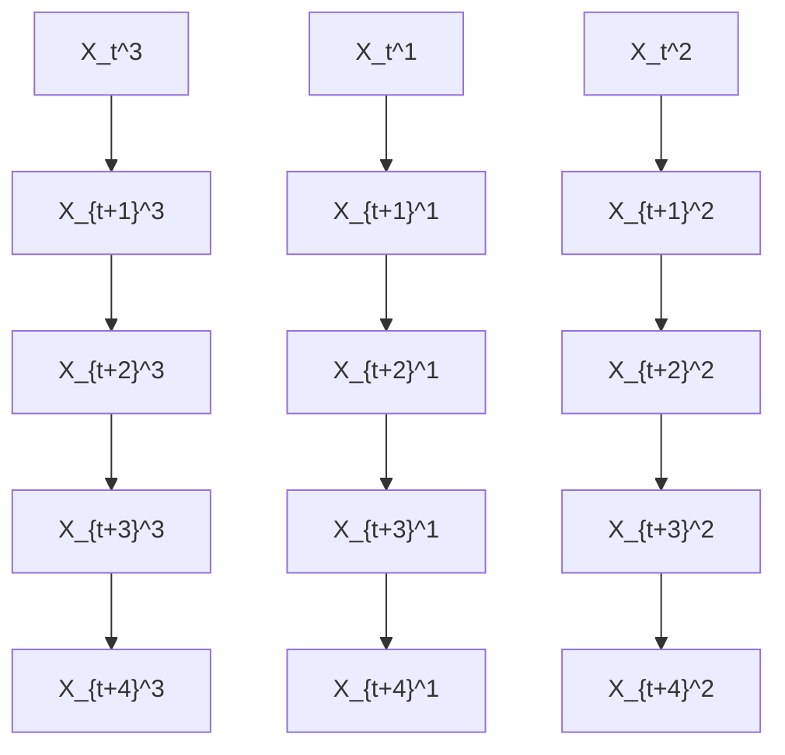

图10.1：无瞬时效应的时间序列示例。

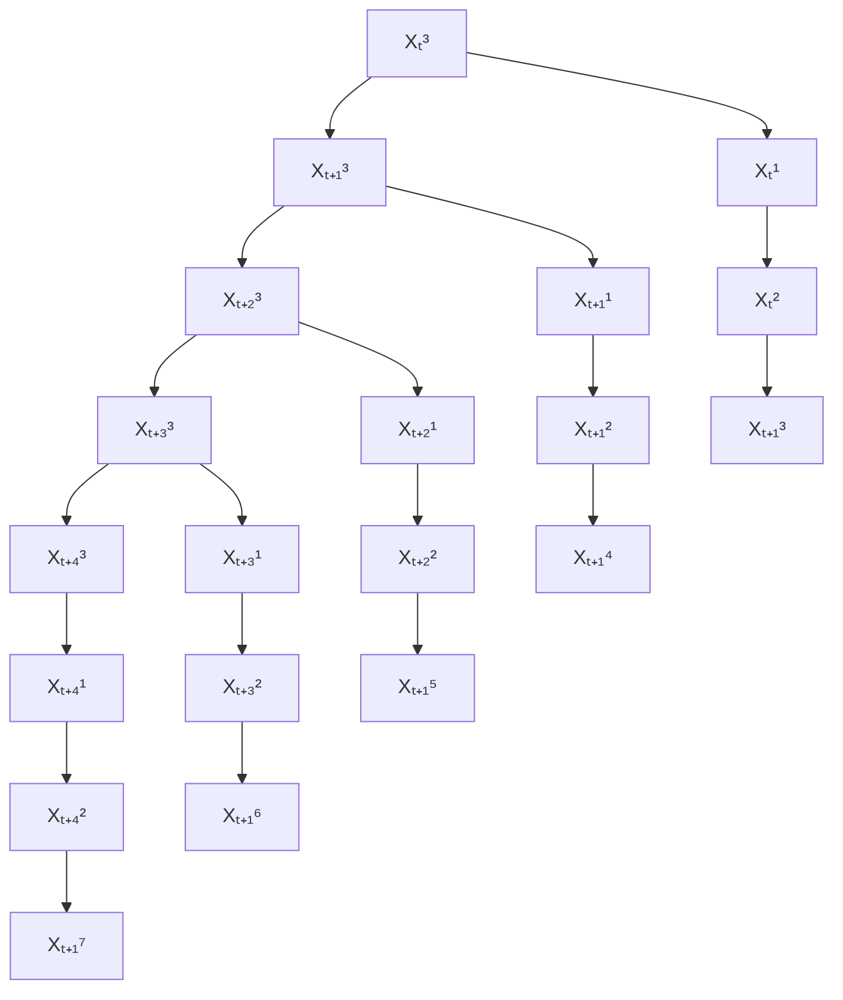

图10.2：有瞬时效应的时间序列示例。

首先，以节点 $X _ { t } ^ { j }$ 对于 $( j , t ) \in \{ 1 , \ldots , d \} \times \mathbb { Z }$ 的因果图¹ 只包含从 $X _ { t } ^ { j }$ 到 $X _ { s } ^ { k }$ 且 $t < s$ 的箭头，但不包含 $t = s$ 的情况；见图10.1。那么我们就说没有瞬时效应。其次，因果图包含瞬时效应，即除了从 $X _ { t } ^ { m }$ 到 $X _ { s } ^ { \ell }$ 且 $t < s$ 以及某些 m 和 $\ell$ 的箭头之外，还存在从 $X _ { t } ^ { j }$ 到 $X _ { t } ^ { k }$ 对于某些 j 和 k 的箭头，如图10.2所示。如果对于任何 $j \neq k$ 和 $h > 0$ ，变量 $X _ { t } ^ { j }$ 和 $X _ { t } ^ { k }$ 以及 $X _ { t + h } ^ { j }$ 和 $X _ { t + h } ^ { k }$ 之间不存在任何关系，则因果结构称为纯瞬时的；其中每个 $X _ { t } ^ { j }$ 不受任何先前变量（包括其自身过去）的影响，可以忽略，因为它不需要被描述为时间序列。相反，索引 t 可以被视为标记前几章独立同分布设置中统计样本的独立实例的索引。

我们将**全时间图（full time graph）**定义为以 $X _ { t } ^ { i }$ 为节点的DAG，如图10.1和10.2所示。

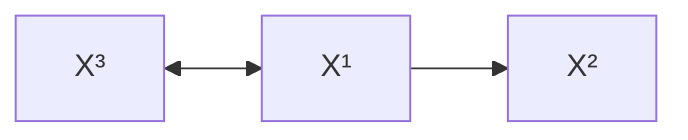

图10.3：图10.1和10.2所示全时间图的摘要图。

与前几章相比，全时间图是一个具有无限多个节点的DAG。**摘要图（summary graph）**是以节点 $X ^ { 1 } , \ldots , X ^ { d }$ 的有向图，当存在从 $X _ { t } ^ { j }$ 到 $X _ { s } ^ { k }$ 对于某些 $t \leq s \in \mathbb { Z }$ 的箭头时，对于 $j \neq k$ 包含从 $X ^ { j }$ 到 $X ^ { k }$ 的箭头。注意，摘要图是一个可能包含环的有向图，尽管我们假设全时间图是无环的。图10.3显示了与图10.1和10.2中所示全时间图相对应的摘要图。对于任何 $t \in \mathbb { Z }$ ，我们用 $\mathbf { X } _ { \mathrm { p a s t } ( t ) }$ 表示所有 $s < t$ 的 Xs 的集合，并使用 $X _ { \mathrm { p a s t } ( t ) } ^ { j }$ 表示特定分量 $X ^ { j }$ 的过去。如果 t 是某个固定的参考时间实例，我们也写成 $X _ { \mathrm { p a s t } } ^ { j }$ 。此外，$( \mathbf { X } _ { t } ^ { - j } ) _ { t \in \mathbb { Z } }$ 表示所有 $k \neq j$ 的时间序列 $( \mathbf { X } _ { t } ^ { k } ) _ { t \in \mathbb { Z } }$ 的集合。

## 10.2 结构因果模型与干预（Structural Causal Models and Interventions）

我们假设随机过程 $( \mathbf { X } _ { t } ) _ { t \in \mathbb { Z } }$ 允许通过一个**结构因果模型（Structural Causal Model, SCM）**来描述，其中最多出现所有变量的过去 q 个值（对于某个 q）：

$$
X _ {t} ^ {j} := f ^ {j} \left((\mathbf {P A} _ {q} ^ {j}) _ {t - q}, \dots , (\mathbf {P A} _ {1} ^ {j}) _ {t - 1}, (\mathbf {P A} _ {0} ^ {j}) _ {t}, N _ {t} ^ {j}\right), \tag {10.1}
$$

其中

$$
\ldots , N _ {t - 1} ^ {1}, \ldots , N _ {t - 1} ^ {d}, N _ {t} ^ {1}, \ldots , N _ {t} ^ {d}, N _ {t + 1} ^ {1}, \ldots , N _ {t + 1} ^ {d}, \ldots
$$

是联合独立的噪声项。这里，对于每个 $s \in \mathbb { Z }$ ，符号 $( \mathbf { P A } _ { s } ^ { j } ) _ { t - s }$ 表示影响 $X _ { t } ^ { j }$ 的变量 $X _ { t - s } ^ { k } , k = 1 , \ldots , d$ 的集合。注意，$\mathbf { P A } _ { t - s } ^ { J }$ 可能包含 $X _ { t - s } ^ { j }$ 对于所有 $s > 0$ ，但不包含 $s = 0$ 的情况。我们假设相应的全时间图是无环的。

(10.1) 的一个流行特例是**向量自回归模型（vector autoregressive models, VAR）** [Lutkepohl, 2007]：

$$
X _ {t} ^ {j} := \sum_ {i = 1} ^ {q} A _ {i} ^ {j} \mathbf {X} _ {t - i} + N _ {t} ^ {j}, \tag {10.2}
$$

其中每个 $A _ { i } ^ { j }$ 是一个 $1 \times d$ 矩阵；另见关于线性循环模型的注记6.5，特别是方程(6.4)。

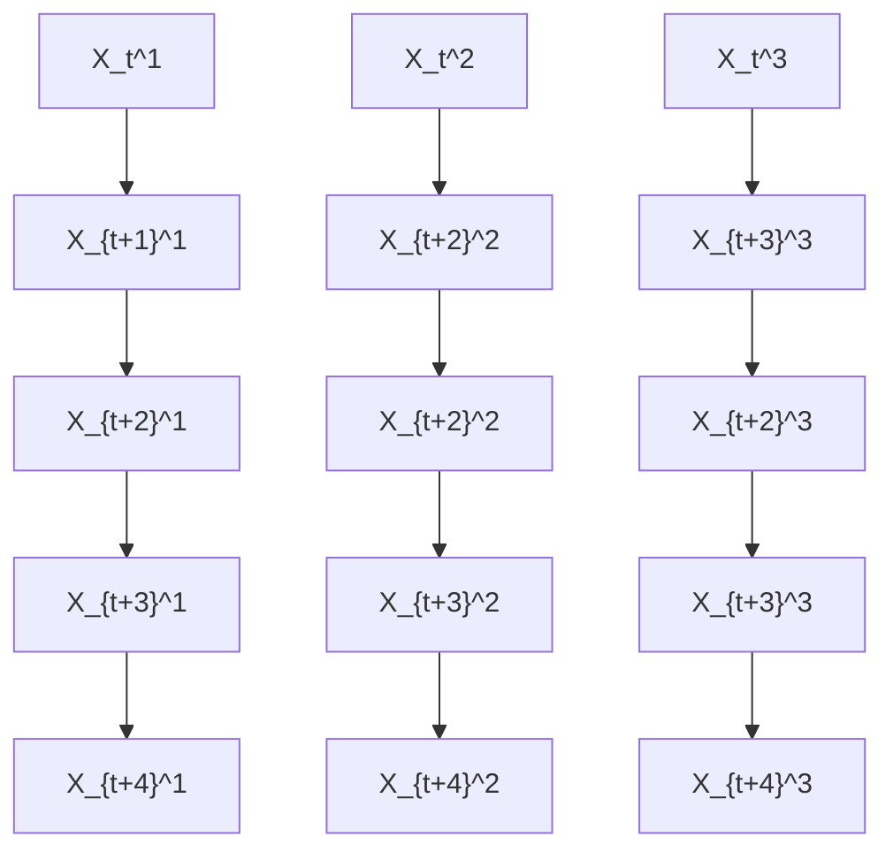

图10.4：子采样时间序列示例：只观测到阴影区域中的变量。

与独立同分布设置一样，SCM形式化了干预的效果；更准确地说，干预对应于替换一些结构赋值。例如，干预可能包括将某个 j 的所有值 $\{ X _ { t } ^ { j } \} _ { t \in \mathbb { Z } }$ 设置为某些特定值。或者，也可以仅在某个特定时间实例 t 对 $X _ { t } ^ { j }$ 进行干预。

### 10.2.1 子采样（Subsampling）

在许多应用中，采样过程可能比因果过程的时间尺度慢。图10.4显示了一个示例，其中只观测到每隔一个时间实例。原始全系统的摘要图包含边 $X ^ { 1 } \rightarrow X ^ { 2 } \rightarrow X ^ { 3 }$ 。我们现在可能希望为观测到的子采样过程构建一个因果模型。因此，定义我们允许哪些干预非常重要。首先，如果我们限制自己对观测时间点进行干预，则不应存在从 $X ^ { 1 }$ 到 $X ^ { 2 }$ 的因果影响。对 $X ^ { 1 }$ 的观测实例进行干预对 $X ^ { 2 }$ 的可观测部分没有任何影响（注意，时间序列 $X ^ { 1 }$ 只有滞后两期的效应 $X _ { t } ^ { 1 } \to X _ { t + 2 } ^ { 1 }$ ）。此外，在这种设置下，如果之前没有瞬时效应，子采样不会产生虚假的瞬时效应。对于SCM的情况，Bongers等人 [2016, 第3章] 描述了如何通过将隐藏时间步的因果机制代入其他机制来边缘化模型的正式过程。如果干预限于观测时间点，则得到的模型能正确描述干预的效果。其次，如果我们确实考虑对隐藏变量的干预，我们可能有兴趣恢复原始的摘要图，这是一个由Danks和Plis [2013] 以及Hyttinen等人 [2016] 等人研究的问题。

在某些情况下，子采样并不是数据生成过程的好模型。例如，对于许多物理测量，人们可能希望将观测值建模为连续时间点的平均值，而不是这些时间点的稀疏子集。前者是一个有用但复杂的模型假设：平均过程可能会改变模型类别，并且还需要小心地建模干预。

## 10.3 学习因果时间序列模型（Learning Causal Time Series Models）

目前，**格兰杰因果关系（Granger causality）**及其变体是因果时间序列分析中最流行的方法之一。为了在章节之间提供更好的联系，我们首先解释使用基于条件独立的方法可以得出的结论。这个顺序决不应被误解为对这些方法的评判。

第10.3.1和10.3.2节主要包含可识别性结果。其余三节，即10.3.3、10.3.4和10.3.5，包含了更具体的因果时间序列学习方法。如果多元时间序列已经在有限个时间点上被采样一次，则可以应用这些方法。然而，大多数想法也适用于我们收到同一时间序列的多个独立同分布重复的情况。

### 10.3.1 马尔可夫条件与忠实性（Markov Condition and Faithfulness）

引理6.25指出，两个DAG是**马尔可夫等价（Markov equivalent）**的当且仅当它们的骨架（skeleton）和**v-结构（v-structures）**集一致。如果不存在瞬时效应，则全时间图已经通过知道其骨架而确定。箭头只能指向时间的前方。因此我们得出结论 [Peters et al., 2013, 定理1的证明]：

**定理10.1（无瞬时效应情况下的可识别性）** 假设两个全时间图由无瞬时效应的SCM诱导。如果全时间图是马尔可夫等价的，则它们相等。

因此，在马尔可夫条件和忠实性成立的前提下（为了处理无限大的DAG，有时假设时间序列从 t = 0 开始），我们可以从条件独立性唯一地识别全时间图。

在存在瞬时效应的情况下，马尔可夫等价图最多只能在这些效应的方向上有所不同。然而，在许多情况下，即使这个方向也可以被识别，因为不同的瞬时效应方向会诱导不同的v-结构集。图10.5显示了一个简单的例子。即使将图10.5中添加从 $X _ { t }$ 到 $Y _ { t + 1 }$ 对于所有 $t \in \mathbb { Z }$ 的箭头，或者添加从 $Y _ { t }$ 到 $X _ { t + 1 }$ 的箭头，仍然可以推断出瞬时效应的方向；然而，我们不能同时添加两者，因为这会移除所有v-结构。以下由Peters等人 [2013, 定理1] 给出的充分条件可用于识别瞬时效应的方向：

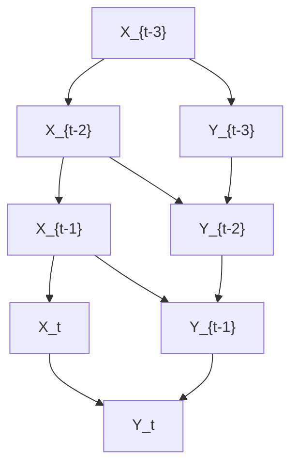

(a) 在 $( Y _ { t } ) _ { t \in \mathbb { Z } }$ 的所有节点处存在v-结构。

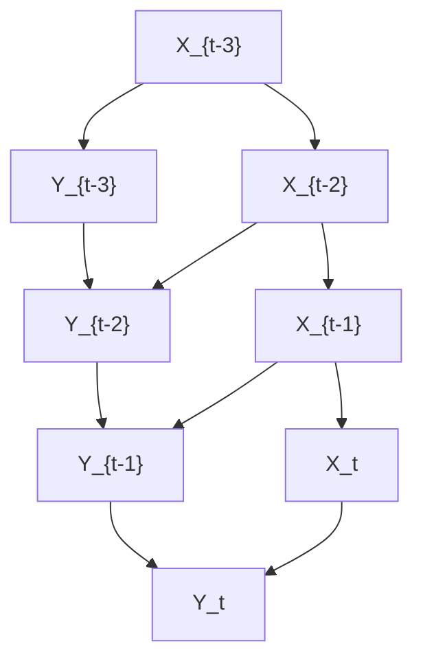

(b) 在 $( X _ { t } ) _ { t \in \mathbb { Z } }$ 的所有节点处存在v-结构。  
图10.5：两个非马尔可夫等价的DAG，尽管它们在瞬时效应上一致。

**定理10.2（无环摘要图的可识别性）** 假设两个全时间图由SCM诱导，并且在两种情况下，对于每个 j，$X _ { t } ^ { j }$ 受到某个 $s \geq 1$ 的 $X _ { t - s } ^ { j }$ 的影响。进一步假设摘要图是无环的。如果全时间图是马尔可夫等价的，则它们相等。

以下结果表明，摘要图中任何箭头的存在原则上可以通过单个条件独立性检验来确定。

**定理10.3（格兰杰因果关系的合理性）** 考虑时间序列 $( \mathbf { X } _ { t } ) _ { t \in \mathbb { Z } }$ 的无瞬时效应SCM，使得诱导的联合分布相对于相应的全时间图是**忠实（faithful）**的。那么，摘要图中存在从 $X ^ { j }$ 到 $X ^ { k }$ 的箭头当且仅当存在某个 $t \in \mathbb { Z }$ 使得

$$
X _ {t} ^ {k} \not \perp X _ {\text { past } (t)} ^ {j} | \mathbf {X} _ {\text { past } (t)} ^ {- j}. \tag {10.3}
$$

为完整起见，我们在附录C.14中包含了证明。类似的结果可以在White和Lu [2010] 以及Eichler [2011, 2012] 中找到。正如定理10.3的标题所暗示的，这是我们在第10.3.3节中更详细讨论的格兰杰因果关系的基础。

### 10.3.2 一些因果结论不需要忠实性（Some Causal Conclusions Do Not Require Faithfulness）

值得注意的是，即使不使用忠实性，也可以从条件依赖性得出有趣的因果结论。这与独立同分布情况形成对比，在独立同分布情况下，对于任何节点排序，任何分布对于完全DAG都是马尔可夫的。由于时间上没有向后的箭头，时间序列的马尔可夫条件足以推断摘要图是 X → Y 还是 Y → X，假设两者之一为真。

**定理10.4（箭头 $X \rightarrow Y$ 的检测）** 考虑双变量时间序列 $( X _ { t } , Y _ { t } ) _ { t \in \mathbb { Z } }$ 的SCM。

(i) 如果存在某个 $t \in \mathbb { Z }$ 使得

$$
Y _ {t} \not \perp X _ {\text { past } (t)} \mid Y _ {\text { past } (t)}, \tag {10.4}
$$

则摘要图包含从 X 到 Y 的箭头。

(ii) 进一步假设没有瞬时效应，且任何有限变量子集的联合密度严格为正。如果对于所有 $t \in \mathbb { Z }$ ，我们有

$$
Y _ {t} \perp X _ {\text { past } (t)} \mid Y _ {\text { past } (t)}, \tag {10.5}
$$

则摘要图不包含从 X 到 Y 的箭头。

同样，这个证明可能已在其他地方出现，但我们为完整起见将其包含在附录C.15中。证明 (ii) 需要**因果极小性（causal minimality）**，这严格弱于忠实性。

在下一小节中，我们将看到定理10.4及其各种变体 [例如，White and Lu, 2010, Eichler, 2011, 2012] 将基于条件独立的因果发现方法与格兰杰因果关系联系起来。

### 10.3.3 格兰杰因果关系（Granger Causality）

为简单起见，我们从格兰杰因果关系的双变量版本开始。

**双变量格兰杰因果关系** 定理10.4表明（在排除瞬时效应以及温和的技术条件下），摘要图中箭头存在与否可以通过检验(10.5)以及交换 X 和 Y 角色后的类似陈述来推断。然后我们可以区分可能的摘要图：X ⟂ Y、X → Y、X ← Y、X ↔ Y。当 X 的过去值有助于从其自身过去预测 Y 时，我们推断 X 影响 Y。形式上，我们写成

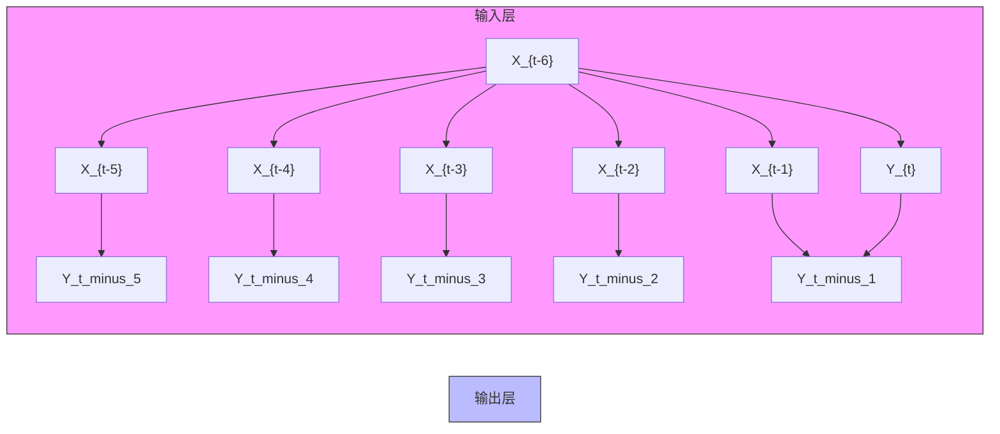

图10.6：格兰杰因果关系起作用的典型场景：如果所有从X到Y的箭头都缺失，给定Y自身过去的情况下，Yt将与X的过去值条件独立。这里，给定Y自身过去的情况下，$Y _ { t }$ 确实依赖于X的过去值。因此，条件(10.4)证明了从X到Y存在影响。

$$
X \text {   格兰杰-引起   } Y \quad : \Longleftrightarrow \quad Y _ {t} \not \perp X _ {\text { past } (t)} \mid Y _ {\text { past } (t)}. \tag {10.6}
$$

这个想法可以追溯到Wiener [1956, 第189–190页]，他认为如果通过额外考虑X能改进从Y自身过去对Y的预测，则X对Y具有因果影响。定理10.4成立的典型场景如图10.6所示。

通常，格兰杰因果关系指的是线性预测。此时，比较以下两个线性回归模型：

$$
Y _ {t} = \sum_ {i = 1} ^ {q} a _ {i} Y _ {t - i} + N _ {t} \tag {10.7}
$$

$$
Y _ {t} = \sum_ {i = 1} ^ {q} a _ {i} Y _ {t - i} + \sum_ {i = 1} ^ {q} b _ {i} X _ {t - i} + \tilde {N} _ {t}, \tag {10.8}
$$

其中 $( N _ { t } ) _ { t \in \mathbb { Z } }$ 和 $( \tilde { N } _ { t } ) _ { t \in \mathbb { Z } }$ 分别被假设为独立同分布的时间序列。当噪声项 $\tilde { N } _ { t }$（对于包含X的预测）的方差显著小于不使用X得到的噪声项 $N _ { t }$ 的方差时，推断X格兰杰引起Y。这等于说，在给定 $Y _ { \mathrm { p a s t } ( t ) }$ 的条件下，$Y _ { t }$ 与 $X _ { \mathrm { p a s t } ( t ) }$ 具有非零的**偏相关（partial correlations）**。对于多元高斯分布，这等价于依赖性陈述(10.4)。使用非线性回归的这一思想的变体也已被广泛研究 [例如，Ancona et al., 2004, Marinazzo et al., 2008]。关于(10.5)的非参数检验，参见例如Diks和Panchenko [2006] 及其参考文献。

一个衡量在给定Y过去条件下 $Y _ { t }$ 与 X 过去之间依赖性的信息论量是**转移熵（transfer entropy）** [Schreiber, 2000]：

$$
T E (X \rightarrow Y) := I (Y _ {t}: X _ {\text { past } (t)} | Y _ {\text { past } (t)}), \tag {10.9}
$$

好的，遵照您的详细要求，以下是原文的准确、专业、清晰的中文翻译。

其中 $I ( \mathbf { A } : \mathbf { B } | \mathbf { C } )$ 表示任意三个变量集合 A、B、C 的**条件互信息（conditional mutual information）**[Cover and Thomas, 1991]；另见附录 A。因此，估计**转移熵（transfer entropy）**并在其显著大于 0 时推断 X 导致 Y，可以被视为**格兰杰因果关系（Granger causality）**在信息论框架下的实现，该实现能够处理任意非线性影响。因此，人们很容易将转移熵视为衡量 X 对 Y 影响强度的指标，但“格兰杰因果关系的局限性”一节将解释为什么这不合适。

**多元格兰杰因果关系（Multivariate Granger Causality）** 如定理 10.4 中所述的双变量时间序列的因果充分性假设通常是不合适的。Granger [1980] 已经指出了这一点。因此，我们说 $X ^ { j }$ **格兰杰导致（Granger causes）** $X ^ { k }$，如果

$$
X _ {t} ^ {k} \not \perp X _ {\text { past } (t)} ^ {j} | \mathbf {X} _ {\text { past } (t)} ^ {- j}.
$$

Granger 已经强调，正确使用格兰杰因果关系实际上需要以世界上所有相关变量为条件。尽管如此，格兰杰因果关系常常以其双变量形式使用，或者在明显重要的变量未被观测到的情况下使用。当从因果角度解释结果时，这种使用可能会产生误导性的陈述。

**格兰杰因果关系的局限性（Limitations of Granger Causality）** 违反因果充分性——正如前几章独立同分布（i.i.d.）场景中一样——是因果时间序列分析中的一个严重问题。为了解释为什么格兰杰因果关系在因果不充分的多元时间序列中会产生误导，我们将注意力限制在仅观测到双变量时间序列 $( X _ { t } , Y _ { t } ) _ { t \in \mathbb { Z } }$ 的情况。假设 $X _ { t }$ 和 $Y _ { t }$ 都受到一个隐藏时间序列 $( Z _ { t } ) _ { t \in \mathbb { Z } }$ 先前实例的影响。这在图 10.7(a) 中描绘，其中 Z 以延迟 1 影响 X，以延迟 2 影响 Y。假设忠实性（faithfulness），d-分离准则告诉我们

$$
Y _ {t} \not \perp X _ {\text { past } (t)} \mid Y _ {\text { past } (t)},
$$

同时我们有

$$
X _ {t} \perp       \perp Y _ {\text { past } (t)}   | X _ {\text { past } (t)}.
$$

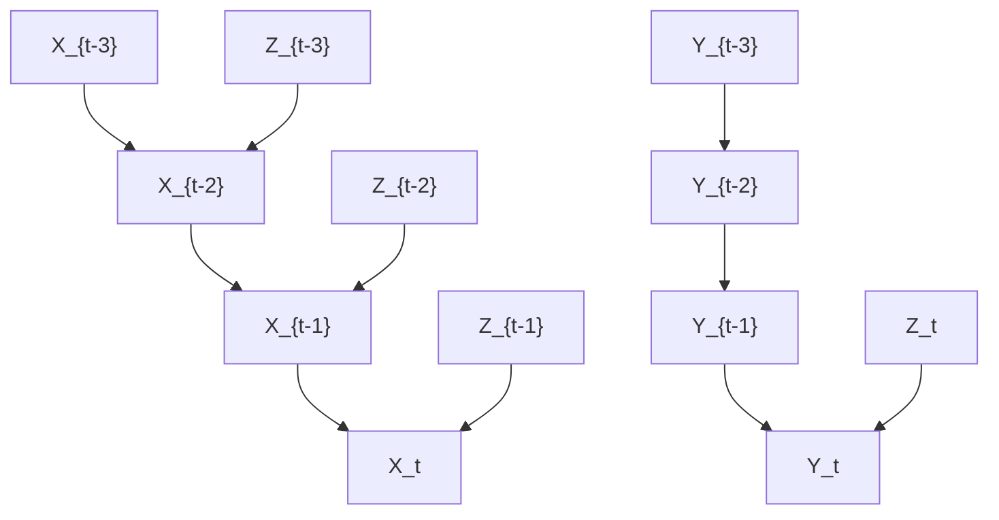

(a) 由于隐藏的共同原因 $Z$，格兰杰因果关系错误地推断出从 X 到 Y 的因果影响。

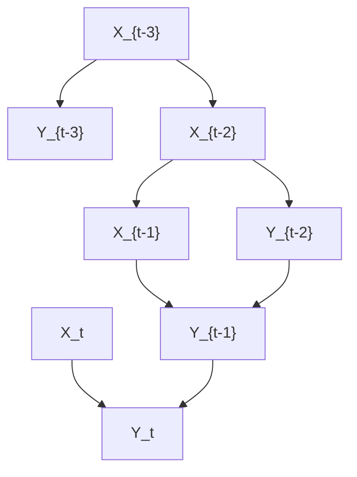

(b) 如果从 $X _ { t }$ 到 $Y _ { t + 1 }$ 以及从 $Y _ { t }$ 到 $X _ { t + 1 }$ 的影响是确定性的，格兰杰因果关系会错误地推断出既没有从 X 到 Y 也没有从 Y 到 X 的因果影响。  
图 10.7：在这些例子中，格兰杰因果关系推断出错误的图结构。

因此，天真地应用格兰杰因果关系会推断出 X 导致 Y，而 Y 不导致 X。例如，在黄油价格和奶酪价格之间的关系中观察到了这种效应。两种价格都受到牛奶价格的强烈影响，但奶酪的生产时间比黄油长得多，这导致了牛奶和奶酪价格之间更大的延迟 [Peters et al., 2013, 实验 10]。然而，格兰杰因果关系的这种失败之所以可能发生，只是因为并非所有相关变量都被观测到，而 Granger 本人曾将其陈述为一个必要条件。

Ay 和 Polani [2008] 提供了格兰杰因果关系失败的第二个例子，如图 10.7(b) 所示。假设 $X _ { t - 1 }$ 通过复制操作确定性地影响 $Y _ { t }$，即 $Y _ { t } : = X _ { t - 1 }$。同样，$Y _ { t - 1 }$ 的值被复制到 $X _ { t }$。那么直观上很明显，X 和 Y 彼此强烈影响，因为对 $X _ { t }$ 值的干预会改变所有 $k \in  { \mathbb { N } } _ { 0 }$ 的 $Y _ { t + 1 + 2 k }$ 值。同样，对 $Y _ { t }$ 的干预会改变所有 $X _ { t + 1 + 2 k }$ 的值。然而，X 的过去对于根据 Y 的过去预测 $Y _ { t }$ 是无用的，因为 $Y _ { t }$ 已经可以从其自身的过去完美预测。当然，确定性关系通常对于基于条件独立性的因果推断是有问题的，因为确定性会引入额外的独立性。例如，如果在因果链 $X \rightarrow Y \rightarrow Z$ 中 Y 是 X 的函数，我们得到 $Y \perp \perp Z | X$，这对于这种因果结构来说是不典型的。因此，有人可能会争辩说这个例子是人为的，更自然的版本应该是带有噪声的复制操作。对于 $X _ { t }$ 和 $Y _ { t }$ 是二元变量的情况，Janzing et al. [2013, 例 7] 表明，当复制操作的噪声水平趋近于 0 时，转移熵收敛到 0。那么，格兰杰因果关系确实会推断出 X 导致 Y 且 Y 导致 X，但对于小噪声，X 的过去对 $Y _ { t }$ 预测的微小改进并不能恰当地反映时间序列之间的相互影响（这种影响在直观意义上仍然很强）。从这个意义上说，转移熵并不是衡量一个时间序列对另一个时间序列因果影响强度的合适指标。Janzing et al. [2013] 讨论了量化因果影响的不同提议（针对时间序列和独立同分布设置）的局限性，并提出了另一种信息论度量来衡量因果强度。总结本段，我们强调，在两个因果充分的时间序列的情况下，关于因果影响存在或不存在的定性陈述仅在相当人为的场景中失败，而通过转移熵（这源于从信息论角度解释“预测改进”）来量化因果影响，即使在不太人为的场景中也可能存在问题。

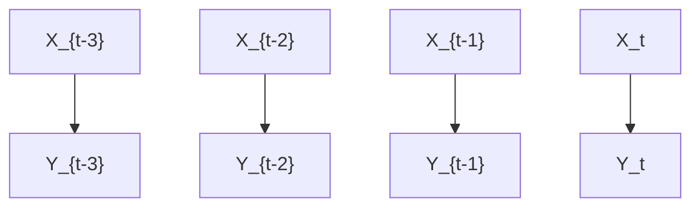

(a) 格兰杰因果关系无法检测到 X 对 Y 的影响，因为 X 的过去仅通过 Y 的过去影响 $Y _ { t }$。

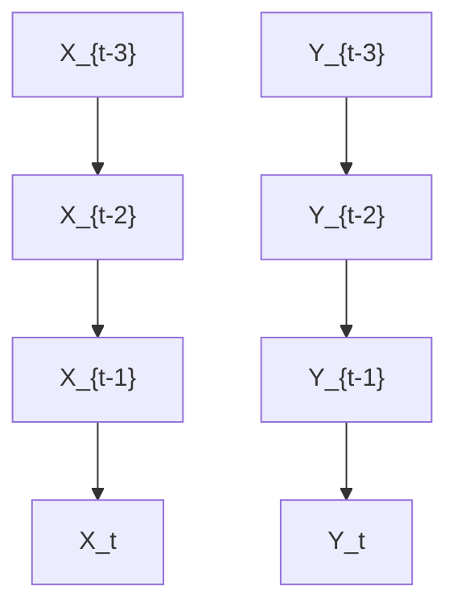

(b) 这里，X 的过去对于预测 $Y _ { t }$ 仍然有帮助，因为 $X _ { t - 1 }$ 通过 $X _ { t }$ 间接影响 $Y _ { t }$。因此，格兰杰因果关系仍然能够检测到 X 对 Y 的影响。  
图 10.8：两种具有瞬时效应的场景，一种格兰杰因果关系无法检测到它们 (a)，另一种可以检测到 (b)。

还有另一种场景，格兰杰因果关系在定量上是误导性的，但其定性陈述仍然是正确的，除非违反了忠实性（然而，它使用了瞬时效应，有人可能会争辩说，对于足够精细的时间分辨率，这些效应会消失 [Granger, 1988]）。对于图 10.8(a)，d-分离得出

$$
Y _ {t} \perp       \perp X _ {\text { past } (t)}   |   Y _ {\text { past } (t)}.
$$

直观地说，只有当前值 $X _ { t }$ 有助于更好地预测 $Y _ { t }$，但过去值 $X _ { t - 1 } , X _ { t - 2 } , \dots$ 是无用的，因此，格兰杰因果关系没有提出从 X 到 Y 的链接。然而，在图 10.8(b) 中，格兰杰因果关系确实检测到了 X 对 Y 的影响（如果我们假设忠实性），尽管它仍然是纯瞬时的，但预测的微小改进并不能恰当地反映 $X _ { t }$ 对 $Y _ { t }$ 潜在强影响。为了解释瞬时效应，有人提出了格兰杰因果关系的修改，在相应的**结构因果模型（SCM）**中添加瞬时项，但这样可识别性可能会失效 [例如，Lutkepohl, 2007, (2.3.20) 和 (2.3.21)]。知道一个系统包含瞬时效应可能建议修改格兰杰因果关系，即在 (10.8) 中对 $Y _ { t }$ 进行回归时，不仅基于 $X _ { \mathrm { p a s t } ( t ) }$，而是基于 $X _ { t } \cup X _ { \mathrm { p a s t } ( t ) }$。然而，正如 Granger [1988] 已经指出的，这可能会导致错误的结论：如果 $X _ { t }$ 有助于预测 $Y _ { t }$，这可能同样意味着 $Y _ { t }$ 影响 $X _ { t }$，而不是指示从 $X _ { t }$ 到 $Y _ { t }$ 的影响。

**注 10.5（模型设定错误可能有所帮助）** 这个见解有一个悖论性的信息：即使在变量瞬时影响其他变量的情况下，为了推断因果陈述，检查一个变量的过去是否有助于预测，比检查过去和当前值是否都有帮助更具结论性。定理 10.4 的条件 (i) 并不排除瞬时效应。因此（在因果充分性的前提下），我们仍然可以得出结论，$X _ { \mathrm { p a s t } ( t ) }$ 对于根据 $Y _ { \mathrm { p a s t } ( t ) }$ 预测 $Y _ { t }$ 的任何益处，都是由于 X 对 Y 的影响。此外，只要 X 对 Y 有任何影响，无论它是否是纯瞬时的，在一般情况下，$X _ { \mathrm { p a s t } ( t ) }$ 都会改善我们根据 $Y _ { \mathrm { p a s t } ( t ) }$ 对 $Y _ { t }$ 的预测。□

### 10.3.4 具有受限函数类的模型（Models with Restricted Function Classes）

为了解决格兰杰因果关系的局限性，Hyvarinen et al. [2008] 描述了线性非高斯自回归模型，这些模型使得具有瞬时效应的因果结构可识别。Peters et al. [2013] 描述了如何使用 (10.1) 中限制性较少的函数类 $f ^ { j }$ 来解决这个任务。一个例子是将**加性噪声模型（ANM）**适应于时间序列，即使用 SCM

$$
X _ {t} ^ {j} := f ^ {j} \left((\mathbf {P A} _ {q} ^ {j}) _ {t - q}, \dots , (\mathbf {P A} _ {1} ^ {j}) _ {t - 1}, (\mathbf {P A} _ {0} ^ {j}) _ {t}\right) + N _ {t} ^ {j},
$$

对于 $j \in \{ 1 , \dotsc , d \}$。除了在马尔可夫等价类内因果结构的可识别性之外，使用受限函数类还有第二个动机：Peters et al. [2013] 使用模拟时间序列提供了一些经验证据，支持这样一种信念，即允许来自受限函数类模型的时间序列不太可能是混杂的。

### 10.3.5 谱独立性准则（Spectral Independence Criterion）

**谱独立性准则（Spectral Independence Criterion, SIC）** 是一种基于 Shajarisales et al. [2015] 中描述的**原因与机制之间的独立性（independence between cause and mechanism）**思想的方法。假设我们给定一个弱平稳双变量时间序列 $( X _ { t } , Y _ { t } ) _ { t \in \mathbb { Z } }$，其中要么 X 影响 Y，要么 Y 通过一个线性时不变滤波器影响 X。更明确地说，对于 X 影响 Y 的情况，Y 是通过与函数 h 的卷积从 X 得到的：

$$
Y _ {t} = \sum_ {k = 1} ^ {\infty} h (k) X _ {t - k}. \tag {10.10}
$$

关于技术细节，例如确保 (10.10) 及以下表达式定义良好的 h 的衰减条件，我们参考 Shajarisales et al. [2015]。为了形式化 X 和 h 之间的独立性条件，我们考虑滤波器在频域中的行为：对于所有 $\nu \in \left[ - 1 / 2 , 1 / 2 \right]$，令 $S _ { X X } ( \nu )$ 表示频率 ν 的**功率谱密度（power spectral density）**；后者由自协方差函数的傅里叶变换显式给出

$$
C _ {X X} (\tau) := \mathbb {E} \left[ X _ {t} X _ {t + \tau} \right], \quad \text { with } \tau \in \mathbb {Z}.
$$

那么，(10.10) 得出

$$
S _ {Y Y} (\nu) = | \tilde {h} (\nu) | ^ {2} \cdot S _ {X X} (\nu), \tag {10.11}
$$

其中 $\begin{array} { r } { \tilde { h } ( \nu ) = \sum _ { k \in \mathbb { Z } } e ^ { - i 2 \pi k \nu } h ( k ) } \end{array}$ 表示 h 的傅里叶变换。换句话说，将输入时间序列的功率谱乘以滤波器传递函数的平方，就得到了输出的功率谱。每当 $\tilde { h }$ 可逆时，除了 (10.11) 之外，我们还有

$$
S _ {X X} (\nu) = \left| \frac {1}{\tilde {h} (\nu)} \right| ^ {2} \cdot S _ {Y Y} (\nu). \tag {10.12}
$$

虽然方程 (10.11) 和 (10.12) 都是有效的，但问题在于哪一个描述了因果模型。其思想是，对于因果方向，输入时间序列的功率谱不携带关于滤波器传递函数的信息。为了形式化这一点，Shajarisales et al. [2015] 陈述了以下独立性条件：

**定义 10.6 (SIC)** 如果 $S _ { X X }$ 和 $\tilde { h }$ 是不相关的，即

$$
\langle S _ {X X} \cdot | \tilde {h} | ^ {2} \rangle = \langle S _ {X X} \rangle \cdot \langle | \tilde {h} | ^ {2} \rangle , \tag {10.13}
$$

则称时间序列 X 和滤波器 h 满足 SIC，其中 $\textstyle \langle f \rangle : = \int _ { - 1 / 2 } ^ { 1 / 2 } f ( \nu ) d \nu$ 表示频率区间 $[ - 1 / 2 , 1 / 2 ]$ 上任何函数的平均值。

Shajarisales et al. [2015] 表明，(10.13) 意味着反向方向的类似独立性条件不成立，除非在 $| { \tilde { h } } |$ 在整个频率区间上为常数的非一般情况。

**定理 10.7 (通过 SIC 的可识别性)** 如果 (10.13) 成立且 $| { \hat { h } } |$ 在 ν 上不是常数，那么 $S _ { Y Y }$ 与 $1 / | { \tilde { h } } |$ 负相关，即

$$
\langle S _ {Y Y} \cdot 1 / | \tilde {h} | ^ {2} \rangle <   \langle S _ {Y Y} \rangle \cdot \langle 1 / | \tilde {h} | ^ {2} \rangle . \tag {10.14}
$$

证明. (10.13) 和 (10.14) 的左边分别由 $\langle S _ { Y Y } \rangle$ 和 $\langle S _ { X X } \rangle$ 给出。詹森不等式指出 $1 / \langle | \tilde { h } | ^ { 2 } \rangle < \langle 1 / | \tilde { h } | ^ { 2 } \rangle$，这蕴含了该陈述。 

Shajarisales et al. [2015] 提出了一种简单的因果推断算法，该算法检查哪个方向更接近满足 SIC。他们报告了使用 SIC 在各种模拟和真实世界数据集上进行实验的一些令人鼓舞的结果。

## 10.4 动态因果建模（Dynamic Causal Modeling）

**动态因果建模（Dynamic Causal Modeling, DCM）** 是一种专门为推断不同脑区活动之间的因果关系而开发的技术 [Friston et al., 2003]。如果向量 $z \in \mathbb { R } ^ { n }$ 编码了 n 个脑区的活动，而 $u \in \mathbb { R } ^ { m }$ 是一个扰动向量，则 $z$ 的动态由以下形式的微分方程给出

$$
\frac {d}{d t} z = F (z, u, \theta), \tag {10.15}
$$

其中 F 是一个已知函数，$u \in \mathbb { R } ^ { m }$ 是外部刺激向量，θ 参数化了描述不同脑区之间因果联系的模型类。人们通常考虑以下 (10.15) 的双线性近似：

$$
\frac {d}{d t} z = \left(A + \sum_ {j = 1} ^ {m} u _ {j} B ^ {j}\right) z + C u, \tag {10.16}
$$

其中 $A , B ^ { 1 } , \ldots , B ^ { m }$ 是 $n \times n$ 矩阵，C 的大小为 $n \times m$。A 描述了不同区域活动 $z _ { j }$ 的相互影响，而矩阵 $B ^ { j }$ 描述了 u 如何改变它们的相互影响。C 编码了 u 对 z 的直接影响。

这里，z 不是直接可观测的，但可以检测到**血流动力学响应（hemodynamic response）**。血流提供增加量的营养物质（如氧气和葡萄糖）以补偿增加的能量需求。**功能性磁共振成像（functional magnetic resonance imaging, fMRI）** 能够通过**血氧水平依赖（blood-oxygen-level–dependent, BOLD）信号**检测到这种增加。定义一个包含脑活动和一些血流动力学状态变量的状态向量 x，通过将 (10.16) 与血流动力学响应的动力学模型相结合，我们得到关于 x 的微分方程

$$
\frac {d}{d t} x = f (x, u, \theta) \tag {10.17}
$$

高维参数 θ 由 (10.16) 的所有自由参数和来自血流动力学响应建模的参数组成。然后，我们使用一个模型来描述 x 如何确定测量的 BOLD 信号 y：

$$
y = \lambda (x). \tag {10.18}
$$

最后，作为数据，我们获得了 y 向量的观测时间序列。然后，DCM 使用各种已知的用于学习具有潜变量模型的技术（例如，**期望最大化（expectation maximization, EM）**）从这些数据中推断 (10.16) 中的矩阵。

Lohmann et al. [2012a] 批评 DCM，主要是因为模型参数的数量随着 n 和 m 的增长而爆炸，这使得从经验数据中识别它们变得不可能。根据他们对模拟脑连接的实验，很大一部分错误模型通过 DCM 获得了比真实模型更高的证据。这些发现引发了关于 DCM 的辩论；另见 Friston et al. [2013] 对 Lohmann et al. [2012a] 的回应，以及 Lohmann et al. [2012b] 对 Friston et al. [2013] 的回应。

## 10.5 习题（Problems）

**问题 10.8（无环概要图）** 证明定理 10.2。

**问题 10.9（瞬时效应）** 考虑一个多元时间序列上的 SCM，其中每个变量 $X _ { t } ^ { j }$ 都受到所有分量 $X ^ { k }$ 的所有过去值的影响。此外，假设瞬时效应形成一个 DAG，并且分布相对于完整时间图是马尔可夫且忠实的。从分布中可以识别瞬时 DAG 结构的程度如何？

**问题 10.10（格兰杰因果关系）** 论证为什么如果在图 10.7(a) 中为 $t \in \mathbb { Z }$ 添加箭头 $Z _ { t } \to Z _ { t + 1 }$，格兰杰因果关系会得出“X G 导致 Y”和“Y G 导致 X”的结论。