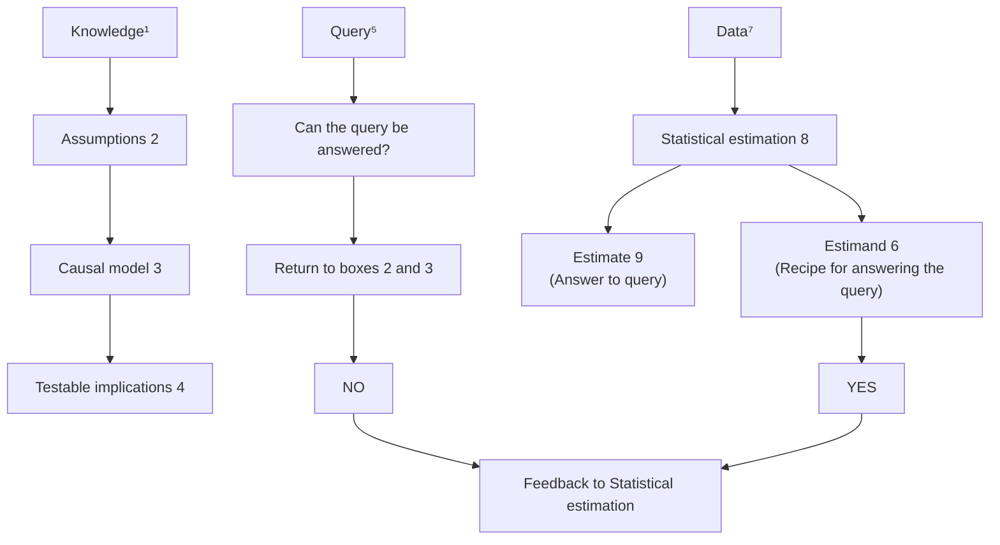

# THE BOOK OF WHY

THE NEW SCIENCE OF CAUSE AND EFFECT

## Copyright

Copyright © 2018 by Judea Pearl and Dana Mackenzie. Hachette Book Group supports the right to free expression and the value of copyright. The purpose of copyright is to encourage writers and artists to produce the creative works that enrich our culture. The scanning, uploading, and distribution of this book without permission is a theft of the author’s intellectual property. If you would like permission to use material from the book (other than for review purposes), please contact permissions@hbgusa.com. Thank you for your support of the author’s rights.

Basic Books  
Hachette Book Group  
1290 Avenue of the Americas, New York, NY 10104  
www.basicbooks.com

First Edition: May 2018

Published by Basic Books, an imprint of Perseus Books, LLC, a subsidiary of Hachette Book Group, Inc. The Basic Books name and logo is a trademark of the Hachette Book Group.

The Hachette Speakers Bureau provides a wide range of authors for speaking events. To find out more, go to www.hachettespeakersbureau.com or call (866) 376-6591.

The publisher is not responsible for websites (or their content) that are not owned by the publisher.

**Library of Congress Cataloging-in-Publication Data**

- Names: Pearl, Judea, author. | Mackenzie, Dana, author.
- Title: The book of why : the new science of cause and effect / Judea Pearl and Dana Mackenzie.
- Description: New York : Basic Books, [2018] | Includes bibliographical references and index.
- Identifiers: LCCN 2017056458 (print) | LCCN 2018005510 (ebook) | ISBN 9780465097616 (ebook) | ISBN 9780465097609 (hardcover) | ISBN 046509760X (hardcover) | ISBN 0465097618 (ebook)
- Subjects: LCSH: Causation. | Inference.
- Classification: LCC Q175.32.C38 (ebook) | LCC Q175.32.C38 P43 2018 (print) | DDC 501—dc23
- LC record available at https://lccn.loc.gov/2017056458
- ISBNs: 978-0-465-09760-9 (hardcover); 978-0-465-09761-6 (ebook)
- E3-20180417-JV-PC

## CONTENTS

- Cover
- Title Page
- Copyright
- Dedication
- Preface
- INTRODUCTION: Mind over Data
- CHAPTER 1: The Ladder of Causation
- CHAPTER 2: From Buccaneers to Guinea Pigs: The Genesis of Causal Inference
- CHAPTER 3: From Evidence to Causes: Reverend Bayes Meets Mr. Holmes
- CHAPTER 4: Confounding and Deconfounding: Or, Slaying the Lurking Variable
- CHAPTER 5: The Smoke-Filled Debate: Clearing the Air
- CHAPTER 6: Paradoxes Galore!
- CHAPTER 7: Beyond Adjustment: The Conquest of Mount Intervention
- CHAPTER 8: Counterfactuals: Mining Worlds That Could Have Been
- CHAPTER 9: Mediation: The Search for a Mechanism
- CHAPTER 10: Big Data, Artificial Intelligence, and the Big Questions
- Acknowledgments
- About the Authors
- Also by Judea Pearl
- Notes
- Bibliography
- Index

## PREFACE

ALMOST two decades ago, when I wrote the preface to my book *Causality* (2000), I made a rather daring remark that friends advised me to tone down.

“Causality has undergone a major transformation,” I wrote, “from a concept shrouded in mystery into a mathematical object with well-defined semantics and well-founded logic. Paradoxes and controversies have been resolved, slippery concepts have been explicated, and practical problems relying on causal information that long were regarded as either metaphysical or unmanageable can now be solved using elementary mathematics. Put simply, causality has been mathematized.”

Reading this passage today, I feel I was somewhat shortsighted. What I described as a “transformation” turned out to be a “revolution” that has changed the thinking in many of the sciences. Many now call it “the Causal Revolution,” and the excitement that it has generated in research circles is spilling over to education and applications. I believe the time is ripe to share it with a broader audience.

This book strives to fulfill a three-pronged mission:

- first, to lay before you in nonmathematical language the intellectual content of the Causal Revolution and how it is affecting our lives as well as our future;
- second, to share with you some of the heroic journeys, both successful and failed, that scientists have embarked on when confronted by critical cause-effect questions;
- finally, returning the Causal Revolution to its womb in artificial intelligence, I aim to describe to you how robots can be constructed that learn to communicate in our mother tongue—the language of cause and effect.

This new generation of robots should explain to us why things happened, why they responded the way they did, and why nature operates one way and not another. More ambitiously, they should also teach us about ourselves: why our mind clicks the way it does and what it means to think rationally about cause and effect, credit and regret, intent and responsibility.

When I write equations, I have a very clear idea of who my readers are. Not so when I write for the general public—an entirely new adventure for me. Strange, but this new experience has been one of the most rewarding educational trips of my life. The need to shape ideas in your language, to guess your background, your questions, and your reactions, did more to sharpen my understanding of causality than all the equations I have written prior to writing this book.

For this I will forever be grateful to you. I hope you are as excited as I am to see the results.

> **Judea Pearl**  
> Los Angeles, October 2017.

## INTRODUCTION: MIND OVER DATA

Every science that has thriven has thriven upon its own symbols.  
—AUGUSTUS DE MORGAN (1864)

---

This book tells the story of a science that has changed the way we distinguish facts from fiction and yet has remained under the radar of the general public. The consequences of the new science are already impacting crucial facets of our lives and have the potential to affect more, from the development of new drugs to the control of economic policies, from education and robotics to gun control and global warming.

Remarkably, despite the diversity and apparent incommensurability of these problem areas, the new science embraces them all under a unified framework that was practically nonexistent two decades ago.

The new science does not have a fancy name: I call it simply **“causal inference,”** as do many of my colleagues. Nor is it particularly high-tech. The ideal technology that causal inference strives to emulate resides within our own minds. Some tens of thousands of years ago, humans began to realize that certain things cause other things and that tinkering with the former can change the latter. No other species grasps this, certainly not to the extent that we do. From this discovery came organized societies, then towns and cities, and eventually the science- and technology-based civilization we enjoy today. All because we asked a simple question: **Why?**

Causal inference is all about taking this question seriously. It posits that the human brain is the most advanced tool ever devised for managing causes and effects. Our brains store an incredible amount of causal knowledge which, supplemented by data, we could harness to answer some of the most pressing questions of our time.

More ambitiously, once we really understand the logic behind causal thinking, we could emulate it on modern computers and create an **“artificial scientist.”** This smart robot would discover yet unknown phenomena, find explanations to pending scientific dilemmas, design new experiments, and continually extract more causal knowledge from the environment.

But before we can venture to speculate on such futuristic developments, it is important to understand the achievements that causal inference has tallied thus far. We will explore the way that it has transformed the thinking of scientists in almost every data-informed discipline and how it is about to change our lives.

The new science addresses seemingly straightforward questions like these:

# 统计推断

- 某种治疗方法在预防疾病方面效果如何？
- 新税法是否导致我们的销售额上升，还是广告活动的作用？
- 肥胖导致的医疗成本是多少？
- 招聘记录能否证明雇主存在性别歧视政策？
- 我即将辞职，应该这样做吗？

## 1.1 统计推断的性质

统计推断（Statistical Inference）是指：**利用样本数据对总体分布或总体特征进行推断**。  
这是统计学研究的核心问题，也是科学发现、政策评估、商业决策中不可或缺的工具。

> **行间批注**：  
> 上述问题均涉及因果推断或预测性推断，属于统计推断的典型应用场景。

统计推断通常分为两大类：

- **参数估计**：用样本统计量估计总体参数（如均值、方差）。
- **假设检验**：对总体参数或分布形式提出假设，并基于样本数据做出接受或拒绝的判断。

### 1.1.1 统计推断的基本步骤

1. 明确研究问题与总体。
2. 设计抽样方案，收集样本数据。
3. 选择适当的统计模型与推断方法。
4. 计算统计量或检验统计量。
5. 基于概率分布做出推断结论（如置信区间、\(p\) 值）。

> **行间批注**：  
> 步骤 4 和 5 通常需要借助数学工具，如概率分布函数、大数定律、中心极限定理等。

### 1.1.2 统计推断的数学基础

统计推断依赖于概率论，尤其是以下核心定理：

- **大数定律（Law of Large Numbers）**：样本均值依概率收敛于总体均值。
- **中心极限定理（Central Limit Theorem）**：样本均值的分布近似正态分布。

设 \(X_1, X_2, \dots, X_n\) 为独立同分布的随机变量，总体均值为 \(\mu\)，方差为 \(\sigma^2\)，则样本均值 \(\bar{X}\) 满足：

$$
\bar{X} = \frac{1}{n} \sum_{i=1}^n X_i
$$

当 \(n\) 足够大时：

$$
\frac{\bar{X} - \mu}{\sigma / \sqrt{n}} \xrightarrow{d} N(0, 1)
$$

> **行间批注**：  
> 中心极限定理保证了即使总体分布未知，样本均值的分布也近似正态，这是许多统计方法的基础。

## 1.2 参数估计

参数估计的目标是：**利用样本数据估计总体分布中的未知参数**。

### 1.2.1 点估计

点估计是给出参数的一个具体数值估计。常用方法包括：

- **矩估计**：用样本矩代替总体矩。
- **极大似然估计**：选择使样本出现概率最大的参数值。

例如，对于正态分布 \(N(\mu, \sigma^2)\)，样本均值 \(\bar{X}\) 是 \(\mu\) 的无偏估计：

$$
\hat{\mu} = \bar{X}
$$

样本方差 \(S^2\) 是 \(\sigma^2\) 的无偏估计：

$$
S^2 = \frac{1}{n-1} \sum_{i=1}^n (X_i - \bar{X})^2
$$

> **行间批注**：  
> 无偏性是指估计量的期望等于参数真值，即 \(E(\hat{\theta}) = \theta\)。

### 1.2.2 区间估计

区间估计给出参数的一个可能范围，并附以置信水平。例如，总体均值 \(\mu\) 的 \(95\%\) 置信区间为：

$$
\left( \bar{X} - z_{\alpha/2} \frac{\sigma}{\sqrt{n}}, \quad \bar{X} + z_{\alpha/2} \frac{\sigma}{\sqrt{n}} \right)
$$

其中 \(z_{\alpha/2}\) 是标准正态分布的 \(\alpha/2\) 分位数。

> **行间批注**：  
> 置信区间的含义是：重复抽样 \(100\) 次，大约有 \(95\) 个区间包含参数真值。

## 1.3 假设检验

假设检验用于判断关于总体的某种主张是否成立。基本步骤包括：

1. 提出原假设 \(H_0\) 和备择假设 \(H_1\)。
2. 选择检验统计量。
3. 确定显著性水平 \(\alpha\)。
4. 计算检验统计量的值及 \(p\) 值。
5. 做出拒绝或不拒绝 \(H_0\) 的决策。

### 1.3.1 两类错误

- **第一类错误**：拒绝真实的 \(H_0\)（概率为 \(\alpha\)）。
- **第二类错误**：接受错误的 \(H_0\)（概率为 \(\beta\)）。

| 决策 \ 真实情况 | \(H_0\) 为真 | \(H_0\) 为假 |
|----------------|--------------|--------------|
| 拒绝 \(H_0\)   | 第一类错误   | 正确决策     |
| 不拒绝 \(H_0\) | 正确决策     | 第二类错误   |

> **行间批注**：  
> 实际应用中，通常希望同时控制两类错误，但二者存在权衡关系。

### 1.3.2 常见的假设检验

- **\(z\) 检验**：用于总体方差已知时的均值检验。
- **\(t\) 检验**：用于总体方差未知时的均值检验。
- **卡方检验**：用于分类变量的独立性检验或拟合优度检验。
- **\(F\) 检验**：用于方差分析或比较两个总体方差。

例如，单样本 \(t\) 检验的统计量为：

$$
t = \frac{\bar{X} - \mu_0}{S / \sqrt{n}} \sim t(n-1)
$$

其中 \(\mu_0\) 是原假设下的总体均值。

> **行间批注**：  
> \(t\) 分布比正态分布更“厚尾”，适合小样本情形。

## 1.4 参考文献

1. Casella, G., & Berger, R. L. (2002). *Statistical Inference* (2nd ed.). Duxbury Press.
2. Wasserman, L. (2004). *All of Statistics: A Concise Course in Statistical Inference*. Springer.
3. Efron, B., & Hastie, T. (2016). *Computer Age Statistical Inference*. Cambridge University Press.
4. 茆诗松， 程依明， & 濮晓龙. (2011). *概率论与数理统计教程*（第 2 版）. 高等教育出版社.

> **行间批注**：  
> 参考文献中，Casella 和 Berger 的《Statistical Inference》是经典教材，适合深入学习理论推导。

These questions have in common a concern with cause-and-effect relationships, recognizable through words such as “preventing,” “cause,” “attributable to,” “policy,” and “should I.” Such words are common in everyday language, and our society constantly demands answers to such questions. Yet, until very recently, science gave us no means even to articulate, let alone answer, them.

By far the most important contribution of causal inference to mankind has been to turn this scientific neglect into a thing of the past. The new science has spawned a simple mathematical language to articulate causal relationships that we know as well as those we wish to find out about. The ability to express this information in mathematical form has unleashed a wealth of powerful and principled methods for combining our knowledge with data and answering causal questions like the five above.

I have been lucky to be part of this scientific development for the past quarter century. I have watched its progress take shape in students’ cubicles and research laboratories, and I have heard its breakthroughs resonate in somber scientific conferences, far from the limelight of public attention. Now, as we enter the era of strong artificial intelligence (AI) and many tout the endless possibilities of Big Data and deep learning, I find it timely and exciting to present to the reader some of the most adventurous paths that the new science is taking, how it impacts data science, and the many ways in which it will change our lives in the twenty-first century.

When you hear me describe these achievements as a “new science,” you may be skeptical. You may even ask, Why wasn’t this done a long time ago? Say when Virgil first proclaimed, “Lucky is he who has been able to understand the causes of things” (29 BC). Or when the founders of modern statistics, Francis Galton and Karl Pearson, first discovered that population data can shed light on scientific questions. There is a long tale behind their unfortunate failure to embrace causation at this juncture, which the historical sections of this book will relate. But the most serious impediment, in my opinion, has been the fundamental gap between the vocabulary in which we cast causal questions and the traditional vocabulary in which we communicate scientific theories.

To appreciate the depth of this gap, imagine the difficulties that a scientist would face in trying to express some obvious causal relationships—say, that the barometer reading $B$ tracks the atmospheric pressure $P$. We can easily write down this relationship in an equation such as $B = kP$, where $k$ is some constant of proportionality. The rules of algebra now permit us to rewrite this same equation in a wild variety of forms, for example, $P = B / k$, $k = B / P$, or $B - kP = 0$. They all mean the same thing—that if we know any two of the three quantities, the third is determined. None of the letters $k$, $B$, or $P$ is in any mathematical way privileged over any of the others. How then can we express our strong conviction that it is the pressure that causes the barometer to change and not the other way around? And if we cannot express even this, how can we hope to express the many other causal convictions that do not have mathematical formulas, such as that the rooster’s crow does not cause the sun to rise?

My college professors could not do it and never complained. I would be willing to bet that none of yours ever did either. We now understand why: never were they shown a mathematical language of causes; nor were they shown its benefits. It is in fact an indictment of science that it has neglected to develop such a language for so many generations. Everyone knows that flipping a switch will cause a light to turn on or off and that a hot, sultry summer afternoon will cause sales to go up at the local ice-cream parlor. Why then have scientists not captured such obvious facts in formulas, as they did with the basic laws of optics, mechanics, or geometry? Why have they allowed these facts to languish in bare intuition, deprived of mathematical tools that have enabled other branches of science to flourish and mature?

Part of the answer is that scientific tools are developed to meet scientific needs. Precisely because we are so good at handling questions about switches, ice cream, and barometers, our need for special mathematical machinery to handle them was not obvious. But as scientific curiosity increased and we began posing causal questions in complex legal, business, medical, and policy-making situations, we found ourselves lacking the tools and principles that mature science should provide.

Belated awakenings of this sort are not uncommon in science. For example, until about four hundred years ago, people were quite happy with their natural ability to manage the uncertainties in daily life, from crossing a street to risking a fistfight. Only after gamblers invented intricate games of chance, sometimes carefully designed to trick us into making bad choices, did mathematicians like Blaise Pascal (1654), Pierre de Fermat (1654), and Christiaan Huygens (1657) find it necessary to develop what we today call probability theory. Likewise, only when insurance organizations demanded accurate estimates of life annuity did mathematicians like Edmond Halley (1693) and Abraham de Moivre (1725) begin looking at mortality tables to calculate life expectancies. Similarly, astronomers’ demands for accurate predictions of celestial motion led Jacob Bernoulli, Pierre-Simon Laplace, and Carl Friedrich Gauss to develop a theory of errors to help us extract signals from noise. These methods were all predecessors of today’s statistics.

Ironically, the need for a theory of causation began to surface at the same time that statistics came into being. In fact, modern statistics hatched from the causal questions that Galton and Pearson asked about heredity and their ingenious attempts to answer them using cross-generational data. Unfortunately, they failed in this endeavor, and rather than pause to ask why, they declared those questions off limits and turned to developing a thriving, causality-free enterprise called statistics.

This was a critical moment in the history of science. The opportunity to equip causal questions with a language of their own came very close to being realized but was squandered. In the following years, these questions were declared unscientific and went underground. Despite heroic efforts by the geneticist Sewall Wright (1889–1988), causal vocabulary was virtually prohibited for more than half a century. And when you prohibit speech, you prohibit thought and stifle principles, methods, and tools.

Readers do not have to be scientists to witness this prohibition. In Statistics 101, every student learns to chant, “Correlation is not causation.” With good reason! The rooster’s crow is highly correlated with the sunrise; yet it does not cause the sunrise.

Unfortunately, statistics has fetishized this commonsense observation. It tells us that correlation is not causation, but it does not tell us what causation is. In vain will you search the index of a statistics textbook for an entry on “cause.” Students are not allowed to say that $X$ is the cause of $Y$—only that $X$ and $Y$ are “related” or “associated.”

Because of this prohibition, mathematical tools to manage causal questions were deemed unnecessary, and statistics focused exclusively on how to summarize data, not on how to interpret it. A shining exception was path analysis, invented by geneticist Sewall Wright in the 1920s and a direct ancestor of the methods we will entertain in this book. However, path analysis was badly underappreciated in statistics and its satellite communities and languished for decades in its embryonic status. What should have been the first step toward causal inference remained the only step until the 1980s. The rest of statistics, including the many disciplines that looked to it for guidance, remained in the Prohibition era, falsely believing that the answers to all scientific questions reside in the data, to be unveiled through clever data-mining tricks.

Much of this data-centric history still haunts us today. We live in an era that presumes Big Data to be the solution to all our problems. Courses in “data science” are proliferating in our universities, and jobs for “data scientists” are lucrative in the companies that participate in the “data economy.” But I hope with this book to convince you that data are profoundly dumb. Data can tell you that the people who took a medicine recovered faster than those who did not take it, but they can’t tell you why. Maybe those who took the medicine did so because they could afford it and would have recovered just as fast without it.

Over and over again, in science and in business, we see situations where mere data aren’t enough. Most big-data enthusiasts, while somewhat aware of these limitations, continue the chase after data-centric intelligence, as if we were still in the Prohibition era.

As I mentioned earlier, things have changed dramatically in the past three decades. Nowadays, thanks to carefully crafted causal models, contemporary scientists can address problems that would have once been considered unsolvable or even beyond the pale of scientific inquiry. For example, only a hundred years ago, the question of whether cigarette smoking causes a health hazard would have been considered unscientific. The mere mention of the words “cause” or “effect” would create a storm of objections in any reputable statistical journal.

Even two decades ago, asking a statistician a question like “Was it the aspirin that stopped my headache?” would have been like asking if he believed in voodoo. To quote an esteemed colleague of mine, it would be “more of a cocktail conversation topic than a scientific inquiry.” But today, epidemiologists, social scientists, computer scientists, and at least some enlightened economists and statisticians pose such questions routinely and answer them with mathematical precision. To me, this change is

Regardless of language, the model should depict, however qualitatively, the process that generates the data—in other words, the cause-effect forces that operate in the environment and shape the data generated.

Side by side with this diagrammatic “language of knowledge,” we also have a symbolic “language of queries” to express the questions we want answers to. For example, if we are interested in the effect of a drug (D) on lifespan (L), then our query might be written symbolically as:

$$
P(L \mid do(D))
$$

In other words, what is the probability (P) that a typical patient would survive L years if made to take the drug? This question describes what epidemiologists would call an intervention or a treatment and corresponds to what we measure in a clinical trial. In many cases we may also wish to compare $P(L \mid do(D))$ with $P(L \mid do(\text{not-}D))$; the latter describes patients denied treatment, also called the “control” patients. The **do-operator** signifies that we are dealing with an intervention rather than a passive observation; classical statistics has nothing remotely similar to this operator.

We must invoke an intervention operator $do(D)$ to ensure that the observed change in Lifespan L is due to the drug itself and is not confounded with other factors that tend to shorten or lengthen life. If, instead of intervening, we let the patient himself decide whether to take the drug, those other factors might influence his decision, and lifespan differences between taking and not taking the drug would no longer be solely due to the drug. For example, suppose only those who were terminally ill took the drug. Such persons would surely differ from those who did not take the drug, and a comparison of the two groups would reflect differences in the severity of their disease rather than the effect of the drug. By contrast, forcing patients to take or refrain from taking the drug, regardless of preconditions, would wash away preexisting differences and provide a valid comparison.

Mathematically, we write the observed frequency of Lifespan L among patients who voluntarily take the drug as $P(L \mid D)$, which is the standard conditional probability used in statistical textbooks. This expression stands for the probability (P) of Lifespan L conditional on seeing the patient take Drug D. Note that $P(L \mid D)$ may be totally different from $P(L \mid do(D))$. This difference between **seeing** and **doing** is fundamental and explains why we do not regard the falling barometer to be a cause of the coming storm. Seeing the barometer fall increases the probability of the storm, while forcing it to fall does not affect this probability.

This confusion between seeing and doing has resulted in a fountain of paradoxes, some of which we will entertain in this book. A world devoid of $P(L \mid do(D))$ and governed solely by $P(L \mid D)$ would be a strange one indeed. For example:

- Patients would avoid going to the doctor to reduce the probability of being seriously ill.
- Cities would dismiss their firefighters to reduce the incidence of fires.
- Doctors would recommend a drug to male and female patients but not to patients with undisclosed gender.
- And so on.

It is hard to believe that less than three decades ago science did operate in such a world: the do-operator did not exist.

One of the crowning achievements of the Causal Revolution has been to explain how to predict the effects of an intervention without actually enacting it. It would never have been possible if we had not, first of all, defined the do-operator so that we can ask the right question and, second, devised a way to emulate it by noninvasive means.

When the scientific question of interest involves retrospective thinking, we call on another type of expression unique to causal reasoning called a **counterfactual**. For example, suppose that Joe took Drug D and died a month later; our question of interest is whether the drug might have caused his death. To answer this question, we need to imagine a scenario in which Joe was about to take the drug but changed his mind. Would he have lived?

Again, classical statistics only summarizes data, so it does not provide even a language for asking that question. Causal inference provides a notation and, more importantly, offers a solution. As with predicting the effect of interventions (mentioned above), in many cases we can emulate human retrospective thinking with an algorithm that takes what we know about the observed world and produces an answer about the counterfactual world. This “algorithmization of counterfactuals” is another gem uncovered by the Causal Revolution.

Counterfactual reasoning, which deals with what-ifs, might strike some readers as unscientific. Indeed, empirical observation can never confirm or refute the answers to such questions. Yet our minds make very reliable and reproducible judgments all the time about what might be or might have been. We all understand, for instance, that had the rooster been silent this morning, the sun would have risen just as well. This consensus stems from the fact that counterfactuals are not products of whimsy but reflect the very structure of our world model. Two people who share the same causal model will also share all counterfactual judgments.

Counterfactuals are the building blocks of moral behavior as well as scientific thought. The ability to reflect on one’s past actions and envision alternative scenarios is the basis of free will and social responsibility. The algorithmization of counterfactuals invites thinking machines to benefit from this ability and participate in this (until now) uniquely human way of thinking about the world.

My mention of thinking machines in the last paragraph is intentional. I came to this subject as a computer scientist working in the area of artificial intelligence, which entails two points of departure from most of my colleagues in the causal inference arena.

First, in the world of AI, you do not really understand a topic until you can teach it to a mechanical robot. That is why you will find me emphasizing and reemphasizing notation, language, vocabulary, and grammar. For example, I obsess over whether we can express a certain claim in a given language and whether one claim follows from others. It is amazing how much one can learn from just following the grammar of scientific utterances. My emphasis on language also comes from a deep conviction that **language shapes our thoughts**. You cannot answer a question that you cannot ask, and you cannot ask a question that you have no words for. As a student of philosophy and computer science, my attraction to causal inference has largely been triggered by the excitement of seeing an orphaned scientific language making it from birth to maturity.

My background in machine learning has given me yet another incentive for studying causation. In the late 1980s, I realized that machines’ lack of understanding of causal relations was perhaps the biggest roadblock to giving them human-level intelligence. In the last chapter of this book, I will return to my roots, and together we will explore the implications of the Causal Revolution for artificial intelligence. I believe that **strong AI is an achievable goal** and one not to be feared precisely because causality is part of the solution. A causal reasoning module will give machines the ability to reflect on their mistakes, to pinpoint weaknesses in their software, to function as moral entities, and to converse naturally with humans about their own choices and intentions.

# A BLUEPRINT OF REALITY

In our era, readers have no doubt heard terms like “知识”、“信息”、“智能”和“数据”，有些人可能对它们之间的区别或它们如何相互作用感到困惑。现在，我提议再引入一个术语——“因果模型”——读者可能会合理地质疑，这是否只会增加混乱。**事实并非如此！** 实际上，它将把科学、知识和数据这些难以捉摸的概念锚定在一个具体而有意义的环境中，并使我们能够看到这三者如何协同工作，以回答困难的科学问题。

图 I.1 展示了一个“因果推理引擎”的蓝图，它可能为未来的人工智能处理因果推理。重要的是要认识到，这不仅是未来的蓝图，也是今天因果模型在科学应用中如何运作以及它们如何与数据交互的指南。

该推理引擎是一个接受三种不同输入——**假设**、**查询**和**数据**——并产生三种输出的机器。第一个输出是一个**是/否**的决定，判断在现有因果模型下，给定查询是否可以在理论上得到回答（假设数据完美且无限）。如果答案是“是”，推理引擎接下来会生成一个**估计量**。这是一个数学公式，可以看作是从任何假设数据中生成答案的配方（一旦数据可用）。最后，在推理引擎接收到数据输入后，它将使用该配方生成答案的实际**估计值**，以及该估计值中不确定性的统计估计。这种不确定性反映了数据集的有限大小以及可能的测量误差或缺失数据。


# 因果推断基础：从关联到干预

## 第一章：引言——从关联到因果

### 1.1 为什么要学习因果推断？

在数据科学和人工智能领域，我们经常面临这样的问题：

- 某个营销活动是否真的提升了销售额？
- 新药是否确实改善了患者的健康状况？
- 教育政策是否真正提高了学生的成绩？

传统的统计学方法主要关注**相关性**（association），而因果推断则试图回答**因果性**（causation）的问题。正如本书作者 Pearl 所言：

> 相关性不等于因果性。要理解因果关系，我们需要超越数据本身，引入因果假设和结构知识。

### 1.2 因果推断的三大层级

Pearl 提出了**因果推断的三个层级**，也称为“因果关系之梯”：

1. **关联**（Association）：观察数据中的模式
   - 例如：看到下雨时，地面湿的概率增加
   - 对应操作：`P(y|x)`

2. **干预**（Intervention）：主动改变系统
   - 例如：人工降雨后，地面是否变湿
   - 对应操作：`P(y|do(x))`

3. **反事实**（Counterfactuals）：想象如果……会怎样
   - 例如：如果没有下雨，地面是否还会湿
   - 对应操作：`P(y_x | x', y')`

### 1.3 为什么传统方法不够？

传统的机器学习方法在处理**分布外**（out-of-distribution）问题时常常失败。例如：

- 一个模型学会了预测“按下开关→灯亮”，但当电路被改变时，这个预测就会失效
- 因果模型则能理解“电流通过灯泡”这一机制，从而适应环境变化

### 1.4 本书的结构与目标

本书旨在为读者提供：

1. **因果图模型**：用有向无环图（DAG）表示因果关系
2. **do-演算**：从观察数据中推断干预效果的数学工具
3. **反事实推理**：回答“如果……会怎样”的问题
4. **实际应用**：在流行病学、社会科学、机器学习等领域的案例

> **核心思想**：因果推断不是要取代传统统计方法，而是在其基础上增加一个**因果结构层**，使我们能够从数据中提取更深层次的洞见。

---

## 第二章：因果图模型基础

### 2.1 有向无环图（DAG）

因果图模型使用**有向无环图**来表示变量之间的因果关系。例如：

```
X → Y → Z
```

表示 X 影响 Y，Y 影响 Z。

### 2.2 三种基本结构

在因果图中，有三种基本的连接方式：

1. **链式**（Chain）：`X → Y → Z`
   - X 和 Z 在 Y 条件下独立
   
2. **分叉**（Fork）：`X ← Y → Z`
   - X 和 Z 在 Y 条件下独立
   
3. **对撞**（Collider）：`X → Y ← Z`
   - X 和 Z 无条件独立，但在 Y 条件下可能相关

### 2.3 d-分离

**d-分离**（d-separation）是判断条件独立性的关键概念：

> 如果所有从 X 到 Z 的路径都被一组变量 S 阻断，则称 X 和 Z 在给定 S 下 d-分离。

阻断规则：
- 在链式或分叉结构中，如果中间节点在 S 中，则路径被阻断
- 在对撞结构中，如果对撞节点不在 S 中，且其子节点也不在 S 中，则路径被阻断

### 2.4 因果图的构建

构建因果图需要：

1. **领域知识**：来自专家或理论文献
2. **数据驱动**：使用结构学习算法
3. **混合方法**：结合两者

> **重要原则**：因果图不是从数据中“发现”的，而是基于假设构建的。不同的假设会导致不同的图，从而产生不同的结论。

---

## 第三章：do-演算与干预

### 3.1 从观察到干预

在观察性研究中，我们只能计算条件概率：

$$
P(Y|X=x)
$$

而干预实验的目标是计算：

$$
P(Y|do(X=x))
$$

其中 `do(X=x)` 表示强制将 X 设为 x。

### 3.2 调整公式

当存在混杂变量时，我们可以使用**调整公式**：

$$
P(Y|do(X=x)) = \sum_z P(Y|X=x, Z=z) P(Z=z)
$$

这要求 Z 满足**后门准则**（back-door criterion）。

### 3.3 后门准则

**后门准则**：如果一组变量 Z 满足：
1. Z 中没有 X 的后代
2. Z 阻断了所有从 X 到 Y 的后门路径

则调整公式成立。

### 3.4 前门准则

**前门准则**：当存在未观测的混杂变量时，可以使用中介变量 M：

$$
P(Y|do(X=x)) = \sum_m P(M=m|X=x) \sum_{x'} P(Y|X=x', M=m) P(X=x')
$$

### 3.5 do-演算的三条规则

do-演算提供了从观察数据推断干预效果的完整系统：

**规则 1**（插入/删除观察）：如果 X 和 Y 在给定 Z 和 W 下 d-分离，则：

$$
P(Y|do(X=x), Z, W) = P(Y|do(X=x), Z)
$$

**规则 2**（干预/观察交换）：如果 X 和 Y 在给定 Z 下 d-分离，且没有指向 X 的后门路径，则：

$$
P(Y|do(X=x), Z) = P(Y|X=x, Z)
$$

**规则 3**（插入/删除干预）：如果 X 和 Y 之间没有因果路径，则：

$$
P(Y|do(X=x), Z) = P(Y|Z)
$$

---

## 第四章：反事实推理

### 4.1 反事实的定义

反事实问题通常形式为：

> 给定实际观测到的事实，如果 X 取值为 x'，Y 会是多少？

数学上表示为：

$$
P(Y_{X=x'} | X=x, Y=y)
$$

### 4.2 结构方程模型

在结构方程模型（SEM）中，每个变量由以下方程决定：

$$
Y = f_Y(PA_Y, U_Y)
$$

其中：
- `PA_Y` 是 Y 的父节点（直接原因）
- `U_Y` 是外生变量（未观测的噪声）

### 4.3 反事实计算的三步法

1. **外推**（Abduction）：根据观测数据推断外生变量 U 的分布
2. **干预**（Action）：将 X 强制设为 x'
3. **预测**（Prediction）：使用新的 X 值和 U 的分布计算 Y

### 4.4 反事实的应用

反事实推理在以下领域有重要应用：

1. **公平性**：评估决策是否存在歧视
2. **可解释性**：解释模型为何做出特定预测
3. **鲁棒性**：测试模型在极端情况下的表现

> **关键洞察**：反事实推理使我们能够回答“如果……会怎样”的问题，这是人类智能的核心能力之一。

---

## 第五章：因果发现

### 5.1 基于约束的方法

**基于约束的方法**通过条件独立性测试来发现因果结构：

1. 使用统计测试检查变量间的条件独立性
2. 构建满足所有测试结果的图
3. 使用 PC 算法等经典方法

### 5.2 基于分数的方法

**基于分数的方法**为每个可能的图分配一个分数：

1. 定义评分函数（如 BIC、AIC）
2. 搜索使分数最大化的图结构
3. 使用贪婪搜索或贝叶斯方法

### 5.3 基于函数的方法

**基于函数的方法**假设因果关系具有特定的函数形式：

1. 线性非高斯模型（LiNGAM）
2. 加性噪声模型（ANM）
3. 后非线性模型（PNL）

### 5.4 因果发现的挑战

1. **等价类**：多个图可能产生相同的条件独立性
2. **有限样本**：统计测试在小样本下不可靠
3. **隐藏变量**：未观测的变量可能误导结果

---

## 第六章：因果推断的应用

### 6.1 流行病学

在流行病学中，因果推断用于：
- 评估药物效果
- 确定疾病风险因素
- 设计公共卫生政策

### 6.2 社会科学

在社会科学中，因果推断帮助：
- 评估政策效果
- 理解社会机制
- 预测干预结果

### 6.3 机器学习

在机器学习中，因果推断用于：
- **领域适应**：处理分布偏移
- **可解释 AI**：提供因果解释
- **强化学习**：学习因果策略

### 6.4 实际案例：营销效果评估

假设我们要评估一个广告活动对销售额的影响：

1. **观察



为了更深入地探究图表，我将方框标记为 1 到 9，并结合问题“药物 D 对寿命 L 有何影响？”进行注释。¹

> ¹ 原文脚注标记为 \( \dag \)，此处以数字序号 1 替代。

1.  **“知识”** 代表推理主体过去经验的痕迹，包括过去的观察、行动、教育以及文化习俗，这些都被认为与所关注的查询相关。围绕“知识”的虚线框表示它隐含在主体的思维中，并未在模型中明确阐述。

2.  科学研究总是需要**简化假设**，即研究者认为基于现有知识值得明确提出的陈述。尽管研究者的大部分知识仍隐含在其大脑中，但只有**假设**会公之于众，并被封装在模型中。事实上，这些假设可以从模型中解读出来，这导致一些逻辑学家得出结论：模型不过是一系列假设的列表。计算机科学家对此持异议，他们指出，假设的表示方式会深刻地影响人们正确指定假设、从中得出结论、甚至在确凿证据面前扩展或修改它们的能力。

3.  因果模型有多种选择：**因果图、结构方程、逻辑陈述**等。我强烈推荐在几乎所有应用中使用因果图，这主要是因为它们的透明性，以及它们能为我们希望提出的许多问题提供明确答案。为了构建图表，“因果关系”的定义很简单，虽然有点比喻性：如果变量 Y“听从”变量 X 并根据它所听到的来确定其值，那么变量 X 就是 Y 的一个原因。例如，如果我们怀疑患者的寿命 L 会“听从”是否服用了药物 D，那么我们就称 D 是 L 的一个原因，并在因果图中从 D 画一个箭头指向 L。自然地，关于 D 和 L 的查询答案很可能也取决于其他变量，这些变量及其因果关系也必须表示在图表中。（这里，我们将它们统称为 Z。）

4.  因果模型路径所规定的“听从”模式通常会导致数据中出现可观察的模式或依赖关系。这些模式被称为**“可检验的蕴含关系”**，因为它们可用于检验模型。例如，“没有路径连接 D 和 L”这样的陈述，可以转化为一个统计陈述：“D 和 L 是独立的”，这意味着发现 D 不会改变 L 的可能性。如果数据与这一蕴含关系相矛盾，那么我们就需要修改我们的模型。这种修改需要另一个引擎，它从方框 4 和 7 获取输入，并计算“拟合度”，即数据与模型假设的兼容程度。为简单起见，我未在图 I.1 中展示这第二个引擎。

5.  提交给推理引擎的**查询**是我们想要回答的科学问题。它们必须用因果词汇来表述。例如，\( P(L \mid do(D)) \) 是多少？因果革命的主要成就之一就是使这种语言在科学上透明且在数学上严谨。

6.  **“估计量”** 源自拉丁语，意为“将被估计的东西”。这是一个要从数据中估计的统计量，一旦估计出来，就可以合法地代表我们查询的答案。虽然它被写成一个概率公式——例如，\( P(L \mid D, Z) \times P(Z) \)——但它实际上是一份配方，指导如何根据我们拥有的数据类型来回答因果查询，前提是它已通过引擎认证。  
    认识到这一点非常重要：与统计学中的传统估计相反，某些查询在当前因果模型下可能无法回答，即使在收集了大量数据之后也是如此。例如，如果我们的模型显示 D 和 L 都依赖于第三个变量 Z（比如，疾病的阶段），并且我们无法测量 Z，那么查询 \( P(L \mid do(D)) \) 就无法回答。在这种情况下，收集数据是浪费时间。相反，我们需要回过头来完善模型，要么通过添加新的科学知识来估计 Z，要么做出简化假设（冒着犯错的风险）——例如，假设 Z 对 D 的影响可以忽略不计。

7.  **数据**是进入估计量配方的原料。必须认识到，数据在因果关系方面是极其“愚蠢”的。它们告诉我们诸如 \( P(L \mid D) \) 或 \( P(L \mid D, Z) \) 之类的量。而估计量的工作就是告诉我们如何将这些统计量“烘焙”成一个表达式，该表达式基于模型假设，在逻辑上等价于因果查询——例如，\( P(L \mid do(D)) \)。  
    请注意，估计量的整个概念，实际上图 I 的整个上半部分，在传统的统计分析方法中是不存在的。在那里，估计量和查询是重合的。例如，如果我们对寿命为 L 的人群中服用药物 D 的比例感兴趣，我们只需将这个查询写为 \( P(D \mid L) \)。同样的量就是我们的估计量。这已经指定了需要从数据中估计哪些比例，并且不需要因果知识。因此，一些统计学家至今仍难以理解，为什么某些知识存在于统计学领域之外，以及为什么仅靠数据无法弥补科学知识的缺乏。

8.  **估计值**是从“烤箱”中出来的结果。然而，它只是近似的，因为数据还有一个现实世界的特征：它们始终只是来自理论上无限总体的有限样本。在我们的例子中，样本由我们选择研究的患者组成。即使我们随机选择他们，样本中测量的比例在总体中不具有代表性的可能性也始终存在。幸运的是，统计学这门学科，借助先进的机器学习技术，为我们提供了许多管理这种不确定性的方法——**最大似然估计、倾向性评分、置信区间、显著性检验**等等。

9.  最后，如果我们的模型是正确的，并且我们的数据是充分的，我们就得到了因果查询的答案，例如：“药物 D 使糖尿病患者的寿命 L 增加了 30%，误差范围为 ±20%。”太好了！这个答案也将增加我们的科学知识（方框 1），如果事情没有按照我们预期的方式发展，它可能还会建议对我们的因果模型进行一些改进（方框 3）。

这个流程图乍一看可能很复杂，你可能会怀疑它是否真的必要。确实，在日常生活中，我们能够在没有有意识地经历如此复杂过程的情况下做出因果判断，当然也没有诉诸概率和比例的数学。仅凭我们的**因果直觉**通常就足以处理我们在家庭日常甚至职业生活中遇到的那种不确定性。但是，如果我们想教一个“愚蠢”的机器人进行因果思考，或者我们正在推动科学知识的前沿，而那里没有直觉指导我们，那么像这样一个精心设计的结构化程序是必不可少的。

我特别想强调**数据**在上述过程中的作用。首先，请注意，我们是在**提出因果模型之后**、**陈述我们想要回答的科学查询之后**、以及**推导出估计量之后**，才收集数据的。这与上述传统的统计方法形成对比，后者甚至没有因果模型。

但我们当今的科学世界对关于原因和结果的合理推理提出了新的挑战。尽管科学界对因果模型必要性的认识有了飞速增长，但许多人工智能研究人员希望跳过构建或获取因果模型的艰难步骤，而**仅依赖数据**来完成所有认知任务。他们的希望——目前通常是一个沉默的希望——是，每当出现因果问题时，数据本身会引导我们找到正确答案。

我对这种趋势持**明确的怀疑态度**，因为我知道数据在因果关系方面是多么“愚蠢”。例如，关于行动或干预效果的信息在原始数据中根本不可用，除非是通过受控实验操作收集的。相比之下，如果我们拥有一个因果模型，我们通常可以从非干预的、无干预的数据中预测干预的结果。

当我们试图回答反事实查询时，因果模型的案例变得更加令人信服，例如“如果我们当初采取不同的行动，会发生什么？”我们将详细讨论反事实，因为它们对任何人工智能来说都是**最具挑战性的查询**。它们也是使我们成为人类的认知进步的核心，以及使科学成为可能的想象能力的核心。我们还将解释为什么任何关于原因如何传递其效果的查询——最典型的“为什么？”问题——实际上是一个伪装的反事实问题。因此，如果我们希望机器人能回答“为什么？”的问题，甚至理解它们的含义，我们必须为它们配备一个因果模型，并教它们如何回答反事实查询，如图 I.1 所示。

因果模型相对于数据挖掘和深度学习拥有的另一个优势是**适应性**。请注意，在图 I.1 中，估计量是仅基于因果模型计算的，在检查数据的细节之前。这使得因果推理引擎具有极强的适应性，因为计算出的估计量适用于与该定性模型兼容的任何数据，无论变量之间的数值关系如何。

要理解这种适应性为何重要，请将此引擎与一个学习主体进行比较——本例中是人类，但在其他情况下可能是深度学习算法，或者可能是使用深度学习算法的人类——她试图仅从数据中学习。通过观察许多服用药物 D 的患者的结果 L，她能够预测具有特征 Z 的患者存活 L 年的概率。现在她被调到镇子另一头的一家不同医院，那里的人群特征（饮食、卫生、工作习惯）不同。即使这些新特征仅仅修改了记录变量之间的数值关系，她仍然必须重新训练自己，并从头学习一个新的预测函数。这就是深度学习程序所能做的全部：将函数拟合到数据上。另一方面，如果她拥有一个药物如何运作的模型，并且其因果结构在新地点保持不变，那么她在训练中获得的估计量将仍然有效。它可以应用于新数据，以生成一个特定于新人群的预测函数。

许多科学问题通过“因果透镜”看起来会不同，我很喜欢摆弄这个透镜，在过去二十五年里，它得到了新见解和新工具的日益增强。我希望并相信本书的读者会分享我的喜悦。因此，我想以预览本书即将呈现的一些精彩内容来结束这篇引言。

第一章将观察、干预和反事实这三个步骤整合为**因果关系之梯**，这是本书的核心隐喻。

It will also expose you to the basics of reasoning with causal diagrams, our main modeling tool, and set you well on your way to becoming a proficient causal reasoner—in fact, you will be far ahead of generations of data scientists who attempted to interpret data through a model-blind lens, oblivious to the distinctions that the Ladder of Causation illuminates.

Chapter 2 tells the bizarre story of how the discipline of statistics inflicted causal blindness on itself, with far-reaching effects for all sciences that depend on data. It also tells the story of one of the great heroes of this book, the geneticist Sewall Wright, who in the 1920s drew the first causal diagrams and for many years was one of the few scientists who dared to take causality seriously.

Chapter 3 relates the equally curious story of how I became a convert to causality through my work in AI and particularly on Bayesian networks. These were the first tool that allowed computers to think in “shades of gray”—and for a time I believed they held the key to unlocking AI. Toward the end of the 1980s I became convinced that I was wrong, and this chapter tells of my journey from prophet to apostate. Nevertheless, Bayesian networks remain a very important tool for AI and still encapsulate much of the mathematical foundation of causal diagrams. In addition to a gentle, causality-minded introduction to Bayes’s rule and Bayesian methods of reasoning, Chapter 3 will entertain the reader with examples of real-life applications of Bayesian networks.

Chapter 4 tells about the major contribution of statistics to causal inference: the randomized controlled trial (RCT). From a causal perspective, the RCT is a man-made tool for uncovering the query $P(L \mid do(D))$, which is a property of nature. Its main purpose is to disassociate variables of interest (say, $D$ and $L$) from other variables ($Z$) that would otherwise affect them both. Disarming the distortions, or “confounding,” produced by such lurking variables has been a century-old problem. This chapter walks the reader through a surprisingly simple solution to the general confounding problem, which you will grasp in ten minutes of playfully tracing paths in a diagram.

Chapter 5 gives an account of a seminal moment in the history of causation and indeed the history of science, when statisticians struggled with the question of whether smoking causes lung cancer. Unable to use their favorite tool, the randomized controlled trial, they struggled to agree on an answer or even on how to make sense of the question. The smoking debate brings the importance of causality into its sharpest focus. Millions of lives were lost or shortened because scientists did not have an adequate language or methodology for answering causal questions.

Chapter 6 will, I hope, be a welcome diversion for the reader after the serious matters of Chapter 5. This is a chapter of paradoxes: the Monty Hall paradox, Simpson’s paradox, Berkson’s paradox, and others. Classical paradoxes like these can be enjoyed as brainteasers, but they have a serious side too, especially when viewed from a causal perspective. In fact, almost all of them represent clashes with causal intuition and therefore reveal the anatomy of that intuition. They were canaries in the coal mine that should have alerted scientists to the fact that human intuition is grounded in causal, not statistical, logic. I believe that the reader will enjoy this new twist on his or her favorite old paradoxes.

Chapters 7 to 9 finally take readers on a thrilling ascent of the Ladder of Causation. We start in Chapter 7 with questions about intervention and explain how my students and I went through a twenty-year struggle to automate the answers to *do*-type questions. We succeeded, and this chapter explains the guts of the “causal inference engine,” which produces the yes/no answer and the estimand in Figure I.1. Studying this engine will empower the reader to spot certain patterns in the causal diagram that deliver immediate answers to the causal query. These patterns are called **back-door adjustment**, **front-door adjustment**, and **instrumental variables**, the workhorses of causal inference in practice.

Chapter 8 takes you to the top of the ladder by discussing **counterfactuals**. These have been seen as a fundamental part of causality at least since 1748, when Scottish philosopher David Hume proposed the following somewhat contorted definition of causation: “We may define a cause to be an object followed by another, and where all the objects, similar to the first, are followed by objects similar to the second. Or, in other words, where, if the first object had not been, the second never had existed.” David Lewis, a philosopher at Princeton University who died in 2001, pointed out that Hume really gave two definitions, not one, the first of regularity (i.e., the cause is regularly followed by the effect) and the second of the counterfactual (“if the first object had not been…”). While philosophers and scientists had mostly paid attention to the regularity definition, Lewis argued that the counterfactual definition aligns more closely with human intuition: “We think of a cause as something that makes a difference, and the difference it makes must be a difference from what would have happened without it.”

Readers will be excited to find out that we can now move past the academic debates and compute an actual value (or probability) for any counterfactual query, no matter how convoluted. Of special interest are questions concerning **necessary** and **sufficient** causes of observed events. For example, how likely is it that the defendant’s action was a necessary cause of the claimant’s injury? How likely is it that man-made climate change is a sufficient cause of a heat wave?

Finally, Chapter 9 discusses the topic of **mediation**. You may have wondered, when we talked about drawing arrows in a causal diagram, whether we should draw an arrow from Drug $D$ to Lifespan $L$ if the drug affects lifespan only by way of its effect on blood pressure $Z$ (a mediator). In other words, is the effect of $D$ on $L$ direct or indirect? And if both, how do we assess their relative importance? Such questions are not only of great scientific interest but also have practical ramifications; if we understand the mechanism through which a drug acts, we might be able to develop other drugs with the same effect that are cheaper or have fewer side effects. The reader will be pleased to discover how this age-old quest for a mediation mechanism has been reduced to an algebraic exercise and how scientists are using the new tools in the causal tool kit to solve such problems.

Chapter 10 brings the book to a close by coming back to the problem that initially led me to causation: the problem of automating human-level intelligence (sometimes called “strong AI”). I believe that causal reasoning is essential for machines to communicate with us in our own language about policies, experiments, explanations, theories, regret, responsibility, free will, and obligations—and, eventually, to make their own moral decisions.

If I could sum up the message of this book in one pithy phrase, it would be that **you are smarter than your data**. Data do not understand causes and effects; humans do. I hope that the new science of causal inference will enable us to better understand how we do it, because there is no better way to understand ourselves than by emulating ourselves.