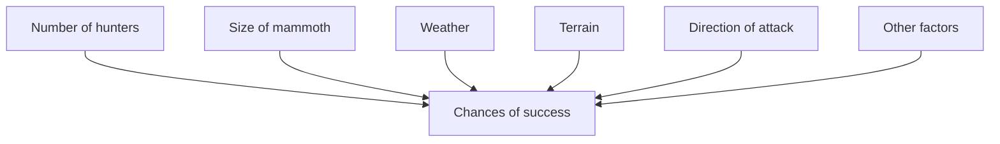
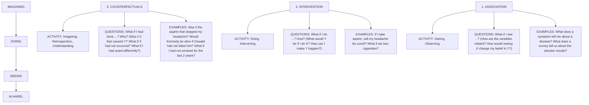
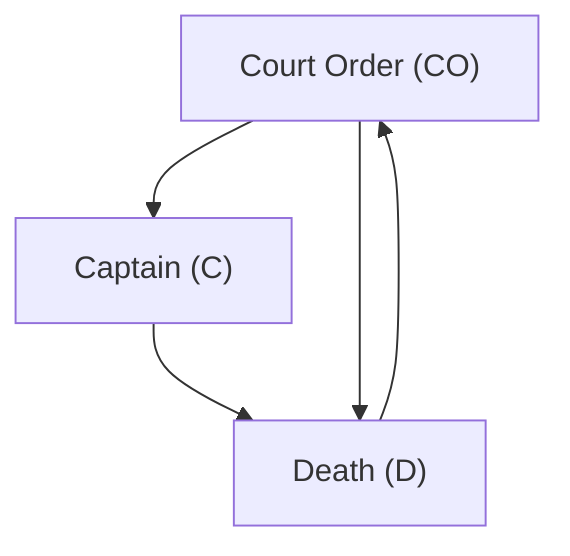
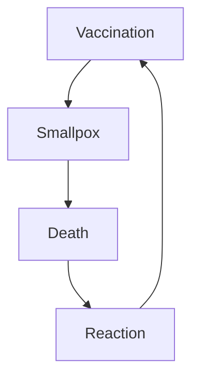

## THE LADDER OF CAUSATION

IN the beginning……I was probably six or seven years old when I first read the story of Adam and Eve in the Garden of Eden. My classmates and I were not at all surprised by God’s capricious demands, forbidding them to eat from the Tree of Knowledge. Deities have their reasons, we thought. What we were more intrigued by was the idea that as soon as they ate from the Tree of Knowledge, Adam and Eve became conscious, like us, of their nakedness.

As teenagers, our interest shifted slowly to the more philosophical aspects of the story.（Israeli students read Genesis several times a year.）Of primary concern to us was the notion that the emergence of human knowledge was not a joyful process but a painful one, accompanied by disobedience, guilt, and punishment. Was it worth giving up the carefree life of Eden？some asked. Were the agricultural and scientific revolutions that followed worth the economic hardships, wars, and social injustices that modern life entails？

Don’t get me wrong: we were no creationists; even our teachers were Darwinists at heart. We knew, however, that the author who choreographed the story of Genesis struggled to answer the most pressing philosophical questions of his time. We likewise suspected that this story bore the cultural footprints of the actual process by which *Homo sapiens* gained dominion over our planet. What, then, was the sequence of steps in this speedy, superevolutionary process？

My interest in these questions waned in my early career as a professor of engineering but was reignited suddenly in the 1990s, when, while writing my book *Causality*, I confronted the **Ladder of Causation**.

As I reread Genesis for the hundredth time, I noticed a nuance that had somehow eluded my attention for all those years. When God finds Adam hiding in the garden, he asks, “Have you eaten from the tree which I forbade you？” And Adam answers, “The woman you gave me for a companion, she gave me fruit from the tree and I ate.” “What is this you have done？” God asks Eve. She replies, “The serpent deceived me, and I ate.”

As we know, this blame game did not work very well on the Almighty, who banished both of them from the garden. But here is the point I had missed before: **God asked “what,” and they answered “why.”** God asked for the facts, and they replied with explanations. Moreover, both were thoroughly convinced that naming causes would somehow paint their actions in a different light. Where did they get this idea？

For me, these nuances carried three profound implications. First, very early in our evolution, we humans realized that the world is not made up only of dry facts（what we might call data today）；rather, these facts are glued together by an intricate web of cause-effect relationships. Second, **causal explanations, not dry facts, make up the bulk of our knowledge**, and should be the cornerstone of machine intelligence. Finally, our transition from processors of data to makers of explanations was not gradual；it was a leap that required an external push from an uncommon fruit. This matched perfectly with what I had observed theoretically in the Ladder of Causation: **No machine can derive explanations from raw data. It needs a push.**

If we seek confirmation of these messages from evolutionary science, we won’t find the Tree of Knowledge, of course, but we still see a major unexplained transition. We understand now that humans evolved from apelike ancestors over a period of 5 million to 6 million years and that such gradual evolutionary processes are not uncommon to life on earth. But in roughly the last 50,000 years, something unique happened, which some call the **Cognitive Revolution** and others（with a touch of irony）call the **Great Leap Forward**. Humans acquired the ability to modify their environment and their own abilities at a dramatically faster rate.

For example, over millions of years, eagles and owls have evolved truly amazing eyesight—yet they’ve never devised eyeglasses, microscopes, telescopes, or night-vision goggles. Humans have produced these miracles in a matter of centuries. I call this phenomenon the “super-evolutionary speedup.” Some readers might object to my comparing apples and oranges, evolution to engineering, but that is exactly my point. Evolution has endowed us with the ability to engineer our lives, a gift she has not bestowed on eagles and owls, and the question, again, is “Why？” What computational facility did humans suddenly acquire that eagles did not？

Many theories have been proposed, but one is especially pertinent to the idea of causation. In his book *Sapiens*, historian Yuval Harari posits that our ancestors’ capacity to imagine nonexistent things was the key to everything, for it allowed them to communicate better. Before this change, they could only trust people from their immediate family or tribe. Afterward their trust extended to larger communities, bound by common fantasies（for example, belief in invisible yet imaginable deities, in the afterlife, and in the divinity of the leader）and expectations. Whether or not you agree with Harari’s theory, the connection between imagining and causal relations is almost self-evident. It is useless to ask for the causes of things unless you can imagine their consequences. Conversely, you cannot claim that Eve caused you to eat from the tree unless you can imagine a world in which, counter to facts, she did not hand you the apple.

Back to our *Homo sapiens* ancestors: their newly acquired causal imagination enabled them to do many things more efficiently through a tricky process we call “planning.” Imagine a tribe preparing for a mammoth hunt. What would it take for them to succeed？ My mammoth-hunting skills are rusty, I must admit, but as a student of thinking machines, I have learned one thing: a thinking entity（computer, caveman, or professor）can only accomplish a task of such magnitude by planning things in advance—by deciding how many hunters to recruit；by gauging, given wind conditions, the direction from which to approach the mammoth；in short, by imagining and comparing the consequences of several hunting strategies. To do this, the thinking entity must possess, consult, and manipulate a mental model of its reality.


> **FIGURE 1.1.** Perceived causes of a successful mammoth hunt.



Figure 1.1 shows how we might draw such a mental model. Each dot in Figure 1.1 represents a cause of success. Note that there are multiple causes and that none of them are deterministic. That is, we cannot be sure that having more hunters will enable success or that rain will prevent it, but these factors do change the probability of success.

The mental model is the arena where imagination takes place. It enables us to experiment with different scenarios by making local alterations to the model. Somewhere in our hunters’ mental model was a subroutine that evaluated the effect of the number of hunters. When they considered adding more, they didn’t have to evaluate every other factor from scratch. They could make a local change to the model, replacing “Hunters = 8” with “Hunters = 9,” and reevaluate the probability of success. This **modularity** is a key feature of causal models.

I don’t mean to imply, of course, that early humans actually drew a pictorial model like this one. But when we seek to emulate human thought on a computer, or indeed when we try to solve unfamiliar scientific problems, drawing an explicit dots-and-arrows picture is extremely useful. These causal diagrams are the computational core of the “causal inference engine” described in the Introduction.

## THE THREE LEVELS OF CAUSATION

So far I may have given the impression that the ability to organize our knowledge of the world into causes and effects was monolithic and acquired all at once. In fact, my research on machine learning has taught me that a causal learner must master at least three distinct levels of cognitive ability: **seeing**, **doing**, and **imagining**.

The first, **seeing** or **observing**, entails detection of regularities in our environment and is shared by many animals as well as early humans before the Cognitive Revolution. The second, **doing**, entails predicting the effect(s) of deliberate alterations of the environment and choosing among these alterations to produce a desired outcome. Only a small handful of species have demonstrated elements of this skill. Use of tools, provided it is intentional and not just accidental or copied from ancestors, could be taken as a sign of reaching this second level.

Yet even tool users do not necessarily possess a “theory” of their tool that tells them why it works and what to do when it doesn’t. For that, you need to have achieved a level of understanding that permits **imagining**. It was primarily this third level that prepared us for further revolutions in agriculture and science and led to a sudden and drastic change in our species’ impact on the planet.

I cannot prove this, but I can prove mathematically that the three levels differ fundamentally, each unleashing capabilities that the ones below it do not. The framework I use to show this goes back to Alan Turing, the pioneer of research in artificial intelligence (AI), who proposed to classify a cognitive system in terms of the queries it can answer. This approach is exceptionally fruitful when we are talking about causality because it bypasses long and unproductive discussions of what exactly causality is and focuses instead on the concrete and answerable question: “What can a causal reasoner do?” Or more precisely, what can an organism possessing a causal model compute that one lacking such a model cannot?




FIGURE 1.2. The Ladder of Causation, with representative organisms at each level. Most animals, as well as present-day learning machines, are on the first rung, learning from association. Tool users, such as early humans, are on the second rung if they act by planning and not merely by imitation. We can also use experiments to learn the effects of interventions, and presumably this is how babies acquire much of their causal knowledge. Counterfactual learners, on the top rung, can imagine worlds that do not exist and infer reasons for observed phenomena.  

> （Source: Drawing by Maayan Harel.）

While Turing was looking for a binary classification—human or nonhuman—ours has three tiers, corresponding to progressively more powerful causal queries. Using these criteria, we can assemble the three levels of queries into one **Ladder of Causation**（Figure 1.2），a metaphor that we will return to again and again.

Let’s take some time to consider each rung of the ladder in detail. At the first level, **association**, we are looking for regularities in observations. This is what an owl does when observing how a rat moves and figuring out where the rodent is likely to be a moment later, and it is what a computer Go program does when it studies a database of millions of Go games so that it can figure out which moves are associated with a higher percentage of wins. We say that one event is associated with another if observing one changes the likelihood of observing the other.

The first rung of the ladder calls for predictions based on passive observations. It is characterized by the question “What if I see …？” For instance, imagine a marketing director at a department store who asks, “How likely is a customer who bought toothpaste to also buy dental floss？” Such questions are the bread and butter of statistics, and they are answered, first and foremost, by collecting and analyzing data. In our case, the question can be answered by first taking the data consisting of the shopping behavior of all customers, selecting only those who bought toothpaste, and, focusing on the latter group, computing the proportion who also bought dental floss. This proportion, also known as a “conditional probability,” measures（for large data）the degree of association between “buying toothpaste” and “buying floss.” Symbolically, we can write it as $P(\text{floss} \mid \text{toothpaste})$. The “$P$” stands for “probability,” and the vertical line means “given that you see.”

Statisticians have developed many elaborate methods to reduce a large body of data and identify associations between variables. “Correlation” or “regression,” a typical measure of association mentioned often in this book, involves fitting a line to a collection of data points and taking the slope of that line. Some associations might have obvious causal interpretations; others may not. But statistics alone cannot tell which is the cause and which is the effect, toothpaste or floss. From the point of view of the sales manager, it may not really matter. Good predictions need not have good explanations. The owl can be a good hunter without understanding why the rat always goes from point A to point B.

Some readers may be surprised to see that I have placed present-day learning machines squarely on rung one of the Ladder of Causation, sharing the wisdom of an owl. We hear almost every day, it seems, about rapid advances in machine learning systems—self-driving cars, speech-recognition systems, and, especially in recent years, deep-learning algorithms（or deep neural networks）. How could they still be only at level one？

The successes of deep learning have been truly remarkable and have caught many of us by surprise. Nevertheless, deep learning has succeeded primarily by showing that certain questions or tasks we thought were difficult are in fact not. It has not addressed the truly difficult questions that continue to prevent us from achieving humanlike AI. As a result the public believes that “strong AI,” machines that think like humans, is just around the corner or maybe even here already. In reality, nothing could be farther from the truth. I fully agree with **Gary Marcus**, a neuroscientist at New York University, who recently wrote in the *New York Times* that the field of artificial intelligence is “bursting with microdiscoveries”—the sort of things that make good press releases—but machines are still disappointingly far from humanlike cognition. My colleague in computer science at the University of California, Los Angeles, **Adnan Darwiche**, has titled a position paper “Human-Level Intelligence or Animal-Like Abilities？”，which I think frames the question in just the right way. The goal of strong AI is to produce machines with humanlike intelligence, able to converse with and guide humans. Deep learning has instead given us machines with truly impressive abilities but no intelligence. The difference is profound and lies in the absence of a model of reality.

Just as they did thirty years ago, machine learning programs（including those with deep neural networks）operate almost entirely in an associational mode. They are driven by a stream of observations to which they attempt to fit a function, in much the same way that a statistician tries to fit a line to a collection of points. Deep neural networks have added many more layers to the complexity of the fitted function, but raw data still drives the fitting process. They continue to improve in accuracy as more data are fitted, but they do not benefit from the “super-evolutionary speedup.” If, for example, the programmers of a driverless car want it to react differently to new situations, they have to add those new reactions explicitly. The machine will not figure out for itself that a pedestrian with a bottle of whiskey in hand is likely to respond differently to a honking horn. This lack of flexibility and adaptability is inevitable in any system that works at the first level of the Ladder of Causation.

We step up to the next level of causal queries when we begin to change the world. A typical question for this level is “What will happen to our floss sales if we double the price of toothpaste？” This already calls for a new kind of knowledge, absent from the data, which we find at rung two of the Ladder of Causation, **intervention**.

Intervention ranks higher than association because it involves not just seeing but changing what is. Seeing smoke tells us a totally different story about the likelihood of fire than making smoke. We cannot answer questions about interventions with passively collected data, no matter how big the data set or how deep the neural network. Many scientists have been quite traumatized to learn that none of the methods they learned in statistics is sufficient even to articulate, let alone answer, a simple question like “What happens if we double the price？” I know this because on many occasions I have helped them climb to the next rung of the ladder.

Why can’t we answer our floss question just by observation？ Why not just go into our vast database of previous purchases and see what happened previously when toothpaste cost twice as much？ The reason is that on the previous occasions, the price may have been higher for different reasons. For example, the product may have been in short supply, and every other store also had to raise its price. But now you are considering a deliberate intervention that will set a new price regardless of market conditions. The result might be quite different from when the customer couldn’t find a better deal elsewhere. If you had data on the market conditions that existed on the previous occasions, perhaps you could make a better prediction… but what data do you need？ And then, how would you figure it out？ Those are exactly the questions the science of causal inference allows us to answer.

A very direct way to predict the result of an intervention is to experiment with it under carefully controlled conditions. Big-data companies like Facebook know this and constantly perform experiments to see what happens if items on the screen are arranged differently or the customer gets a different prompt（or even a different price）.

More interesting and less widely known—even in Silicon Valley—is that successful predictions of the effects of interventions can sometimes be made even without an experiment. For example, the sales manager could develop a model of consumer behavior that includes market conditions. Even if she doesn’t have data on every factor, she might have data on enough key surrogates to make the prediction. A sufficiently strong and accurate causal model can allow us to use rung-one（observational）data to answer rung-two（interventional）queries. Without the causal model, we could not go from rung one to rung two. This is why deep-learning systems（as long as they use only rung-one data and do not have a causal model）will never be able to answer questions about interventions, which by definition break the rules of the environment the machine was trained in.

As these examples illustrate, the defining query of the second rung of the Ladder of Causation is “What if we do…？” What will happen if we change the environment？ We can write this kind of query as $P(\text{floss} \mid do(\text{toothpaste}))$, which asks about the probability that we will sell floss at a certain price, given that we set the price of toothpaste at another price.

Another popular question at the second level of causation is “How？”，which is a cousin of “What if we do…？” For instance, the manager may tell us that we have too much toothpaste in our warehouse. “How can we sell it？” he asks. That is, what price should we set for it？ Again, the question refers to an intervention, which we want to perform mentally before we decide whether and how to do it

This statement is, of course, backed by a wealth of experimental (rung-two) evidence, derived from hundreds of springs, in dozens of laboratories, on thousands of different occasions. However, once anointed as a “law,” physicists interpret it as a functional relationship that governs this very spring, at this very moment, under hypothetical values of the weight. All of these different worlds, where the weight is $x$ pounds and the length of the spring is $L_{\mathrm{x}}$ inches, are treated as objectively knowable and simultaneously active, even though only one of them actually exists.

Going back to the toothpaste example, a top-rung question would be “What is the probability that a customer who bought toothpaste would still have bought it if we had doubled the price?” We are comparing the real world (where we know that the customer bought the toothpaste at the current price) to a fictitious world (where the price is twice as high).

The rewards of having a causal model that can answer counterfactual questions are immense. Finding out why a blunder occurred allows us to take the right corrective measures in the future. Finding out why a treatment worked on some people and not on others can lead to a new cure for a disease. Answering the question “What if things had been different?” allows us to learn from history and the experience of others, something that no other species appears to do. It is not surprising that the ancient Greek philosopher Democritus (460–370 BC) said, “I would rather discover one cause than be the King of Persia.”

The position of counterfactuals at the top of the Ladder of Causation explains why I place such emphasis on them as a key moment in the evolution of human consciousness. I totally agree with Yuval Harari that the depiction of imaginary creatures was a manifestation of a new ability, which he calls the Cognitive Revolution. His prototypical example is the Lion Man sculpture, found in Stadel Cave in southwestern Germany and now held at the Ulm Museum (see Figure 1.3). The Lion Man, roughly 40,000 years old, is a mammoth tusk sculpted into the form of a chimera, half man and half lion.

We do not know who sculpted the Lion Man or what its purpose was, but we do know that anatomically modern humans made it and that it represents a break with any art or craft that had gone before. Previously, humans had fashioned tools and representational art, from beads to flutes to spear points to elegant carvings of horses and other animals.

好的，作为 Markdown 排版专家，我将严格按照您的要求对内容进行格式化优化。以下是优化后的完整 Markdown 内容。

---


好的，作为一位 Markdown 排版专家，我已经根据您的要求对提供的 Markdown 内容进行了格式化优化。以下是优化后的完整内容：

---

Ancient stone sculpture of a human figure with detailed facial features and limbs (no visible text or symbols)


Pure horizontal black line on white background (no text or symbols)


Fossilized human figure in dynamic pose, no visible text or symbols

**FIGURE 1.3.** The Lion Man of Stadel Cave. The earliest known representation of an imaginary creature (half man and half lion), it is emblematic of a newly developed cognitive ability, the capacity to reason about counterfactuals. (Source: Photo by Yvonne Mühleis, courtesy of State Office for Cultural Heritage Baden-Württemberg/Ulmer Museum, Ulm, Germany.)

As a manifestation of our newfound ability to imagine things that have never existed, the Lion Man is the precursor of every philosophical theory, scientific discovery, and technological innovation, from microscopes to airplanes to computers. Every one of these had to take shape in someone’s imagination before it was realized in the physical world.

This leap forward in cognitive ability was as profound and important to our species as any of the anatomical changes that made us human. Within 10,000 years after the Lion Man’s creation, all other hominids (except for the very geographically isolated Flores hominids) had become extinct. And humans have continued to change the natural world with incredible speed, using our imagination to survive, adapt, and ultimately take over. The advantage we gained from imagining counterfactuals was the same then as it is today: flexibility, the ability to reflect and improve on past actions, and, perhaps even more significant, our willingness to take responsibility for past and current actions.

As shown in Figure 1.2, the characteristic queries for the third rung of the Ladder of Causation are “What if I had done…?” and “Why?” Both involve comparing the observed world to a counterfactual world. Experiments alone cannot answer such questions. While rung one deals with the seen world, and rung two deals with a brave new world that is seeable, rung three deals with a world that cannot be seen (because it contradicts what is seen). To bridge the gap, we need a model of the underlying causal process, sometimes called a “theory” or even (in cases where we are extraordinarily confident) a “law of nature.” In short, we need understanding.

This is, of course, a holy grail of any branch of science — the development of a theory that will enable us to predict what will happen in situations we have not even envisioned yet. But it goes even further: having such laws permits us to violate them selectively so as to create worlds that contradict ours. Our next section features such violations in action.

## THE MINI-TURING TEST

In 1950, Alan Turing asked what it would mean for a computer to think like a human. He suggested a practical test, which he called “the imitation game”， but every AI researcher since then has called it the “Turing test.” For all practical purposes, a computer could be called a thinking machine if an ordinary human, communicating with the computer by typewriter, could not tell whether he was talking with a human or a computer. Turing was very confident that this was within the realm of feasibility. “I believe that in about fifty years’ time it will be possible to program computers，” he wrote, “to make them play the imitation game so well that an average interrogator will not have more than a 70 percent chance of making the right identification after five minutes of questioning.”

Turing’s prediction was slightly off. Every year the Loebner Prize competition identifies the most humanlike “chatbot” in the world, with a gold medal and \$100,000 offered to any program that succeeds in fooling all four judges into thinking it is human. As of 2015, in twenty-five years of competition, not a single program has fooled all the judges or even half of them.

Turing didn’t just suggest the “imitation game”； he also proposed a strategy to pass it. “Instead of trying to produce a program to simulate the adult mind, why not rather try to produce one which simulates the child’s？” he asked. If you could do that, then you could just teach it the same way you would teach a child, and presto, twenty years later (or less, given a computer’s greater speed), you would have an artificial intelligence. “Presumably the child brain is something like a notebook as one buys it from the stationer’s，” he wrote. “Rather little mechanism, and lots of blank sheets.” He was wrong about that: the child’s brain is rich in mechanisms and prestored templates.

Nonetheless, I think that Turing was on to something. We probably will not succeed in creating humanlike intelligence until we can create childlike intelligence, and a key component of this intelligence is the mastery of **causation**.

How can machines acquire causal knowledge? This is still a major challenge that will undoubtedly involve an intricate combination of inputs from active experimentation, passive observation, and (not least) the programmer—much the same inputs that a child receives, with evolution, parents, and peers substituted for the programmer.

However, we can answer a slightly less ambitious question: How can machines (and people) represent causal knowledge in a way that would enable them to access the necessary information swiftly, answer questions correctly, and do it with ease, as a three-year-old child can? In fact, this is the main question we address in this book.

I call this the **mini-Turing test**. The idea is to take a simple story, encode it on a machine in some way, and then test to see if the machine can correctly answer causal questions that a human can answer. It is “mini” for two reasons. First, it is confined to causal reasoning, excluding other aspects of human intelligence such as vision and natural language. Second, we allow the contestant to encode the story in any convenient representation, unburdening the machine of the task of acquiring the story from its own personal experience. Passing this mini-test has been my life’s work—consciously for the last twenty-five years and subconsciously even before that.

Obviously, as we prepare to take the mini-Turing test, the question of representation needs to precede the question of acquisition. Without a representation, we wouldn’t know how to store information for future use. Even if we could let our robot manipulate its environment at will, whatever information we learned this way would be forgotten, unless our robot were endowed with a template to encode the results of those manipulations. One major contribution of AI to the study of cognition has been the paradigm “Representation first, acquisition second.” Often the quest for a good representation has led to insights into how the knowledge ought to be acquired, be it from data or a programmer.

When I describe the mini-Turing test, people commonly claim that it can easily be defeated by cheating. For example, take the list of all possible questions, store their correct answers, and then read them out from memory when asked. There is no way to distinguish (so the argument goes) between a machine that stores a dumb question-answer list and one that answers the way that you and I do—that is, by understanding the question and producing an answer using a mental causal model. So what would the mini-Turing test prove, if cheating is so easy?

The philosopher John Searle introduced this cheating possibility, known as the “Chinese Room” argument, in 1980 to challenge Turing’s claim that the ability to fake intelligence amounts to having intelligence. Searle’s challenge has only one flaw: cheating is not easy; in fact, it is impossible. Even with a small number of variables, the number of possible questions grows astronomically. Say that we have ten causal variables, each of which takes only two values (0 or 1). We could ask roughly 30 million possible queries, such as “What is the probability that the outcome is 1, given that we see variable X equals 1 and we make variable Y equal 0 and variable Z equal 1？” If there were more variables, or more than two states for each one, the number of possibilities would grow beyond our ability to even imagine. Searle’s list would need more entries than the number of atoms in the universe. So, clearly a dumb list of questions and answers can never simulate the intelligence of a child, let alone an adult.

Humans must have some compact representation of the information needed in their brains, as well as an effective procedure to interpret each question properly and extract the right answer from the stored representation. To pass the mini-Turing test, therefore, we need to equip machines with a similarly efficient representation and answer-extraction algorithm.

Such a representation not only exists but has childlike simplicity: a causal diagram. We have already seen one example, the diagram for the mammoth hunt. Considering the extreme ease with which people can communicate their knowledge with dot-and-arrow diagrams, I believe that our brains indeed use a representation like this. But more importantly for our purposes, these models pass the mini-Turing test; no other model is known to do so. Let’s look at some examples.


> FIGURE 1.4 Causal diagram for the firing squad example. A and B represent (the actions of) Soldiers A and B.



Suppose that a prisoner is about to be executed by a firing squad. A certain chain of events must occur for this to happen. First, the court orders the execution. The order goes to a captain, who signals the soldiers on the firing squad (A and B) to fire. We’ll assume that they are obedient and expert marksmen, so they only fire on command, and if either one of them shoots, the prisoner dies.

Figure 1.4 shows a diagram representing the story I just told. Each of the unknowns $(CO, C, A, B, D)$ is a true/false variable. For example, $D = \text{true}$ means the prisoner is dead; $D = \text{false}$ means the prisoner is alive. $CO = \text{false}$ means the court order was not issued; $CO = \text{true}$ means it was, and so on.

Using this diagram, we can start answering causal questions from different rungs of the ladder. First, we can answer questions of association (i.e., what one fact tells us about another). If the prisoner is dead, does that mean the court order was given? We (or a computer) can inspect the graph, trace the rules behind each of the arrows, and, using standard logic, conclude that the two soldiers wouldn’t have fired without the captain’s command. Likewise, the captain wouldn’t have given the command if he didn’t have the order in his possession. Therefore the answer to our query is yes. Alternatively, suppose we find out that A fired. What does that tell us about B? By following the arrows, the computer concludes that B must have fired too. (A would not have fired if the captain hadn’t signaled, so B must have fired as well.) This is true even though A does not cause B (there is no arrow from A to B).

Going up the Ladder of Causation, we can ask questions about intervention. What if Soldier A decides on his own initiative to fire, without waiting for the captain’s command? Will the prisoner be dead or alive? This question in fact already has a contradictory flavor to it. I just told you that A only shoots if commanded to, and yet now we are asking what happens if he fired without a command. If you’re just using the rules of logic, as computers typically do, the question is meaningless. As the robot in the 1960s sci-fi TV series *Lost in Space* used to say in such situations, “That does not compute.”

If we want our computer to understand causation, we have to teach it how to break the rules. We have to teach it the difference between merely observing an event and making it happen. “Whenever you make an event happen

FIGURE 1.5. Reasoning about interventions. Soldier A decides to fire; arrow from C to A is deleted, and A is assigned the value true.

Note that this conclusion agrees with our intuitive judgment that A’s unauthorized firing will lead to the prisoner’s death, because the surgery leaves the arrow from A to D intact. Also, our judgment would be that B (in all likelihood) did not shoot; nothing about A’s decision should affect variables in the model that are not effects of A’s shot.

This bears repeating. If we see A shoot, then we conclude that B shot too. But if A decides to shoot, or if we make A shoot, then the opposite is true. This is the difference between seeing and doing. Only a computer capable of grasping this difference can pass the mini-Turing test.

Note also that merely collecting Big Data would not have helped us ascend the ladder and answer the above questions. Assume that you are a reporter collecting records of execution scenes day after day. Your data will consist of two kinds of events: either all five variables are true, or all of them are false. There is no way that this kind of data, in the absence of an understanding of who listens to whom, will enable you (or any machine learning algorithm) to predict the results of persuading marksman A not to shoot.

Finally, to illustrate the third rung of the Ladder of Causation, let’s pose a counterfactual question. Suppose the prisoner is lying dead on the ground. From this we can conclude (using level one) that A shot, B shot, the captain gave the signal, and the court gave the order. But what if A had decided not to shoot? Would the prisoner be alive? This question requires us to compare the real world with a fictitious and contradictory world where A didn’t shoot. In the fictitious world, the arrow leading into A is erased to liberate A from listening to C. Instead A is set to false, leaving its past history the same as it was in the real world. So the fictitious world looks like Figure 1.6.


> FIGURE 1.6. Counterfactual reasoning. We observe that the prisoner is dead and ask what would have happened if Soldier A had decided not to fire.

```mermaid
graph TD
  A["Court Order (CO) = True"] --> B["Captain (C) = True"]
  B --> C["B = True"]
  C --> D{Death (D) = ?}
  D --> E["A = False"]
  E --> A
```

To pass the mini-Turing test, our computer must conclude that the prisoner would be dead in the fictitious world as well, because B’s shot would have killed him. So **A’s courageous change of heart would not have saved his life**. Undoubtedly this is one reason firing squads exist: they guarantee that the court’s order will be carried out and also lift some of the burden of responsibility from the individual shooters, who can say with a (somewhat) clean conscience that their actions did not cause the prisoner’s death as “he would have died anyway.”

It may seem as if we are going to a lot of trouble to answer toy questions whose answer was obvious anyway. I completely agree! Causal reasoning is easy for you because you are human, and you were once a three-year-old, and you had a marvelous three-year-old brain that understood causation better than any animal or computer. The whole point of the “mini-Turing problem” is to make causal reasoning feasible for computers too. In the process, we might learn something about how humans do it. As all three examples show, we have to teach the computer how to selectively break the rules of logic. Computers are not good at breaking rules, a skill at which children excel. (Cavemen too! The Lion Man could not have been created without a breach of the rules about what head goes with what body.)

However, let’s not get too complacent about human superiority. Humans may have a much harder time reaching correct causal conclusions in a great many situations. For example, there could be many more variables, and they might not be simple binary (true/false) variables. Instead of predicting whether a prisoner is alive or dead, we might want to predict how much the unemployment rate will go up if we raise the minimum wage. This kind of quantitative causal reasoning is generally beyond the power of our intuition. Also, in the firing squad example we ruled out uncertainties: maybe the captain gave his order a split second after rifleman A decided to shoot, maybe rifleman B’s gun jammed, and so forth. To handle uncertainty we need information about the likelihood that such abnormalities will occur.

Let me give you an example in which probabilities make all the difference. It echoes the public debate that erupted in Europe when the smallpox vaccine was first introduced. Unexpectedly, data showed that more people died from smallpox inoculations than from smallpox itself. Naturally, some people used this information to argue that inoculation should be banned, when in fact it was saving lives by eradicating smallpox. Let’s look at some fictitious data to illustrate the effect and settle the dispute.

Suppose that out of 1 million children, 99 percent are vaccinated, and 1 percent are not. If a child is vaccinated, he or she has one chance in one hundred of developing a reaction, and the reaction has one chance in one hundred of being fatal. On the other hand, he or she has no chance of developing smallpox. Meanwhile, if a child is not vaccinated, he or she obviously has zero chance of developing a reaction to the vaccine, but he or she has one chance in fifty of developing smallpox. Finally, let’s assume that smallpox is fatal in one out of five cases.

I think you would agree that vaccination looks like a good idea. The odds of having a reaction are lower than the odds of getting smallpox, and the reaction is much less dangerous than the disease. But now let’s look at the data. Out of 1 million children, 990,000 get vaccinated, 9,900 have the reaction, and 99 die from it. Meanwhile, 10,000 don’t get vaccinated, 200 get smallpox, and 40 die from the disease. In summary, more children die from vaccination (99) than from the disease (40).

I can empathize with the parents who might march to the health department with signs saying, “Vaccines kill!” And the data seem to be on their side; the vaccinations indeed cause more deaths than smallpox itself. But is logic on their side? Should we ban vaccination or take into account the deaths prevented? Figure 1.7 shows the causal diagram for this example.

When we began, the vaccination rate was 99 percent. We now ask the counterfactual question “What if we had set the vaccination rate to zero?” Using the probabilities I gave you above, we can conclude that out of 1 million children, 20,000 would have gotten smallpox, and 4,000 would have died. Comparing the counterfactual world with the real world, we see that not vaccinating would have cost the lives of 3,861 children (the difference between 4,000 and 139). **We should thank the language of counterfactuals for helping us to avoid such costs.**


> FIGURE 1.7. Causal diagram for the vaccination example. Is vaccination beneficial or harmful?



The main lesson for a student of causality is that a causal model entails more than merely drawing arrows. Behind the arrows, there are probabilities. When we draw an arrow from X to Y, we are implicitly saying that some probability rule or function specifies how Y would change if X were to change. We might know what the rule is; more likely, we will have to estimate it from data. One of the most intriguing features of the Causal Revolution, though, is that in many cases we can leave those mathematical details completely unspecified. Very often the structure of the diagram itself enables us to estimate all sorts of causal and counterfactual relationships: simple or complicated, deterministic or probabilistic, linear or nonlinear.

From the computing perspective, our scheme for passing the mini-Turing test is also remarkable in that we used the same routine in all three examples: translate the story into a diagram, listen to the query, perform a surgery that corresponds to the given query (interventional or counterfactual; if the query is associational then no surgery is needed), and use the modified causal model to compute the answer. We did not have to train the machine in a multitude of new queries each time we changed the story. The approach is flexible enough to work whenever we can draw a causal diagram, whether it has to do with mammoths, firing squads, or vaccinations. This is exactly what we want for a causal inference engine: it is the kind of flexibility we enjoy as humans.

Of course, there is nothing inherently magical about a diagram. It succeeds because it carries causal information; that is, when we constructed the diagram, we asked, “Who could directly cause the prisoner’s death?” or “What are the direct effects of vaccinations?” Had we constructed the diagram by asking about mere associations, it would not have given us these capabilities. For example, in Figure 1.7, if we reversed the arrow

# ON PROBABILITIES AND CAUSATION

The recognition that causation is not reducible to probabilities has been very hard-won, both for me personally and for philosophers and scientists in general. Understanding the meaning of “cause” has been the focus of a long tradition of philosophers, from David Hume and John Stuart Mill in the 1700s and 1800s, to Hans Reichenbach and Patrick Suppes in the mid-1900s, to Nancy Cartwright, Wolfgang Spohn, and Christopher Hitchcock today.

In particular, beginning with Reichenbach and Suppes, philosophers have tried to define causation in terms of probability, using the notion of “probability raising”：X causes Y if X raises the probability of Y. This concept is solidly ensconced in intuition. We say, for example, “Reckless driving causes accidents” or “You will fail this course because of your laziness,” knowing quite well that the antecedents merely tend to make the consequences more likely, not absolutely certain. One would expect, therefore, that probability raising should become the bridge between rung one and rung two of the Ladder of Causation. Alas, this intuition has led to decades of failed attempts.

What prevented the attempts from succeeding was not the idea itself but the way it was articulated formally. Almost without exception, philosophers expressed the sentence “X raises the probability of Y” using conditional probabilities and wrote $P(Y \mid X) > P(Y)$. This interpretation is wrong, as you surely noticed, because “raises” is a causal concept, connoting a causal influence of X over Y. The expression $P(Y \mid X) > P(Y)$, on the other hand, speaks only about observations and means：“If we see X, then the probability of Y increases.” But this increase may come about for other reasons, including Y being a cause of X or some other variable (Z) being the cause of both of them. That’s the catch! It puts the philosophers back at square one, trying to eliminate those “other reasons.”

Probabilities, as given by expressions like $P(Y \mid X)$, lie on the first rung of the Ladder of Causation and cannot ever (by themselves) answer queries on the second or third rung. Any attempt to “define” causation in terms of seemingly simpler, first-rung concepts must fail. That is why I have not attempted to define causation anywhere in this book：definitions demand reduction, and reduction demands going to a lower rung. Instead, I have pursued the ultimately more constructive program of explaining how to answer causal queries and what information is needed to answer them. If this seems odd, consider that mathematicians take exactly the same approach to Euclidean geometry. Nowhere in a geometry book will you find a definition of the terms “point” and “line.” Yet we can answer any and all queries about them on the basis of Euclid’s axioms (or even better, the various modern versions of Euclid’s axioms).

But let’s look at this probability-raising criterion more carefully and see where it runs aground. The issue of a common cause, or confounder, of X and Y was among the most vexing for philosophers. If we take the probability-raising criterion at face value, we must conclude that high ice-cream sales cause crime because the probability of crime is higher in months when more ice cream is sold. In this particular case, we can explain the phenomenon because both ice-cream sales and crime are higher in summer, when the weather is warmer. Nevertheless, we are still left asking what general philosophical criterion could tell us that weather, not ice-cream sales, is the cause.

Philosophers tried hard to repair the definition by conditioning on what they called “background factors” (another word for confounders), yielding the criterion $P(Y \mid X, K = k) > P(Y \mid K = k)$, where K stands for some background variables. In fact, this criterion works for our ice-cream example if we treat temperature as a background variable. For example, if we look only at days when the temperature is ninety degrees ($K = 90$), we will find no residual association between ice-cream sales and crime. It’s only when we compare ninety-degree days to thirty-degree days that we get the illusion of a probability raising.

Still, no philosopher has been able to give a convincingly general answer to the question “Which variables need to be included in the background set K and conditioned on?” The reason is obvious：confounding too is a causal concept and hence defies probabilistic formulation. In 1983, Nancy Cartwright broke this deadlock and enriched the description of the background context with a causal component. She proposed that we should condition on any factor that is “causally relevant” to the effect. By borrowing a concept from rung two of the Ladder of Causation, she essentially gave up on the idea of defining causes based on probability alone. This was progress, but it opened the door to the criticism that we are defining a cause in terms of itself.

Philosophical disputes over the appropriate content of K continued for more than two decades and reached an impasse. In fact, we will see a correct criterion in Chapter 4, and I will not spoil the surprise here. It suffices for the moment to say that this criterion is practically impossible to enunciate without causal diagrams.

In summary, probabilistic causality has always foundered on the rock of confounding. Every time the adherents of probabilistic causation try to patch up the ship with a new hull, the boat runs into the same rock and springs another leak. Once you misrepresent “probability raising” in the language of conditional probabilities, no amount of probabilistic patching will get you to the next rung of the ladder. As strange as it may sound, the notion of probability raising cannot be expressed in terms of probabilities.

The proper way to rescue the probability-raising idea is with the **do-operator**：we can say that X causes Y if $P(Y \mid do(X)) > P(Y)$. Since intervention is a rung-two concept, this definition can capture the causal interpretation of probability raising, and it can also be made operational through causal diagrams. In other words, if we have a causal diagram and data on hand and a researcher asks whether $P(Y \mid do(X)) > P(Y)$, we can answer his question coherently and algorithmically and thus decide if X is a cause of Y in the probability-raising sense.

I usually pay a great deal of attention to what philosophers have to say about slippery concepts such as causation, induction, and the logic of scientific inference. Philosophers have the advantage of standing apart from the hurly-burly of scientific debate and the practical realities of dealing with data. They have been less contaminated than other scientists by the anticausal biases of statistics. They can call upon a tradition of thought about causation that goes back at least to Aristotle, and they can talk about causation without blushing or hiding it behind the label of “association.”

However, in their effort to mathematize the concept of causation—itself a laudable idea—philosophers were too quick to commit to the only uncertainty-handling language they knew, the language of probability. They have for the most part gotten over this blunder in the past decade or so, but unfortunately similar ideas are being pursued in econometrics even now, under names like “Granger causality” and “vector autocorrelation.”

Now I have a confession to make：I made the same mistake. I did not always put causality first and probability second. Quite the opposite! When I started working in artificial intelligence, in the early 1980s, I thought that uncertainty was the most important thing missing from AI. Moreover, I insisted that uncertainty be represented by probabilities. Thus, as I explain in Chapter 3, I developed an approach to reasoning under uncertainty, called **Bayesian networks**, that mimics how an idealized, decentralized brain might incorporate probabilities into its decisions. Given that we see certain facts, Bayesian networks can swiftly compute the likelihood that certain other facts are true or false. Not surprisingly, Bayesian networks caught on immediately in the AI community and even today are considered a leading paradigm in artificial intelligence for reasoning under uncertainty.

Though I am delighted with the ongoing success of Bayesian networks, they failed to bridge the gap between artificial and human intelligence. I’m sure you can figure out the missing ingredient：causality. True, causal ghosts were all over the place. The arrows invariably pointed from causes to effects, and practitioners often noted that diagnostic systems became unmanageable when the direction of the arrows was reversed. But for the most part we thought that this was a cultural habit, or an artifact of old thought patterns, not a central aspect of intelligent behavior.

At the time, I was so intoxicated with the power of probabilities that I considered causality a subservient concept, merely a convenience or a mental shorthand for expressing probabilistic dependencies and distinguishing relevant variables from irrelevant ones. In my 1988 book *Probabilistic Reasoning in Intelligent Systems*, I wrote, “Causation is a language with which one can talk efficiently about certain structures of relevance relationships.” The words embarrass me today, because “relevance” is so obviously a rung-one notion. Even by the time the book was published, I knew in my heart that I was wrong. To my fellow computer scientists, my book became the bible of reasoning under uncertainty, but I was already feeling like an apostate.

Bayesian networks inhabit a world where all questions are reducible to probabilities, or (in the terminology of this chapter) degrees of association between variables；they could not ascend to the second or third rungs of the Ladder of Causation