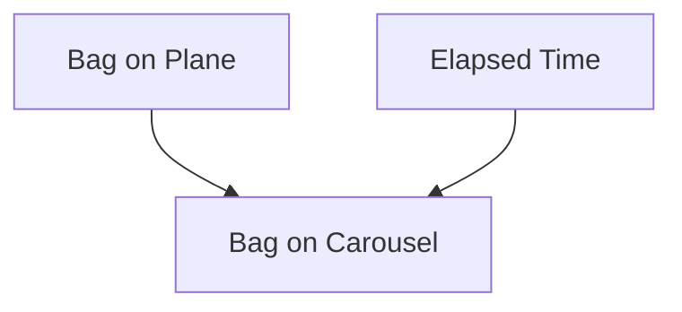
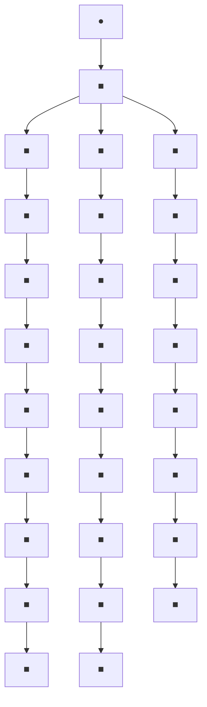
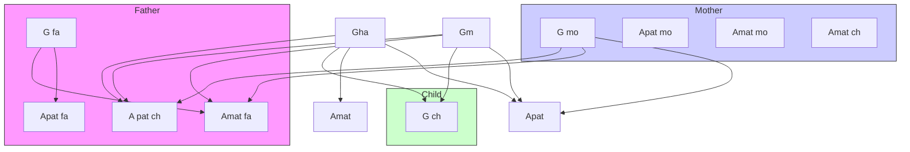
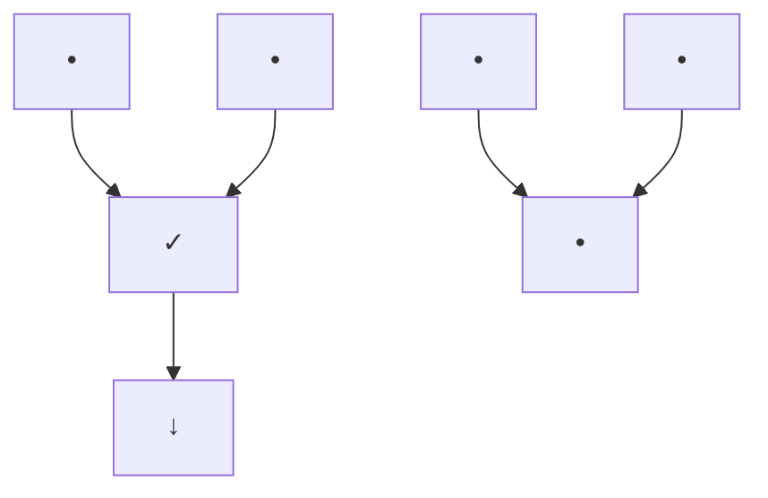
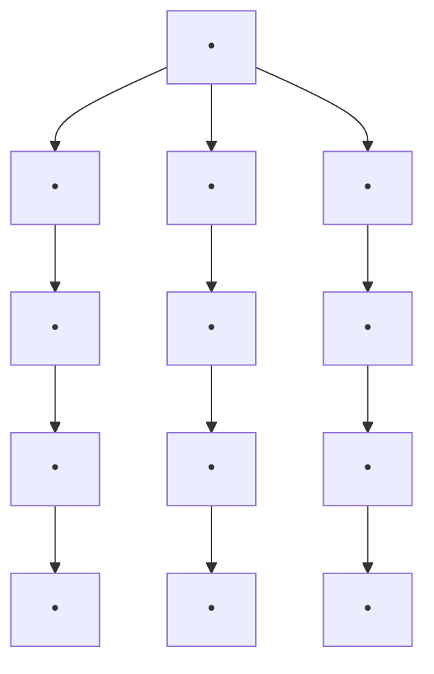

# FROM EVIDENCE TO CAUSES: REVEREND BAYES MEETS MR. HOLMES

Do two men travel together unless they have agreed? Does the lion roar in the forest if he has no prey?  
—AMOS 3:3

“IT’S elementary, my dear Watson.”  
So spoke Sherlock Holmes（至少电影里如此）就在他用一个著名的、毫不基本的推理让忠诚的助手眼花缭乱之前。但事实上，福尔摩斯所做的不仅仅是演绎推理——即从假设到结论的推理。他的伟大技能在于归纳推理，其方向相反：从证据到假设。

他的另一句名言暗示了他的工作方式：“当你排除了所有不可能的情况，剩下的，无论多么不可能，就一定是真相。”在归纳出几个假设后，福尔摩斯逐一排除它们，以便通过排除法演绎出正确的结论。虽然归纳和演绎相辅相成，但前者要神秘得多。这一事实让像福尔摩斯这样的侦探得以维持生计。

然而，近年来，人工智能领域的专家在自动化从证据到假设（以及从结果到原因）的推理过程方面取得了显著进展。我有幸参与了这一进展的最早期阶段，开发了其中一个基本工具——**贝叶斯网络**。本章将解释什么是贝叶斯网络，介绍一些当前的应用，并讨论它们如何通过迂回的路径引导我研究因果关系的。

## BONAPARTE，计算机侦探

2014年7月17日，马来西亚航空MH17航班从阿姆斯特丹史基浦机场起飞，目的地是吉隆坡。可惜，飞机未能抵达目的地。飞行三小时后，当飞机飞越乌克兰东部时，被一枚俄制地对空导弹击落。机上298人全部遇难，包括283名乘客和15名机组人员。

7月23日，第一批遗体抵达荷兰，当天被定为全国哀悼日。但对于海牙荷兰法医研究所的调查人员来说，7月23日是倒计时开始的日子。他们的任务是尽快识别遇难者的遗骸，并将其归还给亲人安葬。时间至关重要，因为每一天的不确定性都会给悲伤的家庭带来新的痛苦。

调查人员面临许多障碍：遗体严重烧伤，许多被存放在甲醛中（这会破坏DNA）；此外，由于乌克兰东部是战区，法医专家只能偶尔进入坠机现场；新发现的遗骸在接下来的十个月里陆续抵达。最后，调查人员没有遇难者之前的DNA记录，原因很简单——遇难者并非罪犯。他们只能依赖与家庭成员的部分匹配。

幸运的是，荷兰法医研究所的科学家们拥有一个强大的工具：一款名为 **Bonaparte** 的先进灾难遇难者识别程序。该软件由奈梅亨拉德堡德大学的一个团队在2000年代中期开发，利用贝叶斯网络整合来自遇难者多位家庭成员的DNA信息。

部分得益于 Bonaparte 的准确性和速度，荷兰法医研究所到2014年12月成功识别了298名遇难者中的294具遗骸。截至2016年，只有两名遇难者（均为荷兰公民）下落不明。

作为 Bonaparte 软件基础的机器学习工具——贝叶斯网络，以多种大多数人未曾察觉的方式影响着我们的生活。它们被用于语音识别软件、垃圾邮件过滤器、天气预报、潜在油井评估以及美国食品药品监督管理局的医疗设备审批流程。如果你在微软Xbox上玩电子游戏，贝叶斯网络会为你的技能排名。如果你拥有一部手机，你的手机从成千上万个信号中挑选出你的通话所使用的编码，正是通过为贝叶斯网络设计的**置信传播算法**解码的。你可能听说过另一家公司——谷歌的首席互联网推广官文特·瑟夫这样说：“我们是贝叶斯方法的重度消费者。”

在本章中，我将讲述贝叶斯网络的故事，从它们18世纪的根源到20世纪80年代的发展，并给出一些当今使用的更多例子。它们与因果图的关系很简单：**因果图是一种贝叶斯网络，其中每条箭头都表示一个直接的因果关系（或至少是这种关系的可能性），方向与箭头一致**。并非所有贝叶斯网络都是因果的，在许多应用中这并不重要。然而，如果你曾想对你的贝叶斯网络提出第二层级或第三层级的问题，你必须极其谨慎地按照因果关系来绘制它。

## 贝叶斯牧师与逆概率问题

托马斯·贝叶斯——我在1985年以他的名字命名这些网络——从未梦想过他于18世纪50年代推导的一个公式有一天会被用于识别灾难遇难者。他关心的只是两个事件的概率：一个事件（假设）发生在另一个事件（证据）之前。尽管如此，因果关系是他非常关注的问题。事实上，因果追求是他分析“逆概率”的驱动力。

托马斯·贝叶斯牧师（1702–1761）是一位长老会牧师，看起来是个数学极客。作为英国国教会的反对者，他无法在牛津或剑桥学习，而是在苏格兰大学接受教育，在那里他很可能学到了不少数学知识。回到英格兰后，他继续钻研数学并组织数学讨论小组。

在他去世后发表的一篇文章中（见图3.1），贝叶斯解决了一个非常适合他的问题：让数学与神学对决。背景是：1748年，苏格兰哲学家大卫·休谟写了一篇题为《论奇迹》的文章，他在其中论证，目击者的证词永远无法证明奇迹发生过。休谟心中所想的奇迹当然是基督的复活，尽管他很聪明地没有明说。（二十年前，神学家托马斯·伍尔斯顿因写此类内容而以亵渎罪入狱。）休谟的主要观点是：本质上不可靠的证据无法推翻具有自然法则力量的命题，例如“死人不会复活”。

> **图3.1** 贝叶斯论文的标题页，发表于1763年（他去世后）。请注意，标题中使用了“机会”一词，当时是“概率”的同义词。

## PHILOSOPHICAL TRANSACTIONS,

GIVING SOME

**ACCOUNT**

**OF THE** Present Undertakings, Studies, and Labours, **OF THE**

## I NGENIOUS,

INMANYConfiderable Parts of the W OR L D.

V OL.LII. For the Year 1763.

LONDON:

Printed for L.DAvIs and C.REY MER·s, Printers to the RoY AL SocIETY, againft Gray's-InnGate, in Holbourn.

M.DCC.LXIV.

## [370]

quodque folum, certa nitri figna prabere, sed plura concurrere debere, ut de vero nitro producto dubium non relinquatur.

**LII. An Essay towards solving a Problem in the Doctrine of Chances.** By the late Rev. Mr. Bayes, F.R.S. communicated by Mr. Price, in a Letter to John Canton, A.M. F.R.S.

Dear Sir,

Read Dec. 23, 1763. I now send you an essay which I have found among the papers of our deceased friend Mr. Bayes, and which, in my opinion, has great merit, and well deserves to be preserved. Experimental philosophy, you will find, is nearly interested in the subject of it; and on this account there seems to be particular reason for thinking that a communication of it to the Royal Society cannot be improper.

He had, you know, the honour of being a member of that illustrious Society, and was much esteemed by many in it as a very able mathematician. In an introduction which he has writ to this Essay, he says, that his design at first in thinking on the subject of it was, to find out a method by which we might judge concerning the probability that an event has to happen, in given circumstances, upon supposition that we know nothing concerning it but that under the same circumstances——

For Bayes, this assertion provoked a natural, one might say Holmesian question: **How much evidence would it take to convince us that something we consider improbable has actually happened?** When does a hypothesis cross the line from impossibility to improbability and even to probability or virtual certainty?

Although the question was phrased in the language of probability, the implications were intentionally theological. Richard Price, a fellow minister who found the essay among Bayes’s possessions after his death and sent it for publication with a glowing introduction that he wrote himself, made this point abundantly clear:

> The purpose I mean is, to shew what reason we have for believing that there are in the constitution of things fixt laws according to which things happen, and that, therefore, the frame of the world must be the effect of the wisdom and power of an intelligent cause; and thus to confirm the argument taken from final causes for the existence of the Deity. It will be easy to see that the converse problem solved in this essay is more directly applicable to this purpose; for it shews us, with distinctness and precision, in every case of any particular order or recurrency of events, what reason there is to think that such recurrency or order is derived from stable causes or regulations in nature, and not from any irregularities of chance.

Bayes himself did not discuss any of this in his paper; Price highlighted these theological implications, perhaps to make the impact of his friend’s paper more far-reaching. But it turned out that Bayes didn’t need the help. His paper is remembered and argued about 250 years later, not for its theology but because it shows that **you can deduce the probability of a cause from an effect.**

If we know the cause, it is easy to estimate the probability of the effect, which is a forward probability. Going the other direction——a problem known in Bayes’s time as “inverse probability”——is harder. Bayes did not explain why it is harder; he took that as self-evident, proved that it is doable, and showed us how.

To appreciate the nature of the problem, let’s look at the example he suggested himself in his posthumous paper of 1763. Imagine that we shoot a billiard ball on a table, making sure that it bounces many times so that we have no idea where it will end up. **What is the probability that it will stop within $x$ feet of the left-hand end of the table?**

If we know the length of the table and it is perfectly smooth and flat, this is a very easy question (Figure 3.2, top). For example, on a twelve-foot snooker table, the probability of the ball stopping within a foot of the end would be $1/12$. On an eight-foot billiard table, the probability would be $1/8$.

> **FIGURE 3.2.** Thomas Bayes’s pool table example. In the first version, a forward-probability question, we know the length of the table and want to calculate the probability of the ball stopping within $x$ feet of the end. In the second, an inverse-probability question, we observe that the ball stopped $x$ feet from the end and want to estimate the likelihood that the table’s length is $L$. (Source: Drawing by Maayan Harel.)

$$
L = ? 
$$

$$
x
$$

Our intuitive understanding of the physics tells us that, in general, if the length of the table is L feet, the probability of the ball’s stopping within x feet of the end is x/L. The longer the table length (L), the lower the probability, because there are more positions competing for the honor of being the ball’s resting place. On the other hand, the larger x is, the higher the probability, because it includes a larger set of stopping positions.

Now consider the inverse-probability problem. We observe the final position of the ball to be x = 1 foot from the end, but we are not given the length L (Figure 3.2, bottom). Reverend Bayes asked, What is the probability that the length was, say, one hundred feet? Common sense tells us that L is more likely to be fifty feet than one hundred feet, because the longer table makes it harder to explain why the ball ended up so close to the end. But how much more likely is it? “Intuition” or “common sense” gives us no clear guidance.

Why was the forward probability (of x given L) so much easier to assess mentally than the probability of L given x? In this example, the asymmetry comes from the fact that L acts as the cause and x is the effect. If we observe a cause—for example, Bobby throws a ball toward a window—most of us can predict the effect (the ball will probably break the window). Human cognition works in this direction. But given the effect (the window is broken), we need much more information to deduce the cause (which boy threw the ball that broke it or even the fact that it was broken by a ball in the first place). It takes the mind of a Sherlock Holmes to keep track of all the possible causes. Bayes set out to break this cognitive asymmetry and explain how even ordinary humans can assess inverse probabilities.

To see how Bayes’s method works, let’s start with a simple example about customers in a teahouse, for whom we have data documenting their preferences. Data, as we know from Chapter 1, are totally oblivious to cause-effect asymmetries and hence should offer us a way to resolve the inverse-probability puzzle.

Suppose two-thirds of the customers who come to the shop order tea, and half of the tea drinkers also order scones. What fraction of the clientele orders both tea and scones? There’s no trick to this question, and I hope that the answer is almost obvious. Because half of two-thirds is one-third, it follows that one-third of the customers order both tea and scones.

For a numerical illustration, suppose that we tabulate the orders of the next twelve customers who come in the door. As Table 3.1 shows, two-thirds of the customers (1, 5, 6, 7, 8, 9, 10, 12) ordered tea, and one-half of those people ordered scones (1, 5, 8, 12). So the proportion of customers who ordered both tea and scones is indeed $(1/2) \times (2/3) = 1/3$, just as we predicted prior to seeing the specific data.

**TABLE 3.1.** Fictitious data for the tea-scones example.

| Customer | Tea | Scones | Customer | Tea | Scones |
|----------|-----|--------|----------|-----|--------|
| 1        | Yes | Yes    | 7        | Yes | No     |
| 2        | No  | Yes    | 8        | Yes | Yes    |
| 3        | No  | No     | 9        | Yes | No     |
| 4        | No  | No     | 10       | Yes | No     |
| 5        | Yes | Yes    | 11       | No  | No     |
| 6        | Yes | No     | 12       | Yes | Yes    |

The starting point for Bayes’s rule is to notice that we could have analyzed the data in the reverse order. That is, we could have observed that five-twelfths of the customers (1, 2, 5, 8, 12) ordered scones, and four-fifths of these (1, 5, 8, 12) ordered tea. So the proportion of customers who ordered both tea and scones is $(4/5) \times (5/12) = 1/3$. Of course it’s no coincidence that it came out the same; we were merely computing the same quantity in two different ways. The temporal order in which the customers announce their order makes no difference.

To make this a general rule, we can let $P(T)$ denote the probability that a customer orders tea and $P(S)$ denote the probability he orders scones. If we already know a customer has ordered tea, then $P(S \mid T)$ denotes the probability that he orders scones. (Remember that the vertical line stands for “given that.”) Likewise, $P(T \mid S)$ denotes the probability that he orders tea, given that we already know he ordered scones. Then the first calculation we did says:

$$
P(S \text{ AND } T) = P(S \mid T) P(T).
$$

The second calculation says,

$$
P (S \text{ AND } T) = P (T \mid S) P (S).
$$

Now, as Euclid said 2,300 years ago, two things that each equal a third thing also equal one another. That means it must be the case that

$$
P (S \mid T) P (T) = P (T \mid S) P (S). \tag{3.1}
$$

This innocent-looking equation came to be known as “Bayes’s rule.” If we look carefully at what it says, we find that it offers a general solution to the inverse-probability problem. It tells us that if we know the probability of S given T, $P(S \mid T)$, we ought to be able to figure out the probability of T given $S$, $P(T \mid S)$, assuming of course that we know $P(T)$ and $P(S)$. This is perhaps the most important role of Bayes’s rule in statistics: we can estimate the conditional probability directly in one direction, for which our judgment is more reliable, and use mathematics to derive the conditional probability in the other direction, for which our judgment is rather hazy. The equation also plays this role in Bayesian networks; we tell the computer the forward probabilities, and the computer tells us the inverse probabilities when needed.

To see how Bayes’s rule works in the teahouse example, suppose you didn’t bother to calculate $P(T \mid S)$ and left your spreadsheet containing the data at home. However, you happen to remember that half of those who order tea also order scones, and two-thirds of the customers order tea and five-twelfths order scones. Unexpectedly, your boss asks you, “But what proportion of scone eaters order tea?” There’s no need to panic, because you can work it out from the other probabilities. Bayes’s rule says that $P(T \mid S) (5/12) = (1/2)(2/3)$, so your answer is $P(T \mid S) = 4/5$, because $4/5$ is the only value for $P(T \mid S)$ that will make this equation true.

We can also look at Bayes’s rule as a way to update our belief in a particular hypothesis. This is extremely important to understand, because a large part of human belief about future events rests on the frequency with which they or similar events have occurred in the past. Indeed, when a customer walks in the door of the restaurant, we believe, based on our past encounters with similar customers, that she probably wants tea. But if she first orders scones, we become even more certain. In fact, we might even suggest it: “I presume you want tea with that?” Bayes’s rule simply lets us attach numbers to this reasoning process. From Table 3.1, we see that the prior probability that the customer wants tea (meaning when she walks in the door, before she orders anything) is two-thirds. But if the customer orders scones, now we have additional information about her that we didn’t have before. The updated probability that she wants tea, given that she has ordered scones, is $P(T \mid S) = 4/5$.

Mathematically, that’s all there is to Bayes’s rule. It seems almost trivial. It involves nothing more than the concept of conditional probability, plus a little dose of ancient Greek logic. You might justifiably ask how such a simple gimmick could make Bayes famous and why people have argued over his rule for 250 years. After all, mathematical facts are supposed to settle controversies, not create them.

Here I must confess that in the teahouse example, by deriving Bayes’s rule from data, I have glossed over two profound objections, one philosophical and the other practical. The philosophical one stems from the interpretation of probabilities as a degree of belief, which we used implicitly in the teahouse example. Who ever said that beliefs act, or should act, like proportions in the data?

The crux of the philosophical debate is whether we can legitimately translate the expression “given that I know” into the language of probabilities. Even if we agree that the unconditional probabilities $P(S)$, $P(T)$, and $P(S \text{ AND } T)$ reflect my degree of belief in those propositions, who says that my revised degree of belief in $T$ should equal the ratio $P(S \text{ AND } T)/P(T)$, as dictated by Bayes’s rule? Is “given that I know $T$” the same as “among cases where $T$ occurred”? The language of probability, expressed in symbols like $P(S)$, was intended to capture the concept of frequencies in games of chance. But the expression “given that I know” is epistemological and should be governed by the logic of knowledge, not that of frequencies and proportions.

From the philosophical perspective, Thomas Bayes’s accomplishment lies in his proposing the first formal definition of conditional probability as the ratio $P(S \mid T) = P(S \text{ AND } T)/P(T)$. His essay was admittedly hazy; he has no term “conditional probability” and instead uses the cumbersome language “the probability of the 2nd [event] on supposition that the 1st happens.” The recognition that the relation “given that” deserves its own symbol evolved only in the 1880s, and it was not until 1931 that Harold Jeffreys (known more as a geophysicist than a probability theorist) introduced the now standard vertical bar in $P(S \mid T)$.

As we saw, Bayes’s rule is formally an elementary consequence of his definition of conditional probability. But epistemologically, it is far from elementary. It acts, in fact, as a normative rule for updating beliefs in response to evidence. In other words, we should view Bayes’s rule not just as a convenient definition of the new concept of “conditional probability” but as an empirical claim to faithfully represent the English expression “given that I know.” It asserts, among other things, that the belief a person attributes to $S$ after discovering $T$ is never lower than the degree of belief that person attributes to $S \text{ AND } T$ before discovering $T$. Also, it implies that the more surprising the evidence $T$—that is, the smaller $P(T)$ is—the more convinced one should become of its cause $S$. No wonder Bayes and his friend Price, as Episcopal ministers, saw this as an effective rejoinder to Hume. If $T$ is a miracle (“Christ rose from the dead”), and $S$ is a closely related hypothesis (“Christ is the son of God”), our degree of belief in $S$ is very dramatically increased if we know for a fact that $T$ is true. The more miraculous the miracle, the more credible the hypothesis that explains its occurrence. This explains why the writers of the New Testament were so impressed by their eyewitness evidence.

Now let me discuss the practical objection to Bayes’s rule—which may be even more consequential when we exit the realm of theology and enter the realm of science. If we try to apply the rule to the billiard-ball puzzle, in order to find $P(L \mid x)$ we need a quantity that is not available to us from the physics of billiard balls: we need the prior probability of the length $L$, which is every bit as tough to estimate as our desired $P(L \mid x)$. Moreover, this probability will vary significantly from person to person, depending on a given individual’s previous experience with tables of different lengths. A person who has never in his life seen a snooker table would be very doubtful that $L$ could be longer than ten feet. A person who has only seen snooker tables and never seen a billiard table would, on the other hand, give a very low prior probability to $L$ being less than ten feet. This variability, also known as “subjectivity,” is sometimes seen as a deficiency of Bayesian inference. Others regard it as a powerful advantage; it permits us to express our personal experience mathematically and combine it with data in a principled and transparent way. Bayes’s rule informs our reasoning in cases where ordinary intuition fails us or where emotion might lead us astray. We will demonstrate this power in a situation familiar to all of us.

Suppose you take a medical test to see if you have a disease, and it comes back positive. How likely is it that you have the disease? For specificity, let’s say the disease is breast cancer, and the test is a mammogram. In this example the forward probability is the probability of a positive test, given that you have the disease: $P(\text{test} \mid \text{disease})$. This is what a doctor would call the “sensitivity” of the test, or its ability to correctly detect an illness. Generally it is the same for all types of patients, because it depends only on the technical capability of the testing instrument to detect the abnormalities associated with the disease. The inverse probability is the one you surely care more about: What is the probability that I have the disease, given that the test came out positive? This is $P(\text{disease} \mid \text{test})$, and it represents a flow of information in the noncausal direction, from the result of the test to the probability of disease. This probability is not necessarily the same for all types of patients; we would certainly view the positive test with more alarm in a patient with a family history of the disease than in one with no such history.

Notice that we have started to talk about causal and noncausal directions. We didn’t do that in the teahouse example because it did not matter which came first, ordering tea or ordering scones. It only mattered which conditional probability we felt more capable of assessing. But the causal setting clarifies why we feel less comfortable assessing the “inverse probability,” and Bayes’s essay makes clear that this is exactly the

where the new term “likelihood ratio” is given by $P(T \mid D) / P(T)$. It measures how much more likely the positive test is in people with the disease than in the general population. Equation 3.2 therefore tells us that the new evidence $T$ augments the probability of $D$ by a fixed ratio, no matter what the prior probability was.

Let’s do an example to see how this important concept works. For a typical forty-year-old woman, the probability of getting breast cancer in the next year is about one in seven hundred, so **we’ll** use that as our prior probability.

To compute the likelihood ratio, we need to know $P(T \mid D)$ and $P(T)$. In the medical context, $P(T \mid D)$ is the sensitivity of the mammogram—the probability that it will come back positive if you have cancer. According to the Breast Cancer Surveillance Consortium (BCSC), the sensitivity of mammograms for forty-year-old women is 73 percent.

The denominator, $P(T)$, is a bit trickier. A positive test, $T$, can come both from patients who have the disease and from patients who don’t. Thus, $P(T)$ should be a weighted average of $P(T \mid D)$ (the probability of a positive test among those who have the disease) and $P(T \mid \sim D)$ (the probability of a positive test among those who don’t). The second is known as the false positive rate. According to the BCSC, the false positive rate for forty-year-old women is about 12 percent.

Why a weighted average? Because there are many more healthy women ($\sim D$) than women with cancer ($D$). In fact, only 1 in 700 women has cancer, and the other 699 do not, so the probability of a positive test for a randomly chosen woman should be much more strongly influenced by the 699 women who don’t have cancer than by the one woman who does.

Mathematically, we compute the weighted average as follows:

$$
P(T) = (1 / 700) \times (73\%) + (699 / 700) \times (12\%) \approx 12.1\%
$$

The weights come about because only 1 in 700 women has a 73 percent chance of a positive test, and the other 699 have a 12 percent chance. Just as you might expect, $P(T)$ came out very close to the false positive rate.

Now that we know $P(T)$, we finally can compute the updated probability — the woman’s chances of having breast cancer after the test comes back positive. The likelihood ratio is $73\% / 12.1\% \approx 6$. As I said before, this is the factor by which we augment her prior probability to compute her updated probability of having cancer. Since her prior probability was one in seven hundred, her updated probability is $6 \times 1 / 700 \approx 1 / 116$. In other words, she still has less than a 1 percent chance of having cancer.

The conclusion is startling. I think that most forty-year-old women who have a positive mammogram would be astounded to learn that they still have less than a 1 percent chance of having breast cancer. Figure 3.3 might make the reason easier to understand: the tiny number of true positives (i.e., women with breast cancer) is overwhelmed by the number of false positives. Our sense of surprise at this result comes from the common cognitive confusion between the forward probability, which is well studied and thoroughly documented, and the inverse probability, which is needed for personal decision making.

The conflict between our perception and reality partially explains the outcry when the US Preventive Services Task Force, in 2009, recommended that forty-year-old women should not get annual mammograms. The task force understood what many women did not: a positive test at that age is way more likely to be a false alarm than to detect cancer, and many women were unnecessarily terrified (and getting unnecessary treatment) as a result.

However, the story would be very different if our patient had a gene that put her at high risk for breast cancer — say, a one-in-twenty chance within the next year. Then a positive test would increase the probability to almost one in three. For a woman in this situation, the chances that the test provides lifesaving information are much higher. That is why the task force continued to recommend annual mammograms for high-risk women.

This example shows that $P(\text{disease} \mid \text{test})$ is not the same for everyone; it is context dependent. If you know that you are at high risk for a disease to begin with, Bayes’s rule allows you to factor that information in. Or if you know that you are immune, you need not even bother with the test! In contrast, $P(\text{test} \mid \text{disease})$ does not depend on whether you are at high risk or not. It is “robust” to such variations, which explains to some degree why physicians organize their knowledge and communicate with forward probabilities. The former are properties of the disease itself, its stage of progression, or the sensitivity of the detecting instruments; hence they remain relatively invariant to the reasons for the disease (epidemic, diet, hygiene, socioeconomic status, family history). The inverse probability, $P(\text{disease} \mid \text{test})$, is sensitive to these conditions.

The history-minded reader will surely wonder how Bayes handled the subjectivity of $P(L)$, where $L$ is the length of a billiard table. The answer has two parts. First, Bayes was interested not in the length of the table per se but in its future consequences (i.e., the probability that the next ball would end up at some specified location on the table). Second, Bayes assumed that $L$ is determined mechanically by shooting a billiard ball from a greater distance, say $L^*$. In this way he bestowed objectivity onto $P(L)$ and transformed the problem into one where prior probabilities are estimable from data, as we see in the teahouse and cancer test examples.

In many ways, Bayes’s rule is a distillation of the scientific method. The textbook description of the scientific method goes something like this:

- Formulate a hypothesis.
- Deduce a testable consequence of the hypothesis.
- Perform an experiment and collect evidence.
- Update your belief in the hypothesis.

Usually the textbooks deal with simple yes-or-no tests and updates; the evidence either confirms or refutes the hypothesis. But life and science are never so simple! All evidence comes with a certain amount of uncertainty. Bayes’s rule tells us how to perform step (4) in the real world.

# FROM BAYES’S RULE TO BAYESIAN NETWORKS

In the early 1980s, the field of artificial intelligence had worked itself into a cul‑de‑sac. Ever since Alan Turing first laid out the challenge in his 1950 paper “Computing Machinery and Intelligence,” the leading approach to AI had been so‑called rule‑based systems or expert systems, which organize human knowledge as a collection of specific and general facts, along with inference rules to connect them. For example: Socrates is a man (specific fact). All men are mortals (general fact). From this knowledge base we (or an intelligent machine) can derive the fact that Socrates is a mortal, using the universal rule of inference: if all A’s are B’s, and x is an A, then x is a B.

The approach was fine in theory, but hard‑and‑fast rules can rarely capture real‑life knowledge. Perhaps without realizing it, we deal with exceptions to rules and uncertainties in evidence all the time. By 1980, it was clear that expert systems struggled with making correct inferences from uncertain knowledge. The computer could not replicate the inferential process of a human expert because the experts themselves were not able to articulate their thinking process within the language provided by the system.

The late 1970s, then, were a time of ferment in the AI community over the question of how to deal with uncertainty. There was no shortage of ideas. Lotfi Zadeh of Berkeley offered “fuzzy logic,” in which statements are neither true nor false but instead take a range of possible truth values. Glen Shafer of the University of Kansas proposed “belief functions,” which assign two probabilities to each fact, one indicating how likely it is to be “possible,” the other, how likely it is to be “provable.” Edward Feigenbaum and his colleagues at Stanford University tried “certainty factors,” which inserted numerical measures of uncertainty into their deterministic rules for inference.

Unfortunately, although ingenious, these approaches suffered a common flaw: they modeled the expert, not the world, and therefore tended to produce unintended results. For example, they could not operate in both diagnostic and predictive modes, the uncontested specialty of Bayes’s rule. In the certainty factor approach, the rule “If fire, then smoke (with certainty c1)” could not combine coherently with “If smoke, then fire (with certainty c2)” without triggering a runaway buildup of belief.

Probability was also considered at the time but immediately fell into ill repute, since the demands on storage space and processing time became formidable. I entered the arena rather late, in 1982, with an obvious yet radical proposal: instead of reinventing a new uncertainty theory from scratch, let’s keep probability as a guardian of common sense and merely repair its computational deficiencies. More specifically, instead of representing probability in huge tables, as was previously done, let’s represent it with a network of loosely coupled variables. If we only allow each variable to interact with a few neighboring variables, then we might overcome the computational hurdles that had caused other probabilists to stumble.

The idea did not come to me in a dream; it came from an article by David Rumelhart, a cognitive scientist at University of California, San Diego, and a pioneer of neural networks. His article about children’s reading, published in 1976, made clear that reading is a complex process in which neurons on many different levels are active at the same time (see Figure 3.4). Some of the neurons are simply recognizing individual features circles or lines. Above them, another layer of neurons is combining these shapes and forming conjectures about what the letter might be. In Figure 3.4, the network is struggling with a great deal of ambiguity about the second word. At the letter level, it could be “FHP,” but that doesn’t make much sense at the word level. At the word level it could be “FAR” or “CAR” or “FAT.” The neurons pass this information up to the syntactic level, which decides that after the word “THE,” it’s expecting a noun. Finally this information gets passed all the way up to the semantic level, which realizes that the previous sentence mentioned a Volkswagen, so the phrase is likely to be “THE CAR,” referring to that same Volkswagen. The key point is that all the neurons are passing information back and forth, from the top down and from the bottom up and from side to side. It’s a highly parallel system, and one that is quite different from our self‑perception of the brain as a monolithic, centrally controlled system.

Reading Rumelhart’s paper, I felt convinced that any artificial intelligence would have to model itself on what we know about human neural information processing and that machine reasoning under uncertainty would have to be constructed with a similar message‑passing architecture. But what are the messages? This took me quite a few months to figure out. I finally realized that the messages were conditional probabilities in one direction and likelihood ratios in the other.

> **FIGURE 3.4.** David Rumelhart’s sketch of how a message‑passing network would learn to read the phrase “THE CAR.” (Source: Courtesy of Center for Brain and Cognition, University of California, San Diego.)

```mermaid
graph TD
  A["Semantic Level"] --> B["'Object'"]
  A --> C["'Lake'"]
  A --> D["'Volkswagen'"]
  A --> E["'NP'"]
  A --> F["'DET'"]
  A --> G["'the'"]
  A --> H["'Car'"]
  A --> I["'Noun'"]
  A --> J["'L''"]
  A --> K["'cat'"]
  A --> L["'at'"]
  A --> M["'ch'"]
  A --> N["'f'"]
  A --> O["'a'"]
  A --> P["'t'"]
  A --> Q["'L'"]
  A --> R["'r'"]
  A --> S["'e'"]
  A --> T["'h'"]
  A --> U["'t'"]
  A --> V["'V'"]
  A --> W["THE CAR"]
  X["Syntactic Level"] --> B
  X --> C
  X --> D
  X --> E
  X --> F
  X --> G
  X --> H
  X --> I
  X --> J
  X --> K
  X --> L
  X --> M
  X --> N
  X --> O
  X --> P
  X --> Q
  X --> R
  X --> S
  X --> T
  X --> U
  X --> V
  X --> W
  Y["Lexical Level"] --> Z["'Det'"]
  Y --> AA["'cat'"]
  Y --> AB["'at'"]
  Y --> AC["'cat'"]
  Y --> AD["'cat'"]
  Y --> AE["'cat'"]
  Y --> AF["'cat'"]
  Y --> AG["'cat'"]
  Y --> AH["'cat'"]
  Y --> AI["'cat'"]
  Y --> AJ["'cat'"]
  Y --> AK["'cat'"]
  Y --> AL["'cat'"]
  Y --> AM["'cat'"]
  Y --> AN["'cat'"]
  Y --> AO["'cat'"]
  Y --> AP["'cat'"]
  Y --> AQ["'cat'"]
  Y --> AR["'cat'"]
  Y --> AS["'cat'"]
  Y --> AT["'cat'"]
  Y --> AU["'cat'"]
  Y --> AV["'cat'"]
  Y --> AW["'cat'"]
  Y --> AX["'cat'"]
  Y --> AY["'Cat'"]
  Y --> AZ["'Cat'"]
  Y --> BA["'Cat'"]
  Y --> BB["'Cat'"]
  Y --> BC["'Cat'"]
  Y --> BD["'Cat'"]
  Y --> BE["'Cat'"]
  Y --> BF["'Cat'"]
  Y --> BG["'Cat'"]
  Y --> BH["'Cat'"]
  Y --> BI["'Cat'"]
```

More precisely, I assumed that the network would be hierarchical, with arrows pointing from higher neurons to lower ones, or from “parent nodes” to “child nodes.” Each node would send a message to all its neighbors (both above and below in the hierarchy) about its current degree of belief about the variable it tracked (e.g., “I’m two‑thirds certain that this letter is an R”). The recipient would process the message in two different ways, depending on its direction. If the message went from parent to child, the child would update its beliefs using conditional probabilities, like the ones we saw in the teahouse example. If the message went from child to parent, the parent would update its beliefs by multiplying them by a likelihood ratio, as in the mammogram example.

Applying these two rules repeatedly to every node in the network is called **belief propagation**. In retrospect there is nothing arbitrary or invented about these rules; they are in strict compliance with Bayes’s rule. The real challenge was to ensure that no matter in what order these messages are sent out, things will settle eventually into a comfortable equilibrium; moreover, the final equilibrium will represent the correct state of belief in

## BAYESIAN NETWORKS: WHAT CAUSES SAY ABOUT DATA

Although Bayes didn’t know it, his rule for inverse probability represents the simplest Bayesian network. We have seen this network in several guises now: Tea Scones, Disease Test, or, more generally, HypothesisEvidence. Unlike the causal diagrams we will deal with throughout the book, a Bayesian network carries no assumption that the arrow has any causal meaning. The arrow merely signifies that we know the “forward” probability, P(scones | tea) or P(test | disease). Bayes’s rule tells us how to reverse the procedure, specifically by multiplying the prior probability by a likelihood ratio.

Belief propagation formally works in exactly the same way whether the arrows are noncausal or causal. Nevertheless, you may have the intuitive feeling that we have done something more meaningful in the latter case than in the former. That is because our brains are endowed with special machinery for comprehending cause-effect relationships (such as cancer and mammograms). Not so for mere associations (such as tea and scones).

The next step after a two-node network with one link is, of course, a three-node network with two links, which I will call a “junction.” These are the building blocks of all Bayesian networks (and causal networks as well). There are three basic types of junctions, with the help of which we can characterize any pattern of arrows in the network.

1. **A → B → C**. This junction is the simplest example of a “chain,” or of mediation. In science, one often thinks of B as the mechanism, or “mediator,” that transmits the effect of A to C. A familiar example is Fire → Smoke → Alarm. Although we call them “fire alarms,” they are really smoke alarms. The fire by itself does not set off an alarm, so there is no direct arrow from Fire to Alarm. Nor does the fire set off the alarm through any other variable, such as heat. It works only by releasing smoke molecules in the air. If we disable that link in the chain, for instance by sucking all the smoke molecules away with a fume hood, then there will be no alarm.

   This observation leads to an important conceptual point about chains: the mediator B “screens off” information about A from C, and vice versa. (This was first pointed out by Hans Reichenbach, a German-American philosopher of science.)

   For example, once we know the value of Smoke, learning about Fire does not give us any reason to raise or lower our belief in Alarm. This stability of belief is a rung-one concept; hence it should also be seen in the data, when it is available. Suppose we had a database of all the instances when there was fire, when there was smoke, or when the alarm went off. If we looked at only the rows where Smoke = 1, we would expect Alarm = 1 every time, regardless of whether Fire = 0 or Fire = 1. This screening-off pattern still holds if the effect is not deterministic. For example, imagine a faulty alarm system that fails to respond correctly 5 percent of the time. If we look only at the rows where Smoke = 1, we will find that the probability of Alarm = 1 is the same (95 percent), regardless of whether Fire = 0 or Fire = 1.

   The process of looking only at rows in the table where Smoke = 1 is called conditioning on a variable. Likewise, we say that Fire and Alarm are conditionally independent, given the value of Smoke. This is important to know if you are programming a machine to update its beliefs; conditional independence gives the machine a license to focus on the relevant information and disregard the rest. We all need this kind of license in our everyday thinking, or else we will spend all our time chasing false signals. But how do we decide which information to disregard, when every new piece of information changes the boundary between the relevant and the irrelevant? For humans, this understanding comes naturally. Even three-year-old toddlers understand the screening-off effect, though they don’t have a name for it. Their instinct must have come from some mental representation, possibly resembling a causal diagram. But machines do not have this instinct, which is one reason that we equip them with causal diagrams.

2. **A ← B → C**. This kind of junction is called a “fork,” and B is often called a common cause or confounder of A and C. A confounder will make A and C statistically correlated even though there is no direct causal link between them. A good example (due to David Freedman) is Shoe Size ← Age of Child → Reading Ability. Children with larger shoes tend to read at a higher level. But the relationship is not one of cause and effect. Giving a child larger shoes won’t make him read better! Instead, both variables are explained by a third, which is the child’s age. Older children have larger shoes, and they also are more advanced readers.

   We can eliminate this spurious correlation, as Karl Pearson and George Udny Yule called it, by conditioning on the child’s age. For instance, if we look only at seven-year-olds, we expect to see no relationship between shoe size and reading ability. As in the case of chain junctions, A and C are conditionally independent, given B.

   Before we go on to our third junction, we need to add a word of clarification. The conditional independences I have just mentioned are exhibited whenever we look at these junctions in isolation. If additional causal paths surround them, these paths need also be taken into account. The miracle of Bayesian networks lies in the fact that the three kinds of junctions we are now describing in isolation are sufficient for reading off all the independencies implied by a Bayesian network, regardless of how complicated.

3. **A → B ← C**. This is the most fascinating junction, called a “collider.” Felix Elwert and Chris Winship have illustrated this junction using three features of Hollywood actors: Talent → Celebrity ← Beauty. Here we are asserting that both talent and beauty contribute to an actor’s success, but beauty and talent are completely unrelated to one another in the general population.

   We will now see that this collider pattern works in exactly the opposite way from chains or forks when we condition on the variable in the middle. If A and C are independent to begin with, conditioning on B will make them dependent. For example, if we look only at famous actors (in other words, we observe the variable Celebrity = 1), we will see a negative correlation between talent and beauty: finding out that a celebrity is unattractive increases our belief that he or she is talented.

   This negative correlation is sometimes called collider bias or the “explain-away” effect. For simplicity, suppose that you don’t need both talent and beauty to be a celebrity; one is sufficient. Then if Celebrity A is a particularly good actor, that “explains away” his success, and he doesn’t need to be any more beautiful than the average person. On the other hand, if Celebrity B is a really bad actor, then the only way to explain his success is his good looks. So, given the outcome Celebrity = 1, talent and beauty are inversely related—even though they are not related in the population as a whole. Even in a more realistic situation, where success is a complicated function of beauty and talent, the explain-away effect will still be present. This example is admittedly somewhat apocryphal, because beauty and talent are hard to measure objectively; nevertheless, collider bias is quite real, and we will see lots of examples in this book.

These three junctions—chains, forks, and colliders—are like keyholes through the door that separates the first and second levels of the Ladder of Causation. If we peek through them, we can see the secrets of the causal process that generated the data we observe; each stands for a distinct pattern of causal flow and leaves its mark in the form of conditional dependences and independences in the data. In my public lectures I often call them “gifts from the gods” because they enable us to test a causal model, discover new models, evaluate effects of interventions, and much more. Still, standing in isolation, they give us only a glimpse. We need a key that will completely open the door and let us step out onto the second rung. That key, which we will learn about in Chapter 7, involves all three junctions, and is called **d-separation**. This concept tells us, for any given pattern of paths in the model, what patterns of dependencies we should expect in the data. This fundamental connection between causes and probabilities constitutes the main contribution of Bayesian networks to the science of causal inference.

## WHERE IS MY BAG? FROM AACHEN TO ZANZIBAR

So far I have emphasized only one aspect of Bayesian networks — namely, the diagram and its arrows that preferably point from cause to effect. Indeed, the diagram is like the engine of the Bayesian network. But like any engine, a Bayesian network runs on fuel. The fuel is called a **conditional probability table**.

Another way to put this is that the diagram describes the relation of the variables in a qualitative way, but if you want quantitative answers, you also need quantitative inputs. In a Bayesian network, we have to specify the conditional probability of each node given its “parents.”（记住，节点的父节点是所有指向它的节点。）这些是前向概率，即 $P(\text{evidence} \mid \text{hypotheses})$。

In the case where $A$ is a root node, with no arrows pointing into it, we need only specify the prior probability for each state of $A$. In our second network, Disease Test, Disease is a root node. Therefore we specified the prior probability that a person has the disease（在我们的示例中为 $1/700$）and that she does not have the disease（在我们的示例中为 $699/700$）。

By depicting $A$ as a root node, we do not really mean that $A$ has no prior causes. Hardly any variable is entitled to such a status. We really mean that any prior causes of $A$ can be adequately summarized in the prior probability $P(A)$ that $A$ is true. 例如，在 Disease Test 示例中，家族史可能是 Disease 的一个原因。但是，只要我们确信这个家族史不会影响变量 Test（一旦我们知道 Disease 的状态），我们就不需要将其表示为图中的节点。然而，如果存在一个既影响 Disease 又直接影响 Test 的原因，那么该原因必须在图中明确表示。

In the case where the node $A$ has a parent, $A$ has to “listen” to its parent before deciding on its own state. In our mammogram example, the parent of Test was Disease. 我们可以用一个 $2 \times 2$ 的表格来展示这个“倾听”过程（见表 3.2）。例如，如果 Test “听到” $D = 0$，那么 88% 的情况下它会取 $T = 0$，12% 的情况下它会取 $T = 1$。请注意，该表格的第二列包含了我们之前从乳腺癌监测联盟中看到的信息：假阳性率（右上角）为 12%，灵敏度（右下角）为 73%。其余两个条目被填充，以使每一行的总和为 100%。

**表 3.2：一个简单的条件概率表。**

| Probability of →, given ↓ | $T = 0$ | $T = 1$ |
|---------------------------|---------|---------|
| $D = 0$                  | 88      | 12      |
| $D = 1$                  | 27      | 73      |

随着我们转向更复杂的网络，条件概率表也会变得更加复杂。例如，如果一个节点有两个父节点，条件概率表必须考虑两个父节点的四种可能状态。让我们看一个具体的例子，由 BayesiaLab, Inc. 的 Stefan Conrady 和 Lionel Jouffe 提出。这是一个所有旅行者都熟悉的场景：我们可以称之为“我的行李在哪里？”

假设你刚刚在亚琛完成了一次紧张的转机后降落在桑给巴尔，正在等待你的行李箱出现在行李传送带上。其他乘客已经开始拿到他们的行李，但你一直在等待……等待……再等待。你的行李箱实际上没有赶上从亚琛到桑给巴尔的转机，这有多大的可能性？答案当然取决于你已经等待了多长时间。如果行李刚刚开始出现在传送带上，也许你应该耐心一点，再多等一会儿。如果你已经等了很长时间，那么情况就不妙了。我们可以通过建立一个因果图（图 3.5）来量化这些焦虑。

**FIGURE 3.5.** Causal diagram for airport/bag example.

This diagram reflects the intuitive idea that there are two causes for the appearance of any bag on the carousel. First, it had to be on the plane to begin with; otherwise, it will certainly never appear on the carousel. Second, the presence of the bag on the carousel becomes more likely as time passes… provided it was actually on the plane.

To turn the causal diagram into a Bayesian network, we have to specify the conditional probability tables. Let’s say that all the bags at Zanzibar airport get unloaded within ten minutes. (They are very efficient in Zanzibar!) Let’s also suppose that the probability your bag made the connection, $P(\text{bag on plane} = \text{true})$ is 50 percent. (I apologize if this offends anybody who works at the Aachen airport. I am only following Conrady and Jouffe’s example. Personally, I would prefer to assume a higher prior probability, like 95 percent.)

The real workhorse of this Bayesian network is the conditional probability table for “Bag on Carousel” (see Table 3.3). This table, though large, should be easy to understand. The first eleven rows say that if your bag didn’t make it onto the plane ($\text{bag on plane} = \text{false}$) then, no matter how much time has elapsed, it won’t be on the carousel ($\text{carousel} = \text{false}$). That is, $P(\text{carousel} = \text{false} \mid \text{bag on plane} = \text{false})$ is 100 percent. That is the meaning of the 100s in the first eleven rows.

The other eleven rows say that the bags are unloaded from the plane at a steady rate. If your bag is indeed on the plane, there is a 10 percent probability it will be unloaded in the first minute, a 10 percent probability in the second minute, and so forth. For example, after 5 minutes there is a 50 percent probability it has been unloaded, so we see a 50 for $P(\text{carousel} = \text{true} \mid \text{bag on plane} = \text{true}, \text{time} = 5)$. After ten minutes, all the bags have been unloaded, so $P(\text{carousel} = \text{true} \mid \text{bag on plane} = \text{true}, \text{time} = 10)$ is 100 percent. Thus we see a 100 in the last entry of the table.

The most interesting thing to do with this Bayesian network, as with most Bayesian networks, is to solve the inverse-probability problem: if $x$ minutes have passed and I still haven’t gotten my bag, what is the probability that it was on the plane? Bayes’s rule automates this computation and reveals an interesting pattern. After one minute, there is still a 47 percent chance that it was on the plane. (Remember that our prior assumption was a 50 percent probability.) After five minutes, the probability drops to 33 percent. After ten minutes, of course, it drops to zero. Figure 3.6 shows a plot of the probability over time, which one might call the “Curve of Abandoning Hope.” To me the interesting thing is that it is a curve: I think that most people would expect it to be a straight line. It actually sends us a pretty optimistic message: don’t give up hope too soon! According to this curve, you should abandon only one-third of your hope in the first half of the allotted time.

**TABLE 3.3.** A more complicated conditional probability table.

| Probability of →, Given ↓ | carousel = false | carousel = true |
|:---|:---:|:---:|
| **bag on plane** | **time elapsed** | |
| False | 0 | 100 | 0 |
| False | 1 | 100 | 0 |
| False | 2 | 100 | 0 |
| False | 3 | 100 | 0 |
| False | 4 | 100 | 0 |
| False | 5 | 100 | 0 |
| False | 6 | 100 | 0 |
| False | 7 | 100 | 0 |
| False | 8 | 100 | 0 |
| False | 9 | 100 | 0 |
| False | 10 | 100 | 0 |
| True | 0 | 100 | 0 |
| True | 1 | 90 | 10 |
| True | 2 | 80 | 20 |
| True | 3 | 70 | 30 |
| True | 4 | 60 | 40 |
| True | 5 | 50 | 50 |
| True | 6 | 40 | 60 |
| True | 7 | 30 | 70 |
| True | 8 | 20 | 80 |
| True | 9 | 10 | 90 |
| True | 10 | 0 | 100 |

Besides a life lesson, we’ve learned that you don’t want to do this by hand. Even with this tiny network of three nodes, there were $2 \times 11 = 22$ parent states, each contributing to the probability of the child state. For a computer, though, such computations are elementary… up to a point. If they aren’t done in an organized fashion, the sheer number of computations can overwhelm even the fastest supercomputer. If a node has ten parents, each of which has two states, the conditional probability table will have more than 1,000 rows. And if each of the ten parents has ten states, the table will have 10 billion rows! For this reason one usually has to winnow the connections in the network so that only the most important ones remain and the network is “sparse.” One technical advance in the development of Bayesian networks entailed finding ways to leverage sparseness in the network structure to achieve reasonable computation times.

## BAYESIAN NETWORKS IN THE REAL WORLD

Bayesian networks are by now a mature technology, and you can buy off-the-shelf Bayesian network software from several companies. Bayesian networks are also embedded in many “smart” devices. To give you an idea of how they are used in real-world applications, let’s return to the Bonaparte DNA-matching software with which we began this chapter.

The Netherlands Forensic Institute uses Bonaparte every day, mostly for missing-persons cases, criminal investigations, and immigration cases（申请人必须证明他们在荷兰有十五名家庭成员）。然而，贝叶斯网络在重大灾难后（例如马来西亚航空 17 号航班坠毁事件）才能发挥其最令人印象深刻的作用。

Few, if any, of the victims of the plane crash could be identified by comparing DNA from the wreckage to DNA in a central database. The next best thing to do was to ask family members to provide DNA swabs and look for partial matches to the DNA of the victims. Conventional (non-Bayesian) methods can do this and have been instrumental in solving a number of cold cases in the Netherlands, the United States, and elsewhere. 例如，一个称为“亲子指数”或“兄弟姐妹指数”的简单公式可以估计未识别 DNA 来自被测试者父亲或兄弟的可能性。

However, these indices are inherently limited because they work for only one specified relation and only for close relations. The idea behind Bonaparte is to make it possible to use DNA information from more distant relatives or from multiple relatives. Bonaparte does this by converting the pedigree of the family (see Figure 3.7) into a Bayesian network.

In Figure 3.8, we see how Bonaparte converts one small piece of a pedigree to a (causal) Bayesian network. The central problem is that the genotype of an individual, detected in a DNA test, contains a contribution from both the father and the mother, but we cannot tell which part is which. Thus these two contributions (called “alleles”) have to be treated as hidden, unmeasurable variables in the Bayesian network. Part of Bonaparte’s job is to infer the probability of the cause (the victim’s gene for blue eyes came from his father) from the evidence (e.g., he has a blue-eyed gene and a black-eyed gene; his cousins on the father’s side have blue eyes, but his cousins on the mother’s side have black eyes). 这是一个逆概率问题——正是贝叶斯规则被发明出来的目的。

> **图 3.7**：马来西亚航空坠机事件中一个拥有多名遇难者的真实家系图。（来源：数据由 Willem Burgers 提供。）

Nodes of network:  
G —— Genotype (observed in DNA test)  
A —— Allele, paternal (unobservable)  
A —— Allele, maternal (unobservable)  

> **FIGURE 3.8.** From DNA tests to Bayesian networks. In a Bayesian network, unshaded nodes represent alleles, and shaded nodes represent genotypes. Data are only available on shaded nodes because genotypes cannot indicate which allele came from the father and which from the mother. The Bayesian network enables inference on the unobserved nodes and also allows us to estimate the likelihood that a given DNA sample came from the child. (Source: Infographic by Maayan Harel.)

Once the Bayesian network is set up, the final step is to input the victim’s DNA and compute the likelihood that it fits into a specific slot in the pedigree. This is done by belief propagation with Bayes’s rule. The network begins with a particular degree of belief in each possible statement about the nodes in the network, such as “this person’s paternal allele for eye color is blue.” As new evidence is entered into the network—at any place in the network—the degrees of belief at every node, up and down the network, will change in a cascading fashion.

Thus, for example, once we find out that a given sample is a likely match for one person in the pedigree, we can propagate that information up and down the network. In this way, Bonaparte not only learns from the living family members’ DNA but also from the identifications it has already made.

This example vividly illustrates a number of advantages of Bayesian networks. Once the network is set up, the investigator does not need to intervene to tell it how to evaluate a new piece of data. The updating can be done very quickly. (Bayesian networks are especially good for programming on a distributed computer.) The network is integrative, which means that it reacts as a whole to any new information. That’s why even DNA from an aunt or a second cousin can help identify the victim.

Bayesian networks are almost like a living organic tissue, which is no accident because this is precisely the picture I had in mind when I was struggling to make them work. I wanted Bayesian networks to operate like the neurons of a human brain; you touch one neuron, and the entire network responds by propagating the information to every other neuron in the system.

The transparency of Bayesian networks distinguishes them from most other approaches to machine learning, which tend to produce inscrutable “black boxes.” In a Bayesian network you can follow every step and understand how and why each piece of evidence changed the network’s beliefs.

As elegant as Bonaparte is, it’s worth noting one feature it does not (yet) incorporate: human intuition. Once it has finished the analysis, it provides the NFI’s experts with a ranking of the most likely identifications for each DNA sample and a likelihood ratio for each. The investigators are then free to combine the DNA evidence with other physical evidence recovered from the crash site, as well as their intuition, to make their final determinations. At present, no identifications are made by the computer acting alone. One goal of causal inference is to create a smoother human-machine interface, which might allow the investigators’ intuition to join the belief propagation dance.

This example of DNA identification with Bonaparte only scratches the surface of the applications of Bayesian networks to genomics. However, I would like to move on to a second application that has become ubiquitous in today’s society. In fact, there is a very good chance that you have a Bayesian network in your pocket right now. It’s called a cell phone, every one of which uses error-correction algorithms based on belief propagation.

To begin at the beginning, when you talk into a phone, it converts your beautiful voice into a string of ones and zeros (called bits) and transmits these using a radio signal. Unfortunately, no radio signal is received with perfect fidelity. As the signal makes its way to the cell tower and then to your friend’s phone, some random bits will flip from zero to one or vice versa.

To correct these errors, we can add redundant information. An ultrasimple scheme for error correction is simply to repeat each information bit three times: encode a one as “111” and a zero as “000.” The valid strings “111” and “000” are called codewords. If the receiver hears an invalid string, such as “101,” it will search for the most likely valid codeword to explain it. The zero is more likely to be wrong than both ones, so the decoder will interpret this message as “111” and therefore conclude that the information bit was a one.

Alas, this code is highly inefficient, because it makes all our messages three times longer. However, communication engineers have worked for seventy years on finding better and better error-correcting codes.

The problem of decoding is identical to the other inverse-probability problems we have discussed, because we once again want to infer the probability of a hypothesis (the message sent was “Hello world!”) from evidence (the message received was “Hxllo wovld!”). The situation seems ripe for an application of belief propagation.

In 1993, an engineer for France Telecom named Claude Berrou stunned the coding world with an error-correcting code that achieved near-optimal performance. (In other words, the amount of redundant information required is close to the theoretical minimum.) His idea, called a “turbo code,” can be best illustrated by representing it with a Bayesian network.

Figure 3.9(a) shows how a traditional code works. The information bits, which you speak into the phone, are shown in the first row. They are encoded, using any code you like—call it code A—into codewords (second row), which are then received with some errors (third row). This diagram is a Bayesian network, and we can use belief propagation to infer from the received bits what the information bits were. However, this would not in any way improve on code A.

Berrou’s brilliant idea was to encode each message twice, once directly and once after scrambling the message. This results in the creation of two separate codewords and the receipt of two noisy messages (Figure 3.9b). There is no known formula for directly decoding such a dual message. But Berrou showed empirically that if you apply the belief propagation formulas on Bayesian networks repeatedly, two amazing things happen. Most of the time (and by this I mean something like 99.999 percent of the time) you get the correct information bits. Not only that, you can use much shorter codewords. To put it simply, two copies of code A are way better than one.

> (a)

> (b)

> **FIGURE 3.9.** (a) Bayesian network representation of ordinary coding process. Information bits are transformed into codewords; these are transmitted and received at the destination with noise (errors). (b) Bayesian network representation of turbo code. Information bits are scrambled and encoded twice. Decoding proceeds by belief propagation on this network. Each processor at the bottom uses information from the other processor to improve its guess of the hidden codeword, in an iterative process.

This capsule history is correct except for one thing: Berrou did not know that he was working with Bayesian networks! He had simply discovered the belief propagation algorithm himself. It wasn’t until five years later that David MacKay of Cambridge realized that it was the same algorithm that he had been enjoying in the late 1980s while playing with Bayesian networks. This placed Berrou’s algorithm in a familiar theoretical context and allowed information theorists to sharpen their understanding of its performance.

In fact, another engineer, Robert Gallager of the Massachusetts Institute of Technology, had discovered a code that used belief propagation (though not called by that name) way back in 1960, so long ago that MacKay describes his code as “almost clairvoyant.” In any event, it was too far ahead of its time. Gallager needed thousands of processors on a chip, passing messages back and forth about their degree of belief that a particular information bit was a one or a zero. In 1960 this was impossible, and his code was virtually forgotten until MacKay rediscovered it in 1998. Today, it is in every cell phone.

By any measure, turbo codes have been a staggering success. Before the turbo revolution, 2G cell phones used “soft decoding” (i.e., probabilities) but not belief propagation. 3G cell phones used Berrou’s turbo codes, and 4G phones used Gallager’s turbo-like codes. From the consumer’s viewpoint, this means that your cell phone uses less energy and the battery lasts longer, because coding and decoding are your cell phone’s most energy-intensive processes. Also, better codes mean that you do not have to be as close to a cell

# FROM BAYESIAN NETWORKS TO CAUSAL DIAGRAMS

After a chapter devoted to Bayesian networks, you might wonder how they relate to the rest of this book and in particular to causal diagrams, the kind we met in Chapter 1. Of course, I have discussed them in such detail in part because they were my personal route into causality. But more importantly from both a theoretical and practical point of view, Bayesian networks hold the key that enables causal diagrams to interface with data. All the probabilistic properties of Bayesian networks (including the junctions we discussed earlier in this chapter) and the belief propagation algorithms that were developed for them remain valid in causal diagrams. They are in fact indispensable for understanding causal inference.

The main differences between Bayesian networks and causal diagrams lie in how they are constructed and the uses to which they are put. A Bayesian network is literally nothing more than a compact representation of a huge probability table. The arrows mean only that the probabilities of child nodes are related to the values of parent nodes by a certain formula (the conditional probability tables) and that this relation is sufficient. That is, knowing additional ancestors of the child will not change the formula. Likewise, a missing arrow between any two nodes means that they are independent, once we know the values of their parents. We saw a simple version of this statement earlier, when we discussed the screening-off effect in chains and links. In a chain $A \to B \to C$，the missing arrow between $A$ and $C$ means that $A$ and $C$ are independent once we know the values of their parents. Because $A$ has no parents, and the only parent of $C$ is $B$，it follows that $A$ and $C$ are independent once we know the value of $B$，which agrees with what we said before.

If, however, the same diagram has been constructed as a causal diagram, then both the thinking that goes into the construction and the interpretation of the final diagram change. In the construction phase, we need to examine each variable, say $C$，and ask ourselves which other variables it “listens” to before choosing its value. The chain structure $A \to B \to C$ means that $B$ listens to $A$ only, $C$ listens to $B$ only, and $A$ listens to no one; that is, it is determined by external forces that are not part of our model.

This listening metaphor encapsulates the entire knowledge that a causal network conveys; the rest can be derived, sometimes by leveraging data. Note that if we reverse the order of arrows in the chain, thus obtaining $A \leftarrow B \rightarrow C$，the causal reading of the structure will change drastically, but the independence conditions will remain the same. The missing arrow between $A$ and $C$ will still mean that $A$ and $C$ are independent once we know the value of $B$，as in the original chain. This has two enormously important implications:

- **First**, it tells us that causal assumptions cannot be invented at our whim; they are subject to the scrutiny of data and can be falsified. For instance, if the observed data do not show $A$ and $C$ to be independent, conditional on $B$，then we can safely conclude that the chain model is incompatible with the data and needs to be discarded (or repaired).
- **Second**, the graphical properties of the diagram dictate which causal models can be distinguished by data and which will forever remain indistinguishable, no matter how large the data. For example, we cannot distinguish the fork $A \leftarrow B \rightarrow C$ from the chain $A \to B \to C$ by data alone, because the two diagrams imply the same independence conditions.

Another convenient way of thinking about the causal model is in terms of hypothetical experiments. Each arrow can be thought of as a statement about the outcome of a hypothetical experiment. An arrow from $A$ to $C$ means that if we could wiggle only $A$，then we would expect to see a change in the probability of $C$. A missing arrow from $A$ to $C$ means that in the same experiment we would not see any change in $C$，once we held constant the parents of $C$ (in other words, $B$ in the example above). Note that the probabilistic expression “once we know the value of $B$” has given way to the causal expression “once we hold $B$ constant,” which implies that we are physically preventing $B$ from varying and disabling the arrow from $A$ to $B$.

The causal thinking that goes into the construction of the causal network will pay off, of course, in the type of questions the network can answer. Whereas a Bayesian network can only tell us how likely one event is, given that we observed another (rung-one information), causal diagrams can answer interventional and counterfactual questions. For example, the causal fork $A \leftarrow B \rightarrow C$ tells us in no uncertain terms that wiggling $A$ would have no effect on $C$，no matter how intense the wiggle. On the other hand, a Bayesian network is not equipped to handle a “wiggle,” or to tell the difference between seeing and doing, or indeed to distinguish a fork from a chain. In other words, both a chain and a fork would predict that observed changes in $A$ are associated with changes in $C$，making no prediction about the effect of “wiggling” $A$.

Now we come to the second, and perhaps more important, impact of Bayesian networks on causal inference. The relationships that were discovered between the graphical structure of the diagram and the data that it represents now permit us to emulate wiggling without physically doing so. Specifically, applying a smart sequence of conditioning operations enables us to predict the effect of actions or interventions without actually conducting an experiment. To demonstrate, consider again the causal fork $A \leftarrow B \rightarrow C$，in which we proclaimed the correlation between $A$ and $C$ to be spurious. We can verify this by an experiment in which we wiggle $A$ and find no correlation between $A$ and $C$. But we can do better. We can ask the diagram to emulate the experiment and tell us if any conditioning operation can reproduce the correlation that would prevail in the experiment. The answer would come out affirmative: “The correlation between $A$ and $C$ that would be measured after conditioning on $B$ would equal the correlation seen in the experiment.” This correlation can be estimated from the data, and in our case it would be zero, faithfully confirming our intuition that wiggling $A$ would have no effect on $C$.

This ability to emulate interventions by smart observations could not have been acquired had the statistical properties of Bayesian networks not been unveiled between 1980 and 1988. We can now decide which set of variables we must measure in order to predict the effects of interventions from observational studies. We can also answer “Why?” questions. For example, someone may ask why wiggling $A$ makes $C$ vary. Is it really the direct effect of $A$，or is it the effect of a mediating variable $B$? If both, can we assess what portion of the effect is mediated by $B$?

To answer such mediation questions, we have to envision two simultaneous interventions: wiggling $A$ and holding $B$ constant (to be distinguished from conditioning on $B$). If we can perform this intervention physically, we obtain the answer to our question. But if we are at the mercy of observational studies, we need to emulate the two actions with a clever set of observations. Again, the graphical structure of the diagram will tell us whether this is possible.

All these capabilities were still in the future in 1988, when I started thinking about how to marry causation to diagrams. I only knew that Bayesian networks, as then conceived, could not answer the questions I was asking. The realization that you cannot even tell $A \to B \to C$ apart from $A \leftarrow B \rightarrow C$ from data alone was a painful frustration.

I know that you, the reader, are eager now to learn how causal diagrams enable us to do calculations like the ones I have just described. And we will get there—in Chapters 7 through 9. But we are not ready yet, because the moment we start talking about observational versus experimental studies, we leave the relatively friendly waters of the AI community for the much stormier waters of statistics, which have been stirred up by its unhappy divorce from causality. In retrospect, fighting for the acceptance of Bayesian networks in AI was a picnic—no, a luxury cruise!—compared with the fight I had to wage for causal diagrams. That battle is still ongoing, with a few remaining islands of resistance.

To navigate these new waters, we will have to understand the ways in which orthodox statisticians have learned to address causation and the limitations of those methods. The questions we raised above, concerning the effect of interventions, including direct and indirect effects, are not part of mainstream statistics, primarily because the field’s founding fathers purged it of the language of cause and effect. But statisticians nevertheless consider it permissible to talk about causes and effects in one situation: a **randomized controlled trial (RCT)** in which a treatment $A$ is randomly assigned to some individuals and not to others and the observed changes in $B$ are then compared. Here, both orthodox statistics and causal inference agree on the meaning of the sentence “$A$ causes $B$.”

Before we turn to the new science of cause