# CONFOUNDING AND DECONFOUNDING: OR, SLAYING THE LURKING VARIABLE

If our conception of causal effects had anything to do with randomized experiments, the latter would have been invented 500 years before Fisher.

—THE AUTHOR (2016)

Ashpenaz, the overseer of King Nebuchadnezzar’s court, had a major problem. In 597 BC, the king of Babylon had sacked the kingdom of Judah and brought back thousands of captives, many of them the nobility of Jerusalem. As was customary in his kingdom, Nebuchadnezzar wanted some of them to serve in his court, so he commanded Ashpenaz to seek out “children in whom was no blemish, but well favoured, and skilful in all wisdom, and cunning in knowledge, and understanding science.” These lucky children were to be educated in the language and culture of Babylon so that they could serve in the administration of the empire, which stretched from the Persian Gulf to the Mediterranean Sea. As part of their education, they would get to eat royal meat and drink royal wine.

And therein lay the problem. One of his favorites, a boy named Daniel, refused to touch the food. For religious reasons, he could not eat meat not prepared according to Jewish laws, and he asked that he and his friends be given a diet of vegetables instead. Ashpenaz would have liked to comply with the boy’s wishes, but he was afraid that the king would notice: “Once he sees your frowning faces, different from the other children your age, it will cost me my head.”

Daniel tried to assure Ashpenaz that the vegetarian diet would not diminish their capacity to serve the king. As befits a person “cunning in knowledge, and understanding science,” he proposed an experiment. Try us for ten days, he said. Take four of us and feed us only vegetables; take another group of children and feed them the king’s meat and wine. After ten days, compare the two groups. Said Daniel, “And as thou seest, deal with thy servants.”

Even if you haven’t read the story, you can probably guess what happened next. Daniel and his three companions prospered on the vegetarian diet. The king was so impressed with their wisdom and learning — not to mention their healthy appearance — that he gave them a favored place in his court, where “he found them ten times better than all the magicians and astrologers that were in all his realm.” Later Daniel became an interpreter of the king’s dreams and survived a memorable encounter in a lion’s den.

Believe it or not, the biblical story of Daniel encapsulates in a profound way the conduct of experimental science today. Ashpenaz asks a question about causation: Will a vegetarian diet cause my servants to lose weight? Daniel proposes a methodology to deal with any such questions: Set up two groups of people, identical in all relevant ways. Give one group a new treatment (a diet, a drug, etc.), while the other group (called the control group) either gets the old treatment or no special treatment at all. If, after a suitable amount of time, you see a measurable difference between the two supposedly identical groups of people, then the new treatment must be the cause of the difference.

Nowadays we call this a **controlled experiment**. The principle is simple.

To understand the causal effect of the diet, we would like to compare what happens to Daniel on one diet with what would have happened if he had stayed on the other. But we can’t go back in time and rewrite history, so instead we do the next best thing: we compare a group of people who get the treatment with a group of similar people who don’t. It’s obvious, but nevertheless crucial, that the groups be comparable and representative of some population. If these conditions are met, then the results should be transferable to the population at large. To Daniel’s credit, he seems to understand this. He isn’t just asking for vegetables on his own behalf: if the trial shows the vegetarian diet is better, then all the Israelite servants should be allowed that diet in the future. That, at least, is how I interpret the phrase, “As thou seest, deal with thy servants.”

Daniel also understood that it was important to compare groups. In this respect he was already more sophisticated than many people today, who choose a fad diet (for example) just because a friend went on that diet and lost weight. If you choose a diet based only on one friend’s experience, you are essentially saying that you believe you are similar to your friend in all relevant details: age, heredity, home environment, previous diet, and so forth. That is a lot to assume.

Another key point of Daniel’s experiment is that it was **prospective**: the groups were chosen in advance. By contrast, suppose that you see twenty people in an infomercial who all say they lost weight on a diet. That seems like a pretty large sample size, so some viewers might consider it convincing evidence. But that would amount to basing their decision on the experience of people who already had a good response. For all you know, for every person who lost weight, ten others just like him or her tried the diet and had no success. But of course, they weren’t chosen to appear on the infomercial.

Daniel’s experiment was strikingly modern in all these ways. Prospective controlled trials are still a hallmark of sound science. However, Daniel didn’t think of one thing: **confounding bias**. Suppose that Daniel and his friends are healthier than the control group to start with. In that case, their robust appearance after ten days on the diet may have nothing to do with the diet itself; it may reflect their overall health. Maybe they would have prospered even more if they had eaten the king’s meat!

Confounding bias occurs when a variable influences both who is selected for the treatment and the outcome of the experiment. Sometimes the confounders are known; other times they are merely suspected and act as a “lurking third variable.” In a causal diagram, confounders are extremely easy to recognize: in Figure 4.1, the variable $Z$ at the center of the fork is a confounder of $X$ and $Y$. (We will see a more universal definition later, but this triangle is the most recognizable and common situation.)

> **FIGURE 4.1.** The most basic version of confounding: $Z$ is a confounder of the proposed causal relationship between $X$ and $Y$.

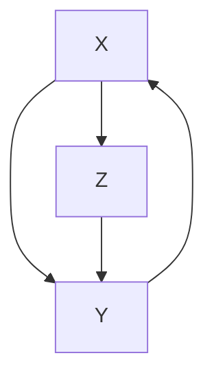

The term “confounding” originally meant “mixing” in English, and we can understand from the diagram why this name was chosen. The true causal effect $X \to Y$ is “mixed” with the spurious correlation between $X$ and $Y$ induced by the fork $X \leftarrow Z \to Y$. For example, if we are testing a drug and give it to patients who are younger on average than the people in the control group, then age becomes a confounder — a lurking third variable. If we don’t have any data on the ages, we will not be able to disentangle the true effect from the spurious effect.

However, the converse is also true. If we do have measurements of the third variable, then it is very easy to deconfound the true and spurious effects. For instance, if the confounding variable $Z$ is age, we compare the treatment and control groups in every age group separately. We can then take an average of the effects, weighting each age group according to its percentage in the target population. This method of compensation is familiar to all statisticians; it is called “adjusting for $Z$” or “controlling for $Z$.”†

Oddly, statisticians both over- and underrate the importance of adjusting for possible confounders. They overrate it in the sense that they often control for many more variables than they need to and even for variables that they should not control for. I recently came across a quote from a political blogger named Ezra Klein who expresses this phenomenon of “overcontrolling” very clearly:

> “You see it all the time in studies. ‘We controlled for…’ And then the list starts. The longer the better. Income. Age. Race. Religion. Height. Hair color. Sexual preference. Crossfit attendance. Love of parents. Coke or Pepsi. The more things you can control for, the stronger your study is—or, at least, the stronger your study seems. Controls give the feeling of specificity, of precision.… But sometimes, you can control for too much. Sometimes you end up controlling for the thing you’re trying to measure.”

Klein raises a valid concern. Statisticians have been immensely confused about what variables should and should not be controlled for, so the default practice has been to control for everything one can measure. The vast majority of studies conducted in this day and age subscribe to this practice. It is a convenient, simple procedure to follow, but it is both wasteful and ridden with errors. A key achievement of the Causal Revolution has been to bring an end to this confusion.

At the same time, statisticians greatly underrate controlling in the sense that they are loath to talk about causality at all, even if the controlling has been done correctly. This too stands contrary to the message of this chapter: if you have identified a sufficient set of deconfound

This chapter will also show that causal diagrams make possible a shift of emphasis from confounders to deconfounders. The former cause the problem; the latter cure it. The two sets may overlap, but they don’t have to. If we have data on a sufficient set of deconfounders, it does not matter if we ignore some or even all of the confounders.

This shift of emphasis is a main way in which the Causal Revolution allows us to go beyond Fisherian experiments and infer causal effects from nonexperimental studies. It enables us to determine which variables should be controlled for to serve as deconfounders. This question has bedeviled both theoretical and practical statisticians; it has been an Achilles’ heel of the field for decades. That is because it has nothing to do with data or statistics. **Confounding is a causal concept**—it belongs on rung two of the Ladder of Causation.

Graphical methods, beginning in the 1990s, have totally deconfounded the confounding problem. In particular, we will soon meet a method called the **back-door criterion**, which unambiguously identifies which variables in a causal diagram are deconfounders. If the researcher can gather data on those variables, she can adjust for them and thereby make predictions about the result of an intervention even without performing it.

In fact, the Causal Revolution has gone even farther than this. In some cases we can control for confounding even when we do not have data on a sufficient set of deconfounders. In these cases we can use different adjustment formulas—not the conventional one, which is only appropriate for use with the back-door criterion—and still eradicate all confounding. We will save these exciting developments for Chapter 7.

Although confounding has a long history in all areas of science, the recognition that the problem requires causal, not statistical, solutions is very recent. Even as recently as 2001, reviewers rebuked a paper of mine while insisting, “Confounding is solidly founded in standard statistics.” Fortunately, the number of such reviewers has shrunk dramatically in the past decade. There is now an almost universal consensus, at least among epidemiologists, philosophers, and social scientists, that (1) confounding needs and has a causal solution, and (2) causal diagrams provide a complete and systematic way of finding that solution. The age of confusion over confounding has come to an end!

## THE CHILLING FEAR OF CONFOUNDING

In 1998, a study in the *New England Journal of Medicine* revealed an association between regular walking and reduced death rates among retired men. The researchers used data from the Honolulu Heart Program, which has followed the health of 8,000 men of Japanese ancestry since 1965.

The researchers, led by Robert Abbott, a biostatistician at the University of Virginia, wanted to know whether the men who exercised more lived longer. They chose a sample of 707 men from the larger group of 8,000, all of whom were physically healthy enough to walk. Abbott’s team found that the death rate over a twelve-year period was two times higher among men who walked less than a mile a day (I’ll call them “casual walkers”) than among men who walked more than two miles a day (“intense walkers”). To be precise, 43 percent of the casual walkers had died, while only 21.5 percent of the intense walkers had died.

However, because the experimenters did not prescribe who would be a casual walker and who would be an intense walker, we have to take into consideration the possibility of confounding bias. An obvious confounder might be age: younger men might be more willing to do a vigorous workout and also would be less likely to die. So we would have a causal diagram like that in Figure 4.2.

> FIGURE 4.2. Causal diagram for walking example.

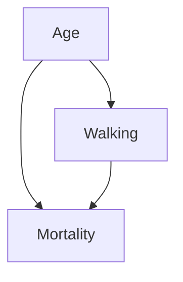

The classic forking pattern at the “Age” node tells us that age is a confounder of walking and mortality. I’m sure you can think of other possible confounders. Perhaps the casual walkers were slacking off for a reason; maybe they couldn’t walk as much. Thus, physical condition could be a confounder. We could go on and on like this. What if the light walkers were alcohol drinkers? What if they ate more?

The good news is, the researchers thought about all these factors. The study has accounted and adjusted for every reasonable factor—age, physical condition, alcohol consumption, diet, and several others. For example, it’s true that the intense walkers tended to be slightly younger. So the researchers adjusted the death rate for age and found that the difference between casual and intense walkers was still very large. (The age-adjusted death rate for the casual walkers was 41 percent, compared to 24 percent for the intense walkers.)

Even so, the researchers were very circumspect in their conclusions. At the end of the article, they wrote, “Of course, the effects on longevity of intentional efforts to increase the distance walked per day by physically capable older men cannot be addressed in our study.” To use the language of Chapter 1, they decline to say anything about your probability of surviving twelve years given that you do (exercise).

In fairness to Abbott and the rest of his team, they may have had good reasons for caution. This was a first study, and the sample was relatively small and homogeneous. Nevertheless, this caution reflects a more general attitude, transcending issues of homogeneity and sample size. Researchers have been taught to believe that an observational study (one where subjects choose their own treatment) can never illuminate a causal claim. I assert that this caution is overexaggerated. Why else would one bother adjusting for all these confounders, if not to get rid of the spurious part of the association and thereby get a better view of the causal part?

Instead of saying “Of course we can’t,” as they did, we should proclaim that of course we can say something about an intentional intervention. If we believe that Abbott’s team identified all the important confounders, we must also believe that intentional walking tends to prolong life (at least in Japanese males).

This provisional conclusion, predicated on the assumption that no other confounders could play a major role in the relationships found, is an extremely valuable piece of information. It tells a potential walker precisely what kind of uncertainty remains in taking the claim at face value. It tells him that the remaining uncertainty is not higher than the possibility that additional confounders exist that were not taken into account. It is also valuable as a guide to future studies, which should focus on those other factors (if they exist), not the ones neutralized in the current study. In short, knowing the set of assumptions that stand behind a given conclusion is not less valuable than attempting to circumvent those assumptions with an RCT, which, as we shall see, has complications of its own.

## THE SKILLFUL INTERROGATION OF NATURE: WHY RCTS WORK

As I have mentioned already, the one circumstance under which scientists will abandon some of their reticence to talk about causality is when they have conducted a randomized controlled trial. You can read it on Wikipedia or in a thousand other places: “The RCT is often considered the gold standard of a clinical trial.” We have one person to thank for this, R. A. Fisher, so it is very interesting to read what a person very close to him wrote about his reasons. The passage is lengthy, but worth quoting in full:

> The whole art and practice of scientific experimentation is comprised in the skillful interrogation of Nature. Observation has provided the scientist with a picture of Nature in some aspect, which has all the imperfections of a voluntary statement. He wishes to check his interpretation of this statement by asking specific questions aimed at establishing causal relationships. His questions, in the form of experimental operations, are necessarily particular, and he must rely on the consistency of Nature in making general deductions from her response in a particular instance or in predicting the outcome to be anticipated from similar operations on other occasions. His aim is to draw valid conclusions of determinate precision and generality from the evidence he elicits.

> Far from behaving consistently, however, Nature appears vacillating, coy, and ambiguous in her answers. She responds to the form of the question as it is set out in the field and not necessarily to the question in the experimenter’s mind; she does not interpret for him; she gives no gratuitous information; and she is a stickler for accuracy. In consequence, the experimenter who wants to compare two manurial treatments wastes his labor if, dividing his field into two equal parts, he dresses each half with one of his manures, grows a crop, and compares the yields from the two halves. The form of his question was: what is the difference between the yield of plot A under the first treatment and that of plot B under the second? He has not asked whether plot A would yield the same as plot B under uniform treatment, and he cannot distinguish plot effects from treatment effects, for Nature has recorded, as requested, not only the contribution of the manurial differences to the plot yields but also the contributions of differences in soil fertility, texture, drainage, aspect, microflora, and innumerable other variables.

The author of this passage is **Joan Fisher Box**, the daughter of Ronald Aylmer Fisher, and it is taken from her biography of her illustrious father. Though not a statistician herself, she has clearly absorbed very deeply the central challenge statisticians face. She states in no uncertain terms that the questions they ask are *“aimed at establishing causal relationships.”* And what gets in their way is **confounding**, although she does not use that word. They want to know the effect of a fertilizer (or “manurial treatment,” as fertilizers were called in that era)—that is, the expected yield under one fertilizer compared with the yield under an alternative. Nature, however, tells them about the effect of the fertilizer mixed (remember, this is the original meaning of “confounded”) with a variety of other causes.

I like the image that Fisher Box provides in the above passage: **Nature is like a genie that answers exactly the question we pose, not necessarily the one we intend to ask.** But we have to believe, as Fisher Box clearly does, that the answer to the question we wish to ask does exist in nature. Our experiments are a sloppy means of uncovering the answer, but they do not by any means define the answer. If we follow her analogy exactly, then $do(X = x)$ must come first, because it is a property of nature that represents the answer we seek: *What is the effect of using the first fertilizer on the whole field?* Randomization comes second, because it is only a man-made means to elicit the answer to that question. One might compare it to the gauge on a thermometer, which is a means to elicit the temperature but is not the temperature itself.

In his early years at Rothamsted Experimental Station, Fisher usually took a very elaborate, systematic approach to disentangling the effects of fertilizer from other variables. He would divide his fields into a grid of subplots and plan carefully so that each fertilizer was tried with each combination of soil type and plant (see Figure 4.3). He did this to ensure the comparability of each sample; in reality, he could never anticipate all the confounders that might determine the fertility of a given plot. A clever enough genie could defeat any structured layout of the field.

Around 1923 or 1924, Fisher began to realize that the only experimental design that the genie could not defeat was a random one. Imagine performing the same experiment one hundred times on a field with an unknown distribution of fertility. Each time you assign fertilizers to subplots randomly. Sometimes you may be very unlucky and use Fertilizer 1 in all the least fertile subplots. Other times you may get lucky and apply it to the most fertile subplots. But by generating a new random assignment each time you perform the experiment, you can guarantee that the great majority of the time you will be neither lucky nor unlucky. In those cases, Fertilizer 1 will be applied to a selection of subplots that is representative of the field as a whole. This is exactly what you want for a controlled trial. Because the distribution of fertility in the field is fixed throughout your series of experiments—the genie can’t change it—he is tricked into answering (most of the time) the causal question you wanted to ask.

> Cartoon illustration of a man smoking a smoke while reading a grid of plants, with a village scene in the background (no text or symbols)

**FIGURE 4.3.** R. A. Fisher with one of his many innovations: a Latin square experimental design, intended to ensure that one plot of each plant type appears in each row (fertilizer type) and column (soil type). Such designs are still used in practice, but Fisher would later argue convincingly that a randomized design is even more effective. (Source: Drawing by Dakota Harr.)

From our perspective, in an era when randomized trials are the gold standard, all of this may appear obvious. But at the time, the idea of a randomly designed experiment horrified Fisher’s statistical colleagues. Fisher’s literally drawing from a deck of cards to assign subplots to each fertilizer may have contributed to their dismay. *Science subjected to the whims of chance?*

But Fisher realized that **an uncertain answer to the right question is much better than a highly certain answer to the wrong question.** If you ask the genie the wrong question, you will never find out what you want to know. If you ask the right question, getting an answer that is occasionally wrong is much less of a problem. You can still estimate the amount of uncertainty in your answer, because the uncertainty comes from the randomization procedure (which is known) rather than the characteristics of the soil (which are unknown).

Thus, randomization actually brings **two benefits**:

- First, it eliminates confounder bias (it asks Nature the right question).
- Second, it enables the researcher to quantify his uncertainty.

However, according to historian Stephen Stigler, the second benefit was really Fisher’s main reason for advocating randomization. He was the world’s master of quantifying uncertainty, having developed many new mathematical procedures for doing so. By comparison, his understanding of deconfounding was purely intuitive, for he lacked a mathematical notation for articulating what he sought.

Now, ninety years later, we can use the **do-operator** to fill in what Fisher wanted to but couldn’t ask. Let’s see, from a causal point of view, how randomization enables us to ask the genie the right question.

Let’s start, as usual, by drawing a causal diagram. **Model 1**, shown in Figure 4.4, describes how the yield of each plot is determined under normal conditions, where the farmer decides by whim or bias which fertilizer is best for each plot. The query he wants to pose to the genie Nature is *“What is the yield under a uniform application of Fertilizer 1 (versus Fertilizer 2) to the entire field?”* Or, in do-operator notation, what is $P(\text{yield} \vert do(\text{fertilizer} = 1))$?

> **FIGURE 4.4.** Model 1: an improperly controlled experiment.

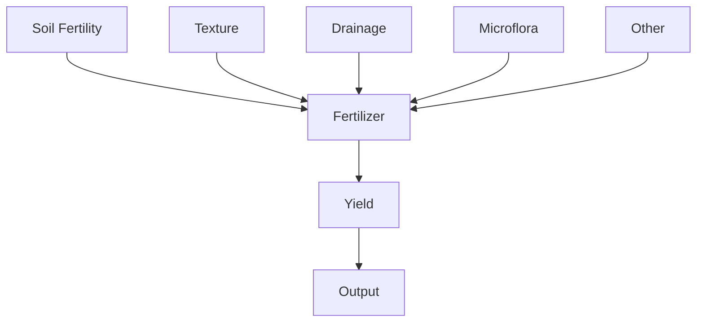

If the farmer performs the experiment naively, for example applying Fertilizer 1 to the high end of his field and Fertilizer 2 to the low end, he is probably introducing Drainage as a confounder. If he uses Fertilizer 1 one year and Fertilizer 2 the next year, he is probably introducing Weather as a confounder. In either case, he will get a biased comparison.

The world that the farmer wants to know about is described by Model 2, where all plots receive the same fertilizer (see Figure 4.5). As explained in Chapter 1, the effect of the do-operator is to erase all the arrows pointing to Fertilizer and force this variable to a particular value—say, Fertilizer = 1.

> **FIGURE 4.5.** Model 2: the world we would like to know about.

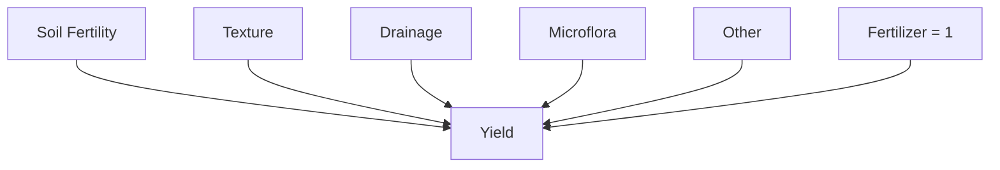

Finally, let’s see what the world looks like when we apply randomization. Now some plots will be subjected to do(fertilizer = 1) and others to do(fertilizer = 2), but the choice of which treatment goes to which plot is random. The world created by such a model is shown by Model 3 in Figure 4.6, showing the variable Fertilizer obtaining its assignment by a random device—say, Fisher’s deck of cards.

Notice that all the arrows pointing toward Fertilizer have been erased, reflecting the assumption that the farmer listens only to the card when deciding which fertilizer to use. It is equally important to note that there is no arrow from Card to Yield, because the plants cannot read the cards. (This is a fairly safe assumption for plants, but for human subjects in a randomized trial it is a serious concern.) Therefore Model 3 describes a world in which the relation between Fertilizer and Yield is unconfounded (i.e., there is no common cause of Fertilizer and Yield). This means that in the world described by Figure 4.6, there is no difference between seeing Fertilizer = 1 and doing Fertilizer = 1.

> **FIGURE 4.6.** Model 3: the world simulated by a randomized controlled trial.

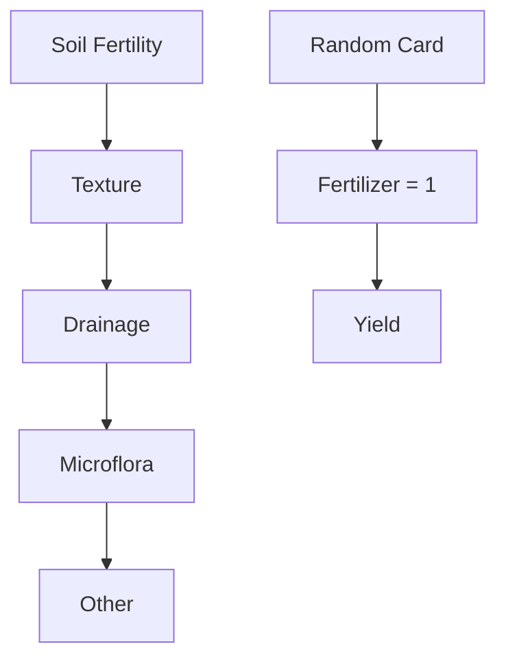

That brings us to the punch line: **randomization is a way of simulating Model 2**. It disables all the old confounders without introducing any new confounders. That is the source of its power; there is nothing mysterious or mystical about it. It is nothing more or less than, as Joan Fisher Box said, “the skillful interrogation of Nature.”

The experiment would, however, fail in its objective of simulating Model 2 if either the experimenter were allowed to use his own judgment to choose a fertilizer or the experimental subjects, in this case the plants, “knew” which card they had drawn. This is why clinical trials with human subjects go to great lengths to conceal this information from both the patients and the experimenters (a procedure known as **double blinding**).

I will add to this a second punch line: **there are other ways of simulating Model 2**. One way, if you know what all the possible confounders are, is to measure and adjust for them. However, randomization does have one great advantage: it severs every incoming link to the randomized variable, including the ones we don’t know about or cannot measure (e.g., “Other” factors in Figures 4.4 to 4.6).

By contrast, in a nonrandomized study, the experimenter must rely on her knowledge of the subject matter. If she is confident that her causal model accounts for a sufficient number of deconfounders and she has gathered data on them, then she can estimate the effect of Fertilizer on Yield in an unbiased way. But the danger is that she may have missed a confounding factor, and her estimate may therefore be biased.

All things being equal, RCTs are still preferred to observational studies, just as safety nets are recommended for tightrope walkers. But all things are not necessarily equal. In some cases, intervention may be physically impossible (for instance, in a study of the effect of obesity on heart disease, we cannot randomly assign patients to be obese or not). Or intervention may be unethical (in a study of the effects of smoking, we can’t ask randomly selected people to smoke for ten years). Or we may encounter difficulties recruiting subjects for inconvenient experimental procedures and end up with volunteers who do not represent the intended population.

Fortunately, the do-operator gives us scientifically sound ways of determining causal effects from nonexperimental studies, which challenge the traditional supremacy of RCTs. As discussed in the walking example, such causal estimates produced by observational studies may be labeled “provisional causality,” that is, causality contingent upon the set of assumptions that our causal diagram advertises. It is important that we not treat these studies as second-class citizens: they have the advantage of being conducted in the natural habitat of the target population, not in the artificial setting of a laboratory, and they can be “pure” in the sense of not being contaminated by issues of ethics or feasibility.

Now that we understand that the principal objective of an RCT is to eliminate confounding, let’s look at the other methods that the Causal Revolution has given us. The story begins with a 1986 paper by two of my longtime colleagues, which started a reevaluation of what confounding means.

## THE NEW PARADIGM OF CONFOUNDING

“While confounding is widely recognized as one of the central problems in epidemiological research, a review of the literature will reveal little consistency among the definitions of confounding or confounder.”  With this one sentence, Sander Greenland of the University of California, Los Angeles, and Jamie Robins of Harvard University put their finger on the central reason why the control of confounding had not advanced one bit since Fisher.  Lacking a principled understanding of confounding, scientists could not say anything meaningful in observational studies where physical control over treatments is infeasible.

How was confounding defined then, and how should it be defined?  Armed with what we now know about the logic of causality, the answer to the second question is easier.  The quantity we observe is the conditional probability of the outcome given the treatment, $P(Y \mid X)$.  The question we want to ask of Nature has to do with the causal relationship between $X$ and $Y$, which is captured by the interventional probability $P(Y \mid do(X))$.  Confounding, then, should simply be defined as anything that leads to a discrepancy between the two:

$$
P(Y \mid X) \neq P(Y \mid do(X)).
$$

Why all the fuss?

Unfortunately, things were not as easy as that before the 1990s because the *do*-operator had yet to be formalized.  Even today, if you stop a statistician in the street and ask, “What does ‘confounding’ mean to you?” you will probably get one of the most convoluted and confounded answers you ever heard from a scientist.  One recent book, coauthored by leading statisticians, spends literally two pages trying to explain it, and I have yet to find a reader who understood the explanation.

The reason for the difficulty is that confounding is **not a statistical notion**.  It stands for the discrepancy between what we want to assess (the causal effect) and what we actually do assess using statistical methods.  If you can’t articulate mathematically what you want to assess, you can’t expect to define what constitutes a discrepancy.

Historically, the concept of “confounding” has evolved around two related conceptions: **incomparability** and **a lurking third variable**.  Both of these concepts have resisted formalization.  When we talked about comparability, in the context of Daniel’s experiment, we said that the treatment and control groups should be identical in all relevant ways.  But this begs us to distinguish relevant from irrelevant attributes.  How do we know that age is relevant in the Honolulu walking study?  How do we know that the alphabetical order of a participant’s name is not relevant?  You might say it’s obvious or common sense, but generations of scientists have struggled to articulate that common sense formally, and a robot cannot rely on our common sense when asked to act properly.

The same ambiguity plagues the third-variable definition.  Should a confounder be a common cause of both $X$ and $Y$ or merely correlated with each?  Today we can answer such questions by referring to the causal diagram and checking which variables produce a discrepancy between $P(X \mid Y)$ and $P(X \mid do(Y))$.  Lacking a diagram or a *do*-operator, five generations of statisticians and health scientists had to struggle with surrogates, none of which were satisfactory.  Considering that the drugs in your medicine cabinet may have been developed on the basis of a dubious definition of “confounders,” you should be somewhat concerned.

Let’s take a look at some of the surrogate definitions of confounding.  These fall into two main categories, **declarative** and **procedural**.  A typical (and wrong) declarative definition would be “A confounder is any variable that is correlated with both $X$ and $Y$.”  On the other hand, a procedural definition would attempt to characterize a confounder in terms of a statistical test.  This appeals to statisticians, who love any test that can be performed on the data directly without appealing to a model.

Here is a procedural definition that goes by the scary name of “noncollapsibility.”  It comes from a 1996 paper by the Norwegian epidemiologist Sven Hernberg:

> “Formally one can compare the crude relative risk and the relative risk resulting after adjustment for the potential confounder.  A difference indicates confounding, and in that case one should use the adjusted risk estimate.  If there is no or a negligible difference, confounding is not an issue and the crude estimate is to be preferred.”

In other words, if you suspect a confounder, try adjusting for it and try not adjusting for it.  If there is a difference, it is a confounder, and you should trust the adjusted value.  If there is no difference, you are off the hook.  Hernberg was by no means the first person to advocate such an approach; it has misguided a century of epidemiologists, economists, and social scientists, and it still reigns in certain quarters of applied statistics.  I have picked on Hernberg only because he was unusually explicit about it and because he wrote this in 1996, well after the Causal Revolution was already underway.

The most popular of the declarative definitions evolved over a period of time.  Alfredo Morabia, author of *A History of Epidemiologic Methods and Concepts*, calls it “the classic epidemiological definition of confounding,” and it consists of three parts.  A confounder of $X$ (the treatment) and $Y$ (the outcome) is a variable $Z$ that is:

1. **associated with $X$** in the population at large, and
2. **associated with $Y$** among people who have not been exposed to the treatment $X$.

In recent years, this has been supplemented by a third condition:
3. $Z$ should **not** be on the causal path between $X$ and $Y$.

Observe that all the terms in the “classic” version (1 and 2) are statistical.  In particular, $Z$ is only assumed to be *associated* with—not a cause of—$X$ and $Y$.  Edward Simpson proposed the rather convoluted condition “$Y$ is associated with $Z$ among the unexposed” in 1951.  From the causal point of view, it seems that Simpson’s idea was to discount the part of the correlation of $Z$ with $Y$ that is due to the causal effect of $X$ on $Y$; in other words, he wanted to say that $Z$ has an effect on $Y$ independent of its effect on $X$.  The only way he could think to express this discounting was to condition on $X$ by focusing on the control group ($X = 0$).  Statistical vocabulary, deprived of the word “effect,” gave him no other way of saying it.

If this is a bit confusing, it should be!  How much easier it would have been if he could have simply written a causal diagram, like Figure 4.1, and said, “$Y$ is associated with $Z$ via paths not going through $X$.”  But he didn’t have this tool, and he couldn’t talk about paths, which were a forbidden concept.

The “classical epidemiological definition” of a confounder has other flaws, as the following two examples show:

$$
\text{(i)} \quad X \rightarrow Z \rightarrow Y
$$

and

$$
\begin{array}{c}
\text{(ii)} \quad X \to M \to Y \\
\downarrow \\
Z
\end{array}
$$

在示例（i）中，$Z$ 满足条件（1）和（2），但它并不是一个混杂因子。它被称为中介变量：它是解释 $X$ 对 $Y$ 因果效应的变量。如果你试图寻找 $X$ 对 $Y$ 的因果效应，那么控制 $Z$ 将是一场灾难。如果你只观察那些 $Z = 0$ 的处理组和对照组个体，那么你完全阻断了 $X$ 的效应，因为 $X$ 正是通过改变 $Z$ 来发挥作用的。因此，你会得出 $X$ 对 $Y$ 没有影响的结论。这正是埃兹拉·克莱因所说的：“有时候你最终控制了你试图测量的东西。”

在示例（ii）中，$Z$ 是中介变量 $M$ 的一个代理变量。统计学家在无法测量实际因果变量时，经常控制代理变量；例如，政党归属可能被用作政治信仰的代理变量。由于 $Z$ 并非 $M$ 的完美度量，如果你控制 $Z$，$X$ 对 $Y$ 的部分影响可能会“泄露出去”。尽管如此，控制 $Z$ 仍然是一个错误。虽然偏差可能比控制 $M$ 小，但它依然存在。

基于这个原因，后来的统计学家，特别是大卫·考克斯在其教科书《实验设计》（1958）中警告说，只有在你有“强有力的先验理由”相信 $Z$ 不受 $X$ 影响时，才应该控制 $Z$。这种“强有力的先验理由”无非就是一个因果假设。他补充道：“这样的假设可能完全合理，但科学家应该始终意识到他们正在诉诸这些假设。”请记住，那是 1958 年，正值对因果关系的严格禁止时期。考克斯的意思是，在调整混杂因子时，你可以放心地喝上一大口因果私酿，但不要告诉牧师。这是一个大胆的建议！我总是忍不住为他的勇气喝彩。

到了 1980 年，辛普森和考克斯的条件被合并成我上面提到的混杂三部分检验。它就像一艘只有三个漏洞的独木舟一样不可靠。尽管它在第（3）部分半心半意地诉诸因果关系，但前两部分都可以被证明既非必要也不充分。

格陵兰和罗宾斯在他们 1986 年的里程碑式论文中得出了这个结论。两人采用了一种全新的方法来处理混杂问题，他们称之为“可交换性”。他们回到了最初的想法：对照组（$X = 0$）应该与处理组（$X = 1$）具有可比性。但他们加入了一个反事实的转折。（回忆一下第一章，反事实处于因果之梯的第三级，因此足以检测混杂。）可交换性要求研究者考虑处理组，想象如果该组成员没有接受处理会发生什么，然后判断其结果是否与那些（在现实中）未接受处理的人相同。只有这样，我们才能说研究中不存在混杂。

在 1986 年，向流行病学家听众谈论反事实需要一些勇气，因为他们仍然深受经典统计学的影响，经典统计学认为所有答案都在数据中——而不是在可能发生但永远无法观察到的事情中。然而，统计学界已经准备好倾听这种异端邪说，这要归功于另一位哈佛统计学家唐纳德·鲁宾的开创性工作。在鲁宾 1974 年提出的“潜在结果”框架中，像“接受药物 $D'$ 的人 $X$ 的血压”和“未接受药物 $D'$ 的人 $X$ 的血压”这样的反事实变量，与像血压这样的传统变量一样合法——尽管这两个变量中有一个将永远无法被观察到。

罗宾斯和格陵兰试图用潜在结果来表达他们对混杂的概念。他们将人群分为四种类型的个体：** doomed**（注定患病者）、**causative**（致病者）、**preventive**（预防者）和**immune**（免疫者）。这个语言具有启发性，所以让我们把处理 $X$ 看作流感疫苗，结果 $Y$ 看作患上流感。注定患病者是那些疫苗对他们不起作用的人；无论他们是否接种疫苗，他们都会得流感。致病组（可能不存在）包括那些疫苗实际上导致疾病的人。预防组由那些疫苗能预防疾病的人组成：如果他们不接种疫苗，他们会得流感；如果他们接种疫苗，他们就不会得流感。最后，免疫组由那些在任何情况下都不会得流感的人组成。表 4.1 总结了这些考虑。

理想情况下，每个人的额头上都会贴着一个标签，标明他属于哪个组。可交换性仅仅意味着每种标签的人所占的百分比（分别为 $d\%$、$c\%$、$p\%$ 和 $i\%$）在处理组和对照组中应该相同。这些比例相等保证了如果我们交换处理组和对照组，结果将完全相同。否则，处理组和对照组就不相似，我们对疫苗效果的估计就会受到混杂。请注意，这两组可能在许多方面不同。他们在年龄、性别、健康状况和各种其他特征上可能不同。只有 $d$、$c$、$p$ 和 $i$ 的相等性决定了它们是否可交换。因此，可交换性等同于两组四个比例之间的相等性，这大大降低了评估两组可能不同的无数因素的复杂性。

**表 4.1. 根据响应类型对个体进行分类。**

| 组别 | 组内百分比 | 接种疫苗后的结果 | 未接种疫苗后的结果 |
| :--- | :--- | :--- | :--- |
| 注定患病者 | $d$ | 流感 | 流感 |
| 致病者 | $c$ | 流感 | 无流感 |
| 预防者 | $p$ | 无流感 | 流感 |
| 免疫者 | $i$ | 无流感 | 无流感 |

使用这种关于混杂的常识性定义，格陵兰和罗宾斯表明，“统计”定义（无论是陈述性的还是程序性的）都给出了错误的答案。一个变量可以通过流行病学家的三部分检验，但如果进行调整，仍然会增加偏差。

格陵兰和罗宾斯的定义是一项伟大的成就，因为它使他们能够给出具体的例子，表明先前对混杂的定义是不充分的。然而，这个定义无法转化为实践。简而言之，额头上的那些标签并不存在。我们甚至不知道 $d$、$c$、$p$ 和 $i$ 这些比例的具体数值。事实上，这正是大自然的神灯精灵锁在她的魔法灯笼里，不向任何人展示的那种信息。由于缺乏这些信息，研究者只能凭直觉判断处理组和对照组是否可交换。

现在，我希望你的好奇心已经被充分激发了。因果图如何将混杂这个巨大的难题变成一个有趣的游戏？诀窍在于一个可操作的混杂检验，称为**后门准则**。这个准则将定义混杂、识别混杂因子以及调整混杂因子的过程变成了一个常规谜题，其难度不亚于解决一个迷宫。因此，它使这个棘手的古老问题得到了一个圆满的结论。

## THE DO-OPERATOR AND THE BACK-DOOR CRITERION

To understand the back-door criterion, it helps first to have an intuitive sense of how information flows in a causal diagram。我倾向于将这些连接想象成管道，它们将信息从起点 X 传递到终点 Y。请记住，信息的传递是双向的，既有因果方向，也有非因果方向，正如我们在第 3 章中看到的那样。

事实上，非因果路径正是混杂的根源。请记住，我将混杂定义为任何使 $P(Y \mid do(X))$ 与 $P(Y \mid X)$ 不同的东西。do-算子会擦除所有指向 X 的箭头，从而阻止任何关于 X 的信息沿非因果方向流动。随机化也有同样的效果。如果我们选择正确的变量进行调整，统计调整也能达到同样的效果。

在上一章中，我们研究了三个规则，它们告诉我们如何阻止信息流经任何一个单独的节点。我将在此重申以强调：

- (a) 在链式节点 $A \to B \to C$ 中，控制 B 会阻止信息从 A 传递到 C，反之亦然。
- (b) 同样，在分叉或混杂节点 $A \leftarrow B \to C$ 中，控制 B 会阻止信息从 A 传递到 C，反之亦然。
- (c) 最后，在对撞节点 $A \to B \leftarrow C$ 中，情况恰恰相反。变量 A 和 C 最初是独立的，因此关于 A 的信息不会告诉你任何关于 C 的信息。但如果你控制了 B，由于“解释效应”，信息就会开始流经这个“管道”。

我们还必须牢记另一个基本规则：
(d) 控制一个变量的后代（或代理变量）相当于“部分地”控制该变量本身。控制一个中介变量的后代，会部分地关闭管道；控制一个对撞节点的后代，会部分地打开管道。

现在，如果我们有更长的管道，包含更多节点，比如这样：

$$
A \leftarrow B \leftarrow C \rightarrow D \leftarrow E \rightarrow F \rightarrow G \leftarrow H \rightarrow I \rightarrow J
$$

答案非常简单：如果任何一个节点被阻断，那么 J 就无法通过这条路径“得知”A 的信息。因此，我们有很多选择来阻断 A 和 J 之间的通信：控制 B、控制 C、不要控制 D（因为它是一个对撞节点）、控制 E，等等。其中任何一个措施都足够了。这就是为什么通常的统计做法——控制所有我们能测量的变量——是如此误导人。事实上，如果我们什么都不控制，这条特定的路径反而是被阻断的！D 和 G 处的对撞节点在没有任何外部帮助的情况下就阻断了路径。而控制 D 和 G 则会打开这条路径，使 J 能够接听到 A 的信息。

最后，要消除两个变量 X 和 Y 之间的混杂，我们只需要阻断它们之间的每一条非因果路径，同时不阻断或干扰任何因果路径。更精确地说，**后门路径**是指任何从 X 出发、起始箭头指向 X 并到达 Y 的路径。如果我们阻断了每一条后门路径（因为这些路径允许 X 和 Y 之间产生虚假相关），那么 X 和 Y 之间的混杂就被消除了。如果我们通过控制某个变量集 Z 来实现这一点，我们还需要确保 Z 中没有成员是 X 在因果路径上的后代；否则，我们可能会部分或完全地关闭那条路径。

这就是全部内容了！有了这些规则，消除混杂变得如此简单和有趣，你可以把它当作一个游戏来玩。我强烈建议你尝试几个例子，只是为了掌握要领，看看它有多容易。如果你仍然觉得困难，请放心，现在已经存在能够在纳秒级别解决所有此类问题的算法。在每个游戏中，目标都是指定一组变量来消除 X 和 Y 之间的混杂。换句话说，这些变量不应是 X 的后代，并且它们应该阻断所有后门路径。

> **游戏 1.**

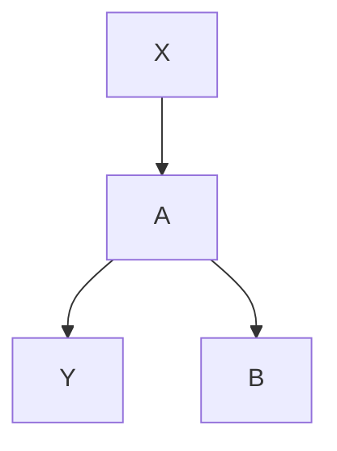

这个很简单！没有箭头指向 X，因此没有后门路径。我们不需要控制任何变量。

尽管如此，一些研究者会认为 B 是一个混杂因子。由于链式结构 $X \to A \to B$，它与 X 相关联。在 X = 0 的个体中，由于存在一条不经过 X 的开放路径 $B \leftarrow A \to Y$，它与 Y 也相关联。并且 B 不在因果路径 $X \to A \to Y$ 上。因此，它通过了“经典流行病学定义”的混杂三步检验，但它不符合**后门准则**，如果对其进行控制，将会导致灾难性后果。

---

> **游戏 2.**

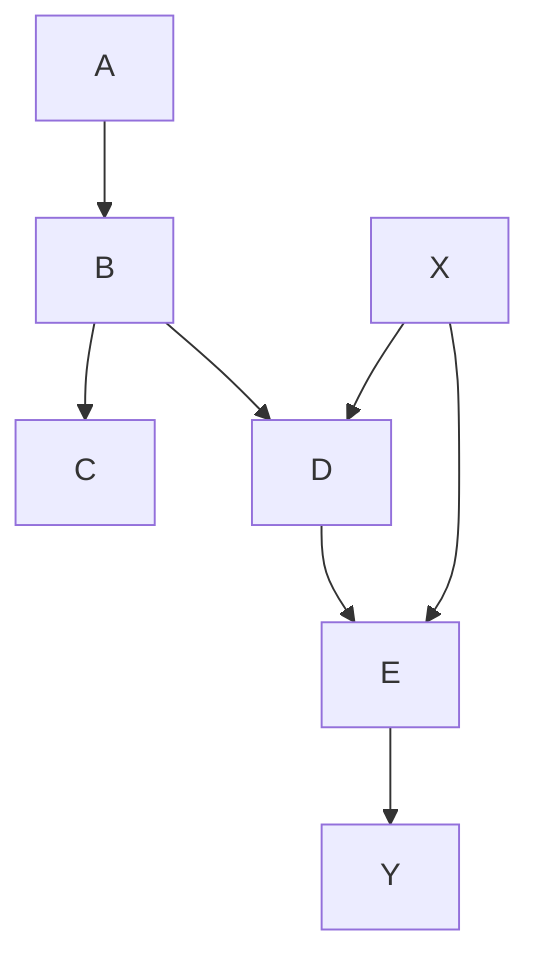

在这个例子中，你应该将 $A, B, C$ 和 $D$ 视为“预处理”变量。（照例，处理变量是 X。）现在有一条后门路径 $X \leftarrow A \to B \to D \to E \to Y$。这条路径已经被 B 处的对撞节点阻断，所以我们不需要控制任何变量。许多统计学家会控制 B 或 C，认为只要它们发生在处理之前，这样做就无害。一位著名的统计学家甚至最近写道：“为了避免对某些观测到的协变量进行条件化……是非科学的临时凑合。”他错了；对 B 或 C 进行条件化是一个糟糕的主意，因为它会打开非因果路径，从而混淆 X 和 Y。请注意，在这种情况下，我们可以通过控制 A 或 D 来重新阻断该路径。这个例子表明，可能存在不同的消除混杂的策略。一位研究者可能会选择简单的方法，不控制任何变量；而一位更传统的研究者可能会控制 C 和 D。两者都是正确的，并且应该得到相同的结果（前提是模型正确且样本量足够大）。

---

> **游戏 3.**

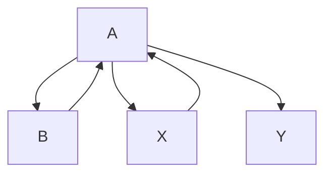

在游戏 1 和 2 中，你不需要做任何事情，但这次你需要了。有一条从 X 到 Y 的后门路径，$X \leftarrow B \to Y$，只能通过控制 B 来阻断。如果 B 是不可观测的，那么在不进行随机对照实验的情况下，就无法估计 X 对 Y 的效应。在这种情况下，一些（事实上是大多数）统计学家会控制 A，作为不可观测变量 B 的代理变量，但这只能部分消除混杂偏倚，并引入新的对撞节点偏倚。

好的，这是根据您的要求格式化优化后的 Markdown 内容。

---

> GAME 4.

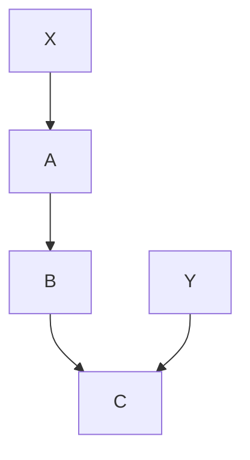

This one introduces a new kind of bias, called “M-bias” (named for the shape of the graph). Once again there is only one back-door path, and it is already blocked by a collider at B. So we don’t need to control for anything. Nevertheless, all statisticians before 1986 and many today would consider B a confounder. It is associated with X (via $X \leftarrow A \Rightarrow B$) and associated with Y via a path that doesn’t go through $X$ ($B \leftarrow C \rightarrow Y$). It does not lie on a causal path and is not a descendant of anything on a causal path, because there is no causal path from X to Y. Therefore B passes the traditional three-step test for a confounder.

M-bias puts a finger on what is wrong with the traditional approach. It is incorrect to call a variable, like B, a confounder merely because it is associated with both X and Y. To reiterate, X and Y are unconfounded if we do not control for B. **B only becomes a confounder when you control for it!**

When I started showing this diagram to statisticians in the 1990s, some of them laughed it off and said that such a diagram was extremely unlikely to occur in practice. I disagree! For example, seat-belt usage (B) has no causal effect on smoking (X) or lung disease (Y); it is merely an indicator of a person’s attitudes toward societal norms (A) as well as safety and health-related measures (C). Some of these attitudes may affect susceptibility to lung disease (Y). In practice, seatbelt usage was found to be correlated with both X and Y; indeed, in a study conducted in 2006 as part of a tobacco litigation, seat-belt usage was listed as one of the first variables to be controlled for. If you accept the above model, then controlling for B alone would be a mistake.

Note that it’s all right to control for B if you also control for A or C. Controlling for the collider B opens the “pipe,” but controlling for A or C closes it again. Unfortunately, in the seat-belt example, A and C are variables relating to people’s attitudes and not likely to be observable. If you can’t observe it, you can’t adjust for it.

> GAME 5.

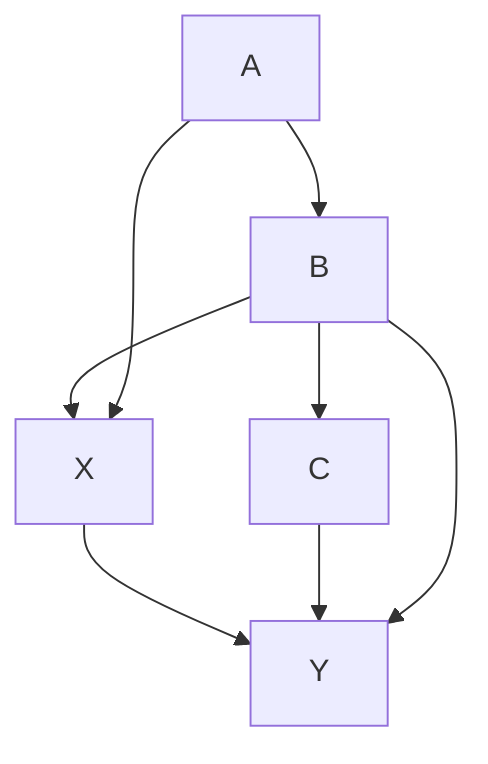

Game 5 is just Game 4 with a little extra wrinkle. Now a second backdoor path $X \leftarrow B \rightarrow C \rightarrow Y$ needs to be closed. If we close this path by controlling for B, then we open up the M-shaped path $X \leftarrow A \rightarrow B \leftarrow C \rightarrow Y$. To close that path, we must control for A or C as well. However, notice that we could just control for C alone; that would close the path $X \leftarrow B \rightarrow C \rightarrow Y$ and not affect the other path.

Games 1 through 3 come from a 1993 paper by Clarice Weinberg, a deputy chief at the National Institutes of Health, called “Toward a Clearer Definition of Confounding.” It came out during the transitional period between 1986 and 1995, when Greenland and Robins’s paper was available but causal diagrams were still not widely known. Weinberg therefore went through the considerable arithmetic exercise of verifying exchangeability in each of the cases shown. Although she used graphical displays to communicate the scenarios involved, she did not use the logic of diagrams to assist in distinguishing confounders from deconfounders. She is the only person I know of who managed this feat. Later, in 2012, she collaborated on an updated version that analyzes the same examples with causal diagrams and verifies that all her conclusions from 1993 were correct.

In both of Weinberg’s papers, the medical application was to estimate the effect of smoking (X) on miscarriages, or “spontaneous abortions” (Y). In Game 1, A represents an underlying abnormality that is induced by smoking; this is not an observable variable because we don’t know what the abnormality is. B represents a history of previous miscarriages. It is very, very tempting for an epidemiologist to take previous miscarriages into account and adjust for them when estimating the probability of future miscarriages. **But that is the wrong thing to do here!** By doing so we are partially inactivating the mechanism through which smoking acts, and we will thus underestimate the true effect of smoking.

Game 2 is a more complicated version where there are two different smoking variables: X represents whether the mother smokes now (at the beginning of the second pregnancy), while A represents whether she smoked during the first pregnancy. B and E are underlying abnormalities caused by smoking, which are unobservable, and D represents other physiological causes of those abnormalities. Note that this diagram allows for the fact that the mother could have changed her smoking behavior between pregnancies, but the other physiological causes would not change. Again, many epidemiologists would adjust for prior miscarriages (C), but this is a bad idea unless you also adjust for smoking behavior in the first pregnancy (A).

Games 4 and 5 come from a paper published in 2014 by Andrew Forbes, a biostatistician at Monash University in Australia, along with several collaborators. He is interested in the effect of smoking on adult asthma. In Game 4, X represents an individual’s smoking behavior, and Y represents whether the person has asthma as an adult. B represents childhood asthma, which is a collider because it is affected by both $A_i$, parental smoking, and $C$, an underlying (and unobservable) predisposition toward asthma. In Game 5 the variables have the same meanings, but Forbes added two arrows for greater realism. (Game 4 was only meant to introduce the M-graph.)

In fact, the full model in Forbes’ paper has a few more variables and looks like the diagram in Figure 4.7. Note that Game 5 is embedded in this model in the sense that the variables A, B, C, X, and Y have exactly the same relationships. So we can transfer our conclusions over and conclude that we have to control for A and B or for $C$; but C is an unobservable and therefore uncontrollable variable. In addition we have four new confounding variables: D = parental asthma, E = chronic bronchitis, $F =$ sex, and G = socioeconomic status. The reader might enjoy figuring out that we must control for E, F, and $G$, but there is no need to control for $D$. So a sufficient set of variables for deconfounding is A, B, E, F, and G.

> FIGURE 4.7. Andrew Forbes’s model of smoking (X) and asthma (Y).

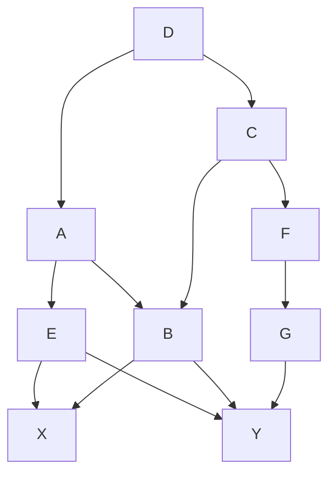

In the end, Forbes found that smoking had a small and statistically insignificant association with adult asthma in the raw data, and the effect became even smaller and more insignificant after adjusting for the confounders. The null result should not detract, however, from the fact that his paper is a model for the “skillful interrogation of Nature.”

One final comment about these “games”: when you start identifying the variables as smoking, miscarriage, and so forth, they are quite obviously not games but serious business. I have referred to them as games because the joy of being able to solve them swiftly and meaningfully is akin to the pleasure a child feels on figuring out that he can crack puzzles that stumped him before.

Few moments in a scientific career are as satisfying as taking a problem that has puzzled and confused generations of predecessors and reducing it to a straightforward game or algorithm. I consider the complete solution of the confounding problem one of the main highlights of the Causal Revolution because it ended an era of confusion that has probably resulted in many wrong decisions in the past. It has been a quiet revolution, raging primarily in research laboratories and scientific meetings. Yet, armed with these new tools and insights, the scientific community is now tackling harder problems, both theoretical and practical, as subsequent chapters will show.

Black-and-white illustration of two people in a cozy room with bookshelves and a table, no text or symbols visible.

“Abe and Yak” (left and right, respectively) took opposite positions on the hazards of cigarette smoking. As was typical of the era, both were smokers (though Abe used a pipe). The smoking-cancer debate was unusually personal for many of the scientists who participated in it. (Source: Drawing by DakotaHarr.)

# 5

## 5.1 引言

本章将介绍**线性回归**（Linear Regression）模型，这是一种用于预测连续值输出的监督学习方法。线性回归假设输入特征与输出目标之间存在**线性关系**，即目标变量可以表示为输入特征的**加权和**再加上一个偏置项。

线性回归模型形式简单、可解释性强，是许多复杂模型的基础。本章将从概率视角出发，推导线性回归的**最大似然估计**和**贝叶斯推断**，并介绍正则化方法如**岭回归**（Ridge Regression）和**套索回归**（Lasso Regression）。

## 5.2 线性回归模型

### 5.2.1 模型定义

给定输入特征向量 $\mathbf{x} \in \mathbb{R}^d$，线性回归模型的输出为：

$$
y = \mathbf{w}^T \mathbf{x} + b
$$

其中 $\mathbf{w} \in \mathbb{R}^d$ 是权重向量，$b \in \mathbb{R}$ 是偏置项。

> **批注**：有时为了简化，将偏置项合并到权重向量中，即 $\mathbf{x} = [1, x_1, \dots, x_d]^T$，则模型可写为 $y = \mathbf{w}^T \mathbf{x}$。

### 5.2.2 损失函数

通常使用**均方误差**（Mean Squared Error, MSE）作为损失函数。给定 $N$ 个训练样本 $\{(\mathbf{x}_i, y_i)\}_{i=1}^N$，损失函数定义为：

$$
\mathcal{L}(\mathbf{w}, b) = \frac{1}{N} \sum_{i=1}^N (y_i - \mathbf{w}^T \mathbf{x}_i - b)^2
$$

## 5.3 最大似然估计

### 5.3.1 概率视角

假设目标变量 $y$ 服从高斯分布，即：

$$
y = \mathbf{w}^T \mathbf{x} + b + \epsilon, \quad \epsilon \sim \mathcal{N}(0, \sigma^2)
$$

则似然函数为：

$$
p(\mathbf{y} \mid \mathbf{X}, \mathbf{w}, b, \sigma^2) = \prod_{i=1}^N \mathcal{N}(y_i \mid \mathbf{w}^T \mathbf{x}_i + b, \sigma^2)
$$

### 5.3.2 对数似然最大化

对似然函数取对数，得到：

$$
\ln p(\mathbf{y} \mid \mathbf{X}, \mathbf{w}, b, \sigma^2) = -\frac{N}{2} \ln(2\pi) - \frac{N}{2} \ln \sigma^2 - \frac{1}{2\sigma^2} \sum_{i=1}^N (y_i - \mathbf{w}^T \mathbf{x}_i - b)^2
$$

最大化对数似然等价于最小化均方误差。

## 5.4 正规方程

### 5.4.1 闭式解

令 $\mathbf{X} \in \mathbb{R}^{N \times (d+1)}$ 为设计矩阵，其中每一行包含一个样本的特征（含偏置项），$\mathbf{y} \in \mathbb{R}^N$ 为目标向量。则均方误差损失的闭式解为：

$$
\mathbf{w}^* = (\mathbf{X}^T \mathbf{X})^{-1} \mathbf{X}^T \mathbf{y}
$$

### 5.4.2 几何解释

正规方程的解可以理解为将目标向量 $\mathbf{y}$ 投影到由 $\mathbf{X}$ 的列向量张成的空间上。投影向量 $\hat{\mathbf{y}} = \mathbf{X} \mathbf{w}^*$ 是 $\mathbf{y}$ 在该空间中的最佳逼近。

## 5.5 梯度下降法

### 5.5.1 批量梯度下降

对于大规模数据集，直接计算正规方程可能计算量过大，此时使用梯度下降法。梯度计算公式为：

$$
\nabla_{\mathbf{w}} \mathcal{L} = \frac{2}{N} \mathbf{X}^T (\mathbf{X} \mathbf{w} - \mathbf{y})
$$

参数更新规则为：

$$
\mathbf{w}^{(t+1)} = \mathbf{w}^{(t)} - \eta \nabla_{\mathbf{w}} \mathcal{L}
$$

其中 $\eta$ 是学习率。

### 5.5.2 随机梯度下降

随机梯度下降（SGD）每次仅使用一个样本更新参数，适合在线学习和大规模数据：

$$
\mathbf{w}^{(t+1)} = \mathbf{w}^{(t)} - \eta (\mathbf{x}_i^T \mathbf{w}^{(t)} - y_i) \mathbf{x}_i
$$

### 5.5.3 小批量梯度下降

小批量梯度下降在每次迭代中使用一小批样本计算梯度，是批量梯度下降和随机梯度下降的折中方案。

## 5.6 正则化线性回归

### 5.6.1 岭回归

岭回归（Ridge Regression）在损失函数中加入 $L_2$ 正则项，防止过拟合：

$$
\mathcal{L}_{\text{ridge}} = \frac{1}{N} \sum_{i=1}^N (y_i - \mathbf{w}^T \mathbf{x}_i)^2 + \lambda \|\mathbf{w}\|_2^2
$$

其闭式解为：

$$
\mathbf{w}^* = (\mathbf{X}^T \mathbf{X} + \lambda \mathbf{I})^{-1} \mathbf{X}^T \mathbf{y}
$$

### 5.6.2 套索回归

套索回归（Lasso Regression）使用 $L_1$ 正则项，能够产生稀疏解：

$$
\mathcal{L}_{\text{lasso}} = \frac{1}{N} \sum_{i=1}^N (y_i - \mathbf{w}^T \mathbf{x}_i)^2 + \lambda \|\mathbf{w}\|_1
$$

由于 $L_1$ 范数不可导，通常使用**坐标下降法**或**近端梯度法**求解。

## 5.7 贝叶斯线性回归

### 5.7.1 先验分布

在贝叶斯框架下，将权重 $\mathbf{w}$ 视为随机变量，并引入先验分布。常用的先验是高斯分布：

$$
p(\mathbf{w}) = \mathcal{N}(\mathbf{w} \mid \mathbf{0}, \alpha^{-1} \mathbf{I})
$$

其中 $\alpha$ 是精度参数。

### 5.7.2 后验分布

根据贝叶斯定理，后验分布为：

$$
p(\mathbf{w} \mid \mathbf{X}, \mathbf{y}) = \frac{p(\mathbf{y} \mid \mathbf{X}, \mathbf{w}) p(\mathbf{w})}{p(\mathbf{y} \mid \mathbf{X})}
$$

由于先验和似然均为高斯分布，后验也是高斯分布：

$$
p(\mathbf{w} \mid \mathbf{X}, \mathbf{y}) = \mathcal{N}(\mathbf{w} \mid \boldsymbol{\mu}_N, \boldsymbol{\Sigma}_N)
$$

其中：

$$
\boldsymbol{\Sigma}_N = (\alpha \mathbf{I} + \beta \mathbf{X}^T \mathbf{X})^{-1}, \quad \boldsymbol{\mu}_N = \beta \boldsymbol{\Sigma}_N \mathbf{X}^T \mathbf{y}
$$

$\beta = \sigma^{-2}$ 是噪声精度。

### 5.7.3 预测分布

对于新样本 $\mathbf{x}^*$，预测分布为：

$$
p(y^* \mid \mathbf{x}^*, \mathbf{X}, \mathbf{y}) = \mathcal{N}(y^* \mid \boldsymbol{\mu}_N^T \mathbf{x}^*, \sigma_N^2(\mathbf{x}^*))
$$

其中预测方差为：

$$
\sigma_N^2(\mathbf{x}^*) = \beta^{-1} + \mathbf{x}^{*T} \boldsymbol{\Sigma}_N \mathbf{x}^*
$$

## 5.8 模型评估

### 5.8.1 评估指标

常用的回归评估指标包括：

- **均方误差**（MSE）：$\text{MSE} = \frac{1}{N} \sum_{i=1}^N (y_i - \hat{y}_i)^2$
- **均方根误差**（RMSE）：$\text{RMSE} = \sqrt{\text{MSE}}$
- **平均绝对误差**（MAE）：$\text{MAE} = \frac{1}{N} \sum_{i=1}^N \vert y_i - \hat{y}_i \vert$
- **决定系数**（$R^2$）：$R^2 = 1 - \frac{\sum_{i=1}^N (y_i - \hat{y}_i)^2}{\sum_{i=1}^N (y_i - \bar{y})^2}$

### 5.8.2 交叉验证

使用 **$k$ 折交叉验证**评估模型泛化性能，将数据集分成 $k$ 个子集，每次使用 $k-1$ 个子集训练