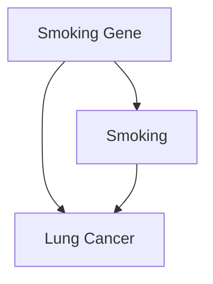
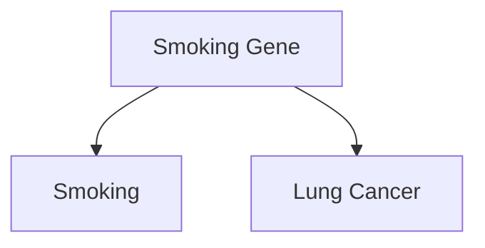
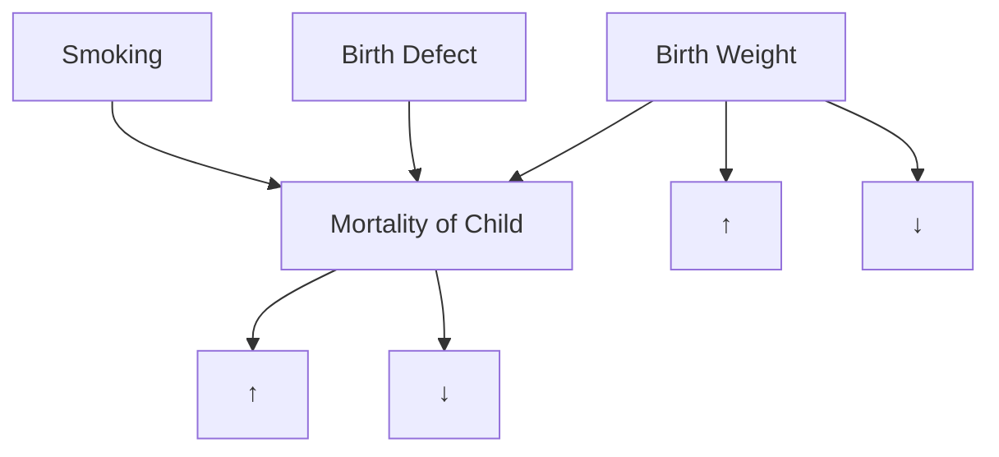

# THE SMOKE-FILLED DEBATE: CLEARING THE AIR

> At last the sailors said to each other, Come and let us cast lots to find out who is to blame for this ordeal.  
> —JONAH 1:7

In the late 1950s and early 1960s, statisticians and doctors clashed over one of the highest-profile medical questions of the century: Does smoking cause lung cancer? Half a century after this debate, we take the answer for granted. But at that time, the issue was by no means clear. Scientists, and even families, were divided.

Jacob Yerushalmy’s was one such divided family. A biostatistician at the University of California, Berkeley, Yerushalmy (1904–1973) was one of the last of the pro-tobacco holdouts in academia. “Yerushalmy opposed the notion that cigarette smoking caused cancer until his dying day,” wrote his nephew David Lilienfeld many years later. On the other hand, Lilienfeld’s father, Abe Lilienfeld, was an epidemiologist at Johns Hopkins University and one of the most outspoken proponents of the theory that smoking did cause cancer.

The younger Lilienfeld recalled how Uncle “Yak” (short for Jacob) and his father would sit around and debate the effects of smoking, wreathed all the while in a “haze of smoke from Yak’s cigarette and Abe’s pipe” (see chapter frontispiece).

If only Abe and Yak had been able to summon the Causal Revolution to clear the air! As this chapter shows, one of the most important scientific arguments against the smoking-cancer hypothesis was the possible existence of unmeasured factors that cause both craving for nicotine and lung cancer. We have just discussed such confounding patterns and noted that today’s causal diagrams have driven the menace of confounding out of existence. But we are now in the 1950s and 1960s, two decades before Sander Greenland and Jamie Robins and three decades before anyone had heard of the do-operator. It is interesting to examine, therefore, how scientists of that era dealt with the issue and showed that the confounding argument is all smoke and mirrors.

No doubt the subject of many of Abe and Yak’s smoke-filled debates was neither tobacco nor cancer. It was that innocuous word “caused.” It wasn’t the first time that physicians confronted perplexing causal questions: some of the greatest milestones in medical history dealt with identifying causative agents. In the mid-1700s, James Lind had discovered that citrus fruits could prevent scurvy, and in the mid-1800s, John Snow had figured out that water contaminated with fecal matter caused cholera. (Later research identified a more specific causative agent in each case: vitamin C deficiency for scurvy, the cholera bacillus for cholera.)

These brilliant pieces of detective work had in common a fortunate one-to-one relation between cause and effect. The cholera bacillus is the only cause of cholera; or as we would say today, it is both necessary and sufficient. If you aren’t exposed to it, you won’t get the disease. Likewise, a vitamin C deficiency is necessary to produce scurvy, and given enough time, it is also sufficient.

The smoking-cancer debate challenged this monolithic concept of causation. Many people smoke their whole lives and never get lung cancer. Conversely, some people get lung cancer without ever lighting up a cigarette. Some people may get it because of a hereditary disposition, others because of exposure to carcinogens, and some for both reasons.

Of course, statisticians already knew of one excellent way to establish causation in a more general sense: the randomized controlled trial (RCT). But such a study would be neither feasible nor ethical in the case of smoking. How could you assign people chosen at random to smoke for decades, possibly ruining their health, just to see if they would get lung cancer after thirty years? It’s impossible to imagine anyone outside North Korea “volunteering” for such a study.

Without a randomized controlled trial, there was no way to convince skeptics like Yerushalmy and R. A. Fisher, who were committed to the idea that the observed association between smoking and lung cancer was spurious. To them, some lurking third factor could be producing the observed association. For example, there could be a *smoking gene* that caused people to crave cigarettes and also, at the same time, made them more likely to develop lung cancer (perhaps because of other lifestyle choices). The confounders they suggested were implausible at best. Still, the onus was on the antismoking contingent to prove there was no confounder—to prove a negative, which Fisher and Yerushalmy well knew is almost impossible.

The final breach of this stalemate is a tale at once of a **great triumph** and a **great opportunity missed**. It was a triumph for public health because the epidemiologists did get it right in the end. The US surgeon general’s report, in 1964, stated in no uncertain terms, “Cigarette smoking is causally related to lung cancer in men.” This blunt statement forever shut down the argument that smoking was “not proven” to cause cancer. The rate of smoking in the United States among men began to decrease the following year and is now less than half what it was in 1964. No doubt millions of lives have been saved and lifespans lengthened.

On the other hand, the triumph is incomplete. The period it took to reach the above conclusion, roughly from 1950 to 1964, might have been shorter if scientists had been able to call upon a more principled theory of causation. And most significantly from the point of view of this book, the scientists of the 1960s did not really put together such a theory. To justify the claim that smoking caused cancer, the surgeon general’s committee relied on an informal series of guidelines, called **Hill’s criteria**, named for University of London statistician Austin Bradford Hill. Every one of these criteria has demonstrable exceptions, although collectively they have a compelling commonsense value and even wisdom.

From the overly methodological world of Fisher, the Hill guidelines take us to the opposite realm, to a methodology-free world where causality is decided on the basis of qualitative patterns of statistical trends. The Causal Revolution builds a bridge between these two extremes, empowering our intuitive sense of causality with mathematical rigor. But this job would be left to the next generation.

## TOBACCO: A MANMADE EPIDEMIC

In 1902, cigarettes comprised only 2 percent of the US tobacco market; spittoons rather than ashtrays were the most ubiquitous symbol of tobacco consumption. But two powerful forces worked together to change Americans’ habits: **automation** and **advertising**. Machine-made cigarettes easily outcompeted handcrafted cigars and pipes on the basis of availability and cost. Meanwhile, the tobacco industry invented and perfected many tricks of the trade of advertising (see Figure 5.1). People who watched TV in the 1960s can easily remember any number of catchy cigarette jingles, from “You get a lot to like in a Marlboro” to “You’ve come a long way, baby.”

By 1952, cigarettes’ share of the tobacco market had rocketed from 2 to 81 percent, and the market itself had grown dramatically. This sea change in the habits of a country had unexpected ramifications for public health. Even in the early years of the twentieth century, there had been suspicions that smoking was unhealthy, that it “irritated” the throat and caused coughing. Around mid-century, the evidence started to become a good deal more ominous.

Before cigarettes, lung cancer had been so rare that a doctor might encounter it only once in a lifetime of practice. But between 1900 and 1950, the formerly rare disease quadrupled in frequency, and by 1960 it would become the most common form of cancer among men. Such a huge change in the incidence of a lethal disease begged for an explanation.

*Black-and-white photo of a man using a vintage telephone at a desk with a lamp and coins (no visible text or symbols)*

## “I'll Be Right Over!”

……24 hours a day your doctor is “on duty”……guarding health……protecting and prolonging life……

> CAMEL  
> TURKISH & DOMESTIC  
> BLIND  
> CIGARETTES  
> R. J. Reynolds Tobacco Company, Winston-Salem, I

According to a recent independent nationwide survey:

# More Doctors Smoke Camels

than any other cigarette

> **FIGURE 5.1.** Highly manipulative advertisements were intended to reassure the public that cigarettes were not injurious to their health——including this 1948 ad from the *Journal of the American Medical Association* targeting the doctors themselves. (Source: From the collection of Stanford Research into the Impact of Tobacco Advertising.)

With hindsight, it is easy to point the finger of blame at smoking. If we plot the rates of lung cancer and tobacco consumption on a graph (see Figure 5.2), the connection is impossible to miss. But time series data are poor evidence for causality. Many other things had changed between 1900 and 1950 and were equally plausible culprits: the paving of roads, the inhalation of leaded gasoline fumes, and air pollution in general.

British epidemiologist Richard Doll said in 1991, “Motor cars… were a new factor and if I had had to put money on anything at the time, I should have put it on motor exhausts or possibly the tarring of roads.”

> **FIGURE 5.2.** A graph of the per capita cigarette consumption rate in the United States (black) and the lung cancer death rate among men (gray) shows a stunning similarity: the cancer curve is almost a replica of the smoking curve, delayed by about thirty years. Nevertheless, this evidence is circumstantial, not proof of causation. Certain key dates are noted here, including the publication of Richard Doll and Austin Bradford Hill’s paper in 1950, which first alerted many medical professionals to the association between smoking and lung cancer. (Source: Graph by Maayan Harel, using data from the American Cancer Society, Centers for Disease Control, and Office of the Surgeon General.)

The job of science is to put supposition aside and look at the facts. In 1948, Doll and Austin Bradford Hill teamed up to see if they could learn anything about the causes of the cancer epidemic. Hill had been the chief statistician on a highly successful randomized controlled trial, published earlier that year, which had proved that streptomycin——one of the first antibiotics——was effective against tuberculosis. The study, a landmark in medical history, not only introduced doctors to “wonder drugs” but also cemented the reputation of randomized controlled trials, which soon became the standard for clinical research in epidemiology.

Of course Hill knew that an RCT was impossible in this case, but he had learned the advantages of comparing a treatment group to a control group. So he proposed to compare patients who had already been diagnosed with cancer to a control group of healthy volunteers. Each group’s members were interviewed on their past behaviors and medical histories. To avoid bias, the interviewers were not told who had cancer and who was a control.

The results of the study were shocking: out of 649 lung cancer patients interviewed, all but two had been smokers. This was a statistical improbability so extreme that Doll and Hill couldn’t resist working out the exact odds against it: **1.5 million to 1**. Also, the lung cancer patients had been **heavier smokers** on average than the controls, but (in an inconsistency that R. A. Fisher would later pounce on) a smaller percentage reported inhaling their smoke.

The type of study Doll and Hill conducted is now called a **case-control study** because it compares “cases” (people with a disease) to controls. It is clearly an improvement over time series data, because researchers can control for confounders like age, sex, and exposure to environmental pollutants. Nevertheless, the case-control design has some obvious drawbacks:

- It is **retrospective**; that means we study people known to have cancer and look backward to discover why.
- The probability logic is backward too. The data tell us the probability that a cancer patient is a smoker instead of the probability that a smoker will get cancer. It is the latter probability that really matters to a person who wants to know whether he should smoke or not.

In addition, case-control studies admit several possible sources of bias:

- One of them is called **recall bias**: although Doll and Hill ensured that the interviewers didn’t know the diagnoses, the patients certainly knew whether they had cancer or not. This could have affected their recollections.
- Another problem is **selection bias**. Hospitalized cancer patients were in no way a representative sample of the population, or even of the smoking population.

In short, Doll and Hill’s results were extremely suggestive but could not be taken as proof that smoking causes cancer. The two researchers were careful at first to call the correlation an “association.” After dismissing several confounders, they ventured a stronger assertion that “smoking is a factor, and an important factor, in the production of carcinoma of the lung.”

Over the next few years, nineteen case-control studies conducted in different countries all arrived at basically the same conclusion. But as R. A. Fisher was only too happy to point out, repeating a biased study nineteen times doesn’t prove anything. It’s still biased. Fisher wrote in 1957 that these studies “were mere repetitions of evidence of the same kind, and it is necessary to try to examine whether that kind is sufficient for any scientific conclusion.”

Doll and Hill realized that if there were hidden biases in the case-control studies, mere replication would not overcome them. Thus, in 1951 they began a **prospective study**, for which they sent out questionnaires to 60,000 British physicians about their smoking habits and followed them forward in time. (The American Cancer Society launched a similar and larger study around the same time.)

Even in just five years, some dramatic differences emerged. Heavy smokers had a death rate from lung cancer **twenty-four times** that of nonsmokers. In the American Cancer Society study, the results were even grimmer: smokers died from lung cancer **twenty-nine times** more often than nonsmokers, and heavy smokers died **ninety times** more often. On the other hand, people who had smoked and then stopped reduced their risk by a factor of two.

The consistency of all these results——more smoking leads to a higher risk of cancer, stopping leads to a lower risk——was another strong piece of evidence for causality. Doctors call it a **“dose-response effect”**: if substance A causes a biological effect B, then usually (though not always) a larger dose of A causes a stronger response B.

Nevertheless, skeptics like Fisher and Yerushalmy would not be convinced. The prospective studies still failed to compare smokers to otherwise identical nonsmokers. In fact, it is not clear that such a comparison can be made. Smokers are self-selecting. They may be genetically or “constitutionally” different from nonsmokers in a number of ways——more risk taking, likelier to drink heavily. Some of these behaviors might cause adverse health effects that might otherwise be attributed to smoking.

This was an especially convenient argument for a skeptic to make because the constitutional hypothesis was almost untestable. Only after the sequencing of the human genome in 2000 did it become possible to look for genes linked to lung cancer. (Ironically, Fisher was proven right, albeit in a very limited way: such genes do exist.)

However, in 1959 **Jerome Cornfield**, writing with Abe Lilienfeld, published a point-by-point rebuttal of Fisher’s arguments that, in many physicians’ eyes, settled the issue. Cornfield, who worked at the National Institutes of Health, was an unusual participant in the smoking-cancer debate. Neither a statistician nor a biologist by training, he had majored in history and learned statistics at the US Department of Agriculture. Though somewhat self-taught, he eventually became a highly sought consultant and president of the American Statistical Association. He also had been a 2.5-pack-a-day smoker but gave up his habit when he started seeing the data on lung cancer. (It is interesting to see how personal the smoking debate was for the scientists involved. Fisher never gave up his pipe, and Yerushalmy never gave up his cigarettes.)

Cornfield took direct aim at Fisher’s constitutional hypothesis, and he did so on Fisher’s own turf: mathematics. Suppose, he argued, that there is a confounding factor, such as a smoking gene, that completely accounts for the cancer risk of smokers. If smokers have nine times the risk of developing lung cancer, the confounding factor needs to be at least nine times more common in smokers to explain the difference in risk.

Think of what this means. If 11% of nonsmokers have the “smoking gene,” then 99% of the smokers would have to have it. And if even 12% of nonsmokers happen to have the cancer gene, then it becomes mathematically impossible for the cancer gene to account fully for the association between smoking and cancer. To biologists, this argument, called **Cornfield’s inequality**, reduced Fisher’s constitutional hypothesis to smoking ruins. It is inconceivable that a genetic variation could be so tightly linked to something as complex and unpredictable as a person’s choice to smoke.

Cornfield’s inequality was actually a causal argument in embryonic form: it gives us a criterion for adjudicating between **Diagram 5.1** (in which the constitutional hypothesis cannot fully explain the association between smoking and lung cancer) and **Diagram 5.2** (in which the smoking gene would fully account for the observed association).

> **DIAGRAM 5.1.**

> DIAGRAM 5.2.

As explained above, the association between smoking and lung cancer was much too strong to be explained by the constitutional hypothesis. In fact, Cornfield’s method planted the seeds of a very powerful technique called “sensitivity analysis,” which today supplements the conclusions drawn from the inference engine described in the Introduction. Instead of drawing inferences by assuming the absence of certain causal relationships in the model, the analyst challenges such assumptions and evaluates how strong alternative relationships must be in order to explain the observed data. The quantitative result is then submitted to a judgment of plausibility, not unlike the crude judgments invoked in positing the absence of those causal relationships. Needless to say, if we want to extend Cornfield’s approach to a model with more than three or four variables, we need algorithms and estimation techniques that are unthinkable without the advent of graphical tools.

Epidemiologists in the 1950s faced the criticism that their evidence was “only statistical.” There was allegedly no “laboratory proof.” But even a look at history shows that this argument was specious. If the standard of “laboratory proof” had been applied to scurvy, then sailors would have continued dying right up until the 1930s, because until the discovery of vitamin C, there was no “laboratory proof” that citrus fruits prevented scurvy. Furthermore, in the 1950s some types of laboratory proof of the effects of smoking did start to appear in medical journals. Rats painted with cigarette tar developed cancer. Cigarette smoke was proven to contain benzopyrenes, a previously known carcinogen. These experiments increased the biological plausibility of the hypothesis that smoking could cause cancer.

By the end of the decade, the accumulation of so many different kinds of evidence had convinced almost all experts in the field that smoking indeed caused cancer. Remarkably, even researchers at the tobacco companies were convinced—a fact that stayed deeply hidden until the 1990s, when litigation and whistle-blowers forced tobacco companies to release many thousands of previously secret documents. In 1953, for example, a chemist at R.J. Reynolds, Claude Teague, had written to the company’s upper management that tobacco was “an important etiologic factor in the induction of primary cancer of the lung,” nearly a word-for-word repetition of Hill and Doll’s conclusion.

In public, the cigarette companies sang a different tune. In January 1954, the leading tobacco companies (including Reynolds) published a nationwide newspaper advertisement, “A Frank Statement to Cigarette Smokers,” that said, “We believe the products we make are not injurious to health. We always have and always will cooperate closely with those whose task it is to safeguard the public health.” In a speech given in March 1954, George Weissman, vice president of Philip Morris and Company, said, “If we had any thought or knowledge that in any way we were selling a product harmful to consumers, we would stop business tomorrow.” Sixty years later, we are still waiting for Philip Morris to keep that promise.

This brings us to the saddest episode in the whole smoking-cancer controversy: the deliberate efforts of the tobacco companies to deceive the public about the health risks. If Nature is like a genie that answers a question truthfully but only exactly as it is asked, imagine how much more difficult it is for scientists to face an adversary that intends to deceive us. The cigarette wars were science’s first confrontation with organized denialism, and no one was prepared. The tobacco companies magnified any shred of scientific controversy they could. They set up their own Tobacco Industry Research Committee, a front organization that gave money to scientists to study issues related to cancer or tobacco—but somehow never got around to the central question. When they could find legitimate skeptics of the smoking-cancer connection—such as R. A. Fisher and Jacob Yerushalmy—the tobacco companies paid them consulting fees.

The case of Fisher is particularly sad. Of course, skepticism has its place. Statisticians are paid to be skeptics; they are the conscience of science. But there is a difference between reasonable and unreasonable skepticism. Fisher crossed that line and then some. Always unable to admit his own mistakes, and surely influenced by his lifetime pipe-smoking habit, he could not acknowledge that the tide of evidence had turned against him. His arguments became desperate. He seized on one counterintuitive result in Doll and Hill’s first paper—the finding (which barely reached the level of statistical significance) that lung cancer patients described themselves as inhalers less often than the controls—and would not let it go. None of the subsequent studies found any such effect. Although Fisher knew as well as anybody that “statistically significant” results sometimes fail to be replicated, he resorted to mockery. He argued that their study had showed that inhaling cigarette smoke might be beneficial and called for further research on this “extremely important point.” Perhaps the only positive thing we can say about Fisher’s role in the debate is that it is very unlikely that tobacco money corrupted him in any way. His own obstinacy was sufficient.

For all these reasons, the link between smoking and cancer remained controversial in the public mind long after it had ended among epidemiologists. Even doctors, who should have been more attuned to the science, remained unconvinced: a poll conducted by the American Cancer Society in 1960 showed that only a third of American doctors agreed with the statement that smoking was “a major cause of lung cancer,” and 43 percent of doctors were themselves smokers.

While we may justly blame Fisher for his obduracy and the tobacco companies for their deliberate deception, we must also acknowledge that the scientific community was laboring in an ideological straightjacket. Fisher had been right to promote randomized controlled trials as a highly effective way to assess a causal effect. However, he and his followers failed to realize that there is much we can learn from observational studies. That is the benefit of a causal model: it leverages the experimenter’s scientific knowledge. Fisher’s methods assume that the experimenter begins with no prior knowledge of or opinions about the hypothesis to be tested. They impose ignorance on the scientist, a situation that the denialists eagerly took advantage of.

Because scientists had no straightforward definition of the word “cause” and no way to ascertain a causal effect without a randomized controlled trial, they were ill prepared for a debate over whether smoking caused cancer. They were forced to fumble their way toward a definition in a process that lasted throughout the 1950s and reached a dramatic conclusion in 1964.

## THE SURGEON GENERAL’S COMMISSION AND HILL’S CRITERIA

The paper by Cornfield and Lilienfeld had paved the way for a definitive statement by health authorities about the effects of smoking. The Royal College of Physicians in the United Kingdom took the lead, issuing a report in 1962 concluding that cigarette smoking was a causative agent in lung cancer. Shortly thereafter, US Surgeon General Luther Terry (quite possibly on the urging of President John F. Kennedy) announced his intention to appoint a special advisory committee to study the matter (see Figure 5.3).

The committee was carefully balanced to include five smokers and five nonsmokers, two people suggested by the tobacco industry, and nobody who had previously made public statements for or against smoking. For that reason, people like Lilienfeld and Cornfield were ineligible. The members of the committee were distinguished experts in medicine, chemistry, or biology. One of them, William Cochran of Harvard University, was a statistician. In fact, Cochran’s credentials in statistics were the best possible: he was a student of a student of Karl Pearson.

> **FIGURE 5.3.** In 1963, a surgeon general’s advisory committee wrestled with the problem of how to assess the causal effects of smoking. Depicted here are William Cochran (the committee’s statistician), Surgeon General Luther Terry, and chemist Louis Fieser. (Source: Drawing by Dakota Harr.)

- Per Capita Smoking
- Lung Cancer
- Other Cancers

The committee labored for more than a year on its report, and a major issue was the use of the word “cause.” The committee members had to put aside nineteenth-century deterministic conceptions of causality, and they also had to put aside statistics. As they (probably Cochran) wrote in the report:

> “Statistical methods cannot establish proof of a causal relationship in an association. The causal significance of an association is a matter of judgment which goes beyond any statement of statistical probability. To judge or evaluate the causal significance of the association between the attribute or agent and the disease, or effect upon health, a number of criteria must be utilized, no one of which is an all-sufficient basis for judgment.”

The committee listed five such criteria:

- **Consistency**: many studies, in different populations, show similar results.
- **Strength of association**: including the dose-response effect; more smoking is associated with a higher risk.
- **Specificity of the association**: a particular agent should have a particular effect and not a long litany of effects.
- **Temporal relationship**: the effect should follow the cause.
- **Coherence**: biological plausibility and consistency with other types of evidence such as laboratory experiments and time series.

In 1965, Austin Bradford Hill, who was not on the committee, attempted to summarize the arguments in a way that could be applied to other public health problems and added four more criteria to the list; as a result, the whole list of nine criteria have become known as “Hill’s criteria.” Actually Hill called them “viewpoints,” not requirements, and emphasized that any of them might be lacking in any particular case. “None of my nine viewpoints can bring indisputable evidence for or against the cause-and-effect hypothesis, and none can be required as a sine qua non,” he wrote.

Indeed, it is quite easy to find arguments against each of the criteria on either Hill’s list or the advisory committee’s shorter list. Consistency by itself proves nothing; if thirty studies each ignore the same confounder, all can easily be biased. Strength of association is vulnerable for the same reason; as pointed out earlier, children’s shoe sizes are strongly associated with but not causally related to their reading aptitude. Specificity has always been a particularly controversial criterion. It makes sense in the context of infectious disease, where one agent typically produces one illness, but less so in the context of environmental exposure. Smoking leads to an increased risk of a variety of other diseases, such as emphysema and cardiovascular disease. Does this really weaken the evidence that it causes cancer? Temporal relation has some exceptions, as mentioned before—for example, a rooster crow does not cause the sun to rise, even though it always precedes the sun. Finally, coherence with established theory or facts is certainly desirable, but the history of science is filled with overturned theories and mistaken laboratory findings.

Hill’s “viewpoints” are still useful as a description of how a discipline comes to accept a causal hypothesis, using a variety of evidence, but they came with no methodology to implement them. For example, biological plausibility and consistency with experiments are supposedly good things. But how, precisely, are we supposed to weigh these kinds of evidence? How do we bring preexisting knowledge into the picture? Apparently each scientist just has to decide for him- or herself. But gut decisions can be wrong, especially if there are political pressures or monetary considerations or if the scientist is addicted to the substance being studied.

None of these comments is intended to denigrate the work of the committee. Its members did the best they could in an environment that provided them with no mechanism for discussing causality. Their recognition that nonstatistical criteria were necessary was a great step forward. And the difficult personal decisions that the smokers on the committee made attest to the seriousness of their conclusions. Luther Terry, who had been a cigarette smoker, switched to a pipe. Leonard Schuman announced that he was quitting. William Cochran acknowledged that he could reduce his risk of cancer by quitting but felt that the “comfort of my cigarettes” was sufficient compensation for the risk. Most painfully, Louis Fieser, a four-pack-a-day smoker, was diagnosed with lung cancer less than a year after the report. He wrote to the committee:

> “You may recall that although fully convinced by the evidence, I continued heavy smoking throughout the deliberations of our committee and invoked all the usual excuses.… My case seems to me more convincing than any statistics.”

Minus one lung, he finally stopped smoking.

Viewed from the perspective of public health, the report of the advisory committee was a landmark. Within two years, Congress had required manufacturers to place health warnings on all cigarette packs. In 1971, cigarette advertisements were banned from radio and television. The percentage of US adults who smoke declined from its all-time maximum of 45 percent in 1965 to 19.3 percent in 2010. The antismoking campaign has been one of the largest and most successful, though painfully slow and incomplete, public health interventions in history. The committee’s work also provided a valuable template for achieving scientific consensus and served as a model for future surgeon general’s reports on smoking and many other topics in the years to come (including secondhand smoke, which became a major issue in the 1980s).

Viewed from the perspective of causality, the report was at best a modest success. It clearly established the gravity of causal questions and that data alone could not answer them. But as a roadmap for future discovery, its guidelines were uncertain and flimsy. Hill’s criteria are best read as a historical document, summarizing the types of evidence that had emerged in the 1950s, and ultimately convinced the medical community. But as a guide to future research, they are inadequate. For all but the broadest causal questions, we need a more precise instrument. In retrospect, Cornfield’s inequality, which planted the seeds of sensitivity analysis, was a step in that direction.

## SMOKING FOR NEWBORNS

Even after the smoking and cancer debate died down, one major paradox lingered. In the mid-1960s, Jacob Yerushalmy pointed out that a mother’s smoking during pregnancy seemed to benefit the health of her newborn baby, if the baby happened to be born underweight. This puzzle, called the **birth-weight paradox**, flew in the face of the emerging medical consensus about smoking and was not satisfactorily explained until 2006—more than forty years after Yerushalmy’s original paper.

> **批注**：I am absolutely convinced it took so long because the language of causality was not available from 1960 to 1990.

In 1959, Yerushalmy had launched a long-term public health study that collected pre- and postnatal data on more than 15,000 children in the San Francisco Bay Area. The data included information on mothers’ smoking habits, as well as the birth weights and mortality rates of their babies in the first month of life.

Several studies had already shown that the babies of smoking mothers weighed less at birth on average than the babies of nonsmokers, and it was natural to suppose that this would translate to poorer survival. Indeed, a nationwide study of low-birth-weight infants (defined as those who weigh less than 5.5 pounds at birth) had shown that their death rate was more than twenty times higher than that of normal-birth-weight infants. Thus, epidemiologists posited a chain of causes and effects:

**Smoking → Low Birth Weight → Mortality.**

What Yerushalmy found in the data was unexpected even to him. It was true that the babies of smokers were lighter on average than the babies of nonsmokers (by seven ounces). However, the low-birth-weight babies of smoking mothers had a better survival rate than those of nonsmokers. It was as if the mother’s smoking actually had a protective effect.

> **批注**：If Fisher had discovered something like this, he probably would have loudly proclaimed it as one of the benefits of smoking. Yerushalmy, to his credit, did not.

He wrote, much more cautiously, “These paradoxical findings raise doubts and argue against the proposition that cigarette smoking acts as an exogenous factor which interferes with intrauterine development of the fetus.” In short, there is no causal path from Smoking to Mortality.

Modern epidemiologists believe that Yerushalmy was wrong. Most believe that smoking does increase neonatal mortality—for example, because it interferes with oxygen transfer across the placenta. But how can we reconcile this hypothesis with the data?

Statisticians and epidemiologists insisted on analyzing the paradox in probabilistic terms and seeing it as an anomaly peculiar to birth weight. As it turns out, it has little to do with birth weight and everything to do with colliders. When viewed in that light, it is not paradoxical but instructive.

In fact, Yerushalmy’s data were completely consistent with the model **Smoking → Low Birth Weight → Mortality** once we add a little bit more to it. Smoking may be harmful in that it contributes to low birth weight, but certain other causes of low birth weight, such as serious or life-threatening genetic abnormalities, are much more harmful. There are two possible explanations for low birth weight in one particular baby: it might have a smoking mother, or it might be affected by one of those other causes. If we find out that the mother is a smoker, this explains away the low weight and consequently reduces the likelihood of a serious birth defect. But if the mother does not smoke, we have stronger evidence that the cause of the low birth weight is a birth defect, and the baby’s prognosis becomes worse.

As before, a causal diagram makes everything clearer. When we incorporate the new assumptions, the causal diagram looks like Figure 5.4. We can see that the birth-weight paradox is a perfect example of **collider bias**. The collider is **Birth Weight**. By looking only at babies with low birth weight, we are conditioning on that collider. This opens up a back-door path between Smoking and Mortality that goes **Smoking → Birth Weight ← BirthDefect → Mortality**. This path is noncausal because one of the arrows goes the wrong way. Nevertheless, it induces a spurious correlation between Smoking and Mortality and biases our estimate of the actual (direct) causal effect, **Smoking → Mortality**. In fact, it biases the estimate to such a large extent that smoking actually appears beneficial.

The beauty of causal diagrams is that they make the source of bias obvious. Lacking such diagrams, epidemiologists argued about the paradox for forty years. In fact, they are still discussing it: the October 2014 issue of the *International Journal of Epidemiology* contains several articles on this topic. One of them, by Tyler VanderWeele of Harvard, nails the explanation perfectly and contains a diagram just like the one below.

> **FIGURE 5.4.** Causal diagram for the birth-weight paradox.

Of course, this diagram is likely too simple to capture the full story behind smoking, birth weight, and infant mortality. However, the principle of collider bias is robust. In this case the bias was detected because the apparent phenomenon was too implausible, but just imagine how many cases of collider bias go undetected because the bias does not conflict with theory.

# PASSIONATE DEBATES: SCIENCE VS. CULTURE

After I began work on this chapter, I had occasion to contact Allen Wilcox, the epidemiologist probably most identified with this paradox. He has asked a very inconvenient question about the diagram in Figure 5.4: How do we know that low birth weight is actually a direct cause of mortality? In fact, he believes that doctors have misinterpreted low birth weight all along. Because it is strongly associated with infant mortality, doctors have interpreted it as a cause. In fact, that association could be due entirely to confounders (represented by “Birth Defect” in Figure 5.4, though Wilcox is not so specific).

Two points are worth making about Wilcox’s argument. First, even if we delete the arrow Birth Weight → Mortality, the collider remains. Thus the causal diagram continues to account for the birth-weight paradox successfully. Second, the causal variable that Wilcox has studied the most is not smoking but race. And race still incites passionate debate in our society.

In fact, the same birth-weight paradox is observed in children of black mothers as in children of smokers. Black women give birth to underweight babies more often than white women do, and their babies have a higher mortality rate. Yet their low-birth-weight babies have a better survival rate than the low-birth-weight babies of white women. Now what conclusions should we draw? We can tell a pregnant smoker that she would help her baby by stopping smoking. But we can’t tell a pregnant black woman to stop being black.

Instead, we should address the societal issues that cause the children of black mothers to have a higher mortality rate. This is surely not a controversial statement. But what causes should we address, and how should we measure our progress? For better or for worse, many advocates for racial justice have assumed birth weight as an intermediate step in the chain Race → Birth Weight → Mortality. Not only that, they have taken birth weight as a proxy for infant mortality, assuming that improvements in the one will automatically lead to improvements in the other. It’s easy to understand why they did this. Measurements of average birth weights are easier to come by than measurements of infant mortality.

Now imagine what happens when someone like Wilcox comes along and asserts that low birth weight by itself is not a medical condition and has no causal relation to infant mortality. It upsets the entire applecart. Wilcox was accused of racism when he first suggested this idea back in the 1970s, and he didn’t dare to publish it until 2001. Even then, two commentaries accompanied his article, and one of them brought up the race issue: “In the context of a society whose dominant elements justify their positions by arguing the genetic inferiority of those they dominate, it is hard to be neutral,” wrote Richard David of Cook County Hospital in Chicago. “In the pursuit of ‘pure science’ a well-meaning investigator may be perceived as — and may be — aiding and abetting a social order he abhors.”

This harsh accusation, conceived out of the noblest of motivations, is surely not the first instance in which a scientist has been reprimanded for elucidating truths that might have adverse social consequences. The Vatican’s objections to Galileo’s ideas surely arose out of genuine concerns for the social order of the time. The same can be said about Charles Darwin’s evolution and Francis Galton’s eugenics. However, the cultural shocks that emanate from new scientific findings are eventually settled by cultural realignments that accommodate those findings — not by concealment. A prerequisite for this realignment is that we sort out the science from the culture before opinions become inflamed. Fortunately, the language of causal diagrams now gives us a way to be dispassionate about causes and effects not only when it is easy but also when it is hard.

> Do you want to change doors?
>
> The “Monty Hall paradox,” an enduring and for many people infuriating puzzle, highlights how our brains can be fooled by probabilistic reasoning when causal reasoning should apply. (Source: Drawing by Maayan Harel.)

## 6