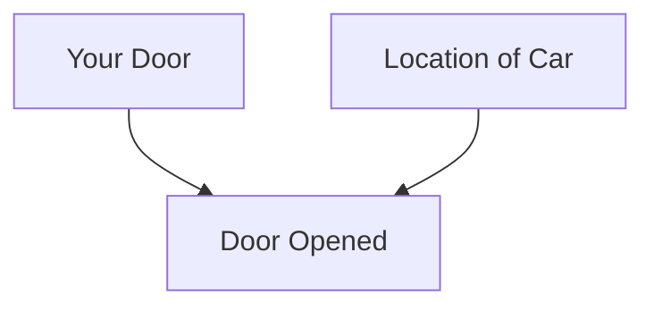
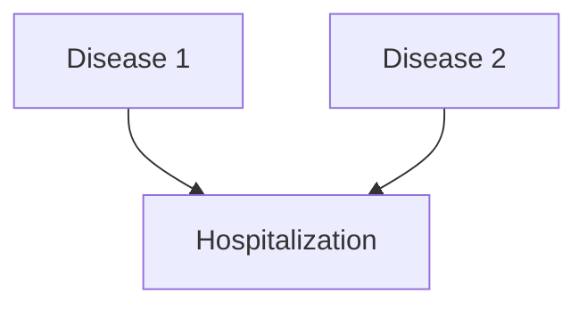
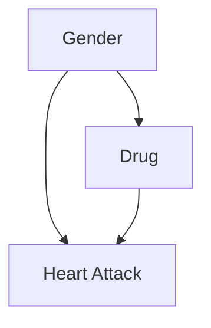
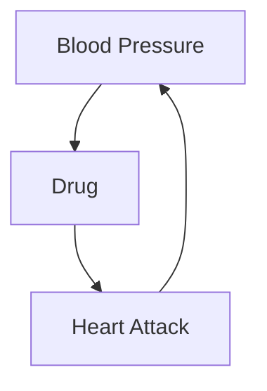
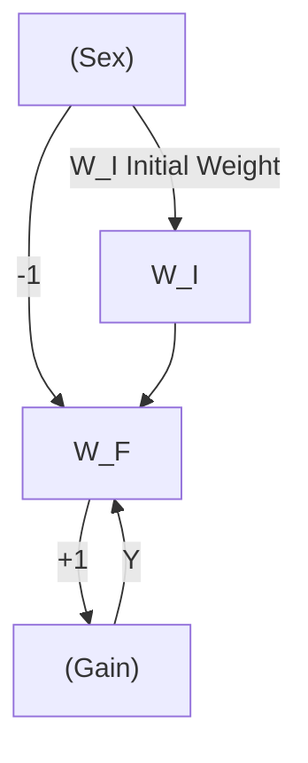
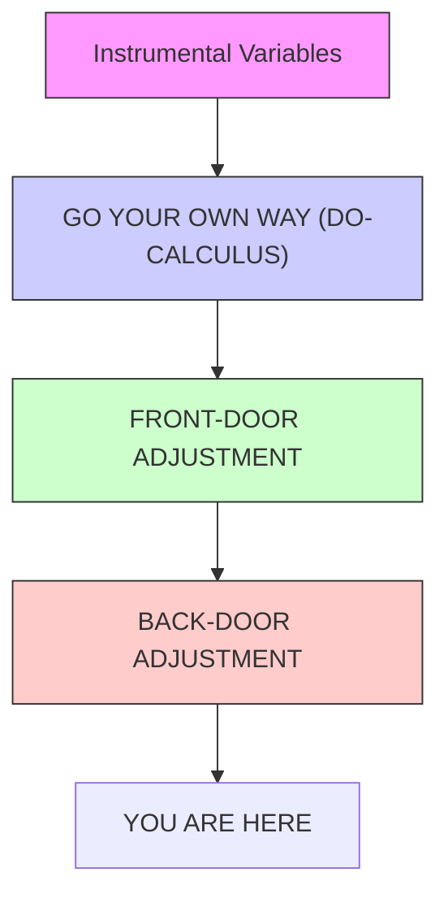

# PARADOXES GALORE!

He who confronts the paradoxical exposes himself to reality.  
—FRIEDRICH DÜRRENMATT (1962)

The birth-weight paradox, with which we ended Chapter 5, is representative of a surprisingly large class of paradoxes that reflect the tensions between causation and association. The tension starts because they stand on two different rungs of the Ladder of Causation and is aggravated by the fact that human intuition operates under the logic of causation, while data conform to the logic of probabilities and proportions. Paradoxes arise when we misapply the rules we have learned in one realm to the other.

We are going to devote a chapter to some of the most baffling and well-known paradoxes in probability and statistics because, first of all, they’re fun. If you haven’t seen the Monty Hall and Simpson’s paradoxes before, I can promise that they will give your brain a workout. And even if you think you know all about them, I think that you will enjoy viewing them through the lens of causality, which makes everything look quite a bit different.

However, we study paradoxes not just because they are fun and games. Like optical illusions, they also reveal the way the brain works, the shortcuts it takes, and the things it finds conflicting. Causal paradoxes shine a spotlight onto patterns of intuitive causal reasoning that clash with the logic of probability and statistics. To the extent that statisticians have struggled with them—and we’ll see that they whiffed rather badly—it’s a warning sign that something might be amiss with viewing the world without a causal lens.

## THE PERPLEXING MONTY HALL PROBLEM

In the late 1980s, a writer named Marilyn vos Savant started a regular column in *Parade* magazine, a weekly supplement to the Sunday newspaper in many US cities. Her column, “Ask Marilyn,” continues to this day and features her answers to various puzzles, brainteasers, and scientific questions submitted by readers. The magazine billed her as “the world’s smartest woman,” which undoubtedly motivated readers to come up with a question that would stump her.

Of all the questions she ever answered, none created a greater furor than this one, which appeared in a column in September 1990:

> “Suppose you’re on a game show, and you’re given the choice of three doors. Behind one door is a car, behind the others, goats. You pick a door, say #1, and the host, who knows what’s behind the doors, opens another door, say #3, which has a goat. He says to you, ‘Do you want to pick door #2?’ Is it to your advantage to switch your choice of doors?”

For American readers, the question was obviously based on a popular televised game show called *Let’s Make a Deal*, whose host, Monty Hall, used to play precisely this sort of mind game with the contestants. In her answer, vos Savant argued that contestants should **switch doors**. By not switching, they would have only a one-in-three probability of winning; by switching, they would double their chances to two in three.

Even the smartest woman in the world could never have anticipated what happened next. Over the next few months, she received more than 10,000 letters from readers, most of them disagreeing with her, and many of them from people who claimed to have PhDs in mathematics or statistics. A small sample of the comments from academics includes:

> “You blew it, and you blew it big!” (Scott Smith, PhD)  
> “May I suggest that you obtain and refer to a standard textbook on probability before you try to answer a question of this type again?” (Charles Reid, PhD)  
> “You blew it!” (Robert Sachs, PhD)  
> “You are utterly incorrect” (Ray Bobo, PhD)

In general, the critics argued that it shouldn’t matter whether you switch doors or not—there are only two doors left in the game, and you have chosen your door completely at random, so the probability that the car is behind your door must be one-half either way.

Who was right? Who was wrong? And why does the problem incite such passion? All three questions deserve closer examination.

Let’s take a look first at how vos Savant solved the puzzle. Her solution is actually astounding in its simplicity and more compelling than any I have seen in many textbooks. She made a list (Table 6.1) of the three possible arrangements of doors and goats, along with the corresponding outcomes under the “Switch” strategy and the “Stay” strategy. All three cases assume that you picked Door 1. Because all three possibilities listed are (initially) equally likely, the probability of winning if you switch doors is **two-thirds**, and the probability of winning if you stay with Door 1 is only **one-third**.

Notice that vos Savant’s table does not explicitly state which door was opened by the host. That information is implicitly embedded in columns 4 and 5. For example, in the second row, we kept in mind that the host must open Door 3; therefore switching will land you on Door 2, a win. Similarly, in the first row, the door opened could be either Door 2 or Door 3, but column 4 states correctly that you lose in either case if you switch.

Even today, many people seeing the puzzle for the first time find the result hard to believe. Why? What intuitive nerve is jangled? There are probably 10,000 different reasons, one for each reader, but I think the most compelling argument is this: vos Savant’s solution seems to force us to believe in mental telepathy. If I should switch no matter what door I originally chose, then it means that the producers somehow read my mind. How else could they position the car so that it is more likely to be behind the door I did not choose?

**TABLE 6.1.** The three possible arrangements of doors and goats in *Let’s Make a Deal*, showing that switching doors is twice as attractive as not.

| Door 1 | Door 2 | Door 3 | Outcome If You Switch | Outcome If You Stay |
|--------|--------|--------|-----------------------|----------------------|
| Auto   | Goat   | Goat   | Lose                  | Win                  |
| Goat   | Auto   | Goat   | Win                   | Lose                 |
| Goat   | Goat   | Auto   | Win                   | Lose                 |

The key element in resolving this paradox is that we need to take into account not only the data (i.e., the fact that the host opened a particular door) but also the **data-generating process**—in other words, the rules of the game. They tell us something about the data that could have been but has not been observed. No wonder statisticians in particular found this puzzle hard to comprehend. They are accustomed to, as R. A. Fisher (1922) put it, “the reduction of data” and ignoring the data-generating process.

For starters, let’s try changing the rules of the game a bit and see how that affects our conclusion. Imagine an alternative game show, called *Let’s Fake a Deal*, where Monty Hall opens one of the two doors you didn’t choose, but his choice is completely random. In particular, he might open the door that has a car behind it. Tough luck!

As before, we will assume that you chose Door 1 to begin the game, and the host, again, opens Door 3, revealing a goat, and offers you an option to switch. Should you? We will show that, under the new rules, although the scenario is identical, **you will not gain by switching**.

To do that, we make a table like the previous one, taking into account that there are two random and independent events—the location of the car (three possibilities) and Monty Hall’s choice of a door to open (two possibilities). Thus the table needs to have six rows, each of which is equally likely because the events are independent.

Now what happens if Monty Hall opens Door 3 and reveals a goat? This gives us some significant information: we must be in row 2 or 4 of the table. Focusing just on lines 2 and 4, we can see that the strategy of switching no longer offers us any advantage; we have a one-in-two probability of winning either way. So in the game *Let’s Fake a Deal*, all of Marilyn vos Savant’s critics would be right! Yet the data are the same in both games. The lesson is quite simple: **the way that we obtain information is no less important than the information itself**.

**TABLE 6.2.** *Let’s Fake a Deal* possibilities.

| Door You Chose | Door with Auto | Door Opened by Host | Outcome If You Switch | Outcome If You Stay |
|----------------|----------------|---------------------|-----------------------|----------------------|
| 1              | 1              | 2 (goat)            | Lose                  | Win                  |
| 1              | 1              | 3 (goat)            | Lose                  | Win                  |
| 1              | 2              | 2 (auto)            | Lose                  | Lose                 |
| 1              | 2              | 3 (goat)            | Win                   | Lose                 |
| 1              | 3              | 2 (goat)            | Win

Let’s use our favorite trick and draw a causal diagram, which should illustrate immediately how the two games differ. First, Figure 6.1 shows a diagram for the actual Let’s Make a Deal game, in which Monty Hall must open a door that does not have a car behind it. The absence of an arrow between Your Door and Location of Car means that your choice of a door and the producers’ choice of where to put the car are independent. This means we are explicitly ruling out the possibility that the producers can read your mind (or that you can read theirs!). Even more important are the two arrows that are present in the diagram. They show that Door Opened is affected by both your choice and the producers’ choice. That is because Monty Hall must pick a door that is different both from Your Door and Location of Car; he has to take both factors into account.


> FIGURE 6.1. Causal diagram for Let’s Make a Deal.



As you can see from Figure 6.1, Door Opened is a collider. Once we obtain information on this variable, all our probabilities become conditional on this information. But when we condition on a collider, we create a spurious dependence between its parents. The dependence is borne out in the probabilities: if you chose Door 1, the car location is twice as likely to be behind Door 2 as Door 1; if you chose Door 2, the car location is twice as likely to be behind Door 1.

It is a bizarre dependence for sure, one of a type that most of us are unaccustomed to. It is a dependence that has no cause. It does not involve physical communication between the producers and us. It does not involve mental telepathy. It is purely an artifact of Bayesian conditioning: a magical transfer of information without causality. Our minds rebel at this possibility because from earliest infancy, we have learned to associate correlation with causation. If a car behind us takes all the same turns that we do, we first think it is following us (causation!). We next think that we are going to the same place (i.e., there is a common cause behind each of our turns). But causeless correlation violates our common sense. Thus, the Monty Hall paradox is just like an optical illusion or a magic trick: it uses our own cognitive machinery to deceive us.

Why do I say that Monty Hall’s opening of Door 3 was a “transfer of information”? It didn’t, after all, provide any evidence about whether your initial choice of Door 1 was correct. You knew in advance that he was going to open a door that hid a goat, and so he did. No one should ask you to change your beliefs if you witness the inevitable. So how come your belief in Door 2 has gone up from one-third to two-thirds?

The answer is that Monty could not open Door 1 after you chose it—but he could have opened Door 2. The fact that he did not makes it more likely that he opened Door 3 because he was forced to. Thus there is more evidence than before that the car is behind Door 2. This is a general theme of Bayesian analysis: any hypothesis that has survived some test that threatens its validity becomes more likely. The greater the threat, the more likely it becomes after surviving. Door 2 was vulnerable to refutation (i.e., Monty could have opened it), but Door 1 was not. Therefore, Door 2 becomes a more likely location, while Door 1 does not. The probability that the car is behind Door 1 remains one in three.

Now, for comparison, Figure 6.2 shows the causal diagram for Let’s Fake a Deal, the game in which Monty Hall chooses a door that is different from yours but otherwise chosen at random. This diagram still has an arrow pointing from Your Door to Door Opened because he has to make sure that his door is different from yours. However, the arrow from Location of Car to Door Opened would be deleted because he no longer cares where the car is. In this diagram, conditioning on Door Opened has absolutely no effect: Your Door and Location of Car were independent to start with, and they remain independent after we see the contents of Monty’s door. So in Let’s Fake a Deal, the car is just as likely to be behind your door as the other door, as observed in Table 6.2.


> FIGURE 6.2. Causal diagram for Let’s Fake a Deal.


From the Bayesian point of view, the difference between the two games is that in Let’s Fake a Deal, Door 1 is vulnerable to refutation. Monty Hall could have opened Door 3 and revealed the car, which would have proven that your door choice was wrong. Because your door and Door 2 were equally vulnerable to refutation, they still have equal probability.

Although purely qualitative, this analysis could be made quantitative by using Bayes’s rule or by thinking of the diagrams as a simple Bayesian network. Doing so places this problem in a unifying framework that we use for thinking about other problems. We don’t have to invent a method for solving the puzzle; the belief propagation scheme described in Chapter 3 will deliver the correct answer: that is, $P(\text{Door 2}) = 2/3$ for Let’s Make a Deal, and $P(\text{Door 2}) = 1/2$ for Let’s Fake a Deal.

Notice that I have really given two explanations of the Monty Hall paradox. The first one uses causal reasoning to explain why we observe a spurious dependence between Your Door and Location of Car; the second uses Bayesian reasoning to explain why the probability of Door 2 goes up in Let’s Make a Deal. Both explanations are valuable. The Bayesian one accounts for the phenomenon but does not really explain why we perceive it as so paradoxical. In my opinion, a true resolution of a paradox should explain why we see it as a paradox in the first place. Why did the people who read her column believe so strongly that vos Savant was wrong? It wasn’t just the know-it-alls. Paul Erdos, one of the most brilliant mathematicians of modern times, likewise could not believe the solution until a computer simulation showed him that switching is advantageous.

What deep flaw in our intuitive view of the world does this reveal?

“Our brains are just not wired to do probability problems very well, so I’m not surprised there were mistakes,” said Persi Diaconis, a statistician at Stanford University, in a 1991 interview with the *New York Times*. True, but there’s more to it. Our brains are not wired to do probability problems, but they are wired to do causal problems. And this causal wiring produces systematic probabilistic mistakes, like optical illusions. Because there is no causal connection between My Door and Location of Car, either directly or through a common cause, we find it utterly incomprehensible that there is a probabilistic association. Our brains are not prepared to accept causeless correlations, and we need special training—through examples like the Monty Hall paradox or the ones discussed in Chapter 3—to identify situations where they can arise. Once we have “rewired our brains” to recognize colliders, the paradox ceases to be confusing.

## MORE COLLIDER BIAS: BERKSON’S PARADOX

In 1946, Joseph Berkson, a biostatistician at the Mayo Clinic, pointed out a peculiarity of observational studies conducted in a hospital setting: even if two diseases have no relation to each other in the general population, they can appear to be associated among patients in a hospital.

To understand Berkson’s observation, let’s start with a causal diagram (Figure 6.3). It’s also helpful to think of a very extreme possibility: neither Disease 1 nor Disease 2 is ordinarily severe enough to cause hospitalization, but the combination is. In this case, we would expect Disease 1 to be *highly correlated* with Disease 2 in the hospitalized population.


> FIGURE 6.3. Causal diagram for Berkson’s paradox.



By performing a study on patients who are hospitalized, we are controlling for Hospitalization. As we know, conditioning on a collider creates a spurious association between Disease 1 and Disease 2. In many of our previous examples the association was negative because of the explainaway effect, but here it is positive because both diseases have to be present for hospitalization (not just one).

However, for a long time epidemiologists refused to believe in this possibility. They still didn’t believe it in 1979, when David Sackett of McMaster University, an expert on all sorts of statistical bias, provided strong evidence that Berkson’s paradox is real. In one example (see Table 6.3), he studied two groups of diseases: respiratory and bone. About 7.5 percent of people in the general population have a bone disease, and this percentage is independent of whether they have respiratory disease. But for hospitalized people with respiratory disease, the frequency of bone disease jumps to **25 percent**! Sackett called this phenomenon “admission rate bias” or “Berkson bias.”

**TABLE 6.3. Sackett’s data illustrating Berkson’s paradox.**

| Respiratory disease? ↓ | Bone disease? ↓ | General Population: Yes | General Population: No | General Population: % Yes | Hospitalized: Yes | Hospitalized: No | Hospitalized: % Yes |
|---|---|---|---|---|---|---|---|
| Yes | | 17 | 207 | 7.6 | 5 | 15 | 25.0 |
| No (control) | | 184 | 2,376 | 7.2 | 18 | 219 | 7.6 |

Sackett admits that we cannot definitively attribute this effect to Berkson bias because there could also be confounding factors. The debate is, to some extent, ongoing. However, unlike in 1946 and 1979, researchers in epidemiology now understand causal diagrams and what biases they entail. The discussion has now moved on to finer points of how large the bias can be and whether it is large enough to observe in causal diagrams with more variables. This is progress!

Collider-induced correlations are not new. They have been found in work dating back to a 1911 study by the English economist Arthur Cecil Pigou, who compared children of alcoholic and nonalcoholic parents. They are also found, though not by that name, in the work of Barbara Burks (1926), Herbert Simon (1954), and of course Berkson. They are also not as esoteric as they may seem from my examples.

Try this experiment: Flip two coins simultaneously one hundred times and write down the results only when at least one of them comes up heads. Looking at your table, which will probably contain roughly seventy-five entries, you will see that the outcomes of the two simultaneous coin flips are not independent. Every time Coin 1 landed tails, Coin 2 landed heads. How is this possible? Did the coins somehow communicate with each other at light speed? Of course not. In reality you conditioned on a collider by censoring all the tails-tails outcomes.

In *The Direction of Time*, published posthumously in 1956, philosopher Hans Reichenbach made a daring conjecture called the “common cause principle.” Rebutting the adage “Correlation does not imply causation,” Reichenbach posited a much stronger idea: “No correlation without causation.” He meant that a correlation between two variables, X and Y, cannot come about by accident. Either one of the variables causes the other, or a third variable, say Z, precedes and causes them both.

Our simple coin-flip experiment proves that Reichenbach’s dictum was too strong, because it neglects to account for the process by which observations are selected. There was no common cause of the outcome of the two coins, and neither coin communicated its result to the other. Nevertheless, the outcomes on our list were correlated. Reichenbach’s error was his failure to consider collider structures—the structure behind the data selection.

The mistake was particularly illuminating because it pinpoints the exact flaw in the wiring of our brains. We live our lives as if the common cause principle were true. Whenever we see patterns, we look for a causal explanation. In fact, we hunger for an explanation, in terms of stable mechanisms that lie outside the data. The most satisfying kind of explanation is direct causation: X causes Y. When that fails, finding a common cause of X and Y will usually satisfy us. By comparison, colliders are too ethereal to satisfy our causal appetites. We still want to know the mechanism through which the two coins coordinate their behavior. The answer is a crushing disappointment. They do not communicate at all. The correlation we observe is, in the purest and most literal sense, an illusion.

Or perhaps even a delusion: that is, an illusion we brought upon ourselves by choosing which events to include in our data set and which to ignore. It is important to realize that we are not always conscious of making this choice, and this is one reason that collider bias can so easily trap the unwary. In the two-coin experiment, the choice was conscious: I told you not to record the trials with two tails. But on plenty of occasions we aren’t aware of making the choice, or the choice is made for us. In the Monty Hall paradox, the host opens the door for us. In Berkson’s paradox, an unwary researcher might choose to study hospitalized patients for reasons of convenience, without realizing that he is biasing his study.

The distorting prism of colliders is just as prevalent in everyday life. As Jordan Ellenberg asks in *How Not to Be Wrong*, have you ever noticed that, among the people you date, the attractive ones tend to be jerks? Instead of constructing elaborate psychosocial theories, consider a simpler explanation. Your choice of people to date depends on two factors: attractiveness and personality. You’ll take a chance on dating a mean attractive person or a nice unattractive person, and certainly a nice attractive person, but not a mean unattractive person. It’s the same as the two-coin example, when you censored tails-tails outcomes. This creates a spurious negative correlation between attractiveness and personality. The sad truth is that unattractive people are just as mean as attractive people—but you’ll never realize it, because you’ll never date somebody who is both mean and unattractive.

## SIMPSON’S PARADOX

Now that we have shown that TV producers don’t really have telepathic abilities and coins cannot communicate with one another, what other myths can we explode? Let’s start with the myth of the bad/bad/good, or BBG, drug.

Imagine a doctor—Dr. Simpson, we’ll call him—reading in his office about a promising new drug (Drug D) that seems to reduce the risk of a heart attack. Excitedly, he looks up the researchers’ data online. His excitement cools a little when he looks at the data on male patients and notices that their risk of a heart attack is actually higher if they take Drug D.

“Oh well,” he says, “Drug D must be very effective for women.”

But then he turns to the next table, and his disappointment turns to bafflement. “What is this?” Dr. Simpson exclaims. “It says here that women who took Drug D were also at higher risk of a heart attack. I must be losing my marbles! This drug seems to be bad for women, bad for men, but good for people.”

Are you perplexed too? If so, you are in good company. This paradox, first discovered by a real-life statistician named Edward Simpson in 1951, has been bothering statisticians for more than sixty years—and it remains vexing to this very day. Even in 2016, as I was writing this book, four new articles (including a PhD dissertation) came out, attempting to explain Simpson’s paradox from four different points of view.

In 1983 Melvin Novick wrote:

> “The apparent answer is that when we know that the gender of the patient is male or when we know that it is female we do not use the treatment, but if the gender is unknown we should use the treatment! Obviously that conclusion is ridiculous.”

I completely agree. It is ridiculous for a drug to be bad for men and bad for women but good for people. So one of these three assertions must be wrong. But which one? And why? And how is this confusion even possible?

To answer these questions, we of course need to look at the (fictional) data that puzzled our good Dr. Simpson so much. The study was observational, not randomized, with sixty men and sixty women. This means that the patients themselves decided whether to take or not to take the drug. Table 6.4 shows how many of each gender received Drug D and how many were subsequently diagnosed with heart attack.

Let me emphasize where the paradox is. As you can see, 5 percent (one in twenty) of the women in the control group later had a heart attack, compared to 7.5 percent of the women who took the drug. So the drug is associated with a higher risk of heart attack for women. Among the men, 30 percent in the control group had a heart attack, compared to 40 percent in the treatment group. So the drug is associated with a higher risk of heart attack among men. Dr. Simpson was right.

**TABLE 6.4.** Fictitious data illustrating Simpson’s paradox.

|                | Control Group (No Drug) |                | Treatment Group (Took Drug) |                |
| -------------- | ---------------------- | -------------- | --------------------------- | -------------- |
|                | Heart attack           | No heart attack | Heart attack                | No heart attack |
| Female         | 1                      | 19             | 3                           | 37             |
| Male           | 12                     | 28             | 8                           | 12             |
| Total          | 13                     | 47             | 11                          | 49             |

But now look at the third line of the table. Among the control group, 22 percent had a heart attack, but in the treatment group only 18 percent did. So, if we judge on the basis of the bottom line, Drug D seems to decrease the risk of heart attack in the population as a whole. Welcome to the bizarre world of Simpson’s paradox!

For almost twenty years, I have been trying to convince the scientific community that the confusion over Simpson’s paradox is a result of incorrect application of causal principles to statistical proportions. If we use causal notation and diagrams, we can clearly and unambiguously decide whether Drug D prevents or causes heart attacks. Fundamentally, Simpson’s paradox is a puzzle about confounding and can thus be resolved by the same methods we used to resolve that mystery. Curiously, three of the four 2016 papers that I mentioned continue to resist this solution.

Any claim to resolve a paradox (especially one that is decades old) should meet some basic criteria. First, as I said above in connection with the Monty Hall paradox, it should explain why people find the paradox surprising or unbelievable. Second, it should identify the class of scenarios in which the paradox can occur. Third, it should inform us of scenarios, if any, in which the paradox cannot occur. Finally, when the paradox does occur, and we have to make a choice between two plausible yet contradictory statements, it should tell us which statement is correct.

Let’s start with the question of why Simpson’s paradox is surprising. To explain this, we should distinguish between two things: Simpson’s reversal and Simpson’s paradox.

Simpson’s reversal is a purely numerical fact: as seen in Table 6.4, it is a reversal in relative frequency of a particular event in two or more different samples upon merging the samples. In our example, we saw that $3/40 > 1/20$ (these were the frequencies of heart attack among women with and without Drug D) and $8/20 > 12/40$ (the frequencies among men). Yet when we combined women and men, the inequality reversed direction: $(3 + 8) / (40 + 20) < (1 + 12) / (20 + 40)$. If you thought such a reversal mathematically impossible, then you were probably basing your reaction on misapplied or misremembered properties of fractions. Many people seem to believe that if $A/B > a/b$ and $C/D > c/d$, then it follows that $(A + C) / (B + D) > (a + c) / (b + d)$. But this folk wisdom is simply wrong. The example we have just given refutes it.

Simpson’s reversal can be found in real-world data sets. For baseball fans, here is a lovely example concerning two star baseball players, David Justice and Derek Jeter. In 1995, Justice had a higher batting average, .253 to .250. In 1996, Justice had a higher batting average again, .321 to .314. And in 1997, he had a higher batting average than Jeter for the third season in a row, .329 to .291. Yet over all three seasons combined, Jeter had the higher average! Table 6.5 shows the calculations for readers who would like to check them.

How can one player be a worse hitter than the other in 1995, 1996, and 1997 but better over the three-year period? This reversal seems just like the BBG drug. In fact it isn’t possible; the problem is that we have used an overly simple word (“better”) to describe a complex averaging process over uneven seasons. Notice that the at bats (the denominators) are not distributed evenly year to year. Jeter had very few at bats in 1995, so his rather low batting average that year had little effect on his overall average. On the other hand, Justice had many more at bats in his least productive year, 1995, and that brought his overall batting average down. Once you realize that “better hitter” is defined not by an actual head-to-head competition but by a weighted average that takes into account how often each player played, I think the surprise starts to wane.

**TABLE 6.5.** Data (not fictitious) illustrating Simpson’s reversal.

|                | 1995            | 1996            | 1997            | All Three Years |
| -------------- | --------------- | --------------- | --------------- | --------------- |
| David Justice  | 104/411 = .253  | 45/140 = .321   | 163/495 = .329  | 312/1,046 = .298 |
| Derek Jeter    | 12/48 = .250    | 183/582 = .314  | 190/654 = .291  | 385/1,284 = .300 |

There is no question that Simpson’s reversal is surprising to some people, even baseball fans. Every year I have some students who cannot believe it at first. But then they go home, work out some examples like the two I have shown here, and come to terms with it. It simply becomes part of their new and slightly deeper understanding of how numbers (and especially aggregates of populations) work.

I do not call Simpson’s reversal a **paradox** because it is, at most, simply a matter of correcting a mistaken belief about the behavior of averages. A paradox is more than that: it should entail a conflict between two deeply held convictions.

For professional statisticians who work with numbers every day of their lives, there is even less reason to consider Simpson’s reversal a paradox. A simple arithmetic inequality could not possibly puzzle and fascinate them to such an extent that they would still be writing articles about it sixty years later.

Now let’s go back to our main example, the **paradox of the BBG drug**. I’ve explained why the three statements “bad for men,” “bad for women,” and “good for people,” when interpreted as an increase or decrease in proportions, are not mathematically contradictory. Yet it may still seem to you that they are physically impossible. A drug can’t simultaneously cause me and you to have a heart attack and at the same time prevent us both from having heart attacks. This intuition is universal; we develop it as two-year-olds, long before we start learning about numbers and fractions. So I think you will be relieved to find out that you do not have to abandon your intuition. A BBG drug indeed does not exist and will never be invented, and we can prove it mathematically.

The first person to bring attention to this intuitively obvious principle was the statistician **Leonard Savage**, who in 1954 called it the **“sure-thing principle.”** He wrote,

> A businessman contemplates buying a certain piece of property. He considers the outcome of the next presidential election relevant. So, to clarify the matter to himself, he asks whether he would buy if he knew that the Democratic candidate were going to win, and decides that he would. Similarly, he considers whether he would buy if he knew that the Republican candidate were going to win, and again finds that he would. Seeing that he would buy in either event, he decides that he should buy, even though he does not know which event obtains, or will obtain, as we would ordinarily say. It is all too seldom that a decision can be arrived at on the basis of this principle, but… I know of no other extra-logical principle governing decisions that finds such ready acceptance.

Savage’s last statement is particularly perceptive: he realizes that the “sure-thing principle” is *extra-logical*. In fact, when properly interpreted it is based on **causal**, not classical, logic. Also, he says he “know[s] of no other… principle… that finds such ready acceptance.” Obviously he has talked about it with many people and they found the line of reasoning very compelling.

To connect Savage’s sure-thing principle to our previous discussion, suppose that the choice is actually between two properties, A and B. If the Democrat wins, the businessman has a 5 percent chance of making \$1 on Property A and an 8 percent chance of making \$1 on Property B. So B is preferred to A. If the Republican wins, he has a 30 percent chance of making \$1 on Property A and a 40 percent chance of making \$1 on Property B. Again, B is preferred to A. According to the sure-thing principle, he should definitely buy Property B. But sharp-eyed readers may notice that the numerical quantities are the same as in the Simpson story, and this may alert us that buying Property B may be too hasty a decision.

In fact, the argument above has a glaring flaw. If the businessman’s decision to buy can change the election’s outcome (for example, if the media watched his actions), then buying Property A may be in his best interest. The harm of electing the wrong president may outweigh whatever financial gain he might extract from the deal, once a president is elected.

To make the sure-thing principle valid, we must insist that **the businessman’s decision will not affect the outcome of the election**. As long as the businessman is sure his decision won’t affect the likelihood of a Democratic or Republican victory, he can go ahead and buy Property B. Otherwise, all bets are off. Note that the missing ingredient (which Savage neglected to state explicitly) is a **causal assumption**. A correct version of his principle would read as follows:

> An action that increases the probability of a certain outcome assuming either that Event C occurred or that Event C did not occur will also increase its probability if we don’t know whether C occurred… provided that the action does not change the probability of C.

In particular, **there is no such thing as a BBG drug**. This corrected version of Savage’s sure-thing principle does not follow from classical logic: to prove it, you need a causal calculus invoking the **do-operator**. Our strong intuitive belief that a BBG drug is impossible suggests that humans (as well as machines programmed to emulate human thought) use something like the **do-calculus** to guide their intuition.

According to the corrected sure-thing principle, one of the following three statements must be false:

- Drug D increases the probability of heart attack in men and women.
- Drug D decreases the probability of heart attack in the population as a whole.
- The drug does not change the number of men and women.

Since it’s very implausible that a drug would change a patient’s sex, one of the first two statements must be false.

Which is it? In vain will you seek guidance from Table 6.4. To answer the question, we must look beyond the data to the **data-generating process**. As always, it is practically impossible to discuss that process without a causal diagram.

The diagram in Figure 6.4 encodes the crucial information that gender is unaffected by the drug and, in addition, gender affects the risk of heart attack (men being at greater risk) and whether the patient chooses to take Drug D. In the study, women clearly had a preference for taking Drug D and men preferred not to. Thus **Gender is a confounder** of Drug and Heart Attack. For an unbiased estimate of the effect of Drug on Heart Attack, we must adjust for the confounder. We can do that by looking at the data for men and women separately, then taking the average:


> **FIGURE 6.4.** Causal diagram for the Simpson’s paradox example.



- For women, the rate of heart attacks was 5 percent without Drug D and 7.5 percent with Drug D.
- For men, the rate of heart attacks was 30 percent without Drug D and 40 percent with.
- Taking the average (because men and women are equally frequent in the general population), the rate of heart attacks without Drug D is 17.5 percent (the average of 5 and 30), and the rate with Drug D is 23.75 percent (the average of 7.5 and 40).

This is the clear and unambiguous answer we were looking for. Drug D isn’t BBG, it’s BBB: bad for women, bad for women, and bad for people.

I don’t want you to get the impression from this example that aggregating the data is always wrong or that partitioning the data is always right. It depends on the process that generated the data. In the Monty Hall paradox, we saw that changing the rules of the game also changed the conclusion. The same principle works here. I’ll use a different story to demonstrate when pooling the data would be appropriate. Even though the data will be precisely the same, the role of the “lurking third variable” will differ and so will the conclusion.

Let’s begin with the assumption that blood pressure is known to be a possible cause of heart attack, and Drug B is supposed to reduce blood pressure. Naturally, the Drug B researchers wanted to see if it might also reduce heart attack risk, so they measured their patients’ blood pressure after treatment, as well as whether they had a heart attack.

Table 6.6 shows the data from the study of Drug B. It should look amazingly familiar: the numbers are the same as in Table 6.4! Nevertheless, the conclusion is exactly the opposite. As you can see, taking Drug B succeeded in lowering the patients’ blood pressure: among the people who took it, twice as many had low blood pressure afterward (forty out of sixty, compared to twenty out of sixty in the control group). In other words, it did exactly what an anti–heart attack drug should do. It moved people from the higher-risk category into the lower-risk category. This factor outweighs everything else, and we can justifiably conclude that the aggregated part of Table 6.6 gives us the correct result.

**TABLE 6.6. Fictitious data for blood pressure example.**

|                     | Control Group (No Drug) |  | Treatment Group (Took Drug) |  |
|---------------------|------------------------|--|----------------------------|--|
|                     | Heart attack           | No heart attack | Heart attack               | No heart attack |
| Low blood pressure  | 1                      | 19              | 3                          | 37              |
| High blood pressure | 12                     | 28              | 8                          | 12              |
| Total               | 13                     | 47              | 11                         | 49              |

As usual, a causal diagram will make everything clear and allow us to derive the result mechanically, without even thinking about the data or whether the drug lowers or increases blood pressure. In this case our “lurking third variable” is Blood Pressure, and the diagram looks like Figure 6.5. Here, Blood Pressure is a mediator rather than a confounder. A single glance at the diagram reveals that there is no confounder of the Drug Heart Attack relationship (i.e., no back-door path), so stratifying the data is unnecessary. In fact, conditioning on Blood Pressure would disable one of the causal paths (maybe the main causal path) by which the drug works. For both these reasons, our conclusion is the exact opposite of what it was for Drug D: Drug B works, and the aggregate data reveal this fact.

From a historical point of view, it is noteworthy that Simpson, in his 1951 paper that started all the ruckus, did exactly the same thing that I have just done. He presented two stories with exactly the same data. In one example, it was intuitively clear that aggregating the data was, in his words, “the sensible interpretation”; in the other example, partitioning the data was more sensible. So Simpson understood that there was a paradox, not just a reversal. However, he suggested no resolution to the paradox other than common sense. Most importantly, he did not suggest that, if the story contains extra information that makes the difference between “sensible” and “not sensible,” perhaps statisticians should embrace that extra information in their analysis.


> FIGURE 6.5. Causal diagram for the Simpson’s paradox example (second version).



Dennis Lindley and Melvin Novick considered this suggestion in 1981, but they could not reconcile themselves to the idea that the correct decision depends on the causal story, not on the data. They confessed, “One possibility would be to use the language of causation.… We have not chosen to do this; nor to discuss causation, because the concept, although widely used, does not seem to be well-defined.” With these words, they summarized the frustration of five generations of statisticians, recognizing that causal information is badly needed but the language for expressing it is hopelessly lacking. In 2009, four years before his death at age ninety, Lindley confided in me that he would not have written those words if my book had been available in 1981.

Some readers of my books and articles have suggested that the rule governing data aggregation and separation rests simply on the temporal precedence of the treatment and the “lurking third variable.” They argue that we should aggregate the data in the case of blood pressure because the blood pressure measurement comes after the patient takes the drug, but we should stratify the data in the case of gender because it is determined before the patient takes the drug. While this rule will work in a great many cases, it is not foolproof. A simple case is that of M-bias (Game 4 in Chapter 4). Here B can precede A; yet we should still not condition on B, because that would violate the back-door criterion. We should consult the causal structure of the story, not the temporal information.

Finally, you might wonder if Simpson’s paradox occurs in the real world. The answer is yes. It is certainly not common enough for statisticians to encounter on a daily basis, but nor is it completely unknown, and it probably happens more often than journal articles report. Here are two documented cases:

- In an observational study published in 1996, open surgery to remove kidney stones had a better success rate than endoscopic surgery for small kidney stones. It also had a better success rate for large kidney stones. However, it had a lower success rate overall. Just as in our first example, this was a case where the choice of treatment was related to the severity of the patients’ case: larger stones were more likely to lead to open surgery and also had a worse prognosis.
- In a study of thyroid disease published in 1995, smokers had a higher survival rate (76 percent) over twenty years than nonsmokers (69 percent). However, the nonsmokers had a better survival rate in six out of seven age groups, and the difference was minimal in the seventh. Age was clearly a confounder of Smoking and Survival: the average smoker was younger than the average nonsmoker (perhaps because the older smokers had already died). Stratifying the data by age, we conclude that smoking has a negative impact on survival.

Because Simpson’s paradox has been so poorly understood, some statisticians take precautions to avoid it. All too often, these methods avoid the symptom, Simpson’s reversal, without doing anything about the disease, confounding. Instead of suppressing the symptoms, we should pay attention to them. Simpson’s paradox alerts us to cases where at least one of the statistical trends (either in the aggregated data, the partitioned data, or both) cannot represent the causal effects. There are, of course, other warning signs of confounding. The aggregated estimate of the causal effect could, for example, be larger than each of the estimates in each of the strata; this likewise should not happen if we have controlled properly for confounders. Compared to such signs, however, Simpson’s reversal is harder to ignore precisely because it is a reversal, a qualitative change in the sign of the effect. The idea of a BBG drug would evoke disbelief even from a threeyear-old child—and rightly so.

## SIMPSON’S PARADOX IN PICTURES

So far most of our examples of Simpson’s reversal and paradox have involved binary variables: a patient either got Drug D or didn’t and either had a heart attack or didn’t. However, the reversal can also occur with continuous variables and is perhaps easier to understand in that case because we can draw a picture.

Consider a study that measures weekly exercise and cholesterol levels in various age groups. When we plot hours of exercise on the x-axis and cholesterol on the y-axis, as in Figure 6.6(a), we see in each age group a downward trend, indicating perhaps that exercise reduces cholesterol. On the other hand, if we use the same scatter plot but don’t segregate the data by age, as in Figure 6.6(b), then we see a pronounced upward trend, indicating that the more people exercise, the higher their cholesterol becomes. Once again we seem to have a BBG drug situation, where Exercise is the drug: it seems to have a beneficial effect in each age group but a harmful effect on the population as a whole.

To decide whether Exercise is beneficial or harmful, as always, we need to consult the story behind the data. The data show that older people in our population exercise more. Because it seems more likely that Age causes Exercise rather than vice versa, and since Age may have a causal effect on Cholesterol, we conclude that Age may be a confounder of Exercise and Cholesterol. So we should control for Age. In other words, we should look at the age-segregated data and conclude that exercise is beneficial, regardless of age.


> FIGURE 6.6. Simpson’s paradox: exercise appears to be beneficial (downward slope) in each age group but harmful (upward slope) in the population as a whole.

Y  
Cholesterol  
Exercise  
X

A cousin of Simpson’s paradox has also been lurking in the statistical literature for decades and lends itself nicely to a visual interpretation. Frederic Lord originally stated this paradox in 1967. It’s again fictitious, but fictitious examples (like Einstein’s thought experiments) always provide a good way to probe the limits of our understanding.

Lord posits a school that wants to study the effects of the diet it is providing in its dining halls and in particular whether it has different effects on girls and boys. To this end, the students’ weight is measured in September and again the following June. Figure 6.7 plots the results, with the ellipses once again representing a scatter plot of data. The university retains two statisticians, who look at the data and come to opposite conclusions.

The first statistician looks at the weight distribution for girls as a whole and notes that the average weight of the girls is the same in June as in September. (This can be seen from the symmetry of the scatter plot around the line $W_{\mathrm{F}} = W_{\mathrm{I}}$，i.e., final weight = initial weight.) Individual girls may, of course, gain or lose weight, but the average weight gain is zero. The same observation is true for the boys. Therefore, the statistician concludes that the diet has **no differential effect** on the sexes.


> FIGURE 6.7. Lord’s paradox. (Ellipses represent scatter plots of data.) As a whole, neither boys nor girls gain weight during the year, but in each stratum of the initial weight, boys tend to gain more than girls.

$W_{\mathrm{F}}$ (Final Weight)  
$W_{\mathrm{F}} = W_{\mathrm{I}}$  
Boys  
Girls  
$W_0$  
$W_{\mathrm{I}}$ (Initial Weight)

The second statistician, on the other hand, argues that because the final weight of a student is strongly influenced by his or her initial weight, we should stratify the students by initial weight. If you make a vertical slice through both ellipses, which corresponds to looking only at the boys and girls with a particular value of the initial weight (say $W_0$ in Figure 6.7), you will notice that the vertical line intersects the Boys ellipse higher up than it does the Girls ellipse, although there is a certain amount of overlap. This means that boys who started with weight $W_0$ will have, on average, a higher final weight $(W_{\mathrm{F}})$ than the girls who started with weight $W_0$. Accordingly, Lord writes, “the second statistician concludes, as is customary in such cases, that the boys showed **significantly more gain** in weight than the girls when proper allowance is made for differences in initial weight between the sexes.”

What is the school’s dietitian to do? Lord writes, “The conclusions of each statistician are visibly correct.” That is, you don’t have to crunch any numbers to see that two solid arguments are leading to two different conclusions. You need only look at the figure. In Figure 6.7, we can see that boys gain more weight than girls in every stratum (every vertical cross section). Yet it’s equally obvious that both boys and girls gained nothing overall. How can that be? Is not the overall gain just an average of the stratum-specific gains?

Now that we are experienced pros at the fine points of Simpson’s paradox and the sure-thing principle, we know what is wrong with that argument. The sure-thing principle works only in cases where the relative proportion of each subpopulation (each weight class) does not change from group to group. Yet, in Lord’s case, the “treatment” (gender) very strongly affects the percentage of students in each weight class.

So we can’t rely on the sure-thing principle, and that brings us back to square one. Who is right? Is there or isn’t there a difference in the average weight gains between boys and girls when proper allowance is made for differences in the initial weight between the sexes? Lord’s conclusion is very pessimistic: “The usual research study of this type is attempting to answer a question that simply cannot be answered in any rigorous way on the basis of available data.” Lord’s pessimism spread beyond statistics and has led to a rich and quite pessimistic literature in epidemiology and biostatistics on how to compare groups that differ in “baseline” statistics.

I will show now why Lord’s pessimism is unjustified. The dietitian’s question can be answered in a rigorous way, and as usual the starting point is to draw a causal diagram, as in Figure 6.8. In this diagram, we see that Sex (S) is a cause of initial weight $(W_{\mathrm{I}})$ and final weight $(W_{\mathrm{F}})$. Also, $W_{\mathrm{I}}$ affects $W_{\mathrm{F}}$ independently of gender, because students of either gender who weigh more at the beginning of the year tend to weigh more at the end of the year, as shown by the scatter plots in Figure 6.7. All these causal assumptions are commonsensical; I would not expect Lord to disagree with them.

The variable of interest to Lord is the weight gain, shown as **Y** in this diagram. Note that **Y** is related to $W_{\mathrm{I}}$ and $W_{\mathrm{F}}$ in a purely mathematical, deterministic way: $Y = W_{\mathrm{F}} – W_{\mathrm{I}}$. This means that the correlations between **Y** and $W_{\mathrm{I}}$ (or **Y** and $W_{\mathrm{F}}$) are equal to –1 (or 1), and I have shown this information on the diagram with the coefficients –1 and +1.


> FIGURE 6.8. Causal diagram for Lord’s paradox.



The first statistician simply compares the difference in weight gain between girls and boys. No back doors between $S$ and $Y$ need to be blocked, so the observed, aggregated data provide the answer: no effect, as the first statistician concluded.

By contrast, it is hard to even formulate the question that the second statistician is trying to answer (that is, the “correctly formulated query” described in the Introduction). He wants to ensure that “proper allowance is made for differences in initial weight between the two sexes,” which is language you would usually use when controlling for a confounder. But $W _ { \mathrm { I } }$ is not a confounder of $S$ and $Y$. It is actually a mediating variable if we consider Sex to be the treatment. Thus, the query answered by controlling for $W _ { \mathrm { I } }$ does not have the usual causal effect interpretation. Such control may at best provide an estimate of the “direct effect” of gender on weight, which we will discuss in Chapter 9. However, it seems unlikely that this is what the second statistician had in mind; more likely he was adjusting out of habit. And yet his argument is such an easy trap to fall into: “Is not the overall gain just an average of the stratum-specific gains?” Not if the strata themselves are shifting under treatment! Remember that Sex, not Diet, is the treatment, and Sex definitely changes the proportion of students in each stratum of $W _ { \mathrm { I } }$.

This last comment brings up one more curious point about Lord’s paradox as originally phrased. Although the stated intention of the school dietitian is to “determine the effects of the diet,” nowhere in his original paper does Lord mention a control diet. Therefore we can’t even say anything about the diet’s effects. A 2006 paper by Howard Wainer and Lisa Brown attempts to remedy this defect. They change the story so that the quantity of interest is the effect of diet (not gender) on weight gain, while gender differences are not considered. In their version, the students eat in one of two dining halls with different diets. Accordingly, the two ellipses of Figure 6.7 represent two dining halls, each serving a different diet, as depicted in Figure 6.9(a). Note that the students who weigh more in the beginning tend to eat in dining hall B, while the ones who weigh less eat in dining hall A.

Lord’s paradox now surfaces with greater clarity, since the query is well defined as the effect of diet on gain. The first statistician claims, based on symmetry considerations, that switching from Diet A to B would have no effect on weight gain (the difference $W _ { \mathrm { F } } - W _ { \mathrm { I } }$ has the same distribution in both ellipses). The second statistician compares the final weights under Diet A to those of Diet B for a group of students starting with weight $W _ { 0 }$ and concludes that the students on Diet B gain more weight.

As before, the data (Figure 6.9[a]) can’t tell you whom to believe, and this is indeed what Wainer and Brown conclude. However, a causal diagram (Figure 6.9[b]) can settle the issue. There are two significant changes between Figure 6.8 and Figure 6.9(b). First, the causal variable becomes $D$ (for “diet”), not $S$. Second, the arrow that originally pointed from $S$ to $W _ { \mathrm { I } }$ now reverses direction: the initial weight now affects the diet, so the arrow points from $W _ { \mathrm { I } }$ to $D$.

In this diagram, $W _ { \mathrm { I } }$ is a confounder of $D$ and $W _ { \mathrm { F } }$, not a mediator. Therefore, the second statistician would be unambiguously correct here. Controlling for the initial weight is essential to deconfound $D$ and $W _ { \mathrm { F } }$ (as well as $D$ and $Y$). The first statistician would be wrong, because he would only be measuring statistical associations, not causal effects.

To summarize, for us the main lesson of Lord’s paradox is that it is no more of a paradox than Simpson’s. In one paradox, the association reverses; in the other, it disappears. In either case, the causal diagram will tell us what procedure we need to use. However, for statisticians who are trained in “conventional” (i.e., model-blind) methodology and avoid using causal lenses, it is deeply paradoxical that the correct conclusion in one case would be incorrect in another, even though the data look exactly the same.


$W_F$  
Dining Room B  
Dining Room A  
$W_0$  
$W_I$  
$W_F = W_I$


> FIGURE 6.9. Wainer and Brown’s revised version of Lord’s paradox and the corresponding causal diagram.

```mermaid
graph TD
  W_I --> D(Diet)
  W_I --> W_F
  D(Diet) --> W_I
  D(Diet) --> W_F
  W_F --> Y(Gain)
  W_F --> Y(Gain)
  Y(Gain) --> W_I
  Y(Gain) --> W_F
  Y(Gain) --> D(Diet)
    style W_I fill:#000,stroke:#000,color:#fff
    style W_F fill:#000,stroke:#000,color:#fff
    style Y(Gain) fill:#000,stroke:#000,color:#fff
    style D(Diet) fill:#000,stroke:#000,color:#fff
    style W_I fill:#fff,stroke:#000
    style W_F fill:#fff,stroke:#000
    style Y(Gain) fill:#fff,stroke:#000
```

Now that we have a thorough grounding in colliders, confounders, and the perils that both pose, we are at last prepared to reap the fruits of our labor. In the next chapter we begin our ascent up the Ladder of Causation, beginning with rung two: intervention.




Scaling “Mount Intervention.” The most familiar methods to estimate the effect of an intervention, in the presence of confounders, are the back-door adjustment and instrumental variables. The method of front-door adjustment was unknown before the introduction of causal diagrams. The do-calculus, which my students have fully automated, makes it possible to tailor the adjustment method to any particular causal diagram. (Source: Drawing by Dakota Harr.)