# BEYOND ADJUSTMENT: THE CONQUEST OF MOUNT INTERVENTION

> He whose actions exceed his theory, his theory shall endure.  
> — RABBI HANINA BEN DOSA (FIRST CENTURY AD)

In this chapter we finally make our bold ascent onto the second level of the Ladder of Causation, the level of intervention — the holy grail of causal thinking from antiquity to the present day. This level is involved in the struggle to predict the effects of actions and policies that haven’t been tried yet, ranging from medical treatments to social programs, from economic policies to personal choices.

Confounding was the primary obstacle that caused us to confuse seeing with doing. Having removed this obstacle with the tools of “path blocking” and the back-door criterion, we can now map the routes up Mount Intervention with systematic precision. For the novice climber, the safest routes up the mountain are the back-door adjustment and its various cousins, some going under the rubric of “front-door adjustment” and some under “instrumental variables.”

But these routes may not be available in all cases, so for the experienced climber this chapter describes a “universal mapping tool” called the **do-calculus**, which allows the researcher to explore and plot all possible routes up Mount Intervention, no matter how twisty. Once a route has been mapped, and the ropes and carabiners and pitons are in place, our assault on the mountain will assuredly result in a successful conquest!

## THE SIMPLEST ROUTE: THE BACK-DOOR ADJUSTMENT FORMULA

For many researchers, the most (perhaps only) familiar method of predicting the effect of an intervention is to “control” for confounders using the adjustment formula. This is the method to use if you are confident that you have data on a sufficient set of variables (called **deconfounders**) to block all the back-door paths between the intervention and the outcome.

To do this, we measure the average causal effect of an intervention by first estimating its effect at each “level,” or stratum, of the deconfounder. We then compute a weighted average of those strata, where each stratum is weighted according to its prevalence in the population. If, for example, the deconfounder is gender, we first estimate the causal effect for males and females. Then we average the two, if the population is (as usual) half male and half female. If the proportions are different — say, two-thirds male and one-third female — then to estimate the average causal effect we would take a correspondingly weighted average.

The role that the back-door criterion plays in this procedure is to guarantee that the causal effect in each stratum of the deconfounder is none other than the observed trend in this stratum. So the causal effect can be estimated stratum by stratum from the data. Absent the back-door criterion, researchers have no guarantee that any adjustment is legitimate.

The fictitious drug example in Chapter 6 was the simplest situation possible: one treatment variable (Drug D), one outcome (Heart Attack), one confounder (Gender), and all three variables are binary. The example shows how we take a weighted average of the conditional probabilities $P(\text{heart attack} \mid \text{drug})$ in each gender stratum. But the procedure described above can be adapted easily to handle more complicated situations, including multiple (de)confounders and multiple strata.

However, in many cases, the variables $X$, $Y$, or $Z$ take numerical values — for example, income or height or birth weight. We saw this in our visual example of Simpson’s paradox. Because the variable could take (at least, for all practical purposes) infinite possible values, we cannot make a table listing all the possibilities, as we did in Chapter 6.

An obvious remedy is to separate the numerical values into a finite and manageable number of categories. There is nothing in principle wrong with this option, but the choice of categories is a bit arbitrary. Worse, if we have more than a handful of adjusted variables, we get an exponential blowup in the number of categories. This will make the procedure computationally prohibitive; worse yet, many of the strata will end up devoid of samples and thus incapable of providing any probability estimates whatsoever.

Statisticians have devised ingenious methods for handling this “curse of dimensionality” problem. Most involve some sort of extrapolation, whereby a smooth function is fitted to the data and used to fill in the holes created by the empty strata.

The most widely used smoothing function is of course a linear approximation, which served as the workhorse of most quantitative work in the social and behavioral sciences in the twentieth century. We have seen how Sewall Wright embedded his path diagrams into the context of linear equations, and we noted there one computational advantage of this embedding: every causal effect can be represented by a single number (the path coefficient). A second and no less important advantage of linear approximations is the astonishing simplicity of computing the adjustment formula.

We have previously seen Francis Galton’s invention of a regression line, which takes a cloud of data points and interpolates the best-fitting line through that cloud. In the case of one treatment variable ($X$) and one outcome variable ($Y$), the equation of the regression line will look like this:

$$
Y = a X + b
$$

The parameter $a$ (often denoted by $r_{\mathrm{YX}}$, the regression coefficient of $Y$ on $X$) tells us the average observed trend: a one-unit increase of $X$ will, on average, produce an $a$-unit increase in $Y$. If there are no confounders of $Y$ and $X$, then we can use this as our estimate of an intervention to increase $X$ by one unit.

But what if there is a confounder, $Z$? In this case, the correlation coefficient $r_{\mathrm{YX}}$ will not give us the average causal effect; it only gives us the average observed trend. That was the case in Wright’s problem of the guinea pig birth weights, discussed in Chapter 2, where the apparent benefit (5.66 grams) of an extra day’s gestation was biased because it was confounded with the effect of a smaller litter size.

But there is still a way out: by plotting all three variables together, with each value of $(X, Y, Z)$ describing one point in space. In this case, the data will form a cloud of points in $XYZ$-space. The analogue of a regression line is a regression plane, which has an equation that looks like:

$$
Y = a X + b Z + c
$$

We can easily compute $a$, $b$, $c$ from the data. Here something wonderful happens, which Galton did not realize but Karl Pearson and George Udny Yule certainly did. The coefficient $a$ gives us the regression coefficient of $Y$ on $X$ already adjusted for $Z$. (It is called a *partial regression coefficient* and written $r_{\mathrm{YX}.Z}$.)

Thus we can skip the cumbersome procedure of regressing $Y$ on $X$ for each level of $Z$ and computing the weighted average of the regression coefficients. Nature already does all the averaging for us! We need only compute the plane that best fits the data. A statistical package will do it in no time. The coefficient $a$ in the equation of that plane, $Y = a X + b Z + c$, will automatically adjust the observed trend of $Y$ on $X$ to account for the confounder $Z$. If $Z$ is the only confounder, then $a$ is the average causal effect of $X$ on $Y$. A truly miraculous simplification!

You can easily extend the procedure to deal with multiple variables as well. If the set of variables $Z$ should happen to satisfy the back-door condition, then the coefficient of $X$ in the regression equation, $a$, will be none other than the average causal effect of $X$ on $Y$.

For this reason generations of researchers came to believe that adjusted (or partial) regression coefficients are somehow endowed with causal information that unadjusted regression coefficients lack. **Nothing could be further from the truth.** Regression coefficients, whether adjusted or not, are only statistical trends, conveying no causal information in themselves. $r_{\mathrm{YX}.Z}$ represents the causal effect of $X$ on $Y$, whereas $r_{\mathrm{YX}}$ does not, exclusively because we have a diagram showing $Z$ as a confounder of $X$ and $Y$.

In short, sometimes a regression coefficient represents a causal effect, and sometimes it does not — and you can’t rely on the data alone to tell you the difference. Two additional ingredients are required to endow $r_{\mathrm{YX}.Z}$ with causal legitimacy. First, the path diagram should represent a plausible picture of reality, and second, the adjusted variable(s) $Z$ should satisfy the back-door criterion.

That is why it was so crucial that Sewall Wright distinguished **path coefficients** (which represent causal effects) from **regression coefficients** (which represent trends of data points). Path coefficients are fundamentally different from regression coefficients, although they can often be computed from the latter. Wright failed to realize, however, as did all path analysts and econometricians after him, that his computations were unnecessarily complicated. He could have gotten the path coefficients from partial correlation coefficients, if only he had known that the proper set of adjusting variables can be identified, by inspection, from the path diagram itself.

Keep in mind also that the regression-based adjustment works only for linear models, which involve a major modeling assumption. With

## THE FRONT-DOOR CRITERION

The debate over the causal effect of smoking occurred at least two generations too early for causal diagrams to make any contribution. We have already seen how Cornfield’s inequality helped persuade researchers that the smoking gene, or “constitutional hypothesis,” was highly implausible. But a more radical approach, using causal diagrams, could have shed more light on the hypothetical gene and possibly eliminated it from further consideration.

Suppose that researchers had measured the tar deposits in smokers’ lungs. Even in the 1950s, the formation of tar deposits was suspected as one of the possible intermediate stages in the development of lung cancer. Suppose also that, just like the Surgeon General’s committee, we want to rule out R. A. Fisher’s hypothesis that a smoking gene confounds smoking behavior and lung cancer. We might then arrive at the causal diagram in **Figure 7.1**.

**Figure 7.1** incorporates two very important assumptions, which we’ll suppose are valid for the purpose of our example. The first assumption is that the smoking gene has no effect on the formation of tar deposits, which are exclusively due to the physical action of cigarette smoke. (This assumption is indicated by the lack of an arrow between **Smoking Gene** and **Tar**; it does not rule out, however, random factors unrelated to **Smoking Gene**.) The second significant assumption is that **Smoking** leads to **Cancer** only through the accumulation of tar deposits. Thus we assume that no direct arrow points from **Smoking** to **Cancer**, and there are no other indirect pathways.


> **FIGURE 7.1.** Hypothetical causal diagram for smoking and cancer, suitable for front-door adjustment.

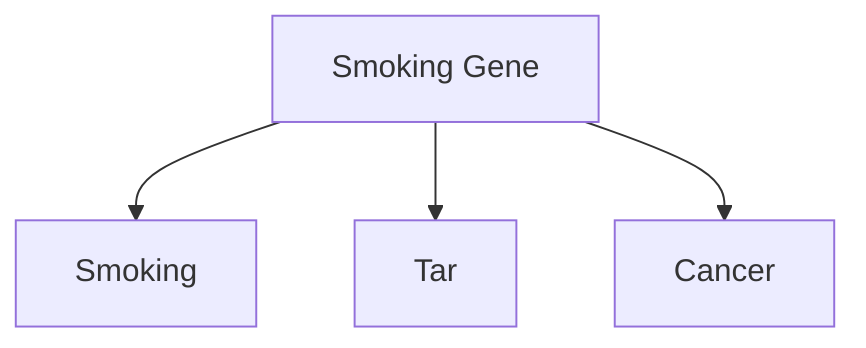

Suppose we are doing an observational study and have collected data on **Smoking**, **Tar**, and **Cancer** for each of the participants. Unfortunately, we cannot collect data on the **Smoking Gene** because we do not know whether such a gene exists. Lacking data on the confounding variable, we cannot block the back-door path **Smoking → Smoking Gene → Cancer**. Thus we cannot use back-door adjustment to control for the effect of the confounder.

So we must look for another way. Instead of going in the back door, we can go in the **front door**! In this case, the front door is the direct causal path **Smoking → Tar → Cancer**, for which we do have data on all three variables. Intuitively, the reasoning is as follows. First, we can estimate the average causal effect of **Smoking** on **Tar**, because there is no unblocked back-door path from **Smoking** to **Cancer**, as the **Smoking → Smoking Gene → Cancer ← Tar** path is already blocked by the collider at **Cancer**. Because it is blocked already, we don’t even need back-door adjustment. We can simply observe $P(\text{tar} \mid \text{smoking})$ and $P(\text{tar} \mid \text{no smoking})$, and the difference between them will be the average causal effect of **Smoking** on **Tar**.

Likewise, the diagram allows us to estimate the average causal effect of **Tar** on **Cancer**. To do this we can block the back-door path from **Tar** to **Cancer**, **Tar ← Smoking ← Smoking Gene → Cancer**, by adjusting for **Smoking**. Our lessons from Chapter 4 come in handy: we only need data on a sufficient set of deconfounders (i.e., **Smoking**). Then the back-door adjustment formula will give us $P(\text{cancer} \mid do(\text{tar}))$ and $P(\text{cancer} \mid do(\text{no tar}))$. The difference between these is the average causal effect of **Tar** on **Cancer**.

Now we know the average increase in the likelihood of tar deposits due to smoking and the average increase of cancer due to tar deposits. Can we combine these somehow to obtain the average increase in cancer due to smoking? Yes, we can. The reasoning goes as follows. Cancer can come about in two ways: in the presence of **Tar** or in the absence of **Tar**. If we force a person to smoke, then the probabilities of these two states are $P(\text{tar} \mid do(\text{smoking}))$ and $P(\text{no tar} \mid do(\text{no smoking}))$, respectively. If a **Tar** state evolves, the likelihood of causing **Cancer** is $P(\text{cancer} \mid do(\text{tar}))$. If, on the other hand, a **No-Tar** state evolves, then it would result in a **Cancer** likelihood of $P(\text{cancer} \mid do(\text{no tar}))$. We can weight the two scenarios by their respective probabilities under $do(\text{smoking})$ and in this way compute the total probability of cancer due to smoking. The same argument holds if we prevent a person from smoking, $do(\text{no smoking})$. The difference between the two gives us the average causal effect on cancer of smoking versus not smoking.

As I have just explained, we can estimate each of the do-probabilities discussed from the data. That is, we can write them mathematically in terms of probabilities that do not involve the do-operator. In this way, mathematics does for us what ten years of debate and congressional testimony could not: quantify the causal effect of smoking on cancer—provided our assumptions hold, of course.

The process I have just described, expressing $P(\text{cancer} \mid do(\text{smoking}))$ in terms of do-free probabilities, is called the **front-door adjustment**. It differs from the back-door adjustment in that we adjust for two variables (**Smoking** and **Tar**) instead of one, and these variables lie on the front-door path from **Smoking** to **Cancer** rather than the back-door path. For those readers who “speak mathematics,” I can’t resist showing you the formula (Equation 7.1), which cannot be found in ordinary statistics textbooks. Here $X$ stands for **Smoking**, $Y$ stands for **Cancer**, $Z$ stands for **Tar**, and $U$ (which is conspicuously absent from the formula) stands for the unobservable variable, the **Smoking Gene**.

$$
P(Y \mid do(X)) = \sum_{z} P(Z = z \mid X) \sum_{x} P(Y \mid X = x, Z = z) P(X = x) \tag{7.1}
$$

Readers with an appetite for mathematics might find it interesting to compare this to the formula for the back-door adjustment, which looks like Equation 7.2.

$$
P(Y \mid do(X)) = \sum_{z} P(Y \mid X, Z = z) P(Z = z) \tag{7.2}
$$

Even for readers who do not speak mathematics, we can make several interesting points about Equation 7.1. First and most important, you don’t see $U$ (the **Smoking Gene**) anywhere. This was the whole point. We have successfully deconfounded $U$ even without possessing any data on it. Any statistician of Fisher’s generation would have seen this as an utter miracle. Second, way back in the Introduction I talked about an **estimand** as a recipe for computing the quantity of interest in a query. Equations 7.1 and 7.2 are the most complicated and interesting estimands that I will show you in this book. The left-hand side represents the query “What is the effect of $X$ on $Y$?” The right-hand side is the estimand, a recipe for answering the query. Note that the estimand contains no *do*’s, only *see*’s, represented by the vertical bars, and this means it can be estimated from data.

At this point, I’m sure that some readers are wondering how close this fictional scenario is to reality. Could the smoking-cancer controversy have been resolved by one observational study and one causal diagram? If we assume that **Figure 7.1** accurately reflects the causal mechanism for cancer, the answer is absolutely yes. However, we now need to discuss whether our assumptions are valid in the real world.

David Freedman, a longtime friend and a Berkeley statistician, took me to task over this issue. He argued that the model in **Figure 7.1** is unrealistic in three ways. First, if there is a smoking gene, it might also affect how the body gets rid of foreign matter in the lungs, so that people with the gene are more vulnerable to the formation of tar deposits and people without it are more resistant. Therefore, he would draw an arrow from **Smoking Gene** to **Tar**, and in that case the front-door formula would be invalid.

Freedman also considered it unlikely that **Smoking** affects **Cancer** only through **Tar**. Certainly other mechanisms could be imagined; perhaps smoking produces chronic inflammation that leads to cancer. Finally, he said, tar deposits in a living person’s lungs cannot be measured with sufficient accuracy anyway—so an observational study such as the one I have proposed cannot be conducted in the real world.

I have no quarrel with Freedman’s criticism in


> FIGURE 7.2. The basic setup for the front-door criterion.

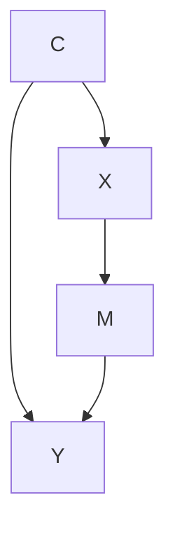

Glynn and Kashin did not draw a causal diagram，but from their description of the study，I would draw it as shown in Figure 7.3. The variable **Signed Up** records whether a person did or did not register for the program；the variable **Showed Up** records whether the enrollee did or did not actually use the services. Obviously the program can only affect earnings if the user actually shows up，so the absence of a direct arrow from Signed Up to Earnings is easy to justify.

Glynn and Kashin refrain from specifying the nature of the confounders，but I have summed them up as **Motivation**. Clearly，a person who is highly motivated to increase his or her earnings is more likely to sign up. That person is also more likely to earn more after eighteen months，regardless of whether he or she shows up. The goal of the study is，of course，to disentangle the effect of this confounding factor and find out just how much the services themselves are helping.


> FIGURE 7.3. Causal diagram for the JTPA Study.

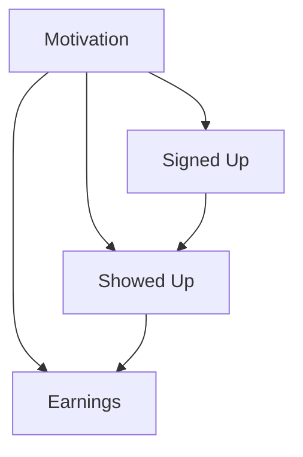

Comparing Figure 7.2 to Figure 7.3，we can see that the front-door criterion would apply if there were no arrow from Motivation to Showed Up，the “shielding” I mentioned earlier. In many cases we could justify the absence of that arrow. For example，if the services were only offered by appointment and people only missed their appointments because of chance events unrelated to Motivation（a bus strike，a sprained ankle，etc.），then we could erase that arrow and use the front-door criterion.

Under the actual circumstances of the study，where the services were available all the time，such an argument is hard to make. However—and this is where things get really interesting—Glynn and Kashin tested out the front-door criterion anyway. We might think of this as a sensitivity test. If we suspect that the middle arrow is weak，then the bias introduced by treating it as absent may be very small. Judging from their results，that was the case.

By making certain reasonable assumptions，Glynn and Kashin derived inequalities saying whether the adjustment was likely to be too high or too low and by how much. Finally，they compared the front-door predictions and back-door predictions to the results from the randomized controlled experiment that was run at the same time. The results were impressive. The estimates from the back-door criterion（controlling for known confounders like Age，Race，and Site）were wildly incorrect，differing from the experimental benchmarks by hundreds or thousands of dollars. This is exactly what you would expect to see if there is an unobserved confounder，such as Motivation. The back-door criterion cannot adjust for it.

On the other hand，the front-door estimates succeeded in removing almost all of the Motivation effect. For males，the front-door estimates were well within the experimental error of the randomized controlled trial，even with the small positive bias that Glynn and Kashin predicted. For females，the results were even better：The front-door estimates matched the experimental benchmark almost perfectly，with no apparent bias. Glynn and Kashin’s work gives both empirical and methodological proof that as long as the effect of C on M（in Figure 7.2）is weak，front-door adjustment can give a reasonably good estimate of the effect of X on Y. It is much better than not controlling for C.

Glynn and Kashin’s results show why the front-door adjustment is such a powerful tool：it allows us to control for confounders that we cannot observe（like Motivation），including those that we can’t even name. RCTs are considered the “gold standard” of causal effect estimation for exactly the same reason. Because front-door estimates do the same thing，with the additional virtue of observing people’s behavior in their own natural habitat instead of a laboratory，I would not be surprised if this method eventually becomes a serious competitor to randomized controlled trials.

## THE DO-CALCULUS, OR MIND OVER MATTER

In both the front- and back-door adjustment formulas, the ultimate goal is to calculate the effect of an intervention，$P(Y \mid do(X))$，in terms of data such as $P(Y \mid X, A, B, Z, \ldots)$ that do not involve a do-operator. If we are completely successful at eliminating the do’s，then we can use observational data to estimate the causal effect，allowing us to leap from rung one to rung two of the Ladder of Causation.

The fact that we were successful in these two cases (front- and backdoor) immediately raises the question of whether there are other doors through which we can eliminate all the do’s. Thinking more generally，we can ask whether there is some way to decide in advance if a given causal model lends itself to such an elimination procedure. If so，we can apply the procedure and find ourselves in possession of the causal effect，without having to lift a finger to intervene. Otherwise，we would at least know that the assumptions imbedded in the model are not sufficient to uncover the causal effect from observational data，and no matter how clever we are，there is no escape from running an interventional experiment of some kind.

The prospect of making these determinations by purely mathematical means should dazzle anybody who understands the cost and difficulty of running randomized controlled trials，even when they are physically feasible and legally permissible. The idea dazzled me，too，in the early 1990s，not as an experimenter but as a computer scientist and part-time philosopher. Surely one of the most exhilarating experiences you can have as a scientist is to sit at your desk and realize that you can finally figure out what is possible or impossible in the real world—especially if the problem is important to society and has baffled those who have tried to solve it before you. I imagine this is how Hipparchus of Nicaea felt when he discovered he could figure out the height of a pyramid from its shadow on the ground，without actually climbing the pyramid. It was a clear victory of mind over matter.

Indeed，the approach I took was very much inspired by the ancient Greeks (including Hipparchus) and their invention of a formal logical system for geometry. At the center of the Greeks’ logic，we find a set of axioms or self-evident truths，such as “Between any two points one can draw one and only one line.” With the help of those axioms，the Greeks could construct complex statements，called theorems，whose truth is far from evident. Take，for instance，the statement that the sum of the angles in a triangle is 180 degrees (or two right angles)，regardless of its size or shape. The truth of this statement is not self-evident by any means；yet the Pythagorean philosophers of the fifth century BC were able to prove its universal truth using those self-evident axioms as building blocks.

If you remember your high school geometry，even just the gist of it，you will recall that proofs of theorems invariably consist of auxiliary constructions: for example，drawing a line parallel to an edge of a triangle，marking certain angles as equal，drawing a circle with a given segment as its radius，and so on. These auxiliary constructions can be regarded as temporary mathematical sentences that make assertions (or claims) about properties of the figure drawn. Each new construction is licensed by the previous ones，as well as by the axioms of geometry and perhaps some already derived theorems. For example，drawing a line parallel to one edge of a triangle is licensed by Euclid’s fifth axiom，that it is possible to draw one and only one parallel to a given line from a point outside that line. The act of drawing any of these auxiliary constructions is just a mechanical “symbol manipulation” operation；it takes the sentence previously written (or picture previously drawn) and rewrites it in a new format，whenever the rewriting is licensed by the axioms. Euclid’s greatness was to identify a short list of five elementary axioms，from which all other true geometric statements can be derived.

Now let us return to our central question of when a model can replace an experiment，or when a “do” quantity can be reduced to a “see” quantity. Inspired by the ancient Greek geometers，we want to reduce the problem to symbol manipulation and in this way wrest causality from Mount Olympus and make it available to the average researcher.

First，let us rephrase the task of finding the effect of X on Y using the language of proofs，axioms，and auxiliary constructions，the language of Euclid and Pythagoras. We start with our target sentence，$P(Y \mid do(X))$. Our task will be complete if we can succeed in eliminating the do-operator from it，leaving only classical probability expressions，like $P(Y \mid X)$ or $P(Y \mid X, Z, W)$. We cannot，of course，manipulate our target expression at will；the operations must conform to what $do(X)$ means as a physical intervention. Thus，we must pass the expression through a sequence of legitimate manipulations，each licensed by the axioms and the assumptions of our model. The manipulations should preserve the meaning of the manipulated expression，only changing the format it is written in. An example of a “meaning preserving” transformation is the algebraic transformation that turns $y = a x + b$ into $a x = y - b$. The relationship between x and y remains intact；only the format changes.

We are already familiar with some “legitimate” transformations on do-expressions. For example，**Rule 1** says when we observe a variable W that is irrelevant to Y (possibly conditional on other variables Z)，then the probability distribution of Y will not change. For example，in Chapter 3 we saw that the variable Fire is irrelevant to Alarm once we know the state of the mediator (Smoke). This assertion of irrelevance translates into a symbolic manipulation:

$$
P(Y \mid do(X), Z, W) = P(Y \mid do(X), Z)
$$

The stated equation holds provided that the variable set Z blocks all the paths from W to Y after we have deleted all the arrows leading into X. In the example of Fire → Smoke → Alarm，we have W = Fire，Z = Smoke，$Y =$ Alarm，and Z blocks all the paths from W to Y. (In this case we do not have a variable X.)

Another legitimate transformation is familiar to us from our back-door discussion. We know that if a set Z of variables blocks all back-door paths from X to Y，then conditional on Z，$do(X)$ is equivalent to $see(X)$. We can，therefore，write

$$
P(Y \mid do(X), Z) = P(Y \mid X, Z)
$$

if Z satisfies the back-door criterion. We adopt this as **Rule 2** of our axiomatic system. While this is perhaps less self-evident than Rule 1，in the simplest cases it is Hans Reichenbach’s common-cause principle，amended so that we won’t mistake colliders for confounders. In other words，we are saying that after we have controlled for a sufficient deconfounding set，any remaining correlation is a genuine causal effect.

**Rule 3** is quite simple: it essentially says that we can remove $do(X)$ from $P(Y \mid do(X))$ in any case where there are no causal paths from X to Y. That is，

$$
P(Y \mid do(X)) = P(Y)
$$

# Markdown 排版优化结果

if there is no path from X to Y with only forward-directed arrows. We can paraphrase this rule is follows: if we do something that does not affect Y, then the probability distribution of Y will not change. Aside from being just as self-evident as Euclid’s axioms, Rules 1 to 3 can also be proven mathematically using our arrow-deleting definition of the do-operator and basic laws of probability.

Note that Rules 1 and 2 include conditional probabilities involving auxiliary variables Z other than X and Y. These variables can be thought of as a context in which the probability is being computed. Sometimes the presence of this context itself licenses the transformation. Rule 3 may also have auxiliary variables, but I omitted them for simplicity.

Note that each rule has a simple syntactic interpretation. Rule 1 permits the addition or deletion of observations. Rule 2 permits the replacement of an intervention with an observation, or vice versa. Rule 3 permits the deletion or addition of interventions. All of these permits are issued under appropriate conditions, which have to be verified in any particular case from the causal diagram.

We are ready now to demonstrate how Rules 1 to 3 allow us to transform one formula into another until, if we are smart, we obtain an expression to our liking. Although it’s a bit elaborate, I think that nothing can substitute for actually showing you how the front-door formula is derived using a successive application of the rules of do-calculus (Figure 7.4). You do not need to follow all the steps, but I am showing you the derivation to give you the flavor of do-calculus.

We begin the journey with a target expression $P(Y | do(X))$. We introduce auxiliary variables and transform the target expression into a do-free expression that coincides, of course, with the front-door adjustment formula. Each step of the argument gets its license from the causal diagram that relates $X$, $Y$, and the auxiliary variables or, in several cases, from subdiagrams that have had arrows erased to account for interventions. These licenses are displayed on the right-hand side.

I feel a special attachment to the do-calculus. With these three humble rules I was able to derive the front-door formula. This was the first causal effect estimated by means other than control for confounders. I believed no one could do this without the do-calculus, so I presented it as a challenge in a statistics seminar at Berkeley in 1993 and even offered a $100 prize to anyone who could solve it.

Paul Holland, who attended the seminar, wrote that he had assigned the problem as a class project and would send me the solution when ripe. (Colleagues tell me that he eventually presented a long solution at a conference in 1995, and I may owe him $100 if I could only find his proof.) Economists James Heckman and Rodrigo Pinto made the next attempt to prove the front-door formula using “standard tools” in 2015. They succeeded, albeit at the cost of eight pages of hard labor.


> **DO-CALCULUS AT WORK**  
> Figure 7.4. Derivation of the front-door adjustment formula from the rules of do-calculus.

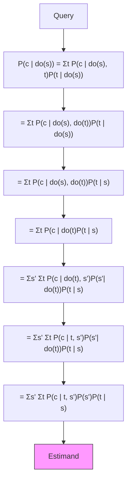

In a restaurant the evening before the talk, I had written the proof (very much like the one in Figure 7.4) on a napkin for David Freedman. He wrote me later to say that he had lost the napkin. He could not reconstruct the argument and asked if I had kept a copy. The next day, Jamie Robins wrote to me from Harvard, saying that he had heard about the “napkin problem” from Freedman, and he straightaway offered to fly to California to check the proof with me. I was thrilled to share with Robins the secrets of the do-calculus, and I believe that his trip to Los Angeles that year has been the key to his enthusiastic acceptance of causal diagrams. Through his and Sander Greenland’s influence, diagrams have become a second language for epidemiologists. This explains why I am so fond of the “napkin problem.”

The front-door adjustment formula was a delightful surprise and an indication that do-calculus had something important to offer. However, at this point I still wondered whether the three rules of do-calculus were enough. Was it possible that we had missed a fourth rule that would help us solve problems that are unsolvable with only three?

In 1994, when I first proposed the do-calculus, I selected these three rules because they were sufficient in any case that I knew of. I had no idea whether, like Ariadne’s thread, they would always lead me out of the maze, or I would someday encounter a maze of such fiendish complexity that I could not escape. Of course, I hoped for the best. I conjectured that whenever a causal effect is estimable from data, a sequence of steps using these three rules would eliminate the do-operator. But I could not prove it.

This type of problem has many precedents in mathematics and logic. The property is usually called “completeness” in mathematical logic; an axiom system that is complete has the property that the axioms suffice to derive every true statement in that language. Some very good axiom systems are incomplete: for instance, Philip Dawid’s axioms describing conditional independence in probability theory.

In this modern-day labyrinth tale, two groups of researchers played the role of Ariadne to my wandering Theseus: Yiming Huang and Marco Valtorta at the University of South Carolina and my own student, Ilya Shpitser, at the University of California, Los Angeles (UCLA). Both groups independently and simultaneously proved that Rules 1 to 3 suffice to get out of any do-labyrinth that has an exit. I am not sure whether the world was waiting breathlessly for their completeness result, because by then most researchers had become content with just using the front- and back-door criteria. Both teams were, however, recognized with best student paper awards at the **Uncertainty in Artificial Intelligence** conference in 2006.

I confess that I was the one waiting breathlessly for this result. It tells us that if we cannot find a way to estimate $P(Y \mid do(X))$ from Rules 1 to 3, then a solution does not exist. In that case, we know that there is no alternative to conducting a randomized controlled trial. It further tells us what additional assumptions or experiments might make the causal effect estimable.

Before declaring total victory, we should discuss one issue with the do-calculus. Like any other calculus, it enables the construction of a proof, but it does not help us find one. It is an excellent verifier of a solution but not such a good searcher for one. If you know the correct sequence of transformations, it is easy to demonstrate to others (who are familiar with Rules 1 to 3) that the do-operator can be eliminated. However, if you do not know the correct sequence, it is not easy to discover it, or even to determine whether one exists. Using the analogy with geometrical proofs, we need to decide which auxiliary construction to try next. A circle around point A? A line parallel to AB? The number of possibilities is limitless, and the axioms themselves provide no guidance about what to try next. My high school geometry teacher used to say that you need “mathematical eyeglasses.”

In mathematical logic, this is known as the “decision problem.” Many logical systems are plagued with intractable decision problems. For instance, given a pile of dominos of various sizes, we have no tractable way to decide if we can arrange them to fill a square of a given size. But once an arrangement is proposed, it takes no time at all to verify whether it constitutes a solution.

Luckily (again) for do-calculus, the decision problem turns out to be manageable. Ilya Shpitser, building on earlier work by one of my other students, Jin Tian, found an algorithm that decides if a solution exists in “polynomial time.” This is a somewhat technical term, but continuing our analogy with solving a maze, it means that we have a much more efficient way out of the labyrinth than hunting at random through all possible paths.

Shpitser’s algorithm for finding each and every causal effect does not eliminate the need for the do-calculus. In fact, we need it even more, and for several independent reasons. First, we need it in order to go beyond observational studies. Suppose that worst comes to worst, and our causal model does not permit estimation of the causal effect $P(Y \mid do(X))$ from observations alone. Perhaps we also cannot conduct a randomized experiment with random assignment of $X$. A clever researcher might ask whether we might estimate $P(Y \mid do(X))$ by randomizing some other variable, say $Z$, that is more accessible to control than $X$. For instance, if we want to assess the effect of cholesterol levels ($X$) on heart disease ($Y$), we might be able to manipulate the subjects’ diet ($Z$) instead of exercising direct control over the cholesterol levels in their blood.

We then ask if we can find such a surrogate $Z$ that will enable us to answer the causal question. In the world of do-calculus, the question is whether we can find a $Z$ such that we can transform $P(Y \mid do(X))$ into an expression in which the variable $Z$, but not $X$, is subjected to a do-operator. This is a completely different problem not covered by Shpitser’s algorithm. Luckily, it has a complete answer too, with a new algorithm discovered by Elias Bareinboim at my lab in 2012. Even more problems of this sort arise when we consider problems of transportability or external validity—assessing whether an experimental result will still be valid when transported to a different environment that may differ in several key ways from the one studied. This more ambitious set of questions touches on the heart of scientific methodology, for there is no science without generalization. Yet the question of generalization has been lingering for at least two centuries, without an iota of progress. The tools for producing a solution were simply not available. In 2015, Bareinboim and I presented a paper at the **National Academy of Sciences** that solves the problem, provided that you can express your assumptions about both environments with a causal diagram. In this case the rules of do-calculus provide a systematic method to determine whether causal effects found in the study environment can help us estimate effects in the intended target environment.

Yet another reason that the do-calculus remains important is transparency. As I wrote this chapter, Bareinboim (now a professor at Purdue) sent me a new puzzle: a diagram with just four observed variables, $X$, $Y$, $Z$, and $W$, and two unobservable variables, $U_1$, $U_2$ (see Figure 7.5). He challenged me to figure out if the effect of $X$ on $Y$ was estimable. There was no way to block the back-door paths and no front-door condition. I tried all my favorite shortcuts and my otherwise trustworthy intuitive arguments, both pro and con, and I couldn’t see how to do it. I could not find a way out of the maze. But as soon as Bareinboim whispered to me, “Try the do-calculus,” the answer came shining through like a baby’s smile. Every step was clear and meaningful. This is now the simplest model known to us in which the causal effect needs to be estimated by a method that goes beyond the front- and back-door adjustments.


> **FIGURE 7.5.** A new napkin problem?

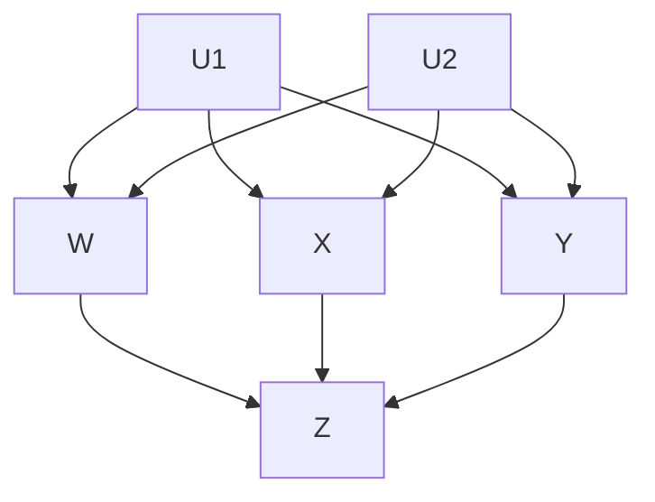

为了不让读者留下“do-演算仅适用于理论”的印象，同时也为了提供一份有趣的智力挑战，我将以一个实际问题来结束本节。该问题由两位著名统计学家 Nanny Wermuth 和 David Cox 提出，它展示了友好的耳语“试试 do-演算”如何帮助专家统计学家解决棘手的实际问题。

大约在 2005 年，Wermuth 和 Cox 对一个被称为“序贯决策”或“时变治疗”的问题产生了兴趣。这类问题在艾滋病治疗中很常见。通常情况下，治疗会持续一段时间，在每个时间段内，医生会根据患者的状况调整后续治疗的强度和剂量。另一方面，患者的状况又受到过去治疗的影响。于是，我们最终得到如图 7.6 所示的场景，其中包含两个时间段和两种治疗。第一次治疗是随机化的（X），第二次治疗（Z）则是对依赖于 X 的观察值（W）的响应。给定在这种治疗制度下收集的数据，Cox 和 Wermuth 的任务是预测 X 对结果 Y 的影响，假设他们希望将 Z 随时间保持恒定，而不依赖于观察值 W。


> **图 7.6：** Wermuth 和 Cox 的序贯治疗示例。

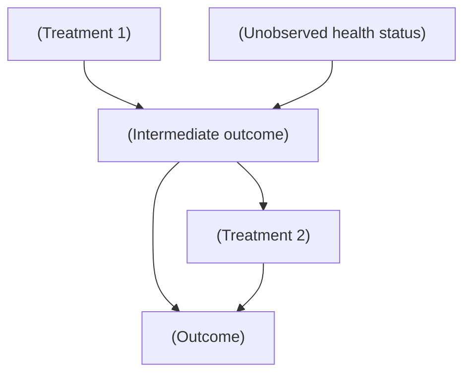

Jamie Robins 在 1994 年首次将时变治疗的问题引起我的注意，借助 do-演算，我们能够推导出一个通用解，该解涉及后门调整公式的序贯版本。Wermuth 和 Cox 不知道这种方法，他们将问题称为“间接混杂”，并发表了三篇关于其分析的论文（2008 年、2014 年和 2015 年）。由于无法一般性地解决该问题，他们求助于线性近似，即使在线性情况下，他们也发现难以处理，因为它无法通过标准回归方法解决。

幸运的是，当缪斯在我耳边低语“试试 do-演算”时，我注意到他们的难题可以在三行计算中解决。逻辑如下：我们的目标量是 $P( Y \mid do( X ), do( Z ) )$，而我们可以获得的数据形式是 $P(Y \mid do(X), Z, W)$ 和 $P(W \mid do(X))$。这些数据反映了这样一个事实：在我们所依据的研究中，Z 并非外部控制，而是通过某个（未知的）协议跟随 W。因此，我们的任务是将目标表达式转换为另一个表达式，以反映 do-算子仅应用于 X 而非 Z 的研究条件。恰巧，只需应用一次 do-演算的三条规则即可完成此转换。这个故事的寓意无非是对数学解决难题（偶尔会带来实际后果）之力量的深刻赞赏。

## THE TAPESTRY OF SCIENCE, OR THE HIDDEN PLAYERS IN THE DO-ORCHESTRA

I’ve already mentioned the role of some of my students in weaving this beautiful do-calculus tapestry. Like any tapestry, it gives a sense of completeness that may conceal how painstaking making it was and how many hands contributed to the process. In this case, it took more than twenty years and contributions from several students and colleagues.

The first was **Thomas Verma**, whom I met when he was a sixteen-year-old boy. His father brought him to my office one day and said, essentially, “Give him something to do.” He was too talented for any of his high school math teachers to keep him interested. What he eventually accomplished was truly amazing. Verma finally proved what became known as the **d-separation property** (i.e., the fact that you can use the rules of path blocking to determine which independencies should hold in the data). Astonishingly, he told me that he proved the d-separation property thinking it was a homework problem, not an unsolved conjecture! Sometimes it pays to be young and naive. You can still see his legacy in Rule 1 of the do-calculus and in any imprint that path blocking leaves on rung one of the Ladder of Causation.

The power of Verma’s proof would have remained only partially appreciated without a complementary result to show that it cannot be improved. That is, no other independencies are implied by a causal diagram except those revealed through path blocking. This step was completed by another student, **Dan Geiger**. He had switched to my research lab from another group at UCLA, after I promised to give him an “instant PhD” if he could prove two theorems. He did, and I did! He is now Dean of computer science at the Technion in Israel, my alma mater.

But Dan was not the only student I raided from another department. One day in 1997, as I was getting dressed in the locker room of the UCLA pool, I struck up a conversation with a Chinese fellow next to me. He was a PhD student in physics, and, as was my usual habit at the time, I tried to convince him to switch over to artificial intelligence, where the action was. He was not completely convinced, but the very next day I received an email from a friend of his, **Jin Tian**, saying that he would like to switch from physics to computer science and did I have a challenging summer project for him? Two days later, he was working in my lab.

Four years later, in April 2001, he stunned the world with a simple graphical criterion that generalizes the front door, the back door, and all doors we could think of at the time. I recall presenting Tian’s criterion at a Santa Fe conference. One by one, leaders in the research community stared at my poster and shook their heads in disbelief. How could such a simple criterion work for all diagrams?

Tian (now a professor at Iowa State University) came to our lab with a style of thinking that was foreign to us then, in the 1990s. Our conversations were always loaded with wild metaphors and half-baked conjectures. But Tian would never utter a word unless it was rigorous, proven, and baked five times over. The mixture of the two styles proved its merit. Tian’s method, called **c-decomposition**, enabled **Ilya Shpitser** to develop his complete algorithm for the do-calculus. The moral: never underestimate the power of a locker-room conversation!

Ilya Shpitser came in at the end of the ten-year battle to understand interventions. He arrived during a very difficult period, when I had to take time off to set up a foundation in honor of my son, Daniel, a victim of anti-Western terrorism. I have always expected my students to be self-reliant, but for my students at that time, this expectation was pushed to the extreme. They gave me the best of all possible gifts by putting the final but crucial touches on the tapestry of do-calculus, which I could not have done myself. In fact, I tried to discourage Ilya from trying to prove the completeness of do-calculus. Completeness proofs are notoriously difficult and are best avoided by any student who aims to finish his PhD on time. Luckily, Ilya did it behind my back.

Colleagues, too, exert a profound effect on your thinking at crucial moments. **Peter Spirtes**, a professor of philosophy at Carnegie-Mellon, preceded me in the network approach to causality, and his influence was pivotal. At a lecture of his in Uppsala, Sweden, I first learned that performing interventions could be thought of as deleting arrows from a causal diagram. Until then I had been laboring under the same burden as generations of statisticians, trying to think of causality in terms of only one diagram representing one static probability distribution.

The idea of arrow deletion was not entirely Spirtes’s, either. In 1960, two Swedish economists, **Robert Strotz** and **Herman Wold**, proposed essentially the same idea. In the world of economics at the time, diagrams were never used; instead, economists relied on structural equation models, which are Sewall Wright’s equations without the diagrams. Arrow deletion in a path diagram corresponds to deleting an equation from a structural equation model. So, in a rough sense, Strotz and Wold had the idea first, unless we want to go even further back in history: they were preceded by **Trygve Haavelmo** (a Norwegian economist and Nobel laureate), who in 1943 advocated equation modification to represent interventions.

Nevertheless, Spirtes’s translation of equation deletion into the world of causal diagrams unleashed an avalanche of new insights and new results. The **back-door criterion** was one of the first beneficiaries of the translation, while the do-calculus came second. The avalanche, however, is not yet over. Advances in such areas as counterfactuals, generalizability, missing data, and machine learning are still coming up.

If I were less modest, I would close here with Isaac Newton’s famous saying about “standing on the shoulders of giants.” But given who I am, I am tempted to quote from the Mishnah instead:

> “Harbe lamadeti mirabotai um’haverai yoter mehem, umitalmidai yoter mikulam”——that is, “I have learned much from my teachers, and more so from my colleagues, and most of all from my students” (Taanit 7a).

The do-operator and do-calculus would not exist as they do today without the contributions of Verma, Geiger, Tian, and Shpitser, among others.

## THE CURIOUS CASE(S) OF DR. SNOW

In 1853 and 1854, England was in the grips of a cholera epidemic. In that era, cholera was as terrifying as Ebola is today；a healthy person who drinks cholera-tainted water can die within twenty-four hours. We know today that cholera is caused by a bacterium that attacks the intestines. It spreads through the “rice water” diarrhea of its victims, who excrete this diarrhea in copious amounts before dying.

But in 1853, disease-causing germs had never yet been seen under a microscope for any illness, let alone cholera. The prevailing wisdom held that a “miasma” of unhealthy air caused cholera, a theory seemingly supported by the fact that the epidemic hit harder in the poorer sections of London, where sanitation was worse.

Dr. John Snow, a physician who had taken care of cholera victims for more than twenty years, was always skeptical of the miasma theory. He argued, sensibly, that since the symptoms manifested themselves in the intestinal tract, the body must first come into contact with the pathogen there. But because he couldn’t see the culprit, he had no way to prove this——until the epidemic of 1854.

The John Snow story has two chapters, one much more famous than the other. In what we could call the “Hollywood” version, he painstakingly goes from house to house, recording where victims of cholera died, and notices a cluster of dozens of victims near a pump in Broad Street. Talking with people who live in the area, he discovers that almost all the victims had drawn their water from that particular pump. He even learns of a fatal case that occurred far away, in Hampstead, to a woman who liked the taste of the water from the Broad Street pump. She and her niece drank the water from Broad Street and died, while no one else in her area even got sick. Putting all this evidence together, Snow asks the local authorities to remove the pump handle, and on September 8 they agree. As Snow’s biographer wrote, “The pump-handle was removed, and the plague was stayed.”

All of this makes a wonderful story. Nowadays a John Snow Society even reenacts the removal of the famous pump handle every year. Yet, in truth, the removal of the pump handle hardly made a dent in the citywide cholera epidemic, which went on to claim nearly 3,000 lives.

In the non-Hollywood chapter of the story, we again see Dr. Snow walking the streets of London, but this time his real object is to find out where Londoners get their water. There were two main water companies at the time: the Southwark and Vauxhall Company and the Lambeth Company. The key difference between the two, as Snow knew, was that the former drew its water from the area of the London Bridge, which was downstream from London’s sewers. The latter had moved its water intake several years earlier so that it would be upstream of the sewers. Thus, Southwark customers were getting water tainted by the excrement of cholera victims. Lambeth customers, on the other hand, were getting uncontaminated water. (None of this has anything to do with the contaminated Broad Street water, which came from a well.)

The death statistics bore out Snow’s grim hypothesis. Districts supplied by the Southwark and Vauxhall Company were especially hard-hit by cholera and had a death rate eight times higher. Even so, the evidence was merely circumstantial. A proponent of the miasma theory could argue that the miasma was strongest in those districts, and there would be no way to disprove it. In terms of a causal diagram, we have the situation diagrammed in Figure 7.7. We have no way to observe the confounder Miasma (or other confounders like Poverty), so we can’t control for it using back-door adjustment.

Here Snow had his most brilliant idea. He noticed that in those districts served by both companies, the death rate was still much higher in the households that received Southwark water. Yet these households did not differ in terms of miasma or poverty. “The mixing of the supply is of the most intimate kind,” Snow wrote. “The pipes of each Company go down all the streets, and into nearly all the courts and alleys.… Each company supplies both rich and poor, both large houses and small；there is no difference either in the condition or occupation of the persons receiving the water of the different Companies.” Even though the notion of an RCT was still in the future, it was very much as if the water companies had conducted a randomized experiment on Londoners. In fact, Snow even notes this: “No experiment could have been devised which would more thoroughly test the effect of water supply on the progress of cholera than this, which circumstances placed ready made before the observer. The experiment, too, was on the grandest scale. No fewer than three hundred thousand people of both sexes, of every age and occupation, and of every rank and station, from gentlefolks down to the very poor, were divided into two groups without their choice, and in most cases, without their knowledge.” One group had received pure water；the other had received water tainted with sewage.


> FIGURE 7.7. Causal diagram for cholera (before discovery of the cholera bacillus).

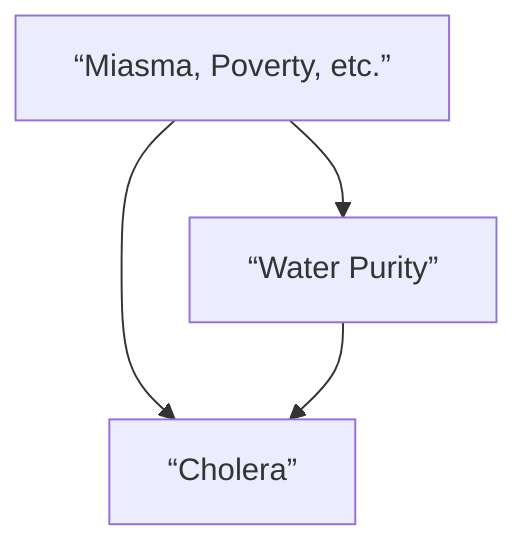

Snow’s observations introduced a new variable into the causal diagram, which now looks like Figure 7.8. Snow’s painstaking detective work had showed two important things: (1) there is no arrow between Miasma and Water Company (the two are independent), and (2) there is an arrow between Water Company and Water Purity. Left unstated by Snow, but equally important, is a third assumption: (3) the absence of a direct arrow from Water Company to Cholera, which is fairly obvious to us today because we know the water companies were not delivering cholera to their customers by some alternate route.


> FIGURE 7.8. Diagram for cholera after introduction of an instrumental variable.

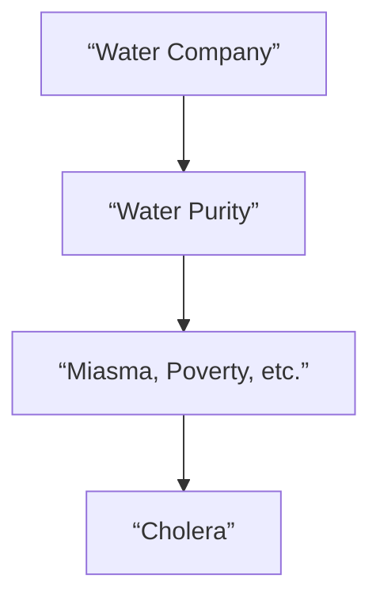

一个满足这三个属性的变量，如今被称为工具变量。显然，斯诺认为这个变量类似于一枚硬币的抛掷，它模拟了一个没有传入箭头的变量。由于自来水公司与霍乱之间不存在混杂因素，任何观察到的关联都必然是因果关系。同样，既然自来水公司对霍乱的影响必须通过水质纯度来传导，我们（和斯诺一样）可以得出结论：水质纯度与霍乱之间观察到的关联也必然是因果关系。斯诺以毫不含糊的措辞陈述了他的结论：如果南华克和沃克斯豪尔公司将其取水口向上游迁移，本可以挽救超过 1000 条生命。

当时很少有人注意到斯诺的结论。他自费印刷了一本关于这些结果的小册子，总共只卖出了 56 本。如今，流行病学家将这本小册子视为他们学科的开创性文献。它表明，通过“鞋履研究”（我从大卫·弗里德曼那里借用的一个短语）和因果推理，你可以追踪到一个杀手。

尽管瘴气理论现在已被否定，但贫困无疑是一个混杂因素，地理位置也是。但即使没有测量这些因素（因为斯诺的挨家挨户调查工作只进行到一定程度），我们仍然可以使用工具变量来确定通过净化供水可以挽救多少生命。

以下是这个技巧的原理。为简单起见，我们回到变量名称 $Z$、$X$、$Y$ 和 $U$，并将图 7.8 重新绘制为图 7.9。我加入了路径系数 $(a, b, c, d)$ 来表示因果效应的强度。这意味着我们假设变量是数值型的，且它们之间的函数关系是线性的。请记住，路径系数 $a$ 意味着将 $Z$ 增加一个标准单位的干预会导致 $X$ 增加 $a$ 个标准单位。（我将省略关于“标准单位”的技术细节。）


> 图 7.9. 工具变量的一般设置。

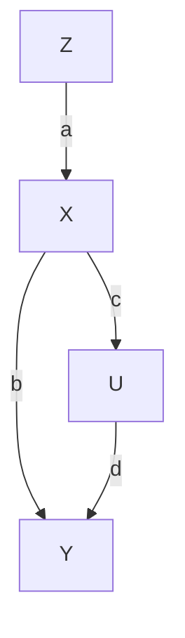

由于 $Z$ 和 $X$ 是无混杂的，$Z$ 对 $X$ 的因果效应（即 $a$）可以通过 $X$ 对 $Z$ 回归线的斜率 $r_{XZ}$ 来估计。同样，变量 $Z$ 和 $Y$ 也是无混杂的，因为路径 $Z \to X \leftarrow U \to Y$ 被 $X$ 处的对撞子阻断。因此，$Z$ 对 $Y$ 回归线的斜率 $(r_{ZY})$ 将等于直接路径 $Z \to X \to Y$ 上的因果效应，即路径系数的乘积：$ab$。因此，我们得到两个方程：$ab = r_{ZY}$ 和 $a = r_{ZX}$。如果将第一个方程除以第二个方程，我们得到 $X$ 对 $Y$ 的因果效应：$b = r_{ZY} / r_{ZX}$。

通过这种方式，工具变量使我们能够执行与前门调整相同的魔术：即使无法控制或收集关于混杂因素 $U$ 的数据，我们也找到了 $X$ 对 $Y$ 的效应。因此，我们可以向决策者提供一个决定性的论据，说明他们应该迁移供水——即使这些决策者仍然相信瘴气理论。还要注意，我们已经从第一层级的信息（相关性 $r_{ZY}$ 和 $r_{ZX}$）中获取了因果之梯第二层级的信息（$b$）。我们之所以能够做到这一点，是因为路径图所体现的假设本质上是因果性的，尤其是那个关键假设：$U$ 和 $Z$ 之间没有箭头。如果因果图不同——例如，如果 $Z$ 是 $X$ 和 $Y$ 的一个混杂因素——那么公式 $b = r_{ZY} / r_{ZX}$ 将无法正确估计 $X$ 对 $Y$ 的因果效应。事实上，无论数据有多大，这两种模型都无法通过任何统计方法区分开来。

工具变量在因果革命之前就已为人所知，但因果图为它们如何工作带来了新的清晰度。确实，斯诺是隐含地使用了工具变量，尽管他没有一个定量的公式。休厄尔·赖特当然理解路径图的这种用途；公式 $b = r_{ZY} / r_{ZX}$ 可以直接从他的路径系数方法中推导出来。而除休厄尔·赖特之外，第一个有意识地使用工具变量的人似乎是……休厄尔·赖特的父亲，菲利普！

回想一下，菲利普·赖特是一位经济学家，曾在后来成为布鲁金斯学会的机构工作。他感兴趣的是预测，如果征收关税（这会提高价格，从而在理论上鼓励生产），一种商品的产出将如何变化。用经济学术语来说，他想知道供给弹性。1928 年，赖特写了一本长篇专著，专门计算亚麻籽油的供给弹性。在一个引人注目的附录中，他使用路径图分析了这个问题。这是一个勇敢的举动：请记住，在此之前，从未有经济学家见过或听说过这种东西。（事实上，他两面下注，并用更传统的方法验证了他的计算。）

图 7.10 显示的是赖特图表的一个略微简化的版本。与本书中的大多数图表不同，这个图有“双向”箭头，但我恳请读者不要为此过于纠结。通过一些数学技巧，我们同样可以用一个箭头“需求 ← 价格 → 供给”来替换“需求—价格—供给”链，那么该图看起来就会像图 7.9（尽管对经济学家来说可能不太容易接受）。需要注意的重要一点是，菲利普·赖特特意引入了变量“每英亩产量”（亚麻籽）作为工具，它直接影响供给，但与需求无关。然后，他使用了我刚才给出的分析来推断供给对价格的影响以及价格对供给的影响。


> 图 7.10. 赖特的供给—价格因果图的简化版本。

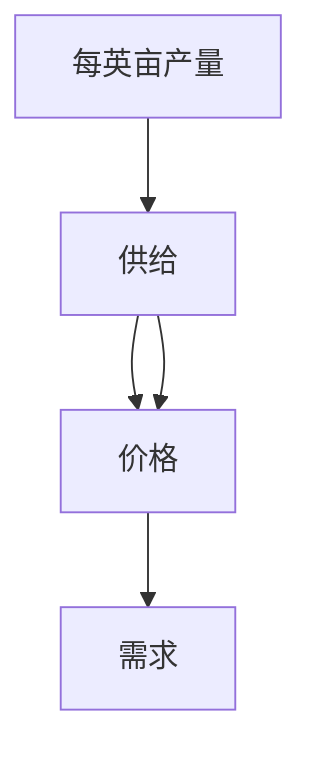

历史学家们对于谁发明了工具变量（一种在现代计量经济学中变得极其流行的方法）争论不休。我毫不怀疑菲利普·赖特是从他儿子那里借用了路径系数的概念。在此之前，没有经济学家坚持区分因果系数和回归系数；他们都属于卡尔·皮尔逊—亨利·奈尔斯阵营，认为因果关系不过是相关关系的一种极限情况。此外，在休厄尔·赖特之前，从未有人给出过根据路径系数计算回归系数，然后再逆向操作从回归系数得到因果系数的公式。这是休厄尔独有的发明。

当然，一些经济史学家曾暗示，整个数学附录是休厄尔自己写的。然而，文体计量分析表明，菲利普确实是作者。对我来说，这种历史侦探工作让这个故事更加美妙。它表明菲利普不辞辛劳地理解了他儿子的理论，并用他自己的语言将其阐述出来。

现在，让我们从 19 世纪 50 年代和 20 世纪 20 年代向前迈进，来看一个当代工具变量应用的例子，这只是我本可以选择的数十个例子中的一个。

# GOOD AND BAD CHOLESTEROL

Do you remember when your family doctor first started talking to you about “good” and “bad” cholesterol？It may have happened in the 1990s，when drugs that lowered blood levels of “bad” cholesterol，low-density lipoprotein （LDL），first came on the market. These drugs，called statins，have turned into multibillion-dollar revenue generators for pharmaceutical companies.

The first cholesterol-modifying drug subjected to a randomized controlled trial was cholestyramine. The Coronary Primary Prevention Trial，begun in 1973 and concluded in 1984，showed a 12.6 percent reduction in cholesterol among men given the drug cholestyramine and a 19 percent reduction in the risk of heart attack.

Because this was a randomized controlled trial，you might think we wouldn’t need any of the methods in this chapter，because they are specifically designed to replace RCTs in situations where you only have observational data. But that is not true. This trial，like many RCTs，faced the problem of noncompliance，when subjects randomized to receive a drug don’t actually take it. This will reduce the apparent effectiveness of the drug，so we may want to adjust the results to account for the noncompliers. But as always，confounding rears its ugly head. If the noncompliers are different from the compliers in some relevant way （maybe they are sicker to start with？），we cannot predict how they would have responded had they adhered to instructions.

In this situation，we have a causal diagram that looks like Figure 7.11. The variable Assigned （Z） will take the value 1 if the patient is randomly assigned to receive the drug and 0 if he is randomly assigned a placebo. The variable Received will be 1 if the patient actually took the drug and 0 otherwise. For convenience，we’ll also use a binary definition for Cholesterol，recording an outcome of 1 if the cholesterol levels were reduced by a certain fixed amount.


> **FIGURE 7.11.** Causal diagram for an RCT with noncompliance.

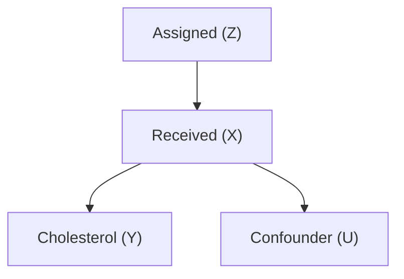

Notice that in this case our variables are binary，not numerical. This means right away that we cannot use a linear model，and therefore we cannot apply the instrumental variables formula that we derived earlier. However，in such cases we can often replace the linearity assumption with a weaker condition called monotonicity，which I’ll explain below.

But before we do that，let’s make sure our other necessary assumptions for instrumental variables are valid. First，is the instrumental variable Z independent of the confounder？The randomization of Z ensures that the answer is yes. （As we saw in Chapter 4，randomization is a great way to make sure that a variable isn’t affected by any confounders.） Is there any direct path from $Z$ to Y？Common sense says that there is no way that receiving a particular random number （Z） would affect cholesterol （Y），so the answer is no. Finally，is there a strong association between Z and X？This time the data themselves should be consulted，and the answer again is yes. We must always ask the above three questions before we apply instrumental variables. Here the answers are obvious，but we should not be blind to the fact that we are using causal intuition to answer them，intuition that is captured，preserved，and elucidated in the diagram.

Table 7.1 shows the observed frequencies of outcomes X and Y. For example，91.9 percent of the people who were not assigned the drug had the outcome $X = 0$ （didn’t take drug） and Y = 0 （no reduction in cholesterol）. This makes sense. The other 8.1 percent had the outcome $X = 0$ （didn’t take drug） and Y = 1 （did have a reduction in cholesterol）. Evidently they improved for other reasons than taking the drug. Notice also that there are two zeros in the table：there was nobody who was not assigned the drug （Z = 0） but nevertheless procured some （X = 1）. In a well-run randomized study，especially in the medical field where the physicians have exclusive access to the experimental drug，this will typically be true. The assumption that there are no individuals with Z = 0 and X = 1 is called **monotonicity**.

**TABLE 7.1. Data from cholestyramine trial.**

| Outcome | Not Assigned Drug （Z = 0） | Assigned Drug （Z = 1） |
| :--- | :---: | :---: |
| X = 0，Y = 0 | 0.919 | 0.315 |
| X = 1，Y = 0 | 0.000 | 0.139 |
| X = 0，Y = 1 | 0.081 | 0.073 |
| X = 1，Y = 1 | 0.000 | 0.473 |

Now let’s see how we can estimate the effect of the treatment. First let’s take the worst-case scenario: none of the noncompliers would have improved if they had complied with treatment. In that case, the only people who would have taken the drug and improved would be the 47.3 percent who actually did comply and improve. But we need to correct this estimate for the placebo effect, which is in the third row of the table. Out of the people who were assigned the placebo and took the placebo, 8.1 percent improved. So the net improvement above and beyond the placebo effect is 47.3 percent minus 8.1 percent, or 39.2 percent.

What about the best-case scenario, in which all the noncompliers would have improved if they had complied? In this case we add the noncompliers’ 31.5 percent plus 7.3 percent to the 39.2 percent baseline we just computed, for a total of 78.0 percent.

Thus, even in the worst-case scenario, where the confounding goes completely against the drug, we can still say that the drug improves cholesterol for **39 percent** of the population. In the best-case scenario, where the confounding works completely in favor of the drug, **78 percent** of the population would see an improvement. Even though the bounds are quite far apart, due to the large number of noncompliers, the researcher can categorically state that the drug is effective for its intended purpose.

This strategy of taking the worst case and then the best case will usually give us a range of estimates. Obviously it would be nice to have a point estimate, as we did in the linear case. There are ways to narrow the range if necessary, and in some cases it is even possible to get point estimates. For example, if you are interested only in the complying subpopulation (those people who will take $X$ if and only if assigned), you can derive a point estimate known as the **Local Average Treatment Effect (LATE)** . In any event, I hope this example shows that our hands are not tied when we leave the world of linear models.

Instrumental variable methods have continued to develop since 1984, and one particular version has become extremely popular: **Mendelian randomization**. Here’s an example. Although the effect of LDL, or “bad,” cholesterol is now settled, there is still considerable uncertainty about high-density lipoprotein (HDL), or “good,” cholesterol. Early observational studies, such as the Framingham Heart Study in the late 1970s, suggested that HDL had a protective effect against heart attacks. But high HDL often goes hand in hand with low LDL, so how can we tell which lipid is the true causal factor?

To answer this question, suppose we knew of a gene that caused people to have higher HDL levels, with no effect on LDL. Then we could set up the causal diagram in Figure 7.12, where I have used *Lifestyle* as a possible confounder. Remember that it is always advantageous, as in Snow’s example, to use an instrumental variable that is randomized. If it’s randomized, no causal arrows point toward it. For this reason, a gene is a perfect instrumental variable. Our genes are randomized at the time of conception, so it’s just as if Gregor Mendel himself had reached down from heaven and assigned some people a high-risk gene and others a low-risk gene. That’s the reason for the term “Mendelian randomization.”

Could there be an arrow going the other way, from HDL Gene to Lifestyle? Here we again need to do “shoe-leather work” and think causally. The HDL gene could only affect people’s lifestyle if they knew which version they had, the high-HDL version or the low-HDL one. But until 2008 no such genes were known, and even today, people do not routinely have access to this information. So it’s highly likely that no such arrow exists.


> **Figure 7.12.** Causal diagram for Mendelian randomization example.

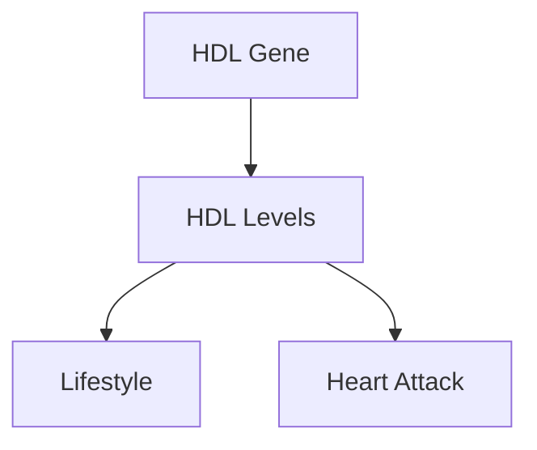

At least two studies have taken this Mendelian randomization approach to the cholesterol question. In 2012, a giant collaborative study led by Sekar Kathiresan of Massachusetts General Hospital showed that there was no observable benefit from higher HDL levels. On the other hand, the researchers found that LDL has a very large effect on heart attack risk. According to their figures, decreasing your LDL count by 34 mg/dl would reduce your chances of a heart attack by about **50 percent**. So lowering your “bad” cholesterol levels, whether by diet or exercise or statins, seems to be a smart idea. On the other hand, increasing your “good” cholesterol levels, despite what some fish-oil salesmen might tell you, does not seem likely to change your heart attack risk at all.

As always, there is a caveat. The second study, published in the same year, pointed out that people with the lower-risk variant of the LDL gene have had lower cholesterol levels for their entire lives. Mendelian randomization tells us that decreasing your LDL by thirty-four units over your entire lifetime will decrease your heart attack risk by 50 percent. But statins can’t lower your LDL cholesterol over your entire lifetime—only from the day you start taking the drug. If you’re sixty years old, your arteries have already sustained sixty years of damage. For that reason it’s very likely that Mendelian randomization **overestimates** the true benefits of statins. On the other hand, starting to reduce your cholesterol when you’re young—whether through diet or exercise or even statins—will have big effects later.

From the point of view of causal analysis, this teaches us a good lesson: in any study of interventions, we need to ask whether the variable we’re actually manipulating (lifetime LDL levels) is the same as the variable we think we are manipulating (current LDL levels). This is part of the “skillful interrogation of nature.”

To sum up, instrumental variables are an important tool in that they help us uncover causal information that goes beyond the do-calculus. The latter insists on point estimates rather than inequalities and would give up on cases like Figure 7.12, in which all we can get are inequalities. On the other hand, it’s also important to realize that the do-calculus is vastly more flexible than instrumental variables. In do-calculus we make no assumptions whatsoever regarding the nature of the functions in the causal model. But if we can justify an assumption like monotonicity or linearity on scientific grounds, then a more special-purpose tool like instrumental variables is worth considering.

Instrumental variable methods can be extended beyond simple four-variable models like Figure 7.9 (or 7.11 or 7.12), but it is not possible to go very far without guidance from causal diagrams. For example, in some cases an imperfect instrument (e.g., one that is not independent of the confounder) can be used after conditioning on a cleverly chosen set of auxiliary variables, which block the paths between the instrument and the confounder. My former student Carlos Brito, now a professor at the Federal University of Ceará, Brazil, fully developed this idea of turning noninstrumental variables into instrumental variables.

In addition, Brito studied many cases where a set of variables can be used successfully as an instrument. Although the identification of instrumental sets goes beyond do-calculus, it still uses the tools of causal diagrams. For researchers who understand this language, the possible research designs are rich and varied; they need not feel constrained to use only the four-variable model shown in Figures 7.9, 7.11, and 7.12. The possibilities are limited only by our imaginations.


> M. HAREL  
> “And sorry I could not travel both  
> And be one traveler, long I stood…”  
>  
> Robert Frost’s famous lines show a poet’s acute insight into counterfactuals. We cannot travel both roads, and yet our brains are equipped to judge what would have happened if we had taken the other path. Armed with this judgment, Frost ends the poem pleased with his choice, realizing that it “made all the difference.”  
> *(Source: Drawing by Maayan Harel.)*

# 8

## 8.1 引言

在前面的章节中，我们介绍了线性回归、逻辑回归等模型，它们都属于**参数化模型**（parametric models）。参数化模型的特点是：先假设数据服从某种特定的分布形式（如线性关系），然后通过学习得到一组有限的参数（例如线性回归中的权重 $w$ 和偏置 $b$）。这类模型的复杂度是固定的，与训练数据量无关。

然而，现实世界中的数据往往非常复杂，很难用简单的参数形式来精确描述。例如，预测房价时，房屋的面积、位置、房龄等因素与最终价格之间可能存在高度非线性的关系。如果强行使用线性模型，可能会导致**欠拟合**（underfitting），即模型无法捕捉数据中的内在规律。

为了解决这个问题，我们可以考虑**非参数化模型**（non-parametric models）。非参数模型并不对数据的分布形式做强烈的假设，其模型的复杂度会随着训练数据量的增加而增长，从而具有更大的灵活性。本章将介绍一种经典的非参数化方法：**k 近邻**（k-Nearest Neighbors，简称 kNN）。

> **行间批注**：非参数模型并不意味着没有参数，而是指参数的个数不是固定的，会随着数据量的变化而变化。

## 8.2 k 近邻算法原理

k 近邻算法的核心思想非常简单直观：**“物以类聚，人以群分”**。对于一个待预测的样本点，算法会在训练数据集中寻找与它“最相似”的 $k$ 个样本（即最近邻），然后根据这 $k$ 个样本的标签来进行决策。

- **分类任务**：采用“投票法”，即 $k$ 个邻居中出现次数最多的类别作为预测结果。
- **回归任务**：采用“平均法”，即 $k$ 个邻居的标签值的平均值作为预测结果。

> **行间批注**：当 $k=1$ 时，算法退化为最近邻算法，预测结果完全取决于距离最近的那一个样本。

### 8.2.1 距离度量

要定义“最近”，首先需要一种度量样本之间距离的方法。最常用的距离度量是**欧氏距离**（Euclidean distance）。对于两个 $n$ 维向量 $\mathbf{x}_i = (x_i^{(1)}, x_i^{(2)}, \dots, x_i^{(n)})$ 和 $\mathbf{x}_j = (x_j^{(1)}, x_j^{(2)}, \dots, x_j^{(n)})$，其欧氏距离定义为：

$$
d(\mathbf{x}_i, \mathbf{x}_j) = \sqrt{\sum_{l=1}^{n} (x_i^{(l)} - x_j^{(l)})^2}
$$

除了欧氏距离，还有其他常用的距离度量，例如：

- **曼哈顿距离**（Manhattan distance）：
  $$
  d(\mathbf{x}_i, \mathbf{x}_j) = \sum_{l=1}^{n} \vert x_i^{(l)} - x_j^{(l)} \vert
  $$

- **闵可夫斯基距离**（Minkowski distance）：
  $$
  d(\mathbf{x}_i, \mathbf{x}_j) = \left( \sum_{l=1}^{n} \vert x_i^{(l)} - x_j^{(l)} \vert^p \right)^{\frac{1}{p}}
  $$
  当 $p=2$ 时即为欧氏距离，当 $p=1$ 时即为曼哈顿距离。

> **行间批注**：当特征具有不同的量纲（如身高和体重）时，通常需要对特征进行**标准化**（Standardization）或**归一化**（Normalization），否则量级较大的特征会主导距离计算。

### 8.2.2 k 值的选择

$k$ 值是 kNN 算法中最重要的超参数，它对模型的性能有显著影响。

- **较小的 $k$ 值**：意味着模型只用很少的邻居来做决策。这会使模型对噪声非常敏感，容易产生**过拟合**（overfitting），即模型在训练集上表现很好，但在测试集上表现很差。
- **较大的 $k$ 值**：意味着模型会考虑更多的邻居，这可以平滑噪声的影响，使模型更加稳健。但如果 $k$ 值过大，以至于包含了过多距离较远的样本，模型可能会变得过于简单，导致**欠拟合**。

> **行间批注**：在实际应用中，通常通过**交叉验证**（Cross-validation）来选择合适的 $k$ 值。

### 8.2.3 算法步骤

k 近邻算法的执行流程可以概括为以下步骤：

1.  计算待预测样本与训练集中所有样本的距离。
2.  根据距离大小，对所有训练样本进行升序排序。
3.  选取距离最小的 $k$ 个样本（即 $k$ 个最近邻）。
4.  对于分类任务，统计 $k$ 个邻居的类别，返回出现次数最多的类别；
    对于回归任务，计算 $k$ 个邻居标签值的平均值，并返回该值。

> **行间批注**：上述步骤是“暴力计算”版本，当数据集很大时，计算所有距离的代价非常高。实际中常使用**KD 树**（K-Dimensional Tree）或**球树**（Ball Tree）等数据结构来加速最近邻搜索。

## 8.3 实例分析：鸢尾花分类

我们以经典的鸢尾花（Iris）数据集为例，演示 kNN 算法在分类任务中的应用。

### 8.3.1 数据集简介

鸢尾花数据集包含 150 个样本，每个样本有 4 个特征：花萼长度（Sepal Length）、花萼宽度（Sepal Width）、花瓣长度（Petal Length）和花瓣宽度（Petal Width）。目标变量是鸢尾花的品种，共有 3 个类别：Setosa、Versicolour 和 Virginica。

| 特征名称 | 描述 | 数据类型 |
| :--- | :--- | :--- |
| Sepal Length | 花萼长度（cm） | 浮点数 |
| Sepal Width | 花萼宽度（cm） | 浮点数 |
| Petal Length | 花瓣长度（cm） | 浮点数 |
| Petal Width | 花瓣宽度（cm） | 浮点数 |
| Species | 鸢尾花品种 | 字符串（三类） |

### 8.3.2 使用 Python 实现

下面我们使用 `scikit-learn` 库来实现 kNN 分类。

```python
# 导入必要的库
from sklearn.datasets import load_iris
from sklearn.model_selection import train_test_split
from sklearn.preprocessing import StandardScaler
from sklearn.neighbors import KNeighborsClassifier
from sklearn.metrics import accuracy_score

# 1. 加载数据
iris = load_iris()
X = iris.data  # 特征矩阵
y = iris.target  # 目标标签

# 2. 划分训练集和测试集
X_train, X_test, y_train, y_test = train_test_split(
    X, y, test_size=0.2, random_state=42
)

# 3. 特征标准化（重要！）
scaler = StandardScaler()
X_train = scaler.fit_transform(X_train)
X_test = scaler.transform(X_test)

# 4. 创建 kNN 分类器（设置 k=3）
knn = KNeighborsClassifier(n_neighbors=3)

# 5. 训练模型
knn.fit(X_train, y_train)

# 6. 预测并评估
y_pred = knn.predict(X_test)
accuracy = accuracy_score(y_test, y_pred)
print(f"模型在测试集上的准确率为：{accuracy:.2f}")
```

> **行间批注**：代码中使用了 `StandardScaler` 对特征进行了标准化，这是使用距离度量模型（如 kNN、SVM）时的常见预处理步骤。

## 8.4 k 近邻的优缺点

### 8.4.1 优点

- **原理简单，易于理解和实现**：kNN 算法没有显式的训练过程，是一种“懒惰学习”（Lazy Learning）算法。
- **无需假设数据分布**：可以处理复杂的非线性决策边界。
- **对异常值不敏感**：由于是基于多个邻居进行决策，单个异常值的影响有限。

### 8.4.2 缺点

- **计算复杂度高**：预测时需要计算与所有训练样本的距离，当训练集很大时，预测速度会很慢。
- **对特征尺度敏感**：必须进行特征标准化或归一化。
- **维度灾难**（Curse of Dimensionality）：当特征维度很高时，样本之间的距离会变得非常稀疏，导致“最近邻”失去意义。
- **需要大量存储空间**：必须存储全部训练数据。

> **行间批注**：**维度灾难**是指随着特征维度的增加，数据在空间中变得稀疏，导致距离度量失效的现象。在高维空间中，几乎所有样本之间的距离都趋于相等，这使得 kNN 算法难以发挥作用。

## 8.5 总结

本章介绍了 k 近邻（kNN）算法，这是一种简单而强大的非参数化方法。它的核心思想是基于“邻居”的标签进行预测，并通过参数 $k$ 来控制