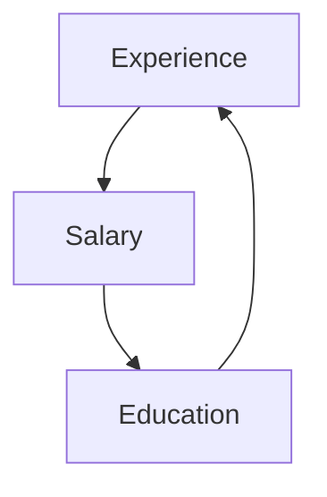
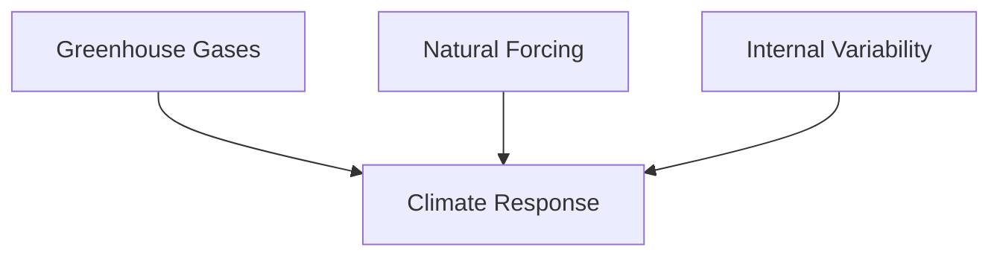

# COUNTERFACTUALS: MINING WORLDS THAT COULD HAVE BEEN

> Had Cleopatra’s nose been shorter, the whole face of the world would have changed.  
> —BLAISE PASCAL (1669)

As we prepare to move up to the top rung of the Ladder of Causation, let’s recapitulate what we have learned from the second rung. We have seen several ways to ascertain the effect of an intervention in various settings and under a variety of conditions. In Chapter 4, we discussed randomized controlled trials, the widely cited “gold standard” for medical trials. We have also seen methods that are suitable for observational studies, in which the treatment and control groups are not assigned at random.

If we can measure variables that block all the back-door paths, we can use the backdoor adjustment formula to obtain the needed effect. If we can find a frontdoor path that is “shielded” from confounders, we can use front-door adjustment. If we are willing to live with the assumption of linearity or monotonicity, we can use instrumental variables (assuming that an appropriate variable can be found in the diagram or created by an experiment). And truly adventurous researchers can plot other routes to the top of Mount Intervention using the do-calculus or its algorithmic version.

In all these endeavors, we have dealt with effects on a population or a typical individual selected from a study population (the average causal effect). But so far we are missing the ability to talk about personalized causation at the level of particular events or individuals. It’s one thing to say, “Smoking causes cancer,” but another to say that my uncle Joe, who smoked a pack a day for thirty years, would have been alive had he not smoked. The difference is both obvious and profound: none of the people who, like Uncle Joe, smoked for thirty years and died can ever be observed in the alternate world where they did not smoke for thirty years.

**Responsibility and blame, regret and credit**: these concepts are the currency of a causal mind. To make any sense of them, we must be able to compare what did happen with what *would have happened* under some alternative hypothesis. As argued in Chapter 1, our ability to conceive of alternative, nonexistent worlds separated us from our protohuman ancestors and indeed from any other creature on the planet. Every other creature can see what *is*. Our gift, which may sometimes be a curse, is that we can see what *might have been*.

This chapter shows how to use observational and experimental data to extract information about counterfactual scenarios. It explains how to represent individual-level causes in the context of a causal diagram, a task that will force us to explain some nuts and bolts of causal diagrams that we have not talked about yet. I also discuss a highly related concept called “potential outcomes,” or the Neyman-Rubin causal model, initially proposed in the 1920s by Jerzy Neyman, a Polish statistician who later became a professor at Berkeley. But only after Donald Rubin began writing about potential outcomes in the mid-1970s did this approach to causal analysis really begin to flourish.

I will show how counterfactuals emerge naturally in the framework developed over the last several chapters—Sewall Wright’s path diagrams and their extension to structural causal models (SCMs). We got a good taste of this in Chapter 1, in the example of the firing squad, which showed how to answer counterfactual questions such as “Would the prisoner be alive if rifleman A had not shot?” I will compare how counterfactuals are defined in the Neyman-Rubin paradigm and in SCMs, where they enjoy the benefit of causal diagrams. Rubin has steadfastly maintained over the years that diagrams serve no useful purpose. So we will examine how students of the Rubin causal model must navigate causal problems blindfolded, lacking a facility to represent causal knowledge or to derive its testable implications.

Finally, we will look at two applications where counterfactual reasoning is essential. For decades or even centuries, lawyers have used a relatively straightforward test of a defendant’s culpability called “but-for causation”: the injury would not have occurred *but for* the defendant’s action. We will see how the language of counterfactuals can capture this elusive notion and how to estimate the probability that a defendant is culpable.

Next, I will discuss the application of counterfactuals to climate change. Until recently, climate scientists have found it very difficult and awkward to answer questions like “Did global warming cause this storm [or this heat wave, or this drought]?” The conventional answer has been that individual weather events cannot be attributed to global climate change. Yet this answer seems rather evasive and may even contribute to public indifference about climate change.

Counterfactual analysis allows climate scientists to make much more precise and definite statements than before. It requires, however, a slight addition to our everyday vocabulary. It will be helpful to distinguish three different kinds of causation: **necessary causation**, **sufficient causation**, and **necessary-and-sufficient causation**. (Necessary causation is the same as but-for causation.) Using these words, a climate scientist can say, “There is a 90 percent probability that man-made climate change was a necessary cause of this heat wave,” or “There is an 80 percent probability that climate change will be sufficient to produce a heat wave this strong at least once every 50 years.” The first sentence has to do with attribution: Who was responsible for the unusual heat? The second has to do with policy. It says that we had better prepare for such heat waves because they are likely to occur sooner or later. Either of these statements is more informative than shrugging our shoulders and saying nothing about the causes of individual weather events.

## FROM THUCYDIDES AND ABRAHAM TO HUME AND

## LEWIS

Given that counterfactual reasoning is part of the mental apparatus that makes us human, it is not surprising that we can find counterfactual statements as far back as we want to go in human history. For example, in Thucydides’s *History of the Peloponnesian War*, the ancient Greek historian, often described as the pioneer of a “scientific” approach to history, describes a tsunami that occurred in 426 BC:

> About the same time that these earthquakes were so common, the sea at Orobiae, in Euboea, retiring from the then line of coast, returned in a huge wave and invaded a great part of the town, and retreated leaving some of it still under water; so that what was once land is now sea; such of the inhabitants perishing as could not run up to the higher ground in time.… The cause, in my opinion, of this phenomenon must be sought in the earthquake. At the point where its shock has been the most violent the sea is driven back, and suddenly recoiling with redoubled force, causes the inundation. Without an earthquake I do not see how such an accident could happen.

This is a truly remarkable passage when you consider the era in which it was written. First, the precision of Thucydides’s observations would do credit to any modern scientist, and all the more so because he was working in an era when there were no satellites, no video cameras, no 24/7 news organizations broadcasting images of the disaster as it unfolded. Second, he was writing at a time in human history when natural disasters were ordinarily ascribed to the will of the gods. His predecessor Homer or his contemporary Herodotus would undoubtedly have attributed this event to the wrath of Poseidon or some other deity. Yet Thucydides proposes a causal model without any supernatural processes: the earthquake drives back the sea, which recoils and inundates the land. The last sentence of the quote is especially interesting because it expresses the notion of necessary or but-for causation: but for the earthquake, the tsunami could not have occurred. This counterfactual judgment promotes the earthquake from a mere antecedent of the tsunami to an actual cause.

Another fascinating and revealing instance of counterfactual reasoning occurs in the book of Genesis in the Bible. Abraham is talking with God about the latter’s intention to destroy the cities of Sodom and Gomorrah as retribution for their evil ways.

> And Abraham drew near, and said, Wilt thou really destroy the righteous with the wicked? Suppose there be fifty righteous within the city: wilt thou also destroy and not spare the place for the sake of the fifty righteous that are therein?… And the Lord said, If I find in Sodom fifty righteous within the city, then I will spare all the place for their sakes.

But the story does not end there. Abraham is not satisfied and asks the Lord, what if there are only forty-five righteous men? Or forty? Or thirty? Or twenty? Or even ten? Each time he receives an affirmative answer, and God ultimately assures him that he will spare Sodom even for the sake of ten righteous men, if he can find that many.

What is Abraham trying to accomplish with this haggling and bargaining? Surely he does not doubt God’s ability to count. And of course, Abraham knows that God knows how many righteous men live in Sodom. He is, after all, omniscient.

Knowing Abraham’s obedience and devotion, it is hard to believe that the questions are meant to convince the Lord to change his mind. Instead, they are meant for Abraham’s own comprehension. He is reasoning just as a modern scientist would, trying to understand the laws that govern collective punishment. What level of wickedness is sufficient to warrant destruction? Would thirty righteous men be enough to save a city? Twenty? We do not have a complete causal model without such information. A modern scientist might call it a dose-response curve or a threshold effect.

While Thucydides and Abraham probed counterfactuals through individual cases, the Greek philosopher Aristotle investigated more generic aspects of causation. In his typically systematic style, Aristotle set up a whole taxonomy of causation, including “material causes,” “formal causes,” “efficient causes,” and “final causes.” For example, the material cause of the shape of a statue is the bronze from which it is cast and its properties; we could not make the same statue out of Silly Putty. However, Aristotle nowhere makes a statement about causation as a counterfactual, so his ingenious classification lacks the simple clarity of Thucydides’s account of the cause of the tsunami.

To find a philosopher who placed counterfactuals at the heart of causality, we have to move ahead to **David Hume**, the Scottish philosopher and contemporary of Thomas Bayes. Hume rejected Aristotle’s classification scheme and insisted on a single definition of causation. But he found this definition quite elusive and was in fact torn between two different definitions. Later these would turn into two incompatible ideologies, which ironically could both cite Hume as their source!

In his *Treatise of Human Nature* (Figure 8.1), Hume denies that any two objects have innate qualities or “powers” that make one a cause and the other an effect. In his view, the cause-effect relationship is entirely a product of our own memory and experience.

> “Thus we remember to have seen that species of object we call flame, and to have felt that species of sensation we call heat,” he writes. “We likewise call to mind their constant conjunction in all past instances. Without any further ceremony, we call the one cause and the other effect, and infer the existence of the one from the other.”

This is now known as the “regularity” definition of causation.

The passage is breathtaking in its chutzpah. Hume is cutting off the second and third rungs of the Ladder of Causation and saying that the first rung, observation, is all that we need. Once we observe flame and heat together a sufficient number of times (and note that flame has temporal precedence), we agree to call flame the cause of heat. Like most twentieth-century statisticians, Hume in 1739 seems happy to consider causation as merely a species of correlation.

## TREATISE

OF

## Human Nature：

BEING An ATTEMPT to introduce the experimental Method of Reasoning

INTO

MORAL SUBJECTS.

> Rara temporum felicitas，ubi
> Sentire, que velis；qua fentias, dicere licet. TACIT.

VOL. I

OF

THE UNDERSTANDING.

LONDON：
Printed for John Noon, at the White-Hart
near Mercer's-Chapel, in Cheapside
M DCC XXXIX.

## A Treatise of Human Nature.

PART I. Of Knowledge.

> S> III that we can infer the existence of one object from that of another.

It is therefore by **Experience** only, that we can infer the existence of one object from that of another. The nature of experience is this：We remember to have had frequent instances of the existence of one species of objects；and also remember that the individuals of another species of objects have always attended them, and have existed in a regular order of contiguity and succession with regard to them. Thus we remember to have seen that species of object we call **flame**, and to have felt that species of sensation we call **heat**. We likewise call to mind their constant conjunction in all past instances. Without any farther ceremony, we call the one **cause** and the other **effect**, and infer the existence of the one from that of the other.

In all those instances, from which we learn the conjunction of particular causes and effects, both the causes and effects have been perceived by the senses, and are remembered：But in all cases, wherein we reason concerning them, there is only one perceived or remembered, and the other is supplied in conformity to our past experience.

Thus in advancing we have insensibly discovered a new relation betwixt cause and effect.

And yet Hume, to his credit, did not remain satisfied with this definition. Nine years later, in *An Enquiry Concerning Human Understanding*, he wrote something quite different：“We may define a cause to be an object followed by another, and where all the objects, similar to the first, are followed by objects similar to the second. Or, in other words, where, if the first object had not been, the second never had existed”（emphasis in the original）. The first sentence, the version where A is consistently observed together with B, simply repeats the regularity definition. But by 1748, he seems to have some misgivings and finds it in need of some repair.

As authorized Whiggish historians, we can understand why. According to his earlier definition, the rooster’s crow would cause sunrise. To patch over this difficulty, he adds a second definition that he never even hinted at in his earlier book, a *counterfactual* definition：“if the first object had not been, the second had never existed.” Note that the second definition is exactly the one that Thucydides used when he discussed the tsunami at Orobiae. The counterfactual definition also explains why we do not consider the rooster’s crow a cause of sunrise. We know that if the rooster was sick one day, or capriciously refused to crow, the sun would rise anyway.

Although Hume tries to pass these two definitions off as one, by means of his innocent interjection “in other words,” the second version is completely different from the first. It explicitly invokes a counterfactual, so it lies on the third rung of the **Ladder of Causation**. Whereas regularities can be observed, counterfactuals can only be imagined.

It is worth thinking for a moment about why Hume chooses to define causes in terms of counterfactuals, rather than the other way around. Definitions are intended to reduce a more complicated concept to a simpler one. Hume surmises that his readers will understand the statement “if the first object had not been, the second had never existed” with less ambiguity than they will understand “the first object caused the second.” He is absolutely right. The latter statement invites all sorts of fruitless metaphysical speculation about what quality or power inherent in the first object brings about the second one. The former statement merely asks us to perform a simple mental test：imagine a world without the earthquake and ask whether it also contains a tsunami. We have been making judgments like this since we were children, and the human species has been making them since Thucydides（and probably long before）.

Nevertheless, philosophers ignored Hume’s second definition for most of the nineteenth and twentieth centuries. Counterfactual statements, the “would haves,” have always appeared too squishy and uncertain to satisfy academics. Instead, philosophers tried to rescue Hume’s first definition through the theory of probabilistic causation, as discussed in Chapter 1.

One philosopher who defied convention, **David Lewis**, called in his 1973 book *Counterfactuals* for abandoning the regularity account altogether and for interpreting “A has caused B” as “B would not have occurred if not for A.” Lewis asked, “Why not take counterfactuals at face value：as statements about possible alternatives to the actual situation？”

Like Hume, Lewis was evidently impressed by the fact that humans make counterfactual judgments without much ado, swiftly, comfortably, and consistently. We can assign them truth values and probabilities with no less confidence than we do for factual statements. In his view, we do this by envisioning “possible worlds” in which the counterfactual statements are true.

When we say, “Joe’s headache would have gone away if he had taken aspirin,” we are saying（according to Lewis）that there are other possible worlds in which Joe did take an aspirin and his headache went away. Lewis argued that we evaluate counterfactuals by comparing our world, where he did not take aspirin, to the most similar world in which he did take an aspirin. Upon finding no headache in that world, we declare the counterfactual statement to be true. “Most similar” is key. There may be some “possible worlds” in which his headache did not go away—for example, a world in which he took the aspirin and then bumped his head on the bathroom door. But that world contains an extra, adventitious circumstance. Among all possible worlds in which Joe took aspirin, the one most similar to ours would be one not where he bumped his head but where his headache is gone.

Many of Lewis’s critics pounced on the extravagance of his claims for the literal existence of many other possible worlds. “Mr. Lewis was once dubbed a ‘mad-dog modal realist’ for his idea that any logically possible world you can think of actually exists,” said his *New York Times* obituary in 2001. “He believed, for instance, that there was a world with talking donkeys.”

But I think that his critics（and perhaps Lewis himself）missed the most important point. We do not need to argue about whether such worlds exist as physical or even metaphysical entities. If we aim to explain what people mean by saying “A causes B,” we need only postulate that people are capable of generating alternative worlds in their heads, judging which world is “closer” to ours and, most importantly, doing it coherently so as to form a consensus. Surely we could not communicate about counterfactuals if one person’s “closer” was another person’s “farther.” In this view, Lewis’s appeal “Why not take counterfactuals at face value？” called not for metaphysics but for attention to the amazing uniformity of the architecture of the human mind.

As a licensed Whiggish philosopher, I can explain this consistency quite well：it stems from the fact that we experience the same world and share the same mental model of its causal structure. We talked about this all the way back in Chapter 1. Our shared mental models bind us together into communities. We can therefore judge closeness not by some metaphysical notion of “similarity” but by how much we must take apart and perturb our shared model before it satisfies a given hypothetical condition that is contrary to fact（Joe not taking aspirin）.

In structural models we do a very similar thing, albeit embellished with more mathematical detail. We evaluate expressions like “had X been x” in the same way that we handled interventions $do(X = x)$, by deleting arrows in a causal diagram or equations in a structural model. We can describe this as making the minimal alteration to a causal diagram needed to ensure that X equals x. In this respect, structural counterfactuals are compatible with Lewis’s idea of the most similar possible world.

Structural models also offer a resolution of a puzzle Lewis kept silent about：How do humans represent “possible worlds” in their minds and compute the closest one, when the number of possibilities is far beyond the capacity of the human brain？Computer scientists call this the “representation problem.” We must have some extremely economical code to manage that many worlds. Could structural models, in some shape or form, be the actual shortcut that we use？I think it is very likely, for two reasons. First, structural causal models are a shortcut that works, and there aren’t any competitors around with that miraculous property. Second, they were modeled on Bayesian networks, which in turn were modeled on David Rumelhart’s description of message passing in the brain. It is not too much of a stretch to think that 40,000 years ago, humans co-opted the machinery in their brain that already existed for pattern recognition and started to use it for causal reasoning.

Philosophers tend to leave it to psychologists to make statements about how the mind does

## POTENTIAL OUTCOMES, STRUCTURAL EQUATIONS, AND THE ALGORITHMIZATION OF COUNTERFACTUALS

Just a year after the release of Lewis’s book, and independently of it, Donald Rubin（图 8.2）开始撰写一系列论文，将**潜在结果**作为一种用于提出因果问题的语言。Rubin 当时是教育考试服务中心（Educational Testing Service）的一名统计学家，他单枪匹马地打破了统计学界长达七十五年的因果沉默，并使反事实概念在许多健康科学家眼中获得了合法地位。这一发展的重要性怎么强调都不为过——它为研究人员提供了一种灵活的语言，能够表达他们可能想要提出的几乎每一个因果问题，无论是在群体层面还是个体层面。

> **图 8.2**：唐纳德·鲁宾（右）与作者于 2014 年合影。（来源：Grace Hyun Kim 供图）

Black-and-white photo of two smiling men seated together, one holding a bouquet（无可见文字或符号）

在鲁宾因果模型中，变量 $Y$ 的潜在结果就是“若 $X$ 被赋予值 $x$，个体 $u$ 的 $Y$ 所会取的值”。这句话很长，因此通常将其简洁地记为 $Y_{X=x}(u)$。若从上下文能清楚看出哪个变量被设定为值 $x$，我们常进一步简写为 $Y_x(u)$。

要理解这一符号的大胆之处，你必须从符号本身退后一步，思考它们所蕴含的假设。写下 $Y_x$ 这一符号，鲁宾便断言：若 $X$ 为 $x$，$Y$ 必定会取某个值，且这一值具有与 $Y$ 实际取值同等的客观实在性。如果你不接受这一假设（我敢肯定海森堡不会接受），你就无法使用潜在结果。此外，请注意，潜在结果（或反事实）是在个体层面定义的，而非总体层面。

潜在结果的首次科学亮相，出现在耶日·内曼 1923 年的硕士论文中。内曼是波兰贵族后裔，在俄罗斯流亡长大，直到 1921 年二十七岁时才踏上故土。他在俄罗斯接受了非常扎实的数学教育，本想继续纯数学研究，但找工作时发现统计学家更容易就业。与英国的 R. A. 费希尔相似，他最初在一家农业研究所从事统计研究——这份工作对他来说实在是大材小用。他不仅是该研究所唯一的统计学家，而且实际上是整个国家唯一将统计学视为一门学科来思考的人。

内曼首次提及潜在结果是在农业实验的背景下，其中下标符号表示“特定品种[的种子]在相应地块上的未知潜在产量”。这篇论文一直无人知晓，且直到 1990 年才被翻译成英文。然而，内曼本人并未就此默默无闻。他设法在伦敦大学学院的卡尔·皮尔逊统计实验室待了一年，在那里与皮尔逊的儿子埃贡结为好友。此后七年他们一直保持联系，其合作成果丰硕：内曼-皮尔逊统计假设检验方法是一个里程碑，每个初学统计学的学生都会学到。

1933 年，卡尔·皮尔逊长期的专制领导终于随着他的退休而结束，埃贡是他的逻辑继任者——如果不是因为 R. A. 费希尔这个棘手问题的话。费希尔当时已是英国最著名的统计学家。大学提出了一个独特而灾难性的解决方案，将皮尔逊的职位一分为二：一个统计学教席（埃贡·皮尔逊）和一个优生学教席（费希尔）。埃贡毫不犹豫地聘请了他的波兰朋友。内曼于 1934 年抵达，几乎立即与费希尔发生了冲突。

费希尔早已摩拳擦掌，准备一决高下。他知道自己是世界领先的统计学家，几乎开创了该学科的许多领域，却被禁止在统计系任教。关系异常紧张。“公共休息室被小心翼翼地分隔使用，”康斯坦丝·里德在内曼的传记中写道，“皮尔逊的团队在 4 点喝茶；到了 4 点 30 分，当他们安全离开后，费希尔和他的团队才鱼贯而入。”

1935 年，内曼在英国皇家统计学会发表题为“农业实验中的统计问题”的演讲，其中他质疑了费希尔的某些方法，并顺便讨论了潜在结果的思想。内曼讲完后，费希尔站起来对学会说，“他曾希望内曼博士的论文是关于一个作者完全熟悉的主题。”

“[内曼]断言费希尔是错的，”奥斯卡·肯普索恩多年后谈及此事时写道，“这是不可饶恕的冒犯——费希尔从不会错，事实上，暗示他可能会错，被他视为致命的攻击。任何不把费希尔的著作当作神赐真理的人，不是愚蠢就是邪恶。”几天后，内曼和皮尔逊才见识到费希尔的愤怒程度。他们晚上去系里时，发现内曼用来演示演讲的木制模型散落一地。他们断定只有费希尔应对这场破坏负责。

尽管费希尔的暴怒现在看起来可能很有趣，但他的态度确实造成了严重后果。他当然无法放下自尊去使用内曼的潜在结果符号，即使这后来本可以帮助他解决中介问题。潜在结果词汇的缺乏导致他和其他许多人陷入了所谓的“中介谬误”，我们将在第 9 章讨论。

此时，一些读者可能仍然觉得反事实的概念有些神秘，所以我想展示鲁宾的一些追随者会如何推断潜在结果，并将这种无模型方法与结构因果模型方法进行对比。

假设我们正在考察某家公司，想了解教育程度或工作经验年限哪个是决定员工工资的更重要的因素。我们收集了该公司现有工资的一些数据，如表 8.1 所示。我们用 EX 表示工作经验年限，ED 表示教育程度，S 表示工资。为简单起见，我们还假设教育程度只有三个等级：0 = 高中学历，1 = 大学学历，2 = 研究生学历。因此，$S_{ED=0}(u)$ 或 $S_0(u)$ 表示个体 $u$ 如果是高中毕业生（而非大学毕业生）时的工资，而 $S_1(u)$ 表示 $u$ 如果是大学毕业生时的工资。我们可能想问的一个典型反事实问题是：“如果爱丽丝有大学学历，她的工资会是多少？” 换句话说，$S_1(\text{Alice})$ 是多少？

关于表 8.1，首先要注意的是所有缺失的数据（用问号表示）。我们永远无法在同一个人身上观察到超过一个潜在结果。尽管显而易见，但这一陈述非常重要。统计学家保罗·霍兰德曾称其为“因果推断的基本问题”，这个名称一直沿用至今。如果我们能填补这些问号，就能回答所有因果问题。

我从未同意霍兰德将表 8.1 中的缺失值描述为“基本问题”，也许是因为我很少用表格来描述因果问题。但更根本的是，将因果推断视为一个缺失数据问题可能会产生严重的误导，我们很快就会看到这一点。请注意，除了最后三列的装饰性标题外，表 8.1 完全没有关于 ED、EX 和 S 的因果信息——例如，教育是否影响工资，或者反之。更糟糕的是，即使有这些信息，它也不允许我们将其表示出来。但对于那些认为“基本问题”是缺失数据的统计学家来说，这样的表格似乎提供了无穷无尽的机会。事实上，如果我们不把 $S_0, S_1$ 和 $S_2$ 视为潜在结果，而是视为普通变量，我们就有几十种插值技术来填补空白，或者用统计学家的话说，以某种最优方式“插补缺失数据”。

**表 8.1. 潜在结果示例的虚构数据。**

| 员工 (u) | EX(u) | ED(u) | S₀(u)   | S₁(u)      | S₂(u)      |
| :------- | :---- | :---- | :------ | :--------- | :--------- |
| Alice    | 6     | 0     | $81,000 | ?          | ?          |
| Bert     | 9     | 1     | ?       | $92,500    | ?          |
| Caroline | 9     | 2     | ?       | ?          | $97,000    |
| David    | 8     | 1     | ?       | $91,000    | ?          |
| Ernest   | 12    | 1     | ?       | $100,000   | ?          |
| Frances  | 13    | 0     | $97,000 | ?          | ?          |
| 等等。   |       |       |         |            |            |

一种常见的方法是匹配。我们寻找在所有变量（除感兴趣的变量外）上都匹配良好的个体对，然后用他们来互相填补各自行中的空缺。这里最明显的例子是伯特和卡罗琳，他们的工作经验完全匹配。因此我们假设，伯特如果拥有研究生学历，他的工资会与卡罗琳相同（\$97,000）；而卡罗琳如果只有本科学历，她的工资会与伯特相同（\$92,500）。请注意，匹配引用了与条件化（或分层）相同的思想：我们选择共享某个观察特征的分组进行比较，并利用比较来推断他们似乎并不共享的特征。

用这种方法很难估计爱丽丝的工资，因为在我给出的数据中没有与她良好匹配的对象。尽管如此，统计学家们已经发展出相当精妙的技术，可以从近似匹配中插补缺失数据，鲁宾正是这一方法的先驱。不幸的是，即使世界上最顶尖的媒人，也无法将数据转化为潜在结果，哪怕是近似值。我将在下面展示，正确答案关键取决于教育是否影响工作经验，还是反之——这些信息在表中无处可寻。

第二种可能的方法是线性回归（不要与结构方程混淆）。在这种方法中，我们假设数据来自某个未知的随机源，并使用标准统计方法来找到最佳拟合数据的直线（在此例中为平面）。这种方法的输出可能是一个如下所示的方程：

$$
S = 65{,}000 + 2{,}500 \times EX + 5{,}000 \times ED \tag{8.1}
$$

好的，这是根据您的要求优化后的 Markdown 内容。

---

Equation 8.1 告诉我们，（平均而言）一个没有工作经验、只有高中文凭的员工的底薪是 \$65,000。每增加一年工作经验，薪水增加 \$2,500；每增加一个教育学位（最多两个），薪水增加 \$5,000。因此，一位回归分析师会声称，我们对拥有大学学位的爱丽丝薪水的估计是：\$65,000 + \$2,500 × 6 + \$5,000 × 1 = \$85,000。

这种插补技术的简便性和熟悉性，解释了为什么 Rubin 将因果推断视为一个缺失数据问题的概念广受欢迎。然而，尽管这些插值方法看似无害，但它们存在根本性的缺陷。它们是数据驱动的，而非模型驱动的。所有缺失数据都是通过检查表格中的其他值来填充的。正如我们从“因果关系之梯”中学到的，任何此类方法从一开始就注定要失败；仅基于数据（第一层级）的方法无法回答反事实问题（第三层级）。

在将这些方法与结构因果模型方法进行对比之前，让我们直观地审视一下模型盲插补的问题所在。特别是，让我们解释一下为什么在经验上完美匹配的 Bert 和 Caroline，在比较他们的潜在结果时实际上可能非常不可比。更令人惊讶的是，一个合理的因果故事（符合表 8.1）会表明，对于 Caroline 的薪水来说，最好的匹配对象恰恰是那些在经验上与她并不匹配的人。

首先要认识到的一个关键点是，经验很可能依赖于教育。毕竟，那些获得了额外教育学位的员工花费了四年的生命来获得它。因此，如果 Caroline 只有一个学位（像 Bert 一样），她本可以利用那多出来的时间获得比现在更多的经验。这将使她与 Bert 拥有相同的教育水平，但拥有更多的经验。因此，我们可以得出结论：$S_{1}(Caroline) > S_{1}(\mathrm{Bert})$，这与朴素匹配的预测相反。我们看到，一旦我们有了一个教育影响经验的因果故事，那么在经验上进行“匹配”就不可避免地会在潜在薪水上造成不匹配。

具有讽刺意味的是，最初作为匹配邀请的“经验相等”，现在却变成了一个响亮的警告。当然，表 8.1 将继续对这种危险保持沉默。因此，我无法认同 Holland 将因果推断视为缺失数据问题的热情。恰恰相反，我的一位前学生 Karthika Mohan 最近的研究表明，即使是标准的缺失数据问题也需要因果建模才能解决。

现在，让我们看看结构因果模型会如何处理同样的数据。首先，在查看数据之前，我们先绘制一个因果图（图 8.3）。该图编码了数据背后的因果故事，根据这个故事，经验听从于教育，而薪水同时听从于两者。事实上，仅通过观察该图，我们就能看出一些非常重要的信息。如果我们的模型是错的，即 EX 是 ED 的原因，而不是相反，那么经验将是一个混杂因子，匹配具有相似经验的员工将是完全合适的。而当 ED 是 EX 的原因时，经验就是一个中介变量。你现在肯定知道，将中介变量误认为是混杂因子是因果推断中最致命的错误之一，可能导致最离谱的谬误。后者允许进行调整；前者则禁止调整。

> 图 8.3. 教育（ED）和经验（EX）对薪水（S）影响的因果图。

到目前为止，在本书中，我使用了一个非常非正式的词语——“听从”——来表达因果图中箭头的含义。但现在，是时候为这个概念增添一些数学内涵了，而这正是结构因果模型与贝叶斯网络或回归模型的不同之处。当我说薪水听从于教育和经验时，我的意思是它是这些变量的一个数学函数：$S = f_{\mathrm{S}}(EX, ED)$。但是，我们需要考虑到个体差异，因此我们将这个函数扩展为 $S = f_{\mathrm{{S}}}(EX, ED, U_{\mathrm{{S}}})$，其中 $U_{\mathrm{S}}$ 代表“影响薪水的未观测变量”。我们知道这些变量是存在的（例如，爱丽丝是公司总裁的朋友），但它们过于多样化和数量众多，无法明确地纳入我们的模型。

让我们看看这在我们的教育/经验/薪水示例中会如何运作，假设所有函数都是线性的。我们可以使用与之前相同的统计方法来找到最佳拟合的线性方程。结果看起来就像方程 8.1，只有一个细微的差别：

$$
S = 65,000 + 2,500 \times EX + 5,000 \times ED + U_{S} \tag {8.2}
$$

However, the formal similarity between Equations 8.1 and 8.2 is profoundly deceptive; their interpretations differ like night and day. The fact that we chose to regress $S$ on $ED$ and $EX$ in Equation 8.1 in no way implies that $S$ listens to $ED$ and $EX$ in the real world. That choice was purely ours, and nothing in the data would prevent us from regressing $EX$ on $ED$ and $S$ or following any other order. (Remember Francis Galton’s discovery in Chapter 2 that regressions are cause blind.) We lose this freedom once we proclaim an equation to be “structural.”

In other words, the author of Equation 8.2 must commit to writing equations that mirror his belief about who listens to whom in the world. In our case, he believes that $S$ truly listens to $EX$ and $ED$. More importantly, the absence of an equation $ED = f_{ED}(EX, S, U_{ED})$ from the model means that $ED$ is believed to be oblivious to changes in $EX$ or $S$. This difference in commitment gives structural equations the power to support counterfactuals, a power denied to regression equations.

In compliance with Figure 8.3, we must also have a structural equation for $EX$, but now we will force the coefficient of $S$ to zero, to reflect the absence of an arrow from $S$ to $EX$. Once we estimate the coefficients from the data, the equation might look something like this:

$$
EX = 10 - 4 \times ED + U_{\mathrm{EX}} \tag{8.3}
$$

This equation says that the average experience for people with no advanced degrees is ten years, and each degree of education (up to two) decreases $EX$ by four years on average. Again, note the key difference between structural and regression equations: variable $S$ does not enter into Equation 8.3, despite the fact that $S$ and $EX$ are likely to be highly correlated. This reflects the analyst’s belief that the experience $EX$ acquired by any individual is totally unaffected by his current salary.

Now let’s demonstrate how to derive counterfactuals from a structural model. To estimate Alice’s salary if she had a college education, we perform three steps:

- **Step 1 (Abduction):** Use the data about Alice and about the other employees to estimate Alice’s idiosyncratic factors, $U_{\mathrm{S}}(\mathrm{Alice})$ and $U_{\mathrm{EX}}(\mathrm{Alice})$.
- **Step 2 (Action):** Use the do-operator to change the model to reflect the counterfactual assumption being made, in this case that she has a college degree: $ED(\mathrm{Alice}) = 1$.
- **Step 3 (Prediction):** Calculate Alice’s new salary using the modified model and the updated information about the exogenous variables $U_{\mathrm{S}}(\mathrm{Alice})$, $U_{\mathrm{EX}}(\mathrm{Alice})$, and $ED(\mathrm{Alice})$. This newly calculated salary is equal to $S_{ED=1}(\mathrm{Alice})$.

For step 1, we observe from the data that $EX(\mathrm{Alice}) = 6$ and $ED(\mathrm{Alice}) = 0$. We substitute these values into Equations 8.2 and 8.3. The equations then tell us Alice’s idiosyncratic factors: $U_{\mathrm{S}}(\mathrm{Alice}) = \$1{,}000$ and $U_{\mathrm{EX}}(\mathrm{Alice}) = -4$. This represents everything that is unique, special, and wonderful about Alice. Whatever that is, it adds \$1,000 to her predicted salary.

Step 2 tells us to use the do-operator to erase the arrows pointing to the variable that is being set to a counterfactual value (Education) and set Alice’s Education to a college degree ($ED = 1$). In this example, Step 2 is trivial, because there are no arrows pointing to Education and hence no arrows to erase. In more complicated models, though, this step of erasing the arrows cannot be left out, because it affects the computation in Step 3. Variables that might have affected the outcome through the intervened variable will no longer be allowed to do so.

Finally, Step 3 says to update the model to reflect the new information that $U_{\mathrm{S}} = \$1{,}000$, $U_{\mathrm{EX}} = -4$, and $ED = 1$. First we use Equation 8.3 to recompute what Alice’s Experience would be if she had gone to college: $EX_{ED=1}(\mathrm{Alice}) = 10 - 4 - 4 = 2$ years. Then we use Equation 8.2 to recompute her potential Salary:

$$
S_{ED=1}(\text{Alice}) = 65{,}000 + 2{,}500 \times 2 + 5{,}000 \times 1 + 1{,}000 = 76{,}000.
$$

Our result, $S_{1}(\mathrm{Alice}) = \$76{,}000$, is a valid estimate of Alice’s would-be salary; that is, the two will coincide if the model assumptions are valid. Because this example entails a very simple causal model and very simple (linear) functions, the differences between it and the data-driven regression method may seem rather minor. But the minor differences on the surface reflect vast differences underneath. Whatever counterfactual (potential) outcome we obtain from the structural method follows logically from the assumptions displayed in the model, while the answer obtained by the data-driven method is as whimsical as spurious correlations because it leaves important modeling assumptions unaccounted for.

This example has forced us to go further into the “nuts and bolts” of causal models than we have previously done in this book. But let me step back a little to celebrate and appreciate the miracle that came into being through Alice’s example. Using a combination of data and model, we were able to predict the behavior of an individual (Alice) under totally hypothetical conditions. Of course, there is no such thing as a free lunch: we got these strong results because we made strong assumptions. In addition to asserting the causal relationships between the observed variables, we also assumed that the functional relationships were linear. But the linearity matters less here than knowing what those specific functions are. That enabled us to compute Alice’s idiosyncrasies from her observed characteristics and update the model as required in the three-step procedure.

At the risk of adding a sober note to our celebration, I have to tell you that this functional information will not always be available to us in practice. In general, we call a model “completely specified” if the functions behind the arrows are known and “partially specified” otherwise. For instance, as in Bayesian networks, we may only know probabilistic relationships between parents and children in the graph. If the model is partially specified, we may not be able to estimate Alice’s salary exactly; instead we may have to make a probability-interval statement, such as “There is a 10 to 20 percent chance that her salary would be \$76,000.” But even such probabilistic answers are good enough for many applications. Moreover, it is truly remarkable how much information we can extract from the causal diagram even when we have no information on the specific functions lying behind the arrows or only very general information, such as the “monotonicity” assumption we encountered in the last chapter.

Steps 1 to 3 above can be summed up in what I call the **“first law of causal inference”**: $Y_{x}(u) = Y_{M_{x}}(u)$. This is the same rule that we used in the firing squad example in Chapter 1, except that the functions are different. The first law says that the potential outcome $Y_{x}(u)$ can be imputed by going to the model $M_{x}$ (with arrows into $X$ deleted) and computing the outcome $Y(u)$ there. All estimable quantities on rungs two and three of the Ladder of Causation follow from there. In short, the reduction of counterfactuals to an algorithm allows us to conquer as much territory from rung three as mathematics will permit—but, of course, not a bit more.

# THE VIRTUE OF SEEING YOUR ASSUMPTIONS

The SCM method I have shown for computing counterfactuals is not the same method that Rubin would use. A major point of difference between us is the use of causal diagrams. They allow researchers to represent causal assumptions in terms that they can understand and then treat all counterfactuals as derived properties of their world model. The Rubin causal model treats counterfactuals as abstract mathematical objects that are managed by algebraic machinery but not derived from a model.

Deprived of a graphical facility, the user of the Rubin causal model is usually asked to accept three assumptions. The first one, called the “stable unit treatment value assumption,” or SUTVA, is reasonably transparent. It says that each individual (or “unit,” the preferred term of causal modelers) will have the same effect of treatment regardless of what treatment the other individuals (or “units”) receive. In many cases, barring epidemics and other collective interactions, this makes perfectly good sense. For example, assuming headache is not contagious, my response to aspirin will not depend on whether Joe receives aspirin.

The second assumption in Rubin’s model, also benign, is called “consistency.” It says that a person who took aspirin and recovered would also recover if given aspirin by experimental design. This reasonable assumption, which is a theorem in the SCM framework, says in effect that the experiment is free of placebo effects and other imperfections.

But the major assumption that potential outcome practitioners are invariably required to make is called “ignorability.” It is more technical, but it’s the crucial part of the transaction, for it is in essence the same thing as Jamie Robins and Sander Greenland’s condition of exchangeability discussed in Chapter 4. Ignorability expresses this same requirement in terms of the potential outcome variable $Y_{\mathrm{x}}$. It requires that $Y_{\mathrm{x}}$ be independent of the treatment actually received, namely $X$, given the values of a certain set of (de)confounding variables $Z$.

Before exploring its interpretation, we should acknowledge that any assumption expressed as conditional independence inherits a large body of familiar mathematical machinery developed by statisticians for ordinary (noncounterfactual) variables. For example, statisticians routinely use rules for deciding when one conditional independence follows from another. To Rubin’s credit, he recognized the advantages of translating the causal notion of “nonconfoundedness” into the syntax of probability theory, albeit on counterfactual variables. The ignorability assumption makes the Rubin causal model actually a model; Table 8.1 in itself is not a model because it contains no assumptions about the world.

Unfortunately, I have yet to find a single person who can explain what ignorability means in a language spoken by those who need to make this assumption or assess its plausibility in a given problem. Here is my best try. The assignment of patients to either treatment or control is ignorable if, within any stratum of the confounder $Z$, patients who would have one potential outcome, $Y_{\mathrm{x}} = y$, are just as likely to be in the treatment or control group as the patients who would have a different potential outcome, $Y_{\mathrm{x}} = y'$. This definition is perfectly legitimate for someone in possession of a probability function over counterfactuals. But how is a biologist or economist with only scientific knowledge for guidance supposed to assess whether this is true or not? More concretely, how is a scientist to assess whether ignorability holds in any of the examples discussed in this book?

To understand the difficulty, let us attempt to apply this explanation to our example. To determine if ED is ignorable (conditional on EX), we are supposed to judge whether employees who would have one potential salary, say $S_1 = s$, are just as likely to have one level of education as the employees who would have a different potential salary, say $S_1 = s'$. If you think that this sounds circular, I can only agree with you! We want to determine Alice’s potential salary, and even before we start—even before we get a hint about the answer—we are supposed to speculate on whether the result is dependent or independent of ED, in every stratum of EX. It is quite a cognitive nightmare.

As it turns out, ED in our example is not ignorable with respect to $S$, conditional on EX, and this is why the matching approach (setting Bert and Caroline equal) would yield the wrong answer for their potential salaries. In fact, their estimates should differ by an amount $S_1(\mathrm{Bert}) – S_1(\mathrm{Caroline}) = \$5,000$. (The reader should be able to show this from the numbers in Table 8.1 and the three-step procedure.) I will now show that with the help of a causal diagram, a student could see immediately that ED is not ignorable and would not attempt matching here. Lacking a diagram, a student would be tempted to assume that ignorability holds by default and would fall into this trap. (This is not a speculation. I borrowed the idea for this example from an article in *Harvard Law Review* where the story was essentially the same as in Figure 8.3 and the author did use matching.)

Here is how we can use a causal diagram to test for (conditional) ignorability. To determine if $X$ is ignorable relative to outcome $Y$, conditional on a set $Z$ of matching variables, we need only test to see if $Z$ blocks all the back-door paths between $X$ and $Y$ and no member of $Z$ is a descendant of $X$. It is as simple as that! In our example, the proposed matching variable (Experience) blocks all the back-door paths (because there aren’t any), but it fails the test because it is a descendant of Education. Therefore ED is not ignorable, and EX cannot be used for matching. No elaborate mental gymnastics are needed, just a look at a diagram. Never is a researcher required to mentally assess how likely a potential outcome is given one treatment or another.

Unfortunately, Rubin does not consider causal diagrams to “aid the drawing of causal inferences.” Therefore, researchers who follow his advice will be deprived of this test for ignorability and will either have to perform formidable mental gymnastics to convince themselves that the assumption holds or else simply accept the assumption as a “black box.” Indeed, a prominent potential outcome researcher, Marshall Joffe, wrote in 2010 that ignorability assumptions are usually made because they justify the use of available statistical methods, not because they are truly believed.

Closely related to transparency is the notion of testability, which has come up several times in this book. A model cast as a causal diagram can easily be tested for compatibility with the data, whereas a model cast in potential outcome language lacks this feature. The test goes like this: whenever all paths between $X$ and $Y$ in the diagram are blocked by a set of nodes $Z$, then in the data $X$ and $Y$ should be independent, conditional on $Z$. This is the d-separation property mentioned in Chapter 7, which allows us to reject a model whenever the independence fails to show up in the data. In contrast, if the same model is expressed in the language of potential outcomes (i.e., as a collection of ignorability statements), we lack the mathematical machinery to unveil the independencies that the model entails, and researchers are unable to subject the model to a test. It is hard to understand how potential outcome researchers managed to live with this deficiency without rebelling. My only explanation is that they were kept away from graphical tools for so long that they forgot that causal models can and should be testable.

Now I must apply the same standards of transparency to myself and say a little bit more about the assumptions embodied in a structural causal model.

Remember the story of Abraham that I related earlier? Abraham’s first response to the news of Sodom’s imminent destruction was to look for a dose-response relationship, or a response function, relating the wickedness of the city to its punishment. It was a sound scientific instinct, but I suspect few of us would have been calm enough to react that way.

The response function is the key ingredient that gives SCMs the power to handle counterfactuals. It is implicit in Rubin’s potential outcome paradigm but a major point of difference between SCMs and Bayesian networks, including causal Bayesian networks. In a probabilistic Bayesian network, the arrows into $Y$ mean that the probability of $Y$ is governed by the conditional probability tables for $Y$, given observations of its parent variables. The same is true for causal Bayesian networks, except that the conditional probability tables specify the probability of $Y$ given interventions on the parent variables. Both models specify probabilities for $Y$, not a specific value of $Y$. In a structural causal model, there are no conditional probability tables. The arrows simply mean $Y$ is a function of its parents, as well as the exogenous variable $U_Y$:

$$
Y = f_{\mathrm{Y}} (X, A, B, C, \dots, U_{\mathrm{Y}}) \tag {8.4}
$$

Thus, Abraham’s instinct was sound. To turn a noncausal Bayesian network into a causal model — or, more precisely, to make it capable of answering counterfactual queries — we need a dose-response relationship at each node.

This realization did not come to me easily. Even before delving into counterfactuals, I tried for a very long time to formulate causal models using conditional probability tables. One obstacle I faced was cyclic models, which were totally resistant to conditional probability formulations. Another obstacle was that of coming up with a notation to distinguish probabilistic Bayesian networks from causal ones.

In 1991, it suddenly hit me that all the difficulties would vanish if we made **Y** a function of its parent variables and let the $U_{\mathrm{Y}}$ term handle all the uncertainties concerning **Y**. At the time, it seemed like a heresy against my own teaching. After devoting several years to the cause of probabilities in artificial intelligence, I was now proposing to take a step backward and use a nonprobabilistic, quasi-deterministic model.

I can still remember my student at the time, Danny Geiger, asking incredulously, “Deterministic equations? Truly deterministic?” It was as if Steve Jobs had just told him to buy a PC instead of a Mac. (This was 1990!)

On the surface, there was nothing revolutionary about these equations. Economists and sociologists had been using such models since the 1950s and 1960s and calling them **structural equation models (SEMs)**. But this name signaled controversy and confusion over the causal interpretation of the equations. Over time, economists lost sight of the fact that the pioneers of these models — Trygve Haavelmo in economics and Otis Dudley Duncan in sociology — had intended them to represent causal relationships. They began to confuse structural equations with regression lines, thus stripping the substance from the form.

For example, in 1988, when David Freedman challenged eleven SEM researchers to explain how to apply interventions to a structural equation model, not one of them could. They could tell you how to estimate the coefficients from data, but they could not tell you why anyone should bother. If the response-function interpretation I presented between 1990 and 1994 did anything new, it was simply to restore and formalize Haavelmo’s and Duncan’s original intentions and lay before their disciples the bold conclusions that follow from those intentions if you take them seriously.

Some of these conclusions would be considered astounding, even by Haavelmo and Duncan. Take for example the idea that from every SEM, no matter how simple, we can compute **all** the counterfactuals that one can imagine among the variables in the model. Our ability to compute Alice’s potential salary, had she had college education, followed from this idea. Even today, modern-day economists have not internalized this idea.

One other important difference between SEMs and SCMs, besides the middle letter, is that the relationship between causes and effects in an SCM is **not necessarily linear**. The techniques that emerge from SCM analysis are valid for nonlinear as well as linear functions, discrete as well as continuous variables.

Linear structural equation models have many advantages and many disadvantages. From the viewpoint of methodology, they are seductively simple. They can be estimated from observational data by linear regression, and you can choose between dozens of statistical software packages to do this for you.

On the other hand, linear models cannot represent dose-response curves that are not straight lines. They cannot represent threshold effects, such as a drug that has increasing effects up to a certain dosage and then no further effect. They also cannot represent interactions between variables. For instance, a linear model cannot describe a situation in which one variable enhances or inhibits the effect of another variable. (For example, Education might enhance the effect of Experience by putting the individual in a faster-track job that gets bigger annual raises.)

While debates about the appropriate assumptions to make are inevitable, our main message is quite simple: **Rejoice!** With a fully specified structural causal model, entailing a causal diagram and all the functions behind it, we can answer **any** counterfactual query. Even with a partial SCM, in which some variables are hidden or the dose-response relationships are unknown, we can still in many cases answer our query. The next two sections give some examples.

## COUNTERFACTUALS AND THE LAW

In principle, counterfactuals should find easy application in the courtroom. I say “in principle” because the legal profession is very conservative and takes a long time to accept new mathematical methods. But using counterfactuals as a mode of argument is actually very old and known in the legal profession as “but-for causation.”

The Model Penal Code expresses the “but-for” test as follows: “Conduct is the cause of a result when: (a) it is an antecedent but for which the result in question would not have occurred.” If the defendant fired a gun and the bullet struck and killed the victim, the firing of the gun is a but-for, or necessary, cause of the death, since the victim would be alive if not for the firing. But-for causes can also be indirect. If Joe blocks a building’s fire exit with furniture, and Judy dies in a fire after she could not reach the exit, then Joe is legally responsible for her death even though he did not light the fire.

How can we express necessary or but-for causes in terms of potential outcomes? If we let the outcome $Y$ be “Judy’s death” (with $Y = 0$ if Judy lives and $Y = 1$ if Judy dies) and the treatment $X$ be “Joe’s blocking the fire escape” (with $X = 0$ if he does not block it and $X = 1$ if he does), then we are instructed to ask the following question:

> Given that we know the fire escape was blocked ($X = 1$) and Judy died ($Y = 1$), what is the probability that Judy would have lived ($Y = 0$) if $X$ had been $0$?

Symbolically, the probability we want to evaluate is $P(Y_{X=0} = 0 \mid X = 1, Y = 1)$. Because this expression is rather cumbersome, I will later abbreviate it as **PN**, the probability of necessity (i.e., the probability that $X = 1$ is a necessary or but-for cause of $Y = 1$).

Note that the probability of necessity involves a contrast between two different worlds: the actual world where $X = 1$ and the counterfactual world where $X = 0$ (expressed by the subscript $X = 0$). In fact, hindsight (knowing what happened in the actual world) is a critical distinction between counterfactuals (rung three of the Ladder of Causation) and interventions (rung two). Without hindsight, there is no difference between $P(Y_{X=0} = 0)$ and $P(Y = 0 \mid do(X = 0))$. Both express the probability that, under normal conditions, Judy will be alive if we ensure that the exit is not blocked; they do not mention the fire, Judy’s death, or the blocked exit. But hindsight may change our estimate of the probabilities.

Suppose we observe that $X = 1$ and $Y = 1$ (hindsight). Then $P(Y_{X=0} = 0 \mid X = 1, Y = 1)$ is not the same as $P(Y_{X=0} = 0 \mid X = 1)$. Knowing that Judy died ($Y = 1$) gives us information on the circumstances that we would not get just by knowing that the door was blocked ($X = 1$). For one thing, it is evidence of the strength of the fire.

In fact, it can be shown that there is no way to capture $P(Y_{X=0} = 0 \mid X = 1, Y = 1)$ in a do-expression. While this may seem like a rather arcane point, it does give mathematical proof that counterfactuals (rung three) lie above interventions (rung two) on the Ladder of Causation.

In the last few paragraphs, we have almost surreptitiously introduced probabilities into our discussion. Lawyers have long understood that mathematical certainty is too high a standard of proof. For criminal cases in the United States, the Supreme Court in 1880 established that guilt has to be proven “to the exclusion of all reasonable doubt.” The court said not “beyond all doubt” or “beyond a shadow of a doubt” but beyond reasonable doubt. The Supreme Court has never given a precise definition of that term, but one might conjecture that there is some threshold, perhaps **99 percent** or **99.9 percent** probability of guilt, above which doubt becomes unreasonable and it is in society’s interest to lock the defendant up. In civil rather than criminal proceedings, the standard of proof is somewhat clearer. The law requires a “preponderance of evidence” that the defendant caused the injury, and it seems reasonable to interpret this to mean that the probability is greater than **50 percent**.

Although but-for causation is generally accepted, lawyers have recognized that in some cases it might lead to a miscarriage of justice. One classic example is the “falling piano” scenario, where the defendant fires a shot at the victim and misses, and in the process of fleeing the scene, the victim happens to run under a falling piano and is killed. By the but-for test the defendant would be guilty of murder, because the victim would not have been anywhere near the falling piano if he hadn’t been running away. But our intuition says that the defendant is not guilty of murder (though he may be guilty of attempted murder), because there was no way that he could have anticipated the falling piano. A lawyer would say that the piano, not the gunshot, is the **proximate cause** of death.

The doctrine of proximate cause is much more obscure than but-for cause. The Model Penal Code says that the outcome should not be “too remote or accidental in its occurrence to have a [just] bearing on the actor’s liability or the gravity of his offense.” At present this determination is left to the intuition of the judge. I would suggest that it is a form of **sufficient cause**. Was the defendant’s action sufficient to bring about, with high enough probability, the event that actually caused the death?

While the meaning of proximate cause is very vague, the meaning of sufficient cause is quite precise. Using counterfactual notation, we can define the **probability of sufficiency**, or **PS**, to be $P(Y_{X=1} = 1 \mid X = 0, Y = 0)$. This tells us to imagine a situation where $X = 0$ and $Y = 0$: the shooter did not fire at the victim, and the victim did not run under a piano. Then we ask how likely it is that in such a situation, firing the shot ($X = 1$) would result in outcome $Y = 1$ (running under a piano)? This calls for counterfactual judgment, but I think that most of us would agree that the likelihood of such an outcome would be extremely small. Both intuition and the Model Penal Code suggest that if PS is too small, we should not convict the defendant of causing $Y = 1$.

Because the distinction between necessary and sufficient causes is so important, I think it may help to anchor these two concepts in simple examples. Sufficient cause is the more common of the two, and we have already encountered this concept in the firing squad example of Chapter 1. There, the firing of either Soldier A or Soldier B is sufficient to cause the prisoner’s death, and neither (in itself) is necessary. So **PS = 1** and **PN = 0**.

Things get a bit more interesting when uncertainty strikes—for example, if each soldier has some probability of disobeying orders or missing the target. For example, if Soldier A has a probability $p_A$ of missing the target, then his PS would be $1 - p_A$, since this is his probability of hitting the target and causing death. His PN, however, would depend on how likely Soldier B is to refrain from shooting or to miss the target. Only under such circumstances would the shooting of Soldier A be necessary; that is, the prisoner would be alive had Soldier A not shot.

A classic example demonstrating necessary causation tells the story of a fire that broke out after someone struck a match, and the question is “What caused the fire, striking the match or the presence of oxygen in the room?” Note that both factors are equally necessary, since the fire would not have occurred absent one of them. So, from a purely logical point of view, the two factors are equally responsible for the fire. Why, then, do we consider lighting the match a more reasonable explanation of the fire than the presence of oxygen?

To answer this, consider the two sentences:

- 1. The house would still be standing if only the match had not been struck.
- 2. The house would still be standing if only the oxygen had not been present.

Both sentences are true. Yet the overwhelming majority of readers, I’m sure, would come up with the first scenario if asked to explain what caused the house to burn down, the match or the oxygen. So, what accounts for the difference?

The answer clearly has something to do with **normality**: having oxygen in the house is quite normal, but we can hardly say that about striking a match. The difference does not show up in the logic, but it does show up in the two measures we discussed above, **PS** and **PN**.

If we take into account that the probability of striking a match is much lower than that of having oxygen, we find quantitatively that for Match, both PN and PS are high, while for Oxygen, PN is high but PS is low. Is this why, intuitively, we blame the match and not the oxygen? Quite possibly, but it may be only part of the answer.

In 1982, psychologists Daniel Kahneman and Amos Tversky investigated how people choose an “if only” culprit to “undo” an undesired outcome and found consistent patterns in their choices. One was that people are more likely to imagine undoing a **rare event** than a common one. For example, if we are undoing a missed appointment, we are more likely to say, “If only the train had left on schedule,” than “If only the train had left early.” Another pattern was people’s tendency to blame their **own actions** (e.g., striking a match) rather than events not under their control.

Our ability to estimate PN and PS from our model of the world suggests a systematic way of accounting for these considerations and eventually teaching robots to produce meaningful explanations of peculiar events.

We have seen that PN captures the rationale behind the “but-for” criterion in a legal setting. But should PS enter legal considerations in criminal and tort law? I believe that it should, because attention to sufficiency implies attention to the consequences of one’s action. The person who lit the match ought to have anticipated the presence of oxygen, whereas nobody is generally expected to pump all the oxygen out of the house in anticipation of a match-striking ceremony.

What weight, then, should the law assign to the necessary versus sufficient components of causation? Philosophers of law have not discussed the legal status of this question, perhaps because the notions of PS and PN were not formalized with such precision. However, from an AI perspective, clearly PN and PS should take part in generating explanations. A robot instructed to explain why a fire broke out has no choice but to consider both. Focusing on PN only would yield the untenable conclusion that striking a match and having oxygen are equally adequate explanations for the fire. A robot that issues this sort of explanation will quickly lose its owner’s trust.

# NECESSARY CAUSES, SUFFICIENT CAUSES, AND CLIMATE CHANGE

In August 2003, the most intense heat wave in five centuries struck western Europe, concentrating its most severe effects on France. The French government blamed the heat wave for nearly 15,000 deaths, many of them among elderly people who lived by themselves and did not have air conditioning. Were they victims of global warming or of bad luck——of living in the wrong place at the wrong time？

Before 2003, climate scientists had avoided speculating on such questions. The conventional wisdom was something like this: “Although this is the kind of phenomenon that global warming might make more frequent, it is impossible to attribute this particular event to past emissions of greenhouse gases.”

Myles Allen, a physicist at the University of Oxford and author of the above quote, suggested a way to do better: use a metric called **fraction of attributable risk (FAR)** to quantify the effect of climate change. The FAR requires us to know two numbers: $p_0$, the probability of a heat wave like the 2003 heat wave before climate change (e.g., before 1800), and $p_1$, the probability after climate change. For example, if the probability doubles, then we can say that half of the risk is due to climate change. If it triples, then two-thirds of the risk is due to climate change.

Because the FAR is defined purely from data, it does not necessarily have any causal meaning. It turns out, however, that under two mild causal assumptions, it is identical to the **probability of necessity**. First, we need to assume that the treatment (greenhouse gases) and outcome (heat waves) are not confounded: there is no common cause of each. This is very reasonable, because as far as we know, the only cause of the increase in greenhouse gases is ourselves. Second, we need to assume **monotonicity**. We discussed this assumption briefly in the last chapter; in this context, it means that the treatment never has the opposite effect from what we expect: that is, greenhouse gases can never protect us from a heat wave.

Provided the assumptions of no confounding and no protection hold, the rung-one metric of FAR is promoted to rung three, where it becomes **PN**. But Allen did not know the causal interpretation of the FAR——it is probably not common knowledge among meteorologists——and this forced him to present his results using somewhat tortuous language.

But what data can we use to estimate the FAR (or PN)? We have observed only one such heat wave. We can’t do a controlled experiment, because that would require us to control the level of carbon dioxide as if we were flicking a switch. Fortunately, climate scientists have a secret weapon: they can conduct an *in silico* experiment——a computer simulation.

Allen and Peter Stott of the Met Office (the British weather service) took up the challenge, and in 2004 they became the first climate scientists to commit themselves to a causal statement about an individual weather event. Or did they? Judge for yourself. This is what they wrote:

> “It is very likely that over half the risk of European summer temperature anomalies exceeding a threshold of $1.6^{\circ}\mathrm{C}$ is attributable to human influence.”

Although I commend Allen and Stott’s bravery, it is a pity that their important finding was buried in such a thicket of impenetrable language. Let me unpack this statement and then try to explain why they had to express it in such a convoluted way.

First, “temperature anomaly exceeding a threshold of $1.6^{\circ}\mathrm{C}$” was their way of defining the outcome. They chose this threshold because the average temperature in Europe that summer was more than $1.6^{\circ}\mathrm{C}$ above normal, which had never previously happened in recorded history. Their choice balanced the competing objectives of picking an outcome that is sufficiently extreme to capture the effect of global warming but not too closely tailored to the specifics of the 2003 event. Instead of using, for example, the average temperature in France during August, they chose the broader criterion of the average temperature in Europe over the entire summer.

Next, what did they mean by “very likely” and “half the risk”? In mathematical terms, Allen and Stott meant that there was a **90 percent** chance that the FAR was over **50 percent**. Or, equivalently, there is a 90 percent chance that summers like 2003 are more than twice as likely with current levels of carbon dioxide as they would be with preindustrial levels. Notice that there are two layers of probability here: we are talking about a probability of a probability! No wonder our mind boggles and our eyes swim when we read such a statement.

The reason for the double whammy is that the heat wave is subject to two kinds of uncertainty. First, there is uncertainty over the amount of long-term climate change. This is the uncertainty that goes into the first 90 percent figure. Even if we know the amount of long-term climate change exactly, there is uncertainty about the weather in any given year. That is the kind of variability that is built into the 50 percent fraction of attributable risk.

So we have to grant that Allen and Stott were trying to communicate a complicated idea. Nevertheless, one thing is missing from their conclusion: **causality**. Their statement does not contain even a hint of causation——or maybe just a hint, in the ambiguous and inscrutable phrase “attributable to human influence.”

Now compare this with a causal version of the same conclusion: “*CO2 emissions are very likely to have been a necessary cause of the 2003 heat wave.*” Which sentence, theirs or ours, will you still remember tomorrow? Which one could you explain to your next-door neighbor?

I am not personally an expert on climate change, so I got this example from one of my collaborators, Alexis Hannart of the Franco-Argentine Institute on the Study of Climate and Its Impacts in Buenos Aires, who has been a big proponent of causal analysis in climate science. Hannart draws the causal graph in Figure 8.4. Because Greenhouse Gases is a top-level node in the climate model, with no arrows going into it, he argues that there is no confounding between it and Climate Response. Likewise, he vouches for the no-protection assumption (i.e., greenhouse gases cannot protect us from heat waves).

Hannart goes beyond Allen and Stott and uses our formulas to compute the **probability of sufficiency (PS)** and of **necessity (PN)**. In the case of the 2003 European heat wave, he finds that PS was extremely low, about 0.0072, meaning that there was no way to predict that this event would happen in this particular year. On the other hand, the probability of necessity PN was **0.9**, in agreement with Allen and Stott’s results. This means that it is highly likely that, without greenhouse gases, the heat wave would not have happened.

The apparently low value of PS has to be put into a larger context. We don’t just want to know the probability of a heat wave this year; we would like to know the probability of a recurrence of such a severe heat wave over a longer time frame——say in the next ten or fifty years. As the time frame lengthens, PN decreases because other possible mechanisms for a heat wave might come into play. On the other hand, PS increases because we are in effect giving the dice more chances to come up snake eyes.

So, for example, Hannart computes that there is an **80 percent** probability that climate change will be a sufficient cause of another European heat wave like the 2003 one (or worse) in a two-hundred-year period. That might not sound too terrifying, but that’s assuming the greenhouse gas levels of today. In reality, $\mathrm{CO}_2$ levels are certain to continue rising, which can only increase PS and shorten the window of time until the next heat wave.

> **FIGURE 8.4.** Causal diagram for the climate change example.

Can ordinary people learn to understand the difference between necessary and sufficient causes? This is a nontrivial question. Even scientists sometimes struggle. In fact, two conflicting studies came out that analyzed the 2010 heat wave in Russia, when Russia had its hottest summer ever and peat fires darkened the skies of Moscow. One group concluded that natural variability caused the heat wave; another concluded that climate change caused it.

In all likelihood, the disagreement occurred because the two groups defined their outcome differently. One group apparently based its argument on PN and got a high likelihood that climate change was the cause, while the other used PS and got a low likelihood. The second group attributed the heat wave to a persistent high-pressure or “blocking pattern” over Russia——which sounds to me like a sufficient cause——and found that greenhouse gases had little to do with this phenomenon. But any study that uses PS as a metric, over a short period, is setting a high bar for proving causation.

Before leaving this example, I would like to comment again on the computer models. Most other scientists have to work very hard to get counterfactual information, for example by painfully combining data from observational and experimental studies. Climate scientists can get counterfactuals very easily from their computer models:

A WORLD OF COUNTERFACTUALS

I hope that by now it is obvious that counterfactuals are an essential part of how humans learn about the world and how our actions affect it. While we can never walk down both the paths that diverge in a wood, in a great many cases we can know, with some degree of confidence, what lies down each.

Beyond doubt, the variety and richness of causal queries that we can pose to our “inference engine” are greatly enhanced when we can include counterfactuals in the mix. Another very popular kind of query, which I have not discussed here, called the **effect of treatment on the treated (ETT)**, is used to evaluate whether people who gain access to a treatment are those who would benefit most from it. This measure is in many cases superior to the conventional measure of a treatment’s effectiveness, the **average causal effect (ACE)**. The ACE, which you can get from a randomized controlled trial, averages treatment efficacy over the entire population. But what if, in actual implementation, those recruited for a treatment program are the ones least likely to benefit from it? To assess the overall effectiveness of the program, ETT measures how adversely treated patients would be affected had they not been treated—a counterfactual measure of critical significance in practical decision making. My former student Ilya Shpitser (now at Johns Hopkins) has now done for ETT what the do-calculus did for ACE—provided a complete understanding of when it is estimable from data, given a causal diagram.

Undoubtedly the most popular application of counterfactuals in science today is called **mediation analysis**. For that reason, I devote a separate chapter to it (Chapter 9). Oddly, many people, especially if using classical mediation analysis techniques, may not realize that they are talking about a counterfactual effect.

In a scientific context, a **mediator**, or mediating variable, is one that transmits the effect of the treatment to the outcome. We have seen many mediation examples in this book, such as Smoking → Tar → Cancer (where Tar is the mediator). The main question of interest in such cases is whether the mediating variable accounts for the entire effect of the treatment variable or some part of the effect does not require a mediator. We would represent such an effect by a separate arrow leading directly from the treatment to the outcome, such as Smoking → Cancer.

Mediation analysis aims to disentangle the **direct effect** (which does not pass through the mediator) from the **indirect effect** (the part that passes through the mediator). The importance is easy to see. If smoking causes lung cancer only through the formation of tar deposits, then we could eliminate the excess cancer risk by giving smokers tar-free cigarettes, such as e-cigarettes. On the other hand, if smoking causes cancer directly or through a different mediator, then e-cigarettes might not solve the problem. At present this medical question is unresolved.

At this point it is probably not obvious to you that direct and indirect effects involve counterfactual statements. It was definitely not obvious to me! In fact, it was one of the biggest surprises of my career. The next chapter tells this story and gives many real-life applications of mediation analysis.

> Black-and-white photo of a rocky base with a cross symbol, overlooking a barren landscape under a cloudy sky (no text or symbols visible)

> Black-and-white photo of a man in winter clothing standing beside a snow-dusted vehicle, no visible text or symbols

In 1912, a cairn of snow and a cross of skis mark the final resting place of Captain Robert Falcon Scott (right) and the last two men from his ill-fated expedition to the South Pole. Among numerous hardships, Scott’s men suffered from scurvy. This part of the tragedy could have been averted if scientists had understood the mechanism by which citrus fruits prevent the disease. (Source: left, photograph by Tryggve Gran (presumed); right, photograph by Herbert Ponting. Courtesy of Canterbury Museum, New Zealand.)

好的，作为Markdown排版专家，我将严格按照您的要求对以下内容进行格式化优化。

---

## 9

**9.1 引言**

本章将深入探讨一个核心的数学概念——**导数**。导数描述了函数在某一点处的瞬时变化率，是微积分学的基石。它不仅在数学领域内至关重要，在物理、工程、经济学等众多学科中也有着广泛的应用。

**9.1.1 导数的直观理解**

想象一辆汽车在行驶，其位置随时间变化。速度表显示的是瞬时速度，这正是位置函数对时间的导数。更一般地，对于函数 $y = f(x)$，其在 $x_0$ 处的导数 $f'(x_0)$ 衡量了当 $x$ 在 $x_0$ 处发生微小变化时，$y$ 的变化快慢。

> **注**：导数的概念最早由牛顿和莱布尼茨在17世纪独立发展，它解决了求曲线切线和计算运动瞬时速度等经典问题。

从几何上看，导数 $f'(x_0)$ 就是函数曲线在点 $(x_0, f(x_0))$ 处切线的斜率。

**9.1.2 导数的定义**

函数 $f(x)$ 在点 $x_0$ 处的导数定义为极限：

$$
f'(x_0) = \lim_{h \to 0} \frac{f(x_0 + h) - f(x_0)}{h}
$$

如果该极限存在，则称 $f(x)$ 在 $x_0$ 处可导。

**9.2 求导法则**

掌握基本的求导法则可以高效地计算复杂函数的导数。

*   **常数法则**：若 $c$ 为常数，则 $\frac{d}{dx}[c] = 0$。
*   **幂法则**：$\frac{d}{dx}[x^n] = nx^{n-1}$，其中 $n$ 为任意实数。
*   **和差法则**：$\frac{d}{dx}[f(x) \pm g(x)] = f'(x) \pm g'(x)$。
*   **乘积法则**：$\frac{d}{dx}[f(x)g(x)] = f'(x)g(x) + f(x)g'(x)$。
*   **商法则**：$\frac{d}{dx}\left[\frac{f(x)}{g(x)}\right] = \frac{f'(x)g(x) - f(x)g'(x)}{[g(x)]^2}$，其中 $g(x) \neq 0$。
*   **链式法则**：若 $y = f(u)$ 且 $u = g(x)$，则 $\frac{dy}{dx} = \frac{dy}{du} \cdot \frac{du}{dx} = f'(g(x)) \cdot g'(x)$。

**9.3 高阶导数**

函数 $y = f(x)$ 的导数 $f'(x)$ 本身也是一个函数，对其再次求导得到**二阶导数**，记作 $f''(x)$ 或 $\frac{d^2y}{dx^2}$。类似地，可以定义三阶、四阶乃至 $n$ 阶导数。

> **注**：二阶导数在物理学中表示加速度，即速度的变化率。在经济学中，它可以用来判断函数的凹凸性。

**9.4 习题**

**习题 9.1**：求下列函数的导数。

| 题号 | 函数 | 导数 |
| :--- | :--- | :--- |
| (1) | $f(x) = 3x^2 + 2x - 1$ | $f'(x) = 6x + 2$ |
| (2) | $g(t) = t^3 \cdot e^t$ | $g'(t) = 3t^2 e^t + t^3 e^t$ |
| (3) | $h(x) = \frac{\sin x}{x}$ | $h'(x) = \frac{x \cos x - \sin x}{x^2}$ |
| (4) | $y = \ln(\cos x)$ | $y' = -\tan x$ |
| (5) | $f(x) = \sqrt{x^2 + 1}$ | $f'(x) = \frac{x}{\sqrt{x^2 + 1}}$ |

**习题 9.2**：求函数 $f(x) = \vert x \vert$ 在 $x=0$ 处的导数。

**解**：
根据导数定义，考虑左导数和右导数。

*   右导数：
    $$
    f'_+(0) = \lim_{h \to 0^+} \frac{\vert h \vert - 0}{h} = \lim_{h \to 0^+} \frac{h}{h} = 1
    $$
*   左导数：
    $$
    f'_-(0) = \lim_{h \to 0^-} \frac{\vert h \vert - 0}{h} = \lim_{h \to 0^-} \frac{-h}{h} = -1
    $$

由于左导数（-1）不等于右导数（1），因此函数 $f(x) = \vert x \vert$ 在 $x=0$ 处不可导。

**9.5 参考文献**

1.  Stewart, J. (2015). *Calculus: Early Transcendentals* (8th ed.). Cengage Learning.
2.  同济大学数学系. (2014). *高等数学* (第七版). 高等教育出版社.
3.  Thomas, G. B., Weir, M. D., & Hass, J. (2014). *Thomas' Calculus* (13th ed.). Pearson.