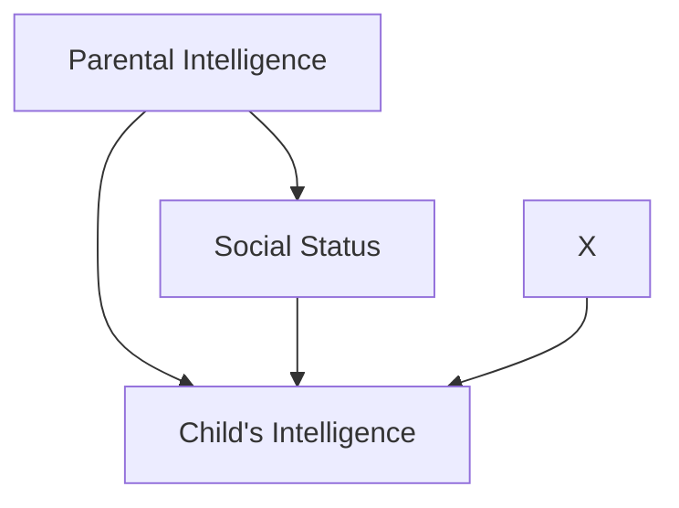
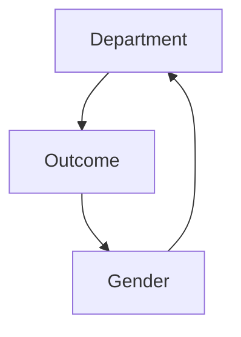
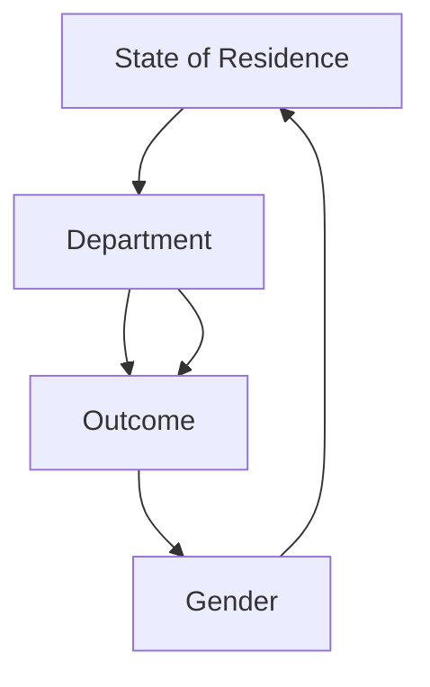
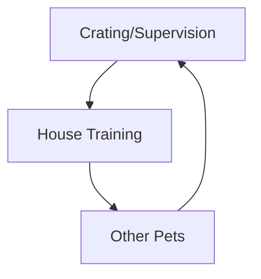
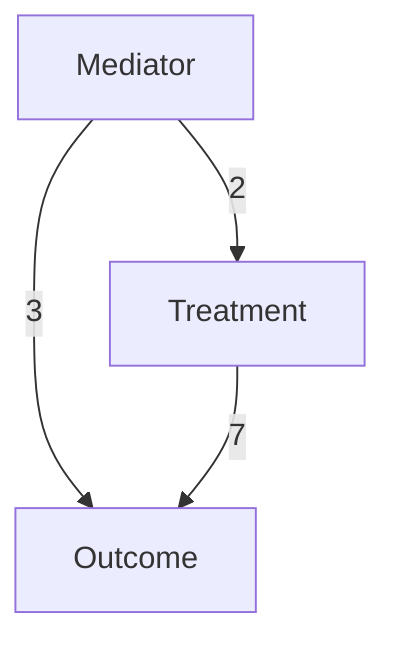
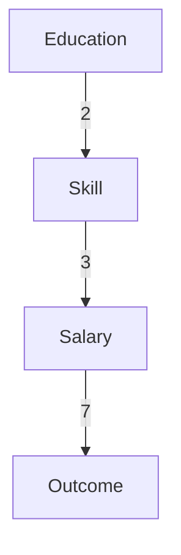
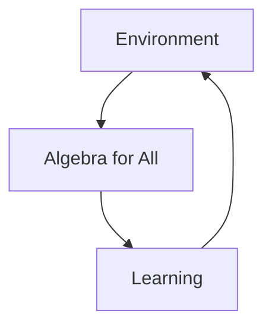
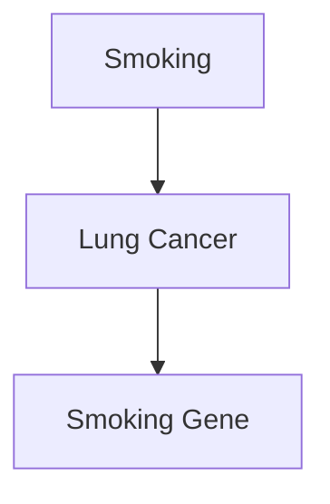
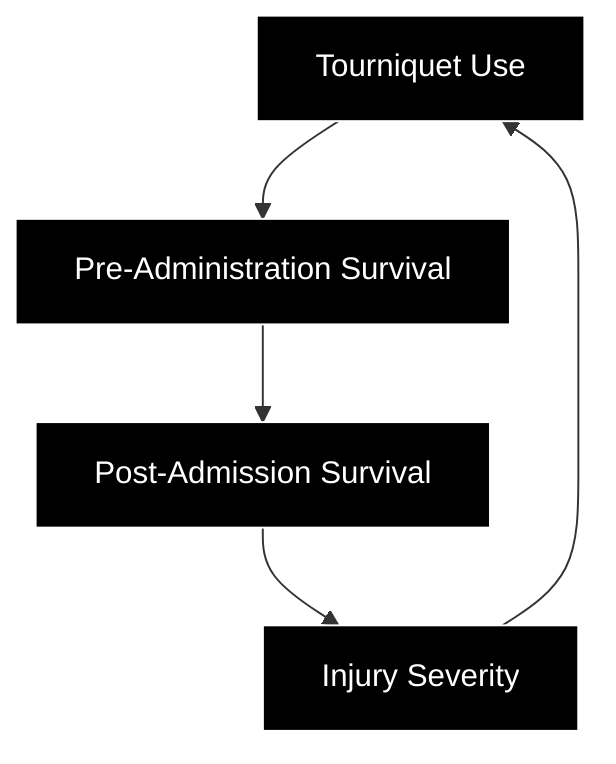

# MEDIATION: THE SEARCH FOR A MECHANISM

For want of a nail the shoe was lost.  
For want of a shoe the horse was lost.  
…  
For want of a battle the kingdom was lost.  
And all for the want of a nail.  
—ANONYMOUS

In ordinary language, the question “Why?” has at least two versions. The first is straightforward: you see an effect, and you want to know the cause. Your grandfather is lying in the hospital, and you ask, “Why? How could he have had a heart attack when he seemed so healthy?”

But there is a second version of the “Why?” question, which we ask when we want to better understand the connection between a known cause and a known effect. For instance, we observe that Drug B prevents heart attacks. Or, like James Lind, we observe that citrus fruits prevent scurvy. The human mind is restless and always wants to know more. Before long we start asking the second version of the question: “Why? What is the mechanism by which citrus fruits prevent scurvy?” This chapter focuses on this second version of “why.”

The search for mechanisms is critical to science, as well as to everyday life, because different mechanisms call for different actions when circumstances change. Suppose we run out of oranges. Knowing the mechanism by which oranges work, we can still prevent scurvy. We simply need another source of vitamin C. If we didn’t know the mechanism, we might be tempted to try bananas.

The word that scientists use for the second type of “Why?” question is “mediation.” You might read in a journal a statement like this: “The effect of Drug B on heart attacks is mediated by its effect on blood pressure.” This statement encodes a simple causal model: Drug → Blood Pressure → Heart Attack. In this case, the drug reduces high blood pressure, which in turn reduces the risk of heart attack. (Biologists typically use a different symbol, A—| B, when cause A inhibits effect B, but in the causality literature it is customary to use A → B both for positive and negative causes.) Likewise, we can summarize the effect of citrus fruits on scurvy by the causal model Citrus Fruits → Vitamin C → Scurvy.

We want to ask certain typical questions about a mediator: Does it account for the entire effect? Does Drug B work exclusively through blood pressure or perhaps through other mechanisms as well? The placebo effect is a common type of mediator in medicine: if a drug acts only through the patient’s belief in its benefit, most doctors will consider it ineffective. Mediation is also an important concept in the law. If we ask whether a company discriminated against women when it paid them lower salaries, we are asking a mediation question. The answer depends on whether the observed salary disparity is produced directly in response to the applicant’s sex or indirectly, through a mediator such as qualification, over which the employer has no control.

All the above questions require a sensitive ability to tease apart total effects, direct effects (which do not pass through a mediator), and indirect effects (which do). Even defining these terms has been a major challenge for scientists over the past century. Inhibited by the taboos against uttering the word “causation,” some tried to define mediation using a causality-free vocabulary. Others dismissed mediation analysis altogether and declared the concepts of direct and indirect effects as “more deceptive than helpful to clear statistical thinking.”

For me, too, mediation was a struggle—ultimately one of the most rewarding of my career, because I was wrong at first, and as I was learning from my mistake, I came up with an unexpected solution. For a while, I was of the opinion that indirect effects have no operational implications because, unlike direct effects, they cannot be defined in the language of interventions. It was a personal breakthrough when I realized that they can be defined in terms of counterfactuals and that they can also have important policy implications. They can be quantified only after we have reached the third rung of the Ladder of Causation, and that is why I have placed them at the end of this book. Mediation has flourished in its new habitat and enabled us to quantify, often from the bare data, the portion of the effect mediated by any desired path.

Understandably, due to their counterfactual dressing, indirect effects remain somewhat enigmatic even among champions of the Causal Revolution. I believe that their overwhelming usefulness, however, will eventually overcome any lingering doubts over the metaphysics of counterfactuals. Perhaps they could be compared to irrational and imaginary numbers: they made people uncomfortable at first (hence the name “irrational”), but eventually their usefulness transformed discomfort into delight.

To illustrate this point, I will give several examples of how researchers in various disciplines have gleaned useful insights from mediation analysis. One researcher studied an education reform called “Algebra for All,” which at first seemed a failure but later turned into a success. A study of tourniquet use in the Iraq and Afghanistan wars failed to show that it had any benefit; careful mediation analysis explains why the benefit may have been masked in the study.

In summary, over the last fifteen years, the Causal Revolution has uncovered clear and simple rules for quantifying how much of a given effect is direct and how much is indirect. It has transformed mediation from a poorly understood concept with doubtful legitimacy into a popular and widely applicable tool for scientific analysis.

## SCURVY: THE WRONG MEDIATOR

I would like to begin with a truly appalling historical example that highlights the importance of understanding the mediator.

One of the earliest examples of a controlled experiment was sea captain James Lind’s study of scurvy, published in 1747. In Lind’s time scurvy was a terrifying disease, estimated to have killed 2 million sailors between 1500 and 1800. Lind established, as conclusively as anybody could at that time, that a diet of citrus fruit prevented sailors from developing this dread disease. By the early 1800s, scurvy had become a problem of the past for the British navy, as all its ships took to the seas with an adequate supply of citrus fruit. This is usually the point at which history books end the story, celebrating a great triumph of the scientific method.

It seems very surprising, then, that this completely preventable disease made an unexpected comeback a century later, when British expeditions started to explore the polar regions. The British Arctic Expedition of 1875, the Jackson-Harmsworth Expedition to the Arctic in 1894, and most notably the two expeditions of Robert Falcon Scott to Antarctica in 1903 and 1911 all suffered greatly from scurvy.

How could this have happened? In two words: **ignorance and arrogance** — always a potent combination. By 1900 the leading physicians in Britain had forgotten the lessons of a century before. Scott’s physician on the 1903 expedition, Dr. Reginald Koettlitz, attributed scurvy to tainted meat. Further, he added, “the benefit of the so-called ‘antiscorbutics’ [i.e., scurvy preventatives, such as lime juice] is a delusion.” In his 1911 expedition, Scott stocked dried meat that had been scrupulously inspected for signs of decay but no citrus fruits or juices (see Figure 9.1). The trust he placed in the doctor’s opinion may have contributed to the tragedy that followed. All of the five men who made it to the South Pole died, two of an unspecified illness that was most likely scurvy. One team member turned back before the pole and made it back alive, but with a severe case of scurvy.

With hindsight, Koettlitz’s advice borders on criminal malpractice. How could the lesson of James Lind have been so thoroughly forgotten—or worse, dismissed—a century later? The explanation, in part, is that doctors did not really understand how citrus fruits worked against scurvy. In other words, they did not know the mediator.

> **FIGURE 9.1.** Daily rations for the men on Scott’s trek to the pole: chocolate, pemmican (a preserved meat dish), sugar, biscuits, butter, tea. Conspicuously absent: any fruit containing vitamin C. (Source: Photograph by Herbert Ponting, courtesy of Canterbury Museum, New Zealand.)

Black-and-white photo of various dried and powdered material samples arranged on a table, including a cylindrical sample, stacked bricks, and loose tea leaves (no text or symbols visible)

From Lind’s day onward, it had always been believed (but never proved) that citrus fruits prevented scurvy as a result of their acidity. In other words, doctors understood the process to be governed by the following causal diagram:

$$
\text{Citrus Fruits} \rightarrow \text{Acidity} \rightarrow \text{Scurvy}
$$

From this point of view, any acid would do. Even Coca-Cola would work (although it had not yet been invented). At first sailors used Spanish lemons; then, for economic reasons, they substituted West Indian limes, which were as acidic as the Spanish lemons but contained only a quarter of the vitamin C. To make things worse, they started “purifying” the lime juice by cooking it, which may have broken down whatever vitamin C it still contained. In other words, they were disabling the mediator.

When the sailors on the 1875 Arctic expedition fell ill with scurvy despite taking lime juice, the medical community was thrown into utter confusion. Those sailors who had eaten freshly killed meat did not get scurvy, while those who had eaten tinned meat did. Koettlitz and others blamed improperly

## NATURE VERSUS NURTURE: THE TRAGEDY OF BARBARA BURKS

To the best of my knowledge, the first person to explicitly represent a mediator with a diagram was a Stanford graduate student named Barbara Burks, in 1926. This very little-known pioneer in women’s science is one of the true heroes of this book. There is reason to believe that she actually invented path diagrams independently of Sewall Wright. And in regard to mediation, she was ahead of Wright and decades ahead of her time.

Burks’s main research interest, throughout her unfortunately brief career, was the role of nature versus nurture in determining human intelligence. Her advisor at Stanford was Lewis Terman, a psychologist famous for developing the Stanford-Binet IQ test and a firm believer that intelligence was inherited, not acquired. Bear in mind that this was the heyday of the eugenics movement, now discredited but at that time legitimized by the active research of people like Francis Galton, Karl Pearson, and Terman.

The nature-versus-nurture debate is, of course, a very old one that continued long after Burks. Her unique contribution was to boil it down to a causal diagram (see Figure 9.2), which she used to ask (and answer) the query: “How much of the causal effect is due to the direct path *Parental Intelligence → Child’s Intelligence* (nature), and how much is due to the indirect path *Parental Intelligence → Social Status → Child’s Intelligence* (nurture)?”

In this diagram, Burks has used some double-headed arrows, either to represent mutual causation or simply out of uncertainty about the direction of causation. For simplicity we are going to assume that the main effect of both arrows goes from left to right, which makes Social Status a mediator, so that the parents’ intelligence elevates their social standing, and this in turn gives the child a better opportunity to develop his or her intelligence. The variable X represents “other unmeasured remote causes.”

> **FIGURE 9.2.** The nature-versus-nurture debate, as framed by Barbara Burks.

In her dissertation Burks collected data from extensive home visits to 204 families with foster children, who would presumably get only the benefits of nurture and none of the benefits of nature from their foster parents (see Figure 9.3). She gave IQ tests to all of them and to a control group of 105 families without foster children. In addition, she gave them questionnaires that she used to grade various aspects of the child’s social environment. Using her data and path analysis, she computed the direct effect of parental IQ on children’s IQ and found that only 35 percent, or about one-third, of IQ variation is inherited. In other words, parents with an IQ fifteen points above average would typically have children five points above average.

> **FIGURE 9.3.** Barbara Burks (right) was interested in separating the “nature” and “nurture” components of intelligence. As a graduate student, she visited the homes of more than two hundred foster children, gave them IQ tests, and collected data on their social environment. She was the first researcher other than Sewall Wright to use path diagrams, and in some ways she anticipated Wright.

> *Illustration of a woman and child at a desk with toys and a briefcase, no text or symbols present.*

As a disciple of Terman, Burks must have been disappointed to see such a small effect. (In fact, her estimates have held up quite well over time.) So she questioned the then accepted method of analysis, which was to control for Social Status. “The true measure of contribution of a cause to an effect is mutilated,” she wrote, “if we have rendered constant variables which may in part or in whole be caused by either of the two factors whose true relationship is to be measured, or by still other unmeasured remote causes which also affect either of the two isolated factors” (emphasis in the original). In other words, if you are interested in the total effect of Parental Intelligence on Child’s Intelligence, you should not adjust for (render constant) any variable on the pathway between them.

But Burks didn’t stop there. Her italicized criterion, translated into modern language, reads that a bias will be introduced if we condition on variables that are (a) effects of either Parental Intelligence or Child’s Intelligence, or (b) effects of unmeasured causes of either Parental Intelligence or Child’s Intelligence (such as X in Figure 9.2).

These criteria were far ahead of their time and unlike anything that Sewall Wright had written. In fact, criterion (b) is one of the earliest examples ever of **collider bias**. If we look at Figure 9.2, we see that Social Status is a collider (*Parental Intelligence → Social Status ← X*). Therefore, controlling for Social Status opens the back-door path *Parental Intelligence → Social Status ← X → Child’s Intelligence*. Any resulting estimate of the indirect and direct effects will be biased. Because statisticians before (and after) Burks did not think in terms of arrows and diagrams, they were totally immersed in the myth that, while simple correlation has no causal implications, controlled correlation (or partial regression coefficients, see p. 222) is a step in the direction of causal explanation.

Burks was not the first person to discover the collider effect, but one can argue that she was the first to characterize it generally in graphical terms. Her criterion (b) applies perfectly to the examples of M-bias in Chapter 4. Hers is the first warning ever against conditioning on a pretreatment factor, a habit deemed safe by all twentieth-century statisticians and oddly still considered safe by some.

Now put yourself in Barbara Burks’s shoes. You’ve just discovered that all your colleagues have been controlling for the wrong variables. You have two strikes against you: you’re only a student, and you’re a woman. What do you do? Do you put your head down, pretend to accept the conventional wisdom, and communicate with your colleagues in their inadequate vocabulary?

**Not Barbara Burks!** She titled her first published paper “On the Inadequacy of the Partial and Multiple Correlation Technique” and started it out by saying, “Logical considerations lead to the conclusion that the techniques of partial and multiple correlation are fraught with dangers that seriously restrict their applicability.” Fighting words from someone who doesn’t have a PhD yet! As Terman wrote, “Her ability was somewhat tempered by her tendency to rub people the wrong way. I think the trouble lay partly in the fact that she was more aggressive in standing up for her own ideas than many teachers and male graduate students liked.” Evidently Burks was ahead of her time in more ways than one.

Burks may actually have invented path diagrams independently of Sewall Wright, who preceded her by only six years. We can say for sure that she didn’t learn them in any class. Figure 9.2 is the first appearance of a path diagram outside Sewall Wright’s work and the first ever in the social or behavioral sciences. True, she credits Wright at the very end of her 1926 paper, but she does so in a manner that looks like a last-minute addition. I have a hunch that she found out about Wright’s diagrams only after she had drawn her own, possibly after being tipped off by Terman or an astute reviewer.

It is fascinating to wonder what Burks might have become, had she not been a victim of her times. After obtaining her doctorate she never managed to get a job as a professor at a university, for which she was certainly qualified. She had to make do with less secure research positions, for example at the Carnegie Institution. In 1942 she got engaged, which one might have expected to mark an upturn in her fortunes; instead, she went into a deep depression. “I am convinced that, whether right or not, she was sure some sinister change was going on in her brain, from which she could never recover,” her mother, Frances Burks, wrote to Terman. “So in tenderest love to us all she chose to spare us the grief of sharing with her the spectacle of such a tragic decline.” On May 25, 1943, at age forty, she jumped to her death from the George Washington Bridge in New York.

But ideas have a way of surviving tragedies. When sociologists Hubert Blalock and Otis Duncan resuscitated path analysis in the 1960s, Burks’s paper served as the source of their inspiration. Duncan explained that one of his mentors, William Fielding Ogburn, had briefly mentioned path coefficients in his 1946 lecture on partial correlations. “Ogburn had a report of a brief paper by Wright, the one that dealt with Burks’ material, and I acquired this reprint,” Duncan said.

So there we have it! Burks’s 1926 paper got Wright interested in the inappropriate use of partial correlations. Wright’s response found its way into Ogburn’s lecture twenty years later and implanted itself into Duncan’s mind. Twenty years after that, when Duncan read Blalock’s work on path diagrams, it called back this half-forgotten memory from his student years. It’s truly

## IN SEARCH OF A LANGUAGE (THE BERKELEY ADMISSIONS PARADOX)

Despite Burks’s early work, half a century later statisticians were struggling even to express the idea of, let alone estimate, direct and indirect effects. A case in point is a well-known paradox, related to Simpson’s paradox but with a twist.

In 1973 Eugene Hammel, an associate dean at the University of California, noticed a worrisome trend in the university’s admission rates for men and women. His data showed that **44 percent** of the men who applied to graduate school at Berkeley had been accepted, compared to only **35 percent** of the women. Gender discrimination was coming to wide public attention, and Hammel didn’t want to wait for someone else to start asking questions. He decided to investigate the reasons for the disparity.

Graduate admissions decisions, at Berkeley as at other universities, are made by individual departments rather than by the university as a whole. So it made sense to look at the admissions data department by department to isolate the culprit. But when he did so, Hammel discovered an amazing fact. Department after department, the admissions decisions were consistently *more favorable* to women than to men. How could this be?

At this point Hammel did something smart: he called a statistician. Peter Bickel, when asked to look at the data, immediately recognized a form of Simpson’s paradox. As we saw in Chapter 6, Simpson’s paradox refers to a trend that seems to go one direction in each layer of a population (women are accepted at a higher rate in each department) but in the opposite direction for the whole population (men are accepted at a higher rate in the university as a whole). We also saw in Chapter 6 that the correct resolution of the paradox depends very much on the question you want to answer. In this case the question is clear: **Is the university (or someone within the university) discriminating against women?**

When I first told my wife about this example, her reaction was, “It’s impossible. If each department discriminates one way, the school cannot discriminate the other way.” And she’s right! The paradox offends our understanding of discrimination, which is a causal concept, involving preferential response to an applicant’s reported sex. If all actors prefer one sex over the other, the group as a whole must show that same preference. If the data seem to say otherwise, it must mean that we are not processing the data properly, in accordance with the logic of causation. Only with such logic, and with a clear causal story, can we determine the university’s innocence or guilt.

In fact, Bickel and Hammel found a causal story that completely satisfied them. They wrote an article, published in *Science* magazine in 1975, proposing a simple explanation: **women were rejected in greater numbers because they applied to harder departments to get into.**

To be specific, a higher proportion of females than males applied to departments in the humanities and social sciences. There they faced a double whammy: the number of students applying to get in was greater, and the number of places for those students was smaller. On the other hand, females did not apply as often to departments like mechanical engineering, which were easier to get into. These departments had more money and more spaces for graduate students—in short, a higher acceptance rate.

Why did women apply to departments that are harder to get into? Perhaps they were discouraged from applying to technical fields because they had more math requirements or were perceived as more “masculine.” Perhaps they had been discriminated against at earlier stages of their education: society tended to push women away from technical fields, as Barbara Burks’s story shows far too clearly. But these circumstances were not under Berkeley’s control and hence would not constitute discrimination by the university. Bickel and Hammel concluded, “The campus as a whole did not engage in discrimination against women applicants.”

At least in passing, I would like to take note of the precision of Bickel’s language in this paper. He carefully distinguishes between two terms that, in common English, are often taken as synonyms: **“bias”** and **“discrimination.”**

> He defines **bias** as “a pattern of association between a particular decision and a particular sex of applicant.” Note the words “pattern” and “association.” They tell us that bias is a phenomenon on rung one of the Ladder of Causation.

> On the other hand, he defines **discrimination** as “the exercise of decision influenced by the sex of the applicant when that is immaterial to the qualifications for entry.” Words like “exercise of decision,” “influence,” and “immaterial” are redolent of causation, even if Bickel could not bring himself to utter that word in 1975. Discrimination, unlike bias, belongs on rung two or three of the Ladder of Causation.

In his analysis, Bickel felt that the data should be stratified by department because the departments were the decision-making units. Was this the right call? To answer that question, we start by drawing a causal diagram (Figure 9.4). It is also very illuminating to look at the definition of discrimination in US case law. It uses counterfactual terminology, a clear signal that we have climbed to level three of the Ladder of Causation.

> In *Carson v. Bethlehem Steel Corp.* (1996), the Seventh Circuit Court wrote, “The central question in any employment-discrimination case is whether the employer would have taken the same action had the employee been of a different race (age, sex, religion, national origin, etc.) and everything else had been the same.”

This definition clearly expresses the idea that we should disable or “freeze” all causal pathways that lead from gender to admission through any other variable (e.g., qualification, choice of department, etc.). In other words, **discrimination equals the direct effect of gender on the admission outcome.**

> **FIGURE 9.4.** Causal diagram for Berkeley admission paradox—simple version.

We have seen before that conditioning on a mediator is incorrect if we want to estimate the total effect of one variable on another. But in a case of discrimination, according to the court, it is not the total effect but the direct effect that matters. Thus Bickel and Hammel are vindicated: under the assumptions shown in Figure 9.4, they were right to partition the data by departments, and their result provides a valid estimate of the direct effect of Gender on Outcome. They succeeded even though the language of direct and indirect effects was not available to Bickel in 1973.

However, the most interesting part of this story is not the original paper that Bickel and Hammel wrote but the discussion that followed it. After their paper was published, William Kruskal of the University of Chicago wrote a letter to Bickel arguing that their explanation did not really exonerate Berkeley. In fact, Kruskal queried whether any purely observational study (as opposed to a randomized experiment—say, using fake application forms) could ever do so.

To me their exchange of letters is fascinating. It is not very often that we can witness two great minds struggling with a concept (causation) for which they lacked an adequate vocabulary. Bickel would later go on to earn a MacArthur Foundation “genius” grant in 1984. But in 1975 he was at the beginning of his career, and it must have been both an honor and a challenge for him to match wits with Kruskal, a giant of the American statistics community.

In his letter to Bickel, Kruskal pointed out that the relation between Department and Outcome could have an unmeasured confounder, such as State of Residence. He worked out a numerical example for a hypothetical university with two sex-discriminating departments that produce exactly the same data as in Bickel’s example. He did this by assuming that both departments accept all in-state males and out-of-state females and reject all out-of-state males and in-state females and that this is their only decision criterion. Clearly this admissions policy is a blatant, textbook example of discrimination. But because the total numbers of applicants of each gender accepted and rejected were exactly the same as in Bickel’s example, Bickel would have to conclude that there was no discrimination. According to Kruskal, the departments appear innocent because Bickel has controlled for only one variable instead of two.

Kruskal put his finger exactly on the weak spot in Bickel’s paper: the lack of a clearly justified criterion for determining which variables to control for. Kruskal did not offer a solution, and in fact his letter despairs of ever finding one.

Unlike Kruskal, we can draw a diagram and see exactly what the problem is. Figure 9.5 shows the causal diagram representing Kruskal’s counterexample. Does it look slightly familiar? It should! It is exactly the same diagram that Barbara Burks drew in 1926, but with different variables. One is tempted to say, “Great minds think alike,” but perhaps it would be more appropriate to say that great problems attract great minds.

> **FIGURE 9.5.** Causal diagram for Berkeley admissions paradox—Kruskal’s version.

Kruskal argued that the analysis in this situation should control for both the department and the state of residence, and a look at Figure 9.5 explains why this is so. To disable all but the direct path, we need to stratify by department. This closes the indirect path Gender $\rightarrow$ Department $\rightarrow$ Outcome. But in so doing, we open the spurious path Gender $\rightarrow$ Department $\leftarrow$ State of Residence $\rightarrow$ Outcome, because of the collider at Department. If we control for State of Residence as well, we close this path, and therefore any correlation remaining must be due to the (discriminatory) direct path Gender $\rightarrow$ Outcome. Lacking diagrams, Kruskal had to convince Bickel with numbers, and in fact his numbers showed the same thing. If we do not adjust for any variables, then females have a lower admission rate. If we adjust for Department, then females appear to have a higher admission rate. If we adjust for both Department and State of Residence, then once again the numbers show a lower admission rate for females.

From arguments like this, you can see why the concept of mediation aroused (and still arouses) such suspicions. It seems unstable and hard to pin down. First the admission rates are biased against women, then against men, then against women. In his reply to Kruskal, Bickel continued to maintain that conditioning on a decision-making unit (Department) is somehow different from conditioning on a criterion for a decision (State of Residence). But he did not sound at all confident about it. He asks plaintively, “I see a nonstatistical question here: What do we mean by bias?” Why does the bias sign change depending on the way we measure it? In fact he had the right idea when he distinguished between bias and discrimination. Bias is a slippery statistical notion, which may disappear if you slice the data a different way. Discrimination, as a causal concept, reflects reality and must remain stable.

The missing phrase in both their vocabularies was “hold constant.” To disable the indirect path from Gender to Outcome, we must hold constant the variable Department and then tweak the variable Gender. When we hold the department constant, we prevent (figuratively speaking) the applicants from choosing which department to apply to. Because statisticians do not have a word for this concept, they do something superficially similar: they condition on Department. That was exactly what Bickel had done: he looked at the data department-by-department and concluded that there was no evidence of discrimination against women. That procedure is valid when Department and Outcome are unconfounded; in that case, seeing is the same as doing. But Kruskal correctly asked, “What if there is a confounder, State of Residence?” He probably didn’t realize that he was following in the footsteps of Burks, who had drawn essentially the same diagram.

I cannot stress enough how often this blunder has been repeated over the years—conditioning on the mediator instead of holding the mediator constant. For that reason I call it the **Mediation Fallacy**. Admittedly, the blunder is harmless if there is no confounding of the mediator and the outcome. However, if there is confounding, it can completely reverse the analysis, as Kruskal’s numerical example showed. It can lead the investigator to conclude there is no discrimination when in fact there is.

Burks and Kruskal were unusual in recognizing the Mediation Fallacy as a blunder, although they didn’t exactly offer a solution. R. A. Fisher fell victim to the same blunder in 1936, and eighty years later statisticians are still struggling with the problem. Fortunately there has been huge progress since the time of Fisher. Epidemiologists, for example, know now that one has to watch out for confounders between mediator and outcome. Yet those who eschew the language of diagrams (some economists still do) complain and confess that it is a torture to explain what this warning means.

Thankfully, the problem that Kruskal once called “perhaps insoluble” was solved two decades ago. I have this strange feeling that Kruskal would have enjoyed the solution, and in my fantasy I imagine showing him the power of the do-calculus and the algorithmization of counterfactuals. Unfortunately, he retired in 1990, just when the rules of do-calculus were being shaped, and he died in 2005.

I’m sure that some readers are wondering: What finally happened in the Berkeley case? The answer is, nothing. Hammel and Bickel were convinced that Berkeley had nothing to worry about, and indeed no lawsuits or federal investigations ever materialized. The data hinted at reverse discrimination against males, and in fact there was explicit evidence of this: “In most of the cases involving favored status for women it appears that the admissions committees were seeking to overcome long-established shortages of women in their fields,” Bickel wrote. Just three years later, a lawsuit over affirmative action on another campus of the University of California went all the way to the Supreme Court. Had the Supreme Court struck down affirmative action, such “favored status for women” might have become illegal. However, the Supreme Court upheld affirmative action, and the Berkeley case became a historical footnote.

A wise man leaves the final word not with the Supreme Court but with his wife. Why did mine have such a strong intuitive conviction that it is utterly impossible for a school to discriminate while each of its departments acts fairly? It is a theorem of causal calculus similar to the sure-thing principle. The sure-thing principle, as Jimmie Savage originally stated it, pertains to total effects, while this theorem holds for direct effects. The very definition of a direct effect on a global level relies on aggregating direct effects in the subpopulations.

To put it succinctly, **local fairness everywhere implies global fairness**. My wife was right.

## DAISY，THE KITTENS AND INDIRECT EFFECTS

So far we have discussed the concepts of direct and indirect effects in a vague and intuitive way，but I have not given them a precise scientific meaning. It is long past time for us to rectify this omission.

Let’s start with the direct effect，because it is undoubtedly easier，and we can define a version of it using the do-calculus（i.e.，at rung two of the Ladder of Causation）. We’ll consider first the simplest case，which includes three variables：a treatment X，an outcome Y，and a mediator M. We get the direct effect of X on Y when we “wiggle” X without allowing M to change. In the context of the Berkeley admissions paradox example，we force everybody to apply to the history department——that is，we $do(M = 0)$. We randomly assign some people to report their sex（on the application）as male $(do(X = 1))$ and some to report it as female $(do(X = 0))$，regardless of their actual genders. Then we observe the difference in admission rates between the two reporting groups. The result is called the **controlled direct effect**，or **CDE(0)**. In symbols，

$$
\begin{array}{r l}
\mathrm{CDE}(0) & = P(Y = 1 \mid do(X = 1)，do(M = 0)) - P(Y = 1 \mid do(X = 0)，do(M = 0))
\end{array}
\tag{9.1}
$$

The “0” in CDE(0) indicates that we forced the mediator to take on the value zero. We could also do the same experiment，forcing everybody to apply to engineering：$do(M = 1)$. We would denote the resulting controlled direct effect as **CDE(1)**.

Already we see one difference between direct effects and total effects：we have two different versions of the controlled direct effect，CDE(0) and CDE(1). Which one is right？One option is simply to report both versions. Indeed，it is not unthinkable that one department will discriminate against females and the other against males，and it would be interesting to find out who does what. That was，after all，Hammel’s original intention.

However，I would not recommend running this experiment，and here is why. Imagine an applicant named Joe whose lifetime dream is to study engineering and who happened to be（randomly）assigned to apply to the history department. Having sat on a few admissions committees，I can categorically vow that Joe’s application would look awfully strange to the committee. His A+ in electromagnetic waves and B–in European nationalism would totally distort the committee’s decision，regardless of whether he marked “male” or “female” on his application. The proportion of males and females admitted under these distortions would hardly reflect the admissions policy compared to applicants who normally apply to the history department.

Luckily，an alternative avoids the pitfalls of this overcontrolled experiment. We instruct the applicants to report a randomized gender but to apply to the department they would have preferred. We call this the **natural direct effect（NDE）**，because every applicant ends up in a department of his or her choice. The “would have” phrasing is a clue that NDE’s formal definition requires counterfactuals. For readers who enjoy mathematics，here is the definition expressed as a formula：

$$
\mathrm{NDE} = P(Y_{\mathrm{M} = \mathrm{M}_{0}} = 1 \mid do(X = 1)) - P(Y_{\mathrm{M} = \mathrm{M}_{0}} = 1 \mid do(X = 0))
\tag{9.2}
$$

The interesting term is the first，which stands for the probability that a female student selecting a department of her choice $(M = M_{0})$ would be admitted if she faked her sex to read “male”（do(X = 1)）. Here the choice of department is governed by the actual sex while admission is decided by the reported（fake）sex. Since the former cannot be mandated，we cannot translate this term to one involving do-operators；we need to invoke the counterfactual subscript.

Now you know how we define the controlled direct effect and the natural direct effect，but how do we compute them？The task is simple for the controlled direct effect；because it can be expressed as a do-expression，we need only use the laws of do-calculus to reduce the do-expressions to see-expressions（i.e.，conditional probabilities，which can be estimated from observational data）.

The natural direct effect poses a greater challenge，though，because it cannot be defined in a do-expression. It requires the language of counterfactuals，and hence it cannot be estimated using the do-calculus. It was one of the greatest thrills in my life when I managed to strip the formula for the NDE from all of its counterfactual subscripts. The result，called the **Mediation Formula**，makes the NDE a truly practical tool because we can estimate it from observational data.

Indirect effects，unlike direct effects，have no “controlled” version because there is no way to disable the direct path by holding some variable constant. But they do have a “natural” version，the **natural indirect effect（NIE）**，which is defined（like NDE）using counterfactuals. To motivate the definition，I will consider a somewhat playful example that my coauthor suggested.

> My coauthor and his wife adopted a dog named Daisy，a rambunctious poodle-and-Chihuahua mix with a mind of her own. Daisy was not as easy to house-train as their previous dog，and after several weeks she was still having occasional “accidents” inside the house. But then something very odd happened. Dana and his wife brought home three foster kittens from the animal shelter，and the “accidents” stopped. The foster kittens remained with them for three weeks，and Daisy did not break her training a single time during that period.
>
> Was it just coincidence，or had the kittens somehow inspired Daisy to civilized behavior？Dana’s wife suggested that the kittens might have given Daisy a sense of belonging to a “pack，” and she would not want to mess up the area where the pack lived. This theory was reinforced when，a few days after the kittens went back to the shelter，Daisy started urinating in the house again，as if she had never heard of good manners.
>
> But then it occurred to Dana that something else had changed when the kittens arrived and departed. While the kittens had been there，Daisy had to be either separated from them or carefully supervised. So she spent long periods in her crate or being closely watched by a human，even leashed to a human. Both interventions，crating and leashing，also happen to be recognized methods for housebreaking.
>
> When the kittens left，the Mackenzies stopped the intensive supervision，and the uncouth behavior returned. Dana hypothesized that the effect of the kittens was not direct（as in the pack theory）but indirect，mediated by crating and supervision. Figure 9.6 shows a causal graph. At this point，Dana and his wife tried an experiment. They treated Daisy as they would have with kittens around，keeping her in a crate and supervising her carefully outside the crate. If the accidents stopped，they could reasonably conclude that the mediator was responsible. If they didn’t stop，then the direct effect（the pack psychology）would become more plausible.

> FIGURE 9.6. Causal diagram for Daisy’s house training.

在科学证据的层级中，他们的实验被认为是非常不可靠的——当然不可能发表在科学期刊上。真正的实验应该不止在一只狗身上进行，并且需要在有小猫和没有小猫的情况下分别进行。尽管如此，我们这里关心的是实验背后的因果逻辑。我们试图重现这样的情景：如果小猫不在场，而中介变量被设定为小猫在场时的值，会发生什么。换句话说，我们移除小猫（第一次干预），并像小猫在场时那样监督狗（第二次干预）。

当你仔细阅读以上段落时，你可能会注意到两个“将会是”，它们都是反事实条件。当狗改变行为时，小猫是在场的——但我们问的是，如果小猫不在场会发生什么。同样地，如果小猫不在场，Dana 就不会监督 Daisy——但我们问的是，如果他监督了会发生什么。

你可以理解为什么统计学家们花了这么长时间来定义间接效应。如果单个反事实已经够离谱了，那么双重嵌套的反事实则完全超出了可接受的范围。然而，这个定义与我们关于因果关系的自然直觉非常吻合。我们的直觉如此强烈，以至于没有受过特殊训练的 Dana 的妻子也立刻理解了所提议实验的逻辑。

对于熟悉公式的读者，以下是我们刚刚用语言描述的自然间接效应（NIE）的定义：

$$
\mathrm{NIE} = P (Y _ {\mathrm{M} = \mathrm{M} _ {1}} = 1 \mid d o (X = 0)) - P (Y _ {M = \mathrm{M} _ {0}} = 1 \mid d o (X = 0)) \tag {9.3}
$$

第一个 $P$ 项是 Daisy 实验的结果：假设我们没有引入其他宠物 $(X = 0)$，但将中介变量设定为如果我们引入它们时会取的值 $(M = M _ { 1 })$，成功进行家庭训练的概率 $( Y = 1 )$。我们将此与“正常”条件下（没有其他宠物）成功进行家庭训练的概率进行对比。注意，反事实 $M _ { 1 }$ 需要针对每只动物逐个计算：不同的狗可能对板条箱/监督有不同的需求。这使得间接效应超出了 do 演算的能力范围。这也可能使实验不可行，因为实验者可能不知道特定狗 $u$ 的 $M _ { 1 } ( u )$。尽管如此，假设 $M$ 和 $Y$ 之间没有混杂，自然间接效应仍然可以计算。

可以从 NIE 中移除所有反事实，并得出一个类似于自然直接效应（NDE）的中介公式。这个需要因果之梯第三层信息的量，可以被简化为一个使用第一层数据即可计算的表达式。这种简化之所以可能，是因为我们假设没有混杂，而由于结构因果模型中方程的确定性，这个假设位于第三层。

为了结束 Daisy 的故事，这个实验并没有得出定论。Dana 和他的妻子是否像为了防止 Daisy 接近小猫时那样仔细地监督她，这一点值得怀疑（因此 $M$ 是否真的被设定为 $M _ { 1 }$ 并不清楚）。经过几个月的耐心和时间，Daisy 最终学会了在外面“解决她的问题”。即便如此，Daisy 的故事仍然提供了一些有用的教训。仅仅通过意识到中介变量的可能性，Dana 就能够推测出另一种因果机制。这个机制带来了一个重要的实际后果：他和妻子不必在 Daisy 的余生中让家里一直充满寄养的小猫“群”。

# MEDIATION IN LINEAR WONDERLAND

When you first hear about counterfactuals, you might wonder if such an elaborate machinery is really needed to express an indirect effect. Surely, you might argue, an indirect effect is simply what is left over after you take away the direct effect. Alternatively, we could write：

$$
\text{Total Effect} = \text{Direct Effect} + \text{Indirect Effect} \tag{9.4}
$$

The short answer is that this does not work in models that involve interactions (sometimes called moderation). For example, imagine a drug that causes the body to secrete an enzyme that acts as a catalyst：it combines with the drug to cure a disease. The total effect of the drug is, of course, positive. But the direct effect is zero, because if we disable the mediator (for example, by preventing the body from stimulating the enzyme), the drug will not work. The indirect effect is also zero, because if we don’t receive the drug and do artificially get the enzyme, then the disease will not be cured. The enzyme itself has no curing power. Thus Equation 9.4 does not hold：the total effect is positive but the direct and indirect effects are zero.

However, Equation 9.4 does hold automatically in one situation, with no apparent need to invoke counterfactuals. That is the case of a **linear causal model**, of the sort that we saw in Chapter 8. As discussed there, linear models do not allow interactions, which can be both a virtue and a drawback. It is a virtue in the sense that it makes mediation analysis much easier, but it is a drawback if we want to describe a real-world causal process that does involve interactions.

Because mediation analysis is so much easier for linear models, let’s see how it is done and what the pitfalls are. Suppose we have a causal diagram that looks like Figure 9.7. Because we are working with a linear model, we can represent the strength of each effect with a single number. The labels (path coefficients) indicate that increasing the Treatment variable by one unit will increase the Mediator variable by two units. Similarly, a one-unit increase in Mediator will increase Outcome by three units, and a one-unit increase in Treatment will increase Outcome by seven units. These are all *direct effects*.

Here we come to the first reason why linear models are so simple：**direct effects do not depend on the level of the mediator**. That is, the controlled direct effect CDE(m) is the same for all values m, and we can simply speak of “the” direct effect.

What would be the total effect of an intervention that causes Treatment to increase by one unit？First, this intervention directly causes Outcome to increase by seven units (if we hold Mediator constant). It also causes Mediator to increase by two units. Finally, because each one-unit increase in Mediator directly causes a three-unit increase in Outcome, a two-unit increase in Mediator will lead to an additional six-unit increase in Outcome. So the net increase in Outcome, from both causal pathways, will be thirteen units. The first seven units correspond to the direct effect, and the remaining six units correspond to the indirect effect. **Easy as pie！**

> **FIGURE 9.7.** Example of a linear model (path diagram) with mediation.

In general, if there is more than one indirect pathway from X to Y, we evaluate the indirect effect along each pathway by taking the product of all the path coefficients along that pathway. Then we get the total indirect effect by adding up all the indirect causal pathways. Finally, the total effect of X on Y is the sum of the direct and indirect effects. This “sum of products” rule has been used since Sewall Wright invented path analysis, and, formally speaking, it indeed follows from the do-operator definition of total effect.

In 1986, Reuben Baron and David Kenny articulated a set of principles for detecting and evaluating mediation in a system of equations. The essential principles are, first, that the variables are all related by linear equations, which are estimated by fitting them to the data. Second, direct and indirect effects are computed by fitting two equations to the data：one with the mediator included and one with the mediator excluded. Significant change in the coefficients when the mediator is introduced is taken as evidence of mediation.

The simplicity and plausibility of the Baron-Kenny method took the social sciences by storm. As of 2014, their article ranks thirty-third on the list of most frequently cited scientific papers of all time. As of 2017, Google Scholar reports that 73,000 scholarly articles have cited Baron and Kenny. **Just think about that！** They’ve been cited more times than Albert Einstein, more than Sigmund Freud, more than almost any other famous scientist you can think of. Their article ranks second among all papers in psychology and psychiatry, and yet it’s not about psychology at all. It’s about *noncausal mediation*.

The unprecedented popularity of the Baron-Kenny approach undoubtedly stems from two factors：
- First, mediation is in high demand. Our desire to understand “how nature works” (i.e., to find the M in $X \to M \to Y$) is perhaps even stronger than our desire to quantify it.
- Second, the method reduces easily to a cookbook procedure that is based on familiar concepts from statistics, a discipline that has long claimed to have exclusive ownership of objectivity and empirical validity.

So hardly anyone noticed the grand leap forward involved, the fact that a causal quantity (mediation) was defined and assessed by purely statistical means.

However, cracks in this regression-based edifice began to appear in the early 2000s, when practitioners tried to generalize the sum-of-products rule to nonlinear systems. That rule involves two assumptions—effects along distinct paths are additive, and path coefficients along one path multiply—and both of them lead to wrong answers in nonlinear models, as we will see below.

It has taken a long time, but the practitioners of mediation analysis have finally woken up. In 2001, my late friend and colleague Rod McDonald wrote：“I think the best way to discuss the question of detecting or showing moderation or mediation in a regression is to set aside the entire literature on these topics and start from scratch.” The latest literature on mediation seems to heed McDonald’s advice；counterfactual and graphical methods are pursued much more actively than the regression approach. And in 2014, the father of the Baron-Kenny approach, David Kenny, posted a new section on his website called “causal mediation analysis.” Though I would not call him a convert yet, Kenny clearly recognizes that times are changing and that mediation analysis is entering a new era.

For now, let’s look at one very simple example of how our expectations go wrong when we leave Linear Wonderland. Consider Figure 9.8, a slight modification of Figure 9.7, where a job applicant will decide to take a job if and only if the salary offered exceeds a certain threshold value, in our case ten. The salary offer is determined, as shown in the diagram, by $7 \times \text{Education} + 3 \times \text{Skill}$. Note that the functions determining Skill and Salary are still assumed to be linear, but the relationship of Salary to Outcome is nonlinear, because it has a threshold effect.

Let us compute, for this model, the total, direct, and indirect effects associated with increasing Education by one unit. The total effect is clearly equal to one, because as Education shifts from zero to one, Salary goes from zero to $(7 \times 1) + (3 \times 2) = 13$, which is above the threshold of ten, making Outcome switch from zero to one.

Remember that the natural indirect effect is the expected change in the outcome, given that we make no change to Education but set Skill at the level it would take if we had increased Education by one. It’s easy to see that in this case, Salary goes from zero to $2 \times 3 = 6$. This is below the threshold of ten, so the applicant will turn the offer down. Thus NIE = 0.

> FIGURE 9.8. Mediation combined with a threshold effect.

Now what about the direct effect? As mentioned before, we have the problem of figuring out what value to hold the mediator at. If we hold Skill at the level it had before we changed Education, then Salary will increase from zero to seven, making Outcome = 0. Thus, CDE(0) = 0.

On the other hand, if we hold Skill at the level it attains after the change in Education (namely two), Salary will increase from six to thirteen. This changes the Outcome from zero to one, because thirteen is above the applicant’s threshold for accepting the job offer. So CDE(2) = 1.

Thus, the direct effect is either zero or one depending on the constant value we choose for the mediator. Unlike in Linear Wonderland, the choice of a value for the mediator makes a difference, and we have a dilemma. If we want to preserve the additive principle, Total Effect = Direct Effect + Indirect Effect, we need to use CDE(2) as our definition of the causal effect. But this seems arbitrary and even somewhat unnatural.

If we are contemplating a change in Education and we want to know its direct effect, we would most likely want to keep Skill at the level it already has. In other words, it makes more intuitive sense to use CDE(0) as our direct effect. Not only that, this agrees with the natural direct effect in this example. But then we lose additivity: Total Effect ≠ Direct Effect + Indirect Effect.

However—quite surprisingly—a somewhat modified version of additivity does hold true, not only in this example but in general. Readers who don’t mind doing a little computation might be interested in computing the NIE of going back from X = 1 to X = 0. In this case the salary offer drops from thirteen to seven, and the Outcome drops from one to zero (i.e., the applicant does not accept the offer). So computed in the reverse direction, NIE = –1. The cool and amazing fact is that

$$
\text{Total Effect (X = 0 \rightarrow X = 1) = NDE (X = 0 \rightarrow X = 1) - NIE (X = 1 \rightarrow X = 0)}
$$

or in this case, 1 = 0–(–1). This is the “natural effects” version of the additivity principle, only it is a subtractivity principle! I was extremely happy to see this version of additivity emerging from the analysis, despite the nonlinearity of the equations.

A staggering amount of ink has been spilled on the “right” way to generalize direct and indirect effects from linear to nonlinear models. Unfortunately, most of the articles go at the problem backward. Instead of rethinking from scratch what we mean by direct and indirect effects, they start from the supposition that we only have to tweak the linear definitions a little bit. For example, in Linear Wonderland we saw that the indirect effect is given by a product of two path coefficients. So some researchers tried to define the indirect effect in the form of a product of two quantities, one measuring the effect of X on M, the other the effect of M on Y. This came to be known as the “product of coefficients” method. But we also saw that in Linear Wonderland the indirect effect is given by the difference between the total effect and the direct effect. So another, equally dedicated group of researchers defined the indirect effect as a difference of two quantities, one measuring the total effect, the other the direct effect. This came to be known as the “difference in coefficients” method.

Which of these is right? Neither! Both groups of researchers confused the procedure with the meaning. The procedure is mathematical; the meaning is causal. In fact, the problem goes even deeper: the indirect effect never had a meaning for regression analysts outside the bubble of linear models. The indirect effect’s only meaning was as the outcome of an algebraic procedure (“multiply the path coefficients”). Once that procedure was taken away from them, they were cast adrift, like a boat without an anchor.

One reader of my book *Causality* described this lost feeling beautifully in a letter to me. Melanie Wall, now at Columbia University, used to teach a modeling course to biostatistics and public health students. One time, she explained to her students as usual how to compute the indirect effect by taking the product of direct path coefficients. A student asked her what the indirect effect meant. “I gave the answer that I always give, that the indirect effect is the effect that a change in X has on Y through its relationship with the mediator, Z,” Wall told me.

But the student was persistent. He remembered how the teacher had explained the direct effect as the effect remaining after holding the mediator fixed, and he asked, “Then what is being held constant when we interpret an indirect effect?”

Wall didn’t know what to say. “I’m not sure I have a good answer for you,” she said. “How about I get back to you?”

This was in October 2001, just four months after I had presented a paper on causal mediation at the Uncertainty in Artificial Intelligence conference in Seattle. Needless to say, I was eager to impress Melanie with my newly acquired solution to her puzzle, and I wrote to her the same answer I have given you here: “The indirect effect of X on Y is the increase we would see in Y while holding X constant and increasing M to whatever value M would attain under a unit increase in X.”

I am not sure if Melanie was impressed with my answer, but her inquisitive student got me thinking, quite seriously, about how science progresses in our times. Here we are, I thought, forty years after Blalock and Duncan introduced path analysis to social science. Dozens of textbooks and hundreds of research papers are published every year on direct and indirect effects, some with oxymoronic titles like “Regression-Based Approach to Mediation.” Each generation passes along to the next the received wisdom that the indirect effect is just the product of two other effects, or the difference between the total and direct effects. Nobody dares to ask the simple question “But what does the indirect effect mean in the first place?” Just like the boy in Hans Christian Andersen’s fable “The Emperor’s New Clothes,” we needed an innocent student with unabashed chutzpah to shatter our faith in the oracular role of scientific consensus.

At this point I should tell my own conversion story, because for quite a while I was stymied by the same question that puzzled Melanie Wall’s student.

I wrote in Chapter 4 about Jamie Robins (Figure 9.9), a pioneering statistician and epidemiologist at Harvard University who, together with Sander Greenland at the University of California, Los Angeles, is largely responsible for the widespread adoption of graphical models in epidemiology today. We collaborated for a couple of years, from 1993 to 1995, and he got me thinking about the problem of sequential intervention plans, which was one of his principal research interests.

好的，这是根据您的要求格式化后的 Markdown 内容。

---

> **FIGURE 9.9.** Jamie Robins, a pioneer of causal inference in epidemiology. (Source: Photograph by Kris Snibbe, courtesy of Harvard University Photo Services.)

# 排版优化后的 Markdown 内容

\[
u_n = \frac{1}{n(n)} \sum_{r \neq s} y_r u_s x_s (x_r, x_s) \mathbf{1}_{x_r, x_s} + \frac{n}{n(n)} \sum_{r \neq s} (y_r e_i (x_r) - \hat{\omega}_i) (y_s e_i)
\]

\[
+ \frac{n}{n(n)} \sum_{r \neq s} \sum_{i} (y_r e_i (x_i) - \hat{\omega}_i) \hat{\omega}_i (s_i)
+ C(I, I_1) \hat{\omega}_i (I_2) = E(y_r)
\]

\[
v_0 (v_1, v_2, I_n) = \frac{1}{n(n)} \sum_{r \neq s} v_0 (v_1, v_2) + v_1
\]

\[
v_1, v_2 = v_0 \left[ \sum_{r} (y_r e_i (x_i) - \hat{\omega}_i (I_1)) (\theta_1, \theta_2) \right] = \sum_{r} E[(y_r e_i (x_i) - \hat{\omega}_i (I_1))(A_i, A_2)]
\]

\[
E(\theta_1^2, e_i(x_i), e_j(x_i) \mid I_1)
\]

\[
\frac{f(x_i^2 e_i^2)}{P_{an}(I)} T_{sup}(e_i)^3 c_{bn}(I_2)^3
\]

> **批注**：此处原公式中存在符号混淆与不完整表达式，已尽量保持语义并修正 LaTeX 格式。

Years earlier, as an expert in occupational health and safety, Robins had been asked to testify in court about the likelihood that chemical exposure in the workplace had caused a worker’s death. He was dismayed to discover that statisticians and epidemiologists had no tools to answer such questions. This was still the era when causal language was taboo in statistics. It was only allowed in the case of a randomized controlled trial, and for ethical reasons one could never conduct such a trial on the effects of exposure to formaldehyde.

Usually a factory worker is exposed to a harmful chemical not just once but over a long period. For that reason, Robins became keenly interested in exposures or treatments that vary over time. Such exposures can also be beneficial: for example, AIDS treatment is given over the course of many years, with different plans of action depending on how a patient’s CD4 count responds. How can you sort out the causal effect of treatment when it may occur in many stages and the intermediate variables (which you might want to use as controls) depend on earlier stages of treatment? This has been one of the defining questions of Robins’s career.

After Jamie flew out to California to meet me on hearing about the “napkin problem” (Chapter 7), he was keenly interested in applying graphical methods to the sequential treatment plans that were his métier. Together we came up with a sequential back-door criterion for estimating the causal effect of such a treatment stream. I learned some important lessons from this collaboration. In particular, he showed me that two actions are sometimes easier to analyze than one because an action corresponds to erasing arrows on a graph, which makes it sparser.

Our back-door criterion dealt with a long-term treatment consisting of some arbitrarily large number of do-operations. But even two operations will produce some interesting mathematics—including the controlled direct effect, which consists of one action that “wiggles” the value of the treatment, while another action fixes the value of the mediator. More importantly, the idea of defining direct effects in terms of do-operations liberated them from the confines of linear models and grounded them in causal calculus.

But I didn’t really get interested in mediation until later, when I saw that people were still making elementary mistakes, such as the Mediation Fallacy mentioned earlier. I was also frustrated that the action-based definition of the direct effect did not extend to the indirect effect. As Melanie Wall’s student said, we have no variable or set of variables to intervene on to disable the direct path and let the indirect path stay active. For this reason the indirect effect seemed to me like a figment of the imagination, devoid of independent meaning except to remind us that the total effect may differ from the direct effect. I even said so in the first edition (2000) of my book *Causality*. **This was one of the three greatest blunders of my career.**

In retrospect, I was blinded by the success of the do-calculus, which had led me to believe that the only way to disable a causal path was to take a variable and set it to one particular value. This is not so; if I have a causal model, I can manipulate it in many creative ways, by dictating who listens to whom, when, and how. In particular, I can fix the primary variable for the purpose of suppressing its direct effect and, hypothetically yet simultaneously, energize the primary variable for the purpose of transmitting its effect through the mediator. That allows me to set the treatment variable (e.g., kittens) at zero and to set the mediator at the value it would have had if I had set kittens to one. My model of the data-generating process then tells me how to compute the effect of the split intervention.

I am indebted to one reader of the first edition, Jacques Hagenaars (author of *Categorical Longitudinal Data*), for urging me not to give up on the indirect effect. “Many experts in social science agree on the input and output, but differ exactly with respect to the mechanism,” he wrote to me. But I was stuck for almost two years on the dilemma I wrote about in the last section: How can I disable the direct effect?

All these struggles came to sudden resolution, almost like a divine revelation, when I read the legal definition of discrimination that I quoted earlier in this chapter: “had the employee been of a different race… and everything else had been the same.” Here we have it—the crux of the issue! It’s a make-believe game. We deal with each individual on his or her own merits, and we keep all characteristics of the individual constant at whatever level they had prior to the change in the treatment variable.

How does this solve our dilemma? It means, first of all, that we have to redefine both the direct effect and the indirect effect. For the direct effect, we let the mediator choose the value it would have—for each individual—in the absence of treatment, and we fix it there. Now we wiggle the treatment and register the difference. This is different from the controlled direct effect I discussed earlier, where the mediator is fixed at one value for everyone. Because we let the mediator choose its “natural” value, I called it the **natural direct effect**. Similarly, for the **natural indirect effect** I first deny treatment to everyone, and then I let the mediator choose the value it would have, for each individual, in the presence of treatment. Finally I record the difference.

I don’t know if the legal words in the definition of discrimination would have moved you, or anyone else, in the same way. But by 2000 I could already speak counterfactuals like a native. Having learned how to read them in causal models, I realized that they were nothing but quantities computed by innocent operations on equations or diagrams. As such, they stood ready to be encapsulated in a mathematical formula. All I had to do was embrace the “would-haves.”

In a second, I realized that every direct and indirect effect could be translated into a counterfactual expression. Once I saw how to do that, it was a snap to derive a formula that tells you how to estimate the natural direct and indirect effects from data and when it is permissible. Importantly, the formula makes no assumptions about the specific functional form of the relationship between X, M, and Y. **We have escaped from Linear Wonderland.**

I called the new rule the **Mediation Formula**, though there are actually two formulas, one for the natural direct effect and one for the natural indirect effect. Subject to transparent assumptions, explicitly displayed in the graph, it tells you how they can be estimated from data. For example, in a situation like Figure 9.4, where there is no confounding between any of the variables, and M is the mediator between treatment X and outcome Y:

$$
\begin{array}{r l} 
\mathrm{NIE} & = \Sigma_ {\mathrm{m}} [ P (M = m \mid X = 1) - P (M = m \mid X = 0) ] \times P (Y = 1 \mid X = 0, M = m) 
\end{array} \tag{9.5}
$$

The interpretation of this formula is illuminating. The expression in brackets stands for the effect of X on M, and the following expression stands for the effect of M on Y (when X = 0). So it reveals the origin of the product-of-coefficients idea, cast as a product of two nonlinear effects. Note also that unlike Equation 9.3, Equation 9.5 has no subscripts and no do-operators, so it can be estimated from rung-one data.

Whether you are a scientist in a laboratory or a child riding a bicycle, it is always a thrill to find you can do something today that you could not do yesterday. And that is how I felt when the Mediation Formula first appeared on paper. I could see at a glance everything about direct and indirect effects: what is needed to make them large or small, when we can estimate them from observational or interventional data, and when we can deem a mediator “responsible” for transmitting observed changes to the outcome variable.

The relationship between cause and effect can be linear or nonlinear, numerical or logical. Previously each of these cases had to be handled in a different way, if they were discussed at all. Now a single formula would apply to all of them. Given the right data and the right model, we could determine if an employer was guilty of discrimination or what kinds of confounders would prevent us from making that determination. From Barbara Burks’s data, we could estimate how much of the child’s IQ comes from nature and how much from nurture. We could even calculate the percentage of the total effect explained by mediation and the percentage owed to mediation—two complementary concepts that collapse to one in linear models.

After I wrote down the counterfactual definition of the direct and indirect effects, I learned that I was not the first to hit on the idea. Robins and Greenland got there before me, all the way back in 1992. But their paper describes the concept of the natural effect in words, without committing it to a mathematical formula.

> More seriously, they took a pessimistic view of the whole idea of natural effects and stated that such effects cannot be estimated from experimental studies and certainly not from observational studies. This statement prevented other researchers from seeing the potential of natural effects. It is hard to tell if Robins and Greenland would have switched to a more optimistic view had they taken the extra step of expressing the natural effect as a formula in counterfactual language. For me, this extra step was crucial.

There is possibly another reason for their pessimistic view, which I do not agree with but will try to explain. They examined the counterfactual definition of the natural effect and saw that it combines information from two different worlds, one in which you hold the treatment constant at zero and another in which you change the mediator to what it would have been if you had set the treatment to one. Because you cannot replicate this “cross-worlds” condition in any experiment, they believed it was out of bounds.

This is a philosophical difference between their school and mine. They believe that the legitimacy of causal inference lies in replicating a randomized experiment as closely as possible, on the assumption that this is the only route to the scientific truth. I believe that there may be other routes, which derive their legitimacy from a combination of data and established (or assumed) scientific knowledge. To that end, there may be methods more powerful than a randomized experiment, based on rung-three assumptions, and I do not hesitate to use them.

Where they gave researchers a red light, I gave them a green light, which was the Mediation Formula: if you feel comfortable with these assumptions, here is what you can do! Unfortunately, Robins and Greenland’s red light kept the field of mediation at a standstill for nine full years.

Many people find formulas daunting, seeing them as a way of concealing rather than revealing information. But to a mathematician, or to a person who is adequately trained in the mathematical way of thinking, exactly the reverse is true. A formula reveals everything: it leaves nothing to doubt or ambiguity. When reading a scientific article, I often catch myself jumping from formula to formula, skipping the words altogether. To me, a formula is a baked idea. Words are ideas in the oven.

A formula serves two purposes, one practical and one social. From the practical point of view, students or colleagues can read it as they would a recipe. The recipe may be simple or complex, but at the end of the day it promises that if you follow the steps, you will know the natural direct and indirect effects—provided, of course, your causal model accurately reflects the real world.

The second purpose is subtler. I had a friend in Israel who was a famous artist. I visited his studio to acquire one of his paintings, and his canvases were all over the place—a hundred under the bed, dozens in the kitchen. They were priced at between \$300 and \$500 each, and I had a hard time deciding. Finally, I pointed to one on the wall and said, “I like this one.” “This one is \$5,000,” he said. “How come?” I asked, partly surprised and partly protesting. He answered, “This one is framed.” It took me a few minutes to figure out, but then I understood what he meant. It wasn’t valuable because it was framed; it was framed because it was valuable. Out of all the hundreds of paintings in his apartment, that one was his personal choice. It best expressed what he had labored to express in the others, and it was thus anointed with a seal of completeness—a frame.

That is the second purpose of a formula. It is a social contract. It puts a frame around an idea and says, “This is something I believe is important. This is something that deserves sharing.”

That is why I have chosen to put a frame around the Mediation Formula. It deserves sharing because, to me and many like me, it represents the end to an age-old dilemma. And it is important, because it offers a practical tool for identifying mechanisms and assessing their importance. This is the social promise that the Mediation Formula expresses.

Since then, once the realization took hold that nonlinear mediation analysis is possible, research in the field has taken off. If you go to a database of academic articles and search for titles with the words “mediation analysis,” you will find almost nothing before 2004. Then there were seven papers a year, then ten, then twenty; now there are more than a hundred papers a year. I’d like to end this chapter with three examples, which I hope will illustrate the variety of possibilities of mediation analysis.

## CASE STUDIES OF MEDIATION

## “Algebra for All”: A Program and Its Side Effects

Like many big-city public school systems, the Chicago Public Schools face problems that sometimes seem intractable: high poverty rates, low budgets, and big achievement gaps between black, Latino, white, and Asian students. In 1988, then US secretary of education William Bennett called Chicago’s public schools the worst in the nation. But in the 1990s, under new leadership, the Chicago Public Schools undertook a number of reforms and moved from “worst in the nation” to “innovator for the nation.” Some of the superintendents responsible for these changes gained nationwide prominence, such as Arne Duncan, who became secretary of education under President Barack Obama.

One innovation that actually predated Duncan was a policy, adopted in 1997, eliminating remedial courses in high school and requiring all ninth graders to take college-prep courses like English I and Algebra I. The math part of this policy was called “Algebra for All.”

Was “Algebra for All” a success? That question, it turned out, was surprisingly difficult to answer. There was both good news and bad news. The good news was that test scores did improve. Math scores rose by 7.8 points over three years, a statistically significant change that is equivalent to about 75 percent of students scoring above the mean that existed before the policy change.

But before we can talk about causality, we have to rule out confounders, and in this case there is an important one. By 1997, the qualifications of incoming ninth-grade students were already improving thanks to earlier changes in the K–8 curriculum. So we are not comparing apples to apples. Because these children began ninth grade with better math skills than students had in 1994, the higher scores could be due to the already instituted K–8 changes, not to “Algebra for All.”

Guanglei Hong, a professor of human development at the University of Chicago, studied the data and found no significant improvement in test scores once this confounder was taken into account. At this point it would have been easy for Hong to jump to the conclusion that “Algebra for All” was not a success. But she didn’t, because there was another factor—this time a mediator, not a confounder—to take into account.

As any good teacher knows, students’ success depends not only on what you teach them but on how you teach them. When the “Algebra for All” policy was introduced, more than the curriculum changed. The lower-achieving students found themselves in classrooms with higher-achieving students and could not keep up. This led to all sorts of negative consequences: discouragement, class cutting, and, of course, lower test scores. Also, in a mixed-ability classroom, the low-achieving students may have received less attention from their teachers than they would have in a remedial class. Finally, the teachers themselves may have struggled with the new demands placed on them. The teachers experienced in teaching Algebra I probably were not experienced in teaching low-ability students, and the teachers experienced with low-ability students may not have been as qualified to teach algebra. All of these were unanticipated side effects of “Algebra for All.” Mediation analysis is ideally suited for evaluating the influence of side effects.

Hong hypothesized, therefore, that classroom environment had changed and had strongly affected the outcome of the intervention. In other words, she postulated the causal diagram shown in Figure 9.10. Environment (which Hong measured by the median skill level of all the students in the classroom) functions as a mediator between the “Algebra for All” intervention and the students’ learning outcomes. The question, as usual in mediation analysis, is how much of the effect of the policy was direct and how much was indirect. Interestingly, the two effects worked in opposing directions. Hong found that the direct effect was positive: the new policy directly led to a roughly 2.7-point increase in test scores. This was at least a change in the right direction, and it was statistically significant (meaning that such an improvement would be unlikely to happen by chance). However, because of the changes in classroom environment, the indirect effect had almost completely cancelled out this improvement, reducing test scores by 2.3 points.

> **FIGURE 9.10.** Causal diagram for “Algebra for All” experiment.

Hong concluded that the implementation of “Algebra for All” had seriously undermined the policy. Maintaining the curricular change but returning to the prepolicy classroom environment should result in a modest increase in student test scores (and hopefully, student learning).

Serendipitously, that is exactly what happened. In 2003 the Chicago Public Schools (now led by Duncan) instituted a new reform called “Double-Dose Algebra.” This reform would still require all students to take algebra, but students who scored below the national median in eighth grade would take two classes of algebra a day instead of one. This repaired the adverse side effect of the previous reform. Now, at least once a day, lower-achieving students got a classroom environment closer to the one they enjoyed before the “Algebra for All” reform. The “Double-Dose Algebra” reform was generally deemed a success and continues to this day.

I consider the story of “Algebra for All” a success for mediation analysis as well, because the analysis explains both the unimpressive results of the original policy and the improved results under the modified policy. Even though causal inference came along too late to affect the policy in real time, it does answer our “Why?” questions after the fact: Why did the original reform have little effect? Why did the second reform work better? In this way it can guide policy for the future.

I want to point out one other interesting thing about Hong’s work. She was well aware of the Baron-Kenny approach to direct and indirect effects that I have called the Linear Wonderland. In her paper she actually performed the same analysis twice: once using a variation of the Mediation Formula, the other using the “conventional procedures” (her term) of Baron and Kenny. The Baron-Kenny method failed to detect the indirect effect. The reason is most likely just what I discussed before: linear methods cannot spot interactions between the treatment and the mediator. Perhaps the combination of more difficult material and a less supportive classroom environment caused the low-achieving students to become discouraged. Is this plausible? I think so. **Algebra is a hard subject.** Perhaps its difficulty made the extra attention from the teachers under the double-dose policy that much more valuable.

## The Smoking Gene: Mediation and Interaction

In Chapter 5 I wrote about the scientific and political war over smoking in the 1950s and 1960s. The skeptics of that era, who included R. A. Fisher and Jacob Yerushalmy, argued that the apparent link between smoking and cancer might be a statistical artifact due to a confounding variable. Yerushalmy thought in terms of a smoking personality type, while Fisher suggested the possibility of a gene that would predispose people both toward smoking and toward developing lung cancer.

Ironically, genomics researchers discovered in 2008 that Fisher was right: there is a “smoking gene” that operates exactly in the way he suggested. This discovery came about through a new genomic analysis technique called a genome-wide association study (GWAS for short, pronounced “gee-wahss”). This is a prototypical “big-data” method that allows researchers to comb through the whole genome statistically, looking for genes that happen to show up more often in people with a certain disease, such as diabetes or schizophrenia or lung cancer.

It is important to notice the word “association” in the term GWAS. This method does not prove causality; it only identifies genes associated with a certain disease in the given sample. It is a data-driven rather than hypothesis-driven method, and this presents problems for causal inference.

Although previous hypothesis-driven gene studies had failed to find any clear evidence of genes related to smoking or to lung cancer, things changed overnight in 2008. In that year researchers identified a gene located in a region of the fifteenth chromosome that codes for nicotine receptors in lung cells. It has an official name, rs16969968, but that is a mouthful even for genomics experts. So they started calling it “the Big One” or “Mr. Big” because of its extremely strong association with lung cancer. “In the smoking field, if you say Mr. Big, people will know what you are talking about,” says Laura Bierut, a smoking expert at Washington University in St. Louis. I’ll just call it the smoking gene.

At this point I think I hear the cantankerous ghost of R. A. Fisher rattling his chains in the basement and demanding a retraction of all the things I wrote in Chapter 5. Yes, the smoking gene is associated with lung cancer. It has two variants, one common and one less common. People who inherit two copies of the less common variant (about one-ninth of the population) have about a 77 percent greater risk of getting lung cancer. The smoking gene also seems related to smoking behavior. People who have the risky variant seem to need more nicotine to feel satisfied and have more difficulty stopping. However, there is also some good news: these people respond better to nicotine replacement therapy than people without the smoking gene.

The discovery of the smoking gene should not change anybody’s mind about the overwhelmingly more important causal factor in lung cancer, which is smoking. We know that smoking is associated with more than a tenfold increase in the risk of contracting lung cancer. By comparison, even a double dose of the smoking gene less than doubles your risk. This is serious business, no doubt, but it does not compare to the danger you face (for no good reason) if you are a regular smoker.

**FIGURE 9.11.** Causal diagram for the smoking gene example.

As always, it helps to visualize the discussion with a causal diagram. Fisher thought of the (at that time purely hypothetical) smoking gene as a confounder of smoking and cancer (Figure 9.11). But as a confounder, it is not nearly strong enough to account for the overwhelmingly strong effect of smoking on the risk of lung cancer. This is, in essence, the argument that Jerome Cornfield made in his 1959 paper that settled the argument about the genetic hypothesis.

We can easily rewrite the same causal diagram as shown in Figure 9.12. When we look at the diagram this way, we see that smoking behavior is a mediator between the smoking gene and lung cancer. This tiny change in perspective completely revamps the scientific debate. Instead of asking whether smoking causes cancer (a question we know the answer to), we ask instead how the gene works. Does it make people smoke more and inhale harder? Or does it somehow make lung cells more vulnerable to cancer? Which is stronger, the indirect effect or the direct effect?

The answer makes a difference for treatment. If the effect is direct, then people who have the high-risk gene should perhaps receive extra screening for lung cancer. On the other hand, if the effect is indirect, smoking behavior becomes crucial. We should counsel such patients about their increased risk and the importance of not smoking in the first place. If they already smoke, we may need to intervene more aggressively, perhaps with nicotine replacement therapy.

> **FIGURE 9.12.** Figure 9.11, slightly rearranged.

Tyler VanderWeele, an epidemiologist at Harvard University, read the first report about the smoking gene in *Nature*, and he contacted a research group at Harvard led by David Christiani. Since 1992, Christiani had asked his lung cancer patients, as well as their friends and family, to fill out questionnaires and provide DNA samples to help the research effort. By the mid-2000s he had collected data on 1,800 patients with cancer as well as 1,400 people without lung cancer, who served as controls. The DNA samples were still chilling in a freezer when VanderWeele called.

The results of VanderWeele’s analysis were surprising at first. He found that the increased risk of lung cancer due to the indirect effect was only 1 to 3 percent. The people with the high-risk variant of the gene smoked only one additional cigarette per day on average, which was not enough to be clinically relevant. However, their bodies responded differently to smoking. The effect of the smoking gene on lung cancer was large and significant, but only for those people who smoked.

This poses an interesting conundrum in reporting the results. In this case, **CDE(0)** would be essentially zero: if you don’t smoke, the gene won’t hurt you. On the other hand, if we set the mediator to one pack a day or two packs a day, which I would denote **CDE(1)** or **CDE(2)**, then the effect of the gene is strong. The natural direct effect averages these controlled effects. So the natural direct effect, **NDE**, is positive, and that is how VanderWeele reported it.

This example is a textbook case of interaction. In the end, VanderWeele’s analysis proves three important things about the smoking gene:

- First, it does not significantly increase cigarette consumption.
- Second, it does not cause lung cancer through a smoking-independent path.
- Third, for those people who do smoke, it significantly increases the risk of lung cancer.

The interaction between the gene and the subject’s behavior is everything.

As is the case with any new result, of course more research is needed. Bierut points out one problem with VanderWeele and Christiani’s analysis: they had only one measure of smoking behavior—the number of cigarettes per day. The gene could possibly cause people to inhale more deeply to get a larger dose of nicotine per puff. The Harvard study simply didn’t have data to test this theory.

Even if some uncertainty remains, the research on the smoking gene provides a glimpse into the future of personalized medicine. It seems quite clear that in this case the important thing is how the gene and behavior interact. We still don’t know for sure whether the gene changes behavior (as Bierut suggests) or merely interacts with behavior that would have happened anyway (as VanderWeele’s analysis suggests). Nevertheless, we may be able to use genetic status to give people better information about the risks they face. In the future, causal models capable of detecting interactions between genes and behavior or genes and environment are sure to be an important tool in the epidemiologist’s kit.

# Tourniquets: A Hidden Fallacy

When John Kragh, an army surgeon, arrived for his first day of duty in a Baghdad hospital in 2006, he received an immediate awakening to the new realities of wartime medicine. Seeing a clipboard with the current day’s cases, he remarked to the nurse on duty, “Hey, that’s interesting—you’ve had an emergency tourniquet used during your shift.”

The nurse replied, “That’s not interesting. We have one every shift.”

In his first five minutes on the job, Kragh had stumbled upon a sea change in trauma care that took place during the Iraq and Afghanistan wars. Though used for centuries, both on the battlefield and in the operating room, tourniquets have always been somewhat controversial. A tourniquet left on too long will lead to loss of a limb. Also, tourniquets have often been improvised under duress, from straps or other handy materials, so their effectiveness is unsurprisingly a hit-or-miss affair. After World War II they were considered a treatment of last resort, and their use was officially discouraged.

The Iraq and Afghanistan wars radically changed that policy. Two things happened: more of the severe injuries required tourniquet use and better tourniquet designs became available. In 2005, the surgeon general of the US Army recommended that premanufactured tourniquets be provided to all soldiers. By 2006, as Kragh noted, the arrival of injured soldiers at the hospital with a tourniquet around an arm or leg was an everyday occurrence — a situation unprecedented in medical history.

From 2002 to 2012, Kragh estimates, tourniquets saved 2,000 military lives. Soldiers on the front lines noticed. According to US Army surgeon David Welling:

> “Combat troops are reportedly going out on dangerous patrol missions with tourniquets already in place on extremities, as they wish to be fully ready to respond to extremity bleeding, if and when the mine or the improvised explosive devices (IED) should go off.”

Judging from the anecdotal evidence and the popularity of tourniquets with frontline soldiers, their value should be beyond question by now. However, few, if any, large-scale studies of tourniquet use had ever been performed. In civilian life, the kinds of injuries that necessitate them are too rare, and in military life the chaos of war makes it difficult to conduct a proper scientific study. But Kragh saw the opportunity to document the effects of their use. He and the nurses collected data on every case that came through the hospital doors, and the former tourniquet newbie became known as “the tourniquet guy.”

The study results, published in 2015, were not what Kragh expected. According to the data, the patients who had tourniquets applied before arriving at the hospital did not survive at a higher rate than those with similar injuries who had not received tourniquets. Of course, Kragh reasoned, the ones with tourniquets possibly had more severe injuries to begin with. But even when he controlled for this factor by comparing cases of equal severity, the tourniquets did not appear to improve survival rates (see Table 9.1).

**TABLE 9.1. Data on survival with and without tourniquets.**

| Injury Severity | Survived/Total (No Tourniquet) | Survival Rate (No Tourniquet) | Survived/Total (with Tourniquet) | Survival Rate (with Tourniquet) |
|:---|:---|:---|:---|:---|
| 3 (Serious) | 502/555 | 90% | 416/465 | 89% |
| 4 (Severe) | 96/111 | 86% | 212/248 | 85% |
| 5 (Critical) | 16/27 | 59% | 4/7 | 57% |
| Total | 614/693 | 89% | 632/720 | 88% |

This is not a Simpson’s paradox situation. It doesn’t matter whether we aggregate the data or stratify it; in every severity category, as well as in the aggregate, survival was slightly greater for soldiers who did not get tourniquets. (The difference in survival rates was, however, too small to be statistically significant.)

What went wrong? One possibility, of course, is that tourniquets aren’t better. Our belief in them could be a case of confirmation bias. When a soldier gets a tourniquet and survives, his doctors and his buddies will say, “That tourniquet saved his life.” But if the soldier doesn’t get a tourniquet and survives, nobody will say, “Not putting on a tourniquet saved his life.” So tourniquets might get more credit than their due, and nonintervention doesn’t get any credit.

But there was another possible bias in this study, which Kragh himself pointed out: the doctors only collected data on those soldiers who survived long enough to get to the hospital in the first place. To see why this matters, let’s draw a causal diagram (Figure 9.13).

> **FIGURE 9.13.** Causal diagram for tourniquet example. The dashed line is a hypothetical causal effect (not supported by the data).

In this figure, we can see that Injury Severity is a confounder of all three variables, the treatment (Tourniquet Use), the mediator (Pre-Admission Survival), and the outcome (Post-Admission Survival). It is therefore appropriate and necessary to condition on Injury Severity, as Kragh did in his paper.

However, because Kragh studied only the patients who actually survived long enough to get to the hospital, he was also conditioning on the mediator, Pre-Admission Survival. In effect, he was blocking the indirect path from tourniquet use to post-admission survival, and therefore he was computing the direct effect, indicated by the dashed arrow in Figure 9.13. That effect was essentially zero. Nevertheless, there still could be an indirect effect. If tourniquets enabled more soldiers to survive until they got to the hospital, then the tourniquet would be a very favorable intervention. This would mean that the job of a tourniquet is to get the patient to the hospital alive; once it has done that, it has no further value. Unfortunately, nothing in the data (Table 9.1) can either confirm or refute this hypothesis.

William Kruskal once lamented that there is no Homer to sing the praise of statisticians. I would like to sing the praise of Kragh, who under the most adverse conditions imaginable had the presence of mind to collect data and subject the standard treatment to a scientific test. His example is a shining light for anyone who wants to practice evidence-based medicine. It’s a particularly bitter irony that his study could not succeed because he had no way to collect data on soldiers who didn’t survive to the hospital. We may wish that he could have proved once and for all that tourniquets save lives. Kragh himself wrote in an email, “I have no doubt that tourniquets are a desirable intervention.” But in the end he had to report a “null result,” the kind that doesn’t make headlines. Even so, he deserves credit for sound scientific instincts.

## 10